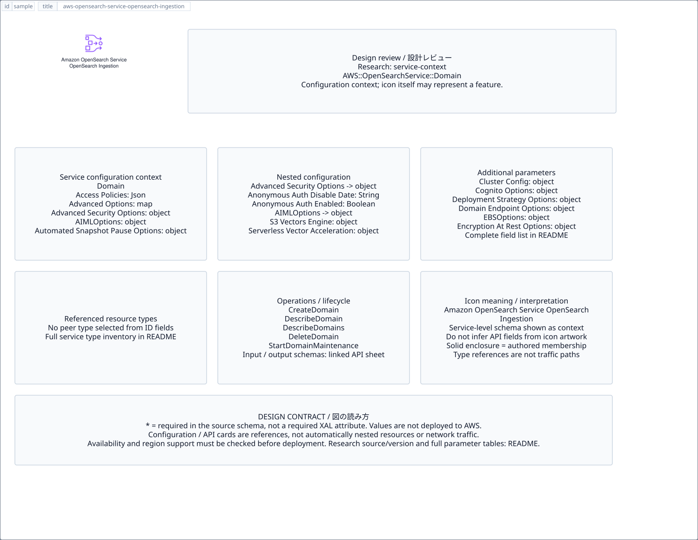

# `aws-opensearch-service-opensearch-ingestion` — Amazon OpenSearch Service OpenSearch Ingestion

[SVG preview](sample.svg) · [Editable XAL](sample.xal) · [Catalog](../README.md)



AWS resource icon. Use a label and explicit annotations to describe its role; scope is selected by the author.

- Kind: `resource`; category: Analytics.
- Diagram scope: `logical` (recommendation, not AWS deployment validation).
- Default catalog ID: 1450. Covered catalog IDs: 1450.
- Implementation: V1 and V2; fixed AWS icon with a wrapped label and explicit functional annotations.

## Parameters

`id` is a required, unique connection ID, not a catalog number. `label`/`title`/`name` override the label; an empty label hides it. `size` > 0 defaults to 48 px. `label-width` > 0 defaults to 160 px (default box width, at least icon size + 12 px). Explicit `width`/`height` must contain the icon and label. `visible="false"` hides it. Children and icon overrides are not supported; use a group for containment.

`detail` adds a free-form diagram annotation. `show-details="false"` hides annotation text. Only supplied values are shown; none are sent to AWS. Service/resource annotations appear on separate wrapped lines.

| Parameter | Type | Meaning | Example |
|---|---|---|---|
| `input` | text | Input data annotation | `Application events` |
| `output` | text | Output data annotation | `Insights` |

## Review notes

The catalog provides a baseline for per-component development, not a simulation of the AWS control plane. This component's current functional parameters are the ones listed above. Additional service-specific visual behavior can be developed here without replacing catalog IDs in diagrams. Edit `sample.xal`, then run:

```sh
npm run generate:aws-samples -- --render --tag=aws-opensearch-service-opensearch-ingestion
```

<!-- aws-functional-research:start -->
## 機能調査・構成デザイン（2026-09-06）

分類: `service-context`。サービス文脈: [`aws-opensearch-service`](../aws-opensearch-service/README.md)。

サンプルはアイコンと、設定・内包構造・関連リソース・操作を分離したレビューシートです。設定カードは編集可能な `rectangle`、グループは既存の専用タグで実装しています。カードのフィールド名を新しい XAL 属性として受理するわけではありません。専用タグが受理する属性は上の Parameters 表を参照してください。

実線の通信と、設定の参照・同じサービスに属する型一覧を区別します。スキーマの必須項目は AWS 側の仕様であり、図の必須入力ではありません。記載の構成モデル/API は取り込んだ公式資料の範囲であり、全リージョン・全機能の完全性や稼働可否を保証しません。

**重要:** このアイコンに対応する独立した構成リソースを断定せず、所属サービスの構成モデルを参考表示しています。アイコン名や絵柄から属性・親子関係・通信を推測しません。

### 構成モデル: `AWS::OpenSearchService::Domain`

[公式リファレンス](https://docs.aws.amazon.com/AWSCloudFormation/latest/UserGuide/aws-resource-opensearchservice-domain.html)。全 25 プロパティを型付きで列挙します（表示カードには主要項目のみ）。

| Field | Type | Required in AWS schema |
|---|---|---|
| [AccessPolicies](https://docs.aws.amazon.com/AWSCloudFormation/latest/UserGuide/aws-resource-opensearchservice-domain.html#cfn-opensearchservice-domain-accesspolicies) | `Json` | no |
| [AdvancedOptions](https://docs.aws.amazon.com/AWSCloudFormation/latest/UserGuide/aws-resource-opensearchservice-domain.html#cfn-opensearchservice-domain-advancedoptions) | `Map<String>` | no |
| [AdvancedSecurityOptions](https://docs.aws.amazon.com/AWSCloudFormation/latest/UserGuide/aws-resource-opensearchservice-domain.html#cfn-opensearchservice-domain-advancedsecurityoptions) | `AdvancedSecurityOptionsInput` | no |
| [AIMLOptions](https://docs.aws.amazon.com/AWSCloudFormation/latest/UserGuide/aws-resource-opensearchservice-domain.html#cfn-opensearchservice-domain-aimloptions) | `AIMLOptions` | no |
| [AutomatedSnapshotPauseOptions](https://docs.aws.amazon.com/AWSCloudFormation/latest/UserGuide/aws-resource-opensearchservice-domain.html#cfn-opensearchservice-domain-automatedsnapshotpauseoptions) | `AutomatedSnapshotPauseOptions` | no |
| [ClusterConfig](https://docs.aws.amazon.com/AWSCloudFormation/latest/UserGuide/aws-resource-opensearchservice-domain.html#cfn-opensearchservice-domain-clusterconfig) | `ClusterConfig` | no |
| [CognitoOptions](https://docs.aws.amazon.com/AWSCloudFormation/latest/UserGuide/aws-resource-opensearchservice-domain.html#cfn-opensearchservice-domain-cognitooptions) | `CognitoOptions` | no |
| [DeploymentStrategyOptions](https://docs.aws.amazon.com/AWSCloudFormation/latest/UserGuide/aws-resource-opensearchservice-domain.html#cfn-opensearchservice-domain-deploymentstrategyoptions) | `DeploymentStrategyOptions` | no |
| [DomainEndpointOptions](https://docs.aws.amazon.com/AWSCloudFormation/latest/UserGuide/aws-resource-opensearchservice-domain.html#cfn-opensearchservice-domain-domainendpointoptions) | `DomainEndpointOptions` | no |
| [DomainName](https://docs.aws.amazon.com/AWSCloudFormation/latest/UserGuide/aws-resource-opensearchservice-domain.html#cfn-opensearchservice-domain-domainname) | `String` | no |
| [EBSOptions](https://docs.aws.amazon.com/AWSCloudFormation/latest/UserGuide/aws-resource-opensearchservice-domain.html#cfn-opensearchservice-domain-ebsoptions) | `EBSOptions` | no |
| [EncryptionAtRestOptions](https://docs.aws.amazon.com/AWSCloudFormation/latest/UserGuide/aws-resource-opensearchservice-domain.html#cfn-opensearchservice-domain-encryptionatrestoptions) | `EncryptionAtRestOptions` | no |
| [EngineMode](https://docs.aws.amazon.com/AWSCloudFormation/latest/UserGuide/aws-resource-opensearchservice-domain.html#cfn-opensearchservice-domain-enginemode) | `String` | no |
| [EngineVersion](https://docs.aws.amazon.com/AWSCloudFormation/latest/UserGuide/aws-resource-opensearchservice-domain.html#cfn-opensearchservice-domain-engineversion) | `String` | no |
| [IdentityCenterOptions](https://docs.aws.amazon.com/AWSCloudFormation/latest/UserGuide/aws-resource-opensearchservice-domain.html#cfn-opensearchservice-domain-identitycenteroptions) | `IdentityCenterOptions` | no |
| [IPAddressType](https://docs.aws.amazon.com/AWSCloudFormation/latest/UserGuide/aws-resource-opensearchservice-domain.html#cfn-opensearchservice-domain-ipaddresstype) | `String` | no |
| [LogPublishingOptions](https://docs.aws.amazon.com/AWSCloudFormation/latest/UserGuide/aws-resource-opensearchservice-domain.html#cfn-opensearchservice-domain-logpublishingoptions) | `Map<LogPublishingOption>` | no |
| [NodeToNodeEncryptionOptions](https://docs.aws.amazon.com/AWSCloudFormation/latest/UserGuide/aws-resource-opensearchservice-domain.html#cfn-opensearchservice-domain-nodetonodeencryptionoptions) | `NodeToNodeEncryptionOptions` | no |
| [OffPeakWindowOptions](https://docs.aws.amazon.com/AWSCloudFormation/latest/UserGuide/aws-resource-opensearchservice-domain.html#cfn-opensearchservice-domain-offpeakwindowoptions) | `OffPeakWindowOptions` | no |
| [SkipShardMigrationWait](https://docs.aws.amazon.com/AWSCloudFormation/latest/UserGuide/aws-resource-opensearchservice-domain.html#cfn-opensearchservice-domain-skipshardmigrationwait) | `Boolean` | no |
| [SnapshotOptions](https://docs.aws.amazon.com/AWSCloudFormation/latest/UserGuide/aws-resource-opensearchservice-domain.html#cfn-opensearchservice-domain-snapshotoptions) | `SnapshotOptions` | no |
| [SoftwareUpdateOptions](https://docs.aws.amazon.com/AWSCloudFormation/latest/UserGuide/aws-resource-opensearchservice-domain.html#cfn-opensearchservice-domain-softwareupdateoptions) | `SoftwareUpdateOptions` | no |
| [Tags](https://docs.aws.amazon.com/AWSCloudFormation/latest/UserGuide/aws-resource-opensearchservice-domain.html#cfn-opensearchservice-domain-tags) | `List<Tag>` | no |
| [UseCase](https://docs.aws.amazon.com/AWSCloudFormation/latest/UserGuide/aws-resource-opensearchservice-domain.html#cfn-opensearchservice-domain-usecase) | `String` | no |
| [VPCOptions](https://docs.aws.amazon.com/AWSCloudFormation/latest/UserGuide/aws-resource-opensearchservice-domain.html#cfn-opensearchservice-domain-vpcoptions) | `VPCOptions` | no |

#### AdvancedSecurityOptions → `AWS::OpenSearchService::Domain.AdvancedSecurityOptionsInput`

| Field | Type | Required in AWS schema |
|---|---|---|
| [AnonymousAuthDisableDate](https://docs.aws.amazon.com/AWSCloudFormation/latest/UserGuide/aws-properties-opensearchservice-domain-advancedsecurityoptionsinput.html#cfn-opensearchservice-domain-advancedsecurityoptionsinput-anonymousauthdisabledate) | `String` | no |
| [AnonymousAuthEnabled](https://docs.aws.amazon.com/AWSCloudFormation/latest/UserGuide/aws-properties-opensearchservice-domain-advancedsecurityoptionsinput.html#cfn-opensearchservice-domain-advancedsecurityoptionsinput-anonymousauthenabled) | `Boolean` | no |
| [Enabled](https://docs.aws.amazon.com/AWSCloudFormation/latest/UserGuide/aws-properties-opensearchservice-domain-advancedsecurityoptionsinput.html#cfn-opensearchservice-domain-advancedsecurityoptionsinput-enabled) | `Boolean` | no |
| [IAMFederationOptions](https://docs.aws.amazon.com/AWSCloudFormation/latest/UserGuide/aws-properties-opensearchservice-domain-advancedsecurityoptionsinput.html#cfn-opensearchservice-domain-advancedsecurityoptionsinput-iamfederationoptions) | `IAMFederationOptions` | no |
| [InternalUserDatabaseEnabled](https://docs.aws.amazon.com/AWSCloudFormation/latest/UserGuide/aws-properties-opensearchservice-domain-advancedsecurityoptionsinput.html#cfn-opensearchservice-domain-advancedsecurityoptionsinput-internaluserdatabaseenabled) | `Boolean` | no |
| [JWTOptions](https://docs.aws.amazon.com/AWSCloudFormation/latest/UserGuide/aws-properties-opensearchservice-domain-advancedsecurityoptionsinput.html#cfn-opensearchservice-domain-advancedsecurityoptionsinput-jwtoptions) | `JWTOptions` | no |
| [MasterUserOptions](https://docs.aws.amazon.com/AWSCloudFormation/latest/UserGuide/aws-properties-opensearchservice-domain-advancedsecurityoptionsinput.html#cfn-opensearchservice-domain-advancedsecurityoptionsinput-masteruseroptions) | `MasterUserOptions` | no |
| [SAMLOptions](https://docs.aws.amazon.com/AWSCloudFormation/latest/UserGuide/aws-properties-opensearchservice-domain-advancedsecurityoptionsinput.html#cfn-opensearchservice-domain-advancedsecurityoptionsinput-samloptions) | `SAMLOptions` | no |

#### AIMLOptions → `AWS::OpenSearchService::Domain.AIMLOptions`

| Field | Type | Required in AWS schema |
|---|---|---|
| [S3VectorsEngine](https://docs.aws.amazon.com/AWSCloudFormation/latest/UserGuide/aws-properties-opensearchservice-domain-aimloptions.html#cfn-opensearchservice-domain-aimloptions-s3vectorsengine) | `S3VectorsEngine` | no |
| [ServerlessVectorAcceleration](https://docs.aws.amazon.com/AWSCloudFormation/latest/UserGuide/aws-properties-opensearchservice-domain-aimloptions.html#cfn-opensearchservice-domain-aimloptions-serverlessvectoracceleration) | `ServerlessVectorAcceleration` | no |

#### AutomatedSnapshotPauseOptions → `AWS::OpenSearchService::Domain.AutomatedSnapshotPauseOptions`

| Field | Type | Required in AWS schema |
|---|---|---|
| [Enabled](https://docs.aws.amazon.com/AWSCloudFormation/latest/UserGuide/aws-properties-opensearchservice-domain-automatedsnapshotpauseoptions.html#cfn-opensearchservice-domain-automatedsnapshotpauseoptions-enabled) | `Boolean` | yes |
| [EndTime](https://docs.aws.amazon.com/AWSCloudFormation/latest/UserGuide/aws-properties-opensearchservice-domain-automatedsnapshotpauseoptions.html#cfn-opensearchservice-domain-automatedsnapshotpauseoptions-endtime) | `String` | no |
| [StartTime](https://docs.aws.amazon.com/AWSCloudFormation/latest/UserGuide/aws-properties-opensearchservice-domain-automatedsnapshotpauseoptions.html#cfn-opensearchservice-domain-automatedsnapshotpauseoptions-starttime) | `String` | no |

#### ClusterConfig → `AWS::OpenSearchService::Domain.ClusterConfig`

| Field | Type | Required in AWS schema |
|---|---|---|
| [ColdStorageOptions](https://docs.aws.amazon.com/AWSCloudFormation/latest/UserGuide/aws-properties-opensearchservice-domain-clusterconfig.html#cfn-opensearchservice-domain-clusterconfig-coldstorageoptions) | `ColdStorageOptions` | no |
| [DedicatedMasterCount](https://docs.aws.amazon.com/AWSCloudFormation/latest/UserGuide/aws-properties-opensearchservice-domain-clusterconfig.html#cfn-opensearchservice-domain-clusterconfig-dedicatedmastercount) | `Integer` | no |
| [DedicatedMasterEnabled](https://docs.aws.amazon.com/AWSCloudFormation/latest/UserGuide/aws-properties-opensearchservice-domain-clusterconfig.html#cfn-opensearchservice-domain-clusterconfig-dedicatedmasterenabled) | `Boolean` | no |
| [DedicatedMasterType](https://docs.aws.amazon.com/AWSCloudFormation/latest/UserGuide/aws-properties-opensearchservice-domain-clusterconfig.html#cfn-opensearchservice-domain-clusterconfig-dedicatedmastertype) | `String` | no |
| [InstanceCount](https://docs.aws.amazon.com/AWSCloudFormation/latest/UserGuide/aws-properties-opensearchservice-domain-clusterconfig.html#cfn-opensearchservice-domain-clusterconfig-instancecount) | `Integer` | no |
| [InstanceType](https://docs.aws.amazon.com/AWSCloudFormation/latest/UserGuide/aws-properties-opensearchservice-domain-clusterconfig.html#cfn-opensearchservice-domain-clusterconfig-instancetype) | `String` | no |
| [MultiAZWithStandbyEnabled](https://docs.aws.amazon.com/AWSCloudFormation/latest/UserGuide/aws-properties-opensearchservice-domain-clusterconfig.html#cfn-opensearchservice-domain-clusterconfig-multiazwithstandbyenabled) | `Boolean` | no |
| [NodeOptions](https://docs.aws.amazon.com/AWSCloudFormation/latest/UserGuide/aws-properties-opensearchservice-domain-clusterconfig.html#cfn-opensearchservice-domain-clusterconfig-nodeoptions) | `List<NodeOption>` | no |
| [WarmCount](https://docs.aws.amazon.com/AWSCloudFormation/latest/UserGuide/aws-properties-opensearchservice-domain-clusterconfig.html#cfn-opensearchservice-domain-clusterconfig-warmcount) | `Integer` | no |
| [WarmEnabled](https://docs.aws.amazon.com/AWSCloudFormation/latest/UserGuide/aws-properties-opensearchservice-domain-clusterconfig.html#cfn-opensearchservice-domain-clusterconfig-warmenabled) | `Boolean` | no |
| [WarmType](https://docs.aws.amazon.com/AWSCloudFormation/latest/UserGuide/aws-properties-opensearchservice-domain-clusterconfig.html#cfn-opensearchservice-domain-clusterconfig-warmtype) | `String` | no |
| [ZoneAwarenessConfig](https://docs.aws.amazon.com/AWSCloudFormation/latest/UserGuide/aws-properties-opensearchservice-domain-clusterconfig.html#cfn-opensearchservice-domain-clusterconfig-zoneawarenessconfig) | `ZoneAwarenessConfig` | no |
| [ZoneAwarenessEnabled](https://docs.aws.amazon.com/AWSCloudFormation/latest/UserGuide/aws-properties-opensearchservice-domain-clusterconfig.html#cfn-opensearchservice-domain-clusterconfig-zoneawarenessenabled) | `Boolean` | no |

#### CognitoOptions → `AWS::OpenSearchService::Domain.CognitoOptions`

| Field | Type | Required in AWS schema |
|---|---|---|
| [Enabled](https://docs.aws.amazon.com/AWSCloudFormation/latest/UserGuide/aws-properties-opensearchservice-domain-cognitooptions.html#cfn-opensearchservice-domain-cognitooptions-enabled) | `Boolean` | no |
| [IdentityPoolId](https://docs.aws.amazon.com/AWSCloudFormation/latest/UserGuide/aws-properties-opensearchservice-domain-cognitooptions.html#cfn-opensearchservice-domain-cognitooptions-identitypoolid) | `String` | no |
| [RoleArn](https://docs.aws.amazon.com/AWSCloudFormation/latest/UserGuide/aws-properties-opensearchservice-domain-cognitooptions.html#cfn-opensearchservice-domain-cognitooptions-rolearn) | `String` | no |
| [UserPoolId](https://docs.aws.amazon.com/AWSCloudFormation/latest/UserGuide/aws-properties-opensearchservice-domain-cognitooptions.html#cfn-opensearchservice-domain-cognitooptions-userpoolid) | `String` | no |

#### DeploymentStrategyOptions → `AWS::OpenSearchService::Domain.DeploymentStrategyOptions`

| Field | Type | Required in AWS schema |
|---|---|---|
| [DeploymentStrategy](https://docs.aws.amazon.com/AWSCloudFormation/latest/UserGuide/aws-properties-opensearchservice-domain-deploymentstrategyoptions.html#cfn-opensearchservice-domain-deploymentstrategyoptions-deploymentstrategy) | `String` | no |

#### DomainEndpointOptions → `AWS::OpenSearchService::Domain.DomainEndpointOptions`

| Field | Type | Required in AWS schema |
|---|---|---|
| [CustomEndpoint](https://docs.aws.amazon.com/AWSCloudFormation/latest/UserGuide/aws-properties-opensearchservice-domain-domainendpointoptions.html#cfn-opensearchservice-domain-domainendpointoptions-customendpoint) | `String` | no |
| [CustomEndpointCertificateArn](https://docs.aws.amazon.com/AWSCloudFormation/latest/UserGuide/aws-properties-opensearchservice-domain-domainendpointoptions.html#cfn-opensearchservice-domain-domainendpointoptions-customendpointcertificatearn) | `String` | no |
| [CustomEndpointEnabled](https://docs.aws.amazon.com/AWSCloudFormation/latest/UserGuide/aws-properties-opensearchservice-domain-domainendpointoptions.html#cfn-opensearchservice-domain-domainendpointoptions-customendpointenabled) | `Boolean` | no |
| [EnforceHTTPS](https://docs.aws.amazon.com/AWSCloudFormation/latest/UserGuide/aws-properties-opensearchservice-domain-domainendpointoptions.html#cfn-opensearchservice-domain-domainendpointoptions-enforcehttps) | `Boolean` | no |
| [TLSSecurityPolicy](https://docs.aws.amazon.com/AWSCloudFormation/latest/UserGuide/aws-properties-opensearchservice-domain-domainendpointoptions.html#cfn-opensearchservice-domain-domainendpointoptions-tlssecuritypolicy) | `String` | no |

#### EBSOptions → `AWS::OpenSearchService::Domain.EBSOptions`

| Field | Type | Required in AWS schema |
|---|---|---|
| [EBSEnabled](https://docs.aws.amazon.com/AWSCloudFormation/latest/UserGuide/aws-properties-opensearchservice-domain-ebsoptions.html#cfn-opensearchservice-domain-ebsoptions-ebsenabled) | `Boolean` | no |
| [Iops](https://docs.aws.amazon.com/AWSCloudFormation/latest/UserGuide/aws-properties-opensearchservice-domain-ebsoptions.html#cfn-opensearchservice-domain-ebsoptions-iops) | `Integer` | no |
| [Throughput](https://docs.aws.amazon.com/AWSCloudFormation/latest/UserGuide/aws-properties-opensearchservice-domain-ebsoptions.html#cfn-opensearchservice-domain-ebsoptions-throughput) | `Integer` | no |
| [VolumeSize](https://docs.aws.amazon.com/AWSCloudFormation/latest/UserGuide/aws-properties-opensearchservice-domain-ebsoptions.html#cfn-opensearchservice-domain-ebsoptions-volumesize) | `Integer` | no |
| [VolumeType](https://docs.aws.amazon.com/AWSCloudFormation/latest/UserGuide/aws-properties-opensearchservice-domain-ebsoptions.html#cfn-opensearchservice-domain-ebsoptions-volumetype) | `String` | no |

#### EncryptionAtRestOptions → `AWS::OpenSearchService::Domain.EncryptionAtRestOptions`

| Field | Type | Required in AWS schema |
|---|---|---|
| [Enabled](https://docs.aws.amazon.com/AWSCloudFormation/latest/UserGuide/aws-properties-opensearchservice-domain-encryptionatrestoptions.html#cfn-opensearchservice-domain-encryptionatrestoptions-enabled) | `Boolean` | no |
| [KmsKeyId](https://docs.aws.amazon.com/AWSCloudFormation/latest/UserGuide/aws-properties-opensearchservice-domain-encryptionatrestoptions.html#cfn-opensearchservice-domain-encryptionatrestoptions-kmskeyid) | `String` | no |

#### IdentityCenterOptions → `AWS::OpenSearchService::Domain.IdentityCenterOptions`

| Field | Type | Required in AWS schema |
|---|---|---|
| [EnabledAPIAccess](https://docs.aws.amazon.com/AWSCloudFormation/latest/UserGuide/aws-properties-opensearchservice-domain-identitycenteroptions.html#cfn-opensearchservice-domain-identitycenteroptions-enabledapiaccess) | `Boolean` | no |
| [IdentityCenterApplicationARN](https://docs.aws.amazon.com/AWSCloudFormation/latest/UserGuide/aws-properties-opensearchservice-domain-identitycenteroptions.html#cfn-opensearchservice-domain-identitycenteroptions-identitycenterapplicationarn) | `String` | no |
| [IdentityCenterInstanceARN](https://docs.aws.amazon.com/AWSCloudFormation/latest/UserGuide/aws-properties-opensearchservice-domain-identitycenteroptions.html#cfn-opensearchservice-domain-identitycenteroptions-identitycenterinstancearn) | `String` | no |
| [IdentityStoreId](https://docs.aws.amazon.com/AWSCloudFormation/latest/UserGuide/aws-properties-opensearchservice-domain-identitycenteroptions.html#cfn-opensearchservice-domain-identitycenteroptions-identitystoreid) | `String` | no |
| [RolesKey](https://docs.aws.amazon.com/AWSCloudFormation/latest/UserGuide/aws-properties-opensearchservice-domain-identitycenteroptions.html#cfn-opensearchservice-domain-identitycenteroptions-roleskey) | `String` | no |
| [SubjectKey](https://docs.aws.amazon.com/AWSCloudFormation/latest/UserGuide/aws-properties-opensearchservice-domain-identitycenteroptions.html#cfn-opensearchservice-domain-identitycenteroptions-subjectkey) | `String` | no |

#### LogPublishingOptions → `AWS::OpenSearchService::Domain.LogPublishingOption`

| Field | Type | Required in AWS schema |
|---|---|---|
| [CloudWatchLogsLogGroupArn](https://docs.aws.amazon.com/AWSCloudFormation/latest/UserGuide/aws-properties-opensearchservice-domain-logpublishingoption.html#cfn-opensearchservice-domain-logpublishingoption-cloudwatchlogsloggrouparn) | `String` | no |
| [Enabled](https://docs.aws.amazon.com/AWSCloudFormation/latest/UserGuide/aws-properties-opensearchservice-domain-logpublishingoption.html#cfn-opensearchservice-domain-logpublishingoption-enabled) | `Boolean` | no |

#### NodeToNodeEncryptionOptions → `AWS::OpenSearchService::Domain.NodeToNodeEncryptionOptions`

| Field | Type | Required in AWS schema |
|---|---|---|
| [Enabled](https://docs.aws.amazon.com/AWSCloudFormation/latest/UserGuide/aws-properties-opensearchservice-domain-nodetonodeencryptionoptions.html#cfn-opensearchservice-domain-nodetonodeencryptionoptions-enabled) | `Boolean` | no |

#### OffPeakWindowOptions → `AWS::OpenSearchService::Domain.OffPeakWindowOptions`

| Field | Type | Required in AWS schema |
|---|---|---|
| [Enabled](https://docs.aws.amazon.com/AWSCloudFormation/latest/UserGuide/aws-properties-opensearchservice-domain-offpeakwindowoptions.html#cfn-opensearchservice-domain-offpeakwindowoptions-enabled) | `Boolean` | no |
| [OffPeakWindow](https://docs.aws.amazon.com/AWSCloudFormation/latest/UserGuide/aws-properties-opensearchservice-domain-offpeakwindowoptions.html#cfn-opensearchservice-domain-offpeakwindowoptions-offpeakwindow) | `OffPeakWindow` | no |

#### SnapshotOptions → `AWS::OpenSearchService::Domain.SnapshotOptions`

| Field | Type | Required in AWS schema |
|---|---|---|
| [AutomatedSnapshotStartHour](https://docs.aws.amazon.com/AWSCloudFormation/latest/UserGuide/aws-properties-opensearchservice-domain-snapshotoptions.html#cfn-opensearchservice-domain-snapshotoptions-automatedsnapshotstarthour) | `Integer` | no |

#### SoftwareUpdateOptions → `AWS::OpenSearchService::Domain.SoftwareUpdateOptions`

| Field | Type | Required in AWS schema |
|---|---|---|
| [AutoSoftwareUpdateEnabled](https://docs.aws.amazon.com/AWSCloudFormation/latest/UserGuide/aws-properties-opensearchservice-domain-softwareupdateoptions.html#cfn-opensearchservice-domain-softwareupdateoptions-autosoftwareupdateenabled) | `Boolean` | no |
| [UseLatestServiceSoftwareForBlueGreen](https://docs.aws.amazon.com/AWSCloudFormation/latest/UserGuide/aws-properties-opensearchservice-domain-softwareupdateoptions.html#cfn-opensearchservice-domain-softwareupdateoptions-uselatestservicesoftwareforbluegreen) | `Boolean` | no |

#### VPCOptions → `AWS::OpenSearchService::Domain.VPCOptions`

| Field | Type | Required in AWS schema |
|---|---|---|
| [EgressEnabled](https://docs.aws.amazon.com/AWSCloudFormation/latest/UserGuide/aws-properties-opensearchservice-domain-vpcoptions.html#cfn-opensearchservice-domain-vpcoptions-egressenabled) | `Boolean` | no |
| [SecurityGroupIds](https://docs.aws.amazon.com/AWSCloudFormation/latest/UserGuide/aws-properties-opensearchservice-domain-vpcoptions.html#cfn-opensearchservice-domain-vpcoptions-securitygroupids) | `List<String>` | no |
| [SubnetIds](https://docs.aws.amazon.com/AWSCloudFormation/latest/UserGuide/aws-properties-opensearchservice-domain-vpcoptions.html#cfn-opensearchservice-domain-vpcoptions-subnetids) | `List<String>` | no |

### 関連する構成リソース（13 型）

同じサービス文脈の型一覧です。すべてがこのアイコンの子リソースという意味ではありません。さらに深い入れ子は [公式スキーマのスナップショット](../research/cloudformation-models.json) に記録しています。

- [AWS::OpenSearchServerless::AccessPolicy](https://docs.aws.amazon.com/AWSCloudFormation/latest/UserGuide/aws-resource-opensearchserverless-accesspolicy.html)
- [AWS::OpenSearchServerless::Collection](https://docs.aws.amazon.com/AWSCloudFormation/latest/UserGuide/aws-resource-opensearchserverless-collection.html)
- [AWS::OpenSearchServerless::CollectionGroup](https://docs.aws.amazon.com/AWSCloudFormation/latest/UserGuide/aws-resource-opensearchserverless-collectiongroup.html)
- [AWS::OpenSearchServerless::CollectionIndex](https://docs.aws.amazon.com/AWSCloudFormation/latest/UserGuide/aws-resource-opensearchserverless-collectionindex.html)
- [AWS::OpenSearchServerless::Index](https://docs.aws.amazon.com/AWSCloudFormation/latest/UserGuide/aws-resource-opensearchserverless-index.html)
- [AWS::OpenSearchServerless::LifecyclePolicy](https://docs.aws.amazon.com/AWSCloudFormation/latest/UserGuide/aws-resource-opensearchserverless-lifecyclepolicy.html)
- [AWS::OpenSearchServerless::SecurityConfig](https://docs.aws.amazon.com/AWSCloudFormation/latest/UserGuide/aws-resource-opensearchserverless-securityconfig.html)
- [AWS::OpenSearchServerless::SecurityPolicy](https://docs.aws.amazon.com/AWSCloudFormation/latest/UserGuide/aws-resource-opensearchserverless-securitypolicy.html)
- [AWS::OpenSearchServerless::VpcEndpoint](https://docs.aws.amazon.com/AWSCloudFormation/latest/UserGuide/aws-resource-opensearchserverless-vpcendpoint.html)
- [AWS::OpenSearchService::Application](https://docs.aws.amazon.com/AWSCloudFormation/latest/UserGuide/aws-resource-opensearchservice-application.html)
- [AWS::OpenSearchService::Domain](https://docs.aws.amazon.com/AWSCloudFormation/latest/UserGuide/aws-resource-opensearchservice-domain.html)
- [AWS::OSIS::Pipeline](https://docs.aws.amazon.com/AWSCloudFormation/latest/UserGuide/aws-resource-osis-pipeline.html)
- [AWS::OSIS::PipelineBlueprint](https://docs.aws.amazon.com/AWSCloudFormation/latest/UserGuide/aws-resource-osis-pipelineblueprint.html)

### API の操作・パラメータ

- [Amazon OpenSearch Service: 96 操作の入力・出力一覧](../research/api/opensearch.md)（API version 2021-01-01）
- [OpenSearch Service Serverless: 46 操作の入力・出力一覧](../research/api/opensearchserverless.md)（API version 2021-11-01）
- [Amazon OpenSearch Ingestion: 22 操作の入力・出力一覧](../research/api/osis.md)（API version 2022-01-01）

### 出典・調査範囲

- [公式資料 1](https://docs.aws.amazon.com/AWSCloudFormation/latest/UserGuide/aws-resource-opensearchservice-domain.html)
- [公式資料 2](https://github.com/boto/botocore/blob/develop/botocore/data/opensearch/2021-01-01/service-2.json)
- [公式資料 3](https://github.com/boto/botocore/blob/develop/botocore/data/opensearchserverless/2021-11-01/service-2.json)
- [公式資料 4](https://github.com/boto/botocore/blob/develop/botocore/data/osis/2022-01-01/service-2.json)

CloudFormation 仕様 263.0.0、AWS SDK 431 サービスモデルをオフラインで参照。取得日・元データの SHA-256 は [調査マニフェスト](../research/README.md) を参照。API モデル名・フィールド名は仕様から抽出し、説明本文を転載していません。利用可能性は全サービス一律には確認できないため、提供終了の確認がないものも「現在利用可能」と断定していません。

### 次の部品レビュー

- 本アイコンが独立したリソースか、機能・状態・デバイスの記号かを確認する。
- 詳細カードのうち専用の子タグ・参照属性として実装する範囲を選ぶ。
- 通信、制御、認証、監視の関係を分け、必要な接続点・配置制約を確認する。
- 編集後は `npm run generate:aws-samples -- --render --tag=aws-opensearch-service-opensearch-ingestion`。通常の再描画は XAL/README を上書きしない。
<!-- aws-functional-research:end -->
