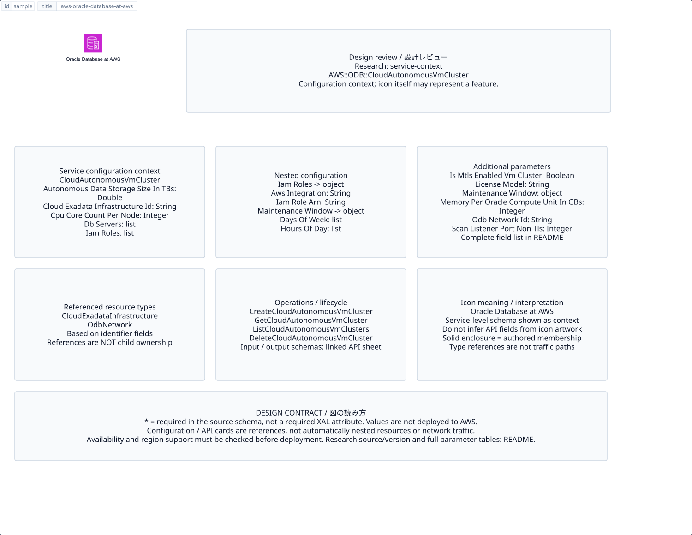

# `aws-oracle-database-at-aws` — Oracle Database at AWS

[SVG preview](sample.svg) · [Editable XAL](sample.xal) · [Catalog](../README.md)



AWS service icon. Use a label and explicit annotations to describe its role; scope is selected by the author.

- Kind: `service`; category: Database.
- Diagram scope: `service` (recommendation, not AWS deployment validation).
- Default catalog ID: 152. Covered catalog IDs: 119, 130, 141, 152.
- Implementation: V1 and V2; fixed AWS icon with a wrapped label and explicit functional annotations.

## Parameters

`id` is a required, unique connection ID, not a catalog number. `label`/`title`/`name` override the label; an empty label hides it. `size` > 0 defaults to 48 px. `label-width` > 0 defaults to 160 px (default box width, at least icon size + 12 px). Explicit `width`/`height` must contain the icon and label. `visible="false"` hides it. Children and icon overrides are not supported; use a group for containment.

`detail` adds a free-form diagram annotation. `show-details="false"` hides annotation text. Only supplied values are shown; none are sent to AWS. Service/resource annotations appear on separate wrapped lines.

| Parameter | Type | Meaning | Example |
|---|---|---|---|
| `data-model` | text | Data model annotation | `Application records` |

## Review notes

The catalog provides a baseline for per-component development, not a simulation of the AWS control plane. This component's current functional parameters are the ones listed above. Additional service-specific visual behavior can be developed here without replacing catalog IDs in diagrams. Edit `sample.xal`, then run:

```sh
npm run generate:aws-samples -- --render --tag=aws-oracle-database-at-aws
```

<!-- aws-functional-research:start -->
## 機能調査・構成デザイン（2026-09-06）

分類: `service-context`。サービス文脈: [`aws-oracle-database-at-aws`](../aws-oracle-database-at-aws/README.md)。

サンプルはアイコンと、設定・内包構造・関連リソース・操作を分離したレビューシートです。設定カードは編集可能な `rectangle`、グループは既存の専用タグで実装しています。カードのフィールド名を新しい XAL 属性として受理するわけではありません。専用タグが受理する属性は上の Parameters 表を参照してください。

実線の通信と、設定の参照・同じサービスに属する型一覧を区別します。スキーマの必須項目は AWS 側の仕様であり、図の必須入力ではありません。記載の構成モデル/API は取り込んだ公式資料の範囲であり、全リージョン・全機能の完全性や稼働可否を保証しません。

**重要:** このアイコンに対応する独立した構成リソースを断定せず、所属サービスの構成モデルを参考表示しています。アイコン名や絵柄から属性・親子関係・通信を推測しません。

### 構成モデル: `AWS::ODB::CloudAutonomousVmCluster`

[公式リファレンス](https://docs.aws.amazon.com/AWSCloudFormation/latest/UserGuide/aws-resource-odb-cloudautonomousvmcluster.html)。全 17 プロパティを型付きで列挙します（表示カードには主要項目のみ）。

| Field | Type | Required in AWS schema |
|---|---|---|
| [AutonomousDataStorageSizeInTBs](https://docs.aws.amazon.com/AWSCloudFormation/latest/UserGuide/aws-resource-odb-cloudautonomousvmcluster.html#cfn-odb-cloudautonomousvmcluster-autonomousdatastoragesizeintbs) | `Double` | no |
| [CloudExadataInfrastructureId](https://docs.aws.amazon.com/AWSCloudFormation/latest/UserGuide/aws-resource-odb-cloudautonomousvmcluster.html#cfn-odb-cloudautonomousvmcluster-cloudexadatainfrastructureid) | `String` | no |
| [CpuCoreCountPerNode](https://docs.aws.amazon.com/AWSCloudFormation/latest/UserGuide/aws-resource-odb-cloudautonomousvmcluster.html#cfn-odb-cloudautonomousvmcluster-cpucorecountpernode) | `Integer` | no |
| [DbServers](https://docs.aws.amazon.com/AWSCloudFormation/latest/UserGuide/aws-resource-odb-cloudautonomousvmcluster.html#cfn-odb-cloudautonomousvmcluster-dbservers) | `List<String>` | no |
| [Description](https://docs.aws.amazon.com/AWSCloudFormation/latest/UserGuide/aws-resource-odb-cloudautonomousvmcluster.html#cfn-odb-cloudautonomousvmcluster-description) | `String` | no |
| [DisplayName](https://docs.aws.amazon.com/AWSCloudFormation/latest/UserGuide/aws-resource-odb-cloudautonomousvmcluster.html#cfn-odb-cloudautonomousvmcluster-displayname) | `String` | no |
| [IamRoles](https://docs.aws.amazon.com/AWSCloudFormation/latest/UserGuide/aws-resource-odb-cloudautonomousvmcluster.html#cfn-odb-cloudautonomousvmcluster-iamroles) | `List<IamRole>` | no |
| [IsMtlsEnabledVmCluster](https://docs.aws.amazon.com/AWSCloudFormation/latest/UserGuide/aws-resource-odb-cloudautonomousvmcluster.html#cfn-odb-cloudautonomousvmcluster-ismtlsenabledvmcluster) | `Boolean` | no |
| [LicenseModel](https://docs.aws.amazon.com/AWSCloudFormation/latest/UserGuide/aws-resource-odb-cloudautonomousvmcluster.html#cfn-odb-cloudautonomousvmcluster-licensemodel) | `String` | no |
| [MaintenanceWindow](https://docs.aws.amazon.com/AWSCloudFormation/latest/UserGuide/aws-resource-odb-cloudautonomousvmcluster.html#cfn-odb-cloudautonomousvmcluster-maintenancewindow) | `MaintenanceWindow` | no |
| [MemoryPerOracleComputeUnitInGBs](https://docs.aws.amazon.com/AWSCloudFormation/latest/UserGuide/aws-resource-odb-cloudautonomousvmcluster.html#cfn-odb-cloudautonomousvmcluster-memoryperoraclecomputeunitingbs) | `Integer` | no |
| [OdbNetworkId](https://docs.aws.amazon.com/AWSCloudFormation/latest/UserGuide/aws-resource-odb-cloudautonomousvmcluster.html#cfn-odb-cloudautonomousvmcluster-odbnetworkid) | `String` | no |
| [ScanListenerPortNonTls](https://docs.aws.amazon.com/AWSCloudFormation/latest/UserGuide/aws-resource-odb-cloudautonomousvmcluster.html#cfn-odb-cloudautonomousvmcluster-scanlistenerportnontls) | `Integer` | no |
| [ScanListenerPortTls](https://docs.aws.amazon.com/AWSCloudFormation/latest/UserGuide/aws-resource-odb-cloudautonomousvmcluster.html#cfn-odb-cloudautonomousvmcluster-scanlistenerporttls) | `Integer` | no |
| [Tags](https://docs.aws.amazon.com/AWSCloudFormation/latest/UserGuide/aws-resource-odb-cloudautonomousvmcluster.html#cfn-odb-cloudautonomousvmcluster-tags) | `List<Tag>` | no |
| [TimeZone](https://docs.aws.amazon.com/AWSCloudFormation/latest/UserGuide/aws-resource-odb-cloudautonomousvmcluster.html#cfn-odb-cloudautonomousvmcluster-timezone) | `String` | no |
| [TotalContainerDatabases](https://docs.aws.amazon.com/AWSCloudFormation/latest/UserGuide/aws-resource-odb-cloudautonomousvmcluster.html#cfn-odb-cloudautonomousvmcluster-totalcontainerdatabases) | `Integer` | no |

#### IamRoles → `AWS::ODB::CloudAutonomousVmCluster.IamRole`

| Field | Type | Required in AWS schema |
|---|---|---|
| [AwsIntegration](https://docs.aws.amazon.com/AWSCloudFormation/latest/UserGuide/aws-properties-odb-cloudautonomousvmcluster-iamrole.html#cfn-odb-cloudautonomousvmcluster-iamrole-awsintegration) | `String` | no |
| [IamRoleArn](https://docs.aws.amazon.com/AWSCloudFormation/latest/UserGuide/aws-properties-odb-cloudautonomousvmcluster-iamrole.html#cfn-odb-cloudautonomousvmcluster-iamrole-iamrolearn) | `String` | no |
| [Status](https://docs.aws.amazon.com/AWSCloudFormation/latest/UserGuide/aws-properties-odb-cloudautonomousvmcluster-iamrole.html#cfn-odb-cloudautonomousvmcluster-iamrole-status) | `String` | no |

#### MaintenanceWindow → `AWS::ODB::CloudAutonomousVmCluster.MaintenanceWindow`

| Field | Type | Required in AWS schema |
|---|---|---|
| [DaysOfWeek](https://docs.aws.amazon.com/AWSCloudFormation/latest/UserGuide/aws-properties-odb-cloudautonomousvmcluster-maintenancewindow.html#cfn-odb-cloudautonomousvmcluster-maintenancewindow-daysofweek) | `List<String>` | no |
| [HoursOfDay](https://docs.aws.amazon.com/AWSCloudFormation/latest/UserGuide/aws-properties-odb-cloudautonomousvmcluster-maintenancewindow.html#cfn-odb-cloudautonomousvmcluster-maintenancewindow-hoursofday) | `List<Integer>` | no |
| [LeadTimeInWeeks](https://docs.aws.amazon.com/AWSCloudFormation/latest/UserGuide/aws-properties-odb-cloudautonomousvmcluster-maintenancewindow.html#cfn-odb-cloudautonomousvmcluster-maintenancewindow-leadtimeinweeks) | `Integer` | no |
| [Months](https://docs.aws.amazon.com/AWSCloudFormation/latest/UserGuide/aws-properties-odb-cloudautonomousvmcluster-maintenancewindow.html#cfn-odb-cloudautonomousvmcluster-maintenancewindow-months) | `List<String>` | no |
| [Preference](https://docs.aws.amazon.com/AWSCloudFormation/latest/UserGuide/aws-properties-odb-cloudautonomousvmcluster-maintenancewindow.html#cfn-odb-cloudautonomousvmcluster-maintenancewindow-preference) | `String` | no |
| [WeeksOfMonth](https://docs.aws.amazon.com/AWSCloudFormation/latest/UserGuide/aws-properties-odb-cloudautonomousvmcluster-maintenancewindow.html#cfn-odb-cloudautonomousvmcluster-maintenancewindow-weeksofmonth) | `List<Integer>` | no |

### 関連する構成リソース（5 型）

同じサービス文脈の型一覧です。すべてがこのアイコンの子リソースという意味ではありません。さらに深い入れ子は [公式スキーマのスナップショット](../research/cloudformation-models.json) に記録しています。

- [AWS::ODB::CloudAutonomousVmCluster](https://docs.aws.amazon.com/AWSCloudFormation/latest/UserGuide/aws-resource-odb-cloudautonomousvmcluster.html)
- [AWS::ODB::CloudExadataInfrastructure](https://docs.aws.amazon.com/AWSCloudFormation/latest/UserGuide/aws-resource-odb-cloudexadatainfrastructure.html)
- [AWS::ODB::CloudVmCluster](https://docs.aws.amazon.com/AWSCloudFormation/latest/UserGuide/aws-resource-odb-cloudvmcluster.html)
- [AWS::ODB::OdbNetwork](https://docs.aws.amazon.com/AWSCloudFormation/latest/UserGuide/aws-resource-odb-odbnetwork.html)
- [AWS::ODB::OdbPeeringConnection](https://docs.aws.amazon.com/AWSCloudFormation/latest/UserGuide/aws-resource-odb-odbpeeringconnection.html)

### API の操作・パラメータ

- [odb: 80 操作の入力・出力一覧](../research/api/odb.md)（API version 2024-08-20）

### 出典・調査範囲

- [公式資料 1](https://docs.aws.amazon.com/AWSCloudFormation/latest/UserGuide/aws-resource-odb-cloudautonomousvmcluster.html)
- [公式資料 2](https://github.com/boto/botocore/blob/develop/botocore/data/odb/2024-08-20/service-2.json)

CloudFormation 仕様 263.0.0、AWS SDK 431 サービスモデルをオフラインで参照。取得日・元データの SHA-256 は [調査マニフェスト](../research/README.md) を参照。API モデル名・フィールド名は仕様から抽出し、説明本文を転載していません。利用可能性は全サービス一律には確認できないため、提供終了の確認がないものも「現在利用可能」と断定していません。

### 次の部品レビュー

- 本アイコンが独立したリソースか、機能・状態・デバイスの記号かを確認する。
- 詳細カードのうち専用の子タグ・参照属性として実装する範囲を選ぶ。
- 通信、制御、認証、監視の関係を分け、必要な接続点・配置制約を確認する。
- 編集後は `npm run generate:aws-samples -- --render --tag=aws-oracle-database-at-aws`。通常の再描画は XAL/README を上書きしない。
<!-- aws-functional-research:end -->
