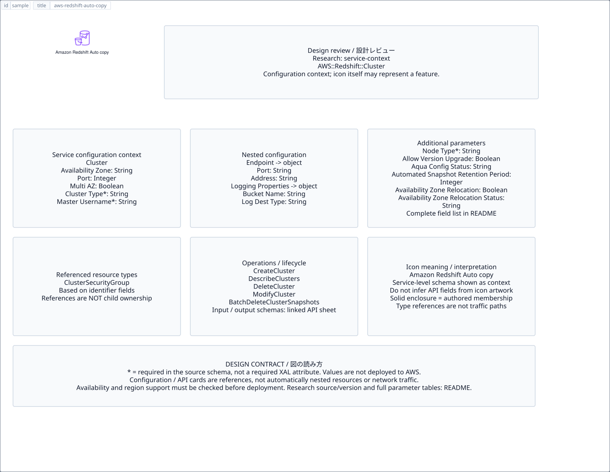

# `aws-redshift-auto-copy` — Amazon Redshift Auto copy

[SVG preview](sample.svg) · [Editable XAL](sample.xal) · [Catalog](../README.md)



AWS resource icon. Use a label and explicit annotations to describe its role; scope is selected by the author.

- Kind: `resource`; category: Analytics.
- Diagram scope: `logical` (recommendation, not AWS deployment validation).
- Default catalog ID: 1454. Covered catalog IDs: 1454.
- Implementation: V1 and V2; fixed AWS icon with a wrapped label and explicit functional annotations.

## Parameters

`id` is a required, unique connection ID, not a catalog number. `label`/`title`/`name` override the label; an empty label hides it. `size` > 0 defaults to 48 px. `label-width` > 0 defaults to 160 px (default box width, at least icon size + 12 px). Explicit `width`/`height` must contain the icon and label. `visible="false"` hides it. Children and icon overrides are not supported; use a group for containment.

`detail` adds a free-form diagram annotation. `show-details="false"` hides annotation text. Only supplied values are shown; none are sent to AWS. Service/resource annotations appear on separate wrapped lines.

| Parameter | Type | Meaning | Example |
|---|---|---|---|
| `input` | text | Input data annotation | `Application events` |
| `output` | text | Output data annotation | `Insights` |

## Review notes

The catalog provides a baseline for per-component development, not a simulation of the AWS control plane. This component's current functional parameters are the ones listed above. Additional service-specific visual behavior can be developed here without replacing catalog IDs in diagrams. Edit `sample.xal`, then run:

```sh
npm run generate:aws-samples -- --render --tag=aws-redshift-auto-copy
```

<!-- aws-functional-research:start -->
## 機能調査・構成デザイン（2026-09-06）

分類: `service-context`。サービス文脈: [`aws-redshift`](../aws-redshift/README.md)。

サンプルはアイコンと、設定・内包構造・関連リソース・操作を分離したレビューシートです。設定カードは編集可能な `rectangle`、グループは既存の専用タグで実装しています。カードのフィールド名を新しい XAL 属性として受理するわけではありません。専用タグが受理する属性は上の Parameters 表を参照してください。

実線の通信と、設定の参照・同じサービスに属する型一覧を区別します。スキーマの必須項目は AWS 側の仕様であり、図の必須入力ではありません。記載の構成モデル/API は取り込んだ公式資料の範囲であり、全リージョン・全機能の完全性や稼働可否を保証しません。

**重要:** このアイコンに対応する独立した構成リソースを断定せず、所属サービスの構成モデルを参考表示しています。アイコン名や絵柄から属性・親子関係・通信を推測しません。

### 構成モデル: `AWS::Redshift::Cluster`

[公式リファレンス](https://docs.aws.amazon.com/AWSCloudFormation/latest/UserGuide/aws-resource-redshift-cluster.html)。全 52 プロパティを型付きで列挙します（表示カードには主要項目のみ）。

| Field | Type | Required in AWS schema |
|---|---|---|
| [AllowVersionUpgrade](https://docs.aws.amazon.com/AWSCloudFormation/latest/UserGuide/aws-resource-redshift-cluster.html#cfn-redshift-cluster-allowversionupgrade) | `Boolean` | no |
| [AquaConfigurationStatus](https://docs.aws.amazon.com/AWSCloudFormation/latest/UserGuide/aws-resource-redshift-cluster.html#cfn-redshift-cluster-aquaconfigurationstatus) | `String` | no |
| [AutomatedSnapshotRetentionPeriod](https://docs.aws.amazon.com/AWSCloudFormation/latest/UserGuide/aws-resource-redshift-cluster.html#cfn-redshift-cluster-automatedsnapshotretentionperiod) | `Integer` | no |
| [AvailabilityZone](https://docs.aws.amazon.com/AWSCloudFormation/latest/UserGuide/aws-resource-redshift-cluster.html#cfn-redshift-cluster-availabilityzone) | `String` | no |
| [AvailabilityZoneRelocation](https://docs.aws.amazon.com/AWSCloudFormation/latest/UserGuide/aws-resource-redshift-cluster.html#cfn-redshift-cluster-availabilityzonerelocation) | `Boolean` | no |
| [AvailabilityZoneRelocationStatus](https://docs.aws.amazon.com/AWSCloudFormation/latest/UserGuide/aws-resource-redshift-cluster.html#cfn-redshift-cluster-availabilityzonerelocationstatus) | `String` | no |
| [Classic](https://docs.aws.amazon.com/AWSCloudFormation/latest/UserGuide/aws-resource-redshift-cluster.html#cfn-redshift-cluster-classic) | `Boolean` | no |
| [ClusterIdentifier](https://docs.aws.amazon.com/AWSCloudFormation/latest/UserGuide/aws-resource-redshift-cluster.html#cfn-redshift-cluster-clusteridentifier) | `String` | no |
| [ClusterParameterGroupName](https://docs.aws.amazon.com/AWSCloudFormation/latest/UserGuide/aws-resource-redshift-cluster.html#cfn-redshift-cluster-clusterparametergroupname) | `String` | no |
| [ClusterSecurityGroups](https://docs.aws.amazon.com/AWSCloudFormation/latest/UserGuide/aws-resource-redshift-cluster.html#cfn-redshift-cluster-clustersecuritygroups) | `List<String>` | no |
| [ClusterSubnetGroupName](https://docs.aws.amazon.com/AWSCloudFormation/latest/UserGuide/aws-resource-redshift-cluster.html#cfn-redshift-cluster-clustersubnetgroupname) | `String` | no |
| [ClusterType](https://docs.aws.amazon.com/AWSCloudFormation/latest/UserGuide/aws-resource-redshift-cluster.html#cfn-redshift-cluster-clustertype) | `String` | yes |
| [ClusterVersion](https://docs.aws.amazon.com/AWSCloudFormation/latest/UserGuide/aws-resource-redshift-cluster.html#cfn-redshift-cluster-clusterversion) | `String` | no |
| [DBName](https://docs.aws.amazon.com/AWSCloudFormation/latest/UserGuide/aws-resource-redshift-cluster.html#cfn-redshift-cluster-dbname) | `String` | yes |
| [DeferMaintenance](https://docs.aws.amazon.com/AWSCloudFormation/latest/UserGuide/aws-resource-redshift-cluster.html#cfn-redshift-cluster-defermaintenance) | `Boolean` | no |
| [DeferMaintenanceDuration](https://docs.aws.amazon.com/AWSCloudFormation/latest/UserGuide/aws-resource-redshift-cluster.html#cfn-redshift-cluster-defermaintenanceduration) | `Integer` | no |
| [DeferMaintenanceEndTime](https://docs.aws.amazon.com/AWSCloudFormation/latest/UserGuide/aws-resource-redshift-cluster.html#cfn-redshift-cluster-defermaintenanceendtime) | `String` | no |
| [DeferMaintenanceStartTime](https://docs.aws.amazon.com/AWSCloudFormation/latest/UserGuide/aws-resource-redshift-cluster.html#cfn-redshift-cluster-defermaintenancestarttime) | `String` | no |
| [DestinationRegion](https://docs.aws.amazon.com/AWSCloudFormation/latest/UserGuide/aws-resource-redshift-cluster.html#cfn-redshift-cluster-destinationregion) | `String` | no |
| [ElasticIp](https://docs.aws.amazon.com/AWSCloudFormation/latest/UserGuide/aws-resource-redshift-cluster.html#cfn-redshift-cluster-elasticip) | `String` | no |
| [Encrypted](https://docs.aws.amazon.com/AWSCloudFormation/latest/UserGuide/aws-resource-redshift-cluster.html#cfn-redshift-cluster-encrypted) | `Boolean` | no |
| [Endpoint](https://docs.aws.amazon.com/AWSCloudFormation/latest/UserGuide/aws-resource-redshift-cluster.html#cfn-redshift-cluster-endpoint) | `Endpoint` | no |
| [EnhancedVpcRouting](https://docs.aws.amazon.com/AWSCloudFormation/latest/UserGuide/aws-resource-redshift-cluster.html#cfn-redshift-cluster-enhancedvpcrouting) | `Boolean` | no |
| [HsmClientCertificateIdentifier](https://docs.aws.amazon.com/AWSCloudFormation/latest/UserGuide/aws-resource-redshift-cluster.html#cfn-redshift-cluster-hsmclientcertificateidentifier) | `String` | no |
| [HsmConfigurationIdentifier](https://docs.aws.amazon.com/AWSCloudFormation/latest/UserGuide/aws-resource-redshift-cluster.html#cfn-redshift-cluster-hsmconfigurationidentifier) | `String` | no |
| [IamRoles](https://docs.aws.amazon.com/AWSCloudFormation/latest/UserGuide/aws-resource-redshift-cluster.html#cfn-redshift-cluster-iamroles) | `List<String>` | no |
| [KmsKeyId](https://docs.aws.amazon.com/AWSCloudFormation/latest/UserGuide/aws-resource-redshift-cluster.html#cfn-redshift-cluster-kmskeyid) | `String` | no |
| [LoggingProperties](https://docs.aws.amazon.com/AWSCloudFormation/latest/UserGuide/aws-resource-redshift-cluster.html#cfn-redshift-cluster-loggingproperties) | `LoggingProperties` | no |
| [MaintenanceTrackName](https://docs.aws.amazon.com/AWSCloudFormation/latest/UserGuide/aws-resource-redshift-cluster.html#cfn-redshift-cluster-maintenancetrackname) | `String` | no |
| [ManageMasterPassword](https://docs.aws.amazon.com/AWSCloudFormation/latest/UserGuide/aws-resource-redshift-cluster.html#cfn-redshift-cluster-managemasterpassword) | `Boolean` | no |
| [ManualSnapshotRetentionPeriod](https://docs.aws.amazon.com/AWSCloudFormation/latest/UserGuide/aws-resource-redshift-cluster.html#cfn-redshift-cluster-manualsnapshotretentionperiod) | `Integer` | no |
| [MasterPasswordSecretKmsKeyId](https://docs.aws.amazon.com/AWSCloudFormation/latest/UserGuide/aws-resource-redshift-cluster.html#cfn-redshift-cluster-masterpasswordsecretkmskeyid) | `String` | no |
| [MasterUsername](https://docs.aws.amazon.com/AWSCloudFormation/latest/UserGuide/aws-resource-redshift-cluster.html#cfn-redshift-cluster-masterusername) | `String` | yes |
| [MasterUserPassword](https://docs.aws.amazon.com/AWSCloudFormation/latest/UserGuide/aws-resource-redshift-cluster.html#cfn-redshift-cluster-masteruserpassword) | `String` | no |
| [MultiAZ](https://docs.aws.amazon.com/AWSCloudFormation/latest/UserGuide/aws-resource-redshift-cluster.html#cfn-redshift-cluster-multiaz) | `Boolean` | no |
| [NamespaceResourcePolicy](https://docs.aws.amazon.com/AWSCloudFormation/latest/UserGuide/aws-resource-redshift-cluster.html#cfn-redshift-cluster-namespaceresourcepolicy) | `Json` | no |
| [NodeType](https://docs.aws.amazon.com/AWSCloudFormation/latest/UserGuide/aws-resource-redshift-cluster.html#cfn-redshift-cluster-nodetype) | `String` | yes |
| [NumberOfNodes](https://docs.aws.amazon.com/AWSCloudFormation/latest/UserGuide/aws-resource-redshift-cluster.html#cfn-redshift-cluster-numberofnodes) | `Integer` | no |
| [OwnerAccount](https://docs.aws.amazon.com/AWSCloudFormation/latest/UserGuide/aws-resource-redshift-cluster.html#cfn-redshift-cluster-owneraccount) | `String` | no |
| [Port](https://docs.aws.amazon.com/AWSCloudFormation/latest/UserGuide/aws-resource-redshift-cluster.html#cfn-redshift-cluster-port) | `Integer` | no |
| [PreferredMaintenanceWindow](https://docs.aws.amazon.com/AWSCloudFormation/latest/UserGuide/aws-resource-redshift-cluster.html#cfn-redshift-cluster-preferredmaintenancewindow) | `String` | no |
| [PubliclyAccessible](https://docs.aws.amazon.com/AWSCloudFormation/latest/UserGuide/aws-resource-redshift-cluster.html#cfn-redshift-cluster-publiclyaccessible) | `Boolean` | no |
| [ResourceAction](https://docs.aws.amazon.com/AWSCloudFormation/latest/UserGuide/aws-resource-redshift-cluster.html#cfn-redshift-cluster-resourceaction) | `String` | no |
| [RevisionTarget](https://docs.aws.amazon.com/AWSCloudFormation/latest/UserGuide/aws-resource-redshift-cluster.html#cfn-redshift-cluster-revisiontarget) | `String` | no |
| [RotateEncryptionKey](https://docs.aws.amazon.com/AWSCloudFormation/latest/UserGuide/aws-resource-redshift-cluster.html#cfn-redshift-cluster-rotateencryptionkey) | `Boolean` | no |
| [SnapshotClusterIdentifier](https://docs.aws.amazon.com/AWSCloudFormation/latest/UserGuide/aws-resource-redshift-cluster.html#cfn-redshift-cluster-snapshotclusteridentifier) | `String` | no |
| [SnapshotCopyGrantName](https://docs.aws.amazon.com/AWSCloudFormation/latest/UserGuide/aws-resource-redshift-cluster.html#cfn-redshift-cluster-snapshotcopygrantname) | `String` | no |
| [SnapshotCopyManual](https://docs.aws.amazon.com/AWSCloudFormation/latest/UserGuide/aws-resource-redshift-cluster.html#cfn-redshift-cluster-snapshotcopymanual) | `Boolean` | no |
| [SnapshotCopyRetentionPeriod](https://docs.aws.amazon.com/AWSCloudFormation/latest/UserGuide/aws-resource-redshift-cluster.html#cfn-redshift-cluster-snapshotcopyretentionperiod) | `Integer` | no |
| [SnapshotIdentifier](https://docs.aws.amazon.com/AWSCloudFormation/latest/UserGuide/aws-resource-redshift-cluster.html#cfn-redshift-cluster-snapshotidentifier) | `String` | no |
| [Tags](https://docs.aws.amazon.com/AWSCloudFormation/latest/UserGuide/aws-resource-redshift-cluster.html#cfn-redshift-cluster-tags) | `List<Tag>` | no |
| [VpcSecurityGroupIds](https://docs.aws.amazon.com/AWSCloudFormation/latest/UserGuide/aws-resource-redshift-cluster.html#cfn-redshift-cluster-vpcsecuritygroupids) | `List<String>` | no |

#### Endpoint → `AWS::Redshift::Cluster.Endpoint`

| Field | Type | Required in AWS schema |
|---|---|---|
| [Address](https://docs.aws.amazon.com/AWSCloudFormation/latest/UserGuide/aws-properties-redshift-cluster-endpoint.html#cfn-redshift-cluster-endpoint-address) | `String` | no |
| [Port](https://docs.aws.amazon.com/AWSCloudFormation/latest/UserGuide/aws-properties-redshift-cluster-endpoint.html#cfn-redshift-cluster-endpoint-port) | `String` | no |

#### LoggingProperties → `AWS::Redshift::Cluster.LoggingProperties`

| Field | Type | Required in AWS schema |
|---|---|---|
| [BucketName](https://docs.aws.amazon.com/AWSCloudFormation/latest/UserGuide/aws-properties-redshift-cluster-loggingproperties.html#cfn-redshift-cluster-loggingproperties-bucketname) | `String` | no |
| [LogDestinationType](https://docs.aws.amazon.com/AWSCloudFormation/latest/UserGuide/aws-properties-redshift-cluster-loggingproperties.html#cfn-redshift-cluster-loggingproperties-logdestinationtype) | `String` | no |
| [LogExports](https://docs.aws.amazon.com/AWSCloudFormation/latest/UserGuide/aws-properties-redshift-cluster-loggingproperties.html#cfn-redshift-cluster-loggingproperties-logexports) | `List<String>` | no |
| [S3KeyPrefix](https://docs.aws.amazon.com/AWSCloudFormation/latest/UserGuide/aws-properties-redshift-cluster-loggingproperties.html#cfn-redshift-cluster-loggingproperties-s3keyprefix) | `String` | no |

### 関連する構成リソース（12 型）

同じサービス文脈の型一覧です。すべてがこのアイコンの子リソースという意味ではありません。さらに深い入れ子は [公式スキーマのスナップショット](../research/cloudformation-models.json) に記録しています。

- [AWS::Redshift::Cluster](https://docs.aws.amazon.com/AWSCloudFormation/latest/UserGuide/aws-resource-redshift-cluster.html)
- [AWS::Redshift::ClusterParameterGroup](https://docs.aws.amazon.com/AWSCloudFormation/latest/UserGuide/aws-resource-redshift-clusterparametergroup.html)
- [AWS::Redshift::ClusterSecurityGroup](https://docs.aws.amazon.com/AWSCloudFormation/latest/UserGuide/aws-resource-redshift-clustersecuritygroup.html)
- [AWS::Redshift::ClusterSecurityGroupIngress](https://docs.aws.amazon.com/AWSCloudFormation/latest/UserGuide/aws-resource-redshift-clustersecuritygroupingress.html)
- [AWS::Redshift::ClusterSubnetGroup](https://docs.aws.amazon.com/AWSCloudFormation/latest/UserGuide/aws-resource-redshift-clustersubnetgroup.html)
- [AWS::Redshift::DataShare](https://docs.aws.amazon.com/AWSCloudFormation/latest/UserGuide/aws-resource-redshift-datashare.html)
- [AWS::Redshift::EndpointAccess](https://docs.aws.amazon.com/AWSCloudFormation/latest/UserGuide/aws-resource-redshift-endpointaccess.html)
- [AWS::Redshift::EndpointAuthorization](https://docs.aws.amazon.com/AWSCloudFormation/latest/UserGuide/aws-resource-redshift-endpointauthorization.html)
- [AWS::Redshift::EventSubscription](https://docs.aws.amazon.com/AWSCloudFormation/latest/UserGuide/aws-resource-redshift-eventsubscription.html)
- [AWS::Redshift::Integration](https://docs.aws.amazon.com/AWSCloudFormation/latest/UserGuide/aws-resource-redshift-integration.html)
- [AWS::Redshift::ScheduledAction](https://docs.aws.amazon.com/AWSCloudFormation/latest/UserGuide/aws-resource-redshift-scheduledaction.html)
- [AWS::Redshift::SnapshotSchedule](https://docs.aws.amazon.com/AWSCloudFormation/latest/UserGuide/aws-resource-redshift-snapshotschedule.html)

### API の操作・パラメータ

- [Amazon Redshift: 145 操作の入力・出力一覧](../research/api/redshift.md)（API version 2012-12-01）

### 出典・調査範囲

- [公式資料 1](https://docs.aws.amazon.com/AWSCloudFormation/latest/UserGuide/aws-resource-redshift-cluster.html)
- [公式資料 2](https://github.com/boto/botocore/blob/develop/botocore/data/redshift/2012-12-01/service-2.json)

CloudFormation 仕様 263.0.0、AWS SDK 431 サービスモデルをオフラインで参照。取得日・元データの SHA-256 は [調査マニフェスト](../research/README.md) を参照。API モデル名・フィールド名は仕様から抽出し、説明本文を転載していません。利用可能性は全サービス一律には確認できないため、提供終了の確認がないものも「現在利用可能」と断定していません。

### 次の部品レビュー

- 本アイコンが独立したリソースか、機能・状態・デバイスの記号かを確認する。
- 詳細カードのうち専用の子タグ・参照属性として実装する範囲を選ぶ。
- 通信、制御、認証、監視の関係を分け、必要な接続点・配置制約を確認する。
- 編集後は `npm run generate:aws-samples -- --render --tag=aws-redshift-auto-copy`。通常の再描画は XAL/README を上書きしない。
<!-- aws-functional-research:end -->
