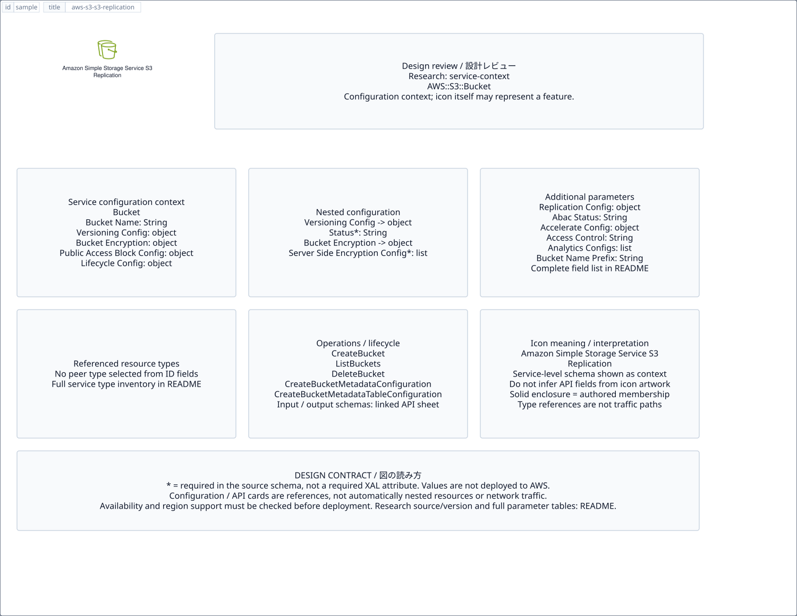

# `aws-s3-s3-replication` — Amazon Simple Storage Service S3 Replication

[SVG preview](sample.svg) · [Editable XAL](sample.xal) · [Catalog](../README.md)



AWS resource icon. Use a label and explicit annotations to describe its role; scope is selected by the author.

- Kind: `resource`; category: Storage.
- Diagram scope: `logical` (recommendation, not AWS deployment validation).
- Default catalog ID: 1659. Covered catalog IDs: 1659.
- Implementation: V1 and V2; fixed AWS icon with a wrapped label and explicit functional annotations.

## Parameters

`id` is a required, unique connection ID, not a catalog number. `label`/`title`/`name` override the label; an empty label hides it. `size` > 0 defaults to 48 px. `label-width` > 0 defaults to 160 px (default box width, at least icon size + 12 px). Explicit `width`/`height` must contain the icon and label. `visible="false"` hides it. Children and icon overrides are not supported; use a group for containment.

`detail` adds a free-form diagram annotation. `show-details="false"` hides annotation text. Only supplied values are shown; none are sent to AWS. Service/resource annotations appear on separate wrapped lines.

| Parameter | Type | Meaning | Example |
|---|---|---|---|
| `data` | text | Stored data annotation | `Application data` |

## Review notes

The catalog provides a baseline for per-component development, not a simulation of the AWS control plane. This component's current functional parameters are the ones listed above. Additional service-specific visual behavior can be developed here without replacing catalog IDs in diagrams. Edit `sample.xal`, then run:

```sh
npm run generate:aws-samples -- --render --tag=aws-s3-s3-replication
```

<!-- aws-functional-research:start -->
## 機能調査・構成デザイン（2026-09-06）

分類: `service-context`。サービス文脈: [`aws-s3`](../aws-s3/README.md)。

サンプルはアイコンと、設定・内包構造・関連リソース・操作を分離したレビューシートです。設定カードは編集可能な `rectangle`、グループは既存の専用タグで実装しています。カードのフィールド名を新しい XAL 属性として受理するわけではありません。専用タグが受理する属性は上の Parameters 表を参照してください。

実線の通信と、設定の参照・同じサービスに属する型一覧を区別します。スキーマの必須項目は AWS 側の仕様であり、図の必須入力ではありません。記載の構成モデル/API は取り込んだ公式資料の範囲であり、全リージョン・全機能の完全性や稼働可否を保証しません。

**重要:** このアイコンに対応する独立した構成リソースを断定せず、所属サービスの構成モデルを参考表示しています。アイコン名や絵柄から属性・親子関係・通信を推測しません。

### 構成モデル: `AWS::S3::Bucket`

[公式リファレンス](https://docs.aws.amazon.com/AWSCloudFormation/latest/UserGuide/aws-resource-s3-bucket.html)。全 25 プロパティを型付きで列挙します（表示カードには主要項目のみ）。

| Field | Type | Required in AWS schema |
|---|---|---|
| [AbacStatus](https://docs.aws.amazon.com/AWSCloudFormation/latest/UserGuide/aws-resource-s3-bucket.html#cfn-s3-bucket-abacstatus) | `String` | no |
| [AccelerateConfiguration](https://docs.aws.amazon.com/AWSCloudFormation/latest/UserGuide/aws-resource-s3-bucket.html#cfn-s3-bucket-accelerateconfiguration) | `AccelerateConfiguration` | no |
| [AccessControl](https://docs.aws.amazon.com/AWSCloudFormation/latest/UserGuide/aws-resource-s3-bucket.html#cfn-s3-bucket-accesscontrol) | `String` | no |
| [AnalyticsConfigurations](https://docs.aws.amazon.com/AWSCloudFormation/latest/UserGuide/aws-resource-s3-bucket.html#cfn-s3-bucket-analyticsconfigurations) | `List<AnalyticsConfiguration>` | no |
| [BucketEncryption](https://docs.aws.amazon.com/AWSCloudFormation/latest/UserGuide/aws-resource-s3-bucket.html#cfn-s3-bucket-bucketencryption) | `BucketEncryption` | no |
| [BucketName](https://docs.aws.amazon.com/AWSCloudFormation/latest/UserGuide/aws-resource-s3-bucket.html#cfn-s3-bucket-bucketname) | `String` | no |
| [BucketNamePrefix](https://docs.aws.amazon.com/AWSCloudFormation/latest/UserGuide/aws-resource-s3-bucket.html#cfn-s3-bucket-bucketnameprefix) | `String` | no |
| [BucketNamespace](https://docs.aws.amazon.com/AWSCloudFormation/latest/UserGuide/aws-resource-s3-bucket.html#cfn-s3-bucket-bucketnamespace) | `String` | no |
| [CorsConfiguration](https://docs.aws.amazon.com/AWSCloudFormation/latest/UserGuide/aws-resource-s3-bucket.html#cfn-s3-bucket-corsconfiguration) | `CorsConfiguration` | no |
| [IntelligentTieringConfigurations](https://docs.aws.amazon.com/AWSCloudFormation/latest/UserGuide/aws-resource-s3-bucket.html#cfn-s3-bucket-intelligenttieringconfigurations) | `List<IntelligentTieringConfiguration>` | no |
| [InventoryConfigurations](https://docs.aws.amazon.com/AWSCloudFormation/latest/UserGuide/aws-resource-s3-bucket.html#cfn-s3-bucket-inventoryconfigurations) | `List<InventoryConfiguration>` | no |
| [LifecycleConfiguration](https://docs.aws.amazon.com/AWSCloudFormation/latest/UserGuide/aws-resource-s3-bucket.html#cfn-s3-bucket-lifecycleconfiguration) | `LifecycleConfiguration` | no |
| [LoggingConfiguration](https://docs.aws.amazon.com/AWSCloudFormation/latest/UserGuide/aws-resource-s3-bucket.html#cfn-s3-bucket-loggingconfiguration) | `LoggingConfiguration` | no |
| [MetadataConfiguration](https://docs.aws.amazon.com/AWSCloudFormation/latest/UserGuide/aws-resource-s3-bucket.html#cfn-s3-bucket-metadataconfiguration) | `MetadataConfiguration` | no |
| [MetadataTableConfiguration](https://docs.aws.amazon.com/AWSCloudFormation/latest/UserGuide/aws-resource-s3-bucket.html#cfn-s3-bucket-metadatatableconfiguration) | `MetadataTableConfiguration` | no |
| [MetricsConfigurations](https://docs.aws.amazon.com/AWSCloudFormation/latest/UserGuide/aws-resource-s3-bucket.html#cfn-s3-bucket-metricsconfigurations) | `List<MetricsConfiguration>` | no |
| [NotificationConfiguration](https://docs.aws.amazon.com/AWSCloudFormation/latest/UserGuide/aws-resource-s3-bucket.html#cfn-s3-bucket-notificationconfiguration) | `NotificationConfiguration` | no |
| [ObjectLockConfiguration](https://docs.aws.amazon.com/AWSCloudFormation/latest/UserGuide/aws-resource-s3-bucket.html#cfn-s3-bucket-objectlockconfiguration) | `ObjectLockConfiguration` | no |
| [ObjectLockEnabled](https://docs.aws.amazon.com/AWSCloudFormation/latest/UserGuide/aws-resource-s3-bucket.html#cfn-s3-bucket-objectlockenabled) | `Boolean` | no |
| [OwnershipControls](https://docs.aws.amazon.com/AWSCloudFormation/latest/UserGuide/aws-resource-s3-bucket.html#cfn-s3-bucket-ownershipcontrols) | `OwnershipControls` | no |
| [PublicAccessBlockConfiguration](https://docs.aws.amazon.com/AWSCloudFormation/latest/UserGuide/aws-resource-s3-bucket.html#cfn-s3-bucket-publicaccessblockconfiguration) | `PublicAccessBlockConfiguration` | no |
| [ReplicationConfiguration](https://docs.aws.amazon.com/AWSCloudFormation/latest/UserGuide/aws-resource-s3-bucket.html#cfn-s3-bucket-replicationconfiguration) | `ReplicationConfiguration` | no |
| [Tags](https://docs.aws.amazon.com/AWSCloudFormation/latest/UserGuide/aws-resource-s3-bucket.html#cfn-s3-bucket-tags) | `List<Tag>` | no |
| [VersioningConfiguration](https://docs.aws.amazon.com/AWSCloudFormation/latest/UserGuide/aws-resource-s3-bucket.html#cfn-s3-bucket-versioningconfiguration) | `VersioningConfiguration` | no |
| [WebsiteConfiguration](https://docs.aws.amazon.com/AWSCloudFormation/latest/UserGuide/aws-resource-s3-bucket.html#cfn-s3-bucket-websiteconfiguration) | `WebsiteConfiguration` | no |

#### VersioningConfiguration → `AWS::S3::Bucket.VersioningConfiguration`

| Field | Type | Required in AWS schema |
|---|---|---|
| [Status](https://docs.aws.amazon.com/AWSCloudFormation/latest/UserGuide/aws-properties-s3-bucket-versioningconfiguration.html#cfn-s3-bucket-versioningconfiguration-status) | `String` | yes |

#### BucketEncryption → `AWS::S3::Bucket.BucketEncryption`

| Field | Type | Required in AWS schema |
|---|---|---|
| [ServerSideEncryptionConfiguration](https://docs.aws.amazon.com/AWSCloudFormation/latest/UserGuide/aws-properties-s3-bucket-bucketencryption.html#cfn-s3-bucket-bucketencryption-serversideencryptionconfiguration) | `List<ServerSideEncryptionRule>` | yes |

#### PublicAccessBlockConfiguration → `AWS::S3::Bucket.PublicAccessBlockConfiguration`

| Field | Type | Required in AWS schema |
|---|---|---|
| [BlockPublicAcls](https://docs.aws.amazon.com/AWSCloudFormation/latest/UserGuide/aws-properties-s3-bucket-publicaccessblockconfiguration.html#cfn-s3-bucket-publicaccessblockconfiguration-blockpublicacls) | `Boolean` | no |
| [BlockPublicPolicy](https://docs.aws.amazon.com/AWSCloudFormation/latest/UserGuide/aws-properties-s3-bucket-publicaccessblockconfiguration.html#cfn-s3-bucket-publicaccessblockconfiguration-blockpublicpolicy) | `Boolean` | no |
| [IgnorePublicAcls](https://docs.aws.amazon.com/AWSCloudFormation/latest/UserGuide/aws-properties-s3-bucket-publicaccessblockconfiguration.html#cfn-s3-bucket-publicaccessblockconfiguration-ignorepublicacls) | `Boolean` | no |
| [RestrictPublicBuckets](https://docs.aws.amazon.com/AWSCloudFormation/latest/UserGuide/aws-properties-s3-bucket-publicaccessblockconfiguration.html#cfn-s3-bucket-publicaccessblockconfiguration-restrictpublicbuckets) | `Boolean` | no |

#### LifecycleConfiguration → `AWS::S3::Bucket.LifecycleConfiguration`

| Field | Type | Required in AWS schema |
|---|---|---|
| [Rules](https://docs.aws.amazon.com/AWSCloudFormation/latest/UserGuide/aws-properties-s3-bucket-lifecycleconfiguration.html#cfn-s3-bucket-lifecycleconfiguration-rules) | `List<Rule>` | yes |
| [TransitionDefaultMinimumObjectSize](https://docs.aws.amazon.com/AWSCloudFormation/latest/UserGuide/aws-properties-s3-bucket-lifecycleconfiguration.html#cfn-s3-bucket-lifecycleconfiguration-transitiondefaultminimumobjectsize) | `String` | no |

#### ReplicationConfiguration → `AWS::S3::Bucket.ReplicationConfiguration`

| Field | Type | Required in AWS schema |
|---|---|---|
| [Role](https://docs.aws.amazon.com/AWSCloudFormation/latest/UserGuide/aws-properties-s3-bucket-replicationconfiguration.html#cfn-s3-bucket-replicationconfiguration-role) | `String` | yes |
| [Rules](https://docs.aws.amazon.com/AWSCloudFormation/latest/UserGuide/aws-properties-s3-bucket-replicationconfiguration.html#cfn-s3-bucket-replicationconfiguration-rules) | `List<ReplicationRule>` | yes |

#### AccelerateConfiguration → `AWS::S3::Bucket.AccelerateConfiguration`

| Field | Type | Required in AWS schema |
|---|---|---|
| [AccelerationStatus](https://docs.aws.amazon.com/AWSCloudFormation/latest/UserGuide/aws-properties-s3-bucket-accelerateconfiguration.html#cfn-s3-bucket-accelerateconfiguration-accelerationstatus) | `String` | yes |

#### AnalyticsConfigurations → `AWS::S3::Bucket.AnalyticsConfiguration`

| Field | Type | Required in AWS schema |
|---|---|---|
| [Id](https://docs.aws.amazon.com/AWSCloudFormation/latest/UserGuide/aws-properties-s3-bucket-analyticsconfiguration.html#cfn-s3-bucket-analyticsconfiguration-id) | `String` | yes |
| [Prefix](https://docs.aws.amazon.com/AWSCloudFormation/latest/UserGuide/aws-properties-s3-bucket-analyticsconfiguration.html#cfn-s3-bucket-analyticsconfiguration-prefix) | `String` | no |
| [StorageClassAnalysis](https://docs.aws.amazon.com/AWSCloudFormation/latest/UserGuide/aws-properties-s3-bucket-analyticsconfiguration.html#cfn-s3-bucket-analyticsconfiguration-storageclassanalysis) | `StorageClassAnalysis` | yes |
| [TagFilters](https://docs.aws.amazon.com/AWSCloudFormation/latest/UserGuide/aws-properties-s3-bucket-analyticsconfiguration.html#cfn-s3-bucket-analyticsconfiguration-tagfilters) | `List<TagFilter>` | no |

#### CorsConfiguration → `AWS::S3::Bucket.CorsConfiguration`

| Field | Type | Required in AWS schema |
|---|---|---|
| [CorsRules](https://docs.aws.amazon.com/AWSCloudFormation/latest/UserGuide/aws-properties-s3-bucket-corsconfiguration.html#cfn-s3-bucket-corsconfiguration-corsrules) | `List<CorsRule>` | yes |

#### IntelligentTieringConfigurations → `AWS::S3::Bucket.IntelligentTieringConfiguration`

| Field | Type | Required in AWS schema |
|---|---|---|
| [Id](https://docs.aws.amazon.com/AWSCloudFormation/latest/UserGuide/aws-properties-s3-bucket-intelligenttieringconfiguration.html#cfn-s3-bucket-intelligenttieringconfiguration-id) | `String` | yes |
| [Prefix](https://docs.aws.amazon.com/AWSCloudFormation/latest/UserGuide/aws-properties-s3-bucket-intelligenttieringconfiguration.html#cfn-s3-bucket-intelligenttieringconfiguration-prefix) | `String` | no |
| [Status](https://docs.aws.amazon.com/AWSCloudFormation/latest/UserGuide/aws-properties-s3-bucket-intelligenttieringconfiguration.html#cfn-s3-bucket-intelligenttieringconfiguration-status) | `String` | yes |
| [TagFilters](https://docs.aws.amazon.com/AWSCloudFormation/latest/UserGuide/aws-properties-s3-bucket-intelligenttieringconfiguration.html#cfn-s3-bucket-intelligenttieringconfiguration-tagfilters) | `List<TagFilter>` | no |
| [Tierings](https://docs.aws.amazon.com/AWSCloudFormation/latest/UserGuide/aws-properties-s3-bucket-intelligenttieringconfiguration.html#cfn-s3-bucket-intelligenttieringconfiguration-tierings) | `List<Tiering>` | yes |

#### InventoryConfigurations → `AWS::S3::Bucket.InventoryConfiguration`

| Field | Type | Required in AWS schema |
|---|---|---|
| [Destination](https://docs.aws.amazon.com/AWSCloudFormation/latest/UserGuide/aws-properties-s3-bucket-inventoryconfiguration.html#cfn-s3-bucket-inventoryconfiguration-destination) | `Destination` | yes |
| [Enabled](https://docs.aws.amazon.com/AWSCloudFormation/latest/UserGuide/aws-properties-s3-bucket-inventoryconfiguration.html#cfn-s3-bucket-inventoryconfiguration-enabled) | `Boolean` | yes |
| [Id](https://docs.aws.amazon.com/AWSCloudFormation/latest/UserGuide/aws-properties-s3-bucket-inventoryconfiguration.html#cfn-s3-bucket-inventoryconfiguration-id) | `String` | yes |
| [IncludedObjectVersions](https://docs.aws.amazon.com/AWSCloudFormation/latest/UserGuide/aws-properties-s3-bucket-inventoryconfiguration.html#cfn-s3-bucket-inventoryconfiguration-includedobjectversions) | `String` | yes |
| [OptionalFields](https://docs.aws.amazon.com/AWSCloudFormation/latest/UserGuide/aws-properties-s3-bucket-inventoryconfiguration.html#cfn-s3-bucket-inventoryconfiguration-optionalfields) | `List<String>` | no |
| [Prefix](https://docs.aws.amazon.com/AWSCloudFormation/latest/UserGuide/aws-properties-s3-bucket-inventoryconfiguration.html#cfn-s3-bucket-inventoryconfiguration-prefix) | `String` | no |
| [ScheduleFrequency](https://docs.aws.amazon.com/AWSCloudFormation/latest/UserGuide/aws-properties-s3-bucket-inventoryconfiguration.html#cfn-s3-bucket-inventoryconfiguration-schedulefrequency) | `String` | yes |

#### LoggingConfiguration → `AWS::S3::Bucket.LoggingConfiguration`

| Field | Type | Required in AWS schema |
|---|---|---|
| [DestinationBucketName](https://docs.aws.amazon.com/AWSCloudFormation/latest/UserGuide/aws-properties-s3-bucket-loggingconfiguration.html#cfn-s3-bucket-loggingconfiguration-destinationbucketname) | `String` | no |
| [LogFilePrefix](https://docs.aws.amazon.com/AWSCloudFormation/latest/UserGuide/aws-properties-s3-bucket-loggingconfiguration.html#cfn-s3-bucket-loggingconfiguration-logfileprefix) | `String` | no |
| [TargetObjectKeyFormat](https://docs.aws.amazon.com/AWSCloudFormation/latest/UserGuide/aws-properties-s3-bucket-loggingconfiguration.html#cfn-s3-bucket-loggingconfiguration-targetobjectkeyformat) | `TargetObjectKeyFormat` | no |

#### MetadataConfiguration → `AWS::S3::Bucket.MetadataConfiguration`

| Field | Type | Required in AWS schema |
|---|---|---|
| [AnnotationTableConfiguration](https://docs.aws.amazon.com/AWSCloudFormation/latest/UserGuide/aws-properties-s3-bucket-metadataconfiguration.html#cfn-s3-bucket-metadataconfiguration-annotationtableconfiguration) | `AnnotationTableConfiguration` | no |
| [Destination](https://docs.aws.amazon.com/AWSCloudFormation/latest/UserGuide/aws-properties-s3-bucket-metadataconfiguration.html#cfn-s3-bucket-metadataconfiguration-destination) | `MetadataDestination` | no |
| [InventoryTableConfiguration](https://docs.aws.amazon.com/AWSCloudFormation/latest/UserGuide/aws-properties-s3-bucket-metadataconfiguration.html#cfn-s3-bucket-metadataconfiguration-inventorytableconfiguration) | `InventoryTableConfiguration` | no |
| [JournalTableConfiguration](https://docs.aws.amazon.com/AWSCloudFormation/latest/UserGuide/aws-properties-s3-bucket-metadataconfiguration.html#cfn-s3-bucket-metadataconfiguration-journaltableconfiguration) | `JournalTableConfiguration` | yes |

#### MetadataTableConfiguration → `AWS::S3::Bucket.MetadataTableConfiguration`

| Field | Type | Required in AWS schema |
|---|---|---|
| [S3TablesDestination](https://docs.aws.amazon.com/AWSCloudFormation/latest/UserGuide/aws-properties-s3-bucket-metadatatableconfiguration.html#cfn-s3-bucket-metadatatableconfiguration-s3tablesdestination) | `S3TablesDestination` | yes |

#### MetricsConfigurations → `AWS::S3::Bucket.MetricsConfiguration`

| Field | Type | Required in AWS schema |
|---|---|---|
| [AccessPointArn](https://docs.aws.amazon.com/AWSCloudFormation/latest/UserGuide/aws-properties-s3-bucket-metricsconfiguration.html#cfn-s3-bucket-metricsconfiguration-accesspointarn) | `String` | no |
| [Id](https://docs.aws.amazon.com/AWSCloudFormation/latest/UserGuide/aws-properties-s3-bucket-metricsconfiguration.html#cfn-s3-bucket-metricsconfiguration-id) | `String` | yes |
| [Prefix](https://docs.aws.amazon.com/AWSCloudFormation/latest/UserGuide/aws-properties-s3-bucket-metricsconfiguration.html#cfn-s3-bucket-metricsconfiguration-prefix) | `String` | no |
| [TagFilters](https://docs.aws.amazon.com/AWSCloudFormation/latest/UserGuide/aws-properties-s3-bucket-metricsconfiguration.html#cfn-s3-bucket-metricsconfiguration-tagfilters) | `List<TagFilter>` | no |

#### NotificationConfiguration → `AWS::S3::Bucket.NotificationConfiguration`

| Field | Type | Required in AWS schema |
|---|---|---|
| [EventBridgeConfiguration](https://docs.aws.amazon.com/AWSCloudFormation/latest/UserGuide/aws-properties-s3-bucket-notificationconfiguration.html#cfn-s3-bucket-notificationconfiguration-eventbridgeconfiguration) | `EventBridgeConfiguration` | no |
| [LambdaConfigurations](https://docs.aws.amazon.com/AWSCloudFormation/latest/UserGuide/aws-properties-s3-bucket-notificationconfiguration.html#cfn-s3-bucket-notificationconfiguration-lambdaconfigurations) | `List<LambdaConfiguration>` | no |
| [QueueConfigurations](https://docs.aws.amazon.com/AWSCloudFormation/latest/UserGuide/aws-properties-s3-bucket-notificationconfiguration.html#cfn-s3-bucket-notificationconfiguration-queueconfigurations) | `List<QueueConfiguration>` | no |
| [TopicConfigurations](https://docs.aws.amazon.com/AWSCloudFormation/latest/UserGuide/aws-properties-s3-bucket-notificationconfiguration.html#cfn-s3-bucket-notificationconfiguration-topicconfigurations) | `List<TopicConfiguration>` | no |

#### ObjectLockConfiguration → `AWS::S3::Bucket.ObjectLockConfiguration`

| Field | Type | Required in AWS schema |
|---|---|---|
| [ObjectLockEnabled](https://docs.aws.amazon.com/AWSCloudFormation/latest/UserGuide/aws-properties-s3-bucket-objectlockconfiguration.html#cfn-s3-bucket-objectlockconfiguration-objectlockenabled) | `String` | no |
| [Rule](https://docs.aws.amazon.com/AWSCloudFormation/latest/UserGuide/aws-properties-s3-bucket-objectlockconfiguration.html#cfn-s3-bucket-objectlockconfiguration-rule) | `ObjectLockRule` | no |

#### OwnershipControls → `AWS::S3::Bucket.OwnershipControls`

| Field | Type | Required in AWS schema |
|---|---|---|
| [Rules](https://docs.aws.amazon.com/AWSCloudFormation/latest/UserGuide/aws-properties-s3-bucket-ownershipcontrols.html#cfn-s3-bucket-ownershipcontrols-rules) | `List<OwnershipControlsRule>` | yes |

#### WebsiteConfiguration → `AWS::S3::Bucket.WebsiteConfiguration`

| Field | Type | Required in AWS schema |
|---|---|---|
| [ErrorDocument](https://docs.aws.amazon.com/AWSCloudFormation/latest/UserGuide/aws-properties-s3-bucket-websiteconfiguration.html#cfn-s3-bucket-websiteconfiguration-errordocument) | `String` | no |
| [IndexDocument](https://docs.aws.amazon.com/AWSCloudFormation/latest/UserGuide/aws-properties-s3-bucket-websiteconfiguration.html#cfn-s3-bucket-websiteconfiguration-indexdocument) | `String` | no |
| [RedirectAllRequestsTo](https://docs.aws.amazon.com/AWSCloudFormation/latest/UserGuide/aws-properties-s3-bucket-websiteconfiguration.html#cfn-s3-bucket-websiteconfiguration-redirectallrequeststo) | `RedirectAllRequestsTo` | no |
| [RoutingRules](https://docs.aws.amazon.com/AWSCloudFormation/latest/UserGuide/aws-properties-s3-bucket-websiteconfiguration.html#cfn-s3-bucket-websiteconfiguration-routingrules) | `List<RoutingRule>` | no |

### 関連する構成リソース（10 型）

同じサービス文脈の型一覧です。すべてがこのアイコンの子リソースという意味ではありません。さらに深い入れ子は [公式スキーマのスナップショット](../research/cloudformation-models.json) に記録しています。

- [AWS::S3::AccessGrant](https://docs.aws.amazon.com/AWSCloudFormation/latest/UserGuide/aws-resource-s3-accessgrant.html)
- [AWS::S3::AccessGrantsInstance](https://docs.aws.amazon.com/AWSCloudFormation/latest/UserGuide/aws-resource-s3-accessgrantsinstance.html)
- [AWS::S3::AccessGrantsLocation](https://docs.aws.amazon.com/AWSCloudFormation/latest/UserGuide/aws-resource-s3-accessgrantslocation.html)
- [AWS::S3::AccessPoint](https://docs.aws.amazon.com/AWSCloudFormation/latest/UserGuide/aws-resource-s3-accesspoint.html)
- [AWS::S3::Bucket](https://docs.aws.amazon.com/AWSCloudFormation/latest/UserGuide/aws-resource-s3-bucket.html)
- [AWS::S3::BucketPolicy](https://docs.aws.amazon.com/AWSCloudFormation/latest/UserGuide/aws-resource-s3-bucketpolicy.html)
- [AWS::S3::MultiRegionAccessPoint](https://docs.aws.amazon.com/AWSCloudFormation/latest/UserGuide/aws-resource-s3-multiregionaccesspoint.html)
- [AWS::S3::MultiRegionAccessPointPolicy](https://docs.aws.amazon.com/AWSCloudFormation/latest/UserGuide/aws-resource-s3-multiregionaccesspointpolicy.html)
- [AWS::S3::StorageLens](https://docs.aws.amazon.com/AWSCloudFormation/latest/UserGuide/aws-resource-s3-storagelens.html)
- [AWS::S3::StorageLensGroup](https://docs.aws.amazon.com/AWSCloudFormation/latest/UserGuide/aws-resource-s3-storagelensgroup.html)

### API の操作・パラメータ

- [Amazon Simple Storage Service: 116 操作の入力・出力一覧](../research/api/s3.md)（API version 2006-03-01）

### 出典・調査範囲

- [公式資料 1](https://docs.aws.amazon.com/AWSCloudFormation/latest/UserGuide/aws-resource-s3-bucket.html)
- [公式資料 2](https://github.com/boto/botocore/blob/develop/botocore/data/s3/2006-03-01/service-2.json)

CloudFormation 仕様 263.0.0、AWS SDK 431 サービスモデルをオフラインで参照。取得日・元データの SHA-256 は [調査マニフェスト](../research/README.md) を参照。API モデル名・フィールド名は仕様から抽出し、説明本文を転載していません。利用可能性は全サービス一律には確認できないため、提供終了の確認がないものも「現在利用可能」と断定していません。

### 次の部品レビュー

- 本アイコンが独立したリソースか、機能・状態・デバイスの記号かを確認する。
- 詳細カードのうち専用の子タグ・参照属性として実装する範囲を選ぶ。
- 通信、制御、認証、監視の関係を分け、必要な接続点・配置制約を確認する。
- 編集後は `npm run generate:aws-samples -- --render --tag=aws-s3-s3-replication`。通常の再描画は XAL/README を上書きしない。
<!-- aws-functional-research:end -->
