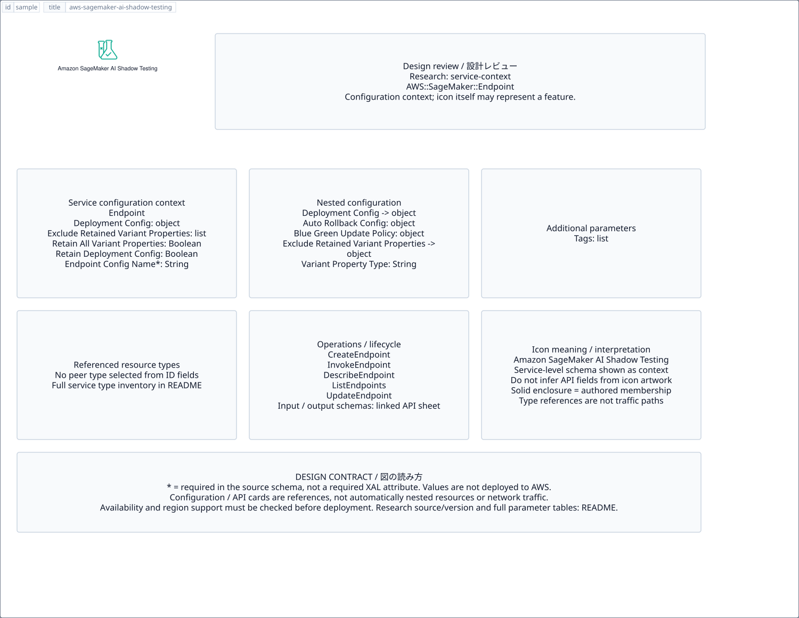

# `aws-sagemaker-ai-shadow-testing` — Amazon SageMaker AI Shadow Testing

[SVG preview](sample.svg) · [Editable XAL](sample.xal) · [Catalog](../README.md)



AWS resource icon. Use a label and explicit annotations to describe its role; scope is selected by the author.

- Kind: `resource`; category: Artificial Intelligence.
- Diagram scope: `logical` (recommendation, not AWS deployment validation).
- Default catalog ID: 1674. Covered catalog IDs: 1674.
- Implementation: V1 and V2; fixed AWS icon with a wrapped label and explicit functional annotations.

## Parameters

`id` is a required, unique connection ID, not a catalog number. `label`/`title`/`name` override the label; an empty label hides it. `size` > 0 defaults to 48 px. `label-width` > 0 defaults to 160 px (default box width, at least icon size + 12 px). Explicit `width`/`height` must contain the icon and label. `visible="false"` hides it. Children and icon overrides are not supported; use a group for containment.

`detail` adds a free-form diagram annotation. `show-details="false"` hides annotation text. Only supplied values are shown; none are sent to AWS. Service/resource annotations appear on separate wrapped lines.

| Parameter | Type | Meaning | Example |
|---|---|---|---|
| `input` | text | Input data annotation | `Application events` |
| `output` | text | Output data annotation | `Insights` |

## Review notes

The catalog provides a baseline for per-component development, not a simulation of the AWS control plane. This component's current functional parameters are the ones listed above. Additional service-specific visual behavior can be developed here without replacing catalog IDs in diagrams. Edit `sample.xal`, then run:

```sh
npm run generate:aws-samples -- --render --tag=aws-sagemaker-ai-shadow-testing
```

<!-- aws-functional-research:start -->
## 機能調査・構成デザイン（2026-09-06）

分類: `service-context`。サービス文脈: [`aws-sagemaker-ai`](../aws-sagemaker-ai/README.md)。

サンプルはアイコンと、設定・内包構造・関連リソース・操作を分離したレビューシートです。設定カードは編集可能な `rectangle`、グループは既存の専用タグで実装しています。カードのフィールド名を新しい XAL 属性として受理するわけではありません。専用タグが受理する属性は上の Parameters 表を参照してください。

実線の通信と、設定の参照・同じサービスに属する型一覧を区別します。スキーマの必須項目は AWS 側の仕様であり、図の必須入力ではありません。記載の構成モデル/API は取り込んだ公式資料の範囲であり、全リージョン・全機能の完全性や稼働可否を保証しません。

**重要:** このアイコンに対応する独立した構成リソースを断定せず、所属サービスの構成モデルを参考表示しています。アイコン名や絵柄から属性・親子関係・通信を推測しません。

### 構成モデル: `AWS::SageMaker::Endpoint`

[公式リファレンス](https://docs.aws.amazon.com/AWSCloudFormation/latest/UserGuide/aws-resource-sagemaker-endpoint.html)。全 6 プロパティを型付きで列挙します（表示カードには主要項目のみ）。

| Field | Type | Required in AWS schema |
|---|---|---|
| [DeploymentConfig](https://docs.aws.amazon.com/AWSCloudFormation/latest/UserGuide/aws-resource-sagemaker-endpoint.html#cfn-sagemaker-endpoint-deploymentconfig) | `DeploymentConfig` | no |
| [EndpointConfigName](https://docs.aws.amazon.com/AWSCloudFormation/latest/UserGuide/aws-resource-sagemaker-endpoint.html#cfn-sagemaker-endpoint-endpointconfigname) | `String` | yes |
| [ExcludeRetainedVariantProperties](https://docs.aws.amazon.com/AWSCloudFormation/latest/UserGuide/aws-resource-sagemaker-endpoint.html#cfn-sagemaker-endpoint-excluderetainedvariantproperties) | `List<VariantProperty>` | no |
| [RetainAllVariantProperties](https://docs.aws.amazon.com/AWSCloudFormation/latest/UserGuide/aws-resource-sagemaker-endpoint.html#cfn-sagemaker-endpoint-retainallvariantproperties) | `Boolean` | no |
| [RetainDeploymentConfig](https://docs.aws.amazon.com/AWSCloudFormation/latest/UserGuide/aws-resource-sagemaker-endpoint.html#cfn-sagemaker-endpoint-retaindeploymentconfig) | `Boolean` | no |
| [Tags](https://docs.aws.amazon.com/AWSCloudFormation/latest/UserGuide/aws-resource-sagemaker-endpoint.html#cfn-sagemaker-endpoint-tags) | `List<Tag>` | no |

#### DeploymentConfig → `AWS::SageMaker::Endpoint.DeploymentConfig`

| Field | Type | Required in AWS schema |
|---|---|---|
| [AutoRollbackConfiguration](https://docs.aws.amazon.com/AWSCloudFormation/latest/UserGuide/aws-properties-sagemaker-endpoint-deploymentconfig.html#cfn-sagemaker-endpoint-deploymentconfig-autorollbackconfiguration) | `AutoRollbackConfig` | no |
| [BlueGreenUpdatePolicy](https://docs.aws.amazon.com/AWSCloudFormation/latest/UserGuide/aws-properties-sagemaker-endpoint-deploymentconfig.html#cfn-sagemaker-endpoint-deploymentconfig-bluegreenupdatepolicy) | `BlueGreenUpdatePolicy` | no |
| [RollingUpdatePolicy](https://docs.aws.amazon.com/AWSCloudFormation/latest/UserGuide/aws-properties-sagemaker-endpoint-deploymentconfig.html#cfn-sagemaker-endpoint-deploymentconfig-rollingupdatepolicy) | `RollingUpdatePolicy` | no |

#### ExcludeRetainedVariantProperties → `AWS::SageMaker::Endpoint.VariantProperty`

| Field | Type | Required in AWS schema |
|---|---|---|
| [VariantPropertyType](https://docs.aws.amazon.com/AWSCloudFormation/latest/UserGuide/aws-properties-sagemaker-endpoint-variantproperty.html#cfn-sagemaker-endpoint-variantproperty-variantpropertytype) | `String` | no |

### 関連する構成リソース（53 型）

同じサービス文脈の型一覧です。すべてがこのアイコンの子リソースという意味ではありません。さらに深い入れ子は [公式スキーマのスナップショット](../research/cloudformation-models.json) に記録しています。

- [AWS::SageMaker::Action](https://docs.aws.amazon.com/AWSCloudFormation/latest/UserGuide/aws-resource-sagemaker-action.html)
- [AWS::SageMaker::Algorithm](https://docs.aws.amazon.com/AWSCloudFormation/latest/UserGuide/aws-resource-sagemaker-algorithm.html)
- [AWS::SageMaker::App](https://docs.aws.amazon.com/AWSCloudFormation/latest/UserGuide/aws-resource-sagemaker-app.html)
- [AWS::SageMaker::AppImageConfig](https://docs.aws.amazon.com/AWSCloudFormation/latest/UserGuide/aws-resource-sagemaker-appimageconfig.html)
- [AWS::SageMaker::Artifact](https://docs.aws.amazon.com/AWSCloudFormation/latest/UserGuide/aws-resource-sagemaker-artifact.html)
- [AWS::SageMaker::AutoMLJob](https://docs.aws.amazon.com/AWSCloudFormation/latest/UserGuide/aws-resource-sagemaker-automljob.html)
- [AWS::SageMaker::Cluster](https://docs.aws.amazon.com/AWSCloudFormation/latest/UserGuide/aws-resource-sagemaker-cluster.html)
- [AWS::SageMaker::CodeRepository](https://docs.aws.amazon.com/AWSCloudFormation/latest/UserGuide/aws-resource-sagemaker-coderepository.html)
- [AWS::SageMaker::Context](https://docs.aws.amazon.com/AWSCloudFormation/latest/UserGuide/aws-resource-sagemaker-context.html)
- [AWS::SageMaker::DataQualityJobDefinition](https://docs.aws.amazon.com/AWSCloudFormation/latest/UserGuide/aws-resource-sagemaker-dataqualityjobdefinition.html)
- [AWS::SageMaker::Device](https://docs.aws.amazon.com/AWSCloudFormation/latest/UserGuide/aws-resource-sagemaker-device.html)
- [AWS::SageMaker::DeviceFleet](https://docs.aws.amazon.com/AWSCloudFormation/latest/UserGuide/aws-resource-sagemaker-devicefleet.html)
- [AWS::SageMaker::Domain](https://docs.aws.amazon.com/AWSCloudFormation/latest/UserGuide/aws-resource-sagemaker-domain.html)
- [AWS::SageMaker::Endpoint](https://docs.aws.amazon.com/AWSCloudFormation/latest/UserGuide/aws-resource-sagemaker-endpoint.html)
- [AWS::SageMaker::EndpointConfig](https://docs.aws.amazon.com/AWSCloudFormation/latest/UserGuide/aws-resource-sagemaker-endpointconfig.html)
- [AWS::SageMaker::Experiment](https://docs.aws.amazon.com/AWSCloudFormation/latest/UserGuide/aws-resource-sagemaker-experiment.html)
- [AWS::SageMaker::FeatureGroup](https://docs.aws.amazon.com/AWSCloudFormation/latest/UserGuide/aws-resource-sagemaker-featuregroup.html)
- [AWS::SageMaker::Hub](https://docs.aws.amazon.com/AWSCloudFormation/latest/UserGuide/aws-resource-sagemaker-hub.html)
- [AWS::SageMaker::HubContentVersion](https://docs.aws.amazon.com/AWSCloudFormation/latest/UserGuide/aws-resource-sagemaker-hubcontentversion.html)
- [AWS::SageMaker::HumanTaskUi](https://docs.aws.amazon.com/AWSCloudFormation/latest/UserGuide/aws-resource-sagemaker-humantaskui.html)
- [AWS::SageMaker::HyperParameterTuningJob](https://docs.aws.amazon.com/AWSCloudFormation/latest/UserGuide/aws-resource-sagemaker-hyperparametertuningjob.html)
- [AWS::SageMaker::Image](https://docs.aws.amazon.com/AWSCloudFormation/latest/UserGuide/aws-resource-sagemaker-image.html)
- [AWS::SageMaker::ImageVersion](https://docs.aws.amazon.com/AWSCloudFormation/latest/UserGuide/aws-resource-sagemaker-imageversion.html)
- [AWS::SageMaker::InferenceComponent](https://docs.aws.amazon.com/AWSCloudFormation/latest/UserGuide/aws-resource-sagemaker-inferencecomponent.html)
- [AWS::SageMaker::InferenceExperiment](https://docs.aws.amazon.com/AWSCloudFormation/latest/UserGuide/aws-resource-sagemaker-inferenceexperiment.html)
- [AWS::SageMaker::MlflowApp](https://docs.aws.amazon.com/AWSCloudFormation/latest/UserGuide/aws-resource-sagemaker-mlflowapp.html)
- [AWS::SageMaker::MlflowTrackingServer](https://docs.aws.amazon.com/AWSCloudFormation/latest/UserGuide/aws-resource-sagemaker-mlflowtrackingserver.html)
- [AWS::SageMaker::Model](https://docs.aws.amazon.com/AWSCloudFormation/latest/UserGuide/aws-resource-sagemaker-model.html)
- [AWS::SageMaker::ModelBiasJobDefinition](https://docs.aws.amazon.com/AWSCloudFormation/latest/UserGuide/aws-resource-sagemaker-modelbiasjobdefinition.html)
- [AWS::SageMaker::ModelCard](https://docs.aws.amazon.com/AWSCloudFormation/latest/UserGuide/aws-resource-sagemaker-modelcard.html)
- [AWS::SageMaker::ModelCardExportJob](https://docs.aws.amazon.com/AWSCloudFormation/latest/UserGuide/aws-resource-sagemaker-modelcardexportjob.html)
- [AWS::SageMaker::ModelExplainabilityJobDefinition](https://docs.aws.amazon.com/AWSCloudFormation/latest/UserGuide/aws-resource-sagemaker-modelexplainabilityjobdefinition.html)
- [AWS::SageMaker::ModelPackage](https://docs.aws.amazon.com/AWSCloudFormation/latest/UserGuide/aws-resource-sagemaker-modelpackage.html)
- [AWS::SageMaker::ModelPackageGroup](https://docs.aws.amazon.com/AWSCloudFormation/latest/UserGuide/aws-resource-sagemaker-modelpackagegroup.html)
- [AWS::SageMaker::ModelQualityJobDefinition](https://docs.aws.amazon.com/AWSCloudFormation/latest/UserGuide/aws-resource-sagemaker-modelqualityjobdefinition.html)
- [AWS::SageMaker::MonitoringSchedule](https://docs.aws.amazon.com/AWSCloudFormation/latest/UserGuide/aws-resource-sagemaker-monitoringschedule.html)
- [AWS::SageMaker::MonitoringScheduleAlert](https://docs.aws.amazon.com/AWSCloudFormation/latest/UserGuide/aws-resource-sagemaker-monitoringschedulealert.html)
- [AWS::SageMaker::NotebookInstance](https://docs.aws.amazon.com/AWSCloudFormation/latest/UserGuide/aws-resource-sagemaker-notebookinstance.html)
- [AWS::SageMaker::NotebookInstanceLifecycleConfig](https://docs.aws.amazon.com/AWSCloudFormation/latest/UserGuide/aws-resource-sagemaker-notebookinstancelifecycleconfig.html)
- [AWS::SageMaker::OptimizationJob](https://docs.aws.amazon.com/AWSCloudFormation/latest/UserGuide/aws-resource-sagemaker-optimizationjob.html)
- [AWS::SageMaker::PartnerApp](https://docs.aws.amazon.com/AWSCloudFormation/latest/UserGuide/aws-resource-sagemaker-partnerapp.html)
- [AWS::SageMaker::Pipeline](https://docs.aws.amazon.com/AWSCloudFormation/latest/UserGuide/aws-resource-sagemaker-pipeline.html)
- [AWS::SageMaker::PipelineExecution](https://docs.aws.amazon.com/AWSCloudFormation/latest/UserGuide/aws-resource-sagemaker-pipelineexecution.html)
- [AWS::SageMaker::ProcessingJob](https://docs.aws.amazon.com/AWSCloudFormation/latest/UserGuide/aws-resource-sagemaker-processingjob.html)
- [AWS::SageMaker::Project](https://docs.aws.amazon.com/AWSCloudFormation/latest/UserGuide/aws-resource-sagemaker-project.html)
- [AWS::SageMaker::Space](https://docs.aws.amazon.com/AWSCloudFormation/latest/UserGuide/aws-resource-sagemaker-space.html)
- [AWS::SageMaker::StudioLifecycleConfig](https://docs.aws.amazon.com/AWSCloudFormation/latest/UserGuide/aws-resource-sagemaker-studiolifecycleconfig.html)
- [AWS::SageMaker::TrainingJob](https://docs.aws.amazon.com/AWSCloudFormation/latest/UserGuide/aws-resource-sagemaker-trainingjob.html)
- [AWS::SageMaker::TransformJob](https://docs.aws.amazon.com/AWSCloudFormation/latest/UserGuide/aws-resource-sagemaker-transformjob.html)
- [AWS::SageMaker::TrialComponent](https://docs.aws.amazon.com/AWSCloudFormation/latest/UserGuide/aws-resource-sagemaker-trialcomponent.html)
- [AWS::SageMaker::UserProfile](https://docs.aws.amazon.com/AWSCloudFormation/latest/UserGuide/aws-resource-sagemaker-userprofile.html)
- [AWS::SageMaker::Workforce](https://docs.aws.amazon.com/AWSCloudFormation/latest/UserGuide/aws-resource-sagemaker-workforce.html)
- [AWS::SageMaker::Workteam](https://docs.aws.amazon.com/AWSCloudFormation/latest/UserGuide/aws-resource-sagemaker-workteam.html)

### API の操作・パラメータ

- [Amazon SageMaker Service: 403 操作の入力・出力一覧](../research/api/sagemaker.md)（API version 2017-07-24）
- [Amazon SageMaker Runtime: 3 操作の入力・出力一覧](../research/api/sagemaker-runtime.md)（API version 2017-05-13）

### 出典・調査範囲

- [公式資料 1](https://docs.aws.amazon.com/AWSCloudFormation/latest/UserGuide/aws-resource-sagemaker-endpoint.html)
- [公式資料 2](https://github.com/boto/botocore/blob/develop/botocore/data/sagemaker/2017-07-24/service-2.json)
- [公式資料 3](https://github.com/boto/botocore/blob/develop/botocore/data/sagemaker-runtime/2017-05-13/service-2.json)

CloudFormation 仕様 263.0.0、AWS SDK 431 サービスモデルをオフラインで参照。取得日・元データの SHA-256 は [調査マニフェスト](../research/README.md) を参照。API モデル名・フィールド名は仕様から抽出し、説明本文を転載していません。利用可能性は全サービス一律には確認できないため、提供終了の確認がないものも「現在利用可能」と断定していません。

### 次の部品レビュー

- 本アイコンが独立したリソースか、機能・状態・デバイスの記号かを確認する。
- 詳細カードのうち専用の子タグ・参照属性として実装する範囲を選ぶ。
- 通信、制御、認証、監視の関係を分け、必要な接続点・配置制約を確認する。
- 編集後は `npm run generate:aws-samples -- --render --tag=aws-sagemaker-ai-shadow-testing`。通常の再描画は XAL/README を上書きしない。
<!-- aws-functional-research:end -->
