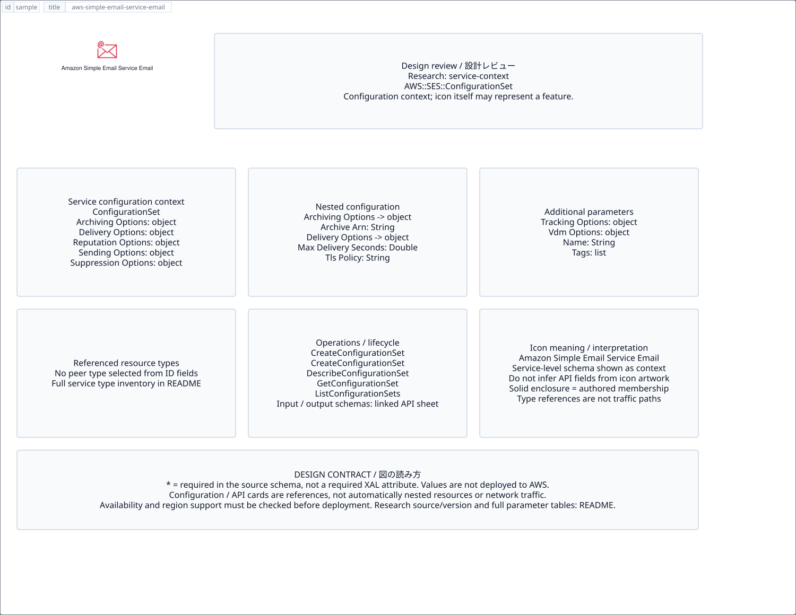

# `aws-simple-email-service-email` — Amazon Simple Email Service Email

[SVG preview](sample.svg) · [Editable XAL](sample.xal) · [Catalog](../README.md)



AWS resource icon. Use a label and explicit annotations to describe its role; scope is selected by the author.

- Kind: `resource`; category: Business Applications.
- Diagram scope: `logical` (recommendation, not AWS deployment validation).
- Default catalog ID: 1860. Covered catalog IDs: 1860.
- Implementation: V1 and V2; fixed AWS icon with a wrapped label and explicit functional annotations.

## Parameters

`id` is a required, unique connection ID, not a catalog number. `label`/`title`/`name` override the label; an empty label hides it. `size` > 0 defaults to 48 px. `label-width` > 0 defaults to 160 px (default box width, at least icon size + 12 px). Explicit `width`/`height` must contain the icon and label. `visible="false"` hides it. Children and icon overrides are not supported; use a group for containment.

`detail` adds a free-form diagram annotation. `show-details="false"` hides annotation text. Only supplied values are shown; none are sent to AWS. Service/resource annotations appear on separate wrapped lines.

| Parameter | Type | Meaning | Example |
|---|---|---|---|
| `role` | text | Architectural role annotation | `Application component` |

## Review notes

The catalog provides a baseline for per-component development, not a simulation of the AWS control plane. This component's current functional parameters are the ones listed above. Additional service-specific visual behavior can be developed here without replacing catalog IDs in diagrams. Edit `sample.xal`, then run:

```sh
npm run generate:aws-samples -- --render --tag=aws-simple-email-service-email
```

<!-- aws-functional-research:start -->
## 機能調査・構成デザイン（2026-09-06）

分類: `service-context`。サービス文脈: [`aws-simple-email-service`](../aws-simple-email-service/README.md)。

サンプルはアイコンと、設定・内包構造・関連リソース・操作を分離したレビューシートです。設定カードは編集可能な `rectangle`、グループは既存の専用タグで実装しています。カードのフィールド名を新しい XAL 属性として受理するわけではありません。専用タグが受理する属性は上の Parameters 表を参照してください。

実線の通信と、設定の参照・同じサービスに属する型一覧を区別します。スキーマの必須項目は AWS 側の仕様であり、図の必須入力ではありません。記載の構成モデル/API は取り込んだ公式資料の範囲であり、全リージョン・全機能の完全性や稼働可否を保証しません。

**重要:** このアイコンに対応する独立した構成リソースを断定せず、所属サービスの構成モデルを参考表示しています。アイコン名や絵柄から属性・親子関係・通信を推測しません。

### 構成モデル: `AWS::SES::ConfigurationSet`

[公式リファレンス](https://docs.aws.amazon.com/AWSCloudFormation/latest/UserGuide/aws-resource-ses-configurationset.html)。全 9 プロパティを型付きで列挙します（表示カードには主要項目のみ）。

| Field | Type | Required in AWS schema |
|---|---|---|
| [ArchivingOptions](https://docs.aws.amazon.com/AWSCloudFormation/latest/UserGuide/aws-resource-ses-configurationset.html#cfn-ses-configurationset-archivingoptions) | `ArchivingOptions` | no |
| [DeliveryOptions](https://docs.aws.amazon.com/AWSCloudFormation/latest/UserGuide/aws-resource-ses-configurationset.html#cfn-ses-configurationset-deliveryoptions) | `DeliveryOptions` | no |
| [Name](https://docs.aws.amazon.com/AWSCloudFormation/latest/UserGuide/aws-resource-ses-configurationset.html#cfn-ses-configurationset-name) | `String` | no |
| [ReputationOptions](https://docs.aws.amazon.com/AWSCloudFormation/latest/UserGuide/aws-resource-ses-configurationset.html#cfn-ses-configurationset-reputationoptions) | `ReputationOptions` | no |
| [SendingOptions](https://docs.aws.amazon.com/AWSCloudFormation/latest/UserGuide/aws-resource-ses-configurationset.html#cfn-ses-configurationset-sendingoptions) | `SendingOptions` | no |
| [SuppressionOptions](https://docs.aws.amazon.com/AWSCloudFormation/latest/UserGuide/aws-resource-ses-configurationset.html#cfn-ses-configurationset-suppressionoptions) | `SuppressionOptions` | no |
| [Tags](https://docs.aws.amazon.com/AWSCloudFormation/latest/UserGuide/aws-resource-ses-configurationset.html#cfn-ses-configurationset-tags) | `List<Tag>` | no |
| [TrackingOptions](https://docs.aws.amazon.com/AWSCloudFormation/latest/UserGuide/aws-resource-ses-configurationset.html#cfn-ses-configurationset-trackingoptions) | `TrackingOptions` | no |
| [VdmOptions](https://docs.aws.amazon.com/AWSCloudFormation/latest/UserGuide/aws-resource-ses-configurationset.html#cfn-ses-configurationset-vdmoptions) | `VdmOptions` | no |

#### ArchivingOptions → `AWS::SES::ConfigurationSet.ArchivingOptions`

| Field | Type | Required in AWS schema |
|---|---|---|
| [ArchiveArn](https://docs.aws.amazon.com/AWSCloudFormation/latest/UserGuide/aws-properties-ses-configurationset-archivingoptions.html#cfn-ses-configurationset-archivingoptions-archivearn) | `String` | no |

#### DeliveryOptions → `AWS::SES::ConfigurationSet.DeliveryOptions`

| Field | Type | Required in AWS schema |
|---|---|---|
| [MaxDeliverySeconds](https://docs.aws.amazon.com/AWSCloudFormation/latest/UserGuide/aws-properties-ses-configurationset-deliveryoptions.html#cfn-ses-configurationset-deliveryoptions-maxdeliveryseconds) | `Double` | no |
| [SendingPoolName](https://docs.aws.amazon.com/AWSCloudFormation/latest/UserGuide/aws-properties-ses-configurationset-deliveryoptions.html#cfn-ses-configurationset-deliveryoptions-sendingpoolname) | `String` | no |
| [TlsPolicy](https://docs.aws.amazon.com/AWSCloudFormation/latest/UserGuide/aws-properties-ses-configurationset-deliveryoptions.html#cfn-ses-configurationset-deliveryoptions-tlspolicy) | `String` | no |

#### ReputationOptions → `AWS::SES::ConfigurationSet.ReputationOptions`

| Field | Type | Required in AWS schema |
|---|---|---|
| [ReputationMetricsEnabled](https://docs.aws.amazon.com/AWSCloudFormation/latest/UserGuide/aws-properties-ses-configurationset-reputationoptions.html#cfn-ses-configurationset-reputationoptions-reputationmetricsenabled) | `Boolean` | no |

#### SendingOptions → `AWS::SES::ConfigurationSet.SendingOptions`

| Field | Type | Required in AWS schema |
|---|---|---|
| [SendingEnabled](https://docs.aws.amazon.com/AWSCloudFormation/latest/UserGuide/aws-properties-ses-configurationset-sendingoptions.html#cfn-ses-configurationset-sendingoptions-sendingenabled) | `Boolean` | no |

#### SuppressionOptions → `AWS::SES::ConfigurationSet.SuppressionOptions`

| Field | Type | Required in AWS schema |
|---|---|---|
| [SuppressedReasons](https://docs.aws.amazon.com/AWSCloudFormation/latest/UserGuide/aws-properties-ses-configurationset-suppressionoptions.html#cfn-ses-configurationset-suppressionoptions-suppressedreasons) | `List<String>` | no |
| [ValidationOptions](https://docs.aws.amazon.com/AWSCloudFormation/latest/UserGuide/aws-properties-ses-configurationset-suppressionoptions.html#cfn-ses-configurationset-suppressionoptions-validationoptions) | `ValidationOptions` | no |

#### TrackingOptions → `AWS::SES::ConfigurationSet.TrackingOptions`

| Field | Type | Required in AWS schema |
|---|---|---|
| [CustomRedirectDomain](https://docs.aws.amazon.com/AWSCloudFormation/latest/UserGuide/aws-properties-ses-configurationset-trackingoptions.html#cfn-ses-configurationset-trackingoptions-customredirectdomain) | `String` | no |
| [HttpsPolicy](https://docs.aws.amazon.com/AWSCloudFormation/latest/UserGuide/aws-properties-ses-configurationset-trackingoptions.html#cfn-ses-configurationset-trackingoptions-httpspolicy) | `String` | no |

#### VdmOptions → `AWS::SES::ConfigurationSet.VdmOptions`

| Field | Type | Required in AWS schema |
|---|---|---|
| [DashboardOptions](https://docs.aws.amazon.com/AWSCloudFormation/latest/UserGuide/aws-properties-ses-configurationset-vdmoptions.html#cfn-ses-configurationset-vdmoptions-dashboardoptions) | `DashboardOptions` | no |
| [GuardianOptions](https://docs.aws.amazon.com/AWSCloudFormation/latest/UserGuide/aws-properties-ses-configurationset-vdmoptions.html#cfn-ses-configurationset-vdmoptions-guardianoptions) | `GuardianOptions` | no |

### 関連する構成リソース（21 型）

同じサービス文脈の型一覧です。すべてがこのアイコンの子リソースという意味ではありません。さらに深い入れ子は [公式スキーマのスナップショット](../research/cloudformation-models.json) に記録しています。

- [AWS::SES::ConfigurationSet](https://docs.aws.amazon.com/AWSCloudFormation/latest/UserGuide/aws-resource-ses-configurationset.html)
- [AWS::SES::ConfigurationSetEventDestination](https://docs.aws.amazon.com/AWSCloudFormation/latest/UserGuide/aws-resource-ses-configurationseteventdestination.html)
- [AWS::SES::ContactList](https://docs.aws.amazon.com/AWSCloudFormation/latest/UserGuide/aws-resource-ses-contactlist.html)
- [AWS::SES::CustomVerificationEmailTemplate](https://docs.aws.amazon.com/AWSCloudFormation/latest/UserGuide/aws-resource-ses-customverificationemailtemplate.html)
- [AWS::SES::DedicatedIpPool](https://docs.aws.amazon.com/AWSCloudFormation/latest/UserGuide/aws-resource-ses-dedicatedippool.html)
- [AWS::SES::EmailIdentity](https://docs.aws.amazon.com/AWSCloudFormation/latest/UserGuide/aws-resource-ses-emailidentity.html)
- [AWS::SES::MailManagerAddonInstance](https://docs.aws.amazon.com/AWSCloudFormation/latest/UserGuide/aws-resource-ses-mailmanageraddoninstance.html)
- [AWS::SES::MailManagerAddonSubscription](https://docs.aws.amazon.com/AWSCloudFormation/latest/UserGuide/aws-resource-ses-mailmanageraddonsubscription.html)
- [AWS::SES::MailManagerAddressList](https://docs.aws.amazon.com/AWSCloudFormation/latest/UserGuide/aws-resource-ses-mailmanageraddresslist.html)
- [AWS::SES::MailManagerArchive](https://docs.aws.amazon.com/AWSCloudFormation/latest/UserGuide/aws-resource-ses-mailmanagerarchive.html)
- [AWS::SES::MailManagerIngressPoint](https://docs.aws.amazon.com/AWSCloudFormation/latest/UserGuide/aws-resource-ses-mailmanageringresspoint.html)
- [AWS::SES::MailManagerRelay](https://docs.aws.amazon.com/AWSCloudFormation/latest/UserGuide/aws-resource-ses-mailmanagerrelay.html)
- [AWS::SES::MailManagerRuleSet](https://docs.aws.amazon.com/AWSCloudFormation/latest/UserGuide/aws-resource-ses-mailmanagerruleset.html)
- [AWS::SES::MailManagerTrafficPolicy](https://docs.aws.amazon.com/AWSCloudFormation/latest/UserGuide/aws-resource-ses-mailmanagertrafficpolicy.html)
- [AWS::SES::MultiRegionEndpoint](https://docs.aws.amazon.com/AWSCloudFormation/latest/UserGuide/aws-resource-ses-multiregionendpoint.html)
- [AWS::SES::ReceiptFilter](https://docs.aws.amazon.com/AWSCloudFormation/latest/UserGuide/aws-resource-ses-receiptfilter.html)
- [AWS::SES::ReceiptRule](https://docs.aws.amazon.com/AWSCloudFormation/latest/UserGuide/aws-resource-ses-receiptrule.html)
- [AWS::SES::ReceiptRuleSet](https://docs.aws.amazon.com/AWSCloudFormation/latest/UserGuide/aws-resource-ses-receiptruleset.html)
- [AWS::SES::Template](https://docs.aws.amazon.com/AWSCloudFormation/latest/UserGuide/aws-resource-ses-template.html)
- [AWS::SES::Tenant](https://docs.aws.amazon.com/AWSCloudFormation/latest/UserGuide/aws-resource-ses-tenant.html)
- [AWS::SES::VdmAttributes](https://docs.aws.amazon.com/AWSCloudFormation/latest/UserGuide/aws-resource-ses-vdmattributes.html)

### API の操作・パラメータ

- [Amazon Simple Email Service: 71 操作の入力・出力一覧](../research/api/ses.md)（API version 2010-12-01）
- [Amazon Simple Email Service: 116 操作の入力・出力一覧](../research/api/sesv2.md)（API version 2019-09-27）

### 出典・調査範囲

- [公式資料 1](https://docs.aws.amazon.com/AWSCloudFormation/latest/UserGuide/aws-resource-ses-configurationset.html)
- [公式資料 2](https://github.com/boto/botocore/blob/develop/botocore/data/ses/2010-12-01/service-2.json)
- [公式資料 3](https://github.com/boto/botocore/blob/develop/botocore/data/sesv2/2019-09-27/service-2.json)

CloudFormation 仕様 263.0.0、AWS SDK 431 サービスモデルをオフラインで参照。取得日・元データの SHA-256 は [調査マニフェスト](../research/README.md) を参照。API モデル名・フィールド名は仕様から抽出し、説明本文を転載していません。利用可能性は全サービス一律には確認できないため、提供終了の確認がないものも「現在利用可能」と断定していません。

### 次の部品レビュー

- 本アイコンが独立したリソースか、機能・状態・デバイスの記号かを確認する。
- 詳細カードのうち専用の子タグ・参照属性として実装する範囲を選ぶ。
- 通信、制御、認証、監視の関係を分け、必要な接続点・配置制約を確認する。
- 編集後は `npm run generate:aws-samples -- --render --tag=aws-simple-email-service-email`。通常の再描画は XAL/README を上書きしない。
<!-- aws-functional-research:end -->
