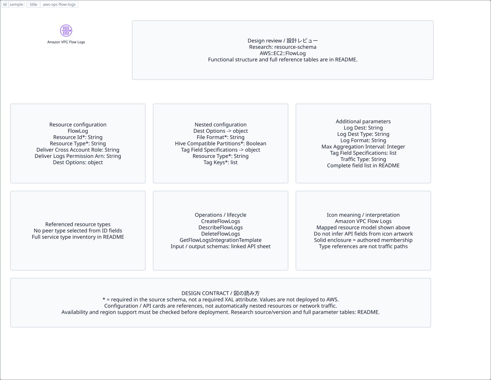

# `aws-vpc-flow-logs` — Amazon VPC Flow Logs

[SVG preview](sample.svg) · [Editable XAL](sample.xal) · [Catalog](../README.md)



AWS resource icon. Use a label and explicit annotations to describe its role; scope is selected by the author.

- Kind: `resource`; category: Networking Content Delivery.
- Diagram scope: `logical` (recommendation, not AWS deployment validation).
- Default catalog ID: 1580. Covered catalog IDs: 1580.
- Implementation: V1 and V2; fixed AWS icon with a wrapped label and explicit functional annotations.

## Parameters

`id` is a required, unique connection ID, not a catalog number. `label`/`title`/`name` override the label; an empty label hides it. `size` > 0 defaults to 48 px. `label-width` > 0 defaults to 160 px (default box width, at least icon size + 12 px). Explicit `width`/`height` must contain the icon and label. `visible="false"` hides it. Children and icon overrides are not supported; use a group for containment.

`detail` adds a free-form diagram annotation. `show-details="false"` hides annotation text. Only supplied values are shown; none are sent to AWS. Service/resource annotations appear on separate wrapped lines.

| Parameter | Type | Meaning | Example |
|---|---|---|---|
| `traffic` | text | Traffic/protocol annotation | `HTTPS` |

## Review notes

The catalog provides a baseline for per-component development, not a simulation of the AWS control plane. This component's current functional parameters are the ones listed above. Additional service-specific visual behavior can be developed here without replacing catalog IDs in diagrams. Edit `sample.xal`, then run:

```sh
npm run generate:aws-samples -- --render --tag=aws-vpc-flow-logs
```

<!-- aws-functional-research:start -->
## 機能調査・構成デザイン（2026-09-06）

分類: `resource-schema`。サービス文脈: [`aws-virtual-private-cloud`](../aws-virtual-private-cloud/README.md)。

サンプルはアイコンと、設定・内包構造・関連リソース・操作を分離したレビューシートです。設定カードは編集可能な `rectangle`、グループは既存の専用タグで実装しています。カードのフィールド名を新しい XAL 属性として受理するわけではありません。専用タグが受理する属性は上の Parameters 表を参照してください。

実線の通信と、設定の参照・同じサービスに属する型一覧を区別します。スキーマの必須項目は AWS 側の仕様であり、図の必須入力ではありません。記載の構成モデル/API は取り込んだ公式資料の範囲であり、全リージョン・全機能の完全性や稼働可否を保証しません。

### 構成モデル: `AWS::EC2::FlowLog`

[公式リファレンス](https://docs.aws.amazon.com/AWSCloudFormation/latest/UserGuide/aws-resource-ec2-flowlog.html)。全 13 プロパティを型付きで列挙します（表示カードには主要項目のみ）。

| Field | Type | Required in AWS schema |
|---|---|---|
| [DeliverCrossAccountRole](https://docs.aws.amazon.com/AWSCloudFormation/latest/UserGuide/aws-resource-ec2-flowlog.html#cfn-ec2-flowlog-delivercrossaccountrole) | `String` | no |
| [DeliverLogsPermissionArn](https://docs.aws.amazon.com/AWSCloudFormation/latest/UserGuide/aws-resource-ec2-flowlog.html#cfn-ec2-flowlog-deliverlogspermissionarn) | `String` | no |
| [DestinationOptions](https://docs.aws.amazon.com/AWSCloudFormation/latest/UserGuide/aws-resource-ec2-flowlog.html#cfn-ec2-flowlog-destinationoptions) | `DestinationOptions` | no |
| [LogDestination](https://docs.aws.amazon.com/AWSCloudFormation/latest/UserGuide/aws-resource-ec2-flowlog.html#cfn-ec2-flowlog-logdestination) | `String` | no |
| [LogDestinationType](https://docs.aws.amazon.com/AWSCloudFormation/latest/UserGuide/aws-resource-ec2-flowlog.html#cfn-ec2-flowlog-logdestinationtype) | `String` | no |
| [LogFormat](https://docs.aws.amazon.com/AWSCloudFormation/latest/UserGuide/aws-resource-ec2-flowlog.html#cfn-ec2-flowlog-logformat) | `String` | no |
| [LogGroupName](https://docs.aws.amazon.com/AWSCloudFormation/latest/UserGuide/aws-resource-ec2-flowlog.html#cfn-ec2-flowlog-loggroupname) | `String` | no |
| [MaxAggregationInterval](https://docs.aws.amazon.com/AWSCloudFormation/latest/UserGuide/aws-resource-ec2-flowlog.html#cfn-ec2-flowlog-maxaggregationinterval) | `Integer` | no |
| [ResourceId](https://docs.aws.amazon.com/AWSCloudFormation/latest/UserGuide/aws-resource-ec2-flowlog.html#cfn-ec2-flowlog-resourceid) | `String` | yes |
| [ResourceType](https://docs.aws.amazon.com/AWSCloudFormation/latest/UserGuide/aws-resource-ec2-flowlog.html#cfn-ec2-flowlog-resourcetype) | `String` | yes |
| [TagFieldSpecifications](https://docs.aws.amazon.com/AWSCloudFormation/latest/UserGuide/aws-resource-ec2-flowlog.html#cfn-ec2-flowlog-tagfieldspecifications) | `List<TagFieldSpecification>` | no |
| [Tags](https://docs.aws.amazon.com/AWSCloudFormation/latest/UserGuide/aws-resource-ec2-flowlog.html#cfn-ec2-flowlog-tags) | `List<Tag>` | no |
| [TrafficType](https://docs.aws.amazon.com/AWSCloudFormation/latest/UserGuide/aws-resource-ec2-flowlog.html#cfn-ec2-flowlog-traffictype) | `String` | no |

#### DestinationOptions → `AWS::EC2::FlowLog.DestinationOptions`

| Field | Type | Required in AWS schema |
|---|---|---|
| [FileFormat](https://docs.aws.amazon.com/AWSCloudFormation/latest/UserGuide/aws-properties-ec2-flowlog-destinationoptions.html#cfn-ec2-flowlog-destinationoptions-fileformat) | `String` | yes |
| [HiveCompatiblePartitions](https://docs.aws.amazon.com/AWSCloudFormation/latest/UserGuide/aws-properties-ec2-flowlog-destinationoptions.html#cfn-ec2-flowlog-destinationoptions-hivecompatiblepartitions) | `Boolean` | yes |
| [PerHourPartition](https://docs.aws.amazon.com/AWSCloudFormation/latest/UserGuide/aws-properties-ec2-flowlog-destinationoptions.html#cfn-ec2-flowlog-destinationoptions-perhourpartition) | `Boolean` | yes |

#### TagFieldSpecifications → `AWS::EC2::FlowLog.TagFieldSpecification`

| Field | Type | Required in AWS schema |
|---|---|---|
| [ResourceType](https://docs.aws.amazon.com/AWSCloudFormation/latest/UserGuide/aws-properties-ec2-flowlog-tagfieldspecification.html#cfn-ec2-flowlog-tagfieldspecification-resourcetype) | `String` | yes |
| [TagKeys](https://docs.aws.amazon.com/AWSCloudFormation/latest/UserGuide/aws-properties-ec2-flowlog-tagfieldspecification.html#cfn-ec2-flowlog-tagfieldspecification-tagkeys) | `List<String>` | yes |

### 関連する構成リソース（121 型）

同じサービス文脈の型一覧です。すべてがこのアイコンの子リソースという意味ではありません。さらに深い入れ子は [公式スキーマのスナップショット](../research/cloudformation-models.json) に記録しています。

- [AWS::EC2::FlowLog](https://docs.aws.amazon.com/AWSCloudFormation/latest/UserGuide/aws-resource-ec2-flowlog.html)
- [AWS::EC2::CapacityManagerDataExport](https://docs.aws.amazon.com/AWSCloudFormation/latest/UserGuide/aws-resource-ec2-capacitymanagerdataexport.html)
- [AWS::EC2::CapacityReservation](https://docs.aws.amazon.com/AWSCloudFormation/latest/UserGuide/aws-resource-ec2-capacityreservation.html)
- [AWS::EC2::CapacityReservationFleet](https://docs.aws.amazon.com/AWSCloudFormation/latest/UserGuide/aws-resource-ec2-capacityreservationfleet.html)
- [AWS::EC2::CarrierGateway](https://docs.aws.amazon.com/AWSCloudFormation/latest/UserGuide/aws-resource-ec2-carriergateway.html)
- [AWS::EC2::ClientVpnAuthorizationRule](https://docs.aws.amazon.com/AWSCloudFormation/latest/UserGuide/aws-resource-ec2-clientvpnauthorizationrule.html)
- [AWS::EC2::ClientVpnEndpoint](https://docs.aws.amazon.com/AWSCloudFormation/latest/UserGuide/aws-resource-ec2-clientvpnendpoint.html)
- [AWS::EC2::ClientVpnRoute](https://docs.aws.amazon.com/AWSCloudFormation/latest/UserGuide/aws-resource-ec2-clientvpnroute.html)
- [AWS::EC2::ClientVpnTargetNetworkAssociation](https://docs.aws.amazon.com/AWSCloudFormation/latest/UserGuide/aws-resource-ec2-clientvpntargetnetworkassociation.html)
- [AWS::EC2::CustomerGateway](https://docs.aws.amazon.com/AWSCloudFormation/latest/UserGuide/aws-resource-ec2-customergateway.html)
- [AWS::EC2::DHCPOptions](https://docs.aws.amazon.com/AWSCloudFormation/latest/UserGuide/aws-resource-ec2-dhcpoptions.html)
- [AWS::EC2::EC2Fleet](https://docs.aws.amazon.com/AWSCloudFormation/latest/UserGuide/aws-resource-ec2-ec2fleet.html)
- [AWS::EC2::EgressOnlyInternetGateway](https://docs.aws.amazon.com/AWSCloudFormation/latest/UserGuide/aws-resource-ec2-egressonlyinternetgateway.html)
- [AWS::EC2::EIP](https://docs.aws.amazon.com/AWSCloudFormation/latest/UserGuide/aws-resource-ec2-eip.html)
- [AWS::EC2::EIPAssociation](https://docs.aws.amazon.com/AWSCloudFormation/latest/UserGuide/aws-resource-ec2-eipassociation.html)
- [AWS::EC2::EnclaveCertificateIamRoleAssociation](https://docs.aws.amazon.com/AWSCloudFormation/latest/UserGuide/aws-resource-ec2-enclavecertificateiamroleassociation.html)
- [AWS::EC2::ExportInstanceTask](https://docs.aws.amazon.com/AWSCloudFormation/latest/UserGuide/aws-resource-ec2-exportinstancetask.html)
- [AWS::EC2::FpgaImage](https://docs.aws.amazon.com/AWSCloudFormation/latest/UserGuide/aws-resource-ec2-fpgaimage.html)
- [AWS::EC2::GatewayRouteTableAssociation](https://docs.aws.amazon.com/AWSCloudFormation/latest/UserGuide/aws-resource-ec2-gatewayroutetableassociation.html)
- [AWS::EC2::Host](https://docs.aws.amazon.com/AWSCloudFormation/latest/UserGuide/aws-resource-ec2-host.html)
- [AWS::EC2::Instance](https://docs.aws.amazon.com/AWSCloudFormation/latest/UserGuide/aws-resource-ec2-instance.html)
- [AWS::EC2::InstanceConnectEndpoint](https://docs.aws.amazon.com/AWSCloudFormation/latest/UserGuide/aws-resource-ec2-instanceconnectendpoint.html)
- [AWS::EC2::InternetGateway](https://docs.aws.amazon.com/AWSCloudFormation/latest/UserGuide/aws-resource-ec2-internetgateway.html)
- [AWS::EC2::IPAM](https://docs.aws.amazon.com/AWSCloudFormation/latest/UserGuide/aws-resource-ec2-ipam.html)
- [AWS::EC2::IPAMAllocation](https://docs.aws.amazon.com/AWSCloudFormation/latest/UserGuide/aws-resource-ec2-ipamallocation.html)
- [AWS::EC2::IpamExternalResourceVerificationToken](https://docs.aws.amazon.com/AWSCloudFormation/latest/UserGuide/aws-resource-ec2-ipamexternalresourceverificationtoken.html)
- [AWS::EC2::IPAMPool](https://docs.aws.amazon.com/AWSCloudFormation/latest/UserGuide/aws-resource-ec2-ipampool.html)
- [AWS::EC2::IPAMPoolCidr](https://docs.aws.amazon.com/AWSCloudFormation/latest/UserGuide/aws-resource-ec2-ipampoolcidr.html)
- [AWS::EC2::IPAMPrefixListResolver](https://docs.aws.amazon.com/AWSCloudFormation/latest/UserGuide/aws-resource-ec2-ipamprefixlistresolver.html)
- [AWS::EC2::IPAMPrefixListResolverTarget](https://docs.aws.amazon.com/AWSCloudFormation/latest/UserGuide/aws-resource-ec2-ipamprefixlistresolvertarget.html)
- [AWS::EC2::IPAMResourceDiscovery](https://docs.aws.amazon.com/AWSCloudFormation/latest/UserGuide/aws-resource-ec2-ipamresourcediscovery.html)
- [AWS::EC2::IPAMResourceDiscoveryAssociation](https://docs.aws.amazon.com/AWSCloudFormation/latest/UserGuide/aws-resource-ec2-ipamresourcediscoveryassociation.html)
- [AWS::EC2::IPAMScope](https://docs.aws.amazon.com/AWSCloudFormation/latest/UserGuide/aws-resource-ec2-ipamscope.html)
- [AWS::EC2::IpPoolRouteTableAssociation](https://docs.aws.amazon.com/AWSCloudFormation/latest/UserGuide/aws-resource-ec2-ippoolroutetableassociation.html)
- [AWS::EC2::KeyPair](https://docs.aws.amazon.com/AWSCloudFormation/latest/UserGuide/aws-resource-ec2-keypair.html)
- [AWS::EC2::LaunchTemplate](https://docs.aws.amazon.com/AWSCloudFormation/latest/UserGuide/aws-resource-ec2-launchtemplate.html)
- [AWS::EC2::LocalGatewayRoute](https://docs.aws.amazon.com/AWSCloudFormation/latest/UserGuide/aws-resource-ec2-localgatewayroute.html)
- [AWS::EC2::LocalGatewayRouteTable](https://docs.aws.amazon.com/AWSCloudFormation/latest/UserGuide/aws-resource-ec2-localgatewayroutetable.html)
- [AWS::EC2::LocalGatewayRouteTableVirtualInterfaceGroupAssociation](https://docs.aws.amazon.com/AWSCloudFormation/latest/UserGuide/aws-resource-ec2-localgatewayroutetablevirtualinterfacegroupassociation.html)
- [AWS::EC2::LocalGatewayRouteTableVPCAssociation](https://docs.aws.amazon.com/AWSCloudFormation/latest/UserGuide/aws-resource-ec2-localgatewayroutetablevpcassociation.html)
- [AWS::EC2::LocalGatewayVirtualInterface](https://docs.aws.amazon.com/AWSCloudFormation/latest/UserGuide/aws-resource-ec2-localgatewayvirtualinterface.html)
- [AWS::EC2::LocalGatewayVirtualInterfaceGroup](https://docs.aws.amazon.com/AWSCloudFormation/latest/UserGuide/aws-resource-ec2-localgatewayvirtualinterfacegroup.html)
- [AWS::EC2::NatGateway](https://docs.aws.amazon.com/AWSCloudFormation/latest/UserGuide/aws-resource-ec2-natgateway.html)
- [AWS::EC2::NetworkAcl](https://docs.aws.amazon.com/AWSCloudFormation/latest/UserGuide/aws-resource-ec2-networkacl.html)
- [AWS::EC2::NetworkAclEntry](https://docs.aws.amazon.com/AWSCloudFormation/latest/UserGuide/aws-resource-ec2-networkaclentry.html)
- [AWS::EC2::NetworkInsightsAccessScope](https://docs.aws.amazon.com/AWSCloudFormation/latest/UserGuide/aws-resource-ec2-networkinsightsaccessscope.html)
- [AWS::EC2::NetworkInsightsAccessScopeAnalysis](https://docs.aws.amazon.com/AWSCloudFormation/latest/UserGuide/aws-resource-ec2-networkinsightsaccessscopeanalysis.html)
- [AWS::EC2::NetworkInsightsAnalysis](https://docs.aws.amazon.com/AWSCloudFormation/latest/UserGuide/aws-resource-ec2-networkinsightsanalysis.html)
- [AWS::EC2::NetworkInsightsPath](https://docs.aws.amazon.com/AWSCloudFormation/latest/UserGuide/aws-resource-ec2-networkinsightspath.html)
- [AWS::EC2::NetworkInterface](https://docs.aws.amazon.com/AWSCloudFormation/latest/UserGuide/aws-resource-ec2-networkinterface.html)
- [AWS::EC2::NetworkInterfaceAttachment](https://docs.aws.amazon.com/AWSCloudFormation/latest/UserGuide/aws-resource-ec2-networkinterfaceattachment.html)
- [AWS::EC2::NetworkInterfacePermission](https://docs.aws.amazon.com/AWSCloudFormation/latest/UserGuide/aws-resource-ec2-networkinterfacepermission.html)
- [AWS::EC2::NetworkPerformanceMetricSubscription](https://docs.aws.amazon.com/AWSCloudFormation/latest/UserGuide/aws-resource-ec2-networkperformancemetricsubscription.html)
- [AWS::EC2::PlacementGroup](https://docs.aws.amazon.com/AWSCloudFormation/latest/UserGuide/aws-resource-ec2-placementgroup.html)
- [AWS::EC2::PrefixList](https://docs.aws.amazon.com/AWSCloudFormation/latest/UserGuide/aws-resource-ec2-prefixlist.html)
- [AWS::EC2::ReplaceRootVolumeTask](https://docs.aws.amazon.com/AWSCloudFormation/latest/UserGuide/aws-resource-ec2-replacerootvolumetask.html)
- [AWS::EC2::Route](https://docs.aws.amazon.com/AWSCloudFormation/latest/UserGuide/aws-resource-ec2-route.html)
- [AWS::EC2::RouteServer](https://docs.aws.amazon.com/AWSCloudFormation/latest/UserGuide/aws-resource-ec2-routeserver.html)
- [AWS::EC2::RouteServerAssociation](https://docs.aws.amazon.com/AWSCloudFormation/latest/UserGuide/aws-resource-ec2-routeserverassociation.html)
- [AWS::EC2::RouteServerEndpoint](https://docs.aws.amazon.com/AWSCloudFormation/latest/UserGuide/aws-resource-ec2-routeserverendpoint.html)
- [AWS::EC2::RouteServerPeer](https://docs.aws.amazon.com/AWSCloudFormation/latest/UserGuide/aws-resource-ec2-routeserverpeer.html)
- [AWS::EC2::RouteServerPropagation](https://docs.aws.amazon.com/AWSCloudFormation/latest/UserGuide/aws-resource-ec2-routeserverpropagation.html)
- [AWS::EC2::RouteTable](https://docs.aws.amazon.com/AWSCloudFormation/latest/UserGuide/aws-resource-ec2-routetable.html)
- [AWS::EC2::SecurityGroup](https://docs.aws.amazon.com/AWSCloudFormation/latest/UserGuide/aws-resource-ec2-securitygroup.html)
- [AWS::EC2::SecurityGroupEgress](https://docs.aws.amazon.com/AWSCloudFormation/latest/UserGuide/aws-resource-ec2-securitygroupegress.html)
- [AWS::EC2::SecurityGroupIngress](https://docs.aws.amazon.com/AWSCloudFormation/latest/UserGuide/aws-resource-ec2-securitygroupingress.html)
- [AWS::EC2::SecurityGroupVpcAssociation](https://docs.aws.amazon.com/AWSCloudFormation/latest/UserGuide/aws-resource-ec2-securitygroupvpcassociation.html)
- [AWS::EC2::SnapshotBlockPublicAccess](https://docs.aws.amazon.com/AWSCloudFormation/latest/UserGuide/aws-resource-ec2-snapshotblockpublicaccess.html)
- [AWS::EC2::SpotFleet](https://docs.aws.amazon.com/AWSCloudFormation/latest/UserGuide/aws-resource-ec2-spotfleet.html)
- [AWS::EC2::SqlHaStandbyDetectedInstance](https://docs.aws.amazon.com/AWSCloudFormation/latest/UserGuide/aws-resource-ec2-sqlhastandbydetectedinstance.html)
- [AWS::EC2::Subnet](https://docs.aws.amazon.com/AWSCloudFormation/latest/UserGuide/aws-resource-ec2-subnet.html)
- [AWS::EC2::SubnetCidrBlock](https://docs.aws.amazon.com/AWSCloudFormation/latest/UserGuide/aws-resource-ec2-subnetcidrblock.html)
- [AWS::EC2::SubnetNetworkAclAssociation](https://docs.aws.amazon.com/AWSCloudFormation/latest/UserGuide/aws-resource-ec2-subnetnetworkaclassociation.html)
- [AWS::EC2::SubnetRouteTableAssociation](https://docs.aws.amazon.com/AWSCloudFormation/latest/UserGuide/aws-resource-ec2-subnetroutetableassociation.html)
- [AWS::EC2::TrafficMirrorFilter](https://docs.aws.amazon.com/AWSCloudFormation/latest/UserGuide/aws-resource-ec2-trafficmirrorfilter.html)
- [AWS::EC2::TrafficMirrorFilterRule](https://docs.aws.amazon.com/AWSCloudFormation/latest/UserGuide/aws-resource-ec2-trafficmirrorfilterrule.html)
- [AWS::EC2::TrafficMirrorSession](https://docs.aws.amazon.com/AWSCloudFormation/latest/UserGuide/aws-resource-ec2-trafficmirrorsession.html)
- [AWS::EC2::TrafficMirrorTarget](https://docs.aws.amazon.com/AWSCloudFormation/latest/UserGuide/aws-resource-ec2-trafficmirrortarget.html)
- [AWS::EC2::TransitGateway](https://docs.aws.amazon.com/AWSCloudFormation/latest/UserGuide/aws-resource-ec2-transitgateway.html)
- [AWS::EC2::TransitGatewayAttachment](https://docs.aws.amazon.com/AWSCloudFormation/latest/UserGuide/aws-resource-ec2-transitgatewayattachment.html)
- [AWS::EC2::TransitGatewayConnect](https://docs.aws.amazon.com/AWSCloudFormation/latest/UserGuide/aws-resource-ec2-transitgatewayconnect.html)
- [AWS::EC2::TransitGatewayConnectPeer](https://docs.aws.amazon.com/AWSCloudFormation/latest/UserGuide/aws-resource-ec2-transitgatewayconnectpeer.html)
- [AWS::EC2::TransitGatewayMeteringPolicy](https://docs.aws.amazon.com/AWSCloudFormation/latest/UserGuide/aws-resource-ec2-transitgatewaymeteringpolicy.html)
- [AWS::EC2::TransitGatewayMeteringPolicyEntry](https://docs.aws.amazon.com/AWSCloudFormation/latest/UserGuide/aws-resource-ec2-transitgatewaymeteringpolicyentry.html)
- [AWS::EC2::TransitGatewayMulticastDomain](https://docs.aws.amazon.com/AWSCloudFormation/latest/UserGuide/aws-resource-ec2-transitgatewaymulticastdomain.html)
- [AWS::EC2::TransitGatewayMulticastDomainAssociation](https://docs.aws.amazon.com/AWSCloudFormation/latest/UserGuide/aws-resource-ec2-transitgatewaymulticastdomainassociation.html)
- [AWS::EC2::TransitGatewayMulticastGroupMember](https://docs.aws.amazon.com/AWSCloudFormation/latest/UserGuide/aws-resource-ec2-transitgatewaymulticastgroupmember.html)
- [AWS::EC2::TransitGatewayMulticastGroupSource](https://docs.aws.amazon.com/AWSCloudFormation/latest/UserGuide/aws-resource-ec2-transitgatewaymulticastgroupsource.html)
- [AWS::EC2::TransitGatewayPeeringAttachment](https://docs.aws.amazon.com/AWSCloudFormation/latest/UserGuide/aws-resource-ec2-transitgatewaypeeringattachment.html)
- [AWS::EC2::TransitGatewayPolicyTable](https://docs.aws.amazon.com/AWSCloudFormation/latest/UserGuide/aws-resource-ec2-transitgatewaypolicytable.html)
- [AWS::EC2::TransitGatewayPolicyTableAssociation](https://docs.aws.amazon.com/AWSCloudFormation/latest/UserGuide/aws-resource-ec2-transitgatewaypolicytableassociation.html)
- [AWS::EC2::TransitGatewayPolicyTableEntry](https://docs.aws.amazon.com/AWSCloudFormation/latest/UserGuide/aws-resource-ec2-transitgatewaypolicytableentry.html)
- [AWS::EC2::TransitGatewayRoute](https://docs.aws.amazon.com/AWSCloudFormation/latest/UserGuide/aws-resource-ec2-transitgatewayroute.html)
- [AWS::EC2::TransitGatewayRouteTable](https://docs.aws.amazon.com/AWSCloudFormation/latest/UserGuide/aws-resource-ec2-transitgatewayroutetable.html)
- [AWS::EC2::TransitGatewayRouteTableAssociation](https://docs.aws.amazon.com/AWSCloudFormation/latest/UserGuide/aws-resource-ec2-transitgatewayroutetableassociation.html)
- [AWS::EC2::TransitGatewayRouteTablePropagation](https://docs.aws.amazon.com/AWSCloudFormation/latest/UserGuide/aws-resource-ec2-transitgatewayroutetablepropagation.html)
- [AWS::EC2::TransitGatewayVpcAttachment](https://docs.aws.amazon.com/AWSCloudFormation/latest/UserGuide/aws-resource-ec2-transitgatewayvpcattachment.html)
- [AWS::EC2::VerifiedAccessEndpoint](https://docs.aws.amazon.com/AWSCloudFormation/latest/UserGuide/aws-resource-ec2-verifiedaccessendpoint.html)
- [AWS::EC2::VerifiedAccessGroup](https://docs.aws.amazon.com/AWSCloudFormation/latest/UserGuide/aws-resource-ec2-verifiedaccessgroup.html)
- [AWS::EC2::VerifiedAccessInstance](https://docs.aws.amazon.com/AWSCloudFormation/latest/UserGuide/aws-resource-ec2-verifiedaccessinstance.html)
- [AWS::EC2::VerifiedAccessTrustProvider](https://docs.aws.amazon.com/AWSCloudFormation/latest/UserGuide/aws-resource-ec2-verifiedaccesstrustprovider.html)
- [AWS::EC2::Volume](https://docs.aws.amazon.com/AWSCloudFormation/latest/UserGuide/aws-resource-ec2-volume.html)
- [AWS::EC2::VolumeAttachment](https://docs.aws.amazon.com/AWSCloudFormation/latest/UserGuide/aws-resource-ec2-volumeattachment.html)
- [AWS::EC2::VPC](https://docs.aws.amazon.com/AWSCloudFormation/latest/UserGuide/aws-resource-ec2-vpc.html)
- [AWS::EC2::VPCBlockPublicAccessExclusion](https://docs.aws.amazon.com/AWSCloudFormation/latest/UserGuide/aws-resource-ec2-vpcblockpublicaccessexclusion.html)
- [AWS::EC2::VPCBlockPublicAccessOptions](https://docs.aws.amazon.com/AWSCloudFormation/latest/UserGuide/aws-resource-ec2-vpcblockpublicaccessoptions.html)
- [AWS::EC2::VPCCidrBlock](https://docs.aws.amazon.com/AWSCloudFormation/latest/UserGuide/aws-resource-ec2-vpccidrblock.html)
- [AWS::EC2::VPCDHCPOptionsAssociation](https://docs.aws.amazon.com/AWSCloudFormation/latest/UserGuide/aws-resource-ec2-vpcdhcpoptionsassociation.html)
- [AWS::EC2::VPCEncryptionControl](https://docs.aws.amazon.com/AWSCloudFormation/latest/UserGuide/aws-resource-ec2-vpcencryptioncontrol.html)
- [AWS::EC2::VPCEndpoint](https://docs.aws.amazon.com/AWSCloudFormation/latest/UserGuide/aws-resource-ec2-vpcendpoint.html)
- [AWS::EC2::VPCEndpointConnectionNotification](https://docs.aws.amazon.com/AWSCloudFormation/latest/UserGuide/aws-resource-ec2-vpcendpointconnectionnotification.html)
- [AWS::EC2::VPCEndpointService](https://docs.aws.amazon.com/AWSCloudFormation/latest/UserGuide/aws-resource-ec2-vpcendpointservice.html)
- [AWS::EC2::VPCEndpointServicePermissions](https://docs.aws.amazon.com/AWSCloudFormation/latest/UserGuide/aws-resource-ec2-vpcendpointservicepermissions.html)
- [AWS::EC2::VPCGatewayAttachment](https://docs.aws.amazon.com/AWSCloudFormation/latest/UserGuide/aws-resource-ec2-vpcgatewayattachment.html)
- [AWS::EC2::VPCPeeringConnection](https://docs.aws.amazon.com/AWSCloudFormation/latest/UserGuide/aws-resource-ec2-vpcpeeringconnection.html)
- [AWS::EC2::VPNConcentrator](https://docs.aws.amazon.com/AWSCloudFormation/latest/UserGuide/aws-resource-ec2-vpnconcentrator.html)
- [AWS::EC2::VPNConnection](https://docs.aws.amazon.com/AWSCloudFormation/latest/UserGuide/aws-resource-ec2-vpnconnection.html)
- [AWS::EC2::VpnConnectionDeviceType](https://docs.aws.amazon.com/AWSCloudFormation/latest/UserGuide/aws-resource-ec2-vpnconnectiondevicetype.html)
- [AWS::EC2::VPNConnectionRoute](https://docs.aws.amazon.com/AWSCloudFormation/latest/UserGuide/aws-resource-ec2-vpnconnectionroute.html)
- [AWS::EC2::VPNGateway](https://docs.aws.amazon.com/AWSCloudFormation/latest/UserGuide/aws-resource-ec2-vpngateway.html)
- [AWS::EC2::VPNGatewayRoutePropagation](https://docs.aws.amazon.com/AWSCloudFormation/latest/UserGuide/aws-resource-ec2-vpngatewayroutepropagation.html)

### API の操作・パラメータ

- [Amazon Elastic Compute Cloud: 802 操作の入力・出力一覧](../research/api/ec2.md)（API version 2016-11-15）

### 出典・調査範囲

- [公式資料 1](https://docs.aws.amazon.com/AWSCloudFormation/latest/UserGuide/aws-resource-ec2-flowlog.html)
- [公式資料 2](https://github.com/boto/botocore/blob/develop/botocore/data/ec2/2016-11-15/service-2.json)

CloudFormation 仕様 263.0.0、AWS SDK 431 サービスモデルをオフラインで参照。取得日・元データの SHA-256 は [調査マニフェスト](../research/README.md) を参照。API モデル名・フィールド名は仕様から抽出し、説明本文を転載していません。利用可能性は全サービス一律には確認できないため、提供終了の確認がないものも「現在利用可能」と断定していません。

### 次の部品レビュー

- 本アイコンが独立したリソースか、機能・状態・デバイスの記号かを確認する。
- 詳細カードのうち専用の子タグ・参照属性として実装する範囲を選ぶ。
- 通信、制御、認証、監視の関係を分け、必要な接続点・配置制約を確認する。
- 編集後は `npm run generate:aws-samples -- --render --tag=aws-vpc-flow-logs`。通常の再描画は XAL/README を上書きしない。
<!-- aws-functional-research:end -->
