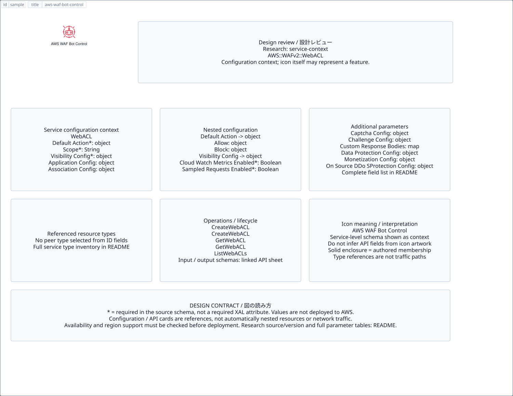

# `aws-waf-bot-control` — AWS WAF Bot Control

[SVG preview](sample.svg) · [Editable XAL](sample.xal) · [Catalog](../README.md)



AWS resource icon. Use a label and explicit annotations to describe its role; scope is selected by the author.

- Kind: `resource`; category: Security Identity Compliance.
- Diagram scope: `logical` (recommendation, not AWS deployment validation).
- Default catalog ID: 1486. Covered catalog IDs: 1486.
- Implementation: V1 and V2; fixed AWS icon with a wrapped label and explicit functional annotations.

## Parameters

`id` is a required, unique connection ID, not a catalog number. `label`/`title`/`name` override the label; an empty label hides it. `size` > 0 defaults to 48 px. `label-width` > 0 defaults to 160 px (default box width, at least icon size + 12 px). Explicit `width`/`height` must contain the icon and label. `visible="false"` hides it. Children and icon overrides are not supported; use a group for containment.

`detail` adds a free-form diagram annotation. `show-details="false"` hides annotation text. Only supplied values are shown; none are sent to AWS. Service/resource annotations appear on separate wrapped lines.

| Parameter | Type | Meaning | Example |
|---|---|---|---|
| `protects` | text | Protected resource or policy annotation | `Application access` |

## Review notes

The catalog provides a baseline for per-component development, not a simulation of the AWS control plane. This component's current functional parameters are the ones listed above. Additional service-specific visual behavior can be developed here without replacing catalog IDs in diagrams. Edit `sample.xal`, then run:

```sh
npm run generate:aws-samples -- --render --tag=aws-waf-bot-control
```

<!-- aws-functional-research:start -->
## 機能調査・構成デザイン（2026-09-06）

分類: `service-context`。サービス文脈: [`aws-waf`](../aws-waf/README.md)。

サンプルはアイコンと、設定・内包構造・関連リソース・操作を分離したレビューシートです。設定カードは編集可能な `rectangle`、グループは既存の専用タグで実装しています。カードのフィールド名を新しい XAL 属性として受理するわけではありません。専用タグが受理する属性は上の Parameters 表を参照してください。

実線の通信と、設定の参照・同じサービスに属する型一覧を区別します。スキーマの必須項目は AWS 側の仕様であり、図の必須入力ではありません。記載の構成モデル/API は取り込んだ公式資料の範囲であり、全リージョン・全機能の完全性や稼働可否を保証しません。

**重要:** このアイコンに対応する独立した構成リソースを断定せず、所属サービスの構成モデルを参考表示しています。アイコン名や絵柄から属性・親子関係・通信を推測しません。

### 構成モデル: `AWS::WAFv2::WebACL`

[公式リファレンス](https://docs.aws.amazon.com/AWSCloudFormation/latest/UserGuide/aws-resource-wafv2-webacl.html)。全 16 プロパティを型付きで列挙します（表示カードには主要項目のみ）。

| Field | Type | Required in AWS schema |
|---|---|---|
| [ApplicationConfig](https://docs.aws.amazon.com/AWSCloudFormation/latest/UserGuide/aws-resource-wafv2-webacl.html#cfn-wafv2-webacl-applicationconfig) | `ApplicationConfig` | no |
| [AssociationConfig](https://docs.aws.amazon.com/AWSCloudFormation/latest/UserGuide/aws-resource-wafv2-webacl.html#cfn-wafv2-webacl-associationconfig) | `AssociationConfig` | no |
| [CaptchaConfig](https://docs.aws.amazon.com/AWSCloudFormation/latest/UserGuide/aws-resource-wafv2-webacl.html#cfn-wafv2-webacl-captchaconfig) | `CaptchaConfig` | no |
| [ChallengeConfig](https://docs.aws.amazon.com/AWSCloudFormation/latest/UserGuide/aws-resource-wafv2-webacl.html#cfn-wafv2-webacl-challengeconfig) | `ChallengeConfig` | no |
| [CustomResponseBodies](https://docs.aws.amazon.com/AWSCloudFormation/latest/UserGuide/aws-resource-wafv2-webacl.html#cfn-wafv2-webacl-customresponsebodies) | `Map<CustomResponseBody>` | no |
| [DataProtectionConfig](https://docs.aws.amazon.com/AWSCloudFormation/latest/UserGuide/aws-resource-wafv2-webacl.html#cfn-wafv2-webacl-dataprotectionconfig) | `DataProtectionConfig` | no |
| [DefaultAction](https://docs.aws.amazon.com/AWSCloudFormation/latest/UserGuide/aws-resource-wafv2-webacl.html#cfn-wafv2-webacl-defaultaction) | `DefaultAction` | yes |
| [Description](https://docs.aws.amazon.com/AWSCloudFormation/latest/UserGuide/aws-resource-wafv2-webacl.html#cfn-wafv2-webacl-description) | `String` | no |
| [MonetizationConfig](https://docs.aws.amazon.com/AWSCloudFormation/latest/UserGuide/aws-resource-wafv2-webacl.html#cfn-wafv2-webacl-monetizationconfig) | `MonetizationConfig` | no |
| [Name](https://docs.aws.amazon.com/AWSCloudFormation/latest/UserGuide/aws-resource-wafv2-webacl.html#cfn-wafv2-webacl-name) | `String` | no |
| [OnSourceDDoSProtectionConfig](https://docs.aws.amazon.com/AWSCloudFormation/latest/UserGuide/aws-resource-wafv2-webacl.html#cfn-wafv2-webacl-onsourceddosprotectionconfig) | `OnSourceDDoSProtectionConfig` | no |
| [Rules](https://docs.aws.amazon.com/AWSCloudFormation/latest/UserGuide/aws-resource-wafv2-webacl.html#cfn-wafv2-webacl-rules) | `List<Rule>` | no |
| [Scope](https://docs.aws.amazon.com/AWSCloudFormation/latest/UserGuide/aws-resource-wafv2-webacl.html#cfn-wafv2-webacl-scope) | `String` | yes |
| [Tags](https://docs.aws.amazon.com/AWSCloudFormation/latest/UserGuide/aws-resource-wafv2-webacl.html#cfn-wafv2-webacl-tags) | `List<Tag>` | no |
| [TokenDomains](https://docs.aws.amazon.com/AWSCloudFormation/latest/UserGuide/aws-resource-wafv2-webacl.html#cfn-wafv2-webacl-tokendomains) | `List<String>` | no |
| [VisibilityConfig](https://docs.aws.amazon.com/AWSCloudFormation/latest/UserGuide/aws-resource-wafv2-webacl.html#cfn-wafv2-webacl-visibilityconfig) | `VisibilityConfig` | yes |

#### DefaultAction → `AWS::WAFv2::WebACL.DefaultAction`

| Field | Type | Required in AWS schema |
|---|---|---|
| [Allow](https://docs.aws.amazon.com/AWSCloudFormation/latest/UserGuide/aws-properties-wafv2-webacl-defaultaction.html#cfn-wafv2-webacl-defaultaction-allow) | `AllowAction` | no |
| [Block](https://docs.aws.amazon.com/AWSCloudFormation/latest/UserGuide/aws-properties-wafv2-webacl-defaultaction.html#cfn-wafv2-webacl-defaultaction-block) | `BlockAction` | no |

#### VisibilityConfig → `AWS::WAFv2::WebACL.VisibilityConfig`

| Field | Type | Required in AWS schema |
|---|---|---|
| [CloudWatchMetricsEnabled](https://docs.aws.amazon.com/AWSCloudFormation/latest/UserGuide/aws-properties-wafv2-webacl-visibilityconfig.html#cfn-wafv2-webacl-visibilityconfig-cloudwatchmetricsenabled) | `Boolean` | yes |
| [MetricName](https://docs.aws.amazon.com/AWSCloudFormation/latest/UserGuide/aws-properties-wafv2-webacl-visibilityconfig.html#cfn-wafv2-webacl-visibilityconfig-metricname) | `String` | yes |
| [SampledRequestsEnabled](https://docs.aws.amazon.com/AWSCloudFormation/latest/UserGuide/aws-properties-wafv2-webacl-visibilityconfig.html#cfn-wafv2-webacl-visibilityconfig-sampledrequestsenabled) | `Boolean` | yes |

#### ApplicationConfig → `AWS::WAFv2::WebACL.ApplicationConfig`

| Field | Type | Required in AWS schema |
|---|---|---|
| [Attributes](https://docs.aws.amazon.com/AWSCloudFormation/latest/UserGuide/aws-properties-wafv2-webacl-applicationconfig.html#cfn-wafv2-webacl-applicationconfig-attributes) | `List<ApplicationAttribute>` | yes |

#### AssociationConfig → `AWS::WAFv2::WebACL.AssociationConfig`

| Field | Type | Required in AWS schema |
|---|---|---|
| [RequestBody](https://docs.aws.amazon.com/AWSCloudFormation/latest/UserGuide/aws-properties-wafv2-webacl-associationconfig.html#cfn-wafv2-webacl-associationconfig-requestbody) | `Map<RequestBodyAssociatedResourceTypeConfig>` | no |

#### CaptchaConfig → `AWS::WAFv2::WebACL.CaptchaConfig`

| Field | Type | Required in AWS schema |
|---|---|---|
| [ImmunityTimeProperty](https://docs.aws.amazon.com/AWSCloudFormation/latest/UserGuide/aws-properties-wafv2-webacl-captchaconfig.html#cfn-wafv2-webacl-captchaconfig-immunitytimeproperty) | `ImmunityTimeProperty` | no |

#### ChallengeConfig → `AWS::WAFv2::WebACL.ChallengeConfig`

| Field | Type | Required in AWS schema |
|---|---|---|
| [ImmunityTimeProperty](https://docs.aws.amazon.com/AWSCloudFormation/latest/UserGuide/aws-properties-wafv2-webacl-challengeconfig.html#cfn-wafv2-webacl-challengeconfig-immunitytimeproperty) | `ImmunityTimeProperty` | no |

#### CustomResponseBodies → `AWS::WAFv2::WebACL.CustomResponseBody`

| Field | Type | Required in AWS schema |
|---|---|---|
| [Content](https://docs.aws.amazon.com/AWSCloudFormation/latest/UserGuide/aws-properties-wafv2-webacl-customresponsebody.html#cfn-wafv2-webacl-customresponsebody-content) | `String` | yes |
| [ContentType](https://docs.aws.amazon.com/AWSCloudFormation/latest/UserGuide/aws-properties-wafv2-webacl-customresponsebody.html#cfn-wafv2-webacl-customresponsebody-contenttype) | `String` | yes |

#### DataProtectionConfig → `AWS::WAFv2::WebACL.DataProtectionConfig`

| Field | Type | Required in AWS schema |
|---|---|---|
| [DataProtections](https://docs.aws.amazon.com/AWSCloudFormation/latest/UserGuide/aws-properties-wafv2-webacl-dataprotectionconfig.html#cfn-wafv2-webacl-dataprotectionconfig-dataprotections) | `List<DataProtect>` | yes |

#### MonetizationConfig → `AWS::WAFv2::WebACL.MonetizationConfig`

| Field | Type | Required in AWS schema |
|---|---|---|
| [CryptoConfig](https://docs.aws.amazon.com/AWSCloudFormation/latest/UserGuide/aws-properties-wafv2-webacl-monetizationconfig.html#cfn-wafv2-webacl-monetizationconfig-cryptoconfig) | `CryptoConfig` | no |
| [CurrencyMode](https://docs.aws.amazon.com/AWSCloudFormation/latest/UserGuide/aws-properties-wafv2-webacl-monetizationconfig.html#cfn-wafv2-webacl-monetizationconfig-currencymode) | `String` | no |

#### OnSourceDDoSProtectionConfig → `AWS::WAFv2::WebACL.OnSourceDDoSProtectionConfig`

| Field | Type | Required in AWS schema |
|---|---|---|
| [ALBLowReputationMode](https://docs.aws.amazon.com/AWSCloudFormation/latest/UserGuide/aws-properties-wafv2-webacl-onsourceddosprotectionconfig.html#cfn-wafv2-webacl-onsourceddosprotectionconfig-alblowreputationmode) | `String` | yes |

#### Rules → `AWS::WAFv2::WebACL.Rule`

| Field | Type | Required in AWS schema |
|---|---|---|
| [Action](https://docs.aws.amazon.com/AWSCloudFormation/latest/UserGuide/aws-properties-wafv2-webacl-rule.html#cfn-wafv2-webacl-rule-action) | `RuleAction` | no |
| [CaptchaConfig](https://docs.aws.amazon.com/AWSCloudFormation/latest/UserGuide/aws-properties-wafv2-webacl-rule.html#cfn-wafv2-webacl-rule-captchaconfig) | `CaptchaConfig` | no |
| [ChallengeConfig](https://docs.aws.amazon.com/AWSCloudFormation/latest/UserGuide/aws-properties-wafv2-webacl-rule.html#cfn-wafv2-webacl-rule-challengeconfig) | `ChallengeConfig` | no |
| [Name](https://docs.aws.amazon.com/AWSCloudFormation/latest/UserGuide/aws-properties-wafv2-webacl-rule.html#cfn-wafv2-webacl-rule-name) | `String` | yes |
| [OverrideAction](https://docs.aws.amazon.com/AWSCloudFormation/latest/UserGuide/aws-properties-wafv2-webacl-rule.html#cfn-wafv2-webacl-rule-overrideaction) | `OverrideAction` | no |
| [Priority](https://docs.aws.amazon.com/AWSCloudFormation/latest/UserGuide/aws-properties-wafv2-webacl-rule.html#cfn-wafv2-webacl-rule-priority) | `Integer` | yes |
| [RuleLabels](https://docs.aws.amazon.com/AWSCloudFormation/latest/UserGuide/aws-properties-wafv2-webacl-rule.html#cfn-wafv2-webacl-rule-rulelabels) | `List<Label>` | no |
| [Statement](https://docs.aws.amazon.com/AWSCloudFormation/latest/UserGuide/aws-properties-wafv2-webacl-rule.html#cfn-wafv2-webacl-rule-statement) | `Statement` | yes |
| [VisibilityConfig](https://docs.aws.amazon.com/AWSCloudFormation/latest/UserGuide/aws-properties-wafv2-webacl-rule.html#cfn-wafv2-webacl-rule-visibilityconfig) | `VisibilityConfig` | yes |

### 関連する構成リソース（6 型）

同じサービス文脈の型一覧です。すべてがこのアイコンの子リソースという意味ではありません。さらに深い入れ子は [公式スキーマのスナップショット](../research/cloudformation-models.json) に記録しています。

- [AWS::WAFv2::IPSet](https://docs.aws.amazon.com/AWSCloudFormation/latest/UserGuide/aws-resource-wafv2-ipset.html)
- [AWS::WAFv2::LoggingConfiguration](https://docs.aws.amazon.com/AWSCloudFormation/latest/UserGuide/aws-resource-wafv2-loggingconfiguration.html)
- [AWS::WAFv2::RegexPatternSet](https://docs.aws.amazon.com/AWSCloudFormation/latest/UserGuide/aws-resource-wafv2-regexpatternset.html)
- [AWS::WAFv2::RuleGroup](https://docs.aws.amazon.com/AWSCloudFormation/latest/UserGuide/aws-resource-wafv2-rulegroup.html)
- [AWS::WAFv2::WebACL](https://docs.aws.amazon.com/AWSCloudFormation/latest/UserGuide/aws-resource-wafv2-webacl.html)
- [AWS::WAFv2::WebACLAssociation](https://docs.aws.amazon.com/AWSCloudFormation/latest/UserGuide/aws-resource-wafv2-webaclassociation.html)

### API の操作・パラメータ

- [AWS WAF: 77 操作の入力・出力一覧](../research/api/waf.md)（API version 2015-08-24）
- [AWS WAFV2: 59 操作の入力・出力一覧](../research/api/wafv2.md)（API version 2019-07-29）

### 出典・調査範囲

- [公式資料 1](https://docs.aws.amazon.com/AWSCloudFormation/latest/UserGuide/aws-resource-wafv2-webacl.html)
- [公式資料 2](https://github.com/boto/botocore/blob/develop/botocore/data/waf/2015-08-24/service-2.json)
- [公式資料 3](https://github.com/boto/botocore/blob/develop/botocore/data/wafv2/2019-07-29/service-2.json)

CloudFormation 仕様 263.0.0、AWS SDK 431 サービスモデルをオフラインで参照。取得日・元データの SHA-256 は [調査マニフェスト](../research/README.md) を参照。API モデル名・フィールド名は仕様から抽出し、説明本文を転載していません。利用可能性は全サービス一律には確認できないため、提供終了の確認がないものも「現在利用可能」と断定していません。

### 次の部品レビュー

- 本アイコンが独立したリソースか、機能・状態・デバイスの記号かを確認する。
- 詳細カードのうち専用の子タグ・参照属性として実装する範囲を選ぶ。
- 通信、制御、認証、監視の関係を分け、必要な接続点・配置制約を確認する。
- 編集後は `npm run generate:aws-samples -- --render --tag=aws-waf-bot-control`。通常の再描画は XAL/README を上書きしない。
<!-- aws-functional-research:end -->
