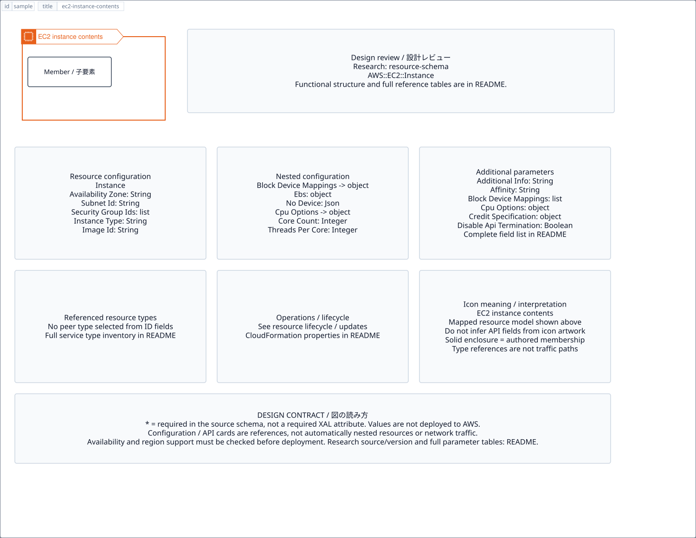

# `ec2-instance-contents` — EC2 instance contents

[SVG preview](sample.svg) · [Editable XAL](sample.xal) · [Catalog](../README.md)



Logical containment boundary; children remain individually connectable. The header uses the AWS group color and icon.

- Kind: `group`; category: Group.
- Diagram scope: `host` (recommendation, not AWS deployment validation).
- Default catalog ID: 1869. Covered catalog IDs: 1869.
- Implementation: V1 and V2; container with AWS border/header styling and connectable children.

## Parameters

Existing container parameters (`id`, `title`, `width`, `height`, `gap`, `class`, `layout`, `visible`) remain available.

`detail` adds a free-form diagram annotation. `show-details="false"` hides annotation text. Only supplied values are shown; none are sent to AWS. Group annotations are appended to the single-line header.

| Parameter | Type | Meaning | Example |
|---|---|---|---|


## Review notes

The catalog provides a baseline for per-component development, not a simulation of the AWS control plane. This component's current functional parameters are the ones listed above. Additional service-specific visual behavior can be developed here without replacing catalog IDs in diagrams. Edit `sample.xal`, then run:

```sh
npm run generate:aws-samples -- --render --tag=ec2-instance-contents
```

<!-- aws-functional-research:start -->
## 機能調査・構成デザイン（2026-09-06）

分類: `resource-schema`。

サンプルはアイコンと、設定・内包構造・関連リソース・操作を分離したレビューシートです。設定カードは編集可能な `rectangle`、グループは既存の専用タグで実装しています。カードのフィールド名を新しい XAL 属性として受理するわけではありません。専用タグが受理する属性は上の Parameters 表を参照してください。

実線の通信と、設定の参照・同じサービスに属する型一覧を区別します。スキーマの必須項目は AWS 側の仕様であり、図の必須入力ではありません。記載の構成モデル/API は取り込んだ公式資料の範囲であり、全リージョン・全機能の完全性や稼働可否を保証しません。

### 構成モデル: `AWS::EC2::Instance`

[公式リファレンス](https://docs.aws.amazon.com/AWSCloudFormation/latest/UserGuide/aws-resource-ec2-instance.html)。全 41 プロパティを型付きで列挙します（表示カードには主要項目のみ）。

| Field | Type | Required in AWS schema |
|---|---|---|
| [AdditionalInfo](https://docs.aws.amazon.com/AWSCloudFormation/latest/UserGuide/aws-resource-ec2-instance.html#cfn-ec2-instance-additionalinfo) | `String` | no |
| [Affinity](https://docs.aws.amazon.com/AWSCloudFormation/latest/UserGuide/aws-resource-ec2-instance.html#cfn-ec2-instance-affinity) | `String` | no |
| [AvailabilityZone](https://docs.aws.amazon.com/AWSCloudFormation/latest/UserGuide/aws-resource-ec2-instance.html#cfn-ec2-instance-availabilityzone) | `String` | no |
| [BlockDeviceMappings](https://docs.aws.amazon.com/AWSCloudFormation/latest/UserGuide/aws-resource-ec2-instance.html#cfn-ec2-instance-blockdevicemappings) | `List<BlockDeviceMapping>` | no |
| [CpuOptions](https://docs.aws.amazon.com/AWSCloudFormation/latest/UserGuide/aws-resource-ec2-instance.html#cfn-ec2-instance-cpuoptions) | `CpuOptions` | no |
| [CreditSpecification](https://docs.aws.amazon.com/AWSCloudFormation/latest/UserGuide/aws-resource-ec2-instance.html#cfn-ec2-instance-creditspecification) | `CreditSpecification` | no |
| [DisableApiTermination](https://docs.aws.amazon.com/AWSCloudFormation/latest/UserGuide/aws-resource-ec2-instance.html#cfn-ec2-instance-disableapitermination) | `Boolean` | no |
| [EbsOptimized](https://docs.aws.amazon.com/AWSCloudFormation/latest/UserGuide/aws-resource-ec2-instance.html#cfn-ec2-instance-ebsoptimized) | `Boolean` | no |
| [ElasticGpuSpecifications](https://docs.aws.amazon.com/AWSCloudFormation/latest/UserGuide/aws-resource-ec2-instance.html#cfn-ec2-instance-elasticgpuspecifications) | `List<ElasticGpuSpecification>` | no |
| [ElasticInferenceAccelerators](https://docs.aws.amazon.com/AWSCloudFormation/latest/UserGuide/aws-resource-ec2-instance.html#cfn-ec2-instance-elasticinferenceaccelerators) | `List<ElasticInferenceAccelerator>` | no |
| [EnclaveOptions](https://docs.aws.amazon.com/AWSCloudFormation/latest/UserGuide/aws-resource-ec2-instance.html#cfn-ec2-instance-enclaveoptions) | `EnclaveOptions` | no |
| [HibernationOptions](https://docs.aws.amazon.com/AWSCloudFormation/latest/UserGuide/aws-resource-ec2-instance.html#cfn-ec2-instance-hibernationoptions) | `HibernationOptions` | no |
| [HostId](https://docs.aws.amazon.com/AWSCloudFormation/latest/UserGuide/aws-resource-ec2-instance.html#cfn-ec2-instance-hostid) | `String` | no |
| [HostResourceGroupArn](https://docs.aws.amazon.com/AWSCloudFormation/latest/UserGuide/aws-resource-ec2-instance.html#cfn-ec2-instance-hostresourcegrouparn) | `String` | no |
| [IamInstanceProfile](https://docs.aws.amazon.com/AWSCloudFormation/latest/UserGuide/aws-resource-ec2-instance.html#cfn-ec2-instance-iaminstanceprofile) | `String` | no |
| [ImageId](https://docs.aws.amazon.com/AWSCloudFormation/latest/UserGuide/aws-resource-ec2-instance.html#cfn-ec2-instance-imageid) | `String` | no |
| [InstanceInitiatedShutdownBehavior](https://docs.aws.amazon.com/AWSCloudFormation/latest/UserGuide/aws-resource-ec2-instance.html#cfn-ec2-instance-instanceinitiatedshutdownbehavior) | `String` | no |
| [InstanceType](https://docs.aws.amazon.com/AWSCloudFormation/latest/UserGuide/aws-resource-ec2-instance.html#cfn-ec2-instance-instancetype) | `String` | no |
| [Ipv6AddressCount](https://docs.aws.amazon.com/AWSCloudFormation/latest/UserGuide/aws-resource-ec2-instance.html#cfn-ec2-instance-ipv6addresscount) | `Integer` | no |
| [Ipv6Addresses](https://docs.aws.amazon.com/AWSCloudFormation/latest/UserGuide/aws-resource-ec2-instance.html#cfn-ec2-instance-ipv6addresses) | `List<InstanceIpv6Address>` | no |
| [KernelId](https://docs.aws.amazon.com/AWSCloudFormation/latest/UserGuide/aws-resource-ec2-instance.html#cfn-ec2-instance-kernelid) | `String` | no |
| [KeyName](https://docs.aws.amazon.com/AWSCloudFormation/latest/UserGuide/aws-resource-ec2-instance.html#cfn-ec2-instance-keyname) | `String` | no |
| [LaunchTemplate](https://docs.aws.amazon.com/AWSCloudFormation/latest/UserGuide/aws-resource-ec2-instance.html#cfn-ec2-instance-launchtemplate) | `LaunchTemplateSpecification` | no |
| [LicenseSpecifications](https://docs.aws.amazon.com/AWSCloudFormation/latest/UserGuide/aws-resource-ec2-instance.html#cfn-ec2-instance-licensespecifications) | `List<LicenseSpecification>` | no |
| [MetadataOptions](https://docs.aws.amazon.com/AWSCloudFormation/latest/UserGuide/aws-resource-ec2-instance.html#cfn-ec2-instance-metadataoptions) | `MetadataOptions` | no |
| [Monitoring](https://docs.aws.amazon.com/AWSCloudFormation/latest/UserGuide/aws-resource-ec2-instance.html#cfn-ec2-instance-monitoring) | `Boolean` | no |
| [NetworkInterfaces](https://docs.aws.amazon.com/AWSCloudFormation/latest/UserGuide/aws-resource-ec2-instance.html#cfn-ec2-instance-networkinterfaces) | `List<NetworkInterface>` | no |
| [PlacementGroupName](https://docs.aws.amazon.com/AWSCloudFormation/latest/UserGuide/aws-resource-ec2-instance.html#cfn-ec2-instance-placementgroupname) | `String` | no |
| [PrivateDnsNameOptions](https://docs.aws.amazon.com/AWSCloudFormation/latest/UserGuide/aws-resource-ec2-instance.html#cfn-ec2-instance-privatednsnameoptions) | `PrivateDnsNameOptions` | no |
| [PrivateIpAddress](https://docs.aws.amazon.com/AWSCloudFormation/latest/UserGuide/aws-resource-ec2-instance.html#cfn-ec2-instance-privateipaddress) | `String` | no |
| [PropagateTagsToVolumeOnCreation](https://docs.aws.amazon.com/AWSCloudFormation/latest/UserGuide/aws-resource-ec2-instance.html#cfn-ec2-instance-propagatetagstovolumeoncreation) | `Boolean` | no |
| [RamdiskId](https://docs.aws.amazon.com/AWSCloudFormation/latest/UserGuide/aws-resource-ec2-instance.html#cfn-ec2-instance-ramdiskid) | `String` | no |
| [SecurityGroupIds](https://docs.aws.amazon.com/AWSCloudFormation/latest/UserGuide/aws-resource-ec2-instance.html#cfn-ec2-instance-securitygroupids) | `List<String>` | no |
| [SecurityGroups](https://docs.aws.amazon.com/AWSCloudFormation/latest/UserGuide/aws-resource-ec2-instance.html#cfn-ec2-instance-securitygroups) | `List<String>` | no |
| [SourceDestCheck](https://docs.aws.amazon.com/AWSCloudFormation/latest/UserGuide/aws-resource-ec2-instance.html#cfn-ec2-instance-sourcedestcheck) | `Boolean` | no |
| [SsmAssociations](https://docs.aws.amazon.com/AWSCloudFormation/latest/UserGuide/aws-resource-ec2-instance.html#cfn-ec2-instance-ssmassociations) | `List<SsmAssociation>` | no |
| [SubnetId](https://docs.aws.amazon.com/AWSCloudFormation/latest/UserGuide/aws-resource-ec2-instance.html#cfn-ec2-instance-subnetid) | `String` | no |
| [Tags](https://docs.aws.amazon.com/AWSCloudFormation/latest/UserGuide/aws-resource-ec2-instance.html#cfn-ec2-instance-tags) | `List<Tag>` | no |
| [Tenancy](https://docs.aws.amazon.com/AWSCloudFormation/latest/UserGuide/aws-resource-ec2-instance.html#cfn-ec2-instance-tenancy) | `String` | no |
| [UserData](https://docs.aws.amazon.com/AWSCloudFormation/latest/UserGuide/aws-resource-ec2-instance.html#cfn-ec2-instance-userdata) | `String` | no |
| [Volumes](https://docs.aws.amazon.com/AWSCloudFormation/latest/UserGuide/aws-resource-ec2-instance.html#cfn-ec2-instance-volumes) | `List<Volume>` | no |

#### BlockDeviceMappings → `AWS::EC2::Instance.BlockDeviceMapping`

| Field | Type | Required in AWS schema |
|---|---|---|
| [DeviceName](https://docs.aws.amazon.com/AWSCloudFormation/latest/UserGuide/aws-properties-ec2-instance-blockdevicemapping.html#cfn-ec2-instance-blockdevicemapping-devicename) | `String` | yes |
| [Ebs](https://docs.aws.amazon.com/AWSCloudFormation/latest/UserGuide/aws-properties-ec2-instance-blockdevicemapping.html#cfn-ec2-instance-blockdevicemapping-ebs) | `Ebs` | no |
| [NoDevice](https://docs.aws.amazon.com/AWSCloudFormation/latest/UserGuide/aws-properties-ec2-instance-blockdevicemapping.html#cfn-ec2-instance-blockdevicemapping-nodevice) | `Json` | no |
| [VirtualName](https://docs.aws.amazon.com/AWSCloudFormation/latest/UserGuide/aws-properties-ec2-instance-blockdevicemapping.html#cfn-ec2-instance-blockdevicemapping-virtualname) | `String` | no |

#### CpuOptions → `AWS::EC2::Instance.CpuOptions`

| Field | Type | Required in AWS schema |
|---|---|---|
| [CoreCount](https://docs.aws.amazon.com/AWSCloudFormation/latest/UserGuide/aws-properties-ec2-instance-cpuoptions.html#cfn-ec2-instance-cpuoptions-corecount) | `Integer` | no |
| [ThreadsPerCore](https://docs.aws.amazon.com/AWSCloudFormation/latest/UserGuide/aws-properties-ec2-instance-cpuoptions.html#cfn-ec2-instance-cpuoptions-threadspercore) | `Integer` | no |

#### CreditSpecification → `AWS::EC2::Instance.CreditSpecification`

| Field | Type | Required in AWS schema |
|---|---|---|
| [CPUCredits](https://docs.aws.amazon.com/AWSCloudFormation/latest/UserGuide/aws-properties-ec2-instance-creditspecification.html#cfn-ec2-instance-creditspecification-cpucredits) | `String` | no |

#### ElasticGpuSpecifications → `AWS::EC2::Instance.ElasticGpuSpecification`

| Field | Type | Required in AWS schema |
|---|---|---|
| [Type](https://docs.aws.amazon.com/AWSCloudFormation/latest/UserGuide/aws-properties-ec2-instance-elasticgpuspecification.html#cfn-ec2-instance-elasticgpuspecification-type) | `String` | yes |

#### ElasticInferenceAccelerators → `AWS::EC2::Instance.ElasticInferenceAccelerator`

| Field | Type | Required in AWS schema |
|---|---|---|
| [Count](https://docs.aws.amazon.com/AWSCloudFormation/latest/UserGuide/aws-properties-ec2-instance-elasticinferenceaccelerator.html#cfn-ec2-instance-elasticinferenceaccelerator-count) | `Integer` | no |
| [Type](https://docs.aws.amazon.com/AWSCloudFormation/latest/UserGuide/aws-properties-ec2-instance-elasticinferenceaccelerator.html#cfn-ec2-instance-elasticinferenceaccelerator-type) | `String` | yes |

#### EnclaveOptions → `AWS::EC2::Instance.EnclaveOptions`

| Field | Type | Required in AWS schema |
|---|---|---|
| [Enabled](https://docs.aws.amazon.com/AWSCloudFormation/latest/UserGuide/aws-properties-ec2-instance-enclaveoptions.html#cfn-ec2-instance-enclaveoptions-enabled) | `Boolean` | no |

#### HibernationOptions → `AWS::EC2::Instance.HibernationOptions`

| Field | Type | Required in AWS schema |
|---|---|---|
| [Configured](https://docs.aws.amazon.com/AWSCloudFormation/latest/UserGuide/aws-properties-ec2-instance-hibernationoptions.html#cfn-ec2-instance-hibernationoptions-configured) | `Boolean` | no |

#### Ipv6Addresses → `AWS::EC2::Instance.InstanceIpv6Address`

| Field | Type | Required in AWS schema |
|---|---|---|
| [Ipv6Address](https://docs.aws.amazon.com/AWSCloudFormation/latest/UserGuide/aws-properties-ec2-instance-instanceipv6address.html#cfn-ec2-instance-instanceipv6address-ipv6address) | `String` | yes |

#### LaunchTemplate → `AWS::EC2::Instance.LaunchTemplateSpecification`

| Field | Type | Required in AWS schema |
|---|---|---|
| [LaunchTemplateId](https://docs.aws.amazon.com/AWSCloudFormation/latest/UserGuide/aws-properties-ec2-instance-launchtemplatespecification.html#cfn-ec2-instance-launchtemplatespecification-launchtemplateid) | `String` | no |
| [LaunchTemplateName](https://docs.aws.amazon.com/AWSCloudFormation/latest/UserGuide/aws-properties-ec2-instance-launchtemplatespecification.html#cfn-ec2-instance-launchtemplatespecification-launchtemplatename) | `String` | no |
| [Version](https://docs.aws.amazon.com/AWSCloudFormation/latest/UserGuide/aws-properties-ec2-instance-launchtemplatespecification.html#cfn-ec2-instance-launchtemplatespecification-version) | `String` | yes |

#### LicenseSpecifications → `AWS::EC2::Instance.LicenseSpecification`

| Field | Type | Required in AWS schema |
|---|---|---|
| [LicenseConfigurationArn](https://docs.aws.amazon.com/AWSCloudFormation/latest/UserGuide/aws-properties-ec2-instance-licensespecification.html#cfn-ec2-instance-licensespecification-licenseconfigurationarn) | `String` | yes |

#### MetadataOptions → `AWS::EC2::Instance.MetadataOptions`

| Field | Type | Required in AWS schema |
|---|---|---|
| [HttpEndpoint](https://docs.aws.amazon.com/AWSCloudFormation/latest/UserGuide/aws-properties-ec2-instance-metadataoptions.html#cfn-ec2-instance-metadataoptions-httpendpoint) | `String` | no |
| [HttpProtocolIpv6](https://docs.aws.amazon.com/AWSCloudFormation/latest/UserGuide/aws-properties-ec2-instance-metadataoptions.html#cfn-ec2-instance-metadataoptions-httpprotocolipv6) | `String` | no |
| [HttpPutResponseHopLimit](https://docs.aws.amazon.com/AWSCloudFormation/latest/UserGuide/aws-properties-ec2-instance-metadataoptions.html#cfn-ec2-instance-metadataoptions-httpputresponsehoplimit) | `Integer` | no |
| [HttpTokens](https://docs.aws.amazon.com/AWSCloudFormation/latest/UserGuide/aws-properties-ec2-instance-metadataoptions.html#cfn-ec2-instance-metadataoptions-httptokens) | `String` | no |
| [InstanceMetadataTags](https://docs.aws.amazon.com/AWSCloudFormation/latest/UserGuide/aws-properties-ec2-instance-metadataoptions.html#cfn-ec2-instance-metadataoptions-instancemetadatatags) | `String` | no |

#### NetworkInterfaces → `AWS::EC2::Instance.NetworkInterface`

| Field | Type | Required in AWS schema |
|---|---|---|
| [AssociateCarrierIpAddress](https://docs.aws.amazon.com/AWSCloudFormation/latest/UserGuide/aws-properties-ec2-instance-networkinterface.html#cfn-ec2-instance-networkinterface-associatecarrieripaddress) | `Boolean` | no |
| [AssociatePublicIpAddress](https://docs.aws.amazon.com/AWSCloudFormation/latest/UserGuide/aws-properties-ec2-instance-networkinterface.html#cfn-ec2-instance-networkinterface-associatepublicipaddress) | `Boolean` | no |
| [DeleteOnTermination](https://docs.aws.amazon.com/AWSCloudFormation/latest/UserGuide/aws-properties-ec2-instance-networkinterface.html#cfn-ec2-instance-networkinterface-deleteontermination) | `Boolean` | no |
| [Description](https://docs.aws.amazon.com/AWSCloudFormation/latest/UserGuide/aws-properties-ec2-instance-networkinterface.html#cfn-ec2-instance-networkinterface-description) | `String` | no |
| [DeviceIndex](https://docs.aws.amazon.com/AWSCloudFormation/latest/UserGuide/aws-properties-ec2-instance-networkinterface.html#cfn-ec2-instance-networkinterface-deviceindex) | `String` | yes |
| [EnaSrdSpecification](https://docs.aws.amazon.com/AWSCloudFormation/latest/UserGuide/aws-properties-ec2-instance-networkinterface.html#cfn-ec2-instance-networkinterface-enasrdspecification) | `EnaSrdSpecification` | no |
| [GroupSet](https://docs.aws.amazon.com/AWSCloudFormation/latest/UserGuide/aws-properties-ec2-instance-networkinterface.html#cfn-ec2-instance-networkinterface-groupset) | `List<String>` | no |
| [Ipv6AddressCount](https://docs.aws.amazon.com/AWSCloudFormation/latest/UserGuide/aws-properties-ec2-instance-networkinterface.html#cfn-ec2-instance-networkinterface-ipv6addresscount) | `Integer` | no |
| [Ipv6Addresses](https://docs.aws.amazon.com/AWSCloudFormation/latest/UserGuide/aws-properties-ec2-instance-networkinterface.html#cfn-ec2-instance-networkinterface-ipv6addresses) | `List<InstanceIpv6Address>` | no |
| [NetworkInterfaceId](https://docs.aws.amazon.com/AWSCloudFormation/latest/UserGuide/aws-properties-ec2-instance-networkinterface.html#cfn-ec2-instance-networkinterface-networkinterfaceid) | `String` | no |
| [PrivateIpAddress](https://docs.aws.amazon.com/AWSCloudFormation/latest/UserGuide/aws-properties-ec2-instance-networkinterface.html#cfn-ec2-instance-networkinterface-privateipaddress) | `String` | no |
| [PrivateIpAddresses](https://docs.aws.amazon.com/AWSCloudFormation/latest/UserGuide/aws-properties-ec2-instance-networkinterface.html#cfn-ec2-instance-networkinterface-privateipaddresses) | `List<PrivateIpAddressSpecification>` | no |
| [SecondaryPrivateIpAddressCount](https://docs.aws.amazon.com/AWSCloudFormation/latest/UserGuide/aws-properties-ec2-instance-networkinterface.html#cfn-ec2-instance-networkinterface-secondaryprivateipaddresscount) | `Integer` | no |
| [SubnetId](https://docs.aws.amazon.com/AWSCloudFormation/latest/UserGuide/aws-properties-ec2-instance-networkinterface.html#cfn-ec2-instance-networkinterface-subnetid) | `String` | no |

#### PrivateDnsNameOptions → `AWS::EC2::Instance.PrivateDnsNameOptions`

| Field | Type | Required in AWS schema |
|---|---|---|
| [EnableResourceNameDnsAAAARecord](https://docs.aws.amazon.com/AWSCloudFormation/latest/UserGuide/aws-properties-ec2-instance-privatednsnameoptions.html#cfn-ec2-instance-privatednsnameoptions-enableresourcenamednsaaaarecord) | `Boolean` | no |
| [EnableResourceNameDnsARecord](https://docs.aws.amazon.com/AWSCloudFormation/latest/UserGuide/aws-properties-ec2-instance-privatednsnameoptions.html#cfn-ec2-instance-privatednsnameoptions-enableresourcenamednsarecord) | `Boolean` | no |
| [HostnameType](https://docs.aws.amazon.com/AWSCloudFormation/latest/UserGuide/aws-properties-ec2-instance-privatednsnameoptions.html#cfn-ec2-instance-privatednsnameoptions-hostnametype) | `String` | no |

#### SsmAssociations → `AWS::EC2::Instance.SsmAssociation`

| Field | Type | Required in AWS schema |
|---|---|---|
| [AssociationParameters](https://docs.aws.amazon.com/AWSCloudFormation/latest/UserGuide/aws-properties-ec2-instance-ssmassociation.html#cfn-ec2-instance-ssmassociation-associationparameters) | `List<AssociationParameter>` | no |
| [DocumentName](https://docs.aws.amazon.com/AWSCloudFormation/latest/UserGuide/aws-properties-ec2-instance-ssmassociation.html#cfn-ec2-instance-ssmassociation-documentname) | `String` | yes |

#### Volumes → `AWS::EC2::Instance.Volume`

| Field | Type | Required in AWS schema |
|---|---|---|
| [Device](https://docs.aws.amazon.com/AWSCloudFormation/latest/UserGuide/aws-properties-ec2-instance-volume.html#cfn-ec2-instance-volume-device) | `String` | yes |
| [VolumeId](https://docs.aws.amazon.com/AWSCloudFormation/latest/UserGuide/aws-properties-ec2-instance-volume.html#cfn-ec2-instance-volume-volumeid) | `String` | yes |

### 関連する構成リソース（1 型）

同じサービス文脈の型一覧です。すべてがこのアイコンの子リソースという意味ではありません。さらに深い入れ子は [公式スキーマのスナップショット](../research/cloudformation-models.json) に記録しています。

- [AWS::EC2::Instance](https://docs.aws.amazon.com/AWSCloudFormation/latest/UserGuide/aws-resource-ec2-instance.html)

### 出典・調査範囲

- [公式資料 1](https://docs.aws.amazon.com/AWSCloudFormation/latest/UserGuide/aws-resource-ec2-instance.html)

CloudFormation 仕様 263.0.0、AWS SDK 431 サービスモデルをオフラインで参照。取得日・元データの SHA-256 は [調査マニフェスト](../research/README.md) を参照。API モデル名・フィールド名は仕様から抽出し、説明本文を転載していません。利用可能性は全サービス一律には確認できないため、提供終了の確認がないものも「現在利用可能」と断定していません。

### 次の部品レビュー

- 本アイコンが独立したリソースか、機能・状態・デバイスの記号かを確認する。
- 詳細カードのうち専用の子タグ・参照属性として実装する範囲を選ぶ。
- 通信、制御、認証、監視の関係を分け、必要な接続点・配置制約を確認する。
- 編集後は `npm run generate:aws-samples -- --render --tag=ec2-instance-contents`。通常の再描画は XAL/README を上書きしない。
<!-- aws-functional-research:end -->
