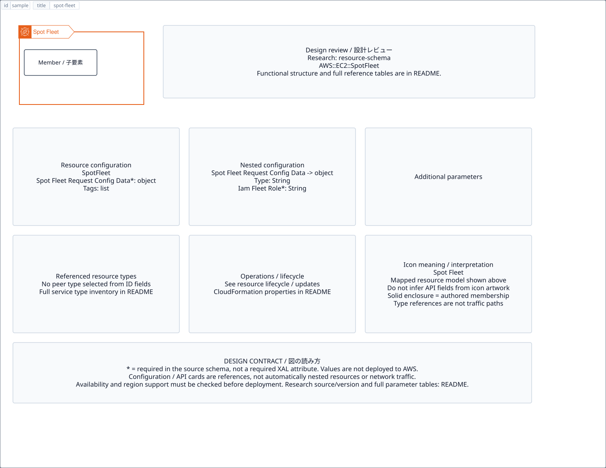

# `spot-fleet` — Spot Fleet

[SVG preview](sample.svg) · [Editable XAL](sample.xal) · [Catalog](../README.md)



Logical containment boundary; children remain individually connectable. The header uses the AWS group color and icon.

- Kind: `group`; category: Group.
- Diagram scope: `region` (recommendation, not AWS deployment validation).
- Default catalog ID: 1874. Covered catalog IDs: 1874.
- Implementation: V1 and V2; container with AWS border/header styling and connectable children.

## Parameters

Existing container parameters (`id`, `title`, `width`, `height`, `gap`, `class`, `layout`, `visible`) remain available.

`detail` adds a free-form diagram annotation. `show-details="false"` hides annotation text. Only supplied values are shown; none are sent to AWS. Group annotations are appended to the single-line header.

| Parameter | Type | Meaning | Example |
|---|---|---|---|
| `desired-capacity` | integer | Desired capacity annotation | `2` |

## Review notes

The catalog provides a baseline for per-component development, not a simulation of the AWS control plane. This component's current functional parameters are the ones listed above. Additional service-specific visual behavior can be developed here without replacing catalog IDs in diagrams. Edit `sample.xal`, then run:

```sh
npm run generate:aws-samples -- --render --tag=spot-fleet
```

<!-- aws-functional-research:start -->
## 機能調査・構成デザイン（2026-09-06）

分類: `resource-schema`。

サンプルはアイコンと、設定・内包構造・関連リソース・操作を分離したレビューシートです。設定カードは編集可能な `rectangle`、グループは既存の専用タグで実装しています。カードのフィールド名を新しい XAL 属性として受理するわけではありません。専用タグが受理する属性は上の Parameters 表を参照してください。

実線の通信と、設定の参照・同じサービスに属する型一覧を区別します。スキーマの必須項目は AWS 側の仕様であり、図の必須入力ではありません。記載の構成モデル/API は取り込んだ公式資料の範囲であり、全リージョン・全機能の完全性や稼働可否を保証しません。

### 構成モデル: `AWS::EC2::SpotFleet`

[公式リファレンス](https://docs.aws.amazon.com/AWSCloudFormation/latest/UserGuide/aws-resource-ec2-spotfleet.html)。全 2 プロパティを型付きで列挙します（表示カードには主要項目のみ）。

| Field | Type | Required in AWS schema |
|---|---|---|
| [SpotFleetRequestConfigData](https://docs.aws.amazon.com/AWSCloudFormation/latest/UserGuide/aws-resource-ec2-spotfleet.html#cfn-ec2-spotfleet-spotfleetrequestconfigdata) | `SpotFleetRequestConfigData` | yes |
| [Tags](https://docs.aws.amazon.com/AWSCloudFormation/latest/UserGuide/aws-resource-ec2-spotfleet.html#cfn-ec2-spotfleet-tags) | `List<Tag>` | no |

#### SpotFleetRequestConfigData → `AWS::EC2::SpotFleet.SpotFleetRequestConfigData`

| Field | Type | Required in AWS schema |
|---|---|---|
| [AllocationStrategy](https://docs.aws.amazon.com/AWSCloudFormation/latest/UserGuide/aws-properties-ec2-spotfleet-spotfleetrequestconfigdata.html#cfn-ec2-spotfleet-spotfleetrequestconfigdata-allocationstrategy) | `String` | no |
| [Context](https://docs.aws.amazon.com/AWSCloudFormation/latest/UserGuide/aws-properties-ec2-spotfleet-spotfleetrequestconfigdata.html#cfn-ec2-spotfleet-spotfleetrequestconfigdata-context) | `String` | no |
| [ExcessCapacityTerminationPolicy](https://docs.aws.amazon.com/AWSCloudFormation/latest/UserGuide/aws-properties-ec2-spotfleet-spotfleetrequestconfigdata.html#cfn-ec2-spotfleet-spotfleetrequestconfigdata-excesscapacityterminationpolicy) | `String` | no |
| [IamFleetRole](https://docs.aws.amazon.com/AWSCloudFormation/latest/UserGuide/aws-properties-ec2-spotfleet-spotfleetrequestconfigdata.html#cfn-ec2-spotfleet-spotfleetrequestconfigdata-iamfleetrole) | `String` | yes |
| [InstanceInterruptionBehavior](https://docs.aws.amazon.com/AWSCloudFormation/latest/UserGuide/aws-properties-ec2-spotfleet-spotfleetrequestconfigdata.html#cfn-ec2-spotfleet-spotfleetrequestconfigdata-instanceinterruptionbehavior) | `String` | no |
| [InstancePoolsToUseCount](https://docs.aws.amazon.com/AWSCloudFormation/latest/UserGuide/aws-properties-ec2-spotfleet-spotfleetrequestconfigdata.html#cfn-ec2-spotfleet-spotfleetrequestconfigdata-instancepoolstousecount) | `Integer` | no |
| [LaunchSpecifications](https://docs.aws.amazon.com/AWSCloudFormation/latest/UserGuide/aws-properties-ec2-spotfleet-spotfleetrequestconfigdata.html#cfn-ec2-spotfleet-spotfleetrequestconfigdata-launchspecifications) | `List<SpotFleetLaunchSpecification>` | no |
| [LaunchTemplateConfigs](https://docs.aws.amazon.com/AWSCloudFormation/latest/UserGuide/aws-properties-ec2-spotfleet-spotfleetrequestconfigdata.html#cfn-ec2-spotfleet-spotfleetrequestconfigdata-launchtemplateconfigs) | `List<LaunchTemplateConfig>` | no |
| [LoadBalancersConfig](https://docs.aws.amazon.com/AWSCloudFormation/latest/UserGuide/aws-properties-ec2-spotfleet-spotfleetrequestconfigdata.html#cfn-ec2-spotfleet-spotfleetrequestconfigdata-loadbalancersconfig) | `LoadBalancersConfig` | no |
| [OnDemandAllocationStrategy](https://docs.aws.amazon.com/AWSCloudFormation/latest/UserGuide/aws-properties-ec2-spotfleet-spotfleetrequestconfigdata.html#cfn-ec2-spotfleet-spotfleetrequestconfigdata-ondemandallocationstrategy) | `String` | no |
| [OnDemandMaxTotalPrice](https://docs.aws.amazon.com/AWSCloudFormation/latest/UserGuide/aws-properties-ec2-spotfleet-spotfleetrequestconfigdata.html#cfn-ec2-spotfleet-spotfleetrequestconfigdata-ondemandmaxtotalprice) | `String` | no |
| [OnDemandTargetCapacity](https://docs.aws.amazon.com/AWSCloudFormation/latest/UserGuide/aws-properties-ec2-spotfleet-spotfleetrequestconfigdata.html#cfn-ec2-spotfleet-spotfleetrequestconfigdata-ondemandtargetcapacity) | `Integer` | no |
| [ReplaceUnhealthyInstances](https://docs.aws.amazon.com/AWSCloudFormation/latest/UserGuide/aws-properties-ec2-spotfleet-spotfleetrequestconfigdata.html#cfn-ec2-spotfleet-spotfleetrequestconfigdata-replaceunhealthyinstances) | `Boolean` | no |
| [SpotMaintenanceStrategies](https://docs.aws.amazon.com/AWSCloudFormation/latest/UserGuide/aws-properties-ec2-spotfleet-spotfleetrequestconfigdata.html#cfn-ec2-spotfleet-spotfleetrequestconfigdata-spotmaintenancestrategies) | `SpotMaintenanceStrategies` | no |
| [SpotMaxTotalPrice](https://docs.aws.amazon.com/AWSCloudFormation/latest/UserGuide/aws-properties-ec2-spotfleet-spotfleetrequestconfigdata.html#cfn-ec2-spotfleet-spotfleetrequestconfigdata-spotmaxtotalprice) | `String` | no |
| [SpotPrice](https://docs.aws.amazon.com/AWSCloudFormation/latest/UserGuide/aws-properties-ec2-spotfleet-spotfleetrequestconfigdata.html#cfn-ec2-spotfleet-spotfleetrequestconfigdata-spotprice) | `String` | no |
| [TagSpecifications](https://docs.aws.amazon.com/AWSCloudFormation/latest/UserGuide/aws-properties-ec2-spotfleet-spotfleetrequestconfigdata.html#cfn-ec2-spotfleet-spotfleetrequestconfigdata-tagspecifications) | `List<SpotFleetTagSpecification>` | no |
| [TargetCapacity](https://docs.aws.amazon.com/AWSCloudFormation/latest/UserGuide/aws-properties-ec2-spotfleet-spotfleetrequestconfigdata.html#cfn-ec2-spotfleet-spotfleetrequestconfigdata-targetcapacity) | `Integer` | yes |
| [TargetCapacityUnitType](https://docs.aws.amazon.com/AWSCloudFormation/latest/UserGuide/aws-properties-ec2-spotfleet-spotfleetrequestconfigdata.html#cfn-ec2-spotfleet-spotfleetrequestconfigdata-targetcapacityunittype) | `String` | no |
| [TerminateInstancesWithExpiration](https://docs.aws.amazon.com/AWSCloudFormation/latest/UserGuide/aws-properties-ec2-spotfleet-spotfleetrequestconfigdata.html#cfn-ec2-spotfleet-spotfleetrequestconfigdata-terminateinstanceswithexpiration) | `Boolean` | no |
| [Type](https://docs.aws.amazon.com/AWSCloudFormation/latest/UserGuide/aws-properties-ec2-spotfleet-spotfleetrequestconfigdata.html#cfn-ec2-spotfleet-spotfleetrequestconfigdata-type) | `String` | no |
| [ValidFrom](https://docs.aws.amazon.com/AWSCloudFormation/latest/UserGuide/aws-properties-ec2-spotfleet-spotfleetrequestconfigdata.html#cfn-ec2-spotfleet-spotfleetrequestconfigdata-validfrom) | `String` | no |
| [ValidUntil](https://docs.aws.amazon.com/AWSCloudFormation/latest/UserGuide/aws-properties-ec2-spotfleet-spotfleetrequestconfigdata.html#cfn-ec2-spotfleet-spotfleetrequestconfigdata-validuntil) | `String` | no |

### 関連する構成リソース（1 型）

同じサービス文脈の型一覧です。すべてがこのアイコンの子リソースという意味ではありません。さらに深い入れ子は [公式スキーマのスナップショット](../research/cloudformation-models.json) に記録しています。

- [AWS::EC2::SpotFleet](https://docs.aws.amazon.com/AWSCloudFormation/latest/UserGuide/aws-resource-ec2-spotfleet.html)

### 出典・調査範囲

- [公式資料 1](https://docs.aws.amazon.com/AWSCloudFormation/latest/UserGuide/aws-resource-ec2-spotfleet.html)

CloudFormation 仕様 263.0.0、AWS SDK 431 サービスモデルをオフラインで参照。取得日・元データの SHA-256 は [調査マニフェスト](../research/README.md) を参照。API モデル名・フィールド名は仕様から抽出し、説明本文を転載していません。利用可能性は全サービス一律には確認できないため、提供終了の確認がないものも「現在利用可能」と断定していません。

### 次の部品レビュー

- 本アイコンが独立したリソースか、機能・状態・デバイスの記号かを確認する。
- 詳細カードのうち専用の子タグ・参照属性として実装する範囲を選ぶ。
- 通信、制御、認証、監視の関係を分け、必要な接続点・配置制約を確認する。
- 編集後は `npm run generate:aws-samples -- --render --tag=spot-fleet`。通常の再描画は XAL/README を上書きしない。
<!-- aws-functional-research:end -->
