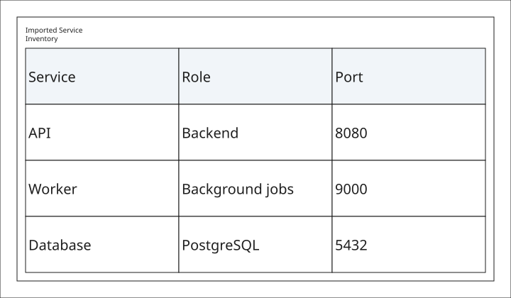

# Imported Tables

This canonical V1 example declares a CSV source inside `<data>` and renders it
through a reusable `<table data="...">` reference.



Sources: [samples/table-imports.xal](samples/table-imports.xal) and
[samples/table-imports.csv](samples/table-imports.csv).
See [.xal Tables](../xal/tables.md) for reusable table data syntax.

```bash
xaligo validate docs/src/examples/samples/table-imports.xal
xaligo render docs/src/examples/samples/table-imports.xal \
  --format svg \
  -o output/table-imports.svg
```
