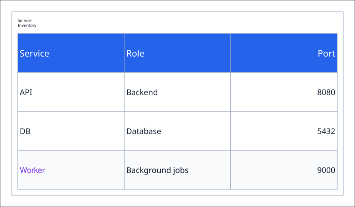

# Tables

This example combines concise pipe rows with an explicit tagged row. Both are
normalized into the same V1 table model and rendered through the shared output
pipeline.



```xml
{{#include samples/tables.xal}}
```

```bash
xaligo validate docs/src/examples/samples/tables.xal
xaligo render docs/src/examples/samples/tables.xal \
  --format svg \
  -o output/tables.svg
```
