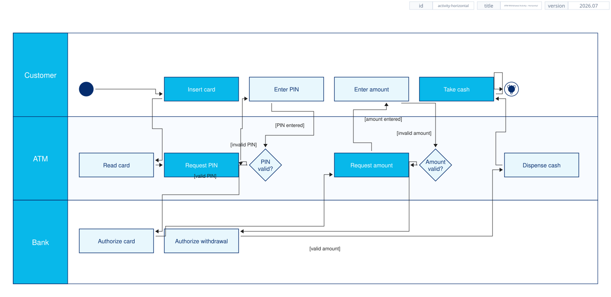

# UML Diagrams

These examples use the supported core UML strict V1 tags. Each source is
validated and rendered through the same pipeline used by the CLI.

## Class diagram

Classes, interfaces, enumerations, typed compartments, realization, and
multiplicity-bearing associations.


```xml
{{#include samples/uml-class.xal}}
```

## Component diagram

Components, artifacts, provided interfaces, associations, dependencies, and
automatic interface/fan-out-based component heights. Diagram-level
`component-width` and `component-height` provide defaults; per-component
`width` and `height` override them. The Order Workflow component also shows
`interface-width`, which gives every interface name in that component one
shared width while descriptions use the remaining space.


```xml
{{#include samples/uml-component.xal}}
```

## Activity diagram

ATM withdrawal swimlanes with supported activity partitions, decisions,
guards, loop routes, and the xaligo activity theme.


```xml
{{#include samples/uml-activity.xal}}
```

## Activity diagram - horizontal swimlanes

The same ATM withdrawal flow arranged as horizontal swimlanes for wide process
views.



```xml
{{#include samples/uml-activity-horizontal.xal}}
```

## State-machine diagram

States, initial/final pseudostates, transitions, guards, and state
compartments.


```xml
{{#include samples/uml-state-machine.xal}}
```

## Sequence diagram

Participants/lifelines and ordered call, self, create, return, and destroy
messages.


```xml
{{#include samples/uml-sequence.xal}}
```
