# UML Diagrams

These examples use the diagram-specific strict V1 tags. Each source is
validated and rendered through the same pipeline used by the CLI.

## Class diagram

Classes, interfaces, enumerations, typed compartments, realization, and
multiplicity-bearing associations.

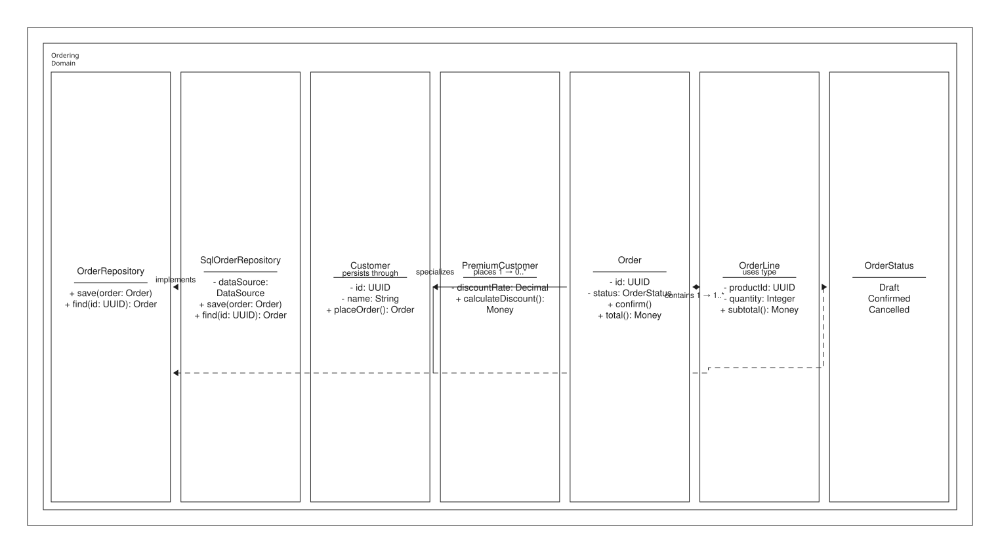

```xml
{{#include samples/uml-class.xal}}
```

## Object diagram

An object snapshot with slots and instance links.

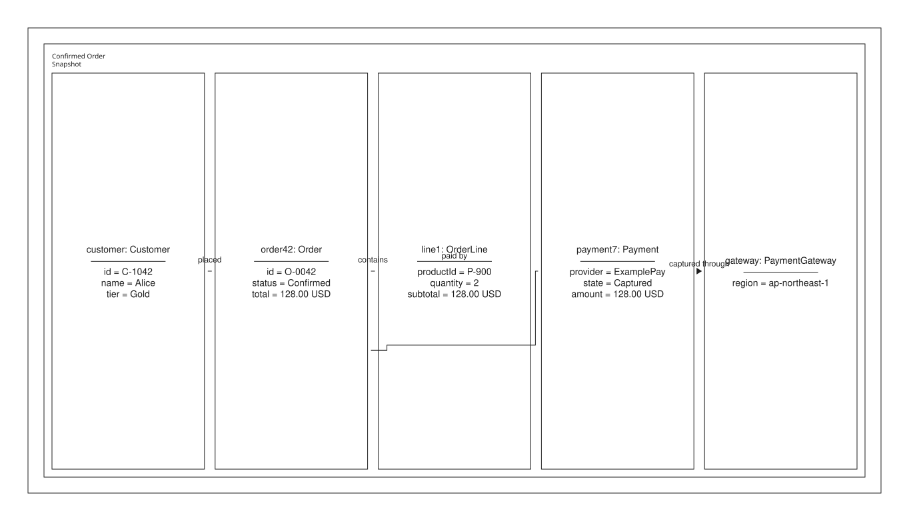

```xml
{{#include samples/uml-object.xal}}
```

## Component diagram

Owned required/provided ports, assemblies, realizations, and an artifact
dependency.

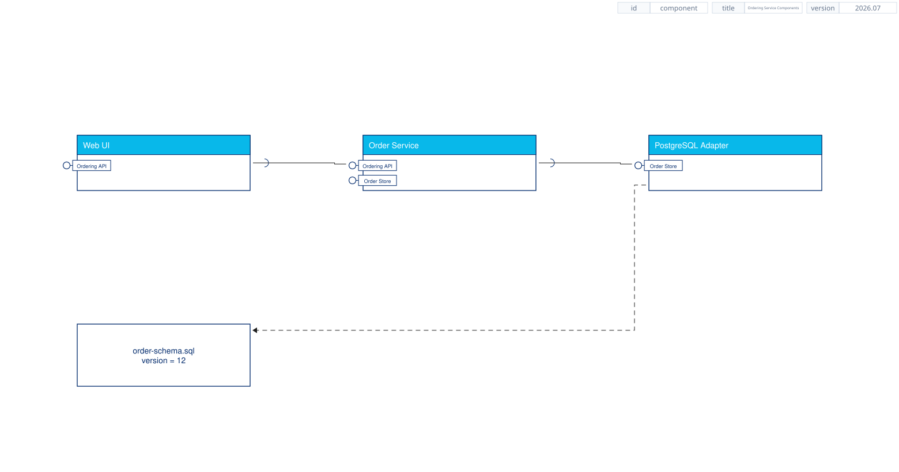

```xml
{{#include samples/uml-component.xal}}
```

## Deployment diagram

Runtime nodes, a deployed artifact, and communication paths.

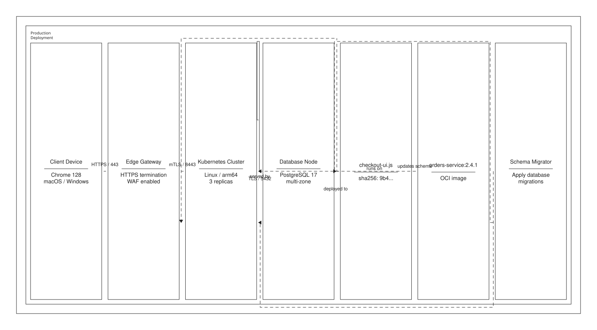

```xml
{{#include samples/uml-deployment.xal}}
```

## Package diagram

Layered packages and package imports.

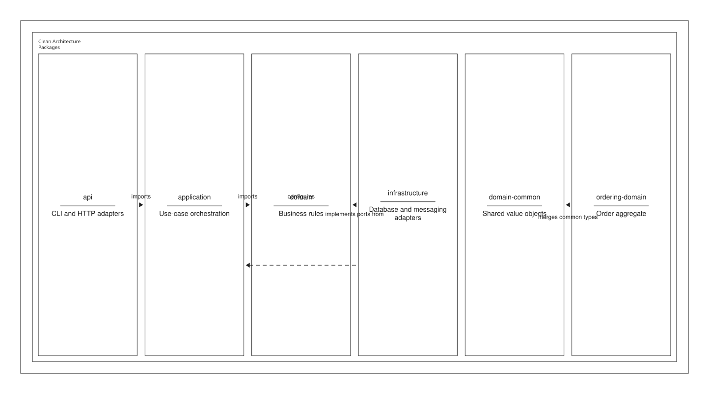

```xml
{{#include samples/uml-package.xal}}
```

## Composite structure diagram

Owned structures, parts, boundary/internal ports, connector, assembly, and
delegation.

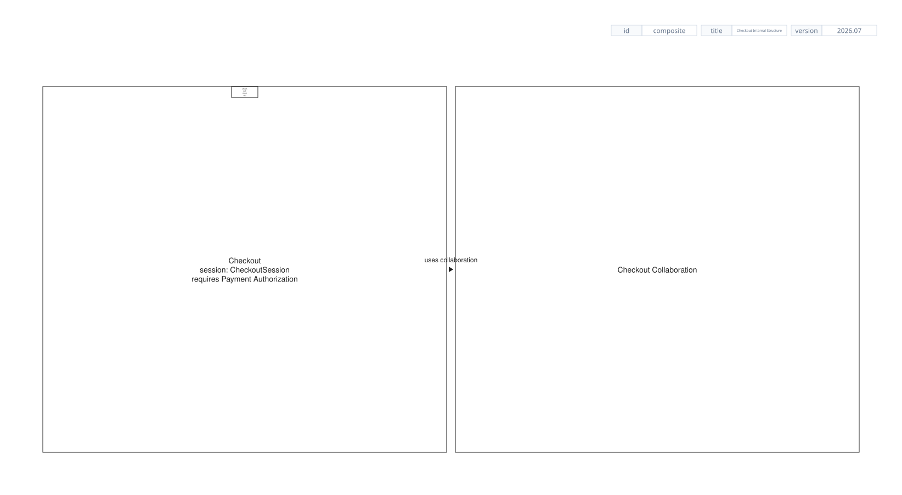

```xml
{{#include samples/uml-composite-structure.xal}}
```

## Profile diagram

A profile, stereotype, metaclass, reference, and extension.

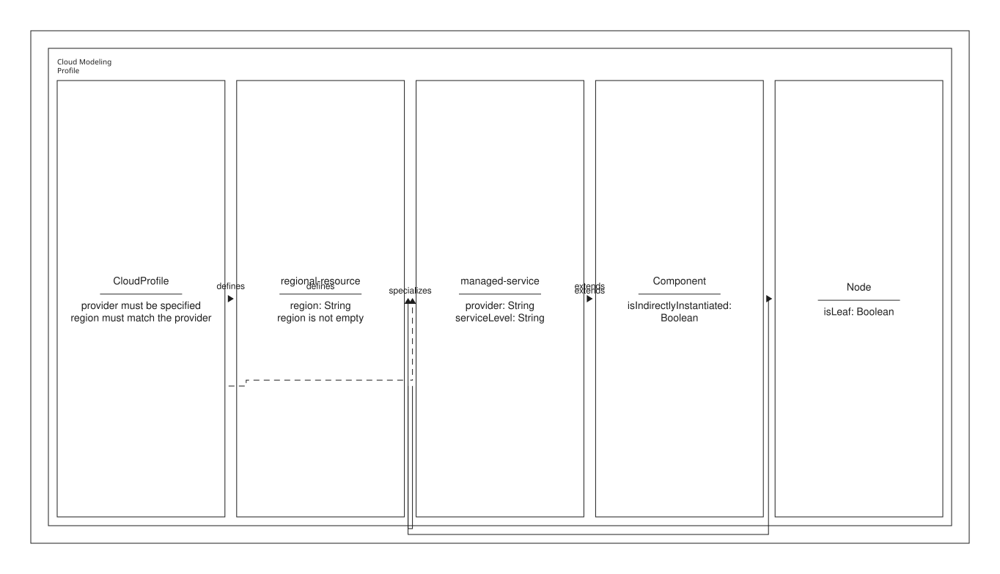

```xml
{{#include samples/uml-profile.xal}}
```

## Use-case diagram

Actors and system-owned use cases with association, include, extend, and actor
generalization.

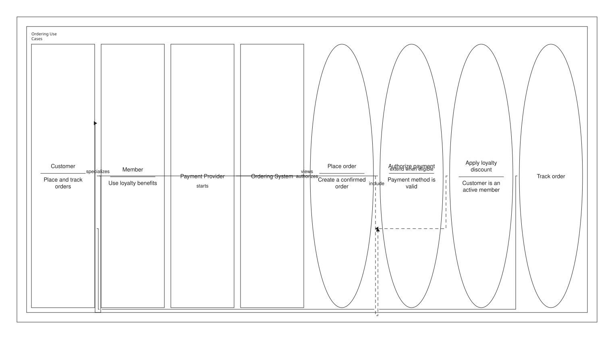

```xml
{{#include samples/uml-use-case.xal}}
```

## Activity diagram

Object flow plus validated decision/merge and fork/join control structures.

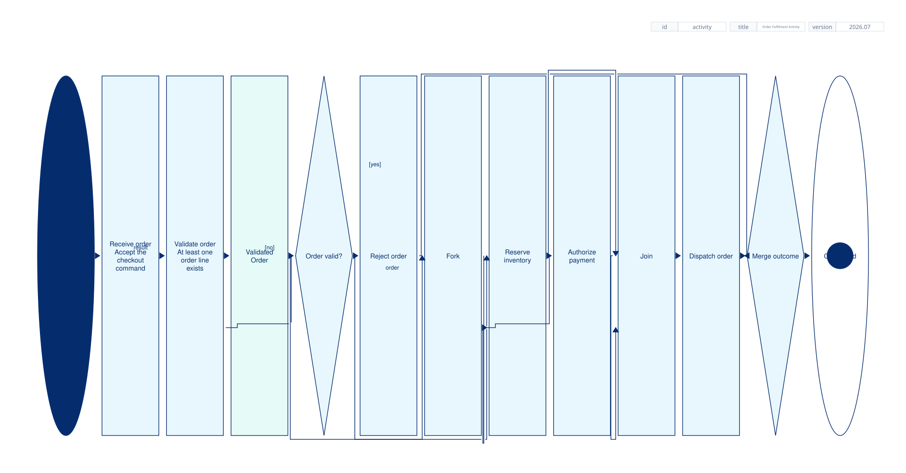

```xml
{{#include samples/uml-activity.xal}}
```

## State-machine diagram

States with entry/do/exit behavior, guarded choice, and deep-history recovery.

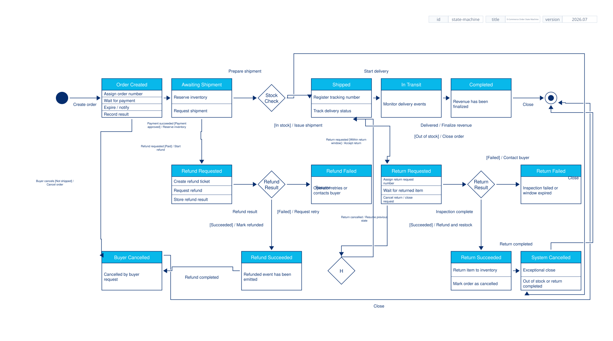

```xml
{{#include samples/uml-state-machine.xal}}
```

## Sequence diagram

Participants/lifelines and ordered call, self, create, return, and destroy
messages.

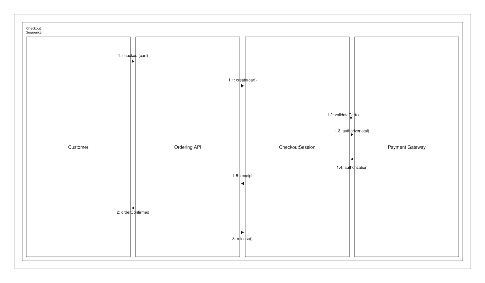

```xml
{{#include samples/uml-sequence.xal}}
```

## Communication diagram

Objects, structural links for every message pair, and hierarchical order.

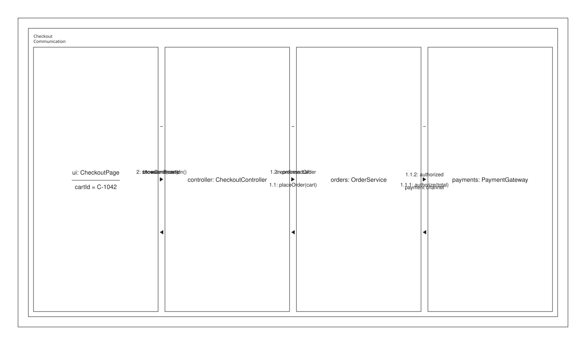

```xml
{{#include samples/uml-communication.xal}}
```

## Interaction-overview diagram

Referenced interactions connected through decision and fork/join overview flow.

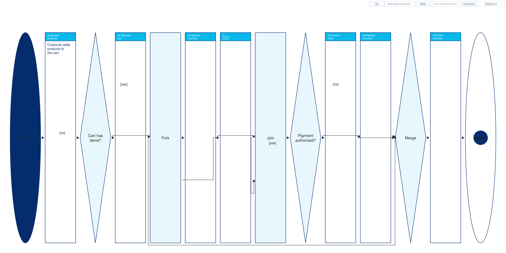

```xml
{{#include samples/uml-interaction-overview.xal}}
```

## Timing diagram

Owned non-overlapping time states, chronological transitions, occurrences, and
a duration observation.

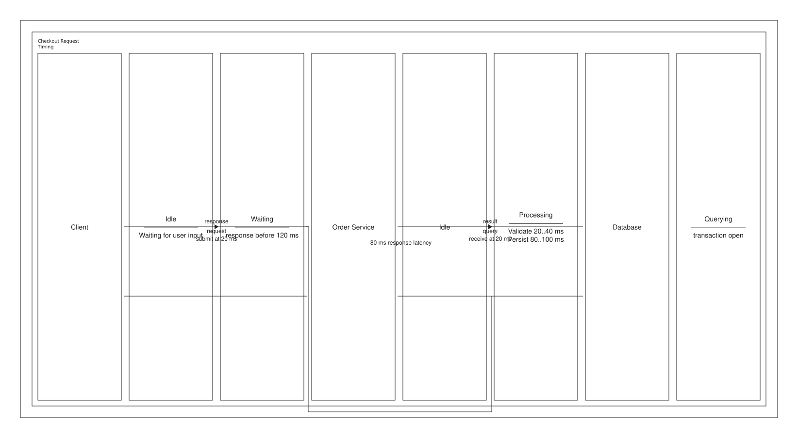

```xml
{{#include samples/uml-timing.xal}}
```

The compact [all-kinds source](samples/uml-all.xal) remains useful as a format
matrix smoke test. Use the individual examples above as authoring templates.
