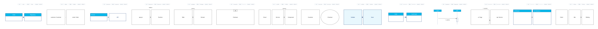

# UML Diagrams

These examples are complete `.xal` files rendered through the same validation,
layout, scene, and SVG pipeline used by the CLI. Syntax details live in the
[UML Reference](../reference/uml.md); this page stays as a compact sample index.

## Gallery



The combined source is useful as a renderer smoke test:
[samples/uml-all.xal](samples/uml-all.xal).

## Individual samples

| Diagram | Source | Preview |
|---|---|---|
| Class | [samples/uml-class.xal](samples/uml-class.xal) | [SVG](../images/uml-class.svg) |
| Object | [samples/uml-object.xal](samples/uml-object.xal) | [SVG](../images/uml-object.svg) |
| Component | [samples/uml-component.xal](samples/uml-component.xal) | [SVG](../images/uml-component.svg) |
| Deployment | [samples/uml-deployment.xal](samples/uml-deployment.xal) | [SVG](../images/uml-deployment.svg) |
| Package | [samples/uml-package.xal](samples/uml-package.xal) | [SVG](../images/uml-package.svg) |
| Composite structure | [samples/uml-composite-structure.xal](samples/uml-composite-structure.xal) | [SVG](../images/uml-composite-structure.svg) |
| Profile | [samples/uml-profile.xal](samples/uml-profile.xal) | [SVG](../images/uml-profile.svg) |
| Use case | [samples/uml-use-case.xal](samples/uml-use-case.xal) | [SVG](../images/uml-use-case.svg) |
| Activity | [samples/uml-activity.xal](samples/uml-activity.xal) | [SVG](../images/uml-activity.svg) |
| State machine | [samples/uml-state-machine.xal](samples/uml-state-machine.xal) | [SVG](../images/uml-state-machine.svg) |
| Sequence | [samples/uml-sequence.xal](samples/uml-sequence.xal) | [SVG](../images/uml-sequence.svg) |
| Communication | [samples/uml-communication.xal](samples/uml-communication.xal) | [SVG](../images/uml-communication.svg) |
| Timing | [samples/uml-timing.xal](samples/uml-timing.xal) | [SVG](../images/uml-timing.svg) |

## Render one sample

```bash
go run ./cmd validate docs/src/examples/samples/uml-sequence.xal
go run ./cmd render docs/src/examples/samples/uml-sequence.xal --format svg -o output/uml-sequence.svg
```