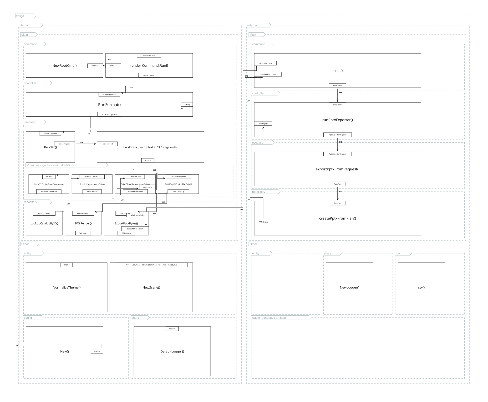
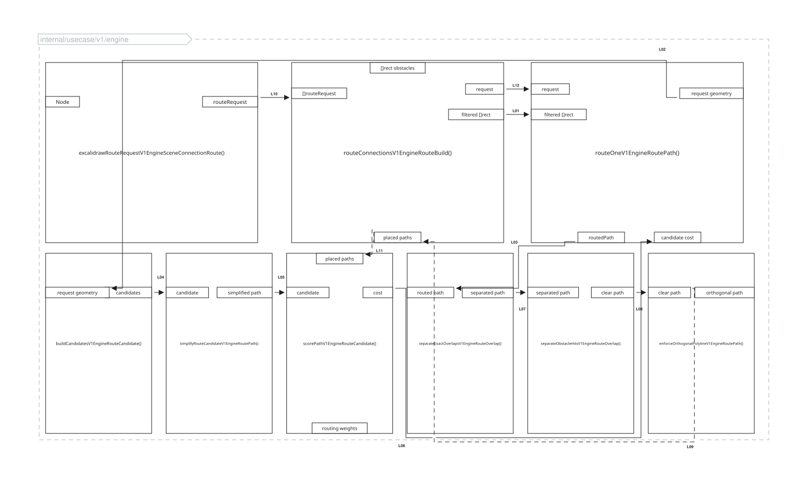

# Internal Architecture and Algorithms

This page describes the implementation as it exists in the repository. Code
links point to the canonical implementation on the `main` branch; the diagrams
are generated from the `.xal` sources linked beneath them.

## Rendering pipeline



Diagram source: [`internal-rendering-pipeline.xal`](architecture/internal-rendering-pipeline.xal)

The pipeline diagram is nested as `xaligo -> internal/external -> Main/Other`.
Each `Main` group contains the `command -> controller -> usecase -> repository`
processing path, while `Other` contains entity, configuration, logging, tools,
and generated artifacts. Nested package boundaries use `generic-group`,
rectangles represent functions, and ports represent conceptual data passed
between functions. The notation describes responsibilities and data flow; it is
not a claim that every conceptual port is a distinct Go type or function
parameter.

The native CLI assembles responsibility-specific controllers, use cases, and repositories in
[`NewRootCmd`](https://github.com/xaligo/xaligo/blob/main/internal/command.go#L20).
The WASM entry point is a separate composition root, but calls the same render-use-case
boundary ([`cmd/wasm/main.go`](https://github.com/xaligo/xaligo/blob/main/cmd/wasm/main.go#L34)).
This keeps input adapters independent from parsing, layout, and rendering.

1. **Parse.** [`ParseV1EngineParseDocument`](https://github.com/xaligo/xaligo/blob/main/internal/usecase/v1/engine/parse_document.go)
   streams XML tokens with Go's `encoding/xml`, builds an `entity.Node` tree,
   records source positions, expands connection shorthand, and validates roots
   and endpoint references.
2. **Normalize and resolve layout.** [`validateLayoutDocumentV1EngineLayoutValidation`](https://github.com/xaligo/xaligo/blob/main/internal/usecase/v1/engine/layout_validation.go)
   checks numeric domains before arithmetic. [`BuildV1EngineLayoutBuild`](https://github.com/xaligo/xaligo/blob/main/internal/usecase/v1/engine/layout_build.go)
   then converts the syntax tree into an absolute `entity.Box` tree and verifies
   finite coordinates, positive sizes, content boxes, and parent containment.
3. **Build the canonical scene.** [`buildScene`](https://github.com/xaligo/xaligo/blob/main/internal/usecase/render.go)
   controls context checks, repository-backed catalog/icon ports, and stage
   order. Synchronous scene calculation runs in
   [`v1/engine`](https://github.com/xaligo/xaligo/tree/main/internal/usecase/v1/engine)
   and emits the Excalidraw-compatible scene shared by downstream formats.
4. **Dispatch and encode.** [`Render`](https://github.com/xaligo/xaligo/blob/main/internal/usecase/render.go)
   is the single format switch. Excalidraw returns the scene directly; XYFlow
   and Isoflow translate it. SVG and PPTX first convert it into the same
   shared SVG/PPTX draw plan and then call their repositories.

The key invariant is therefore `.xal -> validated node tree -> resolved box
tree -> canonical scene -> plan or encoder`. `validate` and `render` execute the
same layout checks, and formats do not have independent parsers or layout
engines.

## V1 compatibility and the V2 boundary

The current
[`ParseV1EngineParseDocument`](https://github.com/xaligo/xaligo/blob/main/internal/usecase/v1/engine/parse_document.go)
accepts only `<frame>` and `<frames>` roots. Explicit `version="1"` defines the
recommended frozen V1 profile; omission defaults to V1 with a warning. Native V2 will
use `<scene version="2">`; the distinct root is intentional so the V1 parser
rejects V2 before interpreting any nested tag as a permissive V1 custom group.

The planned parent-use-case dispatcher reads the first XML start element once
and selects exactly one frontend. V2 owns both its native frontend and a V1
compatibility frontend. Each parses the original source once and lowers
directly to the same typed, version-neutral model used by V2 layout, routing,
and encoders. V1 does not import or call V2.

This avoids four expensive or ambiguous designs: renaming roots and reparsing,
trying V1 and then V2 after a parser error, serializing through the current
scene and reading it back, or running the complete V1 renderer before V2. V1
golden tests freeze defaults and error/fallback behavior so the compatibility
frontend can be checked at normalized-model and resolved-geometry boundaries,
not only by comparing final pixels.

Render `Mode` is orthogonal to the language version. V1 currently accepts
`standard`, `network`, and `aws`, but
[`ValidateRenderOptionsV1EngineOptionRender`](https://github.com/xaligo/xaligo/blob/main/internal/usecase/v1/engine/option_render.go)
does not select different layout or rendering semantics for them. They all use
the same resolved 2D pipeline until a versioned implementation explicitly adds
those semantics.

## Package and dependency boundaries

| Package | Role | Representative code |
|---|---|---|
| `cmd`, `internal/controller` | Process entry points, CLI flags, and file I/O | [`internal/command.go`](https://github.com/xaligo/xaligo/blob/main/internal/command.go) |
| `internal/usecase` | Context checks, repository adaptation, stage ordering, format dispatch, and future parallel scheduling | [`render.go`](https://github.com/xaligo/xaligo/blob/main/internal/usecase/render.go), [`diagnostics.go`](https://github.com/xaligo/xaligo/blob/main/internal/usecase/diagnostics.go) |
| `internal/usecase/v1/engine` | Synchronous V1 parser, validation, layout, scene, routing, pagination, theme, and draw-plan calculations | [`v1/engine`](https://github.com/xaligo/xaligo/tree/main/internal/usecase/v1/engine) |
| `internal/entity` | Data exchanged across layers, including resolved content boxes, `PresentationScene`, `Plan`, and `TextLayout`; no orchestration | [`internal/entity`](https://github.com/xaligo/xaligo/tree/main/internal/entity) |
| `internal/repository` | Catalog/filesystem access and output encoders | [`internal/repository`](https://github.com/xaligo/xaligo/tree/main/internal/repository) |
| `external` | TypeScript API and the PptxGenJS/WASM adapter | [`external`](https://github.com/xaligo/xaligo/tree/main/external) |

Use-case declarations are not collected in a package-wide facade. Each
responsibility file begins with its interface, private concrete type, and
constructor: [`RenderUsecase`](https://github.com/xaligo/xaligo/blob/main/internal/usecase/render.go),
[`DiagnosticsUsecase`](https://github.com/xaligo/xaligo/blob/main/internal/usecase/diagnostics.go),
[`SceneIOUsecase`](https://github.com/xaligo/xaligo/blob/main/internal/usecase/scene_io.go),
[`CatalogUsecase`](https://github.com/xaligo/xaligo/blob/main/internal/usecase/catalog.go), and
[`ExportUsecase`](https://github.com/xaligo/xaligo/blob/main/internal/usecase/export.go). Parser,
layout, element construction, pagination, plan construction, scene
construction, and theming follow the same component form in
[`internal/usecase`](https://github.com/xaligo/xaligo/tree/main/internal/usecase).
`NewRootCmd` constructs these independently and injects only the interfaces
needed by each controller; one use case does not call another use case.
Native files and embedded/WASM assets differ through dependencies and
`RenderOptions.Assets`, not through duplicated rendering logic.

The V1 engine has no repository import, context interpretation, goroutine,
channel, worker pool, or concurrency limit. Repository methods are adapted to
synchronous function ports in
[`scene.go`](https://github.com/xaligo/xaligo/blob/main/internal/usecase/scene.go),
and the parent use case checks cancellation between calculation stages. A
future scheduler can therefore partition independent documents, frames, or
pages and run those jobs concurrently outside the engine. Connector routing
inside one plan remains ordered because each accepted route affects the score
of later routes.

V1 engine package-scope identifiers encode both version and ownership file as
`<base>V1Engine<FileBaseCamelCase>`. For example,
[`ParseV1EngineParseDocument`](https://github.com/xaligo/xaligo/blob/main/internal/usecase/v1/engine/parse_document.go)
and
[`BuildPlanV1EnginePlanBuild`](https://github.com/xaligo/xaligo/blob/main/internal/usecase/v1/engine/plan_build.go)
make cross-file ownership explicit. Parent use-case methods keep concise domain
names and form the compatibility boundary. The mandatory rule is defined in
`.github/instructions/coding.instructions.md` and enforced by a source-structure
regression test.

`RenderController.RunFormat` reads each input once and calls the generic
`RenderUsecase.Render` path for every format
([`internal/controller/render.go`](https://github.com/xaligo/xaligo/blob/main/internal/controller/render.go)).
`RenderPPTX` and `BuildPPTXPlan` remain compatibility APIs, but the CLI no
longer assembles a second PPTX-only pipeline. The legacy Excalidraw outside-frame
legend still requires a post-render scene read/write; moving that legend into
the canonical result is an explicit remaining migration.

## Layout algorithms

Layout is a recursive top-down constraint resolution. Each node receives an
allocation from its parent, resolves a border box and content box, removes
margin and padding, then divides the remaining area among its children.

- Vertical stacks first reserve explicit child heights, gaps, and margins. Only
  children without a fixed height divide the remainder by their positive `row`
  weights ([`layoutStackV1EngineLayoutFlow`](https://github.com/xaligo/xaligo/blob/main/internal/usecase/v1/engine/layout_flow.go)).
- Horizontal flex containers reserve explicit widths and then divide the
  remainder by positive `col` weights
  ([`layoutFlexHV1EngineLayoutFlow`](https://github.com/xaligo/xaligo/blob/main/internal/usecase/v1/engine/layout_flow.go)).
- A `<row>` uses a 12-column grid: child width is the available width multiplied
  by `span / 12`; zero, non-finite, out-of-range, and overcommitted spans are
  rejected before division
  ([`layoutRowV1EngineLayoutFlow`](https://github.com/xaligo/xaligo/blob/main/internal/usecase/v1/engine/layout_flow.go)).
- Item-only groups use a shared grid solver for rows, columns, icon size,
  alignment, and offsets
  ([`resolveItemGridV1EngineLayoutItemGrid`](https://github.com/xaligo/xaligo/blob/main/internal/usecase/v1/engine/layout_item_grid.go)).
  `Build` preflights the minimum label cell and source offsets; scene construction
  reruns the same solver with catalog-derived label height.

The resolved [`Box`](https://github.com/xaligo/xaligo/blob/main/internal/entity/layout.go)
stores both its border box and content box, source position, and overflow policy.
It also records a known intrinsic size and whether an explicit visible-overflow
policy was actually exercised; zero intrinsic size means measurement is still
deferred (notably for catalog-backed item grids).
[`validateResolvedGeometryV1EngineLayoutValidation`](https://github.com/xaligo/xaligo/blob/main/internal/usecase/v1/engine/layout_validation.go)
rejects non-finite geometry, non-positive drawable sizes, content boxes outside
their borders, and children outside the parent content box. The default policy
is `overflow="error"`; `overflow="visible"` is the explicit opt-out. Scene
construction and encoders no longer discover resolved-box or source-offset
failures for the first time.

Catalog-derived item-label measurement is still completed during scene
construction. This remains an ownership gap for a container that mixes
`<item>` slots with rectangles: the two algorithms cannot yet reserve space
against one another. The design precondition is to store the selected item-grid
cells in resolved layout before mixed-content item groups are declared fully
supported.

## Orthogonal connector routing



Diagram source: [`internal-routing-algorithm.xal`](architecture/internal-routing-algorithm.xal)

The router is deterministic and operates in layout-pixel space. Its entry point
is [`routeConnectionsV1EngineRouteBuild`](https://github.com/xaligo/xaligo/blob/main/internal/usecase/v1/engine/route_build.go).
Requests are processed in stable order, and every accepted path is included
when scoring later paths.

For each connection, [`routeOneV1EngineRoutePath`](https://github.com/xaligo/xaligo/blob/main/internal/usecase/v1/engine/route_path.go)
filters out the source and destination from the obstacle set, creates fixed
endpoint stubs, and generates orthogonal candidates through direct lanes and
available gutters. User-supplied bends constrain this candidate construction.
Candidates are simplified and snapped to the configured grid.

[`scorePathV1EngineRouteCandidate`](https://github.com/xaligo/xaligo/blob/main/internal/usecase/v1/engine/route_candidate.go)
selects the lowest-cost candidate. The cost combines, in descending practical
importance:

```text
1000 * obstacle hits
  40 * normalized overlap with placed paths
  24 * normalized near-parallel proximity
  20 * crossings
   8 * bends
   5 * (length / 1000)
```

The large obstacle penalty makes avoidance dominant; the remaining terms prefer
short, simple routes while spreading connectors across lanes. After selection,
overlap separation may move an internal trunk without changing endpoint stubs.
A `traffic` connection matching a `route` follows an offset copy of that route,
which visually separates structural connectivity from directional flow.

## Scene, draw plan, and encoders

The canonical scene currently retains Excalidraw-compatible JSON for editable
output and backward compatibility. Its Go-facing name is
[`PresentationScene`](https://github.com/xaligo/xaligo/blob/main/internal/entity/presentation.go);
`PptxScene` remains only as a deprecated source alias. The same scene is the
interchange input used by the XYFlow and Isoflow adapters
([`XYFlow.Render`](https://github.com/xaligo/xaligo/blob/main/internal/repository/xyflow.go#L27),
[`Isoflow.Render`](https://github.com/xaligo/xaligo/blob/main/internal/repository/isoflow.go#L30)).
Removing the underlying Excalidraw field vocabulary is a separate compatibility
migration; the neutral name does not pretend that migration is already complete.

For a connection whose endpoints belong to different frames, V1 deliberately
keeps two local editable stubs in `PresentationScene`. The stubs share a stable
logical connector ID plus the original source/destination element and frame
IDs. XYFlow and Isoflow use those fields to reconstruct one logical edge;
Excalidraw, SVG, and PPTX keep the page-local representation. Routing metadata
such as bends, scale, grid, and explicit anchors is stored on both stubs so a
capable adapter does not have to infer it from generated geometry.

Rendered V1 nodes also carry `xaligoSemanticElementKind` and
`xaligoSemanticParentElementId`, projected from the resolved Box tree. Pure
layout containers and invisible boxes inherit the nearest rendered semantic
ancestor rather than becoming graph nodes. XYFlow consumes these IDs directly;
rectangle containment remains only a compatibility fallback for older scenes.

Output schemas remain capability projections, not alternate semantic models.
XYFlow can retain arbitrary edge data, whereas the upstream-compatible Isoflow
connector shape cannot retain V1 kind, arrowhead, fixed-point, or original
scale/grid metadata. A future V2 compatibility frontend must therefore lower
V1 input directly to the shared typed model; it must not recover V1 semantics
by round-tripping through any output adapter.

[`BuildPlanV1EnginePlanBuild`](https://github.com/xaligo/xaligo/blob/main/internal/usecase/v1/engine/plan_build.go)
turns visible scene elements into ordered `DrawOp` values. It resolves paper
orientation by comparing portrait and landscape fit, scales the content into
the available margins, prepares connector bindings, masks border intersections,
and adds legends. The same plan feeds the SVG encoder
([`SVG.Render`](https://github.com/xaligo/xaligo/blob/main/internal/repository/svg.go#L25))
and the PPTX exporter, so their geometry and connector semantics remain aligned.
The plan is renderer-shared rather than fully format-neutral today: it uses
physical inch/point units and presentation-style surface metadata. A neutral
schema that can serve every future encoder without those assumptions remains a
roadmap migration.

Every text operation now carries a renderer-neutral
[`TextLayout`](https://github.com/xaligo/xaligo/blob/main/internal/entity/presentation.go)
with semantic role, wrap, fit, typed `visible|clip` overflow, line height, and
padding. The legacy `clip` boolean remains in plan JSON as a compatibility
field. Group headers,
item labels, port labels, and connector labels are identified by scene metadata;
generated IDs are used only as an old-plan compatibility fallback. SVG performs
deterministic wrapping and shrink-to-fit and emits a clip path
([`writeText`](https://github.com/xaligo/xaligo/blob/main/internal/repository/svg.go));
the external PPTX repository consumes the same fields
([`drawText`](https://github.com/xaligo/xaligo/blob/main/external/repository/pptx.ts)).
After PptxGenJS serializes the package,
[`finalizePptxPackage`](https://github.com/xaligo/xaligo/blob/main/external/repository/pptx_package.ts)
sets DrawingML horizontal and vertical overflow to `clip` or `overflow` on the
matching text object. This preserves `fit="none"` instead of approximating a
clip request by shrinking the text.
Excalidraw-compatible text elements retain the same policy as
`customData.xaligoTextLayout`; the editor's bound-text engine remains an
approximation, not a second source of geometry.

Scene coordinates and font sizes start as layout pixels. `BuildPlan` computes
one effective pixel-to-output transform, including paper fitting. Geometry is
stored in plan inches and font size in points, while `TextLayout.Padding` uses
plan inches. Stroke widths use points as well, and SVG converts both point
values back to output pixels with the same effective PPI. This makes
`--px-per-inch 144` and paper fitting scale text, strokes, and shapes together
instead of applying the former fixed `px * 0.75` font conversion.

PPTX is deliberately split at a serialization boundary: Go produces the plan,
then [`PowerpointRepository`](https://github.com/xaligo/xaligo/blob/main/internal/repository/powerpoint.go)
invokes the configured WASI/PptxGenJS exporter. Inside that exporter, the WASI
command delegates to
[`runPptxExporter`](https://github.com/xaligo/xaligo/blob/main/external/controller/pptx_exporter.ts),
which calls the external use case before the PptxGenJS repository. The internal
repository never calls the external repository directly. There is no second
OOXML layout implementation in Go.

## Updating these diagrams

Edit the `.xal` source, then regenerate the checked-in SVG used by mdBook:

```bash
go run ./cmd render docs/src/architecture/internal-rendering-pipeline.xal \
  --format svg -o docs/src/images/internal-rendering-pipeline.svg

go run ./cmd render docs/src/architecture/internal-routing-algorithm.xal \
  --format svg -o docs/src/images/internal-routing-algorithm.svg
```

Keeping `.xal` as the source makes the documentation exercise the same parser,
layout engine, router, and SVG encoder described above.
