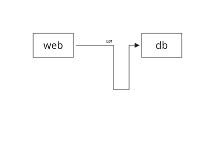

# Anchors and Bends

## Explicit Anchors

{{#tabs name="arrows-anchor"}}
{{#tab name="Preview"}}


{{#endtab}}
{{#tab name="Code"}}

```xml
{{#include ../samples/arrows/anchor.xal}}
```

{{#endtab}}
{{#endtabs}}

For a cross-frame page link, `src-frame-side` / `dst-frame-side` and
`src-frame-anchor` / `dst-frame-anchor` select the invisible outer page side and
its tangent slot independently from the item anchor. The actual terminal moves
only along the inward normal to a parallel inset line: resolved metadata
`row-gap`, or 4 layout pixels without metadata; zero remains on the outer edge.
The complete [cross-frame page-link example](../../examples/page-links.md)
demonstrates different endpoint and page-edge sides at both ends.

## Manual Bends

{{#tabs name="arrows-bend"}}
{{#tab name="Preview"}}



{{#endtab}}
{{#tab name="Code"}}

```xml
{{#include ../samples/arrows/bend.xal}}
```

{{#endtab}}
{{#endtabs}}
