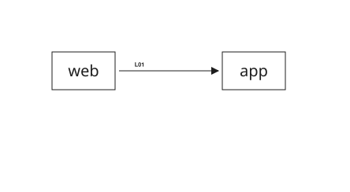
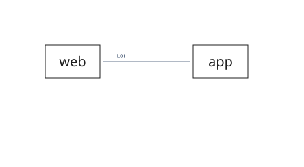
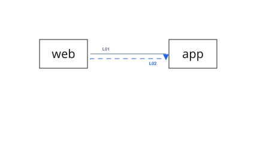

# Connector Types

## Normal Connection

{{#tabs name="arrows-normal"}}
{{#tab name="Preview"}}



{{#endtab}}
{{#tab name="Code"}}

```xml
{{#include ../samples/arrows/normal.xal}}
```

{{#endtab}}
{{#endtabs}}

## Route

{{#tabs name="arrows-route"}}
{{#tab name="Preview"}}



{{#endtab}}
{{#tab name="Code"}}

```xml
{{#include ../samples/arrows/route.xal}}
```

{{#endtab}}
{{#endtabs}}

## Traffic

{{#tabs name="arrows-traffic"}}
{{#tab name="Preview"}}



{{#endtab}}
{{#tab name="Code"}}

```xml
{{#include ../samples/arrows/traffic.xal}}
```

{{#endtab}}
{{#endtabs}}

