# AWS Tags

## AWS Cloud

{{#tabs name="frames-aws-cloud"}}
{{#tab name="Preview"}}


{{#endtab}}
{{#tab name="Code"}}

```xml
{{#include ../samples/frames/aws-cloud.xal}}
```

{{#endtab}}
{{#endtabs}}

## AWS Cloud Alt

{{#tabs name="frames-aws-cloud-alt"}}
{{#tab name="Preview"}}

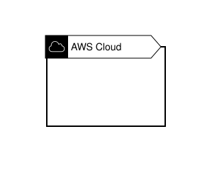

{{#endtab}}
{{#tab name="Code"}}

```xml
{{#include ../samples/frames/aws-cloud-alt.xal}}
```

{{#endtab}}
{{#endtabs}}

## AWS Account

{{#tabs name="frames-aws-account"}}
{{#tab name="Preview"}}

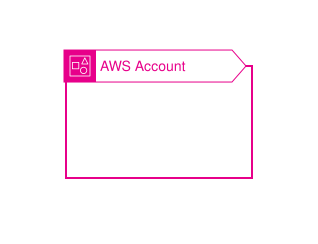

{{#endtab}}
{{#tab name="Code"}}

```xml
{{#include ../samples/frames/aws-account.xal}}
```

{{#endtab}}
{{#endtabs}}

## Region

{{#tabs name="frames-region"}}
{{#tab name="Preview"}}

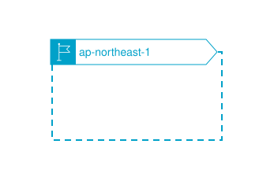

{{#endtab}}
{{#tab name="Code"}}

```xml
{{#include ../samples/frames/region.xal}}
```

{{#endtab}}
{{#endtabs}}

## Availability Zone

{{#tabs name="frames-availability-zone"}}
{{#tab name="Preview"}}

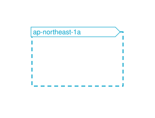

{{#endtab}}
{{#tab name="Code"}}

```xml
{{#include ../samples/frames/availability-zone.xal}}
```

{{#endtab}}
{{#endtabs}}

## VPC

{{#tabs name="frames-vpc"}}
{{#tab name="Preview"}}

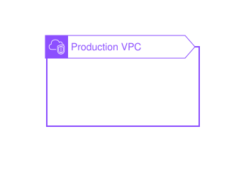

{{#endtab}}
{{#tab name="Code"}}

```xml
{{#include ../samples/frames/vpc.xal}}
```

{{#endtab}}
{{#endtabs}}

## Public Subnet

{{#tabs name="frames-public-subnet"}}
{{#tab name="Preview"}}

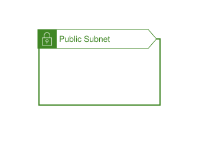

{{#endtab}}
{{#tab name="Code"}}

```xml
{{#include ../samples/frames/public-subnet.xal}}
```

{{#endtab}}
{{#endtabs}}

## Private Subnet

{{#tabs name="frames-private-subnet"}}
{{#tab name="Preview"}}

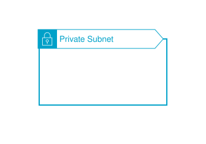

{{#endtab}}
{{#tab name="Code"}}

```xml
{{#include ../samples/frames/private-subnet.xal}}
```

{{#endtab}}
{{#endtabs}}

## Security Group

{{#tabs name="frames-security-group"}}
{{#tab name="Preview"}}

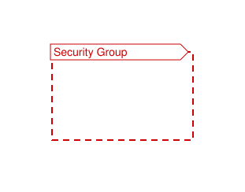

{{#endtab}}
{{#tab name="Code"}}

```xml
{{#include ../samples/frames/security-group.xal}}
```

{{#endtab}}
{{#endtabs}}

## Auto Scaling Group

{{#tabs name="frames-auto-scaling-group"}}
{{#tab name="Preview"}}

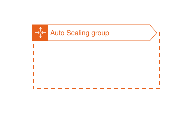

{{#endtab}}
{{#tab name="Code"}}

```xml
{{#include ../samples/frames/auto-scaling-group.xal}}
```

{{#endtab}}
{{#endtabs}}

## EC2 Instance Contents

{{#tabs name="frames-ec2-instance-contents"}}
{{#tab name="Preview"}}

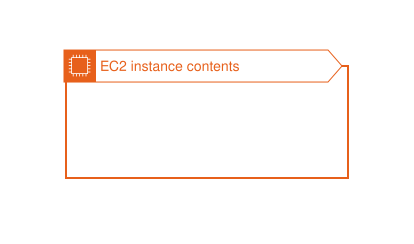

{{#endtab}}
{{#tab name="Code"}}

```xml
{{#include ../samples/frames/ec2-instance-contents.xal}}
```

{{#endtab}}
{{#endtabs}}

## Server Contents

{{#tabs name="frames-server-contents"}}
{{#tab name="Preview"}}

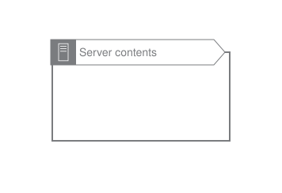

{{#endtab}}
{{#tab name="Code"}}

```xml
{{#include ../samples/frames/server-contents.xal}}
```

{{#endtab}}
{{#endtabs}}

## Corporate Data Center

{{#tabs name="frames-corporate-data-center"}}
{{#tab name="Preview"}}

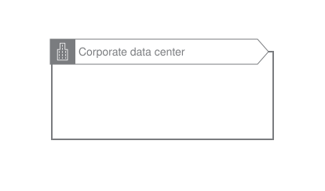

{{#endtab}}
{{#tab name="Code"}}

```xml
{{#include ../samples/frames/corporate-data-center.xal}}
```

{{#endtab}}
{{#endtabs}}

## Spot Fleet

{{#tabs name="frames-spot-fleet"}}
{{#tab name="Preview"}}

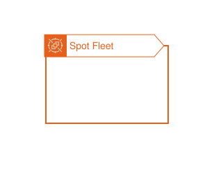

{{#endtab}}
{{#tab name="Code"}}

```xml
{{#include ../samples/frames/spot-fleet.xal}}
```

{{#endtab}}
{{#endtabs}}

## AWS IoT Greengrass Deployment

{{#tabs name="frames-aws-iot-greengrass-deployment"}}
{{#tab name="Preview"}}

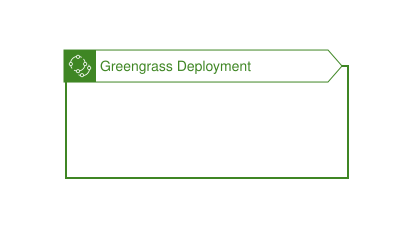

{{#endtab}}
{{#tab name="Code"}}

```xml
{{#include ../samples/frames/aws-iot-greengrass-deployment.xal}}
```

{{#endtab}}
{{#endtabs}}

## AWS IoT Greengrass

{{#tabs name="frames-aws-iot-greengrass"}}
{{#tab name="Preview"}}

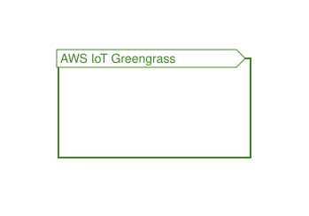

{{#endtab}}
{{#tab name="Code"}}

```xml
{{#include ../samples/frames/aws-iot-greengrass.xal}}
```

{{#endtab}}
{{#endtabs}}

## Elastic Beanstalk Container

{{#tabs name="frames-elastic-beanstalk-container"}}
{{#tab name="Preview"}}

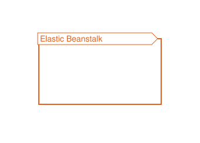

{{#endtab}}
{{#tab name="Code"}}

```xml
{{#include ../samples/frames/elastic-beanstalk-container.xal}}
```

{{#endtab}}
{{#endtabs}}

## AWS Step Functions Workflow

{{#tabs name="frames-aws-step-functions-workflow"}}
{{#tab name="Preview"}}

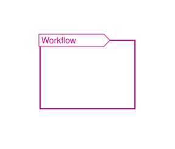

{{#endtab}}
{{#tab name="Code"}}

```xml
{{#include ../samples/frames/aws-step-functions-workflow.xal}}
```

{{#endtab}}
{{#endtabs}}

## Generic Group

{{#tabs name="frames-generic-group"}}
{{#tab name="Preview"}}

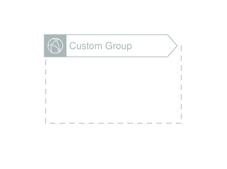

{{#endtab}}
{{#tab name="Code"}}

```xml
{{#include ../samples/frames/generic-group.xal}}
```

{{#endtab}}
{{#endtabs}}

