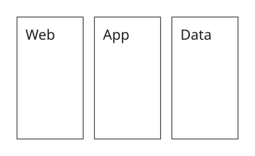
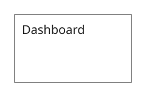

# Frame and Container Shapes

## Page Frame

Canonical documents place identified page frames inside
`<xaligo version="1"><frames>`. Historical root-frame syntax shown in older
reference cards remains readable with a migration warning. Page-frame outlines
are not drawn; the geometry remains the physical page and crop boundary.
Default SVG, PDF, and Excel page images crop exactly to that rectangle.

{{#tabs name="frames-root"}}
{{#tab name="Preview"}}



{{#endtab}}
{{#tab name="Code"}}

```xml
{{#include ../samples/frames/root.xal}}
```

{{#endtab}}
{{#endtabs}}

Set `title`, a child-frame content `version`, or a direct `<metadata>` block to
add a top/bottom page tag band. Its resolved `row-gap` (4 pixels by default) is
both the inter-row spacing and the inset at the selected vertical edge and both
row ends, so tags pack and align within `frame width - 2 * row-gap`. The
full-width strip from the outer logical frame edge to the final content-box
boundary remains reserved for metadata and excludes normal items, text,
connector paths and labels, and page links. The same `row-gap` supplies the
inward normal inset for safe page-link terminals on every side; zero retains
the outer edge. Tags support per-row left/center/right alignment plus explicit
entry breaks. See the
[frame metadata example](../../examples/frame-metadata.md) and the
[attribute table](attributes.md#border-attributes).

## Generic Leaf Box

{{#tabs name="frames-leaf"}}
{{#tab name="Preview"}}



{{#endtab}}
{{#tab name="Code"}}

```xml
{{#include ../samples/frames/leaf.xal}}
```

{{#endtab}}
{{#endtabs}}
