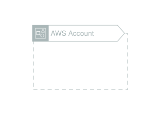
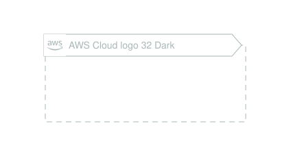
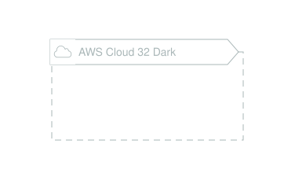
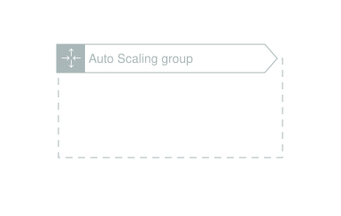
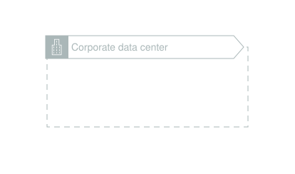
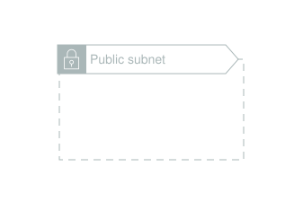
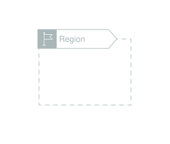
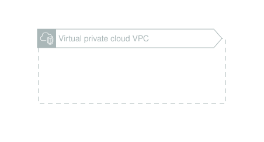

# Architecture-Group-Icons

This page references SVG files under `etc/resources/aws/svg/Architecture-Group-Icons`.
Each card shows the SVG preview first and the XAL tag syntax in the Code tab.
Showing 1-15 of 15 SVG files.

<style>
.xal-ref-grid{display:grid;grid-template-columns:repeat(3,minmax(0,1fr));gap:1rem;margin:1rem 0 1.5rem}.xal-ref-card{border:1px solid var(--table-border-color);border-radius:8px;overflow:hidden;background:var(--bg);padding:.75rem}.xal-ref-title{font-size:.9rem;font-weight:600;line-height:1.25;margin:0 0 .5rem;overflow-wrap:anywhere}.xal-ref-preview{display:flex;align-items:center;justify-content:center}.xal-ref-preview img{display:block;width:100%;height:auto}.xal-ref-card pre{margin:0;max-height:18rem;overflow:auto;white-space:pre}.xal-ref-card code{font-size:.78em}.xal-ref-tag{margin:.5rem 0 0;color:var(--fg);opacity:.72;overflow:auto;white-space:pre}.xal-ref-tag code{font-size:.72em}@media(max-width:900px){.xal-ref-grid{grid-template-columns:repeat(2,minmax(0,1fr))}}@media(max-width:560px){.xal-ref-grid{grid-template-columns:1fr}}
</style>

<div class="xal-ref-grid">
<div class="xal-ref-card">
<div class="xal-ref-title">AWS-Account_32</div>

{{#tabs name="svg-ref-0000"}}
{{#tab name="Preview"}}
<div class="xal-ref-preview">
<div>

</div>
</div>

{{#endtab}}
{{#tab name="Code"}}

```xml
{{#include ../samples/icons/Architecture-Group-Icons/aws-account-32-b5c574ca.xal}}
```

{{#endtab}}
{{#endtabs}}

<div class="xal-ref-tag"><code>&lt;generic-group id=&#34;aws-account&#34; title=&#34;AWS Account&#34; icon-id=&#34;1861&#34; /&gt;</code></div>

</div>
<div class="xal-ref-card">
<div class="xal-ref-title">AWS-Cloud-logo_32</div>

{{#tabs name="svg-ref-0001"}}
{{#tab name="Preview"}}
<div class="xal-ref-preview">
<div>

</div>
</div>

{{#endtab}}
{{#tab name="Code"}}

```xml
{{#include ../samples/icons/Architecture-Group-Icons/aws-cloud-logo-32-299977d9.xal}}
```

{{#endtab}}
{{#endtabs}}

<div class="xal-ref-tag"><code>&lt;generic-group id=&#34;aws-cloud-logo&#34; title=&#34;AWS Cloud logo&#34; icon-id=&#34;1862&#34; /&gt;</code></div>

</div>
<div class="xal-ref-card">
<div class="xal-ref-title">AWS-Cloud-logo_32_Dark</div>

{{#tabs name="svg-ref-0002"}}
{{#tab name="Preview"}}
<div class="xal-ref-preview">
<div>

</div>
</div>

{{#endtab}}
{{#tab name="Code"}}

```xml
{{#include ../samples/icons/Architecture-Group-Icons/aws-cloud-logo-32-dark-c912b0cd.xal}}
```

{{#endtab}}
{{#endtabs}}

<div class="xal-ref-tag"><code>&lt;generic-group id=&#34;aws-cloud-logo-32-dark&#34; title=&#34;AWS Cloud logo 32 Dark&#34; icon-id=&#34;1863&#34; /&gt;</code></div>

</div>
<div class="xal-ref-card">
<div class="xal-ref-title">AWS-Cloud_32</div>

{{#tabs name="svg-ref-0003"}}
{{#tab name="Preview"}}
<div class="xal-ref-preview">
<div>

</div>
</div>

{{#endtab}}
{{#tab name="Code"}}

```xml
{{#include ../samples/icons/Architecture-Group-Icons/aws-cloud-32-2e4dce93.xal}}
```

{{#endtab}}
{{#endtabs}}

<div class="xal-ref-tag"><code>&lt;generic-group id=&#34;aws-cloud&#34; title=&#34;AWS Cloud&#34; icon-id=&#34;1864&#34; /&gt;</code></div>

</div>
<div class="xal-ref-card">
<div class="xal-ref-title">AWS-Cloud_32_Dark</div>

{{#tabs name="svg-ref-0004"}}
{{#tab name="Preview"}}
<div class="xal-ref-preview">
<div>

</div>
</div>

{{#endtab}}
{{#tab name="Code"}}

```xml
{{#include ../samples/icons/Architecture-Group-Icons/aws-cloud-32-dark-7eeafa1e.xal}}
```

{{#endtab}}
{{#endtabs}}

<div class="xal-ref-tag"><code>&lt;generic-group id=&#34;aws-cloud-32-dark&#34; title=&#34;AWS Cloud 32 Dark&#34; icon-id=&#34;1865&#34; /&gt;</code></div>

</div>
<div class="xal-ref-card">
<div class="xal-ref-title">AWS-IoT-Greengrass-Deployment_32</div>

{{#tabs name="svg-ref-0005"}}
{{#tab name="Preview"}}
<div class="xal-ref-preview">
<div>

</div>
</div>

{{#endtab}}
{{#tab name="Code"}}

```xml
{{#include ../samples/icons/Architecture-Group-Icons/aws-iot-greengrass-deployment-32-e9b60b19.xal}}
```

{{#endtab}}
{{#endtabs}}

<div class="xal-ref-tag"><code>&lt;generic-group id=&#34;aws-iot-greengrass-deployment&#34; title=&#34;AWS IoT Greengrass Deployment&#34; icon-id=&#34;1866&#34; /&gt;</code></div>

</div>
<div class="xal-ref-card">
<div class="xal-ref-title">Auto-Scaling-group_32</div>

{{#tabs name="svg-ref-0006"}}
{{#tab name="Preview"}}
<div class="xal-ref-preview">
<div>

</div>
</div>

{{#endtab}}
{{#tab name="Code"}}

```xml
{{#include ../samples/icons/Architecture-Group-Icons/auto-scaling-group-32-840a9a16.xal}}
```

{{#endtab}}
{{#endtabs}}

<div class="xal-ref-tag"><code>&lt;generic-group id=&#34;auto-scaling-group&#34; title=&#34;Auto Scaling group&#34; icon-id=&#34;1867&#34; /&gt;</code></div>

</div>
<div class="xal-ref-card">
<div class="xal-ref-title">Corporate-data-center_32</div>

{{#tabs name="svg-ref-0007"}}
{{#tab name="Preview"}}
<div class="xal-ref-preview">
<div>

</div>
</div>

{{#endtab}}
{{#tab name="Code"}}

```xml
{{#include ../samples/icons/Architecture-Group-Icons/corporate-data-center-32-6d2c4beb.xal}}
```

{{#endtab}}
{{#endtabs}}

<div class="xal-ref-tag"><code>&lt;generic-group id=&#34;corporate-data-center&#34; title=&#34;Corporate data center&#34; icon-id=&#34;1868&#34; /&gt;</code></div>

</div>
<div class="xal-ref-card">
<div class="xal-ref-title">EC2-instance-contents_32</div>

{{#tabs name="svg-ref-0008"}}
{{#tab name="Preview"}}
<div class="xal-ref-preview">
<div>

</div>
</div>

{{#endtab}}
{{#tab name="Code"}}

```xml
{{#include ../samples/icons/Architecture-Group-Icons/ec2-instance-contents-32-8fa1607e.xal}}
```

{{#endtab}}
{{#endtabs}}

<div class="xal-ref-tag"><code>&lt;generic-group id=&#34;ec2-instance-contents&#34; title=&#34;EC2 instance contents&#34; icon-id=&#34;1869&#34; /&gt;</code></div>

</div>
<div class="xal-ref-card">
<div class="xal-ref-title">Private-subnet_32</div>

{{#tabs name="svg-ref-0009"}}
{{#tab name="Preview"}}
<div class="xal-ref-preview">
<div>

</div>
</div>

{{#endtab}}
{{#tab name="Code"}}

```xml
{{#include ../samples/icons/Architecture-Group-Icons/private-subnet-32-b09d0d21.xal}}
```

{{#endtab}}
{{#endtabs}}

<div class="xal-ref-tag"><code>&lt;generic-group id=&#34;private-subnet&#34; title=&#34;Private subnet&#34; icon-id=&#34;1870&#34; /&gt;</code></div>

</div>
<div class="xal-ref-card">
<div class="xal-ref-title">Public-subnet_32</div>

{{#tabs name="svg-ref-0010"}}
{{#tab name="Preview"}}
<div class="xal-ref-preview">
<div>

</div>
</div>

{{#endtab}}
{{#tab name="Code"}}

```xml
{{#include ../samples/icons/Architecture-Group-Icons/public-subnet-32-5b9f21ec.xal}}
```

{{#endtab}}
{{#endtabs}}

<div class="xal-ref-tag"><code>&lt;generic-group id=&#34;public-subnet&#34; title=&#34;Public subnet&#34; icon-id=&#34;1871&#34; /&gt;</code></div>

</div>
<div class="xal-ref-card">
<div class="xal-ref-title">Region_32</div>

{{#tabs name="svg-ref-0011"}}
{{#tab name="Preview"}}
<div class="xal-ref-preview">
<div>

</div>
</div>

{{#endtab}}
{{#tab name="Code"}}

```xml
{{#include ../samples/icons/Architecture-Group-Icons/region-32-dd1e5fc3.xal}}
```

{{#endtab}}
{{#endtabs}}

<div class="xal-ref-tag"><code>&lt;generic-group id=&#34;region&#34; title=&#34;Region&#34; icon-id=&#34;1872&#34; /&gt;</code></div>

</div>
<div class="xal-ref-card">
<div class="xal-ref-title">Server-contents_32</div>

{{#tabs name="svg-ref-0012"}}
{{#tab name="Preview"}}
<div class="xal-ref-preview">
<div>

</div>
</div>

{{#endtab}}
{{#tab name="Code"}}

```xml
{{#include ../samples/icons/Architecture-Group-Icons/server-contents-32-9520bb82.xal}}
```

{{#endtab}}
{{#endtabs}}

<div class="xal-ref-tag"><code>&lt;generic-group id=&#34;server-contents&#34; title=&#34;Server contents&#34; icon-id=&#34;1873&#34; /&gt;</code></div>

</div>
<div class="xal-ref-card">
<div class="xal-ref-title">Spot-Fleet_32</div>

{{#tabs name="svg-ref-0013"}}
{{#tab name="Preview"}}
<div class="xal-ref-preview">
<div>

</div>
</div>

{{#endtab}}
{{#tab name="Code"}}

```xml
{{#include ../samples/icons/Architecture-Group-Icons/spot-fleet-32-044ff3f2.xal}}
```

{{#endtab}}
{{#endtabs}}

<div class="xal-ref-tag"><code>&lt;generic-group id=&#34;spot-fleet&#34; title=&#34;Spot Fleet&#34; icon-id=&#34;1874&#34; /&gt;</code></div>

</div>
<div class="xal-ref-card">
<div class="xal-ref-title">Virtual-private-cloud-VPC_32</div>

{{#tabs name="svg-ref-0014"}}
{{#tab name="Preview"}}
<div class="xal-ref-preview">
<div>

</div>
</div>

{{#endtab}}
{{#tab name="Code"}}

```xml
{{#include ../samples/icons/Architecture-Group-Icons/virtual-private-cloud-vpc-32-e4442560.xal}}
```

{{#endtab}}
{{#endtabs}}

<div class="xal-ref-tag"><code>&lt;generic-group id=&#34;virtual-private-cloud-vpc&#34; title=&#34;Virtual private cloud VPC&#34; icon-id=&#34;1875&#34; /&gt;</code></div>

</div>
</div>
