# Architecture-Service-Icons - Page 1

This page references SVG files under `etc/resources/aws/svg/Architecture-Service-Icons`.
Each card shows the SVG preview first and the XAL tag syntax in the Code tab.
Showing 1-90 of 1236 SVG files.

<style>
.xal-ref-grid{display:grid;grid-template-columns:repeat(3,minmax(0,1fr));gap:1rem;margin:1rem 0 1.5rem}.xal-ref-card{border:1px solid var(--table-border-color);border-radius:8px;overflow:hidden;background:var(--bg);padding:.75rem}.xal-ref-title{font-size:.9rem;font-weight:600;line-height:1.25;margin:0 0 .5rem;overflow-wrap:anywhere}.xal-ref-preview{display:flex;align-items:center;justify-content:center}.xal-ref-preview img{display:block;width:100%;height:auto}.xal-ref-card pre{margin:0;max-height:18rem;overflow:auto;white-space:pre}.xal-ref-card code{font-size:.78em}.xal-ref-tag{margin:.5rem 0 0;color:var(--fg);opacity:.72;overflow:auto;white-space:pre}.xal-ref-tag code{font-size:.72em}@media(max-width:900px){.xal-ref-grid{grid-template-columns:repeat(2,minmax(0,1fr))}}@media(max-width:560px){.xal-ref-grid{grid-template-columns:1fr}}
</style>

[Back to section index](architecture-service-icons.md)

<div class="xal-ref-grid">
<div class="xal-ref-card">
<div class="xal-ref-title">Arch_AWS-Clean-Rooms_16</div>

{{#tabs name="svg-ref-0000"}}
{{#tab name="Preview"}}
<div class="xal-ref-preview">
<div>

</div>
</div>

{{#endtab}}
{{#tab name="Code"}}

```xml
{{#include ../samples/icons/Architecture-Service-Icons/arch-aws-clean-rooms-16-f64877aa.xal}}
```

{{#endtab}}
{{#endtabs}}

<div class="xal-ref-tag"><code>&lt;item id=&#34;1102&#34; /&gt;</code></div>

</div>
<div class="xal-ref-card">
<div class="xal-ref-title">Arch_AWS-Data-Exchange_16</div>

{{#tabs name="svg-ref-0001"}}
{{#tab name="Preview"}}
<div class="xal-ref-preview">
<div>
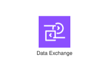
</div>
</div>

{{#endtab}}
{{#tab name="Code"}}

```xml
{{#include ../samples/icons/Architecture-Service-Icons/arch-aws-data-exchange-16-e8e9de07.xal}}
```

{{#endtab}}
{{#endtabs}}

<div class="xal-ref-tag"><code>&lt;item id=&#34;1103&#34; /&gt;</code></div>

</div>
<div class="xal-ref-card">
<div class="xal-ref-title">Arch_AWS-Entity-Resolution_16</div>

{{#tabs name="svg-ref-0002"}}
{{#tab name="Preview"}}
<div class="xal-ref-preview">
<div>
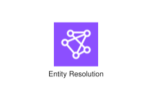
</div>
</div>

{{#endtab}}
{{#tab name="Code"}}

```xml
{{#include ../samples/icons/Architecture-Service-Icons/arch-aws-entity-resolution-16-368b73c5.xal}}
```

{{#endtab}}
{{#endtabs}}

<div class="xal-ref-tag"><code>&lt;item id=&#34;1104&#34; /&gt;</code></div>

</div>
<div class="xal-ref-card">
<div class="xal-ref-title">Arch_AWS-Glue-DataBrew_16</div>

{{#tabs name="svg-ref-0003"}}
{{#tab name="Preview"}}
<div class="xal-ref-preview">
<div>
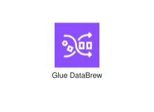
</div>
</div>

{{#endtab}}
{{#tab name="Code"}}

```xml
{{#include ../samples/icons/Architecture-Service-Icons/arch-aws-glue-databrew-16-fb77866b.xal}}
```

{{#endtab}}
{{#endtabs}}

<div class="xal-ref-tag"><code>&lt;item id=&#34;1105&#34; /&gt;</code></div>

</div>
<div class="xal-ref-card">
<div class="xal-ref-title">Arch_AWS-Glue_16</div>

{{#tabs name="svg-ref-0004"}}
{{#tab name="Preview"}}
<div class="xal-ref-preview">
<div>
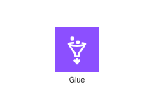
</div>
</div>

{{#endtab}}
{{#tab name="Code"}}

```xml
{{#include ../samples/icons/Architecture-Service-Icons/arch-aws-glue-16-e114d017.xal}}
```

{{#endtab}}
{{#endtabs}}

<div class="xal-ref-tag"><code>&lt;item id=&#34;1106&#34; /&gt;</code></div>

</div>
<div class="xal-ref-card">
<div class="xal-ref-title">Arch_AWS-Lake-Formation_16</div>

{{#tabs name="svg-ref-0005"}}
{{#tab name="Preview"}}
<div class="xal-ref-preview">
<div>
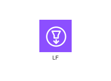
</div>
</div>

{{#endtab}}
{{#tab name="Code"}}

```xml
{{#include ../samples/icons/Architecture-Service-Icons/arch-aws-lake-formation-16-8556c657.xal}}
```

{{#endtab}}
{{#endtabs}}

<div class="xal-ref-tag"><code>&lt;item id=&#34;1107&#34; /&gt;</code></div>

</div>
<div class="xal-ref-card">
<div class="xal-ref-title">Arch_Amazon-Athena_16</div>

{{#tabs name="svg-ref-0006"}}
{{#tab name="Preview"}}
<div class="xal-ref-preview">
<div>
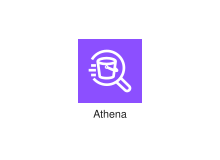
</div>
</div>

{{#endtab}}
{{#tab name="Code"}}

```xml
{{#include ../samples/icons/Architecture-Service-Icons/arch-amazon-athena-16-5ba15e3e.xal}}
```

{{#endtab}}
{{#endtabs}}

<div class="xal-ref-tag"><code>&lt;item id=&#34;1108&#34; /&gt;</code></div>

</div>
<div class="xal-ref-card">
<div class="xal-ref-title">Arch_Amazon-CloudSearch_16</div>

{{#tabs name="svg-ref-0007"}}
{{#tab name="Preview"}}
<div class="xal-ref-preview">
<div>
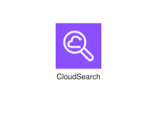
</div>
</div>

{{#endtab}}
{{#tab name="Code"}}

```xml
{{#include ../samples/icons/Architecture-Service-Icons/arch-amazon-cloudsearch-16-878ff1bc.xal}}
```

{{#endtab}}
{{#endtabs}}

<div class="xal-ref-tag"><code>&lt;item id=&#34;1109&#34; /&gt;</code></div>

</div>
<div class="xal-ref-card">
<div class="xal-ref-title">Arch_Amazon-Data-Firehose_16</div>

{{#tabs name="svg-ref-0008"}}
{{#tab name="Preview"}}
<div class="xal-ref-preview">
<div>
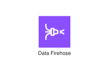
</div>
</div>

{{#endtab}}
{{#tab name="Code"}}

```xml
{{#include ../samples/icons/Architecture-Service-Icons/arch-amazon-data-firehose-16-cac5ef11.xal}}
```

{{#endtab}}
{{#endtabs}}

<div class="xal-ref-tag"><code>&lt;item id=&#34;1110&#34; /&gt;</code></div>

</div>
<div class="xal-ref-card">
<div class="xal-ref-title">Arch_Amazon-DataZone_16</div>

{{#tabs name="svg-ref-0009"}}
{{#tab name="Preview"}}
<div class="xal-ref-preview">
<div>
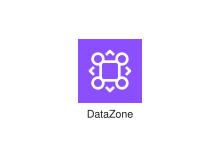
</div>
</div>

{{#endtab}}
{{#tab name="Code"}}

```xml
{{#include ../samples/icons/Architecture-Service-Icons/arch-amazon-datazone-16-dd26afaf.xal}}
```

{{#endtab}}
{{#endtabs}}

<div class="xal-ref-tag"><code>&lt;item id=&#34;1111&#34; /&gt;</code></div>

</div>
<div class="xal-ref-card">
<div class="xal-ref-title">Arch_Amazon-EMR_16</div>

{{#tabs name="svg-ref-0010"}}
{{#tab name="Preview"}}
<div class="xal-ref-preview">
<div>
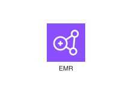
</div>
</div>

{{#endtab}}
{{#tab name="Code"}}

```xml
{{#include ../samples/icons/Architecture-Service-Icons/arch-amazon-emr-16-7669b749.xal}}
```

{{#endtab}}
{{#endtabs}}

<div class="xal-ref-tag"><code>&lt;item id=&#34;1112&#34; /&gt;</code></div>

</div>
<div class="xal-ref-card">
<div class="xal-ref-title">Arch_Amazon-FinSpace_16</div>

{{#tabs name="svg-ref-0011"}}
{{#tab name="Preview"}}
<div class="xal-ref-preview">
<div>

</div>
</div>

{{#endtab}}
{{#tab name="Code"}}

```xml
{{#include ../samples/icons/Architecture-Service-Icons/arch-amazon-finspace-16-bb0668d8.xal}}
```

{{#endtab}}
{{#endtabs}}

<div class="xal-ref-tag"><code>&lt;item id=&#34;1113&#34; /&gt;</code></div>

</div>
<div class="xal-ref-card">
<div class="xal-ref-title">Arch_Amazon-Kinesis-Data-Streams_16</div>

{{#tabs name="svg-ref-0012"}}
{{#tab name="Preview"}}
<div class="xal-ref-preview">
<div>
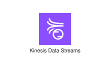
</div>
</div>

{{#endtab}}
{{#tab name="Code"}}

```xml
{{#include ../samples/icons/Architecture-Service-Icons/arch-amazon-kinesis-data-streams-16-2b718480.xal}}
```

{{#endtab}}
{{#endtabs}}

<div class="xal-ref-tag"><code>&lt;item id=&#34;1114&#34; /&gt;</code></div>

</div>
<div class="xal-ref-card">
<div class="xal-ref-title">Arch_Amazon-Kinesis-Video-Streams_16</div>

{{#tabs name="svg-ref-0013"}}
{{#tab name="Preview"}}
<div class="xal-ref-preview">
<div>

</div>
</div>

{{#endtab}}
{{#tab name="Code"}}

```xml
{{#include ../samples/icons/Architecture-Service-Icons/arch-amazon-kinesis-video-streams-16-3a2fdaee.xal}}
```

{{#endtab}}
{{#endtabs}}

<div class="xal-ref-tag"><code>&lt;item id=&#34;1115&#34; /&gt;</code></div>

</div>
<div class="xal-ref-card">
<div class="xal-ref-title">Arch_Amazon-Kinesis_16</div>

{{#tabs name="svg-ref-0014"}}
{{#tab name="Preview"}}
<div class="xal-ref-preview">
<div>
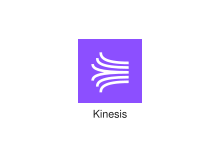
</div>
</div>

{{#endtab}}
{{#tab name="Code"}}

```xml
{{#include ../samples/icons/Architecture-Service-Icons/arch-amazon-kinesis-16-33f72cc2.xal}}
```

{{#endtab}}
{{#endtabs}}

<div class="xal-ref-tag"><code>&lt;item id=&#34;1116&#34; /&gt;</code></div>

</div>
<div class="xal-ref-card">
<div class="xal-ref-title">Arch_Amazon-Managed-Service-for-Apache-Flink_16</div>

{{#tabs name="svg-ref-0015"}}
{{#tab name="Preview"}}
<div class="xal-ref-preview">
<div>

</div>
</div>

{{#endtab}}
{{#tab name="Code"}}

```xml
{{#include ../samples/icons/Architecture-Service-Icons/arch-amazon-managed-service-for-apache-flink-16-0a9ebd5f.xal}}
```

{{#endtab}}
{{#endtabs}}

<div class="xal-ref-tag"><code>&lt;item id=&#34;1117&#34; /&gt;</code></div>

</div>
<div class="xal-ref-card">
<div class="xal-ref-title">Arch_Amazon-Managed-Streaming-for-Apache-Kafka_16</div>

{{#tabs name="svg-ref-0016"}}
{{#tab name="Preview"}}
<div class="xal-ref-preview">
<div>

</div>
</div>

{{#endtab}}
{{#tab name="Code"}}

```xml
{{#include ../samples/icons/Architecture-Service-Icons/arch-amazon-managed-streaming-for-apache-kafka-16-d6efd949.xal}}
```

{{#endtab}}
{{#endtabs}}

<div class="xal-ref-tag"><code>&lt;item id=&#34;1118&#34; /&gt;</code></div>

</div>
<div class="xal-ref-card">
<div class="xal-ref-title">Arch_Amazon-OpenSearch-Service_16</div>

{{#tabs name="svg-ref-0017"}}
{{#tab name="Preview"}}
<div class="xal-ref-preview">
<div>
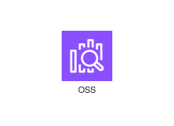
</div>
</div>

{{#endtab}}
{{#tab name="Code"}}

```xml
{{#include ../samples/icons/Architecture-Service-Icons/arch-amazon-opensearch-service-16-eba6624a.xal}}
```

{{#endtab}}
{{#endtabs}}

<div class="xal-ref-tag"><code>&lt;item id=&#34;1119&#34; /&gt;</code></div>

</div>
<div class="xal-ref-card">
<div class="xal-ref-title">Arch_Amazon-QuickSight_16</div>

{{#tabs name="svg-ref-0018"}}
{{#tab name="Preview"}}
<div class="xal-ref-preview">
<div>
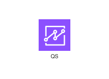
</div>
</div>

{{#endtab}}
{{#tab name="Code"}}

```xml
{{#include ../samples/icons/Architecture-Service-Icons/arch-amazon-quicksight-16-a8737ca8.xal}}
```

{{#endtab}}
{{#endtabs}}

<div class="xal-ref-tag"><code>&lt;item id=&#34;1120&#34; /&gt;</code></div>

</div>
<div class="xal-ref-card">
<div class="xal-ref-title">Arch_Amazon-Redshift_16</div>

{{#tabs name="svg-ref-0019"}}
{{#tab name="Preview"}}
<div class="xal-ref-preview">
<div>
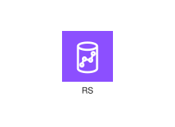
</div>
</div>

{{#endtab}}
{{#tab name="Code"}}

```xml
{{#include ../samples/icons/Architecture-Service-Icons/arch-amazon-redshift-16-80e7af87.xal}}
```

{{#endtab}}
{{#endtabs}}

<div class="xal-ref-tag"><code>&lt;item id=&#34;1121&#34; /&gt;</code></div>

</div>
<div class="xal-ref-card">
<div class="xal-ref-title">Arch_Amazon-SageMaker_16</div>

{{#tabs name="svg-ref-0020"}}
{{#tab name="Preview"}}
<div class="xal-ref-preview">
<div>
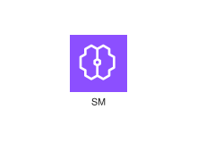
</div>
</div>

{{#endtab}}
{{#tab name="Code"}}

```xml
{{#include ../samples/icons/Architecture-Service-Icons/arch-amazon-sagemaker-16-d211481b.xal}}
```

{{#endtab}}
{{#endtabs}}

<div class="xal-ref-tag"><code>&lt;item id=&#34;1122&#34; /&gt;</code></div>

</div>
<div class="xal-ref-card">
<div class="xal-ref-title">Arch_AWS-Clean-Rooms_32</div>

{{#tabs name="svg-ref-0021"}}
{{#tab name="Preview"}}
<div class="xal-ref-preview">
<div>
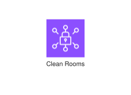
</div>
</div>

{{#endtab}}
{{#tab name="Code"}}

```xml
{{#include ../samples/icons/Architecture-Service-Icons/arch-aws-clean-rooms-32-61afd4a0.xal}}
```

{{#endtab}}
{{#endtabs}}

<div class="xal-ref-tag"><code>&lt;item id=&#34;1081&#34; /&gt;</code></div>

</div>
<div class="xal-ref-card">
<div class="xal-ref-title">Arch_AWS-Data-Exchange_32</div>

{{#tabs name="svg-ref-0022"}}
{{#tab name="Preview"}}
<div class="xal-ref-preview">
<div>
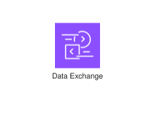
</div>
</div>

{{#endtab}}
{{#tab name="Code"}}

```xml
{{#include ../samples/icons/Architecture-Service-Icons/arch-aws-data-exchange-32-53fb779d.xal}}
```

{{#endtab}}
{{#endtabs}}

<div class="xal-ref-tag"><code>&lt;item id=&#34;1082&#34; /&gt;</code></div>

</div>
<div class="xal-ref-card">
<div class="xal-ref-title">Arch_AWS-Entity-Resolution_32</div>

{{#tabs name="svg-ref-0023"}}
{{#tab name="Preview"}}
<div class="xal-ref-preview">
<div>

</div>
</div>

{{#endtab}}
{{#tab name="Code"}}

```xml
{{#include ../samples/icons/Architecture-Service-Icons/arch-aws-entity-resolution-32-f7c988c7.xal}}
```

{{#endtab}}
{{#endtabs}}

<div class="xal-ref-tag"><code>&lt;item id=&#34;1083&#34; /&gt;</code></div>

</div>
<div class="xal-ref-card">
<div class="xal-ref-title">Arch_AWS-Glue-DataBrew_32</div>

{{#tabs name="svg-ref-0024"}}
{{#tab name="Preview"}}
<div class="xal-ref-preview">
<div>
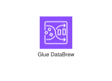
</div>
</div>

{{#endtab}}
{{#tab name="Code"}}

```xml
{{#include ../samples/icons/Architecture-Service-Icons/arch-aws-glue-databrew-32-40652ff1.xal}}
```

{{#endtab}}
{{#endtabs}}

<div class="xal-ref-tag"><code>&lt;item id=&#34;1084&#34; /&gt;</code></div>

</div>
<div class="xal-ref-card">
<div class="xal-ref-title">Arch_AWS-Glue_32</div>

{{#tabs name="svg-ref-0025"}}
{{#tab name="Preview"}}
<div class="xal-ref-preview">
<div>
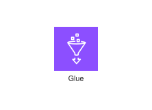
</div>
</div>

{{#endtab}}
{{#tab name="Code"}}

```xml
{{#include ../samples/icons/Architecture-Service-Icons/arch-aws-glue-32-e86b9735.xal}}
```

{{#endtab}}
{{#endtabs}}

<div class="xal-ref-tag"><code>&lt;item id=&#34;1085&#34; /&gt;</code></div>

</div>
<div class="xal-ref-card">
<div class="xal-ref-title">Arch_AWS-Lake-Formation_32</div>

{{#tabs name="svg-ref-0026"}}
{{#tab name="Preview"}}
<div class="xal-ref-preview">
<div>
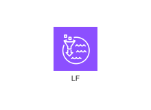
</div>
</div>

{{#endtab}}
{{#tab name="Code"}}

```xml
{{#include ../samples/icons/Architecture-Service-Icons/arch-aws-lake-formation-32-2171fa50.xal}}
```

{{#endtab}}
{{#endtabs}}

<div class="xal-ref-tag"><code>&lt;item id=&#34;1086&#34; /&gt;</code></div>

</div>
<div class="xal-ref-card">
<div class="xal-ref-title">Arch_Amazon-Athena_32</div>

{{#tabs name="svg-ref-0027"}}
{{#tab name="Preview"}}
<div class="xal-ref-preview">
<div>

</div>
</div>

{{#endtab}}
{{#tab name="Code"}}

```xml
{{#include ../samples/icons/Architecture-Service-Icons/arch-amazon-athena-32-81c3c88a.xal}}
```

{{#endtab}}
{{#endtabs}}

<div class="xal-ref-tag"><code>&lt;item id=&#34;1087&#34; /&gt;</code></div>

</div>
<div class="xal-ref-card">
<div class="xal-ref-title">Arch_Amazon-CloudSearch_32</div>

{{#tabs name="svg-ref-0028"}}
{{#tab name="Preview"}}
<div class="xal-ref-preview">
<div>
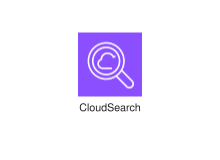
</div>
</div>

{{#endtab}}
{{#tab name="Code"}}

```xml
{{#include ../samples/icons/Architecture-Service-Icons/arch-amazon-cloudsearch-32-23a8cdbb.xal}}
```

{{#endtab}}
{{#endtabs}}

<div class="xal-ref-tag"><code>&lt;item id=&#34;1088&#34; /&gt;</code></div>

</div>
<div class="xal-ref-card">
<div class="xal-ref-title">Arch_Amazon-Data-Firehose_32</div>

{{#tabs name="svg-ref-0029"}}
{{#tab name="Preview"}}
<div class="xal-ref-preview">
<div>
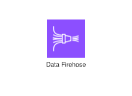
</div>
</div>

{{#endtab}}
{{#tab name="Code"}}

```xml
{{#include ../samples/icons/Architecture-Service-Icons/arch-amazon-data-firehose-32-a4c985d3.xal}}
```

{{#endtab}}
{{#endtabs}}

<div class="xal-ref-tag"><code>&lt;item id=&#34;1089&#34; /&gt;</code></div>

</div>
<div class="xal-ref-card">
<div class="xal-ref-title">Arch_Amazon-DataZone_32</div>

{{#tabs name="svg-ref-0030"}}
{{#tab name="Preview"}}
<div class="xal-ref-preview">
<div>
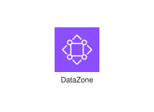
</div>
</div>

{{#endtab}}
{{#tab name="Code"}}

```xml
{{#include ../samples/icons/Architecture-Service-Icons/arch-amazon-datazone-32-4ac10ca5.xal}}
```

{{#endtab}}
{{#endtabs}}

<div class="xal-ref-tag"><code>&lt;item id=&#34;1090&#34; /&gt;</code></div>

</div>
<div class="xal-ref-card">
<div class="xal-ref-title">Arch_Amazon-EMR_32</div>

{{#tabs name="svg-ref-0031"}}
{{#tab name="Preview"}}
<div class="xal-ref-preview">
<div>
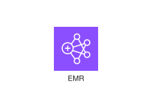
</div>
</div>

{{#endtab}}
{{#tab name="Code"}}

```xml
{{#include ../samples/icons/Architecture-Service-Icons/arch-amazon-emr-32-37410880.xal}}
```

{{#endtab}}
{{#endtabs}}

<div class="xal-ref-tag"><code>&lt;item id=&#34;1091&#34; /&gt;</code></div>

</div>
<div class="xal-ref-card">
<div class="xal-ref-title">Arch_Amazon-FinSpace_32</div>

{{#tabs name="svg-ref-0032"}}
{{#tab name="Preview"}}
<div class="xal-ref-preview">
<div>

</div>
</div>

{{#endtab}}
{{#tab name="Code"}}

```xml
{{#include ../samples/icons/Architecture-Service-Icons/arch-amazon-finspace-32-2ce1cbd2.xal}}
```

{{#endtab}}
{{#endtabs}}

<div class="xal-ref-tag"><code>&lt;item id=&#34;1092&#34; /&gt;</code></div>

</div>
<div class="xal-ref-card">
<div class="xal-ref-title">Arch_Amazon-Kinesis-Data-Streams_32</div>

{{#tabs name="svg-ref-0033"}}
{{#tab name="Preview"}}
<div class="xal-ref-preview">
<div>
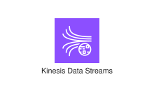
</div>
</div>

{{#endtab}}
{{#tab name="Code"}}

```xml
{{#include ../samples/icons/Architecture-Service-Icons/arch-amazon-kinesis-data-streams-32-1c87c2d0.xal}}
```

{{#endtab}}
{{#endtabs}}

<div class="xal-ref-tag"><code>&lt;item id=&#34;1093&#34; /&gt;</code></div>

</div>
<div class="xal-ref-card">
<div class="xal-ref-title">Arch_Amazon-Kinesis-Video-Streams_32</div>

{{#tabs name="svg-ref-0034"}}
{{#tab name="Preview"}}
<div class="xal-ref-preview">
<div>

</div>
</div>

{{#endtab}}
{{#tab name="Code"}}

```xml
{{#include ../samples/icons/Architecture-Service-Icons/arch-amazon-kinesis-video-streams-32-e53529a8.xal}}
```

{{#endtab}}
{{#endtabs}}

<div class="xal-ref-tag"><code>&lt;item id=&#34;1094&#34; /&gt;</code></div>

</div>
<div class="xal-ref-card">
<div class="xal-ref-title">Arch_Amazon-Kinesis_32</div>

{{#tabs name="svg-ref-0035"}}
{{#tab name="Preview"}}
<div class="xal-ref-preview">
<div>
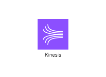
</div>
</div>

{{#endtab}}
{{#tab name="Code"}}

```xml
{{#include ../samples/icons/Architecture-Service-Icons/arch-amazon-kinesis-32-4b676d35.xal}}
```

{{#endtab}}
{{#endtabs}}

<div class="xal-ref-tag"><code>&lt;item id=&#34;1095&#34; /&gt;</code></div>

</div>
<div class="xal-ref-card">
<div class="xal-ref-title">Arch_Amazon-Managed-Service-for-Apache-Flink_32</div>

{{#tabs name="svg-ref-0036"}}
{{#tab name="Preview"}}
<div class="xal-ref-preview">
<div>

</div>
</div>

{{#endtab}}
{{#tab name="Code"}}

```xml
{{#include ../samples/icons/Architecture-Service-Icons/arch-amazon-managed-service-for-apache-flink-32-918e2ebd.xal}}
```

{{#endtab}}
{{#endtabs}}

<div class="xal-ref-tag"><code>&lt;item id=&#34;1096&#34; /&gt;</code></div>

</div>
<div class="xal-ref-card">
<div class="xal-ref-title">Arch_Amazon-Managed-Streaming-for-Apache-Kafka_32</div>

{{#tabs name="svg-ref-0037"}}
{{#tab name="Preview"}}
<div class="xal-ref-preview">
<div>

</div>
</div>

{{#endtab}}
{{#tab name="Code"}}

```xml
{{#include ../samples/icons/Architecture-Service-Icons/arch-amazon-managed-streaming-for-apache-kafka-32-dd83356c.xal}}
```

{{#endtab}}
{{#endtabs}}

<div class="xal-ref-tag"><code>&lt;item id=&#34;1097&#34; /&gt;</code></div>

</div>
<div class="xal-ref-card">
<div class="xal-ref-title">Arch_Amazon-OpenSearch-Service_32</div>

{{#tabs name="svg-ref-0038"}}
{{#tab name="Preview"}}
<div class="xal-ref-preview">
<div>

</div>
</div>

{{#endtab}}
{{#tab name="Code"}}

```xml
{{#include ../samples/icons/Architecture-Service-Icons/arch-amazon-opensearch-service-32-37436fab.xal}}
```

{{#endtab}}
{{#endtabs}}

<div class="xal-ref-tag"><code>&lt;item id=&#34;1098&#34; /&gt;</code></div>

</div>
<div class="xal-ref-card">
<div class="xal-ref-title">Arch_Amazon-QuickSight_32</div>

{{#tabs name="svg-ref-0039"}}
{{#tab name="Preview"}}
<div class="xal-ref-preview">
<div>
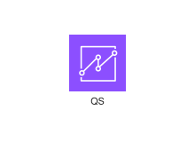
</div>
</div>

{{#endtab}}
{{#tab name="Code"}}

```xml
{{#include ../samples/icons/Architecture-Service-Icons/arch-amazon-quicksight-32-1361d532.xal}}
```

{{#endtab}}
{{#endtabs}}

<div class="xal-ref-tag"><code>&lt;item id=&#34;1099&#34; /&gt;</code></div>

</div>
<div class="xal-ref-card">
<div class="xal-ref-title">Arch_Amazon-Redshift_32</div>

{{#tabs name="svg-ref-0040"}}
{{#tab name="Preview"}}
<div class="xal-ref-preview">
<div>
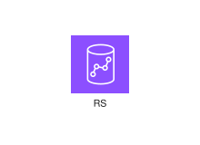
</div>
</div>

{{#endtab}}
{{#tab name="Code"}}

```xml
{{#include ../samples/icons/Architecture-Service-Icons/arch-amazon-redshift-32-17000c8d.xal}}
```

{{#endtab}}
{{#endtabs}}

<div class="xal-ref-tag"><code>&lt;item id=&#34;1100&#34; /&gt;</code></div>

</div>
<div class="xal-ref-card">
<div class="xal-ref-title">Arch_Amazon-SageMaker_32</div>

{{#tabs name="svg-ref-0041"}}
{{#tab name="Preview"}}
<div class="xal-ref-preview">
<div>
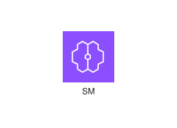
</div>
</div>

{{#endtab}}
{{#tab name="Code"}}

```xml
{{#include ../samples/icons/Architecture-Service-Icons/arch-amazon-sagemaker-32-86151252.xal}}
```

{{#endtab}}
{{#endtabs}}

<div class="xal-ref-tag"><code>&lt;item id=&#34;1101&#34; /&gt;</code></div>

</div>
<div class="xal-ref-card">
<div class="xal-ref-title">Arch_AWS-Clean-Rooms_48</div>

{{#tabs name="svg-ref-0042"}}
{{#tab name="Preview"}}
<div class="xal-ref-preview">
<div>
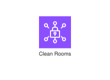
</div>
</div>

{{#endtab}}
{{#tab name="Code"}}

```xml
{{#include ../samples/icons/Architecture-Service-Icons/arch-aws-clean-rooms-48-ebeb226b.xal}}
```

{{#endtab}}
{{#endtabs}}

<div class="xal-ref-tag"><code>&lt;item id=&#34;1144&#34; /&gt;</code></div>

</div>
<div class="xal-ref-card">
<div class="xal-ref-title">Arch_AWS-Data-Exchange_48</div>

{{#tabs name="svg-ref-0043"}}
{{#tab name="Preview"}}
<div class="xal-ref-preview">
<div>
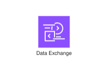
</div>
</div>

{{#endtab}}
{{#tab name="Code"}}

```xml
{{#include ../samples/icons/Architecture-Service-Icons/arch-aws-data-exchange-48-d62bda3b.xal}}
```

{{#endtab}}
{{#endtabs}}

<div class="xal-ref-tag"><code>&lt;item id=&#34;1145&#34; /&gt;</code></div>

</div>
<div class="xal-ref-card">
<div class="xal-ref-title">Arch_AWS-Entity-Resolution_48</div>

{{#tabs name="svg-ref-0044"}}
{{#tab name="Preview"}}
<div class="xal-ref-preview">
<div>
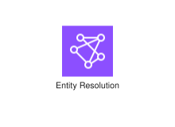
</div>
</div>

{{#endtab}}
{{#tab name="Code"}}

```xml
{{#include ../samples/icons/Architecture-Service-Icons/arch-aws-entity-resolution-48-72c40b63.xal}}
```

{{#endtab}}
{{#endtabs}}

<div class="xal-ref-tag"><code>&lt;item id=&#34;1146&#34; /&gt;</code></div>

</div>
<div class="xal-ref-card">
<div class="xal-ref-title">Arch_AWS-Glue-DataBrew_48</div>

{{#tabs name="svg-ref-0045"}}
{{#tab name="Preview"}}
<div class="xal-ref-preview">
<div>
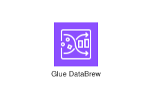
</div>
</div>

{{#endtab}}
{{#tab name="Code"}}

```xml
{{#include ../samples/icons/Architecture-Service-Icons/arch-aws-glue-databrew-48-c5b58257.xal}}
```

{{#endtab}}
{{#endtabs}}

<div class="xal-ref-tag"><code>&lt;item id=&#34;1147&#34; /&gt;</code></div>

</div>
<div class="xal-ref-card">
<div class="xal-ref-title">Arch_AWS-Glue_48</div>

{{#tabs name="svg-ref-0046"}}
{{#tab name="Preview"}}
<div class="xal-ref-preview">
<div>
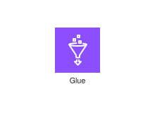
</div>
</div>

{{#endtab}}
{{#tab name="Code"}}

```xml
{{#include ../samples/icons/Architecture-Service-Icons/arch-aws-glue-48-5e74c802.xal}}
```

{{#endtab}}
{{#endtabs}}

<div class="xal-ref-tag"><code>&lt;item id=&#34;1148&#34; /&gt;</code></div>

</div>
<div class="xal-ref-card">
<div class="xal-ref-title">Arch_AWS-Lake-Formation_48</div>

{{#tabs name="svg-ref-0047"}}
{{#tab name="Preview"}}
<div class="xal-ref-preview">
<div>
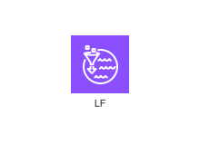
</div>
</div>

{{#endtab}}
{{#tab name="Code"}}

```xml
{{#include ../samples/icons/Architecture-Service-Icons/arch-aws-lake-formation-48-2dc819d1.xal}}
```

{{#endtab}}
{{#endtabs}}

<div class="xal-ref-tag"><code>&lt;item id=&#34;1149&#34; /&gt;</code></div>

</div>
<div class="xal-ref-card">
<div class="xal-ref-title">Arch_Amazon-Athena_48</div>

{{#tabs name="svg-ref-0048"}}
{{#tab name="Preview"}}
<div class="xal-ref-preview">
<div>
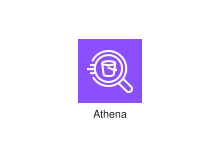
</div>
</div>

{{#endtab}}
{{#tab name="Code"}}

```xml
{{#include ../samples/icons/Architecture-Service-Icons/arch-amazon-athena-48-cde5f3c8.xal}}
```

{{#endtab}}
{{#endtabs}}

<div class="xal-ref-tag"><code>&lt;item id=&#34;1150&#34; /&gt;</code></div>

</div>
<div class="xal-ref-card">
<div class="xal-ref-title">Arch_Amazon-CloudSearch_48</div>

{{#tabs name="svg-ref-0049"}}
{{#tab name="Preview"}}
<div class="xal-ref-preview">
<div>
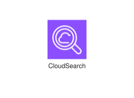
</div>
</div>

{{#endtab}}
{{#tab name="Code"}}

```xml
{{#include ../samples/icons/Architecture-Service-Icons/arch-amazon-cloudsearch-48-2f112e3a.xal}}
```

{{#endtab}}
{{#endtabs}}

<div class="xal-ref-tag"><code>&lt;item id=&#34;1151&#34; /&gt;</code></div>

</div>
<div class="xal-ref-card">
<div class="xal-ref-title">Arch_Amazon-Data-Firehose_48</div>

{{#tabs name="svg-ref-0050"}}
{{#tab name="Preview"}}
<div class="xal-ref-preview">
<div>

</div>
</div>

{{#endtab}}
{{#tab name="Code"}}

```xml
{{#include ../samples/icons/Architecture-Service-Icons/arch-amazon-data-firehose-48-4652edec.xal}}
```

{{#endtab}}
{{#endtabs}}

<div class="xal-ref-tag"><code>&lt;item id=&#34;1152&#34; /&gt;</code></div>

</div>
<div class="xal-ref-card">
<div class="xal-ref-title">Arch_Amazon-DataZone_48</div>

{{#tabs name="svg-ref-0051"}}
{{#tab name="Preview"}}
<div class="xal-ref-preview">
<div>
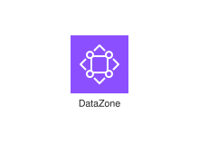
</div>
</div>

{{#endtab}}
{{#tab name="Code"}}

```xml
{{#include ../samples/icons/Architecture-Service-Icons/arch-amazon-datazone-48-c085fa6e.xal}}
```

{{#endtab}}
{{#endtabs}}

<div class="xal-ref-tag"><code>&lt;item id=&#34;1153&#34; /&gt;</code></div>

</div>
<div class="xal-ref-card">
<div class="xal-ref-title">Arch_Amazon-EMR_48</div>

{{#tabs name="svg-ref-0052"}}
{{#tab name="Preview"}}
<div class="xal-ref-preview">
<div>

</div>
</div>

{{#endtab}}
{{#tab name="Code"}}

```xml
{{#include ../samples/icons/Architecture-Service-Icons/arch-amazon-emr-48-a5922c80.xal}}
```

{{#endtab}}
{{#endtabs}}

<div class="xal-ref-tag"><code>&lt;item id=&#34;1154&#34; /&gt;</code></div>

</div>
<div class="xal-ref-card">
<div class="xal-ref-title">Arch_Amazon-FinSpace_48</div>

{{#tabs name="svg-ref-0053"}}
{{#tab name="Preview"}}
<div class="xal-ref-preview">
<div>

</div>
</div>

{{#endtab}}
{{#tab name="Code"}}

```xml
{{#include ../samples/icons/Architecture-Service-Icons/arch-amazon-finspace-48-a6a53d19.xal}}
```

{{#endtab}}
{{#endtabs}}

<div class="xal-ref-tag"><code>&lt;item id=&#34;1155&#34; /&gt;</code></div>

</div>
<div class="xal-ref-card">
<div class="xal-ref-title">Arch_Amazon-Kinesis-Data-Streams_48</div>

{{#tabs name="svg-ref-0054"}}
{{#tab name="Preview"}}
<div class="xal-ref-preview">
<div>
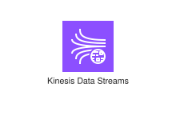
</div>
</div>

{{#endtab}}
{{#tab name="Code"}}

```xml
{{#include ../samples/icons/Architecture-Service-Icons/arch-amazon-kinesis-data-streams-48-bc5ac3ce.xal}}
```

{{#endtab}}
{{#endtabs}}

<div class="xal-ref-tag"><code>&lt;item id=&#34;1156&#34; /&gt;</code></div>

</div>
<div class="xal-ref-card">
<div class="xal-ref-title">Arch_Amazon-Kinesis-Video-Streams_48</div>

{{#tabs name="svg-ref-0055"}}
{{#tab name="Preview"}}
<div class="xal-ref-preview">
<div>

</div>
</div>

{{#endtab}}
{{#tab name="Code"}}

```xml
{{#include ../samples/icons/Architecture-Service-Icons/arch-amazon-kinesis-video-streams-48-2c13fc3b.xal}}
```

{{#endtab}}
{{#endtabs}}

<div class="xal-ref-tag"><code>&lt;item id=&#34;1157&#34; /&gt;</code></div>

</div>
<div class="xal-ref-card">
<div class="xal-ref-title">Arch_Amazon-Kinesis_48</div>

{{#tabs name="svg-ref-0056"}}
{{#tab name="Preview"}}
<div class="xal-ref-preview">
<div>
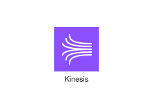
</div>
</div>

{{#endtab}}
{{#tab name="Code"}}

```xml
{{#include ../samples/icons/Architecture-Service-Icons/arch-amazon-kinesis-48-e0705e43.xal}}
```

{{#endtab}}
{{#endtabs}}

<div class="xal-ref-tag"><code>&lt;item id=&#34;1158&#34; /&gt;</code></div>

</div>
<div class="xal-ref-card">
<div class="xal-ref-title">Arch_Amazon-Managed-Service-for-Apache-Flink_48</div>

{{#tabs name="svg-ref-0057"}}
{{#tab name="Preview"}}
<div class="xal-ref-preview">
<div>

</div>
</div>

{{#endtab}}
{{#tab name="Code"}}

```xml
{{#include ../samples/icons/Architecture-Service-Icons/arch-amazon-managed-service-for-apache-flink-48-7fd5b4ae.xal}}
```

{{#endtab}}
{{#endtabs}}

<div class="xal-ref-tag"><code>&lt;item id=&#34;1159&#34; /&gt;</code></div>

</div>
<div class="xal-ref-card">
<div class="xal-ref-title">Arch_Amazon-Managed-Streaming-for-Apache-Kafka_48</div>

{{#tabs name="svg-ref-0058"}}
{{#tab name="Preview"}}
<div class="xal-ref-preview">
<div>

</div>
</div>

{{#endtab}}
{{#tab name="Code"}}

```xml
{{#include ../samples/icons/Architecture-Service-Icons/arch-amazon-managed-streaming-for-apache-kafka-48-55b69eb1.xal}}
```

{{#endtab}}
{{#endtabs}}

<div class="xal-ref-tag"><code>&lt;item id=&#34;1160&#34; /&gt;</code></div>

</div>
<div class="xal-ref-card">
<div class="xal-ref-title">Arch_Amazon-OpenSearch-Service_48</div>

{{#tabs name="svg-ref-0059"}}
{{#tab name="Preview"}}
<div class="xal-ref-preview">
<div>
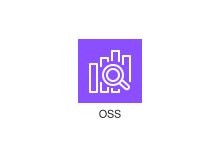
</div>
</div>

{{#endtab}}
{{#tab name="Code"}}

```xml
{{#include ../samples/icons/Architecture-Service-Icons/arch-amazon-opensearch-service-48-1e02f43c.xal}}
```

{{#endtab}}
{{#endtabs}}

<div class="xal-ref-tag"><code>&lt;item id=&#34;1161&#34; /&gt;</code></div>

</div>
<div class="xal-ref-card">
<div class="xal-ref-title">Arch_Amazon-QuickSight_48</div>

{{#tabs name="svg-ref-0060"}}
{{#tab name="Preview"}}
<div class="xal-ref-preview">
<div>
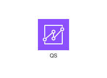
</div>
</div>

{{#endtab}}
{{#tab name="Code"}}

```xml
{{#include ../samples/icons/Architecture-Service-Icons/arch-amazon-quicksight-48-96b17894.xal}}
```

{{#endtab}}
{{#endtabs}}

<div class="xal-ref-tag"><code>&lt;item id=&#34;1162&#34; /&gt;</code></div>

</div>
<div class="xal-ref-card">
<div class="xal-ref-title">Arch_Amazon-Redshift_48</div>

{{#tabs name="svg-ref-0061"}}
{{#tab name="Preview"}}
<div class="xal-ref-preview">
<div>

</div>
</div>

{{#endtab}}
{{#tab name="Code"}}

```xml
{{#include ../samples/icons/Architecture-Service-Icons/arch-amazon-redshift-48-9d44fa46.xal}}
```

{{#endtab}}
{{#endtabs}}

<div class="xal-ref-tag"><code>&lt;item id=&#34;1163&#34; /&gt;</code></div>

</div>
<div class="xal-ref-card">
<div class="xal-ref-title">Arch_Amazon-SageMaker_48</div>

{{#tabs name="svg-ref-0062"}}
{{#tab name="Preview"}}
<div class="xal-ref-preview">
<div>
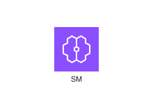
</div>
</div>

{{#endtab}}
{{#tab name="Code"}}

```xml
{{#include ../samples/icons/Architecture-Service-Icons/arch-amazon-sagemaker-48-b9a0786d.xal}}
```

{{#endtab}}
{{#endtabs}}

<div class="xal-ref-tag"><code>&lt;item id=&#34;1164&#34; /&gt;</code></div>

</div>
<div class="xal-ref-card">
<div class="xal-ref-title">Arch_AWS-Clean-Rooms_64</div>

{{#tabs name="svg-ref-0063"}}
{{#tab name="Preview"}}
<div class="xal-ref-preview">
<div>
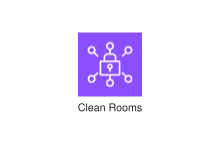
</div>
</div>

{{#endtab}}
{{#tab name="Code"}}

```xml
{{#include ../samples/icons/Architecture-Service-Icons/arch-aws-clean-rooms-64-e2a00f02.xal}}
```

{{#endtab}}
{{#endtabs}}

<div class="xal-ref-tag"><code>&lt;item id=&#34;1123&#34; /&gt;</code></div>

</div>
<div class="xal-ref-card">
<div class="xal-ref-title">Arch_AWS-Data-Exchange_64</div>

{{#tabs name="svg-ref-0064"}}
{{#tab name="Preview"}}
<div class="xal-ref-preview">
<div>
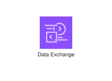
</div>
</div>

{{#endtab}}
{{#tab name="Code"}}

```xml
{{#include ../samples/icons/Architecture-Service-Icons/arch-aws-data-exchange-64-2a767ee8.xal}}
```

{{#endtab}}
{{#endtabs}}

<div class="xal-ref-tag"><code>&lt;item id=&#34;1124&#34; /&gt;</code></div>

</div>
<div class="xal-ref-card">
<div class="xal-ref-title">Arch_AWS-Entity-Resolution_64</div>

{{#tabs name="svg-ref-0065"}}
{{#tab name="Preview"}}
<div class="xal-ref-preview">
<div>
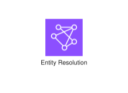
</div>
</div>

{{#endtab}}
{{#tab name="Code"}}

```xml
{{#include ../samples/icons/Architecture-Service-Icons/arch-aws-entity-resolution-64-49b31aa5.xal}}
```

{{#endtab}}
{{#endtabs}}

<div class="xal-ref-tag"><code>&lt;item id=&#34;1125&#34; /&gt;</code></div>

</div>
<div class="xal-ref-card">
<div class="xal-ref-title">Arch_AWS-Glue-DataBrew_64</div>

{{#tabs name="svg-ref-0066"}}
{{#tab name="Preview"}}
<div class="xal-ref-preview">
<div>
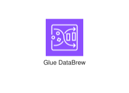
</div>
</div>

{{#endtab}}
{{#tab name="Code"}}

```xml
{{#include ../samples/icons/Architecture-Service-Icons/arch-aws-glue-databrew-64-39e82684.xal}}
```

{{#endtab}}
{{#endtabs}}

<div class="xal-ref-tag"><code>&lt;item id=&#34;1126&#34; /&gt;</code></div>

</div>
<div class="xal-ref-card">
<div class="xal-ref-title">Arch_AWS-Glue_64</div>

{{#tabs name="svg-ref-0067"}}
{{#tab name="Preview"}}
<div class="xal-ref-preview">
<div>
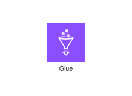
</div>
</div>

{{#endtab}}
{{#tab name="Code"}}

```xml
{{#include ../samples/icons/Architecture-Service-Icons/arch-aws-glue-64-de38e2e1.xal}}
```

{{#endtab}}
{{#endtabs}}

<div class="xal-ref-tag"><code>&lt;item id=&#34;1127&#34; /&gt;</code></div>

</div>
<div class="xal-ref-card">
<div class="xal-ref-title">Arch_AWS-Lake-Formation_64</div>

{{#tabs name="svg-ref-0068"}}
{{#tab name="Preview"}}
<div class="xal-ref-preview">
<div>
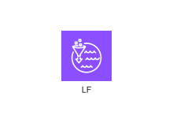
</div>
</div>

{{#endtab}}
{{#tab name="Code"}}

```xml
{{#include ../samples/icons/Architecture-Service-Icons/arch-aws-lake-formation-64-5a8b5a43.xal}}
```

{{#endtab}}
{{#endtabs}}

<div class="xal-ref-tag"><code>&lt;item id=&#34;1128&#34; /&gt;</code></div>

</div>
<div class="xal-ref-card">
<div class="xal-ref-title">Arch_Amazon-Athena_64</div>

{{#tabs name="svg-ref-0069"}}
{{#tab name="Preview"}}
<div class="xal-ref-preview">
<div>

</div>
</div>

{{#endtab}}
{{#tab name="Code"}}

```xml
{{#include ../samples/icons/Architecture-Service-Icons/arch-amazon-athena-64-e575f837.xal}}
```

{{#endtab}}
{{#endtabs}}

<div class="xal-ref-tag"><code>&lt;item id=&#34;1129&#34; /&gt;</code></div>

</div>
<div class="xal-ref-card">
<div class="xal-ref-title">Arch_Amazon-CloudSearch_64</div>

{{#tabs name="svg-ref-0070"}}
{{#tab name="Preview"}}
<div class="xal-ref-preview">
<div>

</div>
</div>

{{#endtab}}
{{#tab name="Code"}}

```xml
{{#include ../samples/icons/Architecture-Service-Icons/arch-amazon-cloudsearch-64-58526da8.xal}}
```

{{#endtab}}
{{#endtabs}}

<div class="xal-ref-tag"><code>&lt;item id=&#34;1130&#34; /&gt;</code></div>

</div>
<div class="xal-ref-card">
<div class="xal-ref-title">Arch_Amazon-Data-Firehose_64</div>

{{#tabs name="svg-ref-0071"}}
{{#tab name="Preview"}}
<div class="xal-ref-preview">
<div>

</div>
</div>

{{#endtab}}
{{#tab name="Code"}}

```xml
{{#include ../samples/icons/Architecture-Service-Icons/arch-amazon-data-firehose-64-e74d431e.xal}}
```

{{#endtab}}
{{#endtabs}}

<div class="xal-ref-tag"><code>&lt;item id=&#34;1131&#34; /&gt;</code></div>

</div>
<div class="xal-ref-card">
<div class="xal-ref-title">Arch_Amazon-DataZone_64</div>

{{#tabs name="svg-ref-0072"}}
{{#tab name="Preview"}}
<div class="xal-ref-preview">
<div>

</div>
</div>

{{#endtab}}
{{#tab name="Code"}}

```xml
{{#include ../samples/icons/Architecture-Service-Icons/arch-amazon-datazone-64-c9ced707.xal}}
```

{{#endtab}}
{{#endtabs}}

<div class="xal-ref-tag"><code>&lt;item id=&#34;1132&#34; /&gt;</code></div>

</div>
<div class="xal-ref-card">
<div class="xal-ref-title">Arch_Amazon-EMR_64</div>

{{#tabs name="svg-ref-0073"}}
{{#tab name="Preview"}}
<div class="xal-ref-preview">
<div>

</div>
</div>

{{#endtab}}
{{#tab name="Code"}}

```xml
{{#include ../samples/icons/Architecture-Service-Icons/arch-amazon-emr-64-06c7e436.xal}}
```

{{#endtab}}
{{#endtabs}}

<div class="xal-ref-tag"><code>&lt;item id=&#34;1133&#34; /&gt;</code></div>

</div>
<div class="xal-ref-card">
<div class="xal-ref-title">Arch_Amazon-FinSpace_64</div>

{{#tabs name="svg-ref-0074"}}
{{#tab name="Preview"}}
<div class="xal-ref-preview">
<div>

</div>
</div>

{{#endtab}}
{{#tab name="Code"}}

```xml
{{#include ../samples/icons/Architecture-Service-Icons/arch-amazon-finspace-64-afee1070.xal}}
```

{{#endtab}}
{{#endtabs}}

<div class="xal-ref-tag"><code>&lt;item id=&#34;1134&#34; /&gt;</code></div>

</div>
<div class="xal-ref-card">
<div class="xal-ref-title">Arch_Amazon-Kinesis-Data-Streams_64</div>

{{#tabs name="svg-ref-0075"}}
{{#tab name="Preview"}}
<div class="xal-ref-preview">
<div>

</div>
</div>

{{#endtab}}
{{#tab name="Code"}}

```xml
{{#include ../samples/icons/Architecture-Service-Icons/arch-amazon-kinesis-data-streams-64-96a45253.xal}}
```

{{#endtab}}
{{#endtabs}}

<div class="xal-ref-tag"><code>&lt;item id=&#34;1135&#34; /&gt;</code></div>

</div>
<div class="xal-ref-card">
<div class="xal-ref-title">Arch_Amazon-Kinesis-Video-Streams_64</div>

{{#tabs name="svg-ref-0076"}}
{{#tab name="Preview"}}
<div class="xal-ref-preview">
<div>

</div>
</div>

{{#endtab}}
{{#tab name="Code"}}

```xml
{{#include ../samples/icons/Architecture-Service-Icons/arch-amazon-kinesis-video-streams-64-cae2700b.xal}}
```

{{#endtab}}
{{#endtabs}}

<div class="xal-ref-tag"><code>&lt;item id=&#34;1136&#34; /&gt;</code></div>

</div>
<div class="xal-ref-card">
<div class="xal-ref-title">Arch_Amazon-Kinesis_64</div>

{{#tabs name="svg-ref-0077"}}
{{#tab name="Preview"}}
<div class="xal-ref-preview">
<div>

</div>
</div>

{{#endtab}}
{{#tab name="Code"}}

```xml
{{#include ../samples/icons/Architecture-Service-Icons/arch-amazon-kinesis-64-a53fbc9d.xal}}
```

{{#endtab}}
{{#endtabs}}

<div class="xal-ref-tag"><code>&lt;item id=&#34;1137&#34; /&gt;</code></div>

</div>
<div class="xal-ref-card">
<div class="xal-ref-title">Arch_Amazon-Managed-Service-for-Apache-Flink_64</div>

{{#tabs name="svg-ref-0078"}}
{{#tab name="Preview"}}
<div class="xal-ref-preview">
<div>

</div>
</div>

{{#endtab}}
{{#tab name="Code"}}

```xml
{{#include ../samples/icons/Architecture-Service-Icons/arch-amazon-managed-service-for-apache-flink-64-9492e207.xal}}
```

{{#endtab}}
{{#endtabs}}

<div class="xal-ref-tag"><code>&lt;item id=&#34;1138&#34; /&gt;</code></div>

</div>
<div class="xal-ref-card">
<div class="xal-ref-title">Arch_Amazon-Managed-Streaming-for-Apache-Kafka_64</div>

{{#tabs name="svg-ref-0079"}}
{{#tab name="Preview"}}
<div class="xal-ref-preview">
<div>

</div>
</div>

{{#endtab}}
{{#tab name="Code"}}

```xml
{{#include ../samples/icons/Architecture-Service-Icons/arch-amazon-managed-streaming-for-apache-kafka-64-a5c6a794.xal}}
```

{{#endtab}}
{{#endtabs}}

<div class="xal-ref-tag"><code>&lt;item id=&#34;1139&#34; /&gt;</code></div>

</div>
<div class="xal-ref-card">
<div class="xal-ref-title">Arch_Amazon-OpenSearch-Service_64</div>

{{#tabs name="svg-ref-0080"}}
{{#tab name="Preview"}}
<div class="xal-ref-preview">
<div>

</div>
</div>

{{#endtab}}
{{#tab name="Code"}}

```xml
{{#include ../samples/icons/Architecture-Service-Icons/arch-amazon-opensearch-service-64-eb4ce597.xal}}
```

{{#endtab}}
{{#endtabs}}

<div class="xal-ref-tag"><code>&lt;item id=&#34;1140&#34; /&gt;</code></div>

</div>
<div class="xal-ref-card">
<div class="xal-ref-title">Arch_Amazon-QuickSight_64</div>

{{#tabs name="svg-ref-0081"}}
{{#tab name="Preview"}}
<div class="xal-ref-preview">
<div>

</div>
</div>

{{#endtab}}
{{#tab name="Code"}}

```xml
{{#include ../samples/icons/Architecture-Service-Icons/arch-amazon-quicksight-64-6aecdc47.xal}}
```

{{#endtab}}
{{#endtabs}}

<div class="xal-ref-tag"><code>&lt;item id=&#34;1141&#34; /&gt;</code></div>

</div>
<div class="xal-ref-card">
<div class="xal-ref-title">Arch_Amazon-Redshift_64</div>

{{#tabs name="svg-ref-0082"}}
{{#tab name="Preview"}}
<div class="xal-ref-preview">
<div>

</div>
</div>

{{#endtab}}
{{#tab name="Code"}}

```xml
{{#include ../samples/icons/Architecture-Service-Icons/arch-amazon-redshift-64-940fd72f.xal}}
```

{{#endtab}}
{{#endtabs}}

<div class="xal-ref-tag"><code>&lt;item id=&#34;1142&#34; /&gt;</code></div>

</div>
<div class="xal-ref-card">
<div class="xal-ref-title">Arch_Amazon-SageMaker_64</div>

{{#tabs name="svg-ref-0083"}}
{{#tab name="Preview"}}
<div class="xal-ref-preview">
<div>

</div>
</div>

{{#endtab}}
{{#tab name="Code"}}

```xml
{{#include ../samples/icons/Architecture-Service-Icons/arch-amazon-sagemaker-64-e5a277e4.xal}}
```

{{#endtab}}
{{#endtabs}}

<div class="xal-ref-tag"><code>&lt;item id=&#34;1143&#34; /&gt;</code></div>

</div>
<div class="xal-ref-card">
<div class="xal-ref-title">Arch_AWS-AppSync_16</div>

{{#tabs name="svg-ref-0084"}}
{{#tab name="Preview"}}
<div class="xal-ref-preview">
<div>

</div>
</div>

{{#endtab}}
{{#tab name="Code"}}

```xml
{{#include ../samples/icons/Architecture-Service-Icons/arch-aws-appsync-16-9fe290f5.xal}}
```

{{#endtab}}
{{#endtabs}}

<div class="xal-ref-tag"><code>&lt;item id=&#34;707&#34; /&gt;</code></div>

</div>
<div class="xal-ref-card">
<div class="xal-ref-title">Arch_AWS-B2B-Data-Interchange_16</div>

{{#tabs name="svg-ref-0085"}}
{{#tab name="Preview"}}
<div class="xal-ref-preview">
<div>

</div>
</div>

{{#endtab}}
{{#tab name="Code"}}

```xml
{{#include ../samples/icons/Architecture-Service-Icons/arch-aws-b2b-data-interchange-16-41b79483.xal}}
```

{{#endtab}}
{{#endtabs}}

<div class="xal-ref-tag"><code>&lt;item id=&#34;708&#34; /&gt;</code></div>

</div>
<div class="xal-ref-card">
<div class="xal-ref-title">Arch_AWS-Express-Workflows_16</div>

{{#tabs name="svg-ref-0086"}}
{{#tab name="Preview"}}
<div class="xal-ref-preview">
<div>

</div>
</div>

{{#endtab}}
{{#tab name="Code"}}

```xml
{{#include ../samples/icons/Architecture-Service-Icons/arch-aws-express-workflows-16-af2a1cd8.xal}}
```

{{#endtab}}
{{#endtabs}}

<div class="xal-ref-tag"><code>&lt;item id=&#34;709&#34; /&gt;</code></div>

</div>
<div class="xal-ref-card">
<div class="xal-ref-title">Arch_AWS-Step-Functions_16</div>

{{#tabs name="svg-ref-0087"}}
{{#tab name="Preview"}}
<div class="xal-ref-preview">
<div>

</div>
</div>

{{#endtab}}
{{#tab name="Code"}}

```xml
{{#include ../samples/icons/Architecture-Service-Icons/arch-aws-step-functions-16-67797e37.xal}}
```

{{#endtab}}
{{#endtabs}}

<div class="xal-ref-tag"><code>&lt;item id=&#34;710&#34; /&gt;</code></div>

</div>
<div class="xal-ref-card">
<div class="xal-ref-title">Arch_Amazon-AppFlow_16</div>

{{#tabs name="svg-ref-0088"}}
{{#tab name="Preview"}}
<div class="xal-ref-preview">
<div>

</div>
</div>

{{#endtab}}
{{#tab name="Code"}}

```xml
{{#include ../samples/icons/Architecture-Service-Icons/arch-amazon-appflow-16-b54f8e0a.xal}}
```

{{#endtab}}
{{#endtabs}}

<div class="xal-ref-tag"><code>&lt;item id=&#34;711&#34; /&gt;</code></div>

</div>
<div class="xal-ref-card">
<div class="xal-ref-title">Arch_Amazon-EventBridge_16</div>

{{#tabs name="svg-ref-0089"}}
{{#tab name="Preview"}}
<div class="xal-ref-preview">
<div>

</div>
</div>

{{#endtab}}
{{#tab name="Code"}}

```xml
{{#include ../samples/icons/Architecture-Service-Icons/arch-amazon-eventbridge-16-0aeafe70.xal}}
```

{{#endtab}}
{{#endtabs}}

<div class="xal-ref-tag"><code>&lt;item id=&#34;712&#34; /&gt;</code></div>

</div>
</div>
