# Architecture-Service-Icons - Page 5

This page references SVG files under `etc/resources/aws/svg/Architecture-Service-Icons`.
Each card shows the SVG preview first and the XAL tag syntax in the Code tab.
Showing 361-450 of 1236 SVG files.

<style>
.xal-ref-grid{display:grid;grid-template-columns:repeat(3,minmax(0,1fr));gap:1rem;margin:1rem 0 1.5rem}.xal-ref-card{border:1px solid var(--table-border-color);border-radius:8px;overflow:hidden;background:var(--bg);padding:.75rem}.xal-ref-title{font-size:.9rem;font-weight:600;line-height:1.25;margin:0 0 .5rem;overflow-wrap:anywhere}.xal-ref-preview{display:flex;align-items:center;justify-content:center}.xal-ref-preview img{display:block;width:100%;height:auto}.xal-ref-card pre{margin:0;max-height:18rem;overflow:auto;white-space:pre}.xal-ref-card code{font-size:.78em}.xal-ref-tag{margin:.5rem 0 0;color:var(--fg);opacity:.72;overflow:auto;white-space:pre}.xal-ref-tag code{font-size:.72em}@media(max-width:900px){.xal-ref-grid{grid-template-columns:repeat(2,minmax(0,1fr))}}@media(max-width:560px){.xal-ref-grid{grid-template-columns:1fr}}
</style>

[Back to section index](architecture-service-icons.md)

<div class="xal-ref-grid">
<div class="xal-ref-card">
<div class="xal-ref-title">Arch_AWS-Cost-Explorer_32</div>

{{#tabs name="svg-ref-0360"}}
{{#tab name="Preview"}}
<div class="xal-ref-preview">
<div>

</div>
</div>

{{#endtab}}
{{#tab name="Code"}}

```xml
{{#include ../samples/icons/Architecture-Service-Icons/arch-aws-cost-explorer-32-50cd73e0.xal}}
```

{{#endtab}}
{{#endtabs}}

<div class="xal-ref-tag"><code>&lt;item id=&#34;187&#34; /&gt;</code></div>

</div>
<div class="xal-ref-card">
<div class="xal-ref-title">Arch_AWS-Cost-and-Usage-Report_32</div>

{{#tabs name="svg-ref-0361"}}
{{#tab name="Preview"}}
<div class="xal-ref-preview">
<div>
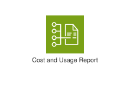
</div>
</div>

{{#endtab}}
{{#tab name="Code"}}

```xml
{{#include ../samples/icons/Architecture-Service-Icons/arch-aws-cost-and-usage-report-32-c331edd6.xal}}
```

{{#endtab}}
{{#endtabs}}

<div class="xal-ref-tag"><code>&lt;item id=&#34;188&#34; /&gt;</code></div>

</div>
<div class="xal-ref-card">
<div class="xal-ref-title">Arch_Reserved-Instance-Reporting_32</div>

{{#tabs name="svg-ref-0362"}}
{{#tab name="Preview"}}
<div class="xal-ref-preview">
<div>

</div>
</div>

{{#endtab}}
{{#tab name="Code"}}

```xml
{{#include ../samples/icons/Architecture-Service-Icons/arch-reserved-instance-reporting-32-f4532145.xal}}
```

{{#endtab}}
{{#endtabs}}

<div class="xal-ref-tag"><code>&lt;item id=&#34;189&#34; /&gt;</code></div>

</div>
<div class="xal-ref-card">
<div class="xal-ref-title">Arch_Savings-Plans_32</div>

{{#tabs name="svg-ref-0363"}}
{{#tab name="Preview"}}
<div class="xal-ref-preview">
<div>

</div>
</div>

{{#endtab}}
{{#tab name="Code"}}

```xml
{{#include ../samples/icons/Architecture-Service-Icons/arch-savings-plans-32-d438ecaa.xal}}
```

{{#endtab}}
{{#endtabs}}

<div class="xal-ref-tag"><code>&lt;item id=&#34;190&#34; /&gt;</code></div>

</div>
<div class="xal-ref-card">
<div class="xal-ref-title">Arch_AWS-Billing-Conductor_48</div>

{{#tabs name="svg-ref-0364"}}
{{#tab name="Preview"}}
<div class="xal-ref-preview">
<div>

</div>
</div>

{{#endtab}}
{{#tab name="Code"}}

```xml
{{#include ../samples/icons/Architecture-Service-Icons/arch-aws-billing-conductor-48-89b5c481.xal}}
```

{{#endtab}}
{{#endtabs}}

<div class="xal-ref-tag"><code>&lt;item id=&#34;203&#34; /&gt;</code></div>

</div>
<div class="xal-ref-card">
<div class="xal-ref-title">Arch_AWS-Budgets_48</div>

{{#tabs name="svg-ref-0365"}}
{{#tab name="Preview"}}
<div class="xal-ref-preview">
<div>

</div>
</div>

{{#endtab}}
{{#tab name="Code"}}

```xml
{{#include ../samples/icons/Architecture-Service-Icons/arch-aws-budgets-48-c2e98867.xal}}
```

{{#endtab}}
{{#endtabs}}

<div class="xal-ref-tag"><code>&lt;item id=&#34;204&#34; /&gt;</code></div>

</div>
<div class="xal-ref-card">
<div class="xal-ref-title">Arch_AWS-Cost-Explorer_48</div>

{{#tabs name="svg-ref-0366"}}
{{#tab name="Preview"}}
<div class="xal-ref-preview">
<div>

</div>
</div>

{{#endtab}}
{{#tab name="Code"}}

```xml
{{#include ../samples/icons/Architecture-Service-Icons/arch-aws-cost-explorer-48-d51dde46.xal}}
```

{{#endtab}}
{{#endtabs}}

<div class="xal-ref-tag"><code>&lt;item id=&#34;205&#34; /&gt;</code></div>

</div>
<div class="xal-ref-card">
<div class="xal-ref-title">Arch_AWS-Cost-and-Usage-Report_48</div>

{{#tabs name="svg-ref-0367"}}
{{#tab name="Preview"}}
<div class="xal-ref-preview">
<div>
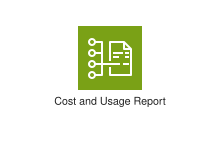
</div>
</div>

{{#endtab}}
{{#tab name="Code"}}

```xml
{{#include ../samples/icons/Architecture-Service-Icons/arch-aws-cost-and-usage-report-48-ea707641.xal}}
```

{{#endtab}}
{{#endtabs}}

<div class="xal-ref-tag"><code>&lt;item id=&#34;206&#34; /&gt;</code></div>

</div>
<div class="xal-ref-card">
<div class="xal-ref-title">Arch_Reserved-Instance-Reporting_48</div>

{{#tabs name="svg-ref-0368"}}
{{#tab name="Preview"}}
<div class="xal-ref-preview">
<div>
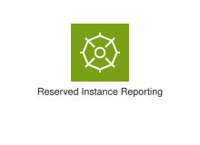
</div>
</div>

{{#endtab}}
{{#tab name="Code"}}

```xml
{{#include ../samples/icons/Architecture-Service-Icons/arch-reserved-instance-reporting-48-548e205b.xal}}
```

{{#endtab}}
{{#endtabs}}

<div class="xal-ref-tag"><code>&lt;item id=&#34;207&#34; /&gt;</code></div>

</div>
<div class="xal-ref-card">
<div class="xal-ref-title">Arch_Savings-Plans_48</div>

{{#tabs name="svg-ref-0369"}}
{{#tab name="Preview"}}
<div class="xal-ref-preview">
<div>

</div>
</div>

{{#endtab}}
{{#tab name="Code"}}

```xml
{{#include ../samples/icons/Architecture-Service-Icons/arch-savings-plans-48-981ed7e8.xal}}
```

{{#endtab}}
{{#endtabs}}

<div class="xal-ref-tag"><code>&lt;item id=&#34;208&#34; /&gt;</code></div>

</div>
<div class="xal-ref-card">
<div class="xal-ref-title">Arch_AWS-Billing-Conductor_64</div>

{{#tabs name="svg-ref-0370"}}
{{#tab name="Preview"}}
<div class="xal-ref-preview">
<div>

</div>
</div>

{{#endtab}}
{{#tab name="Code"}}

```xml
{{#include ../samples/icons/Architecture-Service-Icons/arch-aws-billing-conductor-64-b2c2d547.xal}}
```

{{#endtab}}
{{#endtabs}}

<div class="xal-ref-tag"><code>&lt;item id=&#34;197&#34; /&gt;</code></div>

</div>
<div class="xal-ref-card">
<div class="xal-ref-title">Arch_AWS-Budgets_64</div>

{{#tabs name="svg-ref-0371"}}
{{#tab name="Preview"}}
<div class="xal-ref-preview">
<div>

</div>
</div>

{{#endtab}}
{{#tab name="Code"}}

```xml
{{#include ../samples/icons/Architecture-Service-Icons/arch-aws-budgets-64-882d564e.xal}}
```

{{#endtab}}
{{#endtabs}}

<div class="xal-ref-tag"><code>&lt;item id=&#34;198&#34; /&gt;</code></div>

</div>
<div class="xal-ref-card">
<div class="xal-ref-title">Arch_AWS-Cost-Explorer_64</div>

{{#tabs name="svg-ref-0372"}}
{{#tab name="Preview"}}
<div class="xal-ref-preview">
<div>

</div>
</div>

{{#endtab}}
{{#tab name="Code"}}

```xml
{{#include ../samples/icons/Architecture-Service-Icons/arch-aws-cost-explorer-64-29407a95.xal}}
```

{{#endtab}}
{{#endtabs}}

<div class="xal-ref-tag"><code>&lt;item id=&#34;199&#34; /&gt;</code></div>

</div>
<div class="xal-ref-card">
<div class="xal-ref-title">Arch_AWS-Cost-and-Usage-Report_64</div>

{{#tabs name="svg-ref-0373"}}
{{#tab name="Preview"}}
<div class="xal-ref-preview">
<div>
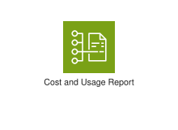
</div>
</div>

{{#endtab}}
{{#tab name="Code"}}

```xml
{{#include ../samples/icons/Architecture-Service-Icons/arch-aws-cost-and-usage-report-64-1f3e67ea.xal}}
```

{{#endtab}}
{{#endtabs}}

<div class="xal-ref-tag"><code>&lt;item id=&#34;200&#34; /&gt;</code></div>

</div>
<div class="xal-ref-card">
<div class="xal-ref-title">Arch_Reserved-Instance-Reporting_64</div>

{{#tabs name="svg-ref-0374"}}
{{#tab name="Preview"}}
<div class="xal-ref-preview">
<div>

</div>
</div>

{{#endtab}}
{{#tab name="Code"}}

```xml
{{#include ../samples/icons/Architecture-Service-Icons/arch-reserved-instance-reporting-64-7e70b1c6.xal}}
```

{{#endtab}}
{{#endtabs}}

<div class="xal-ref-tag"><code>&lt;item id=&#34;201&#34; /&gt;</code></div>

</div>
<div class="xal-ref-card">
<div class="xal-ref-title">Arch_Savings-Plans_64</div>

{{#tabs name="svg-ref-0375"}}
{{#tab name="Preview"}}
<div class="xal-ref-preview">
<div>

</div>
</div>

{{#endtab}}
{{#tab name="Code"}}

```xml
{{#include ../samples/icons/Architecture-Service-Icons/arch-savings-plans-64-b08edc17.xal}}
```

{{#endtab}}
{{#endtabs}}

<div class="xal-ref-tag"><code>&lt;item id=&#34;202&#34; /&gt;</code></div>

</div>
<div class="xal-ref-card">
<div class="xal-ref-title">Arch_AWS-App-Runner_16</div>

{{#tabs name="svg-ref-0376"}}
{{#tab name="Preview"}}
<div class="xal-ref-preview">
<div>

</div>
</div>

{{#endtab}}
{{#tab name="Code"}}

```xml
{{#include ../samples/icons/Architecture-Service-Icons/arch-aws-app-runner-16-db22cbc7.xal}}
```

{{#endtab}}
{{#endtabs}}

<div class="xal-ref-tag"><code>&lt;item id=&#34;34&#34; /&gt;</code></div>

</div>
<div class="xal-ref-card">
<div class="xal-ref-title">Arch_AWS-Batch_16</div>

{{#tabs name="svg-ref-0377"}}
{{#tab name="Preview"}}
<div class="xal-ref-preview">
<div>
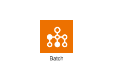
</div>
</div>

{{#endtab}}
{{#tab name="Code"}}

```xml
{{#include ../samples/icons/Architecture-Service-Icons/arch-aws-batch-16-f227ce5e.xal}}
```

{{#endtab}}
{{#endtabs}}

<div class="xal-ref-tag"><code>&lt;item id=&#34;35&#34; /&gt;</code></div>

</div>
<div class="xal-ref-card">
<div class="xal-ref-title">Arch_AWS-Compute-Optimizer_16</div>

{{#tabs name="svg-ref-0378"}}
{{#tab name="Preview"}}
<div class="xal-ref-preview">
<div>

</div>
</div>

{{#endtab}}
{{#tab name="Code"}}

```xml
{{#include ../samples/icons/Architecture-Service-Icons/arch-aws-compute-optimizer-16-65295963.xal}}
```

{{#endtab}}
{{#endtabs}}

<div class="xal-ref-tag"><code>&lt;item id=&#34;36&#34; /&gt;</code></div>

</div>
<div class="xal-ref-card">
<div class="xal-ref-title">Arch_AWS-Elastic-Beanstalk_16</div>

{{#tabs name="svg-ref-0379"}}
{{#tab name="Preview"}}
<div class="xal-ref-preview">
<div>

</div>
</div>

{{#endtab}}
{{#tab name="Code"}}

```xml
{{#include ../samples/icons/Architecture-Service-Icons/arch-aws-elastic-beanstalk-16-03e04fb5.xal}}
```

{{#endtab}}
{{#endtabs}}

<div class="xal-ref-tag"><code>&lt;item id=&#34;37&#34; /&gt;</code></div>

</div>
<div class="xal-ref-card">
<div class="xal-ref-title">Arch_AWS-Lambda_16</div>

{{#tabs name="svg-ref-0380"}}
{{#tab name="Preview"}}
<div class="xal-ref-preview">
<div>
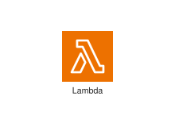
</div>
</div>

{{#endtab}}
{{#tab name="Code"}}

```xml
{{#include ../samples/icons/Architecture-Service-Icons/arch-aws-lambda-16-c1708217.xal}}
```

{{#endtab}}
{{#endtabs}}

<div class="xal-ref-tag"><code>&lt;item id=&#34;38&#34; /&gt;</code></div>

</div>
<div class="xal-ref-card">
<div class="xal-ref-title">Arch_AWS-Local-Zones_16</div>

{{#tabs name="svg-ref-0381"}}
{{#tab name="Preview"}}
<div class="xal-ref-preview">
<div>
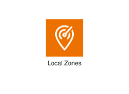
</div>
</div>

{{#endtab}}
{{#tab name="Code"}}

```xml
{{#include ../samples/icons/Architecture-Service-Icons/arch-aws-local-zones-16-e7023a1a.xal}}
```

{{#endtab}}
{{#endtabs}}

<div class="xal-ref-tag"><code>&lt;item id=&#34;39&#34; /&gt;</code></div>

</div>
<div class="xal-ref-card">
<div class="xal-ref-title">Arch_AWS-Nitro-Enclaves_16</div>

{{#tabs name="svg-ref-0382"}}
{{#tab name="Preview"}}
<div class="xal-ref-preview">
<div>
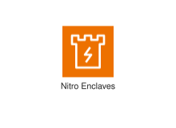
</div>
</div>

{{#endtab}}
{{#tab name="Code"}}

```xml
{{#include ../samples/icons/Architecture-Service-Icons/arch-aws-nitro-enclaves-16-9d661b3d.xal}}
```

{{#endtab}}
{{#endtabs}}

<div class="xal-ref-tag"><code>&lt;item id=&#34;40&#34; /&gt;</code></div>

</div>
<div class="xal-ref-card">
<div class="xal-ref-title">Arch_AWS-Outposts-family_16</div>

{{#tabs name="svg-ref-0383"}}
{{#tab name="Preview"}}
<div class="xal-ref-preview">
<div>
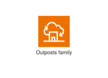
</div>
</div>

{{#endtab}}
{{#tab name="Code"}}

```xml
{{#include ../samples/icons/Architecture-Service-Icons/arch-aws-outposts-family-16-3be21da2.xal}}
```

{{#endtab}}
{{#endtabs}}

<div class="xal-ref-tag"><code>&lt;item id=&#34;41&#34; /&gt;</code></div>

</div>
<div class="xal-ref-card">
<div class="xal-ref-title">Arch_AWS-Outposts-rack_16</div>

{{#tabs name="svg-ref-0384"}}
{{#tab name="Preview"}}
<div class="xal-ref-preview">
<div>
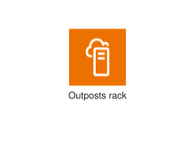
</div>
</div>

{{#endtab}}
{{#tab name="Code"}}

```xml
{{#include ../samples/icons/Architecture-Service-Icons/arch-aws-outposts-rack-16-e70c94d0.xal}}
```

{{#endtab}}
{{#endtabs}}

<div class="xal-ref-tag"><code>&lt;item id=&#34;42&#34; /&gt;</code></div>

</div>
<div class="xal-ref-card">
<div class="xal-ref-title">Arch_AWS-Outposts-servers_16</div>

{{#tabs name="svg-ref-0385"}}
{{#tab name="Preview"}}
<div class="xal-ref-preview">
<div>

</div>
</div>

{{#endtab}}
{{#tab name="Code"}}

```xml
{{#include ../samples/icons/Architecture-Service-Icons/arch-aws-outposts-servers-16-72ed6e71.xal}}
```

{{#endtab}}
{{#endtabs}}

<div class="xal-ref-tag"><code>&lt;item id=&#34;43&#34; /&gt;</code></div>

</div>
<div class="xal-ref-card">
<div class="xal-ref-title">Arch_AWS-Parallel-Cluster_16</div>

{{#tabs name="svg-ref-0386"}}
{{#tab name="Preview"}}
<div class="xal-ref-preview">
<div>
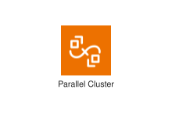
</div>
</div>

{{#endtab}}
{{#tab name="Code"}}

```xml
{{#include ../samples/icons/Architecture-Service-Icons/arch-aws-parallel-cluster-16-e50ec473.xal}}
```

{{#endtab}}
{{#endtabs}}

<div class="xal-ref-tag"><code>&lt;item id=&#34;44&#34; /&gt;</code></div>

</div>
<div class="xal-ref-card">
<div class="xal-ref-title">Arch_AWS-Parallel-Computing-Service_16</div>

{{#tabs name="svg-ref-0387"}}
{{#tab name="Preview"}}
<div class="xal-ref-preview">
<div>

</div>
</div>

{{#endtab}}
{{#tab name="Code"}}

```xml
{{#include ../samples/icons/Architecture-Service-Icons/arch-aws-parallel-computing-service-16-f2169db5.xal}}
```

{{#endtab}}
{{#endtabs}}

<div class="xal-ref-tag"><code>&lt;item id=&#34;45&#34; /&gt;</code></div>

</div>
<div class="xal-ref-card">
<div class="xal-ref-title">Arch_AWS-Serverless-Application-Repository_16</div>

{{#tabs name="svg-ref-0388"}}
{{#tab name="Preview"}}
<div class="xal-ref-preview">
<div>

</div>
</div>

{{#endtab}}
{{#tab name="Code"}}

```xml
{{#include ../samples/icons/Architecture-Service-Icons/arch-aws-serverless-application-repository-16-e80ce140.xal}}
```

{{#endtab}}
{{#endtabs}}

<div class="xal-ref-tag"><code>&lt;item id=&#34;46&#34; /&gt;</code></div>

</div>
<div class="xal-ref-card">
<div class="xal-ref-title">Arch_AWS-SimSpace-Weaver_16</div>

{{#tabs name="svg-ref-0389"}}
{{#tab name="Preview"}}
<div class="xal-ref-preview">
<div>
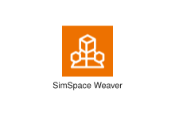
</div>
</div>

{{#endtab}}
{{#tab name="Code"}}

```xml
{{#include ../samples/icons/Architecture-Service-Icons/arch-aws-simspace-weaver-16-04d8da48.xal}}
```

{{#endtab}}
{{#endtabs}}

<div class="xal-ref-tag"><code>&lt;item id=&#34;47&#34; /&gt;</code></div>

</div>
<div class="xal-ref-card">
<div class="xal-ref-title">Arch_AWS-Wavelength_16</div>

{{#tabs name="svg-ref-0390"}}
{{#tab name="Preview"}}
<div class="xal-ref-preview">
<div>
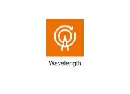
</div>
</div>

{{#endtab}}
{{#tab name="Code"}}

```xml
{{#include ../samples/icons/Architecture-Service-Icons/arch-aws-wavelength-16-28402bf0.xal}}
```

{{#endtab}}
{{#endtabs}}

<div class="xal-ref-tag"><code>&lt;item id=&#34;48&#34; /&gt;</code></div>

</div>
<div class="xal-ref-card">
<div class="xal-ref-title">Arch_Amazon-DCV_16</div>

{{#tabs name="svg-ref-0391"}}
{{#tab name="Preview"}}
<div class="xal-ref-preview">
<div>
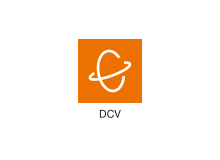
</div>
</div>

{{#endtab}}
{{#tab name="Code"}}

```xml
{{#include ../samples/icons/Architecture-Service-Icons/arch-amazon-dcv-16-638f6bf9.xal}}
```

{{#endtab}}
{{#endtabs}}

<div class="xal-ref-tag"><code>&lt;item id=&#34;49&#34; /&gt;</code></div>

</div>
<div class="xal-ref-card">
<div class="xal-ref-title">Arch_Amazon-EC2-Auto-Scaling_16</div>

{{#tabs name="svg-ref-0392"}}
{{#tab name="Preview"}}
<div class="xal-ref-preview">
<div>
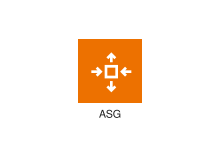
</div>
</div>

{{#endtab}}
{{#tab name="Code"}}

```xml
{{#include ../samples/icons/Architecture-Service-Icons/arch-amazon-ec2-auto-scaling-16-b87b292f.xal}}
```

{{#endtab}}
{{#endtabs}}

<div class="xal-ref-tag"><code>&lt;item id=&#34;50&#34; /&gt;</code></div>

</div>
<div class="xal-ref-card">
<div class="xal-ref-title">Arch_Amazon-EC2-Image-Builder_16</div>

{{#tabs name="svg-ref-0393"}}
{{#tab name="Preview"}}
<div class="xal-ref-preview">
<div>

</div>
</div>

{{#endtab}}
{{#tab name="Code"}}

```xml
{{#include ../samples/icons/Architecture-Service-Icons/arch-amazon-ec2-image-builder-16-db61d889.xal}}
```

{{#endtab}}
{{#endtabs}}

<div class="xal-ref-tag"><code>&lt;item id=&#34;51&#34; /&gt;</code></div>

</div>
<div class="xal-ref-card">
<div class="xal-ref-title">Arch_Amazon-EC2_16</div>

{{#tabs name="svg-ref-0394"}}
{{#tab name="Preview"}}
<div class="xal-ref-preview">
<div>
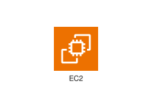
</div>
</div>

{{#endtab}}
{{#tab name="Code"}}

```xml
{{#include ../samples/icons/Architecture-Service-Icons/arch-amazon-ec2-16-d8ecae86.xal}}
```

{{#endtab}}
{{#endtabs}}

<div class="xal-ref-tag"><code>&lt;item id=&#34;52&#34; /&gt;</code></div>

</div>
<div class="xal-ref-card">
<div class="xal-ref-title">Arch_Amazon-Elastic-VMware-Service_16</div>

{{#tabs name="svg-ref-0395"}}
{{#tab name="Preview"}}
<div class="xal-ref-preview">
<div>

</div>
</div>

{{#endtab}}
{{#tab name="Code"}}

```xml
{{#include ../samples/icons/Architecture-Service-Icons/arch-amazon-elastic-vmware-service-16-ccb89690.xal}}
```

{{#endtab}}
{{#endtabs}}

<div class="xal-ref-tag"><code>&lt;item id=&#34;53&#34; /&gt;</code></div>

</div>
<div class="xal-ref-card">
<div class="xal-ref-title">Arch_Amazon-Lightsail-for-Research_16</div>

{{#tabs name="svg-ref-0396"}}
{{#tab name="Preview"}}
<div class="xal-ref-preview">
<div>

</div>
</div>

{{#endtab}}
{{#tab name="Code"}}

```xml
{{#include ../samples/icons/Architecture-Service-Icons/arch-amazon-lightsail-for-research-16-a48a73ab.xal}}
```

{{#endtab}}
{{#endtabs}}

<div class="xal-ref-tag"><code>&lt;item id=&#34;54&#34; /&gt;</code></div>

</div>
<div class="xal-ref-card">
<div class="xal-ref-title">Arch_Amazon-Lightsail_16</div>

{{#tabs name="svg-ref-0397"}}
{{#tab name="Preview"}}
<div class="xal-ref-preview">
<div>

</div>
</div>

{{#endtab}}
{{#tab name="Code"}}

```xml
{{#include ../samples/icons/Architecture-Service-Icons/arch-amazon-lightsail-16-30c574b0.xal}}
```

{{#endtab}}
{{#endtabs}}

<div class="xal-ref-tag"><code>&lt;item id=&#34;55&#34; /&gt;</code></div>

</div>
<div class="xal-ref-card">
<div class="xal-ref-title">Arch_Bottlerocket_16</div>

{{#tabs name="svg-ref-0398"}}
{{#tab name="Preview"}}
<div class="xal-ref-preview">
<div>

</div>
</div>

{{#endtab}}
{{#tab name="Code"}}

```xml
{{#include ../samples/icons/Architecture-Service-Icons/arch-bottlerocket-16-204f59b3.xal}}
```

{{#endtab}}
{{#endtabs}}

<div class="xal-ref-tag"><code>&lt;item id=&#34;56&#34; /&gt;</code></div>

</div>
<div class="xal-ref-card">
<div class="xal-ref-title">Arch_Elastic-Fabric-Adapter_16</div>

{{#tabs name="svg-ref-0399"}}
{{#tab name="Preview"}}
<div class="xal-ref-preview">
<div>
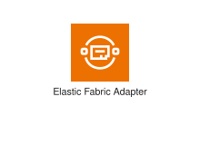
</div>
</div>

{{#endtab}}
{{#tab name="Code"}}

```xml
{{#include ../samples/icons/Architecture-Service-Icons/arch-elastic-fabric-adapter-16-8e0598ff.xal}}
```

{{#endtab}}
{{#endtabs}}

<div class="xal-ref-tag"><code>&lt;item id=&#34;57&#34; /&gt;</code></div>

</div>
<div class="xal-ref-card">
<div class="xal-ref-title">Arch_NICE-EnginFrame_16</div>

{{#tabs name="svg-ref-0400"}}
{{#tab name="Preview"}}
<div class="xal-ref-preview">
<div>

</div>
</div>

{{#endtab}}
{{#tab name="Code"}}

```xml
{{#include ../samples/icons/Architecture-Service-Icons/arch-nice-enginframe-16-066d6ea3.xal}}
```

{{#endtab}}
{{#endtabs}}

<div class="xal-ref-tag"><code>&lt;item id=&#34;58&#34; /&gt;</code></div>

</div>
<div class="xal-ref-card">
<div class="xal-ref-title">Arch_AWS-App-Runner_32</div>

{{#tabs name="svg-ref-0401"}}
{{#tab name="Preview"}}
<div class="xal-ref-preview">
<div>

</div>
</div>

{{#endtab}}
{{#tab name="Code"}}

```xml
{{#include ../samples/icons/Architecture-Service-Icons/arch-aws-app-runner-32-a3b28a30.xal}}
```

{{#endtab}}
{{#endtabs}}

<div class="xal-ref-tag"><code>&lt;item id=&#34;9&#34; /&gt;</code></div>

</div>
<div class="xal-ref-card">
<div class="xal-ref-title">Arch_AWS-Batch_32</div>

{{#tabs name="svg-ref-0402"}}
{{#tab name="Preview"}}
<div class="xal-ref-preview">
<div>
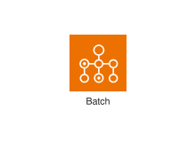
</div>
</div>

{{#endtab}}
{{#tab name="Code"}}

```xml
{{#include ../samples/icons/Architecture-Service-Icons/arch-aws-batch-32-9308a409.xal}}
```

{{#endtab}}
{{#endtabs}}

<div class="xal-ref-tag"><code>&lt;item id=&#34;10&#34; /&gt;</code></div>

</div>
<div class="xal-ref-card">
<div class="xal-ref-title">Arch_AWS-Compute-Optimizer_32</div>

{{#tabs name="svg-ref-0403"}}
{{#tab name="Preview"}}
<div class="xal-ref-preview">
<div>

</div>
</div>

{{#endtab}}
{{#tab name="Code"}}

```xml
{{#include ../samples/icons/Architecture-Service-Icons/arch-aws-compute-optimizer-32-a46ba261.xal}}
```

{{#endtab}}
{{#endtabs}}

<div class="xal-ref-tag"><code>&lt;item id=&#34;11&#34; /&gt;</code></div>

</div>
<div class="xal-ref-card">
<div class="xal-ref-title">Arch_AWS-Elastic-Beanstalk_32</div>

{{#tabs name="svg-ref-0404"}}
{{#tab name="Preview"}}
<div class="xal-ref-preview">
<div>

</div>
</div>

{{#endtab}}
{{#tab name="Code"}}

```xml
{{#include ../samples/icons/Architecture-Service-Icons/arch-aws-elastic-beanstalk-32-c2a2b4b7.xal}}
```

{{#endtab}}
{{#endtabs}}

<div class="xal-ref-tag"><code>&lt;item id=&#34;12&#34; /&gt;</code></div>

</div>
<div class="xal-ref-card">
<div class="xal-ref-title">Arch_AWS-Lambda_32</div>

{{#tabs name="svg-ref-0405"}}
{{#tab name="Preview"}}
<div class="xal-ref-preview">
<div>

</div>
</div>

{{#endtab}}
{{#tab name="Code"}}

```xml
{{#include ../samples/icons/Architecture-Service-Icons/arch-aws-lambda-32-80583dde.xal}}
```

{{#endtab}}
{{#endtabs}}

<div class="xal-ref-tag"><code>&lt;item id=&#34;13&#34; /&gt;</code></div>

</div>
<div class="xal-ref-card">
<div class="xal-ref-title">Arch_AWS-Local-Zones_32</div>

{{#tabs name="svg-ref-0406"}}
{{#tab name="Preview"}}
<div class="xal-ref-preview">
<div>
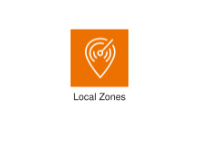
</div>
</div>

{{#endtab}}
{{#tab name="Code"}}

```xml
{{#include ../samples/icons/Architecture-Service-Icons/arch-aws-local-zones-32-70e59910.xal}}
```

{{#endtab}}
{{#endtabs}}

<div class="xal-ref-tag"><code>&lt;item id=&#34;14&#34; /&gt;</code></div>

</div>
<div class="xal-ref-card">
<div class="xal-ref-title">Arch_AWS-Nitro-Enclaves_32</div>

{{#tabs name="svg-ref-0407"}}
{{#tab name="Preview"}}
<div class="xal-ref-preview">
<div>
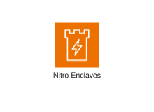
</div>
</div>

{{#endtab}}
{{#tab name="Code"}}

```xml
{{#include ../samples/icons/Architecture-Service-Icons/arch-aws-nitro-enclaves-32-3941273a.xal}}
```

{{#endtab}}
{{#endtabs}}

<div class="xal-ref-tag"><code>&lt;item id=&#34;15&#34; /&gt;</code></div>

</div>
<div class="xal-ref-card">
<div class="xal-ref-title">Arch_AWS-Outposts-family_32</div>

{{#tabs name="svg-ref-0408"}}
{{#tab name="Preview"}}
<div class="xal-ref-preview">
<div>
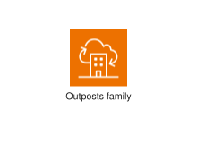
</div>
</div>

{{#endtab}}
{{#tab name="Code"}}

```xml
{{#include ../samples/icons/Architecture-Service-Icons/arch-aws-outposts-family-32-1164fbc9.xal}}
```

{{#endtab}}
{{#endtabs}}

<div class="xal-ref-tag"><code>&lt;item id=&#34;16&#34; /&gt;</code></div>

</div>
<div class="xal-ref-card">
<div class="xal-ref-title">Arch_AWS-Outposts-rack_32</div>

{{#tabs name="svg-ref-0409"}}
{{#tab name="Preview"}}
<div class="xal-ref-preview">
<div>
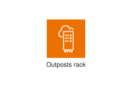
</div>
</div>

{{#endtab}}
{{#tab name="Code"}}

```xml
{{#include ../samples/icons/Architecture-Service-Icons/arch-aws-outposts-rack-32-5c1e3d4a.xal}}
```

{{#endtab}}
{{#endtabs}}

<div class="xal-ref-tag"><code>&lt;item id=&#34;17&#34; /&gt;</code></div>

</div>
<div class="xal-ref-card">
<div class="xal-ref-title">Arch_AWS-Outposts-servers_32</div>

{{#tabs name="svg-ref-0410"}}
{{#tab name="Preview"}}
<div class="xal-ref-preview">
<div>

</div>
</div>

{{#endtab}}
{{#tab name="Code"}}

```xml
{{#include ../samples/icons/Architecture-Service-Icons/arch-aws-outposts-servers-32-1ce104b3.xal}}
```

{{#endtab}}
{{#endtabs}}

<div class="xal-ref-tag"><code>&lt;item id=&#34;18&#34; /&gt;</code></div>

</div>
<div class="xal-ref-card">
<div class="xal-ref-title">Arch_AWS-Parallel-Cluster_32</div>

{{#tabs name="svg-ref-0411"}}
{{#tab name="Preview"}}
<div class="xal-ref-preview">
<div>
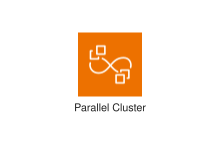
</div>
</div>

{{#endtab}}
{{#tab name="Code"}}

```xml
{{#include ../samples/icons/Architecture-Service-Icons/arch-aws-parallel-cluster-32-8b02aeb1.xal}}
```

{{#endtab}}
{{#endtabs}}

<div class="xal-ref-tag"><code>&lt;item id=&#34;19&#34; /&gt;</code></div>

</div>
<div class="xal-ref-card">
<div class="xal-ref-title">Arch_AWS-Parallel-Computing-Service_32</div>

{{#tabs name="svg-ref-0412"}}
{{#tab name="Preview"}}
<div class="xal-ref-preview">
<div>

</div>
</div>

{{#endtab}}
{{#tab name="Code"}}

```xml
{{#include ../samples/icons/Architecture-Service-Icons/arch-aws-parallel-computing-service-32-7ea32d2f.xal}}
```

{{#endtab}}
{{#endtabs}}

<div class="xal-ref-tag"><code>&lt;item id=&#34;20&#34; /&gt;</code></div>

</div>
<div class="xal-ref-card">
<div class="xal-ref-title">Arch_AWS-Serverless-Application-Repository_32</div>

{{#tabs name="svg-ref-0413"}}
{{#tab name="Preview"}}
<div class="xal-ref-preview">
<div>

</div>
</div>

{{#endtab}}
{{#tab name="Code"}}

```xml
{{#include ../samples/icons/Architecture-Service-Icons/arch-aws-serverless-application-repository-32-1dc4dc5f.xal}}
```

{{#endtab}}
{{#endtabs}}

<div class="xal-ref-tag"><code>&lt;item id=&#34;21&#34; /&gt;</code></div>

</div>
<div class="xal-ref-card">
<div class="xal-ref-title">Arch_AWS-SimSpace-Weaver_32</div>

{{#tabs name="svg-ref-0414"}}
{{#tab name="Preview"}}
<div class="xal-ref-preview">
<div>
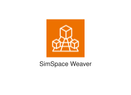
</div>
</div>

{{#endtab}}
{{#tab name="Code"}}

```xml
{{#include ../samples/icons/Architecture-Service-Icons/arch-aws-simspace-weaver-32-2e5e3c23.xal}}
```

{{#endtab}}
{{#endtabs}}

<div class="xal-ref-tag"><code>&lt;item id=&#34;22&#34; /&gt;</code></div>

</div>
<div class="xal-ref-card">
<div class="xal-ref-title">Arch_AWS-Wavelength_32</div>

{{#tabs name="svg-ref-0415"}}
{{#tab name="Preview"}}
<div class="xal-ref-preview">
<div>
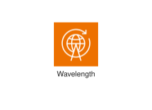
</div>
</div>

{{#endtab}}
{{#tab name="Code"}}

```xml
{{#include ../samples/icons/Architecture-Service-Icons/arch-aws-wavelength-32-50d06a07.xal}}
```

{{#endtab}}
{{#endtabs}}

<div class="xal-ref-tag"><code>&lt;item id=&#34;23&#34; /&gt;</code></div>

</div>
<div class="xal-ref-card">
<div class="xal-ref-title">Arch_Amazon-DCV_32</div>

{{#tabs name="svg-ref-0416"}}
{{#tab name="Preview"}}
<div class="xal-ref-preview">
<div>
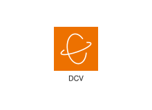
</div>
</div>

{{#endtab}}
{{#tab name="Code"}}

```xml
{{#include ../samples/icons/Architecture-Service-Icons/arch-amazon-dcv-32-22a7d430.xal}}
```

{{#endtab}}
{{#endtabs}}

<div class="xal-ref-tag"><code>&lt;item id=&#34;24&#34; /&gt;</code></div>

</div>
<div class="xal-ref-card">
<div class="xal-ref-title">Arch_Amazon-EC2-Auto-Scaling_32</div>

{{#tabs name="svg-ref-0417"}}
{{#tab name="Preview"}}
<div class="xal-ref-preview">
<div>
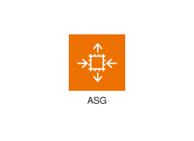
</div>
</div>

{{#endtab}}
{{#tab name="Code"}}

```xml
{{#include ../samples/icons/Architecture-Service-Icons/arch-amazon-ec2-auto-scaling-32-ae0085de.xal}}
```

{{#endtab}}
{{#endtabs}}

<div class="xal-ref-tag"><code>&lt;item id=&#34;25&#34; /&gt;</code></div>

</div>
<div class="xal-ref-card">
<div class="xal-ref-title">Arch_Amazon-EC2-Image-Builder_32</div>

{{#tabs name="svg-ref-0418"}}
{{#tab name="Preview"}}
<div class="xal-ref-preview">
<div>

</div>
</div>

{{#endtab}}
{{#tab name="Code"}}

```xml
{{#include ../samples/icons/Architecture-Service-Icons/arch-amazon-ec2-image-builder-32-a58b355b.xal}}
```

{{#endtab}}
{{#endtabs}}

<div class="xal-ref-tag"><code>&lt;item id=&#34;26&#34; /&gt;</code></div>

</div>
<div class="xal-ref-card">
<div class="xal-ref-title">Arch_Amazon-EC2_32</div>

{{#tabs name="svg-ref-0419"}}
{{#tab name="Preview"}}
<div class="xal-ref-preview">
<div>
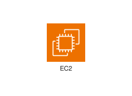
</div>
</div>

{{#endtab}}
{{#tab name="Code"}}

```xml
{{#include ../samples/icons/Architecture-Service-Icons/arch-amazon-ec2-32-99c4114f.xal}}
```

{{#endtab}}
{{#endtabs}}

<div class="xal-ref-tag"><code>&lt;item id=&#34;27&#34; /&gt;</code></div>

</div>
<div class="xal-ref-card">
<div class="xal-ref-title">Arch_Amazon-Elastic-VMware-Service_32</div>

{{#tabs name="svg-ref-0420"}}
{{#tab name="Preview"}}
<div class="xal-ref-preview">
<div>

</div>
</div>

{{#endtab}}
{{#tab name="Code"}}

```xml
{{#include ../samples/icons/Architecture-Service-Icons/arch-amazon-elastic-vmware-service-32-e79e3c32.xal}}
```

{{#endtab}}
{{#endtabs}}

<div class="xal-ref-tag"><code>&lt;item id=&#34;28&#34; /&gt;</code></div>

</div>
<div class="xal-ref-card">
<div class="xal-ref-title">Arch_Amazon-Lightsail-for-Research_32</div>

{{#tabs name="svg-ref-0421"}}
{{#tab name="Preview"}}
<div class="xal-ref-preview">
<div>

</div>
</div>

{{#endtab}}
{{#tab name="Code"}}

```xml
{{#include ../samples/icons/Architecture-Service-Icons/arch-amazon-lightsail-for-research-32-8facd909.xal}}
```

{{#endtab}}
{{#endtabs}}

<div class="xal-ref-tag"><code>&lt;item id=&#34;29&#34; /&gt;</code></div>

</div>
<div class="xal-ref-card">
<div class="xal-ref-title">Arch_Amazon-Lightsail_32</div>

{{#tabs name="svg-ref-0422"}}
{{#tab name="Preview"}}
<div class="xal-ref-preview">
<div>

</div>
</div>

{{#endtab}}
{{#tab name="Code"}}

```xml
{{#include ../samples/icons/Architecture-Service-Icons/arch-amazon-lightsail-32-64c12ef9.xal}}
```

{{#endtab}}
{{#endtabs}}

<div class="xal-ref-tag"><code>&lt;item id=&#34;30&#34; /&gt;</code></div>

</div>
<div class="xal-ref-card">
<div class="xal-ref-title">Arch_Bottlerocket_32</div>

{{#tabs name="svg-ref-0423"}}
{{#tab name="Preview"}}
<div class="xal-ref-preview">
<div>
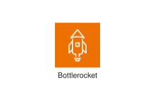
</div>
</div>

{{#endtab}}
{{#tab name="Code"}}

```xml
{{#include ../samples/icons/Architecture-Service-Icons/arch-bottlerocket-32-6f8bfe24.xal}}
```

{{#endtab}}
{{#endtabs}}

<div class="xal-ref-tag"><code>&lt;item id=&#34;31&#34; /&gt;</code></div>

</div>
<div class="xal-ref-card">
<div class="xal-ref-title">Arch_Elastic-Fabric-Adapter_32</div>

{{#tabs name="svg-ref-0424"}}
{{#tab name="Preview"}}
<div class="xal-ref-preview">
<div>
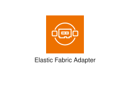
</div>
</div>

{{#endtab}}
{{#tab name="Code"}}

```xml
{{#include ../samples/icons/Architecture-Service-Icons/arch-elastic-fabric-adapter-32-d48cefdc.xal}}
```

{{#endtab}}
{{#endtabs}}

<div class="xal-ref-tag"><code>&lt;item id=&#34;32&#34; /&gt;</code></div>

</div>
<div class="xal-ref-card">
<div class="xal-ref-title">Arch_NICE-EnginFrame_32</div>

{{#tabs name="svg-ref-0425"}}
{{#tab name="Preview"}}
<div class="xal-ref-preview">
<div>

</div>
</div>

{{#endtab}}
{{#tab name="Code"}}

```xml
{{#include ../samples/icons/Architecture-Service-Icons/arch-nice-enginframe-32-918acda9.xal}}
```

{{#endtab}}
{{#endtabs}}

<div class="xal-ref-tag"><code>&lt;item id=&#34;33&#34; /&gt;</code></div>

</div>
<div class="xal-ref-card">
<div class="xal-ref-title">Arch_AWS-App-Runner_48</div>

{{#tabs name="svg-ref-0426"}}
{{#tab name="Preview"}}
<div class="xal-ref-preview">
<div>

</div>
</div>

{{#endtab}}
{{#tab name="Code"}}

```xml
{{#include ../samples/icons/Architecture-Service-Icons/arch-aws-app-runner-48-08a5b946.xal}}
```

{{#endtab}}
{{#endtabs}}

<div class="xal-ref-tag"><code>&lt;item id=&#34;84&#34; /&gt;</code></div>

</div>
<div class="xal-ref-card">
<div class="xal-ref-title">Arch_AWS-Batch_48</div>

{{#tabs name="svg-ref-0427"}}
{{#tab name="Preview"}}
<div class="xal-ref-preview">
<div>
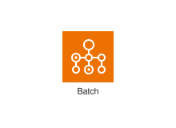
</div>
</div>

{{#endtab}}
{{#tab name="Code"}}

```xml
{{#include ../samples/icons/Architecture-Service-Icons/arch-aws-batch-48-188a2ba8.xal}}
```

{{#endtab}}
{{#endtabs}}

<div class="xal-ref-tag"><code>&lt;item id=&#34;85&#34; /&gt;</code></div>

</div>
<div class="xal-ref-card">
<div class="xal-ref-title">Arch_AWS-Compute-Optimizer_48</div>

{{#tabs name="svg-ref-0428"}}
{{#tab name="Preview"}}
<div class="xal-ref-preview">
<div>

</div>
</div>

{{#endtab}}
{{#tab name="Code"}}

```xml
{{#include ../samples/icons/Architecture-Service-Icons/arch-aws-compute-optimizer-48-216621c5.xal}}
```

{{#endtab}}
{{#endtabs}}

<div class="xal-ref-tag"><code>&lt;item id=&#34;86&#34; /&gt;</code></div>

</div>
<div class="xal-ref-card">
<div class="xal-ref-title">Arch_AWS-Elastic-Beanstalk_48</div>

{{#tabs name="svg-ref-0429"}}
{{#tab name="Preview"}}
<div class="xal-ref-preview">
<div>

</div>
</div>

{{#endtab}}
{{#tab name="Code"}}

```xml
{{#include ../samples/icons/Architecture-Service-Icons/arch-aws-elastic-beanstalk-48-47af3713.xal}}
```

{{#endtab}}
{{#endtabs}}

<div class="xal-ref-tag"><code>&lt;item id=&#34;87&#34; /&gt;</code></div>

</div>
<div class="xal-ref-card">
<div class="xal-ref-title">Arch_AWS-Lambda_48</div>

{{#tabs name="svg-ref-0430"}}
{{#tab name="Preview"}}
<div class="xal-ref-preview">
<div>

</div>
</div>

{{#endtab}}
{{#tab name="Code"}}

```xml
{{#include ../samples/icons/Architecture-Service-Icons/arch-aws-lambda-48-128b19de.xal}}
```

{{#endtab}}
{{#endtabs}}

<div class="xal-ref-tag"><code>&lt;item id=&#34;88&#34; /&gt;</code></div>

</div>
<div class="xal-ref-card">
<div class="xal-ref-title">Arch_AWS-Local-Zones_48</div>

{{#tabs name="svg-ref-0431"}}
{{#tab name="Preview"}}
<div class="xal-ref-preview">
<div>
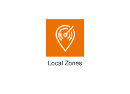
</div>
</div>

{{#endtab}}
{{#tab name="Code"}}

```xml
{{#include ../samples/icons/Architecture-Service-Icons/arch-aws-local-zones-48-faa16fdb.xal}}
```

{{#endtab}}
{{#endtabs}}

<div class="xal-ref-tag"><code>&lt;item id=&#34;89&#34; /&gt;</code></div>

</div>
<div class="xal-ref-card">
<div class="xal-ref-title">Arch_AWS-Nitro-Enclaves_48</div>

{{#tabs name="svg-ref-0432"}}
{{#tab name="Preview"}}
<div class="xal-ref-preview">
<div>
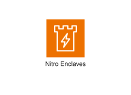
</div>
</div>

{{#endtab}}
{{#tab name="Code"}}

```xml
{{#include ../samples/icons/Architecture-Service-Icons/arch-aws-nitro-enclaves-48-35f8c4bb.xal}}
```

{{#endtab}}
{{#endtabs}}

<div class="xal-ref-tag"><code>&lt;item id=&#34;90&#34; /&gt;</code></div>

</div>
<div class="xal-ref-card">
<div class="xal-ref-title">Arch_AWS-Outposts-family_48</div>

{{#tabs name="svg-ref-0433"}}
{{#tab name="Preview"}}
<div class="xal-ref-preview">
<div>
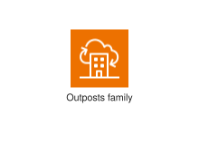
</div>
</div>

{{#endtab}}
{{#tab name="Code"}}

```xml
{{#include ../samples/icons/Architecture-Service-Icons/arch-aws-outposts-family-48-b85ec46d.xal}}
```

{{#endtab}}
{{#endtabs}}

<div class="xal-ref-tag"><code>&lt;item id=&#34;91&#34; /&gt;</code></div>

</div>
<div class="xal-ref-card">
<div class="xal-ref-title">Arch_AWS-Outposts-rack_48</div>

{{#tabs name="svg-ref-0434"}}
{{#tab name="Preview"}}
<div class="xal-ref-preview">
<div>
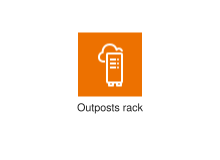
</div>
</div>

{{#endtab}}
{{#tab name="Code"}}

```xml
{{#include ../samples/icons/Architecture-Service-Icons/arch-aws-outposts-rack-48-d9ce90ec.xal}}
```

{{#endtab}}
{{#endtabs}}

<div class="xal-ref-tag"><code>&lt;item id=&#34;92&#34; /&gt;</code></div>

</div>
<div class="xal-ref-card">
<div class="xal-ref-title">Arch_AWS-Outposts-servers_48</div>

{{#tabs name="svg-ref-0435"}}
{{#tab name="Preview"}}
<div class="xal-ref-preview">
<div>

</div>
</div>

{{#endtab}}
{{#tab name="Code"}}

```xml
{{#include ../samples/icons/Architecture-Service-Icons/arch-aws-outposts-servers-48-fe7a6c8c.xal}}
```

{{#endtab}}
{{#endtabs}}

<div class="xal-ref-tag"><code>&lt;item id=&#34;93&#34; /&gt;</code></div>

</div>
<div class="xal-ref-card">
<div class="xal-ref-title">Arch_AWS-Parallel-Cluster_48</div>

{{#tabs name="svg-ref-0436"}}
{{#tab name="Preview"}}
<div class="xal-ref-preview">
<div>
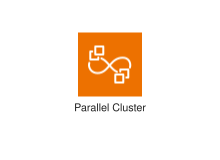
</div>
</div>

{{#endtab}}
{{#tab name="Code"}}

```xml
{{#include ../samples/icons/Architecture-Service-Icons/arch-aws-parallel-cluster-48-6999c68e.xal}}
```

{{#endtab}}
{{#endtabs}}

<div class="xal-ref-tag"><code>&lt;item id=&#34;94&#34; /&gt;</code></div>

</div>
<div class="xal-ref-card">
<div class="xal-ref-title">Arch_AWS-Parallel-Computing-Service_48</div>

{{#tabs name="svg-ref-0437"}}
{{#tab name="Preview"}}
<div class="xal-ref-preview">
<div>

</div>
</div>

{{#endtab}}
{{#tab name="Code"}}

```xml
{{#include ../samples/icons/Architecture-Service-Icons/arch-aws-parallel-computing-service-48-2b7665c5.xal}}
```

{{#endtab}}
{{#endtabs}}

<div class="xal-ref-tag"><code>&lt;item id=&#34;95&#34; /&gt;</code></div>

</div>
<div class="xal-ref-card">
<div class="xal-ref-title">Arch_AWS-Serverless-Application-Repository_48</div>

{{#tabs name="svg-ref-0438"}}
{{#tab name="Preview"}}
<div class="xal-ref-preview">
<div>

</div>
</div>

{{#endtab}}
{{#tab name="Code"}}

```xml
{{#include ../samples/icons/Architecture-Service-Icons/arch-aws-serverless-application-repository-48-2428649e.xal}}
```

{{#endtab}}
{{#endtabs}}

<div class="xal-ref-tag"><code>&lt;item id=&#34;96&#34; /&gt;</code></div>

</div>
<div class="xal-ref-card">
<div class="xal-ref-title">Arch_AWS-SimSpace-Weaver_48</div>

{{#tabs name="svg-ref-0439"}}
{{#tab name="Preview"}}
<div class="xal-ref-preview">
<div>
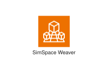
</div>
</div>

{{#endtab}}
{{#tab name="Code"}}

```xml
{{#include ../samples/icons/Architecture-Service-Icons/arch-aws-simspace-weaver-48-87640387.xal}}
```

{{#endtab}}
{{#endtabs}}

<div class="xal-ref-tag"><code>&lt;item id=&#34;97&#34; /&gt;</code></div>

</div>
<div class="xal-ref-card">
<div class="xal-ref-title">Arch_AWS-Wavelength_48</div>

{{#tabs name="svg-ref-0440"}}
{{#tab name="Preview"}}
<div class="xal-ref-preview">
<div>
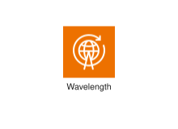
</div>
</div>

{{#endtab}}
{{#tab name="Code"}}

```xml
{{#include ../samples/icons/Architecture-Service-Icons/arch-aws-wavelength-48-fbc75971.xal}}
```

{{#endtab}}
{{#endtabs}}

<div class="xal-ref-tag"><code>&lt;item id=&#34;98&#34; /&gt;</code></div>

</div>
<div class="xal-ref-card">
<div class="xal-ref-title">Arch_Amazon-DCV_48</div>

{{#tabs name="svg-ref-0441"}}
{{#tab name="Preview"}}
<div class="xal-ref-preview">
<div>
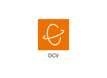
</div>
</div>

{{#endtab}}
{{#tab name="Code"}}

```xml
{{#include ../samples/icons/Architecture-Service-Icons/arch-amazon-dcv-48-b074f030.xal}}
```

{{#endtab}}
{{#endtabs}}

<div class="xal-ref-tag"><code>&lt;item id=&#34;99&#34; /&gt;</code></div>

</div>
<div class="xal-ref-card">
<div class="xal-ref-title">Arch_Amazon-EC2-Auto-Scaling_48</div>

{{#tabs name="svg-ref-0442"}}
{{#tab name="Preview"}}
<div class="xal-ref-preview">
<div>
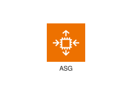
</div>
</div>

{{#endtab}}
{{#tab name="Code"}}

```xml
{{#include ../samples/icons/Architecture-Service-Icons/arch-amazon-ec2-auto-scaling-48-e9dad5ea.xal}}
```

{{#endtab}}
{{#endtabs}}

<div class="xal-ref-tag"><code>&lt;item id=&#34;100&#34; /&gt;</code></div>

</div>
<div class="xal-ref-card">
<div class="xal-ref-title">Arch_Amazon-EC2-Image-Builder_48</div>

{{#tabs name="svg-ref-0443"}}
{{#tab name="Preview"}}
<div class="xal-ref-preview">
<div>

</div>
</div>

{{#endtab}}
{{#tab name="Code"}}

```xml
{{#include ../samples/icons/Architecture-Service-Icons/arch-amazon-ec2-image-builder-48-b7f12e4f.xal}}
```

{{#endtab}}
{{#endtabs}}

<div class="xal-ref-tag"><code>&lt;item id=&#34;101&#34; /&gt;</code></div>

</div>
<div class="xal-ref-card">
<div class="xal-ref-title">Arch_Amazon-EC2_48</div>

{{#tabs name="svg-ref-0444"}}
{{#tab name="Preview"}}
<div class="xal-ref-preview">
<div>
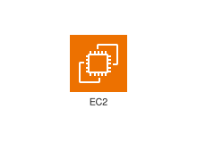
</div>
</div>

{{#endtab}}
{{#tab name="Code"}}

```xml
{{#include ../samples/icons/Architecture-Service-Icons/arch-amazon-ec2-48-0b17354f.xal}}
```

{{#endtab}}
{{#endtabs}}

<div class="xal-ref-tag"><code>&lt;item id=&#34;102&#34; /&gt;</code></div>

</div>
<div class="xal-ref-card">
<div class="xal-ref-title">Arch_Amazon-Elastic-VMware-Service_48</div>

{{#tabs name="svg-ref-0445"}}
{{#tab name="Preview"}}
<div class="xal-ref-preview">
<div>

</div>
</div>

{{#endtab}}
{{#tab name="Code"}}

```xml
{{#include ../samples/icons/Architecture-Service-Icons/arch-amazon-elastic-vmware-service-48-bdd8ede8.xal}}
```

{{#endtab}}
{{#endtabs}}

<div class="xal-ref-tag"><code>&lt;item id=&#34;103&#34; /&gt;</code></div>

</div>
<div class="xal-ref-card">
<div class="xal-ref-title">Arch_Amazon-Lightsail-for-Research_48</div>

{{#tabs name="svg-ref-0446"}}
{{#tab name="Preview"}}
<div class="xal-ref-preview">
<div>

</div>
</div>

{{#endtab}}
{{#tab name="Code"}}

```xml
{{#include ../samples/icons/Architecture-Service-Icons/arch-amazon-lightsail-for-research-48-d5ea08d3.xal}}
```

{{#endtab}}
{{#endtabs}}

<div class="xal-ref-tag"><code>&lt;item id=&#34;104&#34; /&gt;</code></div>

</div>
<div class="xal-ref-card">
<div class="xal-ref-title">Arch_Amazon-Lightsail_48</div>

{{#tabs name="svg-ref-0447"}}
{{#tab name="Preview"}}
<div class="xal-ref-preview">
<div>

</div>
</div>

{{#endtab}}
{{#tab name="Code"}}

```xml
{{#include ../samples/icons/Architecture-Service-Icons/arch-amazon-lightsail-48-5b7444c6.xal}}
```

{{#endtab}}
{{#endtabs}}

<div class="xal-ref-tag"><code>&lt;item id=&#34;105&#34; /&gt;</code></div>

</div>
<div class="xal-ref-card">
<div class="xal-ref-title">Arch_Bottlerocket_48</div>

{{#tabs name="svg-ref-0448"}}
{{#tab name="Preview"}}
<div class="xal-ref-preview">
<div>
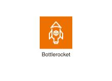
</div>
</div>

{{#endtab}}
{{#tab name="Code"}}

```xml
{{#include ../samples/icons/Architecture-Service-Icons/arch-bottlerocket-48-aa88f668.xal}}
```

{{#endtab}}
{{#endtabs}}

<div class="xal-ref-tag"><code>&lt;item id=&#34;106&#34; /&gt;</code></div>

</div>
<div class="xal-ref-card">
<div class="xal-ref-title">Arch_Elastic-Fabric-Adapter_48</div>

{{#tabs name="svg-ref-0449"}}
{{#tab name="Preview"}}
<div class="xal-ref-preview">
<div>
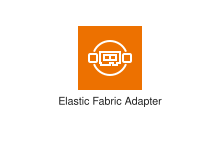
</div>
</div>

{{#endtab}}
{{#tab name="Code"}}

```xml
{{#include ../samples/icons/Architecture-Service-Icons/arch-elastic-fabric-adapter-48-363bb05f.xal}}
```

{{#endtab}}
{{#endtabs}}

<div class="xal-ref-tag"><code>&lt;item id=&#34;107&#34; /&gt;</code></div>

</div>
</div>
