# Architecture-Service-Icons - Page 6

This page references SVG files under `etc/resources/aws/svg/Architecture-Service-Icons`.
Each card shows the SVG preview first and the XAL tag syntax in the Code tab.
Showing 451-540 of 1236 SVG files.

<style>
.xal-ref-grid{display:grid;grid-template-columns:repeat(3,minmax(0,1fr));gap:1rem;margin:1rem 0 1.5rem}.xal-ref-card{border:1px solid var(--table-border-color);border-radius:8px;overflow:hidden;background:var(--bg);padding:.75rem}.xal-ref-title{font-size:.9rem;font-weight:600;line-height:1.25;margin:0 0 .5rem;overflow-wrap:anywhere}.xal-ref-preview{display:flex;align-items:center;justify-content:center}.xal-ref-preview img{display:block;width:100%;height:auto}.xal-ref-card pre{margin:0;max-height:18rem;overflow:auto;white-space:pre}.xal-ref-card code{font-size:.78em}.xal-ref-tag{margin:.5rem 0 0;color:var(--fg);opacity:.72;overflow:auto;white-space:pre}.xal-ref-tag code{font-size:.72em}@media(max-width:900px){.xal-ref-grid{grid-template-columns:repeat(2,minmax(0,1fr))}}@media(max-width:560px){.xal-ref-grid{grid-template-columns:1fr}}
</style>

[Back to section index](architecture-service-icons.md)

<div class="xal-ref-grid">
<div class="xal-ref-card">
<div class="xal-ref-title">Arch_NICE-EnginFrame_48</div>

{{#tabs name="svg-ref-0450"}}
{{#tab name="Preview"}}
<div class="xal-ref-preview">
<div>

</div>
</div>

{{#endtab}}
{{#tab name="Code"}}

```xml
{{#include ../samples/icons/Architecture-Service-Icons/arch-nice-enginframe-48-1bce3b62.xal}}
```

{{#endtab}}
{{#endtabs}}

<div class="xal-ref-tag"><code>&lt;item id=&#34;108&#34; /&gt;</code></div>

</div>
<div class="xal-ref-card">
<div class="xal-ref-title">Arch_AWS-App-Runner_64</div>

{{#tabs name="svg-ref-0451"}}
{{#tab name="Preview"}}
<div class="xal-ref-preview">
<div>

</div>
</div>

{{#endtab}}
{{#tab name="Code"}}

```xml
{{#include ../samples/icons/Architecture-Service-Icons/arch-aws-app-runner-64-4dea5b98.xal}}
```

{{#endtab}}
{{#endtabs}}

<div class="xal-ref-tag"><code>&lt;item id=&#34;59&#34; /&gt;</code></div>

</div>
<div class="xal-ref-card">
<div class="xal-ref-title">Arch_AWS-Batch_64</div>

{{#tabs name="svg-ref-0452"}}
{{#tab name="Preview"}}
<div class="xal-ref-preview">
<div>
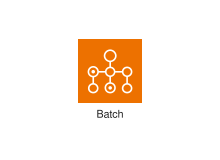
</div>
</div>

{{#endtab}}
{{#tab name="Code"}}

```xml
{{#include ../samples/icons/Architecture-Service-Icons/arch-aws-batch-64-496c4918.xal}}
```

{{#endtab}}
{{#endtabs}}

<div class="xal-ref-tag"><code>&lt;item id=&#34;60&#34; /&gt;</code></div>

</div>
<div class="xal-ref-card">
<div class="xal-ref-title">Arch_AWS-Compute-Optimizer_64</div>

{{#tabs name="svg-ref-0453"}}
{{#tab name="Preview"}}
<div class="xal-ref-preview">
<div>

</div>
</div>

{{#endtab}}
{{#tab name="Code"}}

```xml
{{#include ../samples/icons/Architecture-Service-Icons/arch-aws-compute-optimizer-64-1a113003.xal}}
```

{{#endtab}}
{{#endtabs}}

<div class="xal-ref-tag"><code>&lt;item id=&#34;61&#34; /&gt;</code></div>

</div>
<div class="xal-ref-card">
<div class="xal-ref-title">Arch_AWS-Elastic-Beanstalk_64</div>

{{#tabs name="svg-ref-0454"}}
{{#tab name="Preview"}}
<div class="xal-ref-preview">
<div>
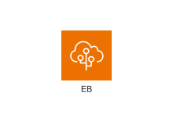
</div>
</div>

{{#endtab}}
{{#tab name="Code"}}

```xml
{{#include ../samples/icons/Architecture-Service-Icons/arch-aws-elastic-beanstalk-64-7cd826d5.xal}}
```

{{#endtab}}
{{#endtabs}}

<div class="xal-ref-tag"><code>&lt;item id=&#34;62&#34; /&gt;</code></div>

</div>
<div class="xal-ref-card">
<div class="xal-ref-title">Arch_AWS-Lambda_64</div>

{{#tabs name="svg-ref-0455"}}
{{#tab name="Preview"}}
<div class="xal-ref-preview">
<div>
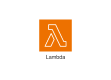
</div>
</div>

{{#endtab}}
{{#tab name="Code"}}

```xml
{{#include ../samples/icons/Architecture-Service-Icons/arch-aws-lambda-64-b1ded168.xal}}
```

{{#endtab}}
{{#endtabs}}

<div class="xal-ref-tag"><code>&lt;item id=&#34;63&#34; /&gt;</code></div>

</div>
<div class="xal-ref-card">
<div class="xal-ref-title">Arch_AWS-Local-Zones_64</div>

{{#tabs name="svg-ref-0456"}}
{{#tab name="Preview"}}
<div class="xal-ref-preview">
<div>
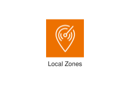
</div>
</div>

{{#endtab}}
{{#tab name="Code"}}

```xml
{{#include ../samples/icons/Architecture-Service-Icons/arch-aws-local-zones-64-f3ea42b2.xal}}
```

{{#endtab}}
{{#endtabs}}

<div class="xal-ref-tag"><code>&lt;item id=&#34;64&#34; /&gt;</code></div>

</div>
<div class="xal-ref-card">
<div class="xal-ref-title">Arch_AWS-Nitro-Enclaves_64</div>

{{#tabs name="svg-ref-0457"}}
{{#tab name="Preview"}}
<div class="xal-ref-preview">
<div>
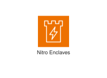
</div>
</div>

{{#endtab}}
{{#tab name="Code"}}

```xml
{{#include ../samples/icons/Architecture-Service-Icons/arch-aws-nitro-enclaves-64-42bb8729.xal}}
```

{{#endtab}}
{{#endtabs}}

<div class="xal-ref-tag"><code>&lt;item id=&#34;65&#34; /&gt;</code></div>

</div>
<div class="xal-ref-card">
<div class="xal-ref-title">Arch_AWS-Outposts-family_64</div>

{{#tabs name="svg-ref-0458"}}
{{#tab name="Preview"}}
<div class="xal-ref-preview">
<div>
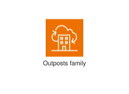
</div>
</div>

{{#endtab}}
{{#tab name="Code"}}

```xml
{{#include ../samples/icons/Architecture-Service-Icons/arch-aws-outposts-family-64-ce4de81e.xal}}
```

{{#endtab}}
{{#endtabs}}

<div class="xal-ref-tag"><code>&lt;item id=&#34;66&#34; /&gt;</code></div>

</div>
<div class="xal-ref-card">
<div class="xal-ref-title">Arch_AWS-Outposts-rack_64</div>

{{#tabs name="svg-ref-0459"}}
{{#tab name="Preview"}}
<div class="xal-ref-preview">
<div>
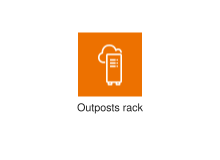
</div>
</div>

{{#endtab}}
{{#tab name="Code"}}

```xml
{{#include ../samples/icons/Architecture-Service-Icons/arch-aws-outposts-rack-64-2593343f.xal}}
```

{{#endtab}}
{{#endtabs}}

<div class="xal-ref-tag"><code>&lt;item id=&#34;67&#34; /&gt;</code></div>

</div>
<div class="xal-ref-card">
<div class="xal-ref-title">Arch_AWS-Outposts-servers_64</div>

{{#tabs name="svg-ref-0460"}}
{{#tab name="Preview"}}
<div class="xal-ref-preview">
<div>

</div>
</div>

{{#endtab}}
{{#tab name="Code"}}

```xml
{{#include ../samples/icons/Architecture-Service-Icons/arch-aws-outposts-servers-64-5f65c27e.xal}}
```

{{#endtab}}
{{#endtabs}}

<div class="xal-ref-tag"><code>&lt;item id=&#34;68&#34; /&gt;</code></div>

</div>
<div class="xal-ref-card">
<div class="xal-ref-title">Arch_AWS-Parallel-Cluster_64</div>

{{#tabs name="svg-ref-0461"}}
{{#tab name="Preview"}}
<div class="xal-ref-preview">
<div>
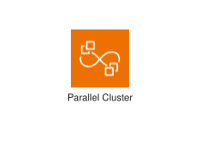
</div>
</div>

{{#endtab}}
{{#tab name="Code"}}

```xml
{{#include ../samples/icons/Architecture-Service-Icons/arch-aws-parallel-cluster-64-c886687c.xal}}
```

{{#endtab}}
{{#endtabs}}

<div class="xal-ref-tag"><code>&lt;item id=&#34;69&#34; /&gt;</code></div>

</div>
<div class="xal-ref-card">
<div class="xal-ref-title">Arch_AWS-Parallel-Computing-Service_64</div>

{{#tabs name="svg-ref-0462"}}
{{#tab name="Preview"}}
<div class="xal-ref-preview">
<div>

</div>
</div>

{{#endtab}}
{{#tab name="Code"}}

```xml
{{#include ../samples/icons/Architecture-Service-Icons/arch-aws-parallel-computing-service-64-1d835bcf.xal}}
```

{{#endtab}}
{{#endtabs}}

<div class="xal-ref-tag"><code>&lt;item id=&#34;70&#34; /&gt;</code></div>

</div>
<div class="xal-ref-card">
<div class="xal-ref-title">Arch_AWS-Serverless-Application-Repository_64</div>

{{#tabs name="svg-ref-0463"}}
{{#tab name="Preview"}}
<div class="xal-ref-preview">
<div>

</div>
</div>

{{#endtab}}
{{#tab name="Code"}}

```xml
{{#include ../samples/icons/Architecture-Service-Icons/arch-aws-serverless-application-repository-64-06d2919d.xal}}
```

{{#endtab}}
{{#endtabs}}

<div class="xal-ref-tag"><code>&lt;item id=&#34;71&#34; /&gt;</code></div>

</div>
<div class="xal-ref-card">
<div class="xal-ref-title">Arch_AWS-SimSpace-Weaver_64</div>

{{#tabs name="svg-ref-0464"}}
{{#tab name="Preview"}}
<div class="xal-ref-preview">
<div>
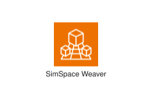
</div>
</div>

{{#endtab}}
{{#tab name="Code"}}

```xml
{{#include ../samples/icons/Architecture-Service-Icons/arch-aws-simspace-weaver-64-f1772ff4.xal}}
```

{{#endtab}}
{{#endtabs}}

<div class="xal-ref-tag"><code>&lt;item id=&#34;72&#34; /&gt;</code></div>

</div>
<div class="xal-ref-card">
<div class="xal-ref-title">Arch_AWS-Wavelength_64</div>

{{#tabs name="svg-ref-0465"}}
{{#tab name="Preview"}}
<div class="xal-ref-preview">
<div>
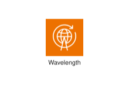
</div>
</div>

{{#endtab}}
{{#tab name="Code"}}

```xml
{{#include ../samples/icons/Architecture-Service-Icons/arch-aws-wavelength-64-be88bbaf.xal}}
```

{{#endtab}}
{{#endtabs}}

<div class="xal-ref-tag"><code>&lt;item id=&#34;73&#34; /&gt;</code></div>

</div>
<div class="xal-ref-card">
<div class="xal-ref-title">Arch_Amazon-DCV_64</div>

{{#tabs name="svg-ref-0466"}}
{{#tab name="Preview"}}
<div class="xal-ref-preview">
<div>
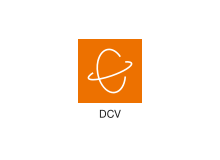
</div>
</div>

{{#endtab}}
{{#tab name="Code"}}

```xml
{{#include ../samples/icons/Architecture-Service-Icons/arch-amazon-dcv-64-13213886.xal}}
```

{{#endtab}}
{{#endtabs}}

<div class="xal-ref-tag"><code>&lt;item id=&#34;74&#34; /&gt;</code></div>

</div>
<div class="xal-ref-card">
<div class="xal-ref-title">Arch_Amazon-EC2-Auto-Scaling_64</div>

{{#tabs name="svg-ref-0467"}}
{{#tab name="Preview"}}
<div class="xal-ref-preview">
<div>
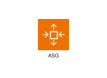
</div>
</div>

{{#endtab}}
{{#tab name="Code"}}

```xml
{{#include ../samples/icons/Architecture-Service-Icons/arch-amazon-ec2-auto-scaling-64-13779fa4.xal}}
```

{{#endtab}}
{{#endtabs}}

<div class="xal-ref-tag"><code>&lt;item id=&#34;75&#34; /&gt;</code></div>

</div>
<div class="xal-ref-card">
<div class="xal-ref-title">Arch_Amazon-EC2-Image-Builder_64</div>

{{#tabs name="svg-ref-0468"}}
{{#tab name="Preview"}}
<div class="xal-ref-preview">
<div>

</div>
</div>

{{#endtab}}
{{#tab name="Code"}}

```xml
{{#include ../samples/icons/Architecture-Service-Icons/arch-amazon-ec2-image-builder-64-4e0a72ca.xal}}
```

{{#endtab}}
{{#endtabs}}

<div class="xal-ref-tag"><code>&lt;item id=&#34;76&#34; /&gt;</code></div>

</div>
<div class="xal-ref-card">
<div class="xal-ref-title">Arch_Amazon-EC2_64</div>

{{#tabs name="svg-ref-0469"}}
{{#tab name="Preview"}}
<div class="xal-ref-preview">
<div>
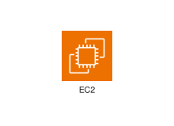
</div>
</div>

{{#endtab}}
{{#tab name="Code"}}

```xml
{{#include ../samples/icons/Architecture-Service-Icons/arch-amazon-ec2-64-a842fdf9.xal}}
```

{{#endtab}}
{{#endtabs}}

<div class="xal-ref-tag"><code>&lt;item id=&#34;77&#34; /&gt;</code></div>

</div>
<div class="xal-ref-card">
<div class="xal-ref-title">Arch_Amazon-Elastic-VMware-Service_64</div>

{{#tabs name="svg-ref-0470"}}
{{#tab name="Preview"}}
<div class="xal-ref-preview">
<div>

</div>
</div>

{{#endtab}}
{{#tab name="Code"}}

```xml
{{#include ../samples/icons/Architecture-Service-Icons/arch-amazon-elastic-vmware-service-64-f382b190.xal}}
```

{{#endtab}}
{{#endtabs}}

<div class="xal-ref-tag"><code>&lt;item id=&#34;78&#34; /&gt;</code></div>

</div>
<div class="xal-ref-card">
<div class="xal-ref-title">Arch_Amazon-Lightsail-for-Research_64</div>

{{#tabs name="svg-ref-0471"}}
{{#tab name="Preview"}}
<div class="xal-ref-preview">
<div>

</div>
</div>

{{#endtab}}
{{#tab name="Code"}}

```xml
{{#include ../samples/icons/Architecture-Service-Icons/arch-amazon-lightsail-for-research-64-9bb054ab.xal}}
```

{{#endtab}}
{{#endtabs}}

<div class="xal-ref-tag"><code>&lt;item id=&#34;79&#34; /&gt;</code></div>

</div>
<div class="xal-ref-card">
<div class="xal-ref-title">Arch_Amazon-Lightsail_64</div>

{{#tabs name="svg-ref-0472"}}
{{#tab name="Preview"}}
<div class="xal-ref-preview">
<div>

</div>
</div>

{{#endtab}}
{{#tab name="Code"}}

```xml
{{#include ../samples/icons/Architecture-Service-Icons/arch-amazon-lightsail-64-07764b4f.xal}}
```

{{#endtab}}
{{#endtabs}}

<div class="xal-ref-tag"><code>&lt;item id=&#34;80&#34; /&gt;</code></div>

</div>
<div class="xal-ref-card">
<div class="xal-ref-title">Arch_Bottlerocket_64</div>

{{#tabs name="svg-ref-0473"}}
{{#tab name="Preview"}}
<div class="xal-ref-preview">
<div>
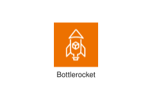
</div>
</div>

{{#endtab}}
{{#tab name="Code"}}

```xml
{{#include ../samples/icons/Architecture-Service-Icons/arch-bottlerocket-64-80153782.xal}}
```

{{#endtab}}
{{#endtabs}}

<div class="xal-ref-tag"><code>&lt;item id=&#34;81&#34; /&gt;</code></div>

</div>
<div class="xal-ref-card">
<div class="xal-ref-title">Arch_Elastic-Fabric-Adapter_64</div>

{{#tabs name="svg-ref-0474"}}
{{#tab name="Preview"}}
<div class="xal-ref-preview">
<div>
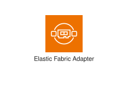
</div>
</div>

{{#endtab}}
{{#tab name="Code"}}

```xml
{{#include ../samples/icons/Architecture-Service-Icons/arch-elastic-fabric-adapter-64-2c623d93.xal}}
```

{{#endtab}}
{{#endtabs}}

<div class="xal-ref-tag"><code>&lt;item id=&#34;82&#34; /&gt;</code></div>

</div>
<div class="xal-ref-card">
<div class="xal-ref-title">Arch_NICE-EnginFrame_64</div>

{{#tabs name="svg-ref-0475"}}
{{#tab name="Preview"}}
<div class="xal-ref-preview">
<div>

</div>
</div>

{{#endtab}}
{{#tab name="Code"}}

```xml
{{#include ../samples/icons/Architecture-Service-Icons/arch-nice-enginframe-64-1285160b.xal}}
```

{{#endtab}}
{{#endtabs}}

<div class="xal-ref-tag"><code>&lt;item id=&#34;83&#34; /&gt;</code></div>

</div>
<div class="xal-ref-card">
<div class="xal-ref-title">Arch_AWS-Fargate_16</div>

{{#tabs name="svg-ref-0476"}}
{{#tab name="Preview"}}
<div class="xal-ref-preview">
<div>

</div>
</div>

{{#endtab}}
{{#tab name="Code"}}

```xml
{{#include ../samples/icons/Architecture-Service-Icons/arch-aws-fargate-16-bc5bb350.xal}}
```

{{#endtab}}
{{#endtabs}}

<div class="xal-ref-tag"><code>&lt;item id=&#34;550&#34; /&gt;</code></div>

</div>
<div class="xal-ref-card">
<div class="xal-ref-title">Arch_Amazon-ECS-Anywhere_16</div>

{{#tabs name="svg-ref-0477"}}
{{#tab name="Preview"}}
<div class="xal-ref-preview">
<div>

</div>
</div>

{{#endtab}}
{{#tab name="Code"}}

```xml
{{#include ../samples/icons/Architecture-Service-Icons/arch-amazon-ecs-anywhere-16-220a7a34.xal}}
```

{{#endtab}}
{{#endtabs}}

<div class="xal-ref-tag"><code>&lt;item id=&#34;551&#34; /&gt;</code></div>

</div>
<div class="xal-ref-card">
<div class="xal-ref-title">Arch_Amazon-EKS-Anywhere_16</div>

{{#tabs name="svg-ref-0478"}}
{{#tab name="Preview"}}
<div class="xal-ref-preview">
<div>

</div>
</div>

{{#endtab}}
{{#tab name="Code"}}

```xml
{{#include ../samples/icons/Architecture-Service-Icons/arch-amazon-eks-anywhere-16-355bd438.xal}}
```

{{#endtab}}
{{#endtabs}}

<div class="xal-ref-tag"><code>&lt;item id=&#34;552&#34; /&gt;</code></div>

</div>
<div class="xal-ref-card">
<div class="xal-ref-title">Arch_Amazon-EKS-Cloud_16</div>

{{#tabs name="svg-ref-0479"}}
{{#tab name="Preview"}}
<div class="xal-ref-preview">
<div>

</div>
</div>

{{#endtab}}
{{#tab name="Code"}}

```xml
{{#include ../samples/icons/Architecture-Service-Icons/arch-amazon-eks-cloud-16-bae3dc50.xal}}
```

{{#endtab}}
{{#endtabs}}

<div class="xal-ref-tag"><code>&lt;item id=&#34;553&#34; /&gt;</code></div>

</div>
<div class="xal-ref-card">
<div class="xal-ref-title">Arch_Amazon-EKS-Distro_16</div>

{{#tabs name="svg-ref-0480"}}
{{#tab name="Preview"}}
<div class="xal-ref-preview">
<div>

</div>
</div>

{{#endtab}}
{{#tab name="Code"}}

```xml
{{#include ../samples/icons/Architecture-Service-Icons/arch-amazon-eks-distro-16-64856065.xal}}
```

{{#endtab}}
{{#endtabs}}

<div class="xal-ref-tag"><code>&lt;item id=&#34;554&#34; /&gt;</code></div>

</div>
<div class="xal-ref-card">
<div class="xal-ref-title">Arch_Amazon-Elastic-Container-Registry_16</div>

{{#tabs name="svg-ref-0481"}}
{{#tab name="Preview"}}
<div class="xal-ref-preview">
<div>

</div>
</div>

{{#endtab}}
{{#tab name="Code"}}

```xml
{{#include ../samples/icons/Architecture-Service-Icons/arch-amazon-elastic-container-registry-16-87ec6d7b.xal}}
```

{{#endtab}}
{{#endtabs}}

<div class="xal-ref-tag"><code>&lt;item id=&#34;555&#34; /&gt;</code></div>

</div>
<div class="xal-ref-card">
<div class="xal-ref-title">Arch_Amazon-Elastic-Container-Service_16</div>

{{#tabs name="svg-ref-0482"}}
{{#tab name="Preview"}}
<div class="xal-ref-preview">
<div>
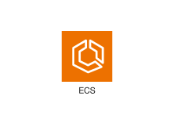
</div>
</div>

{{#endtab}}
{{#tab name="Code"}}

```xml
{{#include ../samples/icons/Architecture-Service-Icons/arch-amazon-elastic-container-service-16-9bf03c54.xal}}
```

{{#endtab}}
{{#endtabs}}

<div class="xal-ref-tag"><code>&lt;item id=&#34;556&#34; /&gt;</code></div>

</div>
<div class="xal-ref-card">
<div class="xal-ref-title">Arch_Amazon-Elastic-Kubernetes-Service_16</div>

{{#tabs name="svg-ref-0483"}}
{{#tab name="Preview"}}
<div class="xal-ref-preview">
<div>
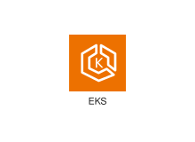
</div>
</div>

{{#endtab}}
{{#tab name="Code"}}

```xml
{{#include ../samples/icons/Architecture-Service-Icons/arch-amazon-elastic-kubernetes-service-16-2b9e1f02.xal}}
```

{{#endtab}}
{{#endtabs}}

<div class="xal-ref-tag"><code>&lt;item id=&#34;557&#34; /&gt;</code></div>

</div>
<div class="xal-ref-card">
<div class="xal-ref-title">Arch_Red-Hat-OpenShift-Service-on-AWS_16</div>

{{#tabs name="svg-ref-0484"}}
{{#tab name="Preview"}}
<div class="xal-ref-preview">
<div>

</div>
</div>

{{#endtab}}
{{#tab name="Code"}}

```xml
{{#include ../samples/icons/Architecture-Service-Icons/arch-red-hat-openshift-service-on-aws-16-d1e4e8b2.xal}}
```

{{#endtab}}
{{#endtabs}}

<div class="xal-ref-tag"><code>&lt;item id=&#34;558&#34; /&gt;</code></div>

</div>
<div class="xal-ref-card">
<div class="xal-ref-title">Arch_AWS-Fargate_32</div>

{{#tabs name="svg-ref-0485"}}
{{#tab name="Preview"}}
<div class="xal-ref-preview">
<div>
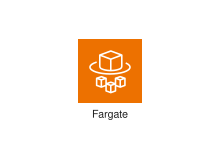
</div>
</div>

{{#endtab}}
{{#tab name="Code"}}

```xml
{{#include ../samples/icons/Architecture-Service-Icons/arch-aws-fargate-32-eae4b50f.xal}}
```

{{#endtab}}
{{#endtabs}}

<div class="xal-ref-tag"><code>&lt;item id=&#34;541&#34; /&gt;</code></div>

</div>
<div class="xal-ref-card">
<div class="xal-ref-title">Arch_Amazon-ECS-Anywhere_32</div>

{{#tabs name="svg-ref-0486"}}
{{#tab name="Preview"}}
<div class="xal-ref-preview">
<div>

</div>
</div>

{{#endtab}}
{{#tab name="Code"}}

```xml
{{#include ../samples/icons/Architecture-Service-Icons/arch-amazon-ecs-anywhere-32-088c9c5f.xal}}
```

{{#endtab}}
{{#endtabs}}

<div class="xal-ref-tag"><code>&lt;item id=&#34;542&#34; /&gt;</code></div>

</div>
<div class="xal-ref-card">
<div class="xal-ref-title">Arch_Amazon-EKS-Anywhere_32</div>

{{#tabs name="svg-ref-0487"}}
{{#tab name="Preview"}}
<div class="xal-ref-preview">
<div>

</div>
</div>

{{#endtab}}
{{#tab name="Code"}}

```xml
{{#include ../samples/icons/Architecture-Service-Icons/arch-amazon-eks-anywhere-32-1fdd3253.xal}}
```

{{#endtab}}
{{#endtabs}}

<div class="xal-ref-tag"><code>&lt;item id=&#34;543&#34; /&gt;</code></div>

</div>
<div class="xal-ref-card">
<div class="xal-ref-title">Arch_Amazon-EKS-Cloud_32</div>

{{#tabs name="svg-ref-0488"}}
{{#tab name="Preview"}}
<div class="xal-ref-preview">
<div>

</div>
</div>

{{#endtab}}
{{#tab name="Code"}}

```xml
{{#include ../samples/icons/Architecture-Service-Icons/arch-amazon-eks-cloud-32-eee78619.xal}}
```

{{#endtab}}
{{#endtabs}}

<div class="xal-ref-tag"><code>&lt;item id=&#34;544&#34; /&gt;</code></div>

</div>
<div class="xal-ref-card">
<div class="xal-ref-title">Arch_Amazon-EKS-Distro_32</div>

{{#tabs name="svg-ref-0489"}}
{{#tab name="Preview"}}
<div class="xal-ref-preview">
<div>

</div>
</div>

{{#endtab}}
{{#tab name="Code"}}

```xml
{{#include ../samples/icons/Architecture-Service-Icons/arch-amazon-eks-distro-32-df97c9ff.xal}}
```

{{#endtab}}
{{#endtabs}}

<div class="xal-ref-tag"><code>&lt;item id=&#34;545&#34; /&gt;</code></div>

</div>
<div class="xal-ref-card">
<div class="xal-ref-title">Arch_Amazon-Elastic-Container-Registry_32</div>

{{#tabs name="svg-ref-0490"}}
{{#tab name="Preview"}}
<div class="xal-ref-preview">
<div>
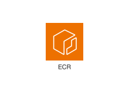
</div>
</div>

{{#endtab}}
{{#tab name="Code"}}

```xml
{{#include ../samples/icons/Architecture-Service-Icons/arch-amazon-elastic-container-registry-32-3a5298dd.xal}}
```

{{#endtab}}
{{#endtabs}}

<div class="xal-ref-tag"><code>&lt;item id=&#34;546&#34; /&gt;</code></div>

</div>
<div class="xal-ref-card">
<div class="xal-ref-title">Arch_Amazon-Elastic-Container-Service_32</div>

{{#tabs name="svg-ref-0491"}}
{{#tab name="Preview"}}
<div class="xal-ref-preview">
<div>

</div>
</div>

{{#endtab}}
{{#tab name="Code"}}

```xml
{{#include ../samples/icons/Architecture-Service-Icons/arch-amazon-elastic-container-service-32-d51d4558.xal}}
```

{{#endtab}}
{{#endtabs}}

<div class="xal-ref-tag"><code>&lt;item id=&#34;547&#34; /&gt;</code></div>

</div>
<div class="xal-ref-card">
<div class="xal-ref-title">Arch_Amazon-Elastic-Kubernetes-Service_32</div>

{{#tabs name="svg-ref-0492"}}
{{#tab name="Preview"}}
<div class="xal-ref-preview">
<div>

</div>
</div>

{{#endtab}}
{{#tab name="Code"}}

```xml
{{#include ../samples/icons/Architecture-Service-Icons/arch-amazon-elastic-kubernetes-service-32-9620eaa4.xal}}
```

{{#endtab}}
{{#endtabs}}

<div class="xal-ref-tag"><code>&lt;item id=&#34;548&#34; /&gt;</code></div>

</div>
<div class="xal-ref-card">
<div class="xal-ref-title">Arch_Red-Hat-OpenShift-Service-on-AWS_32</div>

{{#tabs name="svg-ref-0493"}}
{{#tab name="Preview"}}
<div class="xal-ref-preview">
<div>

</div>
</div>

{{#endtab}}
{{#tab name="Code"}}

```xml
{{#include ../samples/icons/Architecture-Service-Icons/arch-red-hat-openshift-service-on-aws-32-9f0991be.xal}}
```

{{#endtab}}
{{#endtabs}}

<div class="xal-ref-tag"><code>&lt;item id=&#34;549&#34; /&gt;</code></div>

</div>
<div class="xal-ref-card">
<div class="xal-ref-title">Arch_AWS-Fargate_48</div>

{{#tabs name="svg-ref-0494"}}
{{#tab name="Preview"}}
<div class="xal-ref-preview">
<div>

</div>
</div>

{{#endtab}}
{{#tab name="Code"}}

```xml
{{#include ../samples/icons/Architecture-Service-Icons/arch-aws-fargate-48-d9ff53da.xal}}
```

{{#endtab}}
{{#endtabs}}

<div class="xal-ref-tag"><code>&lt;item id=&#34;568&#34; /&gt;</code></div>

</div>
<div class="xal-ref-card">
<div class="xal-ref-title">Arch_Amazon-ECS-Anywhere_48</div>

{{#tabs name="svg-ref-0495"}}
{{#tab name="Preview"}}
<div class="xal-ref-preview">
<div>

</div>
</div>

{{#endtab}}
{{#tab name="Code"}}

```xml
{{#include ../samples/icons/Architecture-Service-Icons/arch-amazon-ecs-anywhere-48-a1b6a3fb.xal}}
```

{{#endtab}}
{{#endtabs}}

<div class="xal-ref-tag"><code>&lt;item id=&#34;569&#34; /&gt;</code></div>

</div>
<div class="xal-ref-card">
<div class="xal-ref-title">Arch_Amazon-EKS-Anywhere_48</div>

{{#tabs name="svg-ref-0496"}}
{{#tab name="Preview"}}
<div class="xal-ref-preview">
<div>

</div>
</div>

{{#endtab}}
{{#tab name="Code"}}

```xml
{{#include ../samples/icons/Architecture-Service-Icons/arch-amazon-eks-anywhere-48-b6e70df7.xal}}
```

{{#endtab}}
{{#endtabs}}

<div class="xal-ref-tag"><code>&lt;item id=&#34;570&#34; /&gt;</code></div>

</div>
<div class="xal-ref-card">
<div class="xal-ref-title">Arch_Amazon-EKS-Cloud_48</div>

{{#tabs name="svg-ref-0497"}}
{{#tab name="Preview"}}
<div class="xal-ref-preview">
<div>

</div>
</div>

{{#endtab}}
{{#tab name="Code"}}

```xml
{{#include ../samples/icons/Architecture-Service-Icons/arch-amazon-eks-cloud-48-d152ec26.xal}}
```

{{#endtab}}
{{#endtabs}}

<div class="xal-ref-tag"><code>&lt;item id=&#34;571&#34; /&gt;</code></div>

</div>
<div class="xal-ref-card">
<div class="xal-ref-title">Arch_Amazon-EKS-Distro_48</div>

{{#tabs name="svg-ref-0498"}}
{{#tab name="Preview"}}
<div class="xal-ref-preview">
<div>

</div>
</div>

{{#endtab}}
{{#tab name="Code"}}

```xml
{{#include ../samples/icons/Architecture-Service-Icons/arch-amazon-eks-distro-48-5a476459.xal}}
```

{{#endtab}}
{{#endtabs}}

<div class="xal-ref-tag"><code>&lt;item id=&#34;572&#34; /&gt;</code></div>

</div>
<div class="xal-ref-card">
<div class="xal-ref-title">Arch_Amazon-Elastic-Container-Registry_48</div>

{{#tabs name="svg-ref-0499"}}
{{#tab name="Preview"}}
<div class="xal-ref-preview">
<div>
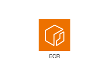
</div>
</div>

{{#endtab}}
{{#tab name="Code"}}

```xml
{{#include ../samples/icons/Architecture-Service-Icons/arch-amazon-elastic-container-registry-48-f22a77b0.xal}}
```

{{#endtab}}
{{#endtabs}}

<div class="xal-ref-tag"><code>&lt;item id=&#34;573&#34; /&gt;</code></div>

</div>
<div class="xal-ref-card">
<div class="xal-ref-title">Arch_Amazon-Elastic-Container-Service_48</div>

{{#tabs name="svg-ref-0500"}}
{{#tab name="Preview"}}
<div class="xal-ref-preview">
<div>
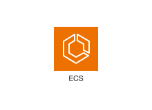
</div>
</div>

{{#endtab}}
{{#tab name="Code"}}

```xml
{{#include ../samples/icons/Architecture-Service-Icons/arch-amazon-elastic-container-service-48-f08bbc07.xal}}
```

{{#endtab}}
{{#endtabs}}

<div class="xal-ref-tag"><code>&lt;item id=&#34;574&#34; /&gt;</code></div>

</div>
<div class="xal-ref-card">
<div class="xal-ref-title">Arch_Amazon-Elastic-Kubernetes-Service_48</div>

{{#tabs name="svg-ref-0501"}}
{{#tab name="Preview"}}
<div class="xal-ref-preview">
<div>

</div>
</div>

{{#endtab}}
{{#tab name="Code"}}

```xml
{{#include ../samples/icons/Architecture-Service-Icons/arch-amazon-elastic-kubernetes-service-48-5e5805c9.xal}}
```

{{#endtab}}
{{#endtabs}}

<div class="xal-ref-tag"><code>&lt;item id=&#34;575&#34; /&gt;</code></div>

</div>
<div class="xal-ref-card">
<div class="xal-ref-title">Arch_Red-Hat-OpenShift-Service-on-AWS_48</div>

{{#tabs name="svg-ref-0502"}}
{{#tab name="Preview"}}
<div class="xal-ref-preview">
<div>

</div>
</div>

{{#endtab}}
{{#tab name="Code"}}

```xml
{{#include ../samples/icons/Architecture-Service-Icons/arch-red-hat-openshift-service-on-aws-48-ba9f68e1.xal}}
```

{{#endtab}}
{{#endtabs}}

<div class="xal-ref-tag"><code>&lt;item id=&#34;576&#34; /&gt;</code></div>

</div>
<div class="xal-ref-card">
<div class="xal-ref-title">Arch_AWS-Fargate_64</div>

{{#tabs name="svg-ref-0503"}}
{{#tab name="Preview"}}
<div class="xal-ref-preview">
<div>
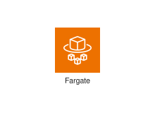
</div>
</div>

{{#endtab}}
{{#tab name="Code"}}

```xml
{{#include ../samples/icons/Architecture-Service-Icons/arch-aws-fargate-64-933b8df3.xal}}
```

{{#endtab}}
{{#endtabs}}

<div class="xal-ref-tag"><code>&lt;item id=&#34;559&#34; /&gt;</code></div>

</div>
<div class="xal-ref-card">
<div class="xal-ref-title">Arch_Amazon-ECS-Anywhere_64</div>

{{#tabs name="svg-ref-0504"}}
{{#tab name="Preview"}}
<div class="xal-ref-preview">
<div>

</div>
</div>

{{#endtab}}
{{#tab name="Code"}}

```xml
{{#include ../samples/icons/Architecture-Service-Icons/arch-amazon-ecs-anywhere-64-d7a58f88.xal}}
```

{{#endtab}}
{{#endtabs}}

<div class="xal-ref-tag"><code>&lt;item id=&#34;560&#34; /&gt;</code></div>

</div>
<div class="xal-ref-card">
<div class="xal-ref-title">Arch_Amazon-EKS-Anywhere_64</div>

{{#tabs name="svg-ref-0505"}}
{{#tab name="Preview"}}
<div class="xal-ref-preview">
<div>

</div>
</div>

{{#endtab}}
{{#tab name="Code"}}

```xml
{{#include ../samples/icons/Architecture-Service-Icons/arch-amazon-eks-anywhere-64-c0f42184.xal}}
```

{{#endtab}}
{{#endtabs}}

<div class="xal-ref-tag"><code>&lt;item id=&#34;561&#34; /&gt;</code></div>

</div>
<div class="xal-ref-card">
<div class="xal-ref-title">Arch_Amazon-EKS-Cloud_64</div>

{{#tabs name="svg-ref-0506"}}
{{#tab name="Preview"}}
<div class="xal-ref-preview">
<div>

</div>
</div>

{{#endtab}}
{{#tab name="Code"}}

```xml
{{#include ../samples/icons/Architecture-Service-Icons/arch-amazon-eks-cloud-64-8d50e3af.xal}}
```

{{#endtab}}
{{#endtabs}}

<div class="xal-ref-tag"><code>&lt;item id=&#34;562&#34; /&gt;</code></div>

</div>
<div class="xal-ref-card">
<div class="xal-ref-title">Arch_Amazon-EKS-Distro_64</div>

{{#tabs name="svg-ref-0507"}}
{{#tab name="Preview"}}
<div class="xal-ref-preview">
<div>

</div>
</div>

{{#endtab}}
{{#tab name="Code"}}

```xml
{{#include ../samples/icons/Architecture-Service-Icons/arch-amazon-eks-distro-64-a61ac08a.xal}}
```

{{#endtab}}
{{#endtabs}}

<div class="xal-ref-tag"><code>&lt;item id=&#34;563&#34; /&gt;</code></div>

</div>
<div class="xal-ref-card">
<div class="xal-ref-title">Arch_Amazon-Elastic-Container-Registry_64</div>

{{#tabs name="svg-ref-0508"}}
{{#tab name="Preview"}}
<div class="xal-ref-preview">
<div>

</div>
</div>

{{#endtab}}
{{#tab name="Code"}}

```xml
{{#include ../samples/icons/Architecture-Service-Icons/arch-amazon-elastic-container-registry-64-82ce9e7d.xal}}
```

{{#endtab}}
{{#endtabs}}

<div class="xal-ref-tag"><code>&lt;item id=&#34;564&#34; /&gt;</code></div>

</div>
<div class="xal-ref-card">
<div class="xal-ref-title">Arch_Amazon-Elastic-Container-Service_64</div>

{{#tabs name="svg-ref-0509"}}
{{#tab name="Preview"}}
<div class="xal-ref-preview">
<div>
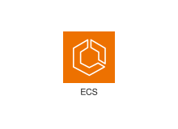
</div>
</div>

{{#endtab}}
{{#tab name="Code"}}

```xml
{{#include ../samples/icons/Architecture-Service-Icons/arch-amazon-elastic-container-service-64-c6b85ed0.xal}}
```

{{#endtab}}
{{#endtabs}}

<div class="xal-ref-tag"><code>&lt;item id=&#34;565&#34; /&gt;</code></div>

</div>
<div class="xal-ref-card">
<div class="xal-ref-title">Arch_Amazon-Elastic-Kubernetes-Service_64</div>

{{#tabs name="svg-ref-0510"}}
{{#tab name="Preview"}}
<div class="xal-ref-preview">
<div>

</div>
</div>

{{#endtab}}
{{#tab name="Code"}}

```xml
{{#include ../samples/icons/Architecture-Service-Icons/arch-amazon-elastic-kubernetes-service-64-2ebcec04.xal}}
```

{{#endtab}}
{{#endtabs}}

<div class="xal-ref-tag"><code>&lt;item id=&#34;566&#34; /&gt;</code></div>

</div>
<div class="xal-ref-card">
<div class="xal-ref-title">Arch_Red-Hat-OpenShift-Service-on-AWS_64</div>

{{#tabs name="svg-ref-0511"}}
{{#tab name="Preview"}}
<div class="xal-ref-preview">
<div>

</div>
</div>

{{#endtab}}
{{#tab name="Code"}}

```xml
{{#include ../samples/icons/Architecture-Service-Icons/arch-red-hat-openshift-service-on-aws-64-8cac8a36.xal}}
```

{{#endtab}}
{{#endtabs}}

<div class="xal-ref-tag"><code>&lt;item id=&#34;567&#34; /&gt;</code></div>

</div>
<div class="xal-ref-card">
<div class="xal-ref-title">Arch_AWS-Activate_16</div>

{{#tabs name="svg-ref-0512"}}
{{#tab name="Preview"}}
<div class="xal-ref-preview">
<div>
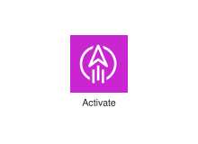
</div>
</div>

{{#endtab}}
{{#tab name="Code"}}

```xml
{{#include ../samples/icons/Architecture-Service-Icons/arch-aws-activate-16-39d22942.xal}}
```

{{#endtab}}
{{#endtabs}}

<div class="xal-ref-tag"><code>&lt;item id=&#34;161&#34; /&gt;</code></div>

</div>
<div class="xal-ref-card">
<div class="xal-ref-title">Arch_AWS-IQ_16</div>

{{#tabs name="svg-ref-0513"}}
{{#tab name="Preview"}}
<div class="xal-ref-preview">
<div>

</div>
</div>

{{#endtab}}
{{#tab name="Code"}}

```xml
{{#include ../samples/icons/Architecture-Service-Icons/arch-aws-iq-16-14631d29.xal}}
```

{{#endtab}}
{{#endtabs}}

<div class="xal-ref-tag"><code>&lt;item id=&#34;162&#34; /&gt;</code></div>

</div>
<div class="xal-ref-card">
<div class="xal-ref-title">Arch_AWS-Managed-Services_16</div>

{{#tabs name="svg-ref-0514"}}
{{#tab name="Preview"}}
<div class="xal-ref-preview">
<div>

</div>
</div>

{{#endtab}}
{{#tab name="Code"}}

```xml
{{#include ../samples/icons/Architecture-Service-Icons/arch-aws-managed-services-16-2e250cdd.xal}}
```

{{#endtab}}
{{#endtabs}}

<div class="xal-ref-tag"><code>&lt;item id=&#34;163&#34; /&gt;</code></div>

</div>
<div class="xal-ref-card">
<div class="xal-ref-title">Arch_AWS-Professional-Services_16</div>

{{#tabs name="svg-ref-0515"}}
{{#tab name="Preview"}}
<div class="xal-ref-preview">
<div>

</div>
</div>

{{#endtab}}
{{#tab name="Code"}}

```xml
{{#include ../samples/icons/Architecture-Service-Icons/arch-aws-professional-services-16-dd223cac.xal}}
```

{{#endtab}}
{{#endtabs}}

<div class="xal-ref-tag"><code>&lt;item id=&#34;164&#34; /&gt;</code></div>

</div>
<div class="xal-ref-card">
<div class="xal-ref-title">Arch_AWS-Support_16</div>

{{#tabs name="svg-ref-0516"}}
{{#tab name="Preview"}}
<div class="xal-ref-preview">
<div>
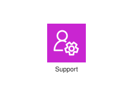
</div>
</div>

{{#endtab}}
{{#tab name="Code"}}

```xml
{{#include ../samples/icons/Architecture-Service-Icons/arch-aws-support-16-bf463ac1.xal}}
```

{{#endtab}}
{{#endtabs}}

<div class="xal-ref-tag"><code>&lt;item id=&#34;165&#34; /&gt;</code></div>

</div>
<div class="xal-ref-card">
<div class="xal-ref-title">Arch_AWS-Training-Certification_16</div>

{{#tabs name="svg-ref-0517"}}
{{#tab name="Preview"}}
<div class="xal-ref-preview">
<div>

</div>
</div>

{{#endtab}}
{{#tab name="Code"}}

```xml
{{#include ../samples/icons/Architecture-Service-Icons/arch-aws-training-certification-16-f967dfc0.xal}}
```

{{#endtab}}
{{#endtabs}}

<div class="xal-ref-tag"><code>&lt;item id=&#34;166&#34; /&gt;</code></div>

</div>
<div class="xal-ref-card">
<div class="xal-ref-title">Arch_AWS-rePost-Private_16</div>

{{#tabs name="svg-ref-0518"}}
{{#tab name="Preview"}}
<div class="xal-ref-preview">
<div>

</div>
</div>

{{#endtab}}
{{#tab name="Code"}}

```xml
{{#include ../samples/icons/Architecture-Service-Icons/arch-aws-repost-private-16-e2009e63.xal}}
```

{{#endtab}}
{{#endtabs}}

<div class="xal-ref-tag"><code>&lt;item id=&#34;167&#34; /&gt;</code></div>

</div>
<div class="xal-ref-card">
<div class="xal-ref-title">Arch_AWS-rePost_16</div>

{{#tabs name="svg-ref-0519"}}
{{#tab name="Preview"}}
<div class="xal-ref-preview">
<div>

</div>
</div>

{{#endtab}}
{{#tab name="Code"}}

```xml
{{#include ../samples/icons/Architecture-Service-Icons/arch-aws-repost-16-8c09fcd6.xal}}
```

{{#endtab}}
{{#endtabs}}

<div class="xal-ref-tag"><code>&lt;item id=&#34;168&#34; /&gt;</code></div>

</div>
<div class="xal-ref-card">
<div class="xal-ref-title">Arch_AWS-Activate_32</div>

{{#tabs name="svg-ref-0520"}}
{{#tab name="Preview"}}
<div class="xal-ref-preview">
<div>
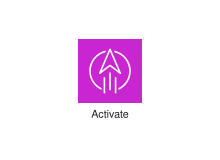
</div>
</div>

{{#endtab}}
{{#tab name="Code"}}

```xml
{{#include ../samples/icons/Architecture-Service-Icons/arch-aws-activate-32-76168ed5.xal}}
```

{{#endtab}}
{{#endtabs}}

<div class="xal-ref-tag"><code>&lt;item id=&#34;153&#34; /&gt;</code></div>

</div>
<div class="xal-ref-card">
<div class="xal-ref-title">Arch_AWS-IQ_32</div>

{{#tabs name="svg-ref-0521"}}
{{#tab name="Preview"}}
<div class="xal-ref-preview">
<div>

</div>
</div>

{{#endtab}}
{{#tab name="Code"}}

```xml
{{#include ../samples/icons/Architecture-Service-Icons/arch-aws-iq-32-0602f0c6.xal}}
```

{{#endtab}}
{{#endtabs}}

<div class="xal-ref-tag"><code>&lt;item id=&#34;154&#34; /&gt;</code></div>

</div>
<div class="xal-ref-card">
<div class="xal-ref-title">Arch_AWS-Managed-Services_32</div>

{{#tabs name="svg-ref-0522"}}
{{#tab name="Preview"}}
<div class="xal-ref-preview">
<div>

</div>
</div>

{{#endtab}}
{{#tab name="Code"}}

```xml
{{#include ../samples/icons/Architecture-Service-Icons/arch-aws-managed-services-32-4029661f.xal}}
```

{{#endtab}}
{{#endtabs}}

<div class="xal-ref-tag"><code>&lt;item id=&#34;155&#34; /&gt;</code></div>

</div>
<div class="xal-ref-card">
<div class="xal-ref-title">Arch_AWS-Professional-Services_32</div>

{{#tabs name="svg-ref-0523"}}
{{#tab name="Preview"}}
<div class="xal-ref-preview">
<div>

</div>
</div>

{{#endtab}}
{{#tab name="Code"}}

```xml
{{#include ../samples/icons/Architecture-Service-Icons/arch-aws-professional-services-32-01c7314d.xal}}
```

{{#endtab}}
{{#endtabs}}

<div class="xal-ref-tag"><code>&lt;item id=&#34;156&#34; /&gt;</code></div>

</div>
<div class="xal-ref-card">
<div class="xal-ref-title">Arch_AWS-Support_32</div>

{{#tabs name="svg-ref-0524"}}
{{#tab name="Preview"}}
<div class="xal-ref-preview">
<div>

</div>
</div>

{{#endtab}}
{{#tab name="Code"}}

```xml
{{#include ../samples/icons/Architecture-Service-Icons/arch-aws-support-32-e9f93c9e.xal}}
```

{{#endtab}}
{{#endtabs}}

<div class="xal-ref-tag"><code>&lt;item id=&#34;157&#34; /&gt;</code></div>

</div>
<div class="xal-ref-card">
<div class="xal-ref-title">Arch_AWS-Training-Certification_32</div>

{{#tabs name="svg-ref-0525"}}
{{#tab name="Preview"}}
<div class="xal-ref-preview">
<div>

</div>
</div>

{{#endtab}}
{{#tab name="Code"}}

```xml
{{#include ../samples/icons/Architecture-Service-Icons/arch-aws-training-certification-32-9af0bcd7.xal}}
```

{{#endtab}}
{{#endtabs}}

<div class="xal-ref-tag"><code>&lt;item id=&#34;158&#34; /&gt;</code></div>

</div>
<div class="xal-ref-card">
<div class="xal-ref-title">Arch_AWS-rePost-Private_32</div>

{{#tabs name="svg-ref-0526"}}
{{#tab name="Preview"}}
<div class="xal-ref-preview">
<div>

</div>
</div>

{{#endtab}}
{{#tab name="Code"}}

```xml
{{#include ../samples/icons/Architecture-Service-Icons/arch-aws-repost-private-32-4627a264.xal}}
```

{{#endtab}}
{{#endtabs}}

<div class="xal-ref-tag"><code>&lt;item id=&#34;159&#34; /&gt;</code></div>

</div>
<div class="xal-ref-card">
<div class="xal-ref-title">Arch_AWS-rePost_32</div>

{{#tabs name="svg-ref-0527"}}
{{#tab name="Preview"}}
<div class="xal-ref-preview">
<div>

</div>
</div>

{{#endtab}}
{{#tab name="Code"}}

```xml
{{#include ../samples/icons/Architecture-Service-Icons/arch-aws-repost-32-cd21431f.xal}}
```

{{#endtab}}
{{#endtabs}}

<div class="xal-ref-tag"><code>&lt;item id=&#34;160&#34; /&gt;</code></div>

</div>
<div class="xal-ref-card">
<div class="xal-ref-title">Arch_AWS-Activate_48</div>

{{#tabs name="svg-ref-0528"}}
{{#tab name="Preview"}}
<div class="xal-ref-preview">
<div>
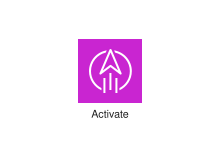
</div>
</div>

{{#endtab}}
{{#tab name="Code"}}

```xml
{{#include ../samples/icons/Architecture-Service-Icons/arch-aws-activate-48-b3158699.xal}}
```

{{#endtab}}
{{#endtabs}}

<div class="xal-ref-tag"><code>&lt;item id=&#34;177&#34; /&gt;</code></div>

</div>
<div class="xal-ref-card">
<div class="xal-ref-title">Arch_AWS-IQ_48</div>

{{#tabs name="svg-ref-0529"}}
{{#tab name="Preview"}}
<div class="xal-ref-preview">
<div>

</div>
</div>

{{#endtab}}
{{#tab name="Code"}}

```xml
{{#include ../samples/icons/Architecture-Service-Icons/arch-aws-iq-48-6f45feb9.xal}}
```

{{#endtab}}
{{#endtabs}}

<div class="xal-ref-tag"><code>&lt;item id=&#34;178&#34; /&gt;</code></div>

</div>
<div class="xal-ref-card">
<div class="xal-ref-title">Arch_AWS-Managed-Services_48</div>

{{#tabs name="svg-ref-0530"}}
{{#tab name="Preview"}}
<div class="xal-ref-preview">
<div>

</div>
</div>

{{#endtab}}
{{#tab name="Code"}}

```xml
{{#include ../samples/icons/Architecture-Service-Icons/arch-aws-managed-services-48-a2b20e20.xal}}
```

{{#endtab}}
{{#endtabs}}

<div class="xal-ref-tag"><code>&lt;item id=&#34;179&#34; /&gt;</code></div>

</div>
<div class="xal-ref-card">
<div class="xal-ref-title">Arch_AWS-Professional-Services_48</div>

{{#tabs name="svg-ref-0531"}}
{{#tab name="Preview"}}
<div class="xal-ref-preview">
<div>

</div>
</div>

{{#endtab}}
{{#tab name="Code"}}

```xml
{{#include ../samples/icons/Architecture-Service-Icons/arch-aws-professional-services-48-2886aada.xal}}
```

{{#endtab}}
{{#endtabs}}

<div class="xal-ref-tag"><code>&lt;item id=&#34;180&#34; /&gt;</code></div>

</div>
<div class="xal-ref-card">
<div class="xal-ref-title">Arch_AWS-Support_48</div>

{{#tabs name="svg-ref-0532"}}
{{#tab name="Preview"}}
<div class="xal-ref-preview">
<div>
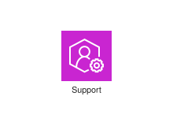
</div>
</div>

{{#endtab}}
{{#tab name="Code"}}

```xml
{{#include ../samples/icons/Architecture-Service-Icons/arch-aws-support-48-dae2da4b.xal}}
```

{{#endtab}}
{{#endtabs}}

<div class="xal-ref-tag"><code>&lt;item id=&#34;181&#34; /&gt;</code></div>

</div>
<div class="xal-ref-card">
<div class="xal-ref-title">Arch_AWS-Training-Certification_48</div>

{{#tabs name="svg-ref-0533"}}
{{#tab name="Preview"}}
<div class="xal-ref-preview">
<div>

</div>
</div>

{{#endtab}}
{{#tab name="Code"}}

```xml
{{#include ../samples/icons/Architecture-Service-Icons/arch-aws-training-certification-48-c73bce5a.xal}}
```

{{#endtab}}
{{#endtabs}}

<div class="xal-ref-tag"><code>&lt;item id=&#34;182&#34; /&gt;</code></div>

</div>
<div class="xal-ref-card">
<div class="xal-ref-title">Arch_AWS-rePost-Private_48</div>

{{#tabs name="svg-ref-0534"}}
{{#tab name="Preview"}}
<div class="xal-ref-preview">
<div>

</div>
</div>

{{#endtab}}
{{#tab name="Code"}}

```xml
{{#include ../samples/icons/Architecture-Service-Icons/arch-aws-repost-private-48-4a9e41e5.xal}}
```

{{#endtab}}
{{#endtabs}}

<div class="xal-ref-tag"><code>&lt;item id=&#34;183&#34; /&gt;</code></div>

</div>
<div class="xal-ref-card">
<div class="xal-ref-title">Arch_AWS-rePost_48</div>

{{#tabs name="svg-ref-0535"}}
{{#tab name="Preview"}}
<div class="xal-ref-preview">
<div>

</div>
</div>

{{#endtab}}
{{#tab name="Code"}}

```xml
{{#include ../samples/icons/Architecture-Service-Icons/arch-aws-repost-48-5ff2671f.xal}}
```

{{#endtab}}
{{#endtabs}}

<div class="xal-ref-tag"><code>&lt;item id=&#34;184&#34; /&gt;</code></div>

</div>
<div class="xal-ref-card">
<div class="xal-ref-title">Arch_AWS-Activate_64</div>

{{#tabs name="svg-ref-0536"}}
{{#tab name="Preview"}}
<div class="xal-ref-preview">
<div>
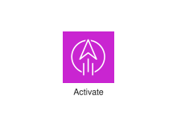
</div>
</div>

{{#endtab}}
{{#tab name="Code"}}

```xml
{{#include ../samples/icons/Architecture-Service-Icons/arch-aws-activate-64-99884773.xal}}
```

{{#endtab}}
{{#endtabs}}

<div class="xal-ref-tag"><code>&lt;item id=&#34;169&#34; /&gt;</code></div>

</div>
<div class="xal-ref-card">
<div class="xal-ref-title">Arch_AWS-IQ_64</div>

{{#tabs name="svg-ref-0537"}}
{{#tab name="Preview"}}
<div class="xal-ref-preview">
<div>

</div>
</div>

{{#endtab}}
{{#tab name="Code"}}

```xml
{{#include ../samples/icons/Architecture-Service-Icons/arch-aws-iq-64-d08f8e25.xal}}
```

{{#endtab}}
{{#endtabs}}

<div class="xal-ref-tag"><code>&lt;item id=&#34;170&#34; /&gt;</code></div>

</div>
<div class="xal-ref-card">
<div class="xal-ref-title">Arch_AWS-Managed-Services_64</div>

{{#tabs name="svg-ref-0538"}}
{{#tab name="Preview"}}
<div class="xal-ref-preview">
<div>

</div>
</div>

{{#endtab}}
{{#tab name="Code"}}

```xml
{{#include ../samples/icons/Architecture-Service-Icons/arch-aws-managed-services-64-03ada0d2.xal}}
```

{{#endtab}}
{{#endtabs}}

<div class="xal-ref-tag"><code>&lt;item id=&#34;171&#34; /&gt;</code></div>

</div>
<div class="xal-ref-card">
<div class="xal-ref-title">Arch_AWS-Professional-Services_64</div>

{{#tabs name="svg-ref-0539"}}
{{#tab name="Preview"}}
<div class="xal-ref-preview">
<div>

</div>
</div>

{{#endtab}}
{{#tab name="Code"}}

```xml
{{#include ../samples/icons/Architecture-Service-Icons/arch-aws-professional-services-64-ddc8bb71.xal}}
```

{{#endtab}}
{{#endtabs}}

<div class="xal-ref-tag"><code>&lt;item id=&#34;172&#34; /&gt;</code></div>

</div>
</div>
