# Architecture-Service-Icons - Page 7

This page references SVG files under `etc/resources/aws/svg/Architecture-Service-Icons`.
Each card shows the SVG preview first and the XAL tag syntax in the Code tab.
Showing 541-630 of 1236 SVG files.

<style>
.xal-ref-grid{display:grid;grid-template-columns:repeat(3,minmax(0,1fr));gap:1rem;margin:1rem 0 1.5rem}.xal-ref-card{border:1px solid var(--table-border-color);border-radius:8px;overflow:hidden;background:var(--bg);padding:.75rem}.xal-ref-title{font-size:.9rem;font-weight:600;line-height:1.25;margin:0 0 .5rem;overflow-wrap:anywhere}.xal-ref-preview{display:flex;align-items:center;justify-content:center}.xal-ref-preview img{display:block;width:100%;height:auto}.xal-ref-card pre{margin:0;max-height:18rem;overflow:auto;white-space:pre}.xal-ref-card code{font-size:.78em}.xal-ref-tag{margin:.5rem 0 0;color:var(--fg);opacity:.72;overflow:auto;white-space:pre}.xal-ref-tag code{font-size:.72em}@media(max-width:900px){.xal-ref-grid{grid-template-columns:repeat(2,minmax(0,1fr))}}@media(max-width:560px){.xal-ref-grid{grid-template-columns:1fr}}
</style>

[Back to section index](architecture-service-icons.md)

<div class="xal-ref-grid">
<div class="xal-ref-card">
<div class="xal-ref-title">Arch_AWS-Support_64</div>

{{#tabs name="svg-ref-0540"}}
{{#tab name="Preview"}}
<div class="xal-ref-preview">
<div>
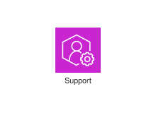
</div>
</div>

{{#endtab}}
{{#tab name="Code"}}

```xml
{{#include ../samples/icons/Architecture-Service-Icons/arch-aws-support-64-90260462.xal}}
```

{{#endtab}}
{{#endtabs}}

<div class="xal-ref-tag"><code>&lt;item id=&#34;173&#34; /&gt;</code></div>

</div>
<div class="xal-ref-card">
<div class="xal-ref-title">Arch_AWS-Training-Certification_64</div>

{{#tabs name="svg-ref-0541"}}
{{#tab name="Preview"}}
<div class="xal-ref-preview">
<div>

</div>
</div>

{{#endtab}}
{{#tab name="Code"}}

```xml
{{#include ../samples/icons/Architecture-Service-Icons/arch-aws-training-certification-64-eeaf6773.xal}}
```

{{#endtab}}
{{#endtabs}}

<div class="xal-ref-tag"><code>&lt;item id=&#34;174&#34; /&gt;</code></div>

</div>
<div class="xal-ref-card">
<div class="xal-ref-title">Arch_AWS-rePost-Private_64</div>

{{#tabs name="svg-ref-0542"}}
{{#tab name="Preview"}}
<div class="xal-ref-preview">
<div>

</div>
</div>

{{#endtab}}
{{#tab name="Code"}}

```xml
{{#include ../samples/icons/Architecture-Service-Icons/arch-aws-repost-private-64-3ddd0277.xal}}
```

{{#endtab}}
{{#endtabs}}

<div class="xal-ref-tag"><code>&lt;item id=&#34;175&#34; /&gt;</code></div>

</div>
<div class="xal-ref-card">
<div class="xal-ref-title">Arch_AWS-rePost_64</div>

{{#tabs name="svg-ref-0543"}}
{{#tab name="Preview"}}
<div class="xal-ref-preview">
<div>

</div>
</div>

{{#endtab}}
{{#tab name="Code"}}

```xml
{{#include ../samples/icons/Architecture-Service-Icons/arch-aws-repost-64-fca7afa9.xal}}
```

{{#endtab}}
{{#endtabs}}

<div class="xal-ref-tag"><code>&lt;item id=&#34;176&#34; /&gt;</code></div>

</div>
<div class="xal-ref-card">
<div class="xal-ref-title">Arch_AWS-Database-Migration-Service_16</div>

{{#tabs name="svg-ref-0544"}}
{{#tab name="Preview"}}
<div class="xal-ref-preview">
<div>

</div>
</div>

{{#endtab}}
{{#tab name="Code"}}

```xml
{{#include ../samples/icons/Architecture-Service-Icons/arch-aws-database-migration-service-16-a85e076e.xal}}
```

{{#endtab}}
{{#endtabs}}

<div class="xal-ref-tag"><code>&lt;item id=&#34;120&#34; /&gt;</code></div>

</div>
<div class="xal-ref-card">
<div class="xal-ref-title">Arch_Amazon-Aurora_16</div>

{{#tabs name="svg-ref-0545"}}
{{#tab name="Preview"}}
<div class="xal-ref-preview">
<div>
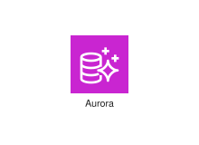
</div>
</div>

{{#endtab}}
{{#tab name="Code"}}

```xml
{{#include ../samples/icons/Architecture-Service-Icons/arch-amazon-aurora-16-f8788920.xal}}
```

{{#endtab}}
{{#endtabs}}

<div class="xal-ref-tag"><code>&lt;item id=&#34;121&#34; /&gt;</code></div>

</div>
<div class="xal-ref-card">
<div class="xal-ref-title">Arch_Amazon-DocumentDB_16</div>

{{#tabs name="svg-ref-0546"}}
{{#tab name="Preview"}}
<div class="xal-ref-preview">
<div>
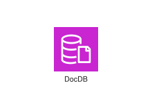
</div>
</div>

{{#endtab}}
{{#tab name="Code"}}

```xml
{{#include ../samples/icons/Architecture-Service-Icons/arch-amazon-documentdb-16-6ff9f654.xal}}
```

{{#endtab}}
{{#endtabs}}

<div class="xal-ref-tag"><code>&lt;item id=&#34;122&#34; /&gt;</code></div>

</div>
<div class="xal-ref-card">
<div class="xal-ref-title">Arch_Amazon-DynamoDB_16</div>

{{#tabs name="svg-ref-0547"}}
{{#tab name="Preview"}}
<div class="xal-ref-preview">
<div>
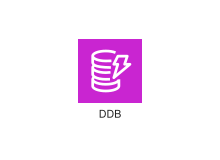
</div>
</div>

{{#endtab}}
{{#tab name="Code"}}

```xml
{{#include ../samples/icons/Architecture-Service-Icons/arch-amazon-dynamodb-16-72d23472.xal}}
```

{{#endtab}}
{{#endtabs}}

<div class="xal-ref-tag"><code>&lt;item id=&#34;123&#34; /&gt;</code></div>

</div>
<div class="xal-ref-card">
<div class="xal-ref-title">Arch_Amazon-ElastiCache_16</div>

{{#tabs name="svg-ref-0548"}}
{{#tab name="Preview"}}
<div class="xal-ref-preview">
<div>
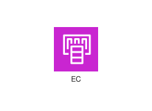
</div>
</div>

{{#endtab}}
{{#tab name="Code"}}

```xml
{{#include ../samples/icons/Architecture-Service-Icons/arch-amazon-elasticache-16-2b741137.xal}}
```

{{#endtab}}
{{#endtabs}}

<div class="xal-ref-tag"><code>&lt;item id=&#34;124&#34; /&gt;</code></div>

</div>
<div class="xal-ref-card">
<div class="xal-ref-title">Arch_Amazon-Keyspaces_16</div>

{{#tabs name="svg-ref-0549"}}
{{#tab name="Preview"}}
<div class="xal-ref-preview">
<div>
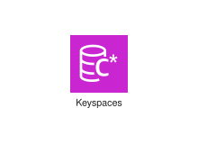
</div>
</div>

{{#endtab}}
{{#tab name="Code"}}

```xml
{{#include ../samples/icons/Architecture-Service-Icons/arch-amazon-keyspaces-16-3894a7f7.xal}}
```

{{#endtab}}
{{#endtabs}}

<div class="xal-ref-tag"><code>&lt;item id=&#34;125&#34; /&gt;</code></div>

</div>
<div class="xal-ref-card">
<div class="xal-ref-title">Arch_Amazon-MemoryDB_16</div>

{{#tabs name="svg-ref-0550"}}
{{#tab name="Preview"}}
<div class="xal-ref-preview">
<div>
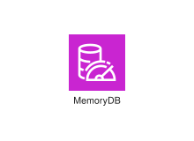
</div>
</div>

{{#endtab}}
{{#tab name="Code"}}

```xml
{{#include ../samples/icons/Architecture-Service-Icons/arch-amazon-memorydb-16-0ba2f02e.xal}}
```

{{#endtab}}
{{#endtabs}}

<div class="xal-ref-tag"><code>&lt;item id=&#34;126&#34; /&gt;</code></div>

</div>
<div class="xal-ref-card">
<div class="xal-ref-title">Arch_Amazon-Neptune_16</div>

{{#tabs name="svg-ref-0551"}}
{{#tab name="Preview"}}
<div class="xal-ref-preview">
<div>
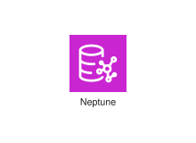
</div>
</div>

{{#endtab}}
{{#tab name="Code"}}

```xml
{{#include ../samples/icons/Architecture-Service-Icons/arch-amazon-neptune-16-6a3cfad1.xal}}
```

{{#endtab}}
{{#endtabs}}

<div class="xal-ref-tag"><code>&lt;item id=&#34;127&#34; /&gt;</code></div>

</div>
<div class="xal-ref-card">
<div class="xal-ref-title">Arch_Amazon-RDS_16</div>

{{#tabs name="svg-ref-0552"}}
{{#tab name="Preview"}}
<div class="xal-ref-preview">
<div>
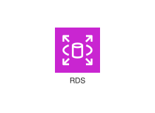
</div>
</div>

{{#endtab}}
{{#tab name="Code"}}

```xml
{{#include ../samples/icons/Architecture-Service-Icons/arch-amazon-rds-16-9798ab88.xal}}
```

{{#endtab}}
{{#endtabs}}

<div class="xal-ref-tag"><code>&lt;item id=&#34;128&#34; /&gt;</code></div>

</div>
<div class="xal-ref-card">
<div class="xal-ref-title">Arch_Amazon-Timestream_16</div>

{{#tabs name="svg-ref-0553"}}
{{#tab name="Preview"}}
<div class="xal-ref-preview">
<div>
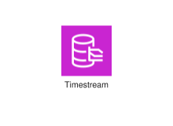
</div>
</div>

{{#endtab}}
{{#tab name="Code"}}

```xml
{{#include ../samples/icons/Architecture-Service-Icons/arch-amazon-timestream-16-fd1422e1.xal}}
```

{{#endtab}}
{{#endtabs}}

<div class="xal-ref-tag"><code>&lt;item id=&#34;129&#34; /&gt;</code></div>

</div>
<div class="xal-ref-card">
<div class="xal-ref-title">Arch_Oracle-Database-at-AWS_16</div>

{{#tabs name="svg-ref-0554"}}
{{#tab name="Preview"}}
<div class="xal-ref-preview">
<div>
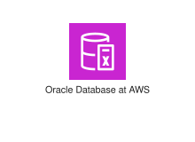
</div>
</div>

{{#endtab}}
{{#tab name="Code"}}

```xml
{{#include ../samples/icons/Architecture-Service-Icons/arch-oracle-database-at-aws-16-871d4128.xal}}
```

{{#endtab}}
{{#endtabs}}

<div class="xal-ref-tag"><code>&lt;item id=&#34;130&#34; /&gt;</code></div>

</div>
<div class="xal-ref-card">
<div class="xal-ref-title">Arch_AWS-Database-Migration-Service_32</div>

{{#tabs name="svg-ref-0555"}}
{{#tab name="Preview"}}
<div class="xal-ref-preview">
<div>
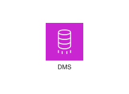
</div>
</div>

{{#endtab}}
{{#tab name="Code"}}

```xml
{{#include ../samples/icons/Architecture-Service-Icons/arch-aws-database-migration-service-32-24ebb7f4.xal}}
```

{{#endtab}}
{{#endtabs}}

<div class="xal-ref-tag"><code>&lt;item id=&#34;109&#34; /&gt;</code></div>

</div>
<div class="xal-ref-card">
<div class="xal-ref-title">Arch_Amazon-Aurora_32</div>

{{#tabs name="svg-ref-0556"}}
{{#tab name="Preview"}}
<div class="xal-ref-preview">
<div>

</div>
</div>

{{#endtab}}
{{#tab name="Code"}}

```xml
{{#include ../samples/icons/Architecture-Service-Icons/arch-amazon-aurora-32-221a1f94.xal}}
```

{{#endtab}}
{{#endtabs}}

<div class="xal-ref-tag"><code>&lt;item id=&#34;110&#34; /&gt;</code></div>

</div>
<div class="xal-ref-card">
<div class="xal-ref-title">Arch_Amazon-DocumentDB_32</div>

{{#tabs name="svg-ref-0557"}}
{{#tab name="Preview"}}
<div class="xal-ref-preview">
<div>
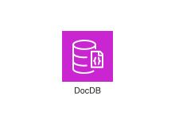
</div>
</div>

{{#endtab}}
{{#tab name="Code"}}

```xml
{{#include ../samples/icons/Architecture-Service-Icons/arch-amazon-documentdb-32-d4eb5fce.xal}}
```

{{#endtab}}
{{#endtabs}}

<div class="xal-ref-tag"><code>&lt;item id=&#34;111&#34; /&gt;</code></div>

</div>
<div class="xal-ref-card">
<div class="xal-ref-title">Arch_Amazon-DynamoDB_32</div>

{{#tabs name="svg-ref-0558"}}
{{#tab name="Preview"}}
<div class="xal-ref-preview">
<div>
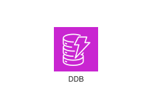
</div>
</div>

{{#endtab}}
{{#tab name="Code"}}

```xml
{{#include ../samples/icons/Architecture-Service-Icons/arch-amazon-dynamodb-32-e5359778.xal}}
```

{{#endtab}}
{{#endtabs}}

<div class="xal-ref-tag"><code>&lt;item id=&#34;112&#34; /&gt;</code></div>

</div>
<div class="xal-ref-card">
<div class="xal-ref-title">Arch_Amazon-ElastiCache_32</div>

{{#tabs name="svg-ref-0559"}}
{{#tab name="Preview"}}
<div class="xal-ref-preview">
<div>

</div>
</div>

{{#endtab}}
{{#tab name="Code"}}

```xml
{{#include ../samples/icons/Architecture-Service-Icons/arch-amazon-elasticache-32-8f532d30.xal}}
```

{{#endtab}}
{{#endtabs}}

<div class="xal-ref-tag"><code>&lt;item id=&#34;113&#34; /&gt;</code></div>

</div>
<div class="xal-ref-card">
<div class="xal-ref-title">Arch_Amazon-Keyspaces_32</div>

{{#tabs name="svg-ref-0560"}}
{{#tab name="Preview"}}
<div class="xal-ref-preview">
<div>
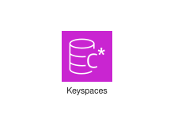
</div>
</div>

{{#endtab}}
{{#tab name="Code"}}

```xml
{{#include ../samples/icons/Architecture-Service-Icons/arch-amazon-keyspaces-32-6c90fdbe.xal}}
```

{{#endtab}}
{{#endtabs}}

<div class="xal-ref-tag"><code>&lt;item id=&#34;114&#34; /&gt;</code></div>

</div>
<div class="xal-ref-card">
<div class="xal-ref-title">Arch_Amazon-MemoryDB_32</div>

{{#tabs name="svg-ref-0561"}}
{{#tab name="Preview"}}
<div class="xal-ref-preview">
<div>

</div>
</div>

{{#endtab}}
{{#tab name="Code"}}

```xml
{{#include ../samples/icons/Architecture-Service-Icons/arch-amazon-memorydb-32-9c455324.xal}}
```

{{#endtab}}
{{#endtabs}}

<div class="xal-ref-tag"><code>&lt;item id=&#34;115&#34; /&gt;</code></div>

</div>
<div class="xal-ref-card">
<div class="xal-ref-title">Arch_Amazon-Neptune_32</div>

{{#tabs name="svg-ref-0562"}}
{{#tab name="Preview"}}
<div class="xal-ref-preview">
<div>
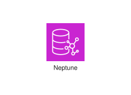
</div>
</div>

{{#endtab}}
{{#tab name="Code"}}

```xml
{{#include ../samples/icons/Architecture-Service-Icons/arch-amazon-neptune-32-12acbb26.xal}}
```

{{#endtab}}
{{#endtabs}}

<div class="xal-ref-tag"><code>&lt;item id=&#34;116&#34; /&gt;</code></div>

</div>
<div class="xal-ref-card">
<div class="xal-ref-title">Arch_Amazon-RDS_32</div>

{{#tabs name="svg-ref-0563"}}
{{#tab name="Preview"}}
<div class="xal-ref-preview">
<div>

</div>
</div>

{{#endtab}}
{{#tab name="Code"}}

```xml
{{#include ../samples/icons/Architecture-Service-Icons/arch-amazon-rds-32-d6b01441.xal}}
```

{{#endtab}}
{{#endtabs}}

<div class="xal-ref-tag"><code>&lt;item id=&#34;117&#34; /&gt;</code></div>

</div>
<div class="xal-ref-card">
<div class="xal-ref-title">Arch_Amazon-Timestream_32</div>

{{#tabs name="svg-ref-0564"}}
{{#tab name="Preview"}}
<div class="xal-ref-preview">
<div>
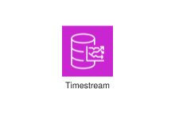
</div>
</div>

{{#endtab}}
{{#tab name="Code"}}

```xml
{{#include ../samples/icons/Architecture-Service-Icons/arch-amazon-timestream-32-46068b7b.xal}}
```

{{#endtab}}
{{#endtabs}}

<div class="xal-ref-tag"><code>&lt;item id=&#34;118&#34; /&gt;</code></div>

</div>
<div class="xal-ref-card">
<div class="xal-ref-title">Arch_Oracle-Database-at-AWS_32</div>

{{#tabs name="svg-ref-0565"}}
{{#tab name="Preview"}}
<div class="xal-ref-preview">
<div>
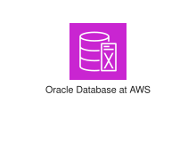
</div>
</div>

{{#endtab}}
{{#tab name="Code"}}

```xml
{{#include ../samples/icons/Architecture-Service-Icons/arch-oracle-database-at-aws-32-dd94360b.xal}}
```

{{#endtab}}
{{#endtabs}}

<div class="xal-ref-tag"><code>&lt;item id=&#34;119&#34; /&gt;</code></div>

</div>
<div class="xal-ref-card">
<div class="xal-ref-title">Arch_AWS-Database-Migration-Service_48</div>

{{#tabs name="svg-ref-0566"}}
{{#tab name="Preview"}}
<div class="xal-ref-preview">
<div>
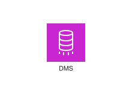
</div>
</div>

{{#endtab}}
{{#tab name="Code"}}

```xml
{{#include ../samples/icons/Architecture-Service-Icons/arch-aws-database-migration-service-48-713eff1e.xal}}
```

{{#endtab}}
{{#endtabs}}

<div class="xal-ref-tag"><code>&lt;item id=&#34;142&#34; /&gt;</code></div>

</div>
<div class="xal-ref-card">
<div class="xal-ref-title">Arch_Amazon-Aurora_48</div>

{{#tabs name="svg-ref-0567"}}
{{#tab name="Preview"}}
<div class="xal-ref-preview">
<div>
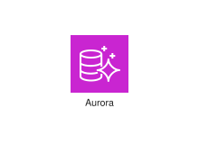
</div>
</div>

{{#endtab}}
{{#tab name="Code"}}

```xml
{{#include ../samples/icons/Architecture-Service-Icons/arch-amazon-aurora-48-6e3c24d6.xal}}
```

{{#endtab}}
{{#endtabs}}

<div class="xal-ref-tag"><code>&lt;item id=&#34;143&#34; /&gt;</code></div>

</div>
<div class="xal-ref-card">
<div class="xal-ref-title">Arch_Amazon-DocumentDB_48</div>

{{#tabs name="svg-ref-0568"}}
{{#tab name="Preview"}}
<div class="xal-ref-preview">
<div>
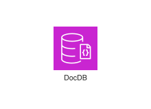
</div>
</div>

{{#endtab}}
{{#tab name="Code"}}

```xml
{{#include ../samples/icons/Architecture-Service-Icons/arch-amazon-documentdb-48-513bf268.xal}}
```

{{#endtab}}
{{#endtabs}}

<div class="xal-ref-tag"><code>&lt;item id=&#34;144&#34; /&gt;</code></div>

</div>
<div class="xal-ref-card">
<div class="xal-ref-title">Arch_Amazon-DynamoDB_48</div>

{{#tabs name="svg-ref-0569"}}
{{#tab name="Preview"}}
<div class="xal-ref-preview">
<div>

</div>
</div>

{{#endtab}}
{{#tab name="Code"}}

```xml
{{#include ../samples/icons/Architecture-Service-Icons/arch-amazon-dynamodb-48-6f7161b3.xal}}
```

{{#endtab}}
{{#endtabs}}

<div class="xal-ref-tag"><code>&lt;item id=&#34;145&#34; /&gt;</code></div>

</div>
<div class="xal-ref-card">
<div class="xal-ref-title">Arch_Amazon-ElastiCache_48</div>

{{#tabs name="svg-ref-0570"}}
{{#tab name="Preview"}}
<div class="xal-ref-preview">
<div>
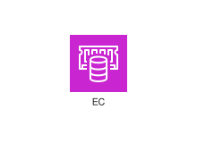
</div>
</div>

{{#endtab}}
{{#tab name="Code"}}

```xml
{{#include ../samples/icons/Architecture-Service-Icons/arch-amazon-elasticache-48-83eaceb1.xal}}
```

{{#endtab}}
{{#endtabs}}

<div class="xal-ref-tag"><code>&lt;item id=&#34;146&#34; /&gt;</code></div>

</div>
<div class="xal-ref-card">
<div class="xal-ref-title">Arch_Amazon-Keyspaces_48</div>

{{#tabs name="svg-ref-0571"}}
{{#tab name="Preview"}}
<div class="xal-ref-preview">
<div>

</div>
</div>

{{#endtab}}
{{#tab name="Code"}}

```xml
{{#include ../samples/icons/Architecture-Service-Icons/arch-amazon-keyspaces-48-53259781.xal}}
```

{{#endtab}}
{{#endtabs}}

<div class="xal-ref-tag"><code>&lt;item id=&#34;147&#34; /&gt;</code></div>

</div>
<div class="xal-ref-card">
<div class="xal-ref-title">Arch_Amazon-MemoryDB_48</div>

{{#tabs name="svg-ref-0572"}}
{{#tab name="Preview"}}
<div class="xal-ref-preview">
<div>

</div>
</div>

{{#endtab}}
{{#tab name="Code"}}

```xml
{{#include ../samples/icons/Architecture-Service-Icons/arch-amazon-memorydb-48-1601a5ef.xal}}
```

{{#endtab}}
{{#endtabs}}

<div class="xal-ref-tag"><code>&lt;item id=&#34;148&#34; /&gt;</code></div>

</div>
<div class="xal-ref-card">
<div class="xal-ref-title">Arch_Amazon-Neptune_48</div>

{{#tabs name="svg-ref-0573"}}
{{#tab name="Preview"}}
<div class="xal-ref-preview">
<div>
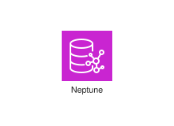
</div>
</div>

{{#endtab}}
{{#tab name="Code"}}

```xml
{{#include ../samples/icons/Architecture-Service-Icons/arch-amazon-neptune-48-b9bb8850.xal}}
```

{{#endtab}}
{{#endtabs}}

<div class="xal-ref-tag"><code>&lt;item id=&#34;149&#34; /&gt;</code></div>

</div>
<div class="xal-ref-card">
<div class="xal-ref-title">Arch_Amazon-RDS_48</div>

{{#tabs name="svg-ref-0574"}}
{{#tab name="Preview"}}
<div class="xal-ref-preview">
<div>
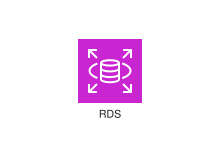
</div>
</div>

{{#endtab}}
{{#tab name="Code"}}

```xml
{{#include ../samples/icons/Architecture-Service-Icons/arch-amazon-rds-48-44633041.xal}}
```

{{#endtab}}
{{#endtabs}}

<div class="xal-ref-tag"><code>&lt;item id=&#34;150&#34; /&gt;</code></div>

</div>
<div class="xal-ref-card">
<div class="xal-ref-title">Arch_Amazon-Timestream_48</div>

{{#tabs name="svg-ref-0575"}}
{{#tab name="Preview"}}
<div class="xal-ref-preview">
<div>
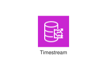
</div>
</div>

{{#endtab}}
{{#tab name="Code"}}

```xml
{{#include ../samples/icons/Architecture-Service-Icons/arch-amazon-timestream-48-c3d626dd.xal}}
```

{{#endtab}}
{{#endtabs}}

<div class="xal-ref-tag"><code>&lt;item id=&#34;151&#34; /&gt;</code></div>

</div>
<div class="xal-ref-card">
<div class="xal-ref-title">Arch_Oracle-Database-at-AWS_48</div>

{{#tabs name="svg-ref-0576"}}
{{#tab name="Preview"}}
<div class="xal-ref-preview">
<div>
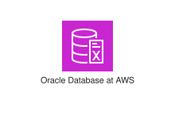
</div>
</div>

{{#endtab}}
{{#tab name="Code"}}

```xml
{{#include ../samples/icons/Architecture-Service-Icons/arch-oracle-database-at-aws-48-3f236988.xal}}
```

{{#endtab}}
{{#endtabs}}

<div class="xal-ref-tag"><code>&lt;item id=&#34;152&#34; /&gt;</code></div>

</div>
<div class="xal-ref-card">
<div class="xal-ref-title">Arch_AWS-Database-Migration-Service_64</div>

{{#tabs name="svg-ref-0577"}}
{{#tab name="Preview"}}
<div class="xal-ref-preview">
<div>
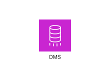
</div>
</div>

{{#endtab}}
{{#tab name="Code"}}

```xml
{{#include ../samples/icons/Architecture-Service-Icons/arch-aws-database-migration-service-64-47cbc114.xal}}
```

{{#endtab}}
{{#endtabs}}

<div class="xal-ref-tag"><code>&lt;item id=&#34;131&#34; /&gt;</code></div>

</div>
<div class="xal-ref-card">
<div class="xal-ref-title">Arch_Amazon-Aurora_64</div>

{{#tabs name="svg-ref-0578"}}
{{#tab name="Preview"}}
<div class="xal-ref-preview">
<div>
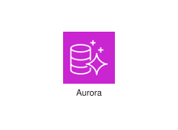
</div>
</div>

{{#endtab}}
{{#tab name="Code"}}

```xml
{{#include ../samples/icons/Architecture-Service-Icons/arch-amazon-aurora-64-46ac2f29.xal}}
```

{{#endtab}}
{{#endtabs}}

<div class="xal-ref-tag"><code>&lt;item id=&#34;132&#34; /&gt;</code></div>

</div>
<div class="xal-ref-card">
<div class="xal-ref-title">Arch_Amazon-DocumentDB_64</div>

{{#tabs name="svg-ref-0579"}}
{{#tab name="Preview"}}
<div class="xal-ref-preview">
<div>
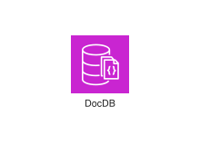
</div>
</div>

{{#endtab}}
{{#tab name="Code"}}

```xml
{{#include ../samples/icons/Architecture-Service-Icons/arch-amazon-documentdb-64-ad6656bb.xal}}
```

{{#endtab}}
{{#endtabs}}

<div class="xal-ref-tag"><code>&lt;item id=&#34;133&#34; /&gt;</code></div>

</div>
<div class="xal-ref-card">
<div class="xal-ref-title">Arch_Amazon-DynamoDB_64</div>

{{#tabs name="svg-ref-0580"}}
{{#tab name="Preview"}}
<div class="xal-ref-preview">
<div>
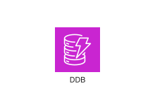
</div>
</div>

{{#endtab}}
{{#tab name="Code"}}

```xml
{{#include ../samples/icons/Architecture-Service-Icons/arch-amazon-dynamodb-64-663a4cda.xal}}
```

{{#endtab}}
{{#endtabs}}

<div class="xal-ref-tag"><code>&lt;item id=&#34;134&#34; /&gt;</code></div>

</div>
<div class="xal-ref-card">
<div class="xal-ref-title">Arch_Amazon-ElastiCache_64</div>

{{#tabs name="svg-ref-0581"}}
{{#tab name="Preview"}}
<div class="xal-ref-preview">
<div>
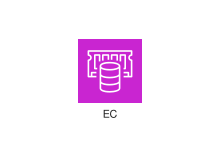
</div>
</div>

{{#endtab}}
{{#tab name="Code"}}

```xml
{{#include ../samples/icons/Architecture-Service-Icons/arch-amazon-elasticache-64-f4a98d23.xal}}
```

{{#endtab}}
{{#endtabs}}

<div class="xal-ref-tag"><code>&lt;item id=&#34;135&#34; /&gt;</code></div>

</div>
<div class="xal-ref-card">
<div class="xal-ref-title">Arch_Amazon-Keyspaces_64</div>

{{#tabs name="svg-ref-0582"}}
{{#tab name="Preview"}}
<div class="xal-ref-preview">
<div>
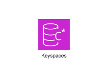
</div>
</div>

{{#endtab}}
{{#tab name="Code"}}

```xml
{{#include ../samples/icons/Architecture-Service-Icons/arch-amazon-keyspaces-64-0f279808.xal}}
```

{{#endtab}}
{{#endtabs}}

<div class="xal-ref-tag"><code>&lt;item id=&#34;136&#34; /&gt;</code></div>

</div>
<div class="xal-ref-card">
<div class="xal-ref-title">Arch_Amazon-MemoryDB_64</div>

{{#tabs name="svg-ref-0583"}}
{{#tab name="Preview"}}
<div class="xal-ref-preview">
<div>
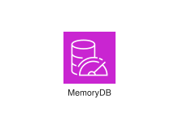
</div>
</div>

{{#endtab}}
{{#tab name="Code"}}

```xml
{{#include ../samples/icons/Architecture-Service-Icons/arch-amazon-memorydb-64-1f4a8886.xal}}
```

{{#endtab}}
{{#endtabs}}

<div class="xal-ref-tag"><code>&lt;item id=&#34;137&#34; /&gt;</code></div>

</div>
<div class="xal-ref-card">
<div class="xal-ref-title">Arch_Amazon-Neptune_64</div>

{{#tabs name="svg-ref-0584"}}
{{#tab name="Preview"}}
<div class="xal-ref-preview">
<div>
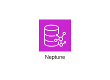
</div>
</div>

{{#endtab}}
{{#tab name="Code"}}

```xml
{{#include ../samples/icons/Architecture-Service-Icons/arch-amazon-neptune-64-fcf46a8e.xal}}
```

{{#endtab}}
{{#endtabs}}

<div class="xal-ref-tag"><code>&lt;item id=&#34;138&#34; /&gt;</code></div>

</div>
<div class="xal-ref-card">
<div class="xal-ref-title">Arch_Amazon-RDS_64</div>

{{#tabs name="svg-ref-0585"}}
{{#tab name="Preview"}}
<div class="xal-ref-preview">
<div>
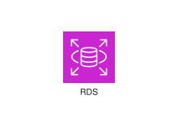
</div>
</div>

{{#endtab}}
{{#tab name="Code"}}

```xml
{{#include ../samples/icons/Architecture-Service-Icons/arch-amazon-rds-64-e736f8f7.xal}}
```

{{#endtab}}
{{#endtabs}}

<div class="xal-ref-tag"><code>&lt;item id=&#34;139&#34; /&gt;</code></div>

</div>
<div class="xal-ref-card">
<div class="xal-ref-title">Arch_Amazon-Timestream_64</div>

{{#tabs name="svg-ref-0586"}}
{{#tab name="Preview"}}
<div class="xal-ref-preview">
<div>
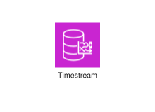
</div>
</div>

{{#endtab}}
{{#tab name="Code"}}

```xml
{{#include ../samples/icons/Architecture-Service-Icons/arch-amazon-timestream-64-3f8b820e.xal}}
```

{{#endtab}}
{{#endtabs}}

<div class="xal-ref-tag"><code>&lt;item id=&#34;140&#34; /&gt;</code></div>

</div>
<div class="xal-ref-card">
<div class="xal-ref-title">Arch_Oracle-Database-at-AWS_64</div>

{{#tabs name="svg-ref-0587"}}
{{#tab name="Preview"}}
<div class="xal-ref-preview">
<div>
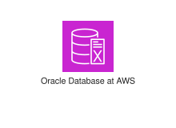
</div>
</div>

{{#endtab}}
{{#tab name="Code"}}

```xml
{{#include ../samples/icons/Architecture-Service-Icons/arch-oracle-database-at-aws-64-257ae444.xal}}
```

{{#endtab}}
{{#endtabs}}

<div class="xal-ref-tag"><code>&lt;item id=&#34;141&#34; /&gt;</code></div>

</div>
<div class="xal-ref-card">
<div class="xal-ref-title">Arch_AWS-Cloud-Control-API_16</div>

{{#tabs name="svg-ref-0588"}}
{{#tab name="Preview"}}
<div class="xal-ref-preview">
<div>
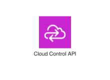
</div>
</div>

{{#endtab}}
{{#tab name="Code"}}

```xml
{{#include ../samples/icons/Architecture-Service-Icons/arch-aws-cloud-control-api-16-b455ceab.xal}}
```

{{#endtab}}
{{#endtabs}}

<div class="xal-ref-tag"><code>&lt;item id=&#34;449&#34; /&gt;</code></div>

</div>
<div class="xal-ref-card">
<div class="xal-ref-title">Arch_AWS-Cloud-Development-Kit_16</div>

{{#tabs name="svg-ref-0589"}}
{{#tab name="Preview"}}
<div class="xal-ref-preview">
<div>

</div>
</div>

{{#endtab}}
{{#tab name="Code"}}

```xml
{{#include ../samples/icons/Architecture-Service-Icons/arch-aws-cloud-development-kit-16-a4de1956.xal}}
```

{{#endtab}}
{{#endtabs}}

<div class="xal-ref-tag"><code>&lt;item id=&#34;450&#34; /&gt;</code></div>

</div>
<div class="xal-ref-card">
<div class="xal-ref-title">Arch_AWS-Cloud9_16</div>

{{#tabs name="svg-ref-0590"}}
{{#tab name="Preview"}}
<div class="xal-ref-preview">
<div>
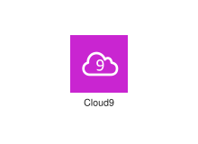
</div>
</div>

{{#endtab}}
{{#tab name="Code"}}

```xml
{{#include ../samples/icons/Architecture-Service-Icons/arch-aws-cloud9-16-aadf178b.xal}}
```

{{#endtab}}
{{#endtabs}}

<div class="xal-ref-tag"><code>&lt;item id=&#34;451&#34; /&gt;</code></div>

</div>
<div class="xal-ref-card">
<div class="xal-ref-title">Arch_AWS-CloudShell_16</div>

{{#tabs name="svg-ref-0591"}}
{{#tab name="Preview"}}
<div class="xal-ref-preview">
<div>

</div>
</div>

{{#endtab}}
{{#tab name="Code"}}

```xml
{{#include ../samples/icons/Architecture-Service-Icons/arch-aws-cloudshell-16-6e039181.xal}}
```

{{#endtab}}
{{#endtabs}}

<div class="xal-ref-tag"><code>&lt;item id=&#34;452&#34; /&gt;</code></div>

</div>
<div class="xal-ref-card">
<div class="xal-ref-title">Arch_AWS-CodeArtifact_16</div>

{{#tabs name="svg-ref-0592"}}
{{#tab name="Preview"}}
<div class="xal-ref-preview">
<div>
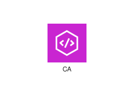
</div>
</div>

{{#endtab}}
{{#tab name="Code"}}

```xml
{{#include ../samples/icons/Architecture-Service-Icons/arch-aws-codeartifact-16-e04d8e89.xal}}
```

{{#endtab}}
{{#endtabs}}

<div class="xal-ref-tag"><code>&lt;item id=&#34;453&#34; /&gt;</code></div>

</div>
<div class="xal-ref-card">
<div class="xal-ref-title">Arch_AWS-CodeBuild_16</div>

{{#tabs name="svg-ref-0593"}}
{{#tab name="Preview"}}
<div class="xal-ref-preview">
<div>
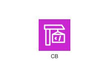
</div>
</div>

{{#endtab}}
{{#tab name="Code"}}

```xml
{{#include ../samples/icons/Architecture-Service-Icons/arch-aws-codebuild-16-7b450715.xal}}
```

{{#endtab}}
{{#endtabs}}

<div class="xal-ref-tag"><code>&lt;item id=&#34;454&#34; /&gt;</code></div>

</div>
<div class="xal-ref-card">
<div class="xal-ref-title">Arch_AWS-CodeCommit_16</div>

{{#tabs name="svg-ref-0594"}}
{{#tab name="Preview"}}
<div class="xal-ref-preview">
<div>

</div>
</div>

{{#endtab}}
{{#tab name="Code"}}

```xml
{{#include ../samples/icons/Architecture-Service-Icons/arch-aws-codecommit-16-a7ea0aae.xal}}
```

{{#endtab}}
{{#endtabs}}

<div class="xal-ref-tag"><code>&lt;item id=&#34;455&#34; /&gt;</code></div>

</div>
<div class="xal-ref-card">
<div class="xal-ref-title">Arch_AWS-CodeDeploy_16</div>

{{#tabs name="svg-ref-0595"}}
{{#tab name="Preview"}}
<div class="xal-ref-preview">
<div>

</div>
</div>

{{#endtab}}
{{#tab name="Code"}}

```xml
{{#include ../samples/icons/Architecture-Service-Icons/arch-aws-codedeploy-16-52116a3e.xal}}
```

{{#endtab}}
{{#endtabs}}

<div class="xal-ref-tag"><code>&lt;item id=&#34;456&#34; /&gt;</code></div>

</div>
<div class="xal-ref-card">
<div class="xal-ref-title">Arch_AWS-CodePipeline_16</div>

{{#tabs name="svg-ref-0596"}}
{{#tab name="Preview"}}
<div class="xal-ref-preview">
<div>
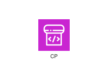
</div>
</div>

{{#endtab}}
{{#tab name="Code"}}

```xml
{{#include ../samples/icons/Architecture-Service-Icons/arch-aws-codepipeline-16-41cb242a.xal}}
```

{{#endtab}}
{{#endtabs}}

<div class="xal-ref-tag"><code>&lt;item id=&#34;457&#34; /&gt;</code></div>

</div>
<div class="xal-ref-card">
<div class="xal-ref-title">Arch_AWS-Command-Line-Interface_16</div>

{{#tabs name="svg-ref-0597"}}
{{#tab name="Preview"}}
<div class="xal-ref-preview">
<div>

</div>
</div>

{{#endtab}}
{{#tab name="Code"}}

```xml
{{#include ../samples/icons/Architecture-Service-Icons/arch-aws-command-line-interface-16-f476aaf6.xal}}
```

{{#endtab}}
{{#endtabs}}

<div class="xal-ref-tag"><code>&lt;item id=&#34;458&#34; /&gt;</code></div>

</div>
<div class="xal-ref-card">
<div class="xal-ref-title">Arch_AWS-Fault-Injection-Service_16</div>

{{#tabs name="svg-ref-0598"}}
{{#tab name="Preview"}}
<div class="xal-ref-preview">
<div>
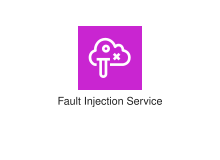
</div>
</div>

{{#endtab}}
{{#tab name="Code"}}

```xml
{{#include ../samples/icons/Architecture-Service-Icons/arch-aws-fault-injection-service-16-66327777.xal}}
```

{{#endtab}}
{{#endtabs}}

<div class="xal-ref-tag"><code>&lt;item id=&#34;459&#34; /&gt;</code></div>

</div>
<div class="xal-ref-card">
<div class="xal-ref-title">Arch_AWS-Infrastructure-Composer_16</div>

{{#tabs name="svg-ref-0599"}}
{{#tab name="Preview"}}
<div class="xal-ref-preview">
<div>

</div>
</div>

{{#endtab}}
{{#tab name="Code"}}

```xml
{{#include ../samples/icons/Architecture-Service-Icons/arch-aws-infrastructure-composer-16-3c1cf755.xal}}
```

{{#endtab}}
{{#endtabs}}

<div class="xal-ref-tag"><code>&lt;item id=&#34;460&#34; /&gt;</code></div>

</div>
<div class="xal-ref-card">
<div class="xal-ref-title">Arch_AWS-Tools-and-SDKs_16</div>

{{#tabs name="svg-ref-0600"}}
{{#tab name="Preview"}}
<div class="xal-ref-preview">
<div>
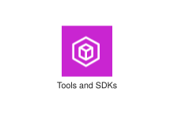
</div>
</div>

{{#endtab}}
{{#tab name="Code"}}

```xml
{{#include ../samples/icons/Architecture-Service-Icons/arch-aws-tools-and-sdks-16-249a4f20.xal}}
```

{{#endtab}}
{{#endtabs}}

<div class="xal-ref-tag"><code>&lt;item id=&#34;461&#34; /&gt;</code></div>

</div>
<div class="xal-ref-card">
<div class="xal-ref-title">Arch_AWS-X-Ray_16</div>

{{#tabs name="svg-ref-0601"}}
{{#tab name="Preview"}}
<div class="xal-ref-preview">
<div>
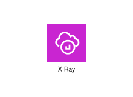
</div>
</div>

{{#endtab}}
{{#tab name="Code"}}

```xml
{{#include ../samples/icons/Architecture-Service-Icons/arch-aws-x-ray-16-b554c83c.xal}}
```

{{#endtab}}
{{#endtabs}}

<div class="xal-ref-tag"><code>&lt;item id=&#34;462&#34; /&gt;</code></div>

</div>
<div class="xal-ref-card">
<div class="xal-ref-title">Arch_Amazon-CodeCatalyst_16</div>

{{#tabs name="svg-ref-0602"}}
{{#tab name="Preview"}}
<div class="xal-ref-preview">
<div>
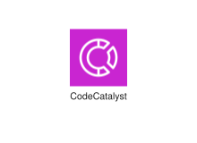
</div>
</div>

{{#endtab}}
{{#tab name="Code"}}

```xml
{{#include ../samples/icons/Architecture-Service-Icons/arch-amazon-codecatalyst-16-b23b413e.xal}}
```

{{#endtab}}
{{#endtabs}}

<div class="xal-ref-tag"><code>&lt;item id=&#34;463&#34; /&gt;</code></div>

</div>
<div class="xal-ref-card">
<div class="xal-ref-title">Arch_Amazon-Corretto_16</div>

{{#tabs name="svg-ref-0603"}}
{{#tab name="Preview"}}
<div class="xal-ref-preview">
<div>
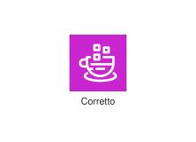
</div>
</div>

{{#endtab}}
{{#tab name="Code"}}

```xml
{{#include ../samples/icons/Architecture-Service-Icons/arch-amazon-corretto-16-eba5812d.xal}}
```

{{#endtab}}
{{#endtabs}}

<div class="xal-ref-tag"><code>&lt;item id=&#34;464&#34; /&gt;</code></div>

</div>
<div class="xal-ref-card">
<div class="xal-ref-title">Arch_AWS-Cloud-Control-API_32</div>

{{#tabs name="svg-ref-0604"}}
{{#tab name="Preview"}}
<div class="xal-ref-preview">
<div>

</div>
</div>

{{#endtab}}
{{#tab name="Code"}}

```xml
{{#include ../samples/icons/Architecture-Service-Icons/arch-aws-cloud-control-api-32-751735a9.xal}}
```

{{#endtab}}
{{#endtabs}}

<div class="xal-ref-tag"><code>&lt;item id=&#34;433&#34; /&gt;</code></div>

</div>
<div class="xal-ref-card">
<div class="xal-ref-title">Arch_AWS-Cloud-Development-Kit_32</div>

{{#tabs name="svg-ref-0605"}}
{{#tab name="Preview"}}
<div class="xal-ref-preview">
<div>

</div>
</div>

{{#endtab}}
{{#tab name="Code"}}

```xml
{{#include ../samples/icons/Architecture-Service-Icons/arch-aws-cloud-development-kit-32-783b14b7.xal}}
```

{{#endtab}}
{{#endtabs}}

<div class="xal-ref-tag"><code>&lt;item id=&#34;434&#34; /&gt;</code></div>

</div>
<div class="xal-ref-card">
<div class="xal-ref-title">Arch_AWS-Cloud9_32</div>

{{#tabs name="svg-ref-0606"}}
{{#tab name="Preview"}}
<div class="xal-ref-preview">
<div>
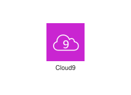
</div>
</div>

{{#endtab}}
{{#tab name="Code"}}

```xml
{{#include ../samples/icons/Architecture-Service-Icons/arch-aws-cloud9-32-ebf7a842.xal}}
```

{{#endtab}}
{{#endtabs}}

<div class="xal-ref-tag"><code>&lt;item id=&#34;435&#34; /&gt;</code></div>

</div>
<div class="xal-ref-card">
<div class="xal-ref-title">Arch_AWS-CloudShell_32</div>

{{#tabs name="svg-ref-0607"}}
{{#tab name="Preview"}}
<div class="xal-ref-preview">
<div>

</div>
</div>

{{#endtab}}
{{#tab name="Code"}}

```xml
{{#include ../samples/icons/Architecture-Service-Icons/arch-aws-cloudshell-32-1693d076.xal}}
```

{{#endtab}}
{{#endtabs}}

<div class="xal-ref-tag"><code>&lt;item id=&#34;436&#34; /&gt;</code></div>

</div>
<div class="xal-ref-card">
<div class="xal-ref-title">Arch_AWS-CodeArtifact_32</div>

{{#tabs name="svg-ref-0608"}}
{{#tab name="Preview"}}
<div class="xal-ref-preview">
<div>
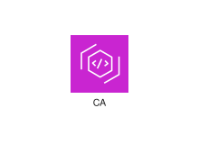
</div>
</div>

{{#endtab}}
{{#tab name="Code"}}

```xml
{{#include ../samples/icons/Architecture-Service-Icons/arch-aws-codeartifact-32-b449d4c0.xal}}
```

{{#endtab}}
{{#endtabs}}

<div class="xal-ref-tag"><code>&lt;item id=&#34;437&#34; /&gt;</code></div>

</div>
<div class="xal-ref-card">
<div class="xal-ref-title">Arch_AWS-CodeBuild_32</div>

{{#tabs name="svg-ref-0609"}}
{{#tab name="Preview"}}
<div class="xal-ref-preview">
<div>
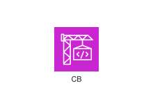
</div>
</div>

{{#endtab}}
{{#tab name="Code"}}

```xml
{{#include ../samples/icons/Architecture-Service-Icons/arch-aws-codebuild-32-a12791a1.xal}}
```

{{#endtab}}
{{#endtabs}}

<div class="xal-ref-tag"><code>&lt;item id=&#34;438&#34; /&gt;</code></div>

</div>
<div class="xal-ref-card">
<div class="xal-ref-title">Arch_AWS-CodeCommit_32</div>

{{#tabs name="svg-ref-0610"}}
{{#tab name="Preview"}}
<div class="xal-ref-preview">
<div>

</div>
</div>

{{#endtab}}
{{#tab name="Code"}}

```xml
{{#include ../samples/icons/Architecture-Service-Icons/arch-aws-codecommit-32-df7a4b59.xal}}
```

{{#endtab}}
{{#endtabs}}

<div class="xal-ref-tag"><code>&lt;item id=&#34;439&#34; /&gt;</code></div>

</div>
<div class="xal-ref-card">
<div class="xal-ref-title">Arch_AWS-CodeDeploy_32</div>

{{#tabs name="svg-ref-0611"}}
{{#tab name="Preview"}}
<div class="xal-ref-preview">
<div>

</div>
</div>

{{#endtab}}
{{#tab name="Code"}}

```xml
{{#include ../samples/icons/Architecture-Service-Icons/arch-aws-codedeploy-32-2a812bc9.xal}}
```

{{#endtab}}
{{#endtabs}}

<div class="xal-ref-tag"><code>&lt;item id=&#34;440&#34; /&gt;</code></div>

</div>
<div class="xal-ref-card">
<div class="xal-ref-title">Arch_AWS-CodePipeline_32</div>

{{#tabs name="svg-ref-0612"}}
{{#tab name="Preview"}}
<div class="xal-ref-preview">
<div>

</div>
</div>

{{#endtab}}
{{#tab name="Code"}}

```xml
{{#include ../samples/icons/Architecture-Service-Icons/arch-aws-codepipeline-32-15cf7e63.xal}}
```

{{#endtab}}
{{#endtabs}}

<div class="xal-ref-tag"><code>&lt;item id=&#34;441&#34; /&gt;</code></div>

</div>
<div class="xal-ref-card">
<div class="xal-ref-title">Arch_AWS-Command-Line-Interface_32</div>

{{#tabs name="svg-ref-0613"}}
{{#tab name="Preview"}}
<div class="xal-ref-preview">
<div>

</div>
</div>

{{#endtab}}
{{#tab name="Code"}}

```xml
{{#include ../samples/icons/Architecture-Service-Icons/arch-aws-command-line-interface-32-97e1c9e1.xal}}
```

{{#endtab}}
{{#endtabs}}

<div class="xal-ref-tag"><code>&lt;item id=&#34;442&#34; /&gt;</code></div>

</div>
<div class="xal-ref-card">
<div class="xal-ref-title">Arch_AWS-Fault-Injection-Service_32</div>

{{#tabs name="svg-ref-0614"}}
{{#tab name="Preview"}}
<div class="xal-ref-preview">
<div>

</div>
</div>

{{#endtab}}
{{#tab name="Code"}}

```xml
{{#include ../samples/icons/Architecture-Service-Icons/arch-aws-fault-injection-service-32-51c43127.xal}}
```

{{#endtab}}
{{#endtabs}}

<div class="xal-ref-tag"><code>&lt;item id=&#34;443&#34; /&gt;</code></div>

</div>
<div class="xal-ref-card">
<div class="xal-ref-title">Arch_AWS-Infrastructure-Composer_32</div>

{{#tabs name="svg-ref-0615"}}
{{#tab name="Preview"}}
<div class="xal-ref-preview">
<div>

</div>
</div>

{{#endtab}}
{{#tab name="Code"}}

```xml
{{#include ../samples/icons/Architecture-Service-Icons/arch-aws-infrastructure-composer-32-0beab105.xal}}
```

{{#endtab}}
{{#endtabs}}

<div class="xal-ref-tag"><code>&lt;item id=&#34;444&#34; /&gt;</code></div>

</div>
<div class="xal-ref-card">
<div class="xal-ref-title">Arch_AWS-Tools-and-SDKs_32</div>

{{#tabs name="svg-ref-0616"}}
{{#tab name="Preview"}}
<div class="xal-ref-preview">
<div>

</div>
</div>

{{#endtab}}
{{#tab name="Code"}}

```xml
{{#include ../samples/icons/Architecture-Service-Icons/arch-aws-tools-and-sdks-32-80bd7327.xal}}
```

{{#endtab}}
{{#endtabs}}

<div class="xal-ref-tag"><code>&lt;item id=&#34;445&#34; /&gt;</code></div>

</div>
<div class="xal-ref-card">
<div class="xal-ref-title">Arch_AWS-X-Ray_32</div>

{{#tabs name="svg-ref-0617"}}
{{#tab name="Preview"}}
<div class="xal-ref-preview">
<div>

</div>
</div>

{{#endtab}}
{{#tab name="Code"}}

```xml
{{#include ../samples/icons/Architecture-Service-Icons/arch-aws-x-ray-32-d47ba26b.xal}}
```

{{#endtab}}
{{#endtabs}}

<div class="xal-ref-tag"><code>&lt;item id=&#34;446&#34; /&gt;</code></div>

</div>
<div class="xal-ref-card">
<div class="xal-ref-title">Arch_Amazon-CodeCatalyst_32</div>

{{#tabs name="svg-ref-0618"}}
{{#tab name="Preview"}}
<div class="xal-ref-preview">
<div>

</div>
</div>

{{#endtab}}
{{#tab name="Code"}}

```xml
{{#include ../samples/icons/Architecture-Service-Icons/arch-amazon-codecatalyst-32-98bda755.xal}}
```

{{#endtab}}
{{#endtabs}}

<div class="xal-ref-tag"><code>&lt;item id=&#34;447&#34; /&gt;</code></div>

</div>
<div class="xal-ref-card">
<div class="xal-ref-title">Arch_Amazon-Corretto_32</div>

{{#tabs name="svg-ref-0619"}}
{{#tab name="Preview"}}
<div class="xal-ref-preview">
<div>

</div>
</div>

{{#endtab}}
{{#tab name="Code"}}

```xml
{{#include ../samples/icons/Architecture-Service-Icons/arch-amazon-corretto-32-7c422227.xal}}
```

{{#endtab}}
{{#endtabs}}

<div class="xal-ref-tag"><code>&lt;item id=&#34;448&#34; /&gt;</code></div>

</div>
<div class="xal-ref-card">
<div class="xal-ref-title">Arch_AWS-Cloud-Control-API_48</div>

{{#tabs name="svg-ref-0620"}}
{{#tab name="Preview"}}
<div class="xal-ref-preview">
<div>

</div>
</div>

{{#endtab}}
{{#tab name="Code"}}

```xml
{{#include ../samples/icons/Architecture-Service-Icons/arch-aws-cloud-control-api-48-f01ab60d.xal}}
```

{{#endtab}}
{{#endtabs}}

<div class="xal-ref-tag"><code>&lt;item id=&#34;481&#34; /&gt;</code></div>

</div>
<div class="xal-ref-card">
<div class="xal-ref-title">Arch_AWS-Cloud-Development-Kit_48</div>

{{#tabs name="svg-ref-0621"}}
{{#tab name="Preview"}}
<div class="xal-ref-preview">
<div>

</div>
</div>

{{#endtab}}
{{#tab name="Code"}}

```xml
{{#include ../samples/icons/Architecture-Service-Icons/arch-aws-cloud-development-kit-48-517a8f20.xal}}
```

{{#endtab}}
{{#endtabs}}

<div class="xal-ref-tag"><code>&lt;item id=&#34;482&#34; /&gt;</code></div>

</div>
<div class="xal-ref-card">
<div class="xal-ref-title">Arch_AWS-Cloud9_48</div>

{{#tabs name="svg-ref-0622"}}
{{#tab name="Preview"}}
<div class="xal-ref-preview">
<div>

</div>
</div>

{{#endtab}}
{{#tab name="Code"}}

```xml
{{#include ../samples/icons/Architecture-Service-Icons/arch-aws-cloud9-48-79248c42.xal}}
```

{{#endtab}}
{{#endtabs}}

<div class="xal-ref-tag"><code>&lt;item id=&#34;483&#34; /&gt;</code></div>

</div>
<div class="xal-ref-card">
<div class="xal-ref-title">Arch_AWS-CloudShell_48</div>

{{#tabs name="svg-ref-0623"}}
{{#tab name="Preview"}}
<div class="xal-ref-preview">
<div>

</div>
</div>

{{#endtab}}
{{#tab name="Code"}}

```xml
{{#include ../samples/icons/Architecture-Service-Icons/arch-aws-cloudshell-48-bd84e300.xal}}
```

{{#endtab}}
{{#endtabs}}

<div class="xal-ref-tag"><code>&lt;item id=&#34;484&#34; /&gt;</code></div>

</div>
<div class="xal-ref-card">
<div class="xal-ref-title">Arch_AWS-CodeArtifact_48</div>

{{#tabs name="svg-ref-0624"}}
{{#tab name="Preview"}}
<div class="xal-ref-preview">
<div>

</div>
</div>

{{#endtab}}
{{#tab name="Code"}}

```xml
{{#include ../samples/icons/Architecture-Service-Icons/arch-aws-codeartifact-48-8bfcbeff.xal}}
```

{{#endtab}}
{{#endtabs}}

<div class="xal-ref-tag"><code>&lt;item id=&#34;485&#34; /&gt;</code></div>

</div>
<div class="xal-ref-card">
<div class="xal-ref-title">Arch_AWS-CodeBuild_48</div>

{{#tabs name="svg-ref-0625"}}
{{#tab name="Preview"}}
<div class="xal-ref-preview">
<div>

</div>
</div>

{{#endtab}}
{{#tab name="Code"}}

```xml
{{#include ../samples/icons/Architecture-Service-Icons/arch-aws-codebuild-48-ed01aae3.xal}}
```

{{#endtab}}
{{#endtabs}}

<div class="xal-ref-tag"><code>&lt;item id=&#34;486&#34; /&gt;</code></div>

</div>
<div class="xal-ref-card">
<div class="xal-ref-title">Arch_AWS-CodeCommit_48</div>

{{#tabs name="svg-ref-0626"}}
{{#tab name="Preview"}}
<div class="xal-ref-preview">
<div>

</div>
</div>

{{#endtab}}
{{#tab name="Code"}}

```xml
{{#include ../samples/icons/Architecture-Service-Icons/arch-aws-codecommit-48-746d782f.xal}}
```

{{#endtab}}
{{#endtabs}}

<div class="xal-ref-tag"><code>&lt;item id=&#34;487&#34; /&gt;</code></div>

</div>
<div class="xal-ref-card">
<div class="xal-ref-title">Arch_AWS-CodeDeploy_48</div>

{{#tabs name="svg-ref-0627"}}
{{#tab name="Preview"}}
<div class="xal-ref-preview">
<div>

</div>
</div>

{{#endtab}}
{{#tab name="Code"}}

```xml
{{#include ../samples/icons/Architecture-Service-Icons/arch-aws-codedeploy-48-819618bf.xal}}
```

{{#endtab}}
{{#endtabs}}

<div class="xal-ref-tag"><code>&lt;item id=&#34;488&#34; /&gt;</code></div>

</div>
<div class="xal-ref-card">
<div class="xal-ref-title">Arch_AWS-CodePipeline_48</div>

{{#tabs name="svg-ref-0628"}}
{{#tab name="Preview"}}
<div class="xal-ref-preview">
<div>

</div>
</div>

{{#endtab}}
{{#tab name="Code"}}

```xml
{{#include ../samples/icons/Architecture-Service-Icons/arch-aws-codepipeline-48-2a7a145c.xal}}
```

{{#endtab}}
{{#endtabs}}

<div class="xal-ref-tag"><code>&lt;item id=&#34;489&#34; /&gt;</code></div>

</div>
<div class="xal-ref-card">
<div class="xal-ref-title">Arch_AWS-Command-Line-Interface_48</div>

{{#tabs name="svg-ref-0629"}}
{{#tab name="Preview"}}
<div class="xal-ref-preview">
<div>

</div>
</div>

{{#endtab}}
{{#tab name="Code"}}

```xml
{{#include ../samples/icons/Architecture-Service-Icons/arch-aws-command-line-interface-48-ca2abb6c.xal}}
```

{{#endtab}}
{{#endtabs}}

<div class="xal-ref-tag"><code>&lt;item id=&#34;490&#34; /&gt;</code></div>

</div>
</div>
