# Architecture-Service-Icons - Page 8

This page references SVG files under `etc/resources/aws/svg/Architecture-Service-Icons`.
Each card shows the SVG preview first and the XAL tag syntax in the Code tab.
Showing 631-720 of 1236 SVG files.

<style>
.xal-ref-grid{display:grid;grid-template-columns:repeat(3,minmax(0,1fr));gap:1rem;margin:1rem 0 1.5rem}.xal-ref-card{border:1px solid var(--table-border-color);border-radius:8px;overflow:hidden;background:var(--bg);padding:.75rem}.xal-ref-title{font-size:.9rem;font-weight:600;line-height:1.25;margin:0 0 .5rem;overflow-wrap:anywhere}.xal-ref-preview{display:flex;align-items:center;justify-content:center}.xal-ref-preview img{display:block;width:100%;height:auto}.xal-ref-card pre{margin:0;max-height:18rem;overflow:auto;white-space:pre}.xal-ref-card code{font-size:.78em}.xal-ref-tag{margin:.5rem 0 0;color:var(--fg);opacity:.72;overflow:auto;white-space:pre}.xal-ref-tag code{font-size:.72em}@media(max-width:900px){.xal-ref-grid{grid-template-columns:repeat(2,minmax(0,1fr))}}@media(max-width:560px){.xal-ref-grid{grid-template-columns:1fr}}
</style>

[Back to section index](architecture-service-icons.md)

<div class="xal-ref-grid">
<div class="xal-ref-card">
<div class="xal-ref-title">Arch_AWS-Fault-Injection-Service_48</div>

{{#tabs name="svg-ref-0630"}}
{{#tab name="Preview"}}
<div class="xal-ref-preview">
<div>
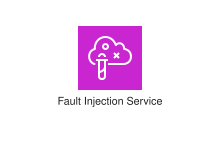
</div>
</div>

{{#endtab}}
{{#tab name="Code"}}

```xml
{{#include ../samples/icons/Architecture-Service-Icons/arch-aws-fault-injection-service-48-f1193039.xal}}
```

{{#endtab}}
{{#endtabs}}

<div class="xal-ref-tag"><code>&lt;item id=&#34;491&#34; /&gt;</code></div>

</div>
<div class="xal-ref-card">
<div class="xal-ref-title">Arch_AWS-Infrastructure-Composer_48</div>

{{#tabs name="svg-ref-0631"}}
{{#tab name="Preview"}}
<div class="xal-ref-preview">
<div>

</div>
</div>

{{#endtab}}
{{#tab name="Code"}}

```xml
{{#include ../samples/icons/Architecture-Service-Icons/arch-aws-infrastructure-composer-48-ab37b01b.xal}}
```

{{#endtab}}
{{#endtabs}}

<div class="xal-ref-tag"><code>&lt;item id=&#34;492&#34; /&gt;</code></div>

</div>
<div class="xal-ref-card">
<div class="xal-ref-title">Arch_AWS-Tools-and-SDKs_48</div>

{{#tabs name="svg-ref-0632"}}
{{#tab name="Preview"}}
<div class="xal-ref-preview">
<div>
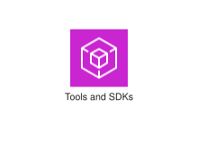
</div>
</div>

{{#endtab}}
{{#tab name="Code"}}

```xml
{{#include ../samples/icons/Architecture-Service-Icons/arch-aws-tools-and-sdks-48-8c0490a6.xal}}
```

{{#endtab}}
{{#endtabs}}

<div class="xal-ref-tag"><code>&lt;item id=&#34;493&#34; /&gt;</code></div>

</div>
<div class="xal-ref-card">
<div class="xal-ref-title">Arch_AWS-X-Ray_48</div>

{{#tabs name="svg-ref-0633"}}
{{#tab name="Preview"}}
<div class="xal-ref-preview">
<div>
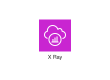
</div>
</div>

{{#endtab}}
{{#tab name="Code"}}

```xml
{{#include ../samples/icons/Architecture-Service-Icons/arch-aws-x-ray-48-5ff92dca.xal}}
```

{{#endtab}}
{{#endtabs}}

<div class="xal-ref-tag"><code>&lt;item id=&#34;494&#34; /&gt;</code></div>

</div>
<div class="xal-ref-card">
<div class="xal-ref-title">Arch_Amazon-CodeCatalyst_48</div>

{{#tabs name="svg-ref-0634"}}
{{#tab name="Preview"}}
<div class="xal-ref-preview">
<div>
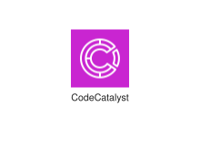
</div>
</div>

{{#endtab}}
{{#tab name="Code"}}

```xml
{{#include ../samples/icons/Architecture-Service-Icons/arch-amazon-codecatalyst-48-318798f1.xal}}
```

{{#endtab}}
{{#endtabs}}

<div class="xal-ref-tag"><code>&lt;item id=&#34;495&#34; /&gt;</code></div>

</div>
<div class="xal-ref-card">
<div class="xal-ref-title">Arch_Amazon-Corretto_48</div>

{{#tabs name="svg-ref-0635"}}
{{#tab name="Preview"}}
<div class="xal-ref-preview">
<div>
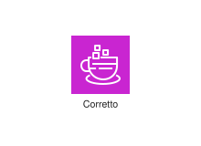
</div>
</div>

{{#endtab}}
{{#tab name="Code"}}

```xml
{{#include ../samples/icons/Architecture-Service-Icons/arch-amazon-corretto-48-f606d4ec.xal}}
```

{{#endtab}}
{{#endtabs}}

<div class="xal-ref-tag"><code>&lt;item id=&#34;496&#34; /&gt;</code></div>

</div>
<div class="xal-ref-card">
<div class="xal-ref-title">Arch_AWS-Cloud-Control-API_64</div>

{{#tabs name="svg-ref-0636"}}
{{#tab name="Preview"}}
<div class="xal-ref-preview">
<div>
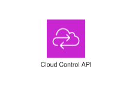
</div>
</div>

{{#endtab}}
{{#tab name="Code"}}

```xml
{{#include ../samples/icons/Architecture-Service-Icons/arch-aws-cloud-control-api-64-cb6da7cb.xal}}
```

{{#endtab}}
{{#endtabs}}

<div class="xal-ref-tag"><code>&lt;item id=&#34;465&#34; /&gt;</code></div>

</div>
<div class="xal-ref-card">
<div class="xal-ref-title">Arch_AWS-Cloud-Development-Kit_64</div>

{{#tabs name="svg-ref-0637"}}
{{#tab name="Preview"}}
<div class="xal-ref-preview">
<div>

</div>
</div>

{{#endtab}}
{{#tab name="Code"}}

```xml
{{#include ../samples/icons/Architecture-Service-Icons/arch-aws-cloud-development-kit-64-a4349e8b.xal}}
```

{{#endtab}}
{{#endtabs}}

<div class="xal-ref-tag"><code>&lt;item id=&#34;466&#34; /&gt;</code></div>

</div>
<div class="xal-ref-card">
<div class="xal-ref-title">Arch_AWS-Cloud9_64</div>

{{#tabs name="svg-ref-0638"}}
{{#tab name="Preview"}}
<div class="xal-ref-preview">
<div>
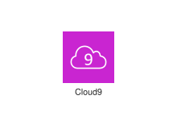
</div>
</div>

{{#endtab}}
{{#tab name="Code"}}

```xml
{{#include ../samples/icons/Architecture-Service-Icons/arch-aws-cloud9-64-da7144f4.xal}}
```

{{#endtab}}
{{#endtabs}}

<div class="xal-ref-tag"><code>&lt;item id=&#34;467&#34; /&gt;</code></div>

</div>
<div class="xal-ref-card">
<div class="xal-ref-title">Arch_AWS-CloudShell_64</div>

{{#tabs name="svg-ref-0639"}}
{{#tab name="Preview"}}
<div class="xal-ref-preview">
<div>

</div>
</div>

{{#endtab}}
{{#tab name="Code"}}

```xml
{{#include ../samples/icons/Architecture-Service-Icons/arch-aws-cloudshell-64-f8cb01de.xal}}
```

{{#endtab}}
{{#endtabs}}

<div class="xal-ref-tag"><code>&lt;item id=&#34;468&#34; /&gt;</code></div>

</div>
<div class="xal-ref-card">
<div class="xal-ref-title">Arch_AWS-CodeArtifact_64</div>

{{#tabs name="svg-ref-0640"}}
{{#tab name="Preview"}}
<div class="xal-ref-preview">
<div>
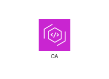
</div>
</div>

{{#endtab}}
{{#tab name="Code"}}

```xml
{{#include ../samples/icons/Architecture-Service-Icons/arch-aws-codeartifact-64-d7feb176.xal}}
```

{{#endtab}}
{{#endtabs}}

<div class="xal-ref-tag"><code>&lt;item id=&#34;469&#34; /&gt;</code></div>

</div>
<div class="xal-ref-card">
<div class="xal-ref-title">Arch_AWS-CodeBuild_64</div>

{{#tabs name="svg-ref-0641"}}
{{#tab name="Preview"}}
<div class="xal-ref-preview">
<div>
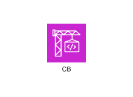
</div>
</div>

{{#endtab}}
{{#tab name="Code"}}

```xml
{{#include ../samples/icons/Architecture-Service-Icons/arch-aws-codebuild-64-c591a11c.xal}}
```

{{#endtab}}
{{#endtabs}}

<div class="xal-ref-tag"><code>&lt;item id=&#34;470&#34; /&gt;</code></div>

</div>
<div class="xal-ref-card">
<div class="xal-ref-title">Arch_AWS-CodeCommit_64</div>

{{#tabs name="svg-ref-0642"}}
{{#tab name="Preview"}}
<div class="xal-ref-preview">
<div>
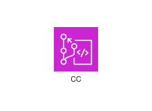
</div>
</div>

{{#endtab}}
{{#tab name="Code"}}

```xml
{{#include ../samples/icons/Architecture-Service-Icons/arch-aws-codecommit-64-31229af1.xal}}
```

{{#endtab}}
{{#endtabs}}

<div class="xal-ref-tag"><code>&lt;item id=&#34;471&#34; /&gt;</code></div>

</div>
<div class="xal-ref-card">
<div class="xal-ref-title">Arch_AWS-CodeDeploy_64</div>

{{#tabs name="svg-ref-0643"}}
{{#tab name="Preview"}}
<div class="xal-ref-preview">
<div>
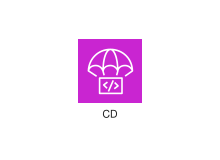
</div>
</div>

{{#endtab}}
{{#tab name="Code"}}

```xml
{{#include ../samples/icons/Architecture-Service-Icons/arch-aws-codedeploy-64-c4d9fa61.xal}}
```

{{#endtab}}
{{#endtabs}}

<div class="xal-ref-tag"><code>&lt;item id=&#34;472&#34; /&gt;</code></div>

</div>
<div class="xal-ref-card">
<div class="xal-ref-title">Arch_AWS-CodePipeline_64</div>

{{#tabs name="svg-ref-0644"}}
{{#tab name="Preview"}}
<div class="xal-ref-preview">
<div>
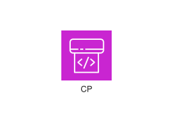
</div>
</div>

{{#endtab}}
{{#tab name="Code"}}

```xml
{{#include ../samples/icons/Architecture-Service-Icons/arch-aws-codepipeline-64-76781bd5.xal}}
```

{{#endtab}}
{{#endtabs}}

<div class="xal-ref-tag"><code>&lt;item id=&#34;473&#34; /&gt;</code></div>

</div>
<div class="xal-ref-card">
<div class="xal-ref-title">Arch_AWS-Command-Line-Interface_64</div>

{{#tabs name="svg-ref-0645"}}
{{#tab name="Preview"}}
<div class="xal-ref-preview">
<div>

</div>
</div>

{{#endtab}}
{{#tab name="Code"}}

```xml
{{#include ../samples/icons/Architecture-Service-Icons/arch-aws-command-line-interface-64-e3be1245.xal}}
```

{{#endtab}}
{{#endtabs}}

<div class="xal-ref-tag"><code>&lt;item id=&#34;474&#34; /&gt;</code></div>

</div>
<div class="xal-ref-card">
<div class="xal-ref-title">Arch_AWS-Fault-Injection-Service_64</div>

{{#tabs name="svg-ref-0646"}}
{{#tab name="Preview"}}
<div class="xal-ref-preview">
<div>
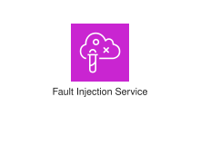
</div>
</div>

{{#endtab}}
{{#tab name="Code"}}

```xml
{{#include ../samples/icons/Architecture-Service-Icons/arch-aws-fault-injection-service-64-dbe7a1a4.xal}}
```

{{#endtab}}
{{#endtabs}}

<div class="xal-ref-tag"><code>&lt;item id=&#34;475&#34; /&gt;</code></div>

</div>
<div class="xal-ref-card">
<div class="xal-ref-title">Arch_AWS-Infrastructure-Composer_64</div>

{{#tabs name="svg-ref-0647"}}
{{#tab name="Preview"}}
<div class="xal-ref-preview">
<div>
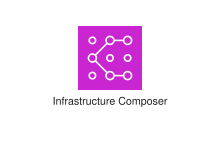
</div>
</div>

{{#endtab}}
{{#tab name="Code"}}

```xml
{{#include ../samples/icons/Architecture-Service-Icons/arch-aws-infrastructure-composer-64-81c92186.xal}}
```

{{#endtab}}
{{#endtabs}}

<div class="xal-ref-tag"><code>&lt;item id=&#34;476&#34; /&gt;</code></div>

</div>
<div class="xal-ref-card">
<div class="xal-ref-title">Arch_AWS-Tools-and-SDKs_64</div>

{{#tabs name="svg-ref-0648"}}
{{#tab name="Preview"}}
<div class="xal-ref-preview">
<div>
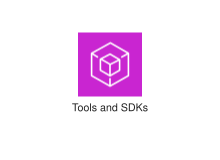
</div>
</div>

{{#endtab}}
{{#tab name="Code"}}

```xml
{{#include ../samples/icons/Architecture-Service-Icons/arch-aws-tools-and-sdks-64-fb47d334.xal}}
```

{{#endtab}}
{{#endtabs}}

<div class="xal-ref-tag"><code>&lt;item id=&#34;477&#34; /&gt;</code></div>

</div>
<div class="xal-ref-card">
<div class="xal-ref-title">Arch_AWS-X-Ray_64</div>

{{#tabs name="svg-ref-0649"}}
{{#tab name="Preview"}}
<div class="xal-ref-preview">
<div>
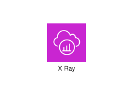
</div>
</div>

{{#endtab}}
{{#tab name="Code"}}

```xml
{{#include ../samples/icons/Architecture-Service-Icons/arch-aws-x-ray-64-0e1f4f7a.xal}}
```

{{#endtab}}
{{#endtabs}}

<div class="xal-ref-tag"><code>&lt;item id=&#34;478&#34; /&gt;</code></div>

</div>
<div class="xal-ref-card">
<div class="xal-ref-title">Arch_Amazon-CodeCatalyst_64</div>

{{#tabs name="svg-ref-0650"}}
{{#tab name="Preview"}}
<div class="xal-ref-preview">
<div>
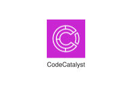
</div>
</div>

{{#endtab}}
{{#tab name="Code"}}

```xml
{{#include ../samples/icons/Architecture-Service-Icons/arch-amazon-codecatalyst-64-4794b482.xal}}
```

{{#endtab}}
{{#endtabs}}

<div class="xal-ref-tag"><code>&lt;item id=&#34;479&#34; /&gt;</code></div>

</div>
<div class="xal-ref-card">
<div class="xal-ref-title">Arch_Amazon-Corretto_64</div>

{{#tabs name="svg-ref-0651"}}
{{#tab name="Preview"}}
<div class="xal-ref-preview">
<div>
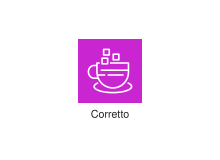
</div>
</div>

{{#endtab}}
{{#tab name="Code"}}

```xml
{{#include ../samples/icons/Architecture-Service-Icons/arch-amazon-corretto-64-ff4df985.xal}}
```

{{#endtab}}
{{#endtabs}}

<div class="xal-ref-tag"><code>&lt;item id=&#34;480&#34; /&gt;</code></div>

</div>
<div class="xal-ref-card">
<div class="xal-ref-title">Arch_Amazon-AppStream-2_16</div>

{{#tabs name="svg-ref-0652"}}
{{#tab name="Preview"}}
<div class="xal-ref-preview">
<div>

</div>
</div>

{{#endtab}}
{{#tab name="Code"}}

```xml
{{#include ../samples/icons/Architecture-Service-Icons/arch-amazon-appstream-2-16-dbf1e10e.xal}}
```

{{#endtab}}
{{#endtabs}}

<div class="xal-ref-tag"><code>&lt;item id=&#34;3&#34; /&gt;</code></div>

</div>
<div class="xal-ref-card">
<div class="xal-ref-title">Arch_Amazon-WorkSpaces-Family_16</div>

{{#tabs name="svg-ref-0653"}}
{{#tab name="Preview"}}
<div class="xal-ref-preview">
<div>
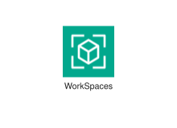
</div>
</div>

{{#endtab}}
{{#tab name="Code"}}

```xml
{{#include ../samples/icons/Architecture-Service-Icons/arch-amazon-workspaces-family-16-7afc27e1.xal}}
```

{{#endtab}}
{{#endtabs}}

<div class="xal-ref-tag"><code>&lt;item id=&#34;4&#34; /&gt;</code></div>

</div>
<div class="xal-ref-card">
<div class="xal-ref-title">Arch_Amazon-AppStream-2_32</div>

{{#tabs name="svg-ref-0654"}}
{{#tab name="Preview"}}
<div class="xal-ref-preview">
<div>
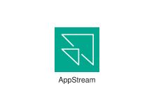
</div>
</div>

{{#endtab}}
{{#tab name="Code"}}

```xml
{{#include ../samples/icons/Architecture-Service-Icons/arch-amazon-appstream-2-32-7fd6dd09.xal}}
```

{{#endtab}}
{{#endtabs}}

<div class="xal-ref-tag"><code>&lt;item id=&#34;1&#34; /&gt;</code></div>

</div>
<div class="xal-ref-card">
<div class="xal-ref-title">Arch_Amazon-WorkSpaces-Family_32</div>

{{#tabs name="svg-ref-0655"}}
{{#tab name="Preview"}}
<div class="xal-ref-preview">
<div>
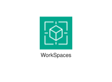
</div>
</div>

{{#endtab}}
{{#tab name="Code"}}

```xml
{{#include ../samples/icons/Architecture-Service-Icons/arch-amazon-workspaces-family-32-0416ca33.xal}}
```

{{#endtab}}
{{#endtabs}}

<div class="xal-ref-tag"><code>&lt;item id=&#34;2&#34; /&gt;</code></div>

</div>
<div class="xal-ref-card">
<div class="xal-ref-title">Arch_Amazon-AppStream-2_48</div>

{{#tabs name="svg-ref-0656"}}
{{#tab name="Preview"}}
<div class="xal-ref-preview">
<div>

</div>
</div>

{{#endtab}}
{{#tab name="Code"}}

```xml
{{#include ../samples/icons/Architecture-Service-Icons/arch-amazon-appstream-2-48-736f3e88.xal}}
```

{{#endtab}}
{{#endtabs}}

<div class="xal-ref-tag"><code>&lt;item id=&#34;7&#34; /&gt;</code></div>

</div>
<div class="xal-ref-card">
<div class="xal-ref-title">Arch_Amazon-WorkSpaces-Family_48</div>

{{#tabs name="svg-ref-0657"}}
{{#tab name="Preview"}}
<div class="xal-ref-preview">
<div>
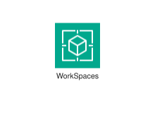
</div>
</div>

{{#endtab}}
{{#tab name="Code"}}

```xml
{{#include ../samples/icons/Architecture-Service-Icons/arch-amazon-workspaces-family-48-166cd127.xal}}
```

{{#endtab}}
{{#endtabs}}

<div class="xal-ref-tag"><code>&lt;item id=&#34;8&#34; /&gt;</code></div>

</div>
<div class="xal-ref-card">
<div class="xal-ref-title">Arch_Amazon-AppStream-2_64</div>

{{#tabs name="svg-ref-0658"}}
{{#tab name="Preview"}}
<div class="xal-ref-preview">
<div>
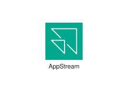
</div>
</div>

{{#endtab}}
{{#tab name="Code"}}

```xml
{{#include ../samples/icons/Architecture-Service-Icons/arch-amazon-appstream-2-64-042c7d1a.xal}}
```

{{#endtab}}
{{#endtabs}}

<div class="xal-ref-tag"><code>&lt;item id=&#34;5&#34; /&gt;</code></div>

</div>
<div class="xal-ref-card">
<div class="xal-ref-title">Arch_Amazon-WorkSpaces-Family_64</div>

{{#tabs name="svg-ref-0659"}}
{{#tab name="Preview"}}
<div class="xal-ref-preview">
<div>
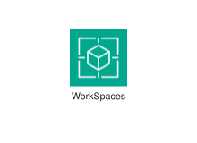
</div>
</div>

{{#endtab}}
{{#tab name="Code"}}

```xml
{{#include ../samples/icons/Architecture-Service-Icons/arch-amazon-workspaces-family-64-ef978da2.xal}}
```

{{#endtab}}
{{#endtabs}}

<div class="xal-ref-tag"><code>&lt;item id=&#34;6&#34; /&gt;</code></div>

</div>
<div class="xal-ref-card">
<div class="xal-ref-title">Arch_AWS-Amplify_16</div>

{{#tabs name="svg-ref-0660"}}
{{#tab name="Preview"}}
<div class="xal-ref-preview">
<div>
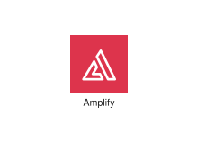
</div>
</div>

{{#endtab}}
{{#tab name="Code"}}

```xml
{{#include ../samples/icons/Architecture-Service-Icons/arch-aws-amplify-16-3a5183f9.xal}}
```

{{#endtab}}
{{#endtabs}}

<div class="xal-ref-tag"><code>&lt;item id=&#34;1072&#34; /&gt;</code></div>

</div>
<div class="xal-ref-card">
<div class="xal-ref-title">Arch_AWS-Device-Farm_16</div>

{{#tabs name="svg-ref-0661"}}
{{#tab name="Preview"}}
<div class="xal-ref-preview">
<div>
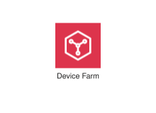
</div>
</div>

{{#endtab}}
{{#tab name="Code"}}

```xml
{{#include ../samples/icons/Architecture-Service-Icons/arch-aws-device-farm-16-8590f8b4.xal}}
```

{{#endtab}}
{{#endtabs}}

<div class="xal-ref-tag"><code>&lt;item id=&#34;1073&#34; /&gt;</code></div>

</div>
<div class="xal-ref-card">
<div class="xal-ref-title">Arch_Amazon-Location-Service_16</div>

{{#tabs name="svg-ref-0662"}}
{{#tab name="Preview"}}
<div class="xal-ref-preview">
<div>

</div>
</div>

{{#endtab}}
{{#tab name="Code"}}

```xml
{{#include ../samples/icons/Architecture-Service-Icons/arch-amazon-location-service-16-6c55f716.xal}}
```

{{#endtab}}
{{#endtabs}}

<div class="xal-ref-tag"><code>&lt;item id=&#34;1074&#34; /&gt;</code></div>

</div>
<div class="xal-ref-card">
<div class="xal-ref-title">Arch_AWS-Amplify_32</div>

{{#tabs name="svg-ref-0663"}}
{{#tab name="Preview"}}
<div class="xal-ref-preview">
<div>
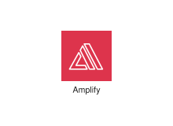
</div>
</div>

{{#endtab}}
{{#tab name="Code"}}

```xml
{{#include ../samples/icons/Architecture-Service-Icons/arch-aws-amplify-32-6cee85a6.xal}}
```

{{#endtab}}
{{#endtabs}}

<div class="xal-ref-tag"><code>&lt;item id=&#34;1069&#34; /&gt;</code></div>

</div>
<div class="xal-ref-card">
<div class="xal-ref-title">Arch_AWS-Device-Farm_32</div>

{{#tabs name="svg-ref-0664"}}
{{#tab name="Preview"}}
<div class="xal-ref-preview">
<div>
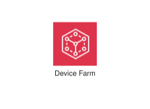
</div>
</div>

{{#endtab}}
{{#tab name="Code"}}

```xml
{{#include ../samples/icons/Architecture-Service-Icons/arch-aws-device-farm-32-12775bbe.xal}}
```

{{#endtab}}
{{#endtabs}}

<div class="xal-ref-tag"><code>&lt;item id=&#34;1070&#34; /&gt;</code></div>

</div>
<div class="xal-ref-card">
<div class="xal-ref-title">Arch_Amazon-Location-Service_32</div>

{{#tabs name="svg-ref-0665"}}
{{#tab name="Preview"}}
<div class="xal-ref-preview">
<div>

</div>
</div>

{{#endtab}}
{{#tab name="Code"}}

```xml
{{#include ../samples/icons/Architecture-Service-Icons/arch-amazon-location-service-32-7a2e5be7.xal}}
```

{{#endtab}}
{{#endtabs}}

<div class="xal-ref-tag"><code>&lt;item id=&#34;1071&#34; /&gt;</code></div>

</div>
<div class="xal-ref-card">
<div class="xal-ref-title">Arch_AWS-Amplify_48</div>

{{#tabs name="svg-ref-0666"}}
{{#tab name="Preview"}}
<div class="xal-ref-preview">
<div>
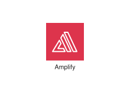
</div>
</div>

{{#endtab}}
{{#tab name="Code"}}

```xml
{{#include ../samples/icons/Architecture-Service-Icons/arch-aws-amplify-48-5ff56373.xal}}
```

{{#endtab}}
{{#endtabs}}

<div class="xal-ref-tag"><code>&lt;item id=&#34;1078&#34; /&gt;</code></div>

</div>
<div class="xal-ref-card">
<div class="xal-ref-title">Arch_AWS-Device-Farm_48</div>

{{#tabs name="svg-ref-0667"}}
{{#tab name="Preview"}}
<div class="xal-ref-preview">
<div>

</div>
</div>

{{#endtab}}
{{#tab name="Code"}}

```xml
{{#include ../samples/icons/Architecture-Service-Icons/arch-aws-device-farm-48-9833ad75.xal}}
```

{{#endtab}}
{{#endtabs}}

<div class="xal-ref-tag"><code>&lt;item id=&#34;1079&#34; /&gt;</code></div>

</div>
<div class="xal-ref-card">
<div class="xal-ref-title">Arch_Amazon-Location-Service_48</div>

{{#tabs name="svg-ref-0668"}}
{{#tab name="Preview"}}
<div class="xal-ref-preview">
<div>

</div>
</div>

{{#endtab}}
{{#tab name="Code"}}

```xml
{{#include ../samples/icons/Architecture-Service-Icons/arch-amazon-location-service-48-3df40bd3.xal}}
```

{{#endtab}}
{{#endtabs}}

<div class="xal-ref-tag"><code>&lt;item id=&#34;1080&#34; /&gt;</code></div>

</div>
<div class="xal-ref-card">
<div class="xal-ref-title">Arch_AWS-Amplify_64</div>

{{#tabs name="svg-ref-0669"}}
{{#tab name="Preview"}}
<div class="xal-ref-preview">
<div>
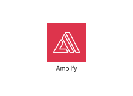
</div>
</div>

{{#endtab}}
{{#tab name="Code"}}

```xml
{{#include ../samples/icons/Architecture-Service-Icons/arch-aws-amplify-64-1531bd5a.xal}}
```

{{#endtab}}
{{#endtabs}}

<div class="xal-ref-tag"><code>&lt;item id=&#34;1075&#34; /&gt;</code></div>

</div>
<div class="xal-ref-card">
<div class="xal-ref-title">Arch_AWS-Device-Farm_64</div>

{{#tabs name="svg-ref-0670"}}
{{#tab name="Preview"}}
<div class="xal-ref-preview">
<div>
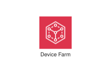
</div>
</div>

{{#endtab}}
{{#tab name="Code"}}

```xml
{{#include ../samples/icons/Architecture-Service-Icons/arch-aws-device-farm-64-9178801c.xal}}
```

{{#endtab}}
{{#endtabs}}

<div class="xal-ref-tag"><code>&lt;item id=&#34;1076&#34; /&gt;</code></div>

</div>
<div class="xal-ref-card">
<div class="xal-ref-title">Arch_Amazon-Location-Service_64</div>

{{#tabs name="svg-ref-0671"}}
{{#tab name="Preview"}}
<div class="xal-ref-preview">
<div>

</div>
</div>

{{#endtab}}
{{#tab name="Code"}}

```xml
{{#include ../samples/icons/Architecture-Service-Icons/arch-amazon-location-service-64-c759419d.xal}}
```

{{#endtab}}
{{#endtabs}}

<div class="xal-ref-tag"><code>&lt;item id=&#34;1077&#34; /&gt;</code></div>

</div>
<div class="xal-ref-card">
<div class="xal-ref-title">Arch_Amazon-GameLift-Servers_16</div>

{{#tabs name="svg-ref-0672"}}
{{#tab name="Preview"}}
<div class="xal-ref-preview">
<div>

</div>
</div>

{{#endtab}}
{{#tab name="Code"}}

```xml
{{#include ../samples/icons/Architecture-Service-Icons/arch-amazon-gamelift-servers-16-8347e260.xal}}
```

{{#endtab}}
{{#endtabs}}

<div class="xal-ref-tag"><code>&lt;item id=&#34;740&#34; /&gt;</code></div>

</div>
<div class="xal-ref-card">
<div class="xal-ref-title">Arch_Amazon-GameLift-Streams_16</div>

{{#tabs name="svg-ref-0673"}}
{{#tab name="Preview"}}
<div class="xal-ref-preview">
<div>

</div>
</div>

{{#endtab}}
{{#tab name="Code"}}

```xml
{{#include ../samples/icons/Architecture-Service-Icons/arch-amazon-gamelift-streams-16-a750122f.xal}}
```

{{#endtab}}
{{#endtabs}}

<div class="xal-ref-tag"><code>&lt;item id=&#34;741&#34; /&gt;</code></div>

</div>
<div class="xal-ref-card">
<div class="xal-ref-title">Arch_Open-3D-Engine_16</div>

{{#tabs name="svg-ref-0674"}}
{{#tab name="Preview"}}
<div class="xal-ref-preview">
<div>
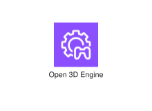
</div>
</div>

{{#endtab}}
{{#tab name="Code"}}

```xml
{{#include ../samples/icons/Architecture-Service-Icons/arch-open-3d-engine-16-a5afe104.xal}}
```

{{#endtab}}
{{#endtabs}}

<div class="xal-ref-tag"><code>&lt;item id=&#34;742&#34; /&gt;</code></div>

</div>
<div class="xal-ref-card">
<div class="xal-ref-title">Arch_Amazon-GameLift-Servers_32</div>

{{#tabs name="svg-ref-0675"}}
{{#tab name="Preview"}}
<div class="xal-ref-preview">
<div>

</div>
</div>

{{#endtab}}
{{#tab name="Code"}}

```xml
{{#include ../samples/icons/Architecture-Service-Icons/arch-amazon-gamelift-servers-32-953c4e91.xal}}
```

{{#endtab}}
{{#endtabs}}

<div class="xal-ref-tag"><code>&lt;item id=&#34;737&#34; /&gt;</code></div>

</div>
<div class="xal-ref-card">
<div class="xal-ref-title">Arch_Amazon-GameLift-Streams_32</div>

{{#tabs name="svg-ref-0676"}}
{{#tab name="Preview"}}
<div class="xal-ref-preview">
<div>

</div>
</div>

{{#endtab}}
{{#tab name="Code"}}

```xml
{{#include ../samples/icons/Architecture-Service-Icons/arch-amazon-gamelift-streams-32-b12bbede.xal}}
```

{{#endtab}}
{{#endtabs}}

<div class="xal-ref-tag"><code>&lt;item id=&#34;738&#34; /&gt;</code></div>

</div>
<div class="xal-ref-card">
<div class="xal-ref-title">Arch_Open-3D-Engine_32</div>

{{#tabs name="svg-ref-0677"}}
{{#tab name="Preview"}}
<div class="xal-ref-preview">
<div>
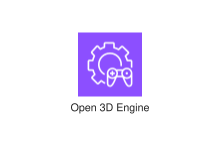
</div>
</div>

{{#endtab}}
{{#tab name="Code"}}

```xml
{{#include ../samples/icons/Architecture-Service-Icons/arch-open-3d-engine-32-dd3fa0f3.xal}}
```

{{#endtab}}
{{#endtabs}}

<div class="xal-ref-tag"><code>&lt;item id=&#34;739&#34; /&gt;</code></div>

</div>
<div class="xal-ref-card">
<div class="xal-ref-title">Arch_Amazon-GameLift-Servers_48</div>

{{#tabs name="svg-ref-0678"}}
{{#tab name="Preview"}}
<div class="xal-ref-preview">
<div>

</div>
</div>

{{#endtab}}
{{#tab name="Code"}}

```xml
{{#include ../samples/icons/Architecture-Service-Icons/arch-amazon-gamelift-servers-48-d2e61ea5.xal}}
```

{{#endtab}}
{{#endtabs}}

<div class="xal-ref-tag"><code>&lt;item id=&#34;746&#34; /&gt;</code></div>

</div>
<div class="xal-ref-card">
<div class="xal-ref-title">Arch_Amazon-GameLift-Streams_48</div>

{{#tabs name="svg-ref-0679"}}
{{#tab name="Preview"}}
<div class="xal-ref-preview">
<div>

</div>
</div>

{{#endtab}}
{{#tab name="Code"}}

```xml
{{#include ../samples/icons/Architecture-Service-Icons/arch-amazon-gamelift-streams-48-f6f1eeea.xal}}
```

{{#endtab}}
{{#endtabs}}

<div class="xal-ref-tag"><code>&lt;item id=&#34;747&#34; /&gt;</code></div>

</div>
<div class="xal-ref-card">
<div class="xal-ref-title">Arch_Open-3D-Engine_48</div>

{{#tabs name="svg-ref-0680"}}
{{#tab name="Preview"}}
<div class="xal-ref-preview">
<div>
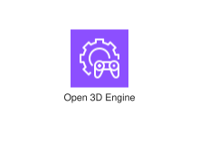
</div>
</div>

{{#endtab}}
{{#tab name="Code"}}

```xml
{{#include ../samples/icons/Architecture-Service-Icons/arch-open-3d-engine-48-76289385.xal}}
```

{{#endtab}}
{{#endtabs}}

<div class="xal-ref-tag"><code>&lt;item id=&#34;748&#34; /&gt;</code></div>

</div>
<div class="xal-ref-card">
<div class="xal-ref-title">Arch_Amazon-GameLift-Servers_64</div>

{{#tabs name="svg-ref-0681"}}
{{#tab name="Preview"}}
<div class="xal-ref-preview">
<div>

</div>
</div>

{{#endtab}}
{{#tab name="Code"}}

```xml
{{#include ../samples/icons/Architecture-Service-Icons/arch-amazon-gamelift-servers-64-284b54eb.xal}}
```

{{#endtab}}
{{#endtabs}}

<div class="xal-ref-tag"><code>&lt;item id=&#34;743&#34; /&gt;</code></div>

</div>
<div class="xal-ref-card">
<div class="xal-ref-title">Arch_Amazon-GameLift-Streams_64</div>

{{#tabs name="svg-ref-0682"}}
{{#tab name="Preview"}}
<div class="xal-ref-preview">
<div>

</div>
</div>

{{#endtab}}
{{#tab name="Code"}}

```xml
{{#include ../samples/icons/Architecture-Service-Icons/arch-amazon-gamelift-streams-64-0c5ca4a4.xal}}
```

{{#endtab}}
{{#endtabs}}

<div class="xal-ref-tag"><code>&lt;item id=&#34;744&#34; /&gt;</code></div>

</div>
<div class="xal-ref-card">
<div class="xal-ref-title">Arch_Open-3D-Engine_64</div>

{{#tabs name="svg-ref-0683"}}
{{#tab name="Preview"}}
<div class="xal-ref-preview">
<div>
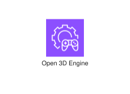
</div>
</div>

{{#endtab}}
{{#tab name="Code"}}

```xml
{{#include ../samples/icons/Architecture-Service-Icons/arch-open-3d-engine-64-3367715b.xal}}
```

{{#endtab}}
{{#endtabs}}

<div class="xal-ref-tag"><code>&lt;item id=&#34;745&#34; /&gt;</code></div>

</div>
<div class="xal-ref-card">
<div class="xal-ref-title">Arch_AWS-Marketplace_Dark_16</div>

{{#tabs name="svg-ref-0684"}}
{{#tab name="Preview"}}
<div class="xal-ref-preview">
<div>

</div>
</div>

{{#endtab}}
{{#tab name="Code"}}

```xml
{{#include ../samples/icons/Architecture-Service-Icons/arch-aws-marketplace-dark-16-a2efe9f6.xal}}
```

{{#endtab}}
{{#endtabs}}

<div class="xal-ref-tag"><code>&lt;item id=&#34;535&#34; /&gt;</code></div>

</div>
<div class="xal-ref-card">
<div class="xal-ref-title">Arch_AWS-Marketplace_Light_16</div>

{{#tabs name="svg-ref-0685"}}
{{#tab name="Preview"}}
<div class="xal-ref-preview">
<div>

</div>
</div>

{{#endtab}}
{{#tab name="Code"}}

```xml
{{#include ../samples/icons/Architecture-Service-Icons/arch-aws-marketplace-light-16-4f18d1a3.xal}}
```

{{#endtab}}
{{#endtabs}}

<div class="xal-ref-tag"><code>&lt;item id=&#34;536&#34; /&gt;</code></div>

</div>
<div class="xal-ref-card">
<div class="xal-ref-title">Arch_AWS-Marketplace_Dark_32</div>

{{#tabs name="svg-ref-0686"}}
{{#tab name="Preview"}}
<div class="xal-ref-preview">
<div>
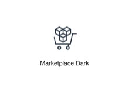
</div>
</div>

{{#endtab}}
{{#tab name="Code"}}

```xml
{{#include ../samples/icons/Architecture-Service-Icons/arch-aws-marketplace-dark-32-cce38334.xal}}
```

{{#endtab}}
{{#endtabs}}

<div class="xal-ref-tag"><code>&lt;item id=&#34;533&#34; /&gt;</code></div>

</div>
<div class="xal-ref-card">
<div class="xal-ref-title">Arch_AWS-Marketplace_Light_32</div>

{{#tabs name="svg-ref-0687"}}
{{#tab name="Preview"}}
<div class="xal-ref-preview">
<div>
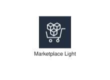
</div>
</div>

{{#endtab}}
{{#tab name="Code"}}

```xml
{{#include ../samples/icons/Architecture-Service-Icons/arch-aws-marketplace-light-32-8e5a2aa1.xal}}
```

{{#endtab}}
{{#endtabs}}

<div class="xal-ref-tag"><code>&lt;item id=&#34;534&#34; /&gt;</code></div>

</div>
<div class="xal-ref-card">
<div class="xal-ref-title">Arch_AWS-Marketplace_Dark_48</div>

{{#tabs name="svg-ref-0688"}}
{{#tab name="Preview"}}
<div class="xal-ref-preview">
<div>

</div>
</div>

{{#endtab}}
{{#tab name="Code"}}

```xml
{{#include ../samples/icons/Architecture-Service-Icons/arch-aws-marketplace-dark-48-2e78eb0b.xal}}
```

{{#endtab}}
{{#endtabs}}

<div class="xal-ref-tag"><code>&lt;item id=&#34;539&#34; /&gt;</code></div>

</div>
<div class="xal-ref-card">
<div class="xal-ref-title">Arch_AWS-Marketplace_Light_48</div>

{{#tabs name="svg-ref-0689"}}
{{#tab name="Preview"}}
<div class="xal-ref-preview">
<div>
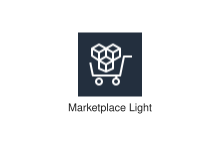
</div>
</div>

{{#endtab}}
{{#tab name="Code"}}

```xml
{{#include ../samples/icons/Architecture-Service-Icons/arch-aws-marketplace-light-48-0b57a905.xal}}
```

{{#endtab}}
{{#endtabs}}

<div class="xal-ref-tag"><code>&lt;item id=&#34;540&#34; /&gt;</code></div>

</div>
<div class="xal-ref-card">
<div class="xal-ref-title">Arch_AWS-Marketplace_Dark_64</div>

{{#tabs name="svg-ref-0690"}}
{{#tab name="Preview"}}
<div class="xal-ref-preview">
<div>

</div>
</div>

{{#endtab}}
{{#tab name="Code"}}

```xml
{{#include ../samples/icons/Architecture-Service-Icons/arch-aws-marketplace-dark-64-8f6745f9.xal}}
```

{{#endtab}}
{{#endtabs}}

<div class="xal-ref-tag"><code>&lt;item id=&#34;537&#34; /&gt;</code></div>

</div>
<div class="xal-ref-card">
<div class="xal-ref-title">Arch_AWS-Marketplace_Light_64</div>

{{#tabs name="svg-ref-0691"}}
{{#tab name="Preview"}}
<div class="xal-ref-preview">
<div>
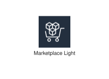
</div>
</div>

{{#endtab}}
{{#tab name="Code"}}

```xml
{{#include ../samples/icons/Architecture-Service-Icons/arch-aws-marketplace-light-64-3020b8c3.xal}}
```

{{#endtab}}
{{#endtabs}}

<div class="xal-ref-tag"><code>&lt;item id=&#34;538&#34; /&gt;</code></div>

</div>
<div class="xal-ref-card">
<div class="xal-ref-title">Arch_AWS-IoT-Analytics_16</div>

{{#tabs name="svg-ref-0692"}}
{{#tab name="Preview"}}
<div class="xal-ref-preview">
<div>
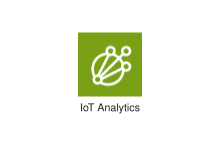
</div>
</div>

{{#endtab}}
{{#tab name="Code"}}

```xml
{{#include ../samples/icons/Architecture-Service-Icons/arch-aws-iot-analytics-16-7f4911cb.xal}}
```

{{#endtab}}
{{#endtabs}}

<div class="xal-ref-tag"><code>&lt;item id=&#34;397&#34; /&gt;</code></div>

</div>
<div class="xal-ref-card">
<div class="xal-ref-title">Arch_AWS-IoT-Button_16</div>

{{#tabs name="svg-ref-0693"}}
{{#tab name="Preview"}}
<div class="xal-ref-preview">
<div>
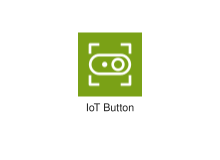
</div>
</div>

{{#endtab}}
{{#tab name="Code"}}

```xml
{{#include ../samples/icons/Architecture-Service-Icons/arch-aws-iot-button-16-ad45bacf.xal}}
```

{{#endtab}}
{{#endtabs}}

<div class="xal-ref-tag"><code>&lt;item id=&#34;398&#34; /&gt;</code></div>

</div>
<div class="xal-ref-card">
<div class="xal-ref-title">Arch_AWS-IoT-Core_16</div>

{{#tabs name="svg-ref-0694"}}
{{#tab name="Preview"}}
<div class="xal-ref-preview">
<div>

</div>
</div>

{{#endtab}}
{{#tab name="Code"}}

```xml
{{#include ../samples/icons/Architecture-Service-Icons/arch-aws-iot-core-16-b07f51fe.xal}}
```

{{#endtab}}
{{#endtabs}}

<div class="xal-ref-tag"><code>&lt;item id=&#34;399&#34; /&gt;</code></div>

</div>
<div class="xal-ref-card">
<div class="xal-ref-title">Arch_AWS-IoT-Device-Defender_16</div>

{{#tabs name="svg-ref-0695"}}
{{#tab name="Preview"}}
<div class="xal-ref-preview">
<div>

</div>
</div>

{{#endtab}}
{{#tab name="Code"}}

```xml
{{#include ../samples/icons/Architecture-Service-Icons/arch-aws-iot-device-defender-16-b65d4cc6.xal}}
```

{{#endtab}}
{{#endtabs}}

<div class="xal-ref-tag"><code>&lt;item id=&#34;400&#34; /&gt;</code></div>

</div>
<div class="xal-ref-card">
<div class="xal-ref-title">Arch_AWS-IoT-Device-Management_16</div>

{{#tabs name="svg-ref-0696"}}
{{#tab name="Preview"}}
<div class="xal-ref-preview">
<div>

</div>
</div>

{{#endtab}}
{{#tab name="Code"}}

```xml
{{#include ../samples/icons/Architecture-Service-Icons/arch-aws-iot-device-management-16-389f1f77.xal}}
```

{{#endtab}}
{{#endtabs}}

<div class="xal-ref-tag"><code>&lt;item id=&#34;401&#34; /&gt;</code></div>

</div>
<div class="xal-ref-card">
<div class="xal-ref-title">Arch_AWS-IoT-Events_16</div>

{{#tabs name="svg-ref-0697"}}
{{#tab name="Preview"}}
<div class="xal-ref-preview">
<div>

</div>
</div>

{{#endtab}}
{{#tab name="Code"}}

```xml
{{#include ../samples/icons/Architecture-Service-Icons/arch-aws-iot-events-16-31779c1b.xal}}
```

{{#endtab}}
{{#endtabs}}

<div class="xal-ref-tag"><code>&lt;item id=&#34;402&#34; /&gt;</code></div>

</div>
<div class="xal-ref-card">
<div class="xal-ref-title">Arch_AWS-IoT-ExpressLink_16</div>

{{#tabs name="svg-ref-0698"}}
{{#tab name="Preview"}}
<div class="xal-ref-preview">
<div>

</div>
</div>

{{#endtab}}
{{#tab name="Code"}}

```xml
{{#include ../samples/icons/Architecture-Service-Icons/arch-aws-iot-expresslink-16-95330587.xal}}
```

{{#endtab}}
{{#endtabs}}

<div class="xal-ref-tag"><code>&lt;item id=&#34;403&#34; /&gt;</code></div>

</div>
<div class="xal-ref-card">
<div class="xal-ref-title">Arch_AWS-IoT-FleetWise_16</div>

{{#tabs name="svg-ref-0699"}}
{{#tab name="Preview"}}
<div class="xal-ref-preview">
<div>

</div>
</div>

{{#endtab}}
{{#tab name="Code"}}

```xml
{{#include ../samples/icons/Architecture-Service-Icons/arch-aws-iot-fleetwise-16-23ca4f39.xal}}
```

{{#endtab}}
{{#endtabs}}

<div class="xal-ref-tag"><code>&lt;item id=&#34;404&#34; /&gt;</code></div>

</div>
<div class="xal-ref-card">
<div class="xal-ref-title">Arch_AWS-IoT-Greengrass_16</div>

{{#tabs name="svg-ref-0700"}}
{{#tab name="Preview"}}
<div class="xal-ref-preview">
<div>
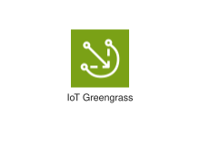
</div>
</div>

{{#endtab}}
{{#tab name="Code"}}

```xml
{{#include ../samples/icons/Architecture-Service-Icons/arch-aws-iot-greengrass-16-a0661fc0.xal}}
```

{{#endtab}}
{{#endtabs}}

<div class="xal-ref-tag"><code>&lt;item id=&#34;405&#34; /&gt;</code></div>

</div>
<div class="xal-ref-card">
<div class="xal-ref-title">Arch_AWS-IoT-SiteWise_16</div>

{{#tabs name="svg-ref-0701"}}
{{#tab name="Preview"}}
<div class="xal-ref-preview">
<div>
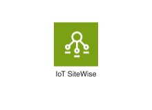
</div>
</div>

{{#endtab}}
{{#tab name="Code"}}

```xml
{{#include ../samples/icons/Architecture-Service-Icons/arch-aws-iot-sitewise-16-0628335c.xal}}
```

{{#endtab}}
{{#endtabs}}

<div class="xal-ref-tag"><code>&lt;item id=&#34;406&#34; /&gt;</code></div>

</div>
<div class="xal-ref-card">
<div class="xal-ref-title">Arch_AWS-IoT-TwinMaker_16</div>

{{#tabs name="svg-ref-0702"}}
{{#tab name="Preview"}}
<div class="xal-ref-preview">
<div>
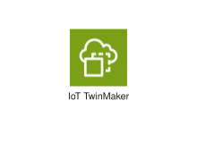
</div>
</div>

{{#endtab}}
{{#tab name="Code"}}

```xml
{{#include ../samples/icons/Architecture-Service-Icons/arch-aws-iot-twinmaker-16-f1e91dc5.xal}}
```

{{#endtab}}
{{#endtabs}}

<div class="xal-ref-tag"><code>&lt;item id=&#34;407&#34; /&gt;</code></div>

</div>
<div class="xal-ref-card">
<div class="xal-ref-title">Arch_FreeRTOS_16</div>

{{#tabs name="svg-ref-0703"}}
{{#tab name="Preview"}}
<div class="xal-ref-preview">
<div>

</div>
</div>

{{#endtab}}
{{#tab name="Code"}}

```xml
{{#include ../samples/icons/Architecture-Service-Icons/arch-freertos-16-ff353eb2.xal}}
```

{{#endtab}}
{{#endtabs}}

<div class="xal-ref-tag"><code>&lt;item id=&#34;408&#34; /&gt;</code></div>

</div>
<div class="xal-ref-card">
<div class="xal-ref-title">Arch_AWS-IoT-Analytics_32</div>

{{#tabs name="svg-ref-0704"}}
{{#tab name="Preview"}}
<div class="xal-ref-preview">
<div>
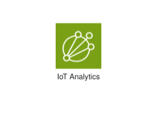
</div>
</div>

{{#endtab}}
{{#tab name="Code"}}

```xml
{{#include ../samples/icons/Architecture-Service-Icons/arch-aws-iot-analytics-32-c45bb851.xal}}
```

{{#endtab}}
{{#endtabs}}

<div class="xal-ref-tag"><code>&lt;item id=&#34;385&#34; /&gt;</code></div>

</div>
<div class="xal-ref-card">
<div class="xal-ref-title">Arch_AWS-IoT-Button_32</div>

{{#tabs name="svg-ref-0705"}}
{{#tab name="Preview"}}
<div class="xal-ref-preview">
<div>
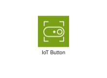
</div>
</div>

{{#endtab}}
{{#tab name="Code"}}

```xml
{{#include ../samples/icons/Architecture-Service-Icons/arch-aws-iot-button-32-d5d5fb38.xal}}
```

{{#endtab}}
{{#endtabs}}

<div class="xal-ref-tag"><code>&lt;item id=&#34;386&#34; /&gt;</code></div>

</div>
<div class="xal-ref-card">
<div class="xal-ref-title">Arch_AWS-IoT-Core_32</div>

{{#tabs name="svg-ref-0706"}}
{{#tab name="Preview"}}
<div class="xal-ref-preview">
<div>

</div>
</div>

{{#endtab}}
{{#tab name="Code"}}

```xml
{{#include ../samples/icons/Architecture-Service-Icons/arch-aws-iot-core-32-ffbbf669.xal}}
```

{{#endtab}}
{{#endtabs}}

<div class="xal-ref-tag"><code>&lt;item id=&#34;387&#34; /&gt;</code></div>

</div>
<div class="xal-ref-card">
<div class="xal-ref-title">Arch_AWS-IoT-Device-Defender_32</div>

{{#tabs name="svg-ref-0707"}}
{{#tab name="Preview"}}
<div class="xal-ref-preview">
<div>

</div>
</div>

{{#endtab}}
{{#tab name="Code"}}

```xml
{{#include ../samples/icons/Architecture-Service-Icons/arch-aws-iot-device-defender-32-a026e037.xal}}
```

{{#endtab}}
{{#endtabs}}

<div class="xal-ref-tag"><code>&lt;item id=&#34;388&#34; /&gt;</code></div>

</div>
<div class="xal-ref-card">
<div class="xal-ref-title">Arch_AWS-IoT-Device-Management_32</div>

{{#tabs name="svg-ref-0708"}}
{{#tab name="Preview"}}
<div class="xal-ref-preview">
<div>

</div>
</div>

{{#endtab}}
{{#tab name="Code"}}

```xml
{{#include ../samples/icons/Architecture-Service-Icons/arch-aws-iot-device-management-32-e47a1296.xal}}
```

{{#endtab}}
{{#endtabs}}

<div class="xal-ref-tag"><code>&lt;item id=&#34;389&#34; /&gt;</code></div>

</div>
<div class="xal-ref-card">
<div class="xal-ref-title">Arch_AWS-IoT-Events_32</div>

{{#tabs name="svg-ref-0709"}}
{{#tab name="Preview"}}
<div class="xal-ref-preview">
<div>

</div>
</div>

{{#endtab}}
{{#tab name="Code"}}

```xml
{{#include ../samples/icons/Architecture-Service-Icons/arch-aws-iot-events-32-49e7ddec.xal}}
```

{{#endtab}}
{{#endtabs}}

<div class="xal-ref-tag"><code>&lt;item id=&#34;390&#34; /&gt;</code></div>

</div>
<div class="xal-ref-card">
<div class="xal-ref-title">Arch_AWS-IoT-ExpressLink_32</div>

{{#tabs name="svg-ref-0710"}}
{{#tab name="Preview"}}
<div class="xal-ref-preview">
<div>

</div>
</div>

{{#endtab}}
{{#tab name="Code"}}

```xml
{{#include ../samples/icons/Architecture-Service-Icons/arch-aws-iot-expresslink-32-bfb5e3ec.xal}}
```

{{#endtab}}
{{#endtabs}}

<div class="xal-ref-tag"><code>&lt;item id=&#34;391&#34; /&gt;</code></div>

</div>
<div class="xal-ref-card">
<div class="xal-ref-title">Arch_AWS-IoT-FleetWise_32</div>

{{#tabs name="svg-ref-0711"}}
{{#tab name="Preview"}}
<div class="xal-ref-preview">
<div>

</div>
</div>

{{#endtab}}
{{#tab name="Code"}}

```xml
{{#include ../samples/icons/Architecture-Service-Icons/arch-aws-iot-fleetwise-32-98d8e6a3.xal}}
```

{{#endtab}}
{{#endtabs}}

<div class="xal-ref-tag"><code>&lt;item id=&#34;392&#34; /&gt;</code></div>

</div>
<div class="xal-ref-card">
<div class="xal-ref-title">Arch_AWS-IoT-Greengrass_32</div>

{{#tabs name="svg-ref-0712"}}
{{#tab name="Preview"}}
<div class="xal-ref-preview">
<div>
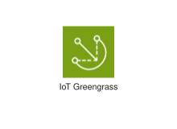
</div>
</div>

{{#endtab}}
{{#tab name="Code"}}

```xml
{{#include ../samples/icons/Architecture-Service-Icons/arch-aws-iot-greengrass-32-044123c7.xal}}
```

{{#endtab}}
{{#endtabs}}

<div class="xal-ref-tag"><code>&lt;item id=&#34;393&#34; /&gt;</code></div>

</div>
<div class="xal-ref-card">
<div class="xal-ref-title">Arch_AWS-IoT-SiteWise_32</div>

{{#tabs name="svg-ref-0713"}}
{{#tab name="Preview"}}
<div class="xal-ref-preview">
<div>
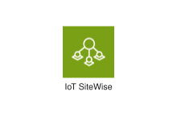
</div>
</div>

{{#endtab}}
{{#tab name="Code"}}

```xml
{{#include ../samples/icons/Architecture-Service-Icons/arch-aws-iot-sitewise-32-522c6915.xal}}
```

{{#endtab}}
{{#endtabs}}

<div class="xal-ref-tag"><code>&lt;item id=&#34;394&#34; /&gt;</code></div>

</div>
<div class="xal-ref-card">
<div class="xal-ref-title">Arch_AWS-IoT-TwinMaker_32</div>

{{#tabs name="svg-ref-0714"}}
{{#tab name="Preview"}}
<div class="xal-ref-preview">
<div>
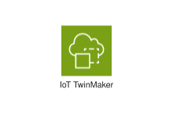
</div>
</div>

{{#endtab}}
{{#tab name="Code"}}

```xml
{{#include ../samples/icons/Architecture-Service-Icons/arch-aws-iot-twinmaker-32-4afbb45f.xal}}
```

{{#endtab}}
{{#endtabs}}

<div class="xal-ref-tag"><code>&lt;item id=&#34;395&#34; /&gt;</code></div>

</div>
<div class="xal-ref-card">
<div class="xal-ref-title">Arch_FreeRTOS_32</div>

{{#tabs name="svg-ref-0715"}}
{{#tab name="Preview"}}
<div class="xal-ref-preview">
<div>

</div>
</div>

{{#endtab}}
{{#tab name="Code"}}

```xml
{{#include ../samples/icons/Architecture-Service-Icons/arch-freertos-32-f64a7990.xal}}
```

{{#endtab}}
{{#endtabs}}

<div class="xal-ref-tag"><code>&lt;item id=&#34;396&#34; /&gt;</code></div>

</div>
<div class="xal-ref-card">
<div class="xal-ref-title">Arch_AWS-IoT-Analytics_48</div>

{{#tabs name="svg-ref-0716"}}
{{#tab name="Preview"}}
<div class="xal-ref-preview">
<div>
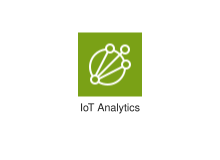
</div>
</div>

{{#endtab}}
{{#tab name="Code"}}

```xml
{{#include ../samples/icons/Architecture-Service-Icons/arch-aws-iot-analytics-48-418b15f7.xal}}
```

{{#endtab}}
{{#endtabs}}

<div class="xal-ref-tag"><code>&lt;item id=&#34;421&#34; /&gt;</code></div>

</div>
<div class="xal-ref-card">
<div class="xal-ref-title">Arch_AWS-IoT-Button_48</div>

{{#tabs name="svg-ref-0717"}}
{{#tab name="Preview"}}
<div class="xal-ref-preview">
<div>

</div>
</div>

{{#endtab}}
{{#tab name="Code"}}

```xml
{{#include ../samples/icons/Architecture-Service-Icons/arch-aws-iot-button-48-7ec2c84e.xal}}
```

{{#endtab}}
{{#endtabs}}

<div class="xal-ref-tag"><code>&lt;item id=&#34;422&#34; /&gt;</code></div>

</div>
<div class="xal-ref-card">
<div class="xal-ref-title">Arch_AWS-IoT-Core_48</div>

{{#tabs name="svg-ref-0718"}}
{{#tab name="Preview"}}
<div class="xal-ref-preview">
<div>

</div>
</div>

{{#endtab}}
{{#tab name="Code"}}

```xml
{{#include ../samples/icons/Architecture-Service-Icons/arch-aws-iot-core-48-3ab8fe25.xal}}
```

{{#endtab}}
{{#endtabs}}

<div class="xal-ref-tag"><code>&lt;item id=&#34;423&#34; /&gt;</code></div>

</div>
<div class="xal-ref-card">
<div class="xal-ref-title">Arch_AWS-IoT-Device-Defender_48</div>

{{#tabs name="svg-ref-0719"}}
{{#tab name="Preview"}}
<div class="xal-ref-preview">
<div>

</div>
</div>

{{#endtab}}
{{#tab name="Code"}}

```xml
{{#include ../samples/icons/Architecture-Service-Icons/arch-aws-iot-device-defender-48-e7fcb003.xal}}
```

{{#endtab}}
{{#endtabs}}

<div class="xal-ref-tag"><code>&lt;item id=&#34;424&#34; /&gt;</code></div>

</div>
</div>
