# Architecture-Service-Icons

This page references SVG files under `etc/resources/aws/svg/Architecture-Service-Icons`.
Each card shows the SVG preview first and the XAL tag syntax in the Code tab.
Total SVG files: 1236.

<style>
.xal-ref-grid{display:grid;grid-template-columns:repeat(auto-fit,minmax(260px,1fr));gap:1rem;margin:1rem 0 1.5rem}.xal-ref-card{border:1px solid var(--table-border-color);border-radius:8px;overflow:hidden;background:var(--bg);padding:.75rem}.xal-ref-preview{min-height:132px;display:flex;align-items:center;justify-content:center}.xal-ref-preview img{max-width:96px;max-height:96px}.xal-ref-path{font-size:.78em;opacity:.75;word-break:break-all;margin-top:.5rem}.xal-ref-card pre{margin:0;max-height:18rem;overflow:auto;white-space:pre-wrap}.xal-ref-card code{font-size:.78em}
</style>

<div class="xal-ref-grid">
<div class="xal-ref-card">

{{#tabs name="svg-ref-0000"}}
{{#tab name="Preview"}}
<div class="xal-ref-preview">
<div>

<div class="xal-ref-path">etc/resources/aws/svg/Architecture-Service-Icons/Arch_Analytics/16/Arch_AWS-Clean-Rooms_16.svg<br>4955 bytes</div>
</div>
</div>
{{#endtab}}
{{#tab name="Code"}}

```xml
{{#include ../samples/icons/Architecture-Service-Icons/arch-aws-clean-rooms-16-f64877aa.xal}}
```

{{#endtab}}
{{#endtabs}}

</div>
<div class="xal-ref-card">

{{#tabs name="svg-ref-0001"}}
{{#tab name="Preview"}}
<div class="xal-ref-preview">
<div>

<div class="xal-ref-path">etc/resources/aws/svg/Architecture-Service-Icons/Arch_Analytics/16/Arch_AWS-Data-Exchange_16.svg<br>1895 bytes</div>
</div>
</div>
{{#endtab}}
{{#tab name="Code"}}

```xml
{{#include ../samples/icons/Architecture-Service-Icons/arch-aws-data-exchange-16-e8e9de07.xal}}
```

{{#endtab}}
{{#endtabs}}

</div>
<div class="xal-ref-card">

{{#tabs name="svg-ref-0002"}}
{{#tab name="Preview"}}
<div class="xal-ref-preview">
<div>

<div class="xal-ref-path">etc/resources/aws/svg/Architecture-Service-Icons/Arch_Analytics/16/Arch_AWS-Entity-Resolution_16.svg<br>2460 bytes</div>
</div>
</div>
{{#endtab}}
{{#tab name="Code"}}

```xml
{{#include ../samples/icons/Architecture-Service-Icons/arch-aws-entity-resolution-16-368b73c5.xal}}
```

{{#endtab}}
{{#endtabs}}

</div>
<div class="xal-ref-card">

{{#tabs name="svg-ref-0003"}}
{{#tab name="Preview"}}
<div class="xal-ref-preview">
<div>

<div class="xal-ref-path">etc/resources/aws/svg/Architecture-Service-Icons/Arch_Analytics/16/Arch_AWS-Glue-DataBrew_16.svg<br>2101 bytes</div>
</div>
</div>
{{#endtab}}
{{#tab name="Code"}}

```xml
{{#include ../samples/icons/Architecture-Service-Icons/arch-aws-glue-databrew-16-fb77866b.xal}}
```

{{#endtab}}
{{#endtabs}}

</div>
<div class="xal-ref-card">

{{#tabs name="svg-ref-0004"}}
{{#tab name="Preview"}}
<div class="xal-ref-preview">
<div>

<div class="xal-ref-path">etc/resources/aws/svg/Architecture-Service-Icons/Arch_Analytics/16/Arch_AWS-Glue_16.svg<br>2533 bytes</div>
</div>
</div>
{{#endtab}}
{{#tab name="Code"}}

```xml
{{#include ../samples/icons/Architecture-Service-Icons/arch-aws-glue-16-e114d017.xal}}
```

{{#endtab}}
{{#endtabs}}

</div>
<div class="xal-ref-card">

{{#tabs name="svg-ref-0005"}}
{{#tab name="Preview"}}
<div class="xal-ref-preview">
<div>

<div class="xal-ref-path">etc/resources/aws/svg/Architecture-Service-Icons/Arch_Analytics/16/Arch_AWS-Lake-Formation_16.svg<br>1555 bytes</div>
</div>
</div>
{{#endtab}}
{{#tab name="Code"}}

```xml
{{#include ../samples/icons/Architecture-Service-Icons/arch-aws-lake-formation-16-8556c657.xal}}
```

{{#endtab}}
{{#endtabs}}

</div>
<div class="xal-ref-card">

{{#tabs name="svg-ref-0006"}}
{{#tab name="Preview"}}
<div class="xal-ref-preview">
<div>

<div class="xal-ref-path">etc/resources/aws/svg/Architecture-Service-Icons/Arch_Analytics/16/Arch_Amazon-Athena_16.svg<br>4772 bytes</div>
</div>
</div>
{{#endtab}}
{{#tab name="Code"}}

```xml
{{#include ../samples/icons/Architecture-Service-Icons/arch-amazon-athena-16-5ba15e3e.xal}}
```

{{#endtab}}
{{#endtabs}}

</div>
<div class="xal-ref-card">

{{#tabs name="svg-ref-0007"}}
{{#tab name="Preview"}}
<div class="xal-ref-preview">
<div>

<div class="xal-ref-path">etc/resources/aws/svg/Architecture-Service-Icons/Arch_Analytics/16/Arch_Amazon-CloudSearch_16.svg<br>3147 bytes</div>
</div>
</div>
{{#endtab}}
{{#tab name="Code"}}

```xml
{{#include ../samples/icons/Architecture-Service-Icons/arch-amazon-cloudsearch-16-878ff1bc.xal}}
```

{{#endtab}}
{{#endtabs}}

</div>
<div class="xal-ref-card">

{{#tabs name="svg-ref-0008"}}
{{#tab name="Preview"}}
<div class="xal-ref-preview">
<div>

<div class="xal-ref-path">etc/resources/aws/svg/Architecture-Service-Icons/Arch_Analytics/16/Arch_Amazon-Data-Firehose_16.svg<br>2342 bytes</div>
</div>
</div>
{{#endtab}}
{{#tab name="Code"}}

```xml
{{#include ../samples/icons/Architecture-Service-Icons/arch-amazon-data-firehose-16-cac5ef11.xal}}
```

{{#endtab}}
{{#endtabs}}

</div>
<div class="xal-ref-card">

{{#tabs name="svg-ref-0009"}}
{{#tab name="Preview"}}
<div class="xal-ref-preview">
<div>

<div class="xal-ref-path">etc/resources/aws/svg/Architecture-Service-Icons/Arch_Analytics/16/Arch_Amazon-DataZone_16.svg<br>3843 bytes</div>
</div>
</div>
{{#endtab}}
{{#tab name="Code"}}

```xml
{{#include ../samples/icons/Architecture-Service-Icons/arch-amazon-datazone-16-dd26afaf.xal}}
```

{{#endtab}}
{{#endtabs}}

</div>
<div class="xal-ref-card">

{{#tabs name="svg-ref-0010"}}
{{#tab name="Preview"}}
<div class="xal-ref-preview">
<div>

<div class="xal-ref-path">etc/resources/aws/svg/Architecture-Service-Icons/Arch_Analytics/16/Arch_Amazon-EMR_16.svg<br>1710 bytes</div>
</div>
</div>
{{#endtab}}
{{#tab name="Code"}}

```xml
{{#include ../samples/icons/Architecture-Service-Icons/arch-amazon-emr-16-7669b749.xal}}
```

{{#endtab}}
{{#endtabs}}

</div>
<div class="xal-ref-card">

{{#tabs name="svg-ref-0011"}}
{{#tab name="Preview"}}
<div class="xal-ref-preview">
<div>

<div class="xal-ref-path">etc/resources/aws/svg/Architecture-Service-Icons/Arch_Analytics/16/Arch_Amazon-FinSpace_16.svg<br>1450 bytes</div>
</div>
</div>
{{#endtab}}
{{#tab name="Code"}}

```xml
{{#include ../samples/icons/Architecture-Service-Icons/arch-amazon-finspace-16-bb0668d8.xal}}
```

{{#endtab}}
{{#endtabs}}

</div>
<div class="xal-ref-card">

{{#tabs name="svg-ref-0012"}}
{{#tab name="Preview"}}
<div class="xal-ref-preview">
<div>

<div class="xal-ref-path">etc/resources/aws/svg/Architecture-Service-Icons/Arch_Analytics/16/Arch_Amazon-Kinesis-Data-Streams_16.svg<br>1665 bytes</div>
</div>
</div>
{{#endtab}}
{{#tab name="Code"}}

```xml
{{#include ../samples/icons/Architecture-Service-Icons/arch-amazon-kinesis-data-streams-16-2b718480.xal}}
```

{{#endtab}}
{{#endtabs}}

</div>
<div class="xal-ref-card">

{{#tabs name="svg-ref-0013"}}
{{#tab name="Preview"}}
<div class="xal-ref-preview">
<div>

<div class="xal-ref-path">etc/resources/aws/svg/Architecture-Service-Icons/Arch_Analytics/16/Arch_Amazon-Kinesis-Video-Streams_16.svg<br>2102 bytes</div>
</div>
</div>
{{#endtab}}
{{#tab name="Code"}}

```xml
{{#include ../samples/icons/Architecture-Service-Icons/arch-amazon-kinesis-video-streams-16-3a2fdaee.xal}}
```

{{#endtab}}
{{#endtabs}}

</div>
<div class="xal-ref-card">

{{#tabs name="svg-ref-0014"}}
{{#tab name="Preview"}}
<div class="xal-ref-preview">
<div>

<div class="xal-ref-path">etc/resources/aws/svg/Architecture-Service-Icons/Arch_Analytics/16/Arch_Amazon-Kinesis_16.svg<br>1611 bytes</div>
</div>
</div>
{{#endtab}}
{{#tab name="Code"}}

```xml
{{#include ../samples/icons/Architecture-Service-Icons/arch-amazon-kinesis-16-33f72cc2.xal}}
```

{{#endtab}}
{{#endtabs}}

</div>
<div class="xal-ref-card">

{{#tabs name="svg-ref-0015"}}
{{#tab name="Preview"}}
<div class="xal-ref-preview">
<div>

<div class="xal-ref-path">etc/resources/aws/svg/Architecture-Service-Icons/Arch_Analytics/16/Arch_Amazon-Managed-Service-for-Apache-Flink_16.svg<br>5031 bytes</div>
</div>
</div>
{{#endtab}}
{{#tab name="Code"}}

```xml
{{#include ../samples/icons/Architecture-Service-Icons/arch-amazon-managed-service-for-apache-flink-16-0a9ebd5f.xal}}
```

{{#endtab}}
{{#endtabs}}

</div>
<div class="xal-ref-card">

{{#tabs name="svg-ref-0016"}}
{{#tab name="Preview"}}
<div class="xal-ref-preview">
<div>

<div class="xal-ref-path">etc/resources/aws/svg/Architecture-Service-Icons/Arch_Analytics/16/Arch_Amazon-Managed-Streaming-for-Apache-Kafka_16.svg<br>4668 bytes</div>
</div>
</div>
{{#endtab}}
{{#tab name="Code"}}

```xml
{{#include ../samples/icons/Architecture-Service-Icons/arch-amazon-managed-streaming-for-apache-kafka-16-d6efd949.xal}}
```

{{#endtab}}
{{#endtabs}}

</div>
<div class="xal-ref-card">

{{#tabs name="svg-ref-0017"}}
{{#tab name="Preview"}}
<div class="xal-ref-preview">
<div>

<div class="xal-ref-path">etc/resources/aws/svg/Architecture-Service-Icons/Arch_Analytics/16/Arch_Amazon-OpenSearch-Service_16.svg<br>3084 bytes</div>
</div>
</div>
{{#endtab}}
{{#tab name="Code"}}

```xml
{{#include ../samples/icons/Architecture-Service-Icons/arch-amazon-opensearch-service-16-eba6624a.xal}}
```

{{#endtab}}
{{#endtabs}}

</div>
<div class="xal-ref-card">

{{#tabs name="svg-ref-0018"}}
{{#tab name="Preview"}}
<div class="xal-ref-preview">
<div>

<div class="xal-ref-path">etc/resources/aws/svg/Architecture-Service-Icons/Arch_Analytics/16/Arch_Amazon-QuickSight_16.svg<br>2084 bytes</div>
</div>
</div>
{{#endtab}}
{{#tab name="Code"}}

```xml
{{#include ../samples/icons/Architecture-Service-Icons/arch-amazon-quicksight-16-a8737ca8.xal}}
```

{{#endtab}}
{{#endtabs}}

</div>
<div class="xal-ref-card">

{{#tabs name="svg-ref-0019"}}
{{#tab name="Preview"}}
<div class="xal-ref-preview">
<div>

<div class="xal-ref-path">etc/resources/aws/svg/Architecture-Service-Icons/Arch_Analytics/16/Arch_Amazon-Redshift_16.svg<br>3734 bytes</div>
</div>
</div>
{{#endtab}}
{{#tab name="Code"}}

```xml
{{#include ../samples/icons/Architecture-Service-Icons/arch-amazon-redshift-16-80e7af87.xal}}
```

{{#endtab}}
{{#endtabs}}

</div>
<div class="xal-ref-card">

{{#tabs name="svg-ref-0020"}}
{{#tab name="Preview"}}
<div class="xal-ref-preview">
<div>

<div class="xal-ref-path">etc/resources/aws/svg/Architecture-Service-Icons/Arch_Analytics/16/Arch_Amazon-SageMaker_16.svg<br>1730 bytes</div>
</div>
</div>
{{#endtab}}
{{#tab name="Code"}}

```xml
{{#include ../samples/icons/Architecture-Service-Icons/arch-amazon-sagemaker-16-d211481b.xal}}
```

{{#endtab}}
{{#endtabs}}

</div>
<div class="xal-ref-card">

{{#tabs name="svg-ref-0021"}}
{{#tab name="Preview"}}
<div class="xal-ref-preview">
<div>

<div class="xal-ref-path">etc/resources/aws/svg/Architecture-Service-Icons/Arch_Analytics/32/Arch_AWS-Clean-Rooms_32.svg<br>3397 bytes</div>
</div>
</div>
{{#endtab}}
{{#tab name="Code"}}

```xml
{{#include ../samples/icons/Architecture-Service-Icons/arch-aws-clean-rooms-32-61afd4a0.xal}}
```

{{#endtab}}
{{#endtabs}}

</div>
<div class="xal-ref-card">

{{#tabs name="svg-ref-0022"}}
{{#tab name="Preview"}}
<div class="xal-ref-preview">
<div>

<div class="xal-ref-path">etc/resources/aws/svg/Architecture-Service-Icons/Arch_Analytics/32/Arch_AWS-Data-Exchange_32.svg<br>1966 bytes</div>
</div>
</div>
{{#endtab}}
{{#tab name="Code"}}

```xml
{{#include ../samples/icons/Architecture-Service-Icons/arch-aws-data-exchange-32-53fb779d.xal}}
```

{{#endtab}}
{{#endtabs}}

</div>
<div class="xal-ref-card">

{{#tabs name="svg-ref-0023"}}
{{#tab name="Preview"}}
<div class="xal-ref-preview">
<div>

<div class="xal-ref-path">etc/resources/aws/svg/Architecture-Service-Icons/Arch_Analytics/32/Arch_AWS-Entity-Resolution_32.svg<br>2623 bytes</div>
</div>
</div>
{{#endtab}}
{{#tab name="Code"}}

```xml
{{#include ../samples/icons/Architecture-Service-Icons/arch-aws-entity-resolution-32-f7c988c7.xal}}
```

{{#endtab}}
{{#endtabs}}

</div>
<div class="xal-ref-card">

{{#tabs name="svg-ref-0024"}}
{{#tab name="Preview"}}
<div class="xal-ref-preview">
<div>

<div class="xal-ref-path">etc/resources/aws/svg/Architecture-Service-Icons/Arch_Analytics/32/Arch_AWS-Glue-DataBrew_32.svg<br>2578 bytes</div>
</div>
</div>
{{#endtab}}
{{#tab name="Code"}}

```xml
{{#include ../samples/icons/Architecture-Service-Icons/arch-aws-glue-databrew-32-40652ff1.xal}}
```

{{#endtab}}
{{#endtabs}}

</div>
<div class="xal-ref-card">

{{#tabs name="svg-ref-0025"}}
{{#tab name="Preview"}}
<div class="xal-ref-preview">
<div>

<div class="xal-ref-path">etc/resources/aws/svg/Architecture-Service-Icons/Arch_Analytics/32/Arch_AWS-Glue_32.svg<br>3541 bytes</div>
</div>
</div>
{{#endtab}}
{{#tab name="Code"}}

```xml
{{#include ../samples/icons/Architecture-Service-Icons/arch-aws-glue-32-e86b9735.xal}}
```

{{#endtab}}
{{#endtabs}}

</div>
<div class="xal-ref-card">

{{#tabs name="svg-ref-0026"}}
{{#tab name="Preview"}}
<div class="xal-ref-preview">
<div>

<div class="xal-ref-path">etc/resources/aws/svg/Architecture-Service-Icons/Arch_Analytics/32/Arch_AWS-Lake-Formation_32.svg<br>7484 bytes</div>
</div>
</div>
{{#endtab}}
{{#tab name="Code"}}

```xml
{{#include ../samples/icons/Architecture-Service-Icons/arch-aws-lake-formation-32-2171fa50.xal}}
```

{{#endtab}}
{{#endtabs}}

</div>
<div class="xal-ref-card">

{{#tabs name="svg-ref-0027"}}
{{#tab name="Preview"}}
<div class="xal-ref-preview">
<div>

<div class="xal-ref-path">etc/resources/aws/svg/Architecture-Service-Icons/Arch_Analytics/32/Arch_Amazon-Athena_32.svg<br>5255 bytes</div>
</div>
</div>
{{#endtab}}
{{#tab name="Code"}}

```xml
{{#include ../samples/icons/Architecture-Service-Icons/arch-amazon-athena-32-81c3c88a.xal}}
```

{{#endtab}}
{{#endtabs}}

</div>
<div class="xal-ref-card">

{{#tabs name="svg-ref-0028"}}
{{#tab name="Preview"}}
<div class="xal-ref-preview">
<div>

<div class="xal-ref-path">etc/resources/aws/svg/Architecture-Service-Icons/Arch_Analytics/32/Arch_Amazon-CloudSearch_32.svg<br>3528 bytes</div>
</div>
</div>
{{#endtab}}
{{#tab name="Code"}}

```xml
{{#include ../samples/icons/Architecture-Service-Icons/arch-amazon-cloudsearch-32-23a8cdbb.xal}}
```

{{#endtab}}
{{#endtabs}}

</div>
<div class="xal-ref-card">

{{#tabs name="svg-ref-0029"}}
{{#tab name="Preview"}}
<div class="xal-ref-preview">
<div>

<div class="xal-ref-path">etc/resources/aws/svg/Architecture-Service-Icons/Arch_Analytics/32/Arch_Amazon-Data-Firehose_32.svg<br>2689 bytes</div>
</div>
</div>
{{#endtab}}
{{#tab name="Code"}}

```xml
{{#include ../samples/icons/Architecture-Service-Icons/arch-amazon-data-firehose-32-a4c985d3.xal}}
```

{{#endtab}}
{{#endtabs}}

</div>
<div class="xal-ref-card">

{{#tabs name="svg-ref-0030"}}
{{#tab name="Preview"}}
<div class="xal-ref-preview">
<div>

<div class="xal-ref-path">etc/resources/aws/svg/Architecture-Service-Icons/Arch_Analytics/32/Arch_Amazon-DataZone_32.svg<br>3606 bytes</div>
</div>
</div>
{{#endtab}}
{{#tab name="Code"}}

```xml
{{#include ../samples/icons/Architecture-Service-Icons/arch-amazon-datazone-32-4ac10ca5.xal}}
```

{{#endtab}}
{{#endtabs}}

</div>
<div class="xal-ref-card">

{{#tabs name="svg-ref-0031"}}
{{#tab name="Preview"}}
<div class="xal-ref-preview">
<div>

<div class="xal-ref-path">etc/resources/aws/svg/Architecture-Service-Icons/Arch_Analytics/32/Arch_Amazon-EMR_32.svg<br>6287 bytes</div>
</div>
</div>
{{#endtab}}
{{#tab name="Code"}}

```xml
{{#include ../samples/icons/Architecture-Service-Icons/arch-amazon-emr-32-37410880.xal}}
```

{{#endtab}}
{{#endtabs}}

</div>
<div class="xal-ref-card">

{{#tabs name="svg-ref-0032"}}
{{#tab name="Preview"}}
<div class="xal-ref-preview">
<div>

<div class="xal-ref-path">etc/resources/aws/svg/Architecture-Service-Icons/Arch_Analytics/32/Arch_Amazon-FinSpace_32.svg<br>1495 bytes</div>
</div>
</div>
{{#endtab}}
{{#tab name="Code"}}

```xml
{{#include ../samples/icons/Architecture-Service-Icons/arch-amazon-finspace-32-2ce1cbd2.xal}}
```

{{#endtab}}
{{#endtabs}}

</div>
<div class="xal-ref-card">

{{#tabs name="svg-ref-0033"}}
{{#tab name="Preview"}}
<div class="xal-ref-preview">
<div>

<div class="xal-ref-path">etc/resources/aws/svg/Architecture-Service-Icons/Arch_Analytics/32/Arch_Amazon-Kinesis-Data-Streams_32.svg<br>3041 bytes</div>
</div>
</div>
{{#endtab}}
{{#tab name="Code"}}

```xml
{{#include ../samples/icons/Architecture-Service-Icons/arch-amazon-kinesis-data-streams-32-1c87c2d0.xal}}
```

{{#endtab}}
{{#endtabs}}

</div>
<div class="xal-ref-card">

{{#tabs name="svg-ref-0034"}}
{{#tab name="Preview"}}
<div class="xal-ref-preview">
<div>

<div class="xal-ref-path">etc/resources/aws/svg/Architecture-Service-Icons/Arch_Analytics/32/Arch_Amazon-Kinesis-Video-Streams_32.svg<br>2528 bytes</div>
</div>
</div>
{{#endtab}}
{{#tab name="Code"}}

```xml
{{#include ../samples/icons/Architecture-Service-Icons/arch-amazon-kinesis-video-streams-32-e53529a8.xal}}
```

{{#endtab}}
{{#endtabs}}

</div>
<div class="xal-ref-card">

{{#tabs name="svg-ref-0035"}}
{{#tab name="Preview"}}
<div class="xal-ref-preview">
<div>

<div class="xal-ref-path">etc/resources/aws/svg/Architecture-Service-Icons/Arch_Analytics/32/Arch_Amazon-Kinesis_32.svg<br>1613 bytes</div>
</div>
</div>
{{#endtab}}
{{#tab name="Code"}}

```xml
{{#include ../samples/icons/Architecture-Service-Icons/arch-amazon-kinesis-32-4b676d35.xal}}
```

{{#endtab}}
{{#endtabs}}

</div>
<div class="xal-ref-card">

{{#tabs name="svg-ref-0036"}}
{{#tab name="Preview"}}
<div class="xal-ref-preview">
<div>

<div class="xal-ref-path">etc/resources/aws/svg/Architecture-Service-Icons/Arch_Analytics/32/Arch_Amazon-Managed-Service-for-Apache-Flink_32.svg<br>6487 bytes</div>
</div>
</div>
{{#endtab}}
{{#tab name="Code"}}

```xml
{{#include ../samples/icons/Architecture-Service-Icons/arch-amazon-managed-service-for-apache-flink-32-918e2ebd.xal}}
```

{{#endtab}}
{{#endtabs}}

</div>
<div class="xal-ref-card">

{{#tabs name="svg-ref-0037"}}
{{#tab name="Preview"}}
<div class="xal-ref-preview">
<div>

<div class="xal-ref-path">etc/resources/aws/svg/Architecture-Service-Icons/Arch_Analytics/32/Arch_Amazon-Managed-Streaming-for-Apache-Kafka_32.svg<br>6332 bytes</div>
</div>
</div>
{{#endtab}}
{{#tab name="Code"}}

```xml
{{#include ../samples/icons/Architecture-Service-Icons/arch-amazon-managed-streaming-for-apache-kafka-32-dd83356c.xal}}
```

{{#endtab}}
{{#endtabs}}

</div>
<div class="xal-ref-card">

{{#tabs name="svg-ref-0038"}}
{{#tab name="Preview"}}
<div class="xal-ref-preview">
<div>

<div class="xal-ref-path">etc/resources/aws/svg/Architecture-Service-Icons/Arch_Analytics/32/Arch_Amazon-OpenSearch-Service_32.svg<br>2350 bytes</div>
</div>
</div>
{{#endtab}}
{{#tab name="Code"}}

```xml
{{#include ../samples/icons/Architecture-Service-Icons/arch-amazon-opensearch-service-32-37436fab.xal}}
```

{{#endtab}}
{{#endtabs}}

</div>
<div class="xal-ref-card">

{{#tabs name="svg-ref-0039"}}
{{#tab name="Preview"}}
<div class="xal-ref-preview">
<div>

<div class="xal-ref-path">etc/resources/aws/svg/Architecture-Service-Icons/Arch_Analytics/32/Arch_Amazon-QuickSight_32.svg<br>3011 bytes</div>
</div>
</div>
{{#endtab}}
{{#tab name="Code"}}

```xml
{{#include ../samples/icons/Architecture-Service-Icons/arch-amazon-quicksight-32-1361d532.xal}}
```

{{#endtab}}
{{#endtabs}}

</div>
<div class="xal-ref-card">

{{#tabs name="svg-ref-0040"}}
{{#tab name="Preview"}}
<div class="xal-ref-preview">
<div>

<div class="xal-ref-path">etc/resources/aws/svg/Architecture-Service-Icons/Arch_Analytics/32/Arch_Amazon-Redshift_32.svg<br>3526 bytes</div>
</div>
</div>
{{#endtab}}
{{#tab name="Code"}}

```xml
{{#include ../samples/icons/Architecture-Service-Icons/arch-amazon-redshift-32-17000c8d.xal}}
```

{{#endtab}}
{{#endtabs}}

</div>
<div class="xal-ref-card">

{{#tabs name="svg-ref-0041"}}
{{#tab name="Preview"}}
<div class="xal-ref-preview">
<div>

<div class="xal-ref-path">etc/resources/aws/svg/Architecture-Service-Icons/Arch_Analytics/32/Arch_Amazon-SageMaker_32.svg<br>1762 bytes</div>
</div>
</div>
{{#endtab}}
{{#tab name="Code"}}

```xml
{{#include ../samples/icons/Architecture-Service-Icons/arch-amazon-sagemaker-32-86151252.xal}}
```

{{#endtab}}
{{#endtabs}}

</div>
<div class="xal-ref-card">

{{#tabs name="svg-ref-0042"}}
{{#tab name="Preview"}}
<div class="xal-ref-preview">
<div>

<div class="xal-ref-path">etc/resources/aws/svg/Architecture-Service-Icons/Arch_Analytics/48/Arch_AWS-Clean-Rooms_48.svg<br>4346 bytes</div>
</div>
</div>
{{#endtab}}
{{#tab name="Code"}}

```xml
{{#include ../samples/icons/Architecture-Service-Icons/arch-aws-clean-rooms-48-ebeb226b.xal}}
```

{{#endtab}}
{{#endtabs}}

</div>
<div class="xal-ref-card">

{{#tabs name="svg-ref-0043"}}
{{#tab name="Preview"}}
<div class="xal-ref-preview">
<div>

<div class="xal-ref-path">etc/resources/aws/svg/Architecture-Service-Icons/Arch_Analytics/48/Arch_AWS-Data-Exchange_48.svg<br>2050 bytes</div>
</div>
</div>
{{#endtab}}
{{#tab name="Code"}}

```xml
{{#include ../samples/icons/Architecture-Service-Icons/arch-aws-data-exchange-48-d62bda3b.xal}}
```

{{#endtab}}
{{#endtabs}}

</div>
<div class="xal-ref-card">

{{#tabs name="svg-ref-0044"}}
{{#tab name="Preview"}}
<div class="xal-ref-preview">
<div>

<div class="xal-ref-path">etc/resources/aws/svg/Architecture-Service-Icons/Arch_Analytics/48/Arch_AWS-Entity-Resolution_48.svg<br>2611 bytes</div>
</div>
</div>
{{#endtab}}
{{#tab name="Code"}}

```xml
{{#include ../samples/icons/Architecture-Service-Icons/arch-aws-entity-resolution-48-72c40b63.xal}}
```

{{#endtab}}
{{#endtabs}}

</div>
<div class="xal-ref-card">

{{#tabs name="svg-ref-0045"}}
{{#tab name="Preview"}}
<div class="xal-ref-preview">
<div>

<div class="xal-ref-path">etc/resources/aws/svg/Architecture-Service-Icons/Arch_Analytics/48/Arch_AWS-Glue-DataBrew_48.svg<br>2677 bytes</div>
</div>
</div>
{{#endtab}}
{{#tab name="Code"}}

```xml
{{#include ../samples/icons/Architecture-Service-Icons/arch-aws-glue-databrew-48-c5b58257.xal}}
```

{{#endtab}}
{{#endtabs}}

</div>
<div class="xal-ref-card">

{{#tabs name="svg-ref-0046"}}
{{#tab name="Preview"}}
<div class="xal-ref-preview">
<div>

<div class="xal-ref-path">etc/resources/aws/svg/Architecture-Service-Icons/Arch_Analytics/48/Arch_AWS-Glue_48.svg<br>4510 bytes</div>
</div>
</div>
{{#endtab}}
{{#tab name="Code"}}

```xml
{{#include ../samples/icons/Architecture-Service-Icons/arch-aws-glue-48-5e74c802.xal}}
```

{{#endtab}}
{{#endtabs}}

</div>
<div class="xal-ref-card">

{{#tabs name="svg-ref-0047"}}
{{#tab name="Preview"}}
<div class="xal-ref-preview">
<div>

<div class="xal-ref-path">etc/resources/aws/svg/Architecture-Service-Icons/Arch_Analytics/48/Arch_AWS-Lake-Formation_48.svg<br>6353 bytes</div>
</div>
</div>
{{#endtab}}
{{#tab name="Code"}}

```xml
{{#include ../samples/icons/Architecture-Service-Icons/arch-aws-lake-formation-48-2dc819d1.xal}}
```

{{#endtab}}
{{#endtabs}}

</div>
<div class="xal-ref-card">

{{#tabs name="svg-ref-0048"}}
{{#tab name="Preview"}}
<div class="xal-ref-preview">
<div>

<div class="xal-ref-path">etc/resources/aws/svg/Architecture-Service-Icons/Arch_Analytics/48/Arch_Amazon-Athena_48.svg<br>4974 bytes</div>
</div>
</div>
{{#endtab}}
{{#tab name="Code"}}

```xml
{{#include ../samples/icons/Architecture-Service-Icons/arch-amazon-athena-48-cde5f3c8.xal}}
```

{{#endtab}}
{{#endtabs}}

</div>
<div class="xal-ref-card">

{{#tabs name="svg-ref-0049"}}
{{#tab name="Preview"}}
<div class="xal-ref-preview">
<div>

<div class="xal-ref-path">etc/resources/aws/svg/Architecture-Service-Icons/Arch_Analytics/48/Arch_Amazon-CloudSearch_48.svg<br>3647 bytes</div>
</div>
</div>
{{#endtab}}
{{#tab name="Code"}}

```xml
{{#include ../samples/icons/Architecture-Service-Icons/arch-amazon-cloudsearch-48-2f112e3a.xal}}
```

{{#endtab}}
{{#endtabs}}

</div>
<div class="xal-ref-card">

{{#tabs name="svg-ref-0050"}}
{{#tab name="Preview"}}
<div class="xal-ref-preview">
<div>

<div class="xal-ref-path">etc/resources/aws/svg/Architecture-Service-Icons/Arch_Analytics/48/Arch_Amazon-Data-Firehose_48.svg<br>3054 bytes</div>
</div>
</div>
{{#endtab}}
{{#tab name="Code"}}

```xml
{{#include ../samples/icons/Architecture-Service-Icons/arch-amazon-data-firehose-48-4652edec.xal}}
```

{{#endtab}}
{{#endtabs}}

</div>
<div class="xal-ref-card">

{{#tabs name="svg-ref-0051"}}
{{#tab name="Preview"}}
<div class="xal-ref-preview">
<div>

<div class="xal-ref-path">etc/resources/aws/svg/Architecture-Service-Icons/Arch_Analytics/48/Arch_Amazon-DataZone_48.svg<br>3408 bytes</div>
</div>
</div>
{{#endtab}}
{{#tab name="Code"}}

```xml
{{#include ../samples/icons/Architecture-Service-Icons/arch-amazon-datazone-48-c085fa6e.xal}}
```

{{#endtab}}
{{#endtabs}}

</div>
<div class="xal-ref-card">

{{#tabs name="svg-ref-0052"}}
{{#tab name="Preview"}}
<div class="xal-ref-preview">
<div>

<div class="xal-ref-path">etc/resources/aws/svg/Architecture-Service-Icons/Arch_Analytics/48/Arch_Amazon-EMR_48.svg<br>5518 bytes</div>
</div>
</div>
{{#endtab}}
{{#tab name="Code"}}

```xml
{{#include ../samples/icons/Architecture-Service-Icons/arch-amazon-emr-48-a5922c80.xal}}
```

{{#endtab}}
{{#endtabs}}

</div>
<div class="xal-ref-card">

{{#tabs name="svg-ref-0053"}}
{{#tab name="Preview"}}
<div class="xal-ref-preview">
<div>

<div class="xal-ref-path">etc/resources/aws/svg/Architecture-Service-Icons/Arch_Analytics/48/Arch_Amazon-FinSpace_48.svg<br>1448 bytes</div>
</div>
</div>
{{#endtab}}
{{#tab name="Code"}}

```xml
{{#include ../samples/icons/Architecture-Service-Icons/arch-amazon-finspace-48-a6a53d19.xal}}
```

{{#endtab}}
{{#endtabs}}

</div>
<div class="xal-ref-card">

{{#tabs name="svg-ref-0054"}}
{{#tab name="Preview"}}
<div class="xal-ref-preview">
<div>

<div class="xal-ref-path">etc/resources/aws/svg/Architecture-Service-Icons/Arch_Analytics/48/Arch_Amazon-Kinesis-Data-Streams_48.svg<br>2875 bytes</div>
</div>
</div>
{{#endtab}}
{{#tab name="Code"}}

```xml
{{#include ../samples/icons/Architecture-Service-Icons/arch-amazon-kinesis-data-streams-48-bc5ac3ce.xal}}
```

{{#endtab}}
{{#endtabs}}

</div>
<div class="xal-ref-card">

{{#tabs name="svg-ref-0055"}}
{{#tab name="Preview"}}
<div class="xal-ref-preview">
<div>

<div class="xal-ref-path">etc/resources/aws/svg/Architecture-Service-Icons/Arch_Analytics/48/Arch_Amazon-Kinesis-Video-Streams_48.svg<br>2188 bytes</div>
</div>
</div>
{{#endtab}}
{{#tab name="Code"}}

```xml
{{#include ../samples/icons/Architecture-Service-Icons/arch-amazon-kinesis-video-streams-48-2c13fc3b.xal}}
```

{{#endtab}}
{{#endtabs}}

</div>
<div class="xal-ref-card">

{{#tabs name="svg-ref-0056"}}
{{#tab name="Preview"}}
<div class="xal-ref-preview">
<div>

<div class="xal-ref-path">etc/resources/aws/svg/Architecture-Service-Icons/Arch_Analytics/48/Arch_Amazon-Kinesis_48.svg<br>1361 bytes</div>
</div>
</div>
{{#endtab}}
{{#tab name="Code"}}

```xml
{{#include ../samples/icons/Architecture-Service-Icons/arch-amazon-kinesis-48-e0705e43.xal}}
```

{{#endtab}}
{{#endtabs}}

</div>
<div class="xal-ref-card">

{{#tabs name="svg-ref-0057"}}
{{#tab name="Preview"}}
<div class="xal-ref-preview">
<div>

<div class="xal-ref-path">etc/resources/aws/svg/Architecture-Service-Icons/Arch_Analytics/48/Arch_Amazon-Managed-Service-for-Apache-Flink_48.svg<br>6506 bytes</div>
</div>
</div>
{{#endtab}}
{{#tab name="Code"}}

```xml
{{#include ../samples/icons/Architecture-Service-Icons/arch-amazon-managed-service-for-apache-flink-48-7fd5b4ae.xal}}
```

{{#endtab}}
{{#endtabs}}

</div>
<div class="xal-ref-card">

{{#tabs name="svg-ref-0058"}}
{{#tab name="Preview"}}
<div class="xal-ref-preview">
<div>

<div class="xal-ref-path">etc/resources/aws/svg/Architecture-Service-Icons/Arch_Analytics/48/Arch_Amazon-Managed-Streaming-for-Apache-Kafka_48.svg<br>6280 bytes</div>
</div>
</div>
{{#endtab}}
{{#tab name="Code"}}

```xml
{{#include ../samples/icons/Architecture-Service-Icons/arch-amazon-managed-streaming-for-apache-kafka-48-55b69eb1.xal}}
```

{{#endtab}}
{{#endtabs}}

</div>
<div class="xal-ref-card">

{{#tabs name="svg-ref-0059"}}
{{#tab name="Preview"}}
<div class="xal-ref-preview">
<div>

<div class="xal-ref-path">etc/resources/aws/svg/Architecture-Service-Icons/Arch_Analytics/48/Arch_Amazon-OpenSearch-Service_48.svg<br>2313 bytes</div>
</div>
</div>
{{#endtab}}
{{#tab name="Code"}}

```xml
{{#include ../samples/icons/Architecture-Service-Icons/arch-amazon-opensearch-service-48-1e02f43c.xal}}
```

{{#endtab}}
{{#endtabs}}

</div>
<div class="xal-ref-card">

{{#tabs name="svg-ref-0060"}}
{{#tab name="Preview"}}
<div class="xal-ref-preview">
<div>

<div class="xal-ref-path">etc/resources/aws/svg/Architecture-Service-Icons/Arch_Analytics/48/Arch_Amazon-QuickSight_48.svg<br>2077 bytes</div>
</div>
</div>
{{#endtab}}
{{#tab name="Code"}}

```xml
{{#include ../samples/icons/Architecture-Service-Icons/arch-amazon-quicksight-48-96b17894.xal}}
```

{{#endtab}}
{{#endtabs}}

</div>
<div class="xal-ref-card">

{{#tabs name="svg-ref-0061"}}
{{#tab name="Preview"}}
<div class="xal-ref-preview">
<div>

<div class="xal-ref-path">etc/resources/aws/svg/Architecture-Service-Icons/Arch_Analytics/48/Arch_Amazon-Redshift_48.svg<br>3483 bytes</div>
</div>
</div>
{{#endtab}}
{{#tab name="Code"}}

```xml
{{#include ../samples/icons/Architecture-Service-Icons/arch-amazon-redshift-48-9d44fa46.xal}}
```

{{#endtab}}
{{#endtabs}}

</div>
<div class="xal-ref-card">

{{#tabs name="svg-ref-0062"}}
{{#tab name="Preview"}}
<div class="xal-ref-preview">
<div>

<div class="xal-ref-path">etc/resources/aws/svg/Architecture-Service-Icons/Arch_Analytics/48/Arch_Amazon-SageMaker_48.svg<br>1718 bytes</div>
</div>
</div>
{{#endtab}}
{{#tab name="Code"}}

```xml
{{#include ../samples/icons/Architecture-Service-Icons/arch-amazon-sagemaker-48-b9a0786d.xal}}
```

{{#endtab}}
{{#endtabs}}

</div>
<div class="xal-ref-card">

{{#tabs name="svg-ref-0063"}}
{{#tab name="Preview"}}
<div class="xal-ref-preview">
<div>

<div class="xal-ref-path">etc/resources/aws/svg/Architecture-Service-Icons/Arch_Analytics/64/Arch_AWS-Clean-Rooms_64.svg<br>4942 bytes</div>
</div>
</div>
{{#endtab}}
{{#tab name="Code"}}

```xml
{{#include ../samples/icons/Architecture-Service-Icons/arch-aws-clean-rooms-64-e2a00f02.xal}}
```

{{#endtab}}
{{#endtabs}}

</div>
<div class="xal-ref-card">

{{#tabs name="svg-ref-0064"}}
{{#tab name="Preview"}}
<div class="xal-ref-preview">
<div>

<div class="xal-ref-path">etc/resources/aws/svg/Architecture-Service-Icons/Arch_Analytics/64/Arch_AWS-Data-Exchange_64.svg<br>1958 bytes</div>
</div>
</div>
{{#endtab}}
{{#tab name="Code"}}

```xml
{{#include ../samples/icons/Architecture-Service-Icons/arch-aws-data-exchange-64-2a767ee8.xal}}
```

{{#endtab}}
{{#endtabs}}

</div>
<div class="xal-ref-card">

{{#tabs name="svg-ref-0065"}}
{{#tab name="Preview"}}
<div class="xal-ref-preview">
<div>

<div class="xal-ref-path">etc/resources/aws/svg/Architecture-Service-Icons/Arch_Analytics/64/Arch_AWS-Entity-Resolution_64.svg<br>2643 bytes</div>
</div>
</div>
{{#endtab}}
{{#tab name="Code"}}

```xml
{{#include ../samples/icons/Architecture-Service-Icons/arch-aws-entity-resolution-64-49b31aa5.xal}}
```

{{#endtab}}
{{#endtabs}}

</div>
<div class="xal-ref-card">

{{#tabs name="svg-ref-0066"}}
{{#tab name="Preview"}}
<div class="xal-ref-preview">
<div>

<div class="xal-ref-path">etc/resources/aws/svg/Architecture-Service-Icons/Arch_Analytics/64/Arch_AWS-Glue-DataBrew_64.svg<br>2870 bytes</div>
</div>
</div>
{{#endtab}}
{{#tab name="Code"}}

```xml
{{#include ../samples/icons/Architecture-Service-Icons/arch-aws-glue-databrew-64-39e82684.xal}}
```

{{#endtab}}
{{#endtabs}}

</div>
<div class="xal-ref-card">

{{#tabs name="svg-ref-0067"}}
{{#tab name="Preview"}}
<div class="xal-ref-preview">
<div>

<div class="xal-ref-path">etc/resources/aws/svg/Architecture-Service-Icons/Arch_Analytics/64/Arch_AWS-Glue_64.svg<br>2399 bytes</div>
</div>
</div>
{{#endtab}}
{{#tab name="Code"}}

```xml
{{#include ../samples/icons/Architecture-Service-Icons/arch-aws-glue-64-de38e2e1.xal}}
```

{{#endtab}}
{{#endtabs}}

</div>
<div class="xal-ref-card">

{{#tabs name="svg-ref-0068"}}
{{#tab name="Preview"}}
<div class="xal-ref-preview">
<div>

<div class="xal-ref-path">etc/resources/aws/svg/Architecture-Service-Icons/Arch_Analytics/64/Arch_AWS-Lake-Formation_64.svg<br>6598 bytes</div>
</div>
</div>
{{#endtab}}
{{#tab name="Code"}}

```xml
{{#include ../samples/icons/Architecture-Service-Icons/arch-aws-lake-formation-64-5a8b5a43.xal}}
```

{{#endtab}}
{{#endtabs}}

</div>
<div class="xal-ref-card">

{{#tabs name="svg-ref-0069"}}
{{#tab name="Preview"}}
<div class="xal-ref-preview">
<div>

<div class="xal-ref-path">etc/resources/aws/svg/Architecture-Service-Icons/Arch_Analytics/64/Arch_Amazon-Athena_64.svg<br>5237 bytes</div>
</div>
</div>
{{#endtab}}
{{#tab name="Code"}}

```xml
{{#include ../samples/icons/Architecture-Service-Icons/arch-amazon-athena-64-e575f837.xal}}
```

{{#endtab}}
{{#endtabs}}

</div>
<div class="xal-ref-card">

{{#tabs name="svg-ref-0070"}}
{{#tab name="Preview"}}
<div class="xal-ref-preview">
<div>

<div class="xal-ref-path">etc/resources/aws/svg/Architecture-Service-Icons/Arch_Analytics/64/Arch_Amazon-CloudSearch_64.svg<br>3661 bytes</div>
</div>
</div>
{{#endtab}}
{{#tab name="Code"}}

```xml
{{#include ../samples/icons/Architecture-Service-Icons/arch-amazon-cloudsearch-64-58526da8.xal}}
```

{{#endtab}}
{{#endtabs}}

</div>
<div class="xal-ref-card">

{{#tabs name="svg-ref-0071"}}
{{#tab name="Preview"}}
<div class="xal-ref-preview">
<div>

<div class="xal-ref-path">etc/resources/aws/svg/Architecture-Service-Icons/Arch_Analytics/64/Arch_Amazon-Data-Firehose_64.svg<br>2481 bytes</div>
</div>
</div>
{{#endtab}}
{{#tab name="Code"}}

```xml
{{#include ../samples/icons/Architecture-Service-Icons/arch-amazon-data-firehose-64-e74d431e.xal}}
```

{{#endtab}}
{{#endtabs}}

</div>
<div class="xal-ref-card">

{{#tabs name="svg-ref-0072"}}
{{#tab name="Preview"}}
<div class="xal-ref-preview">
<div>

<div class="xal-ref-path">etc/resources/aws/svg/Architecture-Service-Icons/Arch_Analytics/64/Arch_Amazon-DataZone_64.svg<br>4018 bytes</div>
</div>
</div>
{{#endtab}}
{{#tab name="Code"}}

```xml
{{#include ../samples/icons/Architecture-Service-Icons/arch-amazon-datazone-64-c9ced707.xal}}
```

{{#endtab}}
{{#endtabs}}

</div>
<div class="xal-ref-card">

{{#tabs name="svg-ref-0073"}}
{{#tab name="Preview"}}
<div class="xal-ref-preview">
<div>

<div class="xal-ref-path">etc/resources/aws/svg/Architecture-Service-Icons/Arch_Analytics/64/Arch_Amazon-EMR_64.svg<br>6847 bytes</div>
</div>
</div>
{{#endtab}}
{{#tab name="Code"}}

```xml
{{#include ../samples/icons/Architecture-Service-Icons/arch-amazon-emr-64-06c7e436.xal}}
```

{{#endtab}}
{{#endtabs}}

</div>
<div class="xal-ref-card">

{{#tabs name="svg-ref-0074"}}
{{#tab name="Preview"}}
<div class="xal-ref-preview">
<div>

<div class="xal-ref-path">etc/resources/aws/svg/Architecture-Service-Icons/Arch_Analytics/64/Arch_Amazon-FinSpace_64.svg<br>1451 bytes</div>
</div>
</div>
{{#endtab}}
{{#tab name="Code"}}

```xml
{{#include ../samples/icons/Architecture-Service-Icons/arch-amazon-finspace-64-afee1070.xal}}
```

{{#endtab}}
{{#endtabs}}

</div>
<div class="xal-ref-card">

{{#tabs name="svg-ref-0075"}}
{{#tab name="Preview"}}
<div class="xal-ref-preview">
<div>

<div class="xal-ref-path">etc/resources/aws/svg/Architecture-Service-Icons/Arch_Analytics/64/Arch_Amazon-Kinesis-Data-Streams_64.svg<br>2396 bytes</div>
</div>
</div>
{{#endtab}}
{{#tab name="Code"}}

```xml
{{#include ../samples/icons/Architecture-Service-Icons/arch-amazon-kinesis-data-streams-64-96a45253.xal}}
```

{{#endtab}}
{{#endtabs}}

</div>
<div class="xal-ref-card">

{{#tabs name="svg-ref-0076"}}
{{#tab name="Preview"}}
<div class="xal-ref-preview">
<div>

<div class="xal-ref-path">etc/resources/aws/svg/Architecture-Service-Icons/Arch_Analytics/64/Arch_Amazon-Kinesis-Video-Streams_64.svg<br>2087 bytes</div>
</div>
</div>
{{#endtab}}
{{#tab name="Code"}}

```xml
{{#include ../samples/icons/Architecture-Service-Icons/arch-amazon-kinesis-video-streams-64-cae2700b.xal}}
```

{{#endtab}}
{{#endtabs}}

</div>
<div class="xal-ref-card">

{{#tabs name="svg-ref-0077"}}
{{#tab name="Preview"}}
<div class="xal-ref-preview">
<div>

<div class="xal-ref-path">etc/resources/aws/svg/Architecture-Service-Icons/Arch_Analytics/64/Arch_Amazon-Kinesis_64.svg<br>1126 bytes</div>
</div>
</div>
{{#endtab}}
{{#tab name="Code"}}

```xml
{{#include ../samples/icons/Architecture-Service-Icons/arch-amazon-kinesis-64-a53fbc9d.xal}}
```

{{#endtab}}
{{#endtabs}}

</div>
<div class="xal-ref-card">

{{#tabs name="svg-ref-0078"}}
{{#tab name="Preview"}}
<div class="xal-ref-preview">
<div>

<div class="xal-ref-path">etc/resources/aws/svg/Architecture-Service-Icons/Arch_Analytics/64/Arch_Amazon-Managed-Service-for-Apache-Flink_64.svg<br>6620 bytes</div>
</div>
</div>
{{#endtab}}
{{#tab name="Code"}}

```xml
{{#include ../samples/icons/Architecture-Service-Icons/arch-amazon-managed-service-for-apache-flink-64-9492e207.xal}}
```

{{#endtab}}
{{#endtabs}}

</div>
<div class="xal-ref-card">

{{#tabs name="svg-ref-0079"}}
{{#tab name="Preview"}}
<div class="xal-ref-preview">
<div>

<div class="xal-ref-path">etc/resources/aws/svg/Architecture-Service-Icons/Arch_Analytics/64/Arch_Amazon-Managed-Streaming-for-Apache-Kafka_64.svg<br>6344 bytes</div>
</div>
</div>
{{#endtab}}
{{#tab name="Code"}}

```xml
{{#include ../samples/icons/Architecture-Service-Icons/arch-amazon-managed-streaming-for-apache-kafka-64-a5c6a794.xal}}
```

{{#endtab}}
{{#endtabs}}

</div>
<div class="xal-ref-card">

{{#tabs name="svg-ref-0080"}}
{{#tab name="Preview"}}
<div class="xal-ref-preview">
<div>

<div class="xal-ref-path">etc/resources/aws/svg/Architecture-Service-Icons/Arch_Analytics/64/Arch_Amazon-OpenSearch-Service_64.svg<br>2588 bytes</div>
</div>
</div>
{{#endtab}}
{{#tab name="Code"}}

```xml
{{#include ../samples/icons/Architecture-Service-Icons/arch-amazon-opensearch-service-64-eb4ce597.xal}}
```

{{#endtab}}
{{#endtabs}}

</div>
<div class="xal-ref-card">

{{#tabs name="svg-ref-0081"}}
{{#tab name="Preview"}}
<div class="xal-ref-preview">
<div>

<div class="xal-ref-path">etc/resources/aws/svg/Architecture-Service-Icons/Arch_Analytics/64/Arch_Amazon-QuickSight_64.svg<br>2117 bytes</div>
</div>
</div>
{{#endtab}}
{{#tab name="Code"}}

```xml
{{#include ../samples/icons/Architecture-Service-Icons/arch-amazon-quicksight-64-6aecdc47.xal}}
```

{{#endtab}}
{{#endtabs}}

</div>
<div class="xal-ref-card">

{{#tabs name="svg-ref-0082"}}
{{#tab name="Preview"}}
<div class="xal-ref-preview">
<div>

<div class="xal-ref-path">etc/resources/aws/svg/Architecture-Service-Icons/Arch_Analytics/64/Arch_Amazon-Redshift_64.svg<br>4257 bytes</div>
</div>
</div>
{{#endtab}}
{{#tab name="Code"}}

```xml
{{#include ../samples/icons/Architecture-Service-Icons/arch-amazon-redshift-64-940fd72f.xal}}
```

{{#endtab}}
{{#endtabs}}

</div>
<div class="xal-ref-card">

{{#tabs name="svg-ref-0083"}}
{{#tab name="Preview"}}
<div class="xal-ref-preview">
<div>

<div class="xal-ref-path">etc/resources/aws/svg/Architecture-Service-Icons/Arch_Analytics/64/Arch_Amazon-SageMaker_64.svg<br>1722 bytes</div>
</div>
</div>
{{#endtab}}
{{#tab name="Code"}}

```xml
{{#include ../samples/icons/Architecture-Service-Icons/arch-amazon-sagemaker-64-e5a277e4.xal}}
```

{{#endtab}}
{{#endtabs}}

</div>
<div class="xal-ref-card">

{{#tabs name="svg-ref-0084"}}
{{#tab name="Preview"}}
<div class="xal-ref-preview">
<div>

<div class="xal-ref-path">etc/resources/aws/svg/Architecture-Service-Icons/Arch_App-Integration/16/Arch_AWS-AppSync_16.svg<br>3566 bytes</div>
</div>
</div>
{{#endtab}}
{{#tab name="Code"}}

```xml
{{#include ../samples/icons/Architecture-Service-Icons/arch-aws-appsync-16-9fe290f5.xal}}
```

{{#endtab}}
{{#endtabs}}

</div>
<div class="xal-ref-card">

{{#tabs name="svg-ref-0085"}}
{{#tab name="Preview"}}
<div class="xal-ref-preview">
<div>

<div class="xal-ref-path">etc/resources/aws/svg/Architecture-Service-Icons/Arch_App-Integration/16/Arch_AWS-B2B-Data-Interchange_16.svg<br>1519 bytes</div>
</div>
</div>
{{#endtab}}
{{#tab name="Code"}}

```xml
{{#include ../samples/icons/Architecture-Service-Icons/arch-aws-b2b-data-interchange-16-41b79483.xal}}
```

{{#endtab}}
{{#endtabs}}

</div>
<div class="xal-ref-card">

{{#tabs name="svg-ref-0086"}}
{{#tab name="Preview"}}
<div class="xal-ref-preview">
<div>

<div class="xal-ref-path">etc/resources/aws/svg/Architecture-Service-Icons/Arch_App-Integration/16/Arch_AWS-Express-Workflows_16.svg<br>2934 bytes</div>
</div>
</div>
{{#endtab}}
{{#tab name="Code"}}

```xml
{{#include ../samples/icons/Architecture-Service-Icons/arch-aws-express-workflows-16-af2a1cd8.xal}}
```

{{#endtab}}
{{#endtabs}}

</div>
<div class="xal-ref-card">

{{#tabs name="svg-ref-0087"}}
{{#tab name="Preview"}}
<div class="xal-ref-preview">
<div>

<div class="xal-ref-path">etc/resources/aws/svg/Architecture-Service-Icons/Arch_App-Integration/16/Arch_AWS-Step-Functions_16.svg<br>1791 bytes</div>
</div>
</div>
{{#endtab}}
{{#tab name="Code"}}

```xml
{{#include ../samples/icons/Architecture-Service-Icons/arch-aws-step-functions-16-67797e37.xal}}
```

{{#endtab}}
{{#endtabs}}

</div>
<div class="xal-ref-card">

{{#tabs name="svg-ref-0088"}}
{{#tab name="Preview"}}
<div class="xal-ref-preview">
<div>

<div class="xal-ref-path">etc/resources/aws/svg/Architecture-Service-Icons/Arch_App-Integration/16/Arch_Amazon-AppFlow_16.svg<br>1203 bytes</div>
</div>
</div>
{{#endtab}}
{{#tab name="Code"}}

```xml
{{#include ../samples/icons/Architecture-Service-Icons/arch-amazon-appflow-16-b54f8e0a.xal}}
```

{{#endtab}}
{{#endtabs}}

</div>
<div class="xal-ref-card">

{{#tabs name="svg-ref-0089"}}
{{#tab name="Preview"}}
<div class="xal-ref-preview">
<div>

<div class="xal-ref-path">etc/resources/aws/svg/Architecture-Service-Icons/Arch_App-Integration/16/Arch_Amazon-EventBridge_16.svg<br>3848 bytes</div>
</div>
</div>
{{#endtab}}
{{#tab name="Code"}}

```xml
{{#include ../samples/icons/Architecture-Service-Icons/arch-amazon-eventbridge-16-0aeafe70.xal}}
```

{{#endtab}}
{{#endtabs}}

</div>
<div class="xal-ref-card">

{{#tabs name="svg-ref-0090"}}
{{#tab name="Preview"}}
<div class="xal-ref-preview">
<div>
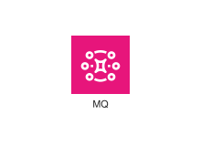
<div class="xal-ref-path">etc/resources/aws/svg/Architecture-Service-Icons/Arch_App-Integration/16/Arch_Amazon-MQ_16.svg<br>6904 bytes</div>
</div>
</div>
{{#endtab}}
{{#tab name="Code"}}

```xml
{{#include ../samples/icons/Architecture-Service-Icons/arch-amazon-mq-16-2e593f22.xal}}
```

{{#endtab}}
{{#endtabs}}

</div>
<div class="xal-ref-card">

{{#tabs name="svg-ref-0091"}}
{{#tab name="Preview"}}
<div class="xal-ref-preview">
<div>

<div class="xal-ref-path">etc/resources/aws/svg/Architecture-Service-Icons/Arch_App-Integration/16/Arch_Amazon-Managed-Workflows-for-Apache-Airflow_16.svg<br>2433 bytes</div>
</div>
</div>
{{#endtab}}
{{#tab name="Code"}}

```xml
{{#include ../samples/icons/Architecture-Service-Icons/arch-amazon-managed-workflows-for-apache-airflow-16-eac2c84a.xal}}
```

{{#endtab}}
{{#endtabs}}

</div>
<div class="xal-ref-card">

{{#tabs name="svg-ref-0092"}}
{{#tab name="Preview"}}
<div class="xal-ref-preview">
<div>

<div class="xal-ref-path">etc/resources/aws/svg/Architecture-Service-Icons/Arch_App-Integration/16/Arch_Amazon-Simple-Notification-Service_16.svg<br>5000 bytes</div>
</div>
</div>
{{#endtab}}
{{#tab name="Code"}}

```xml
{{#include ../samples/icons/Architecture-Service-Icons/arch-amazon-simple-notification-service-16-04bf3a22.xal}}
```

{{#endtab}}
{{#endtabs}}

</div>
<div class="xal-ref-card">

{{#tabs name="svg-ref-0093"}}
{{#tab name="Preview"}}
<div class="xal-ref-preview">
<div>
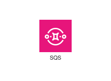
<div class="xal-ref-path">etc/resources/aws/svg/Architecture-Service-Icons/Arch_App-Integration/16/Arch_Amazon-Simple-Queue-Service_16.svg<br>4997 bytes</div>
</div>
</div>
{{#endtab}}
{{#tab name="Code"}}

```xml
{{#include ../samples/icons/Architecture-Service-Icons/arch-amazon-simple-queue-service-16-0620e277.xal}}
```

{{#endtab}}
{{#endtabs}}

</div>
<div class="xal-ref-card">

{{#tabs name="svg-ref-0094"}}
{{#tab name="Preview"}}
<div class="xal-ref-preview">
<div>
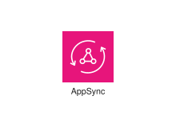
<div class="xal-ref-path">etc/resources/aws/svg/Architecture-Service-Icons/Arch_App-Integration/32/Arch_AWS-AppSync_32.svg<br>4222 bytes</div>
</div>
</div>
{{#endtab}}
{{#tab name="Code"}}

```xml
{{#include ../samples/icons/Architecture-Service-Icons/arch-aws-appsync-32-c95d96aa.xal}}
```

{{#endtab}}
{{#endtabs}}

</div>
<div class="xal-ref-card">

{{#tabs name="svg-ref-0095"}}
{{#tab name="Preview"}}
<div class="xal-ref-preview">
<div>
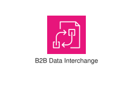
<div class="xal-ref-path">etc/resources/aws/svg/Architecture-Service-Icons/Arch_App-Integration/32/Arch_AWS-B2B-Data-Interchange_32.svg<br>2080 bytes</div>
</div>
</div>
{{#endtab}}
{{#tab name="Code"}}

```xml
{{#include ../samples/icons/Architecture-Service-Icons/arch-aws-b2b-data-interchange-32-3f5d7951.xal}}
```

{{#endtab}}
{{#endtabs}}

</div>
<div class="xal-ref-card">

{{#tabs name="svg-ref-0096"}}
{{#tab name="Preview"}}
<div class="xal-ref-preview">
<div>

<div class="xal-ref-path">etc/resources/aws/svg/Architecture-Service-Icons/Arch_App-Integration/32/Arch_AWS-Express-Workflows_32.svg<br>3514 bytes</div>
</div>
</div>
{{#endtab}}
{{#tab name="Code"}}

```xml
{{#include ../samples/icons/Architecture-Service-Icons/arch-aws-express-workflows-32-6e68e7da.xal}}
```

{{#endtab}}
{{#endtabs}}

</div>
<div class="xal-ref-card">

{{#tabs name="svg-ref-0097"}}
{{#tab name="Preview"}}
<div class="xal-ref-preview">
<div>
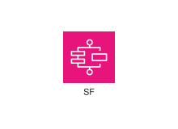
<div class="xal-ref-path">etc/resources/aws/svg/Architecture-Service-Icons/Arch_App-Integration/32/Arch_AWS-Step-Functions_32.svg<br>2040 bytes</div>
</div>
</div>
{{#endtab}}
{{#tab name="Code"}}

```xml
{{#include ../samples/icons/Architecture-Service-Icons/arch-aws-step-functions-32-c35e4230.xal}}
```

{{#endtab}}
{{#endtabs}}

</div>
<div class="xal-ref-card">

{{#tabs name="svg-ref-0098"}}
{{#tab name="Preview"}}
<div class="xal-ref-preview">
<div>
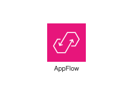
<div class="xal-ref-path">etc/resources/aws/svg/Architecture-Service-Icons/Arch_App-Integration/32/Arch_Amazon-AppFlow_32.svg<br>1318 bytes</div>
</div>
</div>
{{#endtab}}
{{#tab name="Code"}}

```xml
{{#include ../samples/icons/Architecture-Service-Icons/arch-amazon-appflow-32-cddfcffd.xal}}
```

{{#endtab}}
{{#endtabs}}

</div>
<div class="xal-ref-card">

{{#tabs name="svg-ref-0099"}}
{{#tab name="Preview"}}
<div class="xal-ref-preview">
<div>
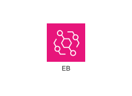
<div class="xal-ref-path">etc/resources/aws/svg/Architecture-Service-Icons/Arch_App-Integration/32/Arch_Amazon-EventBridge_32.svg<br>4209 bytes</div>
</div>
</div>
{{#endtab}}
{{#tab name="Code"}}

```xml
{{#include ../samples/icons/Architecture-Service-Icons/arch-amazon-eventbridge-32-aecdc277.xal}}
```

{{#endtab}}
{{#endtabs}}

</div>
<div class="xal-ref-card">

{{#tabs name="svg-ref-0100"}}
{{#tab name="Preview"}}
<div class="xal-ref-preview">
<div>
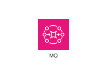
<div class="xal-ref-path">etc/resources/aws/svg/Architecture-Service-Icons/Arch_App-Integration/32/Arch_Amazon-MQ_32.svg<br>6373 bytes</div>
</div>
</div>
{{#endtab}}
{{#tab name="Code"}}

```xml
{{#include ../samples/icons/Architecture-Service-Icons/arch-amazon-mq-32-4f765575.xal}}
```

{{#endtab}}
{{#endtabs}}

</div>
<div class="xal-ref-card">

{{#tabs name="svg-ref-0101"}}
{{#tab name="Preview"}}
<div class="xal-ref-preview">
<div>

<div class="xal-ref-path">etc/resources/aws/svg/Architecture-Service-Icons/Arch_App-Integration/32/Arch_Amazon-Managed-Workflows-for-Apache-Airflow_32.svg<br>2450 bytes</div>
</div>
</div>
{{#endtab}}
{{#tab name="Code"}}

```xml
{{#include ../samples/icons/Architecture-Service-Icons/arch-amazon-managed-workflows-for-apache-airflow-32-a5af9937.xal}}
```

{{#endtab}}
{{#endtabs}}

</div>
<div class="xal-ref-card">

{{#tabs name="svg-ref-0102"}}
{{#tab name="Preview"}}
<div class="xal-ref-preview">
<div>

<div class="xal-ref-path">etc/resources/aws/svg/Architecture-Service-Icons/Arch_App-Integration/32/Arch_Amazon-Simple-Notification-Service_32.svg<br>4511 bytes</div>
</div>
</div>
{{#endtab}}
{{#tab name="Code"}}

```xml
{{#include ../samples/icons/Architecture-Service-Icons/arch-amazon-simple-notification-service-32-8ff1d6fe.xal}}
```

{{#endtab}}
{{#endtabs}}

</div>
<div class="xal-ref-card">

{{#tabs name="svg-ref-0103"}}
{{#tab name="Preview"}}
<div class="xal-ref-preview">
<div>
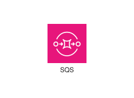
<div class="xal-ref-path">etc/resources/aws/svg/Architecture-Service-Icons/Arch_App-Integration/32/Arch_Amazon-Simple-Queue-Service_32.svg<br>5760 bytes</div>
</div>
</div>
{{#endtab}}
{{#tab name="Code"}}

```xml
{{#include ../samples/icons/Architecture-Service-Icons/arch-amazon-simple-queue-service-32-31d6a427.xal}}
```

{{#endtab}}
{{#endtabs}}

</div>
<div class="xal-ref-card">

{{#tabs name="svg-ref-0104"}}
{{#tab name="Preview"}}
<div class="xal-ref-preview">
<div>
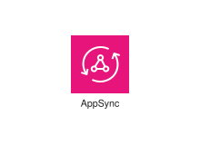
<div class="xal-ref-path">etc/resources/aws/svg/Architecture-Service-Icons/Arch_App-Integration/48/Arch_AWS-AppSync_48.svg<br>4146 bytes</div>
</div>
</div>
{{#endtab}}
{{#tab name="Code"}}

```xml
{{#include ../samples/icons/Architecture-Service-Icons/arch-aws-appsync-48-fa46707f.xal}}
```

{{#endtab}}
{{#endtabs}}

</div>
<div class="xal-ref-card">

{{#tabs name="svg-ref-0105"}}
{{#tab name="Preview"}}
<div class="xal-ref-preview">
<div>
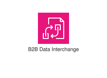
<div class="xal-ref-path">etc/resources/aws/svg/Architecture-Service-Icons/Arch_App-Integration/48/Arch_AWS-B2B-Data-Interchange_48.svg<br>1913 bytes</div>
</div>
</div>
{{#endtab}}
{{#tab name="Code"}}

```xml
{{#include ../samples/icons/Architecture-Service-Icons/arch-aws-b2b-data-interchange-48-2d276245.xal}}
```

{{#endtab}}
{{#endtabs}}

</div>
<div class="xal-ref-card">

{{#tabs name="svg-ref-0106"}}
{{#tab name="Preview"}}
<div class="xal-ref-preview">
<div>

<div class="xal-ref-path">etc/resources/aws/svg/Architecture-Service-Icons/Arch_App-Integration/48/Arch_AWS-Express-Workflows_48.svg<br>3556 bytes</div>
</div>
</div>
{{#endtab}}
{{#tab name="Code"}}

```xml
{{#include ../samples/icons/Architecture-Service-Icons/arch-aws-express-workflows-48-eb65647e.xal}}
```

{{#endtab}}
{{#endtabs}}

</div>
<div class="xal-ref-card">

{{#tabs name="svg-ref-0107"}}
{{#tab name="Preview"}}
<div class="xal-ref-preview">
<div>
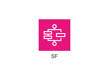
<div class="xal-ref-path">etc/resources/aws/svg/Architecture-Service-Icons/Arch_App-Integration/48/Arch_AWS-Step-Functions_48.svg<br>2060 bytes</div>
</div>
</div>
{{#endtab}}
{{#tab name="Code"}}

```xml
{{#include ../samples/icons/Architecture-Service-Icons/arch-aws-step-functions-48-cfe7a1b1.xal}}
```

{{#endtab}}
{{#endtabs}}

</div>
<div class="xal-ref-card">

{{#tabs name="svg-ref-0108"}}
{{#tab name="Preview"}}
<div class="xal-ref-preview">
<div>
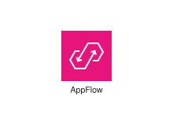
<div class="xal-ref-path">etc/resources/aws/svg/Architecture-Service-Icons/Arch_App-Integration/48/Arch_Amazon-AppFlow_48.svg<br>1169 bytes</div>
</div>
</div>
{{#endtab}}
{{#tab name="Code"}}

```xml
{{#include ../samples/icons/Architecture-Service-Icons/arch-amazon-appflow-48-66c8fc8b.xal}}
```

{{#endtab}}
{{#endtabs}}

</div>
<div class="xal-ref-card">

{{#tabs name="svg-ref-0109"}}
{{#tab name="Preview"}}
<div class="xal-ref-preview">
<div>
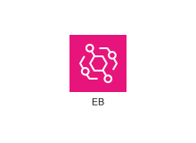
<div class="xal-ref-path">etc/resources/aws/svg/Architecture-Service-Icons/Arch_App-Integration/48/Arch_Amazon-EventBridge_48.svg<br>3916 bytes</div>
</div>
</div>
{{#endtab}}
{{#tab name="Code"}}

```xml
{{#include ../samples/icons/Architecture-Service-Icons/arch-amazon-eventbridge-48-a27421f6.xal}}
```

{{#endtab}}
{{#endtabs}}

</div>
<div class="xal-ref-card">

{{#tabs name="svg-ref-0110"}}
{{#tab name="Preview"}}
<div class="xal-ref-preview">
<div>
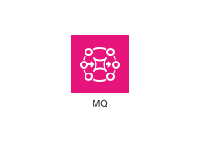
<div class="xal-ref-path">etc/resources/aws/svg/Architecture-Service-Icons/Arch_App-Integration/48/Arch_Amazon-MQ_48.svg<br>6389 bytes</div>
</div>
</div>
{{#endtab}}
{{#tab name="Code"}}

```xml
{{#include ../samples/icons/Architecture-Service-Icons/arch-amazon-mq-48-c4f4dad4.xal}}
```

{{#endtab}}
{{#endtabs}}

</div>
<div class="xal-ref-card">

{{#tabs name="svg-ref-0111"}}
{{#tab name="Preview"}}
<div class="xal-ref-preview">
<div>

<div class="xal-ref-path">etc/resources/aws/svg/Architecture-Service-Icons/Arch_App-Integration/48/Arch_Amazon-Managed-Workflows-for-Apache-Airflow_48.svg<br>2484 bytes</div>
</div>
</div>
{{#endtab}}
{{#tab name="Code"}}

```xml
{{#include ../samples/icons/Architecture-Service-Icons/arch-amazon-managed-workflows-for-apache-airflow-48-293dae7e.xal}}
```

{{#endtab}}
{{#endtabs}}

</div>
<div class="xal-ref-card">

{{#tabs name="svg-ref-0112"}}
{{#tab name="Preview"}}
<div class="xal-ref-preview">
<div>

<div class="xal-ref-path">etc/resources/aws/svg/Architecture-Service-Icons/Arch_App-Integration/48/Arch_Amazon-Simple-Notification-Service_48.svg<br>3058 bytes</div>
</div>
</div>
{{#endtab}}
{{#tab name="Code"}}

```xml
{{#include ../samples/icons/Architecture-Service-Icons/arch-amazon-simple-notification-service-48-8fb38605.xal}}
```

{{#endtab}}
{{#endtabs}}

</div>
<div class="xal-ref-card">

{{#tabs name="svg-ref-0113"}}
{{#tab name="Preview"}}
<div class="xal-ref-preview">
<div>
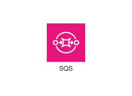
<div class="xal-ref-path">etc/resources/aws/svg/Architecture-Service-Icons/Arch_App-Integration/48/Arch_Amazon-Simple-Queue-Service_48.svg<br>5877 bytes</div>
</div>
</div>
{{#endtab}}
{{#tab name="Code"}}

```xml
{{#include ../samples/icons/Architecture-Service-Icons/arch-amazon-simple-queue-service-48-910ba539.xal}}
```

{{#endtab}}
{{#endtabs}}

</div>
<div class="xal-ref-card">

{{#tabs name="svg-ref-0114"}}
{{#tab name="Preview"}}
<div class="xal-ref-preview">
<div>
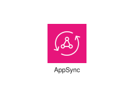
<div class="xal-ref-path">etc/resources/aws/svg/Architecture-Service-Icons/Arch_App-Integration/64/Arch_AWS-AppSync_64.svg<br>4045 bytes</div>
</div>
</div>
{{#endtab}}
{{#tab name="Code"}}

```xml
{{#include ../samples/icons/Architecture-Service-Icons/arch-aws-appsync-64-b082ae56.xal}}
```

{{#endtab}}
{{#endtabs}}

</div>
<div class="xal-ref-card">

{{#tabs name="svg-ref-0115"}}
{{#tab name="Preview"}}
<div class="xal-ref-preview">
<div>
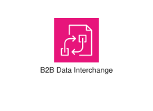
<div class="xal-ref-path">etc/resources/aws/svg/Architecture-Service-Icons/Arch_App-Integration/64/Arch_AWS-B2B-Data-Interchange_64.svg<br>2321 bytes</div>
</div>
</div>
{{#endtab}}
{{#tab name="Code"}}

```xml
{{#include ../samples/icons/Architecture-Service-Icons/arch-aws-b2b-data-interchange-64-d4dc3ec0.xal}}
```

{{#endtab}}
{{#endtabs}}

</div>
<div class="xal-ref-card">

{{#tabs name="svg-ref-0116"}}
{{#tab name="Preview"}}
<div class="xal-ref-preview">
<div>

<div class="xal-ref-path">etc/resources/aws/svg/Architecture-Service-Icons/Arch_App-Integration/64/Arch_AWS-Express-Workflows_64.svg<br>3330 bytes</div>
</div>
</div>
{{#endtab}}
{{#tab name="Code"}}

```xml
{{#include ../samples/icons/Architecture-Service-Icons/arch-aws-express-workflows-64-d01275b8.xal}}
```

{{#endtab}}
{{#endtabs}}

</div>
<div class="xal-ref-card">

{{#tabs name="svg-ref-0117"}}
{{#tab name="Preview"}}
<div class="xal-ref-preview">
<div>

<div class="xal-ref-path">etc/resources/aws/svg/Architecture-Service-Icons/Arch_App-Integration/64/Arch_AWS-Step-Functions_64.svg<br>2040 bytes</div>
</div>
</div>
{{#endtab}}
{{#tab name="Code"}}

```xml
{{#include ../samples/icons/Architecture-Service-Icons/arch-aws-step-functions-64-b8a4e223.xal}}
```

{{#endtab}}
{{#endtabs}}

</div>
<div class="xal-ref-card">

{{#tabs name="svg-ref-0118"}}
{{#tab name="Preview"}}
<div class="xal-ref-preview">
<div>

<div class="xal-ref-path">etc/resources/aws/svg/Architecture-Service-Icons/Arch_App-Integration/64/Arch_Amazon-AppFlow_64.svg<br>1201 bytes</div>
</div>
</div>
{{#endtab}}
{{#tab name="Code"}}

```xml
{{#include ../samples/icons/Architecture-Service-Icons/arch-amazon-appflow-64-23871e55.xal}}
```

{{#endtab}}
{{#endtabs}}

</div>
<div class="xal-ref-card">

{{#tabs name="svg-ref-0119"}}
{{#tab name="Preview"}}
<div class="xal-ref-preview">
<div>
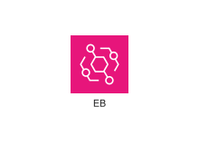
<div class="xal-ref-path">etc/resources/aws/svg/Architecture-Service-Icons/Arch_App-Integration/64/Arch_Amazon-EventBridge_64.svg<br>4013 bytes</div>
</div>
</div>
{{#endtab}}
{{#tab name="Code"}}

```xml
{{#include ../samples/icons/Architecture-Service-Icons/arch-amazon-eventbridge-64-d5376264.xal}}
```

{{#endtab}}
{{#endtabs}}

</div>
<div class="xal-ref-card">

{{#tabs name="svg-ref-0120"}}
{{#tab name="Preview"}}
<div class="xal-ref-preview">
<div>
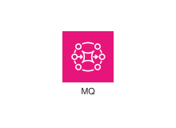
<div class="xal-ref-path">etc/resources/aws/svg/Architecture-Service-Icons/Arch_App-Integration/64/Arch_Amazon-MQ_64.svg<br>4526 bytes</div>
</div>
</div>
{{#endtab}}
{{#tab name="Code"}}

```xml
{{#include ../samples/icons/Architecture-Service-Icons/arch-amazon-mq-64-9512b864.xal}}
```

{{#endtab}}
{{#endtabs}}

</div>
<div class="xal-ref-card">

{{#tabs name="svg-ref-0121"}}
{{#tab name="Preview"}}
<div class="xal-ref-preview">
<div>

<div class="xal-ref-path">etc/resources/aws/svg/Architecture-Service-Icons/Arch_App-Integration/64/Arch_Amazon-Managed-Workflows-for-Apache-Airflow_64.svg<br>2844 bytes</div>
</div>
</div>
{{#endtab}}
{{#tab name="Code"}}

```xml
{{#include ../samples/icons/Architecture-Service-Icons/arch-amazon-managed-workflows-for-apache-airflow-64-937627e2.xal}}
```

{{#endtab}}
{{#endtabs}}

</div>
<div class="xal-ref-card">

{{#tabs name="svg-ref-0122"}}
{{#tab name="Preview"}}
<div class="xal-ref-preview">
<div>
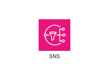
<div class="xal-ref-path">etc/resources/aws/svg/Architecture-Service-Icons/Arch_App-Integration/64/Arch_Amazon-Simple-Notification-Service_64.svg<br>2922 bytes</div>
</div>
</div>
{{#endtab}}
{{#tab name="Code"}}

```xml
{{#include ../samples/icons/Architecture-Service-Icons/arch-amazon-simple-notification-service-64-027341b9.xal}}
```

{{#endtab}}
{{#endtabs}}

</div>
<div class="xal-ref-card">

{{#tabs name="svg-ref-0123"}}
{{#tab name="Preview"}}
<div class="xal-ref-preview">
<div>
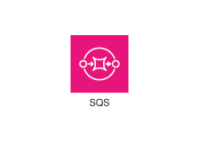
<div class="xal-ref-path">etc/resources/aws/svg/Architecture-Service-Icons/Arch_App-Integration/64/Arch_Amazon-Simple-Queue-Service_64.svg<br>6056 bytes</div>
</div>
</div>
{{#endtab}}
{{#tab name="Code"}}

```xml
{{#include ../samples/icons/Architecture-Service-Icons/arch-amazon-simple-queue-service-64-bbf534a4.xal}}
```

{{#endtab}}
{{#endtabs}}

</div>
<div class="xal-ref-card">

{{#tabs name="svg-ref-0124"}}
{{#tab name="Preview"}}
<div class="xal-ref-preview">
<div>
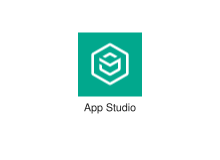
<div class="xal-ref-path">etc/resources/aws/svg/Architecture-Service-Icons/Arch_Artificial-Intelligence/16/Arch_AWS-App-Studio_16.svg<br>1272 bytes</div>
</div>
</div>
{{#endtab}}
{{#tab name="Code"}}

```xml
{{#include ../samples/icons/Architecture-Service-Icons/arch-aws-app-studio-16-a494f105.xal}}
```

{{#endtab}}
{{#endtabs}}

</div>
<div class="xal-ref-card">

{{#tabs name="svg-ref-0125"}}
{{#tab name="Preview"}}
<div class="xal-ref-preview">
<div>
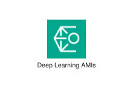
<div class="xal-ref-path">etc/resources/aws/svg/Architecture-Service-Icons/Arch_Artificial-Intelligence/16/Arch_AWS-Deep-Learning-AMIs_16.svg<br>1794 bytes</div>
</div>
</div>
{{#endtab}}
{{#tab name="Code"}}

```xml
{{#include ../samples/icons/Architecture-Service-Icons/arch-aws-deep-learning-amis-16-75a9ed8f.xal}}
```

{{#endtab}}
{{#endtabs}}

</div>
<div class="xal-ref-card">

{{#tabs name="svg-ref-0126"}}
{{#tab name="Preview"}}
<div class="xal-ref-preview">
<div>

<div class="xal-ref-path">etc/resources/aws/svg/Architecture-Service-Icons/Arch_Artificial-Intelligence/16/Arch_AWS-Deep-Learning-Containers_16.svg<br>2623 bytes</div>
</div>
</div>
{{#endtab}}
{{#tab name="Code"}}

```xml
{{#include ../samples/icons/Architecture-Service-Icons/arch-aws-deep-learning-containers-16-24e5ec81.xal}}
```

{{#endtab}}
{{#endtabs}}

</div>
<div class="xal-ref-card">

{{#tabs name="svg-ref-0127"}}
{{#tab name="Preview"}}
<div class="xal-ref-preview">
<div>

<div class="xal-ref-path">etc/resources/aws/svg/Architecture-Service-Icons/Arch_Artificial-Intelligence/16/Arch_AWS-DeepComposer_16.svg<br>2116 bytes</div>
</div>
</div>
{{#endtab}}
{{#tab name="Code"}}

```xml
{{#include ../samples/icons/Architecture-Service-Icons/arch-aws-deepcomposer-16-a66bb89b.xal}}
```

{{#endtab}}
{{#endtabs}}

</div>
<div class="xal-ref-card">

{{#tabs name="svg-ref-0128"}}
{{#tab name="Preview"}}
<div class="xal-ref-preview">
<div>

<div class="xal-ref-path">etc/resources/aws/svg/Architecture-Service-Icons/Arch_Artificial-Intelligence/16/Arch_AWS-DeepRacer_16.svg<br>6698 bytes</div>
</div>
</div>
{{#endtab}}
{{#tab name="Code"}}

```xml
{{#include ../samples/icons/Architecture-Service-Icons/arch-aws-deepracer-16-7df90cc0.xal}}
```

{{#endtab}}
{{#endtabs}}

</div>
<div class="xal-ref-card">

{{#tabs name="svg-ref-0129"}}
{{#tab name="Preview"}}
<div class="xal-ref-preview">
<div>

<div class="xal-ref-path">etc/resources/aws/svg/Architecture-Service-Icons/Arch_Artificial-Intelligence/16/Arch_AWS-HealthImaging_16.svg<br>4889 bytes</div>
</div>
</div>
{{#endtab}}
{{#tab name="Code"}}

```xml
{{#include ../samples/icons/Architecture-Service-Icons/arch-aws-healthimaging-16-87ec329b.xal}}
```

{{#endtab}}
{{#endtabs}}

</div>
<div class="xal-ref-card">

{{#tabs name="svg-ref-0130"}}
{{#tab name="Preview"}}
<div class="xal-ref-preview">
<div>

<div class="xal-ref-path">etc/resources/aws/svg/Architecture-Service-Icons/Arch_Artificial-Intelligence/16/Arch_AWS-HealthLake_16.svg<br>2262 bytes</div>
</div>
</div>
{{#endtab}}
{{#tab name="Code"}}

```xml
{{#include ../samples/icons/Architecture-Service-Icons/arch-aws-healthlake-16-b554a333.xal}}
```

{{#endtab}}
{{#endtabs}}

</div>
<div class="xal-ref-card">

{{#tabs name="svg-ref-0131"}}
{{#tab name="Preview"}}
<div class="xal-ref-preview">
<div>

<div class="xal-ref-path">etc/resources/aws/svg/Architecture-Service-Icons/Arch_Artificial-Intelligence/16/Arch_AWS-HealthOmics_16.svg<br>2332 bytes</div>
</div>
</div>
{{#endtab}}
{{#tab name="Code"}}

```xml
{{#include ../samples/icons/Architecture-Service-Icons/arch-aws-healthomics-16-e06a5d9d.xal}}
```

{{#endtab}}
{{#endtabs}}

</div>
<div class="xal-ref-card">

{{#tabs name="svg-ref-0132"}}
{{#tab name="Preview"}}
<div class="xal-ref-preview">
<div>

<div class="xal-ref-path">etc/resources/aws/svg/Architecture-Service-Icons/Arch_Artificial-Intelligence/16/Arch_AWS-HealthScribe_16.svg<br>2784 bytes</div>
</div>
</div>
{{#endtab}}
{{#tab name="Code"}}

```xml
{{#include ../samples/icons/Architecture-Service-Icons/arch-aws-healthscribe-16-872c75eb.xal}}
```

{{#endtab}}
{{#endtabs}}

</div>
<div class="xal-ref-card">

{{#tabs name="svg-ref-0133"}}
{{#tab name="Preview"}}
<div class="xal-ref-preview">
<div>
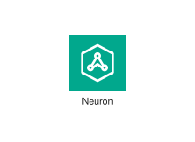
<div class="xal-ref-path">etc/resources/aws/svg/Architecture-Service-Icons/Arch_Artificial-Intelligence/16/Arch_AWS-Neuron_16.svg<br>2963 bytes</div>
</div>
</div>
{{#endtab}}
{{#tab name="Code"}}

```xml
{{#include ../samples/icons/Architecture-Service-Icons/arch-aws-neuron-16-c3b85a73.xal}}
```

{{#endtab}}
{{#endtabs}}

</div>
<div class="xal-ref-card">

{{#tabs name="svg-ref-0134"}}
{{#tab name="Preview"}}
<div class="xal-ref-preview">
<div>
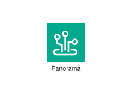
<div class="xal-ref-path">etc/resources/aws/svg/Architecture-Service-Icons/Arch_Artificial-Intelligence/16/Arch_AWS-Panorama_16.svg<br>1947 bytes</div>
</div>
</div>
{{#endtab}}
{{#tab name="Code"}}

```xml
{{#include ../samples/icons/Architecture-Service-Icons/arch-aws-panorama-16-bda11f2a.xal}}
```

{{#endtab}}
{{#endtabs}}

</div>
<div class="xal-ref-card">

{{#tabs name="svg-ref-0135"}}
{{#tab name="Preview"}}
<div class="xal-ref-preview">
<div>
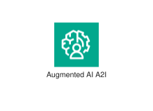
<div class="xal-ref-path">etc/resources/aws/svg/Architecture-Service-Icons/Arch_Artificial-Intelligence/16/Arch_Amazon-Augmented-AI-A2I_16.svg<br>4255 bytes</div>
</div>
</div>
{{#endtab}}
{{#tab name="Code"}}

```xml
{{#include ../samples/icons/Architecture-Service-Icons/arch-amazon-augmented-ai-a2i-16-62572cb9.xal}}
```

{{#endtab}}
{{#endtabs}}

</div>
<div class="xal-ref-card">

{{#tabs name="svg-ref-0136"}}
{{#tab name="Preview"}}
<div class="xal-ref-preview">
<div>
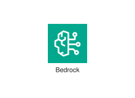
<div class="xal-ref-path">etc/resources/aws/svg/Architecture-Service-Icons/Arch_Artificial-Intelligence/16/Arch_Amazon-Bedrock_16.svg<br>3616 bytes</div>
</div>
</div>
{{#endtab}}
{{#tab name="Code"}}

```xml
{{#include ../samples/icons/Architecture-Service-Icons/arch-amazon-bedrock-16-570edd40.xal}}
```

{{#endtab}}
{{#endtabs}}

</div>
<div class="xal-ref-card">

{{#tabs name="svg-ref-0137"}}
{{#tab name="Preview"}}
<div class="xal-ref-preview">
<div>

<div class="xal-ref-path">etc/resources/aws/svg/Architecture-Service-Icons/Arch_Artificial-Intelligence/16/Arch_Amazon-CodeGuru_16.svg<br>1453 bytes</div>
</div>
</div>
{{#endtab}}
{{#tab name="Code"}}

```xml
{{#include ../samples/icons/Architecture-Service-Icons/arch-amazon-codeguru-16-e040a975.xal}}
```

{{#endtab}}
{{#endtabs}}

</div>
<div class="xal-ref-card">

{{#tabs name="svg-ref-0138"}}
{{#tab name="Preview"}}
<div class="xal-ref-preview">
<div>

<div class="xal-ref-path">etc/resources/aws/svg/Architecture-Service-Icons/Arch_Artificial-Intelligence/16/Arch_Amazon-CodeWhisperer_16.svg<br>2643 bytes</div>
</div>
</div>
{{#endtab}}
{{#tab name="Code"}}

```xml
{{#include ../samples/icons/Architecture-Service-Icons/arch-amazon-codewhisperer-16-8937953d.xal}}
```

{{#endtab}}
{{#endtabs}}

</div>
<div class="xal-ref-card">

{{#tabs name="svg-ref-0139"}}
{{#tab name="Preview"}}
<div class="xal-ref-preview">
<div>

<div class="xal-ref-path">etc/resources/aws/svg/Architecture-Service-Icons/Arch_Artificial-Intelligence/16/Arch_Amazon-Comprehend-Medical_16.svg<br>2646 bytes</div>
</div>
</div>
{{#endtab}}
{{#tab name="Code"}}

```xml
{{#include ../samples/icons/Architecture-Service-Icons/arch-amazon-comprehend-medical-16-a72f79ce.xal}}
```

{{#endtab}}
{{#endtabs}}

</div>
<div class="xal-ref-card">

{{#tabs name="svg-ref-0140"}}
{{#tab name="Preview"}}
<div class="xal-ref-preview">
<div>
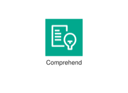
<div class="xal-ref-path">etc/resources/aws/svg/Architecture-Service-Icons/Arch_Artificial-Intelligence/16/Arch_Amazon-Comprehend_16.svg<br>2128 bytes</div>
</div>
</div>
{{#endtab}}
{{#tab name="Code"}}

```xml
{{#include ../samples/icons/Architecture-Service-Icons/arch-amazon-comprehend-16-b255ce51.xal}}
```

{{#endtab}}
{{#endtabs}}

</div>
<div class="xal-ref-card">

{{#tabs name="svg-ref-0141"}}
{{#tab name="Preview"}}
<div class="xal-ref-preview">
<div>

<div class="xal-ref-path">etc/resources/aws/svg/Architecture-Service-Icons/Arch_Artificial-Intelligence/16/Arch_Amazon-DevOps-Guru_16.svg<br>4611 bytes</div>
</div>
</div>
{{#endtab}}
{{#tab name="Code"}}

```xml
{{#include ../samples/icons/Architecture-Service-Icons/arch-amazon-devops-guru-16-fb2c1469.xal}}
```

{{#endtab}}
{{#endtabs}}

</div>
<div class="xal-ref-card">

{{#tabs name="svg-ref-0142"}}
{{#tab name="Preview"}}
<div class="xal-ref-preview">
<div>
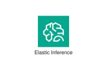
<div class="xal-ref-path">etc/resources/aws/svg/Architecture-Service-Icons/Arch_Artificial-Intelligence/16/Arch_Amazon-Elastic-Inference_16.svg<br>2584 bytes</div>
</div>
</div>
{{#endtab}}
{{#tab name="Code"}}

```xml
{{#include ../samples/icons/Architecture-Service-Icons/arch-amazon-elastic-inference-16-778c28e6.xal}}
```

{{#endtab}}
{{#endtabs}}

</div>
<div class="xal-ref-card">

{{#tabs name="svg-ref-0143"}}
{{#tab name="Preview"}}
<div class="xal-ref-preview">
<div>
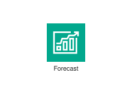
<div class="xal-ref-path">etc/resources/aws/svg/Architecture-Service-Icons/Arch_Artificial-Intelligence/16/Arch_Amazon-Forecast_16.svg<br>1247 bytes</div>
</div>
</div>
{{#endtab}}
{{#tab name="Code"}}

```xml
{{#include ../samples/icons/Architecture-Service-Icons/arch-amazon-forecast-16-04f4a7e3.xal}}
```

{{#endtab}}
{{#endtabs}}

</div>
<div class="xal-ref-card">

{{#tabs name="svg-ref-0144"}}
{{#tab name="Preview"}}
<div class="xal-ref-preview">
<div>
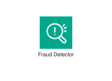
<div class="xal-ref-path">etc/resources/aws/svg/Architecture-Service-Icons/Arch_Artificial-Intelligence/16/Arch_Amazon-Fraud-Detector_16.svg<br>2543 bytes</div>
</div>
</div>
{{#endtab}}
{{#tab name="Code"}}

```xml
{{#include ../samples/icons/Architecture-Service-Icons/arch-amazon-fraud-detector-16-e464df77.xal}}
```

{{#endtab}}
{{#endtabs}}

</div>
<div class="xal-ref-card">

{{#tabs name="svg-ref-0145"}}
{{#tab name="Preview"}}
<div class="xal-ref-preview">
<div>
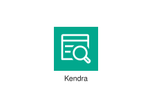
<div class="xal-ref-path">etc/resources/aws/svg/Architecture-Service-Icons/Arch_Artificial-Intelligence/16/Arch_Amazon-Kendra_16.svg<br>2810 bytes</div>
</div>
</div>
{{#endtab}}
{{#tab name="Code"}}

```xml
{{#include ../samples/icons/Architecture-Service-Icons/arch-amazon-kendra-16-03de31f2.xal}}
```

{{#endtab}}
{{#endtabs}}

</div>
<div class="xal-ref-card">

{{#tabs name="svg-ref-0146"}}
{{#tab name="Preview"}}
<div class="xal-ref-preview">
<div>

<div class="xal-ref-path">etc/resources/aws/svg/Architecture-Service-Icons/Arch_Artificial-Intelligence/16/Arch_Amazon-Lex_16.svg<br>2559 bytes</div>
</div>
</div>
{{#endtab}}
{{#tab name="Code"}}

```xml
{{#include ../samples/icons/Architecture-Service-Icons/arch-amazon-lex-16-6433de07.xal}}
```

{{#endtab}}
{{#endtabs}}

</div>
<div class="xal-ref-card">

{{#tabs name="svg-ref-0147"}}
{{#tab name="Preview"}}
<div class="xal-ref-preview">
<div>
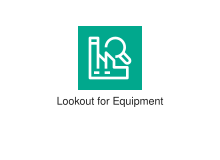
<div class="xal-ref-path">etc/resources/aws/svg/Architecture-Service-Icons/Arch_Artificial-Intelligence/16/Arch_Amazon-Lookout-for-Equipment_16.svg<br>1970 bytes</div>
</div>
</div>
{{#endtab}}
{{#tab name="Code"}}

```xml
{{#include ../samples/icons/Architecture-Service-Icons/arch-amazon-lookout-for-equipment-16-20ffad79.xal}}
```

{{#endtab}}
{{#endtabs}}

</div>
<div class="xal-ref-card">

{{#tabs name="svg-ref-0148"}}
{{#tab name="Preview"}}
<div class="xal-ref-preview">
<div>
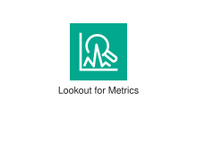
<div class="xal-ref-path">etc/resources/aws/svg/Architecture-Service-Icons/Arch_Artificial-Intelligence/16/Arch_Amazon-Lookout-for-Metrics_16.svg<br>2025 bytes</div>
</div>
</div>
{{#endtab}}
{{#tab name="Code"}}

```xml
{{#include ../samples/icons/Architecture-Service-Icons/arch-amazon-lookout-for-metrics-16-d93c5e56.xal}}
```

{{#endtab}}
{{#endtabs}}

</div>
<div class="xal-ref-card">

{{#tabs name="svg-ref-0149"}}
{{#tab name="Preview"}}
<div class="xal-ref-preview">
<div>
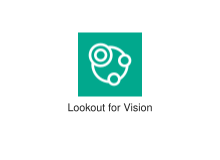
<div class="xal-ref-path">etc/resources/aws/svg/Architecture-Service-Icons/Arch_Artificial-Intelligence/16/Arch_Amazon-Lookout-for-Vision_16.svg<br>2046 bytes</div>
</div>
</div>
{{#endtab}}
{{#tab name="Code"}}

```xml
{{#include ../samples/icons/Architecture-Service-Icons/arch-amazon-lookout-for-vision-16-c30d5a61.xal}}
```

{{#endtab}}
{{#endtabs}}

</div>
<div class="xal-ref-card">

{{#tabs name="svg-ref-0150"}}
{{#tab name="Preview"}}
<div class="xal-ref-preview">
<div>
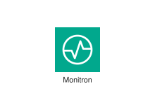
<div class="xal-ref-path">etc/resources/aws/svg/Architecture-Service-Icons/Arch_Artificial-Intelligence/16/Arch_Amazon-Monitron_16.svg<br>1289 bytes</div>
</div>
</div>
{{#endtab}}
{{#tab name="Code"}}

```xml
{{#include ../samples/icons/Architecture-Service-Icons/arch-amazon-monitron-16-1d6c2498.xal}}
```

{{#endtab}}
{{#endtabs}}

</div>
<div class="xal-ref-card">

{{#tabs name="svg-ref-0151"}}
{{#tab name="Preview"}}
<div class="xal-ref-preview">
<div>
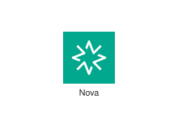
<div class="xal-ref-path">etc/resources/aws/svg/Architecture-Service-Icons/Arch_Artificial-Intelligence/16/Arch_Amazon-Nova_16.svg<br>1507 bytes</div>
</div>
</div>
{{#endtab}}
{{#tab name="Code"}}

```xml
{{#include ../samples/icons/Architecture-Service-Icons/arch-amazon-nova-16-7276e319.xal}}
```

{{#endtab}}
{{#endtabs}}

</div>
<div class="xal-ref-card">

{{#tabs name="svg-ref-0152"}}
{{#tab name="Preview"}}
<div class="xal-ref-preview">
<div>

<div class="xal-ref-path">etc/resources/aws/svg/Architecture-Service-Icons/Arch_Artificial-Intelligence/16/Arch_Amazon-Personalize_16.svg<br>1622 bytes</div>
</div>
</div>
{{#endtab}}
{{#tab name="Code"}}

```xml
{{#include ../samples/icons/Architecture-Service-Icons/arch-amazon-personalize-16-2a6c954c.xal}}
```

{{#endtab}}
{{#endtabs}}

</div>
<div class="xal-ref-card">

{{#tabs name="svg-ref-0153"}}
{{#tab name="Preview"}}
<div class="xal-ref-preview">
<div>
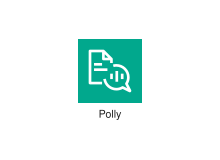
<div class="xal-ref-path">etc/resources/aws/svg/Architecture-Service-Icons/Arch_Artificial-Intelligence/16/Arch_Amazon-Polly_16.svg<br>3037 bytes</div>
</div>
</div>
{{#endtab}}
{{#tab name="Code"}}

```xml
{{#include ../samples/icons/Architecture-Service-Icons/arch-amazon-polly-16-84578bd7.xal}}
```

{{#endtab}}
{{#endtabs}}

</div>
<div class="xal-ref-card">

{{#tabs name="svg-ref-0154"}}
{{#tab name="Preview"}}
<div class="xal-ref-preview">
<div>

<div class="xal-ref-path">etc/resources/aws/svg/Architecture-Service-Icons/Arch_Artificial-Intelligence/16/Arch_Amazon-Q_16.svg<br>1846 bytes</div>
</div>
</div>
{{#endtab}}
{{#tab name="Code"}}

```xml
{{#include ../samples/icons/Architecture-Service-Icons/arch-amazon-q-16-3a239699.xal}}
```

{{#endtab}}
{{#endtabs}}

</div>
<div class="xal-ref-card">

{{#tabs name="svg-ref-0155"}}
{{#tab name="Preview"}}
<div class="xal-ref-preview">
<div>

<div class="xal-ref-path">etc/resources/aws/svg/Architecture-Service-Icons/Arch_Artificial-Intelligence/16/Arch_Amazon-Rekognition_16.svg<br>2560 bytes</div>
</div>
</div>
{{#endtab}}
{{#tab name="Code"}}

```xml
{{#include ../samples/icons/Architecture-Service-Icons/arch-amazon-rekognition-16-8f2eae0a.xal}}
```

{{#endtab}}
{{#endtabs}}

</div>
<div class="xal-ref-card">

{{#tabs name="svg-ref-0156"}}
{{#tab name="Preview"}}
<div class="xal-ref-preview">
<div>

<div class="xal-ref-path">etc/resources/aws/svg/Architecture-Service-Icons/Arch_Artificial-Intelligence/16/Arch_Amazon-SageMaker-AI_16.svg<br>3495 bytes</div>
</div>
</div>
{{#endtab}}
{{#tab name="Code"}}

```xml
{{#include ../samples/icons/Architecture-Service-Icons/arch-amazon-sagemaker-ai-16-18bdb648.xal}}
```

{{#endtab}}
{{#endtabs}}

</div>
<div class="xal-ref-card">

{{#tabs name="svg-ref-0157"}}
{{#tab name="Preview"}}
<div class="xal-ref-preview">
<div>

<div class="xal-ref-path">etc/resources/aws/svg/Architecture-Service-Icons/Arch_Artificial-Intelligence/16/Arch_Amazon-SageMaker-Ground-Truth_16.svg<br>3724 bytes</div>
</div>
</div>
{{#endtab}}
{{#tab name="Code"}}

```xml
{{#include ../samples/icons/Architecture-Service-Icons/arch-amazon-sagemaker-ground-truth-16-a0435a41.xal}}
```

{{#endtab}}
{{#endtabs}}

</div>
<div class="xal-ref-card">

{{#tabs name="svg-ref-0158"}}
{{#tab name="Preview"}}
<div class="xal-ref-preview">
<div>

<div class="xal-ref-path">etc/resources/aws/svg/Architecture-Service-Icons/Arch_Artificial-Intelligence/16/Arch_Amazon-SageMaker-Studio-Lab_16.svg<br>2715 bytes</div>
</div>
</div>
{{#endtab}}
{{#tab name="Code"}}

```xml
{{#include ../samples/icons/Architecture-Service-Icons/arch-amazon-sagemaker-studio-lab-16-e4a44f80.xal}}
```

{{#endtab}}
{{#endtabs}}

</div>
<div class="xal-ref-card">

{{#tabs name="svg-ref-0159"}}
{{#tab name="Preview"}}
<div class="xal-ref-preview">
<div>
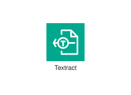
<div class="xal-ref-path">etc/resources/aws/svg/Architecture-Service-Icons/Arch_Artificial-Intelligence/16/Arch_Amazon-Textract_16.svg<br>2547 bytes</div>
</div>
</div>
{{#endtab}}
{{#tab name="Code"}}

```xml
{{#include ../samples/icons/Architecture-Service-Icons/arch-amazon-textract-16-547dcd69.xal}}
```

{{#endtab}}
{{#endtabs}}

</div>
<div class="xal-ref-card">

{{#tabs name="svg-ref-0160"}}
{{#tab name="Preview"}}
<div class="xal-ref-preview">
<div>

<div class="xal-ref-path">etc/resources/aws/svg/Architecture-Service-Icons/Arch_Artificial-Intelligence/16/Arch_Amazon-Transcribe_16.svg<br>2909 bytes</div>
</div>
</div>
{{#endtab}}
{{#tab name="Code"}}

```xml
{{#include ../samples/icons/Architecture-Service-Icons/arch-amazon-transcribe-16-cc776486.xal}}
```

{{#endtab}}
{{#endtabs}}

</div>
<div class="xal-ref-card">

{{#tabs name="svg-ref-0161"}}
{{#tab name="Preview"}}
<div class="xal-ref-preview">
<div>

<div class="xal-ref-path">etc/resources/aws/svg/Architecture-Service-Icons/Arch_Artificial-Intelligence/16/Arch_Amazon-Translate_16.svg<br>3961 bytes</div>
</div>
</div>
{{#endtab}}
{{#tab name="Code"}}

```xml
{{#include ../samples/icons/Architecture-Service-Icons/arch-amazon-translate-16-16915fe5.xal}}
```

{{#endtab}}
{{#endtabs}}

</div>
<div class="xal-ref-card">

{{#tabs name="svg-ref-0162"}}
{{#tab name="Preview"}}
<div class="xal-ref-preview">
<div>

<div class="xal-ref-path">etc/resources/aws/svg/Architecture-Service-Icons/Arch_Artificial-Intelligence/16/Arch_Apache-MXNet-on-AWS_16.svg<br>1922 bytes</div>
</div>
</div>
{{#endtab}}
{{#tab name="Code"}}

```xml
{{#include ../samples/icons/Architecture-Service-Icons/arch-apache-mxnet-on-aws-16-a258e08f.xal}}
```

{{#endtab}}
{{#endtabs}}

</div>
<div class="xal-ref-card">

{{#tabs name="svg-ref-0163"}}
{{#tab name="Preview"}}
<div class="xal-ref-preview">
<div>

<div class="xal-ref-path">etc/resources/aws/svg/Architecture-Service-Icons/Arch_Artificial-Intelligence/16/Arch_PyTorch-on-AWS_16.svg<br>1398 bytes</div>
</div>
</div>
{{#endtab}}
{{#tab name="Code"}}

```xml
{{#include ../samples/icons/Architecture-Service-Icons/arch-pytorch-on-aws-16-8cd13ada.xal}}
```

{{#endtab}}
{{#endtabs}}

</div>
<div class="xal-ref-card">

{{#tabs name="svg-ref-0164"}}
{{#tab name="Preview"}}
<div class="xal-ref-preview">
<div>
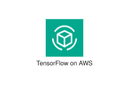
<div class="xal-ref-path">etc/resources/aws/svg/Architecture-Service-Icons/Arch_Artificial-Intelligence/16/Arch_TensorFlow-on-AWS_16.svg<br>1916 bytes</div>
</div>
</div>
{{#endtab}}
{{#tab name="Code"}}

```xml
{{#include ../samples/icons/Architecture-Service-Icons/arch-tensorflow-on-aws-16-9fb60b39.xal}}
```

{{#endtab}}
{{#endtabs}}

</div>
<div class="xal-ref-card">

{{#tabs name="svg-ref-0165"}}
{{#tab name="Preview"}}
<div class="xal-ref-preview">
<div>
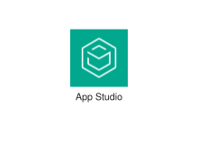
<div class="xal-ref-path">etc/resources/aws/svg/Architecture-Service-Icons/Arch_Artificial-Intelligence/32/Arch_AWS-App-Studio_32.svg<br>1312 bytes</div>
</div>
</div>
{{#endtab}}
{{#tab name="Code"}}

```xml
{{#include ../samples/icons/Architecture-Service-Icons/arch-aws-app-studio-32-dc04b0f2.xal}}
```

{{#endtab}}
{{#endtabs}}

</div>
<div class="xal-ref-card">

{{#tabs name="svg-ref-0166"}}
{{#tab name="Preview"}}
<div class="xal-ref-preview">
<div>
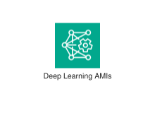
<div class="xal-ref-path">etc/resources/aws/svg/Architecture-Service-Icons/Arch_Artificial-Intelligence/32/Arch_AWS-Deep-Learning-AMIs_32.svg<br>4927 bytes</div>
</div>
</div>
{{#endtab}}
{{#tab name="Code"}}

```xml
{{#include ../samples/icons/Architecture-Service-Icons/arch-aws-deep-learning-amis-32-2f209aac.xal}}
```

{{#endtab}}
{{#endtabs}}

</div>
<div class="xal-ref-card">

{{#tabs name="svg-ref-0167"}}
{{#tab name="Preview"}}
<div class="xal-ref-preview">
<div>

<div class="xal-ref-path">etc/resources/aws/svg/Architecture-Service-Icons/Arch_Artificial-Intelligence/32/Arch_AWS-Deep-Learning-Containers_32.svg<br>3501 bytes</div>
</div>
</div>
{{#endtab}}
{{#tab name="Code"}}

```xml
{{#include ../samples/icons/Architecture-Service-Icons/arch-aws-deep-learning-containers-32-fbff1fc7.xal}}
```

{{#endtab}}
{{#endtabs}}

</div>
<div class="xal-ref-card">

{{#tabs name="svg-ref-0168"}}
{{#tab name="Preview"}}
<div class="xal-ref-preview">
<div>

<div class="xal-ref-path">etc/resources/aws/svg/Architecture-Service-Icons/Arch_Artificial-Intelligence/32/Arch_AWS-DeepComposer_32.svg<br>2453 bytes</div>
</div>
</div>
{{#endtab}}
{{#tab name="Code"}}

```xml
{{#include ../samples/icons/Architecture-Service-Icons/arch-aws-deepcomposer-32-f26fe2d2.xal}}
```

{{#endtab}}
{{#endtabs}}

</div>
<div class="xal-ref-card">

{{#tabs name="svg-ref-0169"}}
{{#tab name="Preview"}}
<div class="xal-ref-preview">
<div>

<div class="xal-ref-path">etc/resources/aws/svg/Architecture-Service-Icons/Arch_Artificial-Intelligence/32/Arch_AWS-DeepRacer_32.svg<br>10232 bytes</div>
</div>
</div>
{{#endtab}}
{{#tab name="Code"}}

```xml
{{#include ../samples/icons/Architecture-Service-Icons/arch-aws-deepracer-32-a79b9a74.xal}}
```

{{#endtab}}
{{#endtabs}}

</div>
<div class="xal-ref-card">

{{#tabs name="svg-ref-0170"}}
{{#tab name="Preview"}}
<div class="xal-ref-preview">
<div>

<div class="xal-ref-path">etc/resources/aws/svg/Architecture-Service-Icons/Arch_Artificial-Intelligence/32/Arch_AWS-HealthImaging_32.svg<br>5207 bytes</div>
</div>
</div>
{{#endtab}}
{{#tab name="Code"}}

```xml
{{#include ../samples/icons/Architecture-Service-Icons/arch-aws-healthimaging-32-3cfe9b01.xal}}
```

{{#endtab}}
{{#endtabs}}

</div>
<div class="xal-ref-card">

{{#tabs name="svg-ref-0171"}}
{{#tab name="Preview"}}
<div class="xal-ref-preview">
<div>

<div class="xal-ref-path">etc/resources/aws/svg/Architecture-Service-Icons/Arch_Artificial-Intelligence/32/Arch_AWS-HealthLake_32.svg<br>2435 bytes</div>
</div>
</div>
{{#endtab}}
{{#tab name="Code"}}

```xml
{{#include ../samples/icons/Architecture-Service-Icons/arch-aws-healthlake-32-cdc4e2c4.xal}}
```

{{#endtab}}
{{#endtabs}}

</div>
<div class="xal-ref-card">

{{#tabs name="svg-ref-0172"}}
{{#tab name="Preview"}}
<div class="xal-ref-preview">
<div>

<div class="xal-ref-path">etc/resources/aws/svg/Architecture-Service-Icons/Arch_Artificial-Intelligence/32/Arch_AWS-HealthOmics_32.svg<br>3361 bytes</div>
</div>
</div>
{{#endtab}}
{{#tab name="Code"}}

```xml
{{#include ../samples/icons/Architecture-Service-Icons/arch-aws-healthomics-32-778dfe97.xal}}
```

{{#endtab}}
{{#endtabs}}

</div>
<div class="xal-ref-card">

{{#tabs name="svg-ref-0173"}}
{{#tab name="Preview"}}
<div class="xal-ref-preview">
<div>

<div class="xal-ref-path">etc/resources/aws/svg/Architecture-Service-Icons/Arch_Artificial-Intelligence/32/Arch_AWS-HealthScribe_32.svg<br>3617 bytes</div>
</div>
</div>
{{#endtab}}
{{#tab name="Code"}}

```xml
{{#include ../samples/icons/Architecture-Service-Icons/arch-aws-healthscribe-32-d3282fa2.xal}}
```

{{#endtab}}
{{#endtabs}}

</div>
<div class="xal-ref-card">

{{#tabs name="svg-ref-0174"}}
{{#tab name="Preview"}}
<div class="xal-ref-preview">
<div>
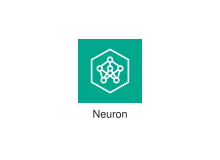
<div class="xal-ref-path">etc/resources/aws/svg/Architecture-Service-Icons/Arch_Artificial-Intelligence/32/Arch_AWS-Neuron_32.svg<br>6728 bytes</div>
</div>
</div>
{{#endtab}}
{{#tab name="Code"}}

```xml
{{#include ../samples/icons/Architecture-Service-Icons/arch-aws-neuron-32-8290e5ba.xal}}
```

{{#endtab}}
{{#endtabs}}

</div>
<div class="xal-ref-card">

{{#tabs name="svg-ref-0175"}}
{{#tab name="Preview"}}
<div class="xal-ref-preview">
<div>
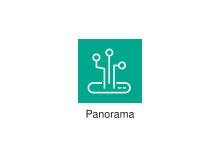
<div class="xal-ref-path">etc/resources/aws/svg/Architecture-Service-Icons/Arch_Artificial-Intelligence/32/Arch_AWS-Panorama_32.svg<br>3091 bytes</div>
</div>
</div>
{{#endtab}}
{{#tab name="Code"}}

```xml
{{#include ../samples/icons/Architecture-Service-Icons/arch-aws-panorama-32-f265b8bd.xal}}
```

{{#endtab}}
{{#endtabs}}

</div>
<div class="xal-ref-card">

{{#tabs name="svg-ref-0176"}}
{{#tab name="Preview"}}
<div class="xal-ref-preview">
<div>

<div class="xal-ref-path">etc/resources/aws/svg/Architecture-Service-Icons/Arch_Artificial-Intelligence/32/Arch_Amazon-Augmented-AI-A2I_32.svg<br>4789 bytes</div>
</div>
</div>
{{#endtab}}
{{#tab name="Code"}}

```xml
{{#include ../samples/icons/Architecture-Service-Icons/arch-amazon-augmented-ai-a2i-32-742c8048.xal}}
```

{{#endtab}}
{{#endtabs}}

</div>
<div class="xal-ref-card">

{{#tabs name="svg-ref-0177"}}
{{#tab name="Preview"}}
<div class="xal-ref-preview">
<div>

<div class="xal-ref-path">etc/resources/aws/svg/Architecture-Service-Icons/Arch_Artificial-Intelligence/32/Arch_Amazon-Bedrock_32.svg<br>4377 bytes</div>
</div>
</div>
{{#endtab}}
{{#tab name="Code"}}

```xml
{{#include ../samples/icons/Architecture-Service-Icons/arch-amazon-bedrock-32-2f9e9cb7.xal}}
```

{{#endtab}}
{{#endtabs}}

</div>
<div class="xal-ref-card">

{{#tabs name="svg-ref-0178"}}
{{#tab name="Preview"}}
<div class="xal-ref-preview">
<div>

<div class="xal-ref-path">etc/resources/aws/svg/Architecture-Service-Icons/Arch_Artificial-Intelligence/32/Arch_Amazon-CodeGuru_32.svg<br>3341 bytes</div>
</div>
</div>
{{#endtab}}
{{#tab name="Code"}}

```xml
{{#include ../samples/icons/Architecture-Service-Icons/arch-amazon-codeguru-32-77a70a7f.xal}}
```

{{#endtab}}
{{#endtabs}}

</div>
<div class="xal-ref-card">

{{#tabs name="svg-ref-0179"}}
{{#tab name="Preview"}}
<div class="xal-ref-preview">
<div>

<div class="xal-ref-path">etc/resources/aws/svg/Architecture-Service-Icons/Arch_Artificial-Intelligence/32/Arch_Amazon-CodeWhisperer_32.svg<br>3135 bytes</div>
</div>
</div>
{{#endtab}}
{{#tab name="Code"}}

```xml
{{#include ../samples/icons/Architecture-Service-Icons/arch-amazon-codewhisperer-32-e73bffff.xal}}
```

{{#endtab}}
{{#endtabs}}

</div>
<div class="xal-ref-card">

{{#tabs name="svg-ref-0180"}}
{{#tab name="Preview"}}
<div class="xal-ref-preview">
<div>

<div class="xal-ref-path">etc/resources/aws/svg/Architecture-Service-Icons/Arch_Artificial-Intelligence/32/Arch_Amazon-Comprehend-Medical_32.svg<br>2938 bytes</div>
</div>
</div>
{{#endtab}}
{{#tab name="Code"}}

```xml
{{#include ../samples/icons/Architecture-Service-Icons/arch-amazon-comprehend-medical-32-7bca742f.xal}}
```

{{#endtab}}
{{#endtabs}}

</div>
<div class="xal-ref-card">

{{#tabs name="svg-ref-0181"}}
{{#tab name="Preview"}}
<div class="xal-ref-preview">
<div>
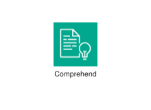
<div class="xal-ref-path">etc/resources/aws/svg/Architecture-Service-Icons/Arch_Artificial-Intelligence/32/Arch_Amazon-Comprehend_32.svg<br>2955 bytes</div>
</div>
</div>
{{#endtab}}
{{#tab name="Code"}}

```xml
{{#include ../samples/icons/Architecture-Service-Icons/arch-amazon-comprehend-32-094767cb.xal}}
```

{{#endtab}}
{{#endtabs}}

</div>
<div class="xal-ref-card">

{{#tabs name="svg-ref-0182"}}
{{#tab name="Preview"}}
<div class="xal-ref-preview">
<div>

<div class="xal-ref-path">etc/resources/aws/svg/Architecture-Service-Icons/Arch_Artificial-Intelligence/32/Arch_Amazon-DevOps-Guru_32.svg<br>4736 bytes</div>
</div>
</div>
{{#endtab}}
{{#tab name="Code"}}

```xml
{{#include ../samples/icons/Architecture-Service-Icons/arch-amazon-devops-guru-32-5f0b286e.xal}}
```

{{#endtab}}
{{#endtabs}}

</div>
<div class="xal-ref-card">

{{#tabs name="svg-ref-0183"}}
{{#tab name="Preview"}}
<div class="xal-ref-preview">
<div>
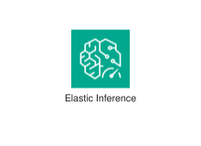
<div class="xal-ref-path">etc/resources/aws/svg/Architecture-Service-Icons/Arch_Artificial-Intelligence/32/Arch_Amazon-Elastic-Inference_32.svg<br>6561 bytes</div>
</div>
</div>
{{#endtab}}
{{#tab name="Code"}}

```xml
{{#include ../samples/icons/Architecture-Service-Icons/arch-amazon-elastic-inference-32-0966c534.xal}}
```

{{#endtab}}
{{#endtabs}}

</div>
<div class="xal-ref-card">

{{#tabs name="svg-ref-0184"}}
{{#tab name="Preview"}}
<div class="xal-ref-preview">
<div>
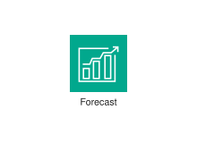
<div class="xal-ref-path">etc/resources/aws/svg/Architecture-Service-Icons/Arch_Artificial-Intelligence/32/Arch_Amazon-Forecast_32.svg<br>1284 bytes</div>
</div>
</div>
{{#endtab}}
{{#tab name="Code"}}

```xml
{{#include ../samples/icons/Architecture-Service-Icons/arch-amazon-forecast-32-931304e9.xal}}
```

{{#endtab}}
{{#endtabs}}

</div>
<div class="xal-ref-card">

{{#tabs name="svg-ref-0185"}}
{{#tab name="Preview"}}
<div class="xal-ref-preview">
<div>
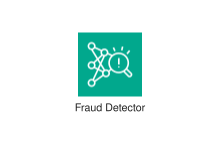
<div class="xal-ref-path">etc/resources/aws/svg/Architecture-Service-Icons/Arch_Artificial-Intelligence/32/Arch_Amazon-Fraud-Detector_32.svg<br>5770 bytes</div>
</div>
</div>
{{#endtab}}
{{#tab name="Code"}}

```xml
{{#include ../samples/icons/Architecture-Service-Icons/arch-amazon-fraud-detector-32-25262475.xal}}
```

{{#endtab}}
{{#endtabs}}

</div>
<div class="xal-ref-card">

{{#tabs name="svg-ref-0186"}}
{{#tab name="Preview"}}
<div class="xal-ref-preview">
<div>
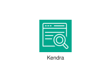
<div class="xal-ref-path">etc/resources/aws/svg/Architecture-Service-Icons/Arch_Artificial-Intelligence/32/Arch_Amazon-Kendra_32.svg<br>4353 bytes</div>
</div>
</div>
{{#endtab}}
{{#tab name="Code"}}

```xml
{{#include ../samples/icons/Architecture-Service-Icons/arch-amazon-kendra-32-d9bca746.xal}}
```

{{#endtab}}
{{#endtabs}}

</div>
<div class="xal-ref-card">

{{#tabs name="svg-ref-0187"}}
{{#tab name="Preview"}}
<div class="xal-ref-preview">
<div>

<div class="xal-ref-path">etc/resources/aws/svg/Architecture-Service-Icons/Arch_Artificial-Intelligence/32/Arch_Amazon-Lex_32.svg<br>5133 bytes</div>
</div>
</div>
{{#endtab}}
{{#tab name="Code"}}

```xml
{{#include ../samples/icons/Architecture-Service-Icons/arch-amazon-lex-32-251b61ce.xal}}
```

{{#endtab}}
{{#endtabs}}

</div>
<div class="xal-ref-card">

{{#tabs name="svg-ref-0188"}}
{{#tab name="Preview"}}
<div class="xal-ref-preview">
<div>

<div class="xal-ref-path">etc/resources/aws/svg/Architecture-Service-Icons/Arch_Artificial-Intelligence/32/Arch_Amazon-Lookout-for-Equipment_32.svg<br>2497 bytes</div>
</div>
</div>
{{#endtab}}
{{#tab name="Code"}}

```xml
{{#include ../samples/icons/Architecture-Service-Icons/arch-amazon-lookout-for-equipment-32-ffe55e3f.xal}}
```

{{#endtab}}
{{#endtabs}}

</div>
<div class="xal-ref-card">

{{#tabs name="svg-ref-0189"}}
{{#tab name="Preview"}}
<div class="xal-ref-preview">
<div>

<div class="xal-ref-path">etc/resources/aws/svg/Architecture-Service-Icons/Arch_Artificial-Intelligence/32/Arch_Amazon-Lookout-for-Metrics_32.svg<br>2475 bytes</div>
</div>
</div>
{{#endtab}}
{{#tab name="Code"}}

```xml
{{#include ../samples/icons/Architecture-Service-Icons/arch-amazon-lookout-for-metrics-32-baab3d41.xal}}
```

{{#endtab}}
{{#endtabs}}

</div>
<div class="xal-ref-card">

{{#tabs name="svg-ref-0190"}}
{{#tab name="Preview"}}
<div class="xal-ref-preview">
<div>

<div class="xal-ref-path">etc/resources/aws/svg/Architecture-Service-Icons/Arch_Artificial-Intelligence/32/Arch_Amazon-Lookout-for-Vision_32.svg<br>3005 bytes</div>
</div>
</div>
{{#endtab}}
{{#tab name="Code"}}

```xml
{{#include ../samples/icons/Architecture-Service-Icons/arch-amazon-lookout-for-vision-32-1fe85780.xal}}
```

{{#endtab}}
{{#endtabs}}

</div>
<div class="xal-ref-card">

{{#tabs name="svg-ref-0191"}}
{{#tab name="Preview"}}
<div class="xal-ref-preview">
<div>

<div class="xal-ref-path">etc/resources/aws/svg/Architecture-Service-Icons/Arch_Artificial-Intelligence/32/Arch_Amazon-Monitron_32.svg<br>4055 bytes</div>
</div>
</div>
{{#endtab}}
{{#tab name="Code"}}

```xml
{{#include ../samples/icons/Architecture-Service-Icons/arch-amazon-monitron-32-8a8b8792.xal}}
```

{{#endtab}}
{{#endtabs}}

</div>
<div class="xal-ref-card">

{{#tabs name="svg-ref-0192"}}
{{#tab name="Preview"}}
<div class="xal-ref-preview">
<div>

<div class="xal-ref-path">etc/resources/aws/svg/Architecture-Service-Icons/Arch_Artificial-Intelligence/32/Arch_Amazon-Nova_32.svg<br>1489 bytes</div>
</div>
</div>
{{#endtab}}
{{#tab name="Code"}}

```xml
{{#include ../samples/icons/Architecture-Service-Icons/arch-amazon-nova-32-24c9e546.xal}}
```

{{#endtab}}
{{#endtabs}}

</div>
<div class="xal-ref-card">

{{#tabs name="svg-ref-0193"}}
{{#tab name="Preview"}}
<div class="xal-ref-preview">
<div>

<div class="xal-ref-path">etc/resources/aws/svg/Architecture-Service-Icons/Arch_Artificial-Intelligence/32/Arch_Amazon-Personalize_32.svg<br>4379 bytes</div>
</div>
</div>
{{#endtab}}
{{#tab name="Code"}}

```xml
{{#include ../samples/icons/Architecture-Service-Icons/arch-amazon-personalize-32-8e4ba94b.xal}}
```

{{#endtab}}
{{#endtabs}}

</div>
<div class="xal-ref-card">

{{#tabs name="svg-ref-0194"}}
{{#tab name="Preview"}}
<div class="xal-ref-preview">
<div>

<div class="xal-ref-path">etc/resources/aws/svg/Architecture-Service-Icons/Arch_Artificial-Intelligence/32/Arch_Amazon-Polly_32.svg<br>3837 bytes</div>
</div>
</div>
{{#endtab}}
{{#tab name="Code"}}

```xml
{{#include ../samples/icons/Architecture-Service-Icons/arch-amazon-polly-32-cb932c40.xal}}
```

{{#endtab}}
{{#endtabs}}

</div>
<div class="xal-ref-card">

{{#tabs name="svg-ref-0195"}}
{{#tab name="Preview"}}
<div class="xal-ref-preview">
<div>

<div class="xal-ref-path">etc/resources/aws/svg/Architecture-Service-Icons/Arch_Artificial-Intelligence/32/Arch_Amazon-Q_32.svg<br>2101 bytes</div>
</div>
</div>
{{#endtab}}
{{#tab name="Code"}}

```xml
{{#include ../samples/icons/Architecture-Service-Icons/arch-amazon-q-32-335cd1bb.xal}}
```

{{#endtab}}
{{#endtabs}}

</div>
<div class="xal-ref-card">

{{#tabs name="svg-ref-0196"}}
{{#tab name="Preview"}}
<div class="xal-ref-preview">
<div>

<div class="xal-ref-path">etc/resources/aws/svg/Architecture-Service-Icons/Arch_Artificial-Intelligence/32/Arch_Amazon-Rekognition_32.svg<br>3169 bytes</div>
</div>
</div>
{{#endtab}}
{{#tab name="Code"}}

```xml
{{#include ../samples/icons/Architecture-Service-Icons/arch-amazon-rekognition-32-2b09920d.xal}}
```

{{#endtab}}
{{#endtabs}}

</div>
<div class="xal-ref-card">

{{#tabs name="svg-ref-0197"}}
{{#tab name="Preview"}}
<div class="xal-ref-preview">
<div>

<div class="xal-ref-path">etc/resources/aws/svg/Architecture-Service-Icons/Arch_Artificial-Intelligence/32/Arch_Amazon-SageMaker-AI_32.svg<br>6419 bytes</div>
</div>
</div>
{{#endtab}}
{{#tab name="Code"}}

```xml
{{#include ../samples/icons/Architecture-Service-Icons/arch-amazon-sagemaker-ai-32-323b5023.xal}}
```

{{#endtab}}
{{#endtabs}}

</div>
<div class="xal-ref-card">

{{#tabs name="svg-ref-0198"}}
{{#tab name="Preview"}}
<div class="xal-ref-preview">
<div>

<div class="xal-ref-path">etc/resources/aws/svg/Architecture-Service-Icons/Arch_Artificial-Intelligence/32/Arch_Amazon-SageMaker-Ground-Truth_32.svg<br>6844 bytes</div>
</div>
</div>
{{#endtab}}
{{#tab name="Code"}}

```xml
{{#include ../samples/icons/Architecture-Service-Icons/arch-amazon-sagemaker-ground-truth-32-8b65f0e3.xal}}
```

{{#endtab}}
{{#endtabs}}

</div>
<div class="xal-ref-card">

{{#tabs name="svg-ref-0199"}}
{{#tab name="Preview"}}
<div class="xal-ref-preview">
<div>

<div class="xal-ref-path">etc/resources/aws/svg/Architecture-Service-Icons/Arch_Artificial-Intelligence/32/Arch_Amazon-SageMaker-Studio-Lab_32.svg<br>3076 bytes</div>
</div>
</div>
{{#endtab}}
{{#tab name="Code"}}

```xml
{{#include ../samples/icons/Architecture-Service-Icons/arch-amazon-sagemaker-studio-lab-32-d35209d0.xal}}
```

{{#endtab}}
{{#endtabs}}

</div>
<div class="xal-ref-card">

{{#tabs name="svg-ref-0200"}}
{{#tab name="Preview"}}
<div class="xal-ref-preview">
<div>

<div class="xal-ref-path">etc/resources/aws/svg/Architecture-Service-Icons/Arch_Artificial-Intelligence/32/Arch_Amazon-Textract_32.svg<br>4574 bytes</div>
</div>
</div>
{{#endtab}}
{{#tab name="Code"}}

```xml
{{#include ../samples/icons/Architecture-Service-Icons/arch-amazon-textract-32-c39a6e63.xal}}
```

{{#endtab}}
{{#endtabs}}

</div>
<div class="xal-ref-card">

{{#tabs name="svg-ref-0201"}}
{{#tab name="Preview"}}
<div class="xal-ref-preview">
<div>

<div class="xal-ref-path">etc/resources/aws/svg/Architecture-Service-Icons/Arch_Artificial-Intelligence/32/Arch_Amazon-Transcribe_32.svg<br>3854 bytes</div>
</div>
</div>
{{#endtab}}
{{#tab name="Code"}}

```xml
{{#include ../samples/icons/Architecture-Service-Icons/arch-amazon-transcribe-32-7765cd1c.xal}}
```

{{#endtab}}
{{#endtabs}}

</div>
<div class="xal-ref-card">

{{#tabs name="svg-ref-0202"}}
{{#tab name="Preview"}}
<div class="xal-ref-preview">
<div>

<div class="xal-ref-path">etc/resources/aws/svg/Architecture-Service-Icons/Arch_Artificial-Intelligence/32/Arch_Amazon-Translate_32.svg<br>5613 bytes</div>
</div>
</div>
{{#endtab}}
{{#tab name="Code"}}

```xml
{{#include ../samples/icons/Architecture-Service-Icons/arch-amazon-translate-32-429505ac.xal}}
```

{{#endtab}}
{{#endtabs}}

</div>
<div class="xal-ref-card">

{{#tabs name="svg-ref-0203"}}
{{#tab name="Preview"}}
<div class="xal-ref-preview">
<div>

<div class="xal-ref-path">etc/resources/aws/svg/Architecture-Service-Icons/Arch_Artificial-Intelligence/32/Arch_Apache-MXNet-on-AWS_32.svg<br>2017 bytes</div>
</div>
</div>
{{#endtab}}
{{#tab name="Code"}}

```xml
{{#include ../samples/icons/Architecture-Service-Icons/arch-apache-mxnet-on-aws-32-88de06e4.xal}}
```

{{#endtab}}
{{#endtabs}}

</div>
<div class="xal-ref-card">

{{#tabs name="svg-ref-0204"}}
{{#tab name="Preview"}}
<div class="xal-ref-preview">
<div>

<div class="xal-ref-path">etc/resources/aws/svg/Architecture-Service-Icons/Arch_Artificial-Intelligence/32/Arch_PyTorch-on-AWS_32.svg<br>1468 bytes</div>
</div>
</div>
{{#endtab}}
{{#tab name="Code"}}

```xml
{{#include ../samples/icons/Architecture-Service-Icons/arch-pytorch-on-aws-32-f4417b2d.xal}}
```

{{#endtab}}
{{#endtabs}}

</div>
<div class="xal-ref-card">

{{#tabs name="svg-ref-0205"}}
{{#tab name="Preview"}}
<div class="xal-ref-preview">
<div>

<div class="xal-ref-path">etc/resources/aws/svg/Architecture-Service-Icons/Arch_Artificial-Intelligence/32/Arch_TensorFlow-on-AWS_32.svg<br>2011 bytes</div>
</div>
</div>
{{#endtab}}
{{#tab name="Code"}}

```xml
{{#include ../samples/icons/Architecture-Service-Icons/arch-tensorflow-on-aws-32-24a4a2a3.xal}}
```

{{#endtab}}
{{#endtabs}}

</div>
<div class="xal-ref-card">

{{#tabs name="svg-ref-0206"}}
{{#tab name="Preview"}}
<div class="xal-ref-preview">
<div>

<div class="xal-ref-path">etc/resources/aws/svg/Architecture-Service-Icons/Arch_Artificial-Intelligence/48/Arch_AWS-App-Studio_48.svg<br>1342 bytes</div>
</div>
</div>
{{#endtab}}
{{#tab name="Code"}}

```xml
{{#include ../samples/icons/Architecture-Service-Icons/arch-aws-app-studio-48-77138384.xal}}
```

{{#endtab}}
{{#endtabs}}

</div>
<div class="xal-ref-card">

{{#tabs name="svg-ref-0207"}}
{{#tab name="Preview"}}
<div class="xal-ref-preview">
<div>

<div class="xal-ref-path">etc/resources/aws/svg/Architecture-Service-Icons/Arch_Artificial-Intelligence/48/Arch_AWS-Deep-Learning-AMIs_48.svg<br>5379 bytes</div>
</div>
</div>
{{#endtab}}
{{#tab name="Code"}}

```xml
{{#include ../samples/icons/Architecture-Service-Icons/arch-aws-deep-learning-amis-48-cd97c52f.xal}}
```

{{#endtab}}
{{#endtabs}}

</div>
<div class="xal-ref-card">

{{#tabs name="svg-ref-0208"}}
{{#tab name="Preview"}}
<div class="xal-ref-preview">
<div>

<div class="xal-ref-path">etc/resources/aws/svg/Architecture-Service-Icons/Arch_Artificial-Intelligence/48/Arch_AWS-Deep-Learning-Containers_48.svg<br>3165 bytes</div>
</div>
</div>
{{#endtab}}
{{#tab name="Code"}}

```xml
{{#include ../samples/icons/Architecture-Service-Icons/arch-aws-deep-learning-containers-48-32d9ca54.xal}}
```

{{#endtab}}
{{#endtabs}}

</div>
<div class="xal-ref-card">

{{#tabs name="svg-ref-0209"}}
{{#tab name="Preview"}}
<div class="xal-ref-preview">
<div>

<div class="xal-ref-path">etc/resources/aws/svg/Architecture-Service-Icons/Arch_Artificial-Intelligence/48/Arch_AWS-DeepComposer_48.svg<br>2338 bytes</div>
</div>
</div>
{{#endtab}}
{{#tab name="Code"}}

```xml
{{#include ../samples/icons/Architecture-Service-Icons/arch-aws-deepcomposer-48-cdda88ed.xal}}
```

{{#endtab}}
{{#endtabs}}

</div>
<div class="xal-ref-card">

{{#tabs name="svg-ref-0210"}}
{{#tab name="Preview"}}
<div class="xal-ref-preview">
<div>

<div class="xal-ref-path">etc/resources/aws/svg/Architecture-Service-Icons/Arch_Artificial-Intelligence/48/Arch_AWS-DeepRacer_48.svg<br>10320 bytes</div>
</div>
</div>
{{#endtab}}
{{#tab name="Code"}}

```xml
{{#include ../samples/icons/Architecture-Service-Icons/arch-aws-deepracer-48-ebbda136.xal}}
```

{{#endtab}}
{{#endtabs}}

</div>
<div class="xal-ref-card">

{{#tabs name="svg-ref-0211"}}
{{#tab name="Preview"}}
<div class="xal-ref-preview">
<div>

<div class="xal-ref-path">etc/resources/aws/svg/Architecture-Service-Icons/Arch_Artificial-Intelligence/48/Arch_AWS-HealthImaging_48.svg<br>5212 bytes</div>
</div>
</div>
{{#endtab}}
{{#tab name="Code"}}

```xml
{{#include ../samples/icons/Architecture-Service-Icons/arch-aws-healthimaging-48-b92e36a7.xal}}
```

{{#endtab}}
{{#endtabs}}

</div>
<div class="xal-ref-card">

{{#tabs name="svg-ref-0212"}}
{{#tab name="Preview"}}
<div class="xal-ref-preview">
<div>

<div class="xal-ref-path">etc/resources/aws/svg/Architecture-Service-Icons/Arch_Artificial-Intelligence/48/Arch_AWS-HealthLake_48.svg<br>2309 bytes</div>
</div>
</div>
{{#endtab}}
{{#tab name="Code"}}

```xml
{{#include ../samples/icons/Architecture-Service-Icons/arch-aws-healthlake-48-66d3d1b2.xal}}
```

{{#endtab}}
{{#endtabs}}

</div>
<div class="xal-ref-card">

{{#tabs name="svg-ref-0213"}}
{{#tab name="Preview"}}
<div class="xal-ref-preview">
<div>

<div class="xal-ref-path">etc/resources/aws/svg/Architecture-Service-Icons/Arch_Artificial-Intelligence/48/Arch_AWS-HealthOmics_48.svg<br>2462 bytes</div>
</div>
</div>
{{#endtab}}
{{#tab name="Code"}}

```xml
{{#include ../samples/icons/Architecture-Service-Icons/arch-aws-healthomics-48-fdc9085c.xal}}
```

{{#endtab}}
{{#endtabs}}

</div>
<div class="xal-ref-card">

{{#tabs name="svg-ref-0214"}}
{{#tab name="Preview"}}
<div class="xal-ref-preview">
<div>

<div class="xal-ref-path">etc/resources/aws/svg/Architecture-Service-Icons/Arch_Artificial-Intelligence/48/Arch_AWS-HealthScribe_48.svg<br>3247 bytes</div>
</div>
</div>
{{#endtab}}
{{#tab name="Code"}}

```xml
{{#include ../samples/icons/Architecture-Service-Icons/arch-aws-healthscribe-48-ec9d459d.xal}}
```

{{#endtab}}
{{#endtabs}}

</div>
<div class="xal-ref-card">

{{#tabs name="svg-ref-0215"}}
{{#tab name="Preview"}}
<div class="xal-ref-preview">
<div>

<div class="xal-ref-path">etc/resources/aws/svg/Architecture-Service-Icons/Arch_Artificial-Intelligence/48/Arch_AWS-Neuron_48.svg<br>3776 bytes</div>
</div>
</div>
{{#endtab}}
{{#tab name="Code"}}

```xml
{{#include ../samples/icons/Architecture-Service-Icons/arch-aws-neuron-48-1043c1ba.xal}}
```

{{#endtab}}
{{#endtabs}}

</div>
<div class="xal-ref-card">

{{#tabs name="svg-ref-0216"}}
{{#tab name="Preview"}}
<div class="xal-ref-preview">
<div>

<div class="xal-ref-path">etc/resources/aws/svg/Architecture-Service-Icons/Arch_Artificial-Intelligence/48/Arch_AWS-Panorama_48.svg<br>2151 bytes</div>
</div>
</div>
{{#endtab}}
{{#tab name="Code"}}

```xml
{{#include ../samples/icons/Architecture-Service-Icons/arch-aws-panorama-48-3766b0f1.xal}}
```

{{#endtab}}
{{#endtabs}}

</div>
<div class="xal-ref-card">

{{#tabs name="svg-ref-0217"}}
{{#tab name="Preview"}}
<div class="xal-ref-preview">
<div>

<div class="xal-ref-path">etc/resources/aws/svg/Architecture-Service-Icons/Arch_Artificial-Intelligence/48/Arch_Amazon-Augmented-AI-A2I_48.svg<br>5884 bytes</div>
</div>
</div>
{{#endtab}}
{{#tab name="Code"}}

```xml
{{#include ../samples/icons/Architecture-Service-Icons/arch-amazon-augmented-ai-a2i-48-33f6d07c.xal}}
```

{{#endtab}}
{{#endtabs}}

</div>
<div class="xal-ref-card">

{{#tabs name="svg-ref-0218"}}
{{#tab name="Preview"}}
<div class="xal-ref-preview">
<div>

<div class="xal-ref-path">etc/resources/aws/svg/Architecture-Service-Icons/Arch_Artificial-Intelligence/48/Arch_Amazon-Bedrock_48.svg<br>4317 bytes</div>
</div>
</div>
{{#endtab}}
{{#tab name="Code"}}

```xml
{{#include ../samples/icons/Architecture-Service-Icons/arch-amazon-bedrock-48-8489afc1.xal}}
```

{{#endtab}}
{{#endtabs}}

</div>
<div class="xal-ref-card">

{{#tabs name="svg-ref-0219"}}
{{#tab name="Preview"}}
<div class="xal-ref-preview">
<div>

<div class="xal-ref-path">etc/resources/aws/svg/Architecture-Service-Icons/Arch_Artificial-Intelligence/48/Arch_Amazon-CodeGuru_48.svg<br>1997 bytes</div>
</div>
</div>
{{#endtab}}
{{#tab name="Code"}}

```xml
{{#include ../samples/icons/Architecture-Service-Icons/arch-amazon-codeguru-48-fde3fcb4.xal}}
```

{{#endtab}}
{{#endtabs}}

</div>
<div class="xal-ref-card">

{{#tabs name="svg-ref-0220"}}
{{#tab name="Preview"}}
<div class="xal-ref-preview">
<div>

<div class="xal-ref-path">etc/resources/aws/svg/Architecture-Service-Icons/Arch_Artificial-Intelligence/48/Arch_Amazon-CodeWhisperer_48.svg<br>3761 bytes</div>
</div>
</div>
{{#endtab}}
{{#tab name="Code"}}

```xml
{{#include ../samples/icons/Architecture-Service-Icons/arch-amazon-codewhisperer-48-05a097c0.xal}}
```

{{#endtab}}
{{#endtabs}}

</div>
<div class="xal-ref-card">

{{#tabs name="svg-ref-0221"}}
{{#tab name="Preview"}}
<div class="xal-ref-preview">
<div>

<div class="xal-ref-path">etc/resources/aws/svg/Architecture-Service-Icons/Arch_Artificial-Intelligence/48/Arch_Amazon-Comprehend-Medical_48.svg<br>2873 bytes</div>
</div>
</div>
{{#endtab}}
{{#tab name="Code"}}

```xml
{{#include ../samples/icons/Architecture-Service-Icons/arch-amazon-comprehend-medical-48-528befb8.xal}}
```

{{#endtab}}
{{#endtabs}}

</div>
<div class="xal-ref-card">

{{#tabs name="svg-ref-0222"}}
{{#tab name="Preview"}}
<div class="xal-ref-preview">
<div>

<div class="xal-ref-path">etc/resources/aws/svg/Architecture-Service-Icons/Arch_Artificial-Intelligence/48/Arch_Amazon-Comprehend_48.svg<br>4033 bytes</div>
</div>
</div>
{{#endtab}}
{{#tab name="Code"}}

```xml
{{#include ../samples/icons/Architecture-Service-Icons/arch-amazon-comprehend-48-8c97ca6d.xal}}
```

{{#endtab}}
{{#endtabs}}

</div>
<div class="xal-ref-card">

{{#tabs name="svg-ref-0223"}}
{{#tab name="Preview"}}
<div class="xal-ref-preview">
<div>

<div class="xal-ref-path">etc/resources/aws/svg/Architecture-Service-Icons/Arch_Artificial-Intelligence/48/Arch_Amazon-DevOps-Guru_48.svg<br>4767 bytes</div>
</div>
</div>
{{#endtab}}
{{#tab name="Code"}}

```xml
{{#include ../samples/icons/Architecture-Service-Icons/arch-amazon-devops-guru-48-53b2cbef.xal}}
```

{{#endtab}}
{{#endtabs}}

</div>
<div class="xal-ref-card">

{{#tabs name="svg-ref-0224"}}
{{#tab name="Preview"}}
<div class="xal-ref-preview">
<div>

<div class="xal-ref-path">etc/resources/aws/svg/Architecture-Service-Icons/Arch_Artificial-Intelligence/48/Arch_Amazon-Elastic-Inference_48.svg<br>6506 bytes</div>
</div>
</div>
{{#endtab}}
{{#tab name="Code"}}

```xml
{{#include ../samples/icons/Architecture-Service-Icons/arch-amazon-elastic-inference-48-1b1cde20.xal}}
```

{{#endtab}}
{{#endtabs}}

</div>
<div class="xal-ref-card">

{{#tabs name="svg-ref-0225"}}
{{#tab name="Preview"}}
<div class="xal-ref-preview">
<div>

<div class="xal-ref-path">etc/resources/aws/svg/Architecture-Service-Icons/Arch_Artificial-Intelligence/48/Arch_Amazon-Forecast_48.svg<br>2021 bytes</div>
</div>
</div>
{{#endtab}}
{{#tab name="Code"}}

```xml
{{#include ../samples/icons/Architecture-Service-Icons/arch-amazon-forecast-48-1957f222.xal}}
```

{{#endtab}}
{{#endtabs}}

</div>
<div class="xal-ref-card">

{{#tabs name="svg-ref-0226"}}
{{#tab name="Preview"}}
<div class="xal-ref-preview">
<div>

<div class="xal-ref-path">etc/resources/aws/svg/Architecture-Service-Icons/Arch_Artificial-Intelligence/48/Arch_Amazon-Fraud-Detector_48.svg<br>6394 bytes</div>
</div>
</div>
{{#endtab}}
{{#tab name="Code"}}

```xml
{{#include ../samples/icons/Architecture-Service-Icons/arch-amazon-fraud-detector-48-a02ba7d1.xal}}
```

{{#endtab}}
{{#endtabs}}

</div>
<div class="xal-ref-card">

{{#tabs name="svg-ref-0227"}}
{{#tab name="Preview"}}
<div class="xal-ref-preview">
<div>

<div class="xal-ref-path">etc/resources/aws/svg/Architecture-Service-Icons/Arch_Artificial-Intelligence/48/Arch_Amazon-Kendra_48.svg<br>4154 bytes</div>
</div>
</div>
{{#endtab}}
{{#tab name="Code"}}

```xml
{{#include ../samples/icons/Architecture-Service-Icons/arch-amazon-kendra-48-959a9c04.xal}}
```

{{#endtab}}
{{#endtabs}}

</div>
<div class="xal-ref-card">

{{#tabs name="svg-ref-0228"}}
{{#tab name="Preview"}}
<div class="xal-ref-preview">
<div>

<div class="xal-ref-path">etc/resources/aws/svg/Architecture-Service-Icons/Arch_Artificial-Intelligence/48/Arch_Amazon-Lex_48.svg<br>5211 bytes</div>
</div>
</div>
{{#endtab}}
{{#tab name="Code"}}

```xml
{{#include ../samples/icons/Architecture-Service-Icons/arch-amazon-lex-48-b7c845ce.xal}}
```

{{#endtab}}
{{#endtabs}}

</div>
<div class="xal-ref-card">

{{#tabs name="svg-ref-0229"}}
{{#tab name="Preview"}}
<div class="xal-ref-preview">
<div>

<div class="xal-ref-path">etc/resources/aws/svg/Architecture-Service-Icons/Arch_Artificial-Intelligence/48/Arch_Amazon-Lookout-for-Equipment_48.svg<br>2690 bytes</div>
</div>
</div>
{{#endtab}}
{{#tab name="Code"}}

```xml
{{#include ../samples/icons/Architecture-Service-Icons/arch-amazon-lookout-for-equipment-48-36c38bac.xal}}
```

{{#endtab}}
{{#endtabs}}

</div>
<div class="xal-ref-card">

{{#tabs name="svg-ref-0230"}}
{{#tab name="Preview"}}
<div class="xal-ref-preview">
<div>

<div class="xal-ref-path">etc/resources/aws/svg/Architecture-Service-Icons/Arch_Artificial-Intelligence/48/Arch_Amazon-Lookout-for-Metrics_48.svg<br>4033 bytes</div>
</div>
</div>
{{#endtab}}
{{#tab name="Code"}}

```xml
{{#include ../samples/icons/Architecture-Service-Icons/arch-amazon-lookout-for-metrics-48-e7604fcc.xal}}
```

{{#endtab}}
{{#endtabs}}

</div>
<div class="xal-ref-card">

{{#tabs name="svg-ref-0231"}}
{{#tab name="Preview"}}
<div class="xal-ref-preview">
<div>

<div class="xal-ref-path">etc/resources/aws/svg/Architecture-Service-Icons/Arch_Artificial-Intelligence/48/Arch_Amazon-Lookout-for-Vision_48.svg<br>3013 bytes</div>
</div>
</div>
{{#endtab}}
{{#tab name="Code"}}

```xml
{{#include ../samples/icons/Architecture-Service-Icons/arch-amazon-lookout-for-vision-48-36a9cc17.xal}}
```

{{#endtab}}
{{#endtabs}}

</div>
<div class="xal-ref-card">

{{#tabs name="svg-ref-0232"}}
{{#tab name="Preview"}}
<div class="xal-ref-preview">
<div>

<div class="xal-ref-path">etc/resources/aws/svg/Architecture-Service-Icons/Arch_Artificial-Intelligence/48/Arch_Amazon-Monitron_48.svg<br>3950 bytes</div>
</div>
</div>
{{#endtab}}
{{#tab name="Code"}}

```xml
{{#include ../samples/icons/Architecture-Service-Icons/arch-amazon-monitron-48-00cf7159.xal}}
```

{{#endtab}}
{{#endtabs}}

</div>
<div class="xal-ref-card">

{{#tabs name="svg-ref-0233"}}
{{#tab name="Preview"}}
<div class="xal-ref-preview">
<div>

<div class="xal-ref-path">etc/resources/aws/svg/Architecture-Service-Icons/Arch_Artificial-Intelligence/48/Arch_Amazon-Nova_48.svg<br>1546 bytes</div>
</div>
</div>
{{#endtab}}
{{#tab name="Code"}}

```xml
{{#include ../samples/icons/Architecture-Service-Icons/arch-amazon-nova-48-17d20393.xal}}
```

{{#endtab}}
{{#endtabs}}

</div>
<div class="xal-ref-card">

{{#tabs name="svg-ref-0234"}}
{{#tab name="Preview"}}
<div class="xal-ref-preview">
<div>

<div class="xal-ref-path">etc/resources/aws/svg/Architecture-Service-Icons/Arch_Artificial-Intelligence/48/Arch_Amazon-Personalize_48.svg<br>4386 bytes</div>
</div>
</div>
{{#endtab}}
{{#tab name="Code"}}

```xml
{{#include ../samples/icons/Architecture-Service-Icons/arch-amazon-personalize-48-82f24aca.xal}}
```

{{#endtab}}
{{#endtabs}}

</div>
<div class="xal-ref-card">

{{#tabs name="svg-ref-0235"}}
{{#tab name="Preview"}}
<div class="xal-ref-preview">
<div>

<div class="xal-ref-path">etc/resources/aws/svg/Architecture-Service-Icons/Arch_Artificial-Intelligence/48/Arch_Amazon-Polly_48.svg<br>3840 bytes</div>
</div>
</div>
{{#endtab}}
{{#tab name="Code"}}

```xml
{{#include ../samples/icons/Architecture-Service-Icons/arch-amazon-polly-48-0e90240c.xal}}
```

{{#endtab}}
{{#endtabs}}

</div>
<div class="xal-ref-card">

{{#tabs name="svg-ref-0236"}}
{{#tab name="Preview"}}
<div class="xal-ref-preview">
<div>

<div class="xal-ref-path">etc/resources/aws/svg/Architecture-Service-Icons/Arch_Artificial-Intelligence/48/Arch_Amazon-Q_48.svg<br>2258 bytes</div>
</div>
</div>
{{#endtab}}
{{#tab name="Code"}}

```xml
{{#include ../samples/icons/Architecture-Service-Icons/arch-amazon-q-48-85438e8c.xal}}
```

{{#endtab}}
{{#endtabs}}

</div>
<div class="xal-ref-card">

{{#tabs name="svg-ref-0237"}}
{{#tab name="Preview"}}
<div class="xal-ref-preview">
<div>

<div class="xal-ref-path">etc/resources/aws/svg/Architecture-Service-Icons/Arch_Artificial-Intelligence/48/Arch_Amazon-Rekognition_48.svg<br>3052 bytes</div>
</div>
</div>
{{#endtab}}
{{#tab name="Code"}}

```xml
{{#include ../samples/icons/Architecture-Service-Icons/arch-amazon-rekognition-48-27b0718c.xal}}
```

{{#endtab}}
{{#endtabs}}

</div>
<div class="xal-ref-card">

{{#tabs name="svg-ref-0238"}}
{{#tab name="Preview"}}
<div class="xal-ref-preview">
<div>

<div class="xal-ref-path">etc/resources/aws/svg/Architecture-Service-Icons/Arch_Artificial-Intelligence/48/Arch_Amazon-SageMaker-AI_48.svg<br>6398 bytes</div>
</div>
</div>
{{#endtab}}
{{#tab name="Code"}}

```xml
{{#include ../samples/icons/Architecture-Service-Icons/arch-amazon-sagemaker-ai-48-9b016f87.xal}}
```

{{#endtab}}
{{#endtabs}}

</div>
<div class="xal-ref-card">

{{#tabs name="svg-ref-0239"}}
{{#tab name="Preview"}}
<div class="xal-ref-preview">
<div>

<div class="xal-ref-path">etc/resources/aws/svg/Architecture-Service-Icons/Arch_Artificial-Intelligence/48/Arch_Amazon-SageMaker-Ground-Truth_48.svg<br>6838 bytes</div>
</div>
</div>
{{#endtab}}
{{#tab name="Code"}}

```xml
{{#include ../samples/icons/Architecture-Service-Icons/arch-amazon-sagemaker-ground-truth-48-d1232139.xal}}
```

{{#endtab}}
{{#endtabs}}

</div>
<div class="xal-ref-card">

{{#tabs name="svg-ref-0240"}}
{{#tab name="Preview"}}
<div class="xal-ref-preview">
<div>

<div class="xal-ref-path">etc/resources/aws/svg/Architecture-Service-Icons/Arch_Artificial-Intelligence/48/Arch_Amazon-SageMaker-Studio-Lab_48.svg<br>3512 bytes</div>
</div>
</div>
{{#endtab}}
{{#tab name="Code"}}

```xml
{{#include ../samples/icons/Architecture-Service-Icons/arch-amazon-sagemaker-studio-lab-48-738f08ce.xal}}
```

{{#endtab}}
{{#endtabs}}

</div>
<div class="xal-ref-card">

{{#tabs name="svg-ref-0241"}}
{{#tab name="Preview"}}
<div class="xal-ref-preview">
<div>

<div class="xal-ref-path">etc/resources/aws/svg/Architecture-Service-Icons/Arch_Artificial-Intelligence/48/Arch_Amazon-Textract_48.svg<br>3014 bytes</div>
</div>
</div>
{{#endtab}}
{{#tab name="Code"}}

```xml
{{#include ../samples/icons/Architecture-Service-Icons/arch-amazon-textract-48-49de98a8.xal}}
```

{{#endtab}}
{{#endtabs}}

</div>
<div class="xal-ref-card">

{{#tabs name="svg-ref-0242"}}
{{#tab name="Preview"}}
<div class="xal-ref-preview">
<div>

<div class="xal-ref-path">etc/resources/aws/svg/Architecture-Service-Icons/Arch_Artificial-Intelligence/48/Arch_Amazon-Transcribe_48.svg<br>3872 bytes</div>
</div>
</div>
{{#endtab}}
{{#tab name="Code"}}

```xml
{{#include ../samples/icons/Architecture-Service-Icons/arch-amazon-transcribe-48-f2b560ba.xal}}
```

{{#endtab}}
{{#endtabs}}

</div>
<div class="xal-ref-card">

{{#tabs name="svg-ref-0243"}}
{{#tab name="Preview"}}
<div class="xal-ref-preview">
<div>

<div class="xal-ref-path">etc/resources/aws/svg/Architecture-Service-Icons/Arch_Artificial-Intelligence/48/Arch_Amazon-Translate_48.svg<br>3403 bytes</div>
</div>
</div>
{{#endtab}}
{{#tab name="Code"}}

```xml
{{#include ../samples/icons/Architecture-Service-Icons/arch-amazon-translate-48-7d206f93.xal}}
```

{{#endtab}}
{{#endtabs}}

</div>
<div class="xal-ref-card">

{{#tabs name="svg-ref-0244"}}
{{#tab name="Preview"}}
<div class="xal-ref-preview">
<div>

<div class="xal-ref-path">etc/resources/aws/svg/Architecture-Service-Icons/Arch_Artificial-Intelligence/48/Arch_Apache-MXNet-on-AWS_48.svg<br>2154 bytes</div>
</div>
</div>
{{#endtab}}
{{#tab name="Code"}}

```xml
{{#include ../samples/icons/Architecture-Service-Icons/arch-apache-mxnet-on-aws-48-21e43940.xal}}
```

{{#endtab}}
{{#endtabs}}

</div>
<div class="xal-ref-card">

{{#tabs name="svg-ref-0245"}}
{{#tab name="Preview"}}
<div class="xal-ref-preview">
<div>

<div class="xal-ref-path">etc/resources/aws/svg/Architecture-Service-Icons/Arch_Artificial-Intelligence/48/Arch_PyTorch-on-AWS_48.svg<br>1428 bytes</div>
</div>
</div>
{{#endtab}}
{{#tab name="Code"}}

```xml
{{#include ../samples/icons/Architecture-Service-Icons/arch-pytorch-on-aws-48-5f56485b.xal}}
```

{{#endtab}}
{{#endtabs}}

</div>
<div class="xal-ref-card">

{{#tabs name="svg-ref-0246"}}
{{#tab name="Preview"}}
<div class="xal-ref-preview">
<div>

<div class="xal-ref-path">etc/resources/aws/svg/Architecture-Service-Icons/Arch_Artificial-Intelligence/48/Arch_TensorFlow-on-AWS_48.svg<br>2148 bytes</div>
</div>
</div>
{{#endtab}}
{{#tab name="Code"}}

```xml
{{#include ../samples/icons/Architecture-Service-Icons/arch-tensorflow-on-aws-48-a1740f05.xal}}
```

{{#endtab}}
{{#endtabs}}

</div>
<div class="xal-ref-card">

{{#tabs name="svg-ref-0247"}}
{{#tab name="Preview"}}
<div class="xal-ref-preview">
<div>

<div class="xal-ref-path">etc/resources/aws/svg/Architecture-Service-Icons/Arch_Artificial-Intelligence/64/Arch_AWS-App-Studio_64.svg<br>1358 bytes</div>
</div>
</div>
{{#endtab}}
{{#tab name="Code"}}

```xml
{{#include ../samples/icons/Architecture-Service-Icons/arch-aws-app-studio-64-325c615a.xal}}
```

{{#endtab}}
{{#endtabs}}

</div>
<div class="xal-ref-card">

{{#tabs name="svg-ref-0248"}}
{{#tab name="Preview"}}
<div class="xal-ref-preview">
<div>

<div class="xal-ref-path">etc/resources/aws/svg/Architecture-Service-Icons/Arch_Artificial-Intelligence/64/Arch_AWS-Deep-Learning-AMIs_64.svg<br>6645 bytes</div>
</div>
</div>
{{#endtab}}
{{#tab name="Code"}}

```xml
{{#include ../samples/icons/Architecture-Service-Icons/arch-aws-deep-learning-amis-64-d7ce48e3.xal}}
```

{{#endtab}}
{{#endtabs}}

</div>
<div class="xal-ref-card">

{{#tabs name="svg-ref-0249"}}
{{#tab name="Preview"}}
<div class="xal-ref-preview">
<div>

<div class="xal-ref-path">etc/resources/aws/svg/Architecture-Service-Icons/Arch_Artificial-Intelligence/64/Arch_AWS-Deep-Learning-Containers_64.svg<br>3260 bytes</div>
</div>
</div>
{{#endtab}}
{{#tab name="Code"}}

```xml
{{#include ../samples/icons/Architecture-Service-Icons/arch-aws-deep-learning-containers-64-d4284664.xal}}
```

{{#endtab}}
{{#endtabs}}

</div>
<div class="xal-ref-card">

{{#tabs name="svg-ref-0250"}}
{{#tab name="Preview"}}
<div class="xal-ref-preview">
<div>

<div class="xal-ref-path">etc/resources/aws/svg/Architecture-Service-Icons/Arch_Artificial-Intelligence/64/Arch_AWS-DeepComposer_64.svg<br>2426 bytes</div>
</div>
</div>
{{#endtab}}
{{#tab name="Code"}}

```xml
{{#include ../samples/icons/Architecture-Service-Icons/arch-aws-deepcomposer-64-91d88764.xal}}
```

{{#endtab}}
{{#endtabs}}

</div>
<div class="xal-ref-card">

{{#tabs name="svg-ref-0251"}}
{{#tab name="Preview"}}
<div class="xal-ref-preview">
<div>

<div class="xal-ref-path">etc/resources/aws/svg/Architecture-Service-Icons/Arch_Artificial-Intelligence/64/Arch_AWS-DeepRacer_64.svg<br>10607 bytes</div>
</div>
</div>
{{#endtab}}
{{#tab name="Code"}}

```xml
{{#include ../samples/icons/Architecture-Service-Icons/arch-aws-deepracer-64-c32daac9.xal}}
```

{{#endtab}}
{{#endtabs}}

</div>
<div class="xal-ref-card">

{{#tabs name="svg-ref-0252"}}
{{#tab name="Preview"}}
<div class="xal-ref-preview">
<div>

<div class="xal-ref-path">etc/resources/aws/svg/Architecture-Service-Icons/Arch_Artificial-Intelligence/64/Arch_AWS-HealthImaging_64.svg<br>5522 bytes</div>
</div>
</div>
{{#endtab}}
{{#tab name="Code"}}

```xml
{{#include ../samples/icons/Architecture-Service-Icons/arch-aws-healthimaging-64-45739274.xal}}
```

{{#endtab}}
{{#endtabs}}

</div>
<div class="xal-ref-card">

{{#tabs name="svg-ref-0253"}}
{{#tab name="Preview"}}
<div class="xal-ref-preview">
<div>

<div class="xal-ref-path">etc/resources/aws/svg/Architecture-Service-Icons/Arch_Artificial-Intelligence/64/Arch_AWS-HealthLake_64.svg<br>2328 bytes</div>
</div>
</div>
{{#endtab}}
{{#tab name="Code"}}

```xml
{{#include ../samples/icons/Architecture-Service-Icons/arch-aws-healthlake-64-239c336c.xal}}
```

{{#endtab}}
{{#endtabs}}

</div>
<div class="xal-ref-card">

{{#tabs name="svg-ref-0254"}}
{{#tab name="Preview"}}
<div class="xal-ref-preview">
<div>

<div class="xal-ref-path">etc/resources/aws/svg/Architecture-Service-Icons/Arch_Artificial-Intelligence/64/Arch_AWS-HealthOmics_64.svg<br>2987 bytes</div>
</div>
</div>
{{#endtab}}
{{#tab name="Code"}}

```xml
{{#include ../samples/icons/Architecture-Service-Icons/arch-aws-healthomics-64-f4822535.xal}}
```

{{#endtab}}
{{#endtabs}}

</div>
<div class="xal-ref-card">

{{#tabs name="svg-ref-0255"}}
{{#tab name="Preview"}}
<div class="xal-ref-preview">
<div>

<div class="xal-ref-path">etc/resources/aws/svg/Architecture-Service-Icons/Arch_Artificial-Intelligence/64/Arch_AWS-HealthScribe_64.svg<br>3442 bytes</div>
</div>
</div>
{{#endtab}}
{{#tab name="Code"}}

```xml
{{#include ../samples/icons/Architecture-Service-Icons/arch-aws-healthscribe-64-b09f4a14.xal}}
```

{{#endtab}}
{{#endtabs}}

</div>
<div class="xal-ref-card">

{{#tabs name="svg-ref-0256"}}
{{#tab name="Preview"}}
<div class="xal-ref-preview">
<div>

<div class="xal-ref-path">etc/resources/aws/svg/Architecture-Service-Icons/Arch_Artificial-Intelligence/64/Arch_AWS-Neuron_64.svg<br>5041 bytes</div>
</div>
</div>
{{#endtab}}
{{#tab name="Code"}}

```xml
{{#include ../samples/icons/Architecture-Service-Icons/arch-aws-neuron-64-b316090c.xal}}
```

{{#endtab}}
{{#endtabs}}

</div>
<div class="xal-ref-card">

{{#tabs name="svg-ref-0257"}}
{{#tab name="Preview"}}
<div class="xal-ref-preview">
<div>

<div class="xal-ref-path">etc/resources/aws/svg/Architecture-Service-Icons/Arch_Artificial-Intelligence/64/Arch_AWS-Panorama_64.svg<br>3130 bytes</div>
</div>
</div>
{{#endtab}}
{{#tab name="Code"}}

```xml
{{#include ../samples/icons/Architecture-Service-Icons/arch-aws-panorama-64-1dfb711b.xal}}
```

{{#endtab}}
{{#endtabs}}

</div>
<div class="xal-ref-card">

{{#tabs name="svg-ref-0258"}}
{{#tab name="Preview"}}
<div class="xal-ref-preview">
<div>

<div class="xal-ref-path">etc/resources/aws/svg/Architecture-Service-Icons/Arch_Artificial-Intelligence/64/Arch_Amazon-Augmented-AI-A2I_64.svg<br>5951 bytes</div>
</div>
</div>
{{#endtab}}
{{#tab name="Code"}}

```xml
{{#include ../samples/icons/Architecture-Service-Icons/arch-amazon-augmented-ai-a2i-64-c95b9a32.xal}}
```

{{#endtab}}
{{#endtabs}}

</div>
<div class="xal-ref-card">

{{#tabs name="svg-ref-0259"}}
{{#tab name="Preview"}}
<div class="xal-ref-preview">
<div>

<div class="xal-ref-path">etc/resources/aws/svg/Architecture-Service-Icons/Arch_Artificial-Intelligence/64/Arch_Amazon-Bedrock_64.svg<br>4266 bytes</div>
</div>
</div>
{{#endtab}}
{{#tab name="Code"}}

```xml
{{#include ../samples/icons/Architecture-Service-Icons/arch-amazon-bedrock-64-c1c64d1f.xal}}
```

{{#endtab}}
{{#endtabs}}

</div>
<div class="xal-ref-card">

{{#tabs name="svg-ref-0260"}}
{{#tab name="Preview"}}
<div class="xal-ref-preview">
<div>

<div class="xal-ref-path">etc/resources/aws/svg/Architecture-Service-Icons/Arch_Artificial-Intelligence/64/Arch_Amazon-CodeGuru_64.svg<br>2780 bytes</div>
</div>
</div>
{{#endtab}}
{{#tab name="Code"}}

```xml
{{#include ../samples/icons/Architecture-Service-Icons/arch-amazon-codeguru-64-f4a8d1dd.xal}}
```

{{#endtab}}
{{#endtabs}}

</div>
<div class="xal-ref-card">

{{#tabs name="svg-ref-0261"}}
{{#tab name="Preview"}}
<div class="xal-ref-preview">
<div>

<div class="xal-ref-path">etc/resources/aws/svg/Architecture-Service-Icons/Arch_Artificial-Intelligence/64/Arch_Amazon-CodeWhisperer_64.svg<br>4475 bytes</div>
</div>
</div>
{{#endtab}}
{{#tab name="Code"}}

```xml
{{#include ../samples/icons/Architecture-Service-Icons/arch-amazon-codewhisperer-64-a4bf3932.xal}}
```

{{#endtab}}
{{#endtabs}}

</div>
<div class="xal-ref-card">

{{#tabs name="svg-ref-0262"}}
{{#tab name="Preview"}}
<div class="xal-ref-preview">
<div>

<div class="xal-ref-path">etc/resources/aws/svg/Architecture-Service-Icons/Arch_Artificial-Intelligence/64/Arch_Amazon-Comprehend-Medical_64.svg<br>2929 bytes</div>
</div>
</div>
{{#endtab}}
{{#tab name="Code"}}

```xml
{{#include ../samples/icons/Architecture-Service-Icons/arch-amazon-comprehend-medical-64-a7c5fe13.xal}}
```

{{#endtab}}
{{#endtabs}}

</div>
<div class="xal-ref-card">

{{#tabs name="svg-ref-0263"}}
{{#tab name="Preview"}}
<div class="xal-ref-preview">
<div>

<div class="xal-ref-path">etc/resources/aws/svg/Architecture-Service-Icons/Arch_Artificial-Intelligence/64/Arch_Amazon-Comprehend_64.svg<br>3737 bytes</div>
</div>
</div>
{{#endtab}}
{{#tab name="Code"}}

```xml
{{#include ../samples/icons/Architecture-Service-Icons/arch-amazon-comprehend-64-70ca6ebe.xal}}
```

{{#endtab}}
{{#endtabs}}

</div>
<div class="xal-ref-card">

{{#tabs name="svg-ref-0264"}}
{{#tab name="Preview"}}
<div class="xal-ref-preview">
<div>

<div class="xal-ref-path">etc/resources/aws/svg/Architecture-Service-Icons/Arch_Artificial-Intelligence/64/Arch_Amazon-DevOps-Guru_64.svg<br>4815 bytes</div>
</div>
</div>
{{#endtab}}
{{#tab name="Code"}}

```xml
{{#include ../samples/icons/Architecture-Service-Icons/arch-amazon-devops-guru-64-24f1887d.xal}}
```

{{#endtab}}
{{#endtabs}}

</div>
<div class="xal-ref-card">

{{#tabs name="svg-ref-0265"}}
{{#tab name="Preview"}}
<div class="xal-ref-preview">
<div>

<div class="xal-ref-path">etc/resources/aws/svg/Architecture-Service-Icons/Arch_Artificial-Intelligence/64/Arch_Amazon-Elastic-Inference_64.svg<br>6541 bytes</div>
</div>
</div>
{{#endtab}}
{{#tab name="Code"}}

```xml
{{#include ../samples/icons/Architecture-Service-Icons/arch-amazon-elastic-inference-64-e2e782a5.xal}}
```

{{#endtab}}
{{#endtabs}}

</div>
<div class="xal-ref-card">

{{#tabs name="svg-ref-0266"}}
{{#tab name="Preview"}}
<div class="xal-ref-preview">
<div>

<div class="xal-ref-path">etc/resources/aws/svg/Architecture-Service-Icons/Arch_Artificial-Intelligence/64/Arch_Amazon-Forecast_64.svg<br>1318 bytes</div>
</div>
</div>
{{#endtab}}
{{#tab name="Code"}}

```xml
{{#include ../samples/icons/Architecture-Service-Icons/arch-amazon-forecast-64-101cdf4b.xal}}
```

{{#endtab}}
{{#endtabs}}

</div>
<div class="xal-ref-card">

{{#tabs name="svg-ref-0267"}}
{{#tab name="Preview"}}
<div class="xal-ref-preview">
<div>

<div class="xal-ref-path">etc/resources/aws/svg/Architecture-Service-Icons/Arch_Artificial-Intelligence/64/Arch_Amazon-Fraud-Detector_64.svg<br>6098 bytes</div>
</div>
</div>
{{#endtab}}
{{#tab name="Code"}}

```xml
{{#include ../samples/icons/Architecture-Service-Icons/arch-amazon-fraud-detector-64-9b5cb617.xal}}
```

{{#endtab}}
{{#endtabs}}

</div>
<div class="xal-ref-card">

{{#tabs name="svg-ref-0268"}}
{{#tab name="Preview"}}
<div class="xal-ref-preview">
<div>

<div class="xal-ref-path">etc/resources/aws/svg/Architecture-Service-Icons/Arch_Artificial-Intelligence/64/Arch_Amazon-Kendra_64.svg<br>4266 bytes</div>
</div>
</div>
{{#endtab}}
{{#tab name="Code"}}

```xml
{{#include ../samples/icons/Architecture-Service-Icons/arch-amazon-kendra-64-bd0a97fb.xal}}
```

{{#endtab}}
{{#endtabs}}

</div>
<div class="xal-ref-card">

{{#tabs name="svg-ref-0269"}}
{{#tab name="Preview"}}
<div class="xal-ref-preview">
<div>

<div class="xal-ref-path">etc/resources/aws/svg/Architecture-Service-Icons/Arch_Artificial-Intelligence/64/Arch_Amazon-Lex_64.svg<br>5124 bytes</div>
</div>
</div>
{{#endtab}}
{{#tab name="Code"}}

```xml
{{#include ../samples/icons/Architecture-Service-Icons/arch-amazon-lex-64-149d8d78.xal}}
```

{{#endtab}}
{{#endtabs}}

</div>
<div class="xal-ref-card">

{{#tabs name="svg-ref-0270"}}
{{#tab name="Preview"}}
<div class="xal-ref-preview">
<div>

<div class="xal-ref-path">etc/resources/aws/svg/Architecture-Service-Icons/Arch_Artificial-Intelligence/64/Arch_Amazon-Lookout-for-Equipment_64.svg<br>2748 bytes</div>
</div>
</div>
{{#endtab}}
{{#tab name="Code"}}

```xml
{{#include ../samples/icons/Architecture-Service-Icons/arch-amazon-lookout-for-equipment-64-d032079c.xal}}
```

{{#endtab}}
{{#endtabs}}

</div>
<div class="xal-ref-card">

{{#tabs name="svg-ref-0271"}}
{{#tab name="Preview"}}
<div class="xal-ref-preview">
<div>

<div class="xal-ref-path">etc/resources/aws/svg/Architecture-Service-Icons/Arch_Artificial-Intelligence/64/Arch_Amazon-Lookout-for-Metrics_64.svg<br>2829 bytes</div>
</div>
</div>
{{#endtab}}
{{#tab name="Code"}}

```xml
{{#include ../samples/icons/Architecture-Service-Icons/arch-amazon-lookout-for-metrics-64-cef4e6e5.xal}}
```

{{#endtab}}
{{#endtabs}}

</div>
<div class="xal-ref-card">

{{#tabs name="svg-ref-0272"}}
{{#tab name="Preview"}}
<div class="xal-ref-preview">
<div>

<div class="xal-ref-path">etc/resources/aws/svg/Architecture-Service-Icons/Arch_Artificial-Intelligence/64/Arch_Amazon-Lookout-for-Vision_64.svg<br>3784 bytes</div>
</div>
</div>
{{#endtab}}
{{#tab name="Code"}}

```xml
{{#include ../samples/icons/Architecture-Service-Icons/arch-amazon-lookout-for-vision-64-c3e7ddbc.xal}}
```

{{#endtab}}
{{#endtabs}}

</div>
<div class="xal-ref-card">

{{#tabs name="svg-ref-0273"}}
{{#tab name="Preview"}}
<div class="xal-ref-preview">
<div>

<div class="xal-ref-path">etc/resources/aws/svg/Architecture-Service-Icons/Arch_Artificial-Intelligence/64/Arch_Amazon-Monitron_64.svg<br>4651 bytes</div>
</div>
</div>
{{#endtab}}
{{#tab name="Code"}}

```xml
{{#include ../samples/icons/Architecture-Service-Icons/arch-amazon-monitron-64-09845c30.xal}}
```

{{#endtab}}
{{#endtabs}}

</div>
<div class="xal-ref-card">

{{#tabs name="svg-ref-0274"}}
{{#tab name="Preview"}}
<div class="xal-ref-preview">
<div>

<div class="xal-ref-path">etc/resources/aws/svg/Architecture-Service-Icons/Arch_Artificial-Intelligence/64/Arch_Amazon-Nova_64.svg<br>1553 bytes</div>
</div>
</div>
{{#endtab}}
{{#tab name="Code"}}

```xml
{{#include ../samples/icons/Architecture-Service-Icons/arch-amazon-nova-64-5d16ddba.xal}}
```

{{#endtab}}
{{#endtabs}}

</div>
<div class="xal-ref-card">

{{#tabs name="svg-ref-0275"}}
{{#tab name="Preview"}}
<div class="xal-ref-preview">
<div>

<div class="xal-ref-path">etc/resources/aws/svg/Architecture-Service-Icons/Arch_Artificial-Intelligence/64/Arch_Amazon-Personalize_64.svg<br>4319 bytes</div>
</div>
</div>
{{#endtab}}
{{#tab name="Code"}}

```xml
{{#include ../samples/icons/Architecture-Service-Icons/arch-amazon-personalize-64-f5b10958.xal}}
```

{{#endtab}}
{{#endtabs}}

</div>
<div class="xal-ref-card">

{{#tabs name="svg-ref-0276"}}
{{#tab name="Preview"}}
<div class="xal-ref-preview">
<div>

<div class="xal-ref-path">etc/resources/aws/svg/Architecture-Service-Icons/Arch_Artificial-Intelligence/64/Arch_Amazon-Polly_64.svg<br>3849 bytes</div>
</div>
</div>
{{#endtab}}
{{#tab name="Code"}}

```xml
{{#include ../samples/icons/Architecture-Service-Icons/arch-amazon-polly-64-240de5e6.xal}}
```

{{#endtab}}
{{#endtabs}}

</div>
<div class="xal-ref-card">

{{#tabs name="svg-ref-0277"}}
{{#tab name="Preview"}}
<div class="xal-ref-preview">
<div>

<div class="xal-ref-path">etc/resources/aws/svg/Architecture-Service-Icons/Arch_Artificial-Intelligence/64/Arch_Amazon-Q_64.svg<br>1889 bytes</div>
</div>
</div>
{{#endtab}}
{{#tab name="Code"}}

```xml
{{#include ../samples/icons/Architecture-Service-Icons/arch-amazon-q-64-050fa46f.xal}}
```

{{#endtab}}
{{#endtabs}}

</div>
<div class="xal-ref-card">

{{#tabs name="svg-ref-0278"}}
{{#tab name="Preview"}}
<div class="xal-ref-preview">
<div>

<div class="xal-ref-path">etc/resources/aws/svg/Architecture-Service-Icons/Arch_Artificial-Intelligence/64/Arch_Amazon-Rekognition_64.svg<br>3311 bytes</div>
</div>
</div>
{{#endtab}}
{{#tab name="Code"}}

```xml
{{#include ../samples/icons/Architecture-Service-Icons/arch-amazon-rekognition-64-50f3321e.xal}}
```

{{#endtab}}
{{#endtabs}}

</div>
<div class="xal-ref-card">

{{#tabs name="svg-ref-0279"}}
{{#tab name="Preview"}}
<div class="xal-ref-preview">
<div>

<div class="xal-ref-path">etc/resources/aws/svg/Architecture-Service-Icons/Arch_Artificial-Intelligence/64/Arch_Amazon-SageMaker-AI_64.svg<br>5488 bytes</div>
</div>
</div>
{{#endtab}}
{{#tab name="Code"}}

```xml
{{#include ../samples/icons/Architecture-Service-Icons/arch-amazon-sagemaker-ai-64-ed1243f4.xal}}
```

{{#endtab}}
{{#endtabs}}

</div>
<div class="xal-ref-card">

{{#tabs name="svg-ref-0280"}}
{{#tab name="Preview"}}
<div class="xal-ref-preview">
<div>

<div class="xal-ref-path">etc/resources/aws/svg/Architecture-Service-Icons/Arch_Artificial-Intelligence/64/Arch_Amazon-SageMaker-Ground-Truth_64.svg<br>5928 bytes</div>
</div>
</div>
{{#endtab}}
{{#tab name="Code"}}

```xml
{{#include ../samples/icons/Architecture-Service-Icons/arch-amazon-sagemaker-ground-truth-64-9f797d41.xal}}
```

{{#endtab}}
{{#endtabs}}

</div>
<div class="xal-ref-card">

{{#tabs name="svg-ref-0281"}}
{{#tab name="Preview"}}
<div class="xal-ref-preview">
<div>

<div class="xal-ref-path">etc/resources/aws/svg/Architecture-Service-Icons/Arch_Artificial-Intelligence/64/Arch_Amazon-SageMaker-Studio-Lab_64.svg<br>3078 bytes</div>
</div>
</div>
{{#endtab}}
{{#tab name="Code"}}

```xml
{{#include ../samples/icons/Architecture-Service-Icons/arch-amazon-sagemaker-studio-lab-64-59719953.xal}}
```

{{#endtab}}
{{#endtabs}}

</div>
<div class="xal-ref-card">

{{#tabs name="svg-ref-0282"}}
{{#tab name="Preview"}}
<div class="xal-ref-preview">
<div>

<div class="xal-ref-path">etc/resources/aws/svg/Architecture-Service-Icons/Arch_Artificial-Intelligence/64/Arch_Amazon-Textract_64.svg<br>3928 bytes</div>
</div>
</div>
{{#endtab}}
{{#tab name="Code"}}

```xml
{{#include ../samples/icons/Architecture-Service-Icons/arch-amazon-textract-64-4095b5c1.xal}}
```

{{#endtab}}
{{#endtabs}}

</div>
<div class="xal-ref-card">

{{#tabs name="svg-ref-0283"}}
{{#tab name="Preview"}}
<div class="xal-ref-preview">
<div>

<div class="xal-ref-path">etc/resources/aws/svg/Architecture-Service-Icons/Arch_Artificial-Intelligence/64/Arch_Amazon-Transcribe_64.svg<br>3857 bytes</div>
</div>
</div>
{{#endtab}}
{{#tab name="Code"}}

```xml
{{#include ../samples/icons/Architecture-Service-Icons/arch-amazon-transcribe-64-0ee8c469.xal}}
```

{{#endtab}}
{{#endtabs}}

</div>
<div class="xal-ref-card">

{{#tabs name="svg-ref-0284"}}
{{#tab name="Preview"}}
<div class="xal-ref-preview">
<div>

<div class="xal-ref-path">etc/resources/aws/svg/Architecture-Service-Icons/Arch_Artificial-Intelligence/64/Arch_Amazon-Translate_64.svg<br>3315 bytes</div>
</div>
</div>
{{#endtab}}
{{#tab name="Code"}}

```xml
{{#include ../samples/icons/Architecture-Service-Icons/arch-amazon-translate-64-2122601a.xal}}
```

{{#endtab}}
{{#endtabs}}

</div>
<div class="xal-ref-card">

{{#tabs name="svg-ref-0285"}}
{{#tab name="Preview"}}
<div class="xal-ref-preview">
<div>

<div class="xal-ref-path">etc/resources/aws/svg/Architecture-Service-Icons/Arch_Artificial-Intelligence/64/Arch_Apache-MXNet-on-AWS_64.svg<br>2154 bytes</div>
</div>
</div>
{{#endtab}}
{{#tab name="Code"}}

```xml
{{#include ../samples/icons/Architecture-Service-Icons/arch-apache-mxnet-on-aws-64-57f71533.xal}}
```

{{#endtab}}
{{#endtabs}}

</div>
<div class="xal-ref-card">

{{#tabs name="svg-ref-0286"}}
{{#tab name="Preview"}}
<div class="xal-ref-preview">
<div>

<div class="xal-ref-path">etc/resources/aws/svg/Architecture-Service-Icons/Arch_Artificial-Intelligence/64/Arch_PyTorch-on-AWS_64.svg<br>1488 bytes</div>
</div>
</div>
{{#endtab}}
{{#tab name="Code"}}

```xml
{{#include ../samples/icons/Architecture-Service-Icons/arch-pytorch-on-aws-64-1a19aa85.xal}}
```

{{#endtab}}
{{#endtabs}}

</div>
<div class="xal-ref-card">

{{#tabs name="svg-ref-0287"}}
{{#tab name="Preview"}}
<div class="xal-ref-preview">
<div>

<div class="xal-ref-path">etc/resources/aws/svg/Architecture-Service-Icons/Arch_Artificial-Intelligence/64/Arch_TensorFlow-on-AWS_64.svg<br>2148 bytes</div>
</div>
</div>
{{#endtab}}
{{#tab name="Code"}}

```xml
{{#include ../samples/icons/Architecture-Service-Icons/arch-tensorflow-on-aws-64-5d29abd6.xal}}
```

{{#endtab}}
{{#endtabs}}

</div>
<div class="xal-ref-card">

{{#tabs name="svg-ref-0288"}}
{{#tab name="Preview"}}
<div class="xal-ref-preview">
<div>

<div class="xal-ref-path">etc/resources/aws/svg/Architecture-Service-Icons/Arch_Blockchain/16/Arch_Amazon-Managed-Blockchain_16.svg<br>1601 bytes</div>
</div>
</div>
{{#endtab}}
{{#tab name="Code"}}

```xml
{{#include ../samples/icons/Architecture-Service-Icons/arch-amazon-managed-blockchain-16-e3be2bd6.xal}}
```

{{#endtab}}
{{#endtabs}}

</div>
<div class="xal-ref-card">

{{#tabs name="svg-ref-0289"}}
{{#tab name="Preview"}}
<div class="xal-ref-preview">
<div>

<div class="xal-ref-path">etc/resources/aws/svg/Architecture-Service-Icons/Arch_Blockchain/16/Arch_Amazon-Quantum-Ledger-Database_16.svg<br>1982 bytes</div>
</div>
</div>
{{#endtab}}
{{#tab name="Code"}}

```xml
{{#include ../samples/icons/Architecture-Service-Icons/arch-amazon-quantum-ledger-database-16-3242d220.xal}}
```

{{#endtab}}
{{#endtabs}}

</div>
<div class="xal-ref-card">

{{#tabs name="svg-ref-0290"}}
{{#tab name="Preview"}}
<div class="xal-ref-preview">
<div>

<div class="xal-ref-path">etc/resources/aws/svg/Architecture-Service-Icons/Arch_Blockchain/32/Arch_Amazon-Managed-Blockchain_32.svg<br>1909 bytes</div>
</div>
</div>
{{#endtab}}
{{#tab name="Code"}}

```xml
{{#include ../samples/icons/Architecture-Service-Icons/arch-amazon-managed-blockchain-32-3f5b2637.xal}}
```

{{#endtab}}
{{#endtabs}}

</div>
<div class="xal-ref-card">

{{#tabs name="svg-ref-0291"}}
{{#tab name="Preview"}}
<div class="xal-ref-preview">
<div>

<div class="xal-ref-path">etc/resources/aws/svg/Architecture-Service-Icons/Arch_Blockchain/32/Arch_Amazon-Quantum-Ledger-Database_32.svg<br>3492 bytes</div>
</div>
</div>
{{#endtab}}
{{#tab name="Code"}}

```xml
{{#include ../samples/icons/Architecture-Service-Icons/arch-amazon-quantum-ledger-database-32-bef762ba.xal}}
```

{{#endtab}}
{{#endtabs}}

</div>
<div class="xal-ref-card">

{{#tabs name="svg-ref-0292"}}
{{#tab name="Preview"}}
<div class="xal-ref-preview">
<div>

<div class="xal-ref-path">etc/resources/aws/svg/Architecture-Service-Icons/Arch_Blockchain/48/Arch_Amazon-Managed-Blockchain_48.svg<br>1832 bytes</div>
</div>
</div>
{{#endtab}}
{{#tab name="Code"}}

```xml
{{#include ../samples/icons/Architecture-Service-Icons/arch-amazon-managed-blockchain-48-161abda0.xal}}
```

{{#endtab}}
{{#endtabs}}

</div>
<div class="xal-ref-card">

{{#tabs name="svg-ref-0293"}}
{{#tab name="Preview"}}
<div class="xal-ref-preview">
<div>

<div class="xal-ref-path">etc/resources/aws/svg/Architecture-Service-Icons/Arch_Blockchain/48/Arch_Amazon-Quantum-Ledger-Database_48.svg<br>4130 bytes</div>
</div>
</div>
{{#endtab}}
{{#tab name="Code"}}

```xml
{{#include ../samples/icons/Architecture-Service-Icons/arch-amazon-quantum-ledger-database-48-eb222a50.xal}}
```

{{#endtab}}
{{#endtabs}}

</div>
<div class="xal-ref-card">

{{#tabs name="svg-ref-0294"}}
{{#tab name="Preview"}}
<div class="xal-ref-preview">
<div>

<div class="xal-ref-path">etc/resources/aws/svg/Architecture-Service-Icons/Arch_Blockchain/64/Arch_Amazon-Managed-Blockchain_64.svg<br>3422 bytes</div>
</div>
</div>
{{#endtab}}
{{#tab name="Code"}}

```xml
{{#include ../samples/icons/Architecture-Service-Icons/arch-amazon-managed-blockchain-64-e354ac0b.xal}}
```

{{#endtab}}
{{#endtabs}}

</div>
<div class="xal-ref-card">

{{#tabs name="svg-ref-0295"}}
{{#tab name="Preview"}}
<div class="xal-ref-preview">
<div>

<div class="xal-ref-path">etc/resources/aws/svg/Architecture-Service-Icons/Arch_Blockchain/64/Arch_Amazon-Quantum-Ledger-Database_64.svg<br>4491 bytes</div>
</div>
</div>
{{#endtab}}
{{#tab name="Code"}}

```xml
{{#include ../samples/icons/Architecture-Service-Icons/arch-amazon-quantum-ledger-database-64-ddd7145a.xal}}
```

{{#endtab}}
{{#endtabs}}

</div>
<div class="xal-ref-card">

{{#tabs name="svg-ref-0296"}}
{{#tab name="Preview"}}
<div class="xal-ref-preview">
<div>

<div class="xal-ref-path">etc/resources/aws/svg/Architecture-Service-Icons/Arch_Business-Applications/16/Arch_AWS-AppFabric_16.svg<br>1496 bytes</div>
</div>
</div>
{{#endtab}}
{{#tab name="Code"}}

```xml
{{#include ../samples/icons/Architecture-Service-Icons/arch-aws-appfabric-16-b04335b2.xal}}
```

{{#endtab}}
{{#endtabs}}

</div>
<div class="xal-ref-card">

{{#tabs name="svg-ref-0297"}}
{{#tab name="Preview"}}
<div class="xal-ref-preview">
<div>

<div class="xal-ref-path">etc/resources/aws/svg/Architecture-Service-Icons/Arch_Business-Applications/16/Arch_AWS-End-User-Messaging_16.svg<br>1555 bytes</div>
</div>
</div>
{{#endtab}}
{{#tab name="Code"}}

```xml
{{#include ../samples/icons/Architecture-Service-Icons/arch-aws-end-user-messaging-16-6353e1b8.xal}}
```

{{#endtab}}
{{#endtabs}}

</div>
<div class="xal-ref-card">

{{#tabs name="svg-ref-0298"}}
{{#tab name="Preview"}}
<div class="xal-ref-preview">
<div>

<div class="xal-ref-path">etc/resources/aws/svg/Architecture-Service-Icons/Arch_Business-Applications/16/Arch_AWS-Supply-Chain_16.svg<br>1493 bytes</div>
</div>
</div>
{{#endtab}}
{{#tab name="Code"}}

```xml
{{#include ../samples/icons/Architecture-Service-Icons/arch-aws-supply-chain-16-0cb4085d.xal}}
```

{{#endtab}}
{{#endtabs}}

</div>
<div class="xal-ref-card">

{{#tabs name="svg-ref-0299"}}
{{#tab name="Preview"}}
<div class="xal-ref-preview">
<div>

<div class="xal-ref-path">etc/resources/aws/svg/Architecture-Service-Icons/Arch_Business-Applications/16/Arch_AWS-Wickr_16.svg<br>1635 bytes</div>
</div>
</div>
{{#endtab}}
{{#tab name="Code"}}

```xml
{{#include ../samples/icons/Architecture-Service-Icons/arch-aws-wickr-16-5894b7ca.xal}}
```

{{#endtab}}
{{#endtabs}}

</div>
<div class="xal-ref-card">

{{#tabs name="svg-ref-0300"}}
{{#tab name="Preview"}}
<div class="xal-ref-preview">
<div>

<div class="xal-ref-path">etc/resources/aws/svg/Architecture-Service-Icons/Arch_Business-Applications/16/Arch_Alexa-For-Business_16.svg<br>2061 bytes</div>
</div>
</div>
{{#endtab}}
{{#tab name="Code"}}

```xml
{{#include ../samples/icons/Architecture-Service-Icons/arch-alexa-for-business-16-ca5ca367.xal}}
```

{{#endtab}}
{{#endtabs}}

</div>
<div class="xal-ref-card">

{{#tabs name="svg-ref-0301"}}
{{#tab name="Preview"}}
<div class="xal-ref-preview">
<div>

<div class="xal-ref-path">etc/resources/aws/svg/Architecture-Service-Icons/Arch_Business-Applications/16/Arch_Amazon-Chime-SDK_16.svg<br>2706 bytes</div>
</div>
</div>
{{#endtab}}
{{#tab name="Code"}}

```xml
{{#include ../samples/icons/Architecture-Service-Icons/arch-amazon-chime-sdk-16-9f2120e1.xal}}
```

{{#endtab}}
{{#endtabs}}

</div>
<div class="xal-ref-card">

{{#tabs name="svg-ref-0302"}}
{{#tab name="Preview"}}
<div class="xal-ref-preview">
<div>

<div class="xal-ref-path">etc/resources/aws/svg/Architecture-Service-Icons/Arch_Business-Applications/16/Arch_Amazon-Chime_16.svg<br>2617 bytes</div>
</div>
</div>
{{#endtab}}
{{#tab name="Code"}}

```xml
{{#include ../samples/icons/Architecture-Service-Icons/arch-amazon-chime-16-953b9370.xal}}
```

{{#endtab}}
{{#endtabs}}

</div>
<div class="xal-ref-card">

{{#tabs name="svg-ref-0303"}}
{{#tab name="Preview"}}
<div class="xal-ref-preview">
<div>

<div class="xal-ref-path">etc/resources/aws/svg/Architecture-Service-Icons/Arch_Business-Applications/16/Arch_Amazon-Connect_16.svg<br>3431 bytes</div>
</div>
</div>
{{#endtab}}
{{#tab name="Code"}}

```xml
{{#include ../samples/icons/Architecture-Service-Icons/arch-amazon-connect-16-fd09227e.xal}}
```

{{#endtab}}
{{#endtabs}}

</div>
<div class="xal-ref-card">

{{#tabs name="svg-ref-0304"}}
{{#tab name="Preview"}}
<div class="xal-ref-preview">
<div>

<div class="xal-ref-path">etc/resources/aws/svg/Architecture-Service-Icons/Arch_Business-Applications/16/Arch_Amazon-Pinpoint-APIs_16.svg<br>3624 bytes</div>
</div>
</div>
{{#endtab}}
{{#tab name="Code"}}

```xml
{{#include ../samples/icons/Architecture-Service-Icons/arch-amazon-pinpoint-apis-16-0fe10769.xal}}
```

{{#endtab}}
{{#endtabs}}

</div>
<div class="xal-ref-card">

{{#tabs name="svg-ref-0305"}}
{{#tab name="Preview"}}
<div class="xal-ref-preview">
<div>

<div class="xal-ref-path">etc/resources/aws/svg/Architecture-Service-Icons/Arch_Business-Applications/16/Arch_Amazon-Pinpoint_16.svg<br>3614 bytes</div>
</div>
</div>
{{#endtab}}
{{#tab name="Code"}}

```xml
{{#include ../samples/icons/Architecture-Service-Icons/arch-amazon-pinpoint-16-6c765d68.xal}}
```

{{#endtab}}
{{#endtabs}}

</div>
<div class="xal-ref-card">

{{#tabs name="svg-ref-0306"}}
{{#tab name="Preview"}}
<div class="xal-ref-preview">
<div>

<div class="xal-ref-path">etc/resources/aws/svg/Architecture-Service-Icons/Arch_Business-Applications/16/Arch_Amazon-Simple-Email-Service_16.svg<br>4241 bytes</div>
</div>
</div>
{{#endtab}}
{{#tab name="Code"}}

```xml
{{#include ../samples/icons/Architecture-Service-Icons/arch-amazon-simple-email-service-16-9ed968c9.xal}}
```

{{#endtab}}
{{#endtabs}}

</div>
<div class="xal-ref-card">

{{#tabs name="svg-ref-0307"}}
{{#tab name="Preview"}}
<div class="xal-ref-preview">
<div>

<div class="xal-ref-path">etc/resources/aws/svg/Architecture-Service-Icons/Arch_Business-Applications/16/Arch_Amazon-WorkDocs-SDK_16.svg<br>1751 bytes</div>
</div>
</div>
{{#endtab}}
{{#tab name="Code"}}

```xml
{{#include ../samples/icons/Architecture-Service-Icons/arch-amazon-workdocs-sdk-16-f7bb16cd.xal}}
```

{{#endtab}}
{{#endtabs}}

</div>
<div class="xal-ref-card">

{{#tabs name="svg-ref-0308"}}
{{#tab name="Preview"}}
<div class="xal-ref-preview">
<div>

<div class="xal-ref-path">etc/resources/aws/svg/Architecture-Service-Icons/Arch_Business-Applications/16/Arch_Amazon-WorkDocs_16.svg<br>1743 bytes</div>
</div>
</div>
{{#endtab}}
{{#tab name="Code"}}

```xml
{{#include ../samples/icons/Architecture-Service-Icons/arch-amazon-workdocs-16-0fabd98d.xal}}
```

{{#endtab}}
{{#endtabs}}

</div>
<div class="xal-ref-card">

{{#tabs name="svg-ref-0309"}}
{{#tab name="Preview"}}
<div class="xal-ref-preview">
<div>

<div class="xal-ref-path">etc/resources/aws/svg/Architecture-Service-Icons/Arch_Business-Applications/16/Arch_Amazon-WorkMail_16.svg<br>1233 bytes</div>
</div>
</div>
{{#endtab}}
{{#tab name="Code"}}

```xml
{{#include ../samples/icons/Architecture-Service-Icons/arch-amazon-workmail-16-5a9a7ea2.xal}}
```

{{#endtab}}
{{#endtabs}}

</div>
<div class="xal-ref-card">

{{#tabs name="svg-ref-0310"}}
{{#tab name="Preview"}}
<div class="xal-ref-preview">
<div>

<div class="xal-ref-path">etc/resources/aws/svg/Architecture-Service-Icons/Arch_Business-Applications/32/Arch_AWS-AppFabric_32.svg<br>1713 bytes</div>
</div>
</div>
{{#endtab}}
{{#tab name="Code"}}

```xml
{{#include ../samples/icons/Architecture-Service-Icons/arch-aws-appfabric-32-6a21a306.xal}}
```

{{#endtab}}
{{#endtabs}}

</div>
<div class="xal-ref-card">

{{#tabs name="svg-ref-0311"}}
{{#tab name="Preview"}}
<div class="xal-ref-preview">
<div>

<div class="xal-ref-path">etc/resources/aws/svg/Architecture-Service-Icons/Arch_Business-Applications/32/Arch_AWS-End-User-Messaging_32.svg<br>1584 bytes</div>
</div>
</div>
{{#endtab}}
{{#tab name="Code"}}

```xml
{{#include ../samples/icons/Architecture-Service-Icons/arch-aws-end-user-messaging-32-39da969b.xal}}
```

{{#endtab}}
{{#endtabs}}

</div>
<div class="xal-ref-card">

{{#tabs name="svg-ref-0312"}}
{{#tab name="Preview"}}
<div class="xal-ref-preview">
<div>

<div class="xal-ref-path">etc/resources/aws/svg/Architecture-Service-Icons/Arch_Business-Applications/32/Arch_AWS-Supply-Chain_32.svg<br>2190 bytes</div>
</div>
</div>
{{#endtab}}
{{#tab name="Code"}}

```xml
{{#include ../samples/icons/Architecture-Service-Icons/arch-aws-supply-chain-32-58b05214.xal}}
```

{{#endtab}}
{{#endtabs}}

</div>
<div class="xal-ref-card">

{{#tabs name="svg-ref-0313"}}
{{#tab name="Preview"}}
<div class="xal-ref-preview">
<div>

<div class="xal-ref-path">etc/resources/aws/svg/Architecture-Service-Icons/Arch_Business-Applications/32/Arch_AWS-Wickr_32.svg<br>1836 bytes</div>
</div>
</div>
{{#endtab}}
{{#tab name="Code"}}

```xml
{{#include ../samples/icons/Architecture-Service-Icons/arch-aws-wickr-32-39bbdd9d.xal}}
```

{{#endtab}}
{{#endtabs}}

</div>
<div class="xal-ref-card">

{{#tabs name="svg-ref-0314"}}
{{#tab name="Preview"}}
<div class="xal-ref-preview">
<div>

<div class="xal-ref-path">etc/resources/aws/svg/Architecture-Service-Icons/Arch_Business-Applications/32/Arch_Alexa-For-Business_32.svg<br>2655 bytes</div>
</div>
</div>
{{#endtab}}
{{#tab name="Code"}}

```xml
{{#include ../samples/icons/Architecture-Service-Icons/arch-alexa-for-business-32-6e7b9f60.xal}}
```

{{#endtab}}
{{#endtabs}}

</div>
<div class="xal-ref-card">

{{#tabs name="svg-ref-0315"}}
{{#tab name="Preview"}}
<div class="xal-ref-preview">
<div>

<div class="xal-ref-path">etc/resources/aws/svg/Architecture-Service-Icons/Arch_Business-Applications/32/Arch_Amazon-Chime-SDK_32.svg<br>3122 bytes</div>
</div>
</div>
{{#endtab}}
{{#tab name="Code"}}

```xml
{{#include ../samples/icons/Architecture-Service-Icons/arch-amazon-chime-sdk-32-cb257aa8.xal}}
```

{{#endtab}}
{{#endtabs}}

</div>
<div class="xal-ref-card">

{{#tabs name="svg-ref-0316"}}
{{#tab name="Preview"}}
<div class="xal-ref-preview">
<div>

<div class="xal-ref-path">etc/resources/aws/svg/Architecture-Service-Icons/Arch_Business-Applications/32/Arch_Amazon-Chime_32.svg<br>2758 bytes</div>
</div>
</div>
{{#endtab}}
{{#tab name="Code"}}

```xml
{{#include ../samples/icons/Architecture-Service-Icons/arch-amazon-chime-32-daff34e7.xal}}
```

{{#endtab}}
{{#endtabs}}

</div>
<div class="xal-ref-card">

{{#tabs name="svg-ref-0317"}}
{{#tab name="Preview"}}
<div class="xal-ref-preview">
<div>

<div class="xal-ref-path">etc/resources/aws/svg/Architecture-Service-Icons/Arch_Business-Applications/32/Arch_Amazon-Connect_32.svg<br>4645 bytes</div>
</div>
</div>
{{#endtab}}
{{#tab name="Code"}}

```xml
{{#include ../samples/icons/Architecture-Service-Icons/arch-amazon-connect-32-85996389.xal}}
```

{{#endtab}}
{{#endtabs}}

</div>
<div class="xal-ref-card">

{{#tabs name="svg-ref-0318"}}
{{#tab name="Preview"}}
<div class="xal-ref-preview">
<div>

<div class="xal-ref-path">etc/resources/aws/svg/Architecture-Service-Icons/Arch_Business-Applications/32/Arch_Amazon-Pinpoint-APIs_32.svg<br>3518 bytes</div>
</div>
</div>
{{#endtab}}
{{#tab name="Code"}}

```xml
{{#include ../samples/icons/Architecture-Service-Icons/arch-amazon-pinpoint-apis-32-61ed6dab.xal}}
```

{{#endtab}}
{{#endtabs}}

</div>
<div class="xal-ref-card">

{{#tabs name="svg-ref-0319"}}
{{#tab name="Preview"}}
<div class="xal-ref-preview">
<div>

<div class="xal-ref-path">etc/resources/aws/svg/Architecture-Service-Icons/Arch_Business-Applications/32/Arch_Amazon-Pinpoint_32.svg<br>3508 bytes</div>
</div>
</div>
{{#endtab}}
{{#tab name="Code"}}

```xml
{{#include ../samples/icons/Architecture-Service-Icons/arch-amazon-pinpoint-32-fb91fe62.xal}}
```

{{#endtab}}
{{#endtabs}}

</div>
<div class="xal-ref-card">

{{#tabs name="svg-ref-0320"}}
{{#tab name="Preview"}}
<div class="xal-ref-preview">
<div>

<div class="xal-ref-path">etc/resources/aws/svg/Architecture-Service-Icons/Arch_Business-Applications/32/Arch_Amazon-Simple-Email-Service_32.svg<br>3556 bytes</div>
</div>
</div>
{{#endtab}}
{{#tab name="Code"}}

```xml
{{#include ../samples/icons/Architecture-Service-Icons/arch-amazon-simple-email-service-32-a92f2e99.xal}}
```

{{#endtab}}
{{#endtabs}}

</div>
<div class="xal-ref-card">

{{#tabs name="svg-ref-0321"}}
{{#tab name="Preview"}}
<div class="xal-ref-preview">
<div>

<div class="xal-ref-path">etc/resources/aws/svg/Architecture-Service-Icons/Arch_Business-Applications/32/Arch_Amazon-WorkDocs-SDK_32.svg<br>1934 bytes</div>
</div>
</div>
{{#endtab}}
{{#tab name="Code"}}

```xml
{{#include ../samples/icons/Architecture-Service-Icons/arch-amazon-workdocs-sdk-32-dd3df0a6.xal}}
```

{{#endtab}}
{{#endtabs}}

</div>
<div class="xal-ref-card">

{{#tabs name="svg-ref-0322"}}
{{#tab name="Preview"}}
<div class="xal-ref-preview">
<div>

<div class="xal-ref-path">etc/resources/aws/svg/Architecture-Service-Icons/Arch_Business-Applications/32/Arch_Amazon-WorkDocs_32.svg<br>1926 bytes</div>
</div>
</div>
{{#endtab}}
{{#tab name="Code"}}

```xml
{{#include ../samples/icons/Architecture-Service-Icons/arch-amazon-workdocs-32-984c7a87.xal}}
```

{{#endtab}}
{{#endtabs}}

</div>
<div class="xal-ref-card">

{{#tabs name="svg-ref-0323"}}
{{#tab name="Preview"}}
<div class="xal-ref-preview">
<div>

<div class="xal-ref-path">etc/resources/aws/svg/Architecture-Service-Icons/Arch_Business-Applications/32/Arch_Amazon-WorkMail_32.svg<br>1224 bytes</div>
</div>
</div>
{{#endtab}}
{{#tab name="Code"}}

```xml
{{#include ../samples/icons/Architecture-Service-Icons/arch-amazon-workmail-32-cd7ddda8.xal}}
```

{{#endtab}}
{{#endtabs}}

</div>
<div class="xal-ref-card">

{{#tabs name="svg-ref-0324"}}
{{#tab name="Preview"}}
<div class="xal-ref-preview">
<div>

<div class="xal-ref-path">etc/resources/aws/svg/Architecture-Service-Icons/Arch_Business-Applications/48/Arch_AWS-AppFabric_48.svg<br>1726 bytes</div>
</div>
</div>
{{#endtab}}
{{#tab name="Code"}}

```xml
{{#include ../samples/icons/Architecture-Service-Icons/arch-aws-appfabric-48-26079844.xal}}
```

{{#endtab}}
{{#endtabs}}

</div>
<div class="xal-ref-card">

{{#tabs name="svg-ref-0325"}}
{{#tab name="Preview"}}
<div class="xal-ref-preview">
<div>

<div class="xal-ref-path">etc/resources/aws/svg/Architecture-Service-Icons/Arch_Business-Applications/48/Arch_AWS-End-User-Messaging_48.svg<br>1659 bytes</div>
</div>
</div>
{{#endtab}}
{{#tab name="Code"}}

```xml
{{#include ../samples/icons/Architecture-Service-Icons/arch-aws-end-user-messaging-48-db6dc918.xal}}
```

{{#endtab}}
{{#endtabs}}

</div>
<div class="xal-ref-card">

{{#tabs name="svg-ref-0326"}}
{{#tab name="Preview"}}
<div class="xal-ref-preview">
<div>

<div class="xal-ref-path">etc/resources/aws/svg/Architecture-Service-Icons/Arch_Business-Applications/48/Arch_AWS-Supply-Chain_48.svg<br>1748 bytes</div>
</div>
</div>
{{#endtab}}
{{#tab name="Code"}}

```xml
{{#include ../samples/icons/Architecture-Service-Icons/arch-aws-supply-chain-48-6705382b.xal}}
```

{{#endtab}}
{{#endtabs}}

</div>
<div class="xal-ref-card">

{{#tabs name="svg-ref-0327"}}
{{#tab name="Preview"}}
<div class="xal-ref-preview">
<div>

<div class="xal-ref-path">etc/resources/aws/svg/Architecture-Service-Icons/Arch_Business-Applications/48/Arch_AWS-Wickr_48.svg<br>1975 bytes</div>
</div>
</div>
{{#endtab}}
{{#tab name="Code"}}

```xml
{{#include ../samples/icons/Architecture-Service-Icons/arch-aws-wickr-48-b239523c.xal}}
```

{{#endtab}}
{{#endtabs}}

</div>
<div class="xal-ref-card">

{{#tabs name="svg-ref-0328"}}
{{#tab name="Preview"}}
<div class="xal-ref-preview">
<div>

<div class="xal-ref-path">etc/resources/aws/svg/Architecture-Service-Icons/Arch_Business-Applications/48/Arch_Alexa-For-Business_48.svg<br>3743 bytes</div>
</div>
</div>
{{#endtab}}
{{#tab name="Code"}}

```xml
{{#include ../samples/icons/Architecture-Service-Icons/arch-alexa-for-business-48-62c27ce1.xal}}
```

{{#endtab}}
{{#endtabs}}

</div>
<div class="xal-ref-card">

{{#tabs name="svg-ref-0329"}}
{{#tab name="Preview"}}
<div class="xal-ref-preview">
<div>

<div class="xal-ref-path">etc/resources/aws/svg/Architecture-Service-Icons/Arch_Business-Applications/48/Arch_Amazon-Chime-SDK_48.svg<br>2966 bytes</div>
</div>
</div>
{{#endtab}}
{{#tab name="Code"}}

```xml
{{#include ../samples/icons/Architecture-Service-Icons/arch-amazon-chime-sdk-48-f4901097.xal}}
```

{{#endtab}}
{{#endtabs}}

</div>
<div class="xal-ref-card">

{{#tabs name="svg-ref-0330"}}
{{#tab name="Preview"}}
<div class="xal-ref-preview">
<div>

<div class="xal-ref-path">etc/resources/aws/svg/Architecture-Service-Icons/Arch_Business-Applications/48/Arch_Amazon-Chime_48.svg<br>2922 bytes</div>
</div>
</div>
{{#endtab}}
{{#tab name="Code"}}

```xml
{{#include ../samples/icons/Architecture-Service-Icons/arch-amazon-chime-48-1ffc3cab.xal}}
```

{{#endtab}}
{{#endtabs}}

</div>
<div class="xal-ref-card">

{{#tabs name="svg-ref-0331"}}
{{#tab name="Preview"}}
<div class="xal-ref-preview">
<div>

<div class="xal-ref-path">etc/resources/aws/svg/Architecture-Service-Icons/Arch_Business-Applications/48/Arch_Amazon-Connect_48.svg<br>5630 bytes</div>
</div>
</div>
{{#endtab}}
{{#tab name="Code"}}

```xml
{{#include ../samples/icons/Architecture-Service-Icons/arch-amazon-connect-48-2e8e50ff.xal}}
```

{{#endtab}}
{{#endtabs}}

</div>
<div class="xal-ref-card">

{{#tabs name="svg-ref-0332"}}
{{#tab name="Preview"}}
<div class="xal-ref-preview">
<div>

<div class="xal-ref-path">etc/resources/aws/svg/Architecture-Service-Icons/Arch_Business-Applications/48/Arch_Amazon-Pinpoint-APIs_48.svg<br>2352 bytes</div>
</div>
</div>
{{#endtab}}
{{#tab name="Code"}}

```xml
{{#include ../samples/icons/Architecture-Service-Icons/arch-amazon-pinpoint-apis-48-83760594.xal}}
```

{{#endtab}}
{{#endtabs}}

</div>
<div class="xal-ref-card">

{{#tabs name="svg-ref-0333"}}
{{#tab name="Preview"}}
<div class="xal-ref-preview">
<div>

<div class="xal-ref-path">etc/resources/aws/svg/Architecture-Service-Icons/Arch_Business-Applications/48/Arch_Amazon-Pinpoint_48.svg<br>2342 bytes</div>
</div>
</div>
{{#endtab}}
{{#tab name="Code"}}

```xml
{{#include ../samples/icons/Architecture-Service-Icons/arch-amazon-pinpoint-48-71d508a9.xal}}
```

{{#endtab}}
{{#endtabs}}

</div>
<div class="xal-ref-card">

{{#tabs name="svg-ref-0334"}}
{{#tab name="Preview"}}
<div class="xal-ref-preview">
<div>

<div class="xal-ref-path">etc/resources/aws/svg/Architecture-Service-Icons/Arch_Business-Applications/48/Arch_Amazon-Simple-Email-Service_48.svg<br>2291 bytes</div>
</div>
</div>
{{#endtab}}
{{#tab name="Code"}}

```xml
{{#include ../samples/icons/Architecture-Service-Icons/arch-amazon-simple-email-service-48-09f22f87.xal}}
```

{{#endtab}}
{{#endtabs}}

</div>
<div class="xal-ref-card">

{{#tabs name="svg-ref-0335"}}
{{#tab name="Preview"}}
<div class="xal-ref-preview">
<div>

<div class="xal-ref-path">etc/resources/aws/svg/Architecture-Service-Icons/Arch_Business-Applications/48/Arch_Amazon-WorkDocs-SDK_48.svg<br>1250 bytes</div>
</div>
</div>
{{#endtab}}
{{#tab name="Code"}}

```xml
{{#include ../samples/icons/Architecture-Service-Icons/arch-amazon-workdocs-sdk-48-7407cf02.xal}}
```

{{#endtab}}
{{#endtabs}}

</div>
<div class="xal-ref-card">

{{#tabs name="svg-ref-0336"}}
{{#tab name="Preview"}}
<div class="xal-ref-preview">
<div>

<div class="xal-ref-path">etc/resources/aws/svg/Architecture-Service-Icons/Arch_Business-Applications/48/Arch_Amazon-WorkDocs_48.svg<br>1242 bytes</div>
</div>
</div>
{{#endtab}}
{{#tab name="Code"}}

```xml
{{#include ../samples/icons/Architecture-Service-Icons/arch-amazon-workdocs-48-12088c4c.xal}}
```

{{#endtab}}
{{#endtabs}}

</div>
<div class="xal-ref-card">

{{#tabs name="svg-ref-0337"}}
{{#tab name="Preview"}}
<div class="xal-ref-preview">
<div>

<div class="xal-ref-path">etc/resources/aws/svg/Architecture-Service-Icons/Arch_Business-Applications/48/Arch_Amazon-WorkMail_48.svg<br>955 bytes</div>
</div>
</div>
{{#endtab}}
{{#tab name="Code"}}

```xml
{{#include ../samples/icons/Architecture-Service-Icons/arch-amazon-workmail-48-47392b63.xal}}
```

{{#endtab}}
{{#endtabs}}

</div>
<div class="xal-ref-card">

{{#tabs name="svg-ref-0338"}}
{{#tab name="Preview"}}
<div class="xal-ref-preview">
<div>

<div class="xal-ref-path">etc/resources/aws/svg/Architecture-Service-Icons/Arch_Business-Applications/64/Arch_AWS-AppFabric_64.svg<br>1566 bytes</div>
</div>
</div>
{{#endtab}}
{{#tab name="Code"}}

```xml
{{#include ../samples/icons/Architecture-Service-Icons/arch-aws-appfabric-64-0e9793bb.xal}}
```

{{#endtab}}
{{#endtabs}}

</div>
<div class="xal-ref-card">

{{#tabs name="svg-ref-0339"}}
{{#tab name="Preview"}}
<div class="xal-ref-preview">
<div>

<div class="xal-ref-path">etc/resources/aws/svg/Architecture-Service-Icons/Arch_Business-Applications/64/Arch_AWS-End-User-Messaging_64.svg<br>1669 bytes</div>
</div>
</div>
{{#endtab}}
{{#tab name="Code"}}

```xml
{{#include ../samples/icons/Architecture-Service-Icons/arch-aws-end-user-messaging-64-c13444d4.xal}}
```

{{#endtab}}
{{#endtabs}}

</div>
<div class="xal-ref-card">

{{#tabs name="svg-ref-0340"}}
{{#tab name="Preview"}}
<div class="xal-ref-preview">
<div>

<div class="xal-ref-path">etc/resources/aws/svg/Architecture-Service-Icons/Arch_Business-Applications/64/Arch_AWS-Supply-Chain_64.svg<br>1909 bytes</div>
</div>
</div>
{{#endtab}}
{{#tab name="Code"}}

```xml
{{#include ../samples/icons/Architecture-Service-Icons/arch-aws-supply-chain-64-3b0737a2.xal}}
```

{{#endtab}}
{{#endtabs}}

</div>
<div class="xal-ref-card">

{{#tabs name="svg-ref-0341"}}
{{#tab name="Preview"}}
<div class="xal-ref-preview">
<div>

<div class="xal-ref-path">etc/resources/aws/svg/Architecture-Service-Icons/Arch_Business-Applications/64/Arch_AWS-Wickr_64.svg<br>1945 bytes</div>
</div>
</div>
{{#endtab}}
{{#tab name="Code"}}

```xml
{{#include ../samples/icons/Architecture-Service-Icons/arch-aws-wickr-64-e3df308c.xal}}
```

{{#endtab}}
{{#endtabs}}

</div>
<div class="xal-ref-card">

{{#tabs name="svg-ref-0342"}}
{{#tab name="Preview"}}
<div class="xal-ref-preview">
<div>

<div class="xal-ref-path">etc/resources/aws/svg/Architecture-Service-Icons/Arch_Business-Applications/64/Arch_Alexa-For-Business_64.svg<br>2916 bytes</div>
</div>
</div>
{{#endtab}}
{{#tab name="Code"}}

```xml
{{#include ../samples/icons/Architecture-Service-Icons/arch-alexa-for-business-64-15813f73.xal}}
```

{{#endtab}}
{{#endtabs}}

</div>
<div class="xal-ref-card">

{{#tabs name="svg-ref-0343"}}
{{#tab name="Preview"}}
<div class="xal-ref-preview">
<div>

<div class="xal-ref-path">etc/resources/aws/svg/Architecture-Service-Icons/Arch_Business-Applications/64/Arch_Amazon-Chime-SDK_64.svg<br>3470 bytes</div>
</div>
</div>
{{#endtab}}
{{#tab name="Code"}}

```xml
{{#include ../samples/icons/Architecture-Service-Icons/arch-amazon-chime-sdk-64-a8921f1e.xal}}
```

{{#endtab}}
{{#endtabs}}

</div>
<div class="xal-ref-card">

{{#tabs name="svg-ref-0344"}}
{{#tab name="Preview"}}
<div class="xal-ref-preview">
<div>

<div class="xal-ref-path">etc/resources/aws/svg/Architecture-Service-Icons/Arch_Business-Applications/64/Arch_Amazon-Chime_64.svg<br>3014 bytes</div>
</div>
</div>
{{#endtab}}
{{#tab name="Code"}}

```xml
{{#include ../samples/icons/Architecture-Service-Icons/arch-amazon-chime-64-3561fd41.xal}}
```

{{#endtab}}
{{#endtabs}}

</div>
<div class="xal-ref-card">

{{#tabs name="svg-ref-0345"}}
{{#tab name="Preview"}}
<div class="xal-ref-preview">
<div>

<div class="xal-ref-path">etc/resources/aws/svg/Architecture-Service-Icons/Arch_Business-Applications/64/Arch_Amazon-Connect_64.svg<br>4706 bytes</div>
</div>
</div>
{{#endtab}}
{{#tab name="Code"}}

```xml
{{#include ../samples/icons/Architecture-Service-Icons/arch-amazon-connect-64-6bc1b221.xal}}
```

{{#endtab}}
{{#endtabs}}

</div>
<div class="xal-ref-card">

{{#tabs name="svg-ref-0346"}}
{{#tab name="Preview"}}
<div class="xal-ref-preview">
<div>

<div class="xal-ref-path">etc/resources/aws/svg/Architecture-Service-Icons/Arch_Business-Applications/64/Arch_Amazon-Pinpoint-APIs_64.svg<br>2349 bytes</div>
</div>
</div>
{{#endtab}}
{{#tab name="Code"}}

```xml
{{#include ../samples/icons/Architecture-Service-Icons/arch-amazon-pinpoint-apis-64-2269ab66.xal}}
```

{{#endtab}}
{{#endtabs}}

</div>
<div class="xal-ref-card">

{{#tabs name="svg-ref-0347"}}
{{#tab name="Preview"}}
<div class="xal-ref-preview">
<div>

<div class="xal-ref-path">etc/resources/aws/svg/Architecture-Service-Icons/Arch_Business-Applications/64/Arch_Amazon-Pinpoint_64.svg<br>2339 bytes</div>
</div>
</div>
{{#endtab}}
{{#tab name="Code"}}

```xml
{{#include ../samples/icons/Architecture-Service-Icons/arch-amazon-pinpoint-64-789e25c0.xal}}
```

{{#endtab}}
{{#endtabs}}

</div>
<div class="xal-ref-card">

{{#tabs name="svg-ref-0348"}}
{{#tab name="Preview"}}
<div class="xal-ref-preview">
<div>

<div class="xal-ref-path">etc/resources/aws/svg/Architecture-Service-Icons/Arch_Business-Applications/64/Arch_Amazon-Simple-Email-Service_64.svg<br>3246 bytes</div>
</div>
</div>
{{#endtab}}
{{#tab name="Code"}}

```xml
{{#include ../samples/icons/Architecture-Service-Icons/arch-amazon-simple-email-service-64-230cbe1a.xal}}
```

{{#endtab}}
{{#endtabs}}

</div>
<div class="xal-ref-card">

{{#tabs name="svg-ref-0349"}}
{{#tab name="Preview"}}
<div class="xal-ref-preview">
<div>

<div class="xal-ref-path">etc/resources/aws/svg/Architecture-Service-Icons/Arch_Business-Applications/64/Arch_Amazon-WorkDocs-SDK_64.svg<br>1388 bytes</div>
</div>
</div>
{{#endtab}}
{{#tab name="Code"}}

```xml
{{#include ../samples/icons/Architecture-Service-Icons/arch-amazon-workdocs-sdk-64-0214e371.xal}}
```

{{#endtab}}
{{#endtabs}}

</div>
<div class="xal-ref-card">

{{#tabs name="svg-ref-0350"}}
{{#tab name="Preview"}}
<div class="xal-ref-preview">
<div>

<div class="xal-ref-path">etc/resources/aws/svg/Architecture-Service-Icons/Arch_Business-Applications/64/Arch_Amazon-WorkDocs_64.svg<br>1380 bytes</div>
</div>
</div>
{{#endtab}}
{{#tab name="Code"}}

```xml
{{#include ../samples/icons/Architecture-Service-Icons/arch-amazon-workdocs-64-1b43a125.xal}}
```

{{#endtab}}
{{#endtabs}}

</div>
<div class="xal-ref-card">

{{#tabs name="svg-ref-0351"}}
{{#tab name="Preview"}}
<div class="xal-ref-preview">
<div>

<div class="xal-ref-path">etc/resources/aws/svg/Architecture-Service-Icons/Arch_Business-Applications/64/Arch_Amazon-WorkMail_64.svg<br>955 bytes</div>
</div>
</div>
{{#endtab}}
{{#tab name="Code"}}

```xml
{{#include ../samples/icons/Architecture-Service-Icons/arch-amazon-workmail-64-4e72060a.xal}}
```

{{#endtab}}
{{#endtabs}}

</div>
<div class="xal-ref-card">

{{#tabs name="svg-ref-0352"}}
{{#tab name="Preview"}}
<div class="xal-ref-preview">
<div>

<div class="xal-ref-path">etc/resources/aws/svg/Architecture-Service-Icons/Arch_Cloud-Financial-Management/16/Arch_AWS-Billing-Conductor_16.svg<br>1362 bytes</div>
</div>
</div>
{{#endtab}}
{{#tab name="Code"}}

```xml
{{#include ../samples/icons/Architecture-Service-Icons/arch-aws-billing-conductor-16-cdfabc27.xal}}
```

{{#endtab}}
{{#endtabs}}

</div>
<div class="xal-ref-card">

{{#tabs name="svg-ref-0353"}}
{{#tab name="Preview"}}
<div class="xal-ref-preview">
<div>

<div class="xal-ref-path">etc/resources/aws/svg/Architecture-Service-Icons/Arch_Cloud-Financial-Management/16/Arch_AWS-Budgets_16.svg<br>2137 bytes</div>
</div>
</div>
{{#endtab}}
{{#tab name="Code"}}

```xml
{{#include ../samples/icons/Architecture-Service-Icons/arch-aws-budgets-16-a74d68ed.xal}}
```

{{#endtab}}
{{#endtabs}}

</div>
<div class="xal-ref-card">

{{#tabs name="svg-ref-0354"}}
{{#tab name="Preview"}}
<div class="xal-ref-preview">
<div>

<div class="xal-ref-path">etc/resources/aws/svg/Architecture-Service-Icons/Arch_Cloud-Financial-Management/16/Arch_AWS-Cost-Explorer_16.svg<br>3189 bytes</div>
</div>
</div>
{{#endtab}}
{{#tab name="Code"}}

```xml
{{#include ../samples/icons/Architecture-Service-Icons/arch-aws-cost-explorer-16-ebdfda7a.xal}}
```

{{#endtab}}
{{#endtabs}}

</div>
<div class="xal-ref-card">

{{#tabs name="svg-ref-0355"}}
{{#tab name="Preview"}}
<div class="xal-ref-preview">
<div>

<div class="xal-ref-path">etc/resources/aws/svg/Architecture-Service-Icons/Arch_Cloud-Financial-Management/16/Arch_AWS-Cost-and-Usage-Report_16.svg<br>4120 bytes</div>
</div>
</div>
{{#endtab}}
{{#tab name="Code"}}

```xml
{{#include ../samples/icons/Architecture-Service-Icons/arch-aws-cost-and-usage-report-16-1fd4e037.xal}}
```

{{#endtab}}
{{#endtabs}}

</div>
<div class="xal-ref-card">

{{#tabs name="svg-ref-0356"}}
{{#tab name="Preview"}}
<div class="xal-ref-preview">
<div>

<div class="xal-ref-path">etc/resources/aws/svg/Architecture-Service-Icons/Arch_Cloud-Financial-Management/16/Arch_Reserved-Instance-Reporting_16.svg<br>1803 bytes</div>
</div>
</div>
{{#endtab}}
{{#tab name="Code"}}

```xml
{{#include ../samples/icons/Architecture-Service-Icons/arch-reserved-instance-reporting-16-c3a56715.xal}}
```

{{#endtab}}
{{#endtabs}}

</div>
<div class="xal-ref-card">

{{#tabs name="svg-ref-0357"}}
{{#tab name="Preview"}}
<div class="xal-ref-preview">
<div>

<div class="xal-ref-path">etc/resources/aws/svg/Architecture-Service-Icons/Arch_Cloud-Financial-Management/16/Arch_Savings-Plans_16.svg<br>2886 bytes</div>
</div>
</div>
{{#endtab}}
{{#tab name="Code"}}

```xml
{{#include ../samples/icons/Architecture-Service-Icons/arch-savings-plans-16-0e5a7a1e.xal}}
```

{{#endtab}}
{{#endtabs}}

</div>
<div class="xal-ref-card">

{{#tabs name="svg-ref-0358"}}
{{#tab name="Preview"}}
<div class="xal-ref-preview">
<div>

<div class="xal-ref-path">etc/resources/aws/svg/Architecture-Service-Icons/Arch_Cloud-Financial-Management/32/Arch_AWS-Billing-Conductor_32.svg<br>1766 bytes</div>
</div>
</div>
{{#endtab}}
{{#tab name="Code"}}

```xml
{{#include ../samples/icons/Architecture-Service-Icons/arch-aws-billing-conductor-32-0cb84725.xal}}
```

{{#endtab}}
{{#endtabs}}

</div>
<div class="xal-ref-card">

{{#tabs name="svg-ref-0359"}}
{{#tab name="Preview"}}
<div class="xal-ref-preview">
<div>

<div class="xal-ref-path">etc/resources/aws/svg/Architecture-Service-Icons/Arch_Cloud-Financial-Management/32/Arch_AWS-Budgets_32.svg<br>1746 bytes</div>
</div>
</div>
{{#endtab}}
{{#tab name="Code"}}

```xml
{{#include ../samples/icons/Architecture-Service-Icons/arch-aws-budgets-32-f1f26eb2.xal}}
```

{{#endtab}}
{{#endtabs}}

</div>
<div class="xal-ref-card">

{{#tabs name="svg-ref-0360"}}
{{#tab name="Preview"}}
<div class="xal-ref-preview">
<div>

<div class="xal-ref-path">etc/resources/aws/svg/Architecture-Service-Icons/Arch_Cloud-Financial-Management/32/Arch_AWS-Cost-Explorer_32.svg<br>3776 bytes</div>
</div>
</div>
{{#endtab}}
{{#tab name="Code"}}

```xml
{{#include ../samples/icons/Architecture-Service-Icons/arch-aws-cost-explorer-32-50cd73e0.xal}}
```

{{#endtab}}
{{#endtabs}}

</div>
<div class="xal-ref-card">

{{#tabs name="svg-ref-0361"}}
{{#tab name="Preview"}}
<div class="xal-ref-preview">
<div>

<div class="xal-ref-path">etc/resources/aws/svg/Architecture-Service-Icons/Arch_Cloud-Financial-Management/32/Arch_AWS-Cost-and-Usage-Report_32.svg<br>5074 bytes</div>
</div>
</div>
{{#endtab}}
{{#tab name="Code"}}

```xml
{{#include ../samples/icons/Architecture-Service-Icons/arch-aws-cost-and-usage-report-32-c331edd6.xal}}
```

{{#endtab}}
{{#endtabs}}

</div>
<div class="xal-ref-card">

{{#tabs name="svg-ref-0362"}}
{{#tab name="Preview"}}
<div class="xal-ref-preview">
<div>

<div class="xal-ref-path">etc/resources/aws/svg/Architecture-Service-Icons/Arch_Cloud-Financial-Management/32/Arch_Reserved-Instance-Reporting_32.svg<br>1714 bytes</div>
</div>
</div>
{{#endtab}}
{{#tab name="Code"}}

```xml
{{#include ../samples/icons/Architecture-Service-Icons/arch-reserved-instance-reporting-32-f4532145.xal}}
```

{{#endtab}}
{{#endtabs}}

</div>
<div class="xal-ref-card">

{{#tabs name="svg-ref-0363"}}
{{#tab name="Preview"}}
<div class="xal-ref-preview">
<div>

<div class="xal-ref-path">etc/resources/aws/svg/Architecture-Service-Icons/Arch_Cloud-Financial-Management/32/Arch_Savings-Plans_32.svg<br>3228 bytes</div>
</div>
</div>
{{#endtab}}
{{#tab name="Code"}}

```xml
{{#include ../samples/icons/Architecture-Service-Icons/arch-savings-plans-32-d438ecaa.xal}}
```

{{#endtab}}
{{#endtabs}}

</div>
<div class="xal-ref-card">

{{#tabs name="svg-ref-0364"}}
{{#tab name="Preview"}}
<div class="xal-ref-preview">
<div>

<div class="xal-ref-path">etc/resources/aws/svg/Architecture-Service-Icons/Arch_Cloud-Financial-Management/48/Arch_AWS-Billing-Conductor_48.svg<br>1749 bytes</div>
</div>
</div>
{{#endtab}}
{{#tab name="Code"}}

```xml
{{#include ../samples/icons/Architecture-Service-Icons/arch-aws-billing-conductor-48-89b5c481.xal}}
```

{{#endtab}}
{{#endtabs}}

</div>
<div class="xal-ref-card">

{{#tabs name="svg-ref-0365"}}
{{#tab name="Preview"}}
<div class="xal-ref-preview">
<div>

<div class="xal-ref-path">etc/resources/aws/svg/Architecture-Service-Icons/Arch_Cloud-Financial-Management/48/Arch_AWS-Budgets_48.svg<br>1569 bytes</div>
</div>
</div>
{{#endtab}}
{{#tab name="Code"}}

```xml
{{#include ../samples/icons/Architecture-Service-Icons/arch-aws-budgets-48-c2e98867.xal}}
```

{{#endtab}}
{{#endtabs}}

</div>
<div class="xal-ref-card">

{{#tabs name="svg-ref-0366"}}
{{#tab name="Preview"}}
<div class="xal-ref-preview">
<div>

<div class="xal-ref-path">etc/resources/aws/svg/Architecture-Service-Icons/Arch_Cloud-Financial-Management/48/Arch_AWS-Cost-Explorer_48.svg<br>3380 bytes</div>
</div>
</div>
{{#endtab}}
{{#tab name="Code"}}

```xml
{{#include ../samples/icons/Architecture-Service-Icons/arch-aws-cost-explorer-48-d51dde46.xal}}
```

{{#endtab}}
{{#endtabs}}

</div>
<div class="xal-ref-card">

{{#tabs name="svg-ref-0367"}}
{{#tab name="Preview"}}
<div class="xal-ref-preview">
<div>

<div class="xal-ref-path">etc/resources/aws/svg/Architecture-Service-Icons/Arch_Cloud-Financial-Management/48/Arch_AWS-Cost-and-Usage-Report_48.svg<br>2636 bytes</div>
</div>
</div>
{{#endtab}}
{{#tab name="Code"}}

```xml
{{#include ../samples/icons/Architecture-Service-Icons/arch-aws-cost-and-usage-report-48-ea707641.xal}}
```

{{#endtab}}
{{#endtabs}}

</div>
<div class="xal-ref-card">

{{#tabs name="svg-ref-0368"}}
{{#tab name="Preview"}}
<div class="xal-ref-preview">
<div>

<div class="xal-ref-path">etc/resources/aws/svg/Architecture-Service-Icons/Arch_Cloud-Financial-Management/48/Arch_Reserved-Instance-Reporting_48.svg<br>1697 bytes</div>
</div>
</div>
{{#endtab}}
{{#tab name="Code"}}

```xml
{{#include ../samples/icons/Architecture-Service-Icons/arch-reserved-instance-reporting-48-548e205b.xal}}
```

{{#endtab}}
{{#endtabs}}

</div>
<div class="xal-ref-card">

{{#tabs name="svg-ref-0369"}}
{{#tab name="Preview"}}
<div class="xal-ref-preview">
<div>

<div class="xal-ref-path">etc/resources/aws/svg/Architecture-Service-Icons/Arch_Cloud-Financial-Management/48/Arch_Savings-Plans_48.svg<br>3547 bytes</div>
</div>
</div>
{{#endtab}}
{{#tab name="Code"}}

```xml
{{#include ../samples/icons/Architecture-Service-Icons/arch-savings-plans-48-981ed7e8.xal}}
```

{{#endtab}}
{{#endtabs}}

</div>
<div class="xal-ref-card">

{{#tabs name="svg-ref-0370"}}
{{#tab name="Preview"}}
<div class="xal-ref-preview">
<div>

<div class="xal-ref-path">etc/resources/aws/svg/Architecture-Service-Icons/Arch_Cloud-Financial-Management/64/Arch_AWS-Billing-Conductor_64.svg<br>1764 bytes</div>
</div>
</div>
{{#endtab}}
{{#tab name="Code"}}

```xml
{{#include ../samples/icons/Architecture-Service-Icons/arch-aws-billing-conductor-64-b2c2d547.xal}}
```

{{#endtab}}
{{#endtabs}}

</div>
<div class="xal-ref-card">

{{#tabs name="svg-ref-0371"}}
{{#tab name="Preview"}}
<div class="xal-ref-preview">
<div>

<div class="xal-ref-path">etc/resources/aws/svg/Architecture-Service-Icons/Arch_Cloud-Financial-Management/64/Arch_AWS-Budgets_64.svg<br>1566 bytes</div>
</div>
</div>
{{#endtab}}
{{#tab name="Code"}}

```xml
{{#include ../samples/icons/Architecture-Service-Icons/arch-aws-budgets-64-882d564e.xal}}
```

{{#endtab}}
{{#endtabs}}

</div>
<div class="xal-ref-card">

{{#tabs name="svg-ref-0372"}}
{{#tab name="Preview"}}
<div class="xal-ref-preview">
<div>

<div class="xal-ref-path">etc/resources/aws/svg/Architecture-Service-Icons/Arch_Cloud-Financial-Management/64/Arch_AWS-Cost-Explorer_64.svg<br>3334 bytes</div>
</div>
</div>
{{#endtab}}
{{#tab name="Code"}}

```xml
{{#include ../samples/icons/Architecture-Service-Icons/arch-aws-cost-explorer-64-29407a95.xal}}
```

{{#endtab}}
{{#endtabs}}

</div>
<div class="xal-ref-card">

{{#tabs name="svg-ref-0373"}}
{{#tab name="Preview"}}
<div class="xal-ref-preview">
<div>

<div class="xal-ref-path">etc/resources/aws/svg/Architecture-Service-Icons/Arch_Cloud-Financial-Management/64/Arch_AWS-Cost-and-Usage-Report_64.svg<br>2627 bytes</div>
</div>
</div>
{{#endtab}}
{{#tab name="Code"}}

```xml
{{#include ../samples/icons/Architecture-Service-Icons/arch-aws-cost-and-usage-report-64-1f3e67ea.xal}}
```

{{#endtab}}
{{#endtabs}}

</div>
<div class="xal-ref-card">

{{#tabs name="svg-ref-0374"}}
{{#tab name="Preview"}}
<div class="xal-ref-preview">
<div>

<div class="xal-ref-path">etc/resources/aws/svg/Architecture-Service-Icons/Arch_Cloud-Financial-Management/64/Arch_Reserved-Instance-Reporting_64.svg<br>1715 bytes</div>
</div>
</div>
{{#endtab}}
{{#tab name="Code"}}

```xml
{{#include ../samples/icons/Architecture-Service-Icons/arch-reserved-instance-reporting-64-7e70b1c6.xal}}
```

{{#endtab}}
{{#endtabs}}

</div>
<div class="xal-ref-card">

{{#tabs name="svg-ref-0375"}}
{{#tab name="Preview"}}
<div class="xal-ref-preview">
<div>

<div class="xal-ref-path">etc/resources/aws/svg/Architecture-Service-Icons/Arch_Cloud-Financial-Management/64/Arch_Savings-Plans_64.svg<br>3829 bytes</div>
</div>
</div>
{{#endtab}}
{{#tab name="Code"}}

```xml
{{#include ../samples/icons/Architecture-Service-Icons/arch-savings-plans-64-b08edc17.xal}}
```

{{#endtab}}
{{#endtabs}}

</div>
<div class="xal-ref-card">

{{#tabs name="svg-ref-0376"}}
{{#tab name="Preview"}}
<div class="xal-ref-preview">
<div>

<div class="xal-ref-path">etc/resources/aws/svg/Architecture-Service-Icons/Arch_Compute/16/Arch_AWS-App-Runner_16.svg<br>1530 bytes</div>
</div>
</div>
{{#endtab}}
{{#tab name="Code"}}

```xml
{{#include ../samples/icons/Architecture-Service-Icons/arch-aws-app-runner-16-db22cbc7.xal}}
```

{{#endtab}}
{{#endtabs}}

</div>
<div class="xal-ref-card">

{{#tabs name="svg-ref-0377"}}
{{#tab name="Preview"}}
<div class="xal-ref-preview">
<div>

<div class="xal-ref-path">etc/resources/aws/svg/Architecture-Service-Icons/Arch_Compute/16/Arch_AWS-Batch_16.svg<br>3427 bytes</div>
</div>
</div>
{{#endtab}}
{{#tab name="Code"}}

```xml
{{#include ../samples/icons/Architecture-Service-Icons/arch-aws-batch-16-f227ce5e.xal}}
```

{{#endtab}}
{{#endtabs}}

</div>
<div class="xal-ref-card">

{{#tabs name="svg-ref-0378"}}
{{#tab name="Preview"}}
<div class="xal-ref-preview">
<div>

<div class="xal-ref-path">etc/resources/aws/svg/Architecture-Service-Icons/Arch_Compute/16/Arch_AWS-Compute-Optimizer_16.svg<br>5432 bytes</div>
</div>
</div>
{{#endtab}}
{{#tab name="Code"}}

```xml
{{#include ../samples/icons/Architecture-Service-Icons/arch-aws-compute-optimizer-16-65295963.xal}}
```

{{#endtab}}
{{#endtabs}}

</div>
<div class="xal-ref-card">

{{#tabs name="svg-ref-0379"}}
{{#tab name="Preview"}}
<div class="xal-ref-preview">
<div>

<div class="xal-ref-path">etc/resources/aws/svg/Architecture-Service-Icons/Arch_Compute/16/Arch_AWS-Elastic-Beanstalk_16.svg<br>4320 bytes</div>
</div>
</div>
{{#endtab}}
{{#tab name="Code"}}

```xml
{{#include ../samples/icons/Architecture-Service-Icons/arch-aws-elastic-beanstalk-16-03e04fb5.xal}}
```

{{#endtab}}
{{#endtabs}}

</div>
<div class="xal-ref-card">

{{#tabs name="svg-ref-0380"}}
{{#tab name="Preview"}}
<div class="xal-ref-preview">
<div>

<div class="xal-ref-path">etc/resources/aws/svg/Architecture-Service-Icons/Arch_Compute/16/Arch_AWS-Lambda_16.svg<br>1789 bytes</div>
</div>
</div>
{{#endtab}}
{{#tab name="Code"}}

```xml
{{#include ../samples/icons/Architecture-Service-Icons/arch-aws-lambda-16-c1708217.xal}}
```

{{#endtab}}
{{#endtabs}}

</div>
<div class="xal-ref-card">

{{#tabs name="svg-ref-0381"}}
{{#tab name="Preview"}}
<div class="xal-ref-preview">
<div>

<div class="xal-ref-path">etc/resources/aws/svg/Architecture-Service-Icons/Arch_Compute/16/Arch_AWS-Local-Zones_16.svg<br>3049 bytes</div>
</div>
</div>
{{#endtab}}
{{#tab name="Code"}}

```xml
{{#include ../samples/icons/Architecture-Service-Icons/arch-aws-local-zones-16-e7023a1a.xal}}
```

{{#endtab}}
{{#endtabs}}

</div>
<div class="xal-ref-card">

{{#tabs name="svg-ref-0382"}}
{{#tab name="Preview"}}
<div class="xal-ref-preview">
<div>

<div class="xal-ref-path">etc/resources/aws/svg/Architecture-Service-Icons/Arch_Compute/16/Arch_AWS-Nitro-Enclaves_16.svg<br>1572 bytes</div>
</div>
</div>
{{#endtab}}
{{#tab name="Code"}}

```xml
{{#include ../samples/icons/Architecture-Service-Icons/arch-aws-nitro-enclaves-16-9d661b3d.xal}}
```

{{#endtab}}
{{#endtabs}}

</div>
<div class="xal-ref-card">

{{#tabs name="svg-ref-0383"}}
{{#tab name="Preview"}}
<div class="xal-ref-preview">
<div>

<div class="xal-ref-path">etc/resources/aws/svg/Architecture-Service-Icons/Arch_Compute/16/Arch_AWS-Outposts-family_16.svg<br>3094 bytes</div>
</div>
</div>
{{#endtab}}
{{#tab name="Code"}}

```xml
{{#include ../samples/icons/Architecture-Service-Icons/arch-aws-outposts-family-16-3be21da2.xal}}
```

{{#endtab}}
{{#endtabs}}

</div>
<div class="xal-ref-card">

{{#tabs name="svg-ref-0384"}}
{{#tab name="Preview"}}
<div class="xal-ref-preview">
<div>

<div class="xal-ref-path">etc/resources/aws/svg/Architecture-Service-Icons/Arch_Compute/16/Arch_AWS-Outposts-rack_16.svg<br>2637 bytes</div>
</div>
</div>
{{#endtab}}
{{#tab name="Code"}}

```xml
{{#include ../samples/icons/Architecture-Service-Icons/arch-aws-outposts-rack-16-e70c94d0.xal}}
```

{{#endtab}}
{{#endtabs}}

</div>
<div class="xal-ref-card">

{{#tabs name="svg-ref-0385"}}
{{#tab name="Preview"}}
<div class="xal-ref-preview">
<div>

<div class="xal-ref-path">etc/resources/aws/svg/Architecture-Service-Icons/Arch_Compute/16/Arch_AWS-Outposts-servers_16.svg<br>2804 bytes</div>
</div>
</div>
{{#endtab}}
{{#tab name="Code"}}

```xml
{{#include ../samples/icons/Architecture-Service-Icons/arch-aws-outposts-servers-16-72ed6e71.xal}}
```

{{#endtab}}
{{#endtabs}}

</div>
<div class="xal-ref-card">

{{#tabs name="svg-ref-0386"}}
{{#tab name="Preview"}}
<div class="xal-ref-preview">
<div>

<div class="xal-ref-path">etc/resources/aws/svg/Architecture-Service-Icons/Arch_Compute/16/Arch_AWS-Parallel-Cluster_16.svg<br>3452 bytes</div>
</div>
</div>
{{#endtab}}
{{#tab name="Code"}}

```xml
{{#include ../samples/icons/Architecture-Service-Icons/arch-aws-parallel-cluster-16-e50ec473.xal}}
```

{{#endtab}}
{{#endtabs}}

</div>
<div class="xal-ref-card">

{{#tabs name="svg-ref-0387"}}
{{#tab name="Preview"}}
<div class="xal-ref-preview">
<div>

<div class="xal-ref-path">etc/resources/aws/svg/Architecture-Service-Icons/Arch_Compute/16/Arch_AWS-Parallel-Computing-Service_16.svg<br>1599 bytes</div>
</div>
</div>
{{#endtab}}
{{#tab name="Code"}}

```xml
{{#include ../samples/icons/Architecture-Service-Icons/arch-aws-parallel-computing-service-16-f2169db5.xal}}
```

{{#endtab}}
{{#endtabs}}

</div>
<div class="xal-ref-card">

{{#tabs name="svg-ref-0388"}}
{{#tab name="Preview"}}
<div class="xal-ref-preview">
<div>

<div class="xal-ref-path">etc/resources/aws/svg/Architecture-Service-Icons/Arch_Compute/16/Arch_AWS-Serverless-Application-Repository_16.svg<br>4453 bytes</div>
</div>
</div>
{{#endtab}}
{{#tab name="Code"}}

```xml
{{#include ../samples/icons/Architecture-Service-Icons/arch-aws-serverless-application-repository-16-e80ce140.xal}}
```

{{#endtab}}
{{#endtabs}}

</div>
<div class="xal-ref-card">

{{#tabs name="svg-ref-0389"}}
{{#tab name="Preview"}}
<div class="xal-ref-preview">
<div>

<div class="xal-ref-path">etc/resources/aws/svg/Architecture-Service-Icons/Arch_Compute/16/Arch_AWS-SimSpace-Weaver_16.svg<br>2774 bytes</div>
</div>
</div>
{{#endtab}}
{{#tab name="Code"}}

```xml
{{#include ../samples/icons/Architecture-Service-Icons/arch-aws-simspace-weaver-16-04d8da48.xal}}
```

{{#endtab}}
{{#endtabs}}

</div>
<div class="xal-ref-card">

{{#tabs name="svg-ref-0390"}}
{{#tab name="Preview"}}
<div class="xal-ref-preview">
<div>

<div class="xal-ref-path">etc/resources/aws/svg/Architecture-Service-Icons/Arch_Compute/16/Arch_AWS-Wavelength_16.svg<br>2304 bytes</div>
</div>
</div>
{{#endtab}}
{{#tab name="Code"}}

```xml
{{#include ../samples/icons/Architecture-Service-Icons/arch-aws-wavelength-16-28402bf0.xal}}
```

{{#endtab}}
{{#endtabs}}

</div>
<div class="xal-ref-card">

{{#tabs name="svg-ref-0391"}}
{{#tab name="Preview"}}
<div class="xal-ref-preview">
<div>

<div class="xal-ref-path">etc/resources/aws/svg/Architecture-Service-Icons/Arch_Compute/16/Arch_Amazon-DCV_16.svg<br>2486 bytes</div>
</div>
</div>
{{#endtab}}
{{#tab name="Code"}}

```xml
{{#include ../samples/icons/Architecture-Service-Icons/arch-amazon-dcv-16-638f6bf9.xal}}
```

{{#endtab}}
{{#endtabs}}

</div>
<div class="xal-ref-card">

{{#tabs name="svg-ref-0392"}}
{{#tab name="Preview"}}
<div class="xal-ref-preview">
<div>

<div class="xal-ref-path">etc/resources/aws/svg/Architecture-Service-Icons/Arch_Compute/16/Arch_Amazon-EC2-Auto-Scaling_16.svg<br>1469 bytes</div>
</div>
</div>
{{#endtab}}
{{#tab name="Code"}}

```xml
{{#include ../samples/icons/Architecture-Service-Icons/arch-amazon-ec2-auto-scaling-16-b87b292f.xal}}
```

{{#endtab}}
{{#endtabs}}

</div>
<div class="xal-ref-card">

{{#tabs name="svg-ref-0393"}}
{{#tab name="Preview"}}
<div class="xal-ref-preview">
<div>

<div class="xal-ref-path">etc/resources/aws/svg/Architecture-Service-Icons/Arch_Compute/16/Arch_Amazon-EC2-Image-Builder_16.svg<br>2943 bytes</div>
</div>
</div>
{{#endtab}}
{{#tab name="Code"}}

```xml
{{#include ../samples/icons/Architecture-Service-Icons/arch-amazon-ec2-image-builder-16-db61d889.xal}}
```

{{#endtab}}
{{#endtabs}}

</div>
<div class="xal-ref-card">

{{#tabs name="svg-ref-0394"}}
{{#tab name="Preview"}}
<div class="xal-ref-preview">
<div>

<div class="xal-ref-path">etc/resources/aws/svg/Architecture-Service-Icons/Arch_Compute/16/Arch_Amazon-EC2_16.svg<br>1557 bytes</div>
</div>
</div>
{{#endtab}}
{{#tab name="Code"}}

```xml
{{#include ../samples/icons/Architecture-Service-Icons/arch-amazon-ec2-16-d8ecae86.xal}}
```

{{#endtab}}
{{#endtabs}}

</div>
<div class="xal-ref-card">

{{#tabs name="svg-ref-0395"}}
{{#tab name="Preview"}}
<div class="xal-ref-preview">
<div>

<div class="xal-ref-path">etc/resources/aws/svg/Architecture-Service-Icons/Arch_Compute/16/Arch_Amazon-Elastic-VMware-Service_16.svg<br>1830 bytes</div>
</div>
</div>
{{#endtab}}
{{#tab name="Code"}}

```xml
{{#include ../samples/icons/Architecture-Service-Icons/arch-amazon-elastic-vmware-service-16-ccb89690.xal}}
```

{{#endtab}}
{{#endtabs}}

</div>
<div class="xal-ref-card">

{{#tabs name="svg-ref-0396"}}
{{#tab name="Preview"}}
<div class="xal-ref-preview">
<div>

<div class="xal-ref-path">etc/resources/aws/svg/Architecture-Service-Icons/Arch_Compute/16/Arch_Amazon-Lightsail-for-Research_16.svg<br>4441 bytes</div>
</div>
</div>
{{#endtab}}
{{#tab name="Code"}}

```xml
{{#include ../samples/icons/Architecture-Service-Icons/arch-amazon-lightsail-for-research-16-a48a73ab.xal}}
```

{{#endtab}}
{{#endtabs}}

</div>
<div class="xal-ref-card">

{{#tabs name="svg-ref-0397"}}
{{#tab name="Preview"}}
<div class="xal-ref-preview">
<div>

<div class="xal-ref-path">etc/resources/aws/svg/Architecture-Service-Icons/Arch_Compute/16/Arch_Amazon-Lightsail_16.svg<br>1651 bytes</div>
</div>
</div>
{{#endtab}}
{{#tab name="Code"}}

```xml
{{#include ../samples/icons/Architecture-Service-Icons/arch-amazon-lightsail-16-30c574b0.xal}}
```

{{#endtab}}
{{#endtabs}}

</div>
<div class="xal-ref-card">

{{#tabs name="svg-ref-0398"}}
{{#tab name="Preview"}}
<div class="xal-ref-preview">
<div>

<div class="xal-ref-path">etc/resources/aws/svg/Architecture-Service-Icons/Arch_Compute/16/Arch_Bottlerocket_16.svg<br>3131 bytes</div>
</div>
</div>
{{#endtab}}
{{#tab name="Code"}}

```xml
{{#include ../samples/icons/Architecture-Service-Icons/arch-bottlerocket-16-204f59b3.xal}}
```

{{#endtab}}
{{#endtabs}}

</div>
<div class="xal-ref-card">

{{#tabs name="svg-ref-0399"}}
{{#tab name="Preview"}}
<div class="xal-ref-preview">
<div>

<div class="xal-ref-path">etc/resources/aws/svg/Architecture-Service-Icons/Arch_Compute/16/Arch_Elastic-Fabric-Adapter_16.svg<br>1665 bytes</div>
</div>
</div>
{{#endtab}}
{{#tab name="Code"}}

```xml
{{#include ../samples/icons/Architecture-Service-Icons/arch-elastic-fabric-adapter-16-8e0598ff.xal}}
```

{{#endtab}}
{{#endtabs}}

</div>
<div class="xal-ref-card">

{{#tabs name="svg-ref-0400"}}
{{#tab name="Preview"}}
<div class="xal-ref-preview">
<div>

<div class="xal-ref-path">etc/resources/aws/svg/Architecture-Service-Icons/Arch_Compute/16/Arch_NICE-EnginFrame_16.svg<br>1563 bytes</div>
</div>
</div>
{{#endtab}}
{{#tab name="Code"}}

```xml
{{#include ../samples/icons/Architecture-Service-Icons/arch-nice-enginframe-16-066d6ea3.xal}}
```

{{#endtab}}
{{#endtabs}}

</div>
<div class="xal-ref-card">

{{#tabs name="svg-ref-0401"}}
{{#tab name="Preview"}}
<div class="xal-ref-preview">
<div>

<div class="xal-ref-path">etc/resources/aws/svg/Architecture-Service-Icons/Arch_Compute/32/Arch_AWS-App-Runner_32.svg<br>1707 bytes</div>
</div>
</div>
{{#endtab}}
{{#tab name="Code"}}

```xml
{{#include ../samples/icons/Architecture-Service-Icons/arch-aws-app-runner-32-a3b28a30.xal}}
```

{{#endtab}}
{{#endtabs}}

</div>
<div class="xal-ref-card">

{{#tabs name="svg-ref-0402"}}
{{#tab name="Preview"}}
<div class="xal-ref-preview">
<div>

<div class="xal-ref-path">etc/resources/aws/svg/Architecture-Service-Icons/Arch_Compute/32/Arch_AWS-Batch_32.svg<br>5211 bytes</div>
</div>
</div>
{{#endtab}}
{{#tab name="Code"}}

```xml
{{#include ../samples/icons/Architecture-Service-Icons/arch-aws-batch-32-9308a409.xal}}
```

{{#endtab}}
{{#endtabs}}

</div>
<div class="xal-ref-card">

{{#tabs name="svg-ref-0403"}}
{{#tab name="Preview"}}
<div class="xal-ref-preview">
<div>

<div class="xal-ref-path">etc/resources/aws/svg/Architecture-Service-Icons/Arch_Compute/32/Arch_AWS-Compute-Optimizer_32.svg<br>5529 bytes</div>
</div>
</div>
{{#endtab}}
{{#tab name="Code"}}

```xml
{{#include ../samples/icons/Architecture-Service-Icons/arch-aws-compute-optimizer-32-a46ba261.xal}}
```

{{#endtab}}
{{#endtabs}}

</div>
<div class="xal-ref-card">

{{#tabs name="svg-ref-0404"}}
{{#tab name="Preview"}}
<div class="xal-ref-preview">
<div>

<div class="xal-ref-path">etc/resources/aws/svg/Architecture-Service-Icons/Arch_Compute/32/Arch_AWS-Elastic-Beanstalk_32.svg<br>3583 bytes</div>
</div>
</div>
{{#endtab}}
{{#tab name="Code"}}

```xml
{{#include ../samples/icons/Architecture-Service-Icons/arch-aws-elastic-beanstalk-32-c2a2b4b7.xal}}
```

{{#endtab}}
{{#endtabs}}

</div>
<div class="xal-ref-card">

{{#tabs name="svg-ref-0405"}}
{{#tab name="Preview"}}
<div class="xal-ref-preview">
<div>

<div class="xal-ref-path">etc/resources/aws/svg/Architecture-Service-Icons/Arch_Compute/32/Arch_AWS-Lambda_32.svg<br>1803 bytes</div>
</div>
</div>
{{#endtab}}
{{#tab name="Code"}}

```xml
{{#include ../samples/icons/Architecture-Service-Icons/arch-aws-lambda-32-80583dde.xal}}
```

{{#endtab}}
{{#endtabs}}

</div>
<div class="xal-ref-card">

{{#tabs name="svg-ref-0406"}}
{{#tab name="Preview"}}
<div class="xal-ref-preview">
<div>

<div class="xal-ref-path">etc/resources/aws/svg/Architecture-Service-Icons/Arch_Compute/32/Arch_AWS-Local-Zones_32.svg<br>3838 bytes</div>
</div>
</div>
{{#endtab}}
{{#tab name="Code"}}

```xml
{{#include ../samples/icons/Architecture-Service-Icons/arch-aws-local-zones-32-70e59910.xal}}
```

{{#endtab}}
{{#endtabs}}

</div>
<div class="xal-ref-card">

{{#tabs name="svg-ref-0407"}}
{{#tab name="Preview"}}
<div class="xal-ref-preview">
<div>

<div class="xal-ref-path">etc/resources/aws/svg/Architecture-Service-Icons/Arch_Compute/32/Arch_AWS-Nitro-Enclaves_32.svg<br>2024 bytes</div>
</div>
</div>
{{#endtab}}
{{#tab name="Code"}}

```xml
{{#include ../samples/icons/Architecture-Service-Icons/arch-aws-nitro-enclaves-32-3941273a.xal}}
```

{{#endtab}}
{{#endtabs}}

</div>
<div class="xal-ref-card">

{{#tabs name="svg-ref-0408"}}
{{#tab name="Preview"}}
<div class="xal-ref-preview">
<div>

<div class="xal-ref-path">etc/resources/aws/svg/Architecture-Service-Icons/Arch_Compute/32/Arch_AWS-Outposts-family_32.svg<br>4244 bytes</div>
</div>
</div>
{{#endtab}}
{{#tab name="Code"}}

```xml
{{#include ../samples/icons/Architecture-Service-Icons/arch-aws-outposts-family-32-1164fbc9.xal}}
```

{{#endtab}}
{{#endtabs}}

</div>
<div class="xal-ref-card">

{{#tabs name="svg-ref-0409"}}
{{#tab name="Preview"}}
<div class="xal-ref-preview">
<div>

<div class="xal-ref-path">etc/resources/aws/svg/Architecture-Service-Icons/Arch_Compute/32/Arch_AWS-Outposts-rack_32.svg<br>4775 bytes</div>
</div>
</div>
{{#endtab}}
{{#tab name="Code"}}

```xml
{{#include ../samples/icons/Architecture-Service-Icons/arch-aws-outposts-rack-32-5c1e3d4a.xal}}
```

{{#endtab}}
{{#endtabs}}

</div>
<div class="xal-ref-card">

{{#tabs name="svg-ref-0410"}}
{{#tab name="Preview"}}
<div class="xal-ref-preview">
<div>

<div class="xal-ref-path">etc/resources/aws/svg/Architecture-Service-Icons/Arch_Compute/32/Arch_AWS-Outposts-servers_32.svg<br>2880 bytes</div>
</div>
</div>
{{#endtab}}
{{#tab name="Code"}}

```xml
{{#include ../samples/icons/Architecture-Service-Icons/arch-aws-outposts-servers-32-1ce104b3.xal}}
```

{{#endtab}}
{{#endtabs}}

</div>
<div class="xal-ref-card">

{{#tabs name="svg-ref-0411"}}
{{#tab name="Preview"}}
<div class="xal-ref-preview">
<div>

<div class="xal-ref-path">etc/resources/aws/svg/Architecture-Service-Icons/Arch_Compute/32/Arch_AWS-Parallel-Cluster_32.svg<br>3818 bytes</div>
</div>
</div>
{{#endtab}}
{{#tab name="Code"}}

```xml
{{#include ../samples/icons/Architecture-Service-Icons/arch-aws-parallel-cluster-32-8b02aeb1.xal}}
```

{{#endtab}}
{{#endtabs}}

</div>
<div class="xal-ref-card">

{{#tabs name="svg-ref-0412"}}
{{#tab name="Preview"}}
<div class="xal-ref-preview">
<div>

<div class="xal-ref-path">etc/resources/aws/svg/Architecture-Service-Icons/Arch_Compute/32/Arch_AWS-Parallel-Computing-Service_32.svg<br>2442 bytes</div>
</div>
</div>
{{#endtab}}
{{#tab name="Code"}}

```xml
{{#include ../samples/icons/Architecture-Service-Icons/arch-aws-parallel-computing-service-32-7ea32d2f.xal}}
```

{{#endtab}}
{{#endtabs}}

</div>
<div class="xal-ref-card">

{{#tabs name="svg-ref-0413"}}
{{#tab name="Preview"}}
<div class="xal-ref-preview">
<div>

<div class="xal-ref-path">etc/resources/aws/svg/Architecture-Service-Icons/Arch_Compute/32/Arch_AWS-Serverless-Application-Repository_32.svg<br>4494 bytes</div>
</div>
</div>
{{#endtab}}
{{#tab name="Code"}}

```xml
{{#include ../samples/icons/Architecture-Service-Icons/arch-aws-serverless-application-repository-32-1dc4dc5f.xal}}
```

{{#endtab}}
{{#endtabs}}

</div>
<div class="xal-ref-card">

{{#tabs name="svg-ref-0414"}}
{{#tab name="Preview"}}
<div class="xal-ref-preview">
<div>

<div class="xal-ref-path">etc/resources/aws/svg/Architecture-Service-Icons/Arch_Compute/32/Arch_AWS-SimSpace-Weaver_32.svg<br>3753 bytes</div>
</div>
</div>
{{#endtab}}
{{#tab name="Code"}}

```xml
{{#include ../samples/icons/Architecture-Service-Icons/arch-aws-simspace-weaver-32-2e5e3c23.xal}}
```

{{#endtab}}
{{#endtabs}}

</div>
<div class="xal-ref-card">

{{#tabs name="svg-ref-0415"}}
{{#tab name="Preview"}}
<div class="xal-ref-preview">
<div>

<div class="xal-ref-path">etc/resources/aws/svg/Architecture-Service-Icons/Arch_Compute/32/Arch_AWS-Wavelength_32.svg<br>4045 bytes</div>
</div>
</div>
{{#endtab}}
{{#tab name="Code"}}

```xml
{{#include ../samples/icons/Architecture-Service-Icons/arch-aws-wavelength-32-50d06a07.xal}}
```

{{#endtab}}
{{#endtabs}}

</div>
<div class="xal-ref-card">

{{#tabs name="svg-ref-0416"}}
{{#tab name="Preview"}}
<div class="xal-ref-preview">
<div>

<div class="xal-ref-path">etc/resources/aws/svg/Architecture-Service-Icons/Arch_Compute/32/Arch_Amazon-DCV_32.svg<br>2550 bytes</div>
</div>
</div>
{{#endtab}}
{{#tab name="Code"}}

```xml
{{#include ../samples/icons/Architecture-Service-Icons/arch-amazon-dcv-32-22a7d430.xal}}
```

{{#endtab}}
{{#endtabs}}

</div>
<div class="xal-ref-card">

{{#tabs name="svg-ref-0417"}}
{{#tab name="Preview"}}
<div class="xal-ref-preview">
<div>

<div class="xal-ref-path">etc/resources/aws/svg/Architecture-Service-Icons/Arch_Compute/32/Arch_Amazon-EC2-Auto-Scaling_32.svg<br>3195 bytes</div>
</div>
</div>
{{#endtab}}
{{#tab name="Code"}}

```xml
{{#include ../samples/icons/Architecture-Service-Icons/arch-amazon-ec2-auto-scaling-32-ae0085de.xal}}
```

{{#endtab}}
{{#endtabs}}

</div>
<div class="xal-ref-card">

{{#tabs name="svg-ref-0418"}}
{{#tab name="Preview"}}
<div class="xal-ref-preview">
<div>

<div class="xal-ref-path">etc/resources/aws/svg/Architecture-Service-Icons/Arch_Compute/32/Arch_Amazon-EC2-Image-Builder_32.svg<br>3564 bytes</div>
</div>
</div>
{{#endtab}}
{{#tab name="Code"}}

```xml
{{#include ../samples/icons/Architecture-Service-Icons/arch-amazon-ec2-image-builder-32-a58b355b.xal}}
```

{{#endtab}}
{{#endtabs}}

</div>
<div class="xal-ref-card">

{{#tabs name="svg-ref-0419"}}
{{#tab name="Preview"}}
<div class="xal-ref-preview">
<div>

<div class="xal-ref-path">etc/resources/aws/svg/Architecture-Service-Icons/Arch_Compute/32/Arch_Amazon-EC2_32.svg<br>1747 bytes</div>
</div>
</div>
{{#endtab}}
{{#tab name="Code"}}

```xml
{{#include ../samples/icons/Architecture-Service-Icons/arch-amazon-ec2-32-99c4114f.xal}}
```

{{#endtab}}
{{#endtabs}}

</div>
<div class="xal-ref-card">

{{#tabs name="svg-ref-0420"}}
{{#tab name="Preview"}}
<div class="xal-ref-preview">
<div>

<div class="xal-ref-path">etc/resources/aws/svg/Architecture-Service-Icons/Arch_Compute/32/Arch_Amazon-Elastic-VMware-Service_32.svg<br>1952 bytes</div>
</div>
</div>
{{#endtab}}
{{#tab name="Code"}}

```xml
{{#include ../samples/icons/Architecture-Service-Icons/arch-amazon-elastic-vmware-service-32-e79e3c32.xal}}
```

{{#endtab}}
{{#endtabs}}

</div>
<div class="xal-ref-card">

{{#tabs name="svg-ref-0421"}}
{{#tab name="Preview"}}
<div class="xal-ref-preview">
<div>

<div class="xal-ref-path">etc/resources/aws/svg/Architecture-Service-Icons/Arch_Compute/32/Arch_Amazon-Lightsail-for-Research_32.svg<br>4627 bytes</div>
</div>
</div>
{{#endtab}}
{{#tab name="Code"}}

```xml
{{#include ../samples/icons/Architecture-Service-Icons/arch-amazon-lightsail-for-research-32-8facd909.xal}}
```

{{#endtab}}
{{#endtabs}}

</div>
<div class="xal-ref-card">

{{#tabs name="svg-ref-0422"}}
{{#tab name="Preview"}}
<div class="xal-ref-preview">
<div>

<div class="xal-ref-path">etc/resources/aws/svg/Architecture-Service-Icons/Arch_Compute/32/Arch_Amazon-Lightsail_32.svg<br>2760 bytes</div>
</div>
</div>
{{#endtab}}
{{#tab name="Code"}}

```xml
{{#include ../samples/icons/Architecture-Service-Icons/arch-amazon-lightsail-32-64c12ef9.xal}}
```

{{#endtab}}
{{#endtabs}}

</div>
<div class="xal-ref-card">

{{#tabs name="svg-ref-0423"}}
{{#tab name="Preview"}}
<div class="xal-ref-preview">
<div>

<div class="xal-ref-path">etc/resources/aws/svg/Architecture-Service-Icons/Arch_Compute/32/Arch_Bottlerocket_32.svg<br>3170 bytes</div>
</div>
</div>
{{#endtab}}
{{#tab name="Code"}}

```xml
{{#include ../samples/icons/Architecture-Service-Icons/arch-bottlerocket-32-6f8bfe24.xal}}
```

{{#endtab}}
{{#endtabs}}

</div>
<div class="xal-ref-card">

{{#tabs name="svg-ref-0424"}}
{{#tab name="Preview"}}
<div class="xal-ref-preview">
<div>

<div class="xal-ref-path">etc/resources/aws/svg/Architecture-Service-Icons/Arch_Compute/32/Arch_Elastic-Fabric-Adapter_32.svg<br>2249 bytes</div>
</div>
</div>
{{#endtab}}
{{#tab name="Code"}}

```xml
{{#include ../samples/icons/Architecture-Service-Icons/arch-elastic-fabric-adapter-32-d48cefdc.xal}}
```

{{#endtab}}
{{#endtabs}}

</div>
<div class="xal-ref-card">

{{#tabs name="svg-ref-0425"}}
{{#tab name="Preview"}}
<div class="xal-ref-preview">
<div>

<div class="xal-ref-path">etc/resources/aws/svg/Architecture-Service-Icons/Arch_Compute/32/Arch_NICE-EnginFrame_32.svg<br>1608 bytes</div>
</div>
</div>
{{#endtab}}
{{#tab name="Code"}}

```xml
{{#include ../samples/icons/Architecture-Service-Icons/arch-nice-enginframe-32-918acda9.xal}}
```

{{#endtab}}
{{#endtabs}}

</div>
<div class="xal-ref-card">

{{#tabs name="svg-ref-0426"}}
{{#tab name="Preview"}}
<div class="xal-ref-preview">
<div>

<div class="xal-ref-path">etc/resources/aws/svg/Architecture-Service-Icons/Arch_Compute/48/Arch_AWS-App-Runner_48.svg<br>1637 bytes</div>
</div>
</div>
{{#endtab}}
{{#tab name="Code"}}

```xml
{{#include ../samples/icons/Architecture-Service-Icons/arch-aws-app-runner-48-08a5b946.xal}}
```

{{#endtab}}
{{#endtabs}}

</div>
<div class="xal-ref-card">

{{#tabs name="svg-ref-0427"}}
{{#tab name="Preview"}}
<div class="xal-ref-preview">
<div>

<div class="xal-ref-path">etc/resources/aws/svg/Architecture-Service-Icons/Arch_Compute/48/Arch_AWS-Batch_48.svg<br>2895 bytes</div>
</div>
</div>
{{#endtab}}
{{#tab name="Code"}}

```xml
{{#include ../samples/icons/Architecture-Service-Icons/arch-aws-batch-48-188a2ba8.xal}}
```

{{#endtab}}
{{#endtabs}}

</div>
<div class="xal-ref-card">

{{#tabs name="svg-ref-0428"}}
{{#tab name="Preview"}}
<div class="xal-ref-preview">
<div>

<div class="xal-ref-path">etc/resources/aws/svg/Architecture-Service-Icons/Arch_Compute/48/Arch_AWS-Compute-Optimizer_48.svg<br>5715 bytes</div>
</div>
</div>
{{#endtab}}
{{#tab name="Code"}}

```xml
{{#include ../samples/icons/Architecture-Service-Icons/arch-aws-compute-optimizer-48-216621c5.xal}}
```

{{#endtab}}
{{#endtabs}}

</div>
<div class="xal-ref-card">

{{#tabs name="svg-ref-0429"}}
{{#tab name="Preview"}}
<div class="xal-ref-preview">
<div>

<div class="xal-ref-path">etc/resources/aws/svg/Architecture-Service-Icons/Arch_Compute/48/Arch_AWS-Elastic-Beanstalk_48.svg<br>4488 bytes</div>
</div>
</div>
{{#endtab}}
{{#tab name="Code"}}

```xml
{{#include ../samples/icons/Architecture-Service-Icons/arch-aws-elastic-beanstalk-48-47af3713.xal}}
```

{{#endtab}}
{{#endtabs}}

</div>
<div class="xal-ref-card">

{{#tabs name="svg-ref-0430"}}
{{#tab name="Preview"}}
<div class="xal-ref-preview">
<div>

<div class="xal-ref-path">etc/resources/aws/svg/Architecture-Service-Icons/Arch_Compute/48/Arch_AWS-Lambda_48.svg<br>1814 bytes</div>
</div>
</div>
{{#endtab}}
{{#tab name="Code"}}

```xml
{{#include ../samples/icons/Architecture-Service-Icons/arch-aws-lambda-48-128b19de.xal}}
```

{{#endtab}}
{{#endtabs}}

</div>
<div class="xal-ref-card">

{{#tabs name="svg-ref-0431"}}
{{#tab name="Preview"}}
<div class="xal-ref-preview">
<div>

<div class="xal-ref-path">etc/resources/aws/svg/Architecture-Service-Icons/Arch_Compute/48/Arch_AWS-Local-Zones_48.svg<br>5934 bytes</div>
</div>
</div>
{{#endtab}}
{{#tab name="Code"}}

```xml
{{#include ../samples/icons/Architecture-Service-Icons/arch-aws-local-zones-48-faa16fdb.xal}}
```

{{#endtab}}
{{#endtabs}}

</div>
<div class="xal-ref-card">

{{#tabs name="svg-ref-0432"}}
{{#tab name="Preview"}}
<div class="xal-ref-preview">
<div>

<div class="xal-ref-path">etc/resources/aws/svg/Architecture-Service-Icons/Arch_Compute/48/Arch_AWS-Nitro-Enclaves_48.svg<br>1983 bytes</div>
</div>
</div>
{{#endtab}}
{{#tab name="Code"}}

```xml
{{#include ../samples/icons/Architecture-Service-Icons/arch-aws-nitro-enclaves-48-35f8c4bb.xal}}
```

{{#endtab}}
{{#endtabs}}

</div>
<div class="xal-ref-card">

{{#tabs name="svg-ref-0433"}}
{{#tab name="Preview"}}
<div class="xal-ref-preview">
<div>

<div class="xal-ref-path">etc/resources/aws/svg/Architecture-Service-Icons/Arch_Compute/48/Arch_AWS-Outposts-family_48.svg<br>4089 bytes</div>
</div>
</div>
{{#endtab}}
{{#tab name="Code"}}

```xml
{{#include ../samples/icons/Architecture-Service-Icons/arch-aws-outposts-family-48-b85ec46d.xal}}
```

{{#endtab}}
{{#endtabs}}

</div>
<div class="xal-ref-card">

{{#tabs name="svg-ref-0434"}}
{{#tab name="Preview"}}
<div class="xal-ref-preview">
<div>

<div class="xal-ref-path">etc/resources/aws/svg/Architecture-Service-Icons/Arch_Compute/48/Arch_AWS-Outposts-rack_48.svg<br>4849 bytes</div>
</div>
</div>
{{#endtab}}
{{#tab name="Code"}}

```xml
{{#include ../samples/icons/Architecture-Service-Icons/arch-aws-outposts-rack-48-d9ce90ec.xal}}
```

{{#endtab}}
{{#endtabs}}

</div>
<div class="xal-ref-card">

{{#tabs name="svg-ref-0435"}}
{{#tab name="Preview"}}
<div class="xal-ref-preview">
<div>

<div class="xal-ref-path">etc/resources/aws/svg/Architecture-Service-Icons/Arch_Compute/48/Arch_AWS-Outposts-servers_48.svg<br>2842 bytes</div>
</div>
</div>
{{#endtab}}
{{#tab name="Code"}}

```xml
{{#include ../samples/icons/Architecture-Service-Icons/arch-aws-outposts-servers-48-fe7a6c8c.xal}}
```

{{#endtab}}
{{#endtabs}}

</div>
<div class="xal-ref-card">

{{#tabs name="svg-ref-0436"}}
{{#tab name="Preview"}}
<div class="xal-ref-preview">
<div>

<div class="xal-ref-path">etc/resources/aws/svg/Architecture-Service-Icons/Arch_Compute/48/Arch_AWS-Parallel-Cluster_48.svg<br>3800 bytes</div>
</div>
</div>
{{#endtab}}
{{#tab name="Code"}}

```xml
{{#include ../samples/icons/Architecture-Service-Icons/arch-aws-parallel-cluster-48-6999c68e.xal}}
```

{{#endtab}}
{{#endtabs}}

</div>
<div class="xal-ref-card">

{{#tabs name="svg-ref-0437"}}
{{#tab name="Preview"}}
<div class="xal-ref-preview">
<div>

<div class="xal-ref-path">etc/resources/aws/svg/Architecture-Service-Icons/Arch_Compute/48/Arch_AWS-Parallel-Computing-Service_48.svg<br>2488 bytes</div>
</div>
</div>
{{#endtab}}
{{#tab name="Code"}}

```xml
{{#include ../samples/icons/Architecture-Service-Icons/arch-aws-parallel-computing-service-48-2b7665c5.xal}}
```

{{#endtab}}
{{#endtabs}}

</div>
<div class="xal-ref-card">

{{#tabs name="svg-ref-0438"}}
{{#tab name="Preview"}}
<div class="xal-ref-preview">
<div>

<div class="xal-ref-path">etc/resources/aws/svg/Architecture-Service-Icons/Arch_Compute/48/Arch_AWS-Serverless-Application-Repository_48.svg<br>5631 bytes</div>
</div>
</div>
{{#endtab}}
{{#tab name="Code"}}

```xml
{{#include ../samples/icons/Architecture-Service-Icons/arch-aws-serverless-application-repository-48-2428649e.xal}}
```

{{#endtab}}
{{#endtabs}}

</div>
<div class="xal-ref-card">

{{#tabs name="svg-ref-0439"}}
{{#tab name="Preview"}}
<div class="xal-ref-preview">
<div>

<div class="xal-ref-path">etc/resources/aws/svg/Architecture-Service-Icons/Arch_Compute/48/Arch_AWS-SimSpace-Weaver_48.svg<br>4466 bytes</div>
</div>
</div>
{{#endtab}}
{{#tab name="Code"}}

```xml
{{#include ../samples/icons/Architecture-Service-Icons/arch-aws-simspace-weaver-48-87640387.xal}}
```

{{#endtab}}
{{#endtabs}}

</div>
<div class="xal-ref-card">

{{#tabs name="svg-ref-0440"}}
{{#tab name="Preview"}}
<div class="xal-ref-preview">
<div>

<div class="xal-ref-path">etc/resources/aws/svg/Architecture-Service-Icons/Arch_Compute/48/Arch_AWS-Wavelength_48.svg<br>3768 bytes</div>
</div>
</div>
{{#endtab}}
{{#tab name="Code"}}

```xml
{{#include ../samples/icons/Architecture-Service-Icons/arch-aws-wavelength-48-fbc75971.xal}}
```

{{#endtab}}
{{#endtabs}}

</div>
<div class="xal-ref-card">

{{#tabs name="svg-ref-0441"}}
{{#tab name="Preview"}}
<div class="xal-ref-preview">
<div>

<div class="xal-ref-path">etc/resources/aws/svg/Architecture-Service-Icons/Arch_Compute/48/Arch_Amazon-DCV_48.svg<br>2589 bytes</div>
</div>
</div>
{{#endtab}}
{{#tab name="Code"}}

```xml
{{#include ../samples/icons/Architecture-Service-Icons/arch-amazon-dcv-48-b074f030.xal}}
```

{{#endtab}}
{{#endtabs}}

</div>
<div class="xal-ref-card">

{{#tabs name="svg-ref-0442"}}
{{#tab name="Preview"}}
<div class="xal-ref-preview">
<div>

<div class="xal-ref-path">etc/resources/aws/svg/Architecture-Service-Icons/Arch_Compute/48/Arch_Amazon-EC2-Auto-Scaling_48.svg<br>3458 bytes</div>
</div>
</div>
{{#endtab}}
{{#tab name="Code"}}

```xml
{{#include ../samples/icons/Architecture-Service-Icons/arch-amazon-ec2-auto-scaling-48-e9dad5ea.xal}}
```

{{#endtab}}
{{#endtabs}}

</div>
<div class="xal-ref-card">

{{#tabs name="svg-ref-0443"}}
{{#tab name="Preview"}}
<div class="xal-ref-preview">
<div>

<div class="xal-ref-path">etc/resources/aws/svg/Architecture-Service-Icons/Arch_Compute/48/Arch_Amazon-EC2-Image-Builder_48.svg<br>2423 bytes</div>
</div>
</div>
{{#endtab}}
{{#tab name="Code"}}

```xml
{{#include ../samples/icons/Architecture-Service-Icons/arch-amazon-ec2-image-builder-48-b7f12e4f.xal}}
```

{{#endtab}}
{{#endtabs}}

</div>
<div class="xal-ref-card">

{{#tabs name="svg-ref-0444"}}
{{#tab name="Preview"}}
<div class="xal-ref-preview">
<div>

<div class="xal-ref-path">etc/resources/aws/svg/Architecture-Service-Icons/Arch_Compute/48/Arch_Amazon-EC2_48.svg<br>1749 bytes</div>
</div>
</div>
{{#endtab}}
{{#tab name="Code"}}

```xml
{{#include ../samples/icons/Architecture-Service-Icons/arch-amazon-ec2-48-0b17354f.xal}}
```

{{#endtab}}
{{#endtabs}}

</div>
<div class="xal-ref-card">

{{#tabs name="svg-ref-0445"}}
{{#tab name="Preview"}}
<div class="xal-ref-preview">
<div>

<div class="xal-ref-path">etc/resources/aws/svg/Architecture-Service-Icons/Arch_Compute/48/Arch_Amazon-Elastic-VMware-Service_48.svg<br>1885 bytes</div>
</div>
</div>
{{#endtab}}
{{#tab name="Code"}}

```xml
{{#include ../samples/icons/Architecture-Service-Icons/arch-amazon-elastic-vmware-service-48-bdd8ede8.xal}}
```

{{#endtab}}
{{#endtabs}}

</div>
<div class="xal-ref-card">

{{#tabs name="svg-ref-0446"}}
{{#tab name="Preview"}}
<div class="xal-ref-preview">
<div>

<div class="xal-ref-path">etc/resources/aws/svg/Architecture-Service-Icons/Arch_Compute/48/Arch_Amazon-Lightsail-for-Research_48.svg<br>4362 bytes</div>
</div>
</div>
{{#endtab}}
{{#tab name="Code"}}

```xml
{{#include ../samples/icons/Architecture-Service-Icons/arch-amazon-lightsail-for-research-48-d5ea08d3.xal}}
```

{{#endtab}}
{{#endtabs}}

</div>
<div class="xal-ref-card">

{{#tabs name="svg-ref-0447"}}
{{#tab name="Preview"}}
<div class="xal-ref-preview">
<div>

<div class="xal-ref-path">etc/resources/aws/svg/Architecture-Service-Icons/Arch_Compute/48/Arch_Amazon-Lightsail_48.svg<br>2169 bytes</div>
</div>
</div>
{{#endtab}}
{{#tab name="Code"}}

```xml
{{#include ../samples/icons/Architecture-Service-Icons/arch-amazon-lightsail-48-5b7444c6.xal}}
```

{{#endtab}}
{{#endtabs}}

</div>
<div class="xal-ref-card">

{{#tabs name="svg-ref-0448"}}
{{#tab name="Preview"}}
<div class="xal-ref-preview">
<div>

<div class="xal-ref-path">etc/resources/aws/svg/Architecture-Service-Icons/Arch_Compute/48/Arch_Bottlerocket_48.svg<br>3271 bytes</div>
</div>
</div>
{{#endtab}}
{{#tab name="Code"}}

```xml
{{#include ../samples/icons/Architecture-Service-Icons/arch-bottlerocket-48-aa88f668.xal}}
```

{{#endtab}}
{{#endtabs}}

</div>
<div class="xal-ref-card">

{{#tabs name="svg-ref-0449"}}
{{#tab name="Preview"}}
<div class="xal-ref-preview">
<div>

<div class="xal-ref-path">etc/resources/aws/svg/Architecture-Service-Icons/Arch_Compute/48/Arch_Elastic-Fabric-Adapter_48.svg<br>2171 bytes</div>
</div>
</div>
{{#endtab}}
{{#tab name="Code"}}

```xml
{{#include ../samples/icons/Architecture-Service-Icons/arch-elastic-fabric-adapter-48-363bb05f.xal}}
```

{{#endtab}}
{{#endtabs}}

</div>
<div class="xal-ref-card">

{{#tabs name="svg-ref-0450"}}
{{#tab name="Preview"}}
<div class="xal-ref-preview">
<div>

<div class="xal-ref-path">etc/resources/aws/svg/Architecture-Service-Icons/Arch_Compute/48/Arch_NICE-EnginFrame_48.svg<br>1587 bytes</div>
</div>
</div>
{{#endtab}}
{{#tab name="Code"}}

```xml
{{#include ../samples/icons/Architecture-Service-Icons/arch-nice-enginframe-48-1bce3b62.xal}}
```

{{#endtab}}
{{#endtabs}}

</div>
<div class="xal-ref-card">

{{#tabs name="svg-ref-0451"}}
{{#tab name="Preview"}}
<div class="xal-ref-preview">
<div>

<div class="xal-ref-path">etc/resources/aws/svg/Architecture-Service-Icons/Arch_Compute/64/Arch_AWS-App-Runner_64.svg<br>1643 bytes</div>
</div>
</div>
{{#endtab}}
{{#tab name="Code"}}

```xml
{{#include ../samples/icons/Architecture-Service-Icons/arch-aws-app-runner-64-4dea5b98.xal}}
```

{{#endtab}}
{{#endtabs}}

</div>
<div class="xal-ref-card">

{{#tabs name="svg-ref-0452"}}
{{#tab name="Preview"}}
<div class="xal-ref-preview">
<div>

<div class="xal-ref-path">etc/resources/aws/svg/Architecture-Service-Icons/Arch_Compute/64/Arch_AWS-Batch_64.svg<br>4170 bytes</div>
</div>
</div>
{{#endtab}}
{{#tab name="Code"}}

```xml
{{#include ../samples/icons/Architecture-Service-Icons/arch-aws-batch-64-496c4918.xal}}
```

{{#endtab}}
{{#endtabs}}

</div>
<div class="xal-ref-card">

{{#tabs name="svg-ref-0453"}}
{{#tab name="Preview"}}
<div class="xal-ref-preview">
<div>

<div class="xal-ref-path">etc/resources/aws/svg/Architecture-Service-Icons/Arch_Compute/64/Arch_AWS-Compute-Optimizer_64.svg<br>5468 bytes</div>
</div>
</div>
{{#endtab}}
{{#tab name="Code"}}

```xml
{{#include ../samples/icons/Architecture-Service-Icons/arch-aws-compute-optimizer-64-1a113003.xal}}
```

{{#endtab}}
{{#endtabs}}

</div>
<div class="xal-ref-card">

{{#tabs name="svg-ref-0454"}}
{{#tab name="Preview"}}
<div class="xal-ref-preview">
<div>

<div class="xal-ref-path">etc/resources/aws/svg/Architecture-Service-Icons/Arch_Compute/64/Arch_AWS-Elastic-Beanstalk_64.svg<br>4476 bytes</div>
</div>
</div>
{{#endtab}}
{{#tab name="Code"}}

```xml
{{#include ../samples/icons/Architecture-Service-Icons/arch-aws-elastic-beanstalk-64-7cd826d5.xal}}
```

{{#endtab}}
{{#endtabs}}

</div>
<div class="xal-ref-card">

{{#tabs name="svg-ref-0455"}}
{{#tab name="Preview"}}
<div class="xal-ref-preview">
<div>

<div class="xal-ref-path">etc/resources/aws/svg/Architecture-Service-Icons/Arch_Compute/64/Arch_AWS-Lambda_64.svg<br>1810 bytes</div>
</div>
</div>
{{#endtab}}
{{#tab name="Code"}}

```xml
{{#include ../samples/icons/Architecture-Service-Icons/arch-aws-lambda-64-b1ded168.xal}}
```

{{#endtab}}
{{#endtabs}}

</div>
<div class="xal-ref-card">

{{#tabs name="svg-ref-0456"}}
{{#tab name="Preview"}}
<div class="xal-ref-preview">
<div>

<div class="xal-ref-path">etc/resources/aws/svg/Architecture-Service-Icons/Arch_Compute/64/Arch_AWS-Local-Zones_64.svg<br>4154 bytes</div>
</div>
</div>
{{#endtab}}
{{#tab name="Code"}}

```xml
{{#include ../samples/icons/Architecture-Service-Icons/arch-aws-local-zones-64-f3ea42b2.xal}}
```

{{#endtab}}
{{#endtabs}}

</div>
<div class="xal-ref-card">

{{#tabs name="svg-ref-0457"}}
{{#tab name="Preview"}}
<div class="xal-ref-preview">
<div>

<div class="xal-ref-path">etc/resources/aws/svg/Architecture-Service-Icons/Arch_Compute/64/Arch_AWS-Nitro-Enclaves_64.svg<br>2011 bytes</div>
</div>
</div>
{{#endtab}}
{{#tab name="Code"}}

```xml
{{#include ../samples/icons/Architecture-Service-Icons/arch-aws-nitro-enclaves-64-42bb8729.xal}}
```

{{#endtab}}
{{#endtabs}}

</div>
<div class="xal-ref-card">

{{#tabs name="svg-ref-0458"}}
{{#tab name="Preview"}}
<div class="xal-ref-preview">
<div>

<div class="xal-ref-path">etc/resources/aws/svg/Architecture-Service-Icons/Arch_Compute/64/Arch_AWS-Outposts-family_64.svg<br>4553 bytes</div>
</div>
</div>
{{#endtab}}
{{#tab name="Code"}}

```xml
{{#include ../samples/icons/Architecture-Service-Icons/arch-aws-outposts-family-64-ce4de81e.xal}}
```

{{#endtab}}
{{#endtabs}}

</div>
<div class="xal-ref-card">

{{#tabs name="svg-ref-0459"}}
{{#tab name="Preview"}}
<div class="xal-ref-preview">
<div>

<div class="xal-ref-path">etc/resources/aws/svg/Architecture-Service-Icons/Arch_Compute/64/Arch_AWS-Outposts-rack_64.svg<br>4846 bytes</div>
</div>
</div>
{{#endtab}}
{{#tab name="Code"}}

```xml
{{#include ../samples/icons/Architecture-Service-Icons/arch-aws-outposts-rack-64-2593343f.xal}}
```

{{#endtab}}
{{#endtabs}}

</div>
<div class="xal-ref-card">

{{#tabs name="svg-ref-0460"}}
{{#tab name="Preview"}}
<div class="xal-ref-preview">
<div>

<div class="xal-ref-path">etc/resources/aws/svg/Architecture-Service-Icons/Arch_Compute/64/Arch_AWS-Outposts-servers_64.svg<br>2911 bytes</div>
</div>
</div>
{{#endtab}}
{{#tab name="Code"}}

```xml
{{#include ../samples/icons/Architecture-Service-Icons/arch-aws-outposts-servers-64-5f65c27e.xal}}
```

{{#endtab}}
{{#endtabs}}

</div>
<div class="xal-ref-card">

{{#tabs name="svg-ref-0461"}}
{{#tab name="Preview"}}
<div class="xal-ref-preview">
<div>

<div class="xal-ref-path">etc/resources/aws/svg/Architecture-Service-Icons/Arch_Compute/64/Arch_AWS-Parallel-Cluster_64.svg<br>3812 bytes</div>
</div>
</div>
{{#endtab}}
{{#tab name="Code"}}

```xml
{{#include ../samples/icons/Architecture-Service-Icons/arch-aws-parallel-cluster-64-c886687c.xal}}
```

{{#endtab}}
{{#endtabs}}

</div>
<div class="xal-ref-card">

{{#tabs name="svg-ref-0462"}}
{{#tab name="Preview"}}
<div class="xal-ref-preview">
<div>

<div class="xal-ref-path">etc/resources/aws/svg/Architecture-Service-Icons/Arch_Compute/64/Arch_AWS-Parallel-Computing-Service_64.svg<br>2445 bytes</div>
</div>
</div>
{{#endtab}}
{{#tab name="Code"}}

```xml
{{#include ../samples/icons/Architecture-Service-Icons/arch-aws-parallel-computing-service-64-1d835bcf.xal}}
```

{{#endtab}}
{{#endtabs}}

</div>
<div class="xal-ref-card">

{{#tabs name="svg-ref-0463"}}
{{#tab name="Preview"}}
<div class="xal-ref-preview">
<div>

<div class="xal-ref-path">etc/resources/aws/svg/Architecture-Service-Icons/Arch_Compute/64/Arch_AWS-Serverless-Application-Repository_64.svg<br>4683 bytes</div>
</div>
</div>
{{#endtab}}
{{#tab name="Code"}}

```xml
{{#include ../samples/icons/Architecture-Service-Icons/arch-aws-serverless-application-repository-64-06d2919d.xal}}
```

{{#endtab}}
{{#endtabs}}

</div>
<div class="xal-ref-card">

{{#tabs name="svg-ref-0464"}}
{{#tab name="Preview"}}
<div class="xal-ref-preview">
<div>

<div class="xal-ref-path">etc/resources/aws/svg/Architecture-Service-Icons/Arch_Compute/64/Arch_AWS-SimSpace-Weaver_64.svg<br>5144 bytes</div>
</div>
</div>
{{#endtab}}
{{#tab name="Code"}}

```xml
{{#include ../samples/icons/Architecture-Service-Icons/arch-aws-simspace-weaver-64-f1772ff4.xal}}
```

{{#endtab}}
{{#endtabs}}

</div>
<div class="xal-ref-card">

{{#tabs name="svg-ref-0465"}}
{{#tab name="Preview"}}
<div class="xal-ref-preview">
<div>

<div class="xal-ref-path">etc/resources/aws/svg/Architecture-Service-Icons/Arch_Compute/64/Arch_AWS-Wavelength_64.svg<br>3859 bytes</div>
</div>
</div>
{{#endtab}}
{{#tab name="Code"}}

```xml
{{#include ../samples/icons/Architecture-Service-Icons/arch-aws-wavelength-64-be88bbaf.xal}}
```

{{#endtab}}
{{#endtabs}}

</div>
<div class="xal-ref-card">

{{#tabs name="svg-ref-0466"}}
{{#tab name="Preview"}}
<div class="xal-ref-preview">
<div>

<div class="xal-ref-path">etc/resources/aws/svg/Architecture-Service-Icons/Arch_Compute/64/Arch_Amazon-DCV_64.svg<br>2724 bytes</div>
</div>
</div>
{{#endtab}}
{{#tab name="Code"}}

```xml
{{#include ../samples/icons/Architecture-Service-Icons/arch-amazon-dcv-64-13213886.xal}}
```

{{#endtab}}
{{#endtabs}}

</div>
<div class="xal-ref-card">

{{#tabs name="svg-ref-0467"}}
{{#tab name="Preview"}}
<div class="xal-ref-preview">
<div>

<div class="xal-ref-path">etc/resources/aws/svg/Architecture-Service-Icons/Arch_Compute/64/Arch_Amazon-EC2-Auto-Scaling_64.svg<br>3255 bytes</div>
</div>
</div>
{{#endtab}}
{{#tab name="Code"}}

```xml
{{#include ../samples/icons/Architecture-Service-Icons/arch-amazon-ec2-auto-scaling-64-13779fa4.xal}}
```

{{#endtab}}
{{#endtabs}}

</div>
<div class="xal-ref-card">

{{#tabs name="svg-ref-0468"}}
{{#tab name="Preview"}}
<div class="xal-ref-preview">
<div>

<div class="xal-ref-path">etc/resources/aws/svg/Architecture-Service-Icons/Arch_Compute/64/Arch_Amazon-EC2-Image-Builder_64.svg<br>2558 bytes</div>
</div>
</div>
{{#endtab}}
{{#tab name="Code"}}

```xml
{{#include ../samples/icons/Architecture-Service-Icons/arch-amazon-ec2-image-builder-64-4e0a72ca.xal}}
```

{{#endtab}}
{{#endtabs}}

</div>
<div class="xal-ref-card">

{{#tabs name="svg-ref-0469"}}
{{#tab name="Preview"}}
<div class="xal-ref-preview">
<div>

<div class="xal-ref-path">etc/resources/aws/svg/Architecture-Service-Icons/Arch_Compute/64/Arch_Amazon-EC2_64.svg<br>1969 bytes</div>
</div>
</div>
{{#endtab}}
{{#tab name="Code"}}

```xml
{{#include ../samples/icons/Architecture-Service-Icons/arch-amazon-ec2-64-a842fdf9.xal}}
```

{{#endtab}}
{{#endtabs}}

</div>
<div class="xal-ref-card">

{{#tabs name="svg-ref-0470"}}
{{#tab name="Preview"}}
<div class="xal-ref-preview">
<div>

<div class="xal-ref-path">etc/resources/aws/svg/Architecture-Service-Icons/Arch_Compute/64/Arch_Amazon-Elastic-VMware-Service_64.svg<br>1863 bytes</div>
</div>
</div>
{{#endtab}}
{{#tab name="Code"}}

```xml
{{#include ../samples/icons/Architecture-Service-Icons/arch-amazon-elastic-vmware-service-64-f382b190.xal}}
```

{{#endtab}}
{{#endtabs}}

</div>
<div class="xal-ref-card">

{{#tabs name="svg-ref-0471"}}
{{#tab name="Preview"}}
<div class="xal-ref-preview">
<div>

<div class="xal-ref-path">etc/resources/aws/svg/Architecture-Service-Icons/Arch_Compute/64/Arch_Amazon-Lightsail-for-Research_64.svg<br>4541 bytes</div>
</div>
</div>
{{#endtab}}
{{#tab name="Code"}}

```xml
{{#include ../samples/icons/Architecture-Service-Icons/arch-amazon-lightsail-for-research-64-9bb054ab.xal}}
```

{{#endtab}}
{{#endtabs}}

</div>
<div class="xal-ref-card">

{{#tabs name="svg-ref-0472"}}
{{#tab name="Preview"}}
<div class="xal-ref-preview">
<div>

<div class="xal-ref-path">etc/resources/aws/svg/Architecture-Service-Icons/Arch_Compute/64/Arch_Amazon-Lightsail_64.svg<br>2162 bytes</div>
</div>
</div>
{{#endtab}}
{{#tab name="Code"}}

```xml
{{#include ../samples/icons/Architecture-Service-Icons/arch-amazon-lightsail-64-07764b4f.xal}}
```

{{#endtab}}
{{#endtabs}}

</div>
<div class="xal-ref-card">

{{#tabs name="svg-ref-0473"}}
{{#tab name="Preview"}}
<div class="xal-ref-preview">
<div>

<div class="xal-ref-path">etc/resources/aws/svg/Architecture-Service-Icons/Arch_Compute/64/Arch_Bottlerocket_64.svg<br>4417 bytes</div>
</div>
</div>
{{#endtab}}
{{#tab name="Code"}}

```xml
{{#include ../samples/icons/Architecture-Service-Icons/arch-bottlerocket-64-80153782.xal}}
```

{{#endtab}}
{{#endtabs}}

</div>
<div class="xal-ref-card">

{{#tabs name="svg-ref-0474"}}
{{#tab name="Preview"}}
<div class="xal-ref-preview">
<div>

<div class="xal-ref-path">etc/resources/aws/svg/Architecture-Service-Icons/Arch_Compute/64/Arch_Elastic-Fabric-Adapter_64.svg<br>2181 bytes</div>
</div>
</div>
{{#endtab}}
{{#tab name="Code"}}

```xml
{{#include ../samples/icons/Architecture-Service-Icons/arch-elastic-fabric-adapter-64-2c623d93.xal}}
```

{{#endtab}}
{{#endtabs}}

</div>
<div class="xal-ref-card">

{{#tabs name="svg-ref-0475"}}
{{#tab name="Preview"}}
<div class="xal-ref-preview">
<div>

<div class="xal-ref-path">etc/resources/aws/svg/Architecture-Service-Icons/Arch_Compute/64/Arch_NICE-EnginFrame_64.svg<br>1602 bytes</div>
</div>
</div>
{{#endtab}}
{{#tab name="Code"}}

```xml
{{#include ../samples/icons/Architecture-Service-Icons/arch-nice-enginframe-64-1285160b.xal}}
```

{{#endtab}}
{{#endtabs}}

</div>
<div class="xal-ref-card">

{{#tabs name="svg-ref-0476"}}
{{#tab name="Preview"}}
<div class="xal-ref-preview">
<div>

<div class="xal-ref-path">etc/resources/aws/svg/Architecture-Service-Icons/Arch_Containers/16/Arch_AWS-Fargate_16.svg<br>2479 bytes</div>
</div>
</div>
{{#endtab}}
{{#tab name="Code"}}

```xml
{{#include ../samples/icons/Architecture-Service-Icons/arch-aws-fargate-16-bc5bb350.xal}}
```

{{#endtab}}
{{#endtabs}}

</div>
<div class="xal-ref-card">

{{#tabs name="svg-ref-0477"}}
{{#tab name="Preview"}}
<div class="xal-ref-preview">
<div>

<div class="xal-ref-path">etc/resources/aws/svg/Architecture-Service-Icons/Arch_Containers/16/Arch_Amazon-ECS-Anywhere_16.svg<br>3331 bytes</div>
</div>
</div>
{{#endtab}}
{{#tab name="Code"}}

```xml
{{#include ../samples/icons/Architecture-Service-Icons/arch-amazon-ecs-anywhere-16-220a7a34.xal}}
```

{{#endtab}}
{{#endtabs}}

</div>
<div class="xal-ref-card">

{{#tabs name="svg-ref-0478"}}
{{#tab name="Preview"}}
<div class="xal-ref-preview">
<div>

<div class="xal-ref-path">etc/resources/aws/svg/Architecture-Service-Icons/Arch_Containers/16/Arch_Amazon-EKS-Anywhere_16.svg<br>2690 bytes</div>
</div>
</div>
{{#endtab}}
{{#tab name="Code"}}

```xml
{{#include ../samples/icons/Architecture-Service-Icons/arch-amazon-eks-anywhere-16-355bd438.xal}}
```

{{#endtab}}
{{#endtabs}}

</div>
<div class="xal-ref-card">

{{#tabs name="svg-ref-0479"}}
{{#tab name="Preview"}}
<div class="xal-ref-preview">
<div>

<div class="xal-ref-path">etc/resources/aws/svg/Architecture-Service-Icons/Arch_Containers/16/Arch_Amazon-EKS-Cloud_16.svg<br>3475 bytes</div>
</div>
</div>
{{#endtab}}
{{#tab name="Code"}}

```xml
{{#include ../samples/icons/Architecture-Service-Icons/arch-amazon-eks-cloud-16-bae3dc50.xal}}
```

{{#endtab}}
{{#endtabs}}

</div>
<div class="xal-ref-card">

{{#tabs name="svg-ref-0480"}}
{{#tab name="Preview"}}
<div class="xal-ref-preview">
<div>

<div class="xal-ref-path">etc/resources/aws/svg/Architecture-Service-Icons/Arch_Containers/16/Arch_Amazon-EKS-Distro_16.svg<br>4720 bytes</div>
</div>
</div>
{{#endtab}}
{{#tab name="Code"}}

```xml
{{#include ../samples/icons/Architecture-Service-Icons/arch-amazon-eks-distro-16-64856065.xal}}
```

{{#endtab}}
{{#endtabs}}

</div>
<div class="xal-ref-card">

{{#tabs name="svg-ref-0481"}}
{{#tab name="Preview"}}
<div class="xal-ref-preview">
<div>

<div class="xal-ref-path">etc/resources/aws/svg/Architecture-Service-Icons/Arch_Containers/16/Arch_Amazon-Elastic-Container-Registry_16.svg<br>2430 bytes</div>
</div>
</div>
{{#endtab}}
{{#tab name="Code"}}

```xml
{{#include ../samples/icons/Architecture-Service-Icons/arch-amazon-elastic-container-registry-16-87ec6d7b.xal}}
```

{{#endtab}}
{{#endtabs}}

</div>
<div class="xal-ref-card">

{{#tabs name="svg-ref-0482"}}
{{#tab name="Preview"}}
<div class="xal-ref-preview">
<div>

<div class="xal-ref-path">etc/resources/aws/svg/Architecture-Service-Icons/Arch_Containers/16/Arch_Amazon-Elastic-Container-Service_16.svg<br>2869 bytes</div>
</div>
</div>
{{#endtab}}
{{#tab name="Code"}}

```xml
{{#include ../samples/icons/Architecture-Service-Icons/arch-amazon-elastic-container-service-16-9bf03c54.xal}}
```

{{#endtab}}
{{#endtabs}}

</div>
<div class="xal-ref-card">

{{#tabs name="svg-ref-0483"}}
{{#tab name="Preview"}}
<div class="xal-ref-preview">
<div>

<div class="xal-ref-path">etc/resources/aws/svg/Architecture-Service-Icons/Arch_Containers/16/Arch_Amazon-Elastic-Kubernetes-Service_16.svg<br>3145 bytes</div>
</div>
</div>
{{#endtab}}
{{#tab name="Code"}}

```xml
{{#include ../samples/icons/Architecture-Service-Icons/arch-amazon-elastic-kubernetes-service-16-2b9e1f02.xal}}
```

{{#endtab}}
{{#endtabs}}

</div>
<div class="xal-ref-card">

{{#tabs name="svg-ref-0484"}}
{{#tab name="Preview"}}
<div class="xal-ref-preview">
<div>

<div class="xal-ref-path">etc/resources/aws/svg/Architecture-Service-Icons/Arch_Containers/16/Arch_Red-Hat-OpenShift-Service-on-AWS_16.svg<br>4703 bytes</div>
</div>
</div>
{{#endtab}}
{{#tab name="Code"}}

```xml
{{#include ../samples/icons/Architecture-Service-Icons/arch-red-hat-openshift-service-on-aws-16-d1e4e8b2.xal}}
```

{{#endtab}}
{{#endtabs}}

</div>
<div class="xal-ref-card">

{{#tabs name="svg-ref-0485"}}
{{#tab name="Preview"}}
<div class="xal-ref-preview">
<div>

<div class="xal-ref-path">etc/resources/aws/svg/Architecture-Service-Icons/Arch_Containers/32/Arch_AWS-Fargate_32.svg<br>5085 bytes</div>
</div>
</div>
{{#endtab}}
{{#tab name="Code"}}

```xml
{{#include ../samples/icons/Architecture-Service-Icons/arch-aws-fargate-32-eae4b50f.xal}}
```

{{#endtab}}
{{#endtabs}}

</div>
<div class="xal-ref-card">

{{#tabs name="svg-ref-0486"}}
{{#tab name="Preview"}}
<div class="xal-ref-preview">
<div>

<div class="xal-ref-path">etc/resources/aws/svg/Architecture-Service-Icons/Arch_Containers/32/Arch_Amazon-ECS-Anywhere_32.svg<br>3554 bytes</div>
</div>
</div>
{{#endtab}}
{{#tab name="Code"}}

```xml
{{#include ../samples/icons/Architecture-Service-Icons/arch-amazon-ecs-anywhere-32-088c9c5f.xal}}
```

{{#endtab}}
{{#endtabs}}

</div>
<div class="xal-ref-card">

{{#tabs name="svg-ref-0487"}}
{{#tab name="Preview"}}
<div class="xal-ref-preview">
<div>

<div class="xal-ref-path">etc/resources/aws/svg/Architecture-Service-Icons/Arch_Containers/32/Arch_Amazon-EKS-Anywhere_32.svg<br>4494 bytes</div>
</div>
</div>
{{#endtab}}
{{#tab name="Code"}}

```xml
{{#include ../samples/icons/Architecture-Service-Icons/arch-amazon-eks-anywhere-32-1fdd3253.xal}}
```

{{#endtab}}
{{#endtabs}}

</div>
<div class="xal-ref-card">

{{#tabs name="svg-ref-0488"}}
{{#tab name="Preview"}}
<div class="xal-ref-preview">
<div>

<div class="xal-ref-path">etc/resources/aws/svg/Architecture-Service-Icons/Arch_Containers/32/Arch_Amazon-EKS-Cloud_32.svg<br>3836 bytes</div>
</div>
</div>
{{#endtab}}
{{#tab name="Code"}}

```xml
{{#include ../samples/icons/Architecture-Service-Icons/arch-amazon-eks-cloud-32-eee78619.xal}}
```

{{#endtab}}
{{#endtabs}}

</div>
<div class="xal-ref-card">

{{#tabs name="svg-ref-0489"}}
{{#tab name="Preview"}}
<div class="xal-ref-preview">
<div>

<div class="xal-ref-path">etc/resources/aws/svg/Architecture-Service-Icons/Arch_Containers/32/Arch_Amazon-EKS-Distro_32.svg<br>4943 bytes</div>
</div>
</div>
{{#endtab}}
{{#tab name="Code"}}

```xml
{{#include ../samples/icons/Architecture-Service-Icons/arch-amazon-eks-distro-32-df97c9ff.xal}}
```

{{#endtab}}
{{#endtabs}}

</div>
<div class="xal-ref-card">

{{#tabs name="svg-ref-0490"}}
{{#tab name="Preview"}}
<div class="xal-ref-preview">
<div>

<div class="xal-ref-path">etc/resources/aws/svg/Architecture-Service-Icons/Arch_Containers/32/Arch_Amazon-Elastic-Container-Registry_32.svg<br>2113 bytes</div>
</div>
</div>
{{#endtab}}
{{#tab name="Code"}}

```xml
{{#include ../samples/icons/Architecture-Service-Icons/arch-amazon-elastic-container-registry-32-3a5298dd.xal}}
```

{{#endtab}}
{{#endtabs}}

</div>
<div class="xal-ref-card">

{{#tabs name="svg-ref-0491"}}
{{#tab name="Preview"}}
<div class="xal-ref-preview">
<div>

<div class="xal-ref-path">etc/resources/aws/svg/Architecture-Service-Icons/Arch_Containers/32/Arch_Amazon-Elastic-Container-Service_32.svg<br>2377 bytes</div>
</div>
</div>
{{#endtab}}
{{#tab name="Code"}}

```xml
{{#include ../samples/icons/Architecture-Service-Icons/arch-amazon-elastic-container-service-32-d51d4558.xal}}
```

{{#endtab}}
{{#endtabs}}

</div>
<div class="xal-ref-card">

{{#tabs name="svg-ref-0492"}}
{{#tab name="Preview"}}
<div class="xal-ref-preview">
<div>

<div class="xal-ref-path">etc/resources/aws/svg/Architecture-Service-Icons/Arch_Containers/32/Arch_Amazon-Elastic-Kubernetes-Service_32.svg<br>2610 bytes</div>
</div>
</div>
{{#endtab}}
{{#tab name="Code"}}

```xml
{{#include ../samples/icons/Architecture-Service-Icons/arch-amazon-elastic-kubernetes-service-32-9620eaa4.xal}}
```

{{#endtab}}
{{#endtabs}}

</div>
<div class="xal-ref-card">

{{#tabs name="svg-ref-0493"}}
{{#tab name="Preview"}}
<div class="xal-ref-preview">
<div>

<div class="xal-ref-path">etc/resources/aws/svg/Architecture-Service-Icons/Arch_Containers/32/Arch_Red-Hat-OpenShift-Service-on-AWS_32.svg<br>5922 bytes</div>
</div>
</div>
{{#endtab}}
{{#tab name="Code"}}

```xml
{{#include ../samples/icons/Architecture-Service-Icons/arch-red-hat-openshift-service-on-aws-32-9f0991be.xal}}
```

{{#endtab}}
{{#endtabs}}

</div>
<div class="xal-ref-card">

{{#tabs name="svg-ref-0494"}}
{{#tab name="Preview"}}
<div class="xal-ref-preview">
<div>

<div class="xal-ref-path">etc/resources/aws/svg/Architecture-Service-Icons/Arch_Containers/48/Arch_AWS-Fargate_48.svg<br>4061 bytes</div>
</div>
</div>
{{#endtab}}
{{#tab name="Code"}}

```xml
{{#include ../samples/icons/Architecture-Service-Icons/arch-aws-fargate-48-d9ff53da.xal}}
```

{{#endtab}}
{{#endtabs}}

</div>
<div class="xal-ref-card">

{{#tabs name="svg-ref-0495"}}
{{#tab name="Preview"}}
<div class="xal-ref-preview">
<div>

<div class="xal-ref-path">etc/resources/aws/svg/Architecture-Service-Icons/Arch_Containers/48/Arch_Amazon-ECS-Anywhere_48.svg<br>3589 bytes</div>
</div>
</div>
{{#endtab}}
{{#tab name="Code"}}

```xml
{{#include ../samples/icons/Architecture-Service-Icons/arch-amazon-ecs-anywhere-48-a1b6a3fb.xal}}
```

{{#endtab}}
{{#endtabs}}

</div>
<div class="xal-ref-card">

{{#tabs name="svg-ref-0496"}}
{{#tab name="Preview"}}
<div class="xal-ref-preview">
<div>

<div class="xal-ref-path">etc/resources/aws/svg/Architecture-Service-Icons/Arch_Containers/48/Arch_Amazon-EKS-Anywhere_48.svg<br>4430 bytes</div>
</div>
</div>
{{#endtab}}
{{#tab name="Code"}}

```xml
{{#include ../samples/icons/Architecture-Service-Icons/arch-amazon-eks-anywhere-48-b6e70df7.xal}}
```

{{#endtab}}
{{#endtabs}}

</div>
<div class="xal-ref-card">

{{#tabs name="svg-ref-0497"}}
{{#tab name="Preview"}}
<div class="xal-ref-preview">
<div>

<div class="xal-ref-path">etc/resources/aws/svg/Architecture-Service-Icons/Arch_Containers/48/Arch_Amazon-EKS-Cloud_48.svg<br>3768 bytes</div>
</div>
</div>
{{#endtab}}
{{#tab name="Code"}}

```xml
{{#include ../samples/icons/Architecture-Service-Icons/arch-amazon-eks-cloud-48-d152ec26.xal}}
```

{{#endtab}}
{{#endtabs}}

</div>
<div class="xal-ref-card">

{{#tabs name="svg-ref-0498"}}
{{#tab name="Preview"}}
<div class="xal-ref-preview">
<div>

<div class="xal-ref-path">etc/resources/aws/svg/Architecture-Service-Icons/Arch_Containers/48/Arch_Amazon-EKS-Distro_48.svg<br>6571 bytes</div>
</div>
</div>
{{#endtab}}
{{#tab name="Code"}}

```xml
{{#include ../samples/icons/Architecture-Service-Icons/arch-amazon-eks-distro-48-5a476459.xal}}
```

{{#endtab}}
{{#endtabs}}

</div>
<div class="xal-ref-card">

{{#tabs name="svg-ref-0499"}}
{{#tab name="Preview"}}
<div class="xal-ref-preview">
<div>

<div class="xal-ref-path">etc/resources/aws/svg/Architecture-Service-Icons/Arch_Containers/48/Arch_Amazon-Elastic-Container-Registry_48.svg<br>2100 bytes</div>
</div>
</div>
{{#endtab}}
{{#tab name="Code"}}

```xml
{{#include ../samples/icons/Architecture-Service-Icons/arch-amazon-elastic-container-registry-48-f22a77b0.xal}}
```

{{#endtab}}
{{#endtabs}}

</div>
<div class="xal-ref-card">

{{#tabs name="svg-ref-0500"}}
{{#tab name="Preview"}}
<div class="xal-ref-preview">
<div>

<div class="xal-ref-path">etc/resources/aws/svg/Architecture-Service-Icons/Arch_Containers/48/Arch_Amazon-Elastic-Container-Service_48.svg<br>2403 bytes</div>
</div>
</div>
{{#endtab}}
{{#tab name="Code"}}

```xml
{{#include ../samples/icons/Architecture-Service-Icons/arch-amazon-elastic-container-service-48-f08bbc07.xal}}
```

{{#endtab}}
{{#endtabs}}

</div>
<div class="xal-ref-card">

{{#tabs name="svg-ref-0501"}}
{{#tab name="Preview"}}
<div class="xal-ref-preview">
<div>

<div class="xal-ref-path">etc/resources/aws/svg/Architecture-Service-Icons/Arch_Containers/48/Arch_Amazon-Elastic-Kubernetes-Service_48.svg<br>2611 bytes</div>
</div>
</div>
{{#endtab}}
{{#tab name="Code"}}

```xml
{{#include ../samples/icons/Architecture-Service-Icons/arch-amazon-elastic-kubernetes-service-48-5e5805c9.xal}}
```

{{#endtab}}
{{#endtabs}}

</div>
<div class="xal-ref-card">

{{#tabs name="svg-ref-0502"}}
{{#tab name="Preview"}}
<div class="xal-ref-preview">
<div>

<div class="xal-ref-path">etc/resources/aws/svg/Architecture-Service-Icons/Arch_Containers/48/Arch_Red-Hat-OpenShift-Service-on-AWS_48.svg<br>5945 bytes</div>
</div>
</div>
{{#endtab}}
{{#tab name="Code"}}

```xml
{{#include ../samples/icons/Architecture-Service-Icons/arch-red-hat-openshift-service-on-aws-48-ba9f68e1.xal}}
```

{{#endtab}}
{{#endtabs}}

</div>
<div class="xal-ref-card">

{{#tabs name="svg-ref-0503"}}
{{#tab name="Preview"}}
<div class="xal-ref-preview">
<div>

<div class="xal-ref-path">etc/resources/aws/svg/Architecture-Service-Icons/Arch_Containers/64/Arch_AWS-Fargate_64.svg<br>3003 bytes</div>
</div>
</div>
{{#endtab}}
{{#tab name="Code"}}

```xml
{{#include ../samples/icons/Architecture-Service-Icons/arch-aws-fargate-64-933b8df3.xal}}
```

{{#endtab}}
{{#endtabs}}

</div>
<div class="xal-ref-card">

{{#tabs name="svg-ref-0504"}}
{{#tab name="Preview"}}
<div class="xal-ref-preview">
<div>

<div class="xal-ref-path">etc/resources/aws/svg/Architecture-Service-Icons/Arch_Containers/64/Arch_Amazon-ECS-Anywhere_64.svg<br>3643 bytes</div>
</div>
</div>
{{#endtab}}
{{#tab name="Code"}}

```xml
{{#include ../samples/icons/Architecture-Service-Icons/arch-amazon-ecs-anywhere-64-d7a58f88.xal}}
```

{{#endtab}}
{{#endtabs}}

</div>
<div class="xal-ref-card">

{{#tabs name="svg-ref-0505"}}
{{#tab name="Preview"}}
<div class="xal-ref-preview">
<div>

<div class="xal-ref-path">etc/resources/aws/svg/Architecture-Service-Icons/Arch_Containers/64/Arch_Amazon-EKS-Anywhere_64.svg<br>4353 bytes</div>
</div>
</div>
{{#endtab}}
{{#tab name="Code"}}

```xml
{{#include ../samples/icons/Architecture-Service-Icons/arch-amazon-eks-anywhere-64-c0f42184.xal}}
```

{{#endtab}}
{{#endtabs}}

</div>
<div class="xal-ref-card">

{{#tabs name="svg-ref-0506"}}
{{#tab name="Preview"}}
<div class="xal-ref-preview">
<div>

<div class="xal-ref-path">etc/resources/aws/svg/Architecture-Service-Icons/Arch_Containers/64/Arch_Amazon-EKS-Cloud_64.svg<br>3754 bytes</div>
</div>
</div>
{{#endtab}}
{{#tab name="Code"}}

```xml
{{#include ../samples/icons/Architecture-Service-Icons/arch-amazon-eks-cloud-64-8d50e3af.xal}}
```

{{#endtab}}
{{#endtabs}}

</div>
<div class="xal-ref-card">

{{#tabs name="svg-ref-0507"}}
{{#tab name="Preview"}}
<div class="xal-ref-preview">
<div>

<div class="xal-ref-path">etc/resources/aws/svg/Architecture-Service-Icons/Arch_Containers/64/Arch_Amazon-EKS-Distro_64.svg<br>6196 bytes</div>
</div>
</div>
{{#endtab}}
{{#tab name="Code"}}

```xml
{{#include ../samples/icons/Architecture-Service-Icons/arch-amazon-eks-distro-64-a61ac08a.xal}}
```

{{#endtab}}
{{#endtabs}}

</div>
<div class="xal-ref-card">

{{#tabs name="svg-ref-0508"}}
{{#tab name="Preview"}}
<div class="xal-ref-preview">
<div>

<div class="xal-ref-path">etc/resources/aws/svg/Architecture-Service-Icons/Arch_Containers/64/Arch_Amazon-Elastic-Container-Registry_64.svg<br>2509 bytes</div>
</div>
</div>
{{#endtab}}
{{#tab name="Code"}}

```xml
{{#include ../samples/icons/Architecture-Service-Icons/arch-amazon-elastic-container-registry-64-82ce9e7d.xal}}
```

{{#endtab}}
{{#endtabs}}

</div>
<div class="xal-ref-card">

{{#tabs name="svg-ref-0509"}}
{{#tab name="Preview"}}
<div class="xal-ref-preview">
<div>

<div class="xal-ref-path">etc/resources/aws/svg/Architecture-Service-Icons/Arch_Containers/64/Arch_Amazon-Elastic-Container-Service_64.svg<br>2357 bytes</div>
</div>
</div>
{{#endtab}}
{{#tab name="Code"}}

```xml
{{#include ../samples/icons/Architecture-Service-Icons/arch-amazon-elastic-container-service-64-c6b85ed0.xal}}
```

{{#endtab}}
{{#endtabs}}

</div>
<div class="xal-ref-card">

{{#tabs name="svg-ref-0510"}}
{{#tab name="Preview"}}
<div class="xal-ref-preview">
<div>

<div class="xal-ref-path">etc/resources/aws/svg/Architecture-Service-Icons/Arch_Containers/64/Arch_Amazon-Elastic-Kubernetes-Service_64.svg<br>2566 bytes</div>
</div>
</div>
{{#endtab}}
{{#tab name="Code"}}

```xml
{{#include ../samples/icons/Architecture-Service-Icons/arch-amazon-elastic-kubernetes-service-64-2ebcec04.xal}}
```

{{#endtab}}
{{#endtabs}}

</div>
<div class="xal-ref-card">

{{#tabs name="svg-ref-0511"}}
{{#tab name="Preview"}}
<div class="xal-ref-preview">
<div>

<div class="xal-ref-path">etc/resources/aws/svg/Architecture-Service-Icons/Arch_Containers/64/Arch_Red-Hat-OpenShift-Service-on-AWS_64.svg<br>5855 bytes</div>
</div>
</div>
{{#endtab}}
{{#tab name="Code"}}

```xml
{{#include ../samples/icons/Architecture-Service-Icons/arch-red-hat-openshift-service-on-aws-64-8cac8a36.xal}}
```

{{#endtab}}
{{#endtabs}}

</div>
<div class="xal-ref-card">

{{#tabs name="svg-ref-0512"}}
{{#tab name="Preview"}}
<div class="xal-ref-preview">
<div>

<div class="xal-ref-path">etc/resources/aws/svg/Architecture-Service-Icons/Arch_Customer-Enablement/16/Arch_AWS-Activate_16.svg<br>1776 bytes</div>
</div>
</div>
{{#endtab}}
{{#tab name="Code"}}

```xml
{{#include ../samples/icons/Architecture-Service-Icons/arch-aws-activate-16-39d22942.xal}}
```

{{#endtab}}
{{#endtabs}}

</div>
<div class="xal-ref-card">

{{#tabs name="svg-ref-0513"}}
{{#tab name="Preview"}}
<div class="xal-ref-preview">
<div>

<div class="xal-ref-path">etc/resources/aws/svg/Architecture-Service-Icons/Arch_Customer-Enablement/16/Arch_AWS-IQ_16.svg<br>1732 bytes</div>
</div>
</div>
{{#endtab}}
{{#tab name="Code"}}

```xml
{{#include ../samples/icons/Architecture-Service-Icons/arch-aws-iq-16-14631d29.xal}}
```

{{#endtab}}
{{#endtabs}}

</div>
<div class="xal-ref-card">

{{#tabs name="svg-ref-0514"}}
{{#tab name="Preview"}}
<div class="xal-ref-preview">
<div>

<div class="xal-ref-path">etc/resources/aws/svg/Architecture-Service-Icons/Arch_Customer-Enablement/16/Arch_AWS-Managed-Services_16.svg<br>3160 bytes</div>
</div>
</div>
{{#endtab}}
{{#tab name="Code"}}

```xml
{{#include ../samples/icons/Architecture-Service-Icons/arch-aws-managed-services-16-2e250cdd.xal}}
```

{{#endtab}}
{{#endtabs}}

</div>
<div class="xal-ref-card">

{{#tabs name="svg-ref-0515"}}
{{#tab name="Preview"}}
<div class="xal-ref-preview">
<div>

<div class="xal-ref-path">etc/resources/aws/svg/Architecture-Service-Icons/Arch_Customer-Enablement/16/Arch_AWS-Professional-Services_16.svg<br>2345 bytes</div>
</div>
</div>
{{#endtab}}
{{#tab name="Code"}}

```xml
{{#include ../samples/icons/Architecture-Service-Icons/arch-aws-professional-services-16-dd223cac.xal}}
```

{{#endtab}}
{{#endtabs}}

</div>
<div class="xal-ref-card">

{{#tabs name="svg-ref-0516"}}
{{#tab name="Preview"}}
<div class="xal-ref-preview">
<div>

<div class="xal-ref-path">etc/resources/aws/svg/Architecture-Service-Icons/Arch_Customer-Enablement/16/Arch_AWS-Support_16.svg<br>4304 bytes</div>
</div>
</div>
{{#endtab}}
{{#tab name="Code"}}

```xml
{{#include ../samples/icons/Architecture-Service-Icons/arch-aws-support-16-bf463ac1.xal}}
```

{{#endtab}}
{{#endtabs}}

</div>
<div class="xal-ref-card">

{{#tabs name="svg-ref-0517"}}
{{#tab name="Preview"}}
<div class="xal-ref-preview">
<div>

<div class="xal-ref-path">etc/resources/aws/svg/Architecture-Service-Icons/Arch_Customer-Enablement/16/Arch_AWS-Training-Certification_16.svg<br>1448 bytes</div>
</div>
</div>
{{#endtab}}
{{#tab name="Code"}}

```xml
{{#include ../samples/icons/Architecture-Service-Icons/arch-aws-training-certification-16-f967dfc0.xal}}
```

{{#endtab}}
{{#endtabs}}

</div>
<div class="xal-ref-card">

{{#tabs name="svg-ref-0518"}}
{{#tab name="Preview"}}
<div class="xal-ref-preview">
<div>

<div class="xal-ref-path">etc/resources/aws/svg/Architecture-Service-Icons/Arch_Customer-Enablement/16/Arch_AWS-rePost-Private_16.svg<br>2688 bytes</div>
</div>
</div>
{{#endtab}}
{{#tab name="Code"}}

```xml
{{#include ../samples/icons/Architecture-Service-Icons/arch-aws-repost-private-16-e2009e63.xal}}
```

{{#endtab}}
{{#endtabs}}

</div>
<div class="xal-ref-card">

{{#tabs name="svg-ref-0519"}}
{{#tab name="Preview"}}
<div class="xal-ref-preview">
<div>

<div class="xal-ref-path">etc/resources/aws/svg/Architecture-Service-Icons/Arch_Customer-Enablement/16/Arch_AWS-rePost_16.svg<br>2898 bytes</div>
</div>
</div>
{{#endtab}}
{{#tab name="Code"}}

```xml
{{#include ../samples/icons/Architecture-Service-Icons/arch-aws-repost-16-8c09fcd6.xal}}
```

{{#endtab}}
{{#endtabs}}

</div>
<div class="xal-ref-card">

{{#tabs name="svg-ref-0520"}}
{{#tab name="Preview"}}
<div class="xal-ref-preview">
<div>

<div class="xal-ref-path">etc/resources/aws/svg/Architecture-Service-Icons/Arch_Customer-Enablement/32/Arch_AWS-Activate_32.svg<br>1720 bytes</div>
</div>
</div>
{{#endtab}}
{{#tab name="Code"}}

```xml
{{#include ../samples/icons/Architecture-Service-Icons/arch-aws-activate-32-76168ed5.xal}}
```

{{#endtab}}
{{#endtabs}}

</div>
<div class="xal-ref-card">

{{#tabs name="svg-ref-0521"}}
{{#tab name="Preview"}}
<div class="xal-ref-preview">
<div>

<div class="xal-ref-path">etc/resources/aws/svg/Architecture-Service-Icons/Arch_Customer-Enablement/32/Arch_AWS-IQ_32.svg<br>2107 bytes</div>
</div>
</div>
{{#endtab}}
{{#tab name="Code"}}

```xml
{{#include ../samples/icons/Architecture-Service-Icons/arch-aws-iq-32-0602f0c6.xal}}
```

{{#endtab}}
{{#endtabs}}

</div>
<div class="xal-ref-card">

{{#tabs name="svg-ref-0522"}}
{{#tab name="Preview"}}
<div class="xal-ref-preview">
<div>

<div class="xal-ref-path">etc/resources/aws/svg/Architecture-Service-Icons/Arch_Customer-Enablement/32/Arch_AWS-Managed-Services_32.svg<br>7429 bytes</div>
</div>
</div>
{{#endtab}}
{{#tab name="Code"}}

```xml
{{#include ../samples/icons/Architecture-Service-Icons/arch-aws-managed-services-32-4029661f.xal}}
```

{{#endtab}}
{{#endtabs}}

</div>
<div class="xal-ref-card">

{{#tabs name="svg-ref-0523"}}
{{#tab name="Preview"}}
<div class="xal-ref-preview">
<div>

<div class="xal-ref-path">etc/resources/aws/svg/Architecture-Service-Icons/Arch_Customer-Enablement/32/Arch_AWS-Professional-Services_32.svg<br>2433 bytes</div>
</div>
</div>
{{#endtab}}
{{#tab name="Code"}}

```xml
{{#include ../samples/icons/Architecture-Service-Icons/arch-aws-professional-services-32-01c7314d.xal}}
```

{{#endtab}}
{{#endtabs}}

</div>
<div class="xal-ref-card">

{{#tabs name="svg-ref-0524"}}
{{#tab name="Preview"}}
<div class="xal-ref-preview">
<div>

<div class="xal-ref-path">etc/resources/aws/svg/Architecture-Service-Icons/Arch_Customer-Enablement/32/Arch_AWS-Support_32.svg<br>5082 bytes</div>
</div>
</div>
{{#endtab}}
{{#tab name="Code"}}

```xml
{{#include ../samples/icons/Architecture-Service-Icons/arch-aws-support-32-e9f93c9e.xal}}
```

{{#endtab}}
{{#endtabs}}

</div>
<div class="xal-ref-card">

{{#tabs name="svg-ref-0525"}}
{{#tab name="Preview"}}
<div class="xal-ref-preview">
<div>

<div class="xal-ref-path">etc/resources/aws/svg/Architecture-Service-Icons/Arch_Customer-Enablement/32/Arch_AWS-Training-Certification_32.svg<br>3195 bytes</div>
</div>
</div>
{{#endtab}}
{{#tab name="Code"}}

```xml
{{#include ../samples/icons/Architecture-Service-Icons/arch-aws-training-certification-32-9af0bcd7.xal}}
```

{{#endtab}}
{{#endtabs}}

</div>
<div class="xal-ref-card">

{{#tabs name="svg-ref-0526"}}
{{#tab name="Preview"}}
<div class="xal-ref-preview">
<div>

<div class="xal-ref-path">etc/resources/aws/svg/Architecture-Service-Icons/Arch_Customer-Enablement/32/Arch_AWS-rePost-Private_32.svg<br>3446 bytes</div>
</div>
</div>
{{#endtab}}
{{#tab name="Code"}}

```xml
{{#include ../samples/icons/Architecture-Service-Icons/arch-aws-repost-private-32-4627a264.xal}}
```

{{#endtab}}
{{#endtabs}}

</div>
<div class="xal-ref-card">

{{#tabs name="svg-ref-0527"}}
{{#tab name="Preview"}}
<div class="xal-ref-preview">
<div>

<div class="xal-ref-path">etc/resources/aws/svg/Architecture-Service-Icons/Arch_Customer-Enablement/32/Arch_AWS-rePost_32.svg<br>4652 bytes</div>
</div>
</div>
{{#endtab}}
{{#tab name="Code"}}

```xml
{{#include ../samples/icons/Architecture-Service-Icons/arch-aws-repost-32-cd21431f.xal}}
```

{{#endtab}}
{{#endtabs}}

</div>
<div class="xal-ref-card">

{{#tabs name="svg-ref-0528"}}
{{#tab name="Preview"}}
<div class="xal-ref-preview">
<div>

<div class="xal-ref-path">etc/resources/aws/svg/Architecture-Service-Icons/Arch_Customer-Enablement/48/Arch_AWS-Activate_48.svg<br>1824 bytes</div>
</div>
</div>
{{#endtab}}
{{#tab name="Code"}}

```xml
{{#include ../samples/icons/Architecture-Service-Icons/arch-aws-activate-48-b3158699.xal}}
```

{{#endtab}}
{{#endtabs}}

</div>
<div class="xal-ref-card">

{{#tabs name="svg-ref-0529"}}
{{#tab name="Preview"}}
<div class="xal-ref-preview">
<div>

<div class="xal-ref-path">etc/resources/aws/svg/Architecture-Service-Icons/Arch_Customer-Enablement/48/Arch_AWS-IQ_48.svg<br>2657 bytes</div>
</div>
</div>
{{#endtab}}
{{#tab name="Code"}}

```xml
{{#include ../samples/icons/Architecture-Service-Icons/arch-aws-iq-48-6f45feb9.xal}}
```

{{#endtab}}
{{#endtabs}}

</div>
<div class="xal-ref-card">

{{#tabs name="svg-ref-0530"}}
{{#tab name="Preview"}}
<div class="xal-ref-preview">
<div>

<div class="xal-ref-path">etc/resources/aws/svg/Architecture-Service-Icons/Arch_Customer-Enablement/48/Arch_AWS-Managed-Services_48.svg<br>7580 bytes</div>
</div>
</div>
{{#endtab}}
{{#tab name="Code"}}

```xml
{{#include ../samples/icons/Architecture-Service-Icons/arch-aws-managed-services-48-a2b20e20.xal}}
```

{{#endtab}}
{{#endtabs}}

</div>
<div class="xal-ref-card">

{{#tabs name="svg-ref-0531"}}
{{#tab name="Preview"}}
<div class="xal-ref-preview">
<div>

<div class="xal-ref-path">etc/resources/aws/svg/Architecture-Service-Icons/Arch_Customer-Enablement/48/Arch_AWS-Professional-Services_48.svg<br>2447 bytes</div>
</div>
</div>
{{#endtab}}
{{#tab name="Code"}}

```xml
{{#include ../samples/icons/Architecture-Service-Icons/arch-aws-professional-services-48-2886aada.xal}}
```

{{#endtab}}
{{#endtabs}}

</div>
<div class="xal-ref-card">

{{#tabs name="svg-ref-0532"}}
{{#tab name="Preview"}}
<div class="xal-ref-preview">
<div>

<div class="xal-ref-path">etc/resources/aws/svg/Architecture-Service-Icons/Arch_Customer-Enablement/48/Arch_AWS-Support_48.svg<br>5315 bytes</div>
</div>
</div>
{{#endtab}}
{{#tab name="Code"}}

```xml
{{#include ../samples/icons/Architecture-Service-Icons/arch-aws-support-48-dae2da4b.xal}}
```

{{#endtab}}
{{#endtabs}}

</div>
<div class="xal-ref-card">

{{#tabs name="svg-ref-0533"}}
{{#tab name="Preview"}}
<div class="xal-ref-preview">
<div>

<div class="xal-ref-path">etc/resources/aws/svg/Architecture-Service-Icons/Arch_Customer-Enablement/48/Arch_AWS-Training-Certification_48.svg<br>2583 bytes</div>
</div>
</div>
{{#endtab}}
{{#tab name="Code"}}

```xml
{{#include ../samples/icons/Architecture-Service-Icons/arch-aws-training-certification-48-c73bce5a.xal}}
```

{{#endtab}}
{{#endtabs}}

</div>
<div class="xal-ref-card">

{{#tabs name="svg-ref-0534"}}
{{#tab name="Preview"}}
<div class="xal-ref-preview">
<div>

<div class="xal-ref-path">etc/resources/aws/svg/Architecture-Service-Icons/Arch_Customer-Enablement/48/Arch_AWS-rePost-Private_48.svg<br>2975 bytes</div>
</div>
</div>
{{#endtab}}
{{#tab name="Code"}}

```xml
{{#include ../samples/icons/Architecture-Service-Icons/arch-aws-repost-private-48-4a9e41e5.xal}}
```

{{#endtab}}
{{#endtabs}}

</div>
<div class="xal-ref-card">

{{#tabs name="svg-ref-0535"}}
{{#tab name="Preview"}}
<div class="xal-ref-preview">
<div>

<div class="xal-ref-path">etc/resources/aws/svg/Architecture-Service-Icons/Arch_Customer-Enablement/48/Arch_AWS-rePost_48.svg<br>4502 bytes</div>
</div>
</div>
{{#endtab}}
{{#tab name="Code"}}

```xml
{{#include ../samples/icons/Architecture-Service-Icons/arch-aws-repost-48-5ff2671f.xal}}
```

{{#endtab}}
{{#endtabs}}

</div>
<div class="xal-ref-card">

{{#tabs name="svg-ref-0536"}}
{{#tab name="Preview"}}
<div class="xal-ref-preview">
<div>

<div class="xal-ref-path">etc/resources/aws/svg/Architecture-Service-Icons/Arch_Customer-Enablement/64/Arch_AWS-Activate_64.svg<br>1851 bytes</div>
</div>
</div>
{{#endtab}}
{{#tab name="Code"}}

```xml
{{#include ../samples/icons/Architecture-Service-Icons/arch-aws-activate-64-99884773.xal}}
```

{{#endtab}}
{{#endtabs}}

</div>
<div class="xal-ref-card">

{{#tabs name="svg-ref-0537"}}
{{#tab name="Preview"}}
<div class="xal-ref-preview">
<div>

<div class="xal-ref-path">etc/resources/aws/svg/Architecture-Service-Icons/Arch_Customer-Enablement/64/Arch_AWS-IQ_64.svg<br>2101 bytes</div>
</div>
</div>
{{#endtab}}
{{#tab name="Code"}}

```xml
{{#include ../samples/icons/Architecture-Service-Icons/arch-aws-iq-64-d08f8e25.xal}}
```

{{#endtab}}
{{#endtabs}}

</div>
<div class="xal-ref-card">

{{#tabs name="svg-ref-0538"}}
{{#tab name="Preview"}}
<div class="xal-ref-preview">
<div>

<div class="xal-ref-path">etc/resources/aws/svg/Architecture-Service-Icons/Arch_Customer-Enablement/64/Arch_AWS-Managed-Services_64.svg<br>7515 bytes</div>
</div>
</div>
{{#endtab}}
{{#tab name="Code"}}

```xml
{{#include ../samples/icons/Architecture-Service-Icons/arch-aws-managed-services-64-03ada0d2.xal}}
```

{{#endtab}}
{{#endtabs}}

</div>
<div class="xal-ref-card">

{{#tabs name="svg-ref-0539"}}
{{#tab name="Preview"}}
<div class="xal-ref-preview">
<div>

<div class="xal-ref-path">etc/resources/aws/svg/Architecture-Service-Icons/Arch_Customer-Enablement/64/Arch_AWS-Professional-Services_64.svg<br>2307 bytes</div>
</div>
</div>
{{#endtab}}
{{#tab name="Code"}}

```xml
{{#include ../samples/icons/Architecture-Service-Icons/arch-aws-professional-services-64-ddc8bb71.xal}}
```

{{#endtab}}
{{#endtabs}}

</div>
<div class="xal-ref-card">

{{#tabs name="svg-ref-0540"}}
{{#tab name="Preview"}}
<div class="xal-ref-preview">
<div>

<div class="xal-ref-path">etc/resources/aws/svg/Architecture-Service-Icons/Arch_Customer-Enablement/64/Arch_AWS-Support_64.svg<br>5172 bytes</div>
</div>
</div>
{{#endtab}}
{{#tab name="Code"}}

```xml
{{#include ../samples/icons/Architecture-Service-Icons/arch-aws-support-64-90260462.xal}}
```

{{#endtab}}
{{#endtabs}}

</div>
<div class="xal-ref-card">

{{#tabs name="svg-ref-0541"}}
{{#tab name="Preview"}}
<div class="xal-ref-preview">
<div>

<div class="xal-ref-path">etc/resources/aws/svg/Architecture-Service-Icons/Arch_Customer-Enablement/64/Arch_AWS-Training-Certification_64.svg<br>2511 bytes</div>
</div>
</div>
{{#endtab}}
{{#tab name="Code"}}

```xml
{{#include ../samples/icons/Architecture-Service-Icons/arch-aws-training-certification-64-eeaf6773.xal}}
```

{{#endtab}}
{{#endtabs}}

</div>
<div class="xal-ref-card">

{{#tabs name="svg-ref-0542"}}
{{#tab name="Preview"}}
<div class="xal-ref-preview">
<div>

<div class="xal-ref-path">etc/resources/aws/svg/Architecture-Service-Icons/Arch_Customer-Enablement/64/Arch_AWS-rePost-Private_64.svg<br>2993 bytes</div>
</div>
</div>
{{#endtab}}
{{#tab name="Code"}}

```xml
{{#include ../samples/icons/Architecture-Service-Icons/arch-aws-repost-private-64-3ddd0277.xal}}
```

{{#endtab}}
{{#endtabs}}

</div>
<div class="xal-ref-card">

{{#tabs name="svg-ref-0543"}}
{{#tab name="Preview"}}
<div class="xal-ref-preview">
<div>

<div class="xal-ref-path">etc/resources/aws/svg/Architecture-Service-Icons/Arch_Customer-Enablement/64/Arch_AWS-rePost_64.svg<br>4589 bytes</div>
</div>
</div>
{{#endtab}}
{{#tab name="Code"}}

```xml
{{#include ../samples/icons/Architecture-Service-Icons/arch-aws-repost-64-fca7afa9.xal}}
```

{{#endtab}}
{{#endtabs}}

</div>
<div class="xal-ref-card">

{{#tabs name="svg-ref-0544"}}
{{#tab name="Preview"}}
<div class="xal-ref-preview">
<div>

<div class="xal-ref-path">etc/resources/aws/svg/Architecture-Service-Icons/Arch_Database/16/Arch_AWS-Database-Migration-Service_16.svg<br>2694 bytes</div>
</div>
</div>
{{#endtab}}
{{#tab name="Code"}}

```xml
{{#include ../samples/icons/Architecture-Service-Icons/arch-aws-database-migration-service-16-a85e076e.xal}}
```

{{#endtab}}
{{#endtabs}}

</div>
<div class="xal-ref-card">

{{#tabs name="svg-ref-0545"}}
{{#tab name="Preview"}}
<div class="xal-ref-preview">
<div>

<div class="xal-ref-path">etc/resources/aws/svg/Architecture-Service-Icons/Arch_Database/16/Arch_Amazon-Aurora_16.svg<br>1995 bytes</div>
</div>
</div>
{{#endtab}}
{{#tab name="Code"}}

```xml
{{#include ../samples/icons/Architecture-Service-Icons/arch-amazon-aurora-16-f8788920.xal}}
```

{{#endtab}}
{{#endtabs}}

</div>
<div class="xal-ref-card">

{{#tabs name="svg-ref-0546"}}
{{#tab name="Preview"}}
<div class="xal-ref-preview">
<div>

<div class="xal-ref-path">etc/resources/aws/svg/Architecture-Service-Icons/Arch_Database/16/Arch_Amazon-DocumentDB_16.svg<br>2416 bytes</div>
</div>
</div>
{{#endtab}}
{{#tab name="Code"}}

```xml
{{#include ../samples/icons/Architecture-Service-Icons/arch-amazon-documentdb-16-6ff9f654.xal}}
```

{{#endtab}}
{{#endtabs}}

</div>
<div class="xal-ref-card">

{{#tabs name="svg-ref-0547"}}
{{#tab name="Preview"}}
<div class="xal-ref-preview">
<div>

<div class="xal-ref-path">etc/resources/aws/svg/Architecture-Service-Icons/Arch_Database/16/Arch_Amazon-DynamoDB_16.svg<br>4452 bytes</div>
</div>
</div>
{{#endtab}}
{{#tab name="Code"}}

```xml
{{#include ../samples/icons/Architecture-Service-Icons/arch-amazon-dynamodb-16-72d23472.xal}}
```

{{#endtab}}
{{#endtabs}}

</div>
<div class="xal-ref-card">

{{#tabs name="svg-ref-0548"}}
{{#tab name="Preview"}}
<div class="xal-ref-preview">
<div>

<div class="xal-ref-path">etc/resources/aws/svg/Architecture-Service-Icons/Arch_Database/16/Arch_Amazon-ElastiCache_16.svg<br>1431 bytes</div>
</div>
</div>
{{#endtab}}
{{#tab name="Code"}}

```xml
{{#include ../samples/icons/Architecture-Service-Icons/arch-amazon-elasticache-16-2b741137.xal}}
```

{{#endtab}}
{{#endtabs}}

</div>
<div class="xal-ref-card">

{{#tabs name="svg-ref-0549"}}
{{#tab name="Preview"}}
<div class="xal-ref-preview">
<div>

<div class="xal-ref-path">etc/resources/aws/svg/Architecture-Service-Icons/Arch_Database/16/Arch_Amazon-Keyspaces_16.svg<br>2457 bytes</div>
</div>
</div>
{{#endtab}}
{{#tab name="Code"}}

```xml
{{#include ../samples/icons/Architecture-Service-Icons/arch-amazon-keyspaces-16-3894a7f7.xal}}
```

{{#endtab}}
{{#endtabs}}

</div>
<div class="xal-ref-card">

{{#tabs name="svg-ref-0550"}}
{{#tab name="Preview"}}
<div class="xal-ref-preview">
<div>

<div class="xal-ref-path">etc/resources/aws/svg/Architecture-Service-Icons/Arch_Database/16/Arch_Amazon-MemoryDB_16.svg<br>2487 bytes</div>
</div>
</div>
{{#endtab}}
{{#tab name="Code"}}

```xml
{{#include ../samples/icons/Architecture-Service-Icons/arch-amazon-memorydb-16-0ba2f02e.xal}}
```

{{#endtab}}
{{#endtabs}}

</div>
<div class="xal-ref-card">

{{#tabs name="svg-ref-0551"}}
{{#tab name="Preview"}}
<div class="xal-ref-preview">
<div>

<div class="xal-ref-path">etc/resources/aws/svg/Architecture-Service-Icons/Arch_Database/16/Arch_Amazon-Neptune_16.svg<br>5448 bytes</div>
</div>
</div>
{{#endtab}}
{{#tab name="Code"}}

```xml
{{#include ../samples/icons/Architecture-Service-Icons/arch-amazon-neptune-16-6a3cfad1.xal}}
```

{{#endtab}}
{{#endtabs}}

</div>
<div class="xal-ref-card">

{{#tabs name="svg-ref-0552"}}
{{#tab name="Preview"}}
<div class="xal-ref-preview">
<div>

<div class="xal-ref-path">etc/resources/aws/svg/Architecture-Service-Icons/Arch_Database/16/Arch_Amazon-RDS_16.svg<br>1945 bytes</div>
</div>
</div>
{{#endtab}}
{{#tab name="Code"}}

```xml
{{#include ../samples/icons/Architecture-Service-Icons/arch-amazon-rds-16-9798ab88.xal}}
```

{{#endtab}}
{{#endtabs}}

</div>
<div class="xal-ref-card">

{{#tabs name="svg-ref-0553"}}
{{#tab name="Preview"}}
<div class="xal-ref-preview">
<div>

<div class="xal-ref-path">etc/resources/aws/svg/Architecture-Service-Icons/Arch_Database/16/Arch_Amazon-Timestream_16.svg<br>2129 bytes</div>
</div>
</div>
{{#endtab}}
{{#tab name="Code"}}

```xml
{{#include ../samples/icons/Architecture-Service-Icons/arch-amazon-timestream-16-fd1422e1.xal}}
```

{{#endtab}}
{{#endtabs}}

</div>
<div class="xal-ref-card">

{{#tabs name="svg-ref-0554"}}
{{#tab name="Preview"}}
<div class="xal-ref-preview">
<div>

<div class="xal-ref-path">etc/resources/aws/svg/Architecture-Service-Icons/Arch_Database/16/Arch_Oracle-Database-at-AWS_16.svg<br>909 bytes</div>
</div>
</div>
{{#endtab}}
{{#tab name="Code"}}

```xml
{{#include ../samples/icons/Architecture-Service-Icons/arch-oracle-database-at-aws-16-871d4128.xal}}
```

{{#endtab}}
{{#endtabs}}

</div>
<div class="xal-ref-card">

{{#tabs name="svg-ref-0555"}}
{{#tab name="Preview"}}
<div class="xal-ref-preview">
<div>

<div class="xal-ref-path">etc/resources/aws/svg/Architecture-Service-Icons/Arch_Database/32/Arch_AWS-Database-Migration-Service_32.svg<br>2229 bytes</div>
</div>
</div>
{{#endtab}}
{{#tab name="Code"}}

```xml
{{#include ../samples/icons/Architecture-Service-Icons/arch-aws-database-migration-service-32-24ebb7f4.xal}}
```

{{#endtab}}
{{#endtabs}}

</div>
<div class="xal-ref-card">

{{#tabs name="svg-ref-0556"}}
{{#tab name="Preview"}}
<div class="xal-ref-preview">
<div>

<div class="xal-ref-path">etc/resources/aws/svg/Architecture-Service-Icons/Arch_Database/32/Arch_Amazon-Aurora_32.svg<br>3983 bytes</div>
</div>
</div>
{{#endtab}}
{{#tab name="Code"}}

```xml
{{#include ../samples/icons/Architecture-Service-Icons/arch-amazon-aurora-32-221a1f94.xal}}
```

{{#endtab}}
{{#endtabs}}

</div>
<div class="xal-ref-card">

{{#tabs name="svg-ref-0557"}}
{{#tab name="Preview"}}
<div class="xal-ref-preview">
<div>

<div class="xal-ref-path">etc/resources/aws/svg/Architecture-Service-Icons/Arch_Database/32/Arch_Amazon-DocumentDB_32.svg<br>3985 bytes</div>
</div>
</div>
{{#endtab}}
{{#tab name="Code"}}

```xml
{{#include ../samples/icons/Architecture-Service-Icons/arch-amazon-documentdb-32-d4eb5fce.xal}}
```

{{#endtab}}
{{#endtabs}}

</div>
<div class="xal-ref-card">

{{#tabs name="svg-ref-0558"}}
{{#tab name="Preview"}}
<div class="xal-ref-preview">
<div>

<div class="xal-ref-path">etc/resources/aws/svg/Architecture-Service-Icons/Arch_Database/32/Arch_Amazon-DynamoDB_32.svg<br>6111 bytes</div>
</div>
</div>
{{#endtab}}
{{#tab name="Code"}}

```xml
{{#include ../samples/icons/Architecture-Service-Icons/arch-amazon-dynamodb-32-e5359778.xal}}
```

{{#endtab}}
{{#endtabs}}

</div>
<div class="xal-ref-card">

{{#tabs name="svg-ref-0559"}}
{{#tab name="Preview"}}
<div class="xal-ref-preview">
<div>

<div class="xal-ref-path">etc/resources/aws/svg/Architecture-Service-Icons/Arch_Database/32/Arch_Amazon-ElastiCache_32.svg<br>4465 bytes</div>
</div>
</div>
{{#endtab}}
{{#tab name="Code"}}

```xml
{{#include ../samples/icons/Architecture-Service-Icons/arch-amazon-elasticache-32-8f532d30.xal}}
```

{{#endtab}}
{{#endtabs}}

</div>
<div class="xal-ref-card">

{{#tabs name="svg-ref-0560"}}
{{#tab name="Preview"}}
<div class="xal-ref-preview">
<div>

<div class="xal-ref-path">etc/resources/aws/svg/Architecture-Service-Icons/Arch_Database/32/Arch_Amazon-Keyspaces_32.svg<br>2549 bytes</div>
</div>
</div>
{{#endtab}}
{{#tab name="Code"}}

```xml
{{#include ../samples/icons/Architecture-Service-Icons/arch-amazon-keyspaces-32-6c90fdbe.xal}}
```

{{#endtab}}
{{#endtabs}}

</div>
<div class="xal-ref-card">

{{#tabs name="svg-ref-0561"}}
{{#tab name="Preview"}}
<div class="xal-ref-preview">
<div>

<div class="xal-ref-path">etc/resources/aws/svg/Architecture-Service-Icons/Arch_Database/32/Arch_Amazon-MemoryDB_32.svg<br>2461 bytes</div>
</div>
</div>
{{#endtab}}
{{#tab name="Code"}}

```xml
{{#include ../samples/icons/Architecture-Service-Icons/arch-amazon-memorydb-32-9c455324.xal}}
```

{{#endtab}}
{{#endtabs}}

</div>
<div class="xal-ref-card">

{{#tabs name="svg-ref-0562"}}
{{#tab name="Preview"}}
<div class="xal-ref-preview">
<div>

<div class="xal-ref-path">etc/resources/aws/svg/Architecture-Service-Icons/Arch_Database/32/Arch_Amazon-Neptune_32.svg<br>3410 bytes</div>
</div>
</div>
{{#endtab}}
{{#tab name="Code"}}

```xml
{{#include ../samples/icons/Architecture-Service-Icons/arch-amazon-neptune-32-12acbb26.xal}}
```

{{#endtab}}
{{#endtabs}}

</div>
<div class="xal-ref-card">

{{#tabs name="svg-ref-0563"}}
{{#tab name="Preview"}}
<div class="xal-ref-preview">
<div>

<div class="xal-ref-path">etc/resources/aws/svg/Architecture-Service-Icons/Arch_Database/32/Arch_Amazon-RDS_32.svg<br>2672 bytes</div>
</div>
</div>
{{#endtab}}
{{#tab name="Code"}}

```xml
{{#include ../samples/icons/Architecture-Service-Icons/arch-amazon-rds-32-d6b01441.xal}}
```

{{#endtab}}
{{#endtabs}}

</div>
<div class="xal-ref-card">

{{#tabs name="svg-ref-0564"}}
{{#tab name="Preview"}}
<div class="xal-ref-preview">
<div>

<div class="xal-ref-path">etc/resources/aws/svg/Architecture-Service-Icons/Arch_Database/32/Arch_Amazon-Timestream_32.svg<br>3327 bytes</div>
</div>
</div>
{{#endtab}}
{{#tab name="Code"}}

```xml
{{#include ../samples/icons/Architecture-Service-Icons/arch-amazon-timestream-32-46068b7b.xal}}
```

{{#endtab}}
{{#endtabs}}

</div>
<div class="xal-ref-card">

{{#tabs name="svg-ref-0565"}}
{{#tab name="Preview"}}
<div class="xal-ref-preview">
<div>

<div class="xal-ref-path">etc/resources/aws/svg/Architecture-Service-Icons/Arch_Database/32/Arch_Oracle-Database-at-AWS_32.svg<br>1219 bytes</div>
</div>
</div>
{{#endtab}}
{{#tab name="Code"}}

```xml
{{#include ../samples/icons/Architecture-Service-Icons/arch-oracle-database-at-aws-32-dd94360b.xal}}
```

{{#endtab}}
{{#endtabs}}

</div>
<div class="xal-ref-card">

{{#tabs name="svg-ref-0566"}}
{{#tab name="Preview"}}
<div class="xal-ref-preview">
<div>

<div class="xal-ref-path">etc/resources/aws/svg/Architecture-Service-Icons/Arch_Database/48/Arch_AWS-Database-Migration-Service_48.svg<br>2133 bytes</div>
</div>
</div>
{{#endtab}}
{{#tab name="Code"}}

```xml
{{#include ../samples/icons/Architecture-Service-Icons/arch-aws-database-migration-service-48-713eff1e.xal}}
```

{{#endtab}}
{{#endtabs}}

</div>
<div class="xal-ref-card">

{{#tabs name="svg-ref-0567"}}
{{#tab name="Preview"}}
<div class="xal-ref-preview">
<div>

<div class="xal-ref-path">etc/resources/aws/svg/Architecture-Service-Icons/Arch_Database/48/Arch_Amazon-Aurora_48.svg<br>3982 bytes</div>
</div>
</div>
{{#endtab}}
{{#tab name="Code"}}

```xml
{{#include ../samples/icons/Architecture-Service-Icons/arch-amazon-aurora-48-6e3c24d6.xal}}
```

{{#endtab}}
{{#endtabs}}

</div>
<div class="xal-ref-card">

{{#tabs name="svg-ref-0568"}}
{{#tab name="Preview"}}
<div class="xal-ref-preview">
<div>

<div class="xal-ref-path">etc/resources/aws/svg/Architecture-Service-Icons/Arch_Database/48/Arch_Amazon-DocumentDB_48.svg<br>3930 bytes</div>
</div>
</div>
{{#endtab}}
{{#tab name="Code"}}

```xml
{{#include ../samples/icons/Architecture-Service-Icons/arch-amazon-documentdb-48-513bf268.xal}}
```

{{#endtab}}
{{#endtabs}}

</div>
<div class="xal-ref-card">

{{#tabs name="svg-ref-0569"}}
{{#tab name="Preview"}}
<div class="xal-ref-preview">
<div>

<div class="xal-ref-path">etc/resources/aws/svg/Architecture-Service-Icons/Arch_Database/48/Arch_Amazon-DynamoDB_48.svg<br>5419 bytes</div>
</div>
</div>
{{#endtab}}
{{#tab name="Code"}}

```xml
{{#include ../samples/icons/Architecture-Service-Icons/arch-amazon-dynamodb-48-6f7161b3.xal}}
```

{{#endtab}}
{{#endtabs}}

</div>
<div class="xal-ref-card">

{{#tabs name="svg-ref-0570"}}
{{#tab name="Preview"}}
<div class="xal-ref-preview">
<div>

<div class="xal-ref-path">etc/resources/aws/svg/Architecture-Service-Icons/Arch_Database/48/Arch_Amazon-ElastiCache_48.svg<br>4496 bytes</div>
</div>
</div>
{{#endtab}}
{{#tab name="Code"}}

```xml
{{#include ../samples/icons/Architecture-Service-Icons/arch-amazon-elasticache-48-83eaceb1.xal}}
```

{{#endtab}}
{{#endtabs}}

</div>
<div class="xal-ref-card">

{{#tabs name="svg-ref-0571"}}
{{#tab name="Preview"}}
<div class="xal-ref-preview">
<div>

<div class="xal-ref-path">etc/resources/aws/svg/Architecture-Service-Icons/Arch_Database/48/Arch_Amazon-Keyspaces_48.svg<br>2528 bytes</div>
</div>
</div>
{{#endtab}}
{{#tab name="Code"}}

```xml
{{#include ../samples/icons/Architecture-Service-Icons/arch-amazon-keyspaces-48-53259781.xal}}
```

{{#endtab}}
{{#endtabs}}

</div>
<div class="xal-ref-card">

{{#tabs name="svg-ref-0572"}}
{{#tab name="Preview"}}
<div class="xal-ref-preview">
<div>

<div class="xal-ref-path">etc/resources/aws/svg/Architecture-Service-Icons/Arch_Database/48/Arch_Amazon-MemoryDB_48.svg<br>2457 bytes</div>
</div>
</div>
{{#endtab}}
{{#tab name="Code"}}

```xml
{{#include ../samples/icons/Architecture-Service-Icons/arch-amazon-memorydb-48-1601a5ef.xal}}
```

{{#endtab}}
{{#endtabs}}

</div>
<div class="xal-ref-card">

{{#tabs name="svg-ref-0573"}}
{{#tab name="Preview"}}
<div class="xal-ref-preview">
<div>

<div class="xal-ref-path">etc/resources/aws/svg/Architecture-Service-Icons/Arch_Database/48/Arch_Amazon-Neptune_48.svg<br>4971 bytes</div>
</div>
</div>
{{#endtab}}
{{#tab name="Code"}}

```xml
{{#include ../samples/icons/Architecture-Service-Icons/arch-amazon-neptune-48-b9bb8850.xal}}
```

{{#endtab}}
{{#endtabs}}

</div>
<div class="xal-ref-card">

{{#tabs name="svg-ref-0574"}}
{{#tab name="Preview"}}
<div class="xal-ref-preview">
<div>

<div class="xal-ref-path">etc/resources/aws/svg/Architecture-Service-Icons/Arch_Database/48/Arch_Amazon-RDS_48.svg<br>2596 bytes</div>
</div>
</div>
{{#endtab}}
{{#tab name="Code"}}

```xml
{{#include ../samples/icons/Architecture-Service-Icons/arch-amazon-rds-48-44633041.xal}}
```

{{#endtab}}
{{#endtabs}}

</div>
<div class="xal-ref-card">

{{#tabs name="svg-ref-0575"}}
{{#tab name="Preview"}}
<div class="xal-ref-preview">
<div>

<div class="xal-ref-path">etc/resources/aws/svg/Architecture-Service-Icons/Arch_Database/48/Arch_Amazon-Timestream_48.svg<br>2572 bytes</div>
</div>
</div>
{{#endtab}}
{{#tab name="Code"}}

```xml
{{#include ../samples/icons/Architecture-Service-Icons/arch-amazon-timestream-48-c3d626dd.xal}}
```

{{#endtab}}
{{#endtabs}}

</div>
<div class="xal-ref-card">

{{#tabs name="svg-ref-0576"}}
{{#tab name="Preview"}}
<div class="xal-ref-preview">
<div>

<div class="xal-ref-path">etc/resources/aws/svg/Architecture-Service-Icons/Arch_Database/48/Arch_Oracle-Database-at-AWS_48.svg<br>1181 bytes</div>
</div>
</div>
{{#endtab}}
{{#tab name="Code"}}

```xml
{{#include ../samples/icons/Architecture-Service-Icons/arch-oracle-database-at-aws-48-3f236988.xal}}
```

{{#endtab}}
{{#endtabs}}

</div>
<div class="xal-ref-card">

{{#tabs name="svg-ref-0577"}}
{{#tab name="Preview"}}
<div class="xal-ref-preview">
<div>

<div class="xal-ref-path">etc/resources/aws/svg/Architecture-Service-Icons/Arch_Database/64/Arch_AWS-Database-Migration-Service_64.svg<br>1531 bytes</div>
</div>
</div>
{{#endtab}}
{{#tab name="Code"}}

```xml
{{#include ../samples/icons/Architecture-Service-Icons/arch-aws-database-migration-service-64-47cbc114.xal}}
```

{{#endtab}}
{{#endtabs}}

</div>
<div class="xal-ref-card">

{{#tabs name="svg-ref-0578"}}
{{#tab name="Preview"}}
<div class="xal-ref-preview">
<div>

<div class="xal-ref-path">etc/resources/aws/svg/Architecture-Service-Icons/Arch_Database/64/Arch_Amazon-Aurora_64.svg<br>4003 bytes</div>
</div>
</div>
{{#endtab}}
{{#tab name="Code"}}

```xml
{{#include ../samples/icons/Architecture-Service-Icons/arch-amazon-aurora-64-46ac2f29.xal}}
```

{{#endtab}}
{{#endtabs}}

</div>
<div class="xal-ref-card">

{{#tabs name="svg-ref-0579"}}
{{#tab name="Preview"}}
<div class="xal-ref-preview">
<div>

<div class="xal-ref-path">etc/resources/aws/svg/Architecture-Service-Icons/Arch_Database/64/Arch_Amazon-DocumentDB_64.svg<br>4359 bytes</div>
</div>
</div>
{{#endtab}}
{{#tab name="Code"}}

```xml
{{#include ../samples/icons/Architecture-Service-Icons/arch-amazon-documentdb-64-ad6656bb.xal}}
```

{{#endtab}}
{{#endtabs}}

</div>
<div class="xal-ref-card">

{{#tabs name="svg-ref-0580"}}
{{#tab name="Preview"}}
<div class="xal-ref-preview">
<div>

<div class="xal-ref-path">etc/resources/aws/svg/Architecture-Service-Icons/Arch_Database/64/Arch_Amazon-DynamoDB_64.svg<br>6016 bytes</div>
</div>
</div>
{{#endtab}}
{{#tab name="Code"}}

```xml
{{#include ../samples/icons/Architecture-Service-Icons/arch-amazon-dynamodb-64-663a4cda.xal}}
```

{{#endtab}}
{{#endtabs}}

</div>
<div class="xal-ref-card">

{{#tabs name="svg-ref-0581"}}
{{#tab name="Preview"}}
<div class="xal-ref-preview">
<div>

<div class="xal-ref-path">etc/resources/aws/svg/Architecture-Service-Icons/Arch_Database/64/Arch_Amazon-ElastiCache_64.svg<br>4909 bytes</div>
</div>
</div>
{{#endtab}}
{{#tab name="Code"}}

```xml
{{#include ../samples/icons/Architecture-Service-Icons/arch-amazon-elasticache-64-f4a98d23.xal}}
```

{{#endtab}}
{{#endtabs}}

</div>
<div class="xal-ref-card">

{{#tabs name="svg-ref-0582"}}
{{#tab name="Preview"}}
<div class="xal-ref-preview">
<div>

<div class="xal-ref-path">etc/resources/aws/svg/Architecture-Service-Icons/Arch_Database/64/Arch_Amazon-Keyspaces_64.svg<br>2535 bytes</div>
</div>
</div>
{{#endtab}}
{{#tab name="Code"}}

```xml
{{#include ../samples/icons/Architecture-Service-Icons/arch-amazon-keyspaces-64-0f279808.xal}}
```

{{#endtab}}
{{#endtabs}}

</div>
<div class="xal-ref-card">

{{#tabs name="svg-ref-0583"}}
{{#tab name="Preview"}}
<div class="xal-ref-preview">
<div>

<div class="xal-ref-path">etc/resources/aws/svg/Architecture-Service-Icons/Arch_Database/64/Arch_Amazon-MemoryDB_64.svg<br>2561 bytes</div>
</div>
</div>
{{#endtab}}
{{#tab name="Code"}}

```xml
{{#include ../samples/icons/Architecture-Service-Icons/arch-amazon-memorydb-64-1f4a8886.xal}}
```

{{#endtab}}
{{#endtabs}}

</div>
<div class="xal-ref-card">

{{#tabs name="svg-ref-0584"}}
{{#tab name="Preview"}}
<div class="xal-ref-preview">
<div>

<div class="xal-ref-path">etc/resources/aws/svg/Architecture-Service-Icons/Arch_Database/64/Arch_Amazon-Neptune_64.svg<br>3406 bytes</div>
</div>
</div>
{{#endtab}}
{{#tab name="Code"}}

```xml
{{#include ../samples/icons/Architecture-Service-Icons/arch-amazon-neptune-64-fcf46a8e.xal}}
```

{{#endtab}}
{{#endtabs}}

</div>
<div class="xal-ref-card">

{{#tabs name="svg-ref-0585"}}
{{#tab name="Preview"}}
<div class="xal-ref-preview">
<div>

<div class="xal-ref-path">etc/resources/aws/svg/Architecture-Service-Icons/Arch_Database/64/Arch_Amazon-RDS_64.svg<br>2520 bytes</div>
</div>
</div>
{{#endtab}}
{{#tab name="Code"}}

```xml
{{#include ../samples/icons/Architecture-Service-Icons/arch-amazon-rds-64-e736f8f7.xal}}
```

{{#endtab}}
{{#endtabs}}

</div>
<div class="xal-ref-card">

{{#tabs name="svg-ref-0586"}}
{{#tab name="Preview"}}
<div class="xal-ref-preview">
<div>

<div class="xal-ref-path">etc/resources/aws/svg/Architecture-Service-Icons/Arch_Database/64/Arch_Amazon-Timestream_64.svg<br>2863 bytes</div>
</div>
</div>
{{#endtab}}
{{#tab name="Code"}}

```xml
{{#include ../samples/icons/Architecture-Service-Icons/arch-amazon-timestream-64-3f8b820e.xal}}
```

{{#endtab}}
{{#endtabs}}

</div>
<div class="xal-ref-card">

{{#tabs name="svg-ref-0587"}}
{{#tab name="Preview"}}
<div class="xal-ref-preview">
<div>

<div class="xal-ref-path">etc/resources/aws/svg/Architecture-Service-Icons/Arch_Database/64/Arch_Oracle-Database-at-AWS_64.svg<br>1200 bytes</div>
</div>
</div>
{{#endtab}}
{{#tab name="Code"}}

```xml
{{#include ../samples/icons/Architecture-Service-Icons/arch-oracle-database-at-aws-64-257ae444.xal}}
```

{{#endtab}}
{{#endtabs}}

</div>
<div class="xal-ref-card">

{{#tabs name="svg-ref-0588"}}
{{#tab name="Preview"}}
<div class="xal-ref-preview">
<div>

<div class="xal-ref-path">etc/resources/aws/svg/Architecture-Service-Icons/Arch_Developer-Tools/16/Arch_AWS-Cloud-Control-API_16.svg<br>3594 bytes</div>
</div>
</div>
{{#endtab}}
{{#tab name="Code"}}

```xml
{{#include ../samples/icons/Architecture-Service-Icons/arch-aws-cloud-control-api-16-b455ceab.xal}}
```

{{#endtab}}
{{#endtabs}}

</div>
<div class="xal-ref-card">

{{#tabs name="svg-ref-0589"}}
{{#tab name="Preview"}}
<div class="xal-ref-preview">
<div>

<div class="xal-ref-path">etc/resources/aws/svg/Architecture-Service-Icons/Arch_Developer-Tools/16/Arch_AWS-Cloud-Development-Kit_16.svg<br>3329 bytes</div>
</div>
</div>
{{#endtab}}
{{#tab name="Code"}}

```xml
{{#include ../samples/icons/Architecture-Service-Icons/arch-aws-cloud-development-kit-16-a4de1956.xal}}
```

{{#endtab}}
{{#endtabs}}

</div>
<div class="xal-ref-card">

{{#tabs name="svg-ref-0590"}}
{{#tab name="Preview"}}
<div class="xal-ref-preview">
<div>

<div class="xal-ref-path">etc/resources/aws/svg/Architecture-Service-Icons/Arch_Developer-Tools/16/Arch_AWS-Cloud9_16.svg<br>3357 bytes</div>
</div>
</div>
{{#endtab}}
{{#tab name="Code"}}

```xml
{{#include ../samples/icons/Architecture-Service-Icons/arch-aws-cloud9-16-aadf178b.xal}}
```

{{#endtab}}
{{#endtabs}}

</div>
<div class="xal-ref-card">

{{#tabs name="svg-ref-0591"}}
{{#tab name="Preview"}}
<div class="xal-ref-preview">
<div>

<div class="xal-ref-path">etc/resources/aws/svg/Architecture-Service-Icons/Arch_Developer-Tools/16/Arch_AWS-CloudShell_16.svg<br>2812 bytes</div>
</div>
</div>
{{#endtab}}
{{#tab name="Code"}}

```xml
{{#include ../samples/icons/Architecture-Service-Icons/arch-aws-cloudshell-16-6e039181.xal}}
```

{{#endtab}}
{{#endtabs}}

</div>
<div class="xal-ref-card">

{{#tabs name="svg-ref-0592"}}
{{#tab name="Preview"}}
<div class="xal-ref-preview">
<div>

<div class="xal-ref-path">etc/resources/aws/svg/Architecture-Service-Icons/Arch_Developer-Tools/16/Arch_AWS-CodeArtifact_16.svg<br>1312 bytes</div>
</div>
</div>
{{#endtab}}
{{#tab name="Code"}}

```xml
{{#include ../samples/icons/Architecture-Service-Icons/arch-aws-codeartifact-16-e04d8e89.xal}}
```

{{#endtab}}
{{#endtabs}}

</div>
<div class="xal-ref-card">

{{#tabs name="svg-ref-0593"}}
{{#tab name="Preview"}}
<div class="xal-ref-preview">
<div>

<div class="xal-ref-path">etc/resources/aws/svg/Architecture-Service-Icons/Arch_Developer-Tools/16/Arch_AWS-CodeBuild_16.svg<br>1527 bytes</div>
</div>
</div>
{{#endtab}}
{{#tab name="Code"}}

```xml
{{#include ../samples/icons/Architecture-Service-Icons/arch-aws-codebuild-16-7b450715.xal}}
```

{{#endtab}}
{{#endtabs}}

</div>
<div class="xal-ref-card">

{{#tabs name="svg-ref-0594"}}
{{#tab name="Preview"}}
<div class="xal-ref-preview">
<div>

<div class="xal-ref-path">etc/resources/aws/svg/Architecture-Service-Icons/Arch_Developer-Tools/16/Arch_AWS-CodeCommit_16.svg<br>2502 bytes</div>
</div>
</div>
{{#endtab}}
{{#tab name="Code"}}

```xml
{{#include ../samples/icons/Architecture-Service-Icons/arch-aws-codecommit-16-a7ea0aae.xal}}
```

{{#endtab}}
{{#endtabs}}

</div>
<div class="xal-ref-card">

{{#tabs name="svg-ref-0595"}}
{{#tab name="Preview"}}
<div class="xal-ref-preview">
<div>

<div class="xal-ref-path">etc/resources/aws/svg/Architecture-Service-Icons/Arch_Developer-Tools/16/Arch_AWS-CodeDeploy_16.svg<br>3442 bytes</div>
</div>
</div>
{{#endtab}}
{{#tab name="Code"}}

```xml
{{#include ../samples/icons/Architecture-Service-Icons/arch-aws-codedeploy-16-52116a3e.xal}}
```

{{#endtab}}
{{#endtabs}}

</div>
<div class="xal-ref-card">

{{#tabs name="svg-ref-0596"}}
{{#tab name="Preview"}}
<div class="xal-ref-preview">
<div>

<div class="xal-ref-path">etc/resources/aws/svg/Architecture-Service-Icons/Arch_Developer-Tools/16/Arch_AWS-CodePipeline_16.svg<br>1687 bytes</div>
</div>
</div>
{{#endtab}}
{{#tab name="Code"}}

```xml
{{#include ../samples/icons/Architecture-Service-Icons/arch-aws-codepipeline-16-41cb242a.xal}}
```

{{#endtab}}
{{#endtabs}}

</div>
<div class="xal-ref-card">

{{#tabs name="svg-ref-0597"}}
{{#tab name="Preview"}}
<div class="xal-ref-preview">
<div>

<div class="xal-ref-path">etc/resources/aws/svg/Architecture-Service-Icons/Arch_Developer-Tools/16/Arch_AWS-Command-Line-Interface_16.svg<br>1045 bytes</div>
</div>
</div>
{{#endtab}}
{{#tab name="Code"}}

```xml
{{#include ../samples/icons/Architecture-Service-Icons/arch-aws-command-line-interface-16-f476aaf6.xal}}
```

{{#endtab}}
{{#endtabs}}

</div>
<div class="xal-ref-card">

{{#tabs name="svg-ref-0598"}}
{{#tab name="Preview"}}
<div class="xal-ref-preview">
<div>

<div class="xal-ref-path">etc/resources/aws/svg/Architecture-Service-Icons/Arch_Developer-Tools/16/Arch_AWS-Fault-Injection-Service_16.svg<br>2329 bytes</div>
</div>
</div>
{{#endtab}}
{{#tab name="Code"}}

```xml
{{#include ../samples/icons/Architecture-Service-Icons/arch-aws-fault-injection-service-16-66327777.xal}}
```

{{#endtab}}
{{#endtabs}}

</div>
<div class="xal-ref-card">

{{#tabs name="svg-ref-0599"}}
{{#tab name="Preview"}}
<div class="xal-ref-preview">
<div>

<div class="xal-ref-path">etc/resources/aws/svg/Architecture-Service-Icons/Arch_Developer-Tools/16/Arch_AWS-Infrastructure-Composer_16.svg<br>3792 bytes</div>
</div>
</div>
{{#endtab}}
{{#tab name="Code"}}

```xml
{{#include ../samples/icons/Architecture-Service-Icons/arch-aws-infrastructure-composer-16-3c1cf755.xal}}
```

{{#endtab}}
{{#endtabs}}

</div>
<div class="xal-ref-card">

{{#tabs name="svg-ref-0600"}}
{{#tab name="Preview"}}
<div class="xal-ref-preview">
<div>

<div class="xal-ref-path">etc/resources/aws/svg/Architecture-Service-Icons/Arch_Developer-Tools/16/Arch_AWS-Tools-and-SDKs_16.svg<br>1784 bytes</div>
</div>
</div>
{{#endtab}}
{{#tab name="Code"}}

```xml
{{#include ../samples/icons/Architecture-Service-Icons/arch-aws-tools-and-sdks-16-249a4f20.xal}}
```

{{#endtab}}
{{#endtabs}}

</div>
<div class="xal-ref-card">

{{#tabs name="svg-ref-0601"}}
{{#tab name="Preview"}}
<div class="xal-ref-preview">
<div>

<div class="xal-ref-path">etc/resources/aws/svg/Architecture-Service-Icons/Arch_Developer-Tools/16/Arch_AWS-X-Ray_16.svg<br>3078 bytes</div>
</div>
</div>
{{#endtab}}
{{#tab name="Code"}}

```xml
{{#include ../samples/icons/Architecture-Service-Icons/arch-aws-x-ray-16-b554c83c.xal}}
```

{{#endtab}}
{{#endtabs}}

</div>
<div class="xal-ref-card">

{{#tabs name="svg-ref-0602"}}
{{#tab name="Preview"}}
<div class="xal-ref-preview">
<div>

<div class="xal-ref-path">etc/resources/aws/svg/Architecture-Service-Icons/Arch_Developer-Tools/16/Arch_Amazon-CodeCatalyst_16.svg<br>2237 bytes</div>
</div>
</div>
{{#endtab}}
{{#tab name="Code"}}

```xml
{{#include ../samples/icons/Architecture-Service-Icons/arch-amazon-codecatalyst-16-b23b413e.xal}}
```

{{#endtab}}
{{#endtabs}}

</div>
<div class="xal-ref-card">

{{#tabs name="svg-ref-0603"}}
{{#tab name="Preview"}}
<div class="xal-ref-preview">
<div>

<div class="xal-ref-path">etc/resources/aws/svg/Architecture-Service-Icons/Arch_Developer-Tools/16/Arch_Amazon-Corretto_16.svg<br>2094 bytes</div>
</div>
</div>
{{#endtab}}
{{#tab name="Code"}}

```xml
{{#include ../samples/icons/Architecture-Service-Icons/arch-amazon-corretto-16-eba5812d.xal}}
```

{{#endtab}}
{{#endtabs}}

</div>
<div class="xal-ref-card">

{{#tabs name="svg-ref-0604"}}
{{#tab name="Preview"}}
<div class="xal-ref-preview">
<div>

<div class="xal-ref-path">etc/resources/aws/svg/Architecture-Service-Icons/Arch_Developer-Tools/32/Arch_AWS-Cloud-Control-API_32.svg<br>3459 bytes</div>
</div>
</div>
{{#endtab}}
{{#tab name="Code"}}

```xml
{{#include ../samples/icons/Architecture-Service-Icons/arch-aws-cloud-control-api-32-751735a9.xal}}
```

{{#endtab}}
{{#endtabs}}

</div>
<div class="xal-ref-card">

{{#tabs name="svg-ref-0605"}}
{{#tab name="Preview"}}
<div class="xal-ref-preview">
<div>

<div class="xal-ref-path">etc/resources/aws/svg/Architecture-Service-Icons/Arch_Developer-Tools/32/Arch_AWS-Cloud-Development-Kit_32.svg<br>4856 bytes</div>
</div>
</div>
{{#endtab}}
{{#tab name="Code"}}

```xml
{{#include ../samples/icons/Architecture-Service-Icons/arch-aws-cloud-development-kit-32-783b14b7.xal}}
```

{{#endtab}}
{{#endtabs}}

</div>
<div class="xal-ref-card">

{{#tabs name="svg-ref-0606"}}
{{#tab name="Preview"}}
<div class="xal-ref-preview">
<div>

<div class="xal-ref-path">etc/resources/aws/svg/Architecture-Service-Icons/Arch_Developer-Tools/32/Arch_AWS-Cloud9_32.svg<br>3387 bytes</div>
</div>
</div>
{{#endtab}}
{{#tab name="Code"}}

```xml
{{#include ../samples/icons/Architecture-Service-Icons/arch-aws-cloud9-32-ebf7a842.xal}}
```

{{#endtab}}
{{#endtabs}}

</div>
<div class="xal-ref-card">

{{#tabs name="svg-ref-0607"}}
{{#tab name="Preview"}}
<div class="xal-ref-preview">
<div>

<div class="xal-ref-path">etc/resources/aws/svg/Architecture-Service-Icons/Arch_Developer-Tools/32/Arch_AWS-CloudShell_32.svg<br>2801 bytes</div>
</div>
</div>
{{#endtab}}
{{#tab name="Code"}}

```xml
{{#include ../samples/icons/Architecture-Service-Icons/arch-aws-cloudshell-32-1693d076.xal}}
```

{{#endtab}}
{{#endtabs}}

</div>
<div class="xal-ref-card">

{{#tabs name="svg-ref-0608"}}
{{#tab name="Preview"}}
<div class="xal-ref-preview">
<div>

<div class="xal-ref-path">etc/resources/aws/svg/Architecture-Service-Icons/Arch_Developer-Tools/32/Arch_AWS-CodeArtifact_32.svg<br>1865 bytes</div>
</div>
</div>
{{#endtab}}
{{#tab name="Code"}}

```xml
{{#include ../samples/icons/Architecture-Service-Icons/arch-aws-codeartifact-32-b449d4c0.xal}}
```

{{#endtab}}
{{#endtabs}}

</div>
<div class="xal-ref-card">

{{#tabs name="svg-ref-0609"}}
{{#tab name="Preview"}}
<div class="xal-ref-preview">
<div>

<div class="xal-ref-path">etc/resources/aws/svg/Architecture-Service-Icons/Arch_Developer-Tools/32/Arch_AWS-CodeBuild_32.svg<br>3036 bytes</div>
</div>
</div>
{{#endtab}}
{{#tab name="Code"}}

```xml
{{#include ../samples/icons/Architecture-Service-Icons/arch-aws-codebuild-32-a12791a1.xal}}
```

{{#endtab}}
{{#endtabs}}

</div>
<div class="xal-ref-card">

{{#tabs name="svg-ref-0610"}}
{{#tab name="Preview"}}
<div class="xal-ref-preview">
<div>

<div class="xal-ref-path">etc/resources/aws/svg/Architecture-Service-Icons/Arch_Developer-Tools/32/Arch_AWS-CodeCommit_32.svg<br>3825 bytes</div>
</div>
</div>
{{#endtab}}
{{#tab name="Code"}}

```xml
{{#include ../samples/icons/Architecture-Service-Icons/arch-aws-codecommit-32-df7a4b59.xal}}
```

{{#endtab}}
{{#endtabs}}

</div>
<div class="xal-ref-card">

{{#tabs name="svg-ref-0611"}}
{{#tab name="Preview"}}
<div class="xal-ref-preview">
<div>

<div class="xal-ref-path">etc/resources/aws/svg/Architecture-Service-Icons/Arch_Developer-Tools/32/Arch_AWS-CodeDeploy_32.svg<br>4534 bytes</div>
</div>
</div>
{{#endtab}}
{{#tab name="Code"}}

```xml
{{#include ../samples/icons/Architecture-Service-Icons/arch-aws-codedeploy-32-2a812bc9.xal}}
```

{{#endtab}}
{{#endtabs}}

</div>
<div class="xal-ref-card">

{{#tabs name="svg-ref-0612"}}
{{#tab name="Preview"}}
<div class="xal-ref-preview">
<div>

<div class="xal-ref-path">etc/resources/aws/svg/Architecture-Service-Icons/Arch_Developer-Tools/32/Arch_AWS-CodePipeline_32.svg<br>1636 bytes</div>
</div>
</div>
{{#endtab}}
{{#tab name="Code"}}

```xml
{{#include ../samples/icons/Architecture-Service-Icons/arch-aws-codepipeline-32-15cf7e63.xal}}
```

{{#endtab}}
{{#endtabs}}

</div>
<div class="xal-ref-card">

{{#tabs name="svg-ref-0613"}}
{{#tab name="Preview"}}
<div class="xal-ref-preview">
<div>

<div class="xal-ref-path">etc/resources/aws/svg/Architecture-Service-Icons/Arch_Developer-Tools/32/Arch_AWS-Command-Line-Interface_32.svg<br>1009 bytes</div>
</div>
</div>
{{#endtab}}
{{#tab name="Code"}}

```xml
{{#include ../samples/icons/Architecture-Service-Icons/arch-aws-command-line-interface-32-97e1c9e1.xal}}
```

{{#endtab}}
{{#endtabs}}

</div>
<div class="xal-ref-card">

{{#tabs name="svg-ref-0614"}}
{{#tab name="Preview"}}
<div class="xal-ref-preview">
<div>

<div class="xal-ref-path">etc/resources/aws/svg/Architecture-Service-Icons/Arch_Developer-Tools/32/Arch_AWS-Fault-Injection-Service_32.svg<br>2758 bytes</div>
</div>
</div>
{{#endtab}}
{{#tab name="Code"}}

```xml
{{#include ../samples/icons/Architecture-Service-Icons/arch-aws-fault-injection-service-32-51c43127.xal}}
```

{{#endtab}}
{{#endtabs}}

</div>
<div class="xal-ref-card">

{{#tabs name="svg-ref-0615"}}
{{#tab name="Preview"}}
<div class="xal-ref-preview">
<div>

<div class="xal-ref-path">etc/resources/aws/svg/Architecture-Service-Icons/Arch_Developer-Tools/32/Arch_AWS-Infrastructure-Composer_32.svg<br>3791 bytes</div>
</div>
</div>
{{#endtab}}
{{#tab name="Code"}}

```xml
{{#include ../samples/icons/Architecture-Service-Icons/arch-aws-infrastructure-composer-32-0beab105.xal}}
```

{{#endtab}}
{{#endtabs}}

</div>
<div class="xal-ref-card">

{{#tabs name="svg-ref-0616"}}
{{#tab name="Preview"}}
<div class="xal-ref-preview">
<div>

<div class="xal-ref-path">etc/resources/aws/svg/Architecture-Service-Icons/Arch_Developer-Tools/32/Arch_AWS-Tools-and-SDKs_32.svg<br>1966 bytes</div>
</div>
</div>
{{#endtab}}
{{#tab name="Code"}}

```xml
{{#include ../samples/icons/Architecture-Service-Icons/arch-aws-tools-and-sdks-32-80bd7327.xal}}
```

{{#endtab}}
{{#endtabs}}

</div>
<div class="xal-ref-card">

{{#tabs name="svg-ref-0617"}}
{{#tab name="Preview"}}
<div class="xal-ref-preview">
<div>

<div class="xal-ref-path">etc/resources/aws/svg/Architecture-Service-Icons/Arch_Developer-Tools/32/Arch_AWS-X-Ray_32.svg<br>3371 bytes</div>
</div>
</div>
{{#endtab}}
{{#tab name="Code"}}

```xml
{{#include ../samples/icons/Architecture-Service-Icons/arch-aws-x-ray-32-d47ba26b.xal}}
```

{{#endtab}}
{{#endtabs}}

</div>
<div class="xal-ref-card">

{{#tabs name="svg-ref-0618"}}
{{#tab name="Preview"}}
<div class="xal-ref-preview">
<div>

<div class="xal-ref-path">etc/resources/aws/svg/Architecture-Service-Icons/Arch_Developer-Tools/32/Arch_Amazon-CodeCatalyst_32.svg<br>3020 bytes</div>
</div>
</div>
{{#endtab}}
{{#tab name="Code"}}

```xml
{{#include ../samples/icons/Architecture-Service-Icons/arch-amazon-codecatalyst-32-98bda755.xal}}
```

{{#endtab}}
{{#endtabs}}

</div>
<div class="xal-ref-card">

{{#tabs name="svg-ref-0619"}}
{{#tab name="Preview"}}
<div class="xal-ref-preview">
<div>

<div class="xal-ref-path">etc/resources/aws/svg/Architecture-Service-Icons/Arch_Developer-Tools/32/Arch_Amazon-Corretto_32.svg<br>2739 bytes</div>
</div>
</div>
{{#endtab}}
{{#tab name="Code"}}

```xml
{{#include ../samples/icons/Architecture-Service-Icons/arch-amazon-corretto-32-7c422227.xal}}
```

{{#endtab}}
{{#endtabs}}

</div>
<div class="xal-ref-card">

{{#tabs name="svg-ref-0620"}}
{{#tab name="Preview"}}
<div class="xal-ref-preview">
<div>

<div class="xal-ref-path">etc/resources/aws/svg/Architecture-Service-Icons/Arch_Developer-Tools/48/Arch_AWS-Cloud-Control-API_48.svg<br>2760 bytes</div>
</div>
</div>
{{#endtab}}
{{#tab name="Code"}}

```xml
{{#include ../samples/icons/Architecture-Service-Icons/arch-aws-cloud-control-api-48-f01ab60d.xal}}
```

{{#endtab}}
{{#endtabs}}

</div>
<div class="xal-ref-card">

{{#tabs name="svg-ref-0621"}}
{{#tab name="Preview"}}
<div class="xal-ref-preview">
<div>

<div class="xal-ref-path">etc/resources/aws/svg/Architecture-Service-Icons/Arch_Developer-Tools/48/Arch_AWS-Cloud-Development-Kit_48.svg<br>3876 bytes</div>
</div>
</div>
{{#endtab}}
{{#tab name="Code"}}

```xml
{{#include ../samples/icons/Architecture-Service-Icons/arch-aws-cloud-development-kit-48-517a8f20.xal}}
```

{{#endtab}}
{{#endtabs}}

</div>
<div class="xal-ref-card">

{{#tabs name="svg-ref-0622"}}
{{#tab name="Preview"}}
<div class="xal-ref-preview">
<div>

<div class="xal-ref-path">etc/resources/aws/svg/Architecture-Service-Icons/Arch_Developer-Tools/48/Arch_AWS-Cloud9_48.svg<br>3419 bytes</div>
</div>
</div>
{{#endtab}}
{{#tab name="Code"}}

```xml
{{#include ../samples/icons/Architecture-Service-Icons/arch-aws-cloud9-48-79248c42.xal}}
```

{{#endtab}}
{{#endtabs}}

</div>
<div class="xal-ref-card">

{{#tabs name="svg-ref-0623"}}
{{#tab name="Preview"}}
<div class="xal-ref-preview">
<div>

<div class="xal-ref-path">etc/resources/aws/svg/Architecture-Service-Icons/Arch_Developer-Tools/48/Arch_AWS-CloudShell_48.svg<br>2893 bytes</div>
</div>
</div>
{{#endtab}}
{{#tab name="Code"}}

```xml
{{#include ../samples/icons/Architecture-Service-Icons/arch-aws-cloudshell-48-bd84e300.xal}}
```

{{#endtab}}
{{#endtabs}}

</div>
<div class="xal-ref-card">

{{#tabs name="svg-ref-0624"}}
{{#tab name="Preview"}}
<div class="xal-ref-preview">
<div>

<div class="xal-ref-path">etc/resources/aws/svg/Architecture-Service-Icons/Arch_Developer-Tools/48/Arch_AWS-CodeArtifact_48.svg<br>1893 bytes</div>
</div>
</div>
{{#endtab}}
{{#tab name="Code"}}

```xml
{{#include ../samples/icons/Architecture-Service-Icons/arch-aws-codeartifact-48-8bfcbeff.xal}}
```

{{#endtab}}
{{#endtabs}}

</div>
<div class="xal-ref-card">

{{#tabs name="svg-ref-0625"}}
{{#tab name="Preview"}}
<div class="xal-ref-preview">
<div>

<div class="xal-ref-path">etc/resources/aws/svg/Architecture-Service-Icons/Arch_Developer-Tools/48/Arch_AWS-CodeBuild_48.svg<br>3167 bytes</div>
</div>
</div>
{{#endtab}}
{{#tab name="Code"}}

```xml
{{#include ../samples/icons/Architecture-Service-Icons/arch-aws-codebuild-48-ed01aae3.xal}}
```

{{#endtab}}
{{#endtabs}}

</div>
<div class="xal-ref-card">

{{#tabs name="svg-ref-0626"}}
{{#tab name="Preview"}}
<div class="xal-ref-preview">
<div>

<div class="xal-ref-path">etc/resources/aws/svg/Architecture-Service-Icons/Arch_Developer-Tools/48/Arch_AWS-CodeCommit_48.svg<br>3273 bytes</div>
</div>
</div>
{{#endtab}}
{{#tab name="Code"}}

```xml
{{#include ../samples/icons/Architecture-Service-Icons/arch-aws-codecommit-48-746d782f.xal}}
```

{{#endtab}}
{{#endtabs}}

</div>
<div class="xal-ref-card">

{{#tabs name="svg-ref-0627"}}
{{#tab name="Preview"}}
<div class="xal-ref-preview">
<div>

<div class="xal-ref-path">etc/resources/aws/svg/Architecture-Service-Icons/Arch_Developer-Tools/48/Arch_AWS-CodeDeploy_48.svg<br>4516 bytes</div>
</div>
</div>
{{#endtab}}
{{#tab name="Code"}}

```xml
{{#include ../samples/icons/Architecture-Service-Icons/arch-aws-codedeploy-48-819618bf.xal}}
```

{{#endtab}}
{{#endtabs}}

</div>
<div class="xal-ref-card">

{{#tabs name="svg-ref-0628"}}
{{#tab name="Preview"}}
<div class="xal-ref-preview">
<div>

<div class="xal-ref-path">etc/resources/aws/svg/Architecture-Service-Icons/Arch_Developer-Tools/48/Arch_AWS-CodePipeline_48.svg<br>1690 bytes</div>
</div>
</div>
{{#endtab}}
{{#tab name="Code"}}

```xml
{{#include ../samples/icons/Architecture-Service-Icons/arch-aws-codepipeline-48-2a7a145c.xal}}
```

{{#endtab}}
{{#endtabs}}

</div>
<div class="xal-ref-card">

{{#tabs name="svg-ref-0629"}}
{{#tab name="Preview"}}
<div class="xal-ref-preview">
<div>

<div class="xal-ref-path">etc/resources/aws/svg/Architecture-Service-Icons/Arch_Developer-Tools/48/Arch_AWS-Command-Line-Interface_48.svg<br>1095 bytes</div>
</div>
</div>
{{#endtab}}
{{#tab name="Code"}}

```xml
{{#include ../samples/icons/Architecture-Service-Icons/arch-aws-command-line-interface-48-ca2abb6c.xal}}
```

{{#endtab}}
{{#endtabs}}

</div>
<div class="xal-ref-card">

{{#tabs name="svg-ref-0630"}}
{{#tab name="Preview"}}
<div class="xal-ref-preview">
<div>

<div class="xal-ref-path">etc/resources/aws/svg/Architecture-Service-Icons/Arch_Developer-Tools/48/Arch_AWS-Fault-Injection-Service_48.svg<br>2804 bytes</div>
</div>
</div>
{{#endtab}}
{{#tab name="Code"}}

```xml
{{#include ../samples/icons/Architecture-Service-Icons/arch-aws-fault-injection-service-48-f1193039.xal}}
```

{{#endtab}}
{{#endtabs}}

</div>
<div class="xal-ref-card">

{{#tabs name="svg-ref-0631"}}
{{#tab name="Preview"}}
<div class="xal-ref-preview">
<div>

<div class="xal-ref-path">etc/resources/aws/svg/Architecture-Service-Icons/Arch_Developer-Tools/48/Arch_AWS-Infrastructure-Composer_48.svg<br>4483 bytes</div>
</div>
</div>
{{#endtab}}
{{#tab name="Code"}}

```xml
{{#include ../samples/icons/Architecture-Service-Icons/arch-aws-infrastructure-composer-48-ab37b01b.xal}}
```

{{#endtab}}
{{#endtabs}}

</div>
<div class="xal-ref-card">

{{#tabs name="svg-ref-0632"}}
{{#tab name="Preview"}}
<div class="xal-ref-preview">
<div>

<div class="xal-ref-path">etc/resources/aws/svg/Architecture-Service-Icons/Arch_Developer-Tools/48/Arch_AWS-Tools-and-SDKs_48.svg<br>1958 bytes</div>
</div>
</div>
{{#endtab}}
{{#tab name="Code"}}

```xml
{{#include ../samples/icons/Architecture-Service-Icons/arch-aws-tools-and-sdks-48-8c0490a6.xal}}
```

{{#endtab}}
{{#endtabs}}

</div>
<div class="xal-ref-card">

{{#tabs name="svg-ref-0633"}}
{{#tab name="Preview"}}
<div class="xal-ref-preview">
<div>

<div class="xal-ref-path">etc/resources/aws/svg/Architecture-Service-Icons/Arch_Developer-Tools/48/Arch_AWS-X-Ray_48.svg<br>3335 bytes</div>
</div>
</div>
{{#endtab}}
{{#tab name="Code"}}

```xml
{{#include ../samples/icons/Architecture-Service-Icons/arch-aws-x-ray-48-5ff92dca.xal}}
```

{{#endtab}}
{{#endtabs}}

</div>
<div class="xal-ref-card">

{{#tabs name="svg-ref-0634"}}
{{#tab name="Preview"}}
<div class="xal-ref-preview">
<div>

<div class="xal-ref-path">etc/resources/aws/svg/Architecture-Service-Icons/Arch_Developer-Tools/48/Arch_Amazon-CodeCatalyst_48.svg<br>2943 bytes</div>
</div>
</div>
{{#endtab}}
{{#tab name="Code"}}

```xml
{{#include ../samples/icons/Architecture-Service-Icons/arch-amazon-codecatalyst-48-318798f1.xal}}
```

{{#endtab}}
{{#endtabs}}

</div>
<div class="xal-ref-card">

{{#tabs name="svg-ref-0635"}}
{{#tab name="Preview"}}
<div class="xal-ref-preview">
<div>

<div class="xal-ref-path">etc/resources/aws/svg/Architecture-Service-Icons/Arch_Developer-Tools/48/Arch_Amazon-Corretto_48.svg<br>2612 bytes</div>
</div>
</div>
{{#endtab}}
{{#tab name="Code"}}

```xml
{{#include ../samples/icons/Architecture-Service-Icons/arch-amazon-corretto-48-f606d4ec.xal}}
```

{{#endtab}}
{{#endtabs}}

</div>
<div class="xal-ref-card">

{{#tabs name="svg-ref-0636"}}
{{#tab name="Preview"}}
<div class="xal-ref-preview">
<div>

<div class="xal-ref-path">etc/resources/aws/svg/Architecture-Service-Icons/Arch_Developer-Tools/64/Arch_AWS-Cloud-Control-API_64.svg<br>3481 bytes</div>
</div>
</div>
{{#endtab}}
{{#tab name="Code"}}

```xml
{{#include ../samples/icons/Architecture-Service-Icons/arch-aws-cloud-control-api-64-cb6da7cb.xal}}
```

{{#endtab}}
{{#endtabs}}

</div>
<div class="xal-ref-card">

{{#tabs name="svg-ref-0637"}}
{{#tab name="Preview"}}
<div class="xal-ref-preview">
<div>

<div class="xal-ref-path">etc/resources/aws/svg/Architecture-Service-Icons/Arch_Developer-Tools/64/Arch_AWS-Cloud-Development-Kit_64.svg<br>4927 bytes</div>
</div>
</div>
{{#endtab}}
{{#tab name="Code"}}

```xml
{{#include ../samples/icons/Architecture-Service-Icons/arch-aws-cloud-development-kit-64-a4349e8b.xal}}
```

{{#endtab}}
{{#endtabs}}

</div>
<div class="xal-ref-card">

{{#tabs name="svg-ref-0638"}}
{{#tab name="Preview"}}
<div class="xal-ref-preview">
<div>

<div class="xal-ref-path">etc/resources/aws/svg/Architecture-Service-Icons/Arch_Developer-Tools/64/Arch_AWS-Cloud9_64.svg<br>3420 bytes</div>
</div>
</div>
{{#endtab}}
{{#tab name="Code"}}

```xml
{{#include ../samples/icons/Architecture-Service-Icons/arch-aws-cloud9-64-da7144f4.xal}}
```

{{#endtab}}
{{#endtabs}}

</div>
<div class="xal-ref-card">

{{#tabs name="svg-ref-0639"}}
{{#tab name="Preview"}}
<div class="xal-ref-preview">
<div>

<div class="xal-ref-path">etc/resources/aws/svg/Architecture-Service-Icons/Arch_Developer-Tools/64/Arch_AWS-CloudShell_64.svg<br>2961 bytes</div>
</div>
</div>
{{#endtab}}
{{#tab name="Code"}}

```xml
{{#include ../samples/icons/Architecture-Service-Icons/arch-aws-cloudshell-64-f8cb01de.xal}}
```

{{#endtab}}
{{#endtabs}}

</div>
<div class="xal-ref-card">

{{#tabs name="svg-ref-0640"}}
{{#tab name="Preview"}}
<div class="xal-ref-preview">
<div>

<div class="xal-ref-path">etc/resources/aws/svg/Architecture-Service-Icons/Arch_Developer-Tools/64/Arch_AWS-CodeArtifact_64.svg<br>1918 bytes</div>
</div>
</div>
{{#endtab}}
{{#tab name="Code"}}

```xml
{{#include ../samples/icons/Architecture-Service-Icons/arch-aws-codeartifact-64-d7feb176.xal}}
```

{{#endtab}}
{{#endtabs}}

</div>
<div class="xal-ref-card">

{{#tabs name="svg-ref-0641"}}
{{#tab name="Preview"}}
<div class="xal-ref-preview">
<div>

<div class="xal-ref-path">etc/resources/aws/svg/Architecture-Service-Icons/Arch_Developer-Tools/64/Arch_AWS-CodeBuild_64.svg<br>3140 bytes</div>
</div>
</div>
{{#endtab}}
{{#tab name="Code"}}

```xml
{{#include ../samples/icons/Architecture-Service-Icons/arch-aws-codebuild-64-c591a11c.xal}}
```

{{#endtab}}
{{#endtabs}}

</div>
<div class="xal-ref-card">

{{#tabs name="svg-ref-0642"}}
{{#tab name="Preview"}}
<div class="xal-ref-preview">
<div>

<div class="xal-ref-path">etc/resources/aws/svg/Architecture-Service-Icons/Arch_Developer-Tools/64/Arch_AWS-CodeCommit_64.svg<br>4903 bytes</div>
</div>
</div>
{{#endtab}}
{{#tab name="Code"}}

```xml
{{#include ../samples/icons/Architecture-Service-Icons/arch-aws-codecommit-64-31229af1.xal}}
```

{{#endtab}}
{{#endtabs}}

</div>
<div class="xal-ref-card">

{{#tabs name="svg-ref-0643"}}
{{#tab name="Preview"}}
<div class="xal-ref-preview">
<div>

<div class="xal-ref-path">etc/resources/aws/svg/Architecture-Service-Icons/Arch_Developer-Tools/64/Arch_AWS-CodeDeploy_64.svg<br>4430 bytes</div>
</div>
</div>
{{#endtab}}
{{#tab name="Code"}}

```xml
{{#include ../samples/icons/Architecture-Service-Icons/arch-aws-codedeploy-64-c4d9fa61.xal}}
```

{{#endtab}}
{{#endtabs}}

</div>
<div class="xal-ref-card">

{{#tabs name="svg-ref-0644"}}
{{#tab name="Preview"}}
<div class="xal-ref-preview">
<div>

<div class="xal-ref-path">etc/resources/aws/svg/Architecture-Service-Icons/Arch_Developer-Tools/64/Arch_AWS-CodePipeline_64.svg<br>1703 bytes</div>
</div>
</div>
{{#endtab}}
{{#tab name="Code"}}

```xml
{{#include ../samples/icons/Architecture-Service-Icons/arch-aws-codepipeline-64-76781bd5.xal}}
```

{{#endtab}}
{{#endtabs}}

</div>
<div class="xal-ref-card">

{{#tabs name="svg-ref-0645"}}
{{#tab name="Preview"}}
<div class="xal-ref-preview">
<div>

<div class="xal-ref-path">etc/resources/aws/svg/Architecture-Service-Icons/Arch_Developer-Tools/64/Arch_AWS-Command-Line-Interface_64.svg<br>1069 bytes</div>
</div>
</div>
{{#endtab}}
{{#tab name="Code"}}

```xml
{{#include ../samples/icons/Architecture-Service-Icons/arch-aws-command-line-interface-64-e3be1245.xal}}
```

{{#endtab}}
{{#endtabs}}

</div>
<div class="xal-ref-card">

{{#tabs name="svg-ref-0646"}}
{{#tab name="Preview"}}
<div class="xal-ref-preview">
<div>

<div class="xal-ref-path">etc/resources/aws/svg/Architecture-Service-Icons/Arch_Developer-Tools/64/Arch_AWS-Fault-Injection-Service_64.svg<br>2834 bytes</div>
</div>
</div>
{{#endtab}}
{{#tab name="Code"}}

```xml
{{#include ../samples/icons/Architecture-Service-Icons/arch-aws-fault-injection-service-64-dbe7a1a4.xal}}
```

{{#endtab}}
{{#endtabs}}

</div>
<div class="xal-ref-card">

{{#tabs name="svg-ref-0647"}}
{{#tab name="Preview"}}
<div class="xal-ref-preview">
<div>

<div class="xal-ref-path">etc/resources/aws/svg/Architecture-Service-Icons/Arch_Developer-Tools/64/Arch_AWS-Infrastructure-Composer_64.svg<br>3781 bytes</div>
</div>
</div>
{{#endtab}}
{{#tab name="Code"}}

```xml
{{#include ../samples/icons/Architecture-Service-Icons/arch-aws-infrastructure-composer-64-81c92186.xal}}
```

{{#endtab}}
{{#endtabs}}

</div>
<div class="xal-ref-card">

{{#tabs name="svg-ref-0648"}}
{{#tab name="Preview"}}
<div class="xal-ref-preview">
<div>

<div class="xal-ref-path">etc/resources/aws/svg/Architecture-Service-Icons/Arch_Developer-Tools/64/Arch_AWS-Tools-and-SDKs_64.svg<br>2134 bytes</div>
</div>
</div>
{{#endtab}}
{{#tab name="Code"}}

```xml
{{#include ../samples/icons/Architecture-Service-Icons/arch-aws-tools-and-sdks-64-fb47d334.xal}}
```

{{#endtab}}
{{#endtabs}}

</div>
<div class="xal-ref-card">

{{#tabs name="svg-ref-0649"}}
{{#tab name="Preview"}}
<div class="xal-ref-preview">
<div>

<div class="xal-ref-path">etc/resources/aws/svg/Architecture-Service-Icons/Arch_Developer-Tools/64/Arch_AWS-X-Ray_64.svg<br>2765 bytes</div>
</div>
</div>
{{#endtab}}
{{#tab name="Code"}}

```xml
{{#include ../samples/icons/Architecture-Service-Icons/arch-aws-x-ray-64-0e1f4f7a.xal}}
```

{{#endtab}}
{{#endtabs}}

</div>
<div class="xal-ref-card">

{{#tabs name="svg-ref-0650"}}
{{#tab name="Preview"}}
<div class="xal-ref-preview">
<div>

<div class="xal-ref-path">etc/resources/aws/svg/Architecture-Service-Icons/Arch_Developer-Tools/64/Arch_Amazon-CodeCatalyst_64.svg<br>2937 bytes</div>
</div>
</div>
{{#endtab}}
{{#tab name="Code"}}

```xml
{{#include ../samples/icons/Architecture-Service-Icons/arch-amazon-codecatalyst-64-4794b482.xal}}
```

{{#endtab}}
{{#endtabs}}

</div>
<div class="xal-ref-card">

{{#tabs name="svg-ref-0651"}}
{{#tab name="Preview"}}
<div class="xal-ref-preview">
<div>

<div class="xal-ref-path">etc/resources/aws/svg/Architecture-Service-Icons/Arch_Developer-Tools/64/Arch_Amazon-Corretto_64.svg<br>2643 bytes</div>
</div>
</div>
{{#endtab}}
{{#tab name="Code"}}

```xml
{{#include ../samples/icons/Architecture-Service-Icons/arch-amazon-corretto-64-ff4df985.xal}}
```

{{#endtab}}
{{#endtabs}}

</div>
<div class="xal-ref-card">

{{#tabs name="svg-ref-0652"}}
{{#tab name="Preview"}}
<div class="xal-ref-preview">
<div>

<div class="xal-ref-path">etc/resources/aws/svg/Architecture-Service-Icons/Arch_End-User-Computing/16/Arch_Amazon-AppStream-2_16.svg<br>1522 bytes</div>
</div>
</div>
{{#endtab}}
{{#tab name="Code"}}

```xml
{{#include ../samples/icons/Architecture-Service-Icons/arch-amazon-appstream-2-16-dbf1e10e.xal}}
```

{{#endtab}}
{{#endtabs}}

</div>
<div class="xal-ref-card">

{{#tabs name="svg-ref-0653"}}
{{#tab name="Preview"}}
<div class="xal-ref-preview">
<div>

<div class="xal-ref-path">etc/resources/aws/svg/Architecture-Service-Icons/Arch_End-User-Computing/16/Arch_Amazon-WorkSpaces-Family_16.svg<br>1548 bytes</div>
</div>
</div>
{{#endtab}}
{{#tab name="Code"}}

```xml
{{#include ../samples/icons/Architecture-Service-Icons/arch-amazon-workspaces-family-16-7afc27e1.xal}}
```

{{#endtab}}
{{#endtabs}}

</div>
<div class="xal-ref-card">

{{#tabs name="svg-ref-0654"}}
{{#tab name="Preview"}}
<div class="xal-ref-preview">
<div>

<div class="xal-ref-path">etc/resources/aws/svg/Architecture-Service-Icons/Arch_End-User-Computing/32/Arch_Amazon-AppStream-2_32.svg<br>1508 bytes</div>
</div>
</div>
{{#endtab}}
{{#tab name="Code"}}

```xml
{{#include ../samples/icons/Architecture-Service-Icons/arch-amazon-appstream-2-32-7fd6dd09.xal}}
```

{{#endtab}}
{{#endtabs}}

</div>
<div class="xal-ref-card">

{{#tabs name="svg-ref-0655"}}
{{#tab name="Preview"}}
<div class="xal-ref-preview">
<div>

<div class="xal-ref-path">etc/resources/aws/svg/Architecture-Service-Icons/Arch_End-User-Computing/32/Arch_Amazon-WorkSpaces-Family_32.svg<br>1806 bytes</div>
</div>
</div>
{{#endtab}}
{{#tab name="Code"}}

```xml
{{#include ../samples/icons/Architecture-Service-Icons/arch-amazon-workspaces-family-32-0416ca33.xal}}
```

{{#endtab}}
{{#endtabs}}

</div>
<div class="xal-ref-card">

{{#tabs name="svg-ref-0656"}}
{{#tab name="Preview"}}
<div class="xal-ref-preview">
<div>

<div class="xal-ref-path">etc/resources/aws/svg/Architecture-Service-Icons/Arch_End-User-Computing/48/Arch_Amazon-AppStream-2_48.svg<br>1501 bytes</div>
</div>
</div>
{{#endtab}}
{{#tab name="Code"}}

```xml
{{#include ../samples/icons/Architecture-Service-Icons/arch-amazon-appstream-2-48-736f3e88.xal}}
```

{{#endtab}}
{{#endtabs}}

</div>
<div class="xal-ref-card">

{{#tabs name="svg-ref-0657"}}
{{#tab name="Preview"}}
<div class="xal-ref-preview">
<div>

<div class="xal-ref-path">etc/resources/aws/svg/Architecture-Service-Icons/Arch_End-User-Computing/48/Arch_Amazon-WorkSpaces-Family_48.svg<br>1721 bytes</div>
</div>
</div>
{{#endtab}}
{{#tab name="Code"}}

```xml
{{#include ../samples/icons/Architecture-Service-Icons/arch-amazon-workspaces-family-48-166cd127.xal}}
```

{{#endtab}}
{{#endtabs}}

</div>
<div class="xal-ref-card">

{{#tabs name="svg-ref-0658"}}
{{#tab name="Preview"}}
<div class="xal-ref-preview">
<div>

<div class="xal-ref-path">etc/resources/aws/svg/Architecture-Service-Icons/Arch_End-User-Computing/64/Arch_Amazon-AppStream-2_64.svg<br>1564 bytes</div>
</div>
</div>
{{#endtab}}
{{#tab name="Code"}}

```xml
{{#include ../samples/icons/Architecture-Service-Icons/arch-amazon-appstream-2-64-042c7d1a.xal}}
```

{{#endtab}}
{{#endtabs}}

</div>
<div class="xal-ref-card">

{{#tabs name="svg-ref-0659"}}
{{#tab name="Preview"}}
<div class="xal-ref-preview">
<div>

<div class="xal-ref-path">etc/resources/aws/svg/Architecture-Service-Icons/Arch_End-User-Computing/64/Arch_Amazon-WorkSpaces-Family_64.svg<br>1709 bytes</div>
</div>
</div>
{{#endtab}}
{{#tab name="Code"}}

```xml
{{#include ../samples/icons/Architecture-Service-Icons/arch-amazon-workspaces-family-64-ef978da2.xal}}
```

{{#endtab}}
{{#endtabs}}

</div>
<div class="xal-ref-card">

{{#tabs name="svg-ref-0660"}}
{{#tab name="Preview"}}
<div class="xal-ref-preview">
<div>

<div class="xal-ref-path">etc/resources/aws/svg/Architecture-Service-Icons/Arch_Front-End-Web-Mobile/16/Arch_AWS-Amplify_16.svg<br>2172 bytes</div>
</div>
</div>
{{#endtab}}
{{#tab name="Code"}}

```xml
{{#include ../samples/icons/Architecture-Service-Icons/arch-aws-amplify-16-3a5183f9.xal}}
```

{{#endtab}}
{{#endtabs}}

</div>
<div class="xal-ref-card">

{{#tabs name="svg-ref-0661"}}
{{#tab name="Preview"}}
<div class="xal-ref-preview">
<div>

<div class="xal-ref-path">etc/resources/aws/svg/Architecture-Service-Icons/Arch_Front-End-Web-Mobile/16/Arch_AWS-Device-Farm_16.svg<br>4020 bytes</div>
</div>
</div>
{{#endtab}}
{{#tab name="Code"}}

```xml
{{#include ../samples/icons/Architecture-Service-Icons/arch-aws-device-farm-16-8590f8b4.xal}}
```

{{#endtab}}
{{#endtabs}}

</div>
<div class="xal-ref-card">

{{#tabs name="svg-ref-0662"}}
{{#tab name="Preview"}}
<div class="xal-ref-preview">
<div>

<div class="xal-ref-path">etc/resources/aws/svg/Architecture-Service-Icons/Arch_Front-End-Web-Mobile/16/Arch_Amazon-Location-Service_16.svg<br>3343 bytes</div>
</div>
</div>
{{#endtab}}
{{#tab name="Code"}}

```xml
{{#include ../samples/icons/Architecture-Service-Icons/arch-amazon-location-service-16-6c55f716.xal}}
```

{{#endtab}}
{{#endtabs}}

</div>
<div class="xal-ref-card">

{{#tabs name="svg-ref-0663"}}
{{#tab name="Preview"}}
<div class="xal-ref-preview">
<div>

<div class="xal-ref-path">etc/resources/aws/svg/Architecture-Service-Icons/Arch_Front-End-Web-Mobile/32/Arch_AWS-Amplify_32.svg<br>2391 bytes</div>
</div>
</div>
{{#endtab}}
{{#tab name="Code"}}

```xml
{{#include ../samples/icons/Architecture-Service-Icons/arch-aws-amplify-32-6cee85a6.xal}}
```

{{#endtab}}
{{#endtabs}}

</div>
<div class="xal-ref-card">

{{#tabs name="svg-ref-0664"}}
{{#tab name="Preview"}}
<div class="xal-ref-preview">
<div>

<div class="xal-ref-path">etc/resources/aws/svg/Architecture-Service-Icons/Arch_Front-End-Web-Mobile/32/Arch_AWS-Device-Farm_32.svg<br>6652 bytes</div>
</div>
</div>
{{#endtab}}
{{#tab name="Code"}}

```xml
{{#include ../samples/icons/Architecture-Service-Icons/arch-aws-device-farm-32-12775bbe.xal}}
```

{{#endtab}}
{{#endtabs}}

</div>
<div class="xal-ref-card">

{{#tabs name="svg-ref-0665"}}
{{#tab name="Preview"}}
<div class="xal-ref-preview">
<div>

<div class="xal-ref-path">etc/resources/aws/svg/Architecture-Service-Icons/Arch_Front-End-Web-Mobile/32/Arch_Amazon-Location-Service_32.svg<br>3282 bytes</div>
</div>
</div>
{{#endtab}}
{{#tab name="Code"}}

```xml
{{#include ../samples/icons/Architecture-Service-Icons/arch-amazon-location-service-32-7a2e5be7.xal}}
```

{{#endtab}}
{{#endtabs}}

</div>
<div class="xal-ref-card">

{{#tabs name="svg-ref-0666"}}
{{#tab name="Preview"}}
<div class="xal-ref-preview">
<div>

<div class="xal-ref-path">etc/resources/aws/svg/Architecture-Service-Icons/Arch_Front-End-Web-Mobile/48/Arch_AWS-Amplify_48.svg<br>2462 bytes</div>
</div>
</div>
{{#endtab}}
{{#tab name="Code"}}

```xml
{{#include ../samples/icons/Architecture-Service-Icons/arch-aws-amplify-48-5ff56373.xal}}
```

{{#endtab}}
{{#endtabs}}

</div>
<div class="xal-ref-card">

{{#tabs name="svg-ref-0667"}}
{{#tab name="Preview"}}
<div class="xal-ref-preview">
<div>

<div class="xal-ref-path">etc/resources/aws/svg/Architecture-Service-Icons/Arch_Front-End-Web-Mobile/48/Arch_AWS-Device-Farm_48.svg<br>5558 bytes</div>
</div>
</div>
{{#endtab}}
{{#tab name="Code"}}

```xml
{{#include ../samples/icons/Architecture-Service-Icons/arch-aws-device-farm-48-9833ad75.xal}}
```

{{#endtab}}
{{#endtabs}}

</div>
<div class="xal-ref-card">

{{#tabs name="svg-ref-0668"}}
{{#tab name="Preview"}}
<div class="xal-ref-preview">
<div>

<div class="xal-ref-path">etc/resources/aws/svg/Architecture-Service-Icons/Arch_Front-End-Web-Mobile/48/Arch_Amazon-Location-Service_48.svg<br>3577 bytes</div>
</div>
</div>
{{#endtab}}
{{#tab name="Code"}}

```xml
{{#include ../samples/icons/Architecture-Service-Icons/arch-amazon-location-service-48-3df40bd3.xal}}
```

{{#endtab}}
{{#endtabs}}

</div>
<div class="xal-ref-card">

{{#tabs name="svg-ref-0669"}}
{{#tab name="Preview"}}
<div class="xal-ref-preview">
<div>

<div class="xal-ref-path">etc/resources/aws/svg/Architecture-Service-Icons/Arch_Front-End-Web-Mobile/64/Arch_AWS-Amplify_64.svg<br>2453 bytes</div>
</div>
</div>
{{#endtab}}
{{#tab name="Code"}}

```xml
{{#include ../samples/icons/Architecture-Service-Icons/arch-aws-amplify-64-1531bd5a.xal}}
```

{{#endtab}}
{{#endtabs}}

</div>
<div class="xal-ref-card">

{{#tabs name="svg-ref-0670"}}
{{#tab name="Preview"}}
<div class="xal-ref-preview">
<div>

<div class="xal-ref-path">etc/resources/aws/svg/Architecture-Service-Icons/Arch_Front-End-Web-Mobile/64/Arch_AWS-Device-Farm_64.svg<br>5553 bytes</div>
</div>
</div>
{{#endtab}}
{{#tab name="Code"}}

```xml
{{#include ../samples/icons/Architecture-Service-Icons/arch-aws-device-farm-64-9178801c.xal}}
```

{{#endtab}}
{{#endtabs}}

</div>
<div class="xal-ref-card">

{{#tabs name="svg-ref-0671"}}
{{#tab name="Preview"}}
<div class="xal-ref-preview">
<div>

<div class="xal-ref-path">etc/resources/aws/svg/Architecture-Service-Icons/Arch_Front-End-Web-Mobile/64/Arch_Amazon-Location-Service_64.svg<br>3233 bytes</div>
</div>
</div>
{{#endtab}}
{{#tab name="Code"}}

```xml
{{#include ../samples/icons/Architecture-Service-Icons/arch-amazon-location-service-64-c759419d.xal}}
```

{{#endtab}}
{{#endtabs}}

</div>
<div class="xal-ref-card">

{{#tabs name="svg-ref-0672"}}
{{#tab name="Preview"}}
<div class="xal-ref-preview">
<div>

<div class="xal-ref-path">etc/resources/aws/svg/Architecture-Service-Icons/Arch_Games/16/Arch_Amazon-GameLift-Servers_16.svg<br>3575 bytes</div>
</div>
</div>
{{#endtab}}
{{#tab name="Code"}}

```xml
{{#include ../samples/icons/Architecture-Service-Icons/arch-amazon-gamelift-servers-16-8347e260.xal}}
```

{{#endtab}}
{{#endtabs}}

</div>
<div class="xal-ref-card">

{{#tabs name="svg-ref-0673"}}
{{#tab name="Preview"}}
<div class="xal-ref-preview">
<div>

<div class="xal-ref-path">etc/resources/aws/svg/Architecture-Service-Icons/Arch_Games/16/Arch_Amazon-GameLift-Streams_16.svg<br>2688 bytes</div>
</div>
</div>
{{#endtab}}
{{#tab name="Code"}}

```xml
{{#include ../samples/icons/Architecture-Service-Icons/arch-amazon-gamelift-streams-16-a750122f.xal}}
```

{{#endtab}}
{{#endtabs}}

</div>
<div class="xal-ref-card">

{{#tabs name="svg-ref-0674"}}
{{#tab name="Preview"}}
<div class="xal-ref-preview">
<div>

<div class="xal-ref-path">etc/resources/aws/svg/Architecture-Service-Icons/Arch_Games/16/Arch_Open-3D-Engine_16.svg<br>3763 bytes</div>
</div>
</div>
{{#endtab}}
{{#tab name="Code"}}

```xml
{{#include ../samples/icons/Architecture-Service-Icons/arch-open-3d-engine-16-a5afe104.xal}}
```

{{#endtab}}
{{#endtabs}}

</div>
<div class="xal-ref-card">

{{#tabs name="svg-ref-0675"}}
{{#tab name="Preview"}}
<div class="xal-ref-preview">
<div>

<div class="xal-ref-path">etc/resources/aws/svg/Architecture-Service-Icons/Arch_Games/32/Arch_Amazon-GameLift-Servers_32.svg<br>4392 bytes</div>
</div>
</div>
{{#endtab}}
{{#tab name="Code"}}

```xml
{{#include ../samples/icons/Architecture-Service-Icons/arch-amazon-gamelift-servers-32-953c4e91.xal}}
```

{{#endtab}}
{{#endtabs}}

</div>
<div class="xal-ref-card">

{{#tabs name="svg-ref-0676"}}
{{#tab name="Preview"}}
<div class="xal-ref-preview">
<div>

<div class="xal-ref-path">etc/resources/aws/svg/Architecture-Service-Icons/Arch_Games/32/Arch_Amazon-GameLift-Streams_32.svg<br>3998 bytes</div>
</div>
</div>
{{#endtab}}
{{#tab name="Code"}}

```xml
{{#include ../samples/icons/Architecture-Service-Icons/arch-amazon-gamelift-streams-32-b12bbede.xal}}
```

{{#endtab}}
{{#endtabs}}

</div>
<div class="xal-ref-card">

{{#tabs name="svg-ref-0677"}}
{{#tab name="Preview"}}
<div class="xal-ref-preview">
<div>

<div class="xal-ref-path">etc/resources/aws/svg/Architecture-Service-Icons/Arch_Games/32/Arch_Open-3D-Engine_32.svg<br>4718 bytes</div>
</div>
</div>
{{#endtab}}
{{#tab name="Code"}}

```xml
{{#include ../samples/icons/Architecture-Service-Icons/arch-open-3d-engine-32-dd3fa0f3.xal}}
```

{{#endtab}}
{{#endtabs}}

</div>
<div class="xal-ref-card">

{{#tabs name="svg-ref-0678"}}
{{#tab name="Preview"}}
<div class="xal-ref-preview">
<div>

<div class="xal-ref-path">etc/resources/aws/svg/Architecture-Service-Icons/Arch_Games/48/Arch_Amazon-GameLift-Servers_48.svg<br>4634 bytes</div>
</div>
</div>
{{#endtab}}
{{#tab name="Code"}}

```xml
{{#include ../samples/icons/Architecture-Service-Icons/arch-amazon-gamelift-servers-48-d2e61ea5.xal}}
```

{{#endtab}}
{{#endtabs}}

</div>
<div class="xal-ref-card">

{{#tabs name="svg-ref-0679"}}
{{#tab name="Preview"}}
<div class="xal-ref-preview">
<div>

<div class="xal-ref-path">etc/resources/aws/svg/Architecture-Service-Icons/Arch_Games/48/Arch_Amazon-GameLift-Streams_48.svg<br>3979 bytes</div>
</div>
</div>
{{#endtab}}
{{#tab name="Code"}}

```xml
{{#include ../samples/icons/Architecture-Service-Icons/arch-amazon-gamelift-streams-48-f6f1eeea.xal}}
```

{{#endtab}}
{{#endtabs}}

</div>
<div class="xal-ref-card">

{{#tabs name="svg-ref-0680"}}
{{#tab name="Preview"}}
<div class="xal-ref-preview">
<div>

<div class="xal-ref-path">etc/resources/aws/svg/Architecture-Service-Icons/Arch_Games/48/Arch_Open-3D-Engine_48.svg<br>4901 bytes</div>
</div>
</div>
{{#endtab}}
{{#tab name="Code"}}

```xml
{{#include ../samples/icons/Architecture-Service-Icons/arch-open-3d-engine-48-76289385.xal}}
```

{{#endtab}}
{{#endtabs}}

</div>
<div class="xal-ref-card">

{{#tabs name="svg-ref-0681"}}
{{#tab name="Preview"}}
<div class="xal-ref-preview">
<div>

<div class="xal-ref-path">etc/resources/aws/svg/Architecture-Service-Icons/Arch_Games/64/Arch_Amazon-GameLift-Servers_64.svg<br>4410 bytes</div>
</div>
</div>
{{#endtab}}
{{#tab name="Code"}}

```xml
{{#include ../samples/icons/Architecture-Service-Icons/arch-amazon-gamelift-servers-64-284b54eb.xal}}
```

{{#endtab}}
{{#endtabs}}

</div>
<div class="xal-ref-card">

{{#tabs name="svg-ref-0682"}}
{{#tab name="Preview"}}
<div class="xal-ref-preview">
<div>

<div class="xal-ref-path">etc/resources/aws/svg/Architecture-Service-Icons/Arch_Games/64/Arch_Amazon-GameLift-Streams_64.svg<br>3172 bytes</div>
</div>
</div>
{{#endtab}}
{{#tab name="Code"}}

```xml
{{#include ../samples/icons/Architecture-Service-Icons/arch-amazon-gamelift-streams-64-0c5ca4a4.xal}}
```

{{#endtab}}
{{#endtabs}}

</div>
<div class="xal-ref-card">

{{#tabs name="svg-ref-0683"}}
{{#tab name="Preview"}}
<div class="xal-ref-preview">
<div>

<div class="xal-ref-path">etc/resources/aws/svg/Architecture-Service-Icons/Arch_Games/64/Arch_Open-3D-Engine_64.svg<br>4805 bytes</div>
</div>
</div>
{{#endtab}}
{{#tab name="Code"}}

```xml
{{#include ../samples/icons/Architecture-Service-Icons/arch-open-3d-engine-64-3367715b.xal}}
```

{{#endtab}}
{{#endtabs}}

</div>
<div class="xal-ref-card">

{{#tabs name="svg-ref-0684"}}
{{#tab name="Preview"}}
<div class="xal-ref-preview">
<div>

<div class="xal-ref-path">etc/resources/aws/svg/Architecture-Service-Icons/Arch_General-Icons/16/Arch_AWS-Marketplace_Dark_16.svg<br>2781 bytes</div>
</div>
</div>
{{#endtab}}
{{#tab name="Code"}}

```xml
{{#include ../samples/icons/Architecture-Service-Icons/arch-aws-marketplace-dark-16-a2efe9f6.xal}}
```

{{#endtab}}
{{#endtabs}}

</div>
<div class="xal-ref-card">

{{#tabs name="svg-ref-0685"}}
{{#tab name="Preview"}}
<div class="xal-ref-preview">
<div>

<div class="xal-ref-path">etc/resources/aws/svg/Architecture-Service-Icons/Arch_General-Icons/16/Arch_AWS-Marketplace_Light_16.svg<br>2783 bytes</div>
</div>
</div>
{{#endtab}}
{{#tab name="Code"}}

```xml
{{#include ../samples/icons/Architecture-Service-Icons/arch-aws-marketplace-light-16-4f18d1a3.xal}}
```

{{#endtab}}
{{#endtabs}}

</div>
<div class="xal-ref-card">

{{#tabs name="svg-ref-0686"}}
{{#tab name="Preview"}}
<div class="xal-ref-preview">
<div>

<div class="xal-ref-path">etc/resources/aws/svg/Architecture-Service-Icons/Arch_General-Icons/32/Arch_AWS-Marketplace_Dark_32.svg<br>3620 bytes</div>
</div>
</div>
{{#endtab}}
{{#tab name="Code"}}

```xml
{{#include ../samples/icons/Architecture-Service-Icons/arch-aws-marketplace-dark-32-cce38334.xal}}
```

{{#endtab}}
{{#endtabs}}

</div>
<div class="xal-ref-card">

{{#tabs name="svg-ref-0687"}}
{{#tab name="Preview"}}
<div class="xal-ref-preview">
<div>

<div class="xal-ref-path">etc/resources/aws/svg/Architecture-Service-Icons/Arch_General-Icons/32/Arch_AWS-Marketplace_Light_32.svg<br>3622 bytes</div>
</div>
</div>
{{#endtab}}
{{#tab name="Code"}}

```xml
{{#include ../samples/icons/Architecture-Service-Icons/arch-aws-marketplace-light-32-8e5a2aa1.xal}}
```

{{#endtab}}
{{#endtabs}}

</div>
<div class="xal-ref-card">

{{#tabs name="svg-ref-0688"}}
{{#tab name="Preview"}}
<div class="xal-ref-preview">
<div>

<div class="xal-ref-path">etc/resources/aws/svg/Architecture-Service-Icons/Arch_General-Icons/48/Arch_AWS-Marketplace_Dark_48.svg<br>2751 bytes</div>
</div>
</div>
{{#endtab}}
{{#tab name="Code"}}

```xml
{{#include ../samples/icons/Architecture-Service-Icons/arch-aws-marketplace-dark-48-2e78eb0b.xal}}
```

{{#endtab}}
{{#endtabs}}

</div>
<div class="xal-ref-card">

{{#tabs name="svg-ref-0689"}}
{{#tab name="Preview"}}
<div class="xal-ref-preview">
<div>

<div class="xal-ref-path">etc/resources/aws/svg/Architecture-Service-Icons/Arch_General-Icons/48/Arch_AWS-Marketplace_Light_48.svg<br>2753 bytes</div>
</div>
</div>
{{#endtab}}
{{#tab name="Code"}}

```xml
{{#include ../samples/icons/Architecture-Service-Icons/arch-aws-marketplace-light-48-0b57a905.xal}}
```

{{#endtab}}
{{#endtabs}}

</div>
<div class="xal-ref-card">

{{#tabs name="svg-ref-0690"}}
{{#tab name="Preview"}}
<div class="xal-ref-preview">
<div>

<div class="xal-ref-path">etc/resources/aws/svg/Architecture-Service-Icons/Arch_General-Icons/64/Arch_AWS-Marketplace_Dark_64.svg<br>3243 bytes</div>
</div>
</div>
{{#endtab}}
{{#tab name="Code"}}

```xml
{{#include ../samples/icons/Architecture-Service-Icons/arch-aws-marketplace-dark-64-8f6745f9.xal}}
```

{{#endtab}}
{{#endtabs}}

</div>
<div class="xal-ref-card">

{{#tabs name="svg-ref-0691"}}
{{#tab name="Preview"}}
<div class="xal-ref-preview">
<div>

<div class="xal-ref-path">etc/resources/aws/svg/Architecture-Service-Icons/Arch_General-Icons/64/Arch_AWS-Marketplace_Light_64.svg<br>3245 bytes</div>
</div>
</div>
{{#endtab}}
{{#tab name="Code"}}

```xml
{{#include ../samples/icons/Architecture-Service-Icons/arch-aws-marketplace-light-64-3020b8c3.xal}}
```

{{#endtab}}
{{#endtabs}}

</div>
<div class="xal-ref-card">

{{#tabs name="svg-ref-0692"}}
{{#tab name="Preview"}}
<div class="xal-ref-preview">
<div>

<div class="xal-ref-path">etc/resources/aws/svg/Architecture-Service-Icons/Arch_Internet-of-Things/16/Arch_AWS-IoT-Analytics_16.svg<br>4942 bytes</div>
</div>
</div>
{{#endtab}}
{{#tab name="Code"}}

```xml
{{#include ../samples/icons/Architecture-Service-Icons/arch-aws-iot-analytics-16-7f4911cb.xal}}
```

{{#endtab}}
{{#endtabs}}

</div>
<div class="xal-ref-card">

{{#tabs name="svg-ref-0693"}}
{{#tab name="Preview"}}
<div class="xal-ref-preview">
<div>

<div class="xal-ref-path">etc/resources/aws/svg/Architecture-Service-Icons/Arch_Internet-of-Things/16/Arch_AWS-IoT-Button_16.svg<br>2982 bytes</div>
</div>
</div>
{{#endtab}}
{{#tab name="Code"}}

```xml
{{#include ../samples/icons/Architecture-Service-Icons/arch-aws-iot-button-16-ad45bacf.xal}}
```

{{#endtab}}
{{#endtabs}}

</div>
<div class="xal-ref-card">

{{#tabs name="svg-ref-0694"}}
{{#tab name="Preview"}}
<div class="xal-ref-preview">
<div>

<div class="xal-ref-path">etc/resources/aws/svg/Architecture-Service-Icons/Arch_Internet-of-Things/16/Arch_AWS-IoT-Core_16.svg<br>4078 bytes</div>
</div>
</div>
{{#endtab}}
{{#tab name="Code"}}

```xml
{{#include ../samples/icons/Architecture-Service-Icons/arch-aws-iot-core-16-b07f51fe.xal}}
```

{{#endtab}}
{{#endtabs}}

</div>
<div class="xal-ref-card">

{{#tabs name="svg-ref-0695"}}
{{#tab name="Preview"}}
<div class="xal-ref-preview">
<div>

<div class="xal-ref-path">etc/resources/aws/svg/Architecture-Service-Icons/Arch_Internet-of-Things/16/Arch_AWS-IoT-Device-Defender_16.svg<br>3223 bytes</div>
</div>
</div>
{{#endtab}}
{{#tab name="Code"}}

```xml
{{#include ../samples/icons/Architecture-Service-Icons/arch-aws-iot-device-defender-16-b65d4cc6.xal}}
```

{{#endtab}}
{{#endtabs}}

</div>
<div class="xal-ref-card">

{{#tabs name="svg-ref-0696"}}
{{#tab name="Preview"}}
<div class="xal-ref-preview">
<div>

<div class="xal-ref-path">etc/resources/aws/svg/Architecture-Service-Icons/Arch_Internet-of-Things/16/Arch_AWS-IoT-Device-Management_16.svg<br>2735 bytes</div>
</div>
</div>
{{#endtab}}
{{#tab name="Code"}}

```xml
{{#include ../samples/icons/Architecture-Service-Icons/arch-aws-iot-device-management-16-389f1f77.xal}}
```

{{#endtab}}
{{#endtabs}}

</div>
<div class="xal-ref-card">

{{#tabs name="svg-ref-0697"}}
{{#tab name="Preview"}}
<div class="xal-ref-preview">
<div>

<div class="xal-ref-path">etc/resources/aws/svg/Architecture-Service-Icons/Arch_Internet-of-Things/16/Arch_AWS-IoT-Events_16.svg<br>2439 bytes</div>
</div>
</div>
{{#endtab}}
{{#tab name="Code"}}

```xml
{{#include ../samples/icons/Architecture-Service-Icons/arch-aws-iot-events-16-31779c1b.xal}}
```

{{#endtab}}
{{#endtabs}}

</div>
<div class="xal-ref-card">

{{#tabs name="svg-ref-0698"}}
{{#tab name="Preview"}}
<div class="xal-ref-preview">
<div>

<div class="xal-ref-path">etc/resources/aws/svg/Architecture-Service-Icons/Arch_Internet-of-Things/16/Arch_AWS-IoT-ExpressLink_16.svg<br>3501 bytes</div>
</div>
</div>
{{#endtab}}
{{#tab name="Code"}}

```xml
{{#include ../samples/icons/Architecture-Service-Icons/arch-aws-iot-expresslink-16-95330587.xal}}
```

{{#endtab}}
{{#endtabs}}

</div>
<div class="xal-ref-card">

{{#tabs name="svg-ref-0699"}}
{{#tab name="Preview"}}
<div class="xal-ref-preview">
<div>

<div class="xal-ref-path">etc/resources/aws/svg/Architecture-Service-Icons/Arch_Internet-of-Things/16/Arch_AWS-IoT-FleetWise_16.svg<br>3422 bytes</div>
</div>
</div>
{{#endtab}}
{{#tab name="Code"}}

```xml
{{#include ../samples/icons/Architecture-Service-Icons/arch-aws-iot-fleetwise-16-23ca4f39.xal}}
```

{{#endtab}}
{{#endtabs}}

</div>
<div class="xal-ref-card">

{{#tabs name="svg-ref-0700"}}
{{#tab name="Preview"}}
<div class="xal-ref-preview">
<div>

<div class="xal-ref-path">etc/resources/aws/svg/Architecture-Service-Icons/Arch_Internet-of-Things/16/Arch_AWS-IoT-Greengrass_16.svg<br>3672 bytes</div>
</div>
</div>
{{#endtab}}
{{#tab name="Code"}}

```xml
{{#include ../samples/icons/Architecture-Service-Icons/arch-aws-iot-greengrass-16-a0661fc0.xal}}
```

{{#endtab}}
{{#endtabs}}

</div>
<div class="xal-ref-card">

{{#tabs name="svg-ref-0701"}}
{{#tab name="Preview"}}
<div class="xal-ref-preview">
<div>

<div class="xal-ref-path">etc/resources/aws/svg/Architecture-Service-Icons/Arch_Internet-of-Things/16/Arch_AWS-IoT-SiteWise_16.svg<br>2804 bytes</div>
</div>
</div>
{{#endtab}}
{{#tab name="Code"}}

```xml
{{#include ../samples/icons/Architecture-Service-Icons/arch-aws-iot-sitewise-16-0628335c.xal}}
```

{{#endtab}}
{{#endtabs}}

</div>
<div class="xal-ref-card">

{{#tabs name="svg-ref-0702"}}
{{#tab name="Preview"}}
<div class="xal-ref-preview">
<div>

<div class="xal-ref-path">etc/resources/aws/svg/Architecture-Service-Icons/Arch_Internet-of-Things/16/Arch_AWS-IoT-TwinMaker_16.svg<br>3229 bytes</div>
</div>
</div>
{{#endtab}}
{{#tab name="Code"}}

```xml
{{#include ../samples/icons/Architecture-Service-Icons/arch-aws-iot-twinmaker-16-f1e91dc5.xal}}
```

{{#endtab}}
{{#endtabs}}

</div>
<div class="xal-ref-card">

{{#tabs name="svg-ref-0703"}}
{{#tab name="Preview"}}
<div class="xal-ref-preview">
<div>

<div class="xal-ref-path">etc/resources/aws/svg/Architecture-Service-Icons/Arch_Internet-of-Things/16/Arch_FreeRTOS_16.svg<br>5573 bytes</div>
</div>
</div>
{{#endtab}}
{{#tab name="Code"}}

```xml
{{#include ../samples/icons/Architecture-Service-Icons/arch-freertos-16-ff353eb2.xal}}
```

{{#endtab}}
{{#endtabs}}

</div>
<div class="xal-ref-card">

{{#tabs name="svg-ref-0704"}}
{{#tab name="Preview"}}
<div class="xal-ref-preview">
<div>

<div class="xal-ref-path">etc/resources/aws/svg/Architecture-Service-Icons/Arch_Internet-of-Things/32/Arch_AWS-IoT-Analytics_32.svg<br>5040 bytes</div>
</div>
</div>
{{#endtab}}
{{#tab name="Code"}}

```xml
{{#include ../samples/icons/Architecture-Service-Icons/arch-aws-iot-analytics-32-c45bb851.xal}}
```

{{#endtab}}
{{#endtabs}}

</div>
<div class="xal-ref-card">

{{#tabs name="svg-ref-0705"}}
{{#tab name="Preview"}}
<div class="xal-ref-preview">
<div>

<div class="xal-ref-path">etc/resources/aws/svg/Architecture-Service-Icons/Arch_Internet-of-Things/32/Arch_AWS-IoT-Button_32.svg<br>1943 bytes</div>
</div>
</div>
{{#endtab}}
{{#tab name="Code"}}

```xml
{{#include ../samples/icons/Architecture-Service-Icons/arch-aws-iot-button-32-d5d5fb38.xal}}
```

{{#endtab}}
{{#endtabs}}

</div>
<div class="xal-ref-card">

{{#tabs name="svg-ref-0706"}}
{{#tab name="Preview"}}
<div class="xal-ref-preview">
<div>

<div class="xal-ref-path">etc/resources/aws/svg/Architecture-Service-Icons/Arch_Internet-of-Things/32/Arch_AWS-IoT-Core_32.svg<br>5220 bytes</div>
</div>
</div>
{{#endtab}}
{{#tab name="Code"}}

```xml
{{#include ../samples/icons/Architecture-Service-Icons/arch-aws-iot-core-32-ffbbf669.xal}}
```

{{#endtab}}
{{#endtabs}}

</div>
<div class="xal-ref-card">

{{#tabs name="svg-ref-0707"}}
{{#tab name="Preview"}}
<div class="xal-ref-preview">
<div>

<div class="xal-ref-path">etc/resources/aws/svg/Architecture-Service-Icons/Arch_Internet-of-Things/32/Arch_AWS-IoT-Device-Defender_32.svg<br>4105 bytes</div>
</div>
</div>
{{#endtab}}
{{#tab name="Code"}}

```xml
{{#include ../samples/icons/Architecture-Service-Icons/arch-aws-iot-device-defender-32-a026e037.xal}}
```

{{#endtab}}
{{#endtabs}}

</div>
<div class="xal-ref-card">

{{#tabs name="svg-ref-0708"}}
{{#tab name="Preview"}}
<div class="xal-ref-preview">
<div>

<div class="xal-ref-path">etc/resources/aws/svg/Architecture-Service-Icons/Arch_Internet-of-Things/32/Arch_AWS-IoT-Device-Management_32.svg<br>5632 bytes</div>
</div>
</div>
{{#endtab}}
{{#tab name="Code"}}

```xml
{{#include ../samples/icons/Architecture-Service-Icons/arch-aws-iot-device-management-32-e47a1296.xal}}
```

{{#endtab}}
{{#endtabs}}

</div>
<div class="xal-ref-card">

{{#tabs name="svg-ref-0709"}}
{{#tab name="Preview"}}
<div class="xal-ref-preview">
<div>

<div class="xal-ref-path">etc/resources/aws/svg/Architecture-Service-Icons/Arch_Internet-of-Things/32/Arch_AWS-IoT-Events_32.svg<br>4302 bytes</div>
</div>
</div>
{{#endtab}}
{{#tab name="Code"}}

```xml
{{#include ../samples/icons/Architecture-Service-Icons/arch-aws-iot-events-32-49e7ddec.xal}}
```

{{#endtab}}
{{#endtabs}}

</div>
<div class="xal-ref-card">

{{#tabs name="svg-ref-0710"}}
{{#tab name="Preview"}}
<div class="xal-ref-preview">
<div>

<div class="xal-ref-path">etc/resources/aws/svg/Architecture-Service-Icons/Arch_Internet-of-Things/32/Arch_AWS-IoT-ExpressLink_32.svg<br>4111 bytes</div>
</div>
</div>
{{#endtab}}
{{#tab name="Code"}}

```xml
{{#include ../samples/icons/Architecture-Service-Icons/arch-aws-iot-expresslink-32-bfb5e3ec.xal}}
```

{{#endtab}}
{{#endtabs}}

</div>
<div class="xal-ref-card">

{{#tabs name="svg-ref-0711"}}
{{#tab name="Preview"}}
<div class="xal-ref-preview">
<div>

<div class="xal-ref-path">etc/resources/aws/svg/Architecture-Service-Icons/Arch_Internet-of-Things/32/Arch_AWS-IoT-FleetWise_32.svg<br>4459 bytes</div>
</div>
</div>
{{#endtab}}
{{#tab name="Code"}}

```xml
{{#include ../samples/icons/Architecture-Service-Icons/arch-aws-iot-fleetwise-32-98d8e6a3.xal}}
```

{{#endtab}}
{{#endtabs}}

</div>
<div class="xal-ref-card">

{{#tabs name="svg-ref-0712"}}
{{#tab name="Preview"}}
<div class="xal-ref-preview">
<div>

<div class="xal-ref-path">etc/resources/aws/svg/Architecture-Service-Icons/Arch_Internet-of-Things/32/Arch_AWS-IoT-Greengrass_32.svg<br>2931 bytes</div>
</div>
</div>
{{#endtab}}
{{#tab name="Code"}}

```xml
{{#include ../samples/icons/Architecture-Service-Icons/arch-aws-iot-greengrass-32-044123c7.xal}}
```

{{#endtab}}
{{#endtabs}}

</div>
<div class="xal-ref-card">

{{#tabs name="svg-ref-0713"}}
{{#tab name="Preview"}}
<div class="xal-ref-preview">
<div>

<div class="xal-ref-path">etc/resources/aws/svg/Architecture-Service-Icons/Arch_Internet-of-Things/32/Arch_AWS-IoT-SiteWise_32.svg<br>5527 bytes</div>
</div>
</div>
{{#endtab}}
{{#tab name="Code"}}

```xml
{{#include ../samples/icons/Architecture-Service-Icons/arch-aws-iot-sitewise-32-522c6915.xal}}
```

{{#endtab}}
{{#endtabs}}

</div>
<div class="xal-ref-card">

{{#tabs name="svg-ref-0714"}}
{{#tab name="Preview"}}
<div class="xal-ref-preview">
<div>

<div class="xal-ref-path">etc/resources/aws/svg/Architecture-Service-Icons/Arch_Internet-of-Things/32/Arch_AWS-IoT-TwinMaker_32.svg<br>3404 bytes</div>
</div>
</div>
{{#endtab}}
{{#tab name="Code"}}

```xml
{{#include ../samples/icons/Architecture-Service-Icons/arch-aws-iot-twinmaker-32-4afbb45f.xal}}
```

{{#endtab}}
{{#endtabs}}

</div>
<div class="xal-ref-card">

{{#tabs name="svg-ref-0715"}}
{{#tab name="Preview"}}
<div class="xal-ref-preview">
<div>

<div class="xal-ref-path">etc/resources/aws/svg/Architecture-Service-Icons/Arch_Internet-of-Things/32/Arch_FreeRTOS_32.svg<br>5787 bytes</div>
</div>
</div>
{{#endtab}}
{{#tab name="Code"}}

```xml
{{#include ../samples/icons/Architecture-Service-Icons/arch-freertos-32-f64a7990.xal}}
```

{{#endtab}}
{{#endtabs}}

</div>
<div class="xal-ref-card">

{{#tabs name="svg-ref-0716"}}
{{#tab name="Preview"}}
<div class="xal-ref-preview">
<div>

<div class="xal-ref-path">etc/resources/aws/svg/Architecture-Service-Icons/Arch_Internet-of-Things/48/Arch_AWS-IoT-Analytics_48.svg<br>3847 bytes</div>
</div>
</div>
{{#endtab}}
{{#tab name="Code"}}

```xml
{{#include ../samples/icons/Architecture-Service-Icons/arch-aws-iot-analytics-48-418b15f7.xal}}
```

{{#endtab}}
{{#endtabs}}

</div>
<div class="xal-ref-card">

{{#tabs name="svg-ref-0717"}}
{{#tab name="Preview"}}
<div class="xal-ref-preview">
<div>

<div class="xal-ref-path">etc/resources/aws/svg/Architecture-Service-Icons/Arch_Internet-of-Things/48/Arch_AWS-IoT-Button_48.svg<br>2009 bytes</div>
</div>
</div>
{{#endtab}}
{{#tab name="Code"}}

```xml
{{#include ../samples/icons/Architecture-Service-Icons/arch-aws-iot-button-48-7ec2c84e.xal}}
```

{{#endtab}}
{{#endtabs}}

</div>
<div class="xal-ref-card">

{{#tabs name="svg-ref-0718"}}
{{#tab name="Preview"}}
<div class="xal-ref-preview">
<div>

<div class="xal-ref-path">etc/resources/aws/svg/Architecture-Service-Icons/Arch_Internet-of-Things/48/Arch_AWS-IoT-Core_48.svg<br>5124 bytes</div>
</div>
</div>
{{#endtab}}
{{#tab name="Code"}}

```xml
{{#include ../samples/icons/Architecture-Service-Icons/arch-aws-iot-core-48-3ab8fe25.xal}}
```

{{#endtab}}
{{#endtabs}}

</div>
<div class="xal-ref-card">

{{#tabs name="svg-ref-0719"}}
{{#tab name="Preview"}}
<div class="xal-ref-preview">
<div>

<div class="xal-ref-path">etc/resources/aws/svg/Architecture-Service-Icons/Arch_Internet-of-Things/48/Arch_AWS-IoT-Device-Defender_48.svg<br>3206 bytes</div>
</div>
</div>
{{#endtab}}
{{#tab name="Code"}}

```xml
{{#include ../samples/icons/Architecture-Service-Icons/arch-aws-iot-device-defender-48-e7fcb003.xal}}
```

{{#endtab}}
{{#endtabs}}

</div>
<div class="xal-ref-card">

{{#tabs name="svg-ref-0720"}}
{{#tab name="Preview"}}
<div class="xal-ref-preview">
<div>

<div class="xal-ref-path">etc/resources/aws/svg/Architecture-Service-Icons/Arch_Internet-of-Things/48/Arch_AWS-IoT-Device-Management_48.svg<br>5026 bytes</div>
</div>
</div>
{{#endtab}}
{{#tab name="Code"}}

```xml
{{#include ../samples/icons/Architecture-Service-Icons/arch-aws-iot-device-management-48-cd3b8901.xal}}
```

{{#endtab}}
{{#endtabs}}

</div>
<div class="xal-ref-card">

{{#tabs name="svg-ref-0721"}}
{{#tab name="Preview"}}
<div class="xal-ref-preview">
<div>

<div class="xal-ref-path">etc/resources/aws/svg/Architecture-Service-Icons/Arch_Internet-of-Things/48/Arch_AWS-IoT-Events_48.svg<br>4362 bytes</div>
</div>
</div>
{{#endtab}}
{{#tab name="Code"}}

```xml
{{#include ../samples/icons/Architecture-Service-Icons/arch-aws-iot-events-48-e2f0ee9a.xal}}
```

{{#endtab}}
{{#endtabs}}

</div>
<div class="xal-ref-card">

{{#tabs name="svg-ref-0722"}}
{{#tab name="Preview"}}
<div class="xal-ref-preview">
<div>

<div class="xal-ref-path">etc/resources/aws/svg/Architecture-Service-Icons/Arch_Internet-of-Things/48/Arch_AWS-IoT-ExpressLink_48.svg<br>3857 bytes</div>
</div>
</div>
{{#endtab}}
{{#tab name="Code"}}

```xml
{{#include ../samples/icons/Architecture-Service-Icons/arch-aws-iot-expresslink-48-168fdc48.xal}}
```

{{#endtab}}
{{#endtabs}}

</div>
<div class="xal-ref-card">

{{#tabs name="svg-ref-0723"}}
{{#tab name="Preview"}}
<div class="xal-ref-preview">
<div>

<div class="xal-ref-path">etc/resources/aws/svg/Architecture-Service-Icons/Arch_Internet-of-Things/48/Arch_AWS-IoT-FleetWise_48.svg<br>4179 bytes</div>
</div>
</div>
{{#endtab}}
{{#tab name="Code"}}

```xml
{{#include ../samples/icons/Architecture-Service-Icons/arch-aws-iot-fleetwise-48-1d084b05.xal}}
```

{{#endtab}}
{{#endtabs}}

</div>
<div class="xal-ref-card">

{{#tabs name="svg-ref-0724"}}
{{#tab name="Preview"}}
<div class="xal-ref-preview">
<div>

<div class="xal-ref-path">etc/resources/aws/svg/Architecture-Service-Icons/Arch_Internet-of-Things/48/Arch_AWS-IoT-Greengrass_48.svg<br>2093 bytes</div>
</div>
</div>
{{#endtab}}
{{#tab name="Code"}}

```xml
{{#include ../samples/icons/Architecture-Service-Icons/arch-aws-iot-greengrass-48-08f8c046.xal}}
```

{{#endtab}}
{{#endtabs}}

</div>
<div class="xal-ref-card">

{{#tabs name="svg-ref-0725"}}
{{#tab name="Preview"}}
<div class="xal-ref-preview">
<div>

<div class="xal-ref-path">etc/resources/aws/svg/Architecture-Service-Icons/Arch_Internet-of-Things/48/Arch_AWS-IoT-SiteWise_48.svg<br>4443 bytes</div>
</div>
</div>
{{#endtab}}
{{#tab name="Code"}}

```xml
{{#include ../samples/icons/Architecture-Service-Icons/arch-aws-iot-sitewise-48-6d99032a.xal}}
```

{{#endtab}}
{{#endtabs}}

</div>
<div class="xal-ref-card">

{{#tabs name="svg-ref-0726"}}
{{#tab name="Preview"}}
<div class="xal-ref-preview">
<div>

<div class="xal-ref-path">etc/resources/aws/svg/Architecture-Service-Icons/Arch_Internet-of-Things/48/Arch_AWS-IoT-TwinMaker_48.svg<br>3405 bytes</div>
</div>
</div>
{{#endtab}}
{{#tab name="Code"}}

```xml
{{#include ../samples/icons/Architecture-Service-Icons/arch-aws-iot-twinmaker-48-cf2b19f9.xal}}
```

{{#endtab}}
{{#endtabs}}

</div>
<div class="xal-ref-card">

{{#tabs name="svg-ref-0727"}}
{{#tab name="Preview"}}
<div class="xal-ref-preview">
<div>

<div class="xal-ref-path">etc/resources/aws/svg/Architecture-Service-Icons/Arch_Internet-of-Things/48/Arch_FreeRTOS_48.svg<br>3379 bytes</div>
</div>
</div>
{{#endtab}}
{{#tab name="Code"}}

```xml
{{#include ../samples/icons/Architecture-Service-Icons/arch-freertos-48-405526a7.xal}}
```

{{#endtab}}
{{#endtabs}}

</div>
<div class="xal-ref-card">

{{#tabs name="svg-ref-0728"}}
{{#tab name="Preview"}}
<div class="xal-ref-preview">
<div>

<div class="xal-ref-path">etc/resources/aws/svg/Architecture-Service-Icons/Arch_Internet-of-Things/64/Arch_AWS-IoT-Analytics_64.svg<br>4829 bytes</div>
</div>
</div>
{{#endtab}}
{{#tab name="Code"}}

```xml
{{#include ../samples/icons/Architecture-Service-Icons/arch-aws-iot-analytics-64-bdd6b124.xal}}
```

{{#endtab}}
{{#endtabs}}

</div>
<div class="xal-ref-card">

{{#tabs name="svg-ref-0729"}}
{{#tab name="Preview"}}
<div class="xal-ref-preview">
<div>

<div class="xal-ref-path">etc/resources/aws/svg/Architecture-Service-Icons/Arch_Internet-of-Things/64/Arch_AWS-IoT-Button_64.svg<br>1972 bytes</div>
</div>
</div>
{{#endtab}}
{{#tab name="Code"}}

```xml
{{#include ../samples/icons/Architecture-Service-Icons/arch-aws-iot-button-64-3b8d2a90.xal}}
```

{{#endtab}}
{{#endtabs}}

</div>
<div class="xal-ref-card">

{{#tabs name="svg-ref-0730"}}
{{#tab name="Preview"}}
<div class="xal-ref-preview">
<div>

<div class="xal-ref-path">etc/resources/aws/svg/Architecture-Service-Icons/Arch_Internet-of-Things/64/Arch_AWS-IoT-Core_64.svg<br>5191 bytes</div>
</div>
</div>
{{#endtab}}
{{#tab name="Code"}}

```xml
{{#include ../samples/icons/Architecture-Service-Icons/arch-aws-iot-core-64-10253fcf.xal}}
```

{{#endtab}}
{{#endtabs}}

</div>
<div class="xal-ref-card">

{{#tabs name="svg-ref-0731"}}
{{#tab name="Preview"}}
<div class="xal-ref-preview">
<div>

<div class="xal-ref-path">etc/resources/aws/svg/Architecture-Service-Icons/Arch_Internet-of-Things/64/Arch_AWS-IoT-Device-Defender_64.svg<br>3178 bytes</div>
</div>
</div>
{{#endtab}}
{{#tab name="Code"}}

```xml
{{#include ../samples/icons/Architecture-Service-Icons/arch-aws-iot-device-defender-64-1d51fa4d.xal}}
```

{{#endtab}}
{{#endtabs}}

</div>
<div class="xal-ref-card">

{{#tabs name="svg-ref-0732"}}
{{#tab name="Preview"}}
<div class="xal-ref-preview">
<div>

<div class="xal-ref-path">etc/resources/aws/svg/Architecture-Service-Icons/Arch_Internet-of-Things/64/Arch_AWS-IoT-Device-Management_64.svg<br>5149 bytes</div>
</div>
</div>
{{#endtab}}
{{#tab name="Code"}}

```xml
{{#include ../samples/icons/Architecture-Service-Icons/arch-aws-iot-device-management-64-387598aa.xal}}
```

{{#endtab}}
{{#endtabs}}

</div>
<div class="xal-ref-card">

{{#tabs name="svg-ref-0733"}}
{{#tab name="Preview"}}
<div class="xal-ref-preview">
<div>

<div class="xal-ref-path">etc/resources/aws/svg/Architecture-Service-Icons/Arch_Internet-of-Things/64/Arch_AWS-IoT-Events_64.svg<br>3311 bytes</div>
</div>
</div>
{{#endtab}}
{{#tab name="Code"}}

```xml
{{#include ../samples/icons/Architecture-Service-Icons/arch-aws-iot-events-64-a7bf0c44.xal}}
```

{{#endtab}}
{{#endtabs}}

</div>
<div class="xal-ref-card">

{{#tabs name="svg-ref-0734"}}
{{#tab name="Preview"}}
<div class="xal-ref-preview">
<div>

<div class="xal-ref-path">etc/resources/aws/svg/Architecture-Service-Icons/Arch_Internet-of-Things/64/Arch_AWS-IoT-ExpressLink_64.svg<br>4330 bytes</div>
</div>
</div>
{{#endtab}}
{{#tab name="Code"}}

```xml
{{#include ../samples/icons/Architecture-Service-Icons/arch-aws-iot-expresslink-64-609cf03b.xal}}
```

{{#endtab}}
{{#endtabs}}

</div>
<div class="xal-ref-card">

{{#tabs name="svg-ref-0735"}}
{{#tab name="Preview"}}
<div class="xal-ref-preview">
<div>

<div class="xal-ref-path">etc/resources/aws/svg/Architecture-Service-Icons/Arch_Internet-of-Things/64/Arch_AWS-IoT-FleetWise_64.svg<br>4231 bytes</div>
</div>
</div>
{{#endtab}}
{{#tab name="Code"}}

```xml
{{#include ../samples/icons/Architecture-Service-Icons/arch-aws-iot-fleetwise-64-e155efd6.xal}}
```

{{#endtab}}
{{#endtabs}}

</div>
<div class="xal-ref-card">

{{#tabs name="svg-ref-0736"}}
{{#tab name="Preview"}}
<div class="xal-ref-preview">
<div>

<div class="xal-ref-path">etc/resources/aws/svg/Architecture-Service-Icons/Arch_Internet-of-Things/64/Arch_AWS-IoT-Greengrass_64.svg<br>2028 bytes</div>
</div>
</div>
{{#endtab}}
{{#tab name="Code"}}

```xml
{{#include ../samples/icons/Architecture-Service-Icons/arch-aws-iot-greengrass-64-7fbb83d4.xal}}
```

{{#endtab}}
{{#endtabs}}

</div>
<div class="xal-ref-card">

{{#tabs name="svg-ref-0737"}}
{{#tab name="Preview"}}
<div class="xal-ref-preview">
<div>

<div class="xal-ref-path">etc/resources/aws/svg/Architecture-Service-Icons/Arch_Internet-of-Things/64/Arch_AWS-IoT-SiteWise_64.svg<br>4414 bytes</div>
</div>
</div>
{{#endtab}}
{{#tab name="Code"}}

```xml
{{#include ../samples/icons/Architecture-Service-Icons/arch-aws-iot-sitewise-64-319b0ca3.xal}}
```

{{#endtab}}
{{#endtabs}}

</div>
<div class="xal-ref-card">

{{#tabs name="svg-ref-0738"}}
{{#tab name="Preview"}}
<div class="xal-ref-preview">
<div>

<div class="xal-ref-path">etc/resources/aws/svg/Architecture-Service-Icons/Arch_Internet-of-Things/64/Arch_AWS-IoT-TwinMaker_64.svg<br>3404 bytes</div>
</div>
</div>
{{#endtab}}
{{#tab name="Code"}}

```xml
{{#include ../samples/icons/Architecture-Service-Icons/arch-aws-iot-twinmaker-64-3376bd2a.xal}}
```

{{#endtab}}
{{#endtabs}}

</div>
<div class="xal-ref-card">

{{#tabs name="svg-ref-0739"}}
{{#tab name="Preview"}}
<div class="xal-ref-preview">
<div>

<div class="xal-ref-path">etc/resources/aws/svg/Architecture-Service-Icons/Arch_Internet-of-Things/64/Arch_FreeRTOS_64.svg<br>3236 bytes</div>
</div>
</div>
{{#endtab}}
{{#tab name="Code"}}

```xml
{{#include ../samples/icons/Architecture-Service-Icons/arch-freertos-64-c0190c44.xal}}
```

{{#endtab}}
{{#endtabs}}

</div>
<div class="xal-ref-card">

{{#tabs name="svg-ref-0740"}}
{{#tab name="Preview"}}
<div class="xal-ref-preview">
<div>

<div class="xal-ref-path">etc/resources/aws/svg/Architecture-Service-Icons/Arch_Management-Governance/16/Arch_AWS-AppConfig_16.svg<br>3814 bytes</div>
</div>
</div>
{{#endtab}}
{{#tab name="Code"}}

```xml
{{#include ../samples/icons/Architecture-Service-Icons/arch-aws-appconfig-16-14f89a72.xal}}
```

{{#endtab}}
{{#endtabs}}

</div>
<div class="xal-ref-card">

{{#tabs name="svg-ref-0741"}}
{{#tab name="Preview"}}
<div class="xal-ref-preview">
<div>

<div class="xal-ref-path">etc/resources/aws/svg/Architecture-Service-Icons/Arch_Management-Governance/16/Arch_AWS-Application-Auto-Scaling_16.svg<br>1890 bytes</div>
</div>
</div>
{{#endtab}}
{{#tab name="Code"}}

```xml
{{#include ../samples/icons/Architecture-Service-Icons/arch-aws-application-auto-scaling-16-6399ff8a.xal}}
```

{{#endtab}}
{{#endtabs}}

</div>
<div class="xal-ref-card">

{{#tabs name="svg-ref-0742"}}
{{#tab name="Preview"}}
<div class="xal-ref-preview">
<div>

<div class="xal-ref-path">etc/resources/aws/svg/Architecture-Service-Icons/Arch_Management-Governance/16/Arch_AWS-Auto-Scaling_16.svg<br>2008 bytes</div>
</div>
</div>
{{#endtab}}
{{#tab name="Code"}}

```xml
{{#include ../samples/icons/Architecture-Service-Icons/arch-aws-auto-scaling-16-eaae63b5.xal}}
```

{{#endtab}}
{{#endtabs}}

</div>
<div class="xal-ref-card">

{{#tabs name="svg-ref-0743"}}
{{#tab name="Preview"}}
<div class="xal-ref-preview">
<div>

<div class="xal-ref-path">etc/resources/aws/svg/Architecture-Service-Icons/Arch_Management-Governance/16/Arch_AWS-Backint-Agent_16.svg<br>2230 bytes</div>
</div>
</div>
{{#endtab}}
{{#tab name="Code"}}

```xml
{{#include ../samples/icons/Architecture-Service-Icons/arch-aws-backint-agent-16-634300a0.xal}}
```

{{#endtab}}
{{#endtabs}}

</div>
<div class="xal-ref-card">

{{#tabs name="svg-ref-0744"}}
{{#tab name="Preview"}}
<div class="xal-ref-preview">
<div>

<div class="xal-ref-path">etc/resources/aws/svg/Architecture-Service-Icons/Arch_Management-Governance/16/Arch_AWS-Chatbot_16.svg<br>2579 bytes</div>
</div>
</div>
{{#endtab}}
{{#tab name="Code"}}

```xml
{{#include ../samples/icons/Architecture-Service-Icons/arch-aws-chatbot-16-cc49f44b.xal}}
```

{{#endtab}}
{{#endtabs}}

</div>
<div class="xal-ref-card">

{{#tabs name="svg-ref-0745"}}
{{#tab name="Preview"}}
<div class="xal-ref-preview">
<div>

<div class="xal-ref-path">etc/resources/aws/svg/Architecture-Service-Icons/Arch_Management-Governance/16/Arch_AWS-CloudFormation_16.svg<br>2771 bytes</div>
</div>
</div>
{{#endtab}}
{{#tab name="Code"}}

```xml
{{#include ../samples/icons/Architecture-Service-Icons/arch-aws-cloudformation-16-62f014b5.xal}}
```

{{#endtab}}
{{#endtabs}}

</div>
<div class="xal-ref-card">

{{#tabs name="svg-ref-0746"}}
{{#tab name="Preview"}}
<div class="xal-ref-preview">
<div>

<div class="xal-ref-path">etc/resources/aws/svg/Architecture-Service-Icons/Arch_Management-Governance/16/Arch_AWS-CloudTrail_16.svg<br>2485 bytes</div>
</div>
</div>
{{#endtab}}
{{#tab name="Code"}}

```xml
{{#include ../samples/icons/Architecture-Service-Icons/arch-aws-cloudtrail-16-44ca290d.xal}}
```

{{#endtab}}
{{#endtabs}}

</div>
<div class="xal-ref-card">

{{#tabs name="svg-ref-0747"}}
{{#tab name="Preview"}}
<div class="xal-ref-preview">
<div>

<div class="xal-ref-path">etc/resources/aws/svg/Architecture-Service-Icons/Arch_Management-Governance/16/Arch_AWS-Compute-Optimizer_16.svg<br>4049 bytes</div>
</div>
</div>
{{#endtab}}
{{#tab name="Code"}}

```xml
{{#include ../samples/icons/Architecture-Service-Icons/arch-aws-compute-optimizer-16-e9ed20dd.xal}}
```

{{#endtab}}
{{#endtabs}}

</div>
<div class="xal-ref-card">

{{#tabs name="svg-ref-0748"}}
{{#tab name="Preview"}}
<div class="xal-ref-preview">
<div>

<div class="xal-ref-path">etc/resources/aws/svg/Architecture-Service-Icons/Arch_Management-Governance/16/Arch_AWS-Config_16.svg<br>3454 bytes</div>
</div>
</div>
{{#endtab}}
{{#tab name="Code"}}

```xml
{{#include ../samples/icons/Architecture-Service-Icons/arch-aws-config-16-7408ae79.xal}}
```

{{#endtab}}
{{#endtabs}}

</div>
<div class="xal-ref-card">

{{#tabs name="svg-ref-0749"}}
{{#tab name="Preview"}}
<div class="xal-ref-preview">
<div>

<div class="xal-ref-path">etc/resources/aws/svg/Architecture-Service-Icons/Arch_Management-Governance/16/Arch_AWS-Console-Mobile-Application_16.svg<br>2183 bytes</div>
</div>
</div>
{{#endtab}}
{{#tab name="Code"}}

```xml
{{#include ../samples/icons/Architecture-Service-Icons/arch-aws-console-mobile-application-16-34f11f10.xal}}
```

{{#endtab}}
{{#endtabs}}

</div>
<div class="xal-ref-card">

{{#tabs name="svg-ref-0750"}}
{{#tab name="Preview"}}
<div class="xal-ref-preview">
<div>

<div class="xal-ref-path">etc/resources/aws/svg/Architecture-Service-Icons/Arch_Management-Governance/16/Arch_AWS-Control-Tower_16.svg<br>2784 bytes</div>
</div>
</div>
{{#endtab}}
{{#tab name="Code"}}

```xml
{{#include ../samples/icons/Architecture-Service-Icons/arch-aws-control-tower-16-a9d41984.xal}}
```

{{#endtab}}
{{#endtabs}}

</div>
<div class="xal-ref-card">

{{#tabs name="svg-ref-0751"}}
{{#tab name="Preview"}}
<div class="xal-ref-preview">
<div>

<div class="xal-ref-path">etc/resources/aws/svg/Architecture-Service-Icons/Arch_Management-Governance/16/Arch_AWS-Distro-for-OpenTelemetry_16.svg<br>1988 bytes</div>
</div>
</div>
{{#endtab}}
{{#tab name="Code"}}

```xml
{{#include ../samples/icons/Architecture-Service-Icons/arch-aws-distro-for-opentelemetry-16-420b57a0.xal}}
```

{{#endtab}}
{{#endtabs}}

</div>
<div class="xal-ref-card">

{{#tabs name="svg-ref-0752"}}
{{#tab name="Preview"}}
<div class="xal-ref-preview">
<div>

<div class="xal-ref-path">etc/resources/aws/svg/Architecture-Service-Icons/Arch_Management-Governance/16/Arch_AWS-Health-Dashboard_16.svg<br>2759 bytes</div>
</div>
</div>
{{#endtab}}
{{#tab name="Code"}}

```xml
{{#include ../samples/icons/Architecture-Service-Icons/arch-aws-health-dashboard-16-6c048548.xal}}
```

{{#endtab}}
{{#endtabs}}

</div>
<div class="xal-ref-card">

{{#tabs name="svg-ref-0753"}}
{{#tab name="Preview"}}
<div class="xal-ref-preview">
<div>

<div class="xal-ref-path">etc/resources/aws/svg/Architecture-Service-Icons/Arch_Management-Governance/16/Arch_AWS-Launch-Wizard_16.svg<br>1884 bytes</div>
</div>
</div>
{{#endtab}}
{{#tab name="Code"}}

```xml
{{#include ../samples/icons/Architecture-Service-Icons/arch-aws-launch-wizard-16-358e0389.xal}}
```

{{#endtab}}
{{#endtabs}}

</div>
<div class="xal-ref-card">

{{#tabs name="svg-ref-0754"}}
{{#tab name="Preview"}}
<div class="xal-ref-preview">
<div>

<div class="xal-ref-path">etc/resources/aws/svg/Architecture-Service-Icons/Arch_Management-Governance/16/Arch_AWS-License-Manager_16.svg<br>1726 bytes</div>
</div>
</div>
{{#endtab}}
{{#tab name="Code"}}

```xml
{{#include ../samples/icons/Architecture-Service-Icons/arch-aws-license-manager-16-421bf28b.xal}}
```

{{#endtab}}
{{#endtabs}}

</div>
<div class="xal-ref-card">

{{#tabs name="svg-ref-0755"}}
{{#tab name="Preview"}}
<div class="xal-ref-preview">
<div>

<div class="xal-ref-path">etc/resources/aws/svg/Architecture-Service-Icons/Arch_Management-Governance/16/Arch_AWS-Management-Console_16.svg<br>2897 bytes</div>
</div>
</div>
{{#endtab}}
{{#tab name="Code"}}

```xml
{{#include ../samples/icons/Architecture-Service-Icons/arch-aws-management-console-16-f238b35e.xal}}
```

{{#endtab}}
{{#endtabs}}

</div>
<div class="xal-ref-card">

{{#tabs name="svg-ref-0756"}}
{{#tab name="Preview"}}
<div class="xal-ref-preview">
<div>

<div class="xal-ref-path">etc/resources/aws/svg/Architecture-Service-Icons/Arch_Management-Governance/16/Arch_AWS-Organizations_16.svg<br>3511 bytes</div>
</div>
</div>
{{#endtab}}
{{#tab name="Code"}}

```xml
{{#include ../samples/icons/Architecture-Service-Icons/arch-aws-organizations-16-15cdca8c.xal}}
```

{{#endtab}}
{{#endtabs}}

</div>
<div class="xal-ref-card">

{{#tabs name="svg-ref-0757"}}
{{#tab name="Preview"}}
<div class="xal-ref-preview">
<div>

<div class="xal-ref-path">etc/resources/aws/svg/Architecture-Service-Icons/Arch_Management-Governance/16/Arch_AWS-Proton_16.svg<br>2061 bytes</div>
</div>
</div>
{{#endtab}}
{{#tab name="Code"}}

```xml
{{#include ../samples/icons/Architecture-Service-Icons/arch-aws-proton-16-61f264cb.xal}}
```

{{#endtab}}
{{#endtabs}}

</div>
<div class="xal-ref-card">

{{#tabs name="svg-ref-0758"}}
{{#tab name="Preview"}}
<div class="xal-ref-preview">
<div>

<div class="xal-ref-path">etc/resources/aws/svg/Architecture-Service-Icons/Arch_Management-Governance/16/Arch_AWS-Resilience-Hub_16.svg<br>3005 bytes</div>
</div>
</div>
{{#endtab}}
{{#tab name="Code"}}

```xml
{{#include ../samples/icons/Architecture-Service-Icons/arch-aws-resilience-hub-16-efe384e2.xal}}
```

{{#endtab}}
{{#endtabs}}

</div>
<div class="xal-ref-card">

{{#tabs name="svg-ref-0759"}}
{{#tab name="Preview"}}
<div class="xal-ref-preview">
<div>

<div class="xal-ref-path">etc/resources/aws/svg/Architecture-Service-Icons/Arch_Management-Governance/16/Arch_AWS-Resource-Explorer_16.svg<br>2297 bytes</div>
</div>
</div>
{{#endtab}}
{{#tab name="Code"}}

```xml
{{#include ../samples/icons/Architecture-Service-Icons/arch-aws-resource-explorer-16-8fafd08e.xal}}
```

{{#endtab}}
{{#endtabs}}

</div>
<div class="xal-ref-card">

{{#tabs name="svg-ref-0760"}}
{{#tab name="Preview"}}
<div class="xal-ref-preview">
<div>

<div class="xal-ref-path">etc/resources/aws/svg/Architecture-Service-Icons/Arch_Management-Governance/16/Arch_AWS-Service-Catalog_16.svg<br>2766 bytes</div>
</div>
</div>
{{#endtab}}
{{#tab name="Code"}}

```xml
{{#include ../samples/icons/Architecture-Service-Icons/arch-aws-service-catalog-16-b7960da5.xal}}
```

{{#endtab}}
{{#endtabs}}

</div>
<div class="xal-ref-card">

{{#tabs name="svg-ref-0761"}}
{{#tab name="Preview"}}
<div class="xal-ref-preview">
<div>

<div class="xal-ref-path">etc/resources/aws/svg/Architecture-Service-Icons/Arch_Management-Governance/16/Arch_AWS-Service-Management-Connector_16.svg<br>1410 bytes</div>
</div>
</div>
{{#endtab}}
{{#tab name="Code"}}

```xml
{{#include ../samples/icons/Architecture-Service-Icons/arch-aws-service-management-connector-16-de3b39c1.xal}}
```

{{#endtab}}
{{#endtabs}}

</div>
<div class="xal-ref-card">

{{#tabs name="svg-ref-0762"}}
{{#tab name="Preview"}}
<div class="xal-ref-preview">
<div>

<div class="xal-ref-path">etc/resources/aws/svg/Architecture-Service-Icons/Arch_Management-Governance/16/Arch_AWS-Systems-Manager_16.svg<br>5022 bytes</div>
</div>
</div>
{{#endtab}}
{{#tab name="Code"}}

```xml
{{#include ../samples/icons/Architecture-Service-Icons/arch-aws-systems-manager-16-46e0e7ee.xal}}
```

{{#endtab}}
{{#endtabs}}

</div>
<div class="xal-ref-card">

{{#tabs name="svg-ref-0763"}}
{{#tab name="Preview"}}
<div class="xal-ref-preview">
<div>

<div class="xal-ref-path">etc/resources/aws/svg/Architecture-Service-Icons/Arch_Management-Governance/16/Arch_AWS-Telco-Network-Builder_16.svg<br>4841 bytes</div>
</div>
</div>
{{#endtab}}
{{#tab name="Code"}}

```xml
{{#include ../samples/icons/Architecture-Service-Icons/arch-aws-telco-network-builder-16-f276e55d.xal}}
```

{{#endtab}}
{{#endtabs}}

</div>
<div class="xal-ref-card">

{{#tabs name="svg-ref-0764"}}
{{#tab name="Preview"}}
<div class="xal-ref-preview">
<div>

<div class="xal-ref-path">etc/resources/aws/svg/Architecture-Service-Icons/Arch_Management-Governance/16/Arch_AWS-Trusted-Advisor_16.svg<br>2815 bytes</div>
</div>
</div>
{{#endtab}}
{{#tab name="Code"}}

```xml
{{#include ../samples/icons/Architecture-Service-Icons/arch-aws-trusted-advisor-16-b391d45c.xal}}
```

{{#endtab}}
{{#endtabs}}

</div>
<div class="xal-ref-card">

{{#tabs name="svg-ref-0765"}}
{{#tab name="Preview"}}
<div class="xal-ref-preview">
<div>

<div class="xal-ref-path">etc/resources/aws/svg/Architecture-Service-Icons/Arch_Management-Governance/16/Arch_AWS-User-Notifications_16.svg<br>1142 bytes</div>
</div>
</div>
{{#endtab}}
{{#tab name="Code"}}

```xml
{{#include ../samples/icons/Architecture-Service-Icons/arch-aws-user-notifications-16-66ffcf16.xal}}
```

{{#endtab}}
{{#endtabs}}

</div>
<div class="xal-ref-card">

{{#tabs name="svg-ref-0766"}}
{{#tab name="Preview"}}
<div class="xal-ref-preview">
<div>

<div class="xal-ref-path">etc/resources/aws/svg/Architecture-Service-Icons/Arch_Management-Governance/16/Arch_AWS-Well-Architected-Tool_16.svg<br>1600 bytes</div>
</div>
</div>
{{#endtab}}
{{#tab name="Code"}}

```xml
{{#include ../samples/icons/Architecture-Service-Icons/arch-aws-well-architected-tool-16-67e2e067.xal}}
```

{{#endtab}}
{{#endtabs}}

</div>
<div class="xal-ref-card">

{{#tabs name="svg-ref-0767"}}
{{#tab name="Preview"}}
<div class="xal-ref-preview">
<div>

<div class="xal-ref-path">etc/resources/aws/svg/Architecture-Service-Icons/Arch_Management-Governance/16/Arch_Amazon-CloudWatch_16.svg<br>3577 bytes</div>
</div>
</div>
{{#endtab}}
{{#tab name="Code"}}

```xml
{{#include ../samples/icons/Architecture-Service-Icons/arch-amazon-cloudwatch-16-ad12da68.xal}}
```

{{#endtab}}
{{#endtabs}}

</div>
<div class="xal-ref-card">

{{#tabs name="svg-ref-0768"}}
{{#tab name="Preview"}}
<div class="xal-ref-preview">
<div>

<div class="xal-ref-path">etc/resources/aws/svg/Architecture-Service-Icons/Arch_Management-Governance/16/Arch_Amazon-Managed-Grafana_16.svg<br>2136 bytes</div>
</div>
</div>
{{#endtab}}
{{#tab name="Code"}}

```xml
{{#include ../samples/icons/Architecture-Service-Icons/arch-amazon-managed-grafana-16-04e55c2c.xal}}
```

{{#endtab}}
{{#endtabs}}

</div>
<div class="xal-ref-card">

{{#tabs name="svg-ref-0769"}}
{{#tab name="Preview"}}
<div class="xal-ref-preview">
<div>

<div class="xal-ref-path">etc/resources/aws/svg/Architecture-Service-Icons/Arch_Management-Governance/16/Arch_Amazon-Managed-Service-for-Prometheus_16.svg<br>2308 bytes</div>
</div>
</div>
{{#endtab}}
{{#tab name="Code"}}

```xml
{{#include ../samples/icons/Architecture-Service-Icons/arch-amazon-managed-service-for-prometheus-16-f4e9e84f.xal}}
```

{{#endtab}}
{{#endtabs}}

</div>
<div class="xal-ref-card">

{{#tabs name="svg-ref-0770"}}
{{#tab name="Preview"}}
<div class="xal-ref-preview">
<div>

<div class="xal-ref-path">etc/resources/aws/svg/Architecture-Service-Icons/Arch_Management-Governance/32/Arch_AWS-AppConfig_32.svg<br>4026 bytes</div>
</div>
</div>
{{#endtab}}
{{#tab name="Code"}}

```xml
{{#include ../samples/icons/Architecture-Service-Icons/arch-aws-appconfig-32-ce9a0cc6.xal}}
```

{{#endtab}}
{{#endtabs}}

</div>
<div class="xal-ref-card">

{{#tabs name="svg-ref-0771"}}
{{#tab name="Preview"}}
<div class="xal-ref-preview">
<div>

<div class="xal-ref-path">etc/resources/aws/svg/Architecture-Service-Icons/Arch_Management-Governance/32/Arch_AWS-Application-Auto-Scaling_32.svg<br>3361 bytes</div>
</div>
</div>
{{#endtab}}
{{#tab name="Code"}}

```xml
{{#include ../samples/icons/Architecture-Service-Icons/arch-aws-application-auto-scaling-32-bc830ccc.xal}}
```

{{#endtab}}
{{#endtabs}}

</div>
<div class="xal-ref-card">

{{#tabs name="svg-ref-0772"}}
{{#tab name="Preview"}}
<div class="xal-ref-preview">
<div>

<div class="xal-ref-path">etc/resources/aws/svg/Architecture-Service-Icons/Arch_Management-Governance/32/Arch_AWS-Auto-Scaling_32.svg<br>2424 bytes</div>
</div>
</div>
{{#endtab}}
{{#tab name="Code"}}

```xml
{{#include ../samples/icons/Architecture-Service-Icons/arch-aws-auto-scaling-32-beaa39fc.xal}}
```

{{#endtab}}
{{#endtabs}}

</div>
<div class="xal-ref-card">

{{#tabs name="svg-ref-0773"}}
{{#tab name="Preview"}}
<div class="xal-ref-preview">
<div>

<div class="xal-ref-path">etc/resources/aws/svg/Architecture-Service-Icons/Arch_Management-Governance/32/Arch_AWS-Backint-Agent_32.svg<br>9846 bytes</div>
</div>
</div>
{{#endtab}}
{{#tab name="Code"}}

```xml
{{#include ../samples/icons/Architecture-Service-Icons/arch-aws-backint-agent-32-d851a93a.xal}}
```

{{#endtab}}
{{#endtabs}}

</div>
<div class="xal-ref-card">

{{#tabs name="svg-ref-0774"}}
{{#tab name="Preview"}}
<div class="xal-ref-preview">
<div>

<div class="xal-ref-path">etc/resources/aws/svg/Architecture-Service-Icons/Arch_Management-Governance/32/Arch_AWS-Chatbot_32.svg<br>2737 bytes</div>
</div>
</div>
{{#endtab}}
{{#tab name="Code"}}

```xml
{{#include ../samples/icons/Architecture-Service-Icons/arch-aws-chatbot-32-9af6f214.xal}}
```

{{#endtab}}
{{#endtabs}}

</div>
<div class="xal-ref-card">

{{#tabs name="svg-ref-0775"}}
{{#tab name="Preview"}}
<div class="xal-ref-preview">
<div>

<div class="xal-ref-path">etc/resources/aws/svg/Architecture-Service-Icons/Arch_Management-Governance/32/Arch_AWS-CloudFormation_32.svg<br>2495 bytes</div>
</div>
</div>
{{#endtab}}
{{#tab name="Code"}}

```xml
{{#include ../samples/icons/Architecture-Service-Icons/arch-aws-cloudformation-32-c6d728b2.xal}}
```

{{#endtab}}
{{#endtabs}}

</div>
<div class="xal-ref-card">

{{#tabs name="svg-ref-0776"}}
{{#tab name="Preview"}}
<div class="xal-ref-preview">
<div>

<div class="xal-ref-path">etc/resources/aws/svg/Architecture-Service-Icons/Arch_Management-Governance/32/Arch_AWS-CloudTrail_32.svg<br>2835 bytes</div>
</div>
</div>
{{#endtab}}
{{#tab name="Code"}}

```xml
{{#include ../samples/icons/Architecture-Service-Icons/arch-aws-cloudtrail-32-3c5a68fa.xal}}
```

{{#endtab}}
{{#endtabs}}

</div>
<div class="xal-ref-card">

{{#tabs name="svg-ref-0777"}}
{{#tab name="Preview"}}
<div class="xal-ref-preview">
<div>

<div class="xal-ref-path">etc/resources/aws/svg/Architecture-Service-Icons/Arch_Management-Governance/32/Arch_AWS-Compute-Optimizer_32.svg<br>4354 bytes</div>
</div>
</div>
{{#endtab}}
{{#tab name="Code"}}

```xml
{{#include ../samples/icons/Architecture-Service-Icons/arch-aws-compute-optimizer-32-28afdbdf.xal}}
```

{{#endtab}}
{{#endtabs}}

</div>
<div class="xal-ref-card">

{{#tabs name="svg-ref-0778"}}
{{#tab name="Preview"}}
<div class="xal-ref-preview">
<div>

<div class="xal-ref-path">etc/resources/aws/svg/Architecture-Service-Icons/Arch_Management-Governance/32/Arch_AWS-Config_32.svg<br>10975 bytes</div>
</div>
</div>
{{#endtab}}
{{#tab name="Code"}}

```xml
{{#include ../samples/icons/Architecture-Service-Icons/arch-aws-config-32-352011b0.xal}}
```

{{#endtab}}
{{#endtabs}}

</div>
<div class="xal-ref-card">

{{#tabs name="svg-ref-0779"}}
{{#tab name="Preview"}}
<div class="xal-ref-preview">
<div>

<div class="xal-ref-path">etc/resources/aws/svg/Architecture-Service-Icons/Arch_Management-Governance/32/Arch_AWS-Console-Mobile-Application_32.svg<br>2437 bytes</div>
</div>
</div>
{{#endtab}}
{{#tab name="Code"}}

```xml
{{#include ../samples/icons/Architecture-Service-Icons/arch-aws-console-mobile-application-32-b844af8a.xal}}
```

{{#endtab}}
{{#endtabs}}

</div>
<div class="xal-ref-card">

{{#tabs name="svg-ref-0780"}}
{{#tab name="Preview"}}
<div class="xal-ref-preview">
<div>

<div class="xal-ref-path">etc/resources/aws/svg/Architecture-Service-Icons/Arch_Management-Governance/32/Arch_AWS-Control-Tower_32.svg<br>4175 bytes</div>
</div>
</div>
{{#endtab}}
{{#tab name="Code"}}

```xml
{{#include ../samples/icons/Architecture-Service-Icons/arch-aws-control-tower-32-12c6b01e.xal}}
```

{{#endtab}}
{{#endtabs}}

</div>
<div class="xal-ref-card">

{{#tabs name="svg-ref-0781"}}
{{#tab name="Preview"}}
<div class="xal-ref-preview">
<div>

<div class="xal-ref-path">etc/resources/aws/svg/Architecture-Service-Icons/Arch_Management-Governance/32/Arch_AWS-Distro-for-OpenTelemetry_32.svg<br>1994 bytes</div>
</div>
</div>
{{#endtab}}
{{#tab name="Code"}}

```xml
{{#include ../samples/icons/Architecture-Service-Icons/arch-aws-distro-for-opentelemetry-32-9d11a4e6.xal}}
```

{{#endtab}}
{{#endtabs}}

</div>
<div class="xal-ref-card">

{{#tabs name="svg-ref-0782"}}
{{#tab name="Preview"}}
<div class="xal-ref-preview">
<div>

<div class="xal-ref-path">etc/resources/aws/svg/Architecture-Service-Icons/Arch_Management-Governance/32/Arch_AWS-Health-Dashboard_32.svg<br>3093 bytes</div>
</div>
</div>
{{#endtab}}
{{#tab name="Code"}}

```xml
{{#include ../samples/icons/Architecture-Service-Icons/arch-aws-health-dashboard-32-0208ef8a.xal}}
```

{{#endtab}}
{{#endtabs}}

</div>
<div class="xal-ref-card">

{{#tabs name="svg-ref-0783"}}
{{#tab name="Preview"}}
<div class="xal-ref-preview">
<div>

<div class="xal-ref-path">etc/resources/aws/svg/Architecture-Service-Icons/Arch_Management-Governance/32/Arch_AWS-Launch-Wizard_32.svg<br>2822 bytes</div>
</div>
</div>
{{#endtab}}
{{#tab name="Code"}}

```xml
{{#include ../samples/icons/Architecture-Service-Icons/arch-aws-launch-wizard-32-8e9caa13.xal}}
```

{{#endtab}}
{{#endtabs}}

</div>
<div class="xal-ref-card">

{{#tabs name="svg-ref-0784"}}
{{#tab name="Preview"}}
<div class="xal-ref-preview">
<div>

<div class="xal-ref-path">etc/resources/aws/svg/Architecture-Service-Icons/Arch_Management-Governance/32/Arch_AWS-License-Manager_32.svg<br>2223 bytes</div>
</div>
</div>
{{#endtab}}
{{#tab name="Code"}}

```xml
{{#include ../samples/icons/Architecture-Service-Icons/arch-aws-license-manager-32-689d14e0.xal}}
```

{{#endtab}}
{{#endtabs}}

</div>
<div class="xal-ref-card">

{{#tabs name="svg-ref-0785"}}
{{#tab name="Preview"}}
<div class="xal-ref-preview">
<div>

<div class="xal-ref-path">etc/resources/aws/svg/Architecture-Service-Icons/Arch_Management-Governance/32/Arch_AWS-Management-Console_32.svg<br>4814 bytes</div>
</div>
</div>
{{#endtab}}
{{#tab name="Code"}}

```xml
{{#include ../samples/icons/Architecture-Service-Icons/arch-aws-management-console-32-a8b1c47d.xal}}
```

{{#endtab}}
{{#endtabs}}

</div>
<div class="xal-ref-card">

{{#tabs name="svg-ref-0786"}}
{{#tab name="Preview"}}
<div class="xal-ref-preview">
<div>

<div class="xal-ref-path">etc/resources/aws/svg/Architecture-Service-Icons/Arch_Management-Governance/32/Arch_AWS-Organizations_32.svg<br>3413 bytes</div>
</div>
</div>
{{#endtab}}
{{#tab name="Code"}}

```xml
{{#include ../samples/icons/Architecture-Service-Icons/arch-aws-organizations-32-aedf6316.xal}}
```

{{#endtab}}
{{#endtabs}}

</div>
<div class="xal-ref-card">

{{#tabs name="svg-ref-0787"}}
{{#tab name="Preview"}}
<div class="xal-ref-preview">
<div>

<div class="xal-ref-path">etc/resources/aws/svg/Architecture-Service-Icons/Arch_Management-Governance/32/Arch_AWS-Proton_32.svg<br>2411 bytes</div>
</div>
</div>
{{#endtab}}
{{#tab name="Code"}}

```xml
{{#include ../samples/icons/Architecture-Service-Icons/arch-aws-proton-32-20dadb02.xal}}
```

{{#endtab}}
{{#endtabs}}

</div>
<div class="xal-ref-card">

{{#tabs name="svg-ref-0788"}}
{{#tab name="Preview"}}
<div class="xal-ref-preview">
<div>

<div class="xal-ref-path">etc/resources/aws/svg/Architecture-Service-Icons/Arch_Management-Governance/32/Arch_AWS-Resilience-Hub_32.svg<br>2982 bytes</div>
</div>
</div>
{{#endtab}}
{{#tab name="Code"}}

```xml
{{#include ../samples/icons/Architecture-Service-Icons/arch-aws-resilience-hub-32-4bc4b8e5.xal}}
```

{{#endtab}}
{{#endtabs}}

</div>
<div class="xal-ref-card">

{{#tabs name="svg-ref-0789"}}
{{#tab name="Preview"}}
<div class="xal-ref-preview">
<div>

<div class="xal-ref-path">etc/resources/aws/svg/Architecture-Service-Icons/Arch_Management-Governance/32/Arch_AWS-Resource-Explorer_32.svg<br>2679 bytes</div>
</div>
</div>
{{#endtab}}
{{#tab name="Code"}}

```xml
{{#include ../samples/icons/Architecture-Service-Icons/arch-aws-resource-explorer-32-4eed2b8c.xal}}
```

{{#endtab}}
{{#endtabs}}

</div>
<div class="xal-ref-card">

{{#tabs name="svg-ref-0790"}}
{{#tab name="Preview"}}
<div class="xal-ref-preview">
<div>

<div class="xal-ref-path">etc/resources/aws/svg/Architecture-Service-Icons/Arch_Management-Governance/32/Arch_AWS-Service-Catalog_32.svg<br>6288 bytes</div>
</div>
</div>
{{#endtab}}
{{#tab name="Code"}}

```xml
{{#include ../samples/icons/Architecture-Service-Icons/arch-aws-service-catalog-32-9d10ebce.xal}}
```

{{#endtab}}
{{#endtabs}}

</div>
<div class="xal-ref-card">

{{#tabs name="svg-ref-0791"}}
{{#tab name="Preview"}}
<div class="xal-ref-preview">
<div>

<div class="xal-ref-path">etc/resources/aws/svg/Architecture-Service-Icons/Arch_Management-Governance/32/Arch_AWS-Service-Management-Connector_32.svg<br>1427 bytes</div>
</div>
</div>
{{#endtab}}
{{#tab name="Code"}}

```xml
{{#include ../samples/icons/Architecture-Service-Icons/arch-aws-service-management-connector-32-90d640cd.xal}}
```

{{#endtab}}
{{#endtabs}}

</div>
<div class="xal-ref-card">

{{#tabs name="svg-ref-0792"}}
{{#tab name="Preview"}}
<div class="xal-ref-preview">
<div>

<div class="xal-ref-path">etc/resources/aws/svg/Architecture-Service-Icons/Arch_Management-Governance/32/Arch_AWS-Systems-Manager_32.svg<br>6754 bytes</div>
</div>
</div>
{{#endtab}}
{{#tab name="Code"}}

```xml
{{#include ../samples/icons/Architecture-Service-Icons/arch-aws-systems-manager-32-6c660185.xal}}
```

{{#endtab}}
{{#endtabs}}

</div>
<div class="xal-ref-card">

{{#tabs name="svg-ref-0793"}}
{{#tab name="Preview"}}
<div class="xal-ref-preview">
<div>

<div class="xal-ref-path">etc/resources/aws/svg/Architecture-Service-Icons/Arch_Management-Governance/32/Arch_AWS-Telco-Network-Builder_32.svg<br>5692 bytes</div>
</div>
</div>
{{#endtab}}
{{#tab name="Code"}}

```xml
{{#include ../samples/icons/Architecture-Service-Icons/arch-aws-telco-network-builder-32-2e93e8bc.xal}}
```

{{#endtab}}
{{#endtabs}}

</div>
<div class="xal-ref-card">

{{#tabs name="svg-ref-0794"}}
{{#tab name="Preview"}}
<div class="xal-ref-preview">
<div>

<div class="xal-ref-path">etc/resources/aws/svg/Architecture-Service-Icons/Arch_Management-Governance/32/Arch_AWS-Trusted-Advisor_32.svg<br>3181 bytes</div>
</div>
</div>
{{#endtab}}
{{#tab name="Code"}}

```xml
{{#include ../samples/icons/Architecture-Service-Icons/arch-aws-trusted-advisor-32-99173237.xal}}
```

{{#endtab}}
{{#endtabs}}

</div>
<div class="xal-ref-card">

{{#tabs name="svg-ref-0795"}}
{{#tab name="Preview"}}
<div class="xal-ref-preview">
<div>

<div class="xal-ref-path">etc/resources/aws/svg/Architecture-Service-Icons/Arch_Management-Governance/32/Arch_AWS-User-Notifications_32.svg<br>2731 bytes</div>
</div>
</div>
{{#endtab}}
{{#tab name="Code"}}

```xml
{{#include ../samples/icons/Architecture-Service-Icons/arch-aws-user-notifications-32-3c76b835.xal}}
```

{{#endtab}}
{{#endtabs}}

</div>
<div class="xal-ref-card">

{{#tabs name="svg-ref-0796"}}
{{#tab name="Preview"}}
<div class="xal-ref-preview">
<div>

<div class="xal-ref-path">etc/resources/aws/svg/Architecture-Service-Icons/Arch_Management-Governance/32/Arch_AWS-Well-Architected-Tool_32.svg<br>3532 bytes</div>
</div>
</div>
{{#endtab}}
{{#tab name="Code"}}

```xml
{{#include ../samples/icons/Architecture-Service-Icons/arch-aws-well-architected-tool-32-bb07ed86.xal}}
```

{{#endtab}}
{{#endtabs}}

</div>
<div class="xal-ref-card">

{{#tabs name="svg-ref-0797"}}
{{#tab name="Preview"}}
<div class="xal-ref-preview">
<div>

<div class="xal-ref-path">etc/resources/aws/svg/Architecture-Service-Icons/Arch_Management-Governance/32/Arch_Amazon-CloudWatch_32.svg<br>4396 bytes</div>
</div>
</div>
{{#endtab}}
{{#tab name="Code"}}

```xml
{{#include ../samples/icons/Architecture-Service-Icons/arch-amazon-cloudwatch-32-160073f2.xal}}
```

{{#endtab}}
{{#endtabs}}

</div>
<div class="xal-ref-card">

{{#tabs name="svg-ref-0798"}}
{{#tab name="Preview"}}
<div class="xal-ref-preview">
<div>

<div class="xal-ref-path">etc/resources/aws/svg/Architecture-Service-Icons/Arch_Management-Governance/32/Arch_Amazon-Managed-Grafana_32.svg<br>2219 bytes</div>
</div>
</div>
{{#endtab}}
{{#tab name="Code"}}

```xml
{{#include ../samples/icons/Architecture-Service-Icons/arch-amazon-managed-grafana-32-5e6c2b0f.xal}}
```

{{#endtab}}
{{#endtabs}}

</div>
<div class="xal-ref-card">

{{#tabs name="svg-ref-0799"}}
{{#tab name="Preview"}}
<div class="xal-ref-preview">
<div>

<div class="xal-ref-path">etc/resources/aws/svg/Architecture-Service-Icons/Arch_Management-Governance/32/Arch_Amazon-Managed-Service-for-Prometheus_32.svg<br>2401 bytes</div>
</div>
</div>
{{#endtab}}
{{#tab name="Code"}}

```xml
{{#include ../samples/icons/Architecture-Service-Icons/arch-amazon-managed-service-for-prometheus-32-0121d550.xal}}
```

{{#endtab}}
{{#endtabs}}

</div>
<div class="xal-ref-card">

{{#tabs name="svg-ref-0800"}}
{{#tab name="Preview"}}
<div class="xal-ref-preview">
<div>

<div class="xal-ref-path">etc/resources/aws/svg/Architecture-Service-Icons/Arch_Management-Governance/48/Arch_AWS-AppConfig_48.svg<br>4007 bytes</div>
</div>
</div>
{{#endtab}}
{{#tab name="Code"}}

```xml
{{#include ../samples/icons/Architecture-Service-Icons/arch-aws-appconfig-48-82bc3784.xal}}
```

{{#endtab}}
{{#endtabs}}

</div>
<div class="xal-ref-card">

{{#tabs name="svg-ref-0801"}}
{{#tab name="Preview"}}
<div class="xal-ref-preview">
<div>

<div class="xal-ref-path">etc/resources/aws/svg/Architecture-Service-Icons/Arch_Management-Governance/48/Arch_AWS-Application-Auto-Scaling_48.svg<br>3122 bytes</div>
</div>
</div>
{{#endtab}}
{{#tab name="Code"}}

```xml
{{#include ../samples/icons/Architecture-Service-Icons/arch-aws-application-auto-scaling-48-75a5d95f.xal}}
```

{{#endtab}}
{{#endtabs}}

</div>
<div class="xal-ref-card">

{{#tabs name="svg-ref-0802"}}
{{#tab name="Preview"}}
<div class="xal-ref-preview">
<div>

<div class="xal-ref-path">etc/resources/aws/svg/Architecture-Service-Icons/Arch_Management-Governance/48/Arch_AWS-Auto-Scaling_48.svg<br>2324 bytes</div>
</div>
</div>
{{#endtab}}
{{#tab name="Code"}}

```xml
{{#include ../samples/icons/Architecture-Service-Icons/arch-aws-auto-scaling-48-811f53c3.xal}}
```

{{#endtab}}
{{#endtabs}}

</div>
<div class="xal-ref-card">

{{#tabs name="svg-ref-0803"}}
{{#tab name="Preview"}}
<div class="xal-ref-preview">
<div>

<div class="xal-ref-path">etc/resources/aws/svg/Architecture-Service-Icons/Arch_Management-Governance/48/Arch_AWS-Backint-Agent_48.svg<br>8921 bytes</div>
</div>
</div>
{{#endtab}}
{{#tab name="Code"}}

```xml
{{#include ../samples/icons/Architecture-Service-Icons/arch-aws-backint-agent-48-5d81049c.xal}}
```

{{#endtab}}
{{#endtabs}}

</div>
<div class="xal-ref-card">

{{#tabs name="svg-ref-0804"}}
{{#tab name="Preview"}}
<div class="xal-ref-preview">
<div>

<div class="xal-ref-path">etc/resources/aws/svg/Architecture-Service-Icons/Arch_Management-Governance/48/Arch_AWS-Chatbot_48.svg<br>3830 bytes</div>
</div>
</div>
{{#endtab}}
{{#tab name="Code"}}

```xml
{{#include ../samples/icons/Architecture-Service-Icons/arch-aws-chatbot-48-a9ed14c1.xal}}
```

{{#endtab}}
{{#endtabs}}

</div>
<div class="xal-ref-card">

{{#tabs name="svg-ref-0805"}}
{{#tab name="Preview"}}
<div class="xal-ref-preview">
<div>

<div class="xal-ref-path">etc/resources/aws/svg/Architecture-Service-Icons/Arch_Management-Governance/48/Arch_AWS-CloudFormation_48.svg<br>3130 bytes</div>
</div>
</div>
{{#endtab}}
{{#tab name="Code"}}

```xml
{{#include ../samples/icons/Architecture-Service-Icons/arch-aws-cloudformation-48-ca6ecb33.xal}}
```

{{#endtab}}
{{#endtabs}}

</div>
<div class="xal-ref-card">

{{#tabs name="svg-ref-0806"}}
{{#tab name="Preview"}}
<div class="xal-ref-preview">
<div>

<div class="xal-ref-path">etc/resources/aws/svg/Architecture-Service-Icons/Arch_Management-Governance/48/Arch_AWS-CloudTrail_48.svg<br>2282 bytes</div>
</div>
</div>
{{#endtab}}
{{#tab name="Code"}}

```xml
{{#include ../samples/icons/Architecture-Service-Icons/arch-aws-cloudtrail-48-974d5b8c.xal}}
```

{{#endtab}}
{{#endtabs}}

</div>
<div class="xal-ref-card">

{{#tabs name="svg-ref-0807"}}
{{#tab name="Preview"}}
<div class="xal-ref-preview">
<div>

<div class="xal-ref-path">etc/resources/aws/svg/Architecture-Service-Icons/Arch_Management-Governance/48/Arch_AWS-Compute-Optimizer_48.svg<br>3924 bytes</div>
</div>
</div>
{{#endtab}}
{{#tab name="Code"}}

```xml
{{#include ../samples/icons/Architecture-Service-Icons/arch-aws-compute-optimizer-48-ada2587b.xal}}
```

{{#endtab}}
{{#endtabs}}

</div>
<div class="xal-ref-card">

{{#tabs name="svg-ref-0808"}}
{{#tab name="Preview"}}
<div class="xal-ref-preview">
<div>

<div class="xal-ref-path">etc/resources/aws/svg/Architecture-Service-Icons/Arch_Management-Governance/48/Arch_AWS-Config_48.svg<br>10363 bytes</div>
</div>
</div>
{{#endtab}}
{{#tab name="Code"}}

```xml
{{#include ../samples/icons/Architecture-Service-Icons/arch-aws-config-48-a7f335b0.xal}}
```

{{#endtab}}
{{#endtabs}}

</div>
<div class="xal-ref-card">

{{#tabs name="svg-ref-0809"}}
{{#tab name="Preview"}}
<div class="xal-ref-preview">
<div>

<div class="xal-ref-path">etc/resources/aws/svg/Architecture-Service-Icons/Arch_Management-Governance/48/Arch_AWS-Console-Mobile-Application_48.svg<br>2519 bytes</div>
</div>
</div>
{{#endtab}}
{{#tab name="Code"}}

```xml
{{#include ../samples/icons/Architecture-Service-Icons/arch-aws-console-mobile-application-48-ed91e760.xal}}
```

{{#endtab}}
{{#endtabs}}

</div>
<div class="xal-ref-card">

{{#tabs name="svg-ref-0810"}}
{{#tab name="Preview"}}
<div class="xal-ref-preview">
<div>

<div class="xal-ref-path">etc/resources/aws/svg/Architecture-Service-Icons/Arch_Management-Governance/48/Arch_AWS-Control-Tower_48.svg<br>2642 bytes</div>
</div>
</div>
{{#endtab}}
{{#tab name="Code"}}

```xml
{{#include ../samples/icons/Architecture-Service-Icons/arch-aws-control-tower-48-97161db8.xal}}
```

{{#endtab}}
{{#endtabs}}

</div>
<div class="xal-ref-card">

{{#tabs name="svg-ref-0811"}}
{{#tab name="Preview"}}
<div class="xal-ref-preview">
<div>

<div class="xal-ref-path">etc/resources/aws/svg/Architecture-Service-Icons/Arch_Management-Governance/48/Arch_AWS-Distro-for-OpenTelemetry_48.svg<br>2244 bytes</div>
</div>
</div>
{{#endtab}}
{{#tab name="Code"}}

```xml
{{#include ../samples/icons/Architecture-Service-Icons/arch-aws-distro-for-opentelemetry-48-54377175.xal}}
```

{{#endtab}}
{{#endtabs}}

</div>
<div class="xal-ref-card">

{{#tabs name="svg-ref-0812"}}
{{#tab name="Preview"}}
<div class="xal-ref-preview">
<div>

<div class="xal-ref-path">etc/resources/aws/svg/Architecture-Service-Icons/Arch_Management-Governance/48/Arch_AWS-Health-Dashboard_48.svg<br>2607 bytes</div>
</div>
</div>
{{#endtab}}
{{#tab name="Code"}}

```xml
{{#include ../samples/icons/Architecture-Service-Icons/arch-aws-health-dashboard-48-e09387b5.xal}}
```

{{#endtab}}
{{#endtabs}}

</div>
<div class="xal-ref-card">

{{#tabs name="svg-ref-0813"}}
{{#tab name="Preview"}}
<div class="xal-ref-preview">
<div>

<div class="xal-ref-path">etc/resources/aws/svg/Architecture-Service-Icons/Arch_Management-Governance/48/Arch_AWS-Launch-Wizard_48.svg<br>1807 bytes</div>
</div>
</div>
{{#endtab}}
{{#tab name="Code"}}

```xml
{{#include ../samples/icons/Architecture-Service-Icons/arch-aws-launch-wizard-48-0b4c07b5.xal}}
```

{{#endtab}}
{{#endtabs}}

</div>
<div class="xal-ref-card">

{{#tabs name="svg-ref-0814"}}
{{#tab name="Preview"}}
<div class="xal-ref-preview">
<div>

<div class="xal-ref-path">etc/resources/aws/svg/Architecture-Service-Icons/Arch_Management-Governance/48/Arch_AWS-License-Manager_48.svg<br>5036 bytes</div>
</div>
</div>
{{#endtab}}
{{#tab name="Code"}}

```xml
{{#include ../samples/icons/Architecture-Service-Icons/arch-aws-license-manager-48-c1a72b44.xal}}
```

{{#endtab}}
{{#endtabs}}

</div>
<div class="xal-ref-card">

{{#tabs name="svg-ref-0815"}}
{{#tab name="Preview"}}
<div class="xal-ref-preview">
<div>

<div class="xal-ref-path">etc/resources/aws/svg/Architecture-Service-Icons/Arch_Management-Governance/48/Arch_AWS-Management-Console_48.svg<br>4827 bytes</div>
</div>
</div>
{{#endtab}}
{{#tab name="Code"}}

```xml
{{#include ../samples/icons/Architecture-Service-Icons/arch-aws-management-console-48-4a069bfe.xal}}
```

{{#endtab}}
{{#endtabs}}

</div>
<div class="xal-ref-card">

{{#tabs name="svg-ref-0816"}}
{{#tab name="Preview"}}
<div class="xal-ref-preview">
<div>

<div class="xal-ref-path">etc/resources/aws/svg/Architecture-Service-Icons/Arch_Management-Governance/48/Arch_AWS-Organizations_48.svg<br>2565 bytes</div>
</div>
</div>
{{#endtab}}
{{#tab name="Code"}}

```xml
{{#include ../samples/icons/Architecture-Service-Icons/arch-aws-organizations-48-2b0fceb0.xal}}
```

{{#endtab}}
{{#endtabs}}

</div>
<div class="xal-ref-card">

{{#tabs name="svg-ref-0817"}}
{{#tab name="Preview"}}
<div class="xal-ref-preview">
<div>

<div class="xal-ref-path">etc/resources/aws/svg/Architecture-Service-Icons/Arch_Management-Governance/48/Arch_AWS-Proton_48.svg<br>2257 bytes</div>
</div>
</div>
{{#endtab}}
{{#tab name="Code"}}

```xml
{{#include ../samples/icons/Architecture-Service-Icons/arch-aws-proton-48-b209ff02.xal}}
```

{{#endtab}}
{{#endtabs}}

</div>
<div class="xal-ref-card">

{{#tabs name="svg-ref-0818"}}
{{#tab name="Preview"}}
<div class="xal-ref-preview">
<div>

<div class="xal-ref-path">etc/resources/aws/svg/Architecture-Service-Icons/Arch_Management-Governance/48/Arch_AWS-Resilience-Hub_48.svg<br>3032 bytes</div>
</div>
</div>
{{#endtab}}
{{#tab name="Code"}}

```xml
{{#include ../samples/icons/Architecture-Service-Icons/arch-aws-resilience-hub-48-477d5b64.xal}}
```

{{#endtab}}
{{#endtabs}}

</div>
<div class="xal-ref-card">

{{#tabs name="svg-ref-0819"}}
{{#tab name="Preview"}}
<div class="xal-ref-preview">
<div>

<div class="xal-ref-path">etc/resources/aws/svg/Architecture-Service-Icons/Arch_Management-Governance/48/Arch_AWS-Resource-Explorer_48.svg<br>3139 bytes</div>
</div>
</div>
{{#endtab}}
{{#tab name="Code"}}

```xml
{{#include ../samples/icons/Architecture-Service-Icons/arch-aws-resource-explorer-48-cbe0a828.xal}}
```

{{#endtab}}
{{#endtabs}}

</div>
<div class="xal-ref-card">

{{#tabs name="svg-ref-0820"}}
{{#tab name="Preview"}}
<div class="xal-ref-preview">
<div>

<div class="xal-ref-path">etc/resources/aws/svg/Architecture-Service-Icons/Arch_Management-Governance/48/Arch_AWS-Service-Catalog_48.svg<br>6262 bytes</div>
</div>
</div>
{{#endtab}}
{{#tab name="Code"}}

```xml
{{#include ../samples/icons/Architecture-Service-Icons/arch-aws-service-catalog-48-342ad46a.xal}}
```

{{#endtab}}
{{#endtabs}}

</div>
<div class="xal-ref-card">

{{#tabs name="svg-ref-0821"}}
{{#tab name="Preview"}}
<div class="xal-ref-preview">
<div>

<div class="xal-ref-path">etc/resources/aws/svg/Architecture-Service-Icons/Arch_Management-Governance/48/Arch_AWS-Service-Management-Connector_48.svg<br>1229 bytes</div>
</div>
</div>
{{#endtab}}
{{#tab name="Code"}}

```xml
{{#include ../samples/icons/Architecture-Service-Icons/arch-aws-service-management-connector-48-b540b992.xal}}
```

{{#endtab}}
{{#endtabs}}

</div>
<div class="xal-ref-card">

{{#tabs name="svg-ref-0822"}}
{{#tab name="Preview"}}
<div class="xal-ref-preview">
<div>

<div class="xal-ref-path">etc/resources/aws/svg/Architecture-Service-Icons/Arch_Management-Governance/48/Arch_AWS-Systems-Manager_48.svg<br>6910 bytes</div>
</div>
</div>
{{#endtab}}
{{#tab name="Code"}}

```xml
{{#include ../samples/icons/Architecture-Service-Icons/arch-aws-systems-manager-48-c55c3e21.xal}}
```

{{#endtab}}
{{#endtabs}}

</div>
<div class="xal-ref-card">

{{#tabs name="svg-ref-0823"}}
{{#tab name="Preview"}}
<div class="xal-ref-preview">
<div>

<div class="xal-ref-path">etc/resources/aws/svg/Architecture-Service-Icons/Arch_Management-Governance/48/Arch_AWS-Telco-Network-Builder_48.svg<br>6058 bytes</div>
</div>
</div>
{{#endtab}}
{{#tab name="Code"}}

```xml
{{#include ../samples/icons/Architecture-Service-Icons/arch-aws-telco-network-builder-48-07d2732b.xal}}
```

{{#endtab}}
{{#endtabs}}

</div>
<div class="xal-ref-card">

{{#tabs name="svg-ref-0824"}}
{{#tab name="Preview"}}
<div class="xal-ref-preview">
<div>

<div class="xal-ref-path">etc/resources/aws/svg/Architecture-Service-Icons/Arch_Management-Governance/48/Arch_AWS-Trusted-Advisor_48.svg<br>3162 bytes</div>
</div>
</div>
{{#endtab}}
{{#tab name="Code"}}

```xml
{{#include ../samples/icons/Architecture-Service-Icons/arch-aws-trusted-advisor-48-302d0d93.xal}}
```

{{#endtab}}
{{#endtabs}}

</div>
<div class="xal-ref-card">

{{#tabs name="svg-ref-0825"}}
{{#tab name="Preview"}}
<div class="xal-ref-preview">
<div>

<div class="xal-ref-path">etc/resources/aws/svg/Architecture-Service-Icons/Arch_Management-Governance/48/Arch_AWS-User-Notifications_48.svg<br>2716 bytes</div>
</div>
</div>
{{#endtab}}
{{#tab name="Code"}}

```xml
{{#include ../samples/icons/Architecture-Service-Icons/arch-aws-user-notifications-48-dec1e7b6.xal}}
```

{{#endtab}}
{{#endtabs}}

</div>
<div class="xal-ref-card">

{{#tabs name="svg-ref-0826"}}
{{#tab name="Preview"}}
<div class="xal-ref-preview">
<div>

<div class="xal-ref-path">etc/resources/aws/svg/Architecture-Service-Icons/Arch_Management-Governance/48/Arch_AWS-Well-Architected-Tool_48.svg<br>4991 bytes</div>
</div>
</div>
{{#endtab}}
{{#tab name="Code"}}

```xml
{{#include ../samples/icons/Architecture-Service-Icons/arch-aws-well-architected-tool-48-92467611.xal}}
```

{{#endtab}}
{{#endtabs}}

</div>
<div class="xal-ref-card">

{{#tabs name="svg-ref-0827"}}
{{#tab name="Preview"}}
<div class="xal-ref-preview">
<div>

<div class="xal-ref-path">etc/resources/aws/svg/Architecture-Service-Icons/Arch_Management-Governance/48/Arch_Amazon-CloudWatch_48.svg<br>3711 bytes</div>
</div>
</div>
{{#endtab}}
{{#tab name="Code"}}

```xml
{{#include ../samples/icons/Architecture-Service-Icons/arch-amazon-cloudwatch-48-93d0de54.xal}}
```

{{#endtab}}
{{#endtabs}}

</div>
<div class="xal-ref-card">

{{#tabs name="svg-ref-0828"}}
{{#tab name="Preview"}}
<div class="xal-ref-preview">
<div>

<div class="xal-ref-path">etc/resources/aws/svg/Architecture-Service-Icons/Arch_Management-Governance/48/Arch_Amazon-Managed-Grafana_48.svg<br>2172 bytes</div>
</div>
</div>
{{#endtab}}
{{#tab name="Code"}}

```xml
{{#include ../samples/icons/Architecture-Service-Icons/arch-amazon-managed-grafana-48-bcdb748c.xal}}
```

{{#endtab}}
{{#endtabs}}

</div>
<div class="xal-ref-card">

{{#tabs name="svg-ref-0829"}}
{{#tab name="Preview"}}
<div class="xal-ref-preview">
<div>

<div class="xal-ref-path">etc/resources/aws/svg/Architecture-Service-Icons/Arch_Management-Governance/48/Arch_Amazon-Managed-Service-for-Prometheus_48.svg<br>2389 bytes</div>
</div>
</div>
{{#endtab}}
{{#tab name="Code"}}

```xml
{{#include ../samples/icons/Architecture-Service-Icons/arch-amazon-managed-service-for-prometheus-48-38cd6d91.xal}}
```

{{#endtab}}
{{#endtabs}}

</div>
<div class="xal-ref-card">

{{#tabs name="svg-ref-0830"}}
{{#tab name="Preview"}}
<div class="xal-ref-preview">
<div>

<div class="xal-ref-path">etc/resources/aws/svg/Architecture-Service-Icons/Arch_Management-Governance/64/Arch_AWS-AppConfig_64.svg<br>4124 bytes</div>
</div>
</div>
{{#endtab}}
{{#tab name="Code"}}

```xml
{{#include ../samples/icons/Architecture-Service-Icons/arch-aws-appconfig-64-aa2c3c7b.xal}}
```

{{#endtab}}
{{#endtabs}}

</div>
<div class="xal-ref-card">

{{#tabs name="svg-ref-0831"}}
{{#tab name="Preview"}}
<div class="xal-ref-preview">
<div>

<div class="xal-ref-path">etc/resources/aws/svg/Architecture-Service-Icons/Arch_Management-Governance/64/Arch_AWS-Application-Auto-Scaling_64.svg<br>3933 bytes</div>
</div>
</div>
{{#endtab}}
{{#tab name="Code"}}

```xml
{{#include ../samples/icons/Architecture-Service-Icons/arch-aws-application-auto-scaling-64-9354556f.xal}}
```

{{#endtab}}
{{#endtabs}}

</div>
<div class="xal-ref-card">

{{#tabs name="svg-ref-0832"}}
{{#tab name="Preview"}}
<div class="xal-ref-preview">
<div>

<div class="xal-ref-path">etc/resources/aws/svg/Architecture-Service-Icons/Arch_Management-Governance/64/Arch_AWS-Auto-Scaling_64.svg<br>2330 bytes</div>
</div>
</div>
{{#endtab}}
{{#tab name="Code"}}

```xml
{{#include ../samples/icons/Architecture-Service-Icons/arch-aws-auto-scaling-64-dd1d5c4a.xal}}
```

{{#endtab}}
{{#endtabs}}

</div>
<div class="xal-ref-card">

{{#tabs name="svg-ref-0833"}}
{{#tab name="Preview"}}
<div class="xal-ref-preview">
<div>

<div class="xal-ref-path">etc/resources/aws/svg/Architecture-Service-Icons/Arch_Management-Governance/64/Arch_AWS-Backint-Agent_64.svg<br>7862 bytes</div>
</div>
</div>
{{#endtab}}
{{#tab name="Code"}}

```xml
{{#include ../samples/icons/Architecture-Service-Icons/arch-aws-backint-agent-64-a1dca04f.xal}}
```

{{#endtab}}
{{#endtabs}}

</div>
<div class="xal-ref-card">

{{#tabs name="svg-ref-0834"}}
{{#tab name="Preview"}}
<div class="xal-ref-preview">
<div>

<div class="xal-ref-path">etc/resources/aws/svg/Architecture-Service-Icons/Arch_Management-Governance/64/Arch_AWS-Chatbot_64.svg<br>4151 bytes</div>
</div>
</div>
{{#endtab}}
{{#tab name="Code"}}

```xml
{{#include ../samples/icons/Architecture-Service-Icons/arch-aws-chatbot-64-e329cae8.xal}}
```

{{#endtab}}
{{#endtabs}}

</div>
<div class="xal-ref-card">

{{#tabs name="svg-ref-0835"}}
{{#tab name="Preview"}}
<div class="xal-ref-preview">
<div>

<div class="xal-ref-path">etc/resources/aws/svg/Architecture-Service-Icons/Arch_Management-Governance/64/Arch_AWS-CloudFormation_64.svg<br>2499 bytes</div>
</div>
</div>
{{#endtab}}
{{#tab name="Code"}}

```xml
{{#include ../samples/icons/Architecture-Service-Icons/arch-aws-cloudformation-64-bd2d88a1.xal}}
```

{{#endtab}}
{{#endtabs}}

</div>
<div class="xal-ref-card">

{{#tabs name="svg-ref-0836"}}
{{#tab name="Preview"}}
<div class="xal-ref-preview">
<div>

<div class="xal-ref-path">etc/resources/aws/svg/Architecture-Service-Icons/Arch_Management-Governance/64/Arch_AWS-CloudTrail_64.svg<br>2294 bytes</div>
</div>
</div>
{{#endtab}}
{{#tab name="Code"}}

```xml
{{#include ../samples/icons/Architecture-Service-Icons/arch-aws-cloudtrail-64-d202b952.xal}}
```

{{#endtab}}
{{#endtabs}}

</div>
<div class="xal-ref-card">

{{#tabs name="svg-ref-0837"}}
{{#tab name="Preview"}}
<div class="xal-ref-preview">
<div>

<div class="xal-ref-path">etc/resources/aws/svg/Architecture-Service-Icons/Arch_Management-Governance/64/Arch_AWS-Compute-Optimizer_64.svg<br>4211 bytes</div>
</div>
</div>
{{#endtab}}
{{#tab name="Code"}}

```xml
{{#include ../samples/icons/Architecture-Service-Icons/arch-aws-compute-optimizer-64-96d549bd.xal}}
```

{{#endtab}}
{{#endtabs}}

</div>
<div class="xal-ref-card">

{{#tabs name="svg-ref-0838"}}
{{#tab name="Preview"}}
<div class="xal-ref-preview">
<div>

<div class="xal-ref-path">etc/resources/aws/svg/Architecture-Service-Icons/Arch_Management-Governance/64/Arch_AWS-Config_64.svg<br>11013 bytes</div>
</div>
</div>
{{#endtab}}
{{#tab name="Code"}}

```xml
{{#include ../samples/icons/Architecture-Service-Icons/arch-aws-config-64-04a6fd06.xal}}
```

{{#endtab}}
{{#endtabs}}

</div>
<div class="xal-ref-card">

{{#tabs name="svg-ref-0839"}}
{{#tab name="Preview"}}
<div class="xal-ref-preview">
<div>

<div class="xal-ref-path">etc/resources/aws/svg/Architecture-Service-Icons/Arch_Management-Governance/64/Arch_AWS-Console-Mobile-Application_64.svg<br>2904 bytes</div>
</div>
</div>
{{#endtab}}
{{#tab name="Code"}}

```xml
{{#include ../samples/icons/Architecture-Service-Icons/arch-aws-console-mobile-application-64-db64d96a.xal}}
```

{{#endtab}}
{{#endtabs}}

</div>
<div class="xal-ref-card">

{{#tabs name="svg-ref-0840"}}
{{#tab name="Preview"}}
<div class="xal-ref-preview">
<div>

<div class="xal-ref-path">etc/resources/aws/svg/Architecture-Service-Icons/Arch_Management-Governance/64/Arch_AWS-Control-Tower_64.svg<br>4988 bytes</div>
</div>
</div>
{{#endtab}}
{{#tab name="Code"}}

```xml
{{#include ../samples/icons/Architecture-Service-Icons/arch-aws-control-tower-64-6b4bb96b.xal}}
```

{{#endtab}}
{{#endtabs}}

</div>
<div class="xal-ref-card">

{{#tabs name="svg-ref-0841"}}
{{#tab name="Preview"}}
<div class="xal-ref-preview">
<div>

<div class="xal-ref-path">etc/resources/aws/svg/Architecture-Service-Icons/Arch_Management-Governance/64/Arch_AWS-Distro-for-OpenTelemetry_64.svg<br>2069 bytes</div>
</div>
</div>
{{#endtab}}
{{#tab name="Code"}}

```xml
{{#include ../samples/icons/Architecture-Service-Icons/arch-aws-distro-for-opentelemetry-64-b2c6fd45.xal}}
```

{{#endtab}}
{{#endtabs}}

</div>
<div class="xal-ref-card">

{{#tabs name="svg-ref-0842"}}
{{#tab name="Preview"}}
<div class="xal-ref-preview">
<div>

<div class="xal-ref-path">etc/resources/aws/svg/Architecture-Service-Icons/Arch_Management-Governance/64/Arch_AWS-Health-Dashboard_64.svg<br>2640 bytes</div>
</div>
</div>
{{#endtab}}
{{#tab name="Code"}}

```xml
{{#include ../samples/icons/Architecture-Service-Icons/arch-aws-health-dashboard-64-418c2947.xal}}
```

{{#endtab}}
{{#endtabs}}

</div>
<div class="xal-ref-card">

{{#tabs name="svg-ref-0843"}}
{{#tab name="Preview"}}
<div class="xal-ref-preview">
<div>

<div class="xal-ref-path">etc/resources/aws/svg/Architecture-Service-Icons/Arch_Management-Governance/64/Arch_AWS-Launch-Wizard_64.svg<br>2560 bytes</div>
</div>
</div>
{{#endtab}}
{{#tab name="Code"}}

```xml
{{#include ../samples/icons/Architecture-Service-Icons/arch-aws-launch-wizard-64-f711a366.xal}}
```

{{#endtab}}
{{#endtabs}}

</div>
<div class="xal-ref-card">

{{#tabs name="svg-ref-0844"}}
{{#tab name="Preview"}}
<div class="xal-ref-preview">
<div>

<div class="xal-ref-path">etc/resources/aws/svg/Architecture-Service-Icons/Arch_Management-Governance/64/Arch_AWS-License-Manager_64.svg<br>5240 bytes</div>
</div>
</div>
{{#endtab}}
{{#tab name="Code"}}

```xml
{{#include ../samples/icons/Architecture-Service-Icons/arch-aws-license-manager-64-b7b40737.xal}}
```

{{#endtab}}
{{#endtabs}}

</div>
<div class="xal-ref-card">

{{#tabs name="svg-ref-0845"}}
{{#tab name="Preview"}}
<div class="xal-ref-preview">
<div>

<div class="xal-ref-path">etc/resources/aws/svg/Architecture-Service-Icons/Arch_Management-Governance/64/Arch_AWS-Management-Console_64.svg<br>4860 bytes</div>
</div>
</div>
{{#endtab}}
{{#tab name="Code"}}

```xml
{{#include ../samples/icons/Architecture-Service-Icons/arch-aws-management-console-64-505f1632.xal}}
```

{{#endtab}}
{{#endtabs}}

</div>
<div class="xal-ref-card">

{{#tabs name="svg-ref-0846"}}
{{#tab name="Preview"}}
<div class="xal-ref-preview">
<div>

<div class="xal-ref-path">etc/resources/aws/svg/Architecture-Service-Icons/Arch_Management-Governance/64/Arch_AWS-Organizations_64.svg<br>2479 bytes</div>
</div>
</div>
{{#endtab}}
{{#tab name="Code"}}

```xml
{{#include ../samples/icons/Architecture-Service-Icons/arch-aws-organizations-64-d7526a63.xal}}
```

{{#endtab}}
{{#endtabs}}

</div>
<div class="xal-ref-card">

{{#tabs name="svg-ref-0847"}}
{{#tab name="Preview"}}
<div class="xal-ref-preview">
<div>

<div class="xal-ref-path">etc/resources/aws/svg/Architecture-Service-Icons/Arch_Management-Governance/64/Arch_AWS-Proton_64.svg<br>2264 bytes</div>
</div>
</div>
{{#endtab}}
{{#tab name="Code"}}

```xml
{{#include ../samples/icons/Architecture-Service-Icons/arch-aws-proton-64-115c37b4.xal}}
```

{{#endtab}}
{{#endtabs}}

</div>
<div class="xal-ref-card">

{{#tabs name="svg-ref-0848"}}
{{#tab name="Preview"}}
<div class="xal-ref-preview">
<div>

<div class="xal-ref-path">etc/resources/aws/svg/Architecture-Service-Icons/Arch_Management-Governance/64/Arch_AWS-Resilience-Hub_64.svg<br>2972 bytes</div>
</div>
</div>
{{#endtab}}
{{#tab name="Code"}}

```xml
{{#include ../samples/icons/Architecture-Service-Icons/arch-aws-resilience-hub-64-303e18f6.xal}}
```

{{#endtab}}
{{#endtabs}}

</div>
<div class="xal-ref-card">

{{#tabs name="svg-ref-0849"}}
{{#tab name="Preview"}}
<div class="xal-ref-preview">
<div>

<div class="xal-ref-path">etc/resources/aws/svg/Architecture-Service-Icons/Arch_Management-Governance/64/Arch_AWS-Resource-Explorer_64.svg<br>2390 bytes</div>
</div>
</div>
{{#endtab}}
{{#tab name="Code"}}

```xml
{{#include ../samples/icons/Architecture-Service-Icons/arch-aws-resource-explorer-64-f097b9ee.xal}}
```

{{#endtab}}
{{#endtabs}}

</div>
<div class="xal-ref-card">

{{#tabs name="svg-ref-0850"}}
{{#tab name="Preview"}}
<div class="xal-ref-preview">
<div>

<div class="xal-ref-path">etc/resources/aws/svg/Architecture-Service-Icons/Arch_Management-Governance/64/Arch_AWS-Service-Catalog_64.svg<br>4179 bytes</div>
</div>
</div>
{{#endtab}}
{{#tab name="Code"}}

```xml
{{#include ../samples/icons/Architecture-Service-Icons/arch-aws-service-catalog-64-4239f819.xal}}
```

{{#endtab}}
{{#endtabs}}

</div>
<div class="xal-ref-card">

{{#tabs name="svg-ref-0851"}}
{{#tab name="Preview"}}
<div class="xal-ref-preview">
<div>

<div class="xal-ref-path">etc/resources/aws/svg/Architecture-Service-Icons/Arch_Management-Governance/64/Arch_AWS-Service-Management-Connector_64.svg<br>1425 bytes</div>
</div>
</div>
{{#endtab}}
{{#tab name="Code"}}

```xml
{{#include ../samples/icons/Architecture-Service-Icons/arch-aws-service-management-connector-64-83735b45.xal}}
```

{{#endtab}}
{{#endtabs}}

</div>
<div class="xal-ref-card">

{{#tabs name="svg-ref-0852"}}
{{#tab name="Preview"}}
<div class="xal-ref-preview">
<div>

<div class="xal-ref-path">etc/resources/aws/svg/Architecture-Service-Icons/Arch_Management-Governance/64/Arch_AWS-Systems-Manager_64.svg<br>7018 bytes</div>
</div>
</div>
{{#endtab}}
{{#tab name="Code"}}

```xml
{{#include ../samples/icons/Architecture-Service-Icons/arch-aws-systems-manager-64-b34f1252.xal}}
```

{{#endtab}}
{{#endtabs}}

</div>
<div class="xal-ref-card">

{{#tabs name="svg-ref-0853"}}
{{#tab name="Preview"}}
<div class="xal-ref-preview">
<div>

<div class="xal-ref-path">etc/resources/aws/svg/Architecture-Service-Icons/Arch_Management-Governance/64/Arch_AWS-Telco-Network-Builder_64.svg<br>5567 bytes</div>
</div>
</div>
{{#endtab}}
{{#tab name="Code"}}

```xml
{{#include ../samples/icons/Architecture-Service-Icons/arch-aws-telco-network-builder-64-f29c6280.xal}}
```

{{#endtab}}
{{#endtabs}}

</div>
<div class="xal-ref-card">

{{#tabs name="svg-ref-0854"}}
{{#tab name="Preview"}}
<div class="xal-ref-preview">
<div>

<div class="xal-ref-path">etc/resources/aws/svg/Architecture-Service-Icons/Arch_Management-Governance/64/Arch_AWS-Trusted-Advisor_64.svg<br>3240 bytes</div>
</div>
</div>
{{#endtab}}
{{#tab name="Code"}}

```xml
{{#include ../samples/icons/Architecture-Service-Icons/arch-aws-trusted-advisor-64-463e21e0.xal}}
```

{{#endtab}}
{{#endtabs}}

</div>
<div class="xal-ref-card">

{{#tabs name="svg-ref-0855"}}
{{#tab name="Preview"}}
<div class="xal-ref-preview">
<div>

<div class="xal-ref-path">etc/resources/aws/svg/Architecture-Service-Icons/Arch_Management-Governance/64/Arch_AWS-User-Notifications_64.svg<br>2740 bytes</div>
</div>
</div>
{{#endtab}}
{{#tab name="Code"}}

```xml
{{#include ../samples/icons/Architecture-Service-Icons/arch-aws-user-notifications-64-c4986a7a.xal}}
```

{{#endtab}}
{{#endtabs}}

</div>
<div class="xal-ref-card">

{{#tabs name="svg-ref-0856"}}
{{#tab name="Preview"}}
<div class="xal-ref-preview">
<div>

<div class="xal-ref-path">etc/resources/aws/svg/Architecture-Service-Icons/Arch_Management-Governance/64/Arch_AWS-Well-Architected-Tool_64.svg<br>4988 bytes</div>
</div>
</div>
{{#endtab}}
{{#tab name="Code"}}

```xml
{{#include ../samples/icons/Architecture-Service-Icons/arch-aws-well-architected-tool-64-670867ba.xal}}
```

{{#endtab}}
{{#endtabs}}

</div>
<div class="xal-ref-card">

{{#tabs name="svg-ref-0857"}}
{{#tab name="Preview"}}
<div class="xal-ref-preview">
<div>

<div class="xal-ref-path">etc/resources/aws/svg/Architecture-Service-Icons/Arch_Management-Governance/64/Arch_Amazon-CloudWatch_64.svg<br>4292 bytes</div>
</div>
</div>
{{#endtab}}
{{#tab name="Code"}}

```xml
{{#include ../samples/icons/Architecture-Service-Icons/arch-amazon-cloudwatch-64-6f8d7a87.xal}}
```

{{#endtab}}
{{#endtabs}}

</div>
<div class="xal-ref-card">

{{#tabs name="svg-ref-0858"}}
{{#tab name="Preview"}}
<div class="xal-ref-preview">
<div>

<div class="xal-ref-path">etc/resources/aws/svg/Architecture-Service-Icons/Arch_Management-Governance/64/Arch_Amazon-Managed-Grafana_64.svg<br>2282 bytes</div>
</div>
</div>
{{#endtab}}
{{#tab name="Code"}}

```xml
{{#include ../samples/icons/Architecture-Service-Icons/arch-amazon-managed-grafana-64-a682f940.xal}}
```

{{#endtab}}
{{#endtabs}}

</div>
<div class="xal-ref-card">

{{#tabs name="svg-ref-0859"}}
{{#tab name="Preview"}}
<div class="xal-ref-preview">
<div>

<div class="xal-ref-path">etc/resources/aws/svg/Architecture-Service-Icons/Arch_Management-Governance/64/Arch_Amazon-Managed-Service-for-Prometheus_64.svg<br>2432 bytes</div>
</div>
</div>
{{#endtab}}
{{#tab name="Code"}}

```xml
{{#include ../samples/icons/Architecture-Service-Icons/arch-amazon-managed-service-for-prometheus-64-1a379892.xal}}
```

{{#endtab}}
{{#endtabs}}

</div>
<div class="xal-ref-card">

{{#tabs name="svg-ref-0860"}}
{{#tab name="Preview"}}
<div class="xal-ref-preview">
<div>

<div class="xal-ref-path">etc/resources/aws/svg/Architecture-Service-Icons/Arch_Media-Services/16/Arch_AWS-Deadline-Cloud_16.svg<br>2063 bytes</div>
</div>
</div>
{{#endtab}}
{{#tab name="Code"}}

```xml
{{#include ../samples/icons/Architecture-Service-Icons/arch-aws-deadline-cloud-16-a85035f6.xal}}
```

{{#endtab}}
{{#endtabs}}

</div>
<div class="xal-ref-card">

{{#tabs name="svg-ref-0861"}}
{{#tab name="Preview"}}
<div class="xal-ref-preview">
<div>

<div class="xal-ref-path">etc/resources/aws/svg/Architecture-Service-Icons/Arch_Media-Services/16/Arch_AWS-Elemental-Appliances-&amp;-Software_16.svg<br>1445 bytes</div>
</div>
</div>
{{#endtab}}
{{#tab name="Code"}}

```xml
{{#include ../samples/icons/Architecture-Service-Icons/arch-aws-elemental-appliances-software-16-97440e43.xal}}
```

{{#endtab}}
{{#endtabs}}

</div>
<div class="xal-ref-card">

{{#tabs name="svg-ref-0862"}}
{{#tab name="Preview"}}
<div class="xal-ref-preview">
<div>

<div class="xal-ref-path">etc/resources/aws/svg/Architecture-Service-Icons/Arch_Media-Services/16/Arch_AWS-Elemental-Conductor_16.svg<br>1397 bytes</div>
</div>
</div>
{{#endtab}}
{{#tab name="Code"}}

```xml
{{#include ../samples/icons/Architecture-Service-Icons/arch-aws-elemental-conductor-16-41440928.xal}}
```

{{#endtab}}
{{#endtabs}}

</div>
<div class="xal-ref-card">

{{#tabs name="svg-ref-0863"}}
{{#tab name="Preview"}}
<div class="xal-ref-preview">
<div>

<div class="xal-ref-path">etc/resources/aws/svg/Architecture-Service-Icons/Arch_Media-Services/16/Arch_AWS-Elemental-Delta_16.svg<br>1385 bytes</div>
</div>
</div>
{{#endtab}}
{{#tab name="Code"}}

```xml
{{#include ../samples/icons/Architecture-Service-Icons/arch-aws-elemental-delta-16-e1117081.xal}}
```

{{#endtab}}
{{#endtabs}}

</div>
<div class="xal-ref-card">

{{#tabs name="svg-ref-0864"}}
{{#tab name="Preview"}}
<div class="xal-ref-preview">
<div>

<div class="xal-ref-path">etc/resources/aws/svg/Architecture-Service-Icons/Arch_Media-Services/16/Arch_AWS-Elemental-Link_16.svg<br>1567 bytes</div>
</div>
</div>
{{#endtab}}
{{#tab name="Code"}}

```xml
{{#include ../samples/icons/Architecture-Service-Icons/arch-aws-elemental-link-16-a59c99d1.xal}}
```

{{#endtab}}
{{#endtabs}}

</div>
<div class="xal-ref-card">

{{#tabs name="svg-ref-0865"}}
{{#tab name="Preview"}}
<div class="xal-ref-preview">
<div>

<div class="xal-ref-path">etc/resources/aws/svg/Architecture-Service-Icons/Arch_Media-Services/16/Arch_AWS-Elemental-Live_16.svg<br>1382 bytes</div>
</div>
</div>
{{#endtab}}
{{#tab name="Code"}}

```xml
{{#include ../samples/icons/Architecture-Service-Icons/arch-aws-elemental-live-16-a70e6b8a.xal}}
```

{{#endtab}}
{{#endtabs}}

</div>
<div class="xal-ref-card">

{{#tabs name="svg-ref-0866"}}
{{#tab name="Preview"}}
<div class="xal-ref-preview">
<div>

<div class="xal-ref-path">etc/resources/aws/svg/Architecture-Service-Icons/Arch_Media-Services/16/Arch_AWS-Elemental-MediaConnect_16.svg<br>3798 bytes</div>
</div>
</div>
{{#endtab}}
{{#tab name="Code"}}

```xml
{{#include ../samples/icons/Architecture-Service-Icons/arch-aws-elemental-mediaconnect-16-b9a64229.xal}}
```

{{#endtab}}
{{#endtabs}}

</div>
<div class="xal-ref-card">

{{#tabs name="svg-ref-0867"}}
{{#tab name="Preview"}}
<div class="xal-ref-preview">
<div>

<div class="xal-ref-path">etc/resources/aws/svg/Architecture-Service-Icons/Arch_Media-Services/16/Arch_AWS-Elemental-MediaConvert_16.svg<br>2714 bytes</div>
</div>
</div>
{{#endtab}}
{{#tab name="Code"}}

```xml
{{#include ../samples/icons/Architecture-Service-Icons/arch-aws-elemental-mediaconvert-16-16283195.xal}}
```

{{#endtab}}
{{#endtabs}}

</div>
<div class="xal-ref-card">

{{#tabs name="svg-ref-0868"}}
{{#tab name="Preview"}}
<div class="xal-ref-preview">
<div>

<div class="xal-ref-path">etc/resources/aws/svg/Architecture-Service-Icons/Arch_Media-Services/16/Arch_AWS-Elemental-MediaLive_16.svg<br>5877 bytes</div>
</div>
</div>
{{#endtab}}
{{#tab name="Code"}}

```xml
{{#include ../samples/icons/Architecture-Service-Icons/arch-aws-elemental-medialive-16-2de553a2.xal}}
```

{{#endtab}}
{{#endtabs}}

</div>
<div class="xal-ref-card">

{{#tabs name="svg-ref-0869"}}
{{#tab name="Preview"}}
<div class="xal-ref-preview">
<div>

<div class="xal-ref-path">etc/resources/aws/svg/Architecture-Service-Icons/Arch_Media-Services/16/Arch_AWS-Elemental-MediaPackage_16.svg<br>2050 bytes</div>
</div>
</div>
{{#endtab}}
{{#tab name="Code"}}

```xml
{{#include ../samples/icons/Architecture-Service-Icons/arch-aws-elemental-mediapackage-16-527d3a41.xal}}
```

{{#endtab}}
{{#endtabs}}

</div>
<div class="xal-ref-card">

{{#tabs name="svg-ref-0870"}}
{{#tab name="Preview"}}
<div class="xal-ref-preview">
<div>

<div class="xal-ref-path">etc/resources/aws/svg/Architecture-Service-Icons/Arch_Media-Services/16/Arch_AWS-Elemental-MediaStore_16.svg<br>3191 bytes</div>
</div>
</div>
{{#endtab}}
{{#tab name="Code"}}

```xml
{{#include ../samples/icons/Architecture-Service-Icons/arch-aws-elemental-mediastore-16-dfb1e048.xal}}
```

{{#endtab}}
{{#endtabs}}

</div>
<div class="xal-ref-card">

{{#tabs name="svg-ref-0871"}}
{{#tab name="Preview"}}
<div class="xal-ref-preview">
<div>

<div class="xal-ref-path">etc/resources/aws/svg/Architecture-Service-Icons/Arch_Media-Services/16/Arch_AWS-Elemental-MediaTailor_16.svg<br>3281 bytes</div>
</div>
</div>
{{#endtab}}
{{#tab name="Code"}}

```xml
{{#include ../samples/icons/Architecture-Service-Icons/arch-aws-elemental-mediatailor-16-4c229446.xal}}
```

{{#endtab}}
{{#endtabs}}

</div>
<div class="xal-ref-card">

{{#tabs name="svg-ref-0872"}}
{{#tab name="Preview"}}
<div class="xal-ref-preview">
<div>

<div class="xal-ref-path">etc/resources/aws/svg/Architecture-Service-Icons/Arch_Media-Services/16/Arch_AWS-Elemental-Server_16.svg<br>1388 bytes</div>
</div>
</div>
{{#endtab}}
{{#tab name="Code"}}

```xml
{{#include ../samples/icons/Architecture-Service-Icons/arch-aws-elemental-server-16-6f7ded8e.xal}}
```

{{#endtab}}
{{#endtabs}}

</div>
<div class="xal-ref-card">

{{#tabs name="svg-ref-0873"}}
{{#tab name="Preview"}}
<div class="xal-ref-preview">
<div>

<div class="xal-ref-path">etc/resources/aws/svg/Architecture-Service-Icons/Arch_Media-Services/16/Arch_AWS-Thinkbox-Deadline_16.svg<br>2516 bytes</div>
</div>
</div>
{{#endtab}}
{{#tab name="Code"}}

```xml
{{#include ../samples/icons/Architecture-Service-Icons/arch-aws-thinkbox-deadline-16-01d05ab9.xal}}
```

{{#endtab}}
{{#endtabs}}

</div>
<div class="xal-ref-card">

{{#tabs name="svg-ref-0874"}}
{{#tab name="Preview"}}
<div class="xal-ref-preview">
<div>

<div class="xal-ref-path">etc/resources/aws/svg/Architecture-Service-Icons/Arch_Media-Services/16/Arch_AWS-Thinkbox-Frost_16.svg<br>3198 bytes</div>
</div>
</div>
{{#endtab}}
{{#tab name="Code"}}

```xml
{{#include ../samples/icons/Architecture-Service-Icons/arch-aws-thinkbox-frost-16-37b9e9e8.xal}}
```

{{#endtab}}
{{#endtabs}}

</div>
<div class="xal-ref-card">

{{#tabs name="svg-ref-0875"}}
{{#tab name="Preview"}}
<div class="xal-ref-preview">
<div>

<div class="xal-ref-path">etc/resources/aws/svg/Architecture-Service-Icons/Arch_Media-Services/16/Arch_AWS-Thinkbox-Krakatoa_16.svg<br>2439 bytes</div>
</div>
</div>
{{#endtab}}
{{#tab name="Code"}}

```xml
{{#include ../samples/icons/Architecture-Service-Icons/arch-aws-thinkbox-krakatoa-16-ae46cd1f.xal}}
```

{{#endtab}}
{{#endtabs}}

</div>
<div class="xal-ref-card">

{{#tabs name="svg-ref-0876"}}
{{#tab name="Preview"}}
<div class="xal-ref-preview">
<div>

<div class="xal-ref-path">etc/resources/aws/svg/Architecture-Service-Icons/Arch_Media-Services/16/Arch_AWS-Thinkbox-Sequoia_16.svg<br>1421 bytes</div>
</div>
</div>
{{#endtab}}
{{#tab name="Code"}}

```xml
{{#include ../samples/icons/Architecture-Service-Icons/arch-aws-thinkbox-sequoia-16-3c8a58f6.xal}}
```

{{#endtab}}
{{#endtabs}}

</div>
<div class="xal-ref-card">

{{#tabs name="svg-ref-0877"}}
{{#tab name="Preview"}}
<div class="xal-ref-preview">
<div>

<div class="xal-ref-path">etc/resources/aws/svg/Architecture-Service-Icons/Arch_Media-Services/16/Arch_AWS-Thinkbox-Stoke_16.svg<br>1832 bytes</div>
</div>
</div>
{{#endtab}}
{{#tab name="Code"}}

```xml
{{#include ../samples/icons/Architecture-Service-Icons/arch-aws-thinkbox-stoke-16-ecbe689b.xal}}
```

{{#endtab}}
{{#endtabs}}

</div>
<div class="xal-ref-card">

{{#tabs name="svg-ref-0878"}}
{{#tab name="Preview"}}
<div class="xal-ref-preview">
<div>

<div class="xal-ref-path">etc/resources/aws/svg/Architecture-Service-Icons/Arch_Media-Services/16/Arch_AWS-Thinkbox-XMesh_16.svg<br>2211 bytes</div>
</div>
</div>
{{#endtab}}
{{#tab name="Code"}}

```xml
{{#include ../samples/icons/Architecture-Service-Icons/arch-aws-thinkbox-xmesh-16-5534dc7d.xal}}
```

{{#endtab}}
{{#endtabs}}

</div>
<div class="xal-ref-card">

{{#tabs name="svg-ref-0879"}}
{{#tab name="Preview"}}
<div class="xal-ref-preview">
<div>

<div class="xal-ref-path">etc/resources/aws/svg/Architecture-Service-Icons/Arch_Media-Services/16/Arch_Amazon-Elastic-Transcoder_16.svg<br>3149 bytes</div>
</div>
</div>
{{#endtab}}
{{#tab name="Code"}}

```xml
{{#include ../samples/icons/Architecture-Service-Icons/arch-amazon-elastic-transcoder-16-81f8eddd.xal}}
```

{{#endtab}}
{{#endtabs}}

</div>
<div class="xal-ref-card">

{{#tabs name="svg-ref-0880"}}
{{#tab name="Preview"}}
<div class="xal-ref-preview">
<div>

<div class="xal-ref-path">etc/resources/aws/svg/Architecture-Service-Icons/Arch_Media-Services/16/Arch_Amazon-Interactive-Video-Service_16.svg<br>3028 bytes</div>
</div>
</div>
{{#endtab}}
{{#tab name="Code"}}

```xml
{{#include ../samples/icons/Architecture-Service-Icons/arch-amazon-interactive-video-service-16-2642a592.xal}}
```

{{#endtab}}
{{#endtabs}}

</div>
<div class="xal-ref-card">

{{#tabs name="svg-ref-0881"}}
{{#tab name="Preview"}}
<div class="xal-ref-preview">
<div>

<div class="xal-ref-path">etc/resources/aws/svg/Architecture-Service-Icons/Arch_Media-Services/16/Arch_Amazon-Kinesis-Video-Streams_16.svg<br>2044 bytes</div>
</div>
</div>
{{#endtab}}
{{#tab name="Code"}}

```xml
{{#include ../samples/icons/Architecture-Service-Icons/arch-amazon-kinesis-video-streams-16-441bfa2c.xal}}
```

{{#endtab}}
{{#endtabs}}

</div>
<div class="xal-ref-card">

{{#tabs name="svg-ref-0882"}}
{{#tab name="Preview"}}
<div class="xal-ref-preview">
<div>

<div class="xal-ref-path">etc/resources/aws/svg/Architecture-Service-Icons/Arch_Media-Services/32/Arch_AWS-Deadline-Cloud_32.svg<br>2653 bytes</div>
</div>
</div>
{{#endtab}}
{{#tab name="Code"}}

```xml
{{#include ../samples/icons/Architecture-Service-Icons/arch-aws-deadline-cloud-32-0c7709f1.xal}}
```

{{#endtab}}
{{#endtabs}}

</div>
<div class="xal-ref-card">

{{#tabs name="svg-ref-0883"}}
{{#tab name="Preview"}}
<div class="xal-ref-preview">
<div>

<div class="xal-ref-path">etc/resources/aws/svg/Architecture-Service-Icons/Arch_Media-Services/32/Arch_AWS-Elemental-Appliances-&amp;-Software_32.svg<br>1503 bytes</div>
</div>
</div>
{{#endtab}}
{{#tab name="Code"}}

```xml
{{#include ../samples/icons/Architecture-Service-Icons/arch-aws-elemental-appliances-software-32-acec8aa4.xal}}
```

{{#endtab}}
{{#endtabs}}

</div>
<div class="xal-ref-card">

{{#tabs name="svg-ref-0884"}}
{{#tab name="Preview"}}
<div class="xal-ref-preview">
<div>

<div class="xal-ref-path">etc/resources/aws/svg/Architecture-Service-Icons/Arch_Media-Services/32/Arch_AWS-Elemental-Conductor_32.svg<br>1455 bytes</div>
</div>
</div>
{{#endtab}}
{{#tab name="Code"}}

```xml
{{#include ../samples/icons/Architecture-Service-Icons/arch-aws-elemental-conductor-32-573fa5d9.xal}}
```

{{#endtab}}
{{#endtabs}}

</div>
<div class="xal-ref-card">

{{#tabs name="svg-ref-0885"}}
{{#tab name="Preview"}}
<div class="xal-ref-preview">
<div>

<div class="xal-ref-path">etc/resources/aws/svg/Architecture-Service-Icons/Arch_Media-Services/32/Arch_AWS-Elemental-Delta_32.svg<br>1443 bytes</div>
</div>
</div>
{{#endtab}}
{{#tab name="Code"}}

```xml
{{#include ../samples/icons/Architecture-Service-Icons/arch-aws-elemental-delta-32-cb9796ea.xal}}
```

{{#endtab}}
{{#endtabs}}

</div>
<div class="xal-ref-card">

{{#tabs name="svg-ref-0886"}}
{{#tab name="Preview"}}
<div class="xal-ref-preview">
<div>

<div class="xal-ref-path">etc/resources/aws/svg/Architecture-Service-Icons/Arch_Media-Services/32/Arch_AWS-Elemental-Link_32.svg<br>1958 bytes</div>
</div>
</div>
{{#endtab}}
{{#tab name="Code"}}

```xml
{{#include ../samples/icons/Architecture-Service-Icons/arch-aws-elemental-link-32-01bba5d6.xal}}
```

{{#endtab}}
{{#endtabs}}

</div>
<div class="xal-ref-card">

{{#tabs name="svg-ref-0887"}}
{{#tab name="Preview"}}
<div class="xal-ref-preview">
<div>

<div class="xal-ref-path">etc/resources/aws/svg/Architecture-Service-Icons/Arch_Media-Services/32/Arch_AWS-Elemental-Live_32.svg<br>1440 bytes</div>
</div>
</div>
{{#endtab}}
{{#tab name="Code"}}

```xml
{{#include ../samples/icons/Architecture-Service-Icons/arch-aws-elemental-live-32-0329578d.xal}}
```

{{#endtab}}
{{#endtabs}}

</div>
<div class="xal-ref-card">

{{#tabs name="svg-ref-0888"}}
{{#tab name="Preview"}}
<div class="xal-ref-preview">
<div>

<div class="xal-ref-path">etc/resources/aws/svg/Architecture-Service-Icons/Arch_Media-Services/32/Arch_AWS-Elemental-MediaConnect_32.svg<br>3896 bytes</div>
</div>
</div>
{{#endtab}}
{{#tab name="Code"}}

```xml
{{#include ../samples/icons/Architecture-Service-Icons/arch-aws-elemental-mediaconnect-32-da31213e.xal}}
```

{{#endtab}}
{{#endtabs}}

</div>
<div class="xal-ref-card">

{{#tabs name="svg-ref-0889"}}
{{#tab name="Preview"}}
<div class="xal-ref-preview">
<div>

<div class="xal-ref-path">etc/resources/aws/svg/Architecture-Service-Icons/Arch_Media-Services/32/Arch_AWS-Elemental-MediaConvert_32.svg<br>2776 bytes</div>
</div>
</div>
{{#endtab}}
{{#tab name="Code"}}

```xml
{{#include ../samples/icons/Architecture-Service-Icons/arch-aws-elemental-mediaconvert-32-75bf5282.xal}}
```

{{#endtab}}
{{#endtabs}}

</div>
<div class="xal-ref-card">

{{#tabs name="svg-ref-0890"}}
{{#tab name="Preview"}}
<div class="xal-ref-preview">
<div>

<div class="xal-ref-path">etc/resources/aws/svg/Architecture-Service-Icons/Arch_Media-Services/32/Arch_AWS-Elemental-MediaLive_32.svg<br>6298 bytes</div>
</div>
</div>
{{#endtab}}
{{#tab name="Code"}}

```xml
{{#include ../samples/icons/Architecture-Service-Icons/arch-aws-elemental-medialive-32-3b9eff53.xal}}
```

{{#endtab}}
{{#endtabs}}

</div>
<div class="xal-ref-card">

{{#tabs name="svg-ref-0891"}}
{{#tab name="Preview"}}
<div class="xal-ref-preview">
<div>

<div class="xal-ref-path">etc/resources/aws/svg/Architecture-Service-Icons/Arch_Media-Services/32/Arch_AWS-Elemental-MediaPackage_32.svg<br>3664 bytes</div>
</div>
</div>
{{#endtab}}
{{#tab name="Code"}}

```xml
{{#include ../samples/icons/Architecture-Service-Icons/arch-aws-elemental-mediapackage-32-31ea5956.xal}}
```

{{#endtab}}
{{#endtabs}}

</div>
<div class="xal-ref-card">

{{#tabs name="svg-ref-0892"}}
{{#tab name="Preview"}}
<div class="xal-ref-preview">
<div>

<div class="xal-ref-path">etc/resources/aws/svg/Architecture-Service-Icons/Arch_Media-Services/32/Arch_AWS-Elemental-MediaStore_32.svg<br>2676 bytes</div>
</div>
</div>
{{#endtab}}
{{#tab name="Code"}}

```xml
{{#include ../samples/icons/Architecture-Service-Icons/arch-aws-elemental-mediastore-32-a15b0d9a.xal}}
```

{{#endtab}}
{{#endtabs}}

</div>
<div class="xal-ref-card">

{{#tabs name="svg-ref-0893"}}
{{#tab name="Preview"}}
<div class="xal-ref-preview">
<div>

<div class="xal-ref-path">etc/resources/aws/svg/Architecture-Service-Icons/Arch_Media-Services/32/Arch_AWS-Elemental-MediaTailor_32.svg<br>3270 bytes</div>
</div>
</div>
{{#endtab}}
{{#tab name="Code"}}

```xml
{{#include ../samples/icons/Architecture-Service-Icons/arch-aws-elemental-mediatailor-32-90c799a7.xal}}
```

{{#endtab}}
{{#endtabs}}

</div>
<div class="xal-ref-card">

{{#tabs name="svg-ref-0894"}}
{{#tab name="Preview"}}
<div class="xal-ref-preview">
<div>

<div class="xal-ref-path">etc/resources/aws/svg/Architecture-Service-Icons/Arch_Media-Services/32/Arch_AWS-Elemental-Server_32.svg<br>1446 bytes</div>
</div>
</div>
{{#endtab}}
{{#tab name="Code"}}

```xml
{{#include ../samples/icons/Architecture-Service-Icons/arch-aws-elemental-server-32-0171874c.xal}}
```

{{#endtab}}
{{#endtabs}}

</div>
<div class="xal-ref-card">

{{#tabs name="svg-ref-0895"}}
{{#tab name="Preview"}}
<div class="xal-ref-preview">
<div>

<div class="xal-ref-path">etc/resources/aws/svg/Architecture-Service-Icons/Arch_Media-Services/32/Arch_AWS-Thinkbox-Deadline_32.svg<br>3192 bytes</div>
</div>
</div>
{{#endtab}}
{{#tab name="Code"}}

```xml
{{#include ../samples/icons/Architecture-Service-Icons/arch-aws-thinkbox-deadline-32-c092a1bb.xal}}
```

{{#endtab}}
{{#endtabs}}

</div>
<div class="xal-ref-card">

{{#tabs name="svg-ref-0896"}}
{{#tab name="Preview"}}
<div class="xal-ref-preview">
<div>

<div class="xal-ref-path">etc/resources/aws/svg/Architecture-Service-Icons/Arch_Media-Services/32/Arch_AWS-Thinkbox-Frost_32.svg<br>2923 bytes</div>
</div>
</div>
{{#endtab}}
{{#tab name="Code"}}

```xml
{{#include ../samples/icons/Architecture-Service-Icons/arch-aws-thinkbox-frost-32-939ed5ef.xal}}
```

{{#endtab}}
{{#endtabs}}

</div>
<div class="xal-ref-card">

{{#tabs name="svg-ref-0897"}}
{{#tab name="Preview"}}
<div class="xal-ref-preview">
<div>

<div class="xal-ref-path">etc/resources/aws/svg/Architecture-Service-Icons/Arch_Media-Services/32/Arch_AWS-Thinkbox-Krakatoa_32.svg<br>4984 bytes</div>
</div>
</div>
{{#endtab}}
{{#tab name="Code"}}

```xml
{{#include ../samples/icons/Architecture-Service-Icons/arch-aws-thinkbox-krakatoa-32-6f04361d.xal}}
```

{{#endtab}}
{{#endtabs}}

</div>
<div class="xal-ref-card">

{{#tabs name="svg-ref-0898"}}
{{#tab name="Preview"}}
<div class="xal-ref-preview">
<div>

<div class="xal-ref-path">etc/resources/aws/svg/Architecture-Service-Icons/Arch_Media-Services/32/Arch_AWS-Thinkbox-Sequoia_32.svg<br>3107 bytes</div>
</div>
</div>
{{#endtab}}
{{#tab name="Code"}}

```xml
{{#include ../samples/icons/Architecture-Service-Icons/arch-aws-thinkbox-sequoia-32-52863234.xal}}
```

{{#endtab}}
{{#endtabs}}

</div>
<div class="xal-ref-card">

{{#tabs name="svg-ref-0899"}}
{{#tab name="Preview"}}
<div class="xal-ref-preview">
<div>

<div class="xal-ref-path">etc/resources/aws/svg/Architecture-Service-Icons/Arch_Media-Services/32/Arch_AWS-Thinkbox-Stoke_32.svg<br>2911 bytes</div>
</div>
</div>
{{#endtab}}
{{#tab name="Code"}}

```xml
{{#include ../samples/icons/Architecture-Service-Icons/arch-aws-thinkbox-stoke-32-4899549c.xal}}
```

{{#endtab}}
{{#endtabs}}

</div>
<div class="xal-ref-card">

{{#tabs name="svg-ref-0900"}}
{{#tab name="Preview"}}
<div class="xal-ref-preview">
<div>

<div class="xal-ref-path">etc/resources/aws/svg/Architecture-Service-Icons/Arch_Media-Services/32/Arch_AWS-Thinkbox-XMesh_32.svg<br>3028 bytes</div>
</div>
</div>
{{#endtab}}
{{#tab name="Code"}}

```xml
{{#include ../samples/icons/Architecture-Service-Icons/arch-aws-thinkbox-xmesh-32-f113e07a.xal}}
```

{{#endtab}}
{{#endtabs}}

</div>
<div class="xal-ref-card">

{{#tabs name="svg-ref-0901"}}
{{#tab name="Preview"}}
<div class="xal-ref-preview">
<div>

<div class="xal-ref-path">etc/resources/aws/svg/Architecture-Service-Icons/Arch_Media-Services/32/Arch_Amazon-Elastic-Transcoder_32.svg<br>5114 bytes</div>
</div>
</div>
{{#endtab}}
{{#tab name="Code"}}

```xml
{{#include ../samples/icons/Architecture-Service-Icons/arch-amazon-elastic-transcoder-32-5d1de03c.xal}}
```

{{#endtab}}
{{#endtabs}}

</div>
<div class="xal-ref-card">

{{#tabs name="svg-ref-0902"}}
{{#tab name="Preview"}}
<div class="xal-ref-preview">
<div>

<div class="xal-ref-path">etc/resources/aws/svg/Architecture-Service-Icons/Arch_Media-Services/32/Arch_Amazon-Interactive-Video-Service_32.svg<br>3076 bytes</div>
</div>
</div>
{{#endtab}}
{{#tab name="Code"}}

```xml
{{#include ../samples/icons/Architecture-Service-Icons/arch-amazon-interactive-video-service-32-68afdc9e.xal}}
```

{{#endtab}}
{{#endtabs}}

</div>
<div class="xal-ref-card">

{{#tabs name="svg-ref-0903"}}
{{#tab name="Preview"}}
<div class="xal-ref-preview">
<div>

<div class="xal-ref-path">etc/resources/aws/svg/Architecture-Service-Icons/Arch_Media-Services/32/Arch_Amazon-Kinesis-Video-Streams_32.svg<br>2347 bytes</div>
</div>
</div>
{{#endtab}}
{{#tab name="Code"}}

```xml
{{#include ../samples/icons/Architecture-Service-Icons/arch-amazon-kinesis-video-streams-32-9b01096a.xal}}
```

{{#endtab}}
{{#endtabs}}

</div>
<div class="xal-ref-card">

{{#tabs name="svg-ref-0904"}}
{{#tab name="Preview"}}
<div class="xal-ref-preview">
<div>

<div class="xal-ref-path">etc/resources/aws/svg/Architecture-Service-Icons/Arch_Media-Services/48/Arch_AWS-Deadline-Cloud_48.svg<br>2230 bytes</div>
</div>
</div>
{{#endtab}}
{{#tab name="Code"}}

```xml
{{#include ../samples/icons/Architecture-Service-Icons/arch-aws-deadline-cloud-48-00ceea70.xal}}
```

{{#endtab}}
{{#endtabs}}

</div>
<div class="xal-ref-card">

{{#tabs name="svg-ref-0905"}}
{{#tab name="Preview"}}
<div class="xal-ref-preview">
<div>

<div class="xal-ref-path">etc/resources/aws/svg/Architecture-Service-Icons/Arch_Media-Services/48/Arch_AWS-Elemental-Appliances-&amp;-Software_48.svg<br>1469 bytes</div>
</div>
</div>
{{#endtab}}
{{#tab name="Code"}}

```xml
{{#include ../samples/icons/Architecture-Service-Icons/arch-aws-elemental-appliances-software-48-b50ad691.xal}}
```

{{#endtab}}
{{#endtabs}}

</div>
<div class="xal-ref-card">

{{#tabs name="svg-ref-0906"}}
{{#tab name="Preview"}}
<div class="xal-ref-preview">
<div>

<div class="xal-ref-path">etc/resources/aws/svg/Architecture-Service-Icons/Arch_Media-Services/48/Arch_AWS-Elemental-Conductor_48.svg<br>1421 bytes</div>
</div>
</div>
{{#endtab}}
{{#tab name="Code"}}

```xml
{{#include ../samples/icons/Architecture-Service-Icons/arch-aws-elemental-conductor-48-10e5f5ed.xal}}
```

{{#endtab}}
{{#endtabs}}

</div>
<div class="xal-ref-card">

{{#tabs name="svg-ref-0907"}}
{{#tab name="Preview"}}
<div class="xal-ref-preview">
<div>

<div class="xal-ref-path">etc/resources/aws/svg/Architecture-Service-Icons/Arch_Media-Services/48/Arch_AWS-Elemental-Delta_48.svg<br>1409 bytes</div>
</div>
</div>
{{#endtab}}
{{#tab name="Code"}}

```xml
{{#include ../samples/icons/Architecture-Service-Icons/arch-aws-elemental-delta-48-62ada94e.xal}}
```

{{#endtab}}
{{#endtabs}}

</div>
<div class="xal-ref-card">

{{#tabs name="svg-ref-0908"}}
{{#tab name="Preview"}}
<div class="xal-ref-preview">
<div>

<div class="xal-ref-path">etc/resources/aws/svg/Architecture-Service-Icons/Arch_Media-Services/48/Arch_AWS-Elemental-Link_48.svg<br>1931 bytes</div>
</div>
</div>
{{#endtab}}
{{#tab name="Code"}}

```xml
{{#include ../samples/icons/Architecture-Service-Icons/arch-aws-elemental-link-48-0d024657.xal}}
```

{{#endtab}}
{{#endtabs}}

</div>
<div class="xal-ref-card">

{{#tabs name="svg-ref-0909"}}
{{#tab name="Preview"}}
<div class="xal-ref-preview">
<div>

<div class="xal-ref-path">etc/resources/aws/svg/Architecture-Service-Icons/Arch_Media-Services/48/Arch_AWS-Elemental-Live_48.svg<br>1406 bytes</div>
</div>
</div>
{{#endtab}}
{{#tab name="Code"}}

```xml
{{#include ../samples/icons/Architecture-Service-Icons/arch-aws-elemental-live-48-0f90b40c.xal}}
```

{{#endtab}}
{{#endtabs}}

</div>
<div class="xal-ref-card">

{{#tabs name="svg-ref-0910"}}
{{#tab name="Preview"}}
<div class="xal-ref-preview">
<div>

<div class="xal-ref-path">etc/resources/aws/svg/Architecture-Service-Icons/Arch_Media-Services/48/Arch_AWS-Elemental-MediaConnect_48.svg<br>4047 bytes</div>
</div>
</div>
{{#endtab}}
{{#tab name="Code"}}

```xml
{{#include ../samples/icons/Architecture-Service-Icons/arch-aws-elemental-mediaconnect-48-87fa53b3.xal}}
```

{{#endtab}}
{{#endtabs}}

</div>
<div class="xal-ref-card">

{{#tabs name="svg-ref-0911"}}
{{#tab name="Preview"}}
<div class="xal-ref-preview">
<div>

<div class="xal-ref-path">etc/resources/aws/svg/Architecture-Service-Icons/Arch_Media-Services/48/Arch_AWS-Elemental-MediaConvert_48.svg<br>2692 bytes</div>
</div>
</div>
{{#endtab}}
{{#tab name="Code"}}

```xml
{{#include ../samples/icons/Architecture-Service-Icons/arch-aws-elemental-mediaconvert-48-2874200f.xal}}
```

{{#endtab}}
{{#endtabs}}

</div>
<div class="xal-ref-card">

{{#tabs name="svg-ref-0912"}}
{{#tab name="Preview"}}
<div class="xal-ref-preview">
<div>

<div class="xal-ref-path">etc/resources/aws/svg/Architecture-Service-Icons/Arch_Media-Services/48/Arch_AWS-Elemental-MediaLive_48.svg<br>6278 bytes</div>
</div>
</div>
{{#endtab}}
{{#tab name="Code"}}

```xml
{{#include ../samples/icons/Architecture-Service-Icons/arch-aws-elemental-medialive-48-7c44af67.xal}}
```

{{#endtab}}
{{#endtabs}}

</div>
<div class="xal-ref-card">

{{#tabs name="svg-ref-0913"}}
{{#tab name="Preview"}}
<div class="xal-ref-preview">
<div>

<div class="xal-ref-path">etc/resources/aws/svg/Architecture-Service-Icons/Arch_Media-Services/48/Arch_AWS-Elemental-MediaPackage_48.svg<br>2937 bytes</div>
</div>
</div>
{{#endtab}}
{{#tab name="Code"}}

```xml
{{#include ../samples/icons/Architecture-Service-Icons/arch-aws-elemental-mediapackage-48-6c212bdb.xal}}
```

{{#endtab}}
{{#endtabs}}

</div>
<div class="xal-ref-card">

{{#tabs name="svg-ref-0914"}}
{{#tab name="Preview"}}
<div class="xal-ref-preview">
<div>

<div class="xal-ref-path">etc/resources/aws/svg/Architecture-Service-Icons/Arch_Media-Services/48/Arch_AWS-Elemental-MediaStore_48.svg<br>2651 bytes</div>
</div>
</div>
{{#endtab}}
{{#tab name="Code"}}

```xml
{{#include ../samples/icons/Architecture-Service-Icons/arch-aws-elemental-mediastore-48-b321168e.xal}}
```

{{#endtab}}
{{#endtabs}}

</div>
<div class="xal-ref-card">

{{#tabs name="svg-ref-0915"}}
{{#tab name="Preview"}}
<div class="xal-ref-preview">
<div>

<div class="xal-ref-path">etc/resources/aws/svg/Architecture-Service-Icons/Arch_Media-Services/48/Arch_AWS-Elemental-MediaTailor_48.svg<br>2781 bytes</div>
</div>
</div>
{{#endtab}}
{{#tab name="Code"}}

```xml
{{#include ../samples/icons/Architecture-Service-Icons/arch-aws-elemental-mediatailor-48-b9860230.xal}}
```

{{#endtab}}
{{#endtabs}}

</div>
<div class="xal-ref-card">

{{#tabs name="svg-ref-0916"}}
{{#tab name="Preview"}}
<div class="xal-ref-preview">
<div>

<div class="xal-ref-path">etc/resources/aws/svg/Architecture-Service-Icons/Arch_Media-Services/48/Arch_AWS-Elemental-Server_48.svg<br>1412 bytes</div>
</div>
</div>
{{#endtab}}
{{#tab name="Code"}}

```xml
{{#include ../samples/icons/Architecture-Service-Icons/arch-aws-elemental-server-48-e3eaef73.xal}}
```

{{#endtab}}
{{#endtabs}}

</div>
<div class="xal-ref-card">

{{#tabs name="svg-ref-0917"}}
{{#tab name="Preview"}}
<div class="xal-ref-preview">
<div>

<div class="xal-ref-path">etc/resources/aws/svg/Architecture-Service-Icons/Arch_Media-Services/48/Arch_AWS-Thinkbox-Deadline_48.svg<br>3166 bytes</div>
</div>
</div>
{{#endtab}}
{{#tab name="Code"}}

```xml
{{#include ../samples/icons/Architecture-Service-Icons/arch-aws-thinkbox-deadline-48-459f221f.xal}}
```

{{#endtab}}
{{#endtabs}}

</div>
<div class="xal-ref-card">

{{#tabs name="svg-ref-0918"}}
{{#tab name="Preview"}}
<div class="xal-ref-preview">
<div>

<div class="xal-ref-path">etc/resources/aws/svg/Architecture-Service-Icons/Arch_Media-Services/48/Arch_AWS-Thinkbox-Frost_48.svg<br>2931 bytes</div>
</div>
</div>
{{#endtab}}
{{#tab name="Code"}}

```xml
{{#include ../samples/icons/Architecture-Service-Icons/arch-aws-thinkbox-frost-48-9f27366e.xal}}
```

{{#endtab}}
{{#endtabs}}

</div>
<div class="xal-ref-card">

{{#tabs name="svg-ref-0919"}}
{{#tab name="Preview"}}
<div class="xal-ref-preview">
<div>

<div class="xal-ref-path">etc/resources/aws/svg/Architecture-Service-Icons/Arch_Media-Services/48/Arch_AWS-Thinkbox-Krakatoa_48.svg<br>4690 bytes</div>
</div>
</div>
{{#endtab}}
{{#tab name="Code"}}

```xml
{{#include ../samples/icons/Architecture-Service-Icons/arch-aws-thinkbox-krakatoa-48-ea09b5b9.xal}}
```

{{#endtab}}
{{#endtabs}}

</div>
<div class="xal-ref-card">

{{#tabs name="svg-ref-0920"}}
{{#tab name="Preview"}}
<div class="xal-ref-preview">
<div>

<div class="xal-ref-path">etc/resources/aws/svg/Architecture-Service-Icons/Arch_Media-Services/48/Arch_AWS-Thinkbox-Sequoia_48.svg<br>3262 bytes</div>
</div>
</div>
{{#endtab}}
{{#tab name="Code"}}

```xml
{{#include ../samples/icons/Architecture-Service-Icons/arch-aws-thinkbox-sequoia-48-b01d5a0b.xal}}
```

{{#endtab}}
{{#endtabs}}

</div>
<div class="xal-ref-card">

{{#tabs name="svg-ref-0921"}}
{{#tab name="Preview"}}
<div class="xal-ref-preview">
<div>

<div class="xal-ref-path">etc/resources/aws/svg/Architecture-Service-Icons/Arch_Media-Services/48/Arch_AWS-Thinkbox-Stoke_48.svg<br>3364 bytes</div>
</div>
</div>
{{#endtab}}
{{#tab name="Code"}}

```xml
{{#include ../samples/icons/Architecture-Service-Icons/arch-aws-thinkbox-stoke-48-4420b71d.xal}}
```

{{#endtab}}
{{#endtabs}}

</div>
<div class="xal-ref-card">

{{#tabs name="svg-ref-0922"}}
{{#tab name="Preview"}}
<div class="xal-ref-preview">
<div>

<div class="xal-ref-path">etc/resources/aws/svg/Architecture-Service-Icons/Arch_Media-Services/48/Arch_AWS-Thinkbox-XMesh_48.svg<br>3804 bytes</div>
</div>
</div>
{{#endtab}}
{{#tab name="Code"}}

```xml
{{#include ../samples/icons/Architecture-Service-Icons/arch-aws-thinkbox-xmesh-48-fdaa03fb.xal}}
```

{{#endtab}}
{{#endtabs}}

</div>
<div class="xal-ref-card">

{{#tabs name="svg-ref-0923"}}
{{#tab name="Preview"}}
<div class="xal-ref-preview">
<div>

<div class="xal-ref-path">etc/resources/aws/svg/Architecture-Service-Icons/Arch_Media-Services/48/Arch_Amazon-Elastic-Transcoder_48.svg<br>6254 bytes</div>
</div>
</div>
{{#endtab}}
{{#tab name="Code"}}

```xml
{{#include ../samples/icons/Architecture-Service-Icons/arch-amazon-elastic-transcoder-48-745c7bab.xal}}
```

{{#endtab}}
{{#endtabs}}

</div>
<div class="xal-ref-card">

{{#tabs name="svg-ref-0924"}}
{{#tab name="Preview"}}
<div class="xal-ref-preview">
<div>

<div class="xal-ref-path">etc/resources/aws/svg/Architecture-Service-Icons/Arch_Media-Services/48/Arch_Amazon-Interactive-Video-Service_48.svg<br>3138 bytes</div>
</div>
</div>
{{#endtab}}
{{#tab name="Code"}}

```xml
{{#include ../samples/icons/Architecture-Service-Icons/arch-amazon-interactive-video-service-48-4d3925c1.xal}}
```

{{#endtab}}
{{#endtabs}}

</div>
<div class="xal-ref-card">

{{#tabs name="svg-ref-0925"}}
{{#tab name="Preview"}}
<div class="xal-ref-preview">
<div>

<div class="xal-ref-path">etc/resources/aws/svg/Architecture-Service-Icons/Arch_Media-Services/48/Arch_Amazon-Kinesis-Video-Streams_48.svg<br>2107 bytes</div>
</div>
</div>
{{#endtab}}
{{#tab name="Code"}}

```xml
{{#include ../samples/icons/Architecture-Service-Icons/arch-amazon-kinesis-video-streams-48-5227dcf9.xal}}
```

{{#endtab}}
{{#endtabs}}

</div>
<div class="xal-ref-card">

{{#tabs name="svg-ref-0926"}}
{{#tab name="Preview"}}
<div class="xal-ref-preview">
<div>

<div class="xal-ref-path">etc/resources/aws/svg/Architecture-Service-Icons/Arch_Media-Services/64/Arch_AWS-Deadline-Cloud_64.svg<br>2927 bytes</div>
</div>
</div>
{{#endtab}}
{{#tab name="Code"}}

```xml
{{#include ../samples/icons/Architecture-Service-Icons/arch-aws-deadline-cloud-64-778da9e2.xal}}
```

{{#endtab}}
{{#endtabs}}

</div>
<div class="xal-ref-card">

{{#tabs name="svg-ref-0927"}}
{{#tab name="Preview"}}
<div class="xal-ref-preview">
<div>

<div class="xal-ref-path">etc/resources/aws/svg/Architecture-Service-Icons/Arch_Media-Services/64/Arch_AWS-Elemental-Appliances-&amp;-Software_64.svg<br>1422 bytes</div>
</div>
</div>
{{#endtab}}
{{#tab name="Code"}}

```xml
{{#include ../samples/icons/Architecture-Service-Icons/arch-aws-elemental-appliances-software-64-1f3574a9.xal}}
```

{{#endtab}}
{{#endtabs}}

</div>
<div class="xal-ref-card">

{{#tabs name="svg-ref-0928"}}
{{#tab name="Preview"}}
<div class="xal-ref-preview">
<div>

<div class="xal-ref-path">etc/resources/aws/svg/Architecture-Service-Icons/Arch_Media-Services/64/Arch_AWS-Elemental-Conductor_64.svg<br>1374 bytes</div>
</div>
</div>
{{#endtab}}
{{#tab name="Code"}}

```xml
{{#include ../samples/icons/Architecture-Service-Icons/arch-aws-elemental-conductor-64-ea48bfa3.xal}}
```

{{#endtab}}
{{#endtabs}}

</div>
<div class="xal-ref-card">

{{#tabs name="svg-ref-0929"}}
{{#tab name="Preview"}}
<div class="xal-ref-preview">
<div>

<div class="xal-ref-path">etc/resources/aws/svg/Architecture-Service-Icons/Arch_Media-Services/64/Arch_AWS-Elemental-Delta_64.svg<br>1362 bytes</div>
</div>
</div>
{{#endtab}}
{{#tab name="Code"}}

```xml
{{#include ../samples/icons/Architecture-Service-Icons/arch-aws-elemental-delta-64-14be853d.xal}}
```

{{#endtab}}
{{#endtabs}}

</div>
<div class="xal-ref-card">

{{#tabs name="svg-ref-0930"}}
{{#tab name="Preview"}}
<div class="xal-ref-preview">
<div>

<div class="xal-ref-path">etc/resources/aws/svg/Architecture-Service-Icons/Arch_Media-Services/64/Arch_AWS-Elemental-Link_64.svg<br>1998 bytes</div>
</div>
</div>
{{#endtab}}
{{#tab name="Code"}}

```xml
{{#include ../samples/icons/Architecture-Service-Icons/arch-aws-elemental-link-64-7a4105c5.xal}}
```

{{#endtab}}
{{#endtabs}}

</div>
<div class="xal-ref-card">

{{#tabs name="svg-ref-0931"}}
{{#tab name="Preview"}}
<div class="xal-ref-preview">
<div>

<div class="xal-ref-path">etc/resources/aws/svg/Architecture-Service-Icons/Arch_Media-Services/64/Arch_AWS-Elemental-Live_64.svg<br>1359 bytes</div>
</div>
</div>
{{#endtab}}
{{#tab name="Code"}}

```xml
{{#include ../samples/icons/Architecture-Service-Icons/arch-aws-elemental-live-64-78d3f79e.xal}}
```

{{#endtab}}
{{#endtabs}}

</div>
<div class="xal-ref-card">

{{#tabs name="svg-ref-0932"}}
{{#tab name="Preview"}}
<div class="xal-ref-preview">
<div>

<div class="xal-ref-path">etc/resources/aws/svg/Architecture-Service-Icons/Arch_Media-Services/64/Arch_AWS-Elemental-MediaConnect_64.svg<br>4832 bytes</div>
</div>
</div>
{{#endtab}}
{{#tab name="Code"}}

```xml
{{#include ../samples/icons/Architecture-Service-Icons/arch-aws-elemental-mediaconnect-64-ae6efa9a.xal}}
```

{{#endtab}}
{{#endtabs}}

</div>
<div class="xal-ref-card">

{{#tabs name="svg-ref-0933"}}
{{#tab name="Preview"}}
<div class="xal-ref-preview">
<div>

<div class="xal-ref-path">etc/resources/aws/svg/Architecture-Service-Icons/Arch_Media-Services/64/Arch_AWS-Elemental-MediaConvert_64.svg<br>2704 bytes</div>
</div>
</div>
{{#endtab}}
{{#tab name="Code"}}

```xml
{{#include ../samples/icons/Architecture-Service-Icons/arch-aws-elemental-mediaconvert-64-01e08926.xal}}
```

{{#endtab}}
{{#endtabs}}

</div>
<div class="xal-ref-card">

{{#tabs name="svg-ref-0934"}}
{{#tab name="Preview"}}
<div class="xal-ref-preview">
<div>

<div class="xal-ref-path">etc/resources/aws/svg/Architecture-Service-Icons/Arch_Media-Services/64/Arch_AWS-Elemental-MediaLive_64.svg<br>6056 bytes</div>
</div>
</div>
{{#endtab}}
{{#tab name="Code"}}

```xml
{{#include ../samples/icons/Architecture-Service-Icons/arch-aws-elemental-medialive-64-86e9e529.xal}}
```

{{#endtab}}
{{#endtabs}}

</div>
<div class="xal-ref-card">

{{#tabs name="svg-ref-0935"}}
{{#tab name="Preview"}}
<div class="xal-ref-preview">
<div>

<div class="xal-ref-path">etc/resources/aws/svg/Architecture-Service-Icons/Arch_Media-Services/64/Arch_AWS-Elemental-MediaPackage_64.svg<br>2924 bytes</div>
</div>
</div>
{{#endtab}}
{{#tab name="Code"}}

```xml
{{#include ../samples/icons/Architecture-Service-Icons/arch-aws-elemental-mediapackage-64-45b582f2.xal}}
```

{{#endtab}}
{{#endtabs}}

</div>
<div class="xal-ref-card">

{{#tabs name="svg-ref-0936"}}
{{#tab name="Preview"}}
<div class="xal-ref-preview">
<div>

<div class="xal-ref-path">etc/resources/aws/svg/Architecture-Service-Icons/Arch_Media-Services/64/Arch_AWS-Elemental-MediaStore_64.svg<br>2656 bytes</div>
</div>
</div>
{{#endtab}}
{{#tab name="Code"}}

```xml
{{#include ../samples/icons/Architecture-Service-Icons/arch-aws-elemental-mediastore-64-4ada4a0b.xal}}
```

{{#endtab}}
{{#endtabs}}

</div>
<div class="xal-ref-card">

{{#tabs name="svg-ref-0937"}}
{{#tab name="Preview"}}
<div class="xal-ref-preview">
<div>

<div class="xal-ref-path">etc/resources/aws/svg/Architecture-Service-Icons/Arch_Media-Services/64/Arch_AWS-Elemental-MediaTailor_64.svg<br>2191 bytes</div>
</div>
</div>
{{#endtab}}
{{#tab name="Code"}}

```xml
{{#include ../samples/icons/Architecture-Service-Icons/arch-aws-elemental-mediatailor-64-4cc8139b.xal}}
```

{{#endtab}}
{{#endtabs}}

</div>
<div class="xal-ref-card">

{{#tabs name="svg-ref-0938"}}
{{#tab name="Preview"}}
<div class="xal-ref-preview">
<div>

<div class="xal-ref-path">etc/resources/aws/svg/Architecture-Service-Icons/Arch_Media-Services/64/Arch_AWS-Elemental-Server_64.svg<br>1365 bytes</div>
</div>
</div>
{{#endtab}}
{{#tab name="Code"}}

```xml
{{#include ../samples/icons/Architecture-Service-Icons/arch-aws-elemental-server-64-42f54181.xal}}
```

{{#endtab}}
{{#endtabs}}

</div>
<div class="xal-ref-card">

{{#tabs name="svg-ref-0939"}}
{{#tab name="Preview"}}
<div class="xal-ref-preview">
<div>

<div class="xal-ref-path">etc/resources/aws/svg/Architecture-Service-Icons/Arch_Media-Services/64/Arch_AWS-Thinkbox-Deadline_64.svg<br>3297 bytes</div>
</div>
</div>
{{#endtab}}
{{#tab name="Code"}}

```xml
{{#include ../samples/icons/Architecture-Service-Icons/arch-aws-thinkbox-deadline-64-7ee833d9.xal}}
```

{{#endtab}}
{{#endtabs}}

</div>
<div class="xal-ref-card">

{{#tabs name="svg-ref-0940"}}
{{#tab name="Preview"}}
<div class="xal-ref-preview">
<div>

<div class="xal-ref-path">etc/resources/aws/svg/Architecture-Service-Icons/Arch_Media-Services/64/Arch_AWS-Thinkbox-Frost_64.svg<br>2627 bytes</div>
</div>
</div>
{{#endtab}}
{{#tab name="Code"}}

```xml
{{#include ../samples/icons/Architecture-Service-Icons/arch-aws-thinkbox-frost-64-e86475fc.xal}}
```

{{#endtab}}
{{#endtabs}}

</div>
<div class="xal-ref-card">

{{#tabs name="svg-ref-0941"}}
{{#tab name="Preview"}}
<div class="xal-ref-preview">
<div>

<div class="xal-ref-path">etc/resources/aws/svg/Architecture-Service-Icons/Arch_Media-Services/64/Arch_AWS-Thinkbox-Krakatoa_64.svg<br>4196 bytes</div>
</div>
</div>
{{#endtab}}
{{#tab name="Code"}}

```xml
{{#include ../samples/icons/Architecture-Service-Icons/arch-aws-thinkbox-krakatoa-64-d17ea47f.xal}}
```

{{#endtab}}
{{#endtabs}}

</div>
<div class="xal-ref-card">

{{#tabs name="svg-ref-0942"}}
{{#tab name="Preview"}}
<div class="xal-ref-preview">
<div>

<div class="xal-ref-path">etc/resources/aws/svg/Architecture-Service-Icons/Arch_Media-Services/64/Arch_AWS-Thinkbox-Sequoia_64.svg<br>3291 bytes</div>
</div>
</div>
{{#endtab}}
{{#tab name="Code"}}

```xml
{{#include ../samples/icons/Architecture-Service-Icons/arch-aws-thinkbox-sequoia-64-1102f4f9.xal}}
```

{{#endtab}}
{{#endtabs}}

</div>
<div class="xal-ref-card">

{{#tabs name="svg-ref-0943"}}
{{#tab name="Preview"}}
<div class="xal-ref-preview">
<div>

<div class="xal-ref-path">etc/resources/aws/svg/Architecture-Service-Icons/Arch_Media-Services/64/Arch_AWS-Thinkbox-Stoke_64.svg<br>3410 bytes</div>
</div>
</div>
{{#endtab}}
{{#tab name="Code"}}

```xml
{{#include ../samples/icons/Architecture-Service-Icons/arch-aws-thinkbox-stoke-64-3363f48f.xal}}
```

{{#endtab}}
{{#endtabs}}

</div>
<div class="xal-ref-card">

{{#tabs name="svg-ref-0944"}}
{{#tab name="Preview"}}
<div class="xal-ref-preview">
<div>

<div class="xal-ref-path">etc/resources/aws/svg/Architecture-Service-Icons/Arch_Media-Services/64/Arch_AWS-Thinkbox-XMesh_64.svg<br>2964 bytes</div>
</div>
</div>
{{#endtab}}
{{#tab name="Code"}}

```xml
{{#include ../samples/icons/Architecture-Service-Icons/arch-aws-thinkbox-xmesh-64-8ae94069.xal}}
```

{{#endtab}}
{{#endtabs}}

</div>
<div class="xal-ref-card">

{{#tabs name="svg-ref-0945"}}
{{#tab name="Preview"}}
<div class="xal-ref-preview">
<div>

<div class="xal-ref-path">etc/resources/aws/svg/Architecture-Service-Icons/Arch_Media-Services/64/Arch_Amazon-Elastic-Transcoder_64.svg<br>5185 bytes</div>
</div>
</div>
{{#endtab}}
{{#tab name="Code"}}

```xml
{{#include ../samples/icons/Architecture-Service-Icons/arch-amazon-elastic-transcoder-64-81126a00.xal}}
```

{{#endtab}}
{{#endtabs}}

</div>
<div class="xal-ref-card">

{{#tabs name="svg-ref-0946"}}
{{#tab name="Preview"}}
<div class="xal-ref-preview">
<div>

<div class="xal-ref-path">etc/resources/aws/svg/Architecture-Service-Icons/Arch_Media-Services/64/Arch_Amazon-Interactive-Video-Service_64.svg<br>3130 bytes</div>
</div>
</div>
{{#endtab}}
{{#tab name="Code"}}

```xml
{{#include ../samples/icons/Architecture-Service-Icons/arch-amazon-interactive-video-service-64-7b0ac716.xal}}
```

{{#endtab}}
{{#endtabs}}

</div>
<div class="xal-ref-card">

{{#tabs name="svg-ref-0947"}}
{{#tab name="Preview"}}
<div class="xal-ref-preview">
<div>

<div class="xal-ref-path">etc/resources/aws/svg/Architecture-Service-Icons/Arch_Media-Services/64/Arch_Amazon-Kinesis-Video-Streams_64.svg<br>1963 bytes</div>
</div>
</div>
{{#endtab}}
{{#tab name="Code"}}

```xml
{{#include ../samples/icons/Architecture-Service-Icons/arch-amazon-kinesis-video-streams-64-b4d650c9.xal}}
```

{{#endtab}}
{{#endtabs}}

</div>
<div class="xal-ref-card">

{{#tabs name="svg-ref-0948"}}
{{#tab name="Preview"}}
<div class="xal-ref-preview">
<div>

<div class="xal-ref-path">etc/resources/aws/svg/Architecture-Service-Icons/Arch_Migration-Modernization/16/Arch_AWS-Application-Discovery-Service_16.svg<br>2876 bytes</div>
</div>
</div>
{{#endtab}}
{{#tab name="Code"}}

```xml
{{#include ../samples/icons/Architecture-Service-Icons/arch-aws-application-discovery-service-16-ddaeab41.xal}}
```

{{#endtab}}
{{#endtabs}}

</div>
<div class="xal-ref-card">

{{#tabs name="svg-ref-0949"}}
{{#tab name="Preview"}}
<div class="xal-ref-preview">
<div>

<div class="xal-ref-path">etc/resources/aws/svg/Architecture-Service-Icons/Arch_Migration-Modernization/16/Arch_AWS-Application-Migration-Service_16.svg<br>2500 bytes</div>
</div>
</div>
{{#endtab}}
{{#tab name="Code"}}

```xml
{{#include ../samples/icons/Architecture-Service-Icons/arch-aws-application-migration-service-16-c06a72f3.xal}}
```

{{#endtab}}
{{#endtabs}}

</div>
<div class="xal-ref-card">

{{#tabs name="svg-ref-0950"}}
{{#tab name="Preview"}}
<div class="xal-ref-preview">
<div>

<div class="xal-ref-path">etc/resources/aws/svg/Architecture-Service-Icons/Arch_Migration-Modernization/16/Arch_AWS-Data-Transfer-Terminal_16.svg<br>2485 bytes</div>
</div>
</div>
{{#endtab}}
{{#tab name="Code"}}

```xml
{{#include ../samples/icons/Architecture-Service-Icons/arch-aws-data-transfer-terminal-16-35ef9645.xal}}
```

{{#endtab}}
{{#endtabs}}

</div>
<div class="xal-ref-card">

{{#tabs name="svg-ref-0951"}}
{{#tab name="Preview"}}
<div class="xal-ref-preview">
<div>

<div class="xal-ref-path">etc/resources/aws/svg/Architecture-Service-Icons/Arch_Migration-Modernization/16/Arch_AWS-DataSync_16.svg<br>3756 bytes</div>
</div>
</div>
{{#endtab}}
{{#tab name="Code"}}

```xml
{{#include ../samples/icons/Architecture-Service-Icons/arch-aws-datasync-16-62343c1f.xal}}
```

{{#endtab}}
{{#endtabs}}

</div>
<div class="xal-ref-card">

{{#tabs name="svg-ref-0952"}}
{{#tab name="Preview"}}
<div class="xal-ref-preview">
<div>

<div class="xal-ref-path">etc/resources/aws/svg/Architecture-Service-Icons/Arch_Migration-Modernization/16/Arch_AWS-Mainframe-Modernization_16.svg<br>1797 bytes</div>
</div>
</div>
{{#endtab}}
{{#tab name="Code"}}

```xml
{{#include ../samples/icons/Architecture-Service-Icons/arch-aws-mainframe-modernization-16-160354cb.xal}}
```

{{#endtab}}
{{#endtabs}}

</div>
<div class="xal-ref-card">

{{#tabs name="svg-ref-0953"}}
{{#tab name="Preview"}}
<div class="xal-ref-preview">
<div>

<div class="xal-ref-path">etc/resources/aws/svg/Architecture-Service-Icons/Arch_Migration-Modernization/16/Arch_AWS-Migration-Evaluator_16.svg<br>2862 bytes</div>
</div>
</div>
{{#endtab}}
{{#tab name="Code"}}

```xml
{{#include ../samples/icons/Architecture-Service-Icons/arch-aws-migration-evaluator-16-666fda8a.xal}}
```

{{#endtab}}
{{#endtabs}}

</div>
<div class="xal-ref-card">

{{#tabs name="svg-ref-0954"}}
{{#tab name="Preview"}}
<div class="xal-ref-preview">
<div>

<div class="xal-ref-path">etc/resources/aws/svg/Architecture-Service-Icons/Arch_Migration-Modernization/16/Arch_AWS-Migration-Hub_16.svg<br>1319 bytes</div>
</div>
</div>
{{#endtab}}
{{#tab name="Code"}}

```xml
{{#include ../samples/icons/Architecture-Service-Icons/arch-aws-migration-hub-16-7f78cf25.xal}}
```

{{#endtab}}
{{#endtabs}}

</div>
<div class="xal-ref-card">

{{#tabs name="svg-ref-0955"}}
{{#tab name="Preview"}}
<div class="xal-ref-preview">
<div>

<div class="xal-ref-path">etc/resources/aws/svg/Architecture-Service-Icons/Arch_Migration-Modernization/16/Arch_AWS-Transfer-Family_16.svg<br>1375 bytes</div>
</div>
</div>
{{#endtab}}
{{#tab name="Code"}}

```xml
{{#include ../samples/icons/Architecture-Service-Icons/arch-aws-transfer-family-16-a36a8008.xal}}
```

{{#endtab}}
{{#endtabs}}

</div>
<div class="xal-ref-card">

{{#tabs name="svg-ref-0956"}}
{{#tab name="Preview"}}
<div class="xal-ref-preview">
<div>

<div class="xal-ref-path">etc/resources/aws/svg/Architecture-Service-Icons/Arch_Migration-Modernization/16/Arch_AWS-Transform_16.svg<br>2394 bytes</div>
</div>
</div>
{{#endtab}}
{{#tab name="Code"}}

```xml
{{#include ../samples/icons/Architecture-Service-Icons/arch-aws-transform-16-b620011d.xal}}
```

{{#endtab}}
{{#endtabs}}

</div>
<div class="xal-ref-card">

{{#tabs name="svg-ref-0957"}}
{{#tab name="Preview"}}
<div class="xal-ref-preview">
<div>

<div class="xal-ref-path">etc/resources/aws/svg/Architecture-Service-Icons/Arch_Migration-Modernization/32/Arch_AWS-Application-Discovery-Service_32.svg<br>3530 bytes</div>
</div>
</div>
{{#endtab}}
{{#tab name="Code"}}

```xml
{{#include ../samples/icons/Architecture-Service-Icons/arch-aws-application-discovery-service-32-60105ee7.xal}}
```

{{#endtab}}
{{#endtabs}}

</div>
<div class="xal-ref-card">

{{#tabs name="svg-ref-0958"}}
{{#tab name="Preview"}}
<div class="xal-ref-preview">
<div>

<div class="xal-ref-path">etc/resources/aws/svg/Architecture-Service-Icons/Arch_Migration-Modernization/32/Arch_AWS-Application-Migration-Service_32.svg<br>2529 bytes</div>
</div>
</div>
{{#endtab}}
{{#tab name="Code"}}

```xml
{{#include ../samples/icons/Architecture-Service-Icons/arch-aws-application-migration-service-32-7dd48755.xal}}
```

{{#endtab}}
{{#endtabs}}

</div>
<div class="xal-ref-card">

{{#tabs name="svg-ref-0959"}}
{{#tab name="Preview"}}
<div class="xal-ref-preview">
<div>

<div class="xal-ref-path">etc/resources/aws/svg/Architecture-Service-Icons/Arch_Migration-Modernization/32/Arch_AWS-Data-Transfer-Terminal_32.svg<br>2436 bytes</div>
</div>
</div>
{{#endtab}}
{{#tab name="Code"}}

```xml
{{#include ../samples/icons/Architecture-Service-Icons/arch-aws-data-transfer-terminal-32-5678f552.xal}}
```

{{#endtab}}
{{#endtabs}}

</div>
<div class="xal-ref-card">

{{#tabs name="svg-ref-0960"}}
{{#tab name="Preview"}}
<div class="xal-ref-preview">
<div>

<div class="xal-ref-path">etc/resources/aws/svg/Architecture-Service-Icons/Arch_Migration-Modernization/32/Arch_AWS-DataSync_32.svg<br>4210 bytes</div>
</div>
</div>
{{#endtab}}
{{#tab name="Code"}}

```xml
{{#include ../samples/icons/Architecture-Service-Icons/arch-aws-datasync-32-2df09b88.xal}}
```

{{#endtab}}
{{#endtabs}}

</div>
<div class="xal-ref-card">

{{#tabs name="svg-ref-0961"}}
{{#tab name="Preview"}}
<div class="xal-ref-preview">
<div>

<div class="xal-ref-path">etc/resources/aws/svg/Architecture-Service-Icons/Arch_Migration-Modernization/32/Arch_AWS-Mainframe-Modernization_32.svg<br>2171 bytes</div>
</div>
</div>
{{#endtab}}
{{#tab name="Code"}}

```xml
{{#include ../samples/icons/Architecture-Service-Icons/arch-aws-mainframe-modernization-32-21f5129b.xal}}
```

{{#endtab}}
{{#endtabs}}

</div>
<div class="xal-ref-card">

{{#tabs name="svg-ref-0962"}}
{{#tab name="Preview"}}
<div class="xal-ref-preview">
<div>

<div class="xal-ref-path">etc/resources/aws/svg/Architecture-Service-Icons/Arch_Migration-Modernization/32/Arch_AWS-Migration-Evaluator_32.svg<br>3014 bytes</div>
</div>
</div>
{{#endtab}}
{{#tab name="Code"}}

```xml
{{#include ../samples/icons/Architecture-Service-Icons/arch-aws-migration-evaluator-32-7014767b.xal}}
```

{{#endtab}}
{{#endtabs}}

</div>
<div class="xal-ref-card">

{{#tabs name="svg-ref-0963"}}
{{#tab name="Preview"}}
<div class="xal-ref-preview">
<div>

<div class="xal-ref-path">etc/resources/aws/svg/Architecture-Service-Icons/Arch_Migration-Modernization/32/Arch_AWS-Migration-Hub_32.svg<br>5240 bytes</div>
</div>
</div>
{{#endtab}}
{{#tab name="Code"}}

```xml
{{#include ../samples/icons/Architecture-Service-Icons/arch-aws-migration-hub-32-c46a66bf.xal}}
```

{{#endtab}}
{{#endtabs}}

</div>
<div class="xal-ref-card">

{{#tabs name="svg-ref-0964"}}
{{#tab name="Preview"}}
<div class="xal-ref-preview">
<div>

<div class="xal-ref-path">etc/resources/aws/svg/Architecture-Service-Icons/Arch_Migration-Modernization/32/Arch_AWS-Transfer-Family_32.svg<br>2578 bytes</div>
</div>
</div>
{{#endtab}}
{{#tab name="Code"}}

```xml
{{#include ../samples/icons/Architecture-Service-Icons/arch-aws-transfer-family-32-89ec6663.xal}}
```

{{#endtab}}
{{#endtabs}}

</div>
<div class="xal-ref-card">

{{#tabs name="svg-ref-0965"}}
{{#tab name="Preview"}}
<div class="xal-ref-preview">
<div>

<div class="xal-ref-path">etc/resources/aws/svg/Architecture-Service-Icons/Arch_Migration-Modernization/32/Arch_AWS-Transform_32.svg<br>2311 bytes</div>
</div>
</div>
{{#endtab}}
{{#tab name="Code"}}

```xml
{{#include ../samples/icons/Architecture-Service-Icons/arch-aws-transform-32-6c4297a9.xal}}
```

{{#endtab}}
{{#endtabs}}

</div>
<div class="xal-ref-card">

{{#tabs name="svg-ref-0966"}}
{{#tab name="Preview"}}
<div class="xal-ref-preview">
<div>

<div class="xal-ref-path">etc/resources/aws/svg/Architecture-Service-Icons/Arch_Migration-Modernization/48/Arch_AWS-Application-Discovery-Service_48.svg<br>3486 bytes</div>
</div>
</div>
{{#endtab}}
{{#tab name="Code"}}

```xml
{{#include ../samples/icons/Architecture-Service-Icons/arch-aws-application-discovery-service-48-a868b18a.xal}}
```

{{#endtab}}
{{#endtabs}}

</div>
<div class="xal-ref-card">

{{#tabs name="svg-ref-0967"}}
{{#tab name="Preview"}}
<div class="xal-ref-preview">
<div>

<div class="xal-ref-path">etc/resources/aws/svg/Architecture-Service-Icons/Arch_Migration-Modernization/48/Arch_AWS-Application-Migration-Service_48.svg<br>2548 bytes</div>
</div>
</div>
{{#endtab}}
{{#tab name="Code"}}

```xml
{{#include ../samples/icons/Architecture-Service-Icons/arch-aws-application-migration-service-48-b5ac6838.xal}}
```

{{#endtab}}
{{#endtabs}}

</div>
<div class="xal-ref-card">

{{#tabs name="svg-ref-0968"}}
{{#tab name="Preview"}}
<div class="xal-ref-preview">
<div>

<div class="xal-ref-path">etc/resources/aws/svg/Architecture-Service-Icons/Arch_Migration-Modernization/48/Arch_AWS-Data-Transfer-Terminal_48.svg<br>2591 bytes</div>
</div>
</div>
{{#endtab}}
{{#tab name="Code"}}

```xml
{{#include ../samples/icons/Architecture-Service-Icons/arch-aws-data-transfer-terminal-48-0bb387df.xal}}
```

{{#endtab}}
{{#endtabs}}

</div>
<div class="xal-ref-card">

{{#tabs name="svg-ref-0969"}}
{{#tab name="Preview"}}
<div class="xal-ref-preview">
<div>

<div class="xal-ref-path">etc/resources/aws/svg/Architecture-Service-Icons/Arch_Migration-Modernization/48/Arch_AWS-DataSync_48.svg<br>4198 bytes</div>
</div>
</div>
{{#endtab}}
{{#tab name="Code"}}

```xml
{{#include ../samples/icons/Architecture-Service-Icons/arch-aws-datasync-48-e8f393c4.xal}}
```

{{#endtab}}
{{#endtabs}}

</div>
<div class="xal-ref-card">

{{#tabs name="svg-ref-0970"}}
{{#tab name="Preview"}}
<div class="xal-ref-preview">
<div>

<div class="xal-ref-path">etc/resources/aws/svg/Architecture-Service-Icons/Arch_Migration-Modernization/48/Arch_AWS-Mainframe-Modernization_48.svg<br>2158 bytes</div>
</div>
</div>
{{#endtab}}
{{#tab name="Code"}}

```xml
{{#include ../samples/icons/Architecture-Service-Icons/arch-aws-mainframe-modernization-48-81281385.xal}}
```

{{#endtab}}
{{#endtabs}}

</div>
<div class="xal-ref-card">

{{#tabs name="svg-ref-0971"}}
{{#tab name="Preview"}}
<div class="xal-ref-preview">
<div>

<div class="xal-ref-path">etc/resources/aws/svg/Architecture-Service-Icons/Arch_Migration-Modernization/48/Arch_AWS-Migration-Evaluator_48.svg<br>2729 bytes</div>
</div>
</div>
{{#endtab}}
{{#tab name="Code"}}

```xml
{{#include ../samples/icons/Architecture-Service-Icons/arch-aws-migration-evaluator-48-37ce264f.xal}}
```

{{#endtab}}
{{#endtabs}}

</div>
<div class="xal-ref-card">

{{#tabs name="svg-ref-0972"}}
{{#tab name="Preview"}}
<div class="xal-ref-preview">
<div>

<div class="xal-ref-path">etc/resources/aws/svg/Architecture-Service-Icons/Arch_Migration-Modernization/48/Arch_AWS-Migration-Hub_48.svg<br>5225 bytes</div>
</div>
</div>
{{#endtab}}
{{#tab name="Code"}}

```xml
{{#include ../samples/icons/Architecture-Service-Icons/arch-aws-migration-hub-48-41bacb19.xal}}
```

{{#endtab}}
{{#endtabs}}

</div>
<div class="xal-ref-card">

{{#tabs name="svg-ref-0973"}}
{{#tab name="Preview"}}
<div class="xal-ref-preview">
<div>

<div class="xal-ref-path">etc/resources/aws/svg/Architecture-Service-Icons/Arch_Migration-Modernization/48/Arch_AWS-Transfer-Family_48.svg<br>2355 bytes</div>
</div>
</div>
{{#endtab}}
{{#tab name="Code"}}

```xml
{{#include ../samples/icons/Architecture-Service-Icons/arch-aws-transfer-family-48-20d659c7.xal}}
```

{{#endtab}}
{{#endtabs}}

</div>
<div class="xal-ref-card">

{{#tabs name="svg-ref-0974"}}
{{#tab name="Preview"}}
<div class="xal-ref-preview">
<div>

<div class="xal-ref-path">etc/resources/aws/svg/Architecture-Service-Icons/Arch_Migration-Modernization/48/Arch_AWS-Transform_48.svg<br>2429 bytes</div>
</div>
</div>
{{#endtab}}
{{#tab name="Code"}}

```xml
{{#include ../samples/icons/Architecture-Service-Icons/arch-aws-transform-48-2064aceb.xal}}
```

{{#endtab}}
{{#endtabs}}

</div>
<div class="xal-ref-card">

{{#tabs name="svg-ref-0975"}}
{{#tab name="Preview"}}
<div class="xal-ref-preview">
<div>

<div class="xal-ref-path">etc/resources/aws/svg/Architecture-Service-Icons/Arch_Migration-Modernization/64/Arch_AWS-Application-Discovery-Service_64.svg<br>3659 bytes</div>
</div>
</div>
{{#endtab}}
{{#tab name="Code"}}

```xml
{{#include ../samples/icons/Architecture-Service-Icons/arch-aws-application-discovery-service-64-d88c5847.xal}}
```

{{#endtab}}
{{#endtabs}}

</div>
<div class="xal-ref-card">

{{#tabs name="svg-ref-0976"}}
{{#tab name="Preview"}}
<div class="xal-ref-preview">
<div>

<div class="xal-ref-path">etc/resources/aws/svg/Architecture-Service-Icons/Arch_Migration-Modernization/64/Arch_AWS-Application-Migration-Service_64.svg<br>2651 bytes</div>
</div>
</div>
{{#endtab}}
{{#tab name="Code"}}

```xml
{{#include ../samples/icons/Architecture-Service-Icons/arch-aws-application-migration-service-64-c54881f5.xal}}
```

{{#endtab}}
{{#endtabs}}

</div>
<div class="xal-ref-card">

{{#tabs name="svg-ref-0977"}}
{{#tab name="Preview"}}
<div class="xal-ref-preview">
<div>

<div class="xal-ref-path">etc/resources/aws/svg/Architecture-Service-Icons/Arch_Migration-Modernization/64/Arch_AWS-Data-Transfer-Terminal_64.svg<br>2430 bytes</div>
</div>
</div>
{{#endtab}}
{{#tab name="Code"}}

```xml
{{#include ../samples/icons/Architecture-Service-Icons/arch-aws-data-transfer-terminal-64-22272ef6.xal}}
```

{{#endtab}}
{{#endtabs}}

</div>
<div class="xal-ref-card">

{{#tabs name="svg-ref-0978"}}
{{#tab name="Preview"}}
<div class="xal-ref-preview">
<div>

<div class="xal-ref-path">etc/resources/aws/svg/Architecture-Service-Icons/Arch_Migration-Modernization/64/Arch_AWS-DataSync_64.svg<br>4189 bytes</div>
</div>
</div>
{{#endtab}}
{{#tab name="Code"}}

```xml
{{#include ../samples/icons/Architecture-Service-Icons/arch-aws-datasync-64-c26e522e.xal}}
```

{{#endtab}}
{{#endtabs}}

</div>
<div class="xal-ref-card">

{{#tabs name="svg-ref-0979"}}
{{#tab name="Preview"}}
<div class="xal-ref-preview">
<div>

<div class="xal-ref-path">etc/resources/aws/svg/Architecture-Service-Icons/Arch_Migration-Modernization/64/Arch_AWS-Mainframe-Modernization_64.svg<br>2176 bytes</div>
</div>
</div>
{{#endtab}}
{{#tab name="Code"}}

```xml
{{#include ../samples/icons/Architecture-Service-Icons/arch-aws-mainframe-modernization-64-abd68218.xal}}
```

{{#endtab}}
{{#endtabs}}

</div>
<div class="xal-ref-card">

{{#tabs name="svg-ref-0980"}}
{{#tab name="Preview"}}
<div class="xal-ref-preview">
<div>

<div class="xal-ref-path">etc/resources/aws/svg/Architecture-Service-Icons/Arch_Migration-Modernization/64/Arch_AWS-Migration-Evaluator_64.svg<br>2752 bytes</div>
</div>
</div>
{{#endtab}}
{{#tab name="Code"}}

```xml
{{#include ../samples/icons/Architecture-Service-Icons/arch-aws-migration-evaluator-64-cd636c01.xal}}
```

{{#endtab}}
{{#endtabs}}

</div>
<div class="xal-ref-card">

{{#tabs name="svg-ref-0981"}}
{{#tab name="Preview"}}
<div class="xal-ref-preview">
<div>

<div class="xal-ref-path">etc/resources/aws/svg/Architecture-Service-Icons/Arch_Migration-Modernization/64/Arch_AWS-Migration-Hub_64.svg<br>5229 bytes</div>
</div>
</div>
{{#endtab}}
{{#tab name="Code"}}

```xml
{{#include ../samples/icons/Architecture-Service-Icons/arch-aws-migration-hub-64-bde76fca.xal}}
```

{{#endtab}}
{{#endtabs}}

</div>
<div class="xal-ref-card">

{{#tabs name="svg-ref-0982"}}
{{#tab name="Preview"}}
<div class="xal-ref-preview">
<div>

<div class="xal-ref-path">etc/resources/aws/svg/Architecture-Service-Icons/Arch_Migration-Modernization/64/Arch_AWS-Transfer-Family_64.svg<br>2485 bytes</div>
</div>
</div>
{{#endtab}}
{{#tab name="Code"}}

```xml
{{#include ../samples/icons/Architecture-Service-Icons/arch-aws-transfer-family-64-56c575b4.xal}}
```

{{#endtab}}
{{#endtabs}}

</div>
<div class="xal-ref-card">

{{#tabs name="svg-ref-0983"}}
{{#tab name="Preview"}}
<div class="xal-ref-preview">
<div>

<div class="xal-ref-path">etc/resources/aws/svg/Architecture-Service-Icons/Arch_Migration-Modernization/64/Arch_AWS-Transform_64.svg<br>2275 bytes</div>
</div>
</div>
{{#endtab}}
{{#tab name="Code"}}

```xml
{{#include ../samples/icons/Architecture-Service-Icons/arch-aws-transform-64-08f4a714.xal}}
```

{{#endtab}}
{{#endtabs}}

</div>
<div class="xal-ref-card">

{{#tabs name="svg-ref-0984"}}
{{#tab name="Preview"}}
<div class="xal-ref-preview">
<div>

<div class="xal-ref-path">etc/resources/aws/svg/Architecture-Service-Icons/Arch_Networking-Content-Delivery/16/Arch_AWS-App-Mesh_16.svg<br>1951 bytes</div>
</div>
</div>
{{#endtab}}
{{#tab name="Code"}}

```xml
{{#include ../samples/icons/Architecture-Service-Icons/arch-aws-app-mesh-16-32502ac9.xal}}
```

{{#endtab}}
{{#endtabs}}

</div>
<div class="xal-ref-card">

{{#tabs name="svg-ref-0985"}}
{{#tab name="Preview"}}
<div class="xal-ref-preview">
<div>

<div class="xal-ref-path">etc/resources/aws/svg/Architecture-Service-Icons/Arch_Networking-Content-Delivery/16/Arch_AWS-Client-VPN_16.svg<br>3780 bytes</div>
</div>
</div>
{{#endtab}}
{{#tab name="Code"}}

```xml
{{#include ../samples/icons/Architecture-Service-Icons/arch-aws-client-vpn-16-f9397fcf.xal}}
```

{{#endtab}}
{{#endtabs}}

</div>
<div class="xal-ref-card">

{{#tabs name="svg-ref-0986"}}
{{#tab name="Preview"}}
<div class="xal-ref-preview">
<div>

<div class="xal-ref-path">etc/resources/aws/svg/Architecture-Service-Icons/Arch_Networking-Content-Delivery/16/Arch_AWS-Cloud-Map_16.svg<br>2362 bytes</div>
</div>
</div>
{{#endtab}}
{{#tab name="Code"}}

```xml
{{#include ../samples/icons/Architecture-Service-Icons/arch-aws-cloud-map-16-ef73ce28.xal}}
```

{{#endtab}}
{{#endtabs}}

</div>
<div class="xal-ref-card">

{{#tabs name="svg-ref-0987"}}
{{#tab name="Preview"}}
<div class="xal-ref-preview">
<div>

<div class="xal-ref-path">etc/resources/aws/svg/Architecture-Service-Icons/Arch_Networking-Content-Delivery/16/Arch_AWS-Cloud-WAN_16.svg<br>3437 bytes</div>
</div>
</div>
{{#endtab}}
{{#tab name="Code"}}

```xml
{{#include ../samples/icons/Architecture-Service-Icons/arch-aws-cloud-wan-16-cd491ce5.xal}}
```

{{#endtab}}
{{#endtabs}}

</div>
<div class="xal-ref-card">

{{#tabs name="svg-ref-0988"}}
{{#tab name="Preview"}}
<div class="xal-ref-preview">
<div>

<div class="xal-ref-path">etc/resources/aws/svg/Architecture-Service-Icons/Arch_Networking-Content-Delivery/16/Arch_AWS-Direct-Connect_16.svg<br>3485 bytes</div>
</div>
</div>
{{#endtab}}
{{#tab name="Code"}}

```xml
{{#include ../samples/icons/Architecture-Service-Icons/arch-aws-direct-connect-16-af8fdfa2.xal}}
```

{{#endtab}}
{{#endtabs}}

</div>
<div class="xal-ref-card">

{{#tabs name="svg-ref-0989"}}
{{#tab name="Preview"}}
<div class="xal-ref-preview">
<div>

<div class="xal-ref-path">etc/resources/aws/svg/Architecture-Service-Icons/Arch_Networking-Content-Delivery/16/Arch_AWS-Global-Accelerator_16.svg<br>3074 bytes</div>
</div>
</div>
{{#endtab}}
{{#tab name="Code"}}

```xml
{{#include ../samples/icons/Architecture-Service-Icons/arch-aws-global-accelerator-16-da7ab354.xal}}
```

{{#endtab}}
{{#endtabs}}

</div>
<div class="xal-ref-card">

{{#tabs name="svg-ref-0990"}}
{{#tab name="Preview"}}
<div class="xal-ref-preview">
<div>

<div class="xal-ref-path">etc/resources/aws/svg/Architecture-Service-Icons/Arch_Networking-Content-Delivery/16/Arch_AWS-Private-5G_16.svg<br>1742 bytes</div>
</div>
</div>
{{#endtab}}
{{#tab name="Code"}}

```xml
{{#include ../samples/icons/Architecture-Service-Icons/arch-aws-private-5g-16-2d6de084.xal}}
```

{{#endtab}}
{{#endtabs}}

</div>
<div class="xal-ref-card">

{{#tabs name="svg-ref-0991"}}
{{#tab name="Preview"}}
<div class="xal-ref-preview">
<div>

<div class="xal-ref-path">etc/resources/aws/svg/Architecture-Service-Icons/Arch_Networking-Content-Delivery/16/Arch_AWS-PrivateLink_16.svg<br>3498 bytes</div>
</div>
</div>
{{#endtab}}
{{#tab name="Code"}}

```xml
{{#include ../samples/icons/Architecture-Service-Icons/arch-aws-privatelink-16-0ce29a29.xal}}
```

{{#endtab}}
{{#endtabs}}

</div>
<div class="xal-ref-card">

{{#tabs name="svg-ref-0992"}}
{{#tab name="Preview"}}
<div class="xal-ref-preview">
<div>

<div class="xal-ref-path">etc/resources/aws/svg/Architecture-Service-Icons/Arch_Networking-Content-Delivery/16/Arch_AWS-Site-to-Site-VPN_16.svg<br>1433 bytes</div>
</div>
</div>
{{#endtab}}
{{#tab name="Code"}}

```xml
{{#include ../samples/icons/Architecture-Service-Icons/arch-aws-site-to-site-vpn-16-c7be6410.xal}}
```

{{#endtab}}
{{#endtabs}}

</div>
<div class="xal-ref-card">

{{#tabs name="svg-ref-0993"}}
{{#tab name="Preview"}}
<div class="xal-ref-preview">
<div>

<div class="xal-ref-path">etc/resources/aws/svg/Architecture-Service-Icons/Arch_Networking-Content-Delivery/16/Arch_AWS-Transit-Gateway_16.svg<br>2813 bytes</div>
</div>
</div>
{{#endtab}}
{{#tab name="Code"}}

```xml
{{#include ../samples/icons/Architecture-Service-Icons/arch-aws-transit-gateway-16-c3e71331.xal}}
```

{{#endtab}}
{{#endtabs}}

</div>
<div class="xal-ref-card">

{{#tabs name="svg-ref-0994"}}
{{#tab name="Preview"}}
<div class="xal-ref-preview">
<div>

<div class="xal-ref-path">etc/resources/aws/svg/Architecture-Service-Icons/Arch_Networking-Content-Delivery/16/Arch_AWS-Verified-Access_16.svg<br>2783 bytes</div>
</div>
</div>
{{#endtab}}
{{#tab name="Code"}}

```xml
{{#include ../samples/icons/Architecture-Service-Icons/arch-aws-verified-access-16-b9762ade.xal}}
```

{{#endtab}}
{{#endtabs}}

</div>
<div class="xal-ref-card">

{{#tabs name="svg-ref-0995"}}
{{#tab name="Preview"}}
<div class="xal-ref-preview">
<div>

<div class="xal-ref-path">etc/resources/aws/svg/Architecture-Service-Icons/Arch_Networking-Content-Delivery/16/Arch_Amazon-API-Gateway_16.svg<br>1567 bytes</div>
</div>
</div>
{{#endtab}}
{{#tab name="Code"}}

```xml
{{#include ../samples/icons/Architecture-Service-Icons/arch-amazon-api-gateway-16-8ce81ce2.xal}}
```

{{#endtab}}
{{#endtabs}}

</div>
<div class="xal-ref-card">

{{#tabs name="svg-ref-0996"}}
{{#tab name="Preview"}}
<div class="xal-ref-preview">
<div>

<div class="xal-ref-path">etc/resources/aws/svg/Architecture-Service-Icons/Arch_Networking-Content-Delivery/16/Arch_Amazon-Application-Recovery-Controller_16.svg<br>2592 bytes</div>
</div>
</div>
{{#endtab}}
{{#tab name="Code"}}

```xml
{{#include ../samples/icons/Architecture-Service-Icons/arch-amazon-application-recovery-controller-16-ed0c6ec0.xal}}
```

{{#endtab}}
{{#endtabs}}

</div>
<div class="xal-ref-card">

{{#tabs name="svg-ref-0997"}}
{{#tab name="Preview"}}
<div class="xal-ref-preview">
<div>

<div class="xal-ref-path">etc/resources/aws/svg/Architecture-Service-Icons/Arch_Networking-Content-Delivery/16/Arch_Amazon-CloudFront_16.svg<br>4419 bytes</div>
</div>
</div>
{{#endtab}}
{{#tab name="Code"}}

```xml
{{#include ../samples/icons/Architecture-Service-Icons/arch-amazon-cloudfront-16-6b6e742f.xal}}
```

{{#endtab}}
{{#endtabs}}

</div>
<div class="xal-ref-card">

{{#tabs name="svg-ref-0998"}}
{{#tab name="Preview"}}
<div class="xal-ref-preview">
<div>

<div class="xal-ref-path">etc/resources/aws/svg/Architecture-Service-Icons/Arch_Networking-Content-Delivery/16/Arch_Amazon-Route-53_16.svg<br>7379 bytes</div>
</div>
</div>
{{#endtab}}
{{#tab name="Code"}}

```xml
{{#include ../samples/icons/Architecture-Service-Icons/arch-amazon-route-53-16-57a928f7.xal}}
```

{{#endtab}}
{{#endtabs}}

</div>
<div class="xal-ref-card">

{{#tabs name="svg-ref-0999"}}
{{#tab name="Preview"}}
<div class="xal-ref-preview">
<div>

<div class="xal-ref-path">etc/resources/aws/svg/Architecture-Service-Icons/Arch_Networking-Content-Delivery/16/Arch_Amazon-VPC-Lattice_16.svg<br>1722 bytes</div>
</div>
</div>
{{#endtab}}
{{#tab name="Code"}}

```xml
{{#include ../samples/icons/Architecture-Service-Icons/arch-amazon-vpc-lattice-16-ab136ded.xal}}
```

{{#endtab}}
{{#endtabs}}

</div>
<div class="xal-ref-card">

{{#tabs name="svg-ref-1000"}}
{{#tab name="Preview"}}
<div class="xal-ref-preview">
<div>

<div class="xal-ref-path">etc/resources/aws/svg/Architecture-Service-Icons/Arch_Networking-Content-Delivery/16/Arch_Amazon-Virtual-Private-Cloud_16.svg<br>2835 bytes</div>
</div>
</div>
{{#endtab}}
{{#tab name="Code"}}

```xml
{{#include ../samples/icons/Architecture-Service-Icons/arch-amazon-virtual-private-cloud-16-317f984f.xal}}
```

{{#endtab}}
{{#endtabs}}

</div>
<div class="xal-ref-card">

{{#tabs name="svg-ref-1001"}}
{{#tab name="Preview"}}
<div class="xal-ref-preview">
<div>

<div class="xal-ref-path">etc/resources/aws/svg/Architecture-Service-Icons/Arch_Networking-Content-Delivery/16/Arch_Elastic-Load-Balancing_16.svg<br>2086 bytes</div>
</div>
</div>
{{#endtab}}
{{#tab name="Code"}}

```xml
{{#include ../samples/icons/Architecture-Service-Icons/arch-elastic-load-balancing-16-7c8a35f0.xal}}
```

{{#endtab}}
{{#endtabs}}

</div>
<div class="xal-ref-card">

{{#tabs name="svg-ref-1002"}}
{{#tab name="Preview"}}
<div class="xal-ref-preview">
<div>

<div class="xal-ref-path">etc/resources/aws/svg/Architecture-Service-Icons/Arch_Networking-Content-Delivery/32/Arch_AWS-App-Mesh_32.svg<br>6459 bytes</div>
</div>
</div>
{{#endtab}}
{{#tab name="Code"}}

```xml
{{#include ../samples/icons/Architecture-Service-Icons/arch-aws-app-mesh-32-7d948d5e.xal}}
```

{{#endtab}}
{{#endtabs}}

</div>
<div class="xal-ref-card">

{{#tabs name="svg-ref-1003"}}
{{#tab name="Preview"}}
<div class="xal-ref-preview">
<div>

<div class="xal-ref-path">etc/resources/aws/svg/Architecture-Service-Icons/Arch_Networking-Content-Delivery/32/Arch_AWS-Client-VPN_32.svg<br>4941 bytes</div>
</div>
</div>
{{#endtab}}
{{#tab name="Code"}}

```xml
{{#include ../samples/icons/Architecture-Service-Icons/arch-aws-client-vpn-32-81a93e38.xal}}
```

{{#endtab}}
{{#endtabs}}

</div>
<div class="xal-ref-card">

{{#tabs name="svg-ref-1004"}}
{{#tab name="Preview"}}
<div class="xal-ref-preview">
<div>

<div class="xal-ref-path">etc/resources/aws/svg/Architecture-Service-Icons/Arch_Networking-Content-Delivery/32/Arch_AWS-Cloud-Map_32.svg<br>5793 bytes</div>
</div>
</div>
{{#endtab}}
{{#tab name="Code"}}

```xml
{{#include ../samples/icons/Architecture-Service-Icons/arch-aws-cloud-map-32-3511589c.xal}}
```

{{#endtab}}
{{#endtabs}}

</div>
<div class="xal-ref-card">

{{#tabs name="svg-ref-1005"}}
{{#tab name="Preview"}}
<div class="xal-ref-preview">
<div>

<div class="xal-ref-path">etc/resources/aws/svg/Architecture-Service-Icons/Arch_Networking-Content-Delivery/32/Arch_AWS-Cloud-WAN_32.svg<br>5467 bytes</div>
</div>
</div>
{{#endtab}}
{{#tab name="Code"}}

```xml
{{#include ../samples/icons/Architecture-Service-Icons/arch-aws-cloud-wan-32-172b8a51.xal}}
```

{{#endtab}}
{{#endtabs}}

</div>
<div class="xal-ref-card">

{{#tabs name="svg-ref-1006"}}
{{#tab name="Preview"}}
<div class="xal-ref-preview">
<div>

<div class="xal-ref-path">etc/resources/aws/svg/Architecture-Service-Icons/Arch_Networking-Content-Delivery/32/Arch_AWS-Direct-Connect_32.svg<br>5283 bytes</div>
</div>
</div>
{{#endtab}}
{{#tab name="Code"}}

```xml
{{#include ../samples/icons/Architecture-Service-Icons/arch-aws-direct-connect-32-0ba8e3a5.xal}}
```

{{#endtab}}
{{#endtabs}}

</div>
<div class="xal-ref-card">

{{#tabs name="svg-ref-1007"}}
{{#tab name="Preview"}}
<div class="xal-ref-preview">
<div>

<div class="xal-ref-path">etc/resources/aws/svg/Architecture-Service-Icons/Arch_Networking-Content-Delivery/32/Arch_AWS-Global-Accelerator_32.svg<br>5214 bytes</div>
</div>
</div>
{{#endtab}}
{{#tab name="Code"}}

```xml
{{#include ../samples/icons/Architecture-Service-Icons/arch-aws-global-accelerator-32-80f3c477.xal}}
```

{{#endtab}}
{{#endtabs}}

</div>
<div class="xal-ref-card">

{{#tabs name="svg-ref-1008"}}
{{#tab name="Preview"}}
<div class="xal-ref-preview">
<div>

<div class="xal-ref-path">etc/resources/aws/svg/Architecture-Service-Icons/Arch_Networking-Content-Delivery/32/Arch_AWS-Private-5G_32.svg<br>1876 bytes</div>
</div>
</div>
{{#endtab}}
{{#tab name="Code"}}

```xml
{{#include ../samples/icons/Architecture-Service-Icons/arch-aws-private-5g-32-55fda173.xal}}
```

{{#endtab}}
{{#endtabs}}

</div>
<div class="xal-ref-card">

{{#tabs name="svg-ref-1009"}}
{{#tab name="Preview"}}
<div class="xal-ref-preview">
<div>

<div class="xal-ref-path">etc/resources/aws/svg/Architecture-Service-Icons/Arch_Networking-Content-Delivery/32/Arch_AWS-PrivateLink_32.svg<br>3895 bytes</div>
</div>
</div>
{{#endtab}}
{{#tab name="Code"}}

```xml
{{#include ../samples/icons/Architecture-Service-Icons/arch-aws-privatelink-32-9b053923.xal}}
```

{{#endtab}}
{{#endtabs}}

</div>
<div class="xal-ref-card">

{{#tabs name="svg-ref-1010"}}
{{#tab name="Preview"}}
<div class="xal-ref-preview">
<div>

<div class="xal-ref-path">etc/resources/aws/svg/Architecture-Service-Icons/Arch_Networking-Content-Delivery/32/Arch_AWS-Site-to-Site-VPN_32.svg<br>1729 bytes</div>
</div>
</div>
{{#endtab}}
{{#tab name="Code"}}

```xml
{{#include ../samples/icons/Architecture-Service-Icons/arch-aws-site-to-site-vpn-32-a9b20ed2.xal}}
```

{{#endtab}}
{{#endtabs}}

</div>
<div class="xal-ref-card">

{{#tabs name="svg-ref-1011"}}
{{#tab name="Preview"}}
<div class="xal-ref-preview">
<div>

<div class="xal-ref-path">etc/resources/aws/svg/Architecture-Service-Icons/Arch_Networking-Content-Delivery/32/Arch_AWS-Transit-Gateway_32.svg<br>2743 bytes</div>
</div>
</div>
{{#endtab}}
{{#tab name="Code"}}

```xml
{{#include ../samples/icons/Architecture-Service-Icons/arch-aws-transit-gateway-32-e961f55a.xal}}
```

{{#endtab}}
{{#endtabs}}

</div>
<div class="xal-ref-card">

{{#tabs name="svg-ref-1012"}}
{{#tab name="Preview"}}
<div class="xal-ref-preview">
<div>

<div class="xal-ref-path">etc/resources/aws/svg/Architecture-Service-Icons/Arch_Networking-Content-Delivery/32/Arch_AWS-Verified-Access_32.svg<br>2803 bytes</div>
</div>
</div>
{{#endtab}}
{{#tab name="Code"}}

```xml
{{#include ../samples/icons/Architecture-Service-Icons/arch-aws-verified-access-32-93f0ccb5.xal}}
```

{{#endtab}}
{{#endtabs}}

</div>
<div class="xal-ref-card">

{{#tabs name="svg-ref-1013"}}
{{#tab name="Preview"}}
<div class="xal-ref-preview">
<div>

<div class="xal-ref-path">etc/resources/aws/svg/Architecture-Service-Icons/Arch_Networking-Content-Delivery/32/Arch_Amazon-API-Gateway_32.svg<br>1540 bytes</div>
</div>
</div>
{{#endtab}}
{{#tab name="Code"}}

```xml
{{#include ../samples/icons/Architecture-Service-Icons/arch-amazon-api-gateway-32-28cf20e5.xal}}
```

{{#endtab}}
{{#endtabs}}

</div>
<div class="xal-ref-card">

{{#tabs name="svg-ref-1014"}}
{{#tab name="Preview"}}
<div class="xal-ref-preview">
<div>

<div class="xal-ref-path">etc/resources/aws/svg/Architecture-Service-Icons/Arch_Networking-Content-Delivery/32/Arch_Amazon-Application-Recovery-Controller_32.svg<br>2882 bytes</div>
</div>
</div>
{{#endtab}}
{{#tab name="Code"}}

```xml
{{#include ../samples/icons/Architecture-Service-Icons/arch-amazon-application-recovery-controller-32-d4b7fffc.xal}}
```

{{#endtab}}
{{#endtabs}}

</div>
<div class="xal-ref-card">

{{#tabs name="svg-ref-1015"}}
{{#tab name="Preview"}}
<div class="xal-ref-preview">
<div>

<div class="xal-ref-path">etc/resources/aws/svg/Architecture-Service-Icons/Arch_Networking-Content-Delivery/32/Arch_Amazon-CloudFront_32.svg<br>4408 bytes</div>
</div>
</div>
{{#endtab}}
{{#tab name="Code"}}

```xml
{{#include ../samples/icons/Architecture-Service-Icons/arch-amazon-cloudfront-32-d07cddb5.xal}}
```

{{#endtab}}
{{#endtabs}}

</div>
<div class="xal-ref-card">

{{#tabs name="svg-ref-1016"}}
{{#tab name="Preview"}}
<div class="xal-ref-preview">
<div>

<div class="xal-ref-path">etc/resources/aws/svg/Architecture-Service-Icons/Arch_Networking-Content-Delivery/32/Arch_Amazon-Route-53_32.svg<br>7678 bytes</div>
</div>
</div>
{{#endtab}}
{{#tab name="Code"}}

```xml
{{#include ../samples/icons/Architecture-Service-Icons/arch-amazon-route-53-32-c04e8bfd.xal}}
```

{{#endtab}}
{{#endtabs}}

</div>
<div class="xal-ref-card">

{{#tabs name="svg-ref-1017"}}
{{#tab name="Preview"}}
<div class="xal-ref-preview">
<div>

<div class="xal-ref-path">etc/resources/aws/svg/Architecture-Service-Icons/Arch_Networking-Content-Delivery/32/Arch_Amazon-VPC-Lattice_32.svg<br>2233 bytes</div>
</div>
</div>
{{#endtab}}
{{#tab name="Code"}}

```xml
{{#include ../samples/icons/Architecture-Service-Icons/arch-amazon-vpc-lattice-32-0f3451ea.xal}}
```

{{#endtab}}
{{#endtabs}}

</div>
<div class="xal-ref-card">

{{#tabs name="svg-ref-1018"}}
{{#tab name="Preview"}}
<div class="xal-ref-preview">
<div>

<div class="xal-ref-path">etc/resources/aws/svg/Architecture-Service-Icons/Arch_Networking-Content-Delivery/32/Arch_Amazon-Virtual-Private-Cloud_32.svg<br>3540 bytes</div>
</div>
</div>
{{#endtab}}
{{#tab name="Code"}}

```xml
{{#include ../samples/icons/Architecture-Service-Icons/arch-amazon-virtual-private-cloud-32-ee656b09.xal}}
```

{{#endtab}}
{{#endtabs}}

</div>
<div class="xal-ref-card">

{{#tabs name="svg-ref-1019"}}
{{#tab name="Preview"}}
<div class="xal-ref-preview">
<div>

<div class="xal-ref-path">etc/resources/aws/svg/Architecture-Service-Icons/Arch_Networking-Content-Delivery/32/Arch_Elastic-Load-Balancing_32.svg<br>1831 bytes</div>
</div>
</div>
{{#endtab}}
{{#tab name="Code"}}

```xml
{{#include ../samples/icons/Architecture-Service-Icons/arch-elastic-load-balancing-32-260342d3.xal}}
```

{{#endtab}}
{{#endtabs}}

</div>
<div class="xal-ref-card">

{{#tabs name="svg-ref-1020"}}
{{#tab name="Preview"}}
<div class="xal-ref-preview">
<div>

<div class="xal-ref-path">etc/resources/aws/svg/Architecture-Service-Icons/Arch_Networking-Content-Delivery/48/Arch_AWS-App-Mesh_48.svg<br>6510 bytes</div>
</div>
</div>
{{#endtab}}
{{#tab name="Code"}}

```xml
{{#include ../samples/icons/Architecture-Service-Icons/arch-aws-app-mesh-48-b8978512.xal}}
```

{{#endtab}}
{{#endtabs}}

</div>
<div class="xal-ref-card">

{{#tabs name="svg-ref-1021"}}
{{#tab name="Preview"}}
<div class="xal-ref-preview">
<div>

<div class="xal-ref-path">etc/resources/aws/svg/Architecture-Service-Icons/Arch_Networking-Content-Delivery/48/Arch_AWS-Client-VPN_48.svg<br>5050 bytes</div>
</div>
</div>
{{#endtab}}
{{#tab name="Code"}}

```xml
{{#include ../samples/icons/Architecture-Service-Icons/arch-aws-client-vpn-48-2abe0d4e.xal}}
```

{{#endtab}}
{{#endtabs}}

</div>
<div class="xal-ref-card">

{{#tabs name="svg-ref-1022"}}
{{#tab name="Preview"}}
<div class="xal-ref-preview">
<div>

<div class="xal-ref-path">etc/resources/aws/svg/Architecture-Service-Icons/Arch_Networking-Content-Delivery/48/Arch_AWS-Cloud-Map_48.svg<br>6007 bytes</div>
</div>
</div>
{{#endtab}}
{{#tab name="Code"}}

```xml
{{#include ../samples/icons/Architecture-Service-Icons/arch-aws-cloud-map-48-793763de.xal}}
```

{{#endtab}}
{{#endtabs}}

</div>
<div class="xal-ref-card">

{{#tabs name="svg-ref-1023"}}
{{#tab name="Preview"}}
<div class="xal-ref-preview">
<div>

<div class="xal-ref-path">etc/resources/aws/svg/Architecture-Service-Icons/Arch_Networking-Content-Delivery/48/Arch_AWS-Cloud-WAN_48.svg<br>4856 bytes</div>
</div>
</div>
{{#endtab}}
{{#tab name="Code"}}

```xml
{{#include ../samples/icons/Architecture-Service-Icons/arch-aws-cloud-wan-48-5b0db113.xal}}
```

{{#endtab}}
{{#endtabs}}

</div>
<div class="xal-ref-card">

{{#tabs name="svg-ref-1024"}}
{{#tab name="Preview"}}
<div class="xal-ref-preview">
<div>

<div class="xal-ref-path">etc/resources/aws/svg/Architecture-Service-Icons/Arch_Networking-Content-Delivery/48/Arch_AWS-Direct-Connect_48.svg<br>5482 bytes</div>
</div>
</div>
{{#endtab}}
{{#tab name="Code"}}

```xml
{{#include ../samples/icons/Architecture-Service-Icons/arch-aws-direct-connect-48-07110024.xal}}
```

{{#endtab}}
{{#endtabs}}

</div>
<div class="xal-ref-card">

{{#tabs name="svg-ref-1025"}}
{{#tab name="Preview"}}
<div class="xal-ref-preview">
<div>

<div class="xal-ref-path">etc/resources/aws/svg/Architecture-Service-Icons/Arch_Networking-Content-Delivery/48/Arch_AWS-Global-Accelerator_48.svg<br>5501 bytes</div>
</div>
</div>
{{#endtab}}
{{#tab name="Code"}}

```xml
{{#include ../samples/icons/Architecture-Service-Icons/arch-aws-global-accelerator-48-62449bf4.xal}}
```

{{#endtab}}
{{#endtabs}}

</div>
<div class="xal-ref-card">

{{#tabs name="svg-ref-1026"}}
{{#tab name="Preview"}}
<div class="xal-ref-preview">
<div>

<div class="xal-ref-path">etc/resources/aws/svg/Architecture-Service-Icons/Arch_Networking-Content-Delivery/48/Arch_AWS-Private-5G_48.svg<br>2513 bytes</div>
</div>
</div>
{{#endtab}}
{{#tab name="Code"}}

```xml
{{#include ../samples/icons/Architecture-Service-Icons/arch-aws-private-5g-48-feea9205.xal}}
```

{{#endtab}}
{{#endtabs}}

</div>
<div class="xal-ref-card">

{{#tabs name="svg-ref-1027"}}
{{#tab name="Preview"}}
<div class="xal-ref-preview">
<div>

<div class="xal-ref-path">etc/resources/aws/svg/Architecture-Service-Icons/Arch_Networking-Content-Delivery/48/Arch_AWS-PrivateLink_48.svg<br>3233 bytes</div>
</div>
</div>
{{#endtab}}
{{#tab name="Code"}}

```xml
{{#include ../samples/icons/Architecture-Service-Icons/arch-aws-privatelink-48-1141cfe8.xal}}
```

{{#endtab}}
{{#endtabs}}

</div>
<div class="xal-ref-card">

{{#tabs name="svg-ref-1028"}}
{{#tab name="Preview"}}
<div class="xal-ref-preview">
<div>

<div class="xal-ref-path">etc/resources/aws/svg/Architecture-Service-Icons/Arch_Networking-Content-Delivery/48/Arch_AWS-Site-to-Site-VPN_48.svg<br>1727 bytes</div>
</div>
</div>
{{#endtab}}
{{#tab name="Code"}}

```xml
{{#include ../samples/icons/Architecture-Service-Icons/arch-aws-site-to-site-vpn-48-4b2966ed.xal}}
```

{{#endtab}}
{{#endtabs}}

</div>
<div class="xal-ref-card">

{{#tabs name="svg-ref-1029"}}
{{#tab name="Preview"}}
<div class="xal-ref-preview">
<div>

<div class="xal-ref-path">etc/resources/aws/svg/Architecture-Service-Icons/Arch_Networking-Content-Delivery/48/Arch_AWS-Transit-Gateway_48.svg<br>2323 bytes</div>
</div>
</div>
{{#endtab}}
{{#tab name="Code"}}

```xml
{{#include ../samples/icons/Architecture-Service-Icons/arch-aws-transit-gateway-48-405bcafe.xal}}
```

{{#endtab}}
{{#endtabs}}

</div>
<div class="xal-ref-card">

{{#tabs name="svg-ref-1030"}}
{{#tab name="Preview"}}
<div class="xal-ref-preview">
<div>

<div class="xal-ref-path">etc/resources/aws/svg/Architecture-Service-Icons/Arch_Networking-Content-Delivery/48/Arch_AWS-Verified-Access_48.svg<br>4959 bytes</div>
</div>
</div>
{{#endtab}}
{{#tab name="Code"}}

```xml
{{#include ../samples/icons/Architecture-Service-Icons/arch-aws-verified-access-48-3acaf311.xal}}
```

{{#endtab}}
{{#endtabs}}

</div>
<div class="xal-ref-card">

{{#tabs name="svg-ref-1031"}}
{{#tab name="Preview"}}
<div class="xal-ref-preview">
<div>

<div class="xal-ref-path">etc/resources/aws/svg/Architecture-Service-Icons/Arch_Networking-Content-Delivery/48/Arch_Amazon-API-Gateway_48.svg<br>1764 bytes</div>
</div>
</div>
{{#endtab}}
{{#tab name="Code"}}

```xml
{{#include ../samples/icons/Architecture-Service-Icons/arch-amazon-api-gateway-48-2476c364.xal}}
```

{{#endtab}}
{{#endtabs}}

</div>
<div class="xal-ref-card">

{{#tabs name="svg-ref-1032"}}
{{#tab name="Preview"}}
<div class="xal-ref-preview">
<div>

<div class="xal-ref-path">etc/resources/aws/svg/Architecture-Service-Icons/Arch_Networking-Content-Delivery/48/Arch_Amazon-Application-Recovery-Controller_48.svg<br>2956 bytes</div>
</div>
</div>
{{#endtab}}
{{#tab name="Code"}}

```xml
{{#include ../samples/icons/Architecture-Service-Icons/arch-amazon-application-recovery-controller-48-0b64d493.xal}}
```

{{#endtab}}
{{#endtabs}}

</div>
<div class="xal-ref-card">

{{#tabs name="svg-ref-1033"}}
{{#tab name="Preview"}}
<div class="xal-ref-preview">
<div>

<div class="xal-ref-path">etc/resources/aws/svg/Architecture-Service-Icons/Arch_Networking-Content-Delivery/48/Arch_Amazon-CloudFront_48.svg<br>3619 bytes</div>
</div>
</div>
{{#endtab}}
{{#tab name="Code"}}

```xml
{{#include ../samples/icons/Architecture-Service-Icons/arch-amazon-cloudfront-48-55ac7013.xal}}
```

{{#endtab}}
{{#endtabs}}

</div>
<div class="xal-ref-card">

{{#tabs name="svg-ref-1034"}}
{{#tab name="Preview"}}
<div class="xal-ref-preview">
<div>

<div class="xal-ref-path">etc/resources/aws/svg/Architecture-Service-Icons/Arch_Networking-Content-Delivery/48/Arch_Amazon-Route-53_48.svg<br>6681 bytes</div>
</div>
</div>
{{#endtab}}
{{#tab name="Code"}}

```xml
{{#include ../samples/icons/Architecture-Service-Icons/arch-amazon-route-53-48-4a0a7d36.xal}}
```

{{#endtab}}
{{#endtabs}}

</div>
<div class="xal-ref-card">

{{#tabs name="svg-ref-1035"}}
{{#tab name="Preview"}}
<div class="xal-ref-preview">
<div>

<div class="xal-ref-path">etc/resources/aws/svg/Architecture-Service-Icons/Arch_Networking-Content-Delivery/48/Arch_Amazon-VPC-Lattice_48.svg<br>2274 bytes</div>
</div>
</div>
{{#endtab}}
{{#tab name="Code"}}

```xml
{{#include ../samples/icons/Architecture-Service-Icons/arch-amazon-vpc-lattice-48-038db26b.xal}}
```

{{#endtab}}
{{#endtabs}}

</div>
<div class="xal-ref-card">

{{#tabs name="svg-ref-1036"}}
{{#tab name="Preview"}}
<div class="xal-ref-preview">
<div>

<div class="xal-ref-path">etc/resources/aws/svg/Architecture-Service-Icons/Arch_Networking-Content-Delivery/48/Arch_Amazon-Virtual-Private-Cloud_48.svg<br>3329 bytes</div>
</div>
</div>
{{#endtab}}
{{#tab name="Code"}}

```xml
{{#include ../samples/icons/Architecture-Service-Icons/arch-amazon-virtual-private-cloud-48-2743be9a.xal}}
```

{{#endtab}}
{{#endtabs}}

</div>
<div class="xal-ref-card">

{{#tabs name="svg-ref-1037"}}
{{#tab name="Preview"}}
<div class="xal-ref-preview">
<div>

<div class="xal-ref-path">etc/resources/aws/svg/Architecture-Service-Icons/Arch_Networking-Content-Delivery/48/Arch_Elastic-Load-Balancing_48.svg<br>1841 bytes</div>
</div>
</div>
{{#endtab}}
{{#tab name="Code"}}

```xml
{{#include ../samples/icons/Architecture-Service-Icons/arch-elastic-load-balancing-48-c4b41d50.xal}}
```

{{#endtab}}
{{#endtabs}}

</div>
<div class="xal-ref-card">

{{#tabs name="svg-ref-1038"}}
{{#tab name="Preview"}}
<div class="xal-ref-preview">
<div>

<div class="xal-ref-path">etc/resources/aws/svg/Architecture-Service-Icons/Arch_Networking-Content-Delivery/64/Arch_AWS-App-Mesh_64.svg<br>7393 bytes</div>
</div>
</div>
{{#endtab}}
{{#tab name="Code"}}

```xml
{{#include ../samples/icons/Architecture-Service-Icons/arch-aws-app-mesh-64-920a44f8.xal}}
```

{{#endtab}}
{{#endtabs}}

</div>
<div class="xal-ref-card">

{{#tabs name="svg-ref-1039"}}
{{#tab name="Preview"}}
<div class="xal-ref-preview">
<div>

<div class="xal-ref-path">etc/resources/aws/svg/Architecture-Service-Icons/Arch_Networking-Content-Delivery/64/Arch_AWS-Client-VPN_64.svg<br>5073 bytes</div>
</div>
</div>
{{#endtab}}
{{#tab name="Code"}}

```xml
{{#include ../samples/icons/Architecture-Service-Icons/arch-aws-client-vpn-64-6ff1ef90.xal}}
```

{{#endtab}}
{{#endtabs}}

</div>
<div class="xal-ref-card">

{{#tabs name="svg-ref-1040"}}
{{#tab name="Preview"}}
<div class="xal-ref-preview">
<div>

<div class="xal-ref-path">etc/resources/aws/svg/Architecture-Service-Icons/Arch_Networking-Content-Delivery/64/Arch_AWS-Cloud-Map_64.svg<br>6242 bytes</div>
</div>
</div>
{{#endtab}}
{{#tab name="Code"}}

```xml
{{#include ../samples/icons/Architecture-Service-Icons/arch-aws-cloud-map-64-51a76821.xal}}
```

{{#endtab}}
{{#endtabs}}

</div>
<div class="xal-ref-card">

{{#tabs name="svg-ref-1041"}}
{{#tab name="Preview"}}
<div class="xal-ref-preview">
<div>

<div class="xal-ref-path">etc/resources/aws/svg/Architecture-Service-Icons/Arch_Networking-Content-Delivery/64/Arch_AWS-Cloud-WAN_64.svg<br>4898 bytes</div>
</div>
</div>
{{#endtab}}
{{#tab name="Code"}}

```xml
{{#include ../samples/icons/Architecture-Service-Icons/arch-aws-cloud-wan-64-739dbaec.xal}}
```

{{#endtab}}
{{#endtabs}}

</div>
<div class="xal-ref-card">

{{#tabs name="svg-ref-1042"}}
{{#tab name="Preview"}}
<div class="xal-ref-preview">
<div>

<div class="xal-ref-path">etc/resources/aws/svg/Architecture-Service-Icons/Arch_Networking-Content-Delivery/64/Arch_AWS-Direct-Connect_64.svg<br>5597 bytes</div>
</div>
</div>
{{#endtab}}
{{#tab name="Code"}}

```xml
{{#include ../samples/icons/Architecture-Service-Icons/arch-aws-direct-connect-64-705243b6.xal}}
```

{{#endtab}}
{{#endtabs}}

</div>
<div class="xal-ref-card">

{{#tabs name="svg-ref-1043"}}
{{#tab name="Preview"}}
<div class="xal-ref-preview">
<div>

<div class="xal-ref-path">etc/resources/aws/svg/Architecture-Service-Icons/Arch_Networking-Content-Delivery/64/Arch_AWS-Global-Accelerator_64.svg<br>5827 bytes</div>
</div>
</div>
{{#endtab}}
{{#tab name="Code"}}

```xml
{{#include ../samples/icons/Architecture-Service-Icons/arch-aws-global-accelerator-64-781d1638.xal}}
```

{{#endtab}}
{{#endtabs}}

</div>
<div class="xal-ref-card">

{{#tabs name="svg-ref-1044"}}
{{#tab name="Preview"}}
<div class="xal-ref-preview">
<div>

<div class="xal-ref-path">etc/resources/aws/svg/Architecture-Service-Icons/Arch_Networking-Content-Delivery/64/Arch_AWS-Private-5G_64.svg<br>2414 bytes</div>
</div>
</div>
{{#endtab}}
{{#tab name="Code"}}

```xml
{{#include ../samples/icons/Architecture-Service-Icons/arch-aws-private-5g-64-bba570db.xal}}
```

{{#endtab}}
{{#endtabs}}

</div>
<div class="xal-ref-card">

{{#tabs name="svg-ref-1045"}}
{{#tab name="Preview"}}
<div class="xal-ref-preview">
<div>

<div class="xal-ref-path">etc/resources/aws/svg/Architecture-Service-Icons/Arch_Networking-Content-Delivery/64/Arch_AWS-PrivateLink_64.svg<br>3135 bytes</div>
</div>
</div>
{{#endtab}}
{{#tab name="Code"}}

```xml
{{#include ../samples/icons/Architecture-Service-Icons/arch-aws-privatelink-64-180ae281.xal}}
```

{{#endtab}}
{{#endtabs}}

</div>
<div class="xal-ref-card">

{{#tabs name="svg-ref-1046"}}
{{#tab name="Preview"}}
<div class="xal-ref-preview">
<div>

<div class="xal-ref-path">etc/resources/aws/svg/Architecture-Service-Icons/Arch_Networking-Content-Delivery/64/Arch_AWS-Site-to-Site-VPN_64.svg<br>1736 bytes</div>
</div>
</div>
{{#endtab}}
{{#tab name="Code"}}

```xml
{{#include ../samples/icons/Architecture-Service-Icons/arch-aws-site-to-site-vpn-64-ea36c81f.xal}}
```

{{#endtab}}
{{#endtabs}}

</div>
<div class="xal-ref-card">

{{#tabs name="svg-ref-1047"}}
{{#tab name="Preview"}}
<div class="xal-ref-preview">
<div>

<div class="xal-ref-path">etc/resources/aws/svg/Architecture-Service-Icons/Arch_Networking-Content-Delivery/64/Arch_AWS-Transit-Gateway_64.svg<br>2339 bytes</div>
</div>
</div>
{{#endtab}}
{{#tab name="Code"}}

```xml
{{#include ../samples/icons/Architecture-Service-Icons/arch-aws-transit-gateway-64-3648e68d.xal}}
```

{{#endtab}}
{{#endtabs}}

</div>
<div class="xal-ref-card">

{{#tabs name="svg-ref-1048"}}
{{#tab name="Preview"}}
<div class="xal-ref-preview">
<div>

<div class="xal-ref-path">etc/resources/aws/svg/Architecture-Service-Icons/Arch_Networking-Content-Delivery/64/Arch_AWS-Verified-Access_64.svg<br>4281 bytes</div>
</div>
</div>
{{#endtab}}
{{#tab name="Code"}}

```xml
{{#include ../samples/icons/Architecture-Service-Icons/arch-aws-verified-access-64-4cd9df62.xal}}
```

{{#endtab}}
{{#endtabs}}

</div>
<div class="xal-ref-card">

{{#tabs name="svg-ref-1049"}}
{{#tab name="Preview"}}
<div class="xal-ref-preview">
<div>

<div class="xal-ref-path">etc/resources/aws/svg/Architecture-Service-Icons/Arch_Networking-Content-Delivery/64/Arch_Amazon-API-Gateway_64.svg<br>1915 bytes</div>
</div>
</div>
{{#endtab}}
{{#tab name="Code"}}

```xml
{{#include ../samples/icons/Architecture-Service-Icons/arch-amazon-api-gateway-64-533580f6.xal}}
```

{{#endtab}}
{{#endtabs}}

</div>
<div class="xal-ref-card">

{{#tabs name="svg-ref-1050"}}
{{#tab name="Preview"}}
<div class="xal-ref-preview">
<div>

<div class="xal-ref-path">etc/resources/aws/svg/Architecture-Service-Icons/Arch_Networking-Content-Delivery/64/Arch_Amazon-Application-Recovery-Controller_64.svg<br>2904 bytes</div>
</div>
</div>
{{#endtab}}
{{#tab name="Code"}}

```xml
{{#include ../samples/icons/Architecture-Service-Icons/arch-amazon-application-recovery-controller-64-fa2ae284.xal}}
```

{{#endtab}}
{{#endtabs}}

</div>
<div class="xal-ref-card">

{{#tabs name="svg-ref-1051"}}
{{#tab name="Preview"}}
<div class="xal-ref-preview">
<div>

<div class="xal-ref-path">etc/resources/aws/svg/Architecture-Service-Icons/Arch_Networking-Content-Delivery/64/Arch_Amazon-CloudFront_64.svg<br>3819 bytes</div>
</div>
</div>
{{#endtab}}
{{#tab name="Code"}}

```xml
{{#include ../samples/icons/Architecture-Service-Icons/arch-amazon-cloudfront-64-a9f1d4c0.xal}}
```

{{#endtab}}
{{#endtabs}}

</div>
<div class="xal-ref-card">

{{#tabs name="svg-ref-1052"}}
{{#tab name="Preview"}}
<div class="xal-ref-preview">
<div>

<div class="xal-ref-path">etc/resources/aws/svg/Architecture-Service-Icons/Arch_Networking-Content-Delivery/64/Arch_Amazon-Route-53_64.svg<br>6663 bytes</div>
</div>
</div>
{{#endtab}}
{{#tab name="Code"}}

```xml
{{#include ../samples/icons/Architecture-Service-Icons/arch-amazon-route-53-64-4341505f.xal}}
```

{{#endtab}}
{{#endtabs}}

</div>
<div class="xal-ref-card">

{{#tabs name="svg-ref-1053"}}
{{#tab name="Preview"}}
<div class="xal-ref-preview">
<div>

<div class="xal-ref-path">etc/resources/aws/svg/Architecture-Service-Icons/Arch_Networking-Content-Delivery/64/Arch_Amazon-VPC-Lattice_64.svg<br>2171 bytes</div>
</div>
</div>
{{#endtab}}
{{#tab name="Code"}}

```xml
{{#include ../samples/icons/Architecture-Service-Icons/arch-amazon-vpc-lattice-64-74cef1f9.xal}}
```

{{#endtab}}
{{#endtabs}}

</div>
<div class="xal-ref-card">

{{#tabs name="svg-ref-1054"}}
{{#tab name="Preview"}}
<div class="xal-ref-preview">
<div>

<div class="xal-ref-path">etc/resources/aws/svg/Architecture-Service-Icons/Arch_Networking-Content-Delivery/64/Arch_Amazon-Virtual-Private-Cloud_64.svg<br>3565 bytes</div>
</div>
</div>
{{#endtab}}
{{#tab name="Code"}}

```xml
{{#include ../samples/icons/Architecture-Service-Icons/arch-amazon-virtual-private-cloud-64-c1b232aa.xal}}
```

{{#endtab}}
{{#endtabs}}

</div>
<div class="xal-ref-card">

{{#tabs name="svg-ref-1055"}}
{{#tab name="Preview"}}
<div class="xal-ref-preview">
<div>

<div class="xal-ref-path">etc/resources/aws/svg/Architecture-Service-Icons/Arch_Networking-Content-Delivery/64/Arch_Elastic-Load-Balancing_64.svg<br>1833 bytes</div>
</div>
</div>
{{#endtab}}
{{#tab name="Code"}}

```xml
{{#include ../samples/icons/Architecture-Service-Icons/arch-elastic-load-balancing-64-deed909c.xal}}
```

{{#endtab}}
{{#endtabs}}

</div>
<div class="xal-ref-card">

{{#tabs name="svg-ref-1056"}}
{{#tab name="Preview"}}
<div class="xal-ref-preview">
<div>

<div class="xal-ref-path">etc/resources/aws/svg/Architecture-Service-Icons/Arch_Quantum-Technologies/16/Arch_Amazon-Braket_16.svg<br>2440 bytes</div>
</div>
</div>
{{#endtab}}
{{#tab name="Code"}}

```xml
{{#include ../samples/icons/Architecture-Service-Icons/arch-amazon-braket-16-5e074bdc.xal}}
```

{{#endtab}}
{{#endtabs}}

</div>
<div class="xal-ref-card">

{{#tabs name="svg-ref-1057"}}
{{#tab name="Preview"}}
<div class="xal-ref-preview">
<div>

<div class="xal-ref-path">etc/resources/aws/svg/Architecture-Service-Icons/Arch_Quantum-Technologies/32/Arch_Amazon-Braket_32.svg<br>4530 bytes</div>
</div>
</div>
{{#endtab}}
{{#tab name="Code"}}

```xml
{{#include ../samples/icons/Architecture-Service-Icons/arch-amazon-braket-32-8465dd68.xal}}
```

{{#endtab}}
{{#endtabs}}

</div>
<div class="xal-ref-card">

{{#tabs name="svg-ref-1058"}}
{{#tab name="Preview"}}
<div class="xal-ref-preview">
<div>

<div class="xal-ref-path">etc/resources/aws/svg/Architecture-Service-Icons/Arch_Quantum-Technologies/48/Arch_Amazon-Braket_48.svg<br>4346 bytes</div>
</div>
</div>
{{#endtab}}
{{#tab name="Code"}}

```xml
{{#include ../samples/icons/Architecture-Service-Icons/arch-amazon-braket-48-c843e62a.xal}}
```

{{#endtab}}
{{#endtabs}}

</div>
<div class="xal-ref-card">

{{#tabs name="svg-ref-1059"}}
{{#tab name="Preview"}}
<div class="xal-ref-preview">
<div>

<div class="xal-ref-path">etc/resources/aws/svg/Architecture-Service-Icons/Arch_Quantum-Technologies/64/Arch_Amazon-Braket_64.svg<br>4710 bytes</div>
</div>
</div>
{{#endtab}}
{{#tab name="Code"}}

```xml
{{#include ../samples/icons/Architecture-Service-Icons/arch-amazon-braket-64-e0d3edd5.xal}}
```

{{#endtab}}
{{#endtabs}}

</div>
<div class="xal-ref-card">

{{#tabs name="svg-ref-1060"}}
{{#tab name="Preview"}}
<div class="xal-ref-preview">
<div>

<div class="xal-ref-path">etc/resources/aws/svg/Architecture-Service-Icons/Arch_Satellite/16/Arch_AWS-Ground-Station_16.svg<br>3310 bytes</div>
</div>
</div>
{{#endtab}}
{{#tab name="Code"}}

```xml
{{#include ../samples/icons/Architecture-Service-Icons/arch-aws-ground-station-16-e13a5b1d.xal}}
```

{{#endtab}}
{{#endtabs}}

</div>
<div class="xal-ref-card">

{{#tabs name="svg-ref-1061"}}
{{#tab name="Preview"}}
<div class="xal-ref-preview">
<div>

<div class="xal-ref-path">etc/resources/aws/svg/Architecture-Service-Icons/Arch_Satellite/32/Arch_AWS-Ground-Station_32.svg<br>4852 bytes</div>
</div>
</div>
{{#endtab}}
{{#tab name="Code"}}

```xml
{{#include ../samples/icons/Architecture-Service-Icons/arch-aws-ground-station-32-451d671a.xal}}
```

{{#endtab}}
{{#endtabs}}

</div>
<div class="xal-ref-card">

{{#tabs name="svg-ref-1062"}}
{{#tab name="Preview"}}
<div class="xal-ref-preview">
<div>

<div class="xal-ref-path">etc/resources/aws/svg/Architecture-Service-Icons/Arch_Satellite/48/Arch_AWS-Ground-Station_48.svg<br>4535 bytes</div>
</div>
</div>
{{#endtab}}
{{#tab name="Code"}}

```xml
{{#include ../samples/icons/Architecture-Service-Icons/arch-aws-ground-station-48-49a4849b.xal}}
```

{{#endtab}}
{{#endtabs}}

</div>
<div class="xal-ref-card">

{{#tabs name="svg-ref-1063"}}
{{#tab name="Preview"}}
<div class="xal-ref-preview">
<div>

<div class="xal-ref-path">etc/resources/aws/svg/Architecture-Service-Icons/Arch_Satellite/64/Arch_AWS-Ground-Station_64.svg<br>4782 bytes</div>
</div>
</div>
{{#endtab}}
{{#tab name="Code"}}

```xml
{{#include ../samples/icons/Architecture-Service-Icons/arch-aws-ground-station-64-3ee7c709.xal}}
```

{{#endtab}}
{{#endtabs}}

</div>
<div class="xal-ref-card">

{{#tabs name="svg-ref-1064"}}
{{#tab name="Preview"}}
<div class="xal-ref-preview">
<div>

<div class="xal-ref-path">etc/resources/aws/svg/Architecture-Service-Icons/Arch_Security-Identity-Compliance/16/Arch_AWS-Artifact_16.svg<br>1663 bytes</div>
</div>
</div>
{{#endtab}}
{{#tab name="Code"}}

```xml
{{#include ../samples/icons/Architecture-Service-Icons/arch-aws-artifact-16-43cf0a7a.xal}}
```

{{#endtab}}
{{#endtabs}}

</div>
<div class="xal-ref-card">

{{#tabs name="svg-ref-1065"}}
{{#tab name="Preview"}}
<div class="xal-ref-preview">
<div>

<div class="xal-ref-path">etc/resources/aws/svg/Architecture-Service-Icons/Arch_Security-Identity-Compliance/16/Arch_AWS-Audit-Manager_16.svg<br>1612 bytes</div>
</div>
</div>
{{#endtab}}
{{#tab name="Code"}}

```xml
{{#include ../samples/icons/Architecture-Service-Icons/arch-aws-audit-manager-16-5d6a2d7b.xal}}
```

{{#endtab}}
{{#endtabs}}

</div>
<div class="xal-ref-card">

{{#tabs name="svg-ref-1066"}}
{{#tab name="Preview"}}
<div class="xal-ref-preview">
<div>

<div class="xal-ref-path">etc/resources/aws/svg/Architecture-Service-Icons/Arch_Security-Identity-Compliance/16/Arch_AWS-Certificate-Manager_16.svg<br>3341 bytes</div>
</div>
</div>
{{#endtab}}
{{#tab name="Code"}}

```xml
{{#include ../samples/icons/Architecture-Service-Icons/arch-aws-certificate-manager-16-670b226f.xal}}
```

{{#endtab}}
{{#endtabs}}

</div>
<div class="xal-ref-card">

{{#tabs name="svg-ref-1067"}}
{{#tab name="Preview"}}
<div class="xal-ref-preview">
<div>

<div class="xal-ref-path">etc/resources/aws/svg/Architecture-Service-Icons/Arch_Security-Identity-Compliance/16/Arch_AWS-CloudHSM_16.svg<br>2652 bytes</div>
</div>
</div>
{{#endtab}}
{{#tab name="Code"}}

```xml
{{#include ../samples/icons/Architecture-Service-Icons/arch-aws-cloudhsm-16-432b725c.xal}}
```

{{#endtab}}
{{#endtabs}}

</div>
<div class="xal-ref-card">

{{#tabs name="svg-ref-1068"}}
{{#tab name="Preview"}}
<div class="xal-ref-preview">
<div>

<div class="xal-ref-path">etc/resources/aws/svg/Architecture-Service-Icons/Arch_Security-Identity-Compliance/16/Arch_AWS-Directory-Service_16.svg<br>1894 bytes</div>
</div>
</div>
{{#endtab}}
{{#tab name="Code"}}

```xml
{{#include ../samples/icons/Architecture-Service-Icons/arch-aws-directory-service-16-211c8ea1.xal}}
```

{{#endtab}}
{{#endtabs}}

</div>
<div class="xal-ref-card">

{{#tabs name="svg-ref-1069"}}
{{#tab name="Preview"}}
<div class="xal-ref-preview">
<div>

<div class="xal-ref-path">etc/resources/aws/svg/Architecture-Service-Icons/Arch_Security-Identity-Compliance/16/Arch_AWS-Firewall-Manager_16.svg<br>2405 bytes</div>
</div>
</div>
{{#endtab}}
{{#tab name="Code"}}

```xml
{{#include ../samples/icons/Architecture-Service-Icons/arch-aws-firewall-manager-16-b2db0997.xal}}
```

{{#endtab}}
{{#endtabs}}

</div>
<div class="xal-ref-card">

{{#tabs name="svg-ref-1070"}}
{{#tab name="Preview"}}
<div class="xal-ref-preview">
<div>

<div class="xal-ref-path">etc/resources/aws/svg/Architecture-Service-Icons/Arch_Security-Identity-Compliance/16/Arch_AWS-IAM-Identity-Center_16.svg<br>2825 bytes</div>
</div>
</div>
{{#endtab}}
{{#tab name="Code"}}

```xml
{{#include ../samples/icons/Architecture-Service-Icons/arch-aws-iam-identity-center-16-eb77f08b.xal}}
```

{{#endtab}}
{{#endtabs}}

</div>
<div class="xal-ref-card">

{{#tabs name="svg-ref-1071"}}
{{#tab name="Preview"}}
<div class="xal-ref-preview">
<div>

<div class="xal-ref-path">etc/resources/aws/svg/Architecture-Service-Icons/Arch_Security-Identity-Compliance/16/Arch_AWS-Identity-and-Access-Management_16.svg<br>1594 bytes</div>
</div>
</div>
{{#endtab}}
{{#tab name="Code"}}

```xml
{{#include ../samples/icons/Architecture-Service-Icons/arch-aws-identity-and-access-management-16-b3859d4a.xal}}
```

{{#endtab}}
{{#endtabs}}

</div>
<div class="xal-ref-card">

{{#tabs name="svg-ref-1072"}}
{{#tab name="Preview"}}
<div class="xal-ref-preview">
<div>

<div class="xal-ref-path">etc/resources/aws/svg/Architecture-Service-Icons/Arch_Security-Identity-Compliance/16/Arch_AWS-Key-Management-Service_16.svg<br>1450 bytes</div>
</div>
</div>
{{#endtab}}
{{#tab name="Code"}}

```xml
{{#include ../samples/icons/Architecture-Service-Icons/arch-aws-key-management-service-16-0aa70216.xal}}
```

{{#endtab}}
{{#endtabs}}

</div>
<div class="xal-ref-card">

{{#tabs name="svg-ref-1073"}}
{{#tab name="Preview"}}
<div class="xal-ref-preview">
<div>

<div class="xal-ref-path">etc/resources/aws/svg/Architecture-Service-Icons/Arch_Security-Identity-Compliance/16/Arch_AWS-Network-Firewall_16.svg<br>4344 bytes</div>
</div>
</div>
{{#endtab}}
{{#tab name="Code"}}

```xml
{{#include ../samples/icons/Architecture-Service-Icons/arch-aws-network-firewall-16-4b650a42.xal}}
```

{{#endtab}}
{{#endtabs}}

</div>
<div class="xal-ref-card">

{{#tabs name="svg-ref-1074"}}
{{#tab name="Preview"}}
<div class="xal-ref-preview">
<div>

<div class="xal-ref-path">etc/resources/aws/svg/Architecture-Service-Icons/Arch_Security-Identity-Compliance/16/Arch_AWS-Payment-Cryptography_16.svg<br>1628 bytes</div>
</div>
</div>
{{#endtab}}
{{#tab name="Code"}}

```xml
{{#include ../samples/icons/Architecture-Service-Icons/arch-aws-payment-cryptography-16-1f1b6353.xal}}
```

{{#endtab}}
{{#endtabs}}

</div>
<div class="xal-ref-card">

{{#tabs name="svg-ref-1075"}}
{{#tab name="Preview"}}
<div class="xal-ref-preview">
<div>

<div class="xal-ref-path">etc/resources/aws/svg/Architecture-Service-Icons/Arch_Security-Identity-Compliance/16/Arch_AWS-Private-Certificate-Authority_16.svg<br>1568 bytes</div>
</div>
</div>
{{#endtab}}
{{#tab name="Code"}}

```xml
{{#include ../samples/icons/Architecture-Service-Icons/arch-aws-private-certificate-authority-16-ea84cfa2.xal}}
```

{{#endtab}}
{{#endtabs}}

</div>
<div class="xal-ref-card">

{{#tabs name="svg-ref-1076"}}
{{#tab name="Preview"}}
<div class="xal-ref-preview">
<div>

<div class="xal-ref-path">etc/resources/aws/svg/Architecture-Service-Icons/Arch_Security-Identity-Compliance/16/Arch_AWS-Resource-Access-Manager_16.svg<br>2943 bytes</div>
</div>
</div>
{{#endtab}}
{{#tab name="Code"}}

```xml
{{#include ../samples/icons/Architecture-Service-Icons/arch-aws-resource-access-manager-16-8386c492.xal}}
```

{{#endtab}}
{{#endtabs}}

</div>
<div class="xal-ref-card">

{{#tabs name="svg-ref-1077"}}
{{#tab name="Preview"}}
<div class="xal-ref-preview">
<div>

<div class="xal-ref-path">etc/resources/aws/svg/Architecture-Service-Icons/Arch_Security-Identity-Compliance/16/Arch_AWS-Secrets-Manager_16.svg<br>2578 bytes</div>
</div>
</div>
{{#endtab}}
{{#tab name="Code"}}

```xml
{{#include ../samples/icons/Architecture-Service-Icons/arch-aws-secrets-manager-16-6adc6eec.xal}}
```

{{#endtab}}
{{#endtabs}}

</div>
<div class="xal-ref-card">

{{#tabs name="svg-ref-1078"}}
{{#tab name="Preview"}}
<div class="xal-ref-preview">
<div>

<div class="xal-ref-path">etc/resources/aws/svg/Architecture-Service-Icons/Arch_Security-Identity-Compliance/16/Arch_AWS-Security-Hub_16.svg<br>1346 bytes</div>
</div>
</div>
{{#endtab}}
{{#tab name="Code"}}

```xml
{{#include ../samples/icons/Architecture-Service-Icons/arch-aws-security-hub-16-6922e1c0.xal}}
```

{{#endtab}}
{{#endtabs}}

</div>
<div class="xal-ref-card">

{{#tabs name="svg-ref-1079"}}
{{#tab name="Preview"}}
<div class="xal-ref-preview">
<div>

<div class="xal-ref-path">etc/resources/aws/svg/Architecture-Service-Icons/Arch_Security-Identity-Compliance/16/Arch_AWS-Security-Incident-Response_16.svg<br>1863 bytes</div>
</div>
</div>
{{#endtab}}
{{#tab name="Code"}}

```xml
{{#include ../samples/icons/Architecture-Service-Icons/arch-aws-security-incident-response-16-7ed44c78.xal}}
```

{{#endtab}}
{{#endtabs}}

</div>
<div class="xal-ref-card">

{{#tabs name="svg-ref-1080"}}
{{#tab name="Preview"}}
<div class="xal-ref-preview">
<div>

<div class="xal-ref-path">etc/resources/aws/svg/Architecture-Service-Icons/Arch_Security-Identity-Compliance/16/Arch_AWS-Shield_16.svg<br>2238 bytes</div>
</div>
</div>
{{#endtab}}
{{#tab name="Code"}}

```xml
{{#include ../samples/icons/Architecture-Service-Icons/arch-aws-shield-16-18a7bb0e.xal}}
```

{{#endtab}}
{{#endtabs}}

</div>
<div class="xal-ref-card">

{{#tabs name="svg-ref-1081"}}
{{#tab name="Preview"}}
<div class="xal-ref-preview">
<div>

<div class="xal-ref-path">etc/resources/aws/svg/Architecture-Service-Icons/Arch_Security-Identity-Compliance/16/Arch_AWS-Signer_16.svg<br>1876 bytes</div>
</div>
</div>
{{#endtab}}
{{#tab name="Code"}}

```xml
{{#include ../samples/icons/Architecture-Service-Icons/arch-aws-signer-16-3fe3a967.xal}}
```

{{#endtab}}
{{#endtabs}}

</div>
<div class="xal-ref-card">

{{#tabs name="svg-ref-1082"}}
{{#tab name="Preview"}}
<div class="xal-ref-preview">
<div>

<div class="xal-ref-path">etc/resources/aws/svg/Architecture-Service-Icons/Arch_Security-Identity-Compliance/16/Arch_AWS-WAF_16.svg<br>3298 bytes</div>
</div>
</div>
{{#endtab}}
{{#tab name="Code"}}

```xml
{{#include ../samples/icons/Architecture-Service-Icons/arch-aws-waf-16-20d028bd.xal}}
```

{{#endtab}}
{{#endtabs}}

</div>
<div class="xal-ref-card">

{{#tabs name="svg-ref-1083"}}
{{#tab name="Preview"}}
<div class="xal-ref-preview">
<div>

<div class="xal-ref-path">etc/resources/aws/svg/Architecture-Service-Icons/Arch_Security-Identity-Compliance/16/Arch_Amazon-Cloud-Directory_16.svg<br>2149 bytes</div>
</div>
</div>
{{#endtab}}
{{#tab name="Code"}}

```xml
{{#include ../samples/icons/Architecture-Service-Icons/arch-amazon-cloud-directory-16-90533fba.xal}}
```

{{#endtab}}
{{#endtabs}}

</div>
<div class="xal-ref-card">

{{#tabs name="svg-ref-1084"}}
{{#tab name="Preview"}}
<div class="xal-ref-preview">
<div>

<div class="xal-ref-path">etc/resources/aws/svg/Architecture-Service-Icons/Arch_Security-Identity-Compliance/16/Arch_Amazon-Cognito_16.svg<br>1737 bytes</div>
</div>
</div>
{{#endtab}}
{{#tab name="Code"}}

```xml
{{#include ../samples/icons/Architecture-Service-Icons/arch-amazon-cognito-16-d6471463.xal}}
```

{{#endtab}}
{{#endtabs}}

</div>
<div class="xal-ref-card">

{{#tabs name="svg-ref-1085"}}
{{#tab name="Preview"}}
<div class="xal-ref-preview">
<div>

<div class="xal-ref-path">etc/resources/aws/svg/Architecture-Service-Icons/Arch_Security-Identity-Compliance/16/Arch_Amazon-Detective_16.svg<br>3662 bytes</div>
</div>
</div>
{{#endtab}}
{{#tab name="Code"}}

```xml
{{#include ../samples/icons/Architecture-Service-Icons/arch-amazon-detective-16-a9b0321f.xal}}
```

{{#endtab}}
{{#endtabs}}

</div>
<div class="xal-ref-card">

{{#tabs name="svg-ref-1086"}}
{{#tab name="Preview"}}
<div class="xal-ref-preview">
<div>

<div class="xal-ref-path">etc/resources/aws/svg/Architecture-Service-Icons/Arch_Security-Identity-Compliance/16/Arch_Amazon-GuardDuty_16.svg<br>3669 bytes</div>
</div>
</div>
{{#endtab}}
{{#tab name="Code"}}

```xml
{{#include ../samples/icons/Architecture-Service-Icons/arch-amazon-guardduty-16-8bfd2436.xal}}
```

{{#endtab}}
{{#endtabs}}

</div>
<div class="xal-ref-card">

{{#tabs name="svg-ref-1087"}}
{{#tab name="Preview"}}
<div class="xal-ref-preview">
<div>

<div class="xal-ref-path">etc/resources/aws/svg/Architecture-Service-Icons/Arch_Security-Identity-Compliance/16/Arch_Amazon-Inspector_16.svg<br>3526 bytes</div>
</div>
</div>
{{#endtab}}
{{#tab name="Code"}}

```xml
{{#include ../samples/icons/Architecture-Service-Icons/arch-amazon-inspector-16-7e56db59.xal}}
```

{{#endtab}}
{{#endtabs}}

</div>
<div class="xal-ref-card">

{{#tabs name="svg-ref-1088"}}
{{#tab name="Preview"}}
<div class="xal-ref-preview">
<div>

<div class="xal-ref-path">etc/resources/aws/svg/Architecture-Service-Icons/Arch_Security-Identity-Compliance/16/Arch_Amazon-Macie_16.svg<br>2680 bytes</div>
</div>
</div>
{{#endtab}}
{{#tab name="Code"}}

```xml
{{#include ../samples/icons/Architecture-Service-Icons/arch-amazon-macie-16-4ee908ad.xal}}
```

{{#endtab}}
{{#endtabs}}

</div>
<div class="xal-ref-card">

{{#tabs name="svg-ref-1089"}}
{{#tab name="Preview"}}
<div class="xal-ref-preview">
<div>

<div class="xal-ref-path">etc/resources/aws/svg/Architecture-Service-Icons/Arch_Security-Identity-Compliance/16/Arch_Amazon-Security-Lake_16.svg<br>2887 bytes</div>
</div>
</div>
{{#endtab}}
{{#tab name="Code"}}

```xml
{{#include ../samples/icons/Architecture-Service-Icons/arch-amazon-security-lake-16-760433f8.xal}}
```

{{#endtab}}
{{#endtabs}}

</div>
<div class="xal-ref-card">

{{#tabs name="svg-ref-1090"}}
{{#tab name="Preview"}}
<div class="xal-ref-preview">
<div>

<div class="xal-ref-path">etc/resources/aws/svg/Architecture-Service-Icons/Arch_Security-Identity-Compliance/16/Arch_Amazon-Verified-Permissions_16.svg<br>1241 bytes</div>
</div>
</div>
{{#endtab}}
{{#tab name="Code"}}

```xml
{{#include ../samples/icons/Architecture-Service-Icons/arch-amazon-verified-permissions-16-70c8058b.xal}}
```

{{#endtab}}
{{#endtabs}}

</div>
<div class="xal-ref-card">

{{#tabs name="svg-ref-1091"}}
{{#tab name="Preview"}}
<div class="xal-ref-preview">
<div>

<div class="xal-ref-path">etc/resources/aws/svg/Architecture-Service-Icons/Arch_Security-Identity-Compliance/32/Arch_AWS-Artifact_32.svg<br>3294 bytes</div>
</div>
</div>
{{#endtab}}
{{#tab name="Code"}}

```xml
{{#include ../samples/icons/Architecture-Service-Icons/arch-aws-artifact-32-0c0baded.xal}}
```

{{#endtab}}
{{#endtabs}}

</div>
<div class="xal-ref-card">

{{#tabs name="svg-ref-1092"}}
{{#tab name="Preview"}}
<div class="xal-ref-preview">
<div>

<div class="xal-ref-path">etc/resources/aws/svg/Architecture-Service-Icons/Arch_Security-Identity-Compliance/32/Arch_AWS-Audit-Manager_32.svg<br>2223 bytes</div>
</div>
</div>
{{#endtab}}
{{#tab name="Code"}}

```xml
{{#include ../samples/icons/Architecture-Service-Icons/arch-aws-audit-manager-32-e67884e1.xal}}
```

{{#endtab}}
{{#endtabs}}

</div>
<div class="xal-ref-card">

{{#tabs name="svg-ref-1093"}}
{{#tab name="Preview"}}
<div class="xal-ref-preview">
<div>

<div class="xal-ref-path">etc/resources/aws/svg/Architecture-Service-Icons/Arch_Security-Identity-Compliance/32/Arch_AWS-Certificate-Manager_32.svg<br>3394 bytes</div>
</div>
</div>
{{#endtab}}
{{#tab name="Code"}}

```xml
{{#include ../samples/icons/Architecture-Service-Icons/arch-aws-certificate-manager-32-71708e9e.xal}}
```

{{#endtab}}
{{#endtabs}}

</div>
<div class="xal-ref-card">

{{#tabs name="svg-ref-1094"}}
{{#tab name="Preview"}}
<div class="xal-ref-preview">
<div>

<div class="xal-ref-path">etc/resources/aws/svg/Architecture-Service-Icons/Arch_Security-Identity-Compliance/32/Arch_AWS-CloudHSM_32.svg<br>5518 bytes</div>
</div>
</div>
{{#endtab}}
{{#tab name="Code"}}

```xml
{{#include ../samples/icons/Architecture-Service-Icons/arch-aws-cloudhsm-32-0cefd5cb.xal}}
```

{{#endtab}}
{{#endtabs}}

</div>
<div class="xal-ref-card">

{{#tabs name="svg-ref-1095"}}
{{#tab name="Preview"}}
<div class="xal-ref-preview">
<div>

<div class="xal-ref-path">etc/resources/aws/svg/Architecture-Service-Icons/Arch_Security-Identity-Compliance/32/Arch_AWS-Directory-Service_32.svg<br>2095 bytes</div>
</div>
</div>
{{#endtab}}
{{#tab name="Code"}}

```xml
{{#include ../samples/icons/Architecture-Service-Icons/arch-aws-directory-service-32-e05e75a3.xal}}
```

{{#endtab}}
{{#endtabs}}

</div>
<div class="xal-ref-card">

{{#tabs name="svg-ref-1096"}}
{{#tab name="Preview"}}
<div class="xal-ref-preview">
<div>

<div class="xal-ref-path">etc/resources/aws/svg/Architecture-Service-Icons/Arch_Security-Identity-Compliance/32/Arch_AWS-Firewall-Manager_32.svg<br>4260 bytes</div>
</div>
</div>
{{#endtab}}
{{#tab name="Code"}}

```xml
{{#include ../samples/icons/Architecture-Service-Icons/arch-aws-firewall-manager-32-dcd76355.xal}}
```

{{#endtab}}
{{#endtabs}}

</div>
<div class="xal-ref-card">

{{#tabs name="svg-ref-1097"}}
{{#tab name="Preview"}}
<div class="xal-ref-preview">
<div>

<div class="xal-ref-path">etc/resources/aws/svg/Architecture-Service-Icons/Arch_Security-Identity-Compliance/32/Arch_AWS-IAM-Identity-Center_32.svg<br>4615 bytes</div>
</div>
</div>
{{#endtab}}
{{#tab name="Code"}}

```xml
{{#include ../samples/icons/Architecture-Service-Icons/arch-aws-iam-identity-center-32-fd0c5c7a.xal}}
```

{{#endtab}}
{{#endtabs}}

</div>
<div class="xal-ref-card">

{{#tabs name="svg-ref-1098"}}
{{#tab name="Preview"}}
<div class="xal-ref-preview">
<div>

<div class="xal-ref-path">etc/resources/aws/svg/Architecture-Service-Icons/Arch_Security-Identity-Compliance/32/Arch_AWS-Identity-and-Access-Management_32.svg<br>2162 bytes</div>
</div>
</div>
{{#endtab}}
{{#tab name="Code"}}

```xml
{{#include ../samples/icons/Architecture-Service-Icons/arch-aws-identity-and-access-management-32-38cb7196.xal}}
```

{{#endtab}}
{{#endtabs}}

</div>
<div class="xal-ref-card">

{{#tabs name="svg-ref-1099"}}
{{#tab name="Preview"}}
<div class="xal-ref-preview">
<div>

<div class="xal-ref-path">etc/resources/aws/svg/Architecture-Service-Icons/Arch_Security-Identity-Compliance/32/Arch_AWS-Key-Management-Service_32.svg<br>5511 bytes</div>
</div>
</div>
{{#endtab}}
{{#tab name="Code"}}

```xml
{{#include ../samples/icons/Architecture-Service-Icons/arch-aws-key-management-service-32-69306101.xal}}
```

{{#endtab}}
{{#endtabs}}

</div>
<div class="xal-ref-card">

{{#tabs name="svg-ref-1100"}}
{{#tab name="Preview"}}
<div class="xal-ref-preview">
<div>

<div class="xal-ref-path">etc/resources/aws/svg/Architecture-Service-Icons/Arch_Security-Identity-Compliance/32/Arch_AWS-Network-Firewall_32.svg<br>3908 bytes</div>
</div>
</div>
{{#endtab}}
{{#tab name="Code"}}

```xml
{{#include ../samples/icons/Architecture-Service-Icons/arch-aws-network-firewall-32-25696080.xal}}
```

{{#endtab}}
{{#endtabs}}

</div>
<div class="xal-ref-card">

{{#tabs name="svg-ref-1101"}}
{{#tab name="Preview"}}
<div class="xal-ref-preview">
<div>

<div class="xal-ref-path">etc/resources/aws/svg/Architecture-Service-Icons/Arch_Security-Identity-Compliance/32/Arch_AWS-Payment-Cryptography_32.svg<br>4555 bytes</div>
</div>
</div>
{{#endtab}}
{{#tab name="Code"}}

```xml
{{#include ../samples/icons/Architecture-Service-Icons/arch-aws-payment-cryptography-32-61f18e81.xal}}
```

{{#endtab}}
{{#endtabs}}

</div>
<div class="xal-ref-card">

{{#tabs name="svg-ref-1102"}}
{{#tab name="Preview"}}
<div class="xal-ref-preview">
<div>

<div class="xal-ref-path">etc/resources/aws/svg/Architecture-Service-Icons/Arch_Security-Identity-Compliance/32/Arch_AWS-Private-Certificate-Authority_32.svg<br>1868 bytes</div>
</div>
</div>
{{#endtab}}
{{#tab name="Code"}}

```xml
{{#include ../samples/icons/Architecture-Service-Icons/arch-aws-private-certificate-authority-32-573a3a04.xal}}
```

{{#endtab}}
{{#endtabs}}

</div>
<div class="xal-ref-card">

{{#tabs name="svg-ref-1103"}}
{{#tab name="Preview"}}
<div class="xal-ref-preview">
<div>

<div class="xal-ref-path">etc/resources/aws/svg/Architecture-Service-Icons/Arch_Security-Identity-Compliance/32/Arch_AWS-Resource-Access-Manager_32.svg<br>4042 bytes</div>
</div>
</div>
{{#endtab}}
{{#tab name="Code"}}

```xml
{{#include ../samples/icons/Architecture-Service-Icons/arch-aws-resource-access-manager-32-b47082c2.xal}}
```

{{#endtab}}
{{#endtabs}}

</div>
<div class="xal-ref-card">

{{#tabs name="svg-ref-1104"}}
{{#tab name="Preview"}}
<div class="xal-ref-preview">
<div>

<div class="xal-ref-path">etc/resources/aws/svg/Architecture-Service-Icons/Arch_Security-Identity-Compliance/32/Arch_AWS-Secrets-Manager_32.svg<br>3035 bytes</div>
</div>
</div>
{{#endtab}}
{{#tab name="Code"}}

```xml
{{#include ../samples/icons/Architecture-Service-Icons/arch-aws-secrets-manager-32-405a8887.xal}}
```

{{#endtab}}
{{#endtabs}}

</div>
<div class="xal-ref-card">

{{#tabs name="svg-ref-1105"}}
{{#tab name="Preview"}}
<div class="xal-ref-preview">
<div>

<div class="xal-ref-path">etc/resources/aws/svg/Architecture-Service-Icons/Arch_Security-Identity-Compliance/32/Arch_AWS-Security-Hub_32.svg<br>4194 bytes</div>
</div>
</div>
{{#endtab}}
{{#tab name="Code"}}

```xml
{{#include ../samples/icons/Architecture-Service-Icons/arch-aws-security-hub-32-3d26bb89.xal}}
```

{{#endtab}}
{{#endtabs}}

</div>
<div class="xal-ref-card">

{{#tabs name="svg-ref-1106"}}
{{#tab name="Preview"}}
<div class="xal-ref-preview">
<div>

<div class="xal-ref-path">etc/resources/aws/svg/Architecture-Service-Icons/Arch_Security-Identity-Compliance/32/Arch_AWS-Security-Incident-Response_32.svg<br>1717 bytes</div>
</div>
</div>
{{#endtab}}
{{#tab name="Code"}}

```xml
{{#include ../samples/icons/Architecture-Service-Icons/arch-aws-security-incident-response-32-f261fce2.xal}}
```

{{#endtab}}
{{#endtabs}}

</div>
<div class="xal-ref-card">

{{#tabs name="svg-ref-1107"}}
{{#tab name="Preview"}}
<div class="xal-ref-preview">
<div>

<div class="xal-ref-path">etc/resources/aws/svg/Architecture-Service-Icons/Arch_Security-Identity-Compliance/32/Arch_AWS-Shield_32.svg<br>3033 bytes</div>
</div>
</div>
{{#endtab}}
{{#tab name="Code"}}

```xml
{{#include ../samples/icons/Architecture-Service-Icons/arch-aws-shield-32-598f04c7.xal}}
```

{{#endtab}}
{{#endtabs}}

</div>
<div class="xal-ref-card">

{{#tabs name="svg-ref-1108"}}
{{#tab name="Preview"}}
<div class="xal-ref-preview">
<div>

<div class="xal-ref-path">etc/resources/aws/svg/Architecture-Service-Icons/Arch_Security-Identity-Compliance/32/Arch_AWS-Signer_32.svg<br>4811 bytes</div>
</div>
</div>
{{#endtab}}
{{#tab name="Code"}}

```xml
{{#include ../samples/icons/Architecture-Service-Icons/arch-aws-signer-32-7ecb16ae.xal}}
```

{{#endtab}}
{{#endtabs}}

</div>
<div class="xal-ref-card">

{{#tabs name="svg-ref-1109"}}
{{#tab name="Preview"}}
<div class="xal-ref-preview">
<div>

<div class="xal-ref-path">etc/resources/aws/svg/Architecture-Service-Icons/Arch_Security-Identity-Compliance/32/Arch_AWS-WAF_32.svg<br>3625 bytes</div>
</div>
</div>
{{#endtab}}
{{#tab name="Code"}}

```xml
{{#include ../samples/icons/Architecture-Service-Icons/arch-aws-waf-32-a431e24d.xal}}
```

{{#endtab}}
{{#endtabs}}

</div>
<div class="xal-ref-card">

{{#tabs name="svg-ref-1110"}}
{{#tab name="Preview"}}
<div class="xal-ref-preview">
<div>

<div class="xal-ref-path">etc/resources/aws/svg/Architecture-Service-Icons/Arch_Security-Identity-Compliance/32/Arch_Amazon-Cloud-Directory_32.svg<br>3096 bytes</div>
</div>
</div>
{{#endtab}}
{{#tab name="Code"}}

```xml
{{#include ../samples/icons/Architecture-Service-Icons/arch-amazon-cloud-directory-32-cada4899.xal}}
```

{{#endtab}}
{{#endtabs}}

</div>
<div class="xal-ref-card">

{{#tabs name="svg-ref-1111"}}
{{#tab name="Preview"}}
<div class="xal-ref-preview">
<div>

<div class="xal-ref-path">etc/resources/aws/svg/Architecture-Service-Icons/Arch_Security-Identity-Compliance/32/Arch_Amazon-Cognito_32.svg<br>2136 bytes</div>
</div>
</div>
{{#endtab}}
{{#tab name="Code"}}

```xml
{{#include ../samples/icons/Architecture-Service-Icons/arch-amazon-cognito-32-aed75594.xal}}
```

{{#endtab}}
{{#endtabs}}

</div>
<div class="xal-ref-card">

{{#tabs name="svg-ref-1112"}}
{{#tab name="Preview"}}
<div class="xal-ref-preview">
<div>

<div class="xal-ref-path">etc/resources/aws/svg/Architecture-Service-Icons/Arch_Security-Identity-Compliance/32/Arch_Amazon-Detective_32.svg<br>4395 bytes</div>
</div>
</div>
{{#endtab}}
{{#tab name="Code"}}

```xml
{{#include ../samples/icons/Architecture-Service-Icons/arch-amazon-detective-32-fdb46856.xal}}
```

{{#endtab}}
{{#endtabs}}

</div>
<div class="xal-ref-card">

{{#tabs name="svg-ref-1113"}}
{{#tab name="Preview"}}
<div class="xal-ref-preview">
<div>

<div class="xal-ref-path">etc/resources/aws/svg/Architecture-Service-Icons/Arch_Security-Identity-Compliance/32/Arch_Amazon-GuardDuty_32.svg<br>4319 bytes</div>
</div>
</div>
{{#endtab}}
{{#tab name="Code"}}

```xml
{{#include ../samples/icons/Architecture-Service-Icons/arch-amazon-guardduty-32-dff97e7f.xal}}
```

{{#endtab}}
{{#endtabs}}

</div>
<div class="xal-ref-card">

{{#tabs name="svg-ref-1114"}}
{{#tab name="Preview"}}
<div class="xal-ref-preview">
<div>

<div class="xal-ref-path">etc/resources/aws/svg/Architecture-Service-Icons/Arch_Security-Identity-Compliance/32/Arch_Amazon-Inspector_32.svg<br>4123 bytes</div>
</div>
</div>
{{#endtab}}
{{#tab name="Code"}}

```xml
{{#include ../samples/icons/Architecture-Service-Icons/arch-amazon-inspector-32-2a528110.xal}}
```

{{#endtab}}
{{#endtabs}}

</div>
<div class="xal-ref-card">

{{#tabs name="svg-ref-1115"}}
{{#tab name="Preview"}}
<div class="xal-ref-preview">
<div>

<div class="xal-ref-path">etc/resources/aws/svg/Architecture-Service-Icons/Arch_Security-Identity-Compliance/32/Arch_Amazon-Macie_32.svg<br>3280 bytes</div>
</div>
</div>
{{#endtab}}
{{#tab name="Code"}}

```xml
{{#include ../samples/icons/Architecture-Service-Icons/arch-amazon-macie-32-012daf3a.xal}}
```

{{#endtab}}
{{#endtabs}}

</div>
<div class="xal-ref-card">

{{#tabs name="svg-ref-1116"}}
{{#tab name="Preview"}}
<div class="xal-ref-preview">
<div>

<div class="xal-ref-path">etc/resources/aws/svg/Architecture-Service-Icons/Arch_Security-Identity-Compliance/32/Arch_Amazon-Security-Lake_32.svg<br>3065 bytes</div>
</div>
</div>
{{#endtab}}
{{#tab name="Code"}}

```xml
{{#include ../samples/icons/Architecture-Service-Icons/arch-amazon-security-lake-32-1808593a.xal}}
```

{{#endtab}}
{{#endtabs}}

</div>
<div class="xal-ref-card">

{{#tabs name="svg-ref-1117"}}
{{#tab name="Preview"}}
<div class="xal-ref-preview">
<div>

<div class="xal-ref-path">etc/resources/aws/svg/Architecture-Service-Icons/Arch_Security-Identity-Compliance/32/Arch_Amazon-Verified-Permissions_32.svg<br>4993 bytes</div>
</div>
</div>
{{#endtab}}
{{#tab name="Code"}}

```xml
{{#include ../samples/icons/Architecture-Service-Icons/arch-amazon-verified-permissions-32-473e43db.xal}}
```

{{#endtab}}
{{#endtabs}}

</div>
<div class="xal-ref-card">

{{#tabs name="svg-ref-1118"}}
{{#tab name="Preview"}}
<div class="xal-ref-preview">
<div>

<div class="xal-ref-path">etc/resources/aws/svg/Architecture-Service-Icons/Arch_Security-Identity-Compliance/48/Arch_AWS-Artifact_48.svg<br>1873 bytes</div>
</div>
</div>
{{#endtab}}
{{#tab name="Code"}}

```xml
{{#include ../samples/icons/Architecture-Service-Icons/arch-aws-artifact-48-c908a5a1.xal}}
```

{{#endtab}}
{{#endtabs}}

</div>
<div class="xal-ref-card">

{{#tabs name="svg-ref-1119"}}
{{#tab name="Preview"}}
<div class="xal-ref-preview">
<div>

<div class="xal-ref-path">etc/resources/aws/svg/Architecture-Service-Icons/Arch_Security-Identity-Compliance/48/Arch_AWS-Audit-Manager_48.svg<br>2199 bytes</div>
</div>
</div>
{{#endtab}}
{{#tab name="Code"}}

```xml
{{#include ../samples/icons/Architecture-Service-Icons/arch-aws-audit-manager-48-63a82947.xal}}
```

{{#endtab}}
{{#endtabs}}

</div>
<div class="xal-ref-card">

{{#tabs name="svg-ref-1120"}}
{{#tab name="Preview"}}
<div class="xal-ref-preview">
<div>

<div class="xal-ref-path">etc/resources/aws/svg/Architecture-Service-Icons/Arch_Security-Identity-Compliance/48/Arch_AWS-Certificate-Manager_48.svg<br>2180 bytes</div>
</div>
</div>
{{#endtab}}
{{#tab name="Code"}}

```xml
{{#include ../samples/icons/Architecture-Service-Icons/arch-aws-certificate-manager-48-36aadeaa.xal}}
```

{{#endtab}}
{{#endtabs}}

</div>
<div class="xal-ref-card">

{{#tabs name="svg-ref-1121"}}
{{#tab name="Preview"}}
<div class="xal-ref-preview">
<div>

<div class="xal-ref-path">etc/resources/aws/svg/Architecture-Service-Icons/Arch_Security-Identity-Compliance/48/Arch_AWS-CloudHSM_48.svg<br>3132 bytes</div>
</div>
</div>
{{#endtab}}
{{#tab name="Code"}}

```xml
{{#include ../samples/icons/Architecture-Service-Icons/arch-aws-cloudhsm-48-c9ecdd87.xal}}
```

{{#endtab}}
{{#endtabs}}

</div>
<div class="xal-ref-card">

{{#tabs name="svg-ref-1122"}}
{{#tab name="Preview"}}
<div class="xal-ref-preview">
<div>

<div class="xal-ref-path">etc/resources/aws/svg/Architecture-Service-Icons/Arch_Security-Identity-Compliance/48/Arch_AWS-Directory-Service_48.svg<br>2042 bytes</div>
</div>
</div>
{{#endtab}}
{{#tab name="Code"}}

```xml
{{#include ../samples/icons/Architecture-Service-Icons/arch-aws-directory-service-48-6553f607.xal}}
```

{{#endtab}}
{{#endtabs}}

</div>
<div class="xal-ref-card">

{{#tabs name="svg-ref-1123"}}
{{#tab name="Preview"}}
<div class="xal-ref-preview">
<div>

<div class="xal-ref-path">etc/resources/aws/svg/Architecture-Service-Icons/Arch_Security-Identity-Compliance/48/Arch_AWS-Firewall-Manager_48.svg<br>4204 bytes</div>
</div>
</div>
{{#endtab}}
{{#tab name="Code"}}

```xml
{{#include ../samples/icons/Architecture-Service-Icons/arch-aws-firewall-manager-48-3e4c0b6a.xal}}
```

{{#endtab}}
{{#endtabs}}

</div>
<div class="xal-ref-card">

{{#tabs name="svg-ref-1124"}}
{{#tab name="Preview"}}
<div class="xal-ref-preview">
<div>

<div class="xal-ref-path">etc/resources/aws/svg/Architecture-Service-Icons/Arch_Security-Identity-Compliance/48/Arch_AWS-IAM-Identity-Center_48.svg<br>5003 bytes</div>
</div>
</div>
{{#endtab}}
{{#tab name="Code"}}

```xml
{{#include ../samples/icons/Architecture-Service-Icons/arch-aws-iam-identity-center-48-bad60c4e.xal}}
```

{{#endtab}}
{{#endtabs}}

</div>
<div class="xal-ref-card">

{{#tabs name="svg-ref-1125"}}
{{#tab name="Preview"}}
<div class="xal-ref-preview">
<div>

<div class="xal-ref-path">etc/resources/aws/svg/Architecture-Service-Icons/Arch_Security-Identity-Compliance/48/Arch_AWS-Identity-and-Access-Management_48.svg<br>2148 bytes</div>
</div>
</div>
{{#endtab}}
{{#tab name="Code"}}

```xml
{{#include ../samples/icons/Architecture-Service-Icons/arch-aws-identity-and-access-management-48-3889216d.xal}}
```

{{#endtab}}
{{#endtabs}}

</div>
<div class="xal-ref-card">

{{#tabs name="svg-ref-1126"}}
{{#tab name="Preview"}}
<div class="xal-ref-preview">
<div>

<div class="xal-ref-path">etc/resources/aws/svg/Architecture-Service-Icons/Arch_Security-Identity-Compliance/48/Arch_AWS-Key-Management-Service_48.svg<br>5511 bytes</div>
</div>
</div>
{{#endtab}}
{{#tab name="Code"}}

```xml
{{#include ../samples/icons/Architecture-Service-Icons/arch-aws-key-management-service-48-34fb138c.xal}}
```

{{#endtab}}
{{#endtabs}}

</div>
<div class="xal-ref-card">

{{#tabs name="svg-ref-1127"}}
{{#tab name="Preview"}}
<div class="xal-ref-preview">
<div>

<div class="xal-ref-path">etc/resources/aws/svg/Architecture-Service-Icons/Arch_Security-Identity-Compliance/48/Arch_AWS-Network-Firewall_48.svg<br>4622 bytes</div>
</div>
</div>
{{#endtab}}
{{#tab name="Code"}}

```xml
{{#include ../samples/icons/Architecture-Service-Icons/arch-aws-network-firewall-48-c7f208bf.xal}}
```

{{#endtab}}
{{#endtabs}}

</div>
<div class="xal-ref-card">

{{#tabs name="svg-ref-1128"}}
{{#tab name="Preview"}}
<div class="xal-ref-preview">
<div>

<div class="xal-ref-path">etc/resources/aws/svg/Architecture-Service-Icons/Arch_Security-Identity-Compliance/48/Arch_AWS-Payment-Cryptography_48.svg<br>4782 bytes</div>
</div>
</div>
{{#endtab}}
{{#tab name="Code"}}

```xml
{{#include ../samples/icons/Architecture-Service-Icons/arch-aws-payment-cryptography-48-738b9595.xal}}
```

{{#endtab}}
{{#endtabs}}

</div>
<div class="xal-ref-card">

{{#tabs name="svg-ref-1129"}}
{{#tab name="Preview"}}
<div class="xal-ref-preview">
<div>

<div class="xal-ref-path">etc/resources/aws/svg/Architecture-Service-Icons/Arch_Security-Identity-Compliance/48/Arch_AWS-Private-Certificate-Authority_48.svg<br>1877 bytes</div>
</div>
</div>
{{#endtab}}
{{#tab name="Code"}}

```xml
{{#include ../samples/icons/Architecture-Service-Icons/arch-aws-private-certificate-authority-48-9f42d569.xal}}
```

{{#endtab}}
{{#endtabs}}

</div>
<div class="xal-ref-card">

{{#tabs name="svg-ref-1130"}}
{{#tab name="Preview"}}
<div class="xal-ref-preview">
<div>

<div class="xal-ref-path">etc/resources/aws/svg/Architecture-Service-Icons/Arch_Security-Identity-Compliance/48/Arch_AWS-Resource-Access-Manager_48.svg<br>3426 bytes</div>
</div>
</div>
{{#endtab}}
{{#tab name="Code"}}

```xml
{{#include ../samples/icons/Architecture-Service-Icons/arch-aws-resource-access-manager-48-14ad83dc.xal}}
```

{{#endtab}}
{{#endtabs}}

</div>
<div class="xal-ref-card">

{{#tabs name="svg-ref-1131"}}
{{#tab name="Preview"}}
<div class="xal-ref-preview">
<div>

<div class="xal-ref-path">etc/resources/aws/svg/Architecture-Service-Icons/Arch_Security-Identity-Compliance/48/Arch_AWS-Secrets-Manager_48.svg<br>2903 bytes</div>
</div>
</div>
{{#endtab}}
{{#tab name="Code"}}

```xml
{{#include ../samples/icons/Architecture-Service-Icons/arch-aws-secrets-manager-48-e960b723.xal}}
```

{{#endtab}}
{{#endtabs}}

</div>
<div class="xal-ref-card">

{{#tabs name="svg-ref-1132"}}
{{#tab name="Preview"}}
<div class="xal-ref-preview">
<div>

<div class="xal-ref-path">etc/resources/aws/svg/Architecture-Service-Icons/Arch_Security-Identity-Compliance/48/Arch_AWS-Security-Hub_48.svg<br>4097 bytes</div>
</div>
</div>
{{#endtab}}
{{#tab name="Code"}}

```xml
{{#include ../samples/icons/Architecture-Service-Icons/arch-aws-security-hub-48-0293d1b6.xal}}
```

{{#endtab}}
{{#endtabs}}

</div>
<div class="xal-ref-card">

{{#tabs name="svg-ref-1133"}}
{{#tab name="Preview"}}
<div class="xal-ref-preview">
<div>

<div class="xal-ref-path">etc/resources/aws/svg/Architecture-Service-Icons/Arch_Security-Identity-Compliance/48/Arch_AWS-Security-Incident-Response_48.svg<br>2109 bytes</div>
</div>
</div>
{{#endtab}}
{{#tab name="Code"}}

```xml
{{#include ../samples/icons/Architecture-Service-Icons/arch-aws-security-incident-response-48-a7b4b408.xal}}
```

{{#endtab}}
{{#endtabs}}

</div>
<div class="xal-ref-card">

{{#tabs name="svg-ref-1134"}}
{{#tab name="Preview"}}
<div class="xal-ref-preview">
<div>

<div class="xal-ref-path">etc/resources/aws/svg/Architecture-Service-Icons/Arch_Security-Identity-Compliance/48/Arch_AWS-Shield_48.svg<br>3450 bytes</div>
</div>
</div>
{{#endtab}}
{{#tab name="Code"}}

```xml
{{#include ../samples/icons/Architecture-Service-Icons/arch-aws-shield-48-cb5c20c7.xal}}
```

{{#endtab}}
{{#endtabs}}

</div>
<div class="xal-ref-card">

{{#tabs name="svg-ref-1135"}}
{{#tab name="Preview"}}
<div class="xal-ref-preview">
<div>

<div class="xal-ref-path">etc/resources/aws/svg/Architecture-Service-Icons/Arch_Security-Identity-Compliance/48/Arch_AWS-Signer_48.svg<br>5071 bytes</div>
</div>
</div>
{{#endtab}}
{{#tab name="Code"}}

```xml
{{#include ../samples/icons/Architecture-Service-Icons/arch-aws-signer-48-ec1832ae.xal}}
```

{{#endtab}}
{{#endtabs}}

</div>
<div class="xal-ref-card">

{{#tabs name="svg-ref-1136"}}
{{#tab name="Preview"}}
<div class="xal-ref-preview">
<div>

<div class="xal-ref-path">etc/resources/aws/svg/Architecture-Service-Icons/Arch_Security-Identity-Compliance/48/Arch_AWS-WAF_48.svg<br>3670 bytes</div>
</div>
</div>
{{#endtab}}
{{#tab name="Code"}}

```xml
{{#include ../samples/icons/Architecture-Service-Icons/arch-aws-waf-48-576bfc1f.xal}}
```

{{#endtab}}
{{#endtabs}}

</div>
<div class="xal-ref-card">

{{#tabs name="svg-ref-1137"}}
{{#tab name="Preview"}}
<div class="xal-ref-preview">
<div>

<div class="xal-ref-path">etc/resources/aws/svg/Architecture-Service-Icons/Arch_Security-Identity-Compliance/48/Arch_Amazon-Cloud-Directory_48.svg<br>2326 bytes</div>
</div>
</div>
{{#endtab}}
{{#tab name="Code"}}

```xml
{{#include ../samples/icons/Architecture-Service-Icons/arch-amazon-cloud-directory-48-286d171a.xal}}
```

{{#endtab}}
{{#endtabs}}

</div>
<div class="xal-ref-card">

{{#tabs name="svg-ref-1138"}}
{{#tab name="Preview"}}
<div class="xal-ref-preview">
<div>

<div class="xal-ref-path">etc/resources/aws/svg/Architecture-Service-Icons/Arch_Security-Identity-Compliance/48/Arch_Amazon-Cognito_48.svg<br>4957 bytes</div>
</div>
</div>
{{#endtab}}
{{#tab name="Code"}}

```xml
{{#include ../samples/icons/Architecture-Service-Icons/arch-amazon-cognito-48-05c066e2.xal}}
```

{{#endtab}}
{{#endtabs}}

</div>
<div class="xal-ref-card">

{{#tabs name="svg-ref-1139"}}
{{#tab name="Preview"}}
<div class="xal-ref-preview">
<div>

<div class="xal-ref-path">etc/resources/aws/svg/Architecture-Service-Icons/Arch_Security-Identity-Compliance/48/Arch_Amazon-Detective_48.svg<br>4520 bytes</div>
</div>
</div>
{{#endtab}}
{{#tab name="Code"}}

```xml
{{#include ../samples/icons/Architecture-Service-Icons/arch-amazon-detective-48-c2010269.xal}}
```

{{#endtab}}
{{#endtabs}}

</div>
<div class="xal-ref-card">

{{#tabs name="svg-ref-1140"}}
{{#tab name="Preview"}}
<div class="xal-ref-preview">
<div>

<div class="xal-ref-path">etc/resources/aws/svg/Architecture-Service-Icons/Arch_Security-Identity-Compliance/48/Arch_Amazon-GuardDuty_48.svg<br>6079 bytes</div>
</div>
</div>
{{#endtab}}
{{#tab name="Code"}}

```xml
{{#include ../samples/icons/Architecture-Service-Icons/arch-amazon-guardduty-48-e04c1440.xal}}
```

{{#endtab}}
{{#endtabs}}

</div>
<div class="xal-ref-card">

{{#tabs name="svg-ref-1141"}}
{{#tab name="Preview"}}
<div class="xal-ref-preview">
<div>

<div class="xal-ref-path">etc/resources/aws/svg/Architecture-Service-Icons/Arch_Security-Identity-Compliance/48/Arch_Amazon-Inspector_48.svg<br>4116 bytes</div>
</div>
</div>
{{#endtab}}
{{#tab name="Code"}}

```xml
{{#include ../samples/icons/Architecture-Service-Icons/arch-amazon-inspector-48-15e7eb2f.xal}}
```

{{#endtab}}
{{#endtabs}}

</div>
<div class="xal-ref-card">

{{#tabs name="svg-ref-1142"}}
{{#tab name="Preview"}}
<div class="xal-ref-preview">
<div>

<div class="xal-ref-path">etc/resources/aws/svg/Architecture-Service-Icons/Arch_Security-Identity-Compliance/48/Arch_Amazon-Macie_48.svg<br>3373 bytes</div>
</div>
</div>
{{#endtab}}
{{#tab name="Code"}}

```xml
{{#include ../samples/icons/Architecture-Service-Icons/arch-amazon-macie-48-c42ea776.xal}}
```

{{#endtab}}
{{#endtabs}}

</div>
<div class="xal-ref-card">

{{#tabs name="svg-ref-1143"}}
{{#tab name="Preview"}}
<div class="xal-ref-preview">
<div>

<div class="xal-ref-path">etc/resources/aws/svg/Architecture-Service-Icons/Arch_Security-Identity-Compliance/48/Arch_Amazon-Security-Lake_48.svg<br>3513 bytes</div>
</div>
</div>
{{#endtab}}
{{#tab name="Code"}}

```xml
{{#include ../samples/icons/Architecture-Service-Icons/arch-amazon-security-lake-48-fa933105.xal}}
```

{{#endtab}}
{{#endtabs}}

</div>
<div class="xal-ref-card">

{{#tabs name="svg-ref-1144"}}
{{#tab name="Preview"}}
<div class="xal-ref-preview">
<div>

<div class="xal-ref-path">etc/resources/aws/svg/Architecture-Service-Icons/Arch_Security-Identity-Compliance/48/Arch_Amazon-Verified-Permissions_48.svg<br>4970 bytes</div>
</div>
</div>
{{#endtab}}
{{#tab name="Code"}}

```xml
{{#include ../samples/icons/Architecture-Service-Icons/arch-amazon-verified-permissions-48-e7e342c5.xal}}
```

{{#endtab}}
{{#endtabs}}

</div>
<div class="xal-ref-card">

{{#tabs name="svg-ref-1145"}}
{{#tab name="Preview"}}
<div class="xal-ref-preview">
<div>

<div class="xal-ref-path">etc/resources/aws/svg/Architecture-Service-Icons/Arch_Security-Identity-Compliance/64/Arch_AWS-Artifact_64.svg<br>1845 bytes</div>
</div>
</div>
{{#endtab}}
{{#tab name="Code"}}

```xml
{{#include ../samples/icons/Architecture-Service-Icons/arch-aws-artifact-64-e395644b.xal}}
```

{{#endtab}}
{{#endtabs}}

</div>
<div class="xal-ref-card">

{{#tabs name="svg-ref-1146"}}
{{#tab name="Preview"}}
<div class="xal-ref-preview">
<div>

<div class="xal-ref-path">etc/resources/aws/svg/Architecture-Service-Icons/Arch_Security-Identity-Compliance/64/Arch_AWS-Audit-Manager_64.svg<br>2204 bytes</div>
</div>
</div>
{{#endtab}}
{{#tab name="Code"}}

```xml
{{#include ../samples/icons/Architecture-Service-Icons/arch-aws-audit-manager-64-9ff58d94.xal}}
```

{{#endtab}}
{{#endtabs}}

</div>
<div class="xal-ref-card">

{{#tabs name="svg-ref-1147"}}
{{#tab name="Preview"}}
<div class="xal-ref-preview">
<div>

<div class="xal-ref-path">etc/resources/aws/svg/Architecture-Service-Icons/Arch_Security-Identity-Compliance/64/Arch_AWS-Certificate-Manager_64.svg<br>2084 bytes</div>
</div>
</div>
{{#endtab}}
{{#tab name="Code"}}

```xml
{{#include ../samples/icons/Architecture-Service-Icons/arch-aws-certificate-manager-64-cc0794e4.xal}}
```

{{#endtab}}
{{#endtabs}}

</div>
<div class="xal-ref-card">

{{#tabs name="svg-ref-1148"}}
{{#tab name="Preview"}}
<div class="xal-ref-preview">
<div>

<div class="xal-ref-path">etc/resources/aws/svg/Architecture-Service-Icons/Arch_Security-Identity-Compliance/64/Arch_AWS-CloudHSM_64.svg<br>3074 bytes</div>
</div>
</div>
{{#endtab}}
{{#tab name="Code"}}

```xml
{{#include ../samples/icons/Architecture-Service-Icons/arch-aws-cloudhsm-64-e3711c6d.xal}}
```

{{#endtab}}
{{#endtabs}}

</div>
<div class="xal-ref-card">

{{#tabs name="svg-ref-1149"}}
{{#tab name="Preview"}}
<div class="xal-ref-preview">
<div>

<div class="xal-ref-path">etc/resources/aws/svg/Architecture-Service-Icons/Arch_Security-Identity-Compliance/64/Arch_AWS-Directory-Service_64.svg<br>2037 bytes</div>
</div>
</div>
{{#endtab}}
{{#tab name="Code"}}

```xml
{{#include ../samples/icons/Architecture-Service-Icons/arch-aws-directory-service-64-5e24e7c1.xal}}
```

{{#endtab}}
{{#endtabs}}

</div>
<div class="xal-ref-card">

{{#tabs name="svg-ref-1150"}}
{{#tab name="Preview"}}
<div class="xal-ref-preview">
<div>

<div class="xal-ref-path">etc/resources/aws/svg/Architecture-Service-Icons/Arch_Security-Identity-Compliance/64/Arch_AWS-Firewall-Manager_64.svg<br>4117 bytes</div>
</div>
</div>
{{#endtab}}
{{#tab name="Code"}}

```xml
{{#include ../samples/icons/Architecture-Service-Icons/arch-aws-firewall-manager-64-9f53a598.xal}}
```

{{#endtab}}
{{#endtabs}}

</div>
<div class="xal-ref-card">

{{#tabs name="svg-ref-1151"}}
{{#tab name="Preview"}}
<div class="xal-ref-preview">
<div>

<div class="xal-ref-path">etc/resources/aws/svg/Architecture-Service-Icons/Arch_Security-Identity-Compliance/64/Arch_AWS-IAM-Identity-Center_64.svg<br>4840 bytes</div>
</div>
</div>
{{#endtab}}
{{#tab name="Code"}}

```xml
{{#include ../samples/icons/Architecture-Service-Icons/arch-aws-iam-identity-center-64-407b4600.xal}}
```

{{#endtab}}
{{#endtabs}}

</div>
<div class="xal-ref-card">

{{#tabs name="svg-ref-1152"}}
{{#tab name="Preview"}}
<div class="xal-ref-preview">
<div>

<div class="xal-ref-path">etc/resources/aws/svg/Architecture-Service-Icons/Arch_Security-Identity-Compliance/64/Arch_AWS-Identity-and-Access-Management_64.svg<br>2027 bytes</div>
</div>
</div>
{{#endtab}}
{{#tab name="Code"}}

```xml
{{#include ../samples/icons/Architecture-Service-Icons/arch-aws-identity-and-access-management-64-b549e6d1.xal}}
```

{{#endtab}}
{{#endtabs}}

</div>
<div class="xal-ref-card">

{{#tabs name="svg-ref-1153"}}
{{#tab name="Preview"}}
<div class="xal-ref-preview">
<div>

<div class="xal-ref-path">etc/resources/aws/svg/Architecture-Service-Icons/Arch_Security-Identity-Compliance/64/Arch_AWS-Key-Management-Service_64.svg<br>5333 bytes</div>
</div>
</div>
{{#endtab}}
{{#tab name="Code"}}

```xml
{{#include ../samples/icons/Architecture-Service-Icons/arch-aws-key-management-service-64-1d6fbaa5.xal}}
```

{{#endtab}}
{{#endtabs}}

</div>
<div class="xal-ref-card">

{{#tabs name="svg-ref-1154"}}
{{#tab name="Preview"}}
<div class="xal-ref-preview">
<div>

<div class="xal-ref-path">etc/resources/aws/svg/Architecture-Service-Icons/Arch_Security-Identity-Compliance/64/Arch_AWS-Network-Firewall_64.svg<br>4804 bytes</div>
</div>
</div>
{{#endtab}}
{{#tab name="Code"}}

```xml
{{#include ../samples/icons/Architecture-Service-Icons/arch-aws-network-firewall-64-66eda64d.xal}}
```

{{#endtab}}
{{#endtabs}}

</div>
<div class="xal-ref-card">

{{#tabs name="svg-ref-1155"}}
{{#tab name="Preview"}}
<div class="xal-ref-preview">
<div>

<div class="xal-ref-path">etc/resources/aws/svg/Architecture-Service-Icons/Arch_Security-Identity-Compliance/64/Arch_AWS-Payment-Cryptography_64.svg<br>4413 bytes</div>
</div>
</div>
{{#endtab}}
{{#tab name="Code"}}

```xml
{{#include ../samples/icons/Architecture-Service-Icons/arch-aws-payment-cryptography-64-8a70c910.xal}}
```

{{#endtab}}
{{#endtabs}}

</div>
<div class="xal-ref-card">

{{#tabs name="svg-ref-1156"}}
{{#tab name="Preview"}}
<div class="xal-ref-preview">
<div>

<div class="xal-ref-path">etc/resources/aws/svg/Architecture-Service-Icons/Arch_Security-Identity-Compliance/64/Arch_AWS-Private-Certificate-Authority_64.svg<br>1879 bytes</div>
</div>
</div>
{{#endtab}}
{{#tab name="Code"}}

```xml
{{#include ../samples/icons/Architecture-Service-Icons/arch-aws-private-certificate-authority-64-efa63ca4.xal}}
```

{{#endtab}}
{{#endtabs}}

</div>
<div class="xal-ref-card">

{{#tabs name="svg-ref-1157"}}
{{#tab name="Preview"}}
<div class="xal-ref-preview">
<div>

<div class="xal-ref-path">etc/resources/aws/svg/Architecture-Service-Icons/Arch_Security-Identity-Compliance/64/Arch_AWS-Resource-Access-Manager_64.svg<br>3234 bytes</div>
</div>
</div>
{{#endtab}}
{{#tab name="Code"}}

```xml
{{#include ../samples/icons/Architecture-Service-Icons/arch-aws-resource-access-manager-64-3e531241.xal}}
```

{{#endtab}}
{{#endtabs}}

</div>
<div class="xal-ref-card">

{{#tabs name="svg-ref-1158"}}
{{#tab name="Preview"}}
<div class="xal-ref-preview">
<div>

<div class="xal-ref-path">etc/resources/aws/svg/Architecture-Service-Icons/Arch_Security-Identity-Compliance/64/Arch_AWS-Secrets-Manager_64.svg<br>2931 bytes</div>
</div>
</div>
{{#endtab}}
{{#tab name="Code"}}

```xml
{{#include ../samples/icons/Architecture-Service-Icons/arch-aws-secrets-manager-64-9f739b50.xal}}
```

{{#endtab}}
{{#endtabs}}

</div>
<div class="xal-ref-card">

{{#tabs name="svg-ref-1159"}}
{{#tab name="Preview"}}
<div class="xal-ref-preview">
<div>

<div class="xal-ref-path">etc/resources/aws/svg/Architecture-Service-Icons/Arch_Security-Identity-Compliance/64/Arch_AWS-Security-Hub_64.svg<br>4235 bytes</div>
</div>
</div>
{{#endtab}}
{{#tab name="Code"}}

```xml
{{#include ../samples/icons/Architecture-Service-Icons/arch-aws-security-hub-64-5e91de3f.xal}}
```

{{#endtab}}
{{#endtabs}}

</div>
<div class="xal-ref-card">

{{#tabs name="svg-ref-1160"}}
{{#tab name="Preview"}}
<div class="xal-ref-preview">
<div>

<div class="xal-ref-path">etc/resources/aws/svg/Architecture-Service-Icons/Arch_Security-Identity-Compliance/64/Arch_AWS-Security-Incident-Response_64.svg<br>2171 bytes</div>
</div>
</div>
{{#endtab}}
{{#tab name="Code"}}

```xml
{{#include ../samples/icons/Architecture-Service-Icons/arch-aws-security-incident-response-64-91418a02.xal}}
```

{{#endtab}}
{{#endtabs}}

</div>
<div class="xal-ref-card">

{{#tabs name="svg-ref-1161"}}
{{#tab name="Preview"}}
<div class="xal-ref-preview">
<div>

<div class="xal-ref-path">etc/resources/aws/svg/Architecture-Service-Icons/Arch_Security-Identity-Compliance/64/Arch_AWS-Shield_64.svg<br>3133 bytes</div>
</div>
</div>
{{#endtab}}
{{#tab name="Code"}}

```xml
{{#include ../samples/icons/Architecture-Service-Icons/arch-aws-shield-64-6809e871.xal}}
```

{{#endtab}}
{{#endtabs}}

</div>
<div class="xal-ref-card">

{{#tabs name="svg-ref-1162"}}
{{#tab name="Preview"}}
<div class="xal-ref-preview">
<div>

<div class="xal-ref-path">etc/resources/aws/svg/Architecture-Service-Icons/Arch_Security-Identity-Compliance/64/Arch_AWS-Signer_64.svg<br>5570 bytes</div>
</div>
</div>
{{#endtab}}
{{#tab name="Code"}}

```xml
{{#include ../samples/icons/Architecture-Service-Icons/arch-aws-signer-64-4f4dfa18.xal}}
```

{{#endtab}}
{{#endtabs}}

</div>
<div class="xal-ref-card">

{{#tabs name="svg-ref-1163"}}
{{#tab name="Preview"}}
<div class="xal-ref-preview">
<div>

<div class="xal-ref-path">etc/resources/aws/svg/Architecture-Service-Icons/Arch_Security-Identity-Compliance/64/Arch_AWS-WAF_64.svg<br>3719 bytes</div>
</div>
</div>
{{#endtab}}
{{#tab name="Code"}}

```xml
{{#include ../samples/icons/Architecture-Service-Icons/arch-aws-waf-64-c6087458.xal}}
```

{{#endtab}}
{{#endtabs}}

</div>
<div class="xal-ref-card">

{{#tabs name="svg-ref-1164"}}
{{#tab name="Preview"}}
<div class="xal-ref-preview">
<div>

<div class="xal-ref-path">etc/resources/aws/svg/Architecture-Service-Icons/Arch_Security-Identity-Compliance/64/Arch_Amazon-Cloud-Directory_64.svg<br>2586 bytes</div>
</div>
</div>
{{#endtab}}
{{#tab name="Code"}}

```xml
{{#include ../samples/icons/Architecture-Service-Icons/arch-amazon-cloud-directory-64-32349ad6.xal}}
```

{{#endtab}}
{{#endtabs}}

</div>
<div class="xal-ref-card">

{{#tabs name="svg-ref-1165"}}
{{#tab name="Preview"}}
<div class="xal-ref-preview">
<div>

<div class="xal-ref-path">etc/resources/aws/svg/Architecture-Service-Icons/Arch_Security-Identity-Compliance/64/Arch_Amazon-Cognito_64.svg<br>4935 bytes</div>
</div>
</div>
{{#endtab}}
{{#tab name="Code"}}

```xml
{{#include ../samples/icons/Architecture-Service-Icons/arch-amazon-cognito-64-408f843c.xal}}
```

{{#endtab}}
{{#endtabs}}

</div>
<div class="xal-ref-card">

{{#tabs name="svg-ref-1166"}}
{{#tab name="Preview"}}
<div class="xal-ref-preview">
<div>

<div class="xal-ref-path">etc/resources/aws/svg/Architecture-Service-Icons/Arch_Security-Identity-Compliance/64/Arch_Amazon-Detective_64.svg<br>4534 bytes</div>
</div>
</div>
{{#endtab}}
{{#tab name="Code"}}

```xml
{{#include ../samples/icons/Architecture-Service-Icons/arch-amazon-detective-64-9e030de0.xal}}
```

{{#endtab}}
{{#endtabs}}

</div>
<div class="xal-ref-card">

{{#tabs name="svg-ref-1167"}}
{{#tab name="Preview"}}
<div class="xal-ref-preview">
<div>

<div class="xal-ref-path">etc/resources/aws/svg/Architecture-Service-Icons/Arch_Security-Identity-Compliance/64/Arch_Amazon-GuardDuty_64.svg<br>6112 bytes</div>
</div>
</div>
{{#endtab}}
{{#tab name="Code"}}

```xml
{{#include ../samples/icons/Architecture-Service-Icons/arch-amazon-guardduty-64-bc4e1bc9.xal}}
```

{{#endtab}}
{{#endtabs}}

</div>
<div class="xal-ref-card">

{{#tabs name="svg-ref-1168"}}
{{#tab name="Preview"}}
<div class="xal-ref-preview">
<div>

<div class="xal-ref-path">etc/resources/aws/svg/Architecture-Service-Icons/Arch_Security-Identity-Compliance/64/Arch_Amazon-Inspector_64.svg<br>4129 bytes</div>
</div>
</div>
{{#endtab}}
{{#tab name="Code"}}

```xml
{{#include ../samples/icons/Architecture-Service-Icons/arch-amazon-inspector-64-49e5e4a6.xal}}
```

{{#endtab}}
{{#endtabs}}

</div>
<div class="xal-ref-card">

{{#tabs name="svg-ref-1169"}}
{{#tab name="Preview"}}
<div class="xal-ref-preview">
<div>

<div class="xal-ref-path">etc/resources/aws/svg/Architecture-Service-Icons/Arch_Security-Identity-Compliance/64/Arch_Amazon-Macie_64.svg<br>3242 bytes</div>
</div>
</div>
{{#endtab}}
{{#tab name="Code"}}

```xml
{{#include ../samples/icons/Architecture-Service-Icons/arch-amazon-macie-64-eeb3669c.xal}}
```

{{#endtab}}
{{#endtabs}}

</div>
<div class="xal-ref-card">

{{#tabs name="svg-ref-1170"}}
{{#tab name="Preview"}}
<div class="xal-ref-preview">
<div>

<div class="xal-ref-path">etc/resources/aws/svg/Architecture-Service-Icons/Arch_Security-Identity-Compliance/64/Arch_Amazon-Security-Lake_64.svg<br>3776 bytes</div>
</div>
</div>
{{#endtab}}
{{#tab name="Code"}}

```xml
{{#include ../samples/icons/Architecture-Service-Icons/arch-amazon-security-lake-64-5b8c9ff7.xal}}
```

{{#endtab}}
{{#endtabs}}

</div>
<div class="xal-ref-card">

{{#tabs name="svg-ref-1171"}}
{{#tab name="Preview"}}
<div class="xal-ref-preview">
<div>

<div class="xal-ref-path">etc/resources/aws/svg/Architecture-Service-Icons/Arch_Security-Identity-Compliance/64/Arch_Amazon-Verified-Permissions_64.svg<br>4982 bytes</div>
</div>
</div>
{{#endtab}}
{{#tab name="Code"}}

```xml
{{#include ../samples/icons/Architecture-Service-Icons/arch-amazon-verified-permissions-64-cd1dd358.xal}}
```

{{#endtab}}
{{#endtabs}}

</div>
<div class="xal-ref-card">

{{#tabs name="svg-ref-1172"}}
{{#tab name="Preview"}}
<div class="xal-ref-preview">
<div>

<div class="xal-ref-path">etc/resources/aws/svg/Architecture-Service-Icons/Arch_Storage/16/Arch_AWS-Backup_16.svg<br>1995 bytes</div>
</div>
</div>
{{#endtab}}
{{#tab name="Code"}}

```xml
{{#include ../samples/icons/Architecture-Service-Icons/arch-aws-backup-16-ddef96cd.xal}}
```

{{#endtab}}
{{#endtabs}}

</div>
<div class="xal-ref-card">

{{#tabs name="svg-ref-1173"}}
{{#tab name="Preview"}}
<div class="xal-ref-preview">
<div>

<div class="xal-ref-path">etc/resources/aws/svg/Architecture-Service-Icons/Arch_Storage/16/Arch_AWS-Elastic-Disaster-Recovery_16.svg<br>3839 bytes</div>
</div>
</div>
{{#endtab}}
{{#tab name="Code"}}

```xml
{{#include ../samples/icons/Architecture-Service-Icons/arch-aws-elastic-disaster-recovery-16-140d643e.xal}}
```

{{#endtab}}
{{#endtabs}}

</div>
<div class="xal-ref-card">

{{#tabs name="svg-ref-1174"}}
{{#tab name="Preview"}}
<div class="xal-ref-preview">
<div>

<div class="xal-ref-path">etc/resources/aws/svg/Architecture-Service-Icons/Arch_Storage/16/Arch_AWS-Snowball-Edge_16.svg<br>3728 bytes</div>
</div>
</div>
{{#endtab}}
{{#tab name="Code"}}

```xml
{{#include ../samples/icons/Architecture-Service-Icons/arch-aws-snowball-edge-16-185b6829.xal}}
```

{{#endtab}}
{{#endtabs}}

</div>
<div class="xal-ref-card">

{{#tabs name="svg-ref-1175"}}
{{#tab name="Preview"}}
<div class="xal-ref-preview">
<div>

<div class="xal-ref-path">etc/resources/aws/svg/Architecture-Service-Icons/Arch_Storage/16/Arch_AWS-Snowball_16.svg<br>1730 bytes</div>
</div>
</div>
{{#endtab}}
{{#tab name="Code"}}

```xml
{{#include ../samples/icons/Architecture-Service-Icons/arch-aws-snowball-16-4be2f000.xal}}
```

{{#endtab}}
{{#endtabs}}

</div>
<div class="xal-ref-card">

{{#tabs name="svg-ref-1176"}}
{{#tab name="Preview"}}
<div class="xal-ref-preview">
<div>

<div class="xal-ref-path">etc/resources/aws/svg/Architecture-Service-Icons/Arch_Storage/16/Arch_AWS-Storage-Gateway_16.svg<br>3005 bytes</div>
</div>
</div>
{{#endtab}}
{{#tab name="Code"}}

```xml
{{#include ../samples/icons/Architecture-Service-Icons/arch-aws-storage-gateway-16-9476f453.xal}}
```

{{#endtab}}
{{#endtabs}}

</div>
<div class="xal-ref-card">

{{#tabs name="svg-ref-1177"}}
{{#tab name="Preview"}}
<div class="xal-ref-preview">
<div>

<div class="xal-ref-path">etc/resources/aws/svg/Architecture-Service-Icons/Arch_Storage/16/Arch_Amazon-EFS_16.svg<br>2777 bytes</div>
</div>
</div>
{{#endtab}}
{{#tab name="Code"}}

```xml
{{#include ../samples/icons/Architecture-Service-Icons/arch-amazon-efs-16-cd8a34cd.xal}}
```

{{#endtab}}
{{#endtabs}}

</div>
<div class="xal-ref-card">

{{#tabs name="svg-ref-1178"}}
{{#tab name="Preview"}}
<div class="xal-ref-preview">
<div>

<div class="xal-ref-path">etc/resources/aws/svg/Architecture-Service-Icons/Arch_Storage/16/Arch_Amazon-Elastic-Block-Store_16.svg<br>1621 bytes</div>
</div>
</div>
{{#endtab}}
{{#tab name="Code"}}

```xml
{{#include ../samples/icons/Architecture-Service-Icons/arch-amazon-elastic-block-store-16-42ade63c.xal}}
```

{{#endtab}}
{{#endtabs}}

</div>
<div class="xal-ref-card">

{{#tabs name="svg-ref-1179"}}
{{#tab name="Preview"}}
<div class="xal-ref-preview">
<div>

<div class="xal-ref-path">etc/resources/aws/svg/Architecture-Service-Icons/Arch_Storage/16/Arch_Amazon-FSx-for-Lustre_16.svg<br>2069 bytes</div>
</div>
</div>
{{#endtab}}
{{#tab name="Code"}}

```xml
{{#include ../samples/icons/Architecture-Service-Icons/arch-amazon-fsx-for-lustre-16-51b6dc7e.xal}}
```

{{#endtab}}
{{#endtabs}}

</div>
<div class="xal-ref-card">

{{#tabs name="svg-ref-1180"}}
{{#tab name="Preview"}}
<div class="xal-ref-preview">
<div>

<div class="xal-ref-path">etc/resources/aws/svg/Architecture-Service-Icons/Arch_Storage/16/Arch_Amazon-FSx-for-NetApp-ONTAP_16.svg<br>2087 bytes</div>
</div>
</div>
{{#endtab}}
{{#tab name="Code"}}

```xml
{{#include ../samples/icons/Architecture-Service-Icons/arch-amazon-fsx-for-netapp-ontap-16-697ebf9f.xal}}
```

{{#endtab}}
{{#endtabs}}

</div>
<div class="xal-ref-card">

{{#tabs name="svg-ref-1181"}}
{{#tab name="Preview"}}
<div class="xal-ref-preview">
<div>

<div class="xal-ref-path">etc/resources/aws/svg/Architecture-Service-Icons/Arch_Storage/16/Arch_Amazon-FSx-for-OpenZFS_16.svg<br>2037 bytes</div>
</div>
</div>
{{#endtab}}
{{#tab name="Code"}}

```xml
{{#include ../samples/icons/Architecture-Service-Icons/arch-amazon-fsx-for-openzfs-16-323ab6c0.xal}}
```

{{#endtab}}
{{#endtabs}}

</div>
<div class="xal-ref-card">

{{#tabs name="svg-ref-1182"}}
{{#tab name="Preview"}}
<div class="xal-ref-preview">
<div>

<div class="xal-ref-path">etc/resources/aws/svg/Architecture-Service-Icons/Arch_Storage/16/Arch_Amazon-FSx-for-WFS_16.svg<br>3129 bytes</div>
</div>
</div>
{{#endtab}}
{{#tab name="Code"}}

```xml
{{#include ../samples/icons/Architecture-Service-Icons/arch-amazon-fsx-for-wfs-16-25ab17cb.xal}}
```

{{#endtab}}
{{#endtabs}}

</div>
<div class="xal-ref-card">

{{#tabs name="svg-ref-1183"}}
{{#tab name="Preview"}}
<div class="xal-ref-preview">
<div>

<div class="xal-ref-path">etc/resources/aws/svg/Architecture-Service-Icons/Arch_Storage/16/Arch_Amazon-FSx_16.svg<br>1934 bytes</div>
</div>
</div>
{{#endtab}}
{{#tab name="Code"}}

```xml
{{#include ../samples/icons/Architecture-Service-Icons/arch-amazon-fsx-16-64f6f6f0.xal}}
```

{{#endtab}}
{{#endtabs}}

</div>
<div class="xal-ref-card">

{{#tabs name="svg-ref-1184"}}
{{#tab name="Preview"}}
<div class="xal-ref-preview">
<div>

<div class="xal-ref-path">etc/resources/aws/svg/Architecture-Service-Icons/Arch_Storage/16/Arch_Amazon-File-Cache_16.svg<br>2245 bytes</div>
</div>
</div>
{{#endtab}}
{{#tab name="Code"}}

```xml
{{#include ../samples/icons/Architecture-Service-Icons/arch-amazon-file-cache-16-a5e37ea3.xal}}
```

{{#endtab}}
{{#endtabs}}

</div>
<div class="xal-ref-card">

{{#tabs name="svg-ref-1185"}}
{{#tab name="Preview"}}
<div class="xal-ref-preview">
<div>

<div class="xal-ref-path">etc/resources/aws/svg/Architecture-Service-Icons/Arch_Storage/16/Arch_Amazon-S3-on-Outposts_16.svg<br>1844 bytes</div>
</div>
</div>
{{#endtab}}
{{#tab name="Code"}}

```xml
{{#include ../samples/icons/Architecture-Service-Icons/arch-amazon-s3-on-outposts-16-46fe27a1.xal}}
```

{{#endtab}}
{{#endtabs}}

</div>
<div class="xal-ref-card">

{{#tabs name="svg-ref-1186"}}
{{#tab name="Preview"}}
<div class="xal-ref-preview">
<div>

<div class="xal-ref-path">etc/resources/aws/svg/Architecture-Service-Icons/Arch_Storage/16/Arch_Amazon-Simple-Storage-Service-Glacier_16.svg<br>1652 bytes</div>
</div>
</div>
{{#endtab}}
{{#tab name="Code"}}

```xml
{{#include ../samples/icons/Architecture-Service-Icons/arch-amazon-simple-storage-service-glacier-16-5d25dd3a.xal}}
```

{{#endtab}}
{{#endtabs}}

</div>
<div class="xal-ref-card">

{{#tabs name="svg-ref-1187"}}
{{#tab name="Preview"}}
<div class="xal-ref-preview">
<div>

<div class="xal-ref-path">etc/resources/aws/svg/Architecture-Service-Icons/Arch_Storage/16/Arch_Amazon-Simple-Storage-Service_16.svg<br>1805 bytes</div>
</div>
</div>
{{#endtab}}
{{#tab name="Code"}}

```xml
{{#include ../samples/icons/Architecture-Service-Icons/arch-amazon-simple-storage-service-16-be2f35a1.xal}}
```

{{#endtab}}
{{#endtabs}}

</div>
<div class="xal-ref-card">

{{#tabs name="svg-ref-1188"}}
{{#tab name="Preview"}}
<div class="xal-ref-preview">
<div>

<div class="xal-ref-path">etc/resources/aws/svg/Architecture-Service-Icons/Arch_Storage/32/Arch_AWS-Backup_32.svg<br>5770 bytes</div>
</div>
</div>
{{#endtab}}
{{#tab name="Code"}}

```xml
{{#include ../samples/icons/Architecture-Service-Icons/arch-aws-backup-32-9cc72904.xal}}
```

{{#endtab}}
{{#endtabs}}

</div>
<div class="xal-ref-card">

{{#tabs name="svg-ref-1189"}}
{{#tab name="Preview"}}
<div class="xal-ref-preview">
<div>

<div class="xal-ref-path">etc/resources/aws/svg/Architecture-Service-Icons/Arch_Storage/32/Arch_AWS-Elastic-Disaster-Recovery_32.svg<br>3424 bytes</div>
</div>
</div>
{{#endtab}}
{{#tab name="Code"}}

```xml
{{#include ../samples/icons/Architecture-Service-Icons/arch-aws-elastic-disaster-recovery-32-3f2bce9c.xal}}
```

{{#endtab}}
{{#endtabs}}

</div>
<div class="xal-ref-card">

{{#tabs name="svg-ref-1190"}}
{{#tab name="Preview"}}
<div class="xal-ref-preview">
<div>

<div class="xal-ref-path">etc/resources/aws/svg/Architecture-Service-Icons/Arch_Storage/32/Arch_AWS-Snowball-Edge_32.svg<br>10524 bytes</div>
</div>
</div>
{{#endtab}}
{{#tab name="Code"}}

```xml
{{#include ../samples/icons/Architecture-Service-Icons/arch-aws-snowball-edge-32-a349c1b3.xal}}
```

{{#endtab}}
{{#endtabs}}

</div>
<div class="xal-ref-card">

{{#tabs name="svg-ref-1191"}}
{{#tab name="Preview"}}
<div class="xal-ref-preview">
<div>

<div class="xal-ref-path">etc/resources/aws/svg/Architecture-Service-Icons/Arch_Storage/32/Arch_AWS-Snowball_32.svg<br>1845 bytes</div>
</div>
</div>
{{#endtab}}
{{#tab name="Code"}}

```xml
{{#include ../samples/icons/Architecture-Service-Icons/arch-aws-snowball-32-04265797.xal}}
```

{{#endtab}}
{{#endtabs}}

</div>
<div class="xal-ref-card">

{{#tabs name="svg-ref-1192"}}
{{#tab name="Preview"}}
<div class="xal-ref-preview">
<div>

<div class="xal-ref-path">etc/resources/aws/svg/Architecture-Service-Icons/Arch_Storage/32/Arch_AWS-Storage-Gateway_32.svg<br>3128 bytes</div>
</div>
</div>
{{#endtab}}
{{#tab name="Code"}}

```xml
{{#include ../samples/icons/Architecture-Service-Icons/arch-aws-storage-gateway-32-bef01238.xal}}
```

{{#endtab}}
{{#endtabs}}

</div>
<div class="xal-ref-card">

{{#tabs name="svg-ref-1193"}}
{{#tab name="Preview"}}
<div class="xal-ref-preview">
<div>

<div class="xal-ref-path">etc/resources/aws/svg/Architecture-Service-Icons/Arch_Storage/32/Arch_Amazon-EFS_32.svg<br>3094 bytes</div>
</div>
</div>
{{#endtab}}
{{#tab name="Code"}}

```xml
{{#include ../samples/icons/Architecture-Service-Icons/arch-amazon-efs-32-8ca28b04.xal}}
```

{{#endtab}}
{{#endtabs}}

</div>
<div class="xal-ref-card">

{{#tabs name="svg-ref-1194"}}
{{#tab name="Preview"}}
<div class="xal-ref-preview">
<div>

<div class="xal-ref-path">etc/resources/aws/svg/Architecture-Service-Icons/Arch_Storage/32/Arch_Amazon-Elastic-Block-Store_32.svg<br>1527 bytes</div>
</div>
</div>
{{#endtab}}
{{#tab name="Code"}}

```xml
{{#include ../samples/icons/Architecture-Service-Icons/arch-amazon-elastic-block-store-32-213a852b.xal}}
```

{{#endtab}}
{{#endtabs}}

</div>
<div class="xal-ref-card">

{{#tabs name="svg-ref-1195"}}
{{#tab name="Preview"}}
<div class="xal-ref-preview">
<div>

<div class="xal-ref-path">etc/resources/aws/svg/Architecture-Service-Icons/Arch_Storage/32/Arch_Amazon-FSx-for-Lustre_32.svg<br>2746 bytes</div>
</div>
</div>
{{#endtab}}
{{#tab name="Code"}}

```xml
{{#include ../samples/icons/Architecture-Service-Icons/arch-amazon-fsx-for-lustre-32-90f4277c.xal}}
```

{{#endtab}}
{{#endtabs}}

</div>
<div class="xal-ref-card">

{{#tabs name="svg-ref-1196"}}
{{#tab name="Preview"}}
<div class="xal-ref-preview">
<div>

<div class="xal-ref-path">etc/resources/aws/svg/Architecture-Service-Icons/Arch_Storage/32/Arch_Amazon-FSx-for-NetApp-ONTAP_32.svg<br>3556 bytes</div>
</div>
</div>
{{#endtab}}
{{#tab name="Code"}}

```xml
{{#include ../samples/icons/Architecture-Service-Icons/arch-amazon-fsx-for-netapp-ontap-32-5e88f9cf.xal}}
```

{{#endtab}}
{{#endtabs}}

</div>
<div class="xal-ref-card">

{{#tabs name="svg-ref-1197"}}
{{#tab name="Preview"}}
<div class="xal-ref-preview">
<div>

<div class="xal-ref-path">etc/resources/aws/svg/Architecture-Service-Icons/Arch_Storage/32/Arch_Amazon-FSx-for-OpenZFS_32.svg<br>2431 bytes</div>
</div>
</div>
{{#endtab}}
{{#tab name="Code"}}

```xml
{{#include ../samples/icons/Architecture-Service-Icons/arch-amazon-fsx-for-openzfs-32-68b3c1e3.xal}}
```

{{#endtab}}
{{#endtabs}}

</div>
<div class="xal-ref-card">

{{#tabs name="svg-ref-1198"}}
{{#tab name="Preview"}}
<div class="xal-ref-preview">
<div>

<div class="xal-ref-path">etc/resources/aws/svg/Architecture-Service-Icons/Arch_Storage/32/Arch_Amazon-FSx-for-WFS_32.svg<br>2407 bytes</div>
</div>
</div>
{{#endtab}}
{{#tab name="Code"}}

```xml
{{#include ../samples/icons/Architecture-Service-Icons/arch-amazon-fsx-for-wfs-32-818c2bcc.xal}}
```

{{#endtab}}
{{#endtabs}}

</div>
<div class="xal-ref-card">

{{#tabs name="svg-ref-1199"}}
{{#tab name="Preview"}}
<div class="xal-ref-preview">
<div>

<div class="xal-ref-path">etc/resources/aws/svg/Architecture-Service-Icons/Arch_Storage/32/Arch_Amazon-FSx_32.svg<br>2029 bytes</div>
</div>
</div>
{{#endtab}}
{{#tab name="Code"}}

```xml
{{#include ../samples/icons/Architecture-Service-Icons/arch-amazon-fsx-32-25de4939.xal}}
```

{{#endtab}}
{{#endtabs}}

</div>
<div class="xal-ref-card">

{{#tabs name="svg-ref-1200"}}
{{#tab name="Preview"}}
<div class="xal-ref-preview">
<div>

<div class="xal-ref-path">etc/resources/aws/svg/Architecture-Service-Icons/Arch_Storage/32/Arch_Amazon-File-Cache_32.svg<br>2447 bytes</div>
</div>
</div>
{{#endtab}}
{{#tab name="Code"}}

```xml
{{#include ../samples/icons/Architecture-Service-Icons/arch-amazon-file-cache-32-1ef1d739.xal}}
```

{{#endtab}}
{{#endtabs}}

</div>
<div class="xal-ref-card">

{{#tabs name="svg-ref-1201"}}
{{#tab name="Preview"}}
<div class="xal-ref-preview">
<div>

<div class="xal-ref-path">etc/resources/aws/svg/Architecture-Service-Icons/Arch_Storage/32/Arch_Amazon-S3-on-Outposts_32.svg<br>3969 bytes</div>
</div>
</div>
{{#endtab}}
{{#tab name="Code"}}

```xml
{{#include ../samples/icons/Architecture-Service-Icons/arch-amazon-s3-on-outposts-32-87bcdca3.xal}}
```

{{#endtab}}
{{#endtabs}}

</div>
<div class="xal-ref-card">

{{#tabs name="svg-ref-1202"}}
{{#tab name="Preview"}}
<div class="xal-ref-preview">
<div>

<div class="xal-ref-path">etc/resources/aws/svg/Architecture-Service-Icons/Arch_Storage/32/Arch_Amazon-Simple-Storage-Service-Glacier_32.svg<br>6179 bytes</div>
</div>
</div>
{{#endtab}}
{{#tab name="Code"}}

```xml
{{#include ../samples/icons/Architecture-Service-Icons/arch-amazon-simple-storage-service-glacier-32-a8ede025.xal}}
```

{{#endtab}}
{{#endtabs}}

</div>
<div class="xal-ref-card">

{{#tabs name="svg-ref-1203"}}
{{#tab name="Preview"}}
<div class="xal-ref-preview">
<div>

<div class="xal-ref-path">etc/resources/aws/svg/Architecture-Service-Icons/Arch_Storage/32/Arch_Amazon-Simple-Storage-Service_32.svg<br>1932 bytes</div>
</div>
</div>
{{#endtab}}
{{#tab name="Code"}}

```xml
{{#include ../samples/icons/Architecture-Service-Icons/arch-amazon-simple-storage-service-32-95099f03.xal}}
```

{{#endtab}}
{{#endtabs}}

</div>
<div class="xal-ref-card">

{{#tabs name="svg-ref-1204"}}
{{#tab name="Preview"}}
<div class="xal-ref-preview">
<div>

<div class="xal-ref-path">etc/resources/aws/svg/Architecture-Service-Icons/Arch_Storage/48/Arch_AWS-Backup_48.svg<br>3157 bytes</div>
</div>
</div>
{{#endtab}}
{{#tab name="Code"}}

```xml
{{#include ../samples/icons/Architecture-Service-Icons/arch-aws-backup-48-0e140d04.xal}}
```

{{#endtab}}
{{#endtabs}}

</div>
<div class="xal-ref-card">

{{#tabs name="svg-ref-1205"}}
{{#tab name="Preview"}}
<div class="xal-ref-preview">
<div>

<div class="xal-ref-path">etc/resources/aws/svg/Architecture-Service-Icons/Arch_Storage/48/Arch_AWS-Elastic-Disaster-Recovery_48.svg<br>3294 bytes</div>
</div>
</div>
{{#endtab}}
{{#tab name="Code"}}

```xml
{{#include ../samples/icons/Architecture-Service-Icons/arch-aws-elastic-disaster-recovery-48-656d1f46.xal}}
```

{{#endtab}}
{{#endtabs}}

</div>
<div class="xal-ref-card">

{{#tabs name="svg-ref-1206"}}
{{#tab name="Preview"}}
<div class="xal-ref-preview">
<div>

<div class="xal-ref-path">etc/resources/aws/svg/Architecture-Service-Icons/Arch_Storage/48/Arch_AWS-Snowball-Edge_48.svg<br>10632 bytes</div>
</div>
</div>
{{#endtab}}
{{#tab name="Code"}}

```xml
{{#include ../samples/icons/Architecture-Service-Icons/arch-aws-snowball-edge-48-26996c15.xal}}
```

{{#endtab}}
{{#endtabs}}

</div>
<div class="xal-ref-card">

{{#tabs name="svg-ref-1207"}}
{{#tab name="Preview"}}
<div class="xal-ref-preview">
<div>

<div class="xal-ref-path">etc/resources/aws/svg/Architecture-Service-Icons/Arch_Storage/48/Arch_AWS-Snowball_48.svg<br>1784 bytes</div>
</div>
</div>
{{#endtab}}
{{#tab name="Code"}}

```xml
{{#include ../samples/icons/Architecture-Service-Icons/arch-aws-snowball-48-c1255fdb.xal}}
```

{{#endtab}}
{{#endtabs}}

</div>
<div class="xal-ref-card">

{{#tabs name="svg-ref-1208"}}
{{#tab name="Preview"}}
<div class="xal-ref-preview">
<div>

<div class="xal-ref-path">etc/resources/aws/svg/Architecture-Service-Icons/Arch_Storage/48/Arch_AWS-Storage-Gateway_48.svg<br>3281 bytes</div>
</div>
</div>
{{#endtab}}
{{#tab name="Code"}}

```xml
{{#include ../samples/icons/Architecture-Service-Icons/arch-aws-storage-gateway-48-17ca2d9c.xal}}
```

{{#endtab}}
{{#endtabs}}

</div>
<div class="xal-ref-card">

{{#tabs name="svg-ref-1209"}}
{{#tab name="Preview"}}
<div class="xal-ref-preview">
<div>

<div class="xal-ref-path">etc/resources/aws/svg/Architecture-Service-Icons/Arch_Storage/48/Arch_Amazon-EFS_48.svg<br>4353 bytes</div>
</div>
</div>
{{#endtab}}
{{#tab name="Code"}}

```xml
{{#include ../samples/icons/Architecture-Service-Icons/arch-amazon-efs-48-1e71af04.xal}}
```

{{#endtab}}
{{#endtabs}}

</div>
<div class="xal-ref-card">

{{#tabs name="svg-ref-1210"}}
{{#tab name="Preview"}}
<div class="xal-ref-preview">
<div>

<div class="xal-ref-path">etc/resources/aws/svg/Architecture-Service-Icons/Arch_Storage/48/Arch_Amazon-Elastic-Block-Store_48.svg<br>1484 bytes</div>
</div>
</div>
{{#endtab}}
{{#tab name="Code"}}

```xml
{{#include ../samples/icons/Architecture-Service-Icons/arch-amazon-elastic-block-store-48-7cf1f7a6.xal}}
```

{{#endtab}}
{{#endtabs}}

</div>
<div class="xal-ref-card">

{{#tabs name="svg-ref-1211"}}
{{#tab name="Preview"}}
<div class="xal-ref-preview">
<div>

<div class="xal-ref-path">etc/resources/aws/svg/Architecture-Service-Icons/Arch_Storage/48/Arch_Amazon-FSx-for-Lustre_48.svg<br>2735 bytes</div>
</div>
</div>
{{#endtab}}
{{#tab name="Code"}}

```xml
{{#include ../samples/icons/Architecture-Service-Icons/arch-amazon-fsx-for-lustre-48-15f9a4d8.xal}}
```

{{#endtab}}
{{#endtabs}}

</div>
<div class="xal-ref-card">

{{#tabs name="svg-ref-1212"}}
{{#tab name="Preview"}}
<div class="xal-ref-preview">
<div>

<div class="xal-ref-path">etc/resources/aws/svg/Architecture-Service-Icons/Arch_Storage/48/Arch_Amazon-FSx-for-NetApp-ONTAP_48.svg<br>3633 bytes</div>
</div>
</div>
{{#endtab}}
{{#tab name="Code"}}

```xml
{{#include ../samples/icons/Architecture-Service-Icons/arch-amazon-fsx-for-netapp-ontap-48-fe55f8d1.xal}}
```

{{#endtab}}
{{#endtabs}}

</div>
<div class="xal-ref-card">

{{#tabs name="svg-ref-1213"}}
{{#tab name="Preview"}}
<div class="xal-ref-preview">
<div>

<div class="xal-ref-path">etc/resources/aws/svg/Architecture-Service-Icons/Arch_Storage/48/Arch_Amazon-FSx-for-OpenZFS_48.svg<br>2426 bytes</div>
</div>
</div>
{{#endtab}}
{{#tab name="Code"}}

```xml
{{#include ../samples/icons/Architecture-Service-Icons/arch-amazon-fsx-for-openzfs-48-8a049e60.xal}}
```

{{#endtab}}
{{#endtabs}}

</div>
<div class="xal-ref-card">

{{#tabs name="svg-ref-1214"}}
{{#tab name="Preview"}}
<div class="xal-ref-preview">
<div>

<div class="xal-ref-path">etc/resources/aws/svg/Architecture-Service-Icons/Arch_Storage/48/Arch_Amazon-FSx-for-WFS_48.svg<br>2402 bytes</div>
</div>
</div>
{{#endtab}}
{{#tab name="Code"}}

```xml
{{#include ../samples/icons/Architecture-Service-Icons/arch-amazon-fsx-for-wfs-48-8d35c84d.xal}}
```

{{#endtab}}
{{#endtabs}}

</div>
<div class="xal-ref-card">

{{#tabs name="svg-ref-1215"}}
{{#tab name="Preview"}}
<div class="xal-ref-preview">
<div>

<div class="xal-ref-path">etc/resources/aws/svg/Architecture-Service-Icons/Arch_Storage/48/Arch_Amazon-FSx_48.svg<br>2104 bytes</div>
</div>
</div>
{{#endtab}}
{{#tab name="Code"}}

```xml
{{#include ../samples/icons/Architecture-Service-Icons/arch-amazon-fsx-48-b70d6d39.xal}}
```

{{#endtab}}
{{#endtabs}}

</div>
<div class="xal-ref-card">

{{#tabs name="svg-ref-1216"}}
{{#tab name="Preview"}}
<div class="xal-ref-preview">
<div>

<div class="xal-ref-path">etc/resources/aws/svg/Architecture-Service-Icons/Arch_Storage/48/Arch_Amazon-File-Cache_48.svg<br>2500 bytes</div>
</div>
</div>
{{#endtab}}
{{#tab name="Code"}}

```xml
{{#include ../samples/icons/Architecture-Service-Icons/arch-amazon-file-cache-48-9b217a9f.xal}}
```

{{#endtab}}
{{#endtabs}}

</div>
<div class="xal-ref-card">

{{#tabs name="svg-ref-1217"}}
{{#tab name="Preview"}}
<div class="xal-ref-preview">
<div>

<div class="xal-ref-path">etc/resources/aws/svg/Architecture-Service-Icons/Arch_Storage/48/Arch_Amazon-S3-on-Outposts_48.svg<br>3940 bytes</div>
</div>
</div>
{{#endtab}}
{{#tab name="Code"}}

```xml
{{#include ../samples/icons/Architecture-Service-Icons/arch-amazon-s3-on-outposts-48-02b15f07.xal}}
```

{{#endtab}}
{{#endtabs}}

</div>
<div class="xal-ref-card">

{{#tabs name="svg-ref-1218"}}
{{#tab name="Preview"}}
<div class="xal-ref-preview">
<div>

<div class="xal-ref-path">etc/resources/aws/svg/Architecture-Service-Icons/Arch_Storage/48/Arch_Amazon-Simple-Storage-Service-Glacier_48.svg<br>8217 bytes</div>
</div>
</div>
{{#endtab}}
{{#tab name="Code"}}

```xml
{{#include ../samples/icons/Architecture-Service-Icons/arch-amazon-simple-storage-service-glacier-48-910158e4.xal}}
```

{{#endtab}}
{{#endtabs}}

</div>
<div class="xal-ref-card">

{{#tabs name="svg-ref-1219"}}
{{#tab name="Preview"}}
<div class="xal-ref-preview">
<div>

<div class="xal-ref-path">etc/resources/aws/svg/Architecture-Service-Icons/Arch_Storage/48/Arch_Amazon-Simple-Storage-Service_48.svg<br>1939 bytes</div>
</div>
</div>
{{#endtab}}
{{#tab name="Code"}}

```xml
{{#include ../samples/icons/Architecture-Service-Icons/arch-amazon-simple-storage-service-48-cf4f4ed9.xal}}
```

{{#endtab}}
{{#endtabs}}

</div>
<div class="xal-ref-card">

{{#tabs name="svg-ref-1220"}}
{{#tab name="Preview"}}
<div class="xal-ref-preview">
<div>

<div class="xal-ref-path">etc/resources/aws/svg/Architecture-Service-Icons/Arch_Storage/64/Arch_AWS-Backup_64.svg<br>3367 bytes</div>
</div>
</div>
{{#endtab}}
{{#tab name="Code"}}

```xml
{{#include ../samples/icons/Architecture-Service-Icons/arch-aws-backup-64-ad41c5b2.xal}}
```

{{#endtab}}
{{#endtabs}}

</div>
<div class="xal-ref-card">

{{#tabs name="svg-ref-1221"}}
{{#tab name="Preview"}}
<div class="xal-ref-preview">
<div>

<div class="xal-ref-path">etc/resources/aws/svg/Architecture-Service-Icons/Arch_Storage/64/Arch_AWS-Elastic-Disaster-Recovery_64.svg<br>3296 bytes</div>
</div>
</div>
{{#endtab}}
{{#tab name="Code"}}

```xml
{{#include ../samples/icons/Architecture-Service-Icons/arch-aws-elastic-disaster-recovery-64-2b37433e.xal}}
```

{{#endtab}}
{{#endtabs}}

</div>
<div class="xal-ref-card">

{{#tabs name="svg-ref-1222"}}
{{#tab name="Preview"}}
<div class="xal-ref-preview">
<div>

<div class="xal-ref-path">etc/resources/aws/svg/Architecture-Service-Icons/Arch_Storage/64/Arch_AWS-Snowball-Edge_64.svg<br>5506 bytes</div>
</div>
</div>
{{#endtab}}
{{#tab name="Code"}}

```xml
{{#include ../samples/icons/Architecture-Service-Icons/arch-aws-snowball-edge-64-dac4c8c6.xal}}
```

{{#endtab}}
{{#endtabs}}

</div>
<div class="xal-ref-card">

{{#tabs name="svg-ref-1223"}}
{{#tab name="Preview"}}
<div class="xal-ref-preview">
<div>

<div class="xal-ref-path">etc/resources/aws/svg/Architecture-Service-Icons/Arch_Storage/64/Arch_AWS-Snowball_64.svg<br>1767 bytes</div>
</div>
</div>
{{#endtab}}
{{#tab name="Code"}}

```xml
{{#include ../samples/icons/Architecture-Service-Icons/arch-aws-snowball-64-ebb89e31.xal}}
```

{{#endtab}}
{{#endtabs}}

</div>
<div class="xal-ref-card">

{{#tabs name="svg-ref-1224"}}
{{#tab name="Preview"}}
<div class="xal-ref-preview">
<div>

<div class="xal-ref-path">etc/resources/aws/svg/Architecture-Service-Icons/Arch_Storage/64/Arch_AWS-Storage-Gateway_64.svg<br>4114 bytes</div>
</div>
</div>
{{#endtab}}
{{#tab name="Code"}}

```xml
{{#include ../samples/icons/Architecture-Service-Icons/arch-aws-storage-gateway-64-61d901ef.xal}}
```

{{#endtab}}
{{#endtabs}}

</div>
<div class="xal-ref-card">

{{#tabs name="svg-ref-1225"}}
{{#tab name="Preview"}}
<div class="xal-ref-preview">
<div>

<div class="xal-ref-path">etc/resources/aws/svg/Architecture-Service-Icons/Arch_Storage/64/Arch_Amazon-EFS_64.svg<br>5207 bytes</div>
</div>
</div>
{{#endtab}}
{{#tab name="Code"}}

```xml
{{#include ../samples/icons/Architecture-Service-Icons/arch-amazon-efs-64-bd2467b2.xal}}
```

{{#endtab}}
{{#endtabs}}

</div>
<div class="xal-ref-card">

{{#tabs name="svg-ref-1226"}}
{{#tab name="Preview"}}
<div class="xal-ref-preview">
<div>

<div class="xal-ref-path">etc/resources/aws/svg/Architecture-Service-Icons/Arch_Storage/64/Arch_Amazon-Elastic-Block-Store_64.svg<br>1790 bytes</div>
</div>
</div>
{{#endtab}}
{{#tab name="Code"}}

```xml
{{#include ../samples/icons/Architecture-Service-Icons/arch-amazon-elastic-block-store-64-55655e8f.xal}}
```

{{#endtab}}
{{#endtabs}}

</div>
<div class="xal-ref-card">

{{#tabs name="svg-ref-1227"}}
{{#tab name="Preview"}}
<div class="xal-ref-preview">
<div>

<div class="xal-ref-path">etc/resources/aws/svg/Architecture-Service-Icons/Arch_Storage/64/Arch_Amazon-FSx-for-Lustre_64.svg<br>2744 bytes</div>
</div>
</div>
{{#endtab}}
{{#tab name="Code"}}

```xml
{{#include ../samples/icons/Architecture-Service-Icons/arch-amazon-fsx-for-lustre-64-2e8eb51e.xal}}
```

{{#endtab}}
{{#endtabs}}

</div>
<div class="xal-ref-card">

{{#tabs name="svg-ref-1228"}}
{{#tab name="Preview"}}
<div class="xal-ref-preview">
<div>

<div class="xal-ref-path">etc/resources/aws/svg/Architecture-Service-Icons/Arch_Storage/64/Arch_Amazon-FSx-for-NetApp-ONTAP_64.svg<br>3574 bytes</div>
</div>
</div>
{{#endtab}}
{{#tab name="Code"}}

```xml
{{#include ../samples/icons/Architecture-Service-Icons/arch-amazon-fsx-for-netapp-ontap-64-d4ab694c.xal}}
```

{{#endtab}}
{{#endtabs}}

</div>
<div class="xal-ref-card">

{{#tabs name="svg-ref-1229"}}
{{#tab name="Preview"}}
<div class="xal-ref-preview">
<div>

<div class="xal-ref-path">etc/resources/aws/svg/Architecture-Service-Icons/Arch_Storage/64/Arch_Amazon-FSx-for-OpenZFS_64.svg<br>2449 bytes</div>
</div>
</div>
{{#endtab}}
{{#tab name="Code"}}

```xml
{{#include ../samples/icons/Architecture-Service-Icons/arch-amazon-fsx-for-openzfs-64-905d13ac.xal}}
```

{{#endtab}}
{{#endtabs}}

</div>
<div class="xal-ref-card">

{{#tabs name="svg-ref-1230"}}
{{#tab name="Preview"}}
<div class="xal-ref-preview">
<div>

<div class="xal-ref-path">etc/resources/aws/svg/Architecture-Service-Icons/Arch_Storage/64/Arch_Amazon-FSx-for-WFS_64.svg<br>2413 bytes</div>
</div>
</div>
{{#endtab}}
{{#tab name="Code"}}

```xml
{{#include ../samples/icons/Architecture-Service-Icons/arch-amazon-fsx-for-wfs-64-fa768bdf.xal}}
```

{{#endtab}}
{{#endtabs}}

</div>
<div class="xal-ref-card">

{{#tabs name="svg-ref-1231"}}
{{#tab name="Preview"}}
<div class="xal-ref-preview">
<div>

<div class="xal-ref-path">etc/resources/aws/svg/Architecture-Service-Icons/Arch_Storage/64/Arch_Amazon-FSx_64.svg<br>2119 bytes</div>
</div>
</div>
{{#endtab}}
{{#tab name="Code"}}

```xml
{{#include ../samples/icons/Architecture-Service-Icons/arch-amazon-fsx-64-1458a58f.xal}}
```

{{#endtab}}
{{#endtabs}}

</div>
<div class="xal-ref-card">

{{#tabs name="svg-ref-1232"}}
{{#tab name="Preview"}}
<div class="xal-ref-preview">
<div>

<div class="xal-ref-path">etc/resources/aws/svg/Architecture-Service-Icons/Arch_Storage/64/Arch_Amazon-File-Cache_64.svg<br>2590 bytes</div>
</div>
</div>
{{#endtab}}
{{#tab name="Code"}}

```xml
{{#include ../samples/icons/Architecture-Service-Icons/arch-amazon-file-cache-64-677cde4c.xal}}
```

{{#endtab}}
{{#endtabs}}

</div>
<div class="xal-ref-card">

{{#tabs name="svg-ref-1233"}}
{{#tab name="Preview"}}
<div class="xal-ref-preview">
<div>

<div class="xal-ref-path">etc/resources/aws/svg/Architecture-Service-Icons/Arch_Storage/64/Arch_Amazon-S3-on-Outposts_64.svg<br>4151 bytes</div>
</div>
</div>
{{#endtab}}
{{#tab name="Code"}}

```xml
{{#include ../samples/icons/Architecture-Service-Icons/arch-amazon-s3-on-outposts-64-39c64ec1.xal}}
```

{{#endtab}}
{{#endtabs}}

</div>
<div class="xal-ref-card">

{{#tabs name="svg-ref-1234"}}
{{#tab name="Preview"}}
<div class="xal-ref-preview">
<div>

<div class="xal-ref-path">etc/resources/aws/svg/Architecture-Service-Icons/Arch_Storage/64/Arch_Amazon-Simple-Storage-Service-Glacier_64.svg<br>2920 bytes</div>
</div>
</div>
{{#endtab}}
{{#tab name="Code"}}

```xml
{{#include ../samples/icons/Architecture-Service-Icons/arch-amazon-simple-storage-service-glacier-64-b3fbade7.xal}}
```

{{#endtab}}
{{#endtabs}}

</div>
<div class="xal-ref-card">

{{#tabs name="svg-ref-1235"}}
{{#tab name="Preview"}}
<div class="xal-ref-preview">
<div>

<div class="xal-ref-path">etc/resources/aws/svg/Architecture-Service-Icons/Arch_Storage/64/Arch_Amazon-Simple-Storage-Service_64.svg<br>2010 bytes</div>
</div>
</div>
{{#endtab}}
{{#tab name="Code"}}

```xml
{{#include ../samples/icons/Architecture-Service-Icons/arch-amazon-simple-storage-service-64-811512a1.xal}}
```

{{#endtab}}
{{#endtabs}}

</div>
</div>
