# Category-Icons

This page references SVG files under `etc/resources/aws/svg/Category-Icons`.
Each card shows the SVG preview first and the XAL tag syntax in the Code tab.
Total SVG files: 100.

<style>
.xal-ref-grid{display:grid;grid-template-columns:repeat(auto-fit,minmax(260px,1fr));gap:1rem;margin:1rem 0 1.5rem}.xal-ref-card{border:1px solid var(--table-border-color);border-radius:8px;overflow:hidden;background:var(--bg);padding:.75rem}.xal-ref-preview{min-height:132px;display:flex;align-items:center;justify-content:center}.xal-ref-preview img{max-width:96px;max-height:96px}.xal-ref-path{font-size:.78em;opacity:.75;word-break:break-all;margin-top:.5rem}.xal-ref-card pre{margin:0;max-height:18rem;overflow:auto;white-space:pre-wrap}.xal-ref-card code{font-size:.78em}
</style>

<div class="xal-ref-grid">
<div class="xal-ref-card">

{{#tabs name="svg-ref-0000"}}
{{#tab name="Preview"}}
<div class="xal-ref-preview">
<div>
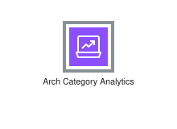
<div class="xal-ref-path">etc/resources/aws/svg/Category-Icons/Arch-Category_16/Arch-Category_Analytics_16.svg<br>2010 bytes</div>
</div>
</div>
{{#endtab}}
{{#tab name="Code"}}

```xml
{{#include ../samples/icons/Category-Icons/arch-category-analytics-16-6da1eadc.xal}}
```

{{#endtab}}
{{#endtabs}}

</div>
<div class="xal-ref-card">

{{#tabs name="svg-ref-0001"}}
{{#tab name="Preview"}}
<div class="xal-ref-preview">
<div>
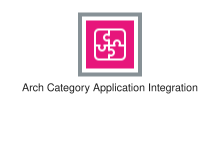
<div class="xal-ref-path">etc/resources/aws/svg/Category-Icons/Arch-Category_16/Arch-Category_Application-Integration_16.svg<br>2855 bytes</div>
</div>
</div>
{{#endtab}}
{{#tab name="Code"}}

```xml
{{#include ../samples/icons/Category-Icons/arch-category-application-integration-16-7a915f42.xal}}
```

{{#endtab}}
{{#endtabs}}

</div>
<div class="xal-ref-card">

{{#tabs name="svg-ref-0002"}}
{{#tab name="Preview"}}
<div class="xal-ref-preview">
<div>

<div class="xal-ref-path">etc/resources/aws/svg/Category-Icons/Arch-Category_16/Arch-Category_Artificial-Intelligence_16.svg<br>3091 bytes</div>
</div>
</div>
{{#endtab}}
{{#tab name="Code"}}

```xml
{{#include ../samples/icons/Category-Icons/arch-category-artificial-intelligence-16-7f2d329d.xal}}
```

{{#endtab}}
{{#endtabs}}

</div>
<div class="xal-ref-card">

{{#tabs name="svg-ref-0003"}}
{{#tab name="Preview"}}
<div class="xal-ref-preview">
<div>
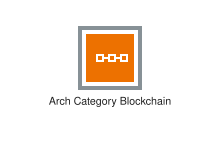
<div class="xal-ref-path">etc/resources/aws/svg/Category-Icons/Arch-Category_16/Arch-Category_Blockchain_16.svg<br>999 bytes</div>
</div>
</div>
{{#endtab}}
{{#tab name="Code"}}

```xml
{{#include ../samples/icons/Category-Icons/arch-category-blockchain-16-024198d3.xal}}
```

{{#endtab}}
{{#endtabs}}

</div>
<div class="xal-ref-card">

{{#tabs name="svg-ref-0004"}}
{{#tab name="Preview"}}
<div class="xal-ref-preview">
<div>

<div class="xal-ref-path">etc/resources/aws/svg/Category-Icons/Arch-Category_16/Arch-Category_Business-Applications_16.svg<br>2593 bytes</div>
</div>
</div>
{{#endtab}}
{{#tab name="Code"}}

```xml
{{#include ../samples/icons/Category-Icons/arch-category-business-applications-16-5fc82cc3.xal}}
```

{{#endtab}}
{{#endtabs}}

</div>
<div class="xal-ref-card">

{{#tabs name="svg-ref-0005"}}
{{#tab name="Preview"}}
<div class="xal-ref-preview">
<div>

<div class="xal-ref-path">etc/resources/aws/svg/Category-Icons/Arch-Category_16/Arch-Category_Cloud-Financial-Management_16.svg<br>2785 bytes</div>
</div>
</div>
{{#endtab}}
{{#tab name="Code"}}

```xml
{{#include ../samples/icons/Category-Icons/arch-category-cloud-financial-management-16-5c959490.xal}}
```

{{#endtab}}
{{#endtabs}}

</div>
<div class="xal-ref-card">

{{#tabs name="svg-ref-0006"}}
{{#tab name="Preview"}}
<div class="xal-ref-preview">
<div>

<div class="xal-ref-path">etc/resources/aws/svg/Category-Icons/Arch-Category_16/Arch-Category_Compute_16.svg<br>1490 bytes</div>
</div>
</div>
{{#endtab}}
{{#tab name="Code"}}

```xml
{{#include ../samples/icons/Category-Icons/arch-category-compute-16-c8542e0d.xal}}
```

{{#endtab}}
{{#endtabs}}

</div>
<div class="xal-ref-card">

{{#tabs name="svg-ref-0007"}}
{{#tab name="Preview"}}
<div class="xal-ref-preview">
<div>

<div class="xal-ref-path">etc/resources/aws/svg/Category-Icons/Arch-Category_16/Arch-Category_Contact-Center_16.svg<br>3186 bytes</div>
</div>
</div>
{{#endtab}}
{{#tab name="Code"}}

```xml
{{#include ../samples/icons/Category-Icons/arch-category-contact-center-16-126a4902.xal}}
```

{{#endtab}}
{{#endtabs}}

</div>
<div class="xal-ref-card">

{{#tabs name="svg-ref-0008"}}
{{#tab name="Preview"}}
<div class="xal-ref-preview">
<div>
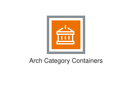
<div class="xal-ref-path">etc/resources/aws/svg/Category-Icons/Arch-Category_16/Arch-Category_Containers_16.svg<br>1398 bytes</div>
</div>
</div>
{{#endtab}}
{{#tab name="Code"}}

```xml
{{#include ../samples/icons/Category-Icons/arch-category-containers-16-eeb6b60e.xal}}
```

{{#endtab}}
{{#endtabs}}

</div>
<div class="xal-ref-card">

{{#tabs name="svg-ref-0009"}}
{{#tab name="Preview"}}
<div class="xal-ref-preview">
<div>
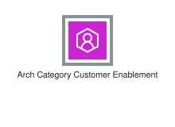
<div class="xal-ref-path">etc/resources/aws/svg/Category-Icons/Arch-Category_16/Arch-Category_Customer-Enablement_16.svg<br>1436 bytes</div>
</div>
</div>
{{#endtab}}
{{#tab name="Code"}}

```xml
{{#include ../samples/icons/Category-Icons/arch-category-customer-enablement-16-d24497bd.xal}}
```

{{#endtab}}
{{#endtabs}}

</div>
<div class="xal-ref-card">

{{#tabs name="svg-ref-0010"}}
{{#tab name="Preview"}}
<div class="xal-ref-preview">
<div>
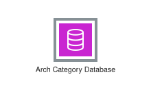
<div class="xal-ref-path">etc/resources/aws/svg/Category-Icons/Arch-Category_16/Arch-Category_Database_16.svg<br>1497 bytes</div>
</div>
</div>
{{#endtab}}
{{#tab name="Code"}}

```xml
{{#include ../samples/icons/Category-Icons/arch-category-database-16-fcec66b3.xal}}
```

{{#endtab}}
{{#endtabs}}

</div>
<div class="xal-ref-card">

{{#tabs name="svg-ref-0011"}}
{{#tab name="Preview"}}
<div class="xal-ref-preview">
<div>
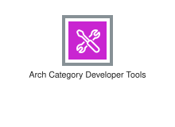
<div class="xal-ref-path">etc/resources/aws/svg/Category-Icons/Arch-Category_16/Arch-Category_Developer-Tools_16.svg<br>5950 bytes</div>
</div>
</div>
{{#endtab}}
{{#tab name="Code"}}

```xml
{{#include ../samples/icons/Category-Icons/arch-category-developer-tools-16-c0645540.xal}}
```

{{#endtab}}
{{#endtabs}}

</div>
<div class="xal-ref-card">

{{#tabs name="svg-ref-0012"}}
{{#tab name="Preview"}}
<div class="xal-ref-preview">
<div>
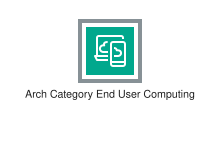
<div class="xal-ref-path">etc/resources/aws/svg/Category-Icons/Arch-Category_16/Arch-Category_End-User-Computing_16.svg<br>3268 bytes</div>
</div>
</div>
{{#endtab}}
{{#tab name="Code"}}

```xml
{{#include ../samples/icons/Category-Icons/arch-category-end-user-computing-16-53704c91.xal}}
```

{{#endtab}}
{{#endtabs}}

</div>
<div class="xal-ref-card">

{{#tabs name="svg-ref-0013"}}
{{#tab name="Preview"}}
<div class="xal-ref-preview">
<div>

<div class="xal-ref-path">etc/resources/aws/svg/Category-Icons/Arch-Category_16/Arch-Category_Front-End-Web-Mobile_16.svg<br>1526 bytes</div>
</div>
</div>
{{#endtab}}
{{#tab name="Code"}}

```xml
{{#include ../samples/icons/Category-Icons/arch-category-front-end-web-mobile-16-85b3aecf.xal}}
```

{{#endtab}}
{{#endtabs}}

</div>
<div class="xal-ref-card">

{{#tabs name="svg-ref-0014"}}
{{#tab name="Preview"}}
<div class="xal-ref-preview">
<div>

<div class="xal-ref-path">etc/resources/aws/svg/Category-Icons/Arch-Category_16/Arch-Category_Games_16.svg<br>3246 bytes</div>
</div>
</div>
{{#endtab}}
{{#tab name="Code"}}

```xml
{{#include ../samples/icons/Category-Icons/arch-category-games-16-60b7d7b6.xal}}
```

{{#endtab}}
{{#endtabs}}

</div>
<div class="xal-ref-card">

{{#tabs name="svg-ref-0015"}}
{{#tab name="Preview"}}
<div class="xal-ref-preview">
<div>
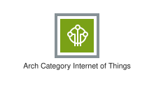
<div class="xal-ref-path">etc/resources/aws/svg/Category-Icons/Arch-Category_16/Arch-Category_Internet-of-Things_16.svg<br>2194 bytes</div>
</div>
</div>
{{#endtab}}
{{#tab name="Code"}}

```xml
{{#include ../samples/icons/Category-Icons/arch-category-internet-of-things-16-e5373abe.xal}}
```

{{#endtab}}
{{#endtabs}}

</div>
<div class="xal-ref-card">

{{#tabs name="svg-ref-0016"}}
{{#tab name="Preview"}}
<div class="xal-ref-preview">
<div>

<div class="xal-ref-path">etc/resources/aws/svg/Category-Icons/Arch-Category_16/Arch-Category_Management-Governance_16.svg<br>1603 bytes</div>
</div>
</div>
{{#endtab}}
{{#tab name="Code"}}

```xml
{{#include ../samples/icons/Category-Icons/arch-category-management-governance-16-24767a98.xal}}
```

{{#endtab}}
{{#endtabs}}

</div>
<div class="xal-ref-card">

{{#tabs name="svg-ref-0017"}}
{{#tab name="Preview"}}
<div class="xal-ref-preview">
<div>

<div class="xal-ref-path">etc/resources/aws/svg/Category-Icons/Arch-Category_16/Arch-Category_Media-Services_16.svg<br>1644 bytes</div>
</div>
</div>
{{#endtab}}
{{#tab name="Code"}}

```xml
{{#include ../samples/icons/Category-Icons/arch-category-media-services-16-d8ff3133.xal}}
```

{{#endtab}}
{{#endtabs}}

</div>
<div class="xal-ref-card">

{{#tabs name="svg-ref-0018"}}
{{#tab name="Preview"}}
<div class="xal-ref-preview">
<div>
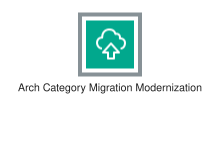
<div class="xal-ref-path">etc/resources/aws/svg/Category-Icons/Arch-Category_16/Arch-Category_Migration-Modernization_16.svg<br>2128 bytes</div>
</div>
</div>
{{#endtab}}
{{#tab name="Code"}}

```xml
{{#include ../samples/icons/Category-Icons/arch-category-migration-modernization-16-5f4cc70a.xal}}
```

{{#endtab}}
{{#endtabs}}

</div>
<div class="xal-ref-card">

{{#tabs name="svg-ref-0019"}}
{{#tab name="Preview"}}
<div class="xal-ref-preview">
<div>
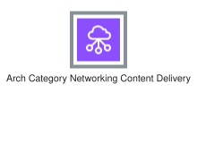
<div class="xal-ref-path">etc/resources/aws/svg/Category-Icons/Arch-Category_16/Arch-Category_Networking-Content-Delivery_16.svg<br>3462 bytes</div>
</div>
</div>
{{#endtab}}
{{#tab name="Code"}}

```xml
{{#include ../samples/icons/Category-Icons/arch-category-networking-content-delivery-16-c087f8d4.xal}}
```

{{#endtab}}
{{#endtabs}}

</div>
<div class="xal-ref-card">

{{#tabs name="svg-ref-0020"}}
{{#tab name="Preview"}}
<div class="xal-ref-preview">
<div>
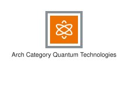
<div class="xal-ref-path">etc/resources/aws/svg/Category-Icons/Arch-Category_16/Arch-Category_Quantum-Technologies_16.svg<br>3741 bytes</div>
</div>
</div>
{{#endtab}}
{{#tab name="Code"}}

```xml
{{#include ../samples/icons/Category-Icons/arch-category-quantum-technologies-16-53d03ec1.xal}}
```

{{#endtab}}
{{#endtabs}}

</div>
<div class="xal-ref-card">

{{#tabs name="svg-ref-0021"}}
{{#tab name="Preview"}}
<div class="xal-ref-preview">
<div>
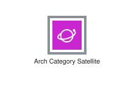
<div class="xal-ref-path">etc/resources/aws/svg/Category-Icons/Arch-Category_16/Arch-Category_Satellite_16.svg<br>2414 bytes</div>
</div>
</div>
{{#endtab}}
{{#tab name="Code"}}

```xml
{{#include ../samples/icons/Category-Icons/arch-category-satellite-16-cfd1c223.xal}}
```

{{#endtab}}
{{#endtabs}}

</div>
<div class="xal-ref-card">

{{#tabs name="svg-ref-0022"}}
{{#tab name="Preview"}}
<div class="xal-ref-preview">
<div>

<div class="xal-ref-path">etc/resources/aws/svg/Category-Icons/Arch-Category_16/Arch-Category_Security-Identity-Compliance_16.svg<br>1498 bytes</div>
</div>
</div>
{{#endtab}}
{{#tab name="Code"}}

```xml
{{#include ../samples/icons/Category-Icons/arch-category-security-identity-compliance-16-f965d2a1.xal}}
```

{{#endtab}}
{{#endtabs}}

</div>
<div class="xal-ref-card">

{{#tabs name="svg-ref-0023"}}
{{#tab name="Preview"}}
<div class="xal-ref-preview">
<div>

<div class="xal-ref-path">etc/resources/aws/svg/Category-Icons/Arch-Category_16/Arch-Category_Serverless_16.svg<br>2045 bytes</div>
</div>
</div>
{{#endtab}}
{{#tab name="Code"}}

```xml
{{#include ../samples/icons/Category-Icons/arch-category-serverless-16-1f89e9bf.xal}}
```

{{#endtab}}
{{#endtabs}}

</div>
<div class="xal-ref-card">

{{#tabs name="svg-ref-0024"}}
{{#tab name="Preview"}}
<div class="xal-ref-preview">
<div>
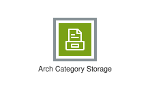
<div class="xal-ref-path">etc/resources/aws/svg/Category-Icons/Arch-Category_16/Arch-Category_Storage_16.svg<br>1499 bytes</div>
</div>
</div>
{{#endtab}}
{{#tab name="Code"}}

```xml
{{#include ../samples/icons/Category-Icons/arch-category-storage-16-f2777360.xal}}
```

{{#endtab}}
{{#endtabs}}

</div>
<div class="xal-ref-card">

{{#tabs name="svg-ref-0025"}}
{{#tab name="Preview"}}
<div class="xal-ref-preview">
<div>
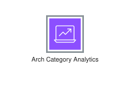
<div class="xal-ref-path">etc/resources/aws/svg/Category-Icons/Arch-Category_32/Arch-Category_Analytics_32.svg<br>2118 bytes</div>
</div>
</div>
{{#endtab}}
{{#tab name="Code"}}

```xml
{{#include ../samples/icons/Category-Icons/arch-category-analytics-32-c986d6db.xal}}
```

{{#endtab}}
{{#endtabs}}

</div>
<div class="xal-ref-card">

{{#tabs name="svg-ref-0026"}}
{{#tab name="Preview"}}
<div class="xal-ref-preview">
<div>
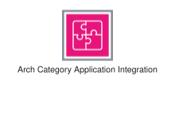
<div class="xal-ref-path">etc/resources/aws/svg/Category-Icons/Arch-Category_32/Arch-Category_Application-Integration_32.svg<br>3488 bytes</div>
</div>
</div>
{{#endtab}}
{{#tab name="Code"}}

```xml
{{#include ../samples/icons/Category-Icons/arch-category-application-integration-32-347c264e.xal}}
```

{{#endtab}}
{{#endtabs}}

</div>
<div class="xal-ref-card">

{{#tabs name="svg-ref-0027"}}
{{#tab name="Preview"}}
<div class="xal-ref-preview">
<div>
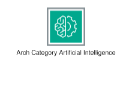
<div class="xal-ref-path">etc/resources/aws/svg/Category-Icons/Arch-Category_32/Arch-Category_Artificial-Intelligence_32.svg<br>5076 bytes</div>
</div>
</div>
{{#endtab}}
{{#tab name="Code"}}

```xml
{{#include ../samples/icons/Category-Icons/arch-category-artificial-intelligence-32-31c04b91.xal}}
```

{{#endtab}}
{{#endtabs}}

</div>
<div class="xal-ref-card">

{{#tabs name="svg-ref-0028"}}
{{#tab name="Preview"}}
<div class="xal-ref-preview">
<div>
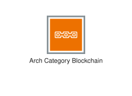
<div class="xal-ref-path">etc/resources/aws/svg/Category-Icons/Arch-Category_32/Arch-Category_Blockchain_32.svg<br>2070 bytes</div>
</div>
</div>
{{#endtab}}
{{#tab name="Code"}}

```xml
{{#include ../samples/icons/Category-Icons/arch-category-blockchain-32-28c77eb8.xal}}
```

{{#endtab}}
{{#endtabs}}

</div>
<div class="xal-ref-card">

{{#tabs name="svg-ref-0029"}}
{{#tab name="Preview"}}
<div class="xal-ref-preview">
<div>

<div class="xal-ref-path">etc/resources/aws/svg/Category-Icons/Arch-Category_32/Arch-Category_Business-Applications_32.svg<br>2617 bytes</div>
</div>
</div>
{{#endtab}}
{{#tab name="Code"}}

```xml
{{#include ../samples/icons/Category-Icons/arch-category-business-applications-32-d37d9c59.xal}}
```

{{#endtab}}
{{#endtabs}}

</div>
<div class="xal-ref-card">

{{#tabs name="svg-ref-0030"}}
{{#tab name="Preview"}}
<div class="xal-ref-preview">
<div>

<div class="xal-ref-path">etc/resources/aws/svg/Category-Icons/Arch-Category_32/Arch-Category_Cloud-Financial-Management_32.svg<br>1988 bytes</div>
</div>
</div>
{{#endtab}}
{{#tab name="Code"}}

```xml
{{#include ../samples/icons/Category-Icons/arch-category-cloud-financial-management-32-673d1077.xal}}
```

{{#endtab}}
{{#endtabs}}

</div>
<div class="xal-ref-card">

{{#tabs name="svg-ref-0031"}}
{{#tab name="Preview"}}
<div class="xal-ref-preview">
<div>
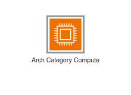
<div class="xal-ref-path">etc/resources/aws/svg/Category-Icons/Arch-Category_32/Arch-Category_Compute_32.svg<br>2004 bytes</div>
</div>
</div>
{{#endtab}}
{{#tab name="Code"}}

```xml
{{#include ../samples/icons/Category-Icons/arch-category-compute-32-9c507444.xal}}
```

{{#endtab}}
{{#endtabs}}

</div>
<div class="xal-ref-card">

{{#tabs name="svg-ref-0032"}}
{{#tab name="Preview"}}
<div class="xal-ref-preview">
<div>

<div class="xal-ref-path">etc/resources/aws/svg/Category-Icons/Arch-Category_32/Arch-Category_Contact-Center_32.svg<br>3890 bytes</div>
</div>
</div>
{{#endtab}}
{{#tab name="Code"}}

```xml
{{#include ../samples/icons/Category-Icons/arch-category-contact-center-32-0411e5f3.xal}}
```

{{#endtab}}
{{#endtabs}}

</div>
<div class="xal-ref-card">

{{#tabs name="svg-ref-0033"}}
{{#tab name="Preview"}}
<div class="xal-ref-preview">
<div>
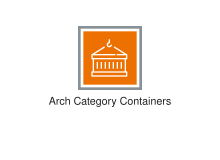
<div class="xal-ref-path">etc/resources/aws/svg/Category-Icons/Arch-Category_32/Arch-Category_Containers_32.svg<br>1781 bytes</div>
</div>
</div>
{{#endtab}}
{{#tab name="Code"}}

```xml
{{#include ../samples/icons/Category-Icons/arch-category-containers-32-c4305065.xal}}
```

{{#endtab}}
{{#endtabs}}

</div>
<div class="xal-ref-card">

{{#tabs name="svg-ref-0034"}}
{{#tab name="Preview"}}
<div class="xal-ref-preview">
<div>
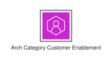
<div class="xal-ref-path">etc/resources/aws/svg/Category-Icons/Arch-Category_32/Arch-Category_Customer-Enablement_32.svg<br>1493 bytes</div>
</div>
</div>
{{#endtab}}
{{#tab name="Code"}}

```xml
{{#include ../samples/icons/Category-Icons/arch-category-customer-enablement-32-0d5e64fb.xal}}
```

{{#endtab}}
{{#endtabs}}

</div>
<div class="xal-ref-card">

{{#tabs name="svg-ref-0035"}}
{{#tab name="Preview"}}
<div class="xal-ref-preview">
<div>

<div class="xal-ref-path">etc/resources/aws/svg/Category-Icons/Arch-Category_32/Arch-Category_Database_32.svg<br>1516 bytes</div>
</div>
</div>
{{#endtab}}
{{#tab name="Code"}}

```xml
{{#include ../samples/icons/Category-Icons/arch-category-database-32-47fecf29.xal}}
```

{{#endtab}}
{{#endtabs}}

</div>
<div class="xal-ref-card">

{{#tabs name="svg-ref-0036"}}
{{#tab name="Preview"}}
<div class="xal-ref-preview">
<div>
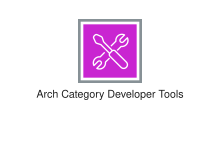
<div class="xal-ref-path">etc/resources/aws/svg/Category-Icons/Arch-Category_32/Arch-Category_Developer-Tools_32.svg<br>5721 bytes</div>
</div>
</div>
{{#endtab}}
{{#tab name="Code"}}

```xml
{{#include ../samples/icons/Category-Icons/arch-category-developer-tools-32-be8eb892.xal}}
```

{{#endtab}}
{{#endtabs}}

</div>
<div class="xal-ref-card">

{{#tabs name="svg-ref-0037"}}
{{#tab name="Preview"}}
<div class="xal-ref-preview">
<div>
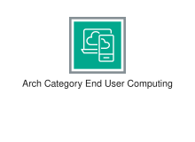
<div class="xal-ref-path">etc/resources/aws/svg/Category-Icons/Arch-Category_32/Arch-Category_End-User-Computing_32.svg<br>3818 bytes</div>
</div>
</div>
{{#endtab}}
{{#tab name="Code"}}

```xml
{{#include ../samples/icons/Category-Icons/arch-category-end-user-computing-32-64860ac1.xal}}
```

{{#endtab}}
{{#endtabs}}

</div>
<div class="xal-ref-card">

{{#tabs name="svg-ref-0038"}}
{{#tab name="Preview"}}
<div class="xal-ref-preview">
<div>

<div class="xal-ref-path">etc/resources/aws/svg/Category-Icons/Arch-Category_32/Arch-Category_Front-End-Web-Mobile_32.svg<br>1588 bytes</div>
</div>
</div>
{{#endtab}}
{{#tab name="Code"}}

```xml
{{#include ../samples/icons/Category-Icons/arch-category-front-end-web-mobile-32-ae95046d.xal}}
```

{{#endtab}}
{{#endtabs}}

</div>
<div class="xal-ref-card">

{{#tabs name="svg-ref-0039"}}
{{#tab name="Preview"}}
<div class="xal-ref-preview">
<div>

<div class="xal-ref-path">etc/resources/aws/svg/Category-Icons/Arch-Category_32/Arch-Category_Games_32.svg<br>2739 bytes</div>
</div>
</div>
{{#endtab}}
{{#tab name="Code"}}

```xml
{{#include ../samples/icons/Category-Icons/arch-category-games-32-18279641.xal}}
```

{{#endtab}}
{{#endtabs}}

</div>
<div class="xal-ref-card">

{{#tabs name="svg-ref-0040"}}
{{#tab name="Preview"}}
<div class="xal-ref-preview">
<div>
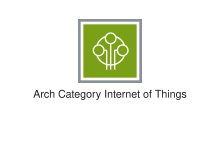
<div class="xal-ref-path">etc/resources/aws/svg/Category-Icons/Arch-Category_32/Arch-Category_Internet-of-Things_32.svg<br>2773 bytes</div>
</div>
</div>
{{#endtab}}
{{#tab name="Code"}}

```xml
{{#include ../samples/icons/Category-Icons/arch-category-internet-of-things-32-d2c17cee.xal}}
```

{{#endtab}}
{{#endtabs}}

</div>
<div class="xal-ref-card">

{{#tabs name="svg-ref-0041"}}
{{#tab name="Preview"}}
<div class="xal-ref-preview">
<div>

<div class="xal-ref-path">etc/resources/aws/svg/Category-Icons/Arch-Category_32/Arch-Category_Management-Governance_32.svg<br>1686 bytes</div>
</div>
</div>
{{#endtab}}
{{#tab name="Code"}}

```xml
{{#include ../samples/icons/Category-Icons/arch-category-management-governance-32-a8c3ca02.xal}}
```

{{#endtab}}
{{#endtabs}}

</div>
<div class="xal-ref-card">

{{#tabs name="svg-ref-0042"}}
{{#tab name="Preview"}}
<div class="xal-ref-preview">
<div>

<div class="xal-ref-path">etc/resources/aws/svg/Category-Icons/Arch-Category_32/Arch-Category_Media-Services_32.svg<br>2149 bytes</div>
</div>
</div>
{{#endtab}}
{{#tab name="Code"}}

```xml
{{#include ../samples/icons/Category-Icons/arch-category-media-services-32-ce849dc2.xal}}
```

{{#endtab}}
{{#endtabs}}

</div>
<div class="xal-ref-card">

{{#tabs name="svg-ref-0043"}}
{{#tab name="Preview"}}
<div class="xal-ref-preview">
<div>
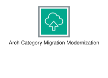
<div class="xal-ref-path">etc/resources/aws/svg/Category-Icons/Arch-Category_32/Arch-Category_Migration-Modernization_32.svg<br>2273 bytes</div>
</div>
</div>
{{#endtab}}
{{#tab name="Code"}}

```xml
{{#include ../samples/icons/Category-Icons/arch-category-migration-modernization-32-11a1be06.xal}}
```

{{#endtab}}
{{#endtabs}}

</div>
<div class="xal-ref-card">

{{#tabs name="svg-ref-0044"}}
{{#tab name="Preview"}}
<div class="xal-ref-preview">
<div>
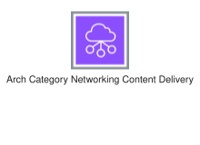
<div class="xal-ref-path">etc/resources/aws/svg/Category-Icons/Arch-Category_32/Arch-Category_Networking-Content-Delivery_32.svg<br>2921 bytes</div>
</div>
</div>
{{#endtab}}
{{#tab name="Code"}}

```xml
{{#include ../samples/icons/Category-Icons/arch-category-networking-content-delivery-32-4a94737f.xal}}
```

{{#endtab}}
{{#endtabs}}

</div>
<div class="xal-ref-card">

{{#tabs name="svg-ref-0045"}}
{{#tab name="Preview"}}
<div class="xal-ref-preview">
<div>

<div class="xal-ref-path">etc/resources/aws/svg/Category-Icons/Arch-Category_32/Arch-Category_Quantum-Technologies_32.svg<br>5050 bytes</div>
</div>
</div>
{{#endtab}}
{{#tab name="Code"}}

```xml
{{#include ../samples/icons/Category-Icons/arch-category-quantum-technologies-32-78f69463.xal}}
```

{{#endtab}}
{{#endtabs}}

</div>
<div class="xal-ref-card">

{{#tabs name="svg-ref-0046"}}
{{#tab name="Preview"}}
<div class="xal-ref-preview">
<div>
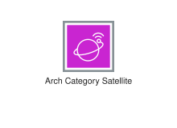
<div class="xal-ref-path">etc/resources/aws/svg/Category-Icons/Arch-Category_32/Arch-Category_Satellite_32.svg<br>3468 bytes</div>
</div>
</div>
{{#endtab}}
{{#tab name="Code"}}

```xml
{{#include ../samples/icons/Category-Icons/arch-category-satellite-32-6bf6fe24.xal}}
```

{{#endtab}}
{{#endtabs}}

</div>
<div class="xal-ref-card">

{{#tabs name="svg-ref-0047"}}
{{#tab name="Preview"}}
<div class="xal-ref-preview">
<div>

<div class="xal-ref-path">etc/resources/aws/svg/Category-Icons/Arch-Category_32/Arch-Category_Security-Identity-Compliance_32.svg<br>1875 bytes</div>
</div>
</div>
{{#endtab}}
{{#tab name="Code"}}

```xml
{{#include ../samples/icons/Category-Icons/arch-category-security-identity-compliance-32-0cadefbe.xal}}
```

{{#endtab}}
{{#endtabs}}

</div>
<div class="xal-ref-card">

{{#tabs name="svg-ref-0048"}}
{{#tab name="Preview"}}
<div class="xal-ref-preview">
<div>

<div class="xal-ref-path">etc/resources/aws/svg/Category-Icons/Arch-Category_32/Arch-Category_Serverless_32.svg<br>2947 bytes</div>
</div>
</div>
{{#endtab}}
{{#tab name="Code"}}

```xml
{{#include ../samples/icons/Category-Icons/arch-category-serverless-32-350f0fd4.xal}}
```

{{#endtab}}
{{#endtabs}}

</div>
<div class="xal-ref-card">

{{#tabs name="svg-ref-0049"}}
{{#tab name="Preview"}}
<div class="xal-ref-preview">
<div>
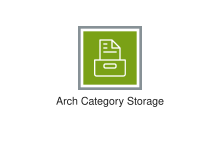
<div class="xal-ref-path">etc/resources/aws/svg/Category-Icons/Arch-Category_32/Arch-Category_Storage_32.svg<br>1732 bytes</div>
</div>
</div>
{{#endtab}}
{{#tab name="Code"}}

```xml
{{#include ../samples/icons/Category-Icons/arch-category-storage-32-a6732929.xal}}
```

{{#endtab}}
{{#endtabs}}

</div>
<div class="xal-ref-card">

{{#tabs name="svg-ref-0050"}}
{{#tab name="Preview"}}
<div class="xal-ref-preview">
<div>
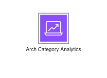
<div class="xal-ref-path">etc/resources/aws/svg/Category-Icons/Arch-Category_48/Arch-Category_Analytics_48.svg<br>2016 bytes</div>
</div>
</div>
{{#endtab}}
{{#tab name="Code"}}

```xml
{{#include ../samples/icons/Category-Icons/arch-category-analytics-48-c53f355a.xal}}
```

{{#endtab}}
{{#endtabs}}

</div>
<div class="xal-ref-card">

{{#tabs name="svg-ref-0051"}}
{{#tab name="Preview"}}
<div class="xal-ref-preview">
<div>
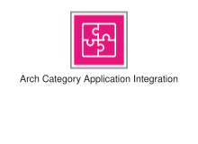
<div class="xal-ref-path">etc/resources/aws/svg/Category-Icons/Arch-Category_48/Arch-Category_Application-Integration_48.svg<br>3620 bytes</div>
</div>
</div>
{{#endtab}}
{{#tab name="Code"}}

```xml
{{#include ../samples/icons/Category-Icons/arch-category-application-integration-48-11eadf11.xal}}
```

{{#endtab}}
{{#endtabs}}

</div>
<div class="xal-ref-card">

{{#tabs name="svg-ref-0052"}}
{{#tab name="Preview"}}
<div class="xal-ref-preview">
<div>
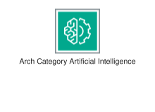
<div class="xal-ref-path">etc/resources/aws/svg/Category-Icons/Arch-Category_48/Arch-Category_Artificial-Intelligence_48.svg<br>4974 bytes</div>
</div>
</div>
{{#endtab}}
{{#tab name="Code"}}

```xml
{{#include ../samples/icons/Category-Icons/arch-category-artificial-intelligence-48-1456b2ce.xal}}
```

{{#endtab}}
{{#endtabs}}

</div>
<div class="xal-ref-card">

{{#tabs name="svg-ref-0053"}}
{{#tab name="Preview"}}
<div class="xal-ref-preview">
<div>
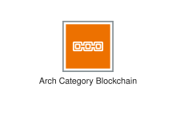
<div class="xal-ref-path">etc/resources/aws/svg/Category-Icons/Arch-Category_48/Arch-Category_Blockchain_48.svg<br>2318 bytes</div>
</div>
</div>
{{#endtab}}
{{#tab name="Code"}}

```xml
{{#include ../samples/icons/Category-Icons/arch-category-blockchain-48-81fd411c.xal}}
```

{{#endtab}}
{{#endtabs}}

</div>
<div class="xal-ref-card">

{{#tabs name="svg-ref-0054"}}
{{#tab name="Preview"}}
<div class="xal-ref-preview">
<div>

<div class="xal-ref-path">etc/resources/aws/svg/Category-Icons/Arch-Category_48/Arch-Category_Business-Applications_48.svg<br>2597 bytes</div>
</div>
</div>
{{#endtab}}
{{#tab name="Code"}}

```xml
{{#include ../samples/icons/Category-Icons/arch-category-business-applications-48-86a8d4b3.xal}}
```

{{#endtab}}
{{#endtabs}}

</div>
<div class="xal-ref-card">

{{#tabs name="svg-ref-0055"}}
{{#tab name="Preview"}}
<div class="xal-ref-preview">
<div>

<div class="xal-ref-path">etc/resources/aws/svg/Category-Icons/Arch-Category_48/Arch-Category_Cloud-Financial-Management_48.svg<br>1975 bytes</div>
</div>
</div>
{{#endtab}}
{{#tab name="Code"}}

```xml
{{#include ../samples/icons/Category-Icons/arch-category-cloud-financial-management-48-7edb4c42.xal}}
```

{{#endtab}}
{{#endtabs}}

</div>
<div class="xal-ref-card">

{{#tabs name="svg-ref-0056"}}
{{#tab name="Preview"}}
<div class="xal-ref-preview">
<div>
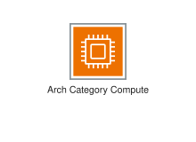
<div class="xal-ref-path">etc/resources/aws/svg/Category-Icons/Arch-Category_48/Arch-Category_Compute_48.svg<br>1785 bytes</div>
</div>
</div>
{{#endtab}}
{{#tab name="Code"}}

```xml
{{#include ../samples/icons/Category-Icons/arch-category-compute-48-a3e51e7b.xal}}
```

{{#endtab}}
{{#endtabs}}

</div>
<div class="xal-ref-card">

{{#tabs name="svg-ref-0057"}}
{{#tab name="Preview"}}
<div class="xal-ref-preview">
<div>

<div class="xal-ref-path">etc/resources/aws/svg/Category-Icons/Arch-Category_48/Arch-Category_Contact-Center_48.svg<br>4259 bytes</div>
</div>
</div>
{{#endtab}}
{{#tab name="Code"}}

```xml
{{#include ../samples/icons/Category-Icons/arch-category-contact-center-48-43cbb5c7.xal}}
```

{{#endtab}}
{{#endtabs}}

</div>
<div class="xal-ref-card">

{{#tabs name="svg-ref-0058"}}
{{#tab name="Preview"}}
<div class="xal-ref-preview">
<div>
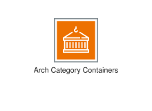
<div class="xal-ref-path">etc/resources/aws/svg/Category-Icons/Arch-Category_48/Arch-Category_Containers_48.svg<br>1789 bytes</div>
</div>
</div>
{{#endtab}}
{{#tab name="Code"}}

```xml
{{#include ../samples/icons/Category-Icons/arch-category-containers-48-6d0a6fc1.xal}}
```

{{#endtab}}
{{#endtabs}}

</div>
<div class="xal-ref-card">

{{#tabs name="svg-ref-0059"}}
{{#tab name="Preview"}}
<div class="xal-ref-preview">
<div>
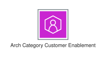
<div class="xal-ref-path">etc/resources/aws/svg/Category-Icons/Arch-Category_48/Arch-Category_Customer-Enablement_48.svg<br>1471 bytes</div>
</div>
</div>
{{#endtab}}
{{#tab name="Code"}}

```xml
{{#include ../samples/icons/Category-Icons/arch-category-customer-enablement-48-c478b168.xal}}
```

{{#endtab}}
{{#endtabs}}

</div>
<div class="xal-ref-card">

{{#tabs name="svg-ref-0060"}}
{{#tab name="Preview"}}
<div class="xal-ref-preview">
<div>
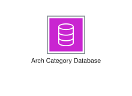
<div class="xal-ref-path">etc/resources/aws/svg/Category-Icons/Arch-Category_48/Arch-Category_Database_48.svg<br>1514 bytes</div>
</div>
</div>
{{#endtab}}
{{#tab name="Code"}}

```xml
{{#include ../samples/icons/Category-Icons/arch-category-database-48-c22e628f.xal}}
```

{{#endtab}}
{{#endtabs}}

</div>
<div class="xal-ref-card">

{{#tabs name="svg-ref-0061"}}
{{#tab name="Preview"}}
<div class="xal-ref-preview">
<div>
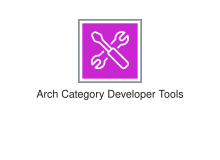
<div class="xal-ref-path">etc/resources/aws/svg/Category-Icons/Arch-Category_48/Arch-Category_Developer-Tools_48.svg<br>6079 bytes</div>
</div>
</div>
{{#endtab}}
{{#tab name="Code"}}

```xml
{{#include ../samples/icons/Category-Icons/arch-category-developer-tools-48-acf4a386.xal}}
```

{{#endtab}}
{{#endtabs}}

</div>
<div class="xal-ref-card">

{{#tabs name="svg-ref-0062"}}
{{#tab name="Preview"}}
<div class="xal-ref-preview">
<div>
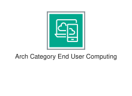
<div class="xal-ref-path">etc/resources/aws/svg/Category-Icons/Arch-Category_48/Arch-Category_End-User-Computing_48.svg<br>3642 bytes</div>
</div>
</div>
{{#endtab}}
{{#tab name="Code"}}

```xml
{{#include ../samples/icons/Category-Icons/arch-category-end-user-computing-48-c45b0bdf.xal}}
```

{{#endtab}}
{{#endtabs}}

</div>
<div class="xal-ref-card">

{{#tabs name="svg-ref-0063"}}
{{#tab name="Preview"}}
<div class="xal-ref-preview">
<div>

<div class="xal-ref-path">etc/resources/aws/svg/Category-Icons/Arch-Category_48/Arch-Category_Front-End-Web-Mobile_48.svg<br>1445 bytes</div>
</div>
</div>
{{#endtab}}
{{#tab name="Code"}}

```xml
{{#include ../samples/icons/Category-Icons/arch-category-front-end-web-mobile-48-f4d3d5b7.xal}}
```

{{#endtab}}
{{#endtabs}}

</div>
<div class="xal-ref-card">

{{#tabs name="svg-ref-0064"}}
{{#tab name="Preview"}}
<div class="xal-ref-preview">
<div>

<div class="xal-ref-path">etc/resources/aws/svg/Category-Icons/Arch-Category_48/Arch-Category_Games_48.svg<br>2729 bytes</div>
</div>
</div>
{{#endtab}}
{{#tab name="Code"}}

```xml
{{#include ../samples/icons/Category-Icons/arch-category-games-48-b330a537.xal}}
```

{{#endtab}}
{{#endtabs}}

</div>
<div class="xal-ref-card">

{{#tabs name="svg-ref-0065"}}
{{#tab name="Preview"}}
<div class="xal-ref-preview">
<div>
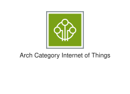
<div class="xal-ref-path">etc/resources/aws/svg/Category-Icons/Arch-Category_48/Arch-Category_Internet-of-Things_48.svg<br>2399 bytes</div>
</div>
</div>
{{#endtab}}
{{#tab name="Code"}}

```xml
{{#include ../samples/icons/Category-Icons/arch-category-internet-of-things-48-721c7df0.xal}}
```

{{#endtab}}
{{#endtabs}}

</div>
<div class="xal-ref-card">

{{#tabs name="svg-ref-0066"}}
{{#tab name="Preview"}}
<div class="xal-ref-preview">
<div>

<div class="xal-ref-path">etc/resources/aws/svg/Category-Icons/Arch-Category_48/Arch-Category_Management-Governance_48.svg<br>1717 bytes</div>
</div>
</div>
{{#endtab}}
{{#tab name="Code"}}

```xml
{{#include ../samples/icons/Category-Icons/arch-category-management-governance-48-fd1682e8.xal}}
```

{{#endtab}}
{{#endtabs}}

</div>
<div class="xal-ref-card">

{{#tabs name="svg-ref-0067"}}
{{#tab name="Preview"}}
<div class="xal-ref-preview">
<div>

<div class="xal-ref-path">etc/resources/aws/svg/Category-Icons/Arch-Category_48/Arch-Category_Media-Services_48.svg<br>2226 bytes</div>
</div>
</div>
{{#endtab}}
{{#tab name="Code"}}

```xml
{{#include ../samples/icons/Category-Icons/arch-category-media-services-48-895ecdf6.xal}}
```

{{#endtab}}
{{#endtabs}}

</div>
<div class="xal-ref-card">

{{#tabs name="svg-ref-0068"}}
{{#tab name="Preview"}}
<div class="xal-ref-preview">
<div>
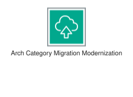
<div class="xal-ref-path">etc/resources/aws/svg/Category-Icons/Arch-Category_48/Arch-Category_Migration-Modernization_48.svg<br>2289 bytes</div>
</div>
</div>
{{#endtab}}
{{#tab name="Code"}}

```xml
{{#include ../samples/icons/Category-Icons/arch-category-migration-modernization-48-34374759.xal}}
```

{{#endtab}}
{{#endtabs}}

</div>
<div class="xal-ref-card">

{{#tabs name="svg-ref-0069"}}
{{#tab name="Preview"}}
<div class="xal-ref-preview">
<div>
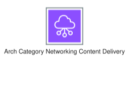
<div class="xal-ref-path">etc/resources/aws/svg/Category-Icons/Arch-Category_48/Arch-Category_Networking-Content-Delivery_48.svg<br>2670 bytes</div>
</div>
</div>
{{#endtab}}
{{#tab name="Code"}}

```xml
{{#include ../samples/icons/Category-Icons/arch-category-networking-content-delivery-48-2fb764f1.xal}}
```

{{#endtab}}
{{#endtabs}}

</div>
<div class="xal-ref-card">

{{#tabs name="svg-ref-0070"}}
{{#tab name="Preview"}}
<div class="xal-ref-preview">
<div>

<div class="xal-ref-path">etc/resources/aws/svg/Category-Icons/Arch-Category_48/Arch-Category_Quantum-Technologies_48.svg<br>5217 bytes</div>
</div>
</div>
{{#endtab}}
{{#tab name="Code"}}

```xml
{{#include ../samples/icons/Category-Icons/arch-category-quantum-technologies-48-22b045b9.xal}}
```

{{#endtab}}
{{#endtabs}}

</div>
<div class="xal-ref-card">

{{#tabs name="svg-ref-0071"}}
{{#tab name="Preview"}}
<div class="xal-ref-preview">
<div>
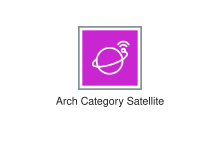
<div class="xal-ref-path">etc/resources/aws/svg/Category-Icons/Arch-Category_48/Arch-Category_Satellite_48.svg<br>4119 bytes</div>
</div>
</div>
{{#endtab}}
{{#tab name="Code"}}

```xml
{{#include ../samples/icons/Category-Icons/arch-category-satellite-48-674f1da5.xal}}
```

{{#endtab}}
{{#endtabs}}

</div>
<div class="xal-ref-card">

{{#tabs name="svg-ref-0072"}}
{{#tab name="Preview"}}
<div class="xal-ref-preview">
<div>

<div class="xal-ref-path">etc/resources/aws/svg/Category-Icons/Arch-Category_48/Arch-Category_Security-Identity-Compliance_48.svg<br>1696 bytes</div>
</div>
</div>
{{#endtab}}
{{#tab name="Code"}}

```xml
{{#include ../samples/icons/Category-Icons/arch-category-security-identity-compliance-48-3541577f.xal}}
```

{{#endtab}}
{{#endtabs}}

</div>
<div class="xal-ref-card">

{{#tabs name="svg-ref-0073"}}
{{#tab name="Preview"}}
<div class="xal-ref-preview">
<div>
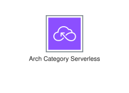
<div class="xal-ref-path">etc/resources/aws/svg/Category-Icons/Arch-Category_48/Arch-Category_Serverless_48.svg<br>3076 bytes</div>
</div>
</div>
{{#endtab}}
{{#tab name="Code"}}

```xml
{{#include ../samples/icons/Category-Icons/arch-category-serverless-48-9c353070.xal}}
```

{{#endtab}}
{{#endtabs}}

</div>
<div class="xal-ref-card">

{{#tabs name="svg-ref-0074"}}
{{#tab name="Preview"}}
<div class="xal-ref-preview">
<div>
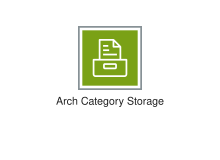
<div class="xal-ref-path">etc/resources/aws/svg/Category-Icons/Arch-Category_48/Arch-Category_Storage_48.svg<br>1583 bytes</div>
</div>
</div>
{{#endtab}}
{{#tab name="Code"}}

```xml
{{#include ../samples/icons/Category-Icons/arch-category-storage-48-99c64316.xal}}
```

{{#endtab}}
{{#endtabs}}

</div>
<div class="xal-ref-card">

{{#tabs name="svg-ref-0075"}}
{{#tab name="Preview"}}
<div class="xal-ref-preview">
<div>
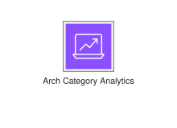
<div class="xal-ref-path">etc/resources/aws/svg/Category-Icons/Arch-Category_64/Arch-Category_Analytics_64.svg<br>1977 bytes</div>
</div>
</div>
{{#endtab}}
{{#tab name="Code"}}

```xml
{{#include ../samples/icons/Category-Icons/arch-category-analytics-64-b27c76c8.xal}}
```

{{#endtab}}
{{#endtabs}}

</div>
<div class="xal-ref-card">

{{#tabs name="svg-ref-0076"}}
{{#tab name="Preview"}}
<div class="xal-ref-preview">
<div>
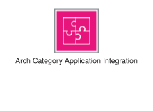
<div class="xal-ref-path">etc/resources/aws/svg/Category-Icons/Arch-Category_64/Arch-Category_Application-Integration_64.svg<br>3630 bytes</div>
</div>
</div>
{{#endtab}}
{{#tab name="Code"}}

```xml
{{#include ../samples/icons/Category-Icons/arch-category-application-integration-64-27d93dc6.xal}}
```

{{#endtab}}
{{#endtabs}}

</div>
<div class="xal-ref-card">

{{#tabs name="svg-ref-0077"}}
{{#tab name="Preview"}}
<div class="xal-ref-preview">
<div>
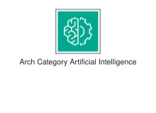
<div class="xal-ref-path">etc/resources/aws/svg/Category-Icons/Arch-Category_64/Arch-Category_Artificial-Intelligence_64.svg<br>4811 bytes</div>
</div>
</div>
{{#endtab}}
{{#tab name="Code"}}

```xml
{{#include ../samples/icons/Category-Icons/arch-category-artificial-intelligence-64-22655019.xal}}
```

{{#endtab}}
{{#endtabs}}

</div>
<div class="xal-ref-card">

{{#tabs name="svg-ref-0078"}}
{{#tab name="Preview"}}
<div class="xal-ref-preview">
<div>
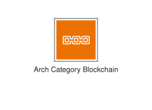
<div class="xal-ref-path">etc/resources/aws/svg/Category-Icons/Arch-Category_64/Arch-Category_Blockchain_64.svg<br>2402 bytes</div>
</div>
</div>
{{#endtab}}
{{#tab name="Code"}}

```xml
{{#include ../samples/icons/Category-Icons/arch-category-blockchain-64-f7ee6d6f.xal}}
```

{{#endtab}}
{{#endtabs}}

</div>
<div class="xal-ref-card">

{{#tabs name="svg-ref-0079"}}
{{#tab name="Preview"}}
<div class="xal-ref-preview">
<div>

<div class="xal-ref-path">etc/resources/aws/svg/Category-Icons/Arch-Category_64/Arch-Category_Business-Applications_64.svg<br>2629 bytes</div>
</div>
</div>
{{#endtab}}
{{#tab name="Code"}}

```xml
{{#include ../samples/icons/Category-Icons/arch-category-business-applications-64-b05deab9.xal}}
```

{{#endtab}}
{{#endtabs}}

</div>
<div class="xal-ref-card">

{{#tabs name="svg-ref-0080"}}
{{#tab name="Preview"}}
<div class="xal-ref-preview">
<div>

<div class="xal-ref-path">etc/resources/aws/svg/Category-Icons/Arch-Category_64/Arch-Category_Cloud-Financial-Management_64.svg<br>1958 bytes</div>
</div>
</div>
{{#endtab}}
{{#tab name="Code"}}

```xml
{{#include ../samples/icons/Category-Icons/arch-category-cloud-financial-management-64-d4e4ee7a.xal}}
```

{{#endtab}}
{{#endtabs}}

</div>
<div class="xal-ref-card">

{{#tabs name="svg-ref-0081"}}
{{#tab name="Preview"}}
<div class="xal-ref-preview">
<div>
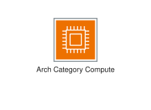
<div class="xal-ref-path">etc/resources/aws/svg/Category-Icons/Arch-Category_64/Arch-Category_Compute_64.svg<br>1706 bytes</div>
</div>
</div>
{{#endtab}}
{{#tab name="Code"}}

```xml
{{#include ../samples/icons/Category-Icons/arch-category-compute-64-ffe711f2.xal}}
```

{{#endtab}}
{{#endtabs}}

</div>
<div class="xal-ref-card">

{{#tabs name="svg-ref-0082"}}
{{#tab name="Preview"}}
<div class="xal-ref-preview">
<div>

<div class="xal-ref-path">etc/resources/aws/svg/Category-Icons/Arch-Category_64/Arch-Category_Contact-Center_64.svg<br>4207 bytes</div>
</div>
</div>
{{#endtab}}
{{#tab name="Code"}}

```xml
{{#include ../samples/icons/Category-Icons/arch-category-contact-center-64-b966ff89.xal}}
```

{{#endtab}}
{{#endtabs}}

</div>
<div class="xal-ref-card">

{{#tabs name="svg-ref-0083"}}
{{#tab name="Preview"}}
<div class="xal-ref-preview">
<div>
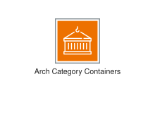
<div class="xal-ref-path">etc/resources/aws/svg/Category-Icons/Arch-Category_64/Arch-Category_Containers_64.svg<br>1774 bytes</div>
</div>
</div>
{{#endtab}}
{{#tab name="Code"}}

```xml
{{#include ../samples/icons/Category-Icons/arch-category-containers-64-1b1943b2.xal}}
```

{{#endtab}}
{{#endtabs}}

</div>
<div class="xal-ref-card">

{{#tabs name="svg-ref-0084"}}
{{#tab name="Preview"}}
<div class="xal-ref-preview">
<div>

<div class="xal-ref-path">etc/resources/aws/svg/Category-Icons/Arch-Category_64/Arch-Category_Customer-Enablement_64.svg<br>1517 bytes</div>
</div>
</div>
{{#endtab}}
{{#tab name="Code"}}

```xml
{{#include ../samples/icons/Category-Icons/arch-category-customer-enablement-64-22893d58.xal}}
```

{{#endtab}}
{{#endtabs}}

</div>
<div class="xal-ref-card">

{{#tabs name="svg-ref-0085"}}
{{#tab name="Preview"}}
<div class="xal-ref-preview">
<div>

<div class="xal-ref-path">etc/resources/aws/svg/Category-Icons/Arch-Category_64/Arch-Category_Database_64.svg<br>1531 bytes</div>
</div>
</div>
{{#endtab}}
{{#tab name="Code"}}

```xml
{{#include ../samples/icons/Category-Icons/arch-category-database-64-3e73c65c.xal}}
```

{{#endtab}}
{{#endtabs}}

</div>
<div class="xal-ref-card">

{{#tabs name="svg-ref-0086"}}
{{#tab name="Preview"}}
<div class="xal-ref-preview">
<div>

<div class="xal-ref-path">etc/resources/aws/svg/Category-Icons/Arch-Category_64/Arch-Category_Developer-Tools_64.svg<br>6143 bytes</div>
</div>
</div>
{{#endtab}}
{{#tab name="Code"}}

```xml
{{#include ../samples/icons/Category-Icons/arch-category-developer-tools-64-550fff03.xal}}
```

{{#endtab}}
{{#endtabs}}

</div>
<div class="xal-ref-card">

{{#tabs name="svg-ref-0087"}}
{{#tab name="Preview"}}
<div class="xal-ref-preview">
<div>

<div class="xal-ref-path">etc/resources/aws/svg/Category-Icons/Arch-Category_64/Arch-Category_End-User-Computing_64.svg<br>3518 bytes</div>
</div>
</div>
{{#endtab}}
{{#tab name="Code"}}

```xml
{{#include ../samples/icons/Category-Icons/arch-category-end-user-computing-64-eea59a42.xal}}
```

{{#endtab}}
{{#endtabs}}

</div>
<div class="xal-ref-card">

{{#tabs name="svg-ref-0088"}}
{{#tab name="Preview"}}
<div class="xal-ref-preview">
<div>

<div class="xal-ref-path">etc/resources/aws/svg/Category-Icons/Arch-Category_64/Arch-Category_Front-End-Web-Mobile_64.svg<br>1449 bytes</div>
</div>
</div>
{{#endtab}}
{{#tab name="Code"}}

```xml
{{#include ../samples/icons/Category-Icons/arch-category-front-end-web-mobile-64-ba8989cf.xal}}
```

{{#endtab}}
{{#endtabs}}

</div>
<div class="xal-ref-card">

{{#tabs name="svg-ref-0089"}}
{{#tab name="Preview"}}
<div class="xal-ref-preview">
<div>

<div class="xal-ref-path">etc/resources/aws/svg/Category-Icons/Arch-Category_64/Arch-Category_Games_64.svg<br>2868 bytes</div>
</div>
</div>
{{#endtab}}
{{#tab name="Code"}}

```xml
{{#include ../samples/icons/Category-Icons/arch-category-games-64-f67f47e9.xal}}
```

{{#endtab}}
{{#endtabs}}

</div>
<div class="xal-ref-card">

{{#tabs name="svg-ref-0090"}}
{{#tab name="Preview"}}
<div class="xal-ref-preview">
<div>

<div class="xal-ref-path">etc/resources/aws/svg/Category-Icons/Arch-Category_64/Arch-Category_Internet-of-Things_64.svg<br>2508 bytes</div>
</div>
</div>
{{#endtab}}
{{#tab name="Code"}}

```xml
{{#include ../samples/icons/Category-Icons/arch-category-internet-of-things-64-58e2ec6d.xal}}
```

{{#endtab}}
{{#endtabs}}

</div>
<div class="xal-ref-card">

{{#tabs name="svg-ref-0091"}}
{{#tab name="Preview"}}
<div class="xal-ref-preview">
<div>

<div class="xal-ref-path">etc/resources/aws/svg/Category-Icons/Arch-Category_64/Arch-Category_Management-Governance_64.svg<br>1703 bytes</div>
</div>
</div>
{{#endtab}}
{{#tab name="Code"}}

```xml
{{#include ../samples/icons/Category-Icons/arch-category-management-governance-64-cbe3bce2.xal}}
```

{{#endtab}}
{{#endtabs}}

</div>
<div class="xal-ref-card">

{{#tabs name="svg-ref-0092"}}
{{#tab name="Preview"}}
<div class="xal-ref-preview">
<div>

<div class="xal-ref-path">etc/resources/aws/svg/Category-Icons/Arch-Category_64/Arch-Category_Media-Services_64.svg<br>2156 bytes</div>
</div>
</div>
{{#endtab}}
{{#tab name="Code"}}

```xml
{{#include ../samples/icons/Category-Icons/arch-category-media-services-64-73f387b8.xal}}
```

{{#endtab}}
{{#endtabs}}

</div>
<div class="xal-ref-card">

{{#tabs name="svg-ref-0093"}}
{{#tab name="Preview"}}
<div class="xal-ref-preview">
<div>

<div class="xal-ref-path">etc/resources/aws/svg/Category-Icons/Arch-Category_64/Arch-Category_Migration-Modernization_64.svg<br>3003 bytes</div>
</div>
</div>
{{#endtab}}
{{#tab name="Code"}}

```xml
{{#include ../samples/icons/Category-Icons/arch-category-migration-modernization-64-0204a58e.xal}}
```

{{#endtab}}
{{#endtabs}}

</div>
<div class="xal-ref-card">

{{#tabs name="svg-ref-0094"}}
{{#tab name="Preview"}}
<div class="xal-ref-preview">
<div>

<div class="xal-ref-path">etc/resources/aws/svg/Category-Icons/Arch-Category_64/Arch-Category_Networking-Content-Delivery_64.svg<br>3010 bytes</div>
</div>
</div>
{{#endtab}}
{{#tab name="Code"}}

```xml
{{#include ../samples/icons/Category-Icons/arch-category-networking-content-delivery-64-6f7a7e95.xal}}
```

{{#endtab}}
{{#endtabs}}

</div>
<div class="xal-ref-card">

{{#tabs name="svg-ref-0095"}}
{{#tab name="Preview"}}
<div class="xal-ref-preview">
<div>

<div class="xal-ref-path">etc/resources/aws/svg/Category-Icons/Arch-Category_64/Arch-Category_Quantum-Technologies_64.svg<br>5215 bytes</div>
</div>
</div>
{{#endtab}}
{{#tab name="Code"}}

```xml
{{#include ../samples/icons/Category-Icons/arch-category-quantum-technologies-64-6cea19c1.xal}}
```

{{#endtab}}
{{#endtabs}}

</div>
<div class="xal-ref-card">

{{#tabs name="svg-ref-0096"}}
{{#tab name="Preview"}}
<div class="xal-ref-preview">
<div>

<div class="xal-ref-path">etc/resources/aws/svg/Category-Icons/Arch-Category_64/Arch-Category_Satellite_64.svg<br>4204 bytes</div>
</div>
</div>
{{#endtab}}
{{#tab name="Code"}}

```xml
{{#include ../samples/icons/Category-Icons/arch-category-satellite-64-100c5e37.xal}}
```

{{#endtab}}
{{#endtabs}}

</div>
<div class="xal-ref-card">

{{#tabs name="svg-ref-0097"}}
{{#tab name="Preview"}}
<div class="xal-ref-preview">
<div>

<div class="xal-ref-path">etc/resources/aws/svg/Category-Icons/Arch-Category_64/Arch-Category_Security-Identity-Compliance_64.svg<br>1930 bytes</div>
</div>
</div>
{{#endtab}}
{{#tab name="Code"}}

```xml
{{#include ../samples/icons/Category-Icons/arch-category-security-identity-compliance-64-17bba27c.xal}}
```

{{#endtab}}
{{#endtabs}}

</div>
<div class="xal-ref-card">

{{#tabs name="svg-ref-0098"}}
{{#tab name="Preview"}}
<div class="xal-ref-preview">
<div>

<div class="xal-ref-path">etc/resources/aws/svg/Category-Icons/Arch-Category_64/Arch-Category_Serverless_64.svg<br>2898 bytes</div>
</div>
</div>
{{#endtab}}
{{#tab name="Code"}}

```xml
{{#include ../samples/icons/Category-Icons/arch-category-serverless-64-ea261c03.xal}}
```

{{#endtab}}
{{#endtabs}}

</div>
<div class="xal-ref-card">

{{#tabs name="svg-ref-0099"}}
{{#tab name="Preview"}}
<div class="xal-ref-preview">
<div>

<div class="xal-ref-path">etc/resources/aws/svg/Category-Icons/Arch-Category_64/Arch-Category_Storage_64.svg<br>1600 bytes</div>
</div>
</div>
{{#endtab}}
{{#tab name="Code"}}

```xml
{{#include ../samples/icons/Category-Icons/arch-category-storage-64-c5c44c9f.xal}}
```

{{#endtab}}
{{#endtabs}}

</div>
</div>
