# Isoflow-Icons

This page references SVG files under `etc/resources/aws/svg/Isoflow-Icons`.
Each card shows the SVG preview first and the XAL tag syntax in the Code tab.
Total SVG files: 50.

<style>
.xal-ref-grid{display:grid;grid-template-columns:repeat(auto-fit,minmax(260px,1fr));gap:1rem;margin:1rem 0 1.5rem}.xal-ref-card{border:1px solid var(--table-border-color);border-radius:8px;overflow:hidden;background:var(--bg);padding:.75rem}.xal-ref-preview{min-height:132px;display:flex;align-items:center;justify-content:center}.xal-ref-preview img{max-width:96px;max-height:96px}.xal-ref-path{font-size:.78em;opacity:.75;word-break:break-all;margin-top:.5rem}.xal-ref-card pre{margin:0;max-height:18rem;overflow:auto;white-space:pre-wrap}.xal-ref-card code{font-size:.78em}
</style>

<div class="xal-ref-grid">
<div class="xal-ref-card">

{{#tabs name="svg-ref-0000"}}
{{#tab name="Preview"}}
<div class="xal-ref-preview">
<div>
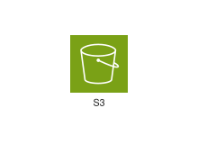
<div class="xal-ref-path">etc/resources/aws/svg/Isoflow-Icons/isoflow-1020-amazon-simple-storage-service.svg<br>3814 bytes</div>
</div>
</div>
{{#endtab}}
{{#tab name="Code"}}

```xml
{{#include ../samples/icons/Isoflow-Icons/isoflow-1020-amazon-simple-storage-service-33e7cf27.xal}}
```

{{#endtab}}
{{#endtabs}}

</div>
<div class="xal-ref-card">

{{#tabs name="svg-ref-0001"}}
{{#tab name="Preview"}}
<div class="xal-ref-preview">
<div>
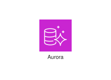
<div class="xal-ref-path">etc/resources/aws/svg/Isoflow-Icons/isoflow-110-amazon-aurora.svg<br>6534 bytes</div>
</div>
</div>
{{#endtab}}
{{#tab name="Code"}}

```xml
{{#include ../samples/icons/Isoflow-Icons/isoflow-110-amazon-aurora-07773c66.xal}}
```

{{#endtab}}
{{#endtabs}}

</div>
<div class="xal-ref-card">

{{#tabs name="svg-ref-0002"}}
{{#tab name="Preview"}}
<div class="xal-ref-preview">
<div>

<div class="xal-ref-path">etc/resources/aws/svg/Isoflow-Icons/isoflow-112-amazon-dynamodb.svg<br>9372 bytes</div>
</div>
</div>
{{#endtab}}
{{#tab name="Code"}}

```xml
{{#include ../samples/icons/Isoflow-Icons/isoflow-112-amazon-dynamodb-67fe32f8.xal}}
```

{{#endtab}}
{{#endtabs}}

</div>
<div class="xal-ref-card">

{{#tabs name="svg-ref-0003"}}
{{#tab name="Preview"}}
<div class="xal-ref-preview">
<div>
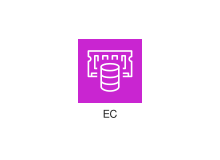
<div class="xal-ref-path">etc/resources/aws/svg/Isoflow-Icons/isoflow-113-amazon-elasticache.svg<br>7183 bytes</div>
</div>
</div>
{{#endtab}}
{{#tab name="Code"}}

```xml
{{#include ../samples/icons/Isoflow-Icons/isoflow-113-amazon-elasticache-ada13a4a.xal}}
```

{{#endtab}}
{{#endtabs}}

</div>
<div class="xal-ref-card">

{{#tabs name="svg-ref-0004"}}
{{#tab name="Preview"}}
<div class="xal-ref-preview">
<div>
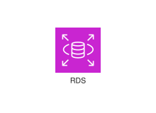
<div class="xal-ref-path">etc/resources/aws/svg/Isoflow-Icons/isoflow-117-amazon-rds.svg<br>4783 bytes</div>
</div>
</div>
{{#endtab}}
{{#tab name="Code"}}

```xml
{{#include ../samples/icons/Isoflow-Icons/isoflow-117-amazon-rds-8315acde.xal}}
```

{{#endtab}}
{{#endtabs}}

</div>
<div class="xal-ref-card">

{{#tabs name="svg-ref-0005"}}
{{#tab name="Preview"}}
<div class="xal-ref-preview">
<div>

<div class="xal-ref-path">etc/resources/aws/svg/Isoflow-Icons/isoflow-1178-amazon-cloudfront.svg<br>7106 bytes</div>
</div>
</div>
{{#endtab}}
{{#tab name="Code"}}

```xml
{{#include ../samples/icons/Isoflow-Icons/isoflow-1178-amazon-cloudfront-bbe508ce.xal}}
```

{{#endtab}}
{{#endtabs}}

</div>
<div class="xal-ref-card">

{{#tabs name="svg-ref-0006"}}
{{#tab name="Preview"}}
<div class="xal-ref-preview">
<div>

<div class="xal-ref-path">etc/resources/aws/svg/Isoflow-Icons/isoflow-1179-amazon-route-53.svg<br>11464 bytes</div>
</div>
</div>
{{#endtab}}
{{#tab name="Code"}}

```xml
{{#include ../samples/icons/Isoflow-Icons/isoflow-1179-amazon-route-53-01c6a9ef.xal}}
```

{{#endtab}}
{{#endtabs}}

</div>
<div class="xal-ref-card">

{{#tabs name="svg-ref-0007"}}
{{#tab name="Preview"}}
<div class="xal-ref-preview">
<div>

<div class="xal-ref-path">etc/resources/aws/svg/Isoflow-Icons/isoflow-1182-elastic-load-balancing.svg<br>3675 bytes</div>
</div>
</div>
{{#endtab}}
{{#tab name="Code"}}

```xml
{{#include ../samples/icons/Isoflow-Icons/isoflow-1182-elastic-load-balancing-755ff3b4.xal}}
```

{{#endtab}}
{{#endtabs}}

</div>
<div class="xal-ref-card">

{{#tabs name="svg-ref-0008"}}
{{#tab name="Preview"}}
<div class="xal-ref-preview">
<div>
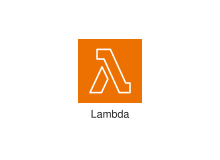
<div class="xal-ref-path">etc/resources/aws/svg/Isoflow-Icons/isoflow-13-aws-lambda.svg<br>3623 bytes</div>
</div>
</div>
{{#endtab}}
{{#tab name="Code"}}

```xml
{{#include ../samples/icons/Isoflow-Icons/isoflow-13-aws-lambda-a24efcee.xal}}
```

{{#endtab}}
{{#endtabs}}

</div>
<div class="xal-ref-card">

{{#tabs name="svg-ref-0009"}}
{{#tab name="Preview"}}
<div class="xal-ref-preview">
<div>

<div class="xal-ref-path">etc/resources/aws/svg/Isoflow-Icons/isoflow-1479-aws-identity-access-management-role.svg<br>5616 bytes</div>
</div>
</div>
{{#endtab}}
{{#tab name="Code"}}

```xml
{{#include ../samples/icons/Isoflow-Icons/isoflow-1479-aws-identity-access-management-role-68af02e5.xal}}
```

{{#endtab}}
{{#endtabs}}

</div>
<div class="xal-ref-card">

{{#tabs name="svg-ref-0010"}}
{{#tab name="Preview"}}
<div class="xal-ref-preview">
<div>
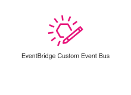
<div class="xal-ref-path">etc/resources/aws/svg/Isoflow-Icons/isoflow-1495-amazon-eventbridge-custom-event-bus.svg<br>4168 bytes</div>
</div>
</div>
{{#endtab}}
{{#tab name="Code"}}

```xml
{{#include ../samples/icons/Isoflow-Icons/isoflow-1495-amazon-eventbridge-custom-event-bus-f9d87bf6.xal}}
```

{{#endtab}}
{{#endtabs}}

</div>
<div class="xal-ref-card">

{{#tabs name="svg-ref-0011"}}
{{#tab name="Preview"}}
<div class="xal-ref-preview">
<div>

<div class="xal-ref-path">etc/resources/aws/svg/Isoflow-Icons/isoflow-1498-amazon-eventbridge-rule.svg<br>3856 bytes</div>
</div>
</div>
{{#endtab}}
{{#tab name="Code"}}

```xml
{{#include ../samples/icons/Isoflow-Icons/isoflow-1498-amazon-eventbridge-rule-77cde70c.xal}}
```

{{#endtab}}
{{#endtabs}}

</div>
<div class="xal-ref-card">

{{#tabs name="svg-ref-0012"}}
{{#tab name="Preview"}}
<div class="xal-ref-preview">
<div>

<div class="xal-ref-path">etc/resources/aws/svg/Isoflow-Icons/isoflow-1506-amazon-simple-notification-service-topic.svg<br>4869 bytes</div>
</div>
</div>
{{#endtab}}
{{#tab name="Code"}}

```xml
{{#include ../samples/icons/Isoflow-Icons/isoflow-1506-amazon-simple-notification-service-topic-3ac925a1.xal}}
```

{{#endtab}}
{{#endtabs}}

</div>
<div class="xal-ref-card">

{{#tabs name="svg-ref-0013"}}
{{#tab name="Preview"}}
<div class="xal-ref-preview">
<div>
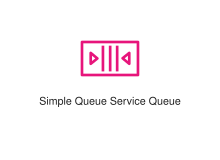
<div class="xal-ref-path">etc/resources/aws/svg/Isoflow-Icons/isoflow-1508-amazon-simple-queue-service-queue.svg<br>3766 bytes</div>
</div>
</div>
{{#endtab}}
{{#tab name="Code"}}

```xml
{{#include ../samples/icons/Isoflow-Icons/isoflow-1508-amazon-simple-queue-service-queue-6f766402.xal}}
```

{{#endtab}}
{{#endtabs}}

</div>
<div class="xal-ref-card">

{{#tabs name="svg-ref-0014"}}
{{#tab name="Preview"}}
<div class="xal-ref-preview">
<div>

<div class="xal-ref-path">etc/resources/aws/svg/Isoflow-Icons/isoflow-1509-aws-cloudformation-change-set.svg<br>6486 bytes</div>
</div>
</div>
{{#endtab}}
{{#tab name="Code"}}

```xml
{{#include ../samples/icons/Isoflow-Icons/isoflow-1509-aws-cloudformation-change-set-8e79f468.xal}}
```

{{#endtab}}
{{#endtabs}}

</div>
<div class="xal-ref-card">

{{#tabs name="svg-ref-0015"}}
{{#tab name="Preview"}}
<div class="xal-ref-preview">
<div>

<div class="xal-ref-path">etc/resources/aws/svg/Isoflow-Icons/isoflow-1539-amazon-cloudwatch-alarm.svg<br>4384 bytes</div>
</div>
</div>
{{#endtab}}
{{#tab name="Code"}}

```xml
{{#include ../samples/icons/Isoflow-Icons/isoflow-1539-amazon-cloudwatch-alarm-d92d2202.xal}}
```

{{#endtab}}
{{#endtabs}}

</div>
<div class="xal-ref-card">

{{#tabs name="svg-ref-0016"}}
{{#tab name="Preview"}}
<div class="xal-ref-preview">
<div>

<div class="xal-ref-path">etc/resources/aws/svg/Isoflow-Icons/isoflow-1545-amazon-cloudwatch-logs.svg<br>4307 bytes</div>
</div>
</div>
{{#endtab}}
{{#tab name="Code"}}

```xml
{{#include ../samples/icons/Isoflow-Icons/isoflow-1545-amazon-cloudwatch-logs-b6dae0ef.xal}}
```

{{#endtab}}
{{#endtabs}}

</div>
<div class="xal-ref-card">

{{#tabs name="svg-ref-0017"}}
{{#tab name="Preview"}}
<div class="xal-ref-preview">
<div>

<div class="xal-ref-path">etc/resources/aws/svg/Isoflow-Icons/isoflow-1564-amazon-cloudfront-download-distribution.svg<br>3996 bytes</div>
</div>
</div>
{{#endtab}}
{{#tab name="Code"}}

```xml
{{#include ../samples/icons/Isoflow-Icons/isoflow-1564-amazon-cloudfront-download-distribution-10c39861.xal}}
```

{{#endtab}}
{{#endtabs}}

</div>
<div class="xal-ref-card">

{{#tabs name="svg-ref-0018"}}
{{#tab name="Preview"}}
<div class="xal-ref-preview">
<div>

<div class="xal-ref-path">etc/resources/aws/svg/Isoflow-Icons/isoflow-1568-amazon-route-53-hosted-zone.svg<br>4296 bytes</div>
</div>
</div>
{{#endtab}}
{{#tab name="Code"}}

```xml
{{#include ../samples/icons/Isoflow-Icons/isoflow-1568-amazon-route-53-hosted-zone-0e06e619.xal}}
```

{{#endtab}}
{{#endtabs}}

</div>
<div class="xal-ref-card">

{{#tabs name="svg-ref-0019"}}
{{#tab name="Preview"}}
<div class="xal-ref-preview">
<div>

<div class="xal-ref-path">etc/resources/aws/svg/Isoflow-Icons/isoflow-1579-amazon-vpc-endpoints.svg<br>4581 bytes</div>
</div>
</div>
{{#endtab}}
{{#tab name="Code"}}

```xml
{{#include ../samples/icons/Isoflow-Icons/isoflow-1579-amazon-vpc-endpoints-5e1122bc.xal}}
```

{{#endtab}}
{{#endtabs}}

</div>
<div class="xal-ref-card">

{{#tabs name="svg-ref-0020"}}
{{#tab name="Preview"}}
<div class="xal-ref-preview">
<div>

<div class="xal-ref-path">etc/resources/aws/svg/Isoflow-Icons/isoflow-1580-amazon-vpc-flow-logs.svg<br>3821 bytes</div>
</div>
</div>
{{#endtab}}
{{#tab name="Code"}}

```xml
{{#include ../samples/icons/Isoflow-Icons/isoflow-1580-amazon-vpc-flow-logs-f7cf0993.xal}}
```

{{#endtab}}
{{#endtabs}}

</div>
<div class="xal-ref-card">

{{#tabs name="svg-ref-0021"}}
{{#tab name="Preview"}}
<div class="xal-ref-preview">
<div>

<div class="xal-ref-path">etc/resources/aws/svg/Isoflow-Icons/isoflow-1581-amazon-vpc-internet-gateway.svg<br>3992 bytes</div>
</div>
</div>
{{#endtab}}
{{#tab name="Code"}}

```xml
{{#include ../samples/icons/Isoflow-Icons/isoflow-1581-amazon-vpc-internet-gateway-9a333991.xal}}
```

{{#endtab}}
{{#endtabs}}

</div>
<div class="xal-ref-card">

{{#tabs name="svg-ref-0022"}}
{{#tab name="Preview"}}
<div class="xal-ref-preview">
<div>

<div class="xal-ref-path">etc/resources/aws/svg/Isoflow-Icons/isoflow-1582-amazon-vpc-nat-gateway.svg<br>5579 bytes</div>
</div>
</div>
{{#endtab}}
{{#tab name="Code"}}

```xml
{{#include ../samples/icons/Isoflow-Icons/isoflow-1582-amazon-vpc-nat-gateway-ce8efad4.xal}}
```

{{#endtab}}
{{#endtabs}}

</div>
<div class="xal-ref-card">

{{#tabs name="svg-ref-0023"}}
{{#tab name="Preview"}}
<div class="xal-ref-preview">
<div>
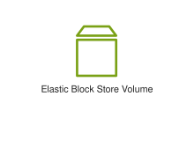
<div class="xal-ref-path">etc/resources/aws/svg/Isoflow-Icons/isoflow-1628-amazon-elastic-block-store-volume.svg<br>2954 bytes</div>
</div>
</div>
{{#endtab}}
{{#tab name="Code"}}

```xml
{{#include ../samples/icons/Isoflow-Icons/isoflow-1628-amazon-elastic-block-store-volume-b6d2ab05.xal}}
```

{{#endtab}}
{{#endtabs}}

</div>
<div class="xal-ref-card">

{{#tabs name="svg-ref-0024"}}
{{#tab name="Preview"}}
<div class="xal-ref-preview">
<div>
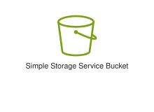
<div class="xal-ref-path">etc/resources/aws/svg/Isoflow-Icons/isoflow-1642-amazon-simple-storage-service-bucket.svg<br>11401 bytes</div>
</div>
</div>
{{#endtab}}
{{#tab name="Code"}}

```xml
{{#include ../samples/icons/Isoflow-Icons/isoflow-1642-amazon-simple-storage-service-bucket-ae33cc99.xal}}
```

{{#endtab}}
{{#endtabs}}

</div>
<div class="xal-ref-card">

{{#tabs name="svg-ref-0025"}}
{{#tab name="Preview"}}
<div class="xal-ref-preview">
<div>
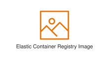
<div class="xal-ref-path">etc/resources/aws/svg/Isoflow-Icons/isoflow-1677-amazon-elastic-container-registry-image.svg<br>3508 bytes</div>
</div>
</div>
{{#endtab}}
{{#tab name="Code"}}

```xml
{{#include ../samples/icons/Isoflow-Icons/isoflow-1677-amazon-elastic-container-registry-image-7838e3fc.xal}}
```

{{#endtab}}
{{#endtabs}}

</div>
<div class="xal-ref-card">

{{#tabs name="svg-ref-0026"}}
{{#tab name="Preview"}}
<div class="xal-ref-preview">
<div>
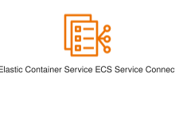
<div class="xal-ref-path">etc/resources/aws/svg/Isoflow-Icons/isoflow-1683-amazon-elastic-container-service-ecs-service-connect.svg<br>4725 bytes</div>
</div>
</div>
{{#endtab}}
{{#tab name="Code"}}

```xml
{{#include ../samples/icons/Isoflow-Icons/isoflow-1683-amazon-elastic-container-service-ecs-service-connect-4592b1c0.xal}}
```

{{#endtab}}
{{#endtabs}}

</div>
<div class="xal-ref-card">

{{#tabs name="svg-ref-0027"}}
{{#tab name="Preview"}}
<div class="xal-ref-preview">
<div>
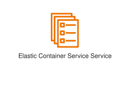
<div class="xal-ref-path">etc/resources/aws/svg/Isoflow-Icons/isoflow-1684-amazon-elastic-container-service-service.svg<br>4709 bytes</div>
</div>
</div>
{{#endtab}}
{{#tab name="Code"}}

```xml
{{#include ../samples/icons/Isoflow-Icons/isoflow-1684-amazon-elastic-container-service-service-77c12d6c.xal}}
```

{{#endtab}}
{{#endtabs}}

</div>
<div class="xal-ref-card">

{{#tabs name="svg-ref-0028"}}
{{#tab name="Preview"}}
<div class="xal-ref-preview">
<div>
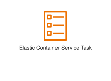
<div class="xal-ref-path">etc/resources/aws/svg/Isoflow-Icons/isoflow-1685-amazon-elastic-container-service-task.svg<br>3682 bytes</div>
</div>
</div>
{{#endtab}}
{{#tab name="Code"}}

```xml
{{#include ../samples/icons/Isoflow-Icons/isoflow-1685-amazon-elastic-container-service-task-e0b1e9e3.xal}}
```

{{#endtab}}
{{#endtabs}}

</div>
<div class="xal-ref-card">

{{#tabs name="svg-ref-0029"}}
{{#tab name="Preview"}}
<div class="xal-ref-preview">
<div>

<div class="xal-ref-path">etc/resources/aws/svg/Isoflow-Icons/isoflow-1783-aws-lambda-lambda-function.svg<br>3631 bytes</div>
</div>
</div>
{{#endtab}}
{{#tab name="Code"}}

```xml
{{#include ../samples/icons/Isoflow-Icons/isoflow-1783-aws-lambda-lambda-function-e7b8f613.xal}}
```

{{#endtab}}
{{#endtabs}}

</div>
<div class="xal-ref-card">

{{#tabs name="svg-ref-0030"}}
{{#tab name="Preview"}}
<div class="xal-ref-preview">
<div>
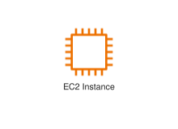
<div class="xal-ref-path">etc/resources/aws/svg/Isoflow-Icons/isoflow-1790-amazon-ec2-instance.svg<br>2780 bytes</div>
</div>
</div>
{{#endtab}}
{{#tab name="Code"}}

```xml
{{#include ../samples/icons/Isoflow-Icons/isoflow-1790-amazon-ec2-instance-3849ebd9.xal}}
```

{{#endtab}}
{{#endtabs}}

</div>
<div class="xal-ref-card">

{{#tabs name="svg-ref-0031"}}
{{#tab name="Preview"}}
<div class="xal-ref-preview">
<div>
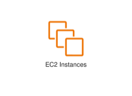
<div class="xal-ref-path">etc/resources/aws/svg/Isoflow-Icons/isoflow-1791-amazon-ec2-instances.svg<br>3381 bytes</div>
</div>
</div>
{{#endtab}}
{{#tab name="Code"}}

```xml
{{#include ../samples/icons/Isoflow-Icons/isoflow-1791-amazon-ec2-instances-b508a384.xal}}
```

{{#endtab}}
{{#endtabs}}

</div>
<div class="xal-ref-card">

{{#tabs name="svg-ref-0032"}}
{{#tab name="Preview"}}
<div class="xal-ref-preview">
<div>

<div class="xal-ref-path">etc/resources/aws/svg/Isoflow-Icons/isoflow-1795-amazon-aurora-instance.svg<br>12679 bytes</div>
</div>
</div>
{{#endtab}}
{{#tab name="Code"}}

```xml
{{#include ../samples/icons/Isoflow-Icons/isoflow-1795-amazon-aurora-instance-2fc1a230.xal}}
```

{{#endtab}}
{{#endtabs}}

</div>
<div class="xal-ref-card">

{{#tabs name="svg-ref-0033"}}
{{#tab name="Preview"}}
<div class="xal-ref-preview">
<div>

<div class="xal-ref-path">etc/resources/aws/svg/Isoflow-Icons/isoflow-1820-amazon-dynamodb-stream.svg<br>3087 bytes</div>
</div>
</div>
{{#endtab}}
{{#tab name="Code"}}

```xml
{{#include ../samples/icons/Isoflow-Icons/isoflow-1820-amazon-dynamodb-stream-7c418090.xal}}
```

{{#endtab}}
{{#endtabs}}

</div>
<div class="xal-ref-card">

{{#tabs name="svg-ref-0034"}}
{{#tab name="Preview"}}
<div class="xal-ref-preview">
<div>

<div class="xal-ref-path">etc/resources/aws/svg/Isoflow-Icons/isoflow-1821-amazon-dynamodb-table.svg<br>3330 bytes</div>
</div>
</div>
{{#endtab}}
{{#tab name="Code"}}

```xml
{{#include ../samples/icons/Isoflow-Icons/isoflow-1821-amazon-dynamodb-table-e3e0eb09.xal}}
```

{{#endtab}}
{{#endtabs}}

</div>
<div class="xal-ref-card">

{{#tabs name="svg-ref-0035"}}
{{#tab name="Preview"}}
<div class="xal-ref-preview">
<div>
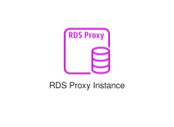
<div class="xal-ref-path">etc/resources/aws/svg/Isoflow-Icons/isoflow-1827-amazon-rds-proxy-instance.svg<br>10462 bytes</div>
</div>
</div>
{{#endtab}}
{{#tab name="Code"}}

```xml
{{#include ../samples/icons/Isoflow-Icons/isoflow-1827-amazon-rds-proxy-instance-68d4f827.xal}}
```

{{#endtab}}
{{#endtabs}}

</div>
<div class="xal-ref-card">

{{#tabs name="svg-ref-0036"}}
{{#tab name="Preview"}}
<div class="xal-ref-preview">
<div>
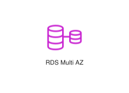
<div class="xal-ref-path">etc/resources/aws/svg/Isoflow-Icons/isoflow-1830-amazon-rds-multi-az.svg<br>5264 bytes</div>
</div>
</div>
{{#endtab}}
{{#tab name="Code"}}

```xml
{{#include ../samples/icons/Isoflow-Icons/isoflow-1830-amazon-rds-multi-az-651eb5ec.xal}}
```

{{#endtab}}
{{#endtabs}}

</div>
<div class="xal-ref-card">

{{#tabs name="svg-ref-0037"}}
{{#tab name="Preview"}}
<div class="xal-ref-preview">
<div>

<div class="xal-ref-path">etc/resources/aws/svg/Isoflow-Icons/isoflow-216-aws-identity-and-access-management.svg<br>4127 bytes</div>
</div>
</div>
{{#endtab}}
{{#tab name="Code"}}

```xml
{{#include ../samples/icons/Isoflow-Icons/isoflow-216-aws-identity-and-access-management-c143a1c9.xal}}
```

{{#endtab}}
{{#endtabs}}

</div>
<div class="xal-ref-card">

{{#tabs name="svg-ref-0038"}}
{{#tab name="Preview"}}
<div class="xal-ref-preview">
<div>
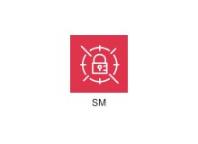
<div class="xal-ref-path">etc/resources/aws/svg/Isoflow-Icons/isoflow-222-aws-secrets-manager.svg<br>5276 bytes</div>
</div>
</div>
{{#endtab}}
{{#tab name="Code"}}

```xml
{{#include ../samples/icons/Isoflow-Icons/isoflow-222-aws-secrets-manager-a4b970ca.xal}}
```

{{#endtab}}
{{#endtabs}}

</div>
<div class="xal-ref-card">

{{#tabs name="svg-ref-0039"}}
{{#tab name="Preview"}}
<div class="xal-ref-preview">
<div>
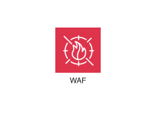
<div class="xal-ref-path">etc/resources/aws/svg/Isoflow-Icons/isoflow-227-aws-waf.svg<br>6052 bytes</div>
</div>
</div>
{{#endtab}}
{{#tab name="Code"}}

```xml
{{#include ../samples/icons/Isoflow-Icons/isoflow-227-aws-waf-1305faae.xal}}
```

{{#endtab}}
{{#endtabs}}

</div>
<div class="xal-ref-card">

{{#tabs name="svg-ref-0040"}}
{{#tab name="Preview"}}
<div class="xal-ref-preview">
<div>

<div class="xal-ref-path">etc/resources/aws/svg/Isoflow-Icons/isoflow-27-amazon-ec2.svg<br>3551 bytes</div>
</div>
</div>
{{#endtab}}
{{#tab name="Code"}}

```xml
{{#include ../samples/icons/Isoflow-Icons/isoflow-27-amazon-ec2-a0199dc7.xal}}
```

{{#endtab}}
{{#endtabs}}

</div>
<div class="xal-ref-card">

{{#tabs name="svg-ref-0041"}}
{{#tab name="Preview"}}
<div class="xal-ref-preview">
<div>
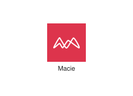
<div class="xal-ref-path">etc/resources/aws/svg/Isoflow-Icons/isoflow-314-amazon-macie.svg<br>5721 bytes</div>
</div>
</div>
{{#endtab}}
{{#tab name="Code"}}

```xml
{{#include ../samples/icons/Isoflow-Icons/isoflow-314-amazon-macie-bfd57cc0.xal}}
```

{{#endtab}}
{{#endtabs}}

</div>
<div class="xal-ref-card">

{{#tabs name="svg-ref-0042"}}
{{#tab name="Preview"}}
<div class="xal-ref-preview">
<div>
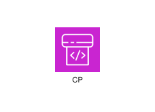
<div class="xal-ref-path">etc/resources/aws/svg/Isoflow-Icons/isoflow-441-aws-codepipeline.svg<br>3409 bytes</div>
</div>
</div>
{{#endtab}}
{{#tab name="Code"}}

```xml
{{#include ../samples/icons/Isoflow-Icons/isoflow-441-aws-codepipeline-e74e527e.xal}}
```

{{#endtab}}
{{#endtabs}}

</div>
<div class="xal-ref-card">

{{#tabs name="svg-ref-0043"}}
{{#tab name="Preview"}}
<div class="xal-ref-preview">
<div>
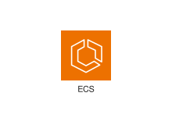
<div class="xal-ref-path">etc/resources/aws/svg/Isoflow-Icons/isoflow-547-amazon-elastic-container-service.svg<br>4413 bytes</div>
</div>
</div>
{{#endtab}}
{{#tab name="Code"}}

```xml
{{#include ../samples/icons/Isoflow-Icons/isoflow-547-amazon-elastic-container-service-707b9ad5.xal}}
```

{{#endtab}}
{{#endtabs}}

</div>
<div class="xal-ref-card">

{{#tabs name="svg-ref-0044"}}
{{#tab name="Preview"}}
<div class="xal-ref-preview">
<div>
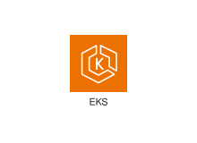
<div class="xal-ref-path">etc/resources/aws/svg/Isoflow-Icons/isoflow-548-amazon-elastic-kubernetes-service.svg<br>4722 bytes</div>
</div>
</div>
{{#endtab}}
{{#tab name="Code"}}

```xml
{{#include ../samples/icons/Isoflow-Icons/isoflow-548-amazon-elastic-kubernetes-service-d49a2c35.xal}}
```

{{#endtab}}
{{#endtabs}}

</div>
<div class="xal-ref-card">

{{#tabs name="svg-ref-0045"}}
{{#tab name="Preview"}}
<div class="xal-ref-preview">
<div>

<div class="xal-ref-path">etc/resources/aws/svg/Isoflow-Icons/isoflow-604-amazon-cloudwatch.svg<br>7090 bytes</div>
</div>
</div>
{{#endtab}}
{{#tab name="Code"}}

```xml
{{#include ../samples/icons/Isoflow-Icons/isoflow-604-amazon-cloudwatch-028b3596.xal}}
```

{{#endtab}}
{{#endtabs}}

</div>
<div class="xal-ref-card">

{{#tabs name="svg-ref-0046"}}
{{#tab name="Preview"}}
<div class="xal-ref-preview">
<div>
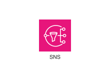
<div class="xal-ref-path">etc/resources/aws/svg/Isoflow-Icons/isoflow-705-amazon-simple-notification-service.svg<br>7259 bytes</div>
</div>
</div>
{{#endtab}}
{{#tab name="Code"}}

```xml
{{#include ../samples/icons/Isoflow-Icons/isoflow-705-amazon-simple-notification-service-0bcfab06.xal}}
```

{{#endtab}}
{{#endtabs}}

</div>
<div class="xal-ref-card">

{{#tabs name="svg-ref-0047"}}
{{#tab name="Preview"}}
<div class="xal-ref-preview">
<div>

<div class="xal-ref-path">etc/resources/aws/svg/Isoflow-Icons/isoflow-706-amazon-simple-queue-service.svg<br>8916 bytes</div>
</div>
</div>
{{#endtab}}
{{#tab name="Code"}}

```xml
{{#include ../samples/icons/Isoflow-Icons/isoflow-706-amazon-simple-queue-service-07922ef4.xal}}
```

{{#endtab}}
{{#endtabs}}

</div>
<div class="xal-ref-card">

{{#tabs name="svg-ref-0048"}}
{{#tab name="Preview"}}
<div class="xal-ref-preview">
<div>
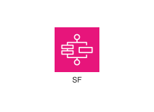
<div class="xal-ref-path">etc/resources/aws/svg/Isoflow-Icons/isoflow-720-aws-step-functions.svg<br>3947 bytes</div>
</div>
</div>
{{#endtab}}
{{#tab name="Code"}}

```xml
{{#include ../samples/icons/Isoflow-Icons/isoflow-720-aws-step-functions-86132e1f.xal}}
```

{{#endtab}}
{{#endtabs}}

</div>
<div class="xal-ref-card">

{{#tabs name="svg-ref-0049"}}
{{#tab name="Preview"}}
<div class="xal-ref-preview">
<div>

<div class="xal-ref-path">etc/resources/aws/svg/Isoflow-Icons/isoflow-722-amazon-eventbridge.svg<br>6579 bytes</div>
</div>
</div>
{{#endtab}}
{{#tab name="Code"}}

```xml
{{#include ../samples/icons/Isoflow-Icons/isoflow-722-amazon-eventbridge-64736ed7.xal}}
```

{{#endtab}}
{{#endtabs}}

</div>
</div>
