# Resource-Icons - Page 6

This page references SVG files under `etc/resources/aws/svg/Resource-Icons`.
Each card shows the SVG preview first and the XAL tag syntax in the Code tab.
Showing 451-524 of 524 SVG files.

<style>
.xal-ref-grid{display:grid;grid-template-columns:repeat(3,minmax(0,1fr));gap:1rem;margin:1rem 0 1.5rem}.xal-ref-card{border:1px solid var(--table-border-color);border-radius:8px;overflow:hidden;background:var(--bg);padding:.75rem}.xal-ref-title{font-size:.9rem;font-weight:600;line-height:1.25;margin:0 0 .5rem;overflow-wrap:anywhere}.xal-ref-preview{display:flex;align-items:center;justify-content:center}.xal-ref-preview img{display:block;width:100%;height:auto}.xal-ref-card pre{margin:0;max-height:18rem;overflow:auto;white-space:pre}.xal-ref-card code{font-size:.78em}.xal-ref-tag{margin:.5rem 0 0;color:var(--fg);opacity:.72;overflow:auto;white-space:pre}.xal-ref-tag code{font-size:.72em}@media(max-width:900px){.xal-ref-grid{grid-template-columns:repeat(2,minmax(0,1fr))}}@media(max-width:560px){.xal-ref-grid{grid-template-columns:1fr}}
</style>

[Back to section index](resource-icons.md)

<div class="xal-ref-grid">
<div class="xal-ref-card">
<div class="xal-ref-title">Res_AWS-WAF_Managed-Rule_48</div>

{{#tabs name="svg-ref-0450"}}
{{#tab name="Preview"}}
<div class="xal-ref-preview">
<div>
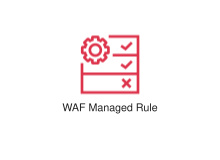
</div>
</div>

{{#endtab}}
{{#tab name="Code"}}

```xml
{{#include ../samples/icons/Resource-Icons/res-aws-waf-managed-rule-48-9f81a3a4.xal}}
```

{{#endtab}}
{{#endtabs}}

<div class="xal-ref-tag"><code>&lt;item id=&#34;1490&#34; /&gt;</code></div>

</div>
<div class="xal-ref-card">
<div class="xal-ref-title">Res_AWS-WAF_Rule_48</div>

{{#tabs name="svg-ref-0451"}}
{{#tab name="Preview"}}
<div class="xal-ref-preview">
<div>
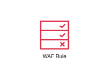
</div>
</div>

{{#endtab}}
{{#tab name="Code"}}

```xml
{{#include ../samples/icons/Resource-Icons/res-aws-waf-rule-48-1299fc88.xal}}
```

{{#endtab}}
{{#endtabs}}

<div class="xal-ref-tag"><code>&lt;item id=&#34;1491&#34; /&gt;</code></div>

</div>
<div class="xal-ref-card">
<div class="xal-ref-title">Res_Amazon-Inspector_Agent_48</div>

{{#tabs name="svg-ref-0452"}}
{{#tab name="Preview"}}
<div class="xal-ref-preview">
<div>

</div>
</div>

{{#endtab}}
{{#tab name="Code"}}

```xml
{{#include ../samples/icons/Resource-Icons/res-amazon-inspector-agent-48-dcc98b63.xal}}
```

{{#endtab}}
{{#endtabs}}

<div class="xal-ref-tag"><code>&lt;item id=&#34;1492&#34; /&gt;</code></div>

</div>
<div class="xal-ref-card">
<div class="xal-ref-title">Res_AWS-Backup_AWS-Backup-Support-for-VMware-Workloads_48</div>

{{#tabs name="svg-ref-0453"}}
{{#tab name="Preview"}}
<div class="xal-ref-preview">
<div>

</div>
</div>

{{#endtab}}
{{#tab name="Code"}}

```xml
{{#include ../samples/icons/Resource-Icons/res-aws-backup-aws-backup-support-for-vmware-workloads-48-59ad7bc7.xal}}
```

{{#endtab}}
{{#endtabs}}

<div class="xal-ref-tag"><code>&lt;item id=&#34;1596&#34; /&gt;</code></div>

</div>
<div class="xal-ref-card">
<div class="xal-ref-title">Res_AWS-Backup_AWS-Backup-for-AWS-CloudFormation_48</div>

{{#tabs name="svg-ref-0454"}}
{{#tab name="Preview"}}
<div class="xal-ref-preview">
<div>
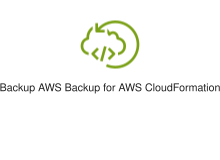
</div>
</div>

{{#endtab}}
{{#tab name="Code"}}

```xml
{{#include ../samples/icons/Resource-Icons/res-aws-backup-aws-backup-for-aws-cloudformation-48-87a0e731.xal}}
```

{{#endtab}}
{{#endtabs}}

<div class="xal-ref-tag"><code>&lt;item id=&#34;1597&#34; /&gt;</code></div>

</div>
<div class="xal-ref-card">
<div class="xal-ref-title">Res_AWS-Backup_AWS-Backup-support-for-Amazon-FSx-for-NetApp-ONTAP_48</div>

{{#tabs name="svg-ref-0455"}}
{{#tab name="Preview"}}
<div class="xal-ref-preview">
<div>
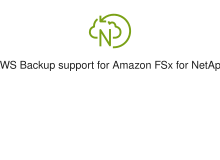
</div>
</div>

{{#endtab}}
{{#tab name="Code"}}

```xml
{{#include ../samples/icons/Resource-Icons/res-aws-backup-aws-backup-support-for-amazon-fsx-for-netapp-ontap-48-e5c469c8.xal}}
```

{{#endtab}}
{{#endtabs}}

<div class="xal-ref-tag"><code>&lt;item id=&#34;1598&#34; /&gt;</code></div>

</div>
<div class="xal-ref-card">
<div class="xal-ref-title">Res_AWS-Backup_AWS-Backup-support-for-Amazon-S3_48</div>

{{#tabs name="svg-ref-0456"}}
{{#tab name="Preview"}}
<div class="xal-ref-preview">
<div>

</div>
</div>

{{#endtab}}
{{#tab name="Code"}}

```xml
{{#include ../samples/icons/Resource-Icons/res-aws-backup-aws-backup-support-for-amazon-s3-48-f368ed8e.xal}}
```

{{#endtab}}
{{#endtabs}}

<div class="xal-ref-tag"><code>&lt;item id=&#34;1599&#34; /&gt;</code></div>

</div>
<div class="xal-ref-card">
<div class="xal-ref-title">Res_AWS-Backup_Audit-Manager_48</div>

{{#tabs name="svg-ref-0457"}}
{{#tab name="Preview"}}
<div class="xal-ref-preview">
<div>

</div>
</div>

{{#endtab}}
{{#tab name="Code"}}

```xml
{{#include ../samples/icons/Resource-Icons/res-aws-backup-audit-manager-48-9f67a599.xal}}
```

{{#endtab}}
{{#endtabs}}

<div class="xal-ref-tag"><code>&lt;item id=&#34;1600&#34; /&gt;</code></div>

</div>
<div class="xal-ref-card">
<div class="xal-ref-title">Res_AWS-Backup_Backup-Plan_48</div>

{{#tabs name="svg-ref-0458"}}
{{#tab name="Preview"}}
<div class="xal-ref-preview">
<div>

</div>
</div>

{{#endtab}}
{{#tab name="Code"}}

```xml
{{#include ../samples/icons/Resource-Icons/res-aws-backup-backup-plan-48-2e2258f5.xal}}
```

{{#endtab}}
{{#endtabs}}

<div class="xal-ref-tag"><code>&lt;item id=&#34;1601&#34; /&gt;</code></div>

</div>
<div class="xal-ref-card">
<div class="xal-ref-title">Res_AWS-Backup_Backup-Restore_48</div>

{{#tabs name="svg-ref-0459"}}
{{#tab name="Preview"}}
<div class="xal-ref-preview">
<div>

</div>
</div>

{{#endtab}}
{{#tab name="Code"}}

```xml
{{#include ../samples/icons/Resource-Icons/res-aws-backup-backup-restore-48-8f0c2d22.xal}}
```

{{#endtab}}
{{#endtabs}}

<div class="xal-ref-tag"><code>&lt;item id=&#34;1602&#34; /&gt;</code></div>

</div>
<div class="xal-ref-card">
<div class="xal-ref-title">Res_AWS-Backup_Backup-Vault_48</div>

{{#tabs name="svg-ref-0460"}}
{{#tab name="Preview"}}
<div class="xal-ref-preview">
<div>

</div>
</div>

{{#endtab}}
{{#tab name="Code"}}

```xml
{{#include ../samples/icons/Resource-Icons/res-aws-backup-backup-vault-48-318d2c8c.xal}}
```

{{#endtab}}
{{#endtabs}}

<div class="xal-ref-tag"><code>&lt;item id=&#34;1603&#34; /&gt;</code></div>

</div>
<div class="xal-ref-card">
<div class="xal-ref-title">Res_AWS-Backup_Compliance-Reporting_48</div>

{{#tabs name="svg-ref-0461"}}
{{#tab name="Preview"}}
<div class="xal-ref-preview">
<div>

</div>
</div>

{{#endtab}}
{{#tab name="Code"}}

```xml
{{#include ../samples/icons/Resource-Icons/res-aws-backup-compliance-reporting-48-4c898131.xal}}
```

{{#endtab}}
{{#endtabs}}

<div class="xal-ref-tag"><code>&lt;item id=&#34;1604&#34; /&gt;</code></div>

</div>
<div class="xal-ref-card">
<div class="xal-ref-title">Res_AWS-Backup_Compute_48</div>

{{#tabs name="svg-ref-0462"}}
{{#tab name="Preview"}}
<div class="xal-ref-preview">
<div>

</div>
</div>

{{#endtab}}
{{#tab name="Code"}}

```xml
{{#include ../samples/icons/Resource-Icons/res-aws-backup-compute-48-374307f4.xal}}
```

{{#endtab}}
{{#endtabs}}

<div class="xal-ref-tag"><code>&lt;item id=&#34;1605&#34; /&gt;</code></div>

</div>
<div class="xal-ref-card">
<div class="xal-ref-title">Res_AWS-Backup_Database_48</div>

{{#tabs name="svg-ref-0463"}}
{{#tab name="Preview"}}
<div class="xal-ref-preview">
<div>

</div>
</div>

{{#endtab}}
{{#tab name="Code"}}

```xml
{{#include ../samples/icons/Resource-Icons/res-aws-backup-database-48-bfbd5a27.xal}}
```

{{#endtab}}
{{#endtabs}}

<div class="xal-ref-tag"><code>&lt;item id=&#34;1606&#34; /&gt;</code></div>

</div>
<div class="xal-ref-card">
<div class="xal-ref-title">Res_AWS-Backup_Gateway_48</div>

{{#tabs name="svg-ref-0464"}}
{{#tab name="Preview"}}
<div class="xal-ref-preview">
<div>

</div>
</div>

{{#endtab}}
{{#tab name="Code"}}

```xml
{{#include ../samples/icons/Resource-Icons/res-aws-backup-gateway-48-53afc8dc.xal}}
```

{{#endtab}}
{{#endtabs}}

<div class="xal-ref-tag"><code>&lt;item id=&#34;1607&#34; /&gt;</code></div>

</div>
<div class="xal-ref-card">
<div class="xal-ref-title">Res_AWS-Backup_Legal-Hold_48</div>

{{#tabs name="svg-ref-0465"}}
{{#tab name="Preview"}}
<div class="xal-ref-preview">
<div>

</div>
</div>

{{#endtab}}
{{#tab name="Code"}}

```xml
{{#include ../samples/icons/Resource-Icons/res-aws-backup-legal-hold-48-9abac8c7.xal}}
```

{{#endtab}}
{{#endtabs}}

<div class="xal-ref-tag"><code>&lt;item id=&#34;1608&#34; /&gt;</code></div>

</div>
<div class="xal-ref-card">
<div class="xal-ref-title">Res_AWS-Backup_Recovery-Point-Objective_48</div>

{{#tabs name="svg-ref-0466"}}
{{#tab name="Preview"}}
<div class="xal-ref-preview">
<div>
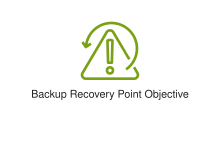
</div>
</div>

{{#endtab}}
{{#tab name="Code"}}

```xml
{{#include ../samples/icons/Resource-Icons/res-aws-backup-recovery-point-objective-48-3f1cacac.xal}}
```

{{#endtab}}
{{#endtabs}}

<div class="xal-ref-tag"><code>&lt;item id=&#34;1609&#34; /&gt;</code></div>

</div>
<div class="xal-ref-card">
<div class="xal-ref-title">Res_AWS-Backup_Recovery-Time-Objective_48</div>

{{#tabs name="svg-ref-0467"}}
{{#tab name="Preview"}}
<div class="xal-ref-preview">
<div>

</div>
</div>

{{#endtab}}
{{#tab name="Code"}}

```xml
{{#include ../samples/icons/Resource-Icons/res-aws-backup-recovery-time-objective-48-47ebfd2f.xal}}
```

{{#endtab}}
{{#endtabs}}

<div class="xal-ref-tag"><code>&lt;item id=&#34;1610&#34; /&gt;</code></div>

</div>
<div class="xal-ref-card">
<div class="xal-ref-title">Res_AWS-Backup_Storage_48</div>

{{#tabs name="svg-ref-0468"}}
{{#tab name="Preview"}}
<div class="xal-ref-preview">
<div>

</div>
</div>

{{#endtab}}
{{#tab name="Code"}}

```xml
{{#include ../samples/icons/Resource-Icons/res-aws-backup-storage-48-0d605a99.xal}}
```

{{#endtab}}
{{#endtabs}}

<div class="xal-ref-tag"><code>&lt;item id=&#34;1611&#34; /&gt;</code></div>

</div>
<div class="xal-ref-card">
<div class="xal-ref-title">Res_AWS-Backup_Vault-Lock_48</div>

{{#tabs name="svg-ref-0469"}}
{{#tab name="Preview"}}
<div class="xal-ref-preview">
<div>

</div>
</div>

{{#endtab}}
{{#tab name="Code"}}

```xml
{{#include ../samples/icons/Resource-Icons/res-aws-backup-vault-lock-48-68ac47a9.xal}}
```

{{#endtab}}
{{#endtabs}}

<div class="xal-ref-tag"><code>&lt;item id=&#34;1612&#34; /&gt;</code></div>

</div>
<div class="xal-ref-card">
<div class="xal-ref-title">Res_AWS-Backup_Virtual-Machine-Monitor_48</div>

{{#tabs name="svg-ref-0470"}}
{{#tab name="Preview"}}
<div class="xal-ref-preview">
<div>

</div>
</div>

{{#endtab}}
{{#tab name="Code"}}

```xml
{{#include ../samples/icons/Resource-Icons/res-aws-backup-virtual-machine-monitor-48-b2eaca94.xal}}
```

{{#endtab}}
{{#endtabs}}

<div class="xal-ref-tag"><code>&lt;item id=&#34;1613&#34; /&gt;</code></div>

</div>
<div class="xal-ref-card">
<div class="xal-ref-title">Res_AWS-Backup_Virtual-Machine_48</div>

{{#tabs name="svg-ref-0471"}}
{{#tab name="Preview"}}
<div class="xal-ref-preview">
<div>

</div>
</div>

{{#endtab}}
{{#tab name="Code"}}

```xml
{{#include ../samples/icons/Resource-Icons/res-aws-backup-virtual-machine-48-dcbbd471.xal}}
```

{{#endtab}}
{{#endtabs}}

<div class="xal-ref-tag"><code>&lt;item id=&#34;1614&#34; /&gt;</code></div>

</div>
<div class="xal-ref-card">
<div class="xal-ref-title">Res_AWS-Snowball_Snowball-Import-Export_48</div>

{{#tabs name="svg-ref-0472"}}
{{#tab name="Preview"}}
<div class="xal-ref-preview">
<div>

</div>
</div>

{{#endtab}}
{{#tab name="Code"}}

```xml
{{#include ../samples/icons/Resource-Icons/res-aws-snowball-snowball-import-export-48-a41dae3c.xal}}
```

{{#endtab}}
{{#endtabs}}

<div class="xal-ref-tag"><code>&lt;item id=&#34;1615&#34; /&gt;</code></div>

</div>
<div class="xal-ref-card">
<div class="xal-ref-title">Res_AWS-Storage-Gateway_Amazon-FSx-File-Gateway_48</div>

{{#tabs name="svg-ref-0473"}}
{{#tab name="Preview"}}
<div class="xal-ref-preview">
<div>

</div>
</div>

{{#endtab}}
{{#tab name="Code"}}

```xml
{{#include ../samples/icons/Resource-Icons/res-aws-storage-gateway-amazon-fsx-file-gateway-48-63b246e8.xal}}
```

{{#endtab}}
{{#endtabs}}

<div class="xal-ref-tag"><code>&lt;item id=&#34;1616&#34; /&gt;</code></div>

</div>
<div class="xal-ref-card">
<div class="xal-ref-title">Res_AWS-Storage-Gateway_Amazon-S3-File-Gateway_48</div>

{{#tabs name="svg-ref-0474"}}
{{#tab name="Preview"}}
<div class="xal-ref-preview">
<div>

</div>
</div>

{{#endtab}}
{{#tab name="Code"}}

```xml
{{#include ../samples/icons/Resource-Icons/res-aws-storage-gateway-amazon-s3-file-gateway-48-6a5478dc.xal}}
```

{{#endtab}}
{{#endtabs}}

<div class="xal-ref-tag"><code>&lt;item id=&#34;1617&#34; /&gt;</code></div>

</div>
<div class="xal-ref-card">
<div class="xal-ref-title">Res_AWS-Storage-Gateway_Cached-Volume_48</div>

{{#tabs name="svg-ref-0475"}}
{{#tab name="Preview"}}
<div class="xal-ref-preview">
<div>

</div>
</div>

{{#endtab}}
{{#tab name="Code"}}

```xml
{{#include ../samples/icons/Resource-Icons/res-aws-storage-gateway-cached-volume-48-46991f01.xal}}
```

{{#endtab}}
{{#endtabs}}

<div class="xal-ref-tag"><code>&lt;item id=&#34;1618&#34; /&gt;</code></div>

</div>
<div class="xal-ref-card">
<div class="xal-ref-title">Res_AWS-Storage-Gateway_File-Gateway_48</div>

{{#tabs name="svg-ref-0476"}}
{{#tab name="Preview"}}
<div class="xal-ref-preview">
<div>

</div>
</div>

{{#endtab}}
{{#tab name="Code"}}

```xml
{{#include ../samples/icons/Resource-Icons/res-aws-storage-gateway-file-gateway-48-e7af5abe.xal}}
```

{{#endtab}}
{{#endtabs}}

<div class="xal-ref-tag"><code>&lt;item id=&#34;1619&#34; /&gt;</code></div>

</div>
<div class="xal-ref-card">
<div class="xal-ref-title">Res_AWS-Storage-Gateway_Noncached-Volume_48</div>

{{#tabs name="svg-ref-0477"}}
{{#tab name="Preview"}}
<div class="xal-ref-preview">
<div>

</div>
</div>

{{#endtab}}
{{#tab name="Code"}}

```xml
{{#include ../samples/icons/Resource-Icons/res-aws-storage-gateway-noncached-volume-48-7f47d115.xal}}
```

{{#endtab}}
{{#endtabs}}

<div class="xal-ref-tag"><code>&lt;item id=&#34;1620&#34; /&gt;</code></div>

</div>
<div class="xal-ref-card">
<div class="xal-ref-title">Res_AWS-Storage-Gateway_Tape-Gateway_48</div>

{{#tabs name="svg-ref-0478"}}
{{#tab name="Preview"}}
<div class="xal-ref-preview">
<div>

</div>
</div>

{{#endtab}}
{{#tab name="Code"}}

```xml
{{#include ../samples/icons/Resource-Icons/res-aws-storage-gateway-tape-gateway-48-15413865.xal}}
```

{{#endtab}}
{{#endtabs}}

<div class="xal-ref-tag"><code>&lt;item id=&#34;1621&#34; /&gt;</code></div>

</div>
<div class="xal-ref-card">
<div class="xal-ref-title">Res_AWS-Storage-Gateway_Virtual-Tape-Library_48</div>

{{#tabs name="svg-ref-0479"}}
{{#tab name="Preview"}}
<div class="xal-ref-preview">
<div>

</div>
</div>

{{#endtab}}
{{#tab name="Code"}}

```xml
{{#include ../samples/icons/Resource-Icons/res-aws-storage-gateway-virtual-tape-library-48-246e83cd.xal}}
```

{{#endtab}}
{{#endtabs}}

<div class="xal-ref-tag"><code>&lt;item id=&#34;1622&#34; /&gt;</code></div>

</div>
<div class="xal-ref-card">
<div class="xal-ref-title">Res_AWS-Storage-Gateway_Volume-Gateway_48</div>

{{#tabs name="svg-ref-0480"}}
{{#tab name="Preview"}}
<div class="xal-ref-preview">
<div>

</div>
</div>

{{#endtab}}
{{#tab name="Code"}}

```xml
{{#include ../samples/icons/Resource-Icons/res-aws-storage-gateway-volume-gateway-48-f5239e3e.xal}}
```

{{#endtab}}
{{#endtabs}}

<div class="xal-ref-tag"><code>&lt;item id=&#34;1623&#34; /&gt;</code></div>

</div>
<div class="xal-ref-card">
<div class="xal-ref-title">Res_Amazon-Elastic-Block-Store_Amazon-Data-Lifecycle-Manager_48</div>

{{#tabs name="svg-ref-0481"}}
{{#tab name="Preview"}}
<div class="xal-ref-preview">
<div>
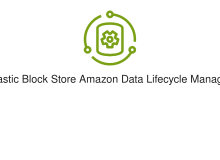
</div>
</div>

{{#endtab}}
{{#tab name="Code"}}

```xml
{{#include ../samples/icons/Resource-Icons/res-amazon-elastic-block-store-amazon-data-lifecycle-manager-48-ed13081c.xal}}
```

{{#endtab}}
{{#endtabs}}

<div class="xal-ref-tag"><code>&lt;item id=&#34;1624&#34; /&gt;</code></div>

</div>
<div class="xal-ref-card">
<div class="xal-ref-title">Res_Amazon-Elastic-Block-Store_Multiple-Volumes_48</div>

{{#tabs name="svg-ref-0482"}}
{{#tab name="Preview"}}
<div class="xal-ref-preview">
<div>
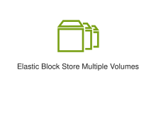
</div>
</div>

{{#endtab}}
{{#tab name="Code"}}

```xml
{{#include ../samples/icons/Resource-Icons/res-amazon-elastic-block-store-multiple-volumes-48-06fd6b1a.xal}}
```

{{#endtab}}
{{#endtabs}}

<div class="xal-ref-tag"><code>&lt;item id=&#34;1625&#34; /&gt;</code></div>

</div>
<div class="xal-ref-card">
<div class="xal-ref-title">Res_Amazon-Elastic-Block-Store_Snapshot_48</div>

{{#tabs name="svg-ref-0483"}}
{{#tab name="Preview"}}
<div class="xal-ref-preview">
<div>
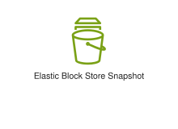
</div>
</div>

{{#endtab}}
{{#tab name="Code"}}

```xml
{{#include ../samples/icons/Resource-Icons/res-amazon-elastic-block-store-snapshot-48-6904e9fb.xal}}
```

{{#endtab}}
{{#endtabs}}

<div class="xal-ref-tag"><code>&lt;item id=&#34;1626&#34; /&gt;</code></div>

</div>
<div class="xal-ref-card">
<div class="xal-ref-title">Res_Amazon-Elastic-Block-Store_Volume-gp3_48</div>

{{#tabs name="svg-ref-0484"}}
{{#tab name="Preview"}}
<div class="xal-ref-preview">
<div>
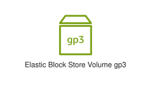
</div>
</div>

{{#endtab}}
{{#tab name="Code"}}

```xml
{{#include ../samples/icons/Resource-Icons/res-amazon-elastic-block-store-volume-gp3-48-f40831a3.xal}}
```

{{#endtab}}
{{#endtabs}}

<div class="xal-ref-tag"><code>&lt;item id=&#34;1627&#34; /&gt;</code></div>

</div>
<div class="xal-ref-card">
<div class="xal-ref-title">Res_Amazon-Elastic-Block-Store_Volume_48</div>

{{#tabs name="svg-ref-0485"}}
{{#tab name="Preview"}}
<div class="xal-ref-preview">
<div>

</div>
</div>

{{#endtab}}
{{#tab name="Code"}}

```xml
{{#include ../samples/icons/Resource-Icons/res-amazon-elastic-block-store-volume-48-d0bfbb4f.xal}}
```

{{#endtab}}
{{#endtabs}}

<div class="xal-ref-tag"><code>&lt;item id=&#34;1628&#34; /&gt;</code></div>

</div>
<div class="xal-ref-card">
<div class="xal-ref-title">Res_Amazon-Elastic-File-System_EFS-Intelligent-Tiering_48</div>

{{#tabs name="svg-ref-0486"}}
{{#tab name="Preview"}}
<div class="xal-ref-preview">
<div>

</div>
</div>

{{#endtab}}
{{#tab name="Code"}}

```xml
{{#include ../samples/icons/Resource-Icons/res-amazon-elastic-file-system-efs-intelligent-tiering-48-6ed5374c.xal}}
```

{{#endtab}}
{{#endtabs}}

<div class="xal-ref-tag"><code>&lt;item id=&#34;1629&#34; /&gt;</code></div>

</div>
<div class="xal-ref-card">
<div class="xal-ref-title">Res_Amazon-Elastic-File-System_EFS-One-Zone-Infrequent-Access_48</div>

{{#tabs name="svg-ref-0487"}}
{{#tab name="Preview"}}
<div class="xal-ref-preview">
<div>
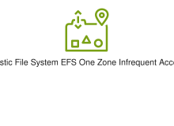
</div>
</div>

{{#endtab}}
{{#tab name="Code"}}

```xml
{{#include ../samples/icons/Resource-Icons/res-amazon-elastic-file-system-efs-one-zone-infrequent-access-48-7baa7215.xal}}
```

{{#endtab}}
{{#endtabs}}

<div class="xal-ref-tag"><code>&lt;item id=&#34;1630&#34; /&gt;</code></div>

</div>
<div class="xal-ref-card">
<div class="xal-ref-title">Res_Amazon-Elastic-File-System_EFS-One-Zone_48</div>

{{#tabs name="svg-ref-0488"}}
{{#tab name="Preview"}}
<div class="xal-ref-preview">
<div>

</div>
</div>

{{#endtab}}
{{#tab name="Code"}}

```xml
{{#include ../samples/icons/Resource-Icons/res-amazon-elastic-file-system-efs-one-zone-48-ed51b6b7.xal}}
```

{{#endtab}}
{{#endtabs}}

<div class="xal-ref-tag"><code>&lt;item id=&#34;1631&#34; /&gt;</code></div>

</div>
<div class="xal-ref-card">
<div class="xal-ref-title">Res_Amazon-Elastic-File-System_EFS-Standard-Infrequent-Access_48</div>

{{#tabs name="svg-ref-0489"}}
{{#tab name="Preview"}}
<div class="xal-ref-preview">
<div>
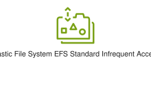
</div>
</div>

{{#endtab}}
{{#tab name="Code"}}

```xml
{{#include ../samples/icons/Resource-Icons/res-amazon-elastic-file-system-efs-standard-infrequent-access-48-c91546d1.xal}}
```

{{#endtab}}
{{#endtabs}}

<div class="xal-ref-tag"><code>&lt;item id=&#34;1632&#34; /&gt;</code></div>

</div>
<div class="xal-ref-card">
<div class="xal-ref-title">Res_Amazon-Elastic-File-System_EFS-Standard_48</div>

{{#tabs name="svg-ref-0490"}}
{{#tab name="Preview"}}
<div class="xal-ref-preview">
<div>
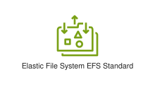
</div>
</div>

{{#endtab}}
{{#tab name="Code"}}

```xml
{{#include ../samples/icons/Resource-Icons/res-amazon-elastic-file-system-efs-standard-48-3d8c882f.xal}}
```

{{#endtab}}
{{#endtabs}}

<div class="xal-ref-tag"><code>&lt;item id=&#34;1633&#34; /&gt;</code></div>

</div>
<div class="xal-ref-card">
<div class="xal-ref-title">Res_Amazon-Elastic-File-System_Elastic-Throughput_48</div>

{{#tabs name="svg-ref-0491"}}
{{#tab name="Preview"}}
<div class="xal-ref-preview">
<div>

</div>
</div>

{{#endtab}}
{{#tab name="Code"}}

```xml
{{#include ../samples/icons/Resource-Icons/res-amazon-elastic-file-system-elastic-throughput-48-dc8922ad.xal}}
```

{{#endtab}}
{{#endtabs}}

<div class="xal-ref-tag"><code>&lt;item id=&#34;1634&#34; /&gt;</code></div>

</div>
<div class="xal-ref-card">
<div class="xal-ref-title">Res_Amazon-Elastic-File-System_File-System_48</div>

{{#tabs name="svg-ref-0492"}}
{{#tab name="Preview"}}
<div class="xal-ref-preview">
<div>

</div>
</div>

{{#endtab}}
{{#tab name="Code"}}

```xml
{{#include ../samples/icons/Resource-Icons/res-amazon-elastic-file-system-file-system-48-777009a8.xal}}
```

{{#endtab}}
{{#endtabs}}

<div class="xal-ref-tag"><code>&lt;item id=&#34;1635&#34; /&gt;</code></div>

</div>
<div class="xal-ref-card">
<div class="xal-ref-title">Res_Amazon-File-Cache_Hybrid-NFS-linked-datasets_48</div>

{{#tabs name="svg-ref-0493"}}
{{#tab name="Preview"}}
<div class="xal-ref-preview">
<div>
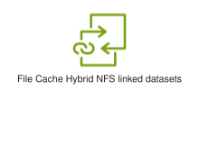
</div>
</div>

{{#endtab}}
{{#tab name="Code"}}

```xml
{{#include ../samples/icons/Resource-Icons/res-amazon-file-cache-hybrid-nfs-linked-datasets-48-82797dea.xal}}
```

{{#endtab}}
{{#endtabs}}

<div class="xal-ref-tag"><code>&lt;item id=&#34;1636&#34; /&gt;</code></div>

</div>
<div class="xal-ref-card">
<div class="xal-ref-title">Res_Amazon-File-Cache_On-premises-NFS-linked-datasets_48</div>

{{#tabs name="svg-ref-0494"}}
{{#tab name="Preview"}}
<div class="xal-ref-preview">
<div>
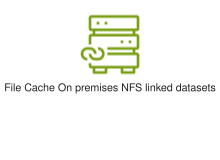
</div>
</div>

{{#endtab}}
{{#tab name="Code"}}

```xml
{{#include ../samples/icons/Resource-Icons/res-amazon-file-cache-on-premises-nfs-linked-datasets-48-c7db012c.xal}}
```

{{#endtab}}
{{#endtabs}}

<div class="xal-ref-tag"><code>&lt;item id=&#34;1637&#34; /&gt;</code></div>

</div>
<div class="xal-ref-card">
<div class="xal-ref-title">Res_Amazon-File-Cache_S3-linked-datasets_48</div>

{{#tabs name="svg-ref-0495"}}
{{#tab name="Preview"}}
<div class="xal-ref-preview">
<div>
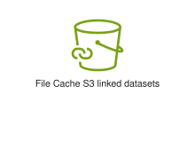
</div>
</div>

{{#endtab}}
{{#tab name="Code"}}

```xml
{{#include ../samples/icons/Resource-Icons/res-amazon-file-cache-s3-linked-datasets-48-112a4255.xal}}
```

{{#endtab}}
{{#endtabs}}

<div class="xal-ref-tag"><code>&lt;item id=&#34;1638&#34; /&gt;</code></div>

</div>
<div class="xal-ref-card">
<div class="xal-ref-title">Res_Amazon-Simple-Storage-Service-Glacier_Archive_48</div>

{{#tabs name="svg-ref-0496"}}
{{#tab name="Preview"}}
<div class="xal-ref-preview">
<div>

</div>
</div>

{{#endtab}}
{{#tab name="Code"}}

```xml
{{#include ../samples/icons/Resource-Icons/res-amazon-simple-storage-service-glacier-archive-48-32c8f588.xal}}
```

{{#endtab}}
{{#endtabs}}

<div class="xal-ref-tag"><code>&lt;item id=&#34;1639&#34; /&gt;</code></div>

</div>
<div class="xal-ref-card">
<div class="xal-ref-title">Res_Amazon-Simple-Storage-Service-Glacier_Vault_48</div>

{{#tabs name="svg-ref-0497"}}
{{#tab name="Preview"}}
<div class="xal-ref-preview">
<div>

</div>
</div>

{{#endtab}}
{{#tab name="Code"}}

```xml
{{#include ../samples/icons/Resource-Icons/res-amazon-simple-storage-service-glacier-vault-48-64b28bd8.xal}}
```

{{#endtab}}
{{#endtabs}}

<div class="xal-ref-tag"><code>&lt;item id=&#34;1640&#34; /&gt;</code></div>

</div>
<div class="xal-ref-card">
<div class="xal-ref-title">Res_Amazon-Simple-Storage-Service_Bucket-With-Objects_48</div>

{{#tabs name="svg-ref-0498"}}
{{#tab name="Preview"}}
<div class="xal-ref-preview">
<div>
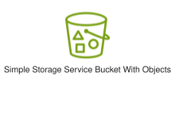
</div>
</div>

{{#endtab}}
{{#tab name="Code"}}

```xml
{{#include ../samples/icons/Resource-Icons/res-amazon-simple-storage-service-bucket-with-objects-48-ee937694.xal}}
```

{{#endtab}}
{{#endtabs}}

<div class="xal-ref-tag"><code>&lt;item id=&#34;1641&#34; /&gt;</code></div>

</div>
<div class="xal-ref-card">
<div class="xal-ref-title">Res_Amazon-Simple-Storage-Service_Bucket_48</div>

{{#tabs name="svg-ref-0499"}}
{{#tab name="Preview"}}
<div class="xal-ref-preview">
<div>

</div>
</div>

{{#endtab}}
{{#tab name="Code"}}

```xml
{{#include ../samples/icons/Resource-Icons/res-amazon-simple-storage-service-bucket-48-ab0d6461.xal}}
```

{{#endtab}}
{{#endtabs}}

<div class="xal-ref-tag"><code>&lt;item id=&#34;1642&#34; /&gt;</code></div>

</div>
<div class="xal-ref-card">
<div class="xal-ref-title">Res_Amazon-Simple-Storage-Service_Directory-bucket_48</div>

{{#tabs name="svg-ref-0500"}}
{{#tab name="Preview"}}
<div class="xal-ref-preview">
<div>

</div>
</div>

{{#endtab}}
{{#tab name="Code"}}

```xml
{{#include ../samples/icons/Resource-Icons/res-amazon-simple-storage-service-directory-bucket-48-66c1d939.xal}}
```

{{#endtab}}
{{#endtabs}}

<div class="xal-ref-tag"><code>&lt;item id=&#34;1643&#34; /&gt;</code></div>

</div>
<div class="xal-ref-card">
<div class="xal-ref-title">Res_Amazon-Simple-Storage-Service_General-Access-Points_48</div>

{{#tabs name="svg-ref-0501"}}
{{#tab name="Preview"}}
<div class="xal-ref-preview">
<div>

</div>
</div>

{{#endtab}}
{{#tab name="Code"}}

```xml
{{#include ../samples/icons/Resource-Icons/res-amazon-simple-storage-service-general-access-points-48-6b820c6d.xal}}
```

{{#endtab}}
{{#endtabs}}

<div class="xal-ref-tag"><code>&lt;item id=&#34;1644&#34; /&gt;</code></div>

</div>
<div class="xal-ref-card">
<div class="xal-ref-title">Res_Amazon-Simple-Storage-Service_Object_48</div>

{{#tabs name="svg-ref-0502"}}
{{#tab name="Preview"}}
<div class="xal-ref-preview">
<div>
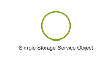
</div>
</div>

{{#endtab}}
{{#tab name="Code"}}

```xml
{{#include ../samples/icons/Resource-Icons/res-amazon-simple-storage-service-object-48-823f77d0.xal}}
```

{{#endtab}}
{{#endtabs}}

<div class="xal-ref-tag"><code>&lt;item id=&#34;1645&#34; /&gt;</code></div>

</div>
<div class="xal-ref-card">
<div class="xal-ref-title">Res_Amazon-Simple-Storage-Service_S3-Batch-Operations_48</div>

{{#tabs name="svg-ref-0503"}}
{{#tab name="Preview"}}
<div class="xal-ref-preview">
<div>
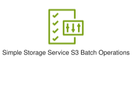
</div>
</div>

{{#endtab}}
{{#tab name="Code"}}

```xml
{{#include ../samples/icons/Resource-Icons/res-amazon-simple-storage-service-s3-batch-operations-48-680d3c01.xal}}
```

{{#endtab}}
{{#endtabs}}

<div class="xal-ref-tag"><code>&lt;item id=&#34;1646&#34; /&gt;</code></div>

</div>
<div class="xal-ref-card">
<div class="xal-ref-title">Res_Amazon-Simple-Storage-Service_S3-Express-One-Zone_48</div>

{{#tabs name="svg-ref-0504"}}
{{#tab name="Preview"}}
<div class="xal-ref-preview">
<div>
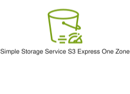
</div>
</div>

{{#endtab}}
{{#tab name="Code"}}

```xml
{{#include ../samples/icons/Resource-Icons/res-amazon-simple-storage-service-s3-express-one-zone-48-901b2ea0.xal}}
```

{{#endtab}}
{{#endtabs}}

<div class="xal-ref-tag"><code>&lt;item id=&#34;1647&#34; /&gt;</code></div>

</div>
<div class="xal-ref-card">
<div class="xal-ref-title">Res_Amazon-Simple-Storage-Service_S3-Glacier-Deep-Archive_48</div>

{{#tabs name="svg-ref-0505"}}
{{#tab name="Preview"}}
<div class="xal-ref-preview">
<div>
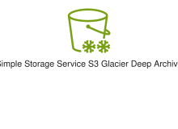
</div>
</div>

{{#endtab}}
{{#tab name="Code"}}

```xml
{{#include ../samples/icons/Resource-Icons/res-amazon-simple-storage-service-s3-glacier-deep-archive-48-b2da239a.xal}}
```

{{#endtab}}
{{#endtabs}}

<div class="xal-ref-tag"><code>&lt;item id=&#34;1648&#34; /&gt;</code></div>

</div>
<div class="xal-ref-card">
<div class="xal-ref-title">Res_Amazon-Simple-Storage-Service_S3-Glacier-Flexible-Retrieval_48</div>

{{#tabs name="svg-ref-0506"}}
{{#tab name="Preview"}}
<div class="xal-ref-preview">
<div>
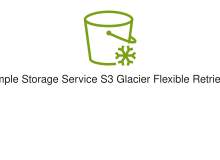
</div>
</div>

{{#endtab}}
{{#tab name="Code"}}

```xml
{{#include ../samples/icons/Resource-Icons/res-amazon-simple-storage-service-s3-glacier-flexible-retrieval-48-011af929.xal}}
```

{{#endtab}}
{{#endtabs}}

<div class="xal-ref-tag"><code>&lt;item id=&#34;1649&#34; /&gt;</code></div>

</div>
<div class="xal-ref-card">
<div class="xal-ref-title">Res_Amazon-Simple-Storage-Service_S3-Glacier-Instant-Retrieval_48</div>

{{#tabs name="svg-ref-0507"}}
{{#tab name="Preview"}}
<div class="xal-ref-preview">
<div>
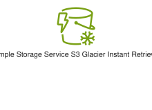
</div>
</div>

{{#endtab}}
{{#tab name="Code"}}

```xml
{{#include ../samples/icons/Resource-Icons/res-amazon-simple-storage-service-s3-glacier-instant-retrieval-48-5e9ceb5f.xal}}
```

{{#endtab}}
{{#endtabs}}

<div class="xal-ref-tag"><code>&lt;item id=&#34;1650&#34; /&gt;</code></div>

</div>
<div class="xal-ref-card">
<div class="xal-ref-title">Res_Amazon-Simple-Storage-Service_S3-Intelligent-Tiering_48</div>

{{#tabs name="svg-ref-0508"}}
{{#tab name="Preview"}}
<div class="xal-ref-preview">
<div>

</div>
</div>

{{#endtab}}
{{#tab name="Code"}}

```xml
{{#include ../samples/icons/Resource-Icons/res-amazon-simple-storage-service-s3-intelligent-tiering-48-ea100e70.xal}}
```

{{#endtab}}
{{#endtabs}}

<div class="xal-ref-tag"><code>&lt;item id=&#34;1651&#34; /&gt;</code></div>

</div>
<div class="xal-ref-card">
<div class="xal-ref-title">Res_Amazon-Simple-Storage-Service_S3-Multi-Region-Access-Points_48</div>

{{#tabs name="svg-ref-0509"}}
{{#tab name="Preview"}}
<div class="xal-ref-preview">
<div>

</div>
</div>

{{#endtab}}
{{#tab name="Code"}}

```xml
{{#include ../samples/icons/Resource-Icons/res-amazon-simple-storage-service-s3-multi-region-access-points-48-bcbb6505.xal}}
```

{{#endtab}}
{{#endtabs}}

<div class="xal-ref-tag"><code>&lt;item id=&#34;1652&#34; /&gt;</code></div>

</div>
<div class="xal-ref-card">
<div class="xal-ref-title">Res_Amazon-Simple-Storage-Service_S3-Object-Lambda-Access-Points_48</div>

{{#tabs name="svg-ref-0510"}}
{{#tab name="Preview"}}
<div class="xal-ref-preview">
<div>
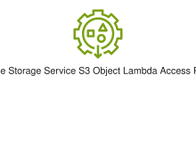
</div>
</div>

{{#endtab}}
{{#tab name="Code"}}

```xml
{{#include ../samples/icons/Resource-Icons/res-amazon-simple-storage-service-s3-object-lambda-access-points-48-b52800ce.xal}}
```

{{#endtab}}
{{#endtabs}}

<div class="xal-ref-tag"><code>&lt;item id=&#34;1653&#34; /&gt;</code></div>

</div>
<div class="xal-ref-card">
<div class="xal-ref-title">Res_Amazon-Simple-Storage-Service_S3-Object-Lambda_48</div>

{{#tabs name="svg-ref-0511"}}
{{#tab name="Preview"}}
<div class="xal-ref-preview">
<div>
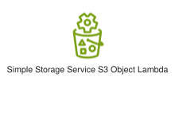
</div>
</div>

{{#endtab}}
{{#tab name="Code"}}

```xml
{{#include ../samples/icons/Resource-Icons/res-amazon-simple-storage-service-s3-object-lambda-48-f69d174e.xal}}
```

{{#endtab}}
{{#endtabs}}

<div class="xal-ref-tag"><code>&lt;item id=&#34;1654&#34; /&gt;</code></div>

</div>
<div class="xal-ref-card">
<div class="xal-ref-title">Res_Amazon-Simple-Storage-Service_S3-Object-Lock_48</div>

{{#tabs name="svg-ref-0512"}}
{{#tab name="Preview"}}
<div class="xal-ref-preview">
<div>
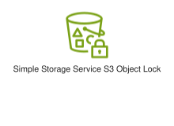
</div>
</div>

{{#endtab}}
{{#tab name="Code"}}

```xml
{{#include ../samples/icons/Resource-Icons/res-amazon-simple-storage-service-s3-object-lock-48-dff793aa.xal}}
```

{{#endtab}}
{{#endtabs}}

<div class="xal-ref-tag"><code>&lt;item id=&#34;1655&#34; /&gt;</code></div>

</div>
<div class="xal-ref-card">
<div class="xal-ref-title">Res_Amazon-Simple-Storage-Service_S3-On-Outposts_48</div>

{{#tabs name="svg-ref-0513"}}
{{#tab name="Preview"}}
<div class="xal-ref-preview">
<div>

</div>
</div>

{{#endtab}}
{{#tab name="Code"}}

```xml
{{#include ../samples/icons/Resource-Icons/res-amazon-simple-storage-service-s3-on-outposts-48-0f151752.xal}}
```

{{#endtab}}
{{#endtabs}}

<div class="xal-ref-tag"><code>&lt;item id=&#34;1656&#34; /&gt;</code></div>

</div>
<div class="xal-ref-card">
<div class="xal-ref-title">Res_Amazon-Simple-Storage-Service_S3-One-Zone-IA_48</div>

{{#tabs name="svg-ref-0514"}}
{{#tab name="Preview"}}
<div class="xal-ref-preview">
<div>

</div>
</div>

{{#endtab}}
{{#tab name="Code"}}

```xml
{{#include ../samples/icons/Resource-Icons/res-amazon-simple-storage-service-s3-one-zone-ia-48-c833fcda.xal}}
```

{{#endtab}}
{{#endtabs}}

<div class="xal-ref-tag"><code>&lt;item id=&#34;1657&#34; /&gt;</code></div>

</div>
<div class="xal-ref-card">
<div class="xal-ref-title">Res_Amazon-Simple-Storage-Service_S3-Replication-Time-Control_48</div>

{{#tabs name="svg-ref-0515"}}
{{#tab name="Preview"}}
<div class="xal-ref-preview">
<div>
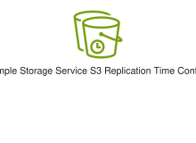
</div>
</div>

{{#endtab}}
{{#tab name="Code"}}

```xml
{{#include ../samples/icons/Resource-Icons/res-amazon-simple-storage-service-s3-replication-time-control-48-0269c4fa.xal}}
```

{{#endtab}}
{{#endtabs}}

<div class="xal-ref-tag"><code>&lt;item id=&#34;1658&#34; /&gt;</code></div>

</div>
<div class="xal-ref-card">
<div class="xal-ref-title">Res_Amazon-Simple-Storage-Service_S3-Replication_48</div>

{{#tabs name="svg-ref-0516"}}
{{#tab name="Preview"}}
<div class="xal-ref-preview">
<div>
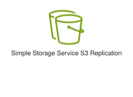
</div>
</div>

{{#endtab}}
{{#tab name="Code"}}

```xml
{{#include ../samples/icons/Resource-Icons/res-amazon-simple-storage-service-s3-replication-48-59c248c9.xal}}
```

{{#endtab}}
{{#endtabs}}

<div class="xal-ref-tag"><code>&lt;item id=&#34;1659&#34; /&gt;</code></div>

</div>
<div class="xal-ref-card">
<div class="xal-ref-title">Res_Amazon-Simple-Storage-Service_S3-Select_48</div>

{{#tabs name="svg-ref-0517"}}
{{#tab name="Preview"}}
<div class="xal-ref-preview">
<div>
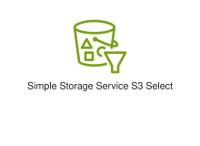
</div>
</div>

{{#endtab}}
{{#tab name="Code"}}

```xml
{{#include ../samples/icons/Resource-Icons/res-amazon-simple-storage-service-s3-select-48-181e1637.xal}}
```

{{#endtab}}
{{#endtabs}}

<div class="xal-ref-tag"><code>&lt;item id=&#34;1660&#34; /&gt;</code></div>

</div>
<div class="xal-ref-card">
<div class="xal-ref-title">Res_Amazon-Simple-Storage-Service_S3-Standard-IA_48</div>

{{#tabs name="svg-ref-0518"}}
{{#tab name="Preview"}}
<div class="xal-ref-preview">
<div>
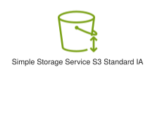
</div>
</div>

{{#endtab}}
{{#tab name="Code"}}

```xml
{{#include ../samples/icons/Resource-Icons/res-amazon-simple-storage-service-s3-standard-ia-48-8294a056.xal}}
```

{{#endtab}}
{{#endtabs}}

<div class="xal-ref-tag"><code>&lt;item id=&#34;1661&#34; /&gt;</code></div>

</div>
<div class="xal-ref-card">
<div class="xal-ref-title">Res_Amazon-Simple-Storage-Service_S3-Standard_48</div>

{{#tabs name="svg-ref-0519"}}
{{#tab name="Preview"}}
<div class="xal-ref-preview">
<div>
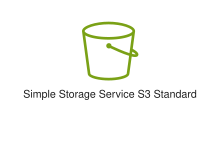
</div>
</div>

{{#endtab}}
{{#tab name="Code"}}

```xml
{{#include ../samples/icons/Resource-Icons/res-amazon-simple-storage-service-s3-standard-48-5a77f357.xal}}
```

{{#endtab}}
{{#endtabs}}

<div class="xal-ref-tag"><code>&lt;item id=&#34;1662&#34; /&gt;</code></div>

</div>
<div class="xal-ref-card">
<div class="xal-ref-title">Res_Amazon-Simple-Storage-Service_S3-Storage-Lens_48</div>

{{#tabs name="svg-ref-0520"}}
{{#tab name="Preview"}}
<div class="xal-ref-preview">
<div>

</div>
</div>

{{#endtab}}
{{#tab name="Code"}}

```xml
{{#include ../samples/icons/Resource-Icons/res-amazon-simple-storage-service-s3-storage-lens-48-6688aa06.xal}}
```

{{#endtab}}
{{#endtabs}}

<div class="xal-ref-tag"><code>&lt;item id=&#34;1663&#34; /&gt;</code></div>

</div>
<div class="xal-ref-card">
<div class="xal-ref-title">Res_Amazon-Simple-Storage-Service_S3-Tables_48</div>

{{#tabs name="svg-ref-0521"}}
{{#tab name="Preview"}}
<div class="xal-ref-preview">
<div>
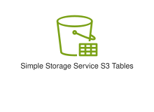
</div>
</div>

{{#endtab}}
{{#tab name="Code"}}

```xml
{{#include ../samples/icons/Resource-Icons/res-amazon-simple-storage-service-s3-tables-48-b1d75b4f.xal}}
```

{{#endtab}}
{{#endtabs}}

<div class="xal-ref-tag"><code>&lt;item id=&#34;1664&#34; /&gt;</code></div>

</div>
<div class="xal-ref-card">
<div class="xal-ref-title">Res_Amazon-Simple-Storage-Service_S3-Vectors_48</div>

{{#tabs name="svg-ref-0522"}}
{{#tab name="Preview"}}
<div class="xal-ref-preview">
<div>
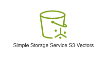
</div>
</div>

{{#endtab}}
{{#tab name="Code"}}

```xml
{{#include ../samples/icons/Resource-Icons/res-amazon-simple-storage-service-s3-vectors-48-9a6728a7.xal}}
```

{{#endtab}}
{{#endtabs}}

<div class="xal-ref-tag"><code>&lt;item id=&#34;1665&#34; /&gt;</code></div>

</div>
<div class="xal-ref-card">
<div class="xal-ref-title">Res_Amazon-Simple-Storage-Service_VPC-Access-Points_48</div>

{{#tabs name="svg-ref-0523"}}
{{#tab name="Preview"}}
<div class="xal-ref-preview">
<div>

</div>
</div>

{{#endtab}}
{{#tab name="Code"}}

```xml
{{#include ../samples/icons/Resource-Icons/res-amazon-simple-storage-service-vpc-access-points-48-7d41396a.xal}}
```

{{#endtab}}
{{#endtabs}}

<div class="xal-ref-tag"><code>&lt;item id=&#34;1666&#34; /&gt;</code></div>

</div>
</div>
