# Resource-Icons

This page references SVG files under `etc/resources/aws/svg/Resource-Icons`.
Each card shows the SVG preview first and the XAL tag syntax in the Code tab.
Total SVG files: 524.

<style>
.xal-ref-grid{display:grid;grid-template-columns:repeat(auto-fit,minmax(260px,1fr));gap:1rem;margin:1rem 0 1.5rem}.xal-ref-card{border:1px solid var(--table-border-color);border-radius:8px;overflow:hidden;background:var(--bg);padding:.75rem}.xal-ref-preview{min-height:132px;display:flex;align-items:center;justify-content:center}.xal-ref-preview img{max-width:96px;max-height:96px}.xal-ref-path{font-size:.78em;opacity:.75;word-break:break-all;margin-top:.5rem}.xal-ref-card pre{margin:0;max-height:18rem;overflow:auto;white-space:pre-wrap}.xal-ref-card code{font-size:.78em}
</style>

<div class="xal-ref-grid">
<div class="xal-ref-card">

{{#tabs name="svg-ref-0000"}}
{{#tab name="Preview"}}
<div class="xal-ref-preview">
<div>

<div class="xal-ref-path">etc/resources/aws/svg/Resource-Icons/Res_Analytics/Res_AWS-Data-Exchange-for-APIs_48.svg<br>1213 bytes</div>
</div>
</div>
{{#endtab}}
{{#tab name="Code"}}

```xml
{{#include ../samples/icons/Resource-Icons/res-aws-data-exchange-for-apis-48-56234742.xal}}
```

{{#endtab}}
{{#endtabs}}

</div>
<div class="xal-ref-card">

{{#tabs name="svg-ref-0001"}}
{{#tab name="Preview"}}
<div class="xal-ref-preview">
<div>

<div class="xal-ref-path">etc/resources/aws/svg/Resource-Icons/Res_Analytics/Res_AWS-Glue_AWS-Glue-for-Ray_48.svg<br>4872 bytes</div>
</div>
</div>
{{#endtab}}
{{#tab name="Code"}}

```xml
{{#include ../samples/icons/Resource-Icons/res-aws-glue-aws-glue-for-ray-48-0075053f.xal}}
```

{{#endtab}}
{{#endtabs}}

</div>
<div class="xal-ref-card">

{{#tabs name="svg-ref-0002"}}
{{#tab name="Preview"}}
<div class="xal-ref-preview">
<div>

<div class="xal-ref-path">etc/resources/aws/svg/Resource-Icons/Res_Analytics/Res_AWS-Glue_Crawler_48.svg<br>2756 bytes</div>
</div>
</div>
{{#endtab}}
{{#tab name="Code"}}

```xml
{{#include ../samples/icons/Resource-Icons/res-aws-glue-crawler-48-065f670a.xal}}
```

{{#endtab}}
{{#endtabs}}

</div>
<div class="xal-ref-card">

{{#tabs name="svg-ref-0003"}}
{{#tab name="Preview"}}
<div class="xal-ref-preview">
<div>

<div class="xal-ref-path">etc/resources/aws/svg/Resource-Icons/Res_Analytics/Res_AWS-Glue_Data-Catalog_48.svg<br>1216 bytes</div>
</div>
</div>
{{#endtab}}
{{#tab name="Code"}}

```xml
{{#include ../samples/icons/Resource-Icons/res-aws-glue-data-catalog-48-90ca4eb1.xal}}
```

{{#endtab}}
{{#endtabs}}

</div>
<div class="xal-ref-card">

{{#tabs name="svg-ref-0004"}}
{{#tab name="Preview"}}
<div class="xal-ref-preview">
<div>

<div class="xal-ref-path">etc/resources/aws/svg/Resource-Icons/Res_Analytics/Res_AWS-Glue_Data-Quality_48.svg<br>2416 bytes</div>
</div>
</div>
{{#endtab}}
{{#tab name="Code"}}

```xml
{{#include ../samples/icons/Resource-Icons/res-aws-glue-data-quality-48-9d0a9926.xal}}
```

{{#endtab}}
{{#endtabs}}

</div>
<div class="xal-ref-card">

{{#tabs name="svg-ref-0005"}}
{{#tab name="Preview"}}
<div class="xal-ref-preview">
<div>

<div class="xal-ref-path">etc/resources/aws/svg/Resource-Icons/Res_Analytics/Res_AWS-Lake-Formation_Data-Lake_48.svg<br>5110 bytes</div>
</div>
</div>
{{#endtab}}
{{#tab name="Code"}}

```xml
{{#include ../samples/icons/Resource-Icons/res-aws-lake-formation-data-lake-48-7b8f1830.xal}}
```

{{#endtab}}
{{#endtabs}}

</div>
<div class="xal-ref-card">

{{#tabs name="svg-ref-0006"}}
{{#tab name="Preview"}}
<div class="xal-ref-preview">
<div>

<div class="xal-ref-path">etc/resources/aws/svg/Resource-Icons/Res_Analytics/Res_Amazon-Athena_Data-Source-Connectors_48.svg<br>4394 bytes</div>
</div>
</div>
{{#endtab}}
{{#tab name="Code"}}

```xml
{{#include ../samples/icons/Resource-Icons/res-amazon-athena-data-source-connectors-48-c8320d59.xal}}
```

{{#endtab}}
{{#endtabs}}

</div>
<div class="xal-ref-card">

{{#tabs name="svg-ref-0007"}}
{{#tab name="Preview"}}
<div class="xal-ref-preview">
<div>

<div class="xal-ref-path">etc/resources/aws/svg/Resource-Icons/Res_Analytics/Res_Amazon-CloudSearch_Search-Documents_48.svg<br>2226 bytes</div>
</div>
</div>
{{#endtab}}
{{#tab name="Code"}}

```xml
{{#include ../samples/icons/Resource-Icons/res-amazon-cloudsearch-search-documents-48-bacf37bf.xal}}
```

{{#endtab}}
{{#endtabs}}

</div>
<div class="xal-ref-card">

{{#tabs name="svg-ref-0008"}}
{{#tab name="Preview"}}
<div class="xal-ref-preview">
<div>

<div class="xal-ref-path">etc/resources/aws/svg/Resource-Icons/Res_Analytics/Res_Amazon-DataZone_Business-Data-Catalog_48.svg<br>2052 bytes</div>
</div>
</div>
{{#endtab}}
{{#tab name="Code"}}

```xml
{{#include ../samples/icons/Resource-Icons/res-amazon-datazone-business-data-catalog-48-cd4190d7.xal}}
```

{{#endtab}}
{{#endtabs}}

</div>
<div class="xal-ref-card">

{{#tabs name="svg-ref-0009"}}
{{#tab name="Preview"}}
<div class="xal-ref-preview">
<div>

<div class="xal-ref-path">etc/resources/aws/svg/Resource-Icons/Res_Analytics/Res_Amazon-DataZone_Data-Portal_48.svg<br>2916 bytes</div>
</div>
</div>
{{#endtab}}
{{#tab name="Code"}}

```xml
{{#include ../samples/icons/Resource-Icons/res-amazon-datazone-data-portal-48-aeecbd6b.xal}}
```

{{#endtab}}
{{#endtabs}}

</div>
<div class="xal-ref-card">

{{#tabs name="svg-ref-0010"}}
{{#tab name="Preview"}}
<div class="xal-ref-preview">
<div>

<div class="xal-ref-path">etc/resources/aws/svg/Resource-Icons/Res_Analytics/Res_Amazon-DataZone_Data-Projects_48.svg<br>2446 bytes</div>
</div>
</div>
{{#endtab}}
{{#tab name="Code"}}

```xml
{{#include ../samples/icons/Resource-Icons/res-amazon-datazone-data-projects-48-ab3eb61e.xal}}
```

{{#endtab}}
{{#endtabs}}

</div>
<div class="xal-ref-card">

{{#tabs name="svg-ref-0011"}}
{{#tab name="Preview"}}
<div class="xal-ref-preview">
<div>

<div class="xal-ref-path">etc/resources/aws/svg/Resource-Icons/Res_Analytics/Res_Amazon-EMR_Cluster_48.svg<br>3299 bytes</div>
</div>
</div>
{{#endtab}}
{{#tab name="Code"}}

```xml
{{#include ../samples/icons/Resource-Icons/res-amazon-emr-cluster-48-0a250462.xal}}
```

{{#endtab}}
{{#endtabs}}

</div>
<div class="xal-ref-card">

{{#tabs name="svg-ref-0012"}}
{{#tab name="Preview"}}
<div class="xal-ref-preview">
<div>

<div class="xal-ref-path">etc/resources/aws/svg/Resource-Icons/Res_Analytics/Res_Amazon-EMR_EMR-Engine_48.svg<br>2438 bytes</div>
</div>
</div>
{{#endtab}}
{{#tab name="Code"}}

```xml
{{#include ../samples/icons/Resource-Icons/res-amazon-emr-emr-engine-48-e7baee93.xal}}
```

{{#endtab}}
{{#endtabs}}

</div>
<div class="xal-ref-card">

{{#tabs name="svg-ref-0013"}}
{{#tab name="Preview"}}
<div class="xal-ref-preview">
<div>

<div class="xal-ref-path">etc/resources/aws/svg/Resource-Icons/Res_Analytics/Res_Amazon-EMR_HDFS-Cluster_48.svg<br>2759 bytes</div>
</div>
</div>
{{#endtab}}
{{#tab name="Code"}}

```xml
{{#include ../samples/icons/Resource-Icons/res-amazon-emr-hdfs-cluster-48-94d9d090.xal}}
```

{{#endtab}}
{{#endtabs}}

</div>
<div class="xal-ref-card">

{{#tabs name="svg-ref-0014"}}
{{#tab name="Preview"}}
<div class="xal-ref-preview">
<div>

<div class="xal-ref-path">etc/resources/aws/svg/Resource-Icons/Res_Analytics/Res_Amazon-MSK_Amazon-MSK-Connect_48.svg<br>2368 bytes</div>
</div>
</div>
{{#endtab}}
{{#tab name="Code"}}

```xml
{{#include ../samples/icons/Resource-Icons/res-amazon-msk-amazon-msk-connect-48-7d59ecfe.xal}}
```

{{#endtab}}
{{#endtabs}}

</div>
<div class="xal-ref-card">

{{#tabs name="svg-ref-0015"}}
{{#tab name="Preview"}}
<div class="xal-ref-preview">
<div>

<div class="xal-ref-path">etc/resources/aws/svg/Resource-Icons/Res_Analytics/Res_Amazon-OpenSearch-Service_Cluster-Administrator-Node_48.svg<br>4523 bytes</div>
</div>
</div>
{{#endtab}}
{{#tab name="Code"}}

```xml
{{#include ../samples/icons/Resource-Icons/res-amazon-opensearch-service-cluster-administrator-node-48-68c8b0bd.xal}}
```

{{#endtab}}
{{#endtabs}}

</div>
<div class="xal-ref-card">

{{#tabs name="svg-ref-0016"}}
{{#tab name="Preview"}}
<div class="xal-ref-preview">
<div>

<div class="xal-ref-path">etc/resources/aws/svg/Resource-Icons/Res_Analytics/Res_Amazon-OpenSearch-Service_Data-Node_48.svg<br>1744 bytes</div>
</div>
</div>
{{#endtab}}
{{#tab name="Code"}}

```xml
{{#include ../samples/icons/Resource-Icons/res-amazon-opensearch-service-data-node-48-bf899248.xal}}
```

{{#endtab}}
{{#endtabs}}

</div>
<div class="xal-ref-card">

{{#tabs name="svg-ref-0017"}}
{{#tab name="Preview"}}
<div class="xal-ref-preview">
<div>

<div class="xal-ref-path">etc/resources/aws/svg/Resource-Icons/Res_Analytics/Res_Amazon-OpenSearch-Service_Index_48.svg<br>1245 bytes</div>
</div>
</div>
{{#endtab}}
{{#tab name="Code"}}

```xml
{{#include ../samples/icons/Resource-Icons/res-amazon-opensearch-service-index-48-373f1db2.xal}}
```

{{#endtab}}
{{#endtabs}}

</div>
<div class="xal-ref-card">

{{#tabs name="svg-ref-0018"}}
{{#tab name="Preview"}}
<div class="xal-ref-preview">
<div>

<div class="xal-ref-path">etc/resources/aws/svg/Resource-Icons/Res_Analytics/Res_Amazon-OpenSearch-Service_Observability_48.svg<br>2459 bytes</div>
</div>
</div>
{{#endtab}}
{{#tab name="Code"}}

```xml
{{#include ../samples/icons/Resource-Icons/res-amazon-opensearch-service-observability-48-ce07d5d2.xal}}
```

{{#endtab}}
{{#endtabs}}

</div>
<div class="xal-ref-card">

{{#tabs name="svg-ref-0019"}}
{{#tab name="Preview"}}
<div class="xal-ref-preview">
<div>

<div class="xal-ref-path">etc/resources/aws/svg/Resource-Icons/Res_Analytics/Res_Amazon-OpenSearch-Service_OpenSearch-Dashboards_48.svg<br>1645 bytes</div>
</div>
</div>
{{#endtab}}
{{#tab name="Code"}}

```xml
{{#include ../samples/icons/Resource-Icons/res-amazon-opensearch-service-opensearch-dashboards-48-a7e9f7d7.xal}}
```

{{#endtab}}
{{#endtabs}}

</div>
<div class="xal-ref-card">

{{#tabs name="svg-ref-0020"}}
{{#tab name="Preview"}}
<div class="xal-ref-preview">
<div>

<div class="xal-ref-path">etc/resources/aws/svg/Resource-Icons/Res_Analytics/Res_Amazon-OpenSearch-Service_OpenSearch-Ingestion_48.svg<br>2161 bytes</div>
</div>
</div>
{{#endtab}}
{{#tab name="Code"}}

```xml
{{#include ../samples/icons/Resource-Icons/res-amazon-opensearch-service-opensearch-ingestion-48-88b6af09.xal}}
```

{{#endtab}}
{{#endtabs}}

</div>
<div class="xal-ref-card">

{{#tabs name="svg-ref-0021"}}
{{#tab name="Preview"}}
<div class="xal-ref-preview">
<div>

<div class="xal-ref-path">etc/resources/aws/svg/Resource-Icons/Res_Analytics/Res_Amazon-OpenSearch-Service_Traces_48.svg<br>1613 bytes</div>
</div>
</div>
{{#endtab}}
{{#tab name="Code"}}

```xml
{{#include ../samples/icons/Resource-Icons/res-amazon-opensearch-service-traces-48-2c0c12ea.xal}}
```

{{#endtab}}
{{#endtabs}}

</div>
<div class="xal-ref-card">

{{#tabs name="svg-ref-0022"}}
{{#tab name="Preview"}}
<div class="xal-ref-preview">
<div>

<div class="xal-ref-path">etc/resources/aws/svg/Resource-Icons/Res_Analytics/Res_Amazon-OpenSearch-Service_UltraWarm-Node_48.svg<br>1977 bytes</div>
</div>
</div>
{{#endtab}}
{{#tab name="Code"}}

```xml
{{#include ../samples/icons/Resource-Icons/res-amazon-opensearch-service-ultrawarm-node-48-cbc22086.xal}}
```

{{#endtab}}
{{#endtabs}}

</div>
<div class="xal-ref-card">

{{#tabs name="svg-ref-0023"}}
{{#tab name="Preview"}}
<div class="xal-ref-preview">
<div>

<div class="xal-ref-path">etc/resources/aws/svg/Resource-Icons/Res_Analytics/Res_Amazon-Quicksight_Paginated-Reports_48.svg<br>1450 bytes</div>
</div>
</div>
{{#endtab}}
{{#tab name="Code"}}

```xml
{{#include ../samples/icons/Resource-Icons/res-amazon-quicksight-paginated-reports-48-88b61f1e.xal}}
```

{{#endtab}}
{{#endtabs}}

</div>
<div class="xal-ref-card">

{{#tabs name="svg-ref-0024"}}
{{#tab name="Preview"}}
<div class="xal-ref-preview">
<div>

<div class="xal-ref-path">etc/resources/aws/svg/Resource-Icons/Res_Analytics/Res_Amazon-Redshift_Auto-copy_48.svg<br>4163 bytes</div>
</div>
</div>
{{#endtab}}
{{#tab name="Code"}}

```xml
{{#include ../samples/icons/Resource-Icons/res-amazon-redshift-auto-copy-48-9049a475.xal}}
```

{{#endtab}}
{{#endtabs}}

</div>
<div class="xal-ref-card">

{{#tabs name="svg-ref-0025"}}
{{#tab name="Preview"}}
<div class="xal-ref-preview">
<div>

<div class="xal-ref-path">etc/resources/aws/svg/Resource-Icons/Res_Analytics/Res_Amazon-Redshift_Data-Sharing-Governance_48.svg<br>4072 bytes</div>
</div>
</div>
{{#endtab}}
{{#tab name="Code"}}

```xml
{{#include ../samples/icons/Resource-Icons/res-amazon-redshift-data-sharing-governance-48-bd3e61e9.xal}}
```

{{#endtab}}
{{#endtabs}}

</div>
<div class="xal-ref-card">

{{#tabs name="svg-ref-0026"}}
{{#tab name="Preview"}}
<div class="xal-ref-preview">
<div>

<div class="xal-ref-path">etc/resources/aws/svg/Resource-Icons/Res_Analytics/Res_Amazon-Redshift_Dense-Compute-Node_48.svg<br>3753 bytes</div>
</div>
</div>
{{#endtab}}
{{#tab name="Code"}}

```xml
{{#include ../samples/icons/Resource-Icons/res-amazon-redshift-dense-compute-node-48-c9a27c05.xal}}
```

{{#endtab}}
{{#endtabs}}

</div>
<div class="xal-ref-card">

{{#tabs name="svg-ref-0027"}}
{{#tab name="Preview"}}
<div class="xal-ref-preview">
<div>

<div class="xal-ref-path">etc/resources/aws/svg/Resource-Icons/Res_Analytics/Res_Amazon-Redshift_Dense-Storage-Node_48.svg<br>4356 bytes</div>
</div>
</div>
{{#endtab}}
{{#tab name="Code"}}

```xml
{{#include ../samples/icons/Resource-Icons/res-amazon-redshift-dense-storage-node-48-8ec53e46.xal}}
```

{{#endtab}}
{{#endtabs}}

</div>
<div class="xal-ref-card">

{{#tabs name="svg-ref-0028"}}
{{#tab name="Preview"}}
<div class="xal-ref-preview">
<div>

<div class="xal-ref-path">etc/resources/aws/svg/Resource-Icons/Res_Analytics/Res_Amazon-Redshift_ML_48.svg<br>3511 bytes</div>
</div>
</div>
{{#endtab}}
{{#tab name="Code"}}

```xml
{{#include ../samples/icons/Resource-Icons/res-amazon-redshift-ml-48-b1bfd77d.xal}}
```

{{#endtab}}
{{#endtabs}}

</div>
<div class="xal-ref-card">

{{#tabs name="svg-ref-0029"}}
{{#tab name="Preview"}}
<div class="xal-ref-preview">
<div>

<div class="xal-ref-path">etc/resources/aws/svg/Resource-Icons/Res_Analytics/Res_Amazon-Redshift_Query-Editor-v2.0_48.svg<br>2132 bytes</div>
</div>
</div>
{{#endtab}}
{{#tab name="Code"}}

```xml
{{#include ../samples/icons/Resource-Icons/res-amazon-redshift-query-editor-v2-0-48-dec74ae9.xal}}
```

{{#endtab}}
{{#endtabs}}

</div>
<div class="xal-ref-card">

{{#tabs name="svg-ref-0030"}}
{{#tab name="Preview"}}
<div class="xal-ref-preview">
<div>

<div class="xal-ref-path">etc/resources/aws/svg/Resource-Icons/Res_Analytics/Res_Amazon-Redshift_RA3_48.svg<br>3482 bytes</div>
</div>
</div>
{{#endtab}}
{{#tab name="Code"}}

```xml
{{#include ../samples/icons/Resource-Icons/res-amazon-redshift-ra3-48-f2d9ad24.xal}}
```

{{#endtab}}
{{#endtabs}}

</div>
<div class="xal-ref-card">

{{#tabs name="svg-ref-0031"}}
{{#tab name="Preview"}}
<div class="xal-ref-preview">
<div>

<div class="xal-ref-path">etc/resources/aws/svg/Resource-Icons/Res_Analytics/Res_Amazon-Redshift_Streaming-Ingestion_48.svg<br>3294 bytes</div>
</div>
</div>
{{#endtab}}
{{#tab name="Code"}}

```xml
{{#include ../samples/icons/Resource-Icons/res-amazon-redshift-streaming-ingestion-48-8e329faa.xal}}
```

{{#endtab}}
{{#endtabs}}

</div>
<div class="xal-ref-card">

{{#tabs name="svg-ref-0032"}}
{{#tab name="Preview"}}
<div class="xal-ref-preview">
<div>

<div class="xal-ref-path">etc/resources/aws/svg/Resource-Icons/Res_Application-Integration/Res_Amazon-EventBridge-Event_48.svg<br>1881 bytes</div>
</div>
</div>
{{#endtab}}
{{#tab name="Code"}}

```xml
{{#include ../samples/icons/Resource-Icons/res-amazon-eventbridge-event-48-cdef82d2.xal}}
```

{{#endtab}}
{{#endtabs}}

</div>
<div class="xal-ref-card">

{{#tabs name="svg-ref-0033"}}
{{#tab name="Preview"}}
<div class="xal-ref-preview">
<div>

<div class="xal-ref-path">etc/resources/aws/svg/Resource-Icons/Res_Application-Integration/Res_Amazon-EventBridge_Custom-Event-Bus_48.svg<br>2193 bytes</div>
</div>
</div>
{{#endtab}}
{{#tab name="Code"}}

```xml
{{#include ../samples/icons/Resource-Icons/res-amazon-eventbridge-custom-event-bus-48-774589b0.xal}}
```

{{#endtab}}
{{#endtabs}}

</div>
<div class="xal-ref-card">

{{#tabs name="svg-ref-0034"}}
{{#tab name="Preview"}}
<div class="xal-ref-preview">
<div>

<div class="xal-ref-path">etc/resources/aws/svg/Resource-Icons/Res_Application-Integration/Res_Amazon-EventBridge_Default-Event-Bus_48.svg<br>1517 bytes</div>
</div>
</div>
{{#endtab}}
{{#tab name="Code"}}

```xml
{{#include ../samples/icons/Resource-Icons/res-amazon-eventbridge-default-event-bus-48-43e33503.xal}}
```

{{#endtab}}
{{#endtabs}}

</div>
<div class="xal-ref-card">

{{#tabs name="svg-ref-0035"}}
{{#tab name="Preview"}}
<div class="xal-ref-preview">
<div>

<div class="xal-ref-path">etc/resources/aws/svg/Resource-Icons/Res_Application-Integration/Res_Amazon-EventBridge_Pipes_48.svg<br>1654 bytes</div>
</div>
</div>
{{#endtab}}
{{#tab name="Code"}}

```xml
{{#include ../samples/icons/Resource-Icons/res-amazon-eventbridge-pipes-48-f7e53c94.xal}}
```

{{#endtab}}
{{#endtabs}}

</div>
<div class="xal-ref-card">

{{#tabs name="svg-ref-0036"}}
{{#tab name="Preview"}}
<div class="xal-ref-preview">
<div>

<div class="xal-ref-path">etc/resources/aws/svg/Resource-Icons/Res_Application-Integration/Res_Amazon-EventBridge_Rule_48.svg<br>1967 bytes</div>
</div>
</div>
{{#endtab}}
{{#tab name="Code"}}

```xml
{{#include ../samples/icons/Resource-Icons/res-amazon-eventbridge-rule-48-0e04f070.xal}}
```

{{#endtab}}
{{#endtabs}}

</div>
<div class="xal-ref-card">

{{#tabs name="svg-ref-0037"}}
{{#tab name="Preview"}}
<div class="xal-ref-preview">
<div>

<div class="xal-ref-path">etc/resources/aws/svg/Resource-Icons/Res_Application-Integration/Res_Amazon-EventBridge_Saas-Partner-Event_48.svg<br>2052 bytes</div>
</div>
</div>
{{#endtab}}
{{#tab name="Code"}}

```xml
{{#include ../samples/icons/Resource-Icons/res-amazon-eventbridge-saas-partner-event-48-96edfca8.xal}}
```

{{#endtab}}
{{#endtabs}}

</div>
<div class="xal-ref-card">

{{#tabs name="svg-ref-0038"}}
{{#tab name="Preview"}}
<div class="xal-ref-preview">
<div>

<div class="xal-ref-path">etc/resources/aws/svg/Resource-Icons/Res_Application-Integration/Res_Amazon-EventBridge_Scheduler_48.svg<br>1921 bytes</div>
</div>
</div>
{{#endtab}}
{{#tab name="Code"}}

```xml
{{#include ../samples/icons/Resource-Icons/res-amazon-eventbridge-scheduler-48-5e28ef9d.xal}}
```

{{#endtab}}
{{#endtabs}}

</div>
<div class="xal-ref-card">

{{#tabs name="svg-ref-0039"}}
{{#tab name="Preview"}}
<div class="xal-ref-preview">
<div>

<div class="xal-ref-path">etc/resources/aws/svg/Resource-Icons/Res_Application-Integration/Res_Amazon-EventBridge_Schema-Registry_48.svg<br>2483 bytes</div>
</div>
</div>
{{#endtab}}
{{#tab name="Code"}}

```xml
{{#include ../samples/icons/Resource-Icons/res-amazon-eventbridge-schema-registry-48-b2fa1b2b.xal}}
```

{{#endtab}}
{{#endtabs}}

</div>
<div class="xal-ref-card">

{{#tabs name="svg-ref-0040"}}
{{#tab name="Preview"}}
<div class="xal-ref-preview">
<div>

<div class="xal-ref-path">etc/resources/aws/svg/Resource-Icons/Res_Application-Integration/Res_Amazon-EventBridge_Schema_48.svg<br>1532 bytes</div>
</div>
</div>
{{#endtab}}
{{#tab name="Code"}}

```xml
{{#include ../samples/icons/Resource-Icons/res-amazon-eventbridge-schema-48-3c6a5c58.xal}}
```

{{#endtab}}
{{#endtabs}}

</div>
<div class="xal-ref-card">

{{#tabs name="svg-ref-0041"}}
{{#tab name="Preview"}}
<div class="xal-ref-preview">
<div>

<div class="xal-ref-path">etc/resources/aws/svg/Resource-Icons/Res_Application-Integration/Res_Amazon-MQ_Broker_48.svg<br>5967 bytes</div>
</div>
</div>
{{#endtab}}
{{#tab name="Code"}}

```xml
{{#include ../samples/icons/Resource-Icons/res-amazon-mq-broker-48-1ed2b618.xal}}
```

{{#endtab}}
{{#endtabs}}

</div>
<div class="xal-ref-card">

{{#tabs name="svg-ref-0042"}}
{{#tab name="Preview"}}
<div class="xal-ref-preview">
<div>

<div class="xal-ref-path">etc/resources/aws/svg/Resource-Icons/Res_Application-Integration/Res_Amazon-Simple-Notification-Service_Email-Notification_48.svg<br>3676 bytes</div>
</div>
</div>
{{#endtab}}
{{#tab name="Code"}}

```xml
{{#include ../samples/icons/Resource-Icons/res-amazon-simple-notification-service-email-notification-48-24a389b8.xal}}
```

{{#endtab}}
{{#endtabs}}

</div>
<div class="xal-ref-card">

{{#tabs name="svg-ref-0043"}}
{{#tab name="Preview"}}
<div class="xal-ref-preview">
<div>

<div class="xal-ref-path">etc/resources/aws/svg/Resource-Icons/Res_Application-Integration/Res_Amazon-Simple-Notification-Service_HTTP-Notification_48.svg<br>3855 bytes</div>
</div>
</div>
{{#endtab}}
{{#tab name="Code"}}

```xml
{{#include ../samples/icons/Resource-Icons/res-amazon-simple-notification-service-http-notification-48-180e2906.xal}}
```

{{#endtab}}
{{#endtabs}}

</div>
<div class="xal-ref-card">

{{#tabs name="svg-ref-0044"}}
{{#tab name="Preview"}}
<div class="xal-ref-preview">
<div>

<div class="xal-ref-path">etc/resources/aws/svg/Resource-Icons/Res_Application-Integration/Res_Amazon-Simple-Notification-Service_Topic_48.svg<br>2714 bytes</div>
</div>
</div>
{{#endtab}}
{{#tab name="Code"}}

```xml
{{#include ../samples/icons/Resource-Icons/res-amazon-simple-notification-service-topic-48-c390c2fb.xal}}
```

{{#endtab}}
{{#endtabs}}

</div>
<div class="xal-ref-card">

{{#tabs name="svg-ref-0045"}}
{{#tab name="Preview"}}
<div class="xal-ref-preview">
<div>

<div class="xal-ref-path">etc/resources/aws/svg/Resource-Icons/Res_Application-Integration/Res_Amazon-Simple-Queue-Service_Message_48.svg<br>2688 bytes</div>
</div>
</div>
{{#endtab}}
{{#tab name="Code"}}

```xml
{{#include ../samples/icons/Resource-Icons/res-amazon-simple-queue-service-message-48-7d6bfc0e.xal}}
```

{{#endtab}}
{{#endtabs}}

</div>
<div class="xal-ref-card">

{{#tabs name="svg-ref-0046"}}
{{#tab name="Preview"}}
<div class="xal-ref-preview">
<div>

<div class="xal-ref-path">etc/resources/aws/svg/Resource-Icons/Res_Application-Integration/Res_Amazon-Simple-Queue-Service_Queue_48.svg<br>1891 bytes</div>
</div>
</div>
{{#endtab}}
{{#tab name="Code"}}

```xml
{{#include ../samples/icons/Resource-Icons/res-amazon-simple-queue-service-queue-48-2752c8e5.xal}}
```

{{#endtab}}
{{#endtabs}}

</div>
<div class="xal-ref-card">

{{#tabs name="svg-ref-0047"}}
{{#tab name="Preview"}}
<div class="xal-ref-preview">
<div>

<div class="xal-ref-path">etc/resources/aws/svg/Resource-Icons/Res_Artificial-Intelligence/Res_Amazon-DevOps-Guru_Insights_48.svg<br>5285 bytes</div>
</div>
</div>
{{#endtab}}
{{#tab name="Code"}}

```xml
{{#include ../samples/icons/Resource-Icons/res-amazon-devops-guru-insights-48-e787f849.xal}}
```

{{#endtab}}
{{#endtabs}}

</div>
<div class="xal-ref-card">

{{#tabs name="svg-ref-0048"}}
{{#tab name="Preview"}}
<div class="xal-ref-preview">
<div>

<div class="xal-ref-path">etc/resources/aws/svg/Resource-Icons/Res_Artificial-Intelligence/Res_Amazon-Rekognition_Image_48.svg<br>3060 bytes</div>
</div>
</div>
{{#endtab}}
{{#tab name="Code"}}

```xml
{{#include ../samples/icons/Resource-Icons/res-amazon-rekognition-image-48-33406d04.xal}}
```

{{#endtab}}
{{#endtabs}}

</div>
<div class="xal-ref-card">

{{#tabs name="svg-ref-0049"}}
{{#tab name="Preview"}}
<div class="xal-ref-preview">
<div>

<div class="xal-ref-path">etc/resources/aws/svg/Resource-Icons/Res_Artificial-Intelligence/Res_Amazon-Rekognition_Video_48.svg<br>3072 bytes</div>
</div>
</div>
{{#endtab}}
{{#tab name="Code"}}

```xml
{{#include ../samples/icons/Resource-Icons/res-amazon-rekognition-video-48-a40a9301.xal}}
```

{{#endtab}}
{{#endtabs}}

</div>
<div class="xal-ref-card">

{{#tabs name="svg-ref-0050"}}
{{#tab name="Preview"}}
<div class="xal-ref-preview">
<div>

<div class="xal-ref-path">etc/resources/aws/svg/Resource-Icons/Res_Artificial-Intelligence/Res_Amazon-SageMaker-AI_Canvas_48.svg<br>1821 bytes</div>
</div>
</div>
{{#endtab}}
{{#tab name="Code"}}

```xml
{{#include ../samples/icons/Resource-Icons/res-amazon-sagemaker-ai-canvas-48-7d4b4df1.xal}}
```

{{#endtab}}
{{#endtabs}}

</div>
<div class="xal-ref-card">

{{#tabs name="svg-ref-0051"}}
{{#tab name="Preview"}}
<div class="xal-ref-preview">
<div>

<div class="xal-ref-path">etc/resources/aws/svg/Resource-Icons/Res_Artificial-Intelligence/Res_Amazon-SageMaker-AI_Geospatial-ML_48.svg<br>2748 bytes</div>
</div>
</div>
{{#endtab}}
{{#tab name="Code"}}

```xml
{{#include ../samples/icons/Resource-Icons/res-amazon-sagemaker-ai-geospatial-ml-48-696092ef.xal}}
```

{{#endtab}}
{{#endtabs}}

</div>
<div class="xal-ref-card">

{{#tabs name="svg-ref-0052"}}
{{#tab name="Preview"}}
<div class="xal-ref-preview">
<div>

<div class="xal-ref-path">etc/resources/aws/svg/Resource-Icons/Res_Artificial-Intelligence/Res_Amazon-SageMaker-AI_Model_48.svg<br>6385 bytes</div>
</div>
</div>
{{#endtab}}
{{#tab name="Code"}}

```xml
{{#include ../samples/icons/Resource-Icons/res-amazon-sagemaker-ai-model-48-489b131d.xal}}
```

{{#endtab}}
{{#endtabs}}

</div>
<div class="xal-ref-card">

{{#tabs name="svg-ref-0053"}}
{{#tab name="Preview"}}
<div class="xal-ref-preview">
<div>

<div class="xal-ref-path">etc/resources/aws/svg/Resource-Icons/Res_Artificial-Intelligence/Res_Amazon-SageMaker-AI_Notebook_48.svg<br>1656 bytes</div>
</div>
</div>
{{#endtab}}
{{#tab name="Code"}}

```xml
{{#include ../samples/icons/Resource-Icons/res-amazon-sagemaker-ai-notebook-48-fc454062.xal}}
```

{{#endtab}}
{{#endtabs}}

</div>
<div class="xal-ref-card">

{{#tabs name="svg-ref-0054"}}
{{#tab name="Preview"}}
<div class="xal-ref-preview">
<div>

<div class="xal-ref-path">etc/resources/aws/svg/Resource-Icons/Res_Artificial-Intelligence/Res_Amazon-SageMaker-AI_Shadow-Testing_48.svg<br>2501 bytes</div>
</div>
</div>
{{#endtab}}
{{#tab name="Code"}}

```xml
{{#include ../samples/icons/Resource-Icons/res-amazon-sagemaker-ai-shadow-testing-48-79efd842.xal}}
```

{{#endtab}}
{{#endtabs}}

</div>
<div class="xal-ref-card">

{{#tabs name="svg-ref-0055"}}
{{#tab name="Preview"}}
<div class="xal-ref-preview">
<div>

<div class="xal-ref-path">etc/resources/aws/svg/Resource-Icons/Res_Artificial-Intelligence/Res_Amazon-SageMaker-AI_Train_48.svg<br>2040 bytes</div>
</div>
</div>
{{#endtab}}
{{#tab name="Code"}}

```xml
{{#include ../samples/icons/Resource-Icons/res-amazon-sagemaker-ai-train-48-fe707291.xal}}
```

{{#endtab}}
{{#endtabs}}

</div>
<div class="xal-ref-card">

{{#tabs name="svg-ref-0056"}}
{{#tab name="Preview"}}
<div class="xal-ref-preview">
<div>

<div class="xal-ref-path">etc/resources/aws/svg/Resource-Icons/Res_Artificial-Intelligence/Res_Amazon-Textract_Analyze-Lending_48.svg<br>1848 bytes</div>
</div>
</div>
{{#endtab}}
{{#tab name="Code"}}

```xml
{{#include ../samples/icons/Resource-Icons/res-amazon-textract-analyze-lending-48-2c2e0015.xal}}
```

{{#endtab}}
{{#endtabs}}

</div>
<div class="xal-ref-card">

{{#tabs name="svg-ref-0057"}}
{{#tab name="Preview"}}
<div class="xal-ref-preview">
<div>

<div class="xal-ref-path">etc/resources/aws/svg/Resource-Icons/Res_Blockchain/Res_Amazon-Managed-Blockchain_Blockchain_48.svg<br>2825 bytes</div>
</div>
</div>
{{#endtab}}
{{#tab name="Code"}}

```xml
{{#include ../samples/icons/Resource-Icons/res-amazon-managed-blockchain-blockchain-48-1de31a61.xal}}
```

{{#endtab}}
{{#endtabs}}

</div>
<div class="xal-ref-card">

{{#tabs name="svg-ref-0058"}}
{{#tab name="Preview"}}
<div class="xal-ref-preview">
<div>

<div class="xal-ref-path">etc/resources/aws/svg/Resource-Icons/Res_Business-Applications/Res_Amazon-Pinpoint_Journey_48.svg<br>2852 bytes</div>
</div>
</div>
{{#endtab}}
{{#tab name="Code"}}

```xml
{{#include ../samples/icons/Resource-Icons/res-amazon-pinpoint-journey-48-6549b023.xal}}
```

{{#endtab}}
{{#endtabs}}

</div>
<div class="xal-ref-card">

{{#tabs name="svg-ref-0059"}}
{{#tab name="Preview"}}
<div class="xal-ref-preview">
<div>

<div class="xal-ref-path">etc/resources/aws/svg/Resource-Icons/Res_Business-Applications/Res_Amazon-Simple-Email-Service_Email_48.svg<br>3436 bytes</div>
</div>
</div>
{{#endtab}}
{{#tab name="Code"}}

```xml
{{#include ../samples/icons/Resource-Icons/res-amazon-simple-email-service-email-48-27038458.xal}}
```

{{#endtab}}
{{#endtabs}}

</div>
<div class="xal-ref-card">

{{#tabs name="svg-ref-0060"}}
{{#tab name="Preview"}}
<div class="xal-ref-preview">
<div>

<div class="xal-ref-path">etc/resources/aws/svg/Resource-Icons/Res_Compute/Res_AWS-Elastic-Beanstalk_Application_48.svg<br>5797 bytes</div>
</div>
</div>
{{#endtab}}
{{#tab name="Code"}}

```xml
{{#include ../samples/icons/Resource-Icons/res-aws-elastic-beanstalk-application-48-8794a9c0.xal}}
```

{{#endtab}}
{{#endtabs}}

</div>
<div class="xal-ref-card">

{{#tabs name="svg-ref-0061"}}
{{#tab name="Preview"}}
<div class="xal-ref-preview">
<div>

<div class="xal-ref-path">etc/resources/aws/svg/Resource-Icons/Res_Compute/Res_AWS-Elastic-Beanstalk_Deployment_48.svg<br>3436 bytes</div>
</div>
</div>
{{#endtab}}
{{#tab name="Code"}}

```xml
{{#include ../samples/icons/Resource-Icons/res-aws-elastic-beanstalk-deployment-48-95ba5258.xal}}
```

{{#endtab}}
{{#endtabs}}

</div>
<div class="xal-ref-card">

{{#tabs name="svg-ref-0062"}}
{{#tab name="Preview"}}
<div class="xal-ref-preview">
<div>

<div class="xal-ref-path">etc/resources/aws/svg/Resource-Icons/Res_Compute/Res_AWS-Lambda_Lambda-Function_48.svg<br>1796 bytes</div>
</div>
</div>
{{#endtab}}
{{#tab name="Code"}}

```xml
{{#include ../samples/icons/Resource-Icons/res-aws-lambda-lambda-function-48-2e621184.xal}}
```

{{#endtab}}
{{#endtabs}}

</div>
<div class="xal-ref-card">

{{#tabs name="svg-ref-0063"}}
{{#tab name="Preview"}}
<div class="xal-ref-preview">
<div>

<div class="xal-ref-path">etc/resources/aws/svg/Resource-Icons/Res_Compute/Res_Amazon-EC2_AMI_48.svg<br>1830 bytes</div>
</div>
</div>
{{#endtab}}
{{#tab name="Code"}}

```xml
{{#include ../samples/icons/Resource-Icons/res-amazon-ec2-ami-48-0f58d69c.xal}}
```

{{#endtab}}
{{#endtabs}}

</div>
<div class="xal-ref-card">

{{#tabs name="svg-ref-0064"}}
{{#tab name="Preview"}}
<div class="xal-ref-preview">
<div>

<div class="xal-ref-path">etc/resources/aws/svg/Resource-Icons/Res_Compute/Res_Amazon-EC2_AWS-Microservice-Extractor-for-.NET_48.svg<br>2611 bytes</div>
</div>
</div>
{{#endtab}}
{{#tab name="Code"}}

```xml
{{#include ../samples/icons/Resource-Icons/res-amazon-ec2-aws-microservice-extractor-for-net-48-a6fa1848.xal}}
```

{{#endtab}}
{{#endtabs}}

</div>
<div class="xal-ref-card">

{{#tabs name="svg-ref-0065"}}
{{#tab name="Preview"}}
<div class="xal-ref-preview">
<div>

<div class="xal-ref-path">etc/resources/aws/svg/Resource-Icons/Res_Compute/Res_Amazon-EC2_Auto-Scaling_48.svg<br>2712 bytes</div>
</div>
</div>
{{#endtab}}
{{#tab name="Code"}}

```xml
{{#include ../samples/icons/Resource-Icons/res-amazon-ec2-auto-scaling-48-c5f0225f.xal}}
```

{{#endtab}}
{{#endtabs}}

</div>
<div class="xal-ref-card">

{{#tabs name="svg-ref-0066"}}
{{#tab name="Preview"}}
<div class="xal-ref-preview">
<div>

<div class="xal-ref-path">etc/resources/aws/svg/Resource-Icons/Res_Compute/Res_Amazon-EC2_DB-Instance_48.svg<br>1684 bytes</div>
</div>
</div>
{{#endtab}}
{{#tab name="Code"}}

```xml
{{#include ../samples/icons/Resource-Icons/res-amazon-ec2-db-instance-48-07fd48e7.xal}}
```

{{#endtab}}
{{#endtabs}}

</div>
<div class="xal-ref-card">

{{#tabs name="svg-ref-0067"}}
{{#tab name="Preview"}}
<div class="xal-ref-preview">
<div>

<div class="xal-ref-path">etc/resources/aws/svg/Resource-Icons/Res_Compute/Res_Amazon-EC2_Elastic-IP-Address_48.svg<br>1080 bytes</div>
</div>
</div>
{{#endtab}}
{{#tab name="Code"}}

```xml
{{#include ../samples/icons/Resource-Icons/res-amazon-ec2-elastic-ip-address-48-1ede89cc.xal}}
```

{{#endtab}}
{{#endtabs}}

</div>
<div class="xal-ref-card">

{{#tabs name="svg-ref-0068"}}
{{#tab name="Preview"}}
<div class="xal-ref-preview">
<div>

<div class="xal-ref-path">etc/resources/aws/svg/Resource-Icons/Res_Compute/Res_Amazon-EC2_Instance-with-CloudWatch_48.svg<br>3293 bytes</div>
</div>
</div>
{{#endtab}}
{{#tab name="Code"}}

```xml
{{#include ../samples/icons/Resource-Icons/res-amazon-ec2-instance-with-cloudwatch-48-ad1e74b5.xal}}
```

{{#endtab}}
{{#endtabs}}

</div>
<div class="xal-ref-card">

{{#tabs name="svg-ref-0069"}}
{{#tab name="Preview"}}
<div class="xal-ref-preview">
<div>

<div class="xal-ref-path">etc/resources/aws/svg/Resource-Icons/Res_Compute/Res_Amazon-EC2_Instance_48.svg<br>1162 bytes</div>
</div>
</div>
{{#endtab}}
{{#tab name="Code"}}

```xml
{{#include ../samples/icons/Resource-Icons/res-amazon-ec2-instance-48-cbb857be.xal}}
```

{{#endtab}}
{{#endtabs}}

</div>
<div class="xal-ref-card">

{{#tabs name="svg-ref-0070"}}
{{#tab name="Preview"}}
<div class="xal-ref-preview">
<div>

<div class="xal-ref-path">etc/resources/aws/svg/Resource-Icons/Res_Compute/Res_Amazon-EC2_Instances_48.svg<br>1614 bytes</div>
</div>
</div>
{{#endtab}}
{{#tab name="Code"}}

```xml
{{#include ../samples/icons/Resource-Icons/res-amazon-ec2-instances-48-feb9c671.xal}}
```

{{#endtab}}
{{#endtabs}}

</div>
<div class="xal-ref-card">

{{#tabs name="svg-ref-0071"}}
{{#tab name="Preview"}}
<div class="xal-ref-preview">
<div>

<div class="xal-ref-path">etc/resources/aws/svg/Resource-Icons/Res_Compute/Res_Amazon-EC2_Rescue_48.svg<br>3050 bytes</div>
</div>
</div>
{{#endtab}}
{{#tab name="Code"}}

```xml
{{#include ../samples/icons/Resource-Icons/res-amazon-ec2-rescue-48-b43328ef.xal}}
```

{{#endtab}}
{{#endtabs}}

</div>
<div class="xal-ref-card">

{{#tabs name="svg-ref-0072"}}
{{#tab name="Preview"}}
<div class="xal-ref-preview">
<div>

<div class="xal-ref-path">etc/resources/aws/svg/Resource-Icons/Res_Compute/Res_Amazon-EC2_Spot-Instance_48.svg<br>2816 bytes</div>
</div>
</div>
{{#endtab}}
{{#tab name="Code"}}

```xml
{{#include ../samples/icons/Resource-Icons/res-amazon-ec2-spot-instance-48-5bb43c9c.xal}}
```

{{#endtab}}
{{#endtabs}}

</div>
<div class="xal-ref-card">

{{#tabs name="svg-ref-0073"}}
{{#tab name="Preview"}}
<div class="xal-ref-preview">
<div>

<div class="xal-ref-path">etc/resources/aws/svg/Resource-Icons/Res_Containers/Res_Amazon-Elastic-Container-Registry_Image_48.svg<br>1693 bytes</div>
</div>
</div>
{{#endtab}}
{{#tab name="Code"}}

```xml
{{#include ../samples/icons/Resource-Icons/res-amazon-elastic-container-registry-image-48-78d99808.xal}}
```

{{#endtab}}
{{#endtabs}}

</div>
<div class="xal-ref-card">

{{#tabs name="svg-ref-0074"}}
{{#tab name="Preview"}}
<div class="xal-ref-preview">
<div>

<div class="xal-ref-path">etc/resources/aws/svg/Resource-Icons/Res_Containers/Res_Amazon-Elastic-Container-Registry_Registry_48.svg<br>4298 bytes</div>
</div>
</div>
{{#endtab}}
{{#tab name="Code"}}

```xml
{{#include ../samples/icons/Resource-Icons/res-amazon-elastic-container-registry-registry-48-4b066bf3.xal}}
```

{{#endtab}}
{{#endtabs}}

</div>
<div class="xal-ref-card">

{{#tabs name="svg-ref-0075"}}
{{#tab name="Preview"}}
<div class="xal-ref-preview">
<div>

<div class="xal-ref-path">etc/resources/aws/svg/Resource-Icons/Res_Containers/Res_Amazon-Elastic-Container-Service_Container-1_48.svg<br>1454 bytes</div>
</div>
</div>
{{#endtab}}
{{#tab name="Code"}}

```xml
{{#include ../samples/icons/Resource-Icons/res-amazon-elastic-container-service-container-1-48-dd0cb6f2.xal}}
```

{{#endtab}}
{{#endtabs}}

</div>
<div class="xal-ref-card">

{{#tabs name="svg-ref-0076"}}
{{#tab name="Preview"}}
<div class="xal-ref-preview">
<div>

<div class="xal-ref-path">etc/resources/aws/svg/Resource-Icons/Res_Containers/Res_Amazon-Elastic-Container-Service_Container-2_48.svg<br>2282 bytes</div>
</div>
</div>
{{#endtab}}
{{#tab name="Code"}}

```xml
{{#include ../samples/icons/Resource-Icons/res-amazon-elastic-container-service-container-2-48-5383b111.xal}}
```

{{#endtab}}
{{#endtabs}}

</div>
<div class="xal-ref-card">

{{#tabs name="svg-ref-0077"}}
{{#tab name="Preview"}}
<div class="xal-ref-preview">
<div>

<div class="xal-ref-path">etc/resources/aws/svg/Resource-Icons/Res_Containers/Res_Amazon-Elastic-Container-Service_Container-3_48.svg<br>2029 bytes</div>
</div>
</div>
{{#endtab}}
{{#tab name="Code"}}

```xml
{{#include ../samples/icons/Resource-Icons/res-amazon-elastic-container-service-container-3-48-9f29b18f.xal}}
```

{{#endtab}}
{{#endtabs}}

</div>
<div class="xal-ref-card">

{{#tabs name="svg-ref-0078"}}
{{#tab name="Preview"}}
<div class="xal-ref-preview">
<div>

<div class="xal-ref-path">etc/resources/aws/svg/Resource-Icons/Res_Containers/Res_Amazon-Elastic-Container-Service_CopiIoT-CLI_48.svg<br>1813 bytes</div>
</div>
</div>
{{#endtab}}
{{#tab name="Code"}}

```xml
{{#include ../samples/icons/Resource-Icons/res-amazon-elastic-container-service-copiiot-cli-48-dc14fabc.xal}}
```

{{#endtab}}
{{#endtabs}}

</div>
<div class="xal-ref-card">

{{#tabs name="svg-ref-0079"}}
{{#tab name="Preview"}}
<div class="xal-ref-preview">
<div>

<div class="xal-ref-path">etc/resources/aws/svg/Resource-Icons/Res_Containers/Res_Amazon-Elastic-Container-Service_ECS-Service-Connect_48.svg<br>2598 bytes</div>
</div>
</div>
{{#endtab}}
{{#tab name="Code"}}

```xml
{{#include ../samples/icons/Resource-Icons/res-amazon-elastic-container-service-ecs-service-connect-48-57417421.xal}}
```

{{#endtab}}
{{#endtabs}}

</div>
<div class="xal-ref-card">

{{#tabs name="svg-ref-0080"}}
{{#tab name="Preview"}}
<div class="xal-ref-preview">
<div>

<div class="xal-ref-path">etc/resources/aws/svg/Resource-Icons/Res_Containers/Res_Amazon-Elastic-Container-Service_Service_48.svg<br>2593 bytes</div>
</div>
</div>
{{#endtab}}
{{#tab name="Code"}}

```xml
{{#include ../samples/icons/Resource-Icons/res-amazon-elastic-container-service-service-48-c7c2e26c.xal}}
```

{{#endtab}}
{{#endtabs}}

</div>
<div class="xal-ref-card">

{{#tabs name="svg-ref-0081"}}
{{#tab name="Preview"}}
<div class="xal-ref-preview">
<div>

<div class="xal-ref-path">etc/resources/aws/svg/Resource-Icons/Res_Containers/Res_Amazon-Elastic-Container-Service_Task_48.svg<br>1827 bytes</div>
</div>
</div>
{{#endtab}}
{{#tab name="Code"}}

```xml
{{#include ../samples/icons/Resource-Icons/res-amazon-elastic-container-service-task-48-1b9b821c.xal}}
```

{{#endtab}}
{{#endtabs}}

</div>
<div class="xal-ref-card">

{{#tabs name="svg-ref-0082"}}
{{#tab name="Preview"}}
<div class="xal-ref-preview">
<div>

<div class="xal-ref-path">etc/resources/aws/svg/Resource-Icons/Res_Containers/Res_Amazon-Elastic-Kubernetes-Service_EKS-on-Outposts_48.svg<br>3863 bytes</div>
</div>
</div>
{{#endtab}}
{{#tab name="Code"}}

```xml
{{#include ../samples/icons/Resource-Icons/res-amazon-elastic-kubernetes-service-eks-on-outposts-48-521d6118.xal}}
```

{{#endtab}}
{{#endtabs}}

</div>
<div class="xal-ref-card">

{{#tabs name="svg-ref-0083"}}
{{#tab name="Preview"}}
<div class="xal-ref-preview">
<div>

<div class="xal-ref-path">etc/resources/aws/svg/Resource-Icons/Res_Database/Res_AWS-Database-Migration-Service_Database-migration-workflow-or-job_48.svg<br>3961 bytes</div>
</div>
</div>
{{#endtab}}
{{#tab name="Code"}}

```xml
{{#include ../samples/icons/Resource-Icons/res-aws-database-migration-service-database-migration-workflow-or-job-48-91a3758f.xal}}
```

{{#endtab}}
{{#endtabs}}

</div>
<div class="xal-ref-card">

{{#tabs name="svg-ref-0084"}}
{{#tab name="Preview"}}
<div class="xal-ref-preview">
<div>

<div class="xal-ref-path">etc/resources/aws/svg/Resource-Icons/Res_Database/Res_Amazon-Aurora-Instance_48.svg<br>8585 bytes</div>
</div>
</div>
{{#endtab}}
{{#tab name="Code"}}

```xml
{{#include ../samples/icons/Resource-Icons/res-amazon-aurora-instance-48-93e7290a.xal}}
```

{{#endtab}}
{{#endtabs}}

</div>
<div class="xal-ref-card">

{{#tabs name="svg-ref-0085"}}
{{#tab name="Preview"}}
<div class="xal-ref-preview">
<div>

<div class="xal-ref-path">etc/resources/aws/svg/Resource-Icons/Res_Database/Res_Amazon-Aurora-MariaDB-Instance-Alternate_48.svg<br>5235 bytes</div>
</div>
</div>
{{#endtab}}
{{#tab name="Code"}}

```xml
{{#include ../samples/icons/Resource-Icons/res-amazon-aurora-mariadb-instance-alternate-48-ead8f3b7.xal}}
```

{{#endtab}}
{{#endtabs}}

</div>
<div class="xal-ref-card">

{{#tabs name="svg-ref-0086"}}
{{#tab name="Preview"}}
<div class="xal-ref-preview">
<div>

<div class="xal-ref-path">etc/resources/aws/svg/Resource-Icons/Res_Database/Res_Amazon-Aurora-MariaDB-Instance_48.svg<br>7217 bytes</div>
</div>
</div>
{{#endtab}}
{{#tab name="Code"}}

```xml
{{#include ../samples/icons/Resource-Icons/res-amazon-aurora-mariadb-instance-48-e2663d54.xal}}
```

{{#endtab}}
{{#endtabs}}

</div>
<div class="xal-ref-card">

{{#tabs name="svg-ref-0087"}}
{{#tab name="Preview"}}
<div class="xal-ref-preview">
<div>

<div class="xal-ref-path">etc/resources/aws/svg/Resource-Icons/Res_Database/Res_Amazon-Aurora-MySQL-Instance-Alternate_48.svg<br>4240 bytes</div>
</div>
</div>
{{#endtab}}
{{#tab name="Code"}}

```xml
{{#include ../samples/icons/Resource-Icons/res-amazon-aurora-mysql-instance-alternate-48-7c44f5b8.xal}}
```

{{#endtab}}
{{#endtabs}}

</div>
<div class="xal-ref-card">

{{#tabs name="svg-ref-0088"}}
{{#tab name="Preview"}}
<div class="xal-ref-preview">
<div>

<div class="xal-ref-path">etc/resources/aws/svg/Resource-Icons/Res_Database/Res_Amazon-Aurora-MySQL-Instance_48.svg<br>5423 bytes</div>
</div>
</div>
{{#endtab}}
{{#tab name="Code"}}

```xml
{{#include ../samples/icons/Resource-Icons/res-amazon-aurora-mysql-instance-48-8caa11d3.xal}}
```

{{#endtab}}
{{#endtabs}}

</div>
<div class="xal-ref-card">

{{#tabs name="svg-ref-0089"}}
{{#tab name="Preview"}}
<div class="xal-ref-preview">
<div>

<div class="xal-ref-path">etc/resources/aws/svg/Resource-Icons/Res_Database/Res_Amazon-Aurora-Oracle-Instance-Alternate_48.svg<br>5015 bytes</div>
</div>
</div>
{{#endtab}}
{{#tab name="Code"}}

```xml
{{#include ../samples/icons/Resource-Icons/res-amazon-aurora-oracle-instance-alternate-48-7d78f895.xal}}
```

{{#endtab}}
{{#endtabs}}

</div>
<div class="xal-ref-card">

{{#tabs name="svg-ref-0090"}}
{{#tab name="Preview"}}
<div class="xal-ref-preview">
<div>

<div class="xal-ref-path">etc/resources/aws/svg/Resource-Icons/Res_Database/Res_Amazon-Aurora-Oracle-Instance_48.svg<br>6086 bytes</div>
</div>
</div>
{{#endtab}}
{{#tab name="Code"}}

```xml
{{#include ../samples/icons/Resource-Icons/res-amazon-aurora-oracle-instance-48-432bc187.xal}}
```

{{#endtab}}
{{#endtabs}}

</div>
<div class="xal-ref-card">

{{#tabs name="svg-ref-0091"}}
{{#tab name="Preview"}}
<div class="xal-ref-preview">
<div>

<div class="xal-ref-path">etc/resources/aws/svg/Resource-Icons/Res_Database/Res_Amazon-Aurora-PIOPS-Instance_48.svg<br>4488 bytes</div>
</div>
</div>
{{#endtab}}
{{#tab name="Code"}}

```xml
{{#include ../samples/icons/Resource-Icons/res-amazon-aurora-piops-instance-48-58af4166.xal}}
```

{{#endtab}}
{{#endtabs}}

</div>
<div class="xal-ref-card">

{{#tabs name="svg-ref-0092"}}
{{#tab name="Preview"}}
<div class="xal-ref-preview">
<div>

<div class="xal-ref-path">etc/resources/aws/svg/Resource-Icons/Res_Database/Res_Amazon-Aurora-PostgreSQL-Instance-Alternate_48.svg<br>7600 bytes</div>
</div>
</div>
{{#endtab}}
{{#tab name="Code"}}

```xml
{{#include ../samples/icons/Resource-Icons/res-amazon-aurora-postgresql-instance-alternate-48-418fda07.xal}}
```

{{#endtab}}
{{#endtabs}}

</div>
<div class="xal-ref-card">

{{#tabs name="svg-ref-0093"}}
{{#tab name="Preview"}}
<div class="xal-ref-preview">
<div>

<div class="xal-ref-path">etc/resources/aws/svg/Resource-Icons/Res_Database/Res_Amazon-Aurora-PostgreSQL-Instance_48.svg<br>9178 bytes</div>
</div>
</div>
{{#endtab}}
{{#tab name="Code"}}

```xml
{{#include ../samples/icons/Resource-Icons/res-amazon-aurora-postgresql-instance-48-f784dff3.xal}}
```

{{#endtab}}
{{#endtabs}}

</div>
<div class="xal-ref-card">

{{#tabs name="svg-ref-0094"}}
{{#tab name="Preview"}}
<div class="xal-ref-preview">
<div>

<div class="xal-ref-path">etc/resources/aws/svg/Resource-Icons/Res_Database/Res_Amazon-Aurora-SQL-Server-Instance-Alternate_48.svg<br>7199 bytes</div>
</div>
</div>
{{#endtab}}
{{#tab name="Code"}}

```xml
{{#include ../samples/icons/Resource-Icons/res-amazon-aurora-sql-server-instance-alternate-48-cf49c812.xal}}
```

{{#endtab}}
{{#endtabs}}

</div>
<div class="xal-ref-card">

{{#tabs name="svg-ref-0095"}}
{{#tab name="Preview"}}
<div class="xal-ref-preview">
<div>

<div class="xal-ref-path">etc/resources/aws/svg/Resource-Icons/Res_Database/Res_Amazon-Aurora-SQL-Server-Instance_48.svg<br>8383 bytes</div>
</div>
</div>
{{#endtab}}
{{#tab name="Code"}}

```xml
{{#include ../samples/icons/Resource-Icons/res-amazon-aurora-sql-server-instance-48-113d51b9.xal}}
```

{{#endtab}}
{{#endtabs}}

</div>
<div class="xal-ref-card">

{{#tabs name="svg-ref-0096"}}
{{#tab name="Preview"}}
<div class="xal-ref-preview">
<div>

<div class="xal-ref-path">etc/resources/aws/svg/Resource-Icons/Res_Database/Res_Amazon-Aurora_Amazon-Aurora-Instance-alternate_48.svg<br>8216 bytes</div>
</div>
</div>
{{#endtab}}
{{#tab name="Code"}}

```xml
{{#include ../samples/icons/Resource-Icons/res-amazon-aurora-amazon-aurora-instance-alternate-48-c65bb33d.xal}}
```

{{#endtab}}
{{#endtabs}}

</div>
<div class="xal-ref-card">

{{#tabs name="svg-ref-0097"}}
{{#tab name="Preview"}}
<div class="xal-ref-preview">
<div>

<div class="xal-ref-path">etc/resources/aws/svg/Resource-Icons/Res_Database/Res_Amazon-Aurora_Amazon-RDS-Instance-Aternate_48.svg<br>6744 bytes</div>
</div>
</div>
{{#endtab}}
{{#tab name="Code"}}

```xml
{{#include ../samples/icons/Resource-Icons/res-amazon-aurora-amazon-rds-instance-aternate-48-e2bfbe99.xal}}
```

{{#endtab}}
{{#endtabs}}

</div>
<div class="xal-ref-card">

{{#tabs name="svg-ref-0098"}}
{{#tab name="Preview"}}
<div class="xal-ref-preview">
<div>

<div class="xal-ref-path">etc/resources/aws/svg/Resource-Icons/Res_Database/Res_Amazon-Aurora_Amazon-RDS-Instance_48.svg<br>8394 bytes</div>
</div>
</div>
{{#endtab}}
{{#tab name="Code"}}

```xml
{{#include ../samples/icons/Resource-Icons/res-amazon-aurora-amazon-rds-instance-48-5d4fbecd.xal}}
```

{{#endtab}}
{{#endtabs}}

</div>
<div class="xal-ref-card">

{{#tabs name="svg-ref-0099"}}
{{#tab name="Preview"}}
<div class="xal-ref-preview">
<div>

<div class="xal-ref-path">etc/resources/aws/svg/Resource-Icons/Res_Database/Res_Amazon-Aurora_Trusted-Language-Extensions-for-PostgreSQL_48.svg<br>2659 bytes</div>
</div>
</div>
{{#endtab}}
{{#tab name="Code"}}

```xml
{{#include ../samples/icons/Resource-Icons/res-amazon-aurora-trusted-language-extensions-for-postgresql-48-3af90070.xal}}
```

{{#endtab}}
{{#endtabs}}

</div>
<div class="xal-ref-card">

{{#tabs name="svg-ref-0100"}}
{{#tab name="Preview"}}
<div class="xal-ref-preview">
<div>

<div class="xal-ref-path">etc/resources/aws/svg/Resource-Icons/Res_Database/Res_Amazon-DocumentDB_Elastic-Clusters_48.svg<br>3434 bytes</div>
</div>
</div>
{{#endtab}}
{{#tab name="Code"}}

```xml
{{#include ../samples/icons/Resource-Icons/res-amazon-documentdb-elastic-clusters-48-dc8b184c.xal}}
```

{{#endtab}}
{{#endtabs}}

</div>
<div class="xal-ref-card">

{{#tabs name="svg-ref-0101"}}
{{#tab name="Preview"}}
<div class="xal-ref-preview">
<div>

<div class="xal-ref-path">etc/resources/aws/svg/Resource-Icons/Res_Database/Res_Amazon-DynamoDB_Amazon-DynamoDB-Accelerator_48.svg<br>2277 bytes</div>
</div>
</div>
{{#endtab}}
{{#tab name="Code"}}

```xml
{{#include ../samples/icons/Resource-Icons/res-amazon-dynamodb-amazon-dynamodb-accelerator-48-2cdd0676.xal}}
```

{{#endtab}}
{{#endtabs}}

</div>
<div class="xal-ref-card">

{{#tabs name="svg-ref-0102"}}
{{#tab name="Preview"}}
<div class="xal-ref-preview">
<div>

<div class="xal-ref-path">etc/resources/aws/svg/Resource-Icons/Res_Database/Res_Amazon-DynamoDB_Attribute_48.svg<br>1635 bytes</div>
</div>
</div>
{{#endtab}}
{{#tab name="Code"}}

```xml
{{#include ../samples/icons/Resource-Icons/res-amazon-dynamodb-attribute-48-dbec5cf9.xal}}
```

{{#endtab}}
{{#endtabs}}

</div>
<div class="xal-ref-card">

{{#tabs name="svg-ref-0103"}}
{{#tab name="Preview"}}
<div class="xal-ref-preview">
<div>

<div class="xal-ref-path">etc/resources/aws/svg/Resource-Icons/Res_Database/Res_Amazon-DynamoDB_Attributes_48.svg<br>2363 bytes</div>
</div>
</div>
{{#endtab}}
{{#tab name="Code"}}

```xml
{{#include ../samples/icons/Resource-Icons/res-amazon-dynamodb-attributes-48-16114649.xal}}
```

{{#endtab}}
{{#endtabs}}

</div>
<div class="xal-ref-card">

{{#tabs name="svg-ref-0104"}}
{{#tab name="Preview"}}
<div class="xal-ref-preview">
<div>

<div class="xal-ref-path">etc/resources/aws/svg/Resource-Icons/Res_Database/Res_Amazon-DynamoDB_Global-secondary-index_48.svg<br>2167 bytes</div>
</div>
</div>
{{#endtab}}
{{#tab name="Code"}}

```xml
{{#include ../samples/icons/Resource-Icons/res-amazon-dynamodb-global-secondary-index-48-f7412c00.xal}}
```

{{#endtab}}
{{#endtabs}}

</div>
<div class="xal-ref-card">

{{#tabs name="svg-ref-0105"}}
{{#tab name="Preview"}}
<div class="xal-ref-preview">
<div>

<div class="xal-ref-path">etc/resources/aws/svg/Resource-Icons/Res_Database/Res_Amazon-DynamoDB_Item_48.svg<br>1632 bytes</div>
</div>
</div>
{{#endtab}}
{{#tab name="Code"}}

```xml
{{#include ../samples/icons/Resource-Icons/res-amazon-dynamodb-item-48-7b2e6132.xal}}
```

{{#endtab}}
{{#endtabs}}

</div>
<div class="xal-ref-card">

{{#tabs name="svg-ref-0106"}}
{{#tab name="Preview"}}
<div class="xal-ref-preview">
<div>

<div class="xal-ref-path">etc/resources/aws/svg/Resource-Icons/Res_Database/Res_Amazon-DynamoDB_Items_48.svg<br>2357 bytes</div>
</div>
</div>
{{#endtab}}
{{#tab name="Code"}}

```xml
{{#include ../samples/icons/Resource-Icons/res-amazon-dynamodb-items-48-1a079f4c.xal}}
```

{{#endtab}}
{{#endtabs}}

</div>
<div class="xal-ref-card">

{{#tabs name="svg-ref-0107"}}
{{#tab name="Preview"}}
<div class="xal-ref-preview">
<div>

<div class="xal-ref-path">etc/resources/aws/svg/Resource-Icons/Res_Database/Res_Amazon-DynamoDB_Standard-Access-Table-Class_48.svg<br>2566 bytes</div>
</div>
</div>
{{#endtab}}
{{#tab name="Code"}}

```xml
{{#include ../samples/icons/Resource-Icons/res-amazon-dynamodb-standard-access-table-class-48-e6921f18.xal}}
```

{{#endtab}}
{{#endtabs}}

</div>
<div class="xal-ref-card">

{{#tabs name="svg-ref-0108"}}
{{#tab name="Preview"}}
<div class="xal-ref-preview">
<div>

<div class="xal-ref-path">etc/resources/aws/svg/Resource-Icons/Res_Database/Res_Amazon-DynamoDB_Standard-Infrequent-Access-Table-Class_48.svg<br>2339 bytes</div>
</div>
</div>
{{#endtab}}
{{#tab name="Code"}}

```xml
{{#include ../samples/icons/Resource-Icons/res-amazon-dynamodb-standard-infrequent-access-table-class-48-a09961ea.xal}}
```

{{#endtab}}
{{#endtabs}}

</div>
<div class="xal-ref-card">

{{#tabs name="svg-ref-0109"}}
{{#tab name="Preview"}}
<div class="xal-ref-preview">
<div>

<div class="xal-ref-path">etc/resources/aws/svg/Resource-Icons/Res_Database/Res_Amazon-DynamoDB_Stream_48.svg<br>1391 bytes</div>
</div>
</div>
{{#endtab}}
{{#tab name="Code"}}

```xml
{{#include ../samples/icons/Resource-Icons/res-amazon-dynamodb-stream-48-5c9ef227.xal}}
```

{{#endtab}}
{{#endtabs}}

</div>
<div class="xal-ref-card">

{{#tabs name="svg-ref-0110"}}
{{#tab name="Preview"}}
<div class="xal-ref-preview">
<div>

<div class="xal-ref-path">etc/resources/aws/svg/Resource-Icons/Res_Database/Res_Amazon-DynamoDB_Table_48.svg<br>1575 bytes</div>
</div>
</div>
{{#endtab}}
{{#tab name="Code"}}

```xml
{{#include ../samples/icons/Resource-Icons/res-amazon-dynamodb-table-48-18622c41.xal}}
```

{{#endtab}}
{{#endtabs}}

</div>
<div class="xal-ref-card">

{{#tabs name="svg-ref-0111"}}
{{#tab name="Preview"}}
<div class="xal-ref-preview">
<div>

<div class="xal-ref-path">etc/resources/aws/svg/Resource-Icons/Res_Database/Res_Amazon-ElastiCache_Cache-Node_48.svg<br>2756 bytes</div>
</div>
</div>
{{#endtab}}
{{#tab name="Code"}}

```xml
{{#include ../samples/icons/Resource-Icons/res-amazon-elasticache-cache-node-48-3fa1190d.xal}}
```

{{#endtab}}
{{#endtabs}}

</div>
<div class="xal-ref-card">

{{#tabs name="svg-ref-0112"}}
{{#tab name="Preview"}}
<div class="xal-ref-preview">
<div>

<div class="xal-ref-path">etc/resources/aws/svg/Resource-Icons/Res_Database/Res_Amazon-ElastiCache_ElastiCache-for-Memcached_48.svg<br>4648 bytes</div>
</div>
</div>
{{#endtab}}
{{#tab name="Code"}}

```xml
{{#include ../samples/icons/Resource-Icons/res-amazon-elasticache-elasticache-for-memcached-48-9f303995.xal}}
```

{{#endtab}}
{{#endtabs}}

</div>
<div class="xal-ref-card">

{{#tabs name="svg-ref-0113"}}
{{#tab name="Preview"}}
<div class="xal-ref-preview">
<div>

<div class="xal-ref-path">etc/resources/aws/svg/Resource-Icons/Res_Database/Res_Amazon-ElastiCache_ElastiCache-for-Redis_48.svg<br>4868 bytes</div>
</div>
</div>
{{#endtab}}
{{#tab name="Code"}}

```xml
{{#include ../samples/icons/Resource-Icons/res-amazon-elasticache-elasticache-for-redis-48-7ba497cb.xal}}
```

{{#endtab}}
{{#endtabs}}

</div>
<div class="xal-ref-card">

{{#tabs name="svg-ref-0114"}}
{{#tab name="Preview"}}
<div class="xal-ref-preview">
<div>

<div class="xal-ref-path">etc/resources/aws/svg/Resource-Icons/Res_Database/Res_Amazon-ElastiCache_ElastiCache-for-Valkey_48.svg<br>2631 bytes</div>
</div>
</div>
{{#endtab}}
{{#tab name="Code"}}

```xml
{{#include ../samples/icons/Resource-Icons/res-amazon-elasticache-elasticache-for-valkey-48-edf518a0.xal}}
```

{{#endtab}}
{{#endtabs}}

</div>
<div class="xal-ref-card">

{{#tabs name="svg-ref-0115"}}
{{#tab name="Preview"}}
<div class="xal-ref-preview">
<div>

<div class="xal-ref-path">etc/resources/aws/svg/Resource-Icons/Res_Database/Res_Amazon-RDS-Proxy-Instance-Alternate_48.svg<br>5139 bytes</div>
</div>
</div>
{{#endtab}}
{{#tab name="Code"}}

```xml
{{#include ../samples/icons/Resource-Icons/res-amazon-rds-proxy-instance-alternate-48-4b6c6de0.xal}}
```

{{#endtab}}
{{#endtabs}}

</div>
<div class="xal-ref-card">

{{#tabs name="svg-ref-0116"}}
{{#tab name="Preview"}}
<div class="xal-ref-preview">
<div>

<div class="xal-ref-path">etc/resources/aws/svg/Resource-Icons/Res_Database/Res_Amazon-RDS-Proxy-Instance_48.svg<br>6921 bytes</div>
</div>
</div>
{{#endtab}}
{{#tab name="Code"}}

```xml
{{#include ../samples/icons/Resource-Icons/res-amazon-rds-proxy-instance-48-79937514.xal}}
```

{{#endtab}}
{{#endtabs}}

</div>
<div class="xal-ref-card">

{{#tabs name="svg-ref-0117"}}
{{#tab name="Preview"}}
<div class="xal-ref-preview">
<div>

<div class="xal-ref-path">etc/resources/aws/svg/Resource-Icons/Res_Database/Res_Amazon-RDS_Blue-Green-Deployments_48.svg<br>2920 bytes</div>
</div>
</div>
{{#endtab}}
{{#tab name="Code"}}

```xml
{{#include ../samples/icons/Resource-Icons/res-amazon-rds-blue-green-deployments-48-40700287.xal}}
```

{{#endtab}}
{{#endtabs}}

</div>
<div class="xal-ref-card">

{{#tabs name="svg-ref-0118"}}
{{#tab name="Preview"}}
<div class="xal-ref-preview">
<div>

<div class="xal-ref-path">etc/resources/aws/svg/Resource-Icons/Res_Database/Res_Amazon-RDS_Multi-AZ-DB-Cluster_48.svg<br>3112 bytes</div>
</div>
</div>
{{#endtab}}
{{#tab name="Code"}}

```xml
{{#include ../samples/icons/Resource-Icons/res-amazon-rds-multi-az-db-cluster-48-209eb2b4.xal}}
```

{{#endtab}}
{{#endtabs}}

</div>
<div class="xal-ref-card">

{{#tabs name="svg-ref-0119"}}
{{#tab name="Preview"}}
<div class="xal-ref-preview">
<div>

<div class="xal-ref-path">etc/resources/aws/svg/Resource-Icons/Res_Database/Res_Amazon-RDS_Multi-AZ_48.svg<br>3025 bytes</div>
</div>
</div>
{{#endtab}}
{{#tab name="Code"}}

```xml
{{#include ../samples/icons/Resource-Icons/res-amazon-rds-multi-az-48-f479b974.xal}}
```

{{#endtab}}
{{#endtabs}}

</div>
<div class="xal-ref-card">

{{#tabs name="svg-ref-0120"}}
{{#tab name="Preview"}}
<div class="xal-ref-preview">
<div>

<div class="xal-ref-path">etc/resources/aws/svg/Resource-Icons/Res_Database/Res_Amazon-RDS_Optimized-Writes_48.svg<br>2403 bytes</div>
</div>
</div>
{{#endtab}}
{{#tab name="Code"}}

```xml
{{#include ../samples/icons/Resource-Icons/res-amazon-rds-optimized-writes-48-b51b6050.xal}}
```

{{#endtab}}
{{#endtabs}}

</div>
<div class="xal-ref-card">

{{#tabs name="svg-ref-0121"}}
{{#tab name="Preview"}}
<div class="xal-ref-preview">
<div>

<div class="xal-ref-path">etc/resources/aws/svg/Resource-Icons/Res_Database/Res_Amazon-RDS_Trusted-Language-Extensions-for-PostgreSQL_48.svg<br>2653 bytes</div>
</div>
</div>
{{#endtab}}
{{#tab name="Code"}}

```xml
{{#include ../samples/icons/Resource-Icons/res-amazon-rds-trusted-language-extensions-for-postgresql-48-736a4441.xal}}
```

{{#endtab}}
{{#endtabs}}

</div>
<div class="xal-ref-card">

{{#tabs name="svg-ref-0122"}}
{{#tab name="Preview"}}
<div class="xal-ref-preview">
<div>

<div class="xal-ref-path">etc/resources/aws/svg/Resource-Icons/Res_Developer-Tools/Res_AWS-Cloud9_Cloud9_48.svg<br>3039 bytes</div>
</div>
</div>
{{#endtab}}
{{#tab name="Code"}}

```xml
{{#include ../samples/icons/Resource-Icons/res-aws-cloud9-cloud9-48-062d5c5d.xal}}
```

{{#endtab}}
{{#endtabs}}

</div>
<div class="xal-ref-card">

{{#tabs name="svg-ref-0123"}}
{{#tab name="Preview"}}
<div class="xal-ref-preview">
<div>

<div class="xal-ref-path">etc/resources/aws/svg/Resource-Icons/Res_End-User-Computing/Res_Amazon-WorkSpaces-Family_Amazon-WorkSpaces-Core_48.svg<br>2628 bytes</div>
</div>
</div>
{{#endtab}}
{{#tab name="Code"}}

```xml
{{#include ../samples/icons/Resource-Icons/res-amazon-workspaces-family-amazon-workspaces-core-48-b350f2bb.xal}}
```

{{#endtab}}
{{#endtabs}}

</div>
<div class="xal-ref-card">

{{#tabs name="svg-ref-0124"}}
{{#tab name="Preview"}}
<div class="xal-ref-preview">
<div>

<div class="xal-ref-path">etc/resources/aws/svg/Resource-Icons/Res_End-User-Computing/Res_Amazon-WorkSpaces-Family_Amazon-WorkSpaces-Secure-Browser_48.svg<br>1812 bytes</div>
</div>
</div>
{{#endtab}}
{{#tab name="Code"}}

```xml
{{#include ../samples/icons/Resource-Icons/res-amazon-workspaces-family-amazon-workspaces-secure-browser-48-74d45a89.xal}}
```

{{#endtab}}
{{#endtabs}}

</div>
<div class="xal-ref-card">

{{#tabs name="svg-ref-0125"}}
{{#tab name="Preview"}}
<div class="xal-ref-preview">
<div>

<div class="xal-ref-path">etc/resources/aws/svg/Resource-Icons/Res_End-User-Computing/Res_Amazon-WorkSpaces-Family_Amazon-WorkSpaces_48.svg<br>2946 bytes</div>
</div>
</div>
{{#endtab}}
{{#tab name="Code"}}

```xml
{{#include ../samples/icons/Resource-Icons/res-amazon-workspaces-family-amazon-workspaces-48-daffec22.xal}}
```

{{#endtab}}
{{#endtabs}}

</div>
<div class="xal-ref-card">

{{#tabs name="svg-ref-0126"}}
{{#tab name="Preview"}}
<div class="xal-ref-preview">
<div>

<div class="xal-ref-path">etc/resources/aws/svg/Resource-Icons/Res_Front-End-Web-Mobile/Res_AWS-Amplify_AWS-Amplify-Studio_48.svg<br>3219 bytes</div>
</div>
</div>
{{#endtab}}
{{#tab name="Code"}}

```xml
{{#include ../samples/icons/Resource-Icons/res-aws-amplify-aws-amplify-studio-48-0babf53f.xal}}
```

{{#endtab}}
{{#endtabs}}

</div>
<div class="xal-ref-card">

{{#tabs name="svg-ref-0127"}}
{{#tab name="Preview"}}
<div class="xal-ref-preview">
<div>

<div class="xal-ref-path">etc/resources/aws/svg/Resource-Icons/Res_Front-End-Web-Mobile/Res_Amazon-Location-Service_Geofence_48.svg<br>2064 bytes</div>
</div>
</div>
{{#endtab}}
{{#tab name="Code"}}

```xml
{{#include ../samples/icons/Resource-Icons/res-amazon-location-service-geofence-48-da987a50.xal}}
```

{{#endtab}}
{{#endtabs}}

</div>
<div class="xal-ref-card">

{{#tabs name="svg-ref-0128"}}
{{#tab name="Preview"}}
<div class="xal-ref-preview">
<div>

<div class="xal-ref-path">etc/resources/aws/svg/Resource-Icons/Res_Front-End-Web-Mobile/Res_Amazon-Location-Service_Map _48.svg<br>2025 bytes</div>
</div>
</div>
{{#endtab}}
{{#tab name="Code"}}

```xml
{{#include ../samples/icons/Resource-Icons/res-amazon-location-service-map-48-837aaf79.xal}}
```

{{#endtab}}
{{#endtabs}}

</div>
<div class="xal-ref-card">

{{#tabs name="svg-ref-0129"}}
{{#tab name="Preview"}}
<div class="xal-ref-preview">
<div>

<div class="xal-ref-path">etc/resources/aws/svg/Resource-Icons/Res_Front-End-Web-Mobile/Res_Amazon-Location-Service_Place_48.svg<br>1256 bytes</div>
</div>
</div>
{{#endtab}}
{{#tab name="Code"}}

```xml
{{#include ../samples/icons/Resource-Icons/res-amazon-location-service-place-48-37751f37.xal}}
```

{{#endtab}}
{{#endtabs}}

</div>
<div class="xal-ref-card">

{{#tabs name="svg-ref-0130"}}
{{#tab name="Preview"}}
<div class="xal-ref-preview">
<div>

<div class="xal-ref-path">etc/resources/aws/svg/Resource-Icons/Res_Front-End-Web-Mobile/Res_Amazon-Location-Service_Routes_48.svg<br>2650 bytes</div>
</div>
</div>
{{#endtab}}
{{#tab name="Code"}}

```xml
{{#include ../samples/icons/Resource-Icons/res-amazon-location-service-routes-48-a6be7ade.xal}}
```

{{#endtab}}
{{#endtabs}}

</div>
<div class="xal-ref-card">

{{#tabs name="svg-ref-0131"}}
{{#tab name="Preview"}}
<div class="xal-ref-preview">
<div>

<div class="xal-ref-path">etc/resources/aws/svg/Resource-Icons/Res_Front-End-Web-Mobile/Res_Amazon-Location-Service_Track _48.svg<br>2228 bytes</div>
</div>
</div>
{{#endtab}}
{{#tab name="Code"}}

```xml
{{#include ../samples/icons/Resource-Icons/res-amazon-location-service-track-48-5cda4b7e.xal}}
```

{{#endtab}}
{{#endtabs}}

</div>
<div class="xal-ref-card">

{{#tabs name="svg-ref-0132"}}
{{#tab name="Preview"}}
<div class="xal-ref-preview">
<div>

<div class="xal-ref-path">etc/resources/aws/svg/Resource-Icons/Res_General-Icons/Res_48_Dark/Res_AWS-Management-Console_48_Dark.svg<br>1447 bytes</div>
</div>
</div>
{{#endtab}}
{{#tab name="Code"}}

```xml
{{#include ../samples/icons/Resource-Icons/res-aws-management-console-48-dark-c29683bd.xal}}
```

{{#endtab}}
{{#endtabs}}

</div>
<div class="xal-ref-card">

{{#tabs name="svg-ref-0133"}}
{{#tab name="Preview"}}
<div class="xal-ref-preview">
<div>

<div class="xal-ref-path">etc/resources/aws/svg/Resource-Icons/Res_General-Icons/Res_48_Dark/Res_Alert_48_Dark.svg<br>2215 bytes</div>
</div>
</div>
{{#endtab}}
{{#tab name="Code"}}

```xml
{{#include ../samples/icons/Resource-Icons/res-alert-48-dark-c74bae4b.xal}}
```

{{#endtab}}
{{#endtabs}}

</div>
<div class="xal-ref-card">

{{#tabs name="svg-ref-0134"}}
{{#tab name="Preview"}}
<div class="xal-ref-preview">
<div>

<div class="xal-ref-path">etc/resources/aws/svg/Resource-Icons/Res_General-Icons/Res_48_Dark/Res_Authenticated-User_48_Dark.svg<br>1798 bytes</div>
</div>
</div>
{{#endtab}}
{{#tab name="Code"}}

```xml
{{#include ../samples/icons/Resource-Icons/res-authenticated-user-48-dark-333f57ed.xal}}
```

{{#endtab}}
{{#endtabs}}

</div>
<div class="xal-ref-card">

{{#tabs name="svg-ref-0135"}}
{{#tab name="Preview"}}
<div class="xal-ref-preview">
<div>

<div class="xal-ref-path">etc/resources/aws/svg/Resource-Icons/Res_General-Icons/Res_48_Dark/Res_Camera_48_Dark.svg<br>1960 bytes</div>
</div>
</div>
{{#endtab}}
{{#tab name="Code"}}

```xml
{{#include ../samples/icons/Resource-Icons/res-camera-48-dark-2f316489.xal}}
```

{{#endtab}}
{{#endtabs}}

</div>
<div class="xal-ref-card">

{{#tabs name="svg-ref-0136"}}
{{#tab name="Preview"}}
<div class="xal-ref-preview">
<div>

<div class="xal-ref-path">etc/resources/aws/svg/Resource-Icons/Res_General-Icons/Res_48_Dark/Res_Chat_48_Dark.svg<br>2238 bytes</div>
</div>
</div>
{{#endtab}}
{{#tab name="Code"}}

```xml
{{#include ../samples/icons/Resource-Icons/res-chat-48-dark-941e824e.xal}}
```

{{#endtab}}
{{#endtabs}}

</div>
<div class="xal-ref-card">

{{#tabs name="svg-ref-0137"}}
{{#tab name="Preview"}}
<div class="xal-ref-preview">
<div>

<div class="xal-ref-path">etc/resources/aws/svg/Resource-Icons/Res_General-Icons/Res_48_Dark/Res_Client_48_Dark.svg<br>1879 bytes</div>
</div>
</div>
{{#endtab}}
{{#tab name="Code"}}

```xml
{{#include ../samples/icons/Resource-Icons/res-client-48-dark-0cd13394.xal}}
```

{{#endtab}}
{{#endtabs}}

</div>
<div class="xal-ref-card">

{{#tabs name="svg-ref-0138"}}
{{#tab name="Preview"}}
<div class="xal-ref-preview">
<div>

<div class="xal-ref-path">etc/resources/aws/svg/Resource-Icons/Res_General-Icons/Res_48_Dark/Res_Cold-Storage_48_Dark.svg<br>2406 bytes</div>
</div>
</div>
{{#endtab}}
{{#tab name="Code"}}

```xml
{{#include ../samples/icons/Resource-Icons/res-cold-storage-48-dark-54c6703d.xal}}
```

{{#endtab}}
{{#endtabs}}

</div>
<div class="xal-ref-card">

{{#tabs name="svg-ref-0139"}}
{{#tab name="Preview"}}
<div class="xal-ref-preview">
<div>

<div class="xal-ref-path">etc/resources/aws/svg/Resource-Icons/Res_General-Icons/Res_48_Dark/Res_Credentials_48_Dark.svg<br>1450 bytes</div>
</div>
</div>
{{#endtab}}
{{#tab name="Code"}}

```xml
{{#include ../samples/icons/Resource-Icons/res-credentials-48-dark-d32f3354.xal}}
```

{{#endtab}}
{{#endtabs}}

</div>
<div class="xal-ref-card">

{{#tabs name="svg-ref-0140"}}
{{#tab name="Preview"}}
<div class="xal-ref-preview">
<div>

<div class="xal-ref-path">etc/resources/aws/svg/Resource-Icons/Res_General-Icons/Res_48_Dark/Res_Data-Stream_48_Dark.svg<br>2003 bytes</div>
</div>
</div>
{{#endtab}}
{{#tab name="Code"}}

```xml
{{#include ../samples/icons/Resource-Icons/res-data-stream-48-dark-c1d17d89.xal}}
```

{{#endtab}}
{{#endtabs}}

</div>
<div class="xal-ref-card">

{{#tabs name="svg-ref-0141"}}
{{#tab name="Preview"}}
<div class="xal-ref-preview">
<div>

<div class="xal-ref-path">etc/resources/aws/svg/Resource-Icons/Res_General-Icons/Res_48_Dark/Res_Data-Table_48_Dark.svg<br>1133 bytes</div>
</div>
</div>
{{#endtab}}
{{#tab name="Code"}}

```xml
{{#include ../samples/icons/Resource-Icons/res-data-table-48-dark-0b3d0dfa.xal}}
```

{{#endtab}}
{{#endtabs}}

</div>
<div class="xal-ref-card">

{{#tabs name="svg-ref-0142"}}
{{#tab name="Preview"}}
<div class="xal-ref-preview">
<div>

<div class="xal-ref-path">etc/resources/aws/svg/Resource-Icons/Res_General-Icons/Res_48_Dark/Res_Database_48_Dark.svg<br>1472 bytes</div>
</div>
</div>
{{#endtab}}
{{#tab name="Code"}}

```xml
{{#include ../samples/icons/Resource-Icons/res-database-48-dark-2693ba07.xal}}
```

{{#endtab}}
{{#endtabs}}

</div>
<div class="xal-ref-card">

{{#tabs name="svg-ref-0143"}}
{{#tab name="Preview"}}
<div class="xal-ref-preview">
<div>

<div class="xal-ref-path">etc/resources/aws/svg/Resource-Icons/Res_General-Icons/Res_48_Dark/Res_Disk_48_Dark.svg<br>1485 bytes</div>
</div>
</div>
{{#endtab}}
{{#tab name="Code"}}

```xml
{{#include ../samples/icons/Resource-Icons/res-disk-48-dark-c4b72afd.xal}}
```

{{#endtab}}
{{#endtabs}}

</div>
<div class="xal-ref-card">

{{#tabs name="svg-ref-0144"}}
{{#tab name="Preview"}}
<div class="xal-ref-preview">
<div>

<div class="xal-ref-path">etc/resources/aws/svg/Resource-Icons/Res_General-Icons/Res_48_Dark/Res_Document_48_Dark.svg<br>893 bytes</div>
</div>
</div>
{{#endtab}}
{{#tab name="Code"}}

```xml
{{#include ../samples/icons/Resource-Icons/res-document-48-dark-a575756e.xal}}
```

{{#endtab}}
{{#endtabs}}

</div>
<div class="xal-ref-card">

{{#tabs name="svg-ref-0145"}}
{{#tab name="Preview"}}
<div class="xal-ref-preview">
<div>

<div class="xal-ref-path">etc/resources/aws/svg/Resource-Icons/Res_General-Icons/Res_48_Dark/Res_Documents_48_Dark.svg<br>1252 bytes</div>
</div>
</div>
{{#endtab}}
{{#tab name="Code"}}

```xml
{{#include ../samples/icons/Resource-Icons/res-documents-48-dark-f3d411b9.xal}}
```

{{#endtab}}
{{#endtabs}}

</div>
<div class="xal-ref-card">

{{#tabs name="svg-ref-0146"}}
{{#tab name="Preview"}}
<div class="xal-ref-preview">
<div>

<div class="xal-ref-path">etc/resources/aws/svg/Resource-Icons/Res_General-Icons/Res_48_Dark/Res_Email_48_Dark.svg<br>1070 bytes</div>
</div>
</div>
{{#endtab}}
{{#tab name="Code"}}

```xml
{{#include ../samples/icons/Resource-Icons/res-email-48-dark-57d90f40.xal}}
```

{{#endtab}}
{{#endtabs}}

</div>
<div class="xal-ref-card">

{{#tabs name="svg-ref-0147"}}
{{#tab name="Preview"}}
<div class="xal-ref-preview">
<div>

<div class="xal-ref-path">etc/resources/aws/svg/Resource-Icons/Res_General-Icons/Res_48_Dark/Res_Firewall_48_Dark.svg<br>3586 bytes</div>
</div>
</div>
{{#endtab}}
{{#tab name="Code"}}

```xml
{{#include ../samples/icons/Resource-Icons/res-firewall-48-dark-b3452bbe.xal}}
```

{{#endtab}}
{{#endtabs}}

</div>
<div class="xal-ref-card">

{{#tabs name="svg-ref-0148"}}
{{#tab name="Preview"}}
<div class="xal-ref-preview">
<div>

<div class="xal-ref-path">etc/resources/aws/svg/Resource-Icons/Res_General-Icons/Res_48_Dark/Res_Folder_48_Dark.svg<br>845 bytes</div>
</div>
</div>
{{#endtab}}
{{#tab name="Code"}}

```xml
{{#include ../samples/icons/Resource-Icons/res-folder-48-dark-97ceeb39.xal}}
```

{{#endtab}}
{{#endtabs}}

</div>
<div class="xal-ref-card">

{{#tabs name="svg-ref-0149"}}
{{#tab name="Preview"}}
<div class="xal-ref-preview">
<div>

<div class="xal-ref-path">etc/resources/aws/svg/Resource-Icons/Res_General-Icons/Res_48_Dark/Res_Folders_48_Dark.svg<br>1004 bytes</div>
</div>
</div>
{{#endtab}}
{{#tab name="Code"}}

```xml
{{#include ../samples/icons/Resource-Icons/res-folders-48-dark-06e96e70.xal}}
```

{{#endtab}}
{{#endtabs}}

</div>
<div class="xal-ref-card">

{{#tabs name="svg-ref-0150"}}
{{#tab name="Preview"}}
<div class="xal-ref-preview">
<div>

<div class="xal-ref-path">etc/resources/aws/svg/Resource-Icons/Res_General-Icons/Res_48_Dark/Res_Forums_48_Dark.svg<br>1924 bytes</div>
</div>
</div>
{{#endtab}}
{{#tab name="Code"}}

```xml
{{#include ../samples/icons/Resource-Icons/res-forums-48-dark-423da018.xal}}
```

{{#endtab}}
{{#endtabs}}

</div>
<div class="xal-ref-card">

{{#tabs name="svg-ref-0151"}}
{{#tab name="Preview"}}
<div class="xal-ref-preview">
<div>

<div class="xal-ref-path">etc/resources/aws/svg/Resource-Icons/Res_General-Icons/Res_48_Dark/Res_Gear_48_Dark.svg<br>3711 bytes</div>
</div>
</div>
{{#endtab}}
{{#tab name="Code"}}

```xml
{{#include ../samples/icons/Resource-Icons/res-gear-48-dark-1cc46318.xal}}
```

{{#endtab}}
{{#endtabs}}

</div>
<div class="xal-ref-card">

{{#tabs name="svg-ref-0152"}}
{{#tab name="Preview"}}
<div class="xal-ref-preview">
<div>

<div class="xal-ref-path">etc/resources/aws/svg/Resource-Icons/Res_General-Icons/Res_48_Dark/Res_Generic-Application_48_Dark.svg<br>1082 bytes</div>
</div>
</div>
{{#endtab}}
{{#tab name="Code"}}

```xml
{{#include ../samples/icons/Resource-Icons/res-generic-application-48-dark-47914871.xal}}
```

{{#endtab}}
{{#endtabs}}

</div>
<div class="xal-ref-card">

{{#tabs name="svg-ref-0153"}}
{{#tab name="Preview"}}
<div class="xal-ref-preview">
<div>

<div class="xal-ref-path">etc/resources/aws/svg/Resource-Icons/Res_General-Icons/Res_48_Dark/Res_Git-Repository_48_Dark.svg<br>1632 bytes</div>
</div>
</div>
{{#endtab}}
{{#tab name="Code"}}

```xml
{{#include ../samples/icons/Resource-Icons/res-git-repository-48-dark-2d5246c3.xal}}
```

{{#endtab}}
{{#endtabs}}

</div>
<div class="xal-ref-card">

{{#tabs name="svg-ref-0154"}}
{{#tab name="Preview"}}
<div class="xal-ref-preview">
<div>

<div class="xal-ref-path">etc/resources/aws/svg/Resource-Icons/Res_General-Icons/Res_48_Dark/Res_Globe_48_Dark.svg<br>2709 bytes</div>
</div>
</div>
{{#endtab}}
{{#tab name="Code"}}

```xml
{{#include ../samples/icons/Resource-Icons/res-globe-48-dark-08532766.xal}}
```

{{#endtab}}
{{#endtabs}}

</div>
<div class="xal-ref-card">

{{#tabs name="svg-ref-0155"}}
{{#tab name="Preview"}}
<div class="xal-ref-preview">
<div>

<div class="xal-ref-path">etc/resources/aws/svg/Resource-Icons/Res_General-Icons/Res_48_Dark/Res_Internet-alt1_48_Dark.svg<br>3029 bytes</div>
</div>
</div>
{{#endtab}}
{{#tab name="Code"}}

```xml
{{#include ../samples/icons/Resource-Icons/res-internet-alt1-48-dark-f64efa59.xal}}
```

{{#endtab}}
{{#endtabs}}

</div>
<div class="xal-ref-card">

{{#tabs name="svg-ref-0156"}}
{{#tab name="Preview"}}
<div class="xal-ref-preview">
<div>

<div class="xal-ref-path">etc/resources/aws/svg/Resource-Icons/Res_General-Icons/Res_48_Dark/Res_Internet-alt2_48_Dark.svg<br>2985 bytes</div>
</div>
</div>
{{#endtab}}
{{#tab name="Code"}}

```xml
{{#include ../samples/icons/Resource-Icons/res-internet-alt2-48-dark-4b849697.xal}}
```

{{#endtab}}
{{#endtabs}}

</div>
<div class="xal-ref-card">

{{#tabs name="svg-ref-0157"}}
{{#tab name="Preview"}}
<div class="xal-ref-preview">
<div>

<div class="xal-ref-path">etc/resources/aws/svg/Resource-Icons/Res_General-Icons/Res_48_Dark/Res_Internet_48_Dark.svg<br>2994 bytes</div>
</div>
</div>
{{#endtab}}
{{#tab name="Code"}}

```xml
{{#include ../samples/icons/Resource-Icons/res-internet-48-dark-e51bf82d.xal}}
```

{{#endtab}}
{{#endtabs}}

</div>
<div class="xal-ref-card">

{{#tabs name="svg-ref-0158"}}
{{#tab name="Preview"}}
<div class="xal-ref-preview">
<div>

<div class="xal-ref-path">etc/resources/aws/svg/Resource-Icons/Res_General-Icons/Res_48_Dark/Res_JSON-Script_48_Dark.svg<br>3054 bytes</div>
</div>
</div>
{{#endtab}}
{{#tab name="Code"}}

```xml
{{#include ../samples/icons/Resource-Icons/res-json-script-48-dark-7d20fca6.xal}}
```

{{#endtab}}
{{#endtabs}}

</div>
<div class="xal-ref-card">

{{#tabs name="svg-ref-0159"}}
{{#tab name="Preview"}}
<div class="xal-ref-preview">
<div>

<div class="xal-ref-path">etc/resources/aws/svg/Resource-Icons/Res_General-Icons/Res_48_Dark/Res_Logs_48_Dark.svg<br>1344 bytes</div>
</div>
</div>
{{#endtab}}
{{#tab name="Code"}}

```xml
{{#include ../samples/icons/Resource-Icons/res-logs-48-dark-0444a780.xal}}
```

{{#endtab}}
{{#endtabs}}

</div>
<div class="xal-ref-card">

{{#tabs name="svg-ref-0160"}}
{{#tab name="Preview"}}
<div class="xal-ref-preview">
<div>

<div class="xal-ref-path">etc/resources/aws/svg/Resource-Icons/Res_General-Icons/Res_48_Dark/Res_Magnifying-Glass_48_Dark.svg<br>1527 bytes</div>
</div>
</div>
{{#endtab}}
{{#tab name="Code"}}

```xml
{{#include ../samples/icons/Resource-Icons/res-magnifying-glass-48-dark-5be880b5.xal}}
```

{{#endtab}}
{{#endtabs}}

</div>
<div class="xal-ref-card">

{{#tabs name="svg-ref-0161"}}
{{#tab name="Preview"}}
<div class="xal-ref-preview">
<div>

<div class="xal-ref-path">etc/resources/aws/svg/Resource-Icons/Res_General-Icons/Res_48_Dark/Res_Metrics_48_Dark.svg<br>2579 bytes</div>
</div>
</div>
{{#endtab}}
{{#tab name="Code"}}

```xml
{{#include ../samples/icons/Resource-Icons/res-metrics-48-dark-4424c5b4.xal}}
```

{{#endtab}}
{{#endtabs}}

</div>
<div class="xal-ref-card">

{{#tabs name="svg-ref-0162"}}
{{#tab name="Preview"}}
<div class="xal-ref-preview">
<div>

<div class="xal-ref-path">etc/resources/aws/svg/Resource-Icons/Res_General-Icons/Res_48_Dark/Res_Mobile-client_48_Dark.svg<br>1502 bytes</div>
</div>
</div>
{{#endtab}}
{{#tab name="Code"}}

```xml
{{#include ../samples/icons/Resource-Icons/res-mobile-client-48-dark-6f57549e.xal}}
```

{{#endtab}}
{{#endtabs}}

</div>
<div class="xal-ref-card">

{{#tabs name="svg-ref-0163"}}
{{#tab name="Preview"}}
<div class="xal-ref-preview">
<div>

<div class="xal-ref-path">etc/resources/aws/svg/Resource-Icons/Res_General-Icons/Res_48_Dark/Res_Multimedia_48_Dark.svg<br>4226 bytes</div>
</div>
</div>
{{#endtab}}
{{#tab name="Code"}}

```xml
{{#include ../samples/icons/Resource-Icons/res-multimedia-48-dark-f72e86f8.xal}}
```

{{#endtab}}
{{#endtabs}}

</div>
<div class="xal-ref-card">

{{#tabs name="svg-ref-0164"}}
{{#tab name="Preview"}}
<div class="xal-ref-preview">
<div>

<div class="xal-ref-path">etc/resources/aws/svg/Resource-Icons/Res_General-Icons/Res_48_Dark/Res_Office-building_48_Dark.svg<br>2985 bytes</div>
</div>
</div>
{{#endtab}}
{{#tab name="Code"}}

```xml
{{#include ../samples/icons/Resource-Icons/res-office-building-48-dark-71882ee9.xal}}
```

{{#endtab}}
{{#endtabs}}

</div>
<div class="xal-ref-card">

{{#tabs name="svg-ref-0165"}}
{{#tab name="Preview"}}
<div class="xal-ref-preview">
<div>

<div class="xal-ref-path">etc/resources/aws/svg/Resource-Icons/Res_General-Icons/Res_48_Dark/Res_Programming-Language_48_Dark.svg<br>975 bytes</div>
</div>
</div>
{{#endtab}}
{{#tab name="Code"}}

```xml
{{#include ../samples/icons/Resource-Icons/res-programming-language-48-dark-727723be.xal}}
```

{{#endtab}}
{{#endtabs}}

</div>
<div class="xal-ref-card">

{{#tabs name="svg-ref-0166"}}
{{#tab name="Preview"}}
<div class="xal-ref-preview">
<div>

<div class="xal-ref-path">etc/resources/aws/svg/Resource-Icons/Res_General-Icons/Res_48_Dark/Res_Question_48_Dark.svg<br>2440 bytes</div>
</div>
</div>
{{#endtab}}
{{#tab name="Code"}}

```xml
{{#include ../samples/icons/Resource-Icons/res-question-48-dark-c4d89d89.xal}}
```

{{#endtab}}
{{#endtabs}}

</div>
<div class="xal-ref-card">

{{#tabs name="svg-ref-0167"}}
{{#tab name="Preview"}}
<div class="xal-ref-preview">
<div>

<div class="xal-ref-path">etc/resources/aws/svg/Resource-Icons/Res_General-Icons/Res_48_Dark/Res_Recover_48_Dark.svg<br>767 bytes</div>
</div>
</div>
{{#endtab}}
{{#tab name="Code"}}

```xml
{{#include ../samples/icons/Resource-Icons/res-recover-48-dark-f9e93f60.xal}}
```

{{#endtab}}
{{#endtabs}}

</div>
<div class="xal-ref-card">

{{#tabs name="svg-ref-0168"}}
{{#tab name="Preview"}}
<div class="xal-ref-preview">
<div>

<div class="xal-ref-path">etc/resources/aws/svg/Resource-Icons/Res_General-Icons/Res_48_Dark/Res_SAML-token_48_Dark.svg<br>5277 bytes</div>
</div>
</div>
{{#endtab}}
{{#tab name="Code"}}

```xml
{{#include ../samples/icons/Resource-Icons/res-saml-token-48-dark-723e3f0f.xal}}
```

{{#endtab}}
{{#endtabs}}

</div>
<div class="xal-ref-card">

{{#tabs name="svg-ref-0169"}}
{{#tab name="Preview"}}
<div class="xal-ref-preview">
<div>

<div class="xal-ref-path">etc/resources/aws/svg/Resource-Icons/Res_General-Icons/Res_48_Dark/Res_SDK_48_Dark.svg<br>1628 bytes</div>
</div>
</div>
{{#endtab}}
{{#tab name="Code"}}

```xml
{{#include ../samples/icons/Resource-Icons/res-sdk-48-dark-ece6fc13.xal}}
```

{{#endtab}}
{{#endtabs}}

</div>
<div class="xal-ref-card">

{{#tabs name="svg-ref-0170"}}
{{#tab name="Preview"}}
<div class="xal-ref-preview">
<div>

<div class="xal-ref-path">etc/resources/aws/svg/Resource-Icons/Res_General-Icons/Res_48_Dark/Res_SSL-padlock_48_Dark.svg<br>3511 bytes</div>
</div>
</div>
{{#endtab}}
{{#tab name="Code"}}

```xml
{{#include ../samples/icons/Resource-Icons/res-ssl-padlock-48-dark-4e122e4e.xal}}
```

{{#endtab}}
{{#endtabs}}

</div>
<div class="xal-ref-card">

{{#tabs name="svg-ref-0171"}}
{{#tab name="Preview"}}
<div class="xal-ref-preview">
<div>

<div class="xal-ref-path">etc/resources/aws/svg/Resource-Icons/Res_General-Icons/Res_48_Dark/Res_Server_48_Dark.svg<br>1034 bytes</div>
</div>
</div>
{{#endtab}}
{{#tab name="Code"}}

```xml
{{#include ../samples/icons/Resource-Icons/res-server-48-dark-45faef74.xal}}
```

{{#endtab}}
{{#endtabs}}

</div>
<div class="xal-ref-card">

{{#tabs name="svg-ref-0172"}}
{{#tab name="Preview"}}
<div class="xal-ref-preview">
<div>

<div class="xal-ref-path">etc/resources/aws/svg/Resource-Icons/Res_General-Icons/Res_48_Dark/Res_Servers_48_Dark.svg<br>1379 bytes</div>
</div>
</div>
{{#endtab}}
{{#tab name="Code"}}

```xml
{{#include ../samples/icons/Resource-Icons/res-servers-48-dark-0e566759.xal}}
```

{{#endtab}}
{{#endtabs}}

</div>
<div class="xal-ref-card">

{{#tabs name="svg-ref-0173"}}
{{#tab name="Preview"}}
<div class="xal-ref-preview">
<div>

<div class="xal-ref-path">etc/resources/aws/svg/Resource-Icons/Res_General-Icons/Res_48_Dark/Res_Shield_48_Dark.svg<br>2107 bytes</div>
</div>
</div>
{{#endtab}}
{{#tab name="Code"}}

```xml
{{#include ../samples/icons/Resource-Icons/res-shield-48-dark-04132a34.xal}}
```

{{#endtab}}
{{#endtabs}}

</div>
<div class="xal-ref-card">

{{#tabs name="svg-ref-0174"}}
{{#tab name="Preview"}}
<div class="xal-ref-preview">
<div>

<div class="xal-ref-path">etc/resources/aws/svg/Resource-Icons/Res_General-Icons/Res_48_Dark/Res_Source-Code_48_Dark.svg<br>1376 bytes</div>
</div>
</div>
{{#endtab}}
{{#tab name="Code"}}

```xml
{{#include ../samples/icons/Resource-Icons/res-source-code-48-dark-c48fb4b9.xal}}
```

{{#endtab}}
{{#endtabs}}

</div>
<div class="xal-ref-card">

{{#tabs name="svg-ref-0175"}}
{{#tab name="Preview"}}
<div class="xal-ref-preview">
<div>

<div class="xal-ref-path">etc/resources/aws/svg/Resource-Icons/Res_General-Icons/Res_48_Dark/Res_Tape-storage_48_Dark.svg<br>2490 bytes</div>
</div>
</div>
{{#endtab}}
{{#tab name="Code"}}

```xml
{{#include ../samples/icons/Resource-Icons/res-tape-storage-48-dark-028d03e0.xal}}
```

{{#endtab}}
{{#endtabs}}

</div>
<div class="xal-ref-card">

{{#tabs name="svg-ref-0176"}}
{{#tab name="Preview"}}
<div class="xal-ref-preview">
<div>

<div class="xal-ref-path">etc/resources/aws/svg/Resource-Icons/Res_General-Icons/Res_48_Dark/Res_Toolkit_48_Dark.svg<br>3342 bytes</div>
</div>
</div>
{{#endtab}}
{{#tab name="Code"}}

```xml
{{#include ../samples/icons/Resource-Icons/res-toolkit-48-dark-f81c8eec.xal}}
```

{{#endtab}}
{{#endtabs}}

</div>
<div class="xal-ref-card">

{{#tabs name="svg-ref-0177"}}
{{#tab name="Preview"}}
<div class="xal-ref-preview">
<div>

<div class="xal-ref-path">etc/resources/aws/svg/Resource-Icons/Res_General-Icons/Res_48_Dark/Res_User_48_Dark.svg<br>1113 bytes</div>
</div>
</div>
{{#endtab}}
{{#tab name="Code"}}

```xml
{{#include ../samples/icons/Resource-Icons/res-user-48-dark-0277bc43.xal}}
```

{{#endtab}}
{{#endtabs}}

</div>
<div class="xal-ref-card">

{{#tabs name="svg-ref-0178"}}
{{#tab name="Preview"}}
<div class="xal-ref-preview">
<div>

<div class="xal-ref-path">etc/resources/aws/svg/Resource-Icons/Res_General-Icons/Res_48_Dark/Res_Users_48_Dark.svg<br>2438 bytes</div>
</div>
</div>
{{#endtab}}
{{#tab name="Code"}}

```xml
{{#include ../samples/icons/Resource-Icons/res-users-48-dark-b6ac4f05.xal}}
```

{{#endtab}}
{{#endtabs}}

</div>
<div class="xal-ref-card">

{{#tabs name="svg-ref-0179"}}
{{#tab name="Preview"}}
<div class="xal-ref-preview">
<div>

<div class="xal-ref-path">etc/resources/aws/svg/Resource-Icons/Res_General-Icons/Res_48_Light/Res_AWS-Management-Console_48_Light.svg<br>1448 bytes</div>
</div>
</div>
{{#endtab}}
{{#tab name="Code"}}

```xml
{{#include ../samples/icons/Resource-Icons/res-aws-management-console-48-light-ac692d5d.xal}}
```

{{#endtab}}
{{#endtabs}}

</div>
<div class="xal-ref-card">

{{#tabs name="svg-ref-0180"}}
{{#tab name="Preview"}}
<div class="xal-ref-preview">
<div>
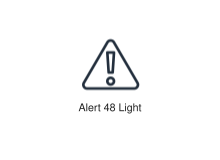
<div class="xal-ref-path">etc/resources/aws/svg/Resource-Icons/Res_General-Icons/Res_48_Light/Res_Alert_48_Light.svg<br>2216 bytes</div>
</div>
</div>
{{#endtab}}
{{#tab name="Code"}}

```xml
{{#include ../samples/icons/Resource-Icons/res-alert-48-light-78aa769e.xal}}
```

{{#endtab}}
{{#endtabs}}

</div>
<div class="xal-ref-card">

{{#tabs name="svg-ref-0181"}}
{{#tab name="Preview"}}
<div class="xal-ref-preview">
<div>

<div class="xal-ref-path">etc/resources/aws/svg/Resource-Icons/Res_General-Icons/Res_48_Light/Res_Authenticated-User_48_Light.svg<br>1799 bytes</div>
</div>
</div>
{{#endtab}}
{{#tab name="Code"}}

```xml
{{#include ../samples/icons/Resource-Icons/res-authenticated-user-48-light-7dd3cc7e.xal}}
```

{{#endtab}}
{{#endtabs}}

</div>
<div class="xal-ref-card">

{{#tabs name="svg-ref-0182"}}
{{#tab name="Preview"}}
<div class="xal-ref-preview">
<div>

<div class="xal-ref-path">etc/resources/aws/svg/Resource-Icons/Res_General-Icons/Res_48_Light/Res_Camera_48_Light.svg<br>1961 bytes</div>
</div>
</div>
{{#endtab}}
{{#tab name="Code"}}

```xml
{{#include ../samples/icons/Resource-Icons/res-camera-48-light-365d9dff.xal}}
```

{{#endtab}}
{{#endtabs}}

</div>
<div class="xal-ref-card">

{{#tabs name="svg-ref-0183"}}
{{#tab name="Preview"}}
<div class="xal-ref-preview">
<div>

<div class="xal-ref-path">etc/resources/aws/svg/Resource-Icons/Res_General-Icons/Res_48_Light/Res_Chat_48_Light.svg<br>2239 bytes</div>
</div>
</div>
{{#endtab}}
{{#tab name="Code"}}

```xml
{{#include ../samples/icons/Resource-Icons/res-chat-48-light-1381281d.xal}}
```

{{#endtab}}
{{#endtabs}}

</div>
<div class="xal-ref-card">

{{#tabs name="svg-ref-0184"}}
{{#tab name="Preview"}}
<div class="xal-ref-preview">
<div>
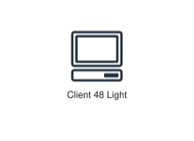
<div class="xal-ref-path">etc/resources/aws/svg/Resource-Icons/Res_General-Icons/Res_48_Light/Res_Client_48_Light.svg<br>1880 bytes</div>
</div>
</div>
{{#endtab}}
{{#tab name="Code"}}

```xml
{{#include ../samples/icons/Resource-Icons/res-client-48-light-55781171.xal}}
```

{{#endtab}}
{{#endtabs}}

</div>
<div class="xal-ref-card">

{{#tabs name="svg-ref-0185"}}
{{#tab name="Preview"}}
<div class="xal-ref-preview">
<div>
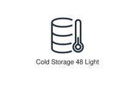
<div class="xal-ref-path">etc/resources/aws/svg/Resource-Icons/Res_General-Icons/Res_48_Light/Res_Cold-Storage_48_Light.svg<br>2407 bytes</div>
</div>
</div>
{{#endtab}}
{{#tab name="Code"}}

```xml
{{#include ../samples/icons/Resource-Icons/res-cold-storage-48-light-cefd270c.xal}}
```

{{#endtab}}
{{#endtabs}}

</div>
<div class="xal-ref-card">

{{#tabs name="svg-ref-0186"}}
{{#tab name="Preview"}}
<div class="xal-ref-preview">
<div>

<div class="xal-ref-path">etc/resources/aws/svg/Resource-Icons/Res_General-Icons/Res_48_Light/Res_Credentials_48_Light.svg<br>1451 bytes</div>
</div>
</div>
{{#endtab}}
{{#tab name="Code"}}

```xml
{{#include ../samples/icons/Resource-Icons/res-credentials-48-light-4c55919f.xal}}
```

{{#endtab}}
{{#endtabs}}

</div>
<div class="xal-ref-card">

{{#tabs name="svg-ref-0187"}}
{{#tab name="Preview"}}
<div class="xal-ref-preview">
<div>
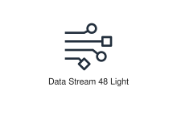
<div class="xal-ref-path">etc/resources/aws/svg/Resource-Icons/Res_General-Icons/Res_48_Light/Res_Data-Stream_48_Light.svg<br>2004 bytes</div>
</div>
</div>
{{#endtab}}
{{#tab name="Code"}}

```xml
{{#include ../samples/icons/Resource-Icons/res-data-stream-48-light-b425c1b8.xal}}
```

{{#endtab}}
{{#endtabs}}

</div>
<div class="xal-ref-card">

{{#tabs name="svg-ref-0188"}}
{{#tab name="Preview"}}
<div class="xal-ref-preview">
<div>
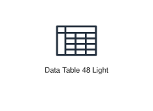
<div class="xal-ref-path">etc/resources/aws/svg/Resource-Icons/Res_General-Icons/Res_48_Light/Res_Data-Table_48_Light.svg<br>1134 bytes</div>
</div>
</div>
{{#endtab}}
{{#tab name="Code"}}

```xml
{{#include ../samples/icons/Resource-Icons/res-data-table-48-light-5a481c71.xal}}
```

{{#endtab}}
{{#endtabs}}

</div>
<div class="xal-ref-card">

{{#tabs name="svg-ref-0189"}}
{{#tab name="Preview"}}
<div class="xal-ref-preview">
<div>
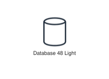
<div class="xal-ref-path">etc/resources/aws/svg/Resource-Icons/Res_General-Icons/Res_48_Light/Res_Database_48_Light.svg<br>1457 bytes</div>
</div>
</div>
{{#endtab}}
{{#tab name="Code"}}

```xml
{{#include ../samples/icons/Resource-Icons/res-database-48-light-dc028bfa.xal}}
```

{{#endtab}}
{{#endtabs}}

</div>
<div class="xal-ref-card">

{{#tabs name="svg-ref-0190"}}
{{#tab name="Preview"}}
<div class="xal-ref-preview">
<div>
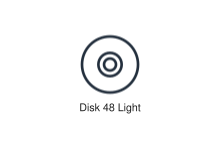
<div class="xal-ref-path">etc/resources/aws/svg/Resource-Icons/Res_General-Icons/Res_48_Light/Res_Disk_48_Light.svg<br>1486 bytes</div>
</div>
</div>
{{#endtab}}
{{#tab name="Code"}}

```xml
{{#include ../samples/icons/Resource-Icons/res-disk-48-light-41b96383.xal}}
```

{{#endtab}}
{{#endtabs}}

</div>
<div class="xal-ref-card">

{{#tabs name="svg-ref-0191"}}
{{#tab name="Preview"}}
<div class="xal-ref-preview">
<div>
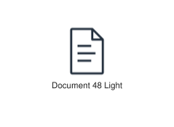
<div class="xal-ref-path">etc/resources/aws/svg/Resource-Icons/Res_General-Icons/Res_48_Light/Res_Document_48_Light.svg<br>894 bytes</div>
</div>
</div>
{{#endtab}}
{{#tab name="Code"}}

```xml
{{#include ../samples/icons/Resource-Icons/res-document-48-light-e8efb4c9.xal}}
```

{{#endtab}}
{{#endtabs}}

</div>
<div class="xal-ref-card">

{{#tabs name="svg-ref-0192"}}
{{#tab name="Preview"}}
<div class="xal-ref-preview">
<div>

<div class="xal-ref-path">etc/resources/aws/svg/Resource-Icons/Res_General-Icons/Res_48_Light/Res_Documents_48_Light.svg<br>1253 bytes</div>
</div>
</div>
{{#endtab}}
{{#tab name="Code"}}

```xml
{{#include ../samples/icons/Resource-Icons/res-documents-48-light-1c357036.xal}}
```

{{#endtab}}
{{#endtabs}}

</div>
<div class="xal-ref-card">

{{#tabs name="svg-ref-0193"}}
{{#tab name="Preview"}}
<div class="xal-ref-preview">
<div>

<div class="xal-ref-path">etc/resources/aws/svg/Resource-Icons/Res_General-Icons/Res_48_Light/Res_Email_48_Light.svg<br>1070 bytes</div>
</div>
</div>
{{#endtab}}
{{#tab name="Code"}}

```xml
{{#include ../samples/icons/Resource-Icons/res-email-48-light-efe83db7.xal}}
```

{{#endtab}}
{{#endtabs}}

</div>
<div class="xal-ref-card">

{{#tabs name="svg-ref-0194"}}
{{#tab name="Preview"}}
<div class="xal-ref-preview">
<div>

<div class="xal-ref-path">etc/resources/aws/svg/Resource-Icons/Res_General-Icons/Res_48_Light/Res_Firewall_48_Light.svg<br>3586 bytes</div>
</div>
</div>
{{#endtab}}
{{#tab name="Code"}}

```xml
{{#include ../samples/icons/Resource-Icons/res-firewall-48-light-6e2a5643.xal}}
```

{{#endtab}}
{{#endtabs}}

</div>
<div class="xal-ref-card">

{{#tabs name="svg-ref-0195"}}
{{#tab name="Preview"}}
<div class="xal-ref-preview">
<div>
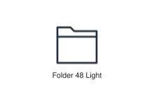
<div class="xal-ref-path">etc/resources/aws/svg/Resource-Icons/Res_General-Icons/Res_48_Light/Res_Folder_48_Light.svg<br>846 bytes</div>
</div>
</div>
{{#endtab}}
{{#tab name="Code"}}

```xml
{{#include ../samples/icons/Resource-Icons/res-folder-48-light-fd84d1fc.xal}}
```

{{#endtab}}
{{#endtabs}}

</div>
<div class="xal-ref-card">

{{#tabs name="svg-ref-0196"}}
{{#tab name="Preview"}}
<div class="xal-ref-preview">
<div>
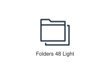
<div class="xal-ref-path">etc/resources/aws/svg/Resource-Icons/Res_General-Icons/Res_48_Light/Res_Folders_48_Light.svg<br>1005 bytes</div>
</div>
</div>
{{#endtab}}
{{#tab name="Code"}}

```xml
{{#include ../samples/icons/Resource-Icons/res-folders-48-light-4a93df70.xal}}
```

{{#endtab}}
{{#endtabs}}

</div>
<div class="xal-ref-card">

{{#tabs name="svg-ref-0197"}}
{{#tab name="Preview"}}
<div class="xal-ref-preview">
<div>
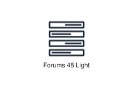
<div class="xal-ref-path">etc/resources/aws/svg/Resource-Icons/Res_General-Icons/Res_48_Light/Res_Forums_48_Light.svg<br>1925 bytes</div>
</div>
</div>
{{#endtab}}
{{#tab name="Code"}}

```xml
{{#include ../samples/icons/Resource-Icons/res-forums-48-light-b13832e9.xal}}
```

{{#endtab}}
{{#endtabs}}

</div>
<div class="xal-ref-card">

{{#tabs name="svg-ref-0198"}}
{{#tab name="Preview"}}
<div class="xal-ref-preview">
<div>
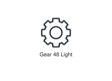
<div class="xal-ref-path">etc/resources/aws/svg/Resource-Icons/Res_General-Icons/Res_48_Light/Res_Gear_48_Light.svg<br>3712 bytes</div>
</div>
</div>
{{#endtab}}
{{#tab name="Code"}}

```xml
{{#include ../samples/icons/Resource-Icons/res-gear-48-light-9101063d.xal}}
```

{{#endtab}}
{{#endtabs}}

</div>
<div class="xal-ref-card">

{{#tabs name="svg-ref-0199"}}
{{#tab name="Preview"}}
<div class="xal-ref-preview">
<div>
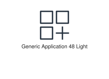
<div class="xal-ref-path">etc/resources/aws/svg/Resource-Icons/Res_General-Icons/Res_48_Light/Res_Generic-Application_48_Light.svg<br>1083 bytes</div>
</div>
</div>
{{#endtab}}
{{#tab name="Code"}}

```xml
{{#include ../samples/icons/Resource-Icons/res-generic-application-48-light-1960799c.xal}}
```

{{#endtab}}
{{#endtabs}}

</div>
<div class="xal-ref-card">

{{#tabs name="svg-ref-0200"}}
{{#tab name="Preview"}}
<div class="xal-ref-preview">
<div>
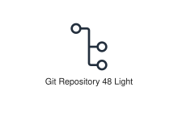
<div class="xal-ref-path">etc/resources/aws/svg/Resource-Icons/Res_General-Icons/Res_48_Light/Res_Git-Repository_48_Light.svg<br>1633 bytes</div>
</div>
</div>
{{#endtab}}
{{#tab name="Code"}}

```xml
{{#include ../samples/icons/Resource-Icons/res-git-repository-48-light-9b05babe.xal}}
```

{{#endtab}}
{{#endtabs}}

</div>
<div class="xal-ref-card">

{{#tabs name="svg-ref-0201"}}
{{#tab name="Preview"}}
<div class="xal-ref-preview">
<div>
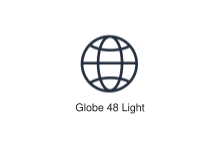
<div class="xal-ref-path">etc/resources/aws/svg/Resource-Icons/Res_General-Icons/Res_48_Light/Res_Globe_48_Light.svg<br>2710 bytes</div>
</div>
</div>
{{#endtab}}
{{#tab name="Code"}}

```xml
{{#include ../samples/icons/Resource-Icons/res-globe-48-light-3dba3262.xal}}
```

{{#endtab}}
{{#endtabs}}

</div>
<div class="xal-ref-card">

{{#tabs name="svg-ref-0202"}}
{{#tab name="Preview"}}
<div class="xal-ref-preview">
<div>
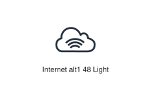
<div class="xal-ref-path">etc/resources/aws/svg/Resource-Icons/Res_General-Icons/Res_48_Light/Res_Internet-alt1_48_Light.svg<br>3030 bytes</div>
</div>
</div>
{{#endtab}}
{{#tab name="Code"}}

```xml
{{#include ../samples/icons/Resource-Icons/res-internet-alt1-48-light-b6ee27a2.xal}}
```

{{#endtab}}
{{#endtabs}}

</div>
<div class="xal-ref-card">

{{#tabs name="svg-ref-0203"}}
{{#tab name="Preview"}}
<div class="xal-ref-preview">
<div>
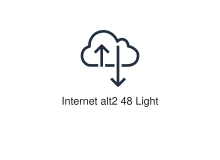
<div class="xal-ref-path">etc/resources/aws/svg/Resource-Icons/Res_General-Icons/Res_48_Light/Res_Internet-alt2_48_Light.svg<br>2986 bytes</div>
</div>
</div>
{{#endtab}}
{{#tab name="Code"}}

```xml
{{#include ../samples/icons/Resource-Icons/res-internet-alt2-48-light-ca8f0279.xal}}
```

{{#endtab}}
{{#endtabs}}

</div>
<div class="xal-ref-card">

{{#tabs name="svg-ref-0204"}}
{{#tab name="Preview"}}
<div class="xal-ref-preview">
<div>
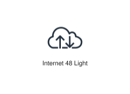
<div class="xal-ref-path">etc/resources/aws/svg/Resource-Icons/Res_General-Icons/Res_48_Light/Res_Internet_48_Light.svg<br>2995 bytes</div>
</div>
</div>
{{#endtab}}
{{#tab name="Code"}}

```xml
{{#include ../samples/icons/Resource-Icons/res-internet-48-light-077aca6e.xal}}
```

{{#endtab}}
{{#endtabs}}

</div>
<div class="xal-ref-card">

{{#tabs name="svg-ref-0205"}}
{{#tab name="Preview"}}
<div class="xal-ref-preview">
<div>
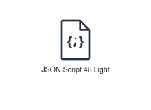
<div class="xal-ref-path">etc/resources/aws/svg/Resource-Icons/Res_General-Icons/Res_48_Light/Res_JSON-Script_48_Light.svg<br>3055 bytes</div>
</div>
</div>
{{#endtab}}
{{#tab name="Code"}}

```xml
{{#include ../samples/icons/Resource-Icons/res-json-script-48-light-1f480d60.xal}}
```

{{#endtab}}
{{#endtabs}}

</div>
<div class="xal-ref-card">

{{#tabs name="svg-ref-0206"}}
{{#tab name="Preview"}}
<div class="xal-ref-preview">
<div>
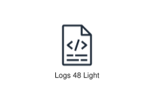
<div class="xal-ref-path">etc/resources/aws/svg/Resource-Icons/Res_General-Icons/Res_48_Light/Res_Logs_48_Light.svg<br>1345 bytes</div>
</div>
</div>
{{#endtab}}
{{#tab name="Code"}}

```xml
{{#include ../samples/icons/Resource-Icons/res-logs-48-light-6fcd9d8f.xal}}
```

{{#endtab}}
{{#endtabs}}

</div>
<div class="xal-ref-card">

{{#tabs name="svg-ref-0207"}}
{{#tab name="Preview"}}
<div class="xal-ref-preview">
<div>
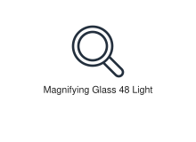
<div class="xal-ref-path">etc/resources/aws/svg/Resource-Icons/Res_General-Icons/Res_48_Light/Res_Magnifying-Glass_48_Light.svg<br>1528 bytes</div>
</div>
</div>
{{#endtab}}
{{#tab name="Code"}}

```xml
{{#include ../samples/icons/Resource-Icons/res-magnifying-glass-48-light-bb7c3ac1.xal}}
```

{{#endtab}}
{{#endtabs}}

</div>
<div class="xal-ref-card">

{{#tabs name="svg-ref-0208"}}
{{#tab name="Preview"}}
<div class="xal-ref-preview">
<div>
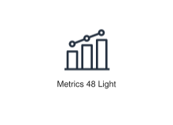
<div class="xal-ref-path">etc/resources/aws/svg/Resource-Icons/Res_General-Icons/Res_48_Light/Res_Metrics_48_Light.svg<br>2580 bytes</div>
</div>
</div>
{{#endtab}}
{{#tab name="Code"}}

```xml
{{#include ../samples/icons/Resource-Icons/res-metrics-48-light-d6d81472.xal}}
```

{{#endtab}}
{{#endtabs}}

</div>
<div class="xal-ref-card">

{{#tabs name="svg-ref-0209"}}
{{#tab name="Preview"}}
<div class="xal-ref-preview">
<div>
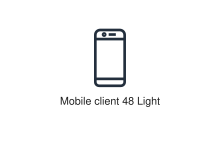
<div class="xal-ref-path">etc/resources/aws/svg/Resource-Icons/Res_General-Icons/Res_48_Light/Res_Mobile-client_48_Light.svg<br>1503 bytes</div>
</div>
</div>
{{#endtab}}
{{#tab name="Code"}}

```xml
{{#include ../samples/icons/Resource-Icons/res-mobile-client-48-light-b377691f.xal}}
```

{{#endtab}}
{{#endtabs}}

</div>
<div class="xal-ref-card">

{{#tabs name="svg-ref-0210"}}
{{#tab name="Preview"}}
<div class="xal-ref-preview">
<div>

<div class="xal-ref-path">etc/resources/aws/svg/Resource-Icons/Res_General-Icons/Res_48_Light/Res_Multimedia_48_Light.svg<br>4227 bytes</div>
</div>
</div>
{{#endtab}}
{{#tab name="Code"}}

```xml
{{#include ../samples/icons/Resource-Icons/res-multimedia-48-light-b4ba6ed6.xal}}
```

{{#endtab}}
{{#endtabs}}

</div>
<div class="xal-ref-card">

{{#tabs name="svg-ref-0211"}}
{{#tab name="Preview"}}
<div class="xal-ref-preview">
<div>

<div class="xal-ref-path">etc/resources/aws/svg/Resource-Icons/Res_General-Icons/Res_48_Light/Res_Office-building_48_Light.svg<br>2986 bytes</div>
</div>
</div>
{{#endtab}}
{{#tab name="Code"}}

```xml
{{#include ../samples/icons/Resource-Icons/res-office-building-48-light-1db758f9.xal}}
```

{{#endtab}}
{{#endtabs}}

</div>
<div class="xal-ref-card">

{{#tabs name="svg-ref-0212"}}
{{#tab name="Preview"}}
<div class="xal-ref-preview">
<div>
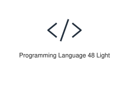
<div class="xal-ref-path">etc/resources/aws/svg/Resource-Icons/Res_General-Icons/Res_48_Light/Res_Programming-Language_48_Light.svg<br>976 bytes</div>
</div>
</div>
{{#endtab}}
{{#tab name="Code"}}

```xml
{{#include ../samples/icons/Resource-Icons/res-programming-language-48-light-0c12cc7a.xal}}
```

{{#endtab}}
{{#endtabs}}

</div>
<div class="xal-ref-card">

{{#tabs name="svg-ref-0213"}}
{{#tab name="Preview"}}
<div class="xal-ref-preview">
<div>
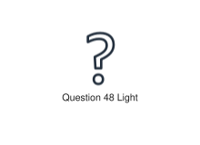
<div class="xal-ref-path">etc/resources/aws/svg/Resource-Icons/Res_General-Icons/Res_48_Light/Res_Question_48_Light.svg<br>2441 bytes</div>
</div>
</div>
{{#endtab}}
{{#tab name="Code"}}

```xml
{{#include ../samples/icons/Resource-Icons/res-question-48-light-d6e06efa.xal}}
```

{{#endtab}}
{{#endtabs}}

</div>
<div class="xal-ref-card">

{{#tabs name="svg-ref-0214"}}
{{#tab name="Preview"}}
<div class="xal-ref-preview">
<div>
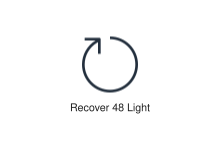
<div class="xal-ref-path">etc/resources/aws/svg/Resource-Icons/Res_General-Icons/Res_48_Light/Res_Recover_48_Light.svg<br>768 bytes</div>
</div>
</div>
{{#endtab}}
{{#tab name="Code"}}

```xml
{{#include ../samples/icons/Resource-Icons/res-recover-48-light-57dbcf45.xal}}
```

{{#endtab}}
{{#endtabs}}

</div>
<div class="xal-ref-card">

{{#tabs name="svg-ref-0215"}}
{{#tab name="Preview"}}
<div class="xal-ref-preview">
<div>
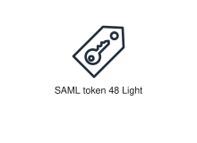
<div class="xal-ref-path">etc/resources/aws/svg/Resource-Icons/Res_General-Icons/Res_48_Light/Res_SAML-token_48_Light.svg<br>5278 bytes</div>
</div>
</div>
{{#endtab}}
{{#tab name="Code"}}

```xml
{{#include ../samples/icons/Resource-Icons/res-saml-token-48-light-97e619d0.xal}}
```

{{#endtab}}
{{#endtabs}}

</div>
<div class="xal-ref-card">

{{#tabs name="svg-ref-0216"}}
{{#tab name="Preview"}}
<div class="xal-ref-preview">
<div>
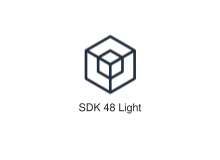
<div class="xal-ref-path">etc/resources/aws/svg/Resource-Icons/Res_General-Icons/Res_48_Light/Res_SDK_48_Light.svg<br>1629 bytes</div>
</div>
</div>
{{#endtab}}
{{#tab name="Code"}}

```xml
{{#include ../samples/icons/Resource-Icons/res-sdk-48-light-1579a67f.xal}}
```

{{#endtab}}
{{#endtabs}}

</div>
<div class="xal-ref-card">

{{#tabs name="svg-ref-0217"}}
{{#tab name="Preview"}}
<div class="xal-ref-preview">
<div>

<div class="xal-ref-path">etc/resources/aws/svg/Resource-Icons/Res_General-Icons/Res_48_Light/Res_SSL-padlock_48_Light.svg<br>3512 bytes</div>
</div>
</div>
{{#endtab}}
{{#tab name="Code"}}

```xml
{{#include ../samples/icons/Resource-Icons/res-ssl-padlock-48-light-b1aa55f8.xal}}
```

{{#endtab}}
{{#endtabs}}

</div>
<div class="xal-ref-card">

{{#tabs name="svg-ref-0218"}}
{{#tab name="Preview"}}
<div class="xal-ref-preview">
<div>
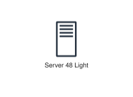
<div class="xal-ref-path">etc/resources/aws/svg/Resource-Icons/Res_General-Icons/Res_48_Light/Res_Server_48_Light.svg<br>1035 bytes</div>
</div>
</div>
{{#endtab}}
{{#tab name="Code"}}

```xml
{{#include ../samples/icons/Resource-Icons/res-server-48-light-f53bd8d5.xal}}
```

{{#endtab}}
{{#endtabs}}

</div>
<div class="xal-ref-card">

{{#tabs name="svg-ref-0219"}}
{{#tab name="Preview"}}
<div class="xal-ref-preview">
<div>
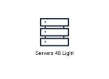
<div class="xal-ref-path">etc/resources/aws/svg/Resource-Icons/Res_General-Icons/Res_48_Light/Res_Servers_48_Light.svg<br>1380 bytes</div>
</div>
</div>
{{#endtab}}
{{#tab name="Code"}}

```xml
{{#include ../samples/icons/Resource-Icons/res-servers-48-light-0829f815.xal}}
```

{{#endtab}}
{{#endtabs}}

</div>
<div class="xal-ref-card">

{{#tabs name="svg-ref-0220"}}
{{#tab name="Preview"}}
<div class="xal-ref-preview">
<div>
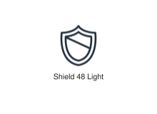
<div class="xal-ref-path">etc/resources/aws/svg/Resource-Icons/Res_General-Icons/Res_48_Light/Res_Shield_48_Light.svg<br>2108 bytes</div>
</div>
</div>
{{#endtab}}
{{#tab name="Code"}}

```xml
{{#include ../samples/icons/Resource-Icons/res-shield-48-light-83a67080.xal}}
```

{{#endtab}}
{{#endtabs}}

</div>
<div class="xal-ref-card">

{{#tabs name="svg-ref-0221"}}
{{#tab name="Preview"}}
<div class="xal-ref-preview">
<div>
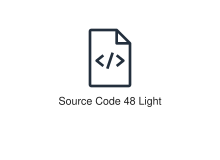
<div class="xal-ref-path">etc/resources/aws/svg/Resource-Icons/Res_General-Icons/Res_48_Light/Res_Source-Code_48_Light.svg<br>1377 bytes</div>
</div>
</div>
{{#endtab}}
{{#tab name="Code"}}

```xml
{{#include ../samples/icons/Resource-Icons/res-source-code-48-light-92f9afdd.xal}}
```

{{#endtab}}
{{#endtabs}}

</div>
<div class="xal-ref-card">

{{#tabs name="svg-ref-0222"}}
{{#tab name="Preview"}}
<div class="xal-ref-preview">
<div>
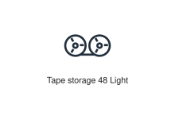
<div class="xal-ref-path">etc/resources/aws/svg/Resource-Icons/Res_General-Icons/Res_48_Light/Res_Tape-storage_48_Light.svg<br>2491 bytes</div>
</div>
</div>
{{#endtab}}
{{#tab name="Code"}}

```xml
{{#include ../samples/icons/Resource-Icons/res-tape-storage-48-light-36c9c216.xal}}
```

{{#endtab}}
{{#endtabs}}

</div>
<div class="xal-ref-card">

{{#tabs name="svg-ref-0223"}}
{{#tab name="Preview"}}
<div class="xal-ref-preview">
<div>
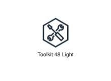
<div class="xal-ref-path">etc/resources/aws/svg/Resource-Icons/Res_General-Icons/Res_48_Light/Res_Toolkit_48_Light.svg<br>3343 bytes</div>
</div>
</div>
{{#endtab}}
{{#tab name="Code"}}

```xml
{{#include ../samples/icons/Resource-Icons/res-toolkit-48-light-b3d4f5ff.xal}}
```

{{#endtab}}
{{#endtabs}}

</div>
<div class="xal-ref-card">

{{#tabs name="svg-ref-0224"}}
{{#tab name="Preview"}}
<div class="xal-ref-preview">
<div>
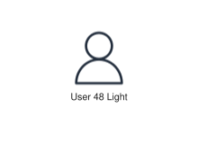
<div class="xal-ref-path">etc/resources/aws/svg/Resource-Icons/Res_General-Icons/Res_48_Light/Res_User_48_Light.svg<br>1114 bytes</div>
</div>
</div>
{{#endtab}}
{{#tab name="Code"}}

```xml
{{#include ../samples/icons/Resource-Icons/res-user-48-light-6da63d9e.xal}}
```

{{#endtab}}
{{#endtabs}}

</div>
<div class="xal-ref-card">

{{#tabs name="svg-ref-0225"}}
{{#tab name="Preview"}}
<div class="xal-ref-preview">
<div>
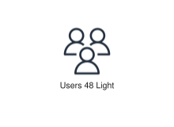
<div class="xal-ref-path">etc/resources/aws/svg/Resource-Icons/Res_General-Icons/Res_48_Light/Res_Users_48_Light.svg<br>2439 bytes</div>
</div>
</div>
{{#endtab}}
{{#tab name="Code"}}

```xml
{{#include ../samples/icons/Resource-Icons/res-users-48-light-e9bffde8.xal}}
```

{{#endtab}}
{{#endtabs}}

</div>
<div class="xal-ref-card">

{{#tabs name="svg-ref-0226"}}
{{#tab name="Preview"}}
<div class="xal-ref-preview">
<div>

<div class="xal-ref-path">etc/resources/aws/svg/Resource-Icons/Res_IoT/Res_AWS-IoT-Analytics_Channel_48.svg<br>3006 bytes</div>
</div>
</div>
{{#endtab}}
{{#tab name="Code"}}

```xml
{{#include ../samples/icons/Resource-Icons/res-aws-iot-analytics-channel-48-5116961c.xal}}
```

{{#endtab}}
{{#endtabs}}

</div>
<div class="xal-ref-card">

{{#tabs name="svg-ref-0227"}}
{{#tab name="Preview"}}
<div class="xal-ref-preview">
<div>
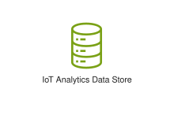
<div class="xal-ref-path">etc/resources/aws/svg/Resource-Icons/Res_IoT/Res_AWS-IoT-Analytics_Data-Store_48.svg<br>1757 bytes</div>
</div>
</div>
{{#endtab}}
{{#tab name="Code"}}

```xml
{{#include ../samples/icons/Resource-Icons/res-aws-iot-analytics-data-store-48-a48d45c6.xal}}
```

{{#endtab}}
{{#endtabs}}

</div>
<div class="xal-ref-card">

{{#tabs name="svg-ref-0228"}}
{{#tab name="Preview"}}
<div class="xal-ref-preview">
<div>

<div class="xal-ref-path">etc/resources/aws/svg/Resource-Icons/Res_IoT/Res_AWS-IoT-Analytics_Dataset_48.svg<br>1486 bytes</div>
</div>
</div>
{{#endtab}}
{{#tab name="Code"}}

```xml
{{#include ../samples/icons/Resource-Icons/res-aws-iot-analytics-dataset-48-c90378d8.xal}}
```

{{#endtab}}
{{#endtabs}}

</div>
<div class="xal-ref-card">

{{#tabs name="svg-ref-0229"}}
{{#tab name="Preview"}}
<div class="xal-ref-preview">
<div>

<div class="xal-ref-path">etc/resources/aws/svg/Resource-Icons/Res_IoT/Res_AWS-IoT-Analytics_Notebook_48.svg<br>1649 bytes</div>
</div>
</div>
{{#endtab}}
{{#tab name="Code"}}

```xml
{{#include ../samples/icons/Resource-Icons/res-aws-iot-analytics-notebook-48-0c69d72a.xal}}
```

{{#endtab}}
{{#endtabs}}

</div>
<div class="xal-ref-card">

{{#tabs name="svg-ref-0230"}}
{{#tab name="Preview"}}
<div class="xal-ref-preview">
<div>
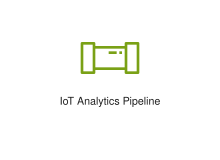
<div class="xal-ref-path">etc/resources/aws/svg/Resource-Icons/Res_IoT/Res_AWS-IoT-Analytics_Pipeline_48.svg<br>1013 bytes</div>
</div>
</div>
{{#endtab}}
{{#tab name="Code"}}

```xml
{{#include ../samples/icons/Resource-Icons/res-aws-iot-analytics-pipeline-48-c09a2c00.xal}}
```

{{#endtab}}
{{#endtabs}}

</div>
<div class="xal-ref-card">

{{#tabs name="svg-ref-0231"}}
{{#tab name="Preview"}}
<div class="xal-ref-preview">
<div>

<div class="xal-ref-path">etc/resources/aws/svg/Resource-Icons/Res_IoT/Res_AWS-IoT-Core_Device-Advisor_48.svg<br>4960 bytes</div>
</div>
</div>
{{#endtab}}
{{#tab name="Code"}}

```xml
{{#include ../samples/icons/Resource-Icons/res-aws-iot-core-device-advisor-48-db178f03.xal}}
```

{{#endtab}}
{{#endtabs}}

</div>
<div class="xal-ref-card">

{{#tabs name="svg-ref-0232"}}
{{#tab name="Preview"}}
<div class="xal-ref-preview">
<div>

<div class="xal-ref-path">etc/resources/aws/svg/Resource-Icons/Res_IoT/Res_AWS-IoT-Core_Device-Location_48.svg<br>2895 bytes</div>
</div>
</div>
{{#endtab}}
{{#tab name="Code"}}

```xml
{{#include ../samples/icons/Resource-Icons/res-aws-iot-core-device-location-48-c97f6856.xal}}
```

{{#endtab}}
{{#endtabs}}

</div>
<div class="xal-ref-card">

{{#tabs name="svg-ref-0233"}}
{{#tab name="Preview"}}
<div class="xal-ref-preview">
<div>

<div class="xal-ref-path">etc/resources/aws/svg/Resource-Icons/Res_IoT/Res_AWS-IoT-Device-Defender_IoT-Device-Jobs_48.svg<br>4582 bytes</div>
</div>
</div>
{{#endtab}}
{{#tab name="Code"}}

```xml
{{#include ../samples/icons/Resource-Icons/res-aws-iot-device-defender-iot-device-jobs-48-6838109e.xal}}
```

{{#endtab}}
{{#endtabs}}

</div>
<div class="xal-ref-card">

{{#tabs name="svg-ref-0234"}}
{{#tab name="Preview"}}
<div class="xal-ref-preview">
<div>

<div class="xal-ref-path">etc/resources/aws/svg/Resource-Icons/Res_IoT/Res_AWS-IoT-Device-Management_Fleet-Hub_48.svg<br>4327 bytes</div>
</div>
</div>
{{#endtab}}
{{#tab name="Code"}}

```xml
{{#include ../samples/icons/Resource-Icons/res-aws-iot-device-management-fleet-hub-48-4c68d735.xal}}
```

{{#endtab}}
{{#endtabs}}

</div>
<div class="xal-ref-card">

{{#tabs name="svg-ref-0235"}}
{{#tab name="Preview"}}
<div class="xal-ref-preview">
<div>

<div class="xal-ref-path">etc/resources/aws/svg/Resource-Icons/Res_IoT/Res_AWS-IoT-Device-Tester_48.svg<br>4578 bytes</div>
</div>
</div>
{{#endtab}}
{{#tab name="Code"}}

```xml
{{#include ../samples/icons/Resource-Icons/res-aws-iot-device-tester-48-d6032e70.xal}}
```

{{#endtab}}
{{#endtabs}}

</div>
<div class="xal-ref-card">

{{#tabs name="svg-ref-0236"}}
{{#tab name="Preview"}}
<div class="xal-ref-preview">
<div>
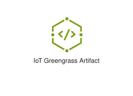
<div class="xal-ref-path">etc/resources/aws/svg/Resource-Icons/Res_IoT/Res_AWS-IoT-Greengrass_Artifact_48.svg<br>1926 bytes</div>
</div>
</div>
{{#endtab}}
{{#tab name="Code"}}

```xml
{{#include ../samples/icons/Resource-Icons/res-aws-iot-greengrass-artifact-48-b36160af.xal}}
```

{{#endtab}}
{{#endtabs}}

</div>
<div class="xal-ref-card">

{{#tabs name="svg-ref-0237"}}
{{#tab name="Preview"}}
<div class="xal-ref-preview">
<div>

<div class="xal-ref-path">etc/resources/aws/svg/Resource-Icons/Res_IoT/Res_AWS-IoT-Greengrass_Component-Machine-Learning_48.svg<br>4167 bytes</div>
</div>
</div>
{{#endtab}}
{{#tab name="Code"}}

```xml
{{#include ../samples/icons/Resource-Icons/res-aws-iot-greengrass-component-machine-learning-48-a24ef3f8.xal}}
```

{{#endtab}}
{{#endtabs}}

</div>
<div class="xal-ref-card">

{{#tabs name="svg-ref-0238"}}
{{#tab name="Preview"}}
<div class="xal-ref-preview">
<div>

<div class="xal-ref-path">etc/resources/aws/svg/Resource-Icons/Res_IoT/Res_AWS-IoT-Greengrass_Component-Nucleus_48.svg<br>4764 bytes</div>
</div>
</div>
{{#endtab}}
{{#tab name="Code"}}

```xml
{{#include ../samples/icons/Resource-Icons/res-aws-iot-greengrass-component-nucleus-48-a1469e15.xal}}
```

{{#endtab}}
{{#endtabs}}

</div>
<div class="xal-ref-card">

{{#tabs name="svg-ref-0239"}}
{{#tab name="Preview"}}
<div class="xal-ref-preview">
<div>

<div class="xal-ref-path">etc/resources/aws/svg/Resource-Icons/Res_IoT/Res_AWS-IoT-Greengrass_Component-Private_48.svg<br>3225 bytes</div>
</div>
</div>
{{#endtab}}
{{#tab name="Code"}}

```xml
{{#include ../samples/icons/Resource-Icons/res-aws-iot-greengrass-component-private-48-7336091a.xal}}
```

{{#endtab}}
{{#endtabs}}

</div>
<div class="xal-ref-card">

{{#tabs name="svg-ref-0240"}}
{{#tab name="Preview"}}
<div class="xal-ref-preview">
<div>

<div class="xal-ref-path">etc/resources/aws/svg/Resource-Icons/Res_IoT/Res_AWS-IoT-Greengrass_Component-Public_48.svg<br>3205 bytes</div>
</div>
</div>
{{#endtab}}
{{#tab name="Code"}}

```xml
{{#include ../samples/icons/Resource-Icons/res-aws-iot-greengrass-component-public-48-e2e78595.xal}}
```

{{#endtab}}
{{#endtabs}}

</div>
<div class="xal-ref-card">

{{#tabs name="svg-ref-0241"}}
{{#tab name="Preview"}}
<div class="xal-ref-preview">
<div>
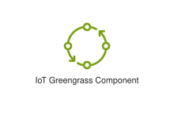
<div class="xal-ref-path">etc/resources/aws/svg/Resource-Icons/Res_IoT/Res_AWS-IoT-Greengrass_Component_48.svg<br>2331 bytes</div>
</div>
</div>
{{#endtab}}
{{#tab name="Code"}}

```xml
{{#include ../samples/icons/Resource-Icons/res-aws-iot-greengrass-component-48-60afe76c.xal}}
```

{{#endtab}}
{{#endtabs}}

</div>
<div class="xal-ref-card">

{{#tabs name="svg-ref-0242"}}
{{#tab name="Preview"}}
<div class="xal-ref-preview">
<div>
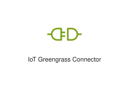
<div class="xal-ref-path">etc/resources/aws/svg/Resource-Icons/Res_IoT/Res_AWS-IoT-Greengrass_Connector_48.svg<br>1604 bytes</div>
</div>
</div>
{{#endtab}}
{{#tab name="Code"}}

```xml
{{#include ../samples/icons/Resource-Icons/res-aws-iot-greengrass-connector-48-6af43aa9.xal}}
```

{{#endtab}}
{{#endtabs}}

</div>
<div class="xal-ref-card">

{{#tabs name="svg-ref-0243"}}
{{#tab name="Preview"}}
<div class="xal-ref-preview">
<div>

<div class="xal-ref-path">etc/resources/aws/svg/Resource-Icons/Res_IoT/Res_AWS-IoT-Greengrass_Interprocess-Communication_48.svg<br>6263 bytes</div>
</div>
</div>
{{#endtab}}
{{#tab name="Code"}}

```xml
{{#include ../samples/icons/Resource-Icons/res-aws-iot-greengrass-interprocess-communication-48-67c4cf5e.xal}}
```

{{#endtab}}
{{#endtabs}}

</div>
<div class="xal-ref-card">

{{#tabs name="svg-ref-0244"}}
{{#tab name="Preview"}}
<div class="xal-ref-preview">
<div>
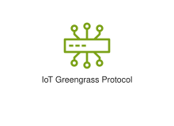
<div class="xal-ref-path">etc/resources/aws/svg/Resource-Icons/Res_IoT/Res_AWS-IoT-Greengrass_Protocol_48.svg<br>2987 bytes</div>
</div>
</div>
{{#endtab}}
{{#tab name="Code"}}

```xml
{{#include ../samples/icons/Resource-Icons/res-aws-iot-greengrass-protocol-48-b953e651.xal}}
```

{{#endtab}}
{{#endtabs}}

</div>
<div class="xal-ref-card">

{{#tabs name="svg-ref-0245"}}
{{#tab name="Preview"}}
<div class="xal-ref-preview">
<div>
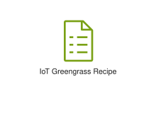
<div class="xal-ref-path">etc/resources/aws/svg/Resource-Icons/Res_IoT/Res_AWS-IoT-Greengrass_Recipe_48.svg<br>1144 bytes</div>
</div>
</div>
{{#endtab}}
{{#tab name="Code"}}

```xml
{{#include ../samples/icons/Resource-Icons/res-aws-iot-greengrass-recipe-48-dfec76df.xal}}
```

{{#endtab}}
{{#endtabs}}

</div>
<div class="xal-ref-card">

{{#tabs name="svg-ref-0246"}}
{{#tab name="Preview"}}
<div class="xal-ref-preview">
<div>

<div class="xal-ref-path">etc/resources/aws/svg/Resource-Icons/Res_IoT/Res_AWS-IoT-Greengrass_Stream-Manager_48.svg<br>1539 bytes</div>
</div>
</div>
{{#endtab}}
{{#tab name="Code"}}

```xml
{{#include ../samples/icons/Resource-Icons/res-aws-iot-greengrass-stream-manager-48-b366fea6.xal}}
```

{{#endtab}}
{{#endtabs}}

</div>
<div class="xal-ref-card">

{{#tabs name="svg-ref-0247"}}
{{#tab name="Preview"}}
<div class="xal-ref-preview">
<div>

<div class="xal-ref-path">etc/resources/aws/svg/Resource-Icons/Res_IoT/Res_AWS-IoT-Hardware-Board_48.svg<br>2826 bytes</div>
</div>
</div>
{{#endtab}}
{{#tab name="Code"}}

```xml
{{#include ../samples/icons/Resource-Icons/res-aws-iot-hardware-board-48-27bd2510.xal}}
```

{{#endtab}}
{{#endtabs}}

</div>
<div class="xal-ref-card">

{{#tabs name="svg-ref-0248"}}
{{#tab name="Preview"}}
<div class="xal-ref-preview">
<div>
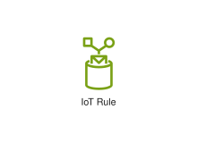
<div class="xal-ref-path">etc/resources/aws/svg/Resource-Icons/Res_IoT/Res_AWS-IoT-Rule_48.svg<br>2875 bytes</div>
</div>
</div>
{{#endtab}}
{{#tab name="Code"}}

```xml
{{#include ../samples/icons/Resource-Icons/res-aws-iot-rule-48-d2ee03a5.xal}}
```

{{#endtab}}
{{#endtabs}}

</div>
<div class="xal-ref-card">

{{#tabs name="svg-ref-0249"}}
{{#tab name="Preview"}}
<div class="xal-ref-preview">
<div>
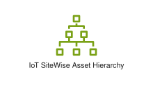
<div class="xal-ref-path">etc/resources/aws/svg/Resource-Icons/Res_IoT/Res_AWS-IoT-SiteWise_Asset-Hierarchy_48.svg<br>1871 bytes</div>
</div>
</div>
{{#endtab}}
{{#tab name="Code"}}

```xml
{{#include ../samples/icons/Resource-Icons/res-aws-iot-sitewise-asset-hierarchy-48-54826679.xal}}
```

{{#endtab}}
{{#endtabs}}

</div>
<div class="xal-ref-card">

{{#tabs name="svg-ref-0250"}}
{{#tab name="Preview"}}
<div class="xal-ref-preview">
<div>
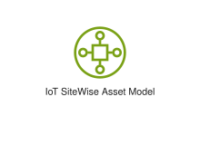
<div class="xal-ref-path">etc/resources/aws/svg/Resource-Icons/Res_IoT/Res_AWS-IoT-SiteWise_Asset-Model_48.svg<br>1987 bytes</div>
</div>
</div>
{{#endtab}}
{{#tab name="Code"}}

```xml
{{#include ../samples/icons/Resource-Icons/res-aws-iot-sitewise-asset-model-48-c12d663e.xal}}
```

{{#endtab}}
{{#endtabs}}

</div>
<div class="xal-ref-card">

{{#tabs name="svg-ref-0251"}}
{{#tab name="Preview"}}
<div class="xal-ref-preview">
<div>
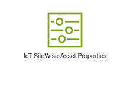
<div class="xal-ref-path">etc/resources/aws/svg/Resource-Icons/Res_IoT/Res_AWS-IoT-SiteWise_Asset-Properties_48.svg<br>1587 bytes</div>
</div>
</div>
{{#endtab}}
{{#tab name="Code"}}

```xml
{{#include ../samples/icons/Resource-Icons/res-aws-iot-sitewise-asset-properties-48-d2b8b0ad.xal}}
```

{{#endtab}}
{{#endtabs}}

</div>
<div class="xal-ref-card">

{{#tabs name="svg-ref-0252"}}
{{#tab name="Preview"}}
<div class="xal-ref-preview">
<div>

<div class="xal-ref-path">etc/resources/aws/svg/Resource-Icons/Res_IoT/Res_AWS-IoT-SiteWise_Asset_48.svg<br>4114 bytes</div>
</div>
</div>
{{#endtab}}
{{#tab name="Code"}}

```xml
{{#include ../samples/icons/Resource-Icons/res-aws-iot-sitewise-asset-48-a730a301.xal}}
```

{{#endtab}}
{{#endtabs}}

</div>
<div class="xal-ref-card">

{{#tabs name="svg-ref-0253"}}
{{#tab name="Preview"}}
<div class="xal-ref-preview">
<div>

<div class="xal-ref-path">etc/resources/aws/svg/Resource-Icons/Res_IoT/Res_AWS-IoT-SiteWise_Data-Streams_48.svg<br>1037 bytes</div>
</div>
</div>
{{#endtab}}
{{#tab name="Code"}}

```xml
{{#include ../samples/icons/Resource-Icons/res-aws-iot-sitewise-data-streams-48-e60f2f39.xal}}
```

{{#endtab}}
{{#endtabs}}

</div>
<div class="xal-ref-card">

{{#tabs name="svg-ref-0254"}}
{{#tab name="Preview"}}
<div class="xal-ref-preview">
<div>
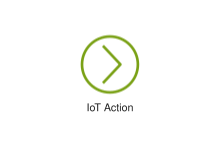
<div class="xal-ref-path">etc/resources/aws/svg/Resource-Icons/Res_IoT/Res_AWS-IoT_Action_48.svg<br>1060 bytes</div>
</div>
</div>
{{#endtab}}
{{#tab name="Code"}}

```xml
{{#include ../samples/icons/Resource-Icons/res-aws-iot-action-48-72cdfa9f.xal}}
```

{{#endtab}}
{{#endtabs}}

</div>
<div class="xal-ref-card">

{{#tabs name="svg-ref-0255"}}
{{#tab name="Preview"}}
<div class="xal-ref-preview">
<div>
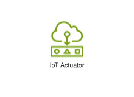
<div class="xal-ref-path">etc/resources/aws/svg/Resource-Icons/Res_IoT/Res_AWS-IoT_Actuator_48.svg<br>4408 bytes</div>
</div>
</div>
{{#endtab}}
{{#tab name="Code"}}

```xml
{{#include ../samples/icons/Resource-Icons/res-aws-iot-actuator-48-3c1940a3.xal}}
```

{{#endtab}}
{{#endtabs}}

</div>
<div class="xal-ref-card">

{{#tabs name="svg-ref-0256"}}
{{#tab name="Preview"}}
<div class="xal-ref-preview">
<div>

<div class="xal-ref-path">etc/resources/aws/svg/Resource-Icons/Res_IoT/Res_AWS-IoT_Alexa_Enabled-Device_48.svg<br>2354 bytes</div>
</div>
</div>
{{#endtab}}
{{#tab name="Code"}}

```xml
{{#include ../samples/icons/Resource-Icons/res-aws-iot-alexa-enabled-device-48-48b19ac5.xal}}
```

{{#endtab}}
{{#endtabs}}

</div>
<div class="xal-ref-card">

{{#tabs name="svg-ref-0257"}}
{{#tab name="Preview"}}
<div class="xal-ref-preview">
<div>

<div class="xal-ref-path">etc/resources/aws/svg/Resource-Icons/Res_IoT/Res_AWS-IoT_Alexa_Skill_48.svg<br>2007 bytes</div>
</div>
</div>
{{#endtab}}
{{#tab name="Code"}}

```xml
{{#include ../samples/icons/Resource-Icons/res-aws-iot-alexa-skill-48-8a1346e2.xal}}
```

{{#endtab}}
{{#endtabs}}

</div>
<div class="xal-ref-card">

{{#tabs name="svg-ref-0258"}}
{{#tab name="Preview"}}
<div class="xal-ref-preview">
<div>

<div class="xal-ref-path">etc/resources/aws/svg/Resource-Icons/Res_IoT/Res_AWS-IoT_Alexa_Voice-Service_48.svg<br>3207 bytes</div>
</div>
</div>
{{#endtab}}
{{#tab name="Code"}}

```xml
{{#include ../samples/icons/Resource-Icons/res-aws-iot-alexa-voice-service-48-11c50949.xal}}
```

{{#endtab}}
{{#endtabs}}

</div>
<div class="xal-ref-card">

{{#tabs name="svg-ref-0259"}}
{{#tab name="Preview"}}
<div class="xal-ref-preview">
<div>

<div class="xal-ref-path">etc/resources/aws/svg/Resource-Icons/Res_IoT/Res_AWS-IoT_Certificate_48.svg<br>3001 bytes</div>
</div>
</div>
{{#endtab}}
{{#tab name="Code"}}

```xml
{{#include ../samples/icons/Resource-Icons/res-aws-iot-certificate-48-5cb2bbd4.xal}}
```

{{#endtab}}
{{#endtabs}}

</div>
<div class="xal-ref-card">

{{#tabs name="svg-ref-0260"}}
{{#tab name="Preview"}}
<div class="xal-ref-preview">
<div>

<div class="xal-ref-path">etc/resources/aws/svg/Resource-Icons/Res_IoT/Res_AWS-IoT_Desired-State_48.svg<br>4698 bytes</div>
</div>
</div>
{{#endtab}}
{{#tab name="Code"}}

```xml
{{#include ../samples/icons/Resource-Icons/res-aws-iot-desired-state-48-ba5c4736.xal}}
```

{{#endtab}}
{{#endtabs}}

</div>
<div class="xal-ref-card">

{{#tabs name="svg-ref-0261"}}
{{#tab name="Preview"}}
<div class="xal-ref-preview">
<div>

<div class="xal-ref-path">etc/resources/aws/svg/Resource-Icons/Res_IoT/Res_AWS-IoT_Device-Gateway_48.svg<br>3408 bytes</div>
</div>
</div>
{{#endtab}}
{{#tab name="Code"}}

```xml
{{#include ../samples/icons/Resource-Icons/res-aws-iot-device-gateway-48-a1521276.xal}}
```

{{#endtab}}
{{#endtabs}}

</div>
<div class="xal-ref-card">

{{#tabs name="svg-ref-0262"}}
{{#tab name="Preview"}}
<div class="xal-ref-preview">
<div>

<div class="xal-ref-path">etc/resources/aws/svg/Resource-Icons/Res_IoT/Res_AWS-IoT_Echo_48.svg<br>2212 bytes</div>
</div>
</div>
{{#endtab}}
{{#tab name="Code"}}

```xml
{{#include ../samples/icons/Resource-Icons/res-aws-iot-echo-48-7bce71ed.xal}}
```

{{#endtab}}
{{#endtabs}}

</div>
<div class="xal-ref-card">

{{#tabs name="svg-ref-0263"}}
{{#tab name="Preview"}}
<div class="xal-ref-preview">
<div>

<div class="xal-ref-path">etc/resources/aws/svg/Resource-Icons/Res_IoT/Res_AWS-IoT_Fire-TV_Stick_48.svg<br>1732 bytes</div>
</div>
</div>
{{#endtab}}
{{#tab name="Code"}}

```xml
{{#include ../samples/icons/Resource-Icons/res-aws-iot-fire-tv-stick-48-87121ea2.xal}}
```

{{#endtab}}
{{#endtabs}}

</div>
<div class="xal-ref-card">

{{#tabs name="svg-ref-0264"}}
{{#tab name="Preview"}}
<div class="xal-ref-preview">
<div>

<div class="xal-ref-path">etc/resources/aws/svg/Resource-Icons/Res_IoT/Res_AWS-IoT_Fire_TV_48.svg<br>1582 bytes</div>
</div>
</div>
{{#endtab}}
{{#tab name="Code"}}

```xml
{{#include ../samples/icons/Resource-Icons/res-aws-iot-fire-tv-48-6aa6fc05.xal}}
```

{{#endtab}}
{{#endtabs}}

</div>
<div class="xal-ref-card">

{{#tabs name="svg-ref-0265"}}
{{#tab name="Preview"}}
<div class="xal-ref-preview">
<div>

<div class="xal-ref-path">etc/resources/aws/svg/Resource-Icons/Res_IoT/Res_AWS-IoT_HTTP2-Protocol_48.svg<br>3116 bytes</div>
</div>
</div>
{{#endtab}}
{{#tab name="Code"}}

```xml
{{#include ../samples/icons/Resource-Icons/res-aws-iot-http2-protocol-48-5fbc1e8e.xal}}
```

{{#endtab}}
{{#endtabs}}

</div>
<div class="xal-ref-card">

{{#tabs name="svg-ref-0266"}}
{{#tab name="Preview"}}
<div class="xal-ref-preview">
<div>

<div class="xal-ref-path">etc/resources/aws/svg/Resource-Icons/Res_IoT/Res_AWS-IoT_HTTP_Protocol_48.svg<br>2335 bytes</div>
</div>
</div>
{{#endtab}}
{{#tab name="Code"}}

```xml
{{#include ../samples/icons/Resource-Icons/res-aws-iot-http-protocol-48-19c73993.xal}}
```

{{#endtab}}
{{#endtabs}}

</div>
<div class="xal-ref-card">

{{#tabs name="svg-ref-0267"}}
{{#tab name="Preview"}}
<div class="xal-ref-preview">
<div>

<div class="xal-ref-path">etc/resources/aws/svg/Resource-Icons/Res_IoT/Res_AWS-IoT_Lambda_Function_48.svg<br>1831 bytes</div>
</div>
</div>
{{#endtab}}
{{#tab name="Code"}}

```xml
{{#include ../samples/icons/Resource-Icons/res-aws-iot-lambda-function-48-67a460da.xal}}
```

{{#endtab}}
{{#endtabs}}

</div>
<div class="xal-ref-card">

{{#tabs name="svg-ref-0268"}}
{{#tab name="Preview"}}
<div class="xal-ref-preview">
<div>

<div class="xal-ref-path">etc/resources/aws/svg/Resource-Icons/Res_IoT/Res_AWS-IoT_LoRaWAN-Protocol_48.svg<br>3698 bytes</div>
</div>
</div>
{{#endtab}}
{{#tab name="Code"}}

```xml
{{#include ../samples/icons/Resource-Icons/res-aws-iot-lorawan-protocol-48-5585f872.xal}}
```

{{#endtab}}
{{#endtabs}}

</div>
<div class="xal-ref-card">

{{#tabs name="svg-ref-0269"}}
{{#tab name="Preview"}}
<div class="xal-ref-preview">
<div>

<div class="xal-ref-path">etc/resources/aws/svg/Resource-Icons/Res_IoT/Res_AWS-IoT_MQTT_Protocol_48.svg<br>2819 bytes</div>
</div>
</div>
{{#endtab}}
{{#tab name="Code"}}

```xml
{{#include ../samples/icons/Resource-Icons/res-aws-iot-mqtt-protocol-48-7fcf43f9.xal}}
```

{{#endtab}}
{{#endtabs}}

</div>
<div class="xal-ref-card">

{{#tabs name="svg-ref-0270"}}
{{#tab name="Preview"}}
<div class="xal-ref-preview">
<div>

<div class="xal-ref-path">etc/resources/aws/svg/Resource-Icons/Res_IoT/Res_AWS-IoT_Over-Air-Update_48.svg<br>2821 bytes</div>
</div>
</div>
{{#endtab}}
{{#tab name="Code"}}

```xml
{{#include ../samples/icons/Resource-Icons/res-aws-iot-over-air-update-48-3b83faba.xal}}
```

{{#endtab}}
{{#endtabs}}

</div>
<div class="xal-ref-card">

{{#tabs name="svg-ref-0271"}}
{{#tab name="Preview"}}
<div class="xal-ref-preview">
<div>

<div class="xal-ref-path">etc/resources/aws/svg/Resource-Icons/Res_IoT/Res_AWS-IoT_Policy_48.svg<br>3485 bytes</div>
</div>
</div>
{{#endtab}}
{{#tab name="Code"}}

```xml
{{#include ../samples/icons/Resource-Icons/res-aws-iot-policy-48-9a2926e9.xal}}
```

{{#endtab}}
{{#endtabs}}

</div>
<div class="xal-ref-card">

{{#tabs name="svg-ref-0272"}}
{{#tab name="Preview"}}
<div class="xal-ref-preview">
<div>

<div class="xal-ref-path">etc/resources/aws/svg/Resource-Icons/Res_IoT/Res_AWS-IoT_Reported-State_48.svg<br>2557 bytes</div>
</div>
</div>
{{#endtab}}
{{#tab name="Code"}}

```xml
{{#include ../samples/icons/Resource-Icons/res-aws-iot-reported-state-48-20f176db.xal}}
```

{{#endtab}}
{{#endtabs}}

</div>
<div class="xal-ref-card">

{{#tabs name="svg-ref-0273"}}
{{#tab name="Preview"}}
<div class="xal-ref-preview">
<div>

<div class="xal-ref-path">etc/resources/aws/svg/Resource-Icons/Res_IoT/Res_AWS-IoT_Sailboat_48.svg<br>1696 bytes</div>
</div>
</div>
{{#endtab}}
{{#tab name="Code"}}

```xml
{{#include ../samples/icons/Resource-Icons/res-aws-iot-sailboat-48-1b087512.xal}}
```

{{#endtab}}
{{#endtabs}}

</div>
<div class="xal-ref-card">

{{#tabs name="svg-ref-0274"}}
{{#tab name="Preview"}}
<div class="xal-ref-preview">
<div>

<div class="xal-ref-path">etc/resources/aws/svg/Resource-Icons/Res_IoT/Res_AWS-IoT_Sensor_48.svg<br>2971 bytes</div>
</div>
</div>
{{#endtab}}
{{#tab name="Code"}}

```xml
{{#include ../samples/icons/Resource-Icons/res-aws-iot-sensor-48-1e6ae5e4.xal}}
```

{{#endtab}}
{{#endtabs}}

</div>
<div class="xal-ref-card">

{{#tabs name="svg-ref-0275"}}
{{#tab name="Preview"}}
<div class="xal-ref-preview">
<div>

<div class="xal-ref-path">etc/resources/aws/svg/Resource-Icons/Res_IoT/Res_AWS-IoT_Servo_48.svg<br>5565 bytes</div>
</div>
</div>
{{#endtab}}
{{#tab name="Code"}}

```xml
{{#include ../samples/icons/Resource-Icons/res-aws-iot-servo-48-1c00f329.xal}}
```

{{#endtab}}
{{#endtabs}}

</div>
<div class="xal-ref-card">

{{#tabs name="svg-ref-0276"}}
{{#tab name="Preview"}}
<div class="xal-ref-preview">
<div>

<div class="xal-ref-path">etc/resources/aws/svg/Resource-Icons/Res_IoT/Res_AWS-IoT_Shadow_48.svg<br>4668 bytes</div>
</div>
</div>
{{#endtab}}
{{#tab name="Code"}}

```xml
{{#include ../samples/icons/Resource-Icons/res-aws-iot-shadow-48-9eaf8439.xal}}
```

{{#endtab}}
{{#endtabs}}

</div>
<div class="xal-ref-card">

{{#tabs name="svg-ref-0277"}}
{{#tab name="Preview"}}
<div class="xal-ref-preview">
<div>

<div class="xal-ref-path">etc/resources/aws/svg/Resource-Icons/Res_IoT/Res_AWS-IoT_Simulator_48.svg<br>4191 bytes</div>
</div>
</div>
{{#endtab}}
{{#tab name="Code"}}

```xml
{{#include ../samples/icons/Resource-Icons/res-aws-iot-simulator-48-5c4118b8.xal}}
```

{{#endtab}}
{{#endtabs}}

</div>
<div class="xal-ref-card">

{{#tabs name="svg-ref-0278"}}
{{#tab name="Preview"}}
<div class="xal-ref-preview">
<div>

<div class="xal-ref-path">etc/resources/aws/svg/Resource-Icons/Res_IoT/Res_AWS-IoT_Thing_Bank_48.svg<br>4782 bytes</div>
</div>
</div>
{{#endtab}}
{{#tab name="Code"}}

```xml
{{#include ../samples/icons/Resource-Icons/res-aws-iot-thing-bank-48-1b2c659d.xal}}
```

{{#endtab}}
{{#endtabs}}

</div>
<div class="xal-ref-card">

{{#tabs name="svg-ref-0279"}}
{{#tab name="Preview"}}
<div class="xal-ref-preview">
<div>

<div class="xal-ref-path">etc/resources/aws/svg/Resource-Icons/Res_IoT/Res_AWS-IoT_Thing_Bicycle_48.svg<br>4143 bytes</div>
</div>
</div>
{{#endtab}}
{{#tab name="Code"}}

```xml
{{#include ../samples/icons/Resource-Icons/res-aws-iot-thing-bicycle-48-c21125bb.xal}}
```

{{#endtab}}
{{#endtabs}}

</div>
<div class="xal-ref-card">

{{#tabs name="svg-ref-0280"}}
{{#tab name="Preview"}}
<div class="xal-ref-preview">
<div>

<div class="xal-ref-path">etc/resources/aws/svg/Resource-Icons/Res_IoT/Res_AWS-IoT_Thing_Camera_48.svg<br>4313 bytes</div>
</div>
</div>
{{#endtab}}
{{#tab name="Code"}}

```xml
{{#include ../samples/icons/Resource-Icons/res-aws-iot-thing-camera-48-f0714396.xal}}
```

{{#endtab}}
{{#endtabs}}

</div>
<div class="xal-ref-card">

{{#tabs name="svg-ref-0281"}}
{{#tab name="Preview"}}
<div class="xal-ref-preview">
<div>

<div class="xal-ref-path">etc/resources/aws/svg/Resource-Icons/Res_IoT/Res_AWS-IoT_Thing_Car_48.svg<br>4190 bytes</div>
</div>
</div>
{{#endtab}}
{{#tab name="Code"}}

```xml
{{#include ../samples/icons/Resource-Icons/res-aws-iot-thing-car-48-1b422b80.xal}}
```

{{#endtab}}
{{#endtabs}}

</div>
<div class="xal-ref-card">

{{#tabs name="svg-ref-0282"}}
{{#tab name="Preview"}}
<div class="xal-ref-preview">
<div>

<div class="xal-ref-path">etc/resources/aws/svg/Resource-Icons/Res_IoT/Res_AWS-IoT_Thing_Cart_48.svg<br>3850 bytes</div>
</div>
</div>
{{#endtab}}
{{#tab name="Code"}}

```xml
{{#include ../samples/icons/Resource-Icons/res-aws-iot-thing-cart-48-35cd28bf.xal}}
```

{{#endtab}}
{{#endtabs}}

</div>
<div class="xal-ref-card">

{{#tabs name="svg-ref-0283"}}
{{#tab name="Preview"}}
<div class="xal-ref-preview">
<div>

<div class="xal-ref-path">etc/resources/aws/svg/Resource-Icons/Res_IoT/Res_AWS-IoT_Thing_Coffee-Pot_48.svg<br>4433 bytes</div>
</div>
</div>
{{#endtab}}
{{#tab name="Code"}}

```xml
{{#include ../samples/icons/Resource-Icons/res-aws-iot-thing-coffee-pot-48-e8ff0eb6.xal}}
```

{{#endtab}}
{{#endtabs}}

</div>
<div class="xal-ref-card">

{{#tabs name="svg-ref-0284"}}
{{#tab name="Preview"}}
<div class="xal-ref-preview">
<div>

<div class="xal-ref-path">etc/resources/aws/svg/Resource-Icons/Res_IoT/Res_AWS-IoT_Thing_Door-Lock_48.svg<br>3828 bytes</div>
</div>
</div>
{{#endtab}}
{{#tab name="Code"}}

```xml
{{#include ../samples/icons/Resource-Icons/res-aws-iot-thing-door-lock-48-c10e75ba.xal}}
```

{{#endtab}}
{{#endtabs}}

</div>
<div class="xal-ref-card">

{{#tabs name="svg-ref-0285"}}
{{#tab name="Preview"}}
<div class="xal-ref-preview">
<div>

<div class="xal-ref-path">etc/resources/aws/svg/Resource-Icons/Res_IoT/Res_AWS-IoT_Thing_Factory_48.svg<br>4297 bytes</div>
</div>
</div>
{{#endtab}}
{{#tab name="Code"}}

```xml
{{#include ../samples/icons/Resource-Icons/res-aws-iot-thing-factory-48-1f0069c3.xal}}
```

{{#endtab}}
{{#endtabs}}

</div>
<div class="xal-ref-card">

{{#tabs name="svg-ref-0286"}}
{{#tab name="Preview"}}
<div class="xal-ref-preview">
<div>

<div class="xal-ref-path">etc/resources/aws/svg/Resource-Icons/Res_IoT/Res_AWS-IoT_Thing_FreeRTOS-Device_48.svg<br>3405 bytes</div>
</div>
</div>
{{#endtab}}
{{#tab name="Code"}}

```xml
{{#include ../samples/icons/Resource-Icons/res-aws-iot-thing-freertos-device-48-5fc99cf6.xal}}
```

{{#endtab}}
{{#endtabs}}

</div>
<div class="xal-ref-card">

{{#tabs name="svg-ref-0287"}}
{{#tab name="Preview"}}
<div class="xal-ref-preview">
<div>

<div class="xal-ref-path">etc/resources/aws/svg/Resource-Icons/Res_IoT/Res_AWS-IoT_Thing_Generic_48.svg<br>3398 bytes</div>
</div>
</div>
{{#endtab}}
{{#tab name="Code"}}

```xml
{{#include ../samples/icons/Resource-Icons/res-aws-iot-thing-generic-48-a2df03d1.xal}}
```

{{#endtab}}
{{#endtabs}}

</div>
<div class="xal-ref-card">

{{#tabs name="svg-ref-0288"}}
{{#tab name="Preview"}}
<div class="xal-ref-preview">
<div>

<div class="xal-ref-path">etc/resources/aws/svg/Resource-Icons/Res_IoT/Res_AWS-IoT_Thing_House_48.svg<br>3382 bytes</div>
</div>
</div>
{{#endtab}}
{{#tab name="Code"}}

```xml
{{#include ../samples/icons/Resource-Icons/res-aws-iot-thing-house-48-96cd428c.xal}}
```

{{#endtab}}
{{#endtabs}}

</div>
<div class="xal-ref-card">

{{#tabs name="svg-ref-0289"}}
{{#tab name="Preview"}}
<div class="xal-ref-preview">
<div>

<div class="xal-ref-path">etc/resources/aws/svg/Resource-Icons/Res_IoT/Res_AWS-IoT_Thing_Humidity-Sensor_48.svg<br>3174 bytes</div>
</div>
</div>
{{#endtab}}
{{#tab name="Code"}}

```xml
{{#include ../samples/icons/Resource-Icons/res-aws-iot-thing-humidity-sensor-48-efd5821e.xal}}
```

{{#endtab}}
{{#endtabs}}

</div>
<div class="xal-ref-card">

{{#tabs name="svg-ref-0290"}}
{{#tab name="Preview"}}
<div class="xal-ref-preview">
<div>

<div class="xal-ref-path">etc/resources/aws/svg/Resource-Icons/Res_IoT/Res_AWS-IoT_Thing_Industrial-PC_48.svg<br>2116 bytes</div>
</div>
</div>
{{#endtab}}
{{#tab name="Code"}}

```xml
{{#include ../samples/icons/Resource-Icons/res-aws-iot-thing-industrial-pc-48-af33893b.xal}}
```

{{#endtab}}
{{#endtabs}}

</div>
<div class="xal-ref-card">

{{#tabs name="svg-ref-0291"}}
{{#tab name="Preview"}}
<div class="xal-ref-preview">
<div>

<div class="xal-ref-path">etc/resources/aws/svg/Resource-Icons/Res_IoT/Res_AWS-IoT_Thing_Lightbulb_48.svg<br>4148 bytes</div>
</div>
</div>
{{#endtab}}
{{#tab name="Code"}}

```xml
{{#include ../samples/icons/Resource-Icons/res-aws-iot-thing-lightbulb-48-a8a4e15a.xal}}
```

{{#endtab}}
{{#endtabs}}

</div>
<div class="xal-ref-card">

{{#tabs name="svg-ref-0292"}}
{{#tab name="Preview"}}
<div class="xal-ref-preview">
<div>

<div class="xal-ref-path">etc/resources/aws/svg/Resource-Icons/Res_IoT/Res_AWS-IoT_Thing_Medical-Emergency_48.svg<br>3784 bytes</div>
</div>
</div>
{{#endtab}}
{{#tab name="Code"}}

```xml
{{#include ../samples/icons/Resource-Icons/res-aws-iot-thing-medical-emergency-48-aac30e3b.xal}}
```

{{#endtab}}
{{#endtabs}}

</div>
<div class="xal-ref-card">

{{#tabs name="svg-ref-0293"}}
{{#tab name="Preview"}}
<div class="xal-ref-preview">
<div>

<div class="xal-ref-path">etc/resources/aws/svg/Resource-Icons/Res_IoT/Res_AWS-IoT_Thing_PLC_48.svg<br>2435 bytes</div>
</div>
</div>
{{#endtab}}
{{#tab name="Code"}}

```xml
{{#include ../samples/icons/Resource-Icons/res-aws-iot-thing-plc-48-ed02277c.xal}}
```

{{#endtab}}
{{#endtabs}}

</div>
<div class="xal-ref-card">

{{#tabs name="svg-ref-0294"}}
{{#tab name="Preview"}}
<div class="xal-ref-preview">
<div>

<div class="xal-ref-path">etc/resources/aws/svg/Resource-Icons/Res_IoT/Res_AWS-IoT_Thing_Police-Emergency_48.svg<br>4187 bytes</div>
</div>
</div>
{{#endtab}}
{{#tab name="Code"}}

```xml
{{#include ../samples/icons/Resource-Icons/res-aws-iot-thing-police-emergency-48-ed2a3667.xal}}
```

{{#endtab}}
{{#endtabs}}

</div>
<div class="xal-ref-card">

{{#tabs name="svg-ref-0295"}}
{{#tab name="Preview"}}
<div class="xal-ref-preview">
<div>

<div class="xal-ref-path">etc/resources/aws/svg/Resource-Icons/Res_IoT/Res_AWS-IoT_Thing_Relay_48.svg<br>2747 bytes</div>
</div>
</div>
{{#endtab}}
{{#tab name="Code"}}

```xml
{{#include ../samples/icons/Resource-Icons/res-aws-iot-thing-relay-48-e0d4fb24.xal}}
```

{{#endtab}}
{{#endtabs}}

</div>
<div class="xal-ref-card">

{{#tabs name="svg-ref-0296"}}
{{#tab name="Preview"}}
<div class="xal-ref-preview">
<div>

<div class="xal-ref-path">etc/resources/aws/svg/Resource-Icons/Res_IoT/Res_AWS-IoT_Thing_Stacklight_48.svg<br>2188 bytes</div>
</div>
</div>
{{#endtab}}
{{#tab name="Code"}}

```xml
{{#include ../samples/icons/Resource-Icons/res-aws-iot-thing-stacklight-48-b3604b5b.xal}}
```

{{#endtab}}
{{#endtabs}}

</div>
<div class="xal-ref-card">

{{#tabs name="svg-ref-0297"}}
{{#tab name="Preview"}}
<div class="xal-ref-preview">
<div>

<div class="xal-ref-path">etc/resources/aws/svg/Resource-Icons/Res_IoT/Res_AWS-IoT_Thing_Temperature-Humidity-Sensor_48.svg<br>3995 bytes</div>
</div>
</div>
{{#endtab}}
{{#tab name="Code"}}

```xml
{{#include ../samples/icons/Resource-Icons/res-aws-iot-thing-temperature-humidity-sensor-48-c1552158.xal}}
```

{{#endtab}}
{{#endtabs}}

</div>
<div class="xal-ref-card">

{{#tabs name="svg-ref-0298"}}
{{#tab name="Preview"}}
<div class="xal-ref-preview">
<div>

<div class="xal-ref-path">etc/resources/aws/svg/Resource-Icons/Res_IoT/Res_AWS-IoT_Thing_Temperature-Sensor_48.svg<br>3220 bytes</div>
</div>
</div>
{{#endtab}}
{{#tab name="Code"}}

```xml
{{#include ../samples/icons/Resource-Icons/res-aws-iot-thing-temperature-sensor-48-1f21b8dc.xal}}
```

{{#endtab}}
{{#endtabs}}

</div>
<div class="xal-ref-card">

{{#tabs name="svg-ref-0299"}}
{{#tab name="Preview"}}
<div class="xal-ref-preview">
<div>

<div class="xal-ref-path">etc/resources/aws/svg/Resource-Icons/Res_IoT/Res_AWS-IoT_Thing_Temperature-Vibration-Sensor_48.svg<br>3712 bytes</div>
</div>
</div>
{{#endtab}}
{{#tab name="Code"}}

```xml
{{#include ../samples/icons/Resource-Icons/res-aws-iot-thing-temperature-vibration-sensor-48-3f1dc41b.xal}}
```

{{#endtab}}
{{#endtabs}}

</div>
<div class="xal-ref-card">

{{#tabs name="svg-ref-0300"}}
{{#tab name="Preview"}}
<div class="xal-ref-preview">
<div>

<div class="xal-ref-path">etc/resources/aws/svg/Resource-Icons/Res_IoT/Res_AWS-IoT_Thing_Thermostat_48.svg<br>3874 bytes</div>
</div>
</div>
{{#endtab}}
{{#tab name="Code"}}

```xml
{{#include ../samples/icons/Resource-Icons/res-aws-iot-thing-thermostat-48-582e7fed.xal}}
```

{{#endtab}}
{{#endtabs}}

</div>
<div class="xal-ref-card">

{{#tabs name="svg-ref-0301"}}
{{#tab name="Preview"}}
<div class="xal-ref-preview">
<div>

<div class="xal-ref-path">etc/resources/aws/svg/Resource-Icons/Res_IoT/Res_AWS-IoT_Thing_Travel_48.svg<br>4609 bytes</div>
</div>
</div>
{{#endtab}}
{{#tab name="Code"}}

```xml
{{#include ../samples/icons/Resource-Icons/res-aws-iot-thing-travel-48-d7a44e5d.xal}}
```

{{#endtab}}
{{#endtabs}}

</div>
<div class="xal-ref-card">

{{#tabs name="svg-ref-0302"}}
{{#tab name="Preview"}}
<div class="xal-ref-preview">
<div>

<div class="xal-ref-path">etc/resources/aws/svg/Resource-Icons/Res_IoT/Res_AWS-IoT_Thing_Utility_48.svg<br>3723 bytes</div>
</div>
</div>
{{#endtab}}
{{#tab name="Code"}}

```xml
{{#include ../samples/icons/Resource-Icons/res-aws-iot-thing-utility-48-2cfda19f.xal}}
```

{{#endtab}}
{{#endtabs}}

</div>
<div class="xal-ref-card">

{{#tabs name="svg-ref-0303"}}
{{#tab name="Preview"}}
<div class="xal-ref-preview">
<div>

<div class="xal-ref-path">etc/resources/aws/svg/Resource-Icons/Res_IoT/Res_AWS-IoT_Thing_Vibration-Sensor_48.svg<br>3135 bytes</div>
</div>
</div>
{{#endtab}}
{{#tab name="Code"}}

```xml
{{#include ../samples/icons/Resource-Icons/res-aws-iot-thing-vibration-sensor-48-a08ca01d.xal}}
```

{{#endtab}}
{{#endtabs}}

</div>
<div class="xal-ref-card">

{{#tabs name="svg-ref-0304"}}
{{#tab name="Preview"}}
<div class="xal-ref-preview">
<div>

<div class="xal-ref-path">etc/resources/aws/svg/Resource-Icons/Res_IoT/Res_AWS-IoT_Thing_Windfarm_48.svg<br>2946 bytes</div>
</div>
</div>
{{#endtab}}
{{#tab name="Code"}}

```xml
{{#include ../samples/icons/Resource-Icons/res-aws-iot-thing-windfarm-48-099d1d77.xal}}
```

{{#endtab}}
{{#endtabs}}

</div>
<div class="xal-ref-card">

{{#tabs name="svg-ref-0305"}}
{{#tab name="Preview"}}
<div class="xal-ref-preview">
<div>

<div class="xal-ref-path">etc/resources/aws/svg/Resource-Icons/Res_IoT/Res_AWS-IoT_Topic_48.svg<br>1754 bytes</div>
</div>
</div>
{{#endtab}}
{{#tab name="Code"}}

```xml
{{#include ../samples/icons/Resource-Icons/res-aws-iot-topic-48-aa140af0.xal}}
```

{{#endtab}}
{{#endtabs}}

</div>
<div class="xal-ref-card">

{{#tabs name="svg-ref-0306"}}
{{#tab name="Preview"}}
<div class="xal-ref-preview">
<div>

<div class="xal-ref-path">etc/resources/aws/svg/Resource-Icons/Res_Management-Governance/Res_AWS-CloudFormation_Change-Set_48.svg<br>3934 bytes</div>
</div>
</div>
{{#endtab}}
{{#tab name="Code"}}

```xml
{{#include ../samples/icons/Resource-Icons/res-aws-cloudformation-change-set-48-2750e20b.xal}}
```

{{#endtab}}
{{#endtabs}}

</div>
<div class="xal-ref-card">

{{#tabs name="svg-ref-0307"}}
{{#tab name="Preview"}}
<div class="xal-ref-preview">
<div>

<div class="xal-ref-path">etc/resources/aws/svg/Resource-Icons/Res_Management-Governance/Res_AWS-CloudFormation_Stack_48.svg<br>1314 bytes</div>
</div>
</div>
{{#endtab}}
{{#tab name="Code"}}

```xml
{{#include ../samples/icons/Resource-Icons/res-aws-cloudformation-stack-48-07d0f9a2.xal}}
```

{{#endtab}}
{{#endtabs}}

</div>
<div class="xal-ref-card">

{{#tabs name="svg-ref-0308"}}
{{#tab name="Preview"}}
<div class="xal-ref-preview">
<div>

<div class="xal-ref-path">etc/resources/aws/svg/Resource-Icons/Res_Management-Governance/Res_AWS-CloudFormation_Template_48.svg<br>2007 bytes</div>
</div>
</div>
{{#endtab}}
{{#tab name="Code"}}

```xml
{{#include ../samples/icons/Resource-Icons/res-aws-cloudformation-template-48-0db92282.xal}}
```

{{#endtab}}
{{#endtabs}}

</div>
<div class="xal-ref-card">

{{#tabs name="svg-ref-0309"}}
{{#tab name="Preview"}}
<div class="xal-ref-preview">
<div>

<div class="xal-ref-path">etc/resources/aws/svg/Resource-Icons/Res_Management-Governance/Res_AWS-CloudTrail_CloudTrail-Lake_48.svg<br>3681 bytes</div>
</div>
</div>
{{#endtab}}
{{#tab name="Code"}}

```xml
{{#include ../samples/icons/Resource-Icons/res-aws-cloudtrail-cloudtrail-lake-48-43b9e92e.xal}}
```

{{#endtab}}
{{#endtabs}}

</div>
<div class="xal-ref-card">

{{#tabs name="svg-ref-0310"}}
{{#tab name="Preview"}}
<div class="xal-ref-preview">
<div>

<div class="xal-ref-path">etc/resources/aws/svg/Resource-Icons/Res_Management-Governance/Res_AWS-License-Manager_Application-Discovery_48.svg<br>2863 bytes</div>
</div>
</div>
{{#endtab}}
{{#tab name="Code"}}

```xml
{{#include ../samples/icons/Resource-Icons/res-aws-license-manager-application-discovery-48-6a272742.xal}}
```

{{#endtab}}
{{#endtabs}}

</div>
<div class="xal-ref-card">

{{#tabs name="svg-ref-0311"}}
{{#tab name="Preview"}}
<div class="xal-ref-preview">
<div>

<div class="xal-ref-path">etc/resources/aws/svg/Resource-Icons/Res_Management-Governance/Res_AWS-License-Manager_License-Blending_48.svg<br>5531 bytes</div>
</div>
</div>
{{#endtab}}
{{#tab name="Code"}}

```xml
{{#include ../samples/icons/Resource-Icons/res-aws-license-manager-license-blending-48-fb6ca80f.xal}}
```

{{#endtab}}
{{#endtabs}}

</div>
<div class="xal-ref-card">

{{#tabs name="svg-ref-0312"}}
{{#tab name="Preview"}}
<div class="xal-ref-preview">
<div>

<div class="xal-ref-path">etc/resources/aws/svg/Resource-Icons/Res_Management-Governance/Res_AWS-Organizations_Account_48.svg<br>1371 bytes</div>
</div>
</div>
{{#endtab}}
{{#tab name="Code"}}

```xml
{{#include ../samples/icons/Resource-Icons/res-aws-organizations-account-48-a6570d5b.xal}}
```

{{#endtab}}
{{#endtabs}}

</div>
<div class="xal-ref-card">

{{#tabs name="svg-ref-0313"}}
{{#tab name="Preview"}}
<div class="xal-ref-preview">
<div>

<div class="xal-ref-path">etc/resources/aws/svg/Resource-Icons/Res_Management-Governance/Res_AWS-Organizations_Management-Account_48.svg<br>4912 bytes</div>
</div>
</div>
{{#endtab}}
{{#tab name="Code"}}

```xml
{{#include ../samples/icons/Resource-Icons/res-aws-organizations-management-account-48-d8d8ecd4.xal}}
```

{{#endtab}}
{{#endtabs}}

</div>
<div class="xal-ref-card">

{{#tabs name="svg-ref-0314"}}
{{#tab name="Preview"}}
<div class="xal-ref-preview">
<div>

<div class="xal-ref-path">etc/resources/aws/svg/Resource-Icons/Res_Management-Governance/Res_AWS-Organizations_Organizational-Unit_48.svg<br>1564 bytes</div>
</div>
</div>
{{#endtab}}
{{#tab name="Code"}}

```xml
{{#include ../samples/icons/Resource-Icons/res-aws-organizations-organizational-unit-48-8e157463.xal}}
```

{{#endtab}}
{{#endtabs}}

</div>
<div class="xal-ref-card">

{{#tabs name="svg-ref-0315"}}
{{#tab name="Preview"}}
<div class="xal-ref-preview">
<div>

<div class="xal-ref-path">etc/resources/aws/svg/Resource-Icons/Res_Management-Governance/Res_AWS-Systems-Manager_Application-Manager_48.svg<br>4529 bytes</div>
</div>
</div>
{{#endtab}}
{{#tab name="Code"}}

```xml
{{#include ../samples/icons/Resource-Icons/res-aws-systems-manager-application-manager-48-a3176f0c.xal}}
```

{{#endtab}}
{{#endtabs}}

</div>
<div class="xal-ref-card">

{{#tabs name="svg-ref-0316"}}
{{#tab name="Preview"}}
<div class="xal-ref-preview">
<div>

<div class="xal-ref-path">etc/resources/aws/svg/Resource-Icons/Res_Management-Governance/Res_AWS-Systems-Manager_Automation_48.svg<br>5260 bytes</div>
</div>
</div>
{{#endtab}}
{{#tab name="Code"}}

```xml
{{#include ../samples/icons/Resource-Icons/res-aws-systems-manager-automation-48-7496c571.xal}}
```

{{#endtab}}
{{#endtabs}}

</div>
<div class="xal-ref-card">

{{#tabs name="svg-ref-0317"}}
{{#tab name="Preview"}}
<div class="xal-ref-preview">
<div>

<div class="xal-ref-path">etc/resources/aws/svg/Resource-Icons/Res_Management-Governance/Res_AWS-Systems-Manager_Change-Calendar_48.svg<br>2643 bytes</div>
</div>
</div>
{{#endtab}}
{{#tab name="Code"}}

```xml
{{#include ../samples/icons/Resource-Icons/res-aws-systems-manager-change-calendar-48-e7865197.xal}}
```

{{#endtab}}
{{#endtabs}}

</div>
<div class="xal-ref-card">

{{#tabs name="svg-ref-0318"}}
{{#tab name="Preview"}}
<div class="xal-ref-preview">
<div>

<div class="xal-ref-path">etc/resources/aws/svg/Resource-Icons/Res_Management-Governance/Res_AWS-Systems-Manager_Change-Manager_48.svg<br>4298 bytes</div>
</div>
</div>
{{#endtab}}
{{#tab name="Code"}}

```xml
{{#include ../samples/icons/Resource-Icons/res-aws-systems-manager-change-manager-48-b04d7a40.xal}}
```

{{#endtab}}
{{#endtabs}}

</div>
<div class="xal-ref-card">

{{#tabs name="svg-ref-0319"}}
{{#tab name="Preview"}}
<div class="xal-ref-preview">
<div>

<div class="xal-ref-path">etc/resources/aws/svg/Resource-Icons/Res_Management-Governance/Res_AWS-Systems-Manager_Compliance_48.svg<br>3996 bytes</div>
</div>
</div>
{{#endtab}}
{{#tab name="Code"}}

```xml
{{#include ../samples/icons/Resource-Icons/res-aws-systems-manager-compliance-48-edb1e277.xal}}
```

{{#endtab}}
{{#endtabs}}

</div>
<div class="xal-ref-card">

{{#tabs name="svg-ref-0320"}}
{{#tab name="Preview"}}
<div class="xal-ref-preview">
<div>

<div class="xal-ref-path">etc/resources/aws/svg/Resource-Icons/Res_Management-Governance/Res_AWS-Systems-Manager_Distributor_48.svg<br>1887 bytes</div>
</div>
</div>
{{#endtab}}
{{#tab name="Code"}}

```xml
{{#include ../samples/icons/Resource-Icons/res-aws-systems-manager-distributor-48-dd724de8.xal}}
```

{{#endtab}}
{{#endtabs}}

</div>
<div class="xal-ref-card">

{{#tabs name="svg-ref-0321"}}
{{#tab name="Preview"}}
<div class="xal-ref-preview">
<div>

<div class="xal-ref-path">etc/resources/aws/svg/Resource-Icons/Res_Management-Governance/Res_AWS-Systems-Manager_Documents_48.svg<br>1651 bytes</div>
</div>
</div>
{{#endtab}}
{{#tab name="Code"}}

```xml
{{#include ../samples/icons/Resource-Icons/res-aws-systems-manager-documents-48-a5a6cc55.xal}}
```

{{#endtab}}
{{#endtabs}}

</div>
<div class="xal-ref-card">

{{#tabs name="svg-ref-0322"}}
{{#tab name="Preview"}}
<div class="xal-ref-preview">
<div>

<div class="xal-ref-path">etc/resources/aws/svg/Resource-Icons/Res_Management-Governance/Res_AWS-Systems-Manager_Incident-Manager_48.svg<br>4767 bytes</div>
</div>
</div>
{{#endtab}}
{{#tab name="Code"}}

```xml
{{#include ../samples/icons/Resource-Icons/res-aws-systems-manager-incident-manager-48-e08cda77.xal}}
```

{{#endtab}}
{{#endtabs}}

</div>
<div class="xal-ref-card">

{{#tabs name="svg-ref-0323"}}
{{#tab name="Preview"}}
<div class="xal-ref-preview">
<div>

<div class="xal-ref-path">etc/resources/aws/svg/Resource-Icons/Res_Management-Governance/Res_AWS-Systems-Manager_Inventory_48.svg<br>2199 bytes</div>
</div>
</div>
{{#endtab}}
{{#tab name="Code"}}

```xml
{{#include ../samples/icons/Resource-Icons/res-aws-systems-manager-inventory-48-56ff66b8.xal}}
```

{{#endtab}}
{{#endtabs}}

</div>
<div class="xal-ref-card">

{{#tabs name="svg-ref-0324"}}
{{#tab name="Preview"}}
<div class="xal-ref-preview">
<div>

<div class="xal-ref-path">etc/resources/aws/svg/Resource-Icons/Res_Management-Governance/Res_AWS-Systems-Manager_Maintenance-Windows_48.svg<br>4700 bytes</div>
</div>
</div>
{{#endtab}}
{{#tab name="Code"}}

```xml
{{#include ../samples/icons/Resource-Icons/res-aws-systems-manager-maintenance-windows-48-f0c33458.xal}}
```

{{#endtab}}
{{#endtabs}}

</div>
<div class="xal-ref-card">

{{#tabs name="svg-ref-0325"}}
{{#tab name="Preview"}}
<div class="xal-ref-preview">
<div>

<div class="xal-ref-path">etc/resources/aws/svg/Resource-Icons/Res_Management-Governance/Res_AWS-Systems-Manager_OpsCenter_48.svg<br>2301 bytes</div>
</div>
</div>
{{#endtab}}
{{#tab name="Code"}}

```xml
{{#include ../samples/icons/Resource-Icons/res-aws-systems-manager-opscenter-48-4c090393.xal}}
```

{{#endtab}}
{{#endtabs}}

</div>
<div class="xal-ref-card">

{{#tabs name="svg-ref-0326"}}
{{#tab name="Preview"}}
<div class="xal-ref-preview">
<div>

<div class="xal-ref-path">etc/resources/aws/svg/Resource-Icons/Res_Management-Governance/Res_AWS-Systems-Manager_Parameter-Store_48.svg<br>3799 bytes</div>
</div>
</div>
{{#endtab}}
{{#tab name="Code"}}

```xml
{{#include ../samples/icons/Resource-Icons/res-aws-systems-manager-parameter-store-48-ba1f4645.xal}}
```

{{#endtab}}
{{#endtabs}}

</div>
<div class="xal-ref-card">

{{#tabs name="svg-ref-0327"}}
{{#tab name="Preview"}}
<div class="xal-ref-preview">
<div>

<div class="xal-ref-path">etc/resources/aws/svg/Resource-Icons/Res_Management-Governance/Res_AWS-Systems-Manager_Patch-Manager_48.svg<br>1823 bytes</div>
</div>
</div>
{{#endtab}}
{{#tab name="Code"}}

```xml
{{#include ../samples/icons/Resource-Icons/res-aws-systems-manager-patch-manager-48-4e407a94.xal}}
```

{{#endtab}}
{{#endtabs}}

</div>
<div class="xal-ref-card">

{{#tabs name="svg-ref-0328"}}
{{#tab name="Preview"}}
<div class="xal-ref-preview">
<div>

<div class="xal-ref-path">etc/resources/aws/svg/Resource-Icons/Res_Management-Governance/Res_AWS-Systems-Manager_Run-Command_48.svg<br>1699 bytes</div>
</div>
</div>
{{#endtab}}
{{#tab name="Code"}}

```xml
{{#include ../samples/icons/Resource-Icons/res-aws-systems-manager-run-command-48-f4d77560.xal}}
```

{{#endtab}}
{{#endtabs}}

</div>
<div class="xal-ref-card">

{{#tabs name="svg-ref-0329"}}
{{#tab name="Preview"}}
<div class="xal-ref-preview">
<div>

<div class="xal-ref-path">etc/resources/aws/svg/Resource-Icons/Res_Management-Governance/Res_AWS-Systems-Manager_Session-Manager_48.svg<br>2293 bytes</div>
</div>
</div>
{{#endtab}}
{{#tab name="Code"}}

```xml
{{#include ../samples/icons/Resource-Icons/res-aws-systems-manager-session-manager-48-9f37021b.xal}}
```

{{#endtab}}
{{#endtabs}}

</div>
<div class="xal-ref-card">

{{#tabs name="svg-ref-0330"}}
{{#tab name="Preview"}}
<div class="xal-ref-preview">
<div>

<div class="xal-ref-path">etc/resources/aws/svg/Resource-Icons/Res_Management-Governance/Res_AWS-Systems-Manager_State-Manager_48.svg<br>4066 bytes</div>
</div>
</div>
{{#endtab}}
{{#tab name="Code"}}

```xml
{{#include ../samples/icons/Resource-Icons/res-aws-systems-manager-state-manager-48-38f11b7e.xal}}
```

{{#endtab}}
{{#endtabs}}

</div>
<div class="xal-ref-card">

{{#tabs name="svg-ref-0331"}}
{{#tab name="Preview"}}
<div class="xal-ref-preview">
<div>

<div class="xal-ref-path">etc/resources/aws/svg/Resource-Icons/Res_Management-Governance/Res_AWS-Trusted-Advisor_Checklist-Cost_48.svg<br>3180 bytes</div>
</div>
</div>
{{#endtab}}
{{#tab name="Code"}}

```xml
{{#include ../samples/icons/Resource-Icons/res-aws-trusted-advisor-checklist-cost-48-be3d582a.xal}}
```

{{#endtab}}
{{#endtabs}}

</div>
<div class="xal-ref-card">

{{#tabs name="svg-ref-0332"}}
{{#tab name="Preview"}}
<div class="xal-ref-preview">
<div>

<div class="xal-ref-path">etc/resources/aws/svg/Resource-Icons/Res_Management-Governance/Res_AWS-Trusted-Advisor_Checklist-Fault-Tolerant_48.svg<br>2981 bytes</div>
</div>
</div>
{{#endtab}}
{{#tab name="Code"}}

```xml
{{#include ../samples/icons/Resource-Icons/res-aws-trusted-advisor-checklist-fault-tolerant-48-85003660.xal}}
```

{{#endtab}}
{{#endtabs}}

</div>
<div class="xal-ref-card">

{{#tabs name="svg-ref-0333"}}
{{#tab name="Preview"}}
<div class="xal-ref-preview">
<div>

<div class="xal-ref-path">etc/resources/aws/svg/Resource-Icons/Res_Management-Governance/Res_AWS-Trusted-Advisor_Checklist-Performance_48.svg<br>2628 bytes</div>
</div>
</div>
{{#endtab}}
{{#tab name="Code"}}

```xml
{{#include ../samples/icons/Resource-Icons/res-aws-trusted-advisor-checklist-performance-48-40df5c05.xal}}
```

{{#endtab}}
{{#endtabs}}

</div>
<div class="xal-ref-card">

{{#tabs name="svg-ref-0334"}}
{{#tab name="Preview"}}
<div class="xal-ref-preview">
<div>

<div class="xal-ref-path">etc/resources/aws/svg/Resource-Icons/Res_Management-Governance/Res_AWS-Trusted-Advisor_Checklist-Security_48.svg<br>2734 bytes</div>
</div>
</div>
{{#endtab}}
{{#tab name="Code"}}

```xml
{{#include ../samples/icons/Resource-Icons/res-aws-trusted-advisor-checklist-security-48-5922d7e4.xal}}
```

{{#endtab}}
{{#endtabs}}

</div>
<div class="xal-ref-card">

{{#tabs name="svg-ref-0335"}}
{{#tab name="Preview"}}
<div class="xal-ref-preview">
<div>

<div class="xal-ref-path">etc/resources/aws/svg/Resource-Icons/Res_Management-Governance/Res_AWS-Trusted-Advisor_Checklist_48.svg<br>1871 bytes</div>
</div>
</div>
{{#endtab}}
{{#tab name="Code"}}

```xml
{{#include ../samples/icons/Resource-Icons/res-aws-trusted-advisor-checklist-48-fc75ce24.xal}}
```

{{#endtab}}
{{#endtabs}}

</div>
<div class="xal-ref-card">

{{#tabs name="svg-ref-0336"}}
{{#tab name="Preview"}}
<div class="xal-ref-preview">
<div>

<div class="xal-ref-path">etc/resources/aws/svg/Resource-Icons/Res_Management-Governance/Res_Amazon-CloudWatch_Alarm_48.svg<br>2363 bytes</div>
</div>
</div>
{{#endtab}}
{{#tab name="Code"}}

```xml
{{#include ../samples/icons/Resource-Icons/res-amazon-cloudwatch-alarm-48-0df725c2.xal}}
```

{{#endtab}}
{{#endtabs}}

</div>
<div class="xal-ref-card">

{{#tabs name="svg-ref-0337"}}
{{#tab name="Preview"}}
<div class="xal-ref-preview">
<div>

<div class="xal-ref-path">etc/resources/aws/svg/Resource-Icons/Res_Management-Governance/Res_Amazon-CloudWatch_Cross-account-Observability_48.svg<br>4133 bytes</div>
</div>
</div>
{{#endtab}}
{{#tab name="Code"}}

```xml
{{#include ../samples/icons/Resource-Icons/res-amazon-cloudwatch-cross-account-observability-48-8a3603e7.xal}}
```

{{#endtab}}
{{#endtabs}}

</div>
<div class="xal-ref-card">

{{#tabs name="svg-ref-0338"}}
{{#tab name="Preview"}}
<div class="xal-ref-preview">
<div>

<div class="xal-ref-path">etc/resources/aws/svg/Resource-Icons/Res_Management-Governance/Res_Amazon-CloudWatch_Data-Protection_48.svg<br>2304 bytes</div>
</div>
</div>
{{#endtab}}
{{#tab name="Code"}}

```xml
{{#include ../samples/icons/Resource-Icons/res-amazon-cloudwatch-data-protection-48-01510d50.xal}}
```

{{#endtab}}
{{#endtabs}}

</div>
<div class="xal-ref-card">

{{#tabs name="svg-ref-0339"}}
{{#tab name="Preview"}}
<div class="xal-ref-preview">
<div>

<div class="xal-ref-path">etc/resources/aws/svg/Resource-Icons/Res_Management-Governance/Res_Amazon-CloudWatch_Event-Event-Based_48.svg<br>2054 bytes</div>
</div>
</div>
{{#endtab}}
{{#tab name="Code"}}

```xml
{{#include ../samples/icons/Resource-Icons/res-amazon-cloudwatch-event-event-based-48-6781b54d.xal}}
```

{{#endtab}}
{{#endtabs}}

</div>
<div class="xal-ref-card">

{{#tabs name="svg-ref-0340"}}
{{#tab name="Preview"}}
<div class="xal-ref-preview">
<div>

<div class="xal-ref-path">etc/resources/aws/svg/Resource-Icons/Res_Management-Governance/Res_Amazon-CloudWatch_Event-Time-Based_48.svg<br>2517 bytes</div>
</div>
</div>
{{#endtab}}
{{#tab name="Code"}}

```xml
{{#include ../samples/icons/Resource-Icons/res-amazon-cloudwatch-event-time-based-48-dbe4c28b.xal}}
```

{{#endtab}}
{{#endtabs}}

</div>
<div class="xal-ref-card">

{{#tabs name="svg-ref-0341"}}
{{#tab name="Preview"}}
<div class="xal-ref-preview">
<div>

<div class="xal-ref-path">etc/resources/aws/svg/Resource-Icons/Res_Management-Governance/Res_Amazon-CloudWatch_Evidently_48.svg<br>2052 bytes</div>
</div>
</div>
{{#endtab}}
{{#tab name="Code"}}

```xml
{{#include ../samples/icons/Resource-Icons/res-amazon-cloudwatch-evidently-48-7b05348f.xal}}
```

{{#endtab}}
{{#endtabs}}

</div>
<div class="xal-ref-card">

{{#tabs name="svg-ref-0342"}}
{{#tab name="Preview"}}
<div class="xal-ref-preview">
<div>

<div class="xal-ref-path">etc/resources/aws/svg/Resource-Icons/Res_Management-Governance/Res_Amazon-CloudWatch_Logs_48.svg<br>2307 bytes</div>
</div>
</div>
{{#endtab}}
{{#tab name="Code"}}

```xml
{{#include ../samples/icons/Resource-Icons/res-amazon-cloudwatch-logs-48-94d8c42f.xal}}
```

{{#endtab}}
{{#endtabs}}

</div>
<div class="xal-ref-card">

{{#tabs name="svg-ref-0343"}}
{{#tab name="Preview"}}
<div class="xal-ref-preview">
<div>

<div class="xal-ref-path">etc/resources/aws/svg/Resource-Icons/Res_Management-Governance/Res_Amazon-CloudWatch_Metrics-Insights_48.svg<br>4141 bytes</div>
</div>
</div>
{{#endtab}}
{{#tab name="Code"}}

```xml
{{#include ../samples/icons/Resource-Icons/res-amazon-cloudwatch-metrics-insights-48-f2dba67b.xal}}
```

{{#endtab}}
{{#endtabs}}

</div>
<div class="xal-ref-card">

{{#tabs name="svg-ref-0344"}}
{{#tab name="Preview"}}
<div class="xal-ref-preview">
<div>

<div class="xal-ref-path">etc/resources/aws/svg/Resource-Icons/Res_Management-Governance/Res_Amazon-CloudWatch_RUM_48.svg<br>2498 bytes</div>
</div>
</div>
{{#endtab}}
{{#tab name="Code"}}

```xml
{{#include ../samples/icons/Resource-Icons/res-amazon-cloudwatch-rum-48-f0547e26.xal}}
```

{{#endtab}}
{{#endtabs}}

</div>
<div class="xal-ref-card">

{{#tabs name="svg-ref-0345"}}
{{#tab name="Preview"}}
<div class="xal-ref-preview">
<div>

<div class="xal-ref-path">etc/resources/aws/svg/Resource-Icons/Res_Management-Governance/Res_Amazon-CloudWatch_Rule_48.svg<br>1628 bytes</div>
</div>
</div>
{{#endtab}}
{{#tab name="Code"}}

```xml
{{#include ../samples/icons/Resource-Icons/res-amazon-cloudwatch-rule-48-60559cb2.xal}}
```

{{#endtab}}
{{#endtabs}}

</div>
<div class="xal-ref-card">

{{#tabs name="svg-ref-0346"}}
{{#tab name="Preview"}}
<div class="xal-ref-preview">
<div>

<div class="xal-ref-path">etc/resources/aws/svg/Resource-Icons/Res_Management-Governance/Res_Amazon-CloudWatch_Synthetics_48.svg<br>2091 bytes</div>
</div>
</div>
{{#endtab}}
{{#tab name="Code"}}

```xml
{{#include ../samples/icons/Resource-Icons/res-amazon-cloudwatch-synthetics-48-8592c6ca.xal}}
```

{{#endtab}}
{{#endtabs}}

</div>
<div class="xal-ref-card">

{{#tabs name="svg-ref-0347"}}
{{#tab name="Preview"}}
<div class="xal-ref-preview">
<div>

<div class="xal-ref-path">etc/resources/aws/svg/Resource-Icons/Res_Media-Services/Res_AWS-Cloud-Digital-Interface_48.svg<br>2125 bytes</div>
</div>
</div>
{{#endtab}}
{{#tab name="Code"}}

```xml
{{#include ../samples/icons/Resource-Icons/res-aws-cloud-digital-interface-48-ca0706d8.xal}}
```

{{#endtab}}
{{#endtabs}}

</div>
<div class="xal-ref-card">

{{#tabs name="svg-ref-0348"}}
{{#tab name="Preview"}}
<div class="xal-ref-preview">
<div>

<div class="xal-ref-path">etc/resources/aws/svg/Resource-Icons/Res_Media-Services/Res_AWS-Elemental-MediaConnect_MediaConnect-Gateway_48.svg<br>7880 bytes</div>
</div>
</div>
{{#endtab}}
{{#tab name="Code"}}

```xml
{{#include ../samples/icons/Resource-Icons/res-aws-elemental-mediaconnect-mediaconnect-gateway-48-00a660cd.xal}}
```

{{#endtab}}
{{#endtabs}}

</div>
<div class="xal-ref-card">

{{#tabs name="svg-ref-0349"}}
{{#tab name="Preview"}}
<div class="xal-ref-preview">
<div>

<div class="xal-ref-path">etc/resources/aws/svg/Resource-Icons/Res_Migration-Modernization/Res_AWS-Application-Discovery-Service_AWS-Agentless-Collector_48.svg<br>2427 bytes</div>
</div>
</div>
{{#endtab}}
{{#tab name="Code"}}

```xml
{{#include ../samples/icons/Resource-Icons/res-aws-application-discovery-service-aws-agentless-collector-48-cc1103d5.xal}}
```

{{#endtab}}
{{#endtabs}}

</div>
<div class="xal-ref-card">

{{#tabs name="svg-ref-0350"}}
{{#tab name="Preview"}}
<div class="xal-ref-preview">
<div>

<div class="xal-ref-path">etc/resources/aws/svg/Resource-Icons/Res_Migration-Modernization/Res_AWS-Application-Discovery-Service_AWS-Discovery-Agent_48.svg<br>4040 bytes</div>
</div>
</div>
{{#endtab}}
{{#tab name="Code"}}

```xml
{{#include ../samples/icons/Resource-Icons/res-aws-application-discovery-service-aws-discovery-agent-48-e68c4058.xal}}
```

{{#endtab}}
{{#endtabs}}

</div>
<div class="xal-ref-card">

{{#tabs name="svg-ref-0351"}}
{{#tab name="Preview"}}
<div class="xal-ref-preview">
<div>

<div class="xal-ref-path">etc/resources/aws/svg/Resource-Icons/Res_Migration-Modernization/Res_AWS-Application-Discovery-Service_Migration-Evaluator-Collector_48.svg<br>3136 bytes</div>
</div>
</div>
{{#endtab}}
{{#tab name="Code"}}

```xml
{{#include ../samples/icons/Resource-Icons/res-aws-application-discovery-service-migration-evaluator-collector-48-3c34e7c4.xal}}
```

{{#endtab}}
{{#endtabs}}

</div>
<div class="xal-ref-card">

{{#tabs name="svg-ref-0352"}}
{{#tab name="Preview"}}
<div class="xal-ref-preview">
<div>

<div class="xal-ref-path">etc/resources/aws/svg/Resource-Icons/Res_Migration-Modernization/Res_AWS-DataSync_Discovery_48.svg<br>2727 bytes</div>
</div>
</div>
{{#endtab}}
{{#tab name="Code"}}

```xml
{{#include ../samples/icons/Resource-Icons/res-aws-datasync-discovery-48-7eea1815.xal}}
```

{{#endtab}}
{{#endtabs}}

</div>
<div class="xal-ref-card">

{{#tabs name="svg-ref-0353"}}
{{#tab name="Preview"}}
<div class="xal-ref-preview">
<div>

<div class="xal-ref-path">etc/resources/aws/svg/Resource-Icons/Res_Migration-Modernization/Res_AWS-Datasync_Agent_48.svg<br>2653 bytes</div>
</div>
</div>
{{#endtab}}
{{#tab name="Code"}}

```xml
{{#include ../samples/icons/Resource-Icons/res-aws-datasync-agent-48-354c3ef2.xal}}
```

{{#endtab}}
{{#endtabs}}

</div>
<div class="xal-ref-card">

{{#tabs name="svg-ref-0354"}}
{{#tab name="Preview"}}
<div class="xal-ref-preview">
<div>

<div class="xal-ref-path">etc/resources/aws/svg/Resource-Icons/Res_Migration-Modernization/Res_AWS-Mainframe-Modernization_Analyzer_48.svg<br>1469 bytes</div>
</div>
</div>
{{#endtab}}
{{#tab name="Code"}}

```xml
{{#include ../samples/icons/Resource-Icons/res-aws-mainframe-modernization-analyzer-48-388d09a4.xal}}
```

{{#endtab}}
{{#endtabs}}

</div>
<div class="xal-ref-card">

{{#tabs name="svg-ref-0355"}}
{{#tab name="Preview"}}
<div class="xal-ref-preview">
<div>

<div class="xal-ref-path">etc/resources/aws/svg/Resource-Icons/Res_Migration-Modernization/Res_AWS-Mainframe-Modernization_Compiler_48.svg<br>4204 bytes</div>
</div>
</div>
{{#endtab}}
{{#tab name="Code"}}

```xml
{{#include ../samples/icons/Resource-Icons/res-aws-mainframe-modernization-compiler-48-1aea75a1.xal}}
```

{{#endtab}}
{{#endtabs}}

</div>
<div class="xal-ref-card">

{{#tabs name="svg-ref-0356"}}
{{#tab name="Preview"}}
<div class="xal-ref-preview">
<div>

<div class="xal-ref-path">etc/resources/aws/svg/Resource-Icons/Res_Migration-Modernization/Res_AWS-Mainframe-Modernization_Converter_48.svg<br>1338 bytes</div>
</div>
</div>
{{#endtab}}
{{#tab name="Code"}}

```xml
{{#include ../samples/icons/Resource-Icons/res-aws-mainframe-modernization-converter-48-9a09041c.xal}}
```

{{#endtab}}
{{#endtabs}}

</div>
<div class="xal-ref-card">

{{#tabs name="svg-ref-0357"}}
{{#tab name="Preview"}}
<div class="xal-ref-preview">
<div>

<div class="xal-ref-path">etc/resources/aws/svg/Resource-Icons/Res_Migration-Modernization/Res_AWS-Mainframe-Modernization_Developer_48.svg<br>1471 bytes</div>
</div>
</div>
{{#endtab}}
{{#tab name="Code"}}

```xml
{{#include ../samples/icons/Resource-Icons/res-aws-mainframe-modernization-developer-48-adf97a16.xal}}
```

{{#endtab}}
{{#endtabs}}

</div>
<div class="xal-ref-card">

{{#tabs name="svg-ref-0358"}}
{{#tab name="Preview"}}
<div class="xal-ref-preview">
<div>

<div class="xal-ref-path">etc/resources/aws/svg/Resource-Icons/Res_Migration-Modernization/Res_AWS-Mainframe-Modernization_Runtime_48.svg<br>1082 bytes</div>
</div>
</div>
{{#endtab}}
{{#tab name="Code"}}

```xml
{{#include ../samples/icons/Resource-Icons/res-aws-mainframe-modernization-runtime-48-956a2f51.xal}}
```

{{#endtab}}
{{#endtabs}}

</div>
<div class="xal-ref-card">

{{#tabs name="svg-ref-0359"}}
{{#tab name="Preview"}}
<div class="xal-ref-preview">
<div>

<div class="xal-ref-path">etc/resources/aws/svg/Resource-Icons/Res_Migration-Modernization/Res_AWS-Migration-Hub_Refactor-Spaces-Applications_48.svg<br>2168 bytes</div>
</div>
</div>
{{#endtab}}
{{#tab name="Code"}}

```xml
{{#include ../samples/icons/Resource-Icons/res-aws-migration-hub-refactor-spaces-applications-48-5a3c0815.xal}}
```

{{#endtab}}
{{#endtabs}}

</div>
<div class="xal-ref-card">

{{#tabs name="svg-ref-0360"}}
{{#tab name="Preview"}}
<div class="xal-ref-preview">
<div>
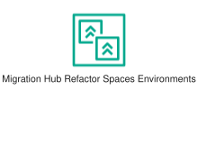
<div class="xal-ref-path">etc/resources/aws/svg/Resource-Icons/Res_Migration-Modernization/Res_AWS-Migration-Hub_Refactor-Spaces-Environments_48.svg<br>1639 bytes</div>
</div>
</div>
{{#endtab}}
{{#tab name="Code"}}

```xml
{{#include ../samples/icons/Resource-Icons/res-aws-migration-hub-refactor-spaces-environments-48-8323baaa.xal}}
```

{{#endtab}}
{{#endtabs}}

</div>
<div class="xal-ref-card">

{{#tabs name="svg-ref-0361"}}
{{#tab name="Preview"}}
<div class="xal-ref-preview">
<div>

<div class="xal-ref-path">etc/resources/aws/svg/Resource-Icons/Res_Migration-Modernization/Res_AWS-Migration-Hub_Refactor-Spaces-Services_48.svg<br>3957 bytes</div>
</div>
</div>
{{#endtab}}
{{#tab name="Code"}}

```xml
{{#include ../samples/icons/Resource-Icons/res-aws-migration-hub-refactor-spaces-services-48-44b6cac4.xal}}
```

{{#endtab}}
{{#endtabs}}

</div>
<div class="xal-ref-card">

{{#tabs name="svg-ref-0362"}}
{{#tab name="Preview"}}
<div class="xal-ref-preview">
<div>

<div class="xal-ref-path">etc/resources/aws/svg/Resource-Icons/Res_Migration-Modernization/Res_AWS-Transfer-Family_AWS-AS2_48.svg<br>4578 bytes</div>
</div>
</div>
{{#endtab}}
{{#tab name="Code"}}

```xml
{{#include ../samples/icons/Resource-Icons/res-aws-transfer-family-aws-as2-48-961ee779.xal}}
```

{{#endtab}}
{{#endtabs}}

</div>
<div class="xal-ref-card">

{{#tabs name="svg-ref-0363"}}
{{#tab name="Preview"}}
<div class="xal-ref-preview">
<div>

<div class="xal-ref-path">etc/resources/aws/svg/Resource-Icons/Res_Migration-Modernization/Res_AWS-Transfer-Family_AWS-FTPS_48.svg<br>4596 bytes</div>
</div>
</div>
{{#endtab}}
{{#tab name="Code"}}

```xml
{{#include ../samples/icons/Resource-Icons/res-aws-transfer-family-aws-ftps-48-bbe0f25c.xal}}
```

{{#endtab}}
{{#endtabs}}

</div>
<div class="xal-ref-card">

{{#tabs name="svg-ref-0364"}}
{{#tab name="Preview"}}
<div class="xal-ref-preview">
<div>

<div class="xal-ref-path">etc/resources/aws/svg/Resource-Icons/Res_Migration-Modernization/Res_AWS-Transfer-Family_AWS-FTP_48.svg<br>3412 bytes</div>
</div>
</div>
{{#endtab}}
{{#tab name="Code"}}

```xml
{{#include ../samples/icons/Resource-Icons/res-aws-transfer-family-aws-ftp-48-826d360f.xal}}
```

{{#endtab}}
{{#endtabs}}

</div>
<div class="xal-ref-card">

{{#tabs name="svg-ref-0365"}}
{{#tab name="Preview"}}
<div class="xal-ref-preview">
<div>

<div class="xal-ref-path">etc/resources/aws/svg/Resource-Icons/Res_Migration-Modernization/Res_AWS-Transfer-Family_AWS-SFTP_48.svg<br>4928 bytes</div>
</div>
</div>
{{#endtab}}
{{#tab name="Code"}}

```xml
{{#include ../samples/icons/Resource-Icons/res-aws-transfer-family-aws-sftp-48-94799def.xal}}
```

{{#endtab}}
{{#endtabs}}

</div>
<div class="xal-ref-card">

{{#tabs name="svg-ref-0366"}}
{{#tab name="Preview"}}
<div class="xal-ref-preview">
<div>

<div class="xal-ref-path">etc/resources/aws/svg/Resource-Icons/Res_Networking-Content-Delivery/Res_AWS-App-Mesh_Mesh_48.svg<br>4900 bytes</div>
</div>
</div>
{{#endtab}}
{{#tab name="Code"}}

```xml
{{#include ../samples/icons/Resource-Icons/res-aws-app-mesh-mesh-48-bede247a.xal}}
```

{{#endtab}}
{{#endtabs}}

</div>
<div class="xal-ref-card">

{{#tabs name="svg-ref-0367"}}
{{#tab name="Preview"}}
<div class="xal-ref-preview">
<div>

<div class="xal-ref-path">etc/resources/aws/svg/Resource-Icons/Res_Networking-Content-Delivery/Res_AWS-App-Mesh_Virtual-Gateway_48.svg<br>6346 bytes</div>
</div>
</div>
{{#endtab}}
{{#tab name="Code"}}

```xml
{{#include ../samples/icons/Resource-Icons/res-aws-app-mesh-virtual-gateway-48-f016fd03.xal}}
```

{{#endtab}}
{{#endtabs}}

</div>
<div class="xal-ref-card">

{{#tabs name="svg-ref-0368"}}
{{#tab name="Preview"}}
<div class="xal-ref-preview">
<div>

<div class="xal-ref-path">etc/resources/aws/svg/Resource-Icons/Res_Networking-Content-Delivery/Res_AWS-App-Mesh_Virtual-Node_48.svg<br>4289 bytes</div>
</div>
</div>
{{#endtab}}
{{#tab name="Code"}}

```xml
{{#include ../samples/icons/Resource-Icons/res-aws-app-mesh-virtual-node-48-8bae27cc.xal}}
```

{{#endtab}}
{{#endtabs}}

</div>
<div class="xal-ref-card">

{{#tabs name="svg-ref-0369"}}
{{#tab name="Preview"}}
<div class="xal-ref-preview">
<div>

<div class="xal-ref-path">etc/resources/aws/svg/Resource-Icons/Res_Networking-Content-Delivery/Res_AWS-App-Mesh_Virtual-Router_48.svg<br>4369 bytes</div>
</div>
</div>
{{#endtab}}
{{#tab name="Code"}}

```xml
{{#include ../samples/icons/Resource-Icons/res-aws-app-mesh-virtual-router-48-2282e706.xal}}
```

{{#endtab}}
{{#endtabs}}

</div>
<div class="xal-ref-card">

{{#tabs name="svg-ref-0370"}}
{{#tab name="Preview"}}
<div class="xal-ref-preview">
<div>

<div class="xal-ref-path">etc/resources/aws/svg/Resource-Icons/Res_Networking-Content-Delivery/Res_AWS-App-Mesh_Virtual-Service_48.svg<br>5634 bytes</div>
</div>
</div>
{{#endtab}}
{{#tab name="Code"}}

```xml
{{#include ../samples/icons/Resource-Icons/res-aws-app-mesh-virtual-service-48-ab1d9e71.xal}}
```

{{#endtab}}
{{#endtabs}}

</div>
<div class="xal-ref-card">

{{#tabs name="svg-ref-0371"}}
{{#tab name="Preview"}}
<div class="xal-ref-preview">
<div>

<div class="xal-ref-path">etc/resources/aws/svg/Resource-Icons/Res_Networking-Content-Delivery/Res_AWS-Cloud-Map_Namespace_48.svg<br>5377 bytes</div>
</div>
</div>
{{#endtab}}
{{#tab name="Code"}}

```xml
{{#include ../samples/icons/Resource-Icons/res-aws-cloud-map-namespace-48-aeb8c61c.xal}}
```

{{#endtab}}
{{#endtabs}}

</div>
<div class="xal-ref-card">

{{#tabs name="svg-ref-0372"}}
{{#tab name="Preview"}}
<div class="xal-ref-preview">
<div>

<div class="xal-ref-path">etc/resources/aws/svg/Resource-Icons/Res_Networking-Content-Delivery/Res_AWS-Cloud-Map_Resource_48.svg<br>6142 bytes</div>
</div>
</div>
{{#endtab}}
{{#tab name="Code"}}

```xml
{{#include ../samples/icons/Resource-Icons/res-aws-cloud-map-resource-48-73f36ffe.xal}}
```

{{#endtab}}
{{#endtabs}}

</div>
<div class="xal-ref-card">

{{#tabs name="svg-ref-0373"}}
{{#tab name="Preview"}}
<div class="xal-ref-preview">
<div>

<div class="xal-ref-path">etc/resources/aws/svg/Resource-Icons/Res_Networking-Content-Delivery/Res_AWS-Cloud-Map_Service_48.svg<br>1897 bytes</div>
</div>
</div>
{{#endtab}}
{{#tab name="Code"}}

```xml
{{#include ../samples/icons/Resource-Icons/res-aws-cloud-map-service-48-1e45edd1.xal}}
```

{{#endtab}}
{{#endtabs}}

</div>
<div class="xal-ref-card">

{{#tabs name="svg-ref-0374"}}
{{#tab name="Preview"}}
<div class="xal-ref-preview">
<div>

<div class="xal-ref-path">etc/resources/aws/svg/Resource-Icons/Res_Networking-Content-Delivery/Res_AWS-Cloud-WAN_Core-Network-Edge_48.svg<br>2143 bytes</div>
</div>
</div>
{{#endtab}}
{{#tab name="Code"}}

```xml
{{#include ../samples/icons/Resource-Icons/res-aws-cloud-wan-core-network-edge-48-06951814.xal}}
```

{{#endtab}}
{{#endtabs}}

</div>
<div class="xal-ref-card">

{{#tabs name="svg-ref-0375"}}
{{#tab name="Preview"}}
<div class="xal-ref-preview">
<div>

<div class="xal-ref-path">etc/resources/aws/svg/Resource-Icons/Res_Networking-Content-Delivery/Res_AWS-Cloud-WAN_Segment-Network_48.svg<br>3266 bytes</div>
</div>
</div>
{{#endtab}}
{{#tab name="Code"}}

```xml
{{#include ../samples/icons/Resource-Icons/res-aws-cloud-wan-segment-network-48-a9d6600a.xal}}
```

{{#endtab}}
{{#endtabs}}

</div>
<div class="xal-ref-card">

{{#tabs name="svg-ref-0376"}}
{{#tab name="Preview"}}
<div class="xal-ref-preview">
<div>

<div class="xal-ref-path">etc/resources/aws/svg/Resource-Icons/Res_Networking-Content-Delivery/Res_AWS-Cloud-WAN_Transit-Gateway-Route-Table-Attachment_48.svg<br>2144 bytes</div>
</div>
</div>
{{#endtab}}
{{#tab name="Code"}}

```xml
{{#include ../samples/icons/Resource-Icons/res-aws-cloud-wan-transit-gateway-route-table-attachment-48-6c0216a5.xal}}
```

{{#endtab}}
{{#endtabs}}

</div>
<div class="xal-ref-card">

{{#tabs name="svg-ref-0377"}}
{{#tab name="Preview"}}
<div class="xal-ref-preview">
<div>

<div class="xal-ref-path">etc/resources/aws/svg/Resource-Icons/Res_Networking-Content-Delivery/Res_AWS-Direct-Connect_Gateway_48.svg<br>989 bytes</div>
</div>
</div>
{{#endtab}}
{{#tab name="Code"}}

```xml
{{#include ../samples/icons/Resource-Icons/res-aws-direct-connect-gateway-48-f8844f9f.xal}}
```

{{#endtab}}
{{#endtabs}}

</div>
<div class="xal-ref-card">

{{#tabs name="svg-ref-0378"}}
{{#tab name="Preview"}}
<div class="xal-ref-preview">
<div>

<div class="xal-ref-path">etc/resources/aws/svg/Resource-Icons/Res_Networking-Content-Delivery/Res_AWS-Transit-Gateway_Attachment_48.svg<br>1223 bytes</div>
</div>
</div>
{{#endtab}}
{{#tab name="Code"}}

```xml
{{#include ../samples/icons/Resource-Icons/res-aws-transit-gateway-attachment-48-4c2f31bb.xal}}
```

{{#endtab}}
{{#endtabs}}

</div>
<div class="xal-ref-card">

{{#tabs name="svg-ref-0379"}}
{{#tab name="Preview"}}
<div class="xal-ref-preview">
<div>

<div class="xal-ref-path">etc/resources/aws/svg/Resource-Icons/Res_Networking-Content-Delivery/Res_Amazon-API-Gateway_Endpoint_48.svg<br>1349 bytes</div>
</div>
</div>
{{#endtab}}
{{#tab name="Code"}}

```xml
{{#include ../samples/icons/Resource-Icons/res-amazon-api-gateway-endpoint-48-4c59d69d.xal}}
```

{{#endtab}}
{{#endtabs}}

</div>
<div class="xal-ref-card">

{{#tabs name="svg-ref-0380"}}
{{#tab name="Preview"}}
<div class="xal-ref-preview">
<div>

<div class="xal-ref-path">etc/resources/aws/svg/Resource-Icons/Res_Networking-Content-Delivery/Res_Amazon-CloudFront_Download-Distribution_48.svg<br>2060 bytes</div>
</div>
</div>
{{#endtab}}
{{#tab name="Code"}}

```xml
{{#include ../samples/icons/Resource-Icons/res-amazon-cloudfront-download-distribution-48-f7932abe.xal}}
```

{{#endtab}}
{{#endtabs}}

</div>
<div class="xal-ref-card">

{{#tabs name="svg-ref-0381"}}
{{#tab name="Preview"}}
<div class="xal-ref-preview">
<div>

<div class="xal-ref-path">etc/resources/aws/svg/Resource-Icons/Res_Networking-Content-Delivery/Res_Amazon-CloudFront_Edge-Location_48.svg<br>1040 bytes</div>
</div>
</div>
{{#endtab}}
{{#tab name="Code"}}

```xml
{{#include ../samples/icons/Resource-Icons/res-amazon-cloudfront-edge-location-48-7bfc4182.xal}}
```

{{#endtab}}
{{#endtabs}}

</div>
<div class="xal-ref-card">

{{#tabs name="svg-ref-0382"}}
{{#tab name="Preview"}}
<div class="xal-ref-preview">
<div>

<div class="xal-ref-path">etc/resources/aws/svg/Resource-Icons/Res_Networking-Content-Delivery/Res_Amazon-CloudFront_Functions_48.svg<br>6129 bytes</div>
</div>
</div>
{{#endtab}}
{{#tab name="Code"}}

```xml
{{#include ../samples/icons/Resource-Icons/res-amazon-cloudfront-functions-48-4b751657.xal}}
```

{{#endtab}}
{{#endtabs}}

</div>
<div class="xal-ref-card">

{{#tabs name="svg-ref-0383"}}
{{#tab name="Preview"}}
<div class="xal-ref-preview">
<div>

<div class="xal-ref-path">etc/resources/aws/svg/Resource-Icons/Res_Networking-Content-Delivery/Res_Amazon-CloudFront_Streaming-Distribution_48.svg<br>1314 bytes</div>
</div>
</div>
{{#endtab}}
{{#tab name="Code"}}

```xml
{{#include ../samples/icons/Resource-Icons/res-amazon-cloudfront-streaming-distribution-48-a939db83.xal}}
```

{{#endtab}}
{{#endtabs}}

</div>
<div class="xal-ref-card">

{{#tabs name="svg-ref-0384"}}
{{#tab name="Preview"}}
<div class="xal-ref-preview">
<div>

<div class="xal-ref-path">etc/resources/aws/svg/Resource-Icons/Res_Networking-Content-Delivery/Res_Amazon-Route-53-Hosted-Zone_48.svg<br>2294 bytes</div>
</div>
</div>
{{#endtab}}
{{#tab name="Code"}}

```xml
{{#include ../samples/icons/Resource-Icons/res-amazon-route-53-hosted-zone-48-3cddc659.xal}}
```

{{#endtab}}
{{#endtabs}}

</div>
<div class="xal-ref-card">

{{#tabs name="svg-ref-0385"}}
{{#tab name="Preview"}}
<div class="xal-ref-preview">
<div>

<div class="xal-ref-path">etc/resources/aws/svg/Resource-Icons/Res_Networking-Content-Delivery/Res_Amazon-Route-53_Readiness-Checks_48.svg<br>2516 bytes</div>
</div>
</div>
{{#endtab}}
{{#tab name="Code"}}

```xml
{{#include ../samples/icons/Resource-Icons/res-amazon-route-53-readiness-checks-48-412a0f65.xal}}
```

{{#endtab}}
{{#endtabs}}

</div>
<div class="xal-ref-card">

{{#tabs name="svg-ref-0386"}}
{{#tab name="Preview"}}
<div class="xal-ref-preview">
<div>

<div class="xal-ref-path">etc/resources/aws/svg/Resource-Icons/Res_Networking-Content-Delivery/Res_Amazon-Route-53_Resolver-DNS-Firewall_48.svg<br>4067 bytes</div>
</div>
</div>
{{#endtab}}
{{#tab name="Code"}}

```xml
{{#include ../samples/icons/Resource-Icons/res-amazon-route-53-resolver-dns-firewall-48-43273ce1.xal}}
```

{{#endtab}}
{{#endtabs}}

</div>
<div class="xal-ref-card">

{{#tabs name="svg-ref-0387"}}
{{#tab name="Preview"}}
<div class="xal-ref-preview">
<div>

<div class="xal-ref-path">etc/resources/aws/svg/Resource-Icons/Res_Networking-Content-Delivery/Res_Amazon-Route-53_Resolver-Query-Logging_48.svg<br>3068 bytes</div>
</div>
</div>
{{#endtab}}
{{#tab name="Code"}}

```xml
{{#include ../samples/icons/Resource-Icons/res-amazon-route-53-resolver-query-logging-48-11709fff.xal}}
```

{{#endtab}}
{{#endtabs}}

</div>
<div class="xal-ref-card">

{{#tabs name="svg-ref-0388"}}
{{#tab name="Preview"}}
<div class="xal-ref-preview">
<div>

<div class="xal-ref-path">etc/resources/aws/svg/Resource-Icons/Res_Networking-Content-Delivery/Res_Amazon-Route-53_Resolver_48.svg<br>3591 bytes</div>
</div>
</div>
{{#endtab}}
{{#tab name="Code"}}

```xml
{{#include ../samples/icons/Resource-Icons/res-amazon-route-53-resolver-48-8286ea52.xal}}
```

{{#endtab}}
{{#endtabs}}

</div>
<div class="xal-ref-card">

{{#tabs name="svg-ref-0389"}}
{{#tab name="Preview"}}
<div class="xal-ref-preview">
<div>

<div class="xal-ref-path">etc/resources/aws/svg/Resource-Icons/Res_Networking-Content-Delivery/Res_Amazon-Route-53_Route-Table_48.svg<br>13951 bytes</div>
</div>
</div>
{{#endtab}}
{{#tab name="Code"}}

```xml
{{#include ../samples/icons/Resource-Icons/res-amazon-route-53-route-table-48-0ca8dea5.xal}}
```

{{#endtab}}
{{#endtabs}}

</div>
<div class="xal-ref-card">

{{#tabs name="svg-ref-0390"}}
{{#tab name="Preview"}}
<div class="xal-ref-preview">
<div>

<div class="xal-ref-path">etc/resources/aws/svg/Resource-Icons/Res_Networking-Content-Delivery/Res_Amazon-Route-53_Routing-Controls_48.svg<br>4147 bytes</div>
</div>
</div>
{{#endtab}}
{{#tab name="Code"}}

```xml
{{#include ../samples/icons/Resource-Icons/res-amazon-route-53-routing-controls-48-3ba5b6eb.xal}}
```

{{#endtab}}
{{#endtabs}}

</div>
<div class="xal-ref-card">

{{#tabs name="svg-ref-0391"}}
{{#tab name="Preview"}}
<div class="xal-ref-preview">
<div>

<div class="xal-ref-path">etc/resources/aws/svg/Resource-Icons/Res_Networking-Content-Delivery/Res_Amazon-VPC_Carrier-Gateway_48.svg<br>1980 bytes</div>
</div>
</div>
{{#endtab}}
{{#tab name="Code"}}

```xml
{{#include ../samples/icons/Resource-Icons/res-amazon-vpc-carrier-gateway-48-1c6965fa.xal}}
```

{{#endtab}}
{{#endtabs}}

</div>
<div class="xal-ref-card">

{{#tabs name="svg-ref-0392"}}
{{#tab name="Preview"}}
<div class="xal-ref-preview">
<div>

<div class="xal-ref-path">etc/resources/aws/svg/Resource-Icons/Res_Networking-Content-Delivery/Res_Amazon-VPC_Customer-Gateway_48.svg<br>1580 bytes</div>
</div>
</div>
{{#endtab}}
{{#tab name="Code"}}

```xml
{{#include ../samples/icons/Resource-Icons/res-amazon-vpc-customer-gateway-48-ee7d7572.xal}}
```

{{#endtab}}
{{#endtabs}}

</div>
<div class="xal-ref-card">

{{#tabs name="svg-ref-0393"}}
{{#tab name="Preview"}}
<div class="xal-ref-preview">
<div>

<div class="xal-ref-path">etc/resources/aws/svg/Resource-Icons/Res_Networking-Content-Delivery/Res_Amazon-VPC_Elastic-Network-Adapter_48.svg<br>2888 bytes</div>
</div>
</div>
{{#endtab}}
{{#tab name="Code"}}

```xml
{{#include ../samples/icons/Resource-Icons/res-amazon-vpc-elastic-network-adapter-48-cb4daf46.xal}}
```

{{#endtab}}
{{#endtabs}}

</div>
<div class="xal-ref-card">

{{#tabs name="svg-ref-0394"}}
{{#tab name="Preview"}}
<div class="xal-ref-preview">
<div>

<div class="xal-ref-path">etc/resources/aws/svg/Resource-Icons/Res_Networking-Content-Delivery/Res_Amazon-VPC_Elastic-Network-Interface_48.svg<br>2489 bytes</div>
</div>
</div>
{{#endtab}}
{{#tab name="Code"}}

```xml
{{#include ../samples/icons/Resource-Icons/res-amazon-vpc-elastic-network-interface-48-69232fe9.xal}}
```

{{#endtab}}
{{#endtabs}}

</div>
<div class="xal-ref-card">

{{#tabs name="svg-ref-0395"}}
{{#tab name="Preview"}}
<div class="xal-ref-preview">
<div>

<div class="xal-ref-path">etc/resources/aws/svg/Resource-Icons/Res_Networking-Content-Delivery/Res_Amazon-VPC_Endpoints_48.svg<br>2514 bytes</div>
</div>
</div>
{{#endtab}}
{{#tab name="Code"}}

```xml
{{#include ../samples/icons/Resource-Icons/res-amazon-vpc-endpoints-48-098dc368.xal}}
```

{{#endtab}}
{{#endtabs}}

</div>
<div class="xal-ref-card">

{{#tabs name="svg-ref-0396"}}
{{#tab name="Preview"}}
<div class="xal-ref-preview">
<div>

<div class="xal-ref-path">etc/resources/aws/svg/Resource-Icons/Res_Networking-Content-Delivery/Res_Amazon-VPC_Flow-Logs_48.svg<br>1943 bytes</div>
</div>
</div>
{{#endtab}}
{{#tab name="Code"}}

```xml
{{#include ../samples/icons/Resource-Icons/res-amazon-vpc-flow-logs-48-eb94e4ce.xal}}
```

{{#endtab}}
{{#endtabs}}

</div>
<div class="xal-ref-card">

{{#tabs name="svg-ref-0397"}}
{{#tab name="Preview"}}
<div class="xal-ref-preview">
<div>

<div class="xal-ref-path">etc/resources/aws/svg/Resource-Icons/Res_Networking-Content-Delivery/Res_Amazon-VPC_Internet-Gateway_48.svg<br>2067 bytes</div>
</div>
</div>
{{#endtab}}
{{#tab name="Code"}}

```xml
{{#include ../samples/icons/Resource-Icons/res-amazon-vpc-internet-gateway-48-5ba62d34.xal}}
```

{{#endtab}}
{{#endtabs}}

</div>
<div class="xal-ref-card">

{{#tabs name="svg-ref-0398"}}
{{#tab name="Preview"}}
<div class="xal-ref-preview">
<div>

<div class="xal-ref-path">etc/resources/aws/svg/Resource-Icons/Res_Networking-Content-Delivery/Res_Amazon-VPC_NAT-Gateway_48.svg<br>3259 bytes</div>
</div>
</div>
{{#endtab}}
{{#tab name="Code"}}

```xml
{{#include ../samples/icons/Resource-Icons/res-amazon-vpc-nat-gateway-48-745a33fc.xal}}
```

{{#endtab}}
{{#endtabs}}

</div>
<div class="xal-ref-card">

{{#tabs name="svg-ref-0399"}}
{{#tab name="Preview"}}
<div class="xal-ref-preview">
<div>

<div class="xal-ref-path">etc/resources/aws/svg/Resource-Icons/Res_Networking-Content-Delivery/Res_Amazon-VPC_Network-Access-Analyzer_48.svg<br>3132 bytes</div>
</div>
</div>
{{#endtab}}
{{#tab name="Code"}}

```xml
{{#include ../samples/icons/Resource-Icons/res-amazon-vpc-network-access-analyzer-48-67125e4b.xal}}
```

{{#endtab}}
{{#endtabs}}

</div>
<div class="xal-ref-card">

{{#tabs name="svg-ref-0400"}}
{{#tab name="Preview"}}
<div class="xal-ref-preview">
<div>

<div class="xal-ref-path">etc/resources/aws/svg/Resource-Icons/Res_Networking-Content-Delivery/Res_Amazon-VPC_Network-Access-Control-List_48.svg<br>2690 bytes</div>
</div>
</div>
{{#endtab}}
{{#tab name="Code"}}

```xml
{{#include ../samples/icons/Resource-Icons/res-amazon-vpc-network-access-control-list-48-3266c730.xal}}
```

{{#endtab}}
{{#endtabs}}

</div>
<div class="xal-ref-card">

{{#tabs name="svg-ref-0401"}}
{{#tab name="Preview"}}
<div class="xal-ref-preview">
<div>

<div class="xal-ref-path">etc/resources/aws/svg/Resource-Icons/Res_Networking-Content-Delivery/Res_Amazon-VPC_Peering-Connection_48.svg<br>3396 bytes</div>
</div>
</div>
{{#endtab}}
{{#tab name="Code"}}

```xml
{{#include ../samples/icons/Resource-Icons/res-amazon-vpc-peering-connection-48-686aa644.xal}}
```

{{#endtab}}
{{#endtabs}}

</div>
<div class="xal-ref-card">

{{#tabs name="svg-ref-0402"}}
{{#tab name="Preview"}}
<div class="xal-ref-preview">
<div>

<div class="xal-ref-path">etc/resources/aws/svg/Resource-Icons/Res_Networking-Content-Delivery/Res_Amazon-VPC_Reachability-Analyzer_48.svg<br>1688 bytes</div>
</div>
</div>
{{#endtab}}
{{#tab name="Code"}}

```xml
{{#include ../samples/icons/Resource-Icons/res-amazon-vpc-reachability-analyzer-48-11079c3c.xal}}
```

{{#endtab}}
{{#endtabs}}

</div>
<div class="xal-ref-card">

{{#tabs name="svg-ref-0403"}}
{{#tab name="Preview"}}
<div class="xal-ref-preview">
<div>

<div class="xal-ref-path">etc/resources/aws/svg/Resource-Icons/Res_Networking-Content-Delivery/Res_Amazon-VPC_Router_48.svg<br>1632 bytes</div>
</div>
</div>
{{#endtab}}
{{#tab name="Code"}}

```xml
{{#include ../samples/icons/Resource-Icons/res-amazon-vpc-router-48-58946de8.xal}}
```

{{#endtab}}
{{#endtabs}}

</div>
<div class="xal-ref-card">

{{#tabs name="svg-ref-0404"}}
{{#tab name="Preview"}}
<div class="xal-ref-preview">
<div>

<div class="xal-ref-path">etc/resources/aws/svg/Resource-Icons/Res_Networking-Content-Delivery/Res_Amazon-VPC_Traffic-Mirroring_48.svg<br>3423 bytes</div>
</div>
</div>
{{#endtab}}
{{#tab name="Code"}}

```xml
{{#include ../samples/icons/Resource-Icons/res-amazon-vpc-traffic-mirroring-48-b118270b.xal}}
```

{{#endtab}}
{{#endtabs}}

</div>
<div class="xal-ref-card">

{{#tabs name="svg-ref-0405"}}
{{#tab name="Preview"}}
<div class="xal-ref-preview">
<div>

<div class="xal-ref-path">etc/resources/aws/svg/Resource-Icons/Res_Networking-Content-Delivery/Res_Amazon-VPC_VPN-Connection_48.svg<br>2836 bytes</div>
</div>
</div>
{{#endtab}}
{{#tab name="Code"}}

```xml
{{#include ../samples/icons/Resource-Icons/res-amazon-vpc-vpn-connection-48-d6bbd695.xal}}
```

{{#endtab}}
{{#endtabs}}

</div>
<div class="xal-ref-card">

{{#tabs name="svg-ref-0406"}}
{{#tab name="Preview"}}
<div class="xal-ref-preview">
<div>

<div class="xal-ref-path">etc/resources/aws/svg/Resource-Icons/Res_Networking-Content-Delivery/Res_Amazon-VPC_VPN-Gateway_48.svg<br>2541 bytes</div>
</div>
</div>
{{#endtab}}
{{#tab name="Code"}}

```xml
{{#include ../samples/icons/Resource-Icons/res-amazon-vpc-vpn-gateway-48-cfcb1764.xal}}
```

{{#endtab}}
{{#endtabs}}

</div>
<div class="xal-ref-card">

{{#tabs name="svg-ref-0407"}}
{{#tab name="Preview"}}
<div class="xal-ref-preview">
<div>

<div class="xal-ref-path">etc/resources/aws/svg/Resource-Icons/Res_Networking-Content-Delivery/Res_Amazon-VPC_Virtual-private-cloud-VPC_48.svg<br>3022 bytes</div>
</div>
</div>
{{#endtab}}
{{#tab name="Code"}}

```xml
{{#include ../samples/icons/Resource-Icons/res-amazon-vpc-virtual-private-cloud-vpc-48-af02dd82.xal}}
```

{{#endtab}}
{{#endtabs}}

</div>
<div class="xal-ref-card">

{{#tabs name="svg-ref-0408"}}
{{#tab name="Preview"}}
<div class="xal-ref-preview">
<div>

<div class="xal-ref-path">etc/resources/aws/svg/Resource-Icons/Res_Networking-Content-Delivery/Res_Elastic-Load-Balancing_Application-Load-Balancer_48.svg<br>2937 bytes</div>
</div>
</div>
{{#endtab}}
{{#tab name="Code"}}

```xml
{{#include ../samples/icons/Resource-Icons/res-elastic-load-balancing-application-load-balancer-48-b675700c.xal}}
```

{{#endtab}}
{{#endtabs}}

</div>
<div class="xal-ref-card">

{{#tabs name="svg-ref-0409"}}
{{#tab name="Preview"}}
<div class="xal-ref-preview">
<div>

<div class="xal-ref-path">etc/resources/aws/svg/Resource-Icons/Res_Networking-Content-Delivery/Res_Elastic-Load-Balancing_Classic-Load-Balancer_48.svg<br>3462 bytes</div>
</div>
</div>
{{#endtab}}
{{#tab name="Code"}}

```xml
{{#include ../samples/icons/Resource-Icons/res-elastic-load-balancing-classic-load-balancer-48-76be3b1c.xal}}
```

{{#endtab}}
{{#endtabs}}

</div>
<div class="xal-ref-card">

{{#tabs name="svg-ref-0410"}}
{{#tab name="Preview"}}
<div class="xal-ref-preview">
<div>

<div class="xal-ref-path">etc/resources/aws/svg/Resource-Icons/Res_Networking-Content-Delivery/Res_Elastic-Load-Balancing_Gateway-Load-Balancer_48.svg<br>2526 bytes</div>
</div>
</div>
{{#endtab}}
{{#tab name="Code"}}

```xml
{{#include ../samples/icons/Resource-Icons/res-elastic-load-balancing-gateway-load-balancer-48-be6a31a7.xal}}
```

{{#endtab}}
{{#endtabs}}

</div>
<div class="xal-ref-card">

{{#tabs name="svg-ref-0411"}}
{{#tab name="Preview"}}
<div class="xal-ref-preview">
<div>

<div class="xal-ref-path">etc/resources/aws/svg/Resource-Icons/Res_Networking-Content-Delivery/Res_Elastic-Load-Balancing_Network-Load-Balancer_48.svg<br>3258 bytes</div>
</div>
</div>
{{#endtab}}
{{#tab name="Code"}}

```xml
{{#include ../samples/icons/Resource-Icons/res-elastic-load-balancing-network-load-balancer-48-46163117.xal}}
```

{{#endtab}}
{{#endtabs}}

</div>
<div class="xal-ref-card">

{{#tabs name="svg-ref-0412"}}
{{#tab name="Preview"}}
<div class="xal-ref-preview">
<div>

<div class="xal-ref-path">etc/resources/aws/svg/Resource-Icons/Res_Quantum-Technologies/Res_Amazon-Braket_Chandelier_48.svg<br>1266 bytes</div>
</div>
</div>
{{#endtab}}
{{#tab name="Code"}}

```xml
{{#include ../samples/icons/Resource-Icons/res-amazon-braket-chandelier-48-1be63d39.xal}}
```

{{#endtab}}
{{#endtabs}}

</div>
<div class="xal-ref-card">

{{#tabs name="svg-ref-0413"}}
{{#tab name="Preview"}}
<div class="xal-ref-preview">
<div>

<div class="xal-ref-path">etc/resources/aws/svg/Resource-Icons/Res_Quantum-Technologies/Res_Amazon-Braket_Chip_48.svg<br>5876 bytes</div>
</div>
</div>
{{#endtab}}
{{#tab name="Code"}}

```xml
{{#include ../samples/icons/Resource-Icons/res-amazon-braket-chip-48-efd05ba4.xal}}
```

{{#endtab}}
{{#endtabs}}

</div>
<div class="xal-ref-card">

{{#tabs name="svg-ref-0414"}}
{{#tab name="Preview"}}
<div class="xal-ref-preview">
<div>

<div class="xal-ref-path">etc/resources/aws/svg/Resource-Icons/Res_Quantum-Technologies/Res_Amazon-Braket_Embedded-Simulator_48.svg<br>1870 bytes</div>
</div>
</div>
{{#endtab}}
{{#tab name="Code"}}

```xml
{{#include ../samples/icons/Resource-Icons/res-amazon-braket-embedded-simulator-48-5f648a5f.xal}}
```

{{#endtab}}
{{#endtabs}}

</div>
<div class="xal-ref-card">

{{#tabs name="svg-ref-0415"}}
{{#tab name="Preview"}}
<div class="xal-ref-preview">
<div>

<div class="xal-ref-path">etc/resources/aws/svg/Resource-Icons/Res_Quantum-Technologies/Res_Amazon-Braket_Managed-Simulator_48.svg<br>4395 bytes</div>
</div>
</div>
{{#endtab}}
{{#tab name="Code"}}

```xml
{{#include ../samples/icons/Resource-Icons/res-amazon-braket-managed-simulator-48-1e67b208.xal}}
```

{{#endtab}}
{{#endtabs}}

</div>
<div class="xal-ref-card">

{{#tabs name="svg-ref-0416"}}
{{#tab name="Preview"}}
<div class="xal-ref-preview">
<div>

<div class="xal-ref-path">etc/resources/aws/svg/Resource-Icons/Res_Quantum-Technologies/Res_Amazon-Braket_Noise-Simulator_48.svg<br>4749 bytes</div>
</div>
</div>
{{#endtab}}
{{#tab name="Code"}}

```xml
{{#include ../samples/icons/Resource-Icons/res-amazon-braket-noise-simulator-48-3d545285.xal}}
```

{{#endtab}}
{{#endtabs}}

</div>
<div class="xal-ref-card">

{{#tabs name="svg-ref-0417"}}
{{#tab name="Preview"}}
<div class="xal-ref-preview">
<div>

<div class="xal-ref-path">etc/resources/aws/svg/Resource-Icons/Res_Quantum-Technologies/Res_Amazon-Braket_QPU_48.svg<br>5414 bytes</div>
</div>
</div>
{{#endtab}}
{{#tab name="Code"}}

```xml
{{#include ../samples/icons/Resource-Icons/res-amazon-braket-qpu-48-f616b1d5.xal}}
```

{{#endtab}}
{{#endtabs}}

</div>
<div class="xal-ref-card">

{{#tabs name="svg-ref-0418"}}
{{#tab name="Preview"}}
<div class="xal-ref-preview">
<div>

<div class="xal-ref-path">etc/resources/aws/svg/Resource-Icons/Res_Quantum-Technologies/Res_Amazon-Braket_Simulator-1_48.svg<br>5246 bytes</div>
</div>
</div>
{{#endtab}}
{{#tab name="Code"}}

```xml
{{#include ../samples/icons/Resource-Icons/res-amazon-braket-simulator-1-48-0b6407fd.xal}}
```

{{#endtab}}
{{#endtabs}}

</div>
<div class="xal-ref-card">

{{#tabs name="svg-ref-0419"}}
{{#tab name="Preview"}}
<div class="xal-ref-preview">
<div>

<div class="xal-ref-path">etc/resources/aws/svg/Resource-Icons/Res_Quantum-Technologies/Res_Amazon-Braket_Simulator-2_48.svg<br>3424 bytes</div>
</div>
</div>
{{#endtab}}
{{#tab name="Code"}}

```xml
{{#include ../samples/icons/Resource-Icons/res-amazon-braket-simulator-2-48-85eb001e.xal}}
```

{{#endtab}}
{{#endtabs}}

</div>
<div class="xal-ref-card">

{{#tabs name="svg-ref-0420"}}
{{#tab name="Preview"}}
<div class="xal-ref-preview">
<div>

<div class="xal-ref-path">etc/resources/aws/svg/Resource-Icons/Res_Quantum-Technologies/Res_Amazon-Braket_Simulator-3_48.svg<br>1565 bytes</div>
</div>
</div>
{{#endtab}}
{{#tab name="Code"}}

```xml
{{#include ../samples/icons/Resource-Icons/res-amazon-braket-simulator-3-48-49410080.xal}}
```

{{#endtab}}
{{#endtabs}}

</div>
<div class="xal-ref-card">

{{#tabs name="svg-ref-0421"}}
{{#tab name="Preview"}}
<div class="xal-ref-preview">
<div>

<div class="xal-ref-path">etc/resources/aws/svg/Resource-Icons/Res_Quantum-Technologies/Res_Amazon-Braket_Simulator-4_48.svg<br>1395 bytes</div>
</div>
</div>
{{#endtab}}
{{#tab name="Code"}}

```xml
{{#include ../samples/icons/Resource-Icons/res-amazon-braket-simulator-4-48-43840999.xal}}
```

{{#endtab}}
{{#endtabs}}

</div>
<div class="xal-ref-card">

{{#tabs name="svg-ref-0422"}}
{{#tab name="Preview"}}
<div class="xal-ref-preview">
<div>

<div class="xal-ref-path">etc/resources/aws/svg/Resource-Icons/Res_Quantum-Technologies/Res_Amazon-Braket_Simulator_48.svg<br>4717 bytes</div>
</div>
</div>
{{#endtab}}
{{#tab name="Code"}}

```xml
{{#include ../samples/icons/Resource-Icons/res-amazon-braket-simulator-48-46a5f13d.xal}}
```

{{#endtab}}
{{#endtabs}}

</div>
<div class="xal-ref-card">

{{#tabs name="svg-ref-0423"}}
{{#tab name="Preview"}}
<div class="xal-ref-preview">
<div>

<div class="xal-ref-path">etc/resources/aws/svg/Resource-Icons/Res_Quantum-Technologies/Res_Amazon-Braket_State-Vector_48.svg<br>5184 bytes</div>
</div>
</div>
{{#endtab}}
{{#tab name="Code"}}

```xml
{{#include ../samples/icons/Resource-Icons/res-amazon-braket-state-vector-48-8fbc2ba7.xal}}
```

{{#endtab}}
{{#endtabs}}

</div>
<div class="xal-ref-card">

{{#tabs name="svg-ref-0424"}}
{{#tab name="Preview"}}
<div class="xal-ref-preview">
<div>

<div class="xal-ref-path">etc/resources/aws/svg/Resource-Icons/Res_Quantum-Technologies/Res_Amazon-Braket_Tensor-Network_48.svg<br>5918 bytes</div>
</div>
</div>
{{#endtab}}
{{#tab name="Code"}}

```xml
{{#include ../samples/icons/Resource-Icons/res-amazon-braket-tensor-network-48-89ddc3ed.xal}}
```

{{#endtab}}
{{#endtabs}}

</div>
<div class="xal-ref-card">

{{#tabs name="svg-ref-0425"}}
{{#tab name="Preview"}}
<div class="xal-ref-preview">
<div>

<div class="xal-ref-path">etc/resources/aws/svg/Resource-Icons/Res_Security-Identity-Compliance/Res_AWS-Certificate-Manager_Certificate-Authority_48.svg<br>2337 bytes</div>
</div>
</div>
{{#endtab}}
{{#tab name="Code"}}

```xml
{{#include ../samples/icons/Resource-Icons/res-aws-certificate-manager-certificate-authority-48-0377c6ba.xal}}
```

{{#endtab}}
{{#endtabs}}

</div>
<div class="xal-ref-card">

{{#tabs name="svg-ref-0426"}}
{{#tab name="Preview"}}
<div class="xal-ref-preview">
<div>

<div class="xal-ref-path">etc/resources/aws/svg/Resource-Icons/Res_Security-Identity-Compliance/Res_AWS-Directory-Service_AD-Connector_48.svg<br>2421 bytes</div>
</div>
</div>
{{#endtab}}
{{#tab name="Code"}}

```xml
{{#include ../samples/icons/Resource-Icons/res-aws-directory-service-ad-connector-48-0709bbdf.xal}}
```

{{#endtab}}
{{#endtabs}}

</div>
<div class="xal-ref-card">

{{#tabs name="svg-ref-0427"}}
{{#tab name="Preview"}}
<div class="xal-ref-preview">
<div>

<div class="xal-ref-path">etc/resources/aws/svg/Resource-Icons/Res_Security-Identity-Compliance/Res_AWS-Directory-Service_AWS-Managed-Microsoft-AD_48.svg<br>3268 bytes</div>
</div>
</div>
{{#endtab}}
{{#tab name="Code"}}

```xml
{{#include ../samples/icons/Resource-Icons/res-aws-directory-service-aws-managed-microsoft-ad-48-7c2fb3cb.xal}}
```

{{#endtab}}
{{#endtabs}}

</div>
<div class="xal-ref-card">

{{#tabs name="svg-ref-0428"}}
{{#tab name="Preview"}}
<div class="xal-ref-preview">
<div>

<div class="xal-ref-path">etc/resources/aws/svg/Resource-Icons/Res_Security-Identity-Compliance/Res_AWS-Directory-Service_Simple-AD_48.svg<br>1896 bytes</div>
</div>
</div>
{{#endtab}}
{{#tab name="Code"}}

```xml
{{#include ../samples/icons/Resource-Icons/res-aws-directory-service-simple-ad-48-aee89b20.xal}}
```

{{#endtab}}
{{#endtabs}}

</div>
<div class="xal-ref-card">

{{#tabs name="svg-ref-0429"}}
{{#tab name="Preview"}}
<div class="xal-ref-preview">
<div>

<div class="xal-ref-path">etc/resources/aws/svg/Resource-Icons/Res_Security-Identity-Compliance/Res_AWS-Identity-Access-Management_AWS-STS-Alternate_48.svg<br>4166 bytes</div>
</div>
</div>
{{#endtab}}
{{#tab name="Code"}}

```xml
{{#include ../samples/icons/Resource-Icons/res-aws-identity-access-management-aws-sts-alternate-48-f2e111df.xal}}
```

{{#endtab}}
{{#endtabs}}

</div>
<div class="xal-ref-card">

{{#tabs name="svg-ref-0430"}}
{{#tab name="Preview"}}
<div class="xal-ref-preview">
<div>

<div class="xal-ref-path">etc/resources/aws/svg/Resource-Icons/Res_Security-Identity-Compliance/Res_AWS-Identity-Access-Management_AWS-STS_48.svg<br>2374 bytes</div>
</div>
</div>
{{#endtab}}
{{#tab name="Code"}}

```xml
{{#include ../samples/icons/Resource-Icons/res-aws-identity-access-management-aws-sts-48-7ed3a840.xal}}
```

{{#endtab}}
{{#endtabs}}

</div>
<div class="xal-ref-card">

{{#tabs name="svg-ref-0431"}}
{{#tab name="Preview"}}
<div class="xal-ref-preview">
<div>

<div class="xal-ref-path">etc/resources/aws/svg/Resource-Icons/Res_Security-Identity-Compliance/Res_AWS-Identity-Access-Management_Add-on_48.svg<br>2079 bytes</div>
</div>
</div>
{{#endtab}}
{{#tab name="Code"}}

```xml
{{#include ../samples/icons/Resource-Icons/res-aws-identity-access-management-add-on-48-b5e252af.xal}}
```

{{#endtab}}
{{#endtabs}}

</div>
<div class="xal-ref-card">

{{#tabs name="svg-ref-0432"}}
{{#tab name="Preview"}}
<div class="xal-ref-preview">
<div>

<div class="xal-ref-path">etc/resources/aws/svg/Resource-Icons/Res_Security-Identity-Compliance/Res_AWS-Identity-Access-Management_Data-Encryption-Key_48.svg<br>4764 bytes</div>
</div>
</div>
{{#endtab}}
{{#tab name="Code"}}

```xml
{{#include ../samples/icons/Resource-Icons/res-aws-identity-access-management-data-encryption-key-48-3af17b9b.xal}}
```

{{#endtab}}
{{#endtabs}}

</div>
<div class="xal-ref-card">

{{#tabs name="svg-ref-0433"}}
{{#tab name="Preview"}}
<div class="xal-ref-preview">
<div>

<div class="xal-ref-path">etc/resources/aws/svg/Resource-Icons/Res_Security-Identity-Compliance/Res_AWS-Identity-Access-Management_Encrypted-Data_48.svg<br>3195 bytes</div>
</div>
</div>
{{#endtab}}
{{#tab name="Code"}}

```xml
{{#include ../samples/icons/Resource-Icons/res-aws-identity-access-management-encrypted-data-48-189751e7.xal}}
```

{{#endtab}}
{{#endtabs}}

</div>
<div class="xal-ref-card">

{{#tabs name="svg-ref-0434"}}
{{#tab name="Preview"}}
<div class="xal-ref-preview">
<div>

<div class="xal-ref-path">etc/resources/aws/svg/Resource-Icons/Res_Security-Identity-Compliance/Res_AWS-Identity-Access-Management_IAM-Access-Analyzer_48.svg<br>2295 bytes</div>
</div>
</div>
{{#endtab}}
{{#tab name="Code"}}

```xml
{{#include ../samples/icons/Resource-Icons/res-aws-identity-access-management-iam-access-analyzer-48-aaefbd8b.xal}}
```

{{#endtab}}
{{#endtabs}}

</div>
<div class="xal-ref-card">

{{#tabs name="svg-ref-0435"}}
{{#tab name="Preview"}}
<div class="xal-ref-preview">
<div>

<div class="xal-ref-path">etc/resources/aws/svg/Resource-Icons/Res_Security-Identity-Compliance/Res_AWS-Identity-Access-Management_IAM-Roles-Anywhere_48.svg<br>4007 bytes</div>
</div>
</div>
{{#endtab}}
{{#tab name="Code"}}

```xml
{{#include ../samples/icons/Resource-Icons/res-aws-identity-access-management-iam-roles-anywhere-48-2d92f252.xal}}
```

{{#endtab}}
{{#endtabs}}

</div>
<div class="xal-ref-card">

{{#tabs name="svg-ref-0436"}}
{{#tab name="Preview"}}
<div class="xal-ref-preview">
<div>

<div class="xal-ref-path">etc/resources/aws/svg/Resource-Icons/Res_Security-Identity-Compliance/Res_AWS-Identity-Access-Management_Long-Term-Security-Credential_48.svg<br>4534 bytes</div>
</div>
</div>
{{#endtab}}
{{#tab name="Code"}}

```xml
{{#include ../samples/icons/Resource-Icons/res-aws-identity-access-management-long-term-security-credential-48-a42a4f52.xal}}
```

{{#endtab}}
{{#endtabs}}

</div>
<div class="xal-ref-card">

{{#tabs name="svg-ref-0437"}}
{{#tab name="Preview"}}
<div class="xal-ref-preview">
<div>

<div class="xal-ref-path">etc/resources/aws/svg/Resource-Icons/Res_Security-Identity-Compliance/Res_AWS-Identity-Access-Management_MFA-Token_48.svg<br>1602 bytes</div>
</div>
</div>
{{#endtab}}
{{#tab name="Code"}}

```xml
{{#include ../samples/icons/Resource-Icons/res-aws-identity-access-management-mfa-token-48-b39e19a0.xal}}
```

{{#endtab}}
{{#endtabs}}

</div>
<div class="xal-ref-card">

{{#tabs name="svg-ref-0438"}}
{{#tab name="Preview"}}
<div class="xal-ref-preview">
<div>

<div class="xal-ref-path">etc/resources/aws/svg/Resource-Icons/Res_Security-Identity-Compliance/Res_AWS-Identity-Access-Management_Permissions_48.svg<br>1689 bytes</div>
</div>
</div>
{{#endtab}}
{{#tab name="Code"}}

```xml
{{#include ../samples/icons/Resource-Icons/res-aws-identity-access-management-permissions-48-82baaf5d.xal}}
```

{{#endtab}}
{{#endtabs}}

</div>
<div class="xal-ref-card">

{{#tabs name="svg-ref-0439"}}
{{#tab name="Preview"}}
<div class="xal-ref-preview">
<div>

<div class="xal-ref-path">etc/resources/aws/svg/Resource-Icons/Res_Security-Identity-Compliance/Res_AWS-Identity-Access-Management_Role_48.svg<br>3277 bytes</div>
</div>
</div>
{{#endtab}}
{{#tab name="Code"}}

```xml
{{#include ../samples/icons/Resource-Icons/res-aws-identity-access-management-role-48-abf28a2d.xal}}
```

{{#endtab}}
{{#endtabs}}

</div>
<div class="xal-ref-card">

{{#tabs name="svg-ref-0440"}}
{{#tab name="Preview"}}
<div class="xal-ref-preview">
<div>

<div class="xal-ref-path">etc/resources/aws/svg/Resource-Icons/Res_Security-Identity-Compliance/Res_AWS-Identity-Access-Management_Temporary-Security-Credential_48.svg<br>4443 bytes</div>
</div>
</div>
{{#endtab}}
{{#tab name="Code"}}

```xml
{{#include ../samples/icons/Resource-Icons/res-aws-identity-access-management-temporary-security-credential-48-0f246777.xal}}
```

{{#endtab}}
{{#endtabs}}

</div>
<div class="xal-ref-card">

{{#tabs name="svg-ref-0441"}}
{{#tab name="Preview"}}
<div class="xal-ref-preview">
<div>

<div class="xal-ref-path">etc/resources/aws/svg/Resource-Icons/Res_Security-Identity-Compliance/Res_AWS-Key-Management-Service_External-Key-Store_48.svg<br>4671 bytes</div>
</div>
</div>
{{#endtab}}
{{#tab name="Code"}}

```xml
{{#include ../samples/icons/Resource-Icons/res-aws-key-management-service-external-key-store-48-c4f1973d.xal}}
```

{{#endtab}}
{{#endtabs}}

</div>
<div class="xal-ref-card">

{{#tabs name="svg-ref-0442"}}
{{#tab name="Preview"}}
<div class="xal-ref-preview">
<div>

<div class="xal-ref-path">etc/resources/aws/svg/Resource-Icons/Res_Security-Identity-Compliance/Res_AWS-Network-Firewall_Endpoints_48.svg<br>3214 bytes</div>
</div>
</div>
{{#endtab}}
{{#tab name="Code"}}

```xml
{{#include ../samples/icons/Resource-Icons/res-aws-network-firewall-endpoints-48-2af43b0f.xal}}
```

{{#endtab}}
{{#endtabs}}

</div>
<div class="xal-ref-card">

{{#tabs name="svg-ref-0443"}}
{{#tab name="Preview"}}
<div class="xal-ref-preview">
<div>

<div class="xal-ref-path">etc/resources/aws/svg/Resource-Icons/Res_Security-Identity-Compliance/Res_AWS-Security-Hub_Finding_48.svg<br>2234 bytes</div>
</div>
</div>
{{#endtab}}
{{#tab name="Code"}}

```xml
{{#include ../samples/icons/Resource-Icons/res-aws-security-hub-finding-48-4b33b1cb.xal}}
```

{{#endtab}}
{{#endtabs}}

</div>
<div class="xal-ref-card">

{{#tabs name="svg-ref-0444"}}
{{#tab name="Preview"}}
<div class="xal-ref-preview">
<div>

<div class="xal-ref-path">etc/resources/aws/svg/Resource-Icons/Res_Security-Identity-Compliance/Res_AWS-Shield_AWS-Shield-Advanced_48.svg<br>2701 bytes</div>
</div>
</div>
{{#endtab}}
{{#tab name="Code"}}

```xml
{{#include ../samples/icons/Resource-Icons/res-aws-shield-aws-shield-advanced-48-e9db0f43.xal}}
```

{{#endtab}}
{{#endtabs}}

</div>
<div class="xal-ref-card">

{{#tabs name="svg-ref-0445"}}
{{#tab name="Preview"}}
<div class="xal-ref-preview">
<div>

<div class="xal-ref-path">etc/resources/aws/svg/Resource-Icons/Res_Security-Identity-Compliance/Res_AWS-WAF_Bad-Bot_48.svg<br>2232 bytes</div>
</div>
</div>
{{#endtab}}
{{#tab name="Code"}}

```xml
{{#include ../samples/icons/Resource-Icons/res-aws-waf-bad-bot-48-a0ca861a.xal}}
```

{{#endtab}}
{{#endtabs}}

</div>
<div class="xal-ref-card">

{{#tabs name="svg-ref-0446"}}
{{#tab name="Preview"}}
<div class="xal-ref-preview">
<div>

<div class="xal-ref-path">etc/resources/aws/svg/Resource-Icons/Res_Security-Identity-Compliance/Res_AWS-WAF_Bot-Control_48.svg<br>3867 bytes</div>
</div>
</div>
{{#endtab}}
{{#tab name="Code"}}

```xml
{{#include ../samples/icons/Resource-Icons/res-aws-waf-bot-control-48-c70da35b.xal}}
```

{{#endtab}}
{{#endtabs}}

</div>
<div class="xal-ref-card">

{{#tabs name="svg-ref-0447"}}
{{#tab name="Preview"}}
<div class="xal-ref-preview">
<div>

<div class="xal-ref-path">etc/resources/aws/svg/Resource-Icons/Res_Security-Identity-Compliance/Res_AWS-WAF_Bot_48.svg<br>2567 bytes</div>
</div>
</div>
{{#endtab}}
{{#tab name="Code"}}

```xml
{{#include ../samples/icons/Resource-Icons/res-aws-waf-bot-48-3d604212.xal}}
```

{{#endtab}}
{{#endtabs}}

</div>
<div class="xal-ref-card">

{{#tabs name="svg-ref-0448"}}
{{#tab name="Preview"}}
<div class="xal-ref-preview">
<div>

<div class="xal-ref-path">etc/resources/aws/svg/Resource-Icons/Res_Security-Identity-Compliance/Res_AWS-WAF_Filtering-Rule_48.svg<br>2116 bytes</div>
</div>
</div>
{{#endtab}}
{{#tab name="Code"}}

```xml
{{#include ../samples/icons/Resource-Icons/res-aws-waf-filtering-rule-48-387a3635.xal}}
```

{{#endtab}}
{{#endtabs}}

</div>
<div class="xal-ref-card">

{{#tabs name="svg-ref-0449"}}
{{#tab name="Preview"}}
<div class="xal-ref-preview">
<div>

<div class="xal-ref-path">etc/resources/aws/svg/Resource-Icons/Res_Security-Identity-Compliance/Res_AWS-WAF_Labels_48.svg<br>1110 bytes</div>
</div>
</div>
{{#endtab}}
{{#tab name="Code"}}

```xml
{{#include ../samples/icons/Resource-Icons/res-aws-waf-labels-48-5dbff0ba.xal}}
```

{{#endtab}}
{{#endtabs}}

</div>
<div class="xal-ref-card">

{{#tabs name="svg-ref-0450"}}
{{#tab name="Preview"}}
<div class="xal-ref-preview">
<div>

<div class="xal-ref-path">etc/resources/aws/svg/Resource-Icons/Res_Security-Identity-Compliance/Res_AWS-WAF_Managed-Rule_48.svg<br>4125 bytes</div>
</div>
</div>
{{#endtab}}
{{#tab name="Code"}}

```xml
{{#include ../samples/icons/Resource-Icons/res-aws-waf-managed-rule-48-9f81a3a4.xal}}
```

{{#endtab}}
{{#endtabs}}

</div>
<div class="xal-ref-card">

{{#tabs name="svg-ref-0451"}}
{{#tab name="Preview"}}
<div class="xal-ref-preview">
<div>

<div class="xal-ref-path">etc/resources/aws/svg/Resource-Icons/Res_Security-Identity-Compliance/Res_AWS-WAF_Rule_48.svg<br>1077 bytes</div>
</div>
</div>
{{#endtab}}
{{#tab name="Code"}}

```xml
{{#include ../samples/icons/Resource-Icons/res-aws-waf-rule-48-1299fc88.xal}}
```

{{#endtab}}
{{#endtabs}}

</div>
<div class="xal-ref-card">

{{#tabs name="svg-ref-0452"}}
{{#tab name="Preview"}}
<div class="xal-ref-preview">
<div>

<div class="xal-ref-path">etc/resources/aws/svg/Resource-Icons/Res_Security-Identity-Compliance/Res_Amazon-Inspector_Agent_48.svg<br>2936 bytes</div>
</div>
</div>
{{#endtab}}
{{#tab name="Code"}}

```xml
{{#include ../samples/icons/Resource-Icons/res-amazon-inspector-agent-48-dcc98b63.xal}}
```

{{#endtab}}
{{#endtabs}}

</div>
<div class="xal-ref-card">

{{#tabs name="svg-ref-0453"}}
{{#tab name="Preview"}}
<div class="xal-ref-preview">
<div>

<div class="xal-ref-path">etc/resources/aws/svg/Resource-Icons/Res_Storage/Res_AWS-Backup_AWS-Backup-Support-for-VMware-Workloads_48.svg<br>3695 bytes</div>
</div>
</div>
{{#endtab}}
{{#tab name="Code"}}

```xml
{{#include ../samples/icons/Resource-Icons/res-aws-backup-aws-backup-support-for-vmware-workloads-48-59ad7bc7.xal}}
```

{{#endtab}}
{{#endtabs}}

</div>
<div class="xal-ref-card">

{{#tabs name="svg-ref-0454"}}
{{#tab name="Preview"}}
<div class="xal-ref-preview">
<div>

<div class="xal-ref-path">etc/resources/aws/svg/Resource-Icons/Res_Storage/Res_AWS-Backup_AWS-Backup-for-AWS-CloudFormation_48.svg<br>7606 bytes</div>
</div>
</div>
{{#endtab}}
{{#tab name="Code"}}

```xml
{{#include ../samples/icons/Resource-Icons/res-aws-backup-aws-backup-for-aws-cloudformation-48-87a0e731.xal}}
```

{{#endtab}}
{{#endtabs}}

</div>
<div class="xal-ref-card">

{{#tabs name="svg-ref-0455"}}
{{#tab name="Preview"}}
<div class="xal-ref-preview">
<div>

<div class="xal-ref-path">etc/resources/aws/svg/Resource-Icons/Res_Storage/Res_AWS-Backup_AWS-Backup-support-for-Amazon-FSx-for-NetApp-ONTAP_48.svg<br>3040 bytes</div>
</div>
</div>
{{#endtab}}
{{#tab name="Code"}}

```xml
{{#include ../samples/icons/Resource-Icons/res-aws-backup-aws-backup-support-for-amazon-fsx-for-netapp-ontap-48-e5c469c8.xal}}
```

{{#endtab}}
{{#endtabs}}

</div>
<div class="xal-ref-card">

{{#tabs name="svg-ref-0456"}}
{{#tab name="Preview"}}
<div class="xal-ref-preview">
<div>

<div class="xal-ref-path">etc/resources/aws/svg/Resource-Icons/Res_Storage/Res_AWS-Backup_AWS-Backup-support-for-Amazon-S3_48.svg<br>2849 bytes</div>
</div>
</div>
{{#endtab}}
{{#tab name="Code"}}

```xml
{{#include ../samples/icons/Resource-Icons/res-aws-backup-aws-backup-support-for-amazon-s3-48-f368ed8e.xal}}
```

{{#endtab}}
{{#endtabs}}

</div>
<div class="xal-ref-card">

{{#tabs name="svg-ref-0457"}}
{{#tab name="Preview"}}
<div class="xal-ref-preview">
<div>

<div class="xal-ref-path">etc/resources/aws/svg/Resource-Icons/Res_Storage/Res_AWS-Backup_Audit-Manager_48.svg<br>2895 bytes</div>
</div>
</div>
{{#endtab}}
{{#tab name="Code"}}

```xml
{{#include ../samples/icons/Resource-Icons/res-aws-backup-audit-manager-48-9f67a599.xal}}
```

{{#endtab}}
{{#endtabs}}

</div>
<div class="xal-ref-card">

{{#tabs name="svg-ref-0458"}}
{{#tab name="Preview"}}
<div class="xal-ref-preview">
<div>

<div class="xal-ref-path">etc/resources/aws/svg/Resource-Icons/Res_Storage/Res_AWS-Backup_Backup-Plan_48.svg<br>1811 bytes</div>
</div>
</div>
{{#endtab}}
{{#tab name="Code"}}

```xml
{{#include ../samples/icons/Resource-Icons/res-aws-backup-backup-plan-48-2e2258f5.xal}}
```

{{#endtab}}
{{#endtabs}}

</div>
<div class="xal-ref-card">

{{#tabs name="svg-ref-0459"}}
{{#tab name="Preview"}}
<div class="xal-ref-preview">
<div>

<div class="xal-ref-path">etc/resources/aws/svg/Resource-Icons/Res_Storage/Res_AWS-Backup_Backup-Restore_48.svg<br>5764 bytes</div>
</div>
</div>
{{#endtab}}
{{#tab name="Code"}}

```xml
{{#include ../samples/icons/Resource-Icons/res-aws-backup-backup-restore-48-8f0c2d22.xal}}
```

{{#endtab}}
{{#endtabs}}

</div>
<div class="xal-ref-card">

{{#tabs name="svg-ref-0460"}}
{{#tab name="Preview"}}
<div class="xal-ref-preview">
<div>

<div class="xal-ref-path">etc/resources/aws/svg/Resource-Icons/Res_Storage/Res_AWS-Backup_Backup-Vault_48.svg<br>2077 bytes</div>
</div>
</div>
{{#endtab}}
{{#tab name="Code"}}

```xml
{{#include ../samples/icons/Resource-Icons/res-aws-backup-backup-vault-48-318d2c8c.xal}}
```

{{#endtab}}
{{#endtabs}}

</div>
<div class="xal-ref-card">

{{#tabs name="svg-ref-0461"}}
{{#tab name="Preview"}}
<div class="xal-ref-preview">
<div>

<div class="xal-ref-path">etc/resources/aws/svg/Resource-Icons/Res_Storage/Res_AWS-Backup_Compliance-Reporting_48.svg<br>1855 bytes</div>
</div>
</div>
{{#endtab}}
{{#tab name="Code"}}

```xml
{{#include ../samples/icons/Resource-Icons/res-aws-backup-compliance-reporting-48-4c898131.xal}}
```

{{#endtab}}
{{#endtabs}}

</div>
<div class="xal-ref-card">

{{#tabs name="svg-ref-0462"}}
{{#tab name="Preview"}}
<div class="xal-ref-preview">
<div>

<div class="xal-ref-path">etc/resources/aws/svg/Resource-Icons/Res_Storage/Res_AWS-Backup_Compute_48.svg<br>2748 bytes</div>
</div>
</div>
{{#endtab}}
{{#tab name="Code"}}

```xml
{{#include ../samples/icons/Resource-Icons/res-aws-backup-compute-48-374307f4.xal}}
```

{{#endtab}}
{{#endtabs}}

</div>
<div class="xal-ref-card">

{{#tabs name="svg-ref-0463"}}
{{#tab name="Preview"}}
<div class="xal-ref-preview">
<div>

<div class="xal-ref-path">etc/resources/aws/svg/Resource-Icons/Res_Storage/Res_AWS-Backup_Database_48.svg<br>3300 bytes</div>
</div>
</div>
{{#endtab}}
{{#tab name="Code"}}

```xml
{{#include ../samples/icons/Resource-Icons/res-aws-backup-database-48-bfbd5a27.xal}}
```

{{#endtab}}
{{#endtabs}}

</div>
<div class="xal-ref-card">

{{#tabs name="svg-ref-0464"}}
{{#tab name="Preview"}}
<div class="xal-ref-preview">
<div>

<div class="xal-ref-path">etc/resources/aws/svg/Resource-Icons/Res_Storage/Res_AWS-Backup_Gateway_48.svg<br>2285 bytes</div>
</div>
</div>
{{#endtab}}
{{#tab name="Code"}}

```xml
{{#include ../samples/icons/Resource-Icons/res-aws-backup-gateway-48-53afc8dc.xal}}
```

{{#endtab}}
{{#endtabs}}

</div>
<div class="xal-ref-card">

{{#tabs name="svg-ref-0465"}}
{{#tab name="Preview"}}
<div class="xal-ref-preview">
<div>

<div class="xal-ref-path">etc/resources/aws/svg/Resource-Icons/Res_Storage/Res_AWS-Backup_Legal-Hold_48.svg<br>2510 bytes</div>
</div>
</div>
{{#endtab}}
{{#tab name="Code"}}

```xml
{{#include ../samples/icons/Resource-Icons/res-aws-backup-legal-hold-48-9abac8c7.xal}}
```

{{#endtab}}
{{#endtabs}}

</div>
<div class="xal-ref-card">

{{#tabs name="svg-ref-0466"}}
{{#tab name="Preview"}}
<div class="xal-ref-preview">
<div>

<div class="xal-ref-path">etc/resources/aws/svg/Resource-Icons/Res_Storage/Res_AWS-Backup_Recovery-Point-Objective_48.svg<br>4743 bytes</div>
</div>
</div>
{{#endtab}}
{{#tab name="Code"}}

```xml
{{#include ../samples/icons/Resource-Icons/res-aws-backup-recovery-point-objective-48-3f1cacac.xal}}
```

{{#endtab}}
{{#endtabs}}

</div>
<div class="xal-ref-card">

{{#tabs name="svg-ref-0467"}}
{{#tab name="Preview"}}
<div class="xal-ref-preview">
<div>

<div class="xal-ref-path">etc/resources/aws/svg/Resource-Icons/Res_Storage/Res_AWS-Backup_Recovery-Time-Objective_48.svg<br>2599 bytes</div>
</div>
</div>
{{#endtab}}
{{#tab name="Code"}}

```xml
{{#include ../samples/icons/Resource-Icons/res-aws-backup-recovery-time-objective-48-47ebfd2f.xal}}
```

{{#endtab}}
{{#endtabs}}

</div>
<div class="xal-ref-card">

{{#tabs name="svg-ref-0468"}}
{{#tab name="Preview"}}
<div class="xal-ref-preview">
<div>

<div class="xal-ref-path">etc/resources/aws/svg/Resource-Icons/Res_Storage/Res_AWS-Backup_Storage_48.svg<br>2627 bytes</div>
</div>
</div>
{{#endtab}}
{{#tab name="Code"}}

```xml
{{#include ../samples/icons/Resource-Icons/res-aws-backup-storage-48-0d605a99.xal}}
```

{{#endtab}}
{{#endtabs}}

</div>
<div class="xal-ref-card">

{{#tabs name="svg-ref-0469"}}
{{#tab name="Preview"}}
<div class="xal-ref-preview">
<div>

<div class="xal-ref-path">etc/resources/aws/svg/Resource-Icons/Res_Storage/Res_AWS-Backup_Vault-Lock_48.svg<br>1824 bytes</div>
</div>
</div>
{{#endtab}}
{{#tab name="Code"}}

```xml
{{#include ../samples/icons/Resource-Icons/res-aws-backup-vault-lock-48-68ac47a9.xal}}
```

{{#endtab}}
{{#endtabs}}

</div>
<div class="xal-ref-card">

{{#tabs name="svg-ref-0470"}}
{{#tab name="Preview"}}
<div class="xal-ref-preview">
<div>

<div class="xal-ref-path">etc/resources/aws/svg/Resource-Icons/Res_Storage/Res_AWS-Backup_Virtual-Machine-Monitor_48.svg<br>5214 bytes</div>
</div>
</div>
{{#endtab}}
{{#tab name="Code"}}

```xml
{{#include ../samples/icons/Resource-Icons/res-aws-backup-virtual-machine-monitor-48-b2eaca94.xal}}
```

{{#endtab}}
{{#endtabs}}

</div>
<div class="xal-ref-card">

{{#tabs name="svg-ref-0471"}}
{{#tab name="Preview"}}
<div class="xal-ref-preview">
<div>

<div class="xal-ref-path">etc/resources/aws/svg/Resource-Icons/Res_Storage/Res_AWS-Backup_Virtual-Machine_48.svg<br>2789 bytes</div>
</div>
</div>
{{#endtab}}
{{#tab name="Code"}}

```xml
{{#include ../samples/icons/Resource-Icons/res-aws-backup-virtual-machine-48-dcbbd471.xal}}
```

{{#endtab}}
{{#endtabs}}

</div>
<div class="xal-ref-card">

{{#tabs name="svg-ref-0472"}}
{{#tab name="Preview"}}
<div class="xal-ref-preview">
<div>

<div class="xal-ref-path">etc/resources/aws/svg/Resource-Icons/Res_Storage/Res_AWS-Snowball_Snowball-Import-Export_48.svg<br>3486 bytes</div>
</div>
</div>
{{#endtab}}
{{#tab name="Code"}}

```xml
{{#include ../samples/icons/Resource-Icons/res-aws-snowball-snowball-import-export-48-a41dae3c.xal}}
```

{{#endtab}}
{{#endtabs}}

</div>
<div class="xal-ref-card">

{{#tabs name="svg-ref-0473"}}
{{#tab name="Preview"}}
<div class="xal-ref-preview">
<div>

<div class="xal-ref-path">etc/resources/aws/svg/Resource-Icons/Res_Storage/Res_AWS-Storage-Gateway_Amazon-FSx-File-Gateway_48.svg<br>2528 bytes</div>
</div>
</div>
{{#endtab}}
{{#tab name="Code"}}

```xml
{{#include ../samples/icons/Resource-Icons/res-aws-storage-gateway-amazon-fsx-file-gateway-48-63b246e8.xal}}
```

{{#endtab}}
{{#endtabs}}

</div>
<div class="xal-ref-card">

{{#tabs name="svg-ref-0474"}}
{{#tab name="Preview"}}
<div class="xal-ref-preview">
<div>

<div class="xal-ref-path">etc/resources/aws/svg/Resource-Icons/Res_Storage/Res_AWS-Storage-Gateway_Amazon-S3-File-Gateway_48.svg<br>2256 bytes</div>
</div>
</div>
{{#endtab}}
{{#tab name="Code"}}

```xml
{{#include ../samples/icons/Resource-Icons/res-aws-storage-gateway-amazon-s3-file-gateway-48-6a5478dc.xal}}
```

{{#endtab}}
{{#endtabs}}

</div>
<div class="xal-ref-card">

{{#tabs name="svg-ref-0475"}}
{{#tab name="Preview"}}
<div class="xal-ref-preview">
<div>

<div class="xal-ref-path">etc/resources/aws/svg/Resource-Icons/Res_Storage/Res_AWS-Storage-Gateway_Cached-Volume_48.svg<br>3095 bytes</div>
</div>
</div>
{{#endtab}}
{{#tab name="Code"}}

```xml
{{#include ../samples/icons/Resource-Icons/res-aws-storage-gateway-cached-volume-48-46991f01.xal}}
```

{{#endtab}}
{{#endtabs}}

</div>
<div class="xal-ref-card">

{{#tabs name="svg-ref-0476"}}
{{#tab name="Preview"}}
<div class="xal-ref-preview">
<div>

<div class="xal-ref-path">etc/resources/aws/svg/Resource-Icons/Res_Storage/Res_AWS-Storage-Gateway_File-Gateway_48.svg<br>1369 bytes</div>
</div>
</div>
{{#endtab}}
{{#tab name="Code"}}

```xml
{{#include ../samples/icons/Resource-Icons/res-aws-storage-gateway-file-gateway-48-e7af5abe.xal}}
```

{{#endtab}}
{{#endtabs}}

</div>
<div class="xal-ref-card">

{{#tabs name="svg-ref-0477"}}
{{#tab name="Preview"}}
<div class="xal-ref-preview">
<div>

<div class="xal-ref-path">etc/resources/aws/svg/Resource-Icons/Res_Storage/Res_AWS-Storage-Gateway_Noncached-Volume_48.svg<br>1228 bytes</div>
</div>
</div>
{{#endtab}}
{{#tab name="Code"}}

```xml
{{#include ../samples/icons/Resource-Icons/res-aws-storage-gateway-noncached-volume-48-7f47d115.xal}}
```

{{#endtab}}
{{#endtabs}}

</div>
<div class="xal-ref-card">

{{#tabs name="svg-ref-0478"}}
{{#tab name="Preview"}}
<div class="xal-ref-preview">
<div>

<div class="xal-ref-path">etc/resources/aws/svg/Resource-Icons/Res_Storage/Res_AWS-Storage-Gateway_Tape-Gateway_48.svg<br>1960 bytes</div>
</div>
</div>
{{#endtab}}
{{#tab name="Code"}}

```xml
{{#include ../samples/icons/Resource-Icons/res-aws-storage-gateway-tape-gateway-48-15413865.xal}}
```

{{#endtab}}
{{#endtabs}}

</div>
<div class="xal-ref-card">

{{#tabs name="svg-ref-0479"}}
{{#tab name="Preview"}}
<div class="xal-ref-preview">
<div>

<div class="xal-ref-path">etc/resources/aws/svg/Resource-Icons/Res_Storage/Res_AWS-Storage-Gateway_Virtual-Tape-Library_48.svg<br>2648 bytes</div>
</div>
</div>
{{#endtab}}
{{#tab name="Code"}}

```xml
{{#include ../samples/icons/Resource-Icons/res-aws-storage-gateway-virtual-tape-library-48-246e83cd.xal}}
```

{{#endtab}}
{{#endtabs}}

</div>
<div class="xal-ref-card">

{{#tabs name="svg-ref-0480"}}
{{#tab name="Preview"}}
<div class="xal-ref-preview">
<div>

<div class="xal-ref-path">etc/resources/aws/svg/Resource-Icons/Res_Storage/Res_AWS-Storage-Gateway_Volume-Gateway_48.svg<br>1912 bytes</div>
</div>
</div>
{{#endtab}}
{{#tab name="Code"}}

```xml
{{#include ../samples/icons/Resource-Icons/res-aws-storage-gateway-volume-gateway-48-f5239e3e.xal}}
```

{{#endtab}}
{{#endtabs}}

</div>
<div class="xal-ref-card">

{{#tabs name="svg-ref-0481"}}
{{#tab name="Preview"}}
<div class="xal-ref-preview">
<div>

<div class="xal-ref-path">etc/resources/aws/svg/Resource-Icons/Res_Storage/Res_Amazon-Elastic-Block-Store_Amazon-Data-Lifecycle-Manager_48.svg<br>5919 bytes</div>
</div>
</div>
{{#endtab}}
{{#tab name="Code"}}

```xml
{{#include ../samples/icons/Resource-Icons/res-amazon-elastic-block-store-amazon-data-lifecycle-manager-48-ed13081c.xal}}
```

{{#endtab}}
{{#endtabs}}

</div>
<div class="xal-ref-card">

{{#tabs name="svg-ref-0482"}}
{{#tab name="Preview"}}
<div class="xal-ref-preview">
<div>

<div class="xal-ref-path">etc/resources/aws/svg/Resource-Icons/Res_Storage/Res_Amazon-Elastic-Block-Store_Multiple-Volumes_48.svg<br>1375 bytes</div>
</div>
</div>
{{#endtab}}
{{#tab name="Code"}}

```xml
{{#include ../samples/icons/Resource-Icons/res-amazon-elastic-block-store-multiple-volumes-48-06fd6b1a.xal}}
```

{{#endtab}}
{{#endtabs}}

</div>
<div class="xal-ref-card">

{{#tabs name="svg-ref-0483"}}
{{#tab name="Preview"}}
<div class="xal-ref-preview">
<div>

<div class="xal-ref-path">etc/resources/aws/svg/Resource-Icons/Res_Storage/Res_Amazon-Elastic-Block-Store_Snapshot_48.svg<br>7237 bytes</div>
</div>
</div>
{{#endtab}}
{{#tab name="Code"}}

```xml
{{#include ../samples/icons/Resource-Icons/res-amazon-elastic-block-store-snapshot-48-6904e9fb.xal}}
```

{{#endtab}}
{{#endtabs}}

</div>
<div class="xal-ref-card">

{{#tabs name="svg-ref-0484"}}
{{#tab name="Preview"}}
<div class="xal-ref-preview">
<div>

<div class="xal-ref-path">etc/resources/aws/svg/Resource-Icons/Res_Storage/Res_Amazon-Elastic-Block-Store_Volume-gp3_48.svg<br>4374 bytes</div>
</div>
</div>
{{#endtab}}
{{#tab name="Code"}}

```xml
{{#include ../samples/icons/Resource-Icons/res-amazon-elastic-block-store-volume-gp3-48-f40831a3.xal}}
```

{{#endtab}}
{{#endtabs}}

</div>
<div class="xal-ref-card">

{{#tabs name="svg-ref-0485"}}
{{#tab name="Preview"}}
<div class="xal-ref-preview">
<div>

<div class="xal-ref-path">etc/resources/aws/svg/Resource-Icons/Res_Storage/Res_Amazon-Elastic-Block-Store_Volume_48.svg<br>1283 bytes</div>
</div>
</div>
{{#endtab}}
{{#tab name="Code"}}

```xml
{{#include ../samples/icons/Resource-Icons/res-amazon-elastic-block-store-volume-48-d0bfbb4f.xal}}
```

{{#endtab}}
{{#endtabs}}

</div>
<div class="xal-ref-card">

{{#tabs name="svg-ref-0486"}}
{{#tab name="Preview"}}
<div class="xal-ref-preview">
<div>

<div class="xal-ref-path">etc/resources/aws/svg/Resource-Icons/Res_Storage/Res_Amazon-Elastic-File-System_EFS-Intelligent-Tiering_48.svg<br>4967 bytes</div>
</div>
</div>
{{#endtab}}
{{#tab name="Code"}}

```xml
{{#include ../samples/icons/Resource-Icons/res-amazon-elastic-file-system-efs-intelligent-tiering-48-6ed5374c.xal}}
```

{{#endtab}}
{{#endtabs}}

</div>
<div class="xal-ref-card">

{{#tabs name="svg-ref-0487"}}
{{#tab name="Preview"}}
<div class="xal-ref-preview">
<div>

<div class="xal-ref-path">etc/resources/aws/svg/Resource-Icons/Res_Storage/Res_Amazon-Elastic-File-System_EFS-One-Zone-Infrequent-Access_48.svg<br>3534 bytes</div>
</div>
</div>
{{#endtab}}
{{#tab name="Code"}}

```xml
{{#include ../samples/icons/Resource-Icons/res-amazon-elastic-file-system-efs-one-zone-infrequent-access-48-7baa7215.xal}}
```

{{#endtab}}
{{#endtabs}}

</div>
<div class="xal-ref-card">

{{#tabs name="svg-ref-0488"}}
{{#tab name="Preview"}}
<div class="xal-ref-preview">
<div>

<div class="xal-ref-path">etc/resources/aws/svg/Resource-Icons/Res_Storage/Res_Amazon-Elastic-File-System_EFS-One-Zone_48.svg<br>3631 bytes</div>
</div>
</div>
{{#endtab}}
{{#tab name="Code"}}

```xml
{{#include ../samples/icons/Resource-Icons/res-amazon-elastic-file-system-efs-one-zone-48-ed51b6b7.xal}}
```

{{#endtab}}
{{#endtabs}}

</div>
<div class="xal-ref-card">

{{#tabs name="svg-ref-0489"}}
{{#tab name="Preview"}}
<div class="xal-ref-preview">
<div>

<div class="xal-ref-path">etc/resources/aws/svg/Resource-Icons/Res_Storage/Res_Amazon-Elastic-File-System_EFS-Standard-Infrequent-Access_48.svg<br>3209 bytes</div>
</div>
</div>
{{#endtab}}
{{#tab name="Code"}}

```xml
{{#include ../samples/icons/Resource-Icons/res-amazon-elastic-file-system-efs-standard-infrequent-access-48-c91546d1.xal}}
```

{{#endtab}}
{{#endtabs}}

</div>
<div class="xal-ref-card">

{{#tabs name="svg-ref-0490"}}
{{#tab name="Preview"}}
<div class="xal-ref-preview">
<div>

<div class="xal-ref-path">etc/resources/aws/svg/Resource-Icons/Res_Storage/Res_Amazon-Elastic-File-System_EFS-Standard_48.svg<br>2566 bytes</div>
</div>
</div>
{{#endtab}}
{{#tab name="Code"}}

```xml
{{#include ../samples/icons/Resource-Icons/res-amazon-elastic-file-system-efs-standard-48-3d8c882f.xal}}
```

{{#endtab}}
{{#endtabs}}

</div>
<div class="xal-ref-card">

{{#tabs name="svg-ref-0491"}}
{{#tab name="Preview"}}
<div class="xal-ref-preview">
<div>

<div class="xal-ref-path">etc/resources/aws/svg/Resource-Icons/Res_Storage/Res_Amazon-Elastic-File-System_Elastic-Throughput_48.svg<br>2597 bytes</div>
</div>
</div>
{{#endtab}}
{{#tab name="Code"}}

```xml
{{#include ../samples/icons/Resource-Icons/res-amazon-elastic-file-system-elastic-throughput-48-dc8922ad.xal}}
```

{{#endtab}}
{{#endtabs}}

</div>
<div class="xal-ref-card">

{{#tabs name="svg-ref-0492"}}
{{#tab name="Preview"}}
<div class="xal-ref-preview">
<div>

<div class="xal-ref-path">etc/resources/aws/svg/Resource-Icons/Res_Storage/Res_Amazon-Elastic-File-System_File-System_48.svg<br>5607 bytes</div>
</div>
</div>
{{#endtab}}
{{#tab name="Code"}}

```xml
{{#include ../samples/icons/Resource-Icons/res-amazon-elastic-file-system-file-system-48-777009a8.xal}}
```

{{#endtab}}
{{#endtabs}}

</div>
<div class="xal-ref-card">

{{#tabs name="svg-ref-0493"}}
{{#tab name="Preview"}}
<div class="xal-ref-preview">
<div>

<div class="xal-ref-path">etc/resources/aws/svg/Resource-Icons/Res_Storage/Res_Amazon-File-Cache_Hybrid-NFS-linked-datasets_48.svg<br>1477 bytes</div>
</div>
</div>
{{#endtab}}
{{#tab name="Code"}}

```xml
{{#include ../samples/icons/Resource-Icons/res-amazon-file-cache-hybrid-nfs-linked-datasets-48-82797dea.xal}}
```

{{#endtab}}
{{#endtabs}}

</div>
<div class="xal-ref-card">

{{#tabs name="svg-ref-0494"}}
{{#tab name="Preview"}}
<div class="xal-ref-preview">
<div>

<div class="xal-ref-path">etc/resources/aws/svg/Resource-Icons/Res_Storage/Res_Amazon-File-Cache_On-premises-NFS-linked-datasets_48.svg<br>1858 bytes</div>
</div>
</div>
{{#endtab}}
{{#tab name="Code"}}

```xml
{{#include ../samples/icons/Resource-Icons/res-amazon-file-cache-on-premises-nfs-linked-datasets-48-c7db012c.xal}}
```

{{#endtab}}
{{#endtabs}}

</div>
<div class="xal-ref-card">

{{#tabs name="svg-ref-0495"}}
{{#tab name="Preview"}}
<div class="xal-ref-preview">
<div>

<div class="xal-ref-path">etc/resources/aws/svg/Resource-Icons/Res_Storage/Res_Amazon-File-Cache_S3-linked-datasets_48.svg<br>2579 bytes</div>
</div>
</div>
{{#endtab}}
{{#tab name="Code"}}

```xml
{{#include ../samples/icons/Resource-Icons/res-amazon-file-cache-s3-linked-datasets-48-112a4255.xal}}
```

{{#endtab}}
{{#endtabs}}

</div>
<div class="xal-ref-card">

{{#tabs name="svg-ref-0496"}}
{{#tab name="Preview"}}
<div class="xal-ref-preview">
<div>

<div class="xal-ref-path">etc/resources/aws/svg/Resource-Icons/Res_Storage/Res_Amazon-Simple-Storage-Service-Glacier_Archive_48.svg<br>2876 bytes</div>
</div>
</div>
{{#endtab}}
{{#tab name="Code"}}

```xml
{{#include ../samples/icons/Resource-Icons/res-amazon-simple-storage-service-glacier-archive-48-32c8f588.xal}}
```

{{#endtab}}
{{#endtabs}}

</div>
<div class="xal-ref-card">

{{#tabs name="svg-ref-0497"}}
{{#tab name="Preview"}}
<div class="xal-ref-preview">
<div>

<div class="xal-ref-path">etc/resources/aws/svg/Resource-Icons/Res_Storage/Res_Amazon-Simple-Storage-Service-Glacier_Vault_48.svg<br>1971 bytes</div>
</div>
</div>
{{#endtab}}
{{#tab name="Code"}}

```xml
{{#include ../samples/icons/Resource-Icons/res-amazon-simple-storage-service-glacier-vault-48-64b28bd8.xal}}
```

{{#endtab}}
{{#endtabs}}

</div>
<div class="xal-ref-card">

{{#tabs name="svg-ref-0498"}}
{{#tab name="Preview"}}
<div class="xal-ref-preview">
<div>

<div class="xal-ref-path">etc/resources/aws/svg/Resource-Icons/Res_Storage/Res_Amazon-Simple-Storage-Service_Bucket-With-Objects_48.svg<br>7731 bytes</div>
</div>
</div>
{{#endtab}}
{{#tab name="Code"}}

```xml
{{#include ../samples/icons/Resource-Icons/res-amazon-simple-storage-service-bucket-with-objects-48-ee937694.xal}}
```

{{#endtab}}
{{#endtabs}}

</div>
<div class="xal-ref-card">

{{#tabs name="svg-ref-0499"}}
{{#tab name="Preview"}}
<div class="xal-ref-preview">
<div>

<div class="xal-ref-path">etc/resources/aws/svg/Resource-Icons/Res_Storage/Res_Amazon-Simple-Storage-Service_Bucket_48.svg<br>7616 bytes</div>
</div>
</div>
{{#endtab}}
{{#tab name="Code"}}

```xml
{{#include ../samples/icons/Resource-Icons/res-amazon-simple-storage-service-bucket-48-ab0d6461.xal}}
```

{{#endtab}}
{{#endtabs}}

</div>
<div class="xal-ref-card">

{{#tabs name="svg-ref-0500"}}
{{#tab name="Preview"}}
<div class="xal-ref-preview">
<div>

<div class="xal-ref-path">etc/resources/aws/svg/Resource-Icons/Res_Storage/Res_Amazon-Simple-Storage-Service_Directory-bucket_48.svg<br>2587 bytes</div>
</div>
</div>
{{#endtab}}
{{#tab name="Code"}}

```xml
{{#include ../samples/icons/Resource-Icons/res-amazon-simple-storage-service-directory-bucket-48-66c1d939.xal}}
```

{{#endtab}}
{{#endtabs}}

</div>
<div class="xal-ref-card">

{{#tabs name="svg-ref-0501"}}
{{#tab name="Preview"}}
<div class="xal-ref-preview">
<div>

<div class="xal-ref-path">etc/resources/aws/svg/Resource-Icons/Res_Storage/Res_Amazon-Simple-Storage-Service_General-Access-Points_48.svg<br>2553 bytes</div>
</div>
</div>
{{#endtab}}
{{#tab name="Code"}}

```xml
{{#include ../samples/icons/Resource-Icons/res-amazon-simple-storage-service-general-access-points-48-6b820c6d.xal}}
```

{{#endtab}}
{{#endtabs}}

</div>
<div class="xal-ref-card">

{{#tabs name="svg-ref-0502"}}
{{#tab name="Preview"}}
<div class="xal-ref-preview">
<div>

<div class="xal-ref-path">etc/resources/aws/svg/Resource-Icons/Res_Storage/Res_Amazon-Simple-Storage-Service_Object_48.svg<br>890 bytes</div>
</div>
</div>
{{#endtab}}
{{#tab name="Code"}}

```xml
{{#include ../samples/icons/Resource-Icons/res-amazon-simple-storage-service-object-48-823f77d0.xal}}
```

{{#endtab}}
{{#endtabs}}

</div>
<div class="xal-ref-card">

{{#tabs name="svg-ref-0503"}}
{{#tab name="Preview"}}
<div class="xal-ref-preview">
<div>

<div class="xal-ref-path">etc/resources/aws/svg/Resource-Icons/Res_Storage/Res_Amazon-Simple-Storage-Service_S3-Batch-Operations_48.svg<br>1873 bytes</div>
</div>
</div>
{{#endtab}}
{{#tab name="Code"}}

```xml
{{#include ../samples/icons/Resource-Icons/res-amazon-simple-storage-service-s3-batch-operations-48-680d3c01.xal}}
```

{{#endtab}}
{{#endtabs}}

</div>
<div class="xal-ref-card">

{{#tabs name="svg-ref-0504"}}
{{#tab name="Preview"}}
<div class="xal-ref-preview">
<div>

<div class="xal-ref-path">etc/resources/aws/svg/Resource-Icons/Res_Storage/Res_Amazon-Simple-Storage-Service_S3-Express-One-Zone_48.svg<br>4343 bytes</div>
</div>
</div>
{{#endtab}}
{{#tab name="Code"}}

```xml
{{#include ../samples/icons/Resource-Icons/res-amazon-simple-storage-service-s3-express-one-zone-48-901b2ea0.xal}}
```

{{#endtab}}
{{#endtabs}}

</div>
<div class="xal-ref-card">

{{#tabs name="svg-ref-0505"}}
{{#tab name="Preview"}}
<div class="xal-ref-preview">
<div>

<div class="xal-ref-path">etc/resources/aws/svg/Resource-Icons/Res_Storage/Res_Amazon-Simple-Storage-Service_S3-Glacier-Deep-Archive_48.svg<br>6423 bytes</div>
</div>
</div>
{{#endtab}}
{{#tab name="Code"}}

```xml
{{#include ../samples/icons/Resource-Icons/res-amazon-simple-storage-service-s3-glacier-deep-archive-48-b2da239a.xal}}
```

{{#endtab}}
{{#endtabs}}

</div>
<div class="xal-ref-card">

{{#tabs name="svg-ref-0506"}}
{{#tab name="Preview"}}
<div class="xal-ref-preview">
<div>

<div class="xal-ref-path">etc/resources/aws/svg/Resource-Icons/Res_Storage/Res_Amazon-Simple-Storage-Service_S3-Glacier-Flexible-Retrieval_48.svg<br>5914 bytes</div>
</div>
</div>
{{#endtab}}
{{#tab name="Code"}}

```xml
{{#include ../samples/icons/Resource-Icons/res-amazon-simple-storage-service-s3-glacier-flexible-retrieval-48-011af929.xal}}
```

{{#endtab}}
{{#endtabs}}

</div>
<div class="xal-ref-card">

{{#tabs name="svg-ref-0507"}}
{{#tab name="Preview"}}
<div class="xal-ref-preview">
<div>

<div class="xal-ref-path">etc/resources/aws/svg/Resource-Icons/Res_Storage/Res_Amazon-Simple-Storage-Service_S3-Glacier-Instant-Retrieval_48.svg<br>4426 bytes</div>
</div>
</div>
{{#endtab}}
{{#tab name="Code"}}

```xml
{{#include ../samples/icons/Resource-Icons/res-amazon-simple-storage-service-s3-glacier-instant-retrieval-48-5e9ceb5f.xal}}
```

{{#endtab}}
{{#endtabs}}

</div>
<div class="xal-ref-card">

{{#tabs name="svg-ref-0508"}}
{{#tab name="Preview"}}
<div class="xal-ref-preview">
<div>

<div class="xal-ref-path">etc/resources/aws/svg/Resource-Icons/Res_Storage/Res_Amazon-Simple-Storage-Service_S3-Intelligent-Tiering_48.svg<br>3647 bytes</div>
</div>
</div>
{{#endtab}}
{{#tab name="Code"}}

```xml
{{#include ../samples/icons/Resource-Icons/res-amazon-simple-storage-service-s3-intelligent-tiering-48-ea100e70.xal}}
```

{{#endtab}}
{{#endtabs}}

</div>
<div class="xal-ref-card">

{{#tabs name="svg-ref-0509"}}
{{#tab name="Preview"}}
<div class="xal-ref-preview">
<div>

<div class="xal-ref-path">etc/resources/aws/svg/Resource-Icons/Res_Storage/Res_Amazon-Simple-Storage-Service_S3-Multi-Region-Access-Points_48.svg<br>2806 bytes</div>
</div>
</div>
{{#endtab}}
{{#tab name="Code"}}

```xml
{{#include ../samples/icons/Resource-Icons/res-amazon-simple-storage-service-s3-multi-region-access-points-48-bcbb6505.xal}}
```

{{#endtab}}
{{#endtabs}}

</div>
<div class="xal-ref-card">

{{#tabs name="svg-ref-0510"}}
{{#tab name="Preview"}}
<div class="xal-ref-preview">
<div>

<div class="xal-ref-path">etc/resources/aws/svg/Resource-Icons/Res_Storage/Res_Amazon-Simple-Storage-Service_S3-Object-Lambda-Access-Points_48.svg<br>4868 bytes</div>
</div>
</div>
{{#endtab}}
{{#tab name="Code"}}

```xml
{{#include ../samples/icons/Resource-Icons/res-amazon-simple-storage-service-s3-object-lambda-access-points-48-b52800ce.xal}}
```

{{#endtab}}
{{#endtabs}}

</div>
<div class="xal-ref-card">

{{#tabs name="svg-ref-0511"}}
{{#tab name="Preview"}}
<div class="xal-ref-preview">
<div>

<div class="xal-ref-path">etc/resources/aws/svg/Resource-Icons/Res_Storage/Res_Amazon-Simple-Storage-Service_S3-Object-Lambda_48.svg<br>11714 bytes</div>
</div>
</div>
{{#endtab}}
{{#tab name="Code"}}

```xml
{{#include ../samples/icons/Resource-Icons/res-amazon-simple-storage-service-s3-object-lambda-48-f69d174e.xal}}
```

{{#endtab}}
{{#endtabs}}

</div>
<div class="xal-ref-card">

{{#tabs name="svg-ref-0512"}}
{{#tab name="Preview"}}
<div class="xal-ref-preview">
<div>

<div class="xal-ref-path">etc/resources/aws/svg/Resource-Icons/Res_Storage/Res_Amazon-Simple-Storage-Service_S3-Object-Lock_48.svg<br>3993 bytes</div>
</div>
</div>
{{#endtab}}
{{#tab name="Code"}}

```xml
{{#include ../samples/icons/Resource-Icons/res-amazon-simple-storage-service-s3-object-lock-48-dff793aa.xal}}
```

{{#endtab}}
{{#endtabs}}

</div>
<div class="xal-ref-card">

{{#tabs name="svg-ref-0513"}}
{{#tab name="Preview"}}
<div class="xal-ref-preview">
<div>

<div class="xal-ref-path">etc/resources/aws/svg/Resource-Icons/Res_Storage/Res_Amazon-Simple-Storage-Service_S3-On-Outposts_48.svg<br>3663 bytes</div>
</div>
</div>
{{#endtab}}
{{#tab name="Code"}}

```xml
{{#include ../samples/icons/Resource-Icons/res-amazon-simple-storage-service-s3-on-outposts-48-0f151752.xal}}
```

{{#endtab}}
{{#endtabs}}

</div>
<div class="xal-ref-card">

{{#tabs name="svg-ref-0514"}}
{{#tab name="Preview"}}
<div class="xal-ref-preview">
<div>

<div class="xal-ref-path">etc/resources/aws/svg/Resource-Icons/Res_Storage/Res_Amazon-Simple-Storage-Service_S3-One-Zone-IA_48.svg<br>4884 bytes</div>
</div>
</div>
{{#endtab}}
{{#tab name="Code"}}

```xml
{{#include ../samples/icons/Resource-Icons/res-amazon-simple-storage-service-s3-one-zone-ia-48-c833fcda.xal}}
```

{{#endtab}}
{{#endtabs}}

</div>
<div class="xal-ref-card">

{{#tabs name="svg-ref-0515"}}
{{#tab name="Preview"}}
<div class="xal-ref-preview">
<div>

<div class="xal-ref-path">etc/resources/aws/svg/Resource-Icons/Res_Storage/Res_Amazon-Simple-Storage-Service_S3-Replication-Time-Control_48.svg<br>3796 bytes</div>
</div>
</div>
{{#endtab}}
{{#tab name="Code"}}

```xml
{{#include ../samples/icons/Resource-Icons/res-amazon-simple-storage-service-s3-replication-time-control-48-0269c4fa.xal}}
```

{{#endtab}}
{{#endtabs}}

</div>
<div class="xal-ref-card">

{{#tabs name="svg-ref-0516"}}
{{#tab name="Preview"}}
<div class="xal-ref-preview">
<div>

<div class="xal-ref-path">etc/resources/aws/svg/Resource-Icons/Res_Storage/Res_Amazon-Simple-Storage-Service_S3-Replication_48.svg<br>3126 bytes</div>
</div>
</div>
{{#endtab}}
{{#tab name="Code"}}

```xml
{{#include ../samples/icons/Resource-Icons/res-amazon-simple-storage-service-s3-replication-48-59c248c9.xal}}
```

{{#endtab}}
{{#endtabs}}

</div>
<div class="xal-ref-card">

{{#tabs name="svg-ref-0517"}}
{{#tab name="Preview"}}
<div class="xal-ref-preview">
<div>

<div class="xal-ref-path">etc/resources/aws/svg/Resource-Icons/Res_Storage/Res_Amazon-Simple-Storage-Service_S3-Select_48.svg<br>3360 bytes</div>
</div>
</div>
{{#endtab}}
{{#tab name="Code"}}

```xml
{{#include ../samples/icons/Resource-Icons/res-amazon-simple-storage-service-s3-select-48-181e1637.xal}}
```

{{#endtab}}
{{#endtabs}}

</div>
<div class="xal-ref-card">

{{#tabs name="svg-ref-0518"}}
{{#tab name="Preview"}}
<div class="xal-ref-preview">
<div>

<div class="xal-ref-path">etc/resources/aws/svg/Resource-Icons/Res_Storage/Res_Amazon-Simple-Storage-Service_S3-Standard-IA_48.svg<br>5021 bytes</div>
</div>
</div>
{{#endtab}}
{{#tab name="Code"}}

```xml
{{#include ../samples/icons/Resource-Icons/res-amazon-simple-storage-service-s3-standard-ia-48-8294a056.xal}}
```

{{#endtab}}
{{#endtabs}}

</div>
<div class="xal-ref-card">

{{#tabs name="svg-ref-0519"}}
{{#tab name="Preview"}}
<div class="xal-ref-preview">
<div>

<div class="xal-ref-path">etc/resources/aws/svg/Resource-Icons/Res_Storage/Res_Amazon-Simple-Storage-Service_S3-Standard_48.svg<br>6440 bytes</div>
</div>
</div>
{{#endtab}}
{{#tab name="Code"}}

```xml
{{#include ../samples/icons/Resource-Icons/res-amazon-simple-storage-service-s3-standard-48-5a77f357.xal}}
```

{{#endtab}}
{{#endtabs}}

</div>
<div class="xal-ref-card">

{{#tabs name="svg-ref-0520"}}
{{#tab name="Preview"}}
<div class="xal-ref-preview">
<div>

<div class="xal-ref-path">etc/resources/aws/svg/Resource-Icons/Res_Storage/Res_Amazon-Simple-Storage-Service_S3-Storage-Lens_48.svg<br>2244 bytes</div>
</div>
</div>
{{#endtab}}
{{#tab name="Code"}}

```xml
{{#include ../samples/icons/Resource-Icons/res-amazon-simple-storage-service-s3-storage-lens-48-6688aa06.xal}}
```

{{#endtab}}
{{#endtabs}}

</div>
<div class="xal-ref-card">

{{#tabs name="svg-ref-0521"}}
{{#tab name="Preview"}}
<div class="xal-ref-preview">
<div>

<div class="xal-ref-path">etc/resources/aws/svg/Resource-Icons/Res_Storage/Res_Amazon-Simple-Storage-Service_S3-Tables_48.svg<br>1716 bytes</div>
</div>
</div>
{{#endtab}}
{{#tab name="Code"}}

```xml
{{#include ../samples/icons/Resource-Icons/res-amazon-simple-storage-service-s3-tables-48-b1d75b4f.xal}}
```

{{#endtab}}
{{#endtabs}}

</div>
<div class="xal-ref-card">

{{#tabs name="svg-ref-0522"}}
{{#tab name="Preview"}}
<div class="xal-ref-preview">
<div>

<div class="xal-ref-path">etc/resources/aws/svg/Resource-Icons/Res_Storage/Res_Amazon-Simple-Storage-Service_S3-Vectors_48.svg<br>2409 bytes</div>
</div>
</div>
{{#endtab}}
{{#tab name="Code"}}

```xml
{{#include ../samples/icons/Resource-Icons/res-amazon-simple-storage-service-s3-vectors-48-9a6728a7.xal}}
```

{{#endtab}}
{{#endtabs}}

</div>
<div class="xal-ref-card">

{{#tabs name="svg-ref-0523"}}
{{#tab name="Preview"}}
<div class="xal-ref-preview">
<div>

<div class="xal-ref-path">etc/resources/aws/svg/Resource-Icons/Res_Storage/Res_Amazon-Simple-Storage-Service_VPC-Access-Points_48.svg<br>2615 bytes</div>
</div>
</div>
{{#endtab}}
{{#tab name="Code"}}

```xml
{{#include ../samples/icons/Resource-Icons/res-amazon-simple-storage-service-vpc-access-points-48-7d41396a.xal}}
```

{{#endtab}}
{{#endtabs}}

</div>
</div>
