# Tabler-Icons - Page 1

This page references SVG files under `etc/resources/aws/svg/Tabler-Icons`.
Each card shows the SVG preview first and the XAL tag syntax in the Code tab.
Showing 1-90 of 4964 SVG files.

<style>
.xal-ref-grid{display:grid;grid-template-columns:repeat(3,minmax(0,1fr));gap:1rem;margin:1rem 0 1.5rem}.xal-ref-card{border:1px solid var(--table-border-color);border-radius:8px;overflow:hidden;background:var(--bg);padding:.75rem}.xal-ref-title{font-size:.9rem;font-weight:600;line-height:1.25;margin:0 0 .5rem;overflow-wrap:anywhere}.xal-ref-preview{display:flex;align-items:center;justify-content:center}.xal-ref-preview img{display:block;width:100%;height:auto}.xal-ref-card pre{margin:0;max-height:18rem;overflow:auto;white-space:pre}.xal-ref-card code{font-size:.78em}.xal-ref-tag{margin:.5rem 0 0;color:var(--fg);opacity:.72;overflow:auto;white-space:pre}.xal-ref-tag code{font-size:.72em}@media(max-width:900px){.xal-ref-grid{grid-template-columns:repeat(2,minmax(0,1fr))}}@media(max-width:560px){.xal-ref-grid{grid-template-columns:1fr}}
</style>

[Back to section index](tabler-icons.md)

<div class="xal-ref-grid">
<div class="xal-ref-card">
<div class="xal-ref-title">a-b-2</div>

{{#tabs name="svg-ref-0000"}}
{{#tab name="Preview"}}
<div class="xal-ref-preview">
<div>
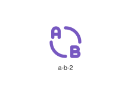
</div>
</div>

{{#endtab}}
{{#tab name="Code"}}

```xml
{{#include ../samples/icons/Tabler-Icons/a-b-2-96209855.xal}}
```

{{#endtab}}
{{#endtabs}}

<div class="xal-ref-tag"><code>&lt;item id=&#34;100001&#34; /&gt;</code></div>

</div>
<div class="xal-ref-card">
<div class="xal-ref-title">a-b-off</div>

{{#tabs name="svg-ref-0001"}}
{{#tab name="Preview"}}
<div class="xal-ref-preview">
<div>
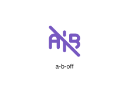
</div>
</div>

{{#endtab}}
{{#tab name="Code"}}

```xml
{{#include ../samples/icons/Tabler-Icons/a-b-off-ceed2856.xal}}
```

{{#endtab}}
{{#endtabs}}

<div class="xal-ref-tag"><code>&lt;item id=&#34;100002&#34; /&gt;</code></div>

</div>
<div class="xal-ref-card">
<div class="xal-ref-title">a-b</div>

{{#tabs name="svg-ref-0002"}}
{{#tab name="Preview"}}
<div class="xal-ref-preview">
<div>
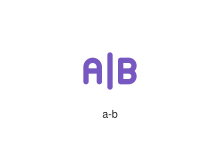
</div>
</div>

{{#endtab}}
{{#tab name="Code"}}

```xml
{{#include ../samples/icons/Tabler-Icons/a-b-87a49c58.xal}}
```

{{#endtab}}
{{#endtabs}}

<div class="xal-ref-tag"><code>&lt;item id=&#34;100000&#34; /&gt;</code></div>

</div>
<div class="xal-ref-card">
<div class="xal-ref-title">abacus-off</div>

{{#tabs name="svg-ref-0003"}}
{{#tab name="Preview"}}
<div class="xal-ref-preview">
<div>
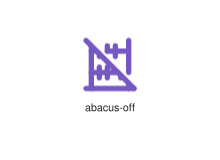
</div>
</div>

{{#endtab}}
{{#tab name="Code"}}

```xml
{{#include ../samples/icons/Tabler-Icons/abacus-off-147846c0.xal}}
```

{{#endtab}}
{{#endtabs}}

<div class="xal-ref-tag"><code>&lt;item id=&#34;100004&#34; /&gt;</code></div>

</div>
<div class="xal-ref-card">
<div class="xal-ref-title">abacus</div>

{{#tabs name="svg-ref-0004"}}
{{#tab name="Preview"}}
<div class="xal-ref-preview">
<div>
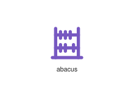
</div>
</div>

{{#endtab}}
{{#tab name="Code"}}

```xml
{{#include ../samples/icons/Tabler-Icons/abacus-3f785cae.xal}}
```

{{#endtab}}
{{#endtabs}}

<div class="xal-ref-tag"><code>&lt;item id=&#34;100003&#34; /&gt;</code></div>

</div>
<div class="xal-ref-card">
<div class="xal-ref-title">abc</div>

{{#tabs name="svg-ref-0005"}}
{{#tab name="Preview"}}
<div class="xal-ref-preview">
<div>
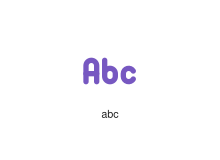
</div>
</div>

{{#endtab}}
{{#tab name="Code"}}

```xml
{{#include ../samples/icons/Tabler-Icons/abc-44ca0d51.xal}}
```

{{#endtab}}
{{#endtabs}}

<div class="xal-ref-tag"><code>&lt;item id=&#34;100005&#34; /&gt;</code></div>

</div>
<div class="xal-ref-card">
<div class="xal-ref-title">access-point-off</div>

{{#tabs name="svg-ref-0006"}}
{{#tab name="Preview"}}
<div class="xal-ref-preview">
<div>

</div>
</div>

{{#endtab}}
{{#tab name="Code"}}

```xml
{{#include ../samples/icons/Tabler-Icons/access-point-off-ccc69815.xal}}
```

{{#endtab}}
{{#endtabs}}

<div class="xal-ref-tag"><code>&lt;item id=&#34;100007&#34; /&gt;</code></div>

</div>
<div class="xal-ref-card">
<div class="xal-ref-title">access-point</div>

{{#tabs name="svg-ref-0007"}}
{{#tab name="Preview"}}
<div class="xal-ref-preview">
<div>

</div>
</div>

{{#endtab}}
{{#tab name="Code"}}

```xml
{{#include ../samples/icons/Tabler-Icons/access-point-9af26660.xal}}
```

{{#endtab}}
{{#endtabs}}

<div class="xal-ref-tag"><code>&lt;item id=&#34;100006&#34; /&gt;</code></div>

</div>
<div class="xal-ref-card">
<div class="xal-ref-title">accessible-off</div>

{{#tabs name="svg-ref-0008"}}
{{#tab name="Preview"}}
<div class="xal-ref-preview">
<div>
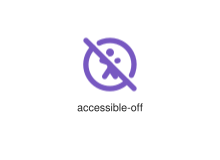
</div>
</div>

{{#endtab}}
{{#tab name="Code"}}

```xml
{{#include ../samples/icons/Tabler-Icons/accessible-off-7eec05f6.xal}}
```

{{#endtab}}
{{#endtabs}}

<div class="xal-ref-tag"><code>&lt;item id=&#34;100009&#34; /&gt;</code></div>

</div>
<div class="xal-ref-card">
<div class="xal-ref-title">accessible</div>

{{#tabs name="svg-ref-0009"}}
{{#tab name="Preview"}}
<div class="xal-ref-preview">
<div>
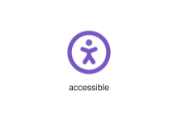
</div>
</div>

{{#endtab}}
{{#tab name="Code"}}

```xml
{{#include ../samples/icons/Tabler-Icons/accessible-ea454fbf.xal}}
```

{{#endtab}}
{{#endtabs}}

<div class="xal-ref-tag"><code>&lt;item id=&#34;100008&#34; /&gt;</code></div>

</div>
<div class="xal-ref-card">
<div class="xal-ref-title">activity-heartbeat</div>

{{#tabs name="svg-ref-0010"}}
{{#tab name="Preview"}}
<div class="xal-ref-preview">
<div>
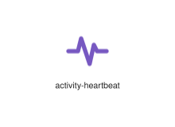
</div>
</div>

{{#endtab}}
{{#tab name="Code"}}

```xml
{{#include ../samples/icons/Tabler-Icons/activity-heartbeat-3875990f.xal}}
```

{{#endtab}}
{{#endtabs}}

<div class="xal-ref-tag"><code>&lt;item id=&#34;100011&#34; /&gt;</code></div>

</div>
<div class="xal-ref-card">
<div class="xal-ref-title">activity</div>

{{#tabs name="svg-ref-0011"}}
{{#tab name="Preview"}}
<div class="xal-ref-preview">
<div>
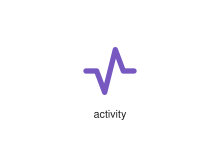
</div>
</div>

{{#endtab}}
{{#tab name="Code"}}

```xml
{{#include ../samples/icons/Tabler-Icons/activity-93064ff4.xal}}
```

{{#endtab}}
{{#endtabs}}

<div class="xal-ref-tag"><code>&lt;item id=&#34;100010&#34; /&gt;</code></div>

</div>
<div class="xal-ref-card">
<div class="xal-ref-title">ad-2</div>

{{#tabs name="svg-ref-0012"}}
{{#tab name="Preview"}}
<div class="xal-ref-preview">
<div>
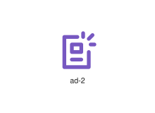
</div>
</div>

{{#endtab}}
{{#tab name="Code"}}

```xml
{{#include ../samples/icons/Tabler-Icons/ad-2-821ba238.xal}}
```

{{#endtab}}
{{#endtabs}}

<div class="xal-ref-tag"><code>&lt;item id=&#34;100013&#34; /&gt;</code></div>

</div>
<div class="xal-ref-card">
<div class="xal-ref-title">ad-circle-off</div>

{{#tabs name="svg-ref-0013"}}
{{#tab name="Preview"}}
<div class="xal-ref-preview">
<div>
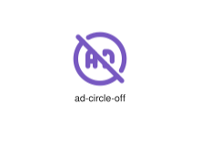
</div>
</div>

{{#endtab}}
{{#tab name="Code"}}

```xml
{{#include ../samples/icons/Tabler-Icons/ad-circle-off-16784c3e.xal}}
```

{{#endtab}}
{{#endtabs}}

<div class="xal-ref-tag"><code>&lt;item id=&#34;100015&#34; /&gt;</code></div>

</div>
<div class="xal-ref-card">
<div class="xal-ref-title">ad-circle</div>

{{#tabs name="svg-ref-0014"}}
{{#tab name="Preview"}}
<div class="xal-ref-preview">
<div>
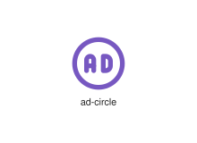
</div>
</div>

{{#endtab}}
{{#tab name="Code"}}

```xml
{{#include ../samples/icons/Tabler-Icons/ad-circle-3b427fb2.xal}}
```

{{#endtab}}
{{#endtabs}}

<div class="xal-ref-tag"><code>&lt;item id=&#34;100014&#34; /&gt;</code></div>

</div>
<div class="xal-ref-card">
<div class="xal-ref-title">ad-off</div>

{{#tabs name="svg-ref-0015"}}
{{#tab name="Preview"}}
<div class="xal-ref-preview">
<div>
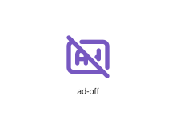
</div>
</div>

{{#endtab}}
{{#tab name="Code"}}

```xml
{{#include ../samples/icons/Tabler-Icons/ad-off-d8b2f035.xal}}
```

{{#endtab}}
{{#endtabs}}

<div class="xal-ref-tag"><code>&lt;item id=&#34;100016&#34; /&gt;</code></div>

</div>
<div class="xal-ref-card">
<div class="xal-ref-title">ad</div>

{{#tabs name="svg-ref-0016"}}
{{#tab name="Preview"}}
<div class="xal-ref-preview">
<div>
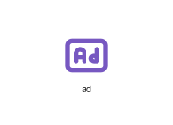
</div>
</div>

{{#endtab}}
{{#tab name="Code"}}

```xml
{{#include ../samples/icons/Tabler-Icons/ad-54d74e39.xal}}
```

{{#endtab}}
{{#endtabs}}

<div class="xal-ref-tag"><code>&lt;item id=&#34;100012&#34; /&gt;</code></div>

</div>
<div class="xal-ref-card">
<div class="xal-ref-title">address-book-off</div>

{{#tabs name="svg-ref-0017"}}
{{#tab name="Preview"}}
<div class="xal-ref-preview">
<div>

</div>
</div>

{{#endtab}}
{{#tab name="Code"}}

```xml
{{#include ../samples/icons/Tabler-Icons/address-book-off-ad344f57.xal}}
```

{{#endtab}}
{{#endtabs}}

<div class="xal-ref-tag"><code>&lt;item id=&#34;100018&#34; /&gt;</code></div>

</div>
<div class="xal-ref-card">
<div class="xal-ref-title">address-book</div>

{{#tabs name="svg-ref-0018"}}
{{#tab name="Preview"}}
<div class="xal-ref-preview">
<div>

</div>
</div>

{{#endtab}}
{{#tab name="Code"}}

```xml
{{#include ../samples/icons/Tabler-Icons/address-book-bb96c8e3.xal}}
```

{{#endtab}}
{{#endtabs}}

<div class="xal-ref-tag"><code>&lt;item id=&#34;100017&#34; /&gt;</code></div>

</div>
<div class="xal-ref-card">
<div class="xal-ref-title">adjustments-alt</div>

{{#tabs name="svg-ref-0019"}}
{{#tab name="Preview"}}
<div class="xal-ref-preview">
<div>
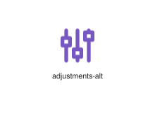
</div>
</div>

{{#endtab}}
{{#tab name="Code"}}

```xml
{{#include ../samples/icons/Tabler-Icons/adjustments-alt-d9e5c9c1.xal}}
```

{{#endtab}}
{{#endtabs}}

<div class="xal-ref-tag"><code>&lt;item id=&#34;100020&#34; /&gt;</code></div>

</div>
<div class="xal-ref-card">
<div class="xal-ref-title">adjustments-bolt</div>

{{#tabs name="svg-ref-0020"}}
{{#tab name="Preview"}}
<div class="xal-ref-preview">
<div>
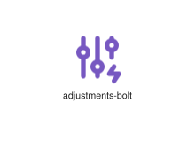
</div>
</div>

{{#endtab}}
{{#tab name="Code"}}

```xml
{{#include ../samples/icons/Tabler-Icons/adjustments-bolt-a35a70ff.xal}}
```

{{#endtab}}
{{#endtabs}}

<div class="xal-ref-tag"><code>&lt;item id=&#34;100021&#34; /&gt;</code></div>

</div>
<div class="xal-ref-card">
<div class="xal-ref-title">adjustments-cancel</div>

{{#tabs name="svg-ref-0021"}}
{{#tab name="Preview"}}
<div class="xal-ref-preview">
<div>

</div>
</div>

{{#endtab}}
{{#tab name="Code"}}

```xml
{{#include ../samples/icons/Tabler-Icons/adjustments-cancel-7daed4ec.xal}}
```

{{#endtab}}
{{#endtabs}}

<div class="xal-ref-tag"><code>&lt;item id=&#34;100022&#34; /&gt;</code></div>

</div>
<div class="xal-ref-card">
<div class="xal-ref-title">adjustments-check</div>

{{#tabs name="svg-ref-0022"}}
{{#tab name="Preview"}}
<div class="xal-ref-preview">
<div>
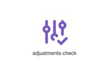
</div>
</div>

{{#endtab}}
{{#tab name="Code"}}

```xml
{{#include ../samples/icons/Tabler-Icons/adjustments-check-46e6259c.xal}}
```

{{#endtab}}
{{#endtabs}}

<div class="xal-ref-tag"><code>&lt;item id=&#34;100023&#34; /&gt;</code></div>

</div>
<div class="xal-ref-card">
<div class="xal-ref-title">adjustments-code</div>

{{#tabs name="svg-ref-0023"}}
{{#tab name="Preview"}}
<div class="xal-ref-preview">
<div>
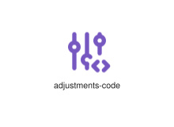
</div>
</div>

{{#endtab}}
{{#tab name="Code"}}

```xml
{{#include ../samples/icons/Tabler-Icons/adjustments-code-de234c3e.xal}}
```

{{#endtab}}
{{#endtabs}}

<div class="xal-ref-tag"><code>&lt;item id=&#34;100024&#34; /&gt;</code></div>

</div>
<div class="xal-ref-card">
<div class="xal-ref-title">adjustments-cog</div>

{{#tabs name="svg-ref-0024"}}
{{#tab name="Preview"}}
<div class="xal-ref-preview">
<div>
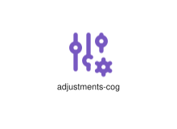
</div>
</div>

{{#endtab}}
{{#tab name="Code"}}

```xml
{{#include ../samples/icons/Tabler-Icons/adjustments-cog-efae4714.xal}}
```

{{#endtab}}
{{#endtabs}}

<div class="xal-ref-tag"><code>&lt;item id=&#34;100025&#34; /&gt;</code></div>

</div>
<div class="xal-ref-card">
<div class="xal-ref-title">adjustments-dollar</div>

{{#tabs name="svg-ref-0025"}}
{{#tab name="Preview"}}
<div class="xal-ref-preview">
<div>

</div>
</div>

{{#endtab}}
{{#tab name="Code"}}

```xml
{{#include ../samples/icons/Tabler-Icons/adjustments-dollar-a79c0866.xal}}
```

{{#endtab}}
{{#endtabs}}

<div class="xal-ref-tag"><code>&lt;item id=&#34;100026&#34; /&gt;</code></div>

</div>
<div class="xal-ref-card">
<div class="xal-ref-title">adjustments-down</div>

{{#tabs name="svg-ref-0026"}}
{{#tab name="Preview"}}
<div class="xal-ref-preview">
<div>

</div>
</div>

{{#endtab}}
{{#tab name="Code"}}

```xml
{{#include ../samples/icons/Tabler-Icons/adjustments-down-26740403.xal}}
```

{{#endtab}}
{{#endtabs}}

<div class="xal-ref-tag"><code>&lt;item id=&#34;100027&#34; /&gt;</code></div>

</div>
<div class="xal-ref-card">
<div class="xal-ref-title">adjustments-exclamation</div>

{{#tabs name="svg-ref-0027"}}
{{#tab name="Preview"}}
<div class="xal-ref-preview">
<div>
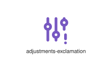
</div>
</div>

{{#endtab}}
{{#tab name="Code"}}

```xml
{{#include ../samples/icons/Tabler-Icons/adjustments-exclamation-a73a3297.xal}}
```

{{#endtab}}
{{#endtabs}}

<div class="xal-ref-tag"><code>&lt;item id=&#34;100028&#34; /&gt;</code></div>

</div>
<div class="xal-ref-card">
<div class="xal-ref-title">adjustments-heart</div>

{{#tabs name="svg-ref-0028"}}
{{#tab name="Preview"}}
<div class="xal-ref-preview">
<div>
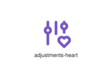
</div>
</div>

{{#endtab}}
{{#tab name="Code"}}

```xml
{{#include ../samples/icons/Tabler-Icons/adjustments-heart-81c35bee.xal}}
```

{{#endtab}}
{{#endtabs}}

<div class="xal-ref-tag"><code>&lt;item id=&#34;100029&#34; /&gt;</code></div>

</div>
<div class="xal-ref-card">
<div class="xal-ref-title">adjustments-horizontal</div>

{{#tabs name="svg-ref-0029"}}
{{#tab name="Preview"}}
<div class="xal-ref-preview">
<div>
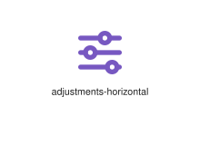
</div>
</div>

{{#endtab}}
{{#tab name="Code"}}

```xml
{{#include ../samples/icons/Tabler-Icons/adjustments-horizontal-a1c6d24c.xal}}
```

{{#endtab}}
{{#endtabs}}

<div class="xal-ref-tag"><code>&lt;item id=&#34;100030&#34; /&gt;</code></div>

</div>
<div class="xal-ref-card">
<div class="xal-ref-title">adjustments-minus</div>

{{#tabs name="svg-ref-0030"}}
{{#tab name="Preview"}}
<div class="xal-ref-preview">
<div>
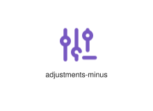
</div>
</div>

{{#endtab}}
{{#tab name="Code"}}

```xml
{{#include ../samples/icons/Tabler-Icons/adjustments-minus-c59697af.xal}}
```

{{#endtab}}
{{#endtabs}}

<div class="xal-ref-tag"><code>&lt;item id=&#34;100031&#34; /&gt;</code></div>

</div>
<div class="xal-ref-card">
<div class="xal-ref-title">adjustments-off</div>

{{#tabs name="svg-ref-0031"}}
{{#tab name="Preview"}}
<div class="xal-ref-preview">
<div>
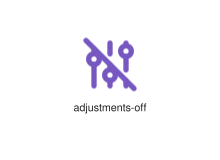
</div>
</div>

{{#endtab}}
{{#tab name="Code"}}

```xml
{{#include ../samples/icons/Tabler-Icons/adjustments-off-32615518.xal}}
```

{{#endtab}}
{{#endtabs}}

<div class="xal-ref-tag"><code>&lt;item id=&#34;100032&#34; /&gt;</code></div>

</div>
<div class="xal-ref-card">
<div class="xal-ref-title">adjustments-pause</div>

{{#tabs name="svg-ref-0032"}}
{{#tab name="Preview"}}
<div class="xal-ref-preview">
<div>
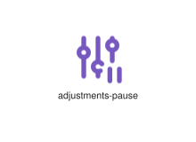
</div>
</div>

{{#endtab}}
{{#tab name="Code"}}

```xml
{{#include ../samples/icons/Tabler-Icons/adjustments-pause-17dc6037.xal}}
```

{{#endtab}}
{{#endtabs}}

<div class="xal-ref-tag"><code>&lt;item id=&#34;100033&#34; /&gt;</code></div>

</div>
<div class="xal-ref-card">
<div class="xal-ref-title">adjustments-pin</div>

{{#tabs name="svg-ref-0033"}}
{{#tab name="Preview"}}
<div class="xal-ref-preview">
<div>

</div>
</div>

{{#endtab}}
{{#tab name="Code"}}

```xml
{{#include ../samples/icons/Tabler-Icons/adjustments-pin-62d1402b.xal}}
```

{{#endtab}}
{{#endtabs}}

<div class="xal-ref-tag"><code>&lt;item id=&#34;100034&#34; /&gt;</code></div>

</div>
<div class="xal-ref-card">
<div class="xal-ref-title">adjustments-plus</div>

{{#tabs name="svg-ref-0034"}}
{{#tab name="Preview"}}
<div class="xal-ref-preview">
<div>
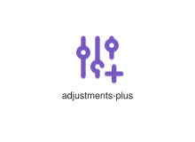
</div>
</div>

{{#endtab}}
{{#tab name="Code"}}

```xml
{{#include ../samples/icons/Tabler-Icons/adjustments-plus-3ad5d377.xal}}
```

{{#endtab}}
{{#endtabs}}

<div class="xal-ref-tag"><code>&lt;item id=&#34;100035&#34; /&gt;</code></div>

</div>
<div class="xal-ref-card">
<div class="xal-ref-title">adjustments-question</div>

{{#tabs name="svg-ref-0035"}}
{{#tab name="Preview"}}
<div class="xal-ref-preview">
<div>
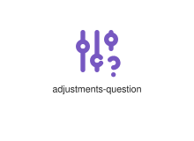
</div>
</div>

{{#endtab}}
{{#tab name="Code"}}

```xml
{{#include ../samples/icons/Tabler-Icons/adjustments-question-99f82a52.xal}}
```

{{#endtab}}
{{#endtabs}}

<div class="xal-ref-tag"><code>&lt;item id=&#34;100036&#34; /&gt;</code></div>

</div>
<div class="xal-ref-card">
<div class="xal-ref-title">adjustments-search</div>

{{#tabs name="svg-ref-0036"}}
{{#tab name="Preview"}}
<div class="xal-ref-preview">
<div>
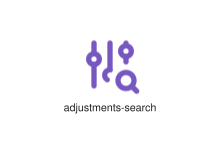
</div>
</div>

{{#endtab}}
{{#tab name="Code"}}

```xml
{{#include ../samples/icons/Tabler-Icons/adjustments-search-3cbcc403.xal}}
```

{{#endtab}}
{{#endtabs}}

<div class="xal-ref-tag"><code>&lt;item id=&#34;100037&#34; /&gt;</code></div>

</div>
<div class="xal-ref-card">
<div class="xal-ref-title">adjustments-share</div>

{{#tabs name="svg-ref-0037"}}
{{#tab name="Preview"}}
<div class="xal-ref-preview">
<div>

</div>
</div>

{{#endtab}}
{{#tab name="Code"}}

```xml
{{#include ../samples/icons/Tabler-Icons/adjustments-share-69d32ca1.xal}}
```

{{#endtab}}
{{#endtabs}}

<div class="xal-ref-tag"><code>&lt;item id=&#34;100038&#34; /&gt;</code></div>

</div>
<div class="xal-ref-card">
<div class="xal-ref-title">adjustments-spark</div>

{{#tabs name="svg-ref-0038"}}
{{#tab name="Preview"}}
<div class="xal-ref-preview">
<div>

</div>
</div>

{{#endtab}}
{{#tab name="Code"}}

```xml
{{#include ../samples/icons/Tabler-Icons/adjustments-spark-79bdb85e.xal}}
```

{{#endtab}}
{{#endtabs}}

<div class="xal-ref-tag"><code>&lt;item id=&#34;100039&#34; /&gt;</code></div>

</div>
<div class="xal-ref-card">
<div class="xal-ref-title">adjustments-star</div>

{{#tabs name="svg-ref-0039"}}
{{#tab name="Preview"}}
<div class="xal-ref-preview">
<div>
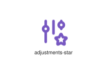
</div>
</div>

{{#endtab}}
{{#tab name="Code"}}

```xml
{{#include ../samples/icons/Tabler-Icons/adjustments-star-454c6f00.xal}}
```

{{#endtab}}
{{#endtabs}}

<div class="xal-ref-tag"><code>&lt;item id=&#34;100040&#34; /&gt;</code></div>

</div>
<div class="xal-ref-card">
<div class="xal-ref-title">adjustments-up</div>

{{#tabs name="svg-ref-0040"}}
{{#tab name="Preview"}}
<div class="xal-ref-preview">
<div>
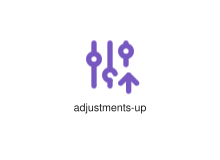
</div>
</div>

{{#endtab}}
{{#tab name="Code"}}

```xml
{{#include ../samples/icons/Tabler-Icons/adjustments-up-d6bdd134.xal}}
```

{{#endtab}}
{{#endtabs}}

<div class="xal-ref-tag"><code>&lt;item id=&#34;100041&#34; /&gt;</code></div>

</div>
<div class="xal-ref-card">
<div class="xal-ref-title">adjustments-x</div>

{{#tabs name="svg-ref-0041"}}
{{#tab name="Preview"}}
<div class="xal-ref-preview">
<div>
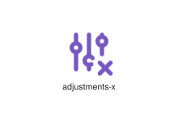
</div>
</div>

{{#endtab}}
{{#tab name="Code"}}

```xml
{{#include ../samples/icons/Tabler-Icons/adjustments-x-c4f97995.xal}}
```

{{#endtab}}
{{#endtabs}}

<div class="xal-ref-tag"><code>&lt;item id=&#34;100042&#34; /&gt;</code></div>

</div>
<div class="xal-ref-card">
<div class="xal-ref-title">adjustments</div>

{{#tabs name="svg-ref-0042"}}
{{#tab name="Preview"}}
<div class="xal-ref-preview">
<div>
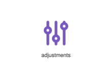
</div>
</div>

{{#endtab}}
{{#tab name="Code"}}

```xml
{{#include ../samples/icons/Tabler-Icons/adjustments-f2b60375.xal}}
```

{{#endtab}}
{{#endtabs}}

<div class="xal-ref-tag"><code>&lt;item id=&#34;100019&#34; /&gt;</code></div>

</div>
<div class="xal-ref-card">
<div class="xal-ref-title">aerial-lift</div>

{{#tabs name="svg-ref-0043"}}
{{#tab name="Preview"}}
<div class="xal-ref-preview">
<div>
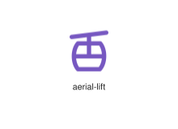
</div>
</div>

{{#endtab}}
{{#tab name="Code"}}

```xml
{{#include ../samples/icons/Tabler-Icons/aerial-lift-b208d2fd.xal}}
```

{{#endtab}}
{{#endtabs}}

<div class="xal-ref-tag"><code>&lt;item id=&#34;100043&#34; /&gt;</code></div>

</div>
<div class="xal-ref-card">
<div class="xal-ref-title">affiliate</div>

{{#tabs name="svg-ref-0044"}}
{{#tab name="Preview"}}
<div class="xal-ref-preview">
<div>
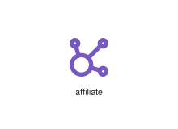
</div>
</div>

{{#endtab}}
{{#tab name="Code"}}

```xml
{{#include ../samples/icons/Tabler-Icons/affiliate-266e16a2.xal}}
```

{{#endtab}}
{{#endtabs}}

<div class="xal-ref-tag"><code>&lt;item id=&#34;100044&#34; /&gt;</code></div>

</div>
<div class="xal-ref-card">
<div class="xal-ref-title">ai</div>

{{#tabs name="svg-ref-0045"}}
{{#tab name="Preview"}}
<div class="xal-ref-preview">
<div>
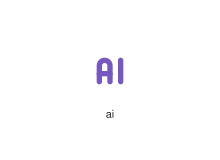
</div>
</div>

{{#endtab}}
{{#tab name="Code"}}

```xml
{{#include ../samples/icons/Tabler-Icons/ai-ac478a88.xal}}
```

{{#endtab}}
{{#endtabs}}

<div class="xal-ref-tag"><code>&lt;item id=&#34;100045&#34; /&gt;</code></div>

</div>
<div class="xal-ref-card">
<div class="xal-ref-title">air-balloon</div>

{{#tabs name="svg-ref-0046"}}
{{#tab name="Preview"}}
<div class="xal-ref-preview">
<div>
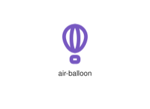
</div>
</div>

{{#endtab}}
{{#tab name="Code"}}

```xml
{{#include ../samples/icons/Tabler-Icons/air-balloon-60e2de7b.xal}}
```

{{#endtab}}
{{#endtabs}}

<div class="xal-ref-tag"><code>&lt;item id=&#34;100046&#34; /&gt;</code></div>

</div>
<div class="xal-ref-card">
<div class="xal-ref-title">air-conditioning-disabled</div>

{{#tabs name="svg-ref-0047"}}
{{#tab name="Preview"}}
<div class="xal-ref-preview">
<div>

</div>
</div>

{{#endtab}}
{{#tab name="Code"}}

```xml
{{#include ../samples/icons/Tabler-Icons/air-conditioning-disabled-7d955362.xal}}
```

{{#endtab}}
{{#endtabs}}

<div class="xal-ref-tag"><code>&lt;item id=&#34;100048&#34; /&gt;</code></div>

</div>
<div class="xal-ref-card">
<div class="xal-ref-title">air-conditioning</div>

{{#tabs name="svg-ref-0048"}}
{{#tab name="Preview"}}
<div class="xal-ref-preview">
<div>

</div>
</div>

{{#endtab}}
{{#tab name="Code"}}

```xml
{{#include ../samples/icons/Tabler-Icons/air-conditioning-3645e5b1.xal}}
```

{{#endtab}}
{{#endtabs}}

<div class="xal-ref-tag"><code>&lt;item id=&#34;100047&#34; /&gt;</code></div>

</div>
<div class="xal-ref-card">
<div class="xal-ref-title">air-traffic-control</div>

{{#tabs name="svg-ref-0049"}}
{{#tab name="Preview"}}
<div class="xal-ref-preview">
<div>
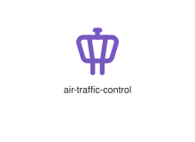
</div>
</div>

{{#endtab}}
{{#tab name="Code"}}

```xml
{{#include ../samples/icons/Tabler-Icons/air-traffic-control-2c6424ef.xal}}
```

{{#endtab}}
{{#endtabs}}

<div class="xal-ref-tag"><code>&lt;item id=&#34;100049&#34; /&gt;</code></div>

</div>
<div class="xal-ref-card">
<div class="xal-ref-title">alarm-average</div>

{{#tabs name="svg-ref-0050"}}
{{#tab name="Preview"}}
<div class="xal-ref-preview">
<div>
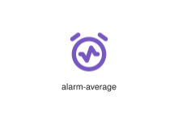
</div>
</div>

{{#endtab}}
{{#tab name="Code"}}

```xml
{{#include ../samples/icons/Tabler-Icons/alarm-average-a7abe8bb.xal}}
```

{{#endtab}}
{{#endtabs}}

<div class="xal-ref-tag"><code>&lt;item id=&#34;100051&#34; /&gt;</code></div>

</div>
<div class="xal-ref-card">
<div class="xal-ref-title">alarm-minus</div>

{{#tabs name="svg-ref-0051"}}
{{#tab name="Preview"}}
<div class="xal-ref-preview">
<div>
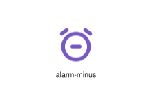
</div>
</div>

{{#endtab}}
{{#tab name="Code"}}

```xml
{{#include ../samples/icons/Tabler-Icons/alarm-minus-77cccfca.xal}}
```

{{#endtab}}
{{#endtabs}}

<div class="xal-ref-tag"><code>&lt;item id=&#34;100052&#34; /&gt;</code></div>

</div>
<div class="xal-ref-card">
<div class="xal-ref-title">alarm-off</div>

{{#tabs name="svg-ref-0052"}}
{{#tab name="Preview"}}
<div class="xal-ref-preview">
<div>
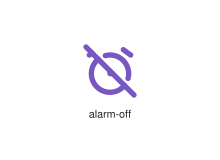
</div>
</div>

{{#endtab}}
{{#tab name="Code"}}

```xml
{{#include ../samples/icons/Tabler-Icons/alarm-off-d901eb16.xal}}
```

{{#endtab}}
{{#endtabs}}

<div class="xal-ref-tag"><code>&lt;item id=&#34;100053&#34; /&gt;</code></div>

</div>
<div class="xal-ref-card">
<div class="xal-ref-title">alarm-plus</div>

{{#tabs name="svg-ref-0053"}}
{{#tab name="Preview"}}
<div class="xal-ref-preview">
<div>
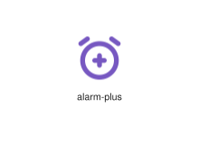
</div>
</div>

{{#endtab}}
{{#tab name="Code"}}

```xml
{{#include ../samples/icons/Tabler-Icons/alarm-plus-dd869ece.xal}}
```

{{#endtab}}
{{#endtabs}}

<div class="xal-ref-tag"><code>&lt;item id=&#34;100054&#34; /&gt;</code></div>

</div>
<div class="xal-ref-card">
<div class="xal-ref-title">alarm-smoke</div>

{{#tabs name="svg-ref-0054"}}
{{#tab name="Preview"}}
<div class="xal-ref-preview">
<div>
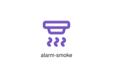
</div>
</div>

{{#endtab}}
{{#tab name="Code"}}

```xml
{{#include ../samples/icons/Tabler-Icons/alarm-smoke-e78f52ae.xal}}
```

{{#endtab}}
{{#endtabs}}

<div class="xal-ref-tag"><code>&lt;item id=&#34;100055&#34; /&gt;</code></div>

</div>
<div class="xal-ref-card">
<div class="xal-ref-title">alarm-snooze</div>

{{#tabs name="svg-ref-0055"}}
{{#tab name="Preview"}}
<div class="xal-ref-preview">
<div>

</div>
</div>

{{#endtab}}
{{#tab name="Code"}}

```xml
{{#include ../samples/icons/Tabler-Icons/alarm-snooze-4c49ed8f.xal}}
```

{{#endtab}}
{{#endtabs}}

<div class="xal-ref-tag"><code>&lt;item id=&#34;100056&#34; /&gt;</code></div>

</div>
<div class="xal-ref-card">
<div class="xal-ref-title">alarm</div>

{{#tabs name="svg-ref-0056"}}
{{#tab name="Preview"}}
<div class="xal-ref-preview">
<div>
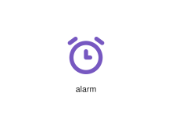
</div>
</div>

{{#endtab}}
{{#tab name="Code"}}

```xml
{{#include ../samples/icons/Tabler-Icons/alarm-0564a283.xal}}
```

{{#endtab}}
{{#endtabs}}

<div class="xal-ref-tag"><code>&lt;item id=&#34;100050&#34; /&gt;</code></div>

</div>
<div class="xal-ref-card">
<div class="xal-ref-title">album-off</div>

{{#tabs name="svg-ref-0057"}}
{{#tab name="Preview"}}
<div class="xal-ref-preview">
<div>

</div>
</div>

{{#endtab}}
{{#tab name="Code"}}

```xml
{{#include ../samples/icons/Tabler-Icons/album-off-a23f966e.xal}}
```

{{#endtab}}
{{#endtabs}}

<div class="xal-ref-tag"><code>&lt;item id=&#34;100058&#34; /&gt;</code></div>

</div>
<div class="xal-ref-card">
<div class="xal-ref-title">album</div>

{{#tabs name="svg-ref-0058"}}
{{#tab name="Preview"}}
<div class="xal-ref-preview">
<div>

</div>
</div>

{{#endtab}}
{{#tab name="Code"}}

```xml
{{#include ../samples/icons/Tabler-Icons/album-298988a6.xal}}
```

{{#endtab}}
{{#endtabs}}

<div class="xal-ref-tag"><code>&lt;item id=&#34;100057&#34; /&gt;</code></div>

</div>
<div class="xal-ref-card">
<div class="xal-ref-title">alert-circle-off</div>

{{#tabs name="svg-ref-0059"}}
{{#tab name="Preview"}}
<div class="xal-ref-preview">
<div>
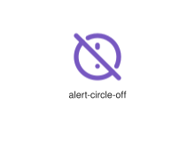
</div>
</div>

{{#endtab}}
{{#tab name="Code"}}

```xml
{{#include ../samples/icons/Tabler-Icons/alert-circle-off-5e136f80.xal}}
```

{{#endtab}}
{{#endtabs}}

<div class="xal-ref-tag"><code>&lt;item id=&#34;100060&#34; /&gt;</code></div>

</div>
<div class="xal-ref-card">
<div class="xal-ref-title">alert-circle</div>

{{#tabs name="svg-ref-0060"}}
{{#tab name="Preview"}}
<div class="xal-ref-preview">
<div>
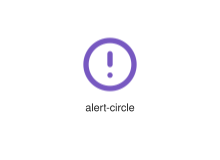
</div>
</div>

{{#endtab}}
{{#tab name="Code"}}

```xml
{{#include ../samples/icons/Tabler-Icons/alert-circle-720af6d0.xal}}
```

{{#endtab}}
{{#endtabs}}

<div class="xal-ref-tag"><code>&lt;item id=&#34;100059&#34; /&gt;</code></div>

</div>
<div class="xal-ref-card">
<div class="xal-ref-title">alert-hexagon-off</div>

{{#tabs name="svg-ref-0061"}}
{{#tab name="Preview"}}
<div class="xal-ref-preview">
<div>

</div>
</div>

{{#endtab}}
{{#tab name="Code"}}

```xml
{{#include ../samples/icons/Tabler-Icons/alert-hexagon-off-e79dc953.xal}}
```

{{#endtab}}
{{#endtabs}}

<div class="xal-ref-tag"><code>&lt;item id=&#34;100062&#34; /&gt;</code></div>

</div>
<div class="xal-ref-card">
<div class="xal-ref-title">alert-hexagon</div>

{{#tabs name="svg-ref-0062"}}
{{#tab name="Preview"}}
<div class="xal-ref-preview">
<div>
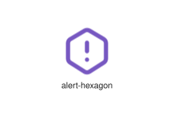
</div>
</div>

{{#endtab}}
{{#tab name="Code"}}

```xml
{{#include ../samples/icons/Tabler-Icons/alert-hexagon-fe79302c.xal}}
```

{{#endtab}}
{{#endtabs}}

<div class="xal-ref-tag"><code>&lt;item id=&#34;100061&#34; /&gt;</code></div>

</div>
<div class="xal-ref-card">
<div class="xal-ref-title">alert-octagon</div>

{{#tabs name="svg-ref-0063"}}
{{#tab name="Preview"}}
<div class="xal-ref-preview">
<div>
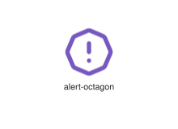
</div>
</div>

{{#endtab}}
{{#tab name="Code"}}

```xml
{{#include ../samples/icons/Tabler-Icons/alert-octagon-3c68a6fc.xal}}
```

{{#endtab}}
{{#endtabs}}

<div class="xal-ref-tag"><code>&lt;item id=&#34;100063&#34; /&gt;</code></div>

</div>
<div class="xal-ref-card">
<div class="xal-ref-title">alert-small-off</div>

{{#tabs name="svg-ref-0064"}}
{{#tab name="Preview"}}
<div class="xal-ref-preview">
<div>
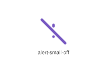
</div>
</div>

{{#endtab}}
{{#tab name="Code"}}

```xml
{{#include ../samples/icons/Tabler-Icons/alert-small-off-90026f9d.xal}}
```

{{#endtab}}
{{#endtabs}}

<div class="xal-ref-tag"><code>&lt;item id=&#34;100065&#34; /&gt;</code></div>

</div>
<div class="xal-ref-card">
<div class="xal-ref-title">alert-small</div>

{{#tabs name="svg-ref-0065"}}
{{#tab name="Preview"}}
<div class="xal-ref-preview">
<div>
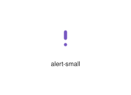
</div>
</div>

{{#endtab}}
{{#tab name="Code"}}

```xml
{{#include ../samples/icons/Tabler-Icons/alert-small-b2a7ebe2.xal}}
```

{{#endtab}}
{{#endtabs}}

<div class="xal-ref-tag"><code>&lt;item id=&#34;100064&#34; /&gt;</code></div>

</div>
<div class="xal-ref-card">
<div class="xal-ref-title">alert-square-rounded-off</div>

{{#tabs name="svg-ref-0066"}}
{{#tab name="Preview"}}
<div class="xal-ref-preview">
<div>

</div>
</div>

{{#endtab}}
{{#tab name="Code"}}

```xml
{{#include ../samples/icons/Tabler-Icons/alert-square-rounded-off-1aef6127.xal}}
```

{{#endtab}}
{{#endtabs}}

<div class="xal-ref-tag"><code>&lt;item id=&#34;100068&#34; /&gt;</code></div>

</div>
<div class="xal-ref-card">
<div class="xal-ref-title">alert-square-rounded</div>

{{#tabs name="svg-ref-0067"}}
{{#tab name="Preview"}}
<div class="xal-ref-preview">
<div>

</div>
</div>

{{#endtab}}
{{#tab name="Code"}}

```xml
{{#include ../samples/icons/Tabler-Icons/alert-square-rounded-bccbe0dd.xal}}
```

{{#endtab}}
{{#endtabs}}

<div class="xal-ref-tag"><code>&lt;item id=&#34;100067&#34; /&gt;</code></div>

</div>
<div class="xal-ref-card">
<div class="xal-ref-title">alert-square</div>

{{#tabs name="svg-ref-0068"}}
{{#tab name="Preview"}}
<div class="xal-ref-preview">
<div>

</div>
</div>

{{#endtab}}
{{#tab name="Code"}}

```xml
{{#include ../samples/icons/Tabler-Icons/alert-square-e63aec8a.xal}}
```

{{#endtab}}
{{#endtabs}}

<div class="xal-ref-tag"><code>&lt;item id=&#34;100066&#34; /&gt;</code></div>

</div>
<div class="xal-ref-card">
<div class="xal-ref-title">alert-triangle-off</div>

{{#tabs name="svg-ref-0069"}}
{{#tab name="Preview"}}
<div class="xal-ref-preview">
<div>

</div>
</div>

{{#endtab}}
{{#tab name="Code"}}

```xml
{{#include ../samples/icons/Tabler-Icons/alert-triangle-off-2a892951.xal}}
```

{{#endtab}}
{{#endtabs}}

<div class="xal-ref-tag"><code>&lt;item id=&#34;100070&#34; /&gt;</code></div>

</div>
<div class="xal-ref-card">
<div class="xal-ref-title">alert-triangle</div>

{{#tabs name="svg-ref-0070"}}
{{#tab name="Preview"}}
<div class="xal-ref-preview">
<div>

</div>
</div>

{{#endtab}}
{{#tab name="Code"}}

```xml
{{#include ../samples/icons/Tabler-Icons/alert-triangle-577f3edd.xal}}
```

{{#endtab}}
{{#endtabs}}

<div class="xal-ref-tag"><code>&lt;item id=&#34;100069&#34; /&gt;</code></div>

</div>
<div class="xal-ref-card">
<div class="xal-ref-title">alien</div>

{{#tabs name="svg-ref-0071"}}
{{#tab name="Preview"}}
<div class="xal-ref-preview">
<div>

</div>
</div>

{{#endtab}}
{{#tab name="Code"}}

```xml
{{#include ../samples/icons/Tabler-Icons/alien-6ff8a417.xal}}
```

{{#endtab}}
{{#endtabs}}

<div class="xal-ref-tag"><code>&lt;item id=&#34;100071&#34; /&gt;</code></div>

</div>
<div class="xal-ref-card">
<div class="xal-ref-title">align-box-bottom-center</div>

{{#tabs name="svg-ref-0072"}}
{{#tab name="Preview"}}
<div class="xal-ref-preview">
<div>

</div>
</div>

{{#endtab}}
{{#tab name="Code"}}

```xml
{{#include ../samples/icons/Tabler-Icons/align-box-bottom-center-50ff569b.xal}}
```

{{#endtab}}
{{#endtabs}}

<div class="xal-ref-tag"><code>&lt;item id=&#34;100072&#34; /&gt;</code></div>

</div>
<div class="xal-ref-card">
<div class="xal-ref-title">align-box-bottom-left</div>

{{#tabs name="svg-ref-0073"}}
{{#tab name="Preview"}}
<div class="xal-ref-preview">
<div>

</div>
</div>

{{#endtab}}
{{#tab name="Code"}}

```xml
{{#include ../samples/icons/Tabler-Icons/align-box-bottom-left-5d6530ec.xal}}
```

{{#endtab}}
{{#endtabs}}

<div class="xal-ref-tag"><code>&lt;item id=&#34;100073&#34; /&gt;</code></div>

</div>
<div class="xal-ref-card">
<div class="xal-ref-title">align-box-bottom-right</div>

{{#tabs name="svg-ref-0074"}}
{{#tab name="Preview"}}
<div class="xal-ref-preview">
<div>

</div>
</div>

{{#endtab}}
{{#tab name="Code"}}

```xml
{{#include ../samples/icons/Tabler-Icons/align-box-bottom-right-572d7403.xal}}
```

{{#endtab}}
{{#endtabs}}

<div class="xal-ref-tag"><code>&lt;item id=&#34;100074&#34; /&gt;</code></div>

</div>
<div class="xal-ref-card">
<div class="xal-ref-title">align-box-center-bottom</div>

{{#tabs name="svg-ref-0075"}}
{{#tab name="Preview"}}
<div class="xal-ref-preview">
<div>

</div>
</div>

{{#endtab}}
{{#tab name="Code"}}

```xml
{{#include ../samples/icons/Tabler-Icons/align-box-center-bottom-90e83e70.xal}}
```

{{#endtab}}
{{#endtabs}}

<div class="xal-ref-tag"><code>&lt;item id=&#34;100075&#34; /&gt;</code></div>

</div>
<div class="xal-ref-card">
<div class="xal-ref-title">align-box-center-middle</div>

{{#tabs name="svg-ref-0076"}}
{{#tab name="Preview"}}
<div class="xal-ref-preview">
<div>

</div>
</div>

{{#endtab}}
{{#tab name="Code"}}

```xml
{{#include ../samples/icons/Tabler-Icons/align-box-center-middle-bf7888fd.xal}}
```

{{#endtab}}
{{#endtabs}}

<div class="xal-ref-tag"><code>&lt;item id=&#34;100076&#34; /&gt;</code></div>

</div>
<div class="xal-ref-card">
<div class="xal-ref-title">align-box-center-stretch</div>

{{#tabs name="svg-ref-0077"}}
{{#tab name="Preview"}}
<div class="xal-ref-preview">
<div>

</div>
</div>

{{#endtab}}
{{#tab name="Code"}}

```xml
{{#include ../samples/icons/Tabler-Icons/align-box-center-stretch-c6699976.xal}}
```

{{#endtab}}
{{#endtabs}}

<div class="xal-ref-tag"><code>&lt;item id=&#34;100077&#34; /&gt;</code></div>

</div>
<div class="xal-ref-card">
<div class="xal-ref-title">align-box-center-top</div>

{{#tabs name="svg-ref-0078"}}
{{#tab name="Preview"}}
<div class="xal-ref-preview">
<div>

</div>
</div>

{{#endtab}}
{{#tab name="Code"}}

```xml
{{#include ../samples/icons/Tabler-Icons/align-box-center-top-ea7c1460.xal}}
```

{{#endtab}}
{{#endtabs}}

<div class="xal-ref-tag"><code>&lt;item id=&#34;100078&#34; /&gt;</code></div>

</div>
<div class="xal-ref-card">
<div class="xal-ref-title">align-box-left-bottom</div>

{{#tabs name="svg-ref-0079"}}
{{#tab name="Preview"}}
<div class="xal-ref-preview">
<div>

</div>
</div>

{{#endtab}}
{{#tab name="Code"}}

```xml
{{#include ../samples/icons/Tabler-Icons/align-box-left-bottom-1d39286e.xal}}
```

{{#endtab}}
{{#endtabs}}

<div class="xal-ref-tag"><code>&lt;item id=&#34;100079&#34; /&gt;</code></div>

</div>
<div class="xal-ref-card">
<div class="xal-ref-title">align-box-left-middle</div>

{{#tabs name="svg-ref-0080"}}
{{#tab name="Preview"}}
<div class="xal-ref-preview">
<div>

</div>
</div>

{{#endtab}}
{{#tab name="Code"}}

```xml
{{#include ../samples/icons/Tabler-Icons/align-box-left-middle-32a99ee3.xal}}
```

{{#endtab}}
{{#endtabs}}

<div class="xal-ref-tag"><code>&lt;item id=&#34;100080&#34; /&gt;</code></div>

</div>
<div class="xal-ref-card">
<div class="xal-ref-title">align-box-left-stretch</div>

{{#tabs name="svg-ref-0081"}}
{{#tab name="Preview"}}
<div class="xal-ref-preview">
<div>

</div>
</div>

{{#endtab}}
{{#tab name="Code"}}

```xml
{{#include ../samples/icons/Tabler-Icons/align-box-left-stretch-3ceb7503.xal}}
```

{{#endtab}}
{{#endtabs}}

<div class="xal-ref-tag"><code>&lt;item id=&#34;100081&#34; /&gt;</code></div>

</div>
<div class="xal-ref-card">
<div class="xal-ref-title">align-box-left-top</div>

{{#tabs name="svg-ref-0082"}}
{{#tab name="Preview"}}
<div class="xal-ref-preview">
<div>

</div>
</div>

{{#endtab}}
{{#tab name="Code"}}

```xml
{{#include ../samples/icons/Tabler-Icons/align-box-left-top-8cb96e95.xal}}
```

{{#endtab}}
{{#endtabs}}

<div class="xal-ref-tag"><code>&lt;item id=&#34;100082&#34; /&gt;</code></div>

</div>
<div class="xal-ref-card">
<div class="xal-ref-title">align-box-right-bottom</div>

{{#tabs name="svg-ref-0083"}}
{{#tab name="Preview"}}
<div class="xal-ref-preview">
<div>

</div>
</div>

{{#endtab}}
{{#tab name="Code"}}

```xml
{{#include ../samples/icons/Tabler-Icons/align-box-right-bottom-ff1f560d.xal}}
```

{{#endtab}}
{{#endtabs}}

<div class="xal-ref-tag"><code>&lt;item id=&#34;100083&#34; /&gt;</code></div>

</div>
<div class="xal-ref-card">
<div class="xal-ref-title">align-box-right-middle</div>

{{#tabs name="svg-ref-0084"}}
{{#tab name="Preview"}}
<div class="xal-ref-preview">
<div>

</div>
</div>

{{#endtab}}
{{#tab name="Code"}}

```xml
{{#include ../samples/icons/Tabler-Icons/align-box-right-middle-d08fe080.xal}}
```

{{#endtab}}
{{#endtabs}}

<div class="xal-ref-tag"><code>&lt;item id=&#34;100084&#34; /&gt;</code></div>

</div>
<div class="xal-ref-card">
<div class="xal-ref-title">align-box-right-stretch</div>

{{#tabs name="svg-ref-0085"}}
{{#tab name="Preview"}}
<div class="xal-ref-preview">
<div>

</div>
</div>

{{#endtab}}
{{#tab name="Code"}}

```xml
{{#include ../samples/icons/Tabler-Icons/align-box-right-stretch-e8b2639f.xal}}
```

{{#endtab}}
{{#endtabs}}

<div class="xal-ref-tag"><code>&lt;item id=&#34;100085&#34; /&gt;</code></div>

</div>
<div class="xal-ref-card">
<div class="xal-ref-title">align-box-right-top</div>

{{#tabs name="svg-ref-0086"}}
{{#tab name="Preview"}}
<div class="xal-ref-preview">
<div>

</div>
</div>

{{#endtab}}
{{#tab name="Code"}}

```xml
{{#include ../samples/icons/Tabler-Icons/align-box-right-top-de5dbc0a.xal}}
```

{{#endtab}}
{{#endtabs}}

<div class="xal-ref-tag"><code>&lt;item id=&#34;100086&#34; /&gt;</code></div>

</div>
<div class="xal-ref-card">
<div class="xal-ref-title">align-box-top-center</div>

{{#tabs name="svg-ref-0087"}}
{{#tab name="Preview"}}
<div class="xal-ref-preview">
<div>

</div>
</div>

{{#endtab}}
{{#tab name="Code"}}

```xml
{{#include ../samples/icons/Tabler-Icons/align-box-top-center-8c70d35e.xal}}
```

{{#endtab}}
{{#endtabs}}

<div class="xal-ref-tag"><code>&lt;item id=&#34;100087&#34; /&gt;</code></div>

</div>
<div class="xal-ref-card">
<div class="xal-ref-title">align-box-top-left</div>

{{#tabs name="svg-ref-0088"}}
{{#tab name="Preview"}}
<div class="xal-ref-preview">
<div>

</div>
</div>

{{#endtab}}
{{#tab name="Code"}}

```xml
{{#include ../samples/icons/Tabler-Icons/align-box-top-left-66520990.xal}}
```

{{#endtab}}
{{#endtabs}}

<div class="xal-ref-tag"><code>&lt;item id=&#34;100088&#34; /&gt;</code></div>

</div>
<div class="xal-ref-card">
<div class="xal-ref-title">align-box-top-right</div>

{{#tabs name="svg-ref-0089"}}
{{#tab name="Preview"}}
<div class="xal-ref-preview">
<div>

</div>
</div>

{{#endtab}}
{{#tab name="Code"}}

```xml
{{#include ../samples/icons/Tabler-Icons/align-box-top-right-0ea57e2d.xal}}
```

{{#endtab}}
{{#endtabs}}

<div class="xal-ref-tag"><code>&lt;item id=&#34;100089&#34; /&gt;</code></div>

</div>
</div>
