# Tabler-Icons - Page 4

This page references SVG files under `etc/resources/aws/svg/Tabler-Icons`.
Each card shows the SVG preview first and the XAL tag syntax in the Code tab.
Showing 271-360 of 4964 SVG files.

<style>
.xal-ref-grid{display:grid;grid-template-columns:repeat(3,minmax(0,1fr));gap:1rem;margin:1rem 0 1.5rem}.xal-ref-card{border:1px solid var(--table-border-color);border-radius:8px;overflow:hidden;background:var(--bg);padding:.75rem}.xal-ref-title{font-size:.9rem;font-weight:600;line-height:1.25;margin:0 0 .5rem;overflow-wrap:anywhere}.xal-ref-preview{display:flex;align-items:center;justify-content:center}.xal-ref-preview img{display:block;width:100%;height:auto}.xal-ref-card pre{margin:0;max-height:18rem;overflow:auto;white-space:pre}.xal-ref-card code{font-size:.78em}.xal-ref-tag{margin:.5rem 0 0;color:var(--fg);opacity:.72;overflow:auto;white-space:pre}.xal-ref-tag code{font-size:.72em}@media(max-width:900px){.xal-ref-grid{grid-template-columns:repeat(2,minmax(0,1fr))}}@media(max-width:560px){.xal-ref-grid{grid-template-columns:1fr}}
</style>

[Back to section index](tabler-icons.md)

<div class="xal-ref-grid">
<div class="xal-ref-card">
<div class="xal-ref-title">arrow-up-left</div>

{{#tabs name="svg-ref-0270"}}
{{#tab name="Preview"}}
<div class="xal-ref-preview">
<div>
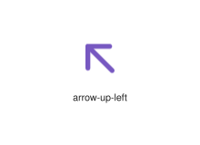
</div>
</div>

{{#endtab}}
{{#tab name="Code"}}

```xml
{{#include ../samples/icons/Tabler-Icons/arrow-up-left-16d855ff.xal}}
```

{{#endtab}}
{{#endtabs}}

<div class="xal-ref-tag"><code>&lt;item id=&#34;100270&#34; /&gt;</code></div>

</div>
<div class="xal-ref-card">
<div class="xal-ref-title">arrow-up-rhombus</div>

{{#tabs name="svg-ref-0271"}}
{{#tab name="Preview"}}
<div class="xal-ref-preview">
<div>
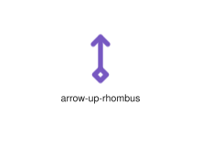
</div>
</div>

{{#endtab}}
{{#tab name="Code"}}

```xml
{{#include ../samples/icons/Tabler-Icons/arrow-up-rhombus-4f3e7e6d.xal}}
```

{{#endtab}}
{{#endtabs}}

<div class="xal-ref-tag"><code>&lt;item id=&#34;100272&#34; /&gt;</code></div>

</div>
<div class="xal-ref-card">
<div class="xal-ref-title">arrow-up-right-circle</div>

{{#tabs name="svg-ref-0272"}}
{{#tab name="Preview"}}
<div class="xal-ref-preview">
<div>
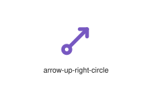
</div>
</div>

{{#endtab}}
{{#tab name="Code"}}

```xml
{{#include ../samples/icons/Tabler-Icons/arrow-up-right-circle-204c7a0e.xal}}
```

{{#endtab}}
{{#endtabs}}

<div class="xal-ref-tag"><code>&lt;item id=&#34;100274&#34; /&gt;</code></div>

</div>
<div class="xal-ref-card">
<div class="xal-ref-title">arrow-up-right</div>

{{#tabs name="svg-ref-0273"}}
{{#tab name="Preview"}}
<div class="xal-ref-preview">
<div>
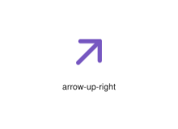
</div>
</div>

{{#endtab}}
{{#tab name="Code"}}

```xml
{{#include ../samples/icons/Tabler-Icons/arrow-up-right-d3d888b8.xal}}
```

{{#endtab}}
{{#endtabs}}

<div class="xal-ref-tag"><code>&lt;item id=&#34;100273&#34; /&gt;</code></div>

</div>
<div class="xal-ref-card">
<div class="xal-ref-title">arrow-up-square</div>

{{#tabs name="svg-ref-0274"}}
{{#tab name="Preview"}}
<div class="xal-ref-preview">
<div>
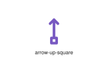
</div>
</div>

{{#endtab}}
{{#tab name="Code"}}

```xml
{{#include ../samples/icons/Tabler-Icons/arrow-up-square-026ebc53.xal}}
```

{{#endtab}}
{{#endtabs}}

<div class="xal-ref-tag"><code>&lt;item id=&#34;100275&#34; /&gt;</code></div>

</div>
<div class="xal-ref-card">
<div class="xal-ref-title">arrow-up-tail</div>

{{#tabs name="svg-ref-0275"}}
{{#tab name="Preview"}}
<div class="xal-ref-preview">
<div>
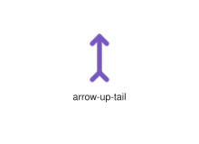
</div>
</div>

{{#endtab}}
{{#tab name="Code"}}

```xml
{{#include ../samples/icons/Tabler-Icons/arrow-up-tail-ec0f35e4.xal}}
```

{{#endtab}}
{{#endtabs}}

<div class="xal-ref-tag"><code>&lt;item id=&#34;100276&#34; /&gt;</code></div>

</div>
<div class="xal-ref-card">
<div class="xal-ref-title">arrow-up-to-arc</div>

{{#tabs name="svg-ref-0276"}}
{{#tab name="Preview"}}
<div class="xal-ref-preview">
<div>
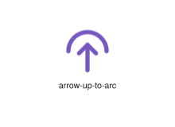
</div>
</div>

{{#endtab}}
{{#tab name="Code"}}

```xml
{{#include ../samples/icons/Tabler-Icons/arrow-up-to-arc-8d33231a.xal}}
```

{{#endtab}}
{{#endtabs}}

<div class="xal-ref-tag"><code>&lt;item id=&#34;100277&#34; /&gt;</code></div>

</div>
<div class="xal-ref-card">
<div class="xal-ref-title">arrow-up</div>

{{#tabs name="svg-ref-0277"}}
{{#tab name="Preview"}}
<div class="xal-ref-preview">
<div>
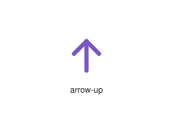
</div>
</div>

{{#endtab}}
{{#tab name="Code"}}

```xml
{{#include ../samples/icons/Tabler-Icons/arrow-up-38d8bd12.xal}}
```

{{#endtab}}
{{#endtabs}}

<div class="xal-ref-tag"><code>&lt;item id=&#34;100265&#34; /&gt;</code></div>

</div>
<div class="xal-ref-card">
<div class="xal-ref-title">arrow-wave-left-down</div>

{{#tabs name="svg-ref-0278"}}
{{#tab name="Preview"}}
<div class="xal-ref-preview">
<div>
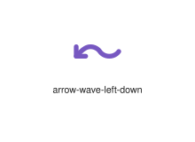
</div>
</div>

{{#endtab}}
{{#tab name="Code"}}

```xml
{{#include ../samples/icons/Tabler-Icons/arrow-wave-left-down-30d204e5.xal}}
```

{{#endtab}}
{{#endtabs}}

<div class="xal-ref-tag"><code>&lt;item id=&#34;100278&#34; /&gt;</code></div>

</div>
<div class="xal-ref-card">
<div class="xal-ref-title">arrow-wave-left-up</div>

{{#tabs name="svg-ref-0279"}}
{{#tab name="Preview"}}
<div class="xal-ref-preview">
<div>
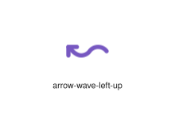
</div>
</div>

{{#endtab}}
{{#tab name="Code"}}

```xml
{{#include ../samples/icons/Tabler-Icons/arrow-wave-left-up-a3dc84c5.xal}}
```

{{#endtab}}
{{#endtabs}}

<div class="xal-ref-tag"><code>&lt;item id=&#34;100279&#34; /&gt;</code></div>

</div>
<div class="xal-ref-card">
<div class="xal-ref-title">arrow-wave-right-down</div>

{{#tabs name="svg-ref-0280"}}
{{#tab name="Preview"}}
<div class="xal-ref-preview">
<div>
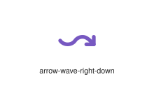
</div>
</div>

{{#endtab}}
{{#tab name="Code"}}

```xml
{{#include ../samples/icons/Tabler-Icons/arrow-wave-right-down-f76afe4e.xal}}
```

{{#endtab}}
{{#endtabs}}

<div class="xal-ref-tag"><code>&lt;item id=&#34;100280&#34; /&gt;</code></div>

</div>
<div class="xal-ref-card">
<div class="xal-ref-title">arrow-wave-right-up</div>

{{#tabs name="svg-ref-0281"}}
{{#tab name="Preview"}}
<div class="xal-ref-preview">
<div>
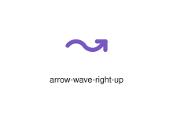
</div>
</div>

{{#endtab}}
{{#tab name="Code"}}

```xml
{{#include ../samples/icons/Tabler-Icons/arrow-wave-right-up-41b41e13.xal}}
```

{{#endtab}}
{{#endtabs}}

<div class="xal-ref-tag"><code>&lt;item id=&#34;100281&#34; /&gt;</code></div>

</div>
<div class="xal-ref-card">
<div class="xal-ref-title">arrow-zig-zag</div>

{{#tabs name="svg-ref-0282"}}
{{#tab name="Preview"}}
<div class="xal-ref-preview">
<div>
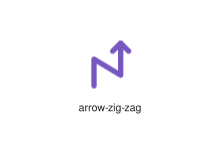
</div>
</div>

{{#endtab}}
{{#tab name="Code"}}

```xml
{{#include ../samples/icons/Tabler-Icons/arrow-zig-zag-5bc3713c.xal}}
```

{{#endtab}}
{{#endtabs}}

<div class="xal-ref-tag"><code>&lt;item id=&#34;100282&#34; /&gt;</code></div>

</div>
<div class="xal-ref-card">
<div class="xal-ref-title">arrows-cross</div>

{{#tabs name="svg-ref-0283"}}
{{#tab name="Preview"}}
<div class="xal-ref-preview">
<div>
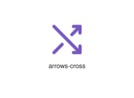
</div>
</div>

{{#endtab}}
{{#tab name="Code"}}

```xml
{{#include ../samples/icons/Tabler-Icons/arrows-cross-b9c400a5.xal}}
```

{{#endtab}}
{{#endtabs}}

<div class="xal-ref-tag"><code>&lt;item id=&#34;100283&#34; /&gt;</code></div>

</div>
<div class="xal-ref-card">
<div class="xal-ref-title">arrows-diagonal-2</div>

{{#tabs name="svg-ref-0284"}}
{{#tab name="Preview"}}
<div class="xal-ref-preview">
<div>
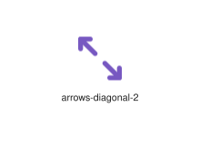
</div>
</div>

{{#endtab}}
{{#tab name="Code"}}

```xml
{{#include ../samples/icons/Tabler-Icons/arrows-diagonal-2-cba26aac.xal}}
```

{{#endtab}}
{{#endtabs}}

<div class="xal-ref-tag"><code>&lt;item id=&#34;100285&#34; /&gt;</code></div>

</div>
<div class="xal-ref-card">
<div class="xal-ref-title">arrows-diagonal-minimize-2</div>

{{#tabs name="svg-ref-0285"}}
{{#tab name="Preview"}}
<div class="xal-ref-preview">
<div>
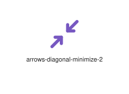
</div>
</div>

{{#endtab}}
{{#tab name="Code"}}

```xml
{{#include ../samples/icons/Tabler-Icons/arrows-diagonal-minimize-2-cfb7513f.xal}}
```

{{#endtab}}
{{#endtabs}}

<div class="xal-ref-tag"><code>&lt;item id=&#34;100287&#34; /&gt;</code></div>

</div>
<div class="xal-ref-card">
<div class="xal-ref-title">arrows-diagonal-minimize</div>

{{#tabs name="svg-ref-0286"}}
{{#tab name="Preview"}}
<div class="xal-ref-preview">
<div>
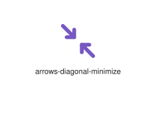
</div>
</div>

{{#endtab}}
{{#tab name="Code"}}

```xml
{{#include ../samples/icons/Tabler-Icons/arrows-diagonal-minimize-c77a46ab.xal}}
```

{{#endtab}}
{{#endtabs}}

<div class="xal-ref-tag"><code>&lt;item id=&#34;100286&#34; /&gt;</code></div>

</div>
<div class="xal-ref-card">
<div class="xal-ref-title">arrows-diagonal</div>

{{#tabs name="svg-ref-0287"}}
{{#tab name="Preview"}}
<div class="xal-ref-preview">
<div>
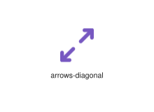
</div>
</div>

{{#endtab}}
{{#tab name="Code"}}

```xml
{{#include ../samples/icons/Tabler-Icons/arrows-diagonal-bb185fdc.xal}}
```

{{#endtab}}
{{#endtabs}}

<div class="xal-ref-tag"><code>&lt;item id=&#34;100284&#34; /&gt;</code></div>

</div>
<div class="xal-ref-card">
<div class="xal-ref-title">arrows-diff</div>

{{#tabs name="svg-ref-0288"}}
{{#tab name="Preview"}}
<div class="xal-ref-preview">
<div>
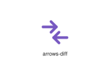
</div>
</div>

{{#endtab}}
{{#tab name="Code"}}

```xml
{{#include ../samples/icons/Tabler-Icons/arrows-diff-0769ea0b.xal}}
```

{{#endtab}}
{{#endtabs}}

<div class="xal-ref-tag"><code>&lt;item id=&#34;100288&#34; /&gt;</code></div>

</div>
<div class="xal-ref-card">
<div class="xal-ref-title">arrows-double-ne-sw</div>

{{#tabs name="svg-ref-0289"}}
{{#tab name="Preview"}}
<div class="xal-ref-preview">
<div>
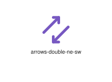
</div>
</div>

{{#endtab}}
{{#tab name="Code"}}

```xml
{{#include ../samples/icons/Tabler-Icons/arrows-double-ne-sw-c1536288.xal}}
```

{{#endtab}}
{{#endtabs}}

<div class="xal-ref-tag"><code>&lt;item id=&#34;100289&#34; /&gt;</code></div>

</div>
<div class="xal-ref-card">
<div class="xal-ref-title">arrows-double-nw-se</div>

{{#tabs name="svg-ref-0290"}}
{{#tab name="Preview"}}
<div class="xal-ref-preview">
<div>
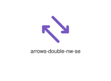
</div>
</div>

{{#endtab}}
{{#tab name="Code"}}

```xml
{{#include ../samples/icons/Tabler-Icons/arrows-double-nw-se-e5ed903c.xal}}
```

{{#endtab}}
{{#endtabs}}

<div class="xal-ref-tag"><code>&lt;item id=&#34;100290&#34; /&gt;</code></div>

</div>
<div class="xal-ref-card">
<div class="xal-ref-title">arrows-double-se-nw</div>

{{#tabs name="svg-ref-0291"}}
{{#tab name="Preview"}}
<div class="xal-ref-preview">
<div>
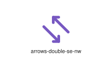
</div>
</div>

{{#endtab}}
{{#tab name="Code"}}

```xml
{{#include ../samples/icons/Tabler-Icons/arrows-double-se-nw-2394d6eb.xal}}
```

{{#endtab}}
{{#endtabs}}

<div class="xal-ref-tag"><code>&lt;item id=&#34;100291&#34; /&gt;</code></div>

</div>
<div class="xal-ref-card">
<div class="xal-ref-title">arrows-double-sw-ne</div>

{{#tabs name="svg-ref-0292"}}
{{#tab name="Preview"}}
<div class="xal-ref-preview">
<div>
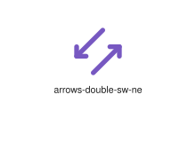
</div>
</div>

{{#endtab}}
{{#tab name="Code"}}

```xml
{{#include ../samples/icons/Tabler-Icons/arrows-double-sw-ne-072a245f.xal}}
```

{{#endtab}}
{{#endtabs}}

<div class="xal-ref-tag"><code>&lt;item id=&#34;100292&#34; /&gt;</code></div>

</div>
<div class="xal-ref-card">
<div class="xal-ref-title">arrows-down-up</div>

{{#tabs name="svg-ref-0293"}}
{{#tab name="Preview"}}
<div class="xal-ref-preview">
<div>
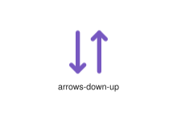
</div>
</div>

{{#endtab}}
{{#tab name="Code"}}

```xml
{{#include ../samples/icons/Tabler-Icons/arrows-down-up-74422ebb.xal}}
```

{{#endtab}}
{{#endtabs}}

<div class="xal-ref-tag"><code>&lt;item id=&#34;100294&#34; /&gt;</code></div>

</div>
<div class="xal-ref-card">
<div class="xal-ref-title">arrows-down</div>

{{#tabs name="svg-ref-0294"}}
{{#tab name="Preview"}}
<div class="xal-ref-preview">
<div>
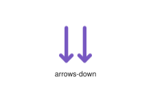
</div>
</div>

{{#endtab}}
{{#tab name="Code"}}

```xml
{{#include ../samples/icons/Tabler-Icons/arrows-down-9c4345ce.xal}}
```

{{#endtab}}
{{#endtabs}}

<div class="xal-ref-tag"><code>&lt;item id=&#34;100293&#34; /&gt;</code></div>

</div>
<div class="xal-ref-card">
<div class="xal-ref-title">arrows-exchange-2</div>

{{#tabs name="svg-ref-0295"}}
{{#tab name="Preview"}}
<div class="xal-ref-preview">
<div>
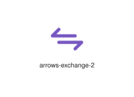
</div>
</div>

{{#endtab}}
{{#tab name="Code"}}

```xml
{{#include ../samples/icons/Tabler-Icons/arrows-exchange-2-0dc1e23b.xal}}
```

{{#endtab}}
{{#endtabs}}

<div class="xal-ref-tag"><code>&lt;item id=&#34;100296&#34; /&gt;</code></div>

</div>
<div class="xal-ref-card">
<div class="xal-ref-title">arrows-exchange</div>

{{#tabs name="svg-ref-0296"}}
{{#tab name="Preview"}}
<div class="xal-ref-preview">
<div>
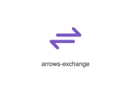
</div>
</div>

{{#endtab}}
{{#tab name="Code"}}

```xml
{{#include ../samples/icons/Tabler-Icons/arrows-exchange-5a4a840a.xal}}
```

{{#endtab}}
{{#endtabs}}

<div class="xal-ref-tag"><code>&lt;item id=&#34;100295&#34; /&gt;</code></div>

</div>
<div class="xal-ref-card">
<div class="xal-ref-title">arrows-horizontal</div>

{{#tabs name="svg-ref-0297"}}
{{#tab name="Preview"}}
<div class="xal-ref-preview">
<div>
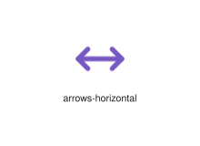
</div>
</div>

{{#endtab}}
{{#tab name="Code"}}

```xml
{{#include ../samples/icons/Tabler-Icons/arrows-horizontal-cc161501.xal}}
```

{{#endtab}}
{{#endtabs}}

<div class="xal-ref-tag"><code>&lt;item id=&#34;100297&#34; /&gt;</code></div>

</div>
<div class="xal-ref-card">
<div class="xal-ref-title">arrows-join-2</div>

{{#tabs name="svg-ref-0298"}}
{{#tab name="Preview"}}
<div class="xal-ref-preview">
<div>
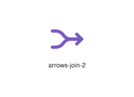
</div>
</div>

{{#endtab}}
{{#tab name="Code"}}

```xml
{{#include ../samples/icons/Tabler-Icons/arrows-join-2-39ccd7f4.xal}}
```

{{#endtab}}
{{#endtabs}}

<div class="xal-ref-tag"><code>&lt;item id=&#34;100299&#34; /&gt;</code></div>

</div>
<div class="xal-ref-card">
<div class="xal-ref-title">arrows-join</div>

{{#tabs name="svg-ref-0299"}}
{{#tab name="Preview"}}
<div class="xal-ref-preview">
<div>
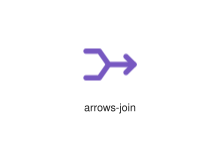
</div>
</div>

{{#endtab}}
{{#tab name="Code"}}

```xml
{{#include ../samples/icons/Tabler-Icons/arrows-join-b0153417.xal}}
```

{{#endtab}}
{{#endtabs}}

<div class="xal-ref-tag"><code>&lt;item id=&#34;100298&#34; /&gt;</code></div>

</div>
<div class="xal-ref-card">
<div class="xal-ref-title">arrows-left-down</div>

{{#tabs name="svg-ref-0300"}}
{{#tab name="Preview"}}
<div class="xal-ref-preview">
<div>
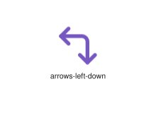
</div>
</div>

{{#endtab}}
{{#tab name="Code"}}

```xml
{{#include ../samples/icons/Tabler-Icons/arrows-left-down-58adfcd3.xal}}
```

{{#endtab}}
{{#endtabs}}

<div class="xal-ref-tag"><code>&lt;item id=&#34;100301&#34; /&gt;</code></div>

</div>
<div class="xal-ref-card">
<div class="xal-ref-title">arrows-left-right</div>

{{#tabs name="svg-ref-0301"}}
{{#tab name="Preview"}}
<div class="xal-ref-preview">
<div>
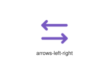
</div>
</div>

{{#endtab}}
{{#tab name="Code"}}

```xml
{{#include ../samples/icons/Tabler-Icons/arrows-left-right-a8b299a5.xal}}
```

{{#endtab}}
{{#endtabs}}

<div class="xal-ref-tag"><code>&lt;item id=&#34;100302&#34; /&gt;</code></div>

</div>
<div class="xal-ref-card">
<div class="xal-ref-title">arrows-left</div>

{{#tabs name="svg-ref-0302"}}
{{#tab name="Preview"}}
<div class="xal-ref-preview">
<div>
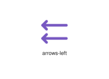
</div>
</div>

{{#endtab}}
{{#tab name="Code"}}

```xml
{{#include ../samples/icons/Tabler-Icons/arrows-left-090c5f28.xal}}
```

{{#endtab}}
{{#endtabs}}

<div class="xal-ref-tag"><code>&lt;item id=&#34;100300&#34; /&gt;</code></div>

</div>
<div class="xal-ref-card">
<div class="xal-ref-title">arrows-maximize</div>

{{#tabs name="svg-ref-0303"}}
{{#tab name="Preview"}}
<div class="xal-ref-preview">
<div>
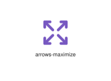
</div>
</div>

{{#endtab}}
{{#tab name="Code"}}

```xml
{{#include ../samples/icons/Tabler-Icons/arrows-maximize-6c885c62.xal}}
```

{{#endtab}}
{{#endtabs}}

<div class="xal-ref-tag"><code>&lt;item id=&#34;100303&#34; /&gt;</code></div>

</div>
<div class="xal-ref-card">
<div class="xal-ref-title">arrows-minimize</div>

{{#tabs name="svg-ref-0304"}}
{{#tab name="Preview"}}
<div class="xal-ref-preview">
<div>
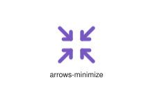
</div>
</div>

{{#endtab}}
{{#tab name="Code"}}

```xml
{{#include ../samples/icons/Tabler-Icons/arrows-minimize-fcfb4c88.xal}}
```

{{#endtab}}
{{#endtabs}}

<div class="xal-ref-tag"><code>&lt;item id=&#34;100304&#34; /&gt;</code></div>

</div>
<div class="xal-ref-card">
<div class="xal-ref-title">arrows-move-horizontal</div>

{{#tabs name="svg-ref-0305"}}
{{#tab name="Preview"}}
<div class="xal-ref-preview">
<div>
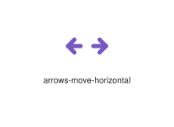
</div>
</div>

{{#endtab}}
{{#tab name="Code"}}

```xml
{{#include ../samples/icons/Tabler-Icons/arrows-move-horizontal-54f61513.xal}}
```

{{#endtab}}
{{#endtabs}}

<div class="xal-ref-tag"><code>&lt;item id=&#34;100306&#34; /&gt;</code></div>

</div>
<div class="xal-ref-card">
<div class="xal-ref-title">arrows-move-vertical</div>

{{#tabs name="svg-ref-0306"}}
{{#tab name="Preview"}}
<div class="xal-ref-preview">
<div>
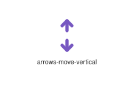
</div>
</div>

{{#endtab}}
{{#tab name="Code"}}

```xml
{{#include ../samples/icons/Tabler-Icons/arrows-move-vertical-578f334c.xal}}
```

{{#endtab}}
{{#endtabs}}

<div class="xal-ref-tag"><code>&lt;item id=&#34;100307&#34; /&gt;</code></div>

</div>
<div class="xal-ref-card">
<div class="xal-ref-title">arrows-move</div>

{{#tabs name="svg-ref-0307"}}
{{#tab name="Preview"}}
<div class="xal-ref-preview">
<div>
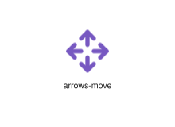
</div>
</div>

{{#endtab}}
{{#tab name="Code"}}

```xml
{{#include ../samples/icons/Tabler-Icons/arrows-move-3f80bc51.xal}}
```

{{#endtab}}
{{#endtabs}}

<div class="xal-ref-tag"><code>&lt;item id=&#34;100305&#34; /&gt;</code></div>

</div>
<div class="xal-ref-card">
<div class="xal-ref-title">arrows-random</div>

{{#tabs name="svg-ref-0308"}}
{{#tab name="Preview"}}
<div class="xal-ref-preview">
<div>
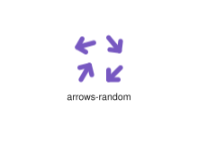
</div>
</div>

{{#endtab}}
{{#tab name="Code"}}

```xml
{{#include ../samples/icons/Tabler-Icons/arrows-random-93116850.xal}}
```

{{#endtab}}
{{#endtabs}}

<div class="xal-ref-tag"><code>&lt;item id=&#34;100308&#34; /&gt;</code></div>

</div>
<div class="xal-ref-card">
<div class="xal-ref-title">arrows-right-down</div>

{{#tabs name="svg-ref-0309"}}
{{#tab name="Preview"}}
<div class="xal-ref-preview">
<div>
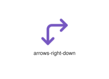
</div>
</div>

{{#endtab}}
{{#tab name="Code"}}

```xml
{{#include ../samples/icons/Tabler-Icons/arrows-right-down-38b8142f.xal}}
```

{{#endtab}}
{{#endtabs}}

<div class="xal-ref-tag"><code>&lt;item id=&#34;100310&#34; /&gt;</code></div>

</div>
<div class="xal-ref-card">
<div class="xal-ref-title">arrows-right-left</div>

{{#tabs name="svg-ref-0310"}}
{{#tab name="Preview"}}
<div class="xal-ref-preview">
<div>
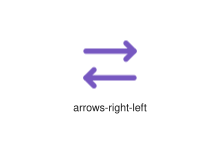
</div>
</div>

{{#endtab}}
{{#tab name="Code"}}

```xml
{{#include ../samples/icons/Tabler-Icons/arrows-right-left-adf70ec9.xal}}
```

{{#endtab}}
{{#endtabs}}

<div class="xal-ref-tag"><code>&lt;item id=&#34;100311&#34; /&gt;</code></div>

</div>
<div class="xal-ref-card">
<div class="xal-ref-title">arrows-right</div>

{{#tabs name="svg-ref-0311"}}
{{#tab name="Preview"}}
<div class="xal-ref-preview">
<div>
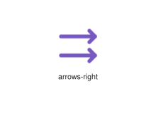
</div>
</div>

{{#endtab}}
{{#tab name="Code"}}

```xml
{{#include ../samples/icons/Tabler-Icons/arrows-right-cb701bc5.xal}}
```

{{#endtab}}
{{#endtabs}}

<div class="xal-ref-tag"><code>&lt;item id=&#34;100309&#34; /&gt;</code></div>

</div>
<div class="xal-ref-card">
<div class="xal-ref-title">arrows-shuffle-2</div>

{{#tabs name="svg-ref-0312"}}
{{#tab name="Preview"}}
<div class="xal-ref-preview">
<div>
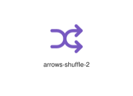
</div>
</div>

{{#endtab}}
{{#tab name="Code"}}

```xml
{{#include ../samples/icons/Tabler-Icons/arrows-shuffle-2-3a9eadb7.xal}}
```

{{#endtab}}
{{#endtabs}}

<div class="xal-ref-tag"><code>&lt;item id=&#34;100313&#34; /&gt;</code></div>

</div>
<div class="xal-ref-card">
<div class="xal-ref-title">arrows-shuffle</div>

{{#tabs name="svg-ref-0313"}}
{{#tab name="Preview"}}
<div class="xal-ref-preview">
<div>
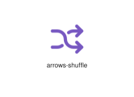
</div>
</div>

{{#endtab}}
{{#tab name="Code"}}

```xml
{{#include ../samples/icons/Tabler-Icons/arrows-shuffle-2695bd9b.xal}}
```

{{#endtab}}
{{#endtabs}}

<div class="xal-ref-tag"><code>&lt;item id=&#34;100312&#34; /&gt;</code></div>

</div>
<div class="xal-ref-card">
<div class="xal-ref-title">arrows-sort</div>

{{#tabs name="svg-ref-0314"}}
{{#tab name="Preview"}}
<div class="xal-ref-preview">
<div>
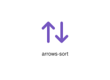
</div>
</div>

{{#endtab}}
{{#tab name="Code"}}

```xml
{{#include ../samples/icons/Tabler-Icons/arrows-sort-90a0636c.xal}}
```

{{#endtab}}
{{#endtabs}}

<div class="xal-ref-tag"><code>&lt;item id=&#34;100314&#34; /&gt;</code></div>

</div>
<div class="xal-ref-card">
<div class="xal-ref-title">arrows-split-2</div>

{{#tabs name="svg-ref-0315"}}
{{#tab name="Preview"}}
<div class="xal-ref-preview">
<div>
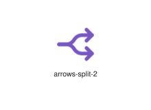
</div>
</div>

{{#endtab}}
{{#tab name="Code"}}

```xml
{{#include ../samples/icons/Tabler-Icons/arrows-split-2-75d9ddf4.xal}}
```

{{#endtab}}
{{#endtabs}}

<div class="xal-ref-tag"><code>&lt;item id=&#34;100316&#34; /&gt;</code></div>

</div>
<div class="xal-ref-card">
<div class="xal-ref-title">arrows-split</div>

{{#tabs name="svg-ref-0316"}}
{{#tab name="Preview"}}
<div class="xal-ref-preview">
<div>

</div>
</div>

{{#endtab}}
{{#tab name="Code"}}

```xml
{{#include ../samples/icons/Tabler-Icons/arrows-split-76a4a2d9.xal}}
```

{{#endtab}}
{{#endtabs}}

<div class="xal-ref-tag"><code>&lt;item id=&#34;100315&#34; /&gt;</code></div>

</div>
<div class="xal-ref-card">
<div class="xal-ref-title">arrows-transfer-down</div>

{{#tabs name="svg-ref-0317"}}
{{#tab name="Preview"}}
<div class="xal-ref-preview">
<div>
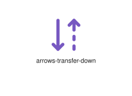
</div>
</div>

{{#endtab}}
{{#tab name="Code"}}

```xml
{{#include ../samples/icons/Tabler-Icons/arrows-transfer-down-8c3115c0.xal}}
```

{{#endtab}}
{{#endtabs}}

<div class="xal-ref-tag"><code>&lt;item id=&#34;100317&#34; /&gt;</code></div>

</div>
<div class="xal-ref-card">
<div class="xal-ref-title">arrows-transfer-up-down</div>

{{#tabs name="svg-ref-0318"}}
{{#tab name="Preview"}}
<div class="xal-ref-preview">
<div>
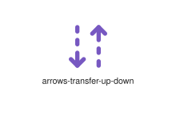
</div>
</div>

{{#endtab}}
{{#tab name="Code"}}

```xml
{{#include ../samples/icons/Tabler-Icons/arrows-transfer-up-down-f481b413.xal}}
```

{{#endtab}}
{{#endtabs}}

<div class="xal-ref-tag"><code>&lt;item id=&#34;100319&#34; /&gt;</code></div>

</div>
<div class="xal-ref-card">
<div class="xal-ref-title">arrows-transfer-up</div>

{{#tabs name="svg-ref-0319"}}
{{#tab name="Preview"}}
<div class="xal-ref-preview">
<div>
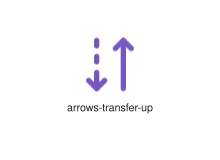
</div>
</div>

{{#endtab}}
{{#tab name="Code"}}

```xml
{{#include ../samples/icons/Tabler-Icons/arrows-transfer-up-54d3ed97.xal}}
```

{{#endtab}}
{{#endtabs}}

<div class="xal-ref-tag"><code>&lt;item id=&#34;100318&#34; /&gt;</code></div>

</div>
<div class="xal-ref-card">
<div class="xal-ref-title">arrows-up-down</div>

{{#tabs name="svg-ref-0320"}}
{{#tab name="Preview"}}
<div class="xal-ref-preview">
<div>
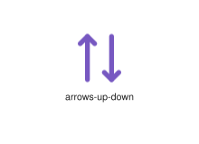
</div>
</div>

{{#endtab}}
{{#tab name="Code"}}

```xml
{{#include ../samples/icons/Tabler-Icons/arrows-up-down-faafd44d.xal}}
```

{{#endtab}}
{{#endtabs}}

<div class="xal-ref-tag"><code>&lt;item id=&#34;100321&#34; /&gt;</code></div>

</div>
<div class="xal-ref-card">
<div class="xal-ref-title">arrows-up-left</div>

{{#tabs name="svg-ref-0321"}}
{{#tab name="Preview"}}
<div class="xal-ref-preview">
<div>

</div>
</div>

{{#endtab}}
{{#tab name="Code"}}

```xml
{{#include ../samples/icons/Tabler-Icons/arrows-up-left-6fe0ceab.xal}}
```

{{#endtab}}
{{#endtabs}}

<div class="xal-ref-tag"><code>&lt;item id=&#34;100322&#34; /&gt;</code></div>

</div>
<div class="xal-ref-card">
<div class="xal-ref-title">arrows-up-right</div>

{{#tabs name="svg-ref-0322"}}
{{#tab name="Preview"}}
<div class="xal-ref-preview">
<div>

</div>
</div>

{{#endtab}}
{{#tab name="Code"}}

```xml
{{#include ../samples/icons/Tabler-Icons/arrows-up-right-bfa725ce.xal}}
```

{{#endtab}}
{{#endtabs}}

<div class="xal-ref-tag"><code>&lt;item id=&#34;100323&#34; /&gt;</code></div>

</div>
<div class="xal-ref-card">
<div class="xal-ref-title">arrows-up</div>

{{#tabs name="svg-ref-0323"}}
{{#tab name="Preview"}}
<div class="xal-ref-preview">
<div>

</div>
</div>

{{#endtab}}
{{#tab name="Code"}}

```xml
{{#include ../samples/icons/Tabler-Icons/arrows-up-1958223a.xal}}
```

{{#endtab}}
{{#endtabs}}

<div class="xal-ref-tag"><code>&lt;item id=&#34;100320&#34; /&gt;</code></div>

</div>
<div class="xal-ref-card">
<div class="xal-ref-title">arrows-vertical</div>

{{#tabs name="svg-ref-0324"}}
{{#tab name="Preview"}}
<div class="xal-ref-preview">
<div>

</div>
</div>

{{#endtab}}
{{#tab name="Code"}}

```xml
{{#include ../samples/icons/Tabler-Icons/arrows-vertical-af4d9260.xal}}
```

{{#endtab}}
{{#endtabs}}

<div class="xal-ref-tag"><code>&lt;item id=&#34;100324&#34; /&gt;</code></div>

</div>
<div class="xal-ref-card">
<div class="xal-ref-title">artboard-off</div>

{{#tabs name="svg-ref-0325"}}
{{#tab name="Preview"}}
<div class="xal-ref-preview">
<div>

</div>
</div>

{{#endtab}}
{{#tab name="Code"}}

```xml
{{#include ../samples/icons/Tabler-Icons/artboard-off-a1c717d9.xal}}
```

{{#endtab}}
{{#endtabs}}

<div class="xal-ref-tag"><code>&lt;item id=&#34;100326&#34; /&gt;</code></div>

</div>
<div class="xal-ref-card">
<div class="xal-ref-title">artboard</div>

{{#tabs name="svg-ref-0326"}}
{{#tab name="Preview"}}
<div class="xal-ref-preview">
<div>

</div>
</div>

{{#endtab}}
{{#tab name="Code"}}

```xml
{{#include ../samples/icons/Tabler-Icons/artboard-60191e6b.xal}}
```

{{#endtab}}
{{#endtabs}}

<div class="xal-ref-tag"><code>&lt;item id=&#34;100325&#34; /&gt;</code></div>

</div>
<div class="xal-ref-card">
<div class="xal-ref-title">article-off</div>

{{#tabs name="svg-ref-0327"}}
{{#tab name="Preview"}}
<div class="xal-ref-preview">
<div>

</div>
</div>

{{#endtab}}
{{#tab name="Code"}}

```xml
{{#include ../samples/icons/Tabler-Icons/article-off-b073b0f9.xal}}
```

{{#endtab}}
{{#endtabs}}

<div class="xal-ref-tag"><code>&lt;item id=&#34;100328&#34; /&gt;</code></div>

</div>
<div class="xal-ref-card">
<div class="xal-ref-title">article</div>

{{#tabs name="svg-ref-0328"}}
{{#tab name="Preview"}}
<div class="xal-ref-preview">
<div>

</div>
</div>

{{#endtab}}
{{#tab name="Code"}}

```xml
{{#include ../samples/icons/Tabler-Icons/article-d56431bd.xal}}
```

{{#endtab}}
{{#endtabs}}

<div class="xal-ref-tag"><code>&lt;item id=&#34;100327&#34; /&gt;</code></div>

</div>
<div class="xal-ref-card">
<div class="xal-ref-title">aspect-ratio-off</div>

{{#tabs name="svg-ref-0329"}}
{{#tab name="Preview"}}
<div class="xal-ref-preview">
<div>

</div>
</div>

{{#endtab}}
{{#tab name="Code"}}

```xml
{{#include ../samples/icons/Tabler-Icons/aspect-ratio-off-46c13bad.xal}}
```

{{#endtab}}
{{#endtabs}}

<div class="xal-ref-tag"><code>&lt;item id=&#34;100330&#34; /&gt;</code></div>

</div>
<div class="xal-ref-card">
<div class="xal-ref-title">aspect-ratio</div>

{{#tabs name="svg-ref-0330"}}
{{#tab name="Preview"}}
<div class="xal-ref-preview">
<div>

</div>
</div>

{{#endtab}}
{{#tab name="Code"}}

```xml
{{#include ../samples/icons/Tabler-Icons/aspect-ratio-d6204976.xal}}
```

{{#endtab}}
{{#endtabs}}

<div class="xal-ref-tag"><code>&lt;item id=&#34;100329&#34; /&gt;</code></div>

</div>
<div class="xal-ref-card">
<div class="xal-ref-title">assembly-off</div>

{{#tabs name="svg-ref-0331"}}
{{#tab name="Preview"}}
<div class="xal-ref-preview">
<div>

</div>
</div>

{{#endtab}}
{{#tab name="Code"}}

```xml
{{#include ../samples/icons/Tabler-Icons/assembly-off-11b38c4a.xal}}
```

{{#endtab}}
{{#endtabs}}

<div class="xal-ref-tag"><code>&lt;item id=&#34;100332&#34; /&gt;</code></div>

</div>
<div class="xal-ref-card">
<div class="xal-ref-title">assembly</div>

{{#tabs name="svg-ref-0332"}}
{{#tab name="Preview"}}
<div class="xal-ref-preview">
<div>

</div>
</div>

{{#endtab}}
{{#tab name="Code"}}

```xml
{{#include ../samples/icons/Tabler-Icons/assembly-f54b9a23.xal}}
```

{{#endtab}}
{{#endtabs}}

<div class="xal-ref-tag"><code>&lt;item id=&#34;100331&#34; /&gt;</code></div>

</div>
<div class="xal-ref-card">
<div class="xal-ref-title">asset</div>

{{#tabs name="svg-ref-0333"}}
{{#tab name="Preview"}}
<div class="xal-ref-preview">
<div>

</div>
</div>

{{#endtab}}
{{#tab name="Code"}}

```xml
{{#include ../samples/icons/Tabler-Icons/asset-239dcb33.xal}}
```

{{#endtab}}
{{#endtabs}}

<div class="xal-ref-tag"><code>&lt;item id=&#34;100333&#34; /&gt;</code></div>

</div>
<div class="xal-ref-card">
<div class="xal-ref-title">asterisk-simple</div>

{{#tabs name="svg-ref-0334"}}
{{#tab name="Preview"}}
<div class="xal-ref-preview">
<div>

</div>
</div>

{{#endtab}}
{{#tab name="Code"}}

```xml
{{#include ../samples/icons/Tabler-Icons/asterisk-simple-487569be.xal}}
```

{{#endtab}}
{{#endtabs}}

<div class="xal-ref-tag"><code>&lt;item id=&#34;100335&#34; /&gt;</code></div>

</div>
<div class="xal-ref-card">
<div class="xal-ref-title">asterisk</div>

{{#tabs name="svg-ref-0335"}}
{{#tab name="Preview"}}
<div class="xal-ref-preview">
<div>

</div>
</div>

{{#endtab}}
{{#tab name="Code"}}

```xml
{{#include ../samples/icons/Tabler-Icons/asterisk-58ab828b.xal}}
```

{{#endtab}}
{{#endtabs}}

<div class="xal-ref-tag"><code>&lt;item id=&#34;100334&#34; /&gt;</code></div>

</div>
<div class="xal-ref-card">
<div class="xal-ref-title">at-off</div>

{{#tabs name="svg-ref-0336"}}
{{#tab name="Preview"}}
<div class="xal-ref-preview">
<div>

</div>
</div>

{{#endtab}}
{{#tab name="Code"}}

```xml
{{#include ../samples/icons/Tabler-Icons/at-off-7472b244.xal}}
```

{{#endtab}}
{{#endtabs}}

<div class="xal-ref-tag"><code>&lt;item id=&#34;100337&#34; /&gt;</code></div>

</div>
<div class="xal-ref-card">
<div class="xal-ref-title">at</div>

{{#tabs name="svg-ref-0337"}}
{{#tab name="Preview"}}
<div class="xal-ref-preview">
<div>

</div>
</div>

{{#endtab}}
{{#tab name="Code"}}

```xml
{{#include ../samples/icons/Tabler-Icons/at-3437d9bb.xal}}
```

{{#endtab}}
{{#endtabs}}

<div class="xal-ref-tag"><code>&lt;item id=&#34;100336&#34; /&gt;</code></div>

</div>
<div class="xal-ref-card">
<div class="xal-ref-title">atom-2</div>

{{#tabs name="svg-ref-0338"}}
{{#tab name="Preview"}}
<div class="xal-ref-preview">
<div>

</div>
</div>

{{#endtab}}
{{#tab name="Code"}}

```xml
{{#include ../samples/icons/Tabler-Icons/atom-2-2059f559.xal}}
```

{{#endtab}}
{{#endtabs}}

<div class="xal-ref-tag"><code>&lt;item id=&#34;100339&#34; /&gt;</code></div>

</div>
<div class="xal-ref-card">
<div class="xal-ref-title">atom-off</div>

{{#tabs name="svg-ref-0339"}}
{{#tab name="Preview"}}
<div class="xal-ref-preview">
<div>

</div>
</div>

{{#endtab}}
{{#tab name="Code"}}

```xml
{{#include ../samples/icons/Tabler-Icons/atom-off-515bccc6.xal}}
```

{{#endtab}}
{{#endtabs}}

<div class="xal-ref-tag"><code>&lt;item id=&#34;100340&#34; /&gt;</code></div>

</div>
<div class="xal-ref-card">
<div class="xal-ref-title">atom</div>

{{#tabs name="svg-ref-0340"}}
{{#tab name="Preview"}}
<div class="xal-ref-preview">
<div>

</div>
</div>

{{#endtab}}
{{#tab name="Code"}}

```xml
{{#include ../samples/icons/Tabler-Icons/atom-1d16cd8b.xal}}
```

{{#endtab}}
{{#endtabs}}

<div class="xal-ref-tag"><code>&lt;item id=&#34;100338&#34; /&gt;</code></div>

</div>
<div class="xal-ref-card">
<div class="xal-ref-title">augmented-reality-2</div>

{{#tabs name="svg-ref-0341"}}
{{#tab name="Preview"}}
<div class="xal-ref-preview">
<div>

</div>
</div>

{{#endtab}}
{{#tab name="Code"}}

```xml
{{#include ../samples/icons/Tabler-Icons/augmented-reality-2-10602724.xal}}
```

{{#endtab}}
{{#endtabs}}

<div class="xal-ref-tag"><code>&lt;item id=&#34;100342&#34; /&gt;</code></div>

</div>
<div class="xal-ref-card">
<div class="xal-ref-title">augmented-reality-off</div>

{{#tabs name="svg-ref-0342"}}
{{#tab name="Preview"}}
<div class="xal-ref-preview">
<div>

</div>
</div>

{{#endtab}}
{{#tab name="Code"}}

```xml
{{#include ../samples/icons/Tabler-Icons/augmented-reality-off-a31748bc.xal}}
```

{{#endtab}}
{{#endtabs}}

<div class="xal-ref-tag"><code>&lt;item id=&#34;100343&#34; /&gt;</code></div>

</div>
<div class="xal-ref-card">
<div class="xal-ref-title">augmented-reality</div>

{{#tabs name="svg-ref-0343"}}
{{#tab name="Preview"}}
<div class="xal-ref-preview">
<div>

</div>
</div>

{{#endtab}}
{{#tab name="Code"}}

```xml
{{#include ../samples/icons/Tabler-Icons/augmented-reality-e3fed1d5.xal}}
```

{{#endtab}}
{{#endtabs}}

<div class="xal-ref-tag"><code>&lt;item id=&#34;100341&#34; /&gt;</code></div>

</div>
<div class="xal-ref-card">
<div class="xal-ref-title">auth-2fa</div>

{{#tabs name="svg-ref-0344"}}
{{#tab name="Preview"}}
<div class="xal-ref-preview">
<div>

</div>
</div>

{{#endtab}}
{{#tab name="Code"}}

```xml
{{#include ../samples/icons/Tabler-Icons/auth-2fa-f52e7831.xal}}
```

{{#endtab}}
{{#endtabs}}

<div class="xal-ref-tag"><code>&lt;item id=&#34;100344&#34; /&gt;</code></div>

</div>
<div class="xal-ref-card">
<div class="xal-ref-title">automatic-gearbox</div>

{{#tabs name="svg-ref-0345"}}
{{#tab name="Preview"}}
<div class="xal-ref-preview">
<div>

</div>
</div>

{{#endtab}}
{{#tab name="Code"}}

```xml
{{#include ../samples/icons/Tabler-Icons/automatic-gearbox-89a47ca6.xal}}
```

{{#endtab}}
{{#endtabs}}

<div class="xal-ref-tag"><code>&lt;item id=&#34;100345&#34; /&gt;</code></div>

</div>
<div class="xal-ref-card">
<div class="xal-ref-title">automation</div>

{{#tabs name="svg-ref-0346"}}
{{#tab name="Preview"}}
<div class="xal-ref-preview">
<div>

</div>
</div>

{{#endtab}}
{{#tab name="Code"}}

```xml
{{#include ../samples/icons/Tabler-Icons/automation-cb24825c.xal}}
```

{{#endtab}}
{{#endtabs}}

<div class="xal-ref-tag"><code>&lt;item id=&#34;100346&#34; /&gt;</code></div>

</div>
<div class="xal-ref-card">
<div class="xal-ref-title">avocado</div>

{{#tabs name="svg-ref-0347"}}
{{#tab name="Preview"}}
<div class="xal-ref-preview">
<div>

</div>
</div>

{{#endtab}}
{{#tab name="Code"}}

```xml
{{#include ../samples/icons/Tabler-Icons/avocado-52a6da46.xal}}
```

{{#endtab}}
{{#endtabs}}

<div class="xal-ref-tag"><code>&lt;item id=&#34;100347&#34; /&gt;</code></div>

</div>
<div class="xal-ref-card">
<div class="xal-ref-title">award-off</div>

{{#tabs name="svg-ref-0348"}}
{{#tab name="Preview"}}
<div class="xal-ref-preview">
<div>

</div>
</div>

{{#endtab}}
{{#tab name="Code"}}

```xml
{{#include ../samples/icons/Tabler-Icons/award-off-082814bf.xal}}
```

{{#endtab}}
{{#endtabs}}

<div class="xal-ref-tag"><code>&lt;item id=&#34;100349&#34; /&gt;</code></div>

</div>
<div class="xal-ref-card">
<div class="xal-ref-title">award</div>

{{#tabs name="svg-ref-0349"}}
{{#tab name="Preview"}}
<div class="xal-ref-preview">
<div>

</div>
</div>

{{#endtab}}
{{#tab name="Code"}}

```xml
{{#include ../samples/icons/Tabler-Icons/award-29a5ed8f.xal}}
```

{{#endtab}}
{{#endtabs}}

<div class="xal-ref-tag"><code>&lt;item id=&#34;100348&#34; /&gt;</code></div>

</div>
<div class="xal-ref-card">
<div class="xal-ref-title">axe</div>

{{#tabs name="svg-ref-0350"}}
{{#tab name="Preview"}}
<div class="xal-ref-preview">
<div>

</div>
</div>

{{#endtab}}
{{#tab name="Code"}}

```xml
{{#include ../samples/icons/Tabler-Icons/axe-69c7d90c.xal}}
```

{{#endtab}}
{{#endtabs}}

<div class="xal-ref-tag"><code>&lt;item id=&#34;100350&#34; /&gt;</code></div>

</div>
<div class="xal-ref-card">
<div class="xal-ref-title">axis-x</div>

{{#tabs name="svg-ref-0351"}}
{{#tab name="Preview"}}
<div class="xal-ref-preview">
<div>

</div>
</div>

{{#endtab}}
{{#tab name="Code"}}

```xml
{{#include ../samples/icons/Tabler-Icons/axis-x-25a0a8b1.xal}}
```

{{#endtab}}
{{#endtabs}}

<div class="xal-ref-tag"><code>&lt;item id=&#34;100351&#34; /&gt;</code></div>

</div>
<div class="xal-ref-card">
<div class="xal-ref-title">axis-y</div>

{{#tabs name="svg-ref-0352"}}
{{#tab name="Preview"}}
<div class="xal-ref-preview">
<div>

</div>
</div>

{{#endtab}}
{{#tab name="Code"}}

```xml
{{#include ../samples/icons/Tabler-Icons/axis-y-18c08101.xal}}
```

{{#endtab}}
{{#endtabs}}

<div class="xal-ref-tag"><code>&lt;item id=&#34;100352&#34; /&gt;</code></div>

</div>
<div class="xal-ref-card">
<div class="xal-ref-title">baby-bottle</div>

{{#tabs name="svg-ref-0353"}}
{{#tab name="Preview"}}
<div class="xal-ref-preview">
<div>

</div>
</div>

{{#endtab}}
{{#tab name="Code"}}

```xml
{{#include ../samples/icons/Tabler-Icons/baby-bottle-6575a667.xal}}
```

{{#endtab}}
{{#endtabs}}

<div class="xal-ref-tag"><code>&lt;item id=&#34;100353&#34; /&gt;</code></div>

</div>
<div class="xal-ref-card">
<div class="xal-ref-title">baby-carriage</div>

{{#tabs name="svg-ref-0354"}}
{{#tab name="Preview"}}
<div class="xal-ref-preview">
<div>

</div>
</div>

{{#endtab}}
{{#tab name="Code"}}

```xml
{{#include ../samples/icons/Tabler-Icons/baby-carriage-277af708.xal}}
```

{{#endtab}}
{{#endtabs}}

<div class="xal-ref-tag"><code>&lt;item id=&#34;100354&#34; /&gt;</code></div>

</div>
<div class="xal-ref-card">
<div class="xal-ref-title">background</div>

{{#tabs name="svg-ref-0355"}}
{{#tab name="Preview"}}
<div class="xal-ref-preview">
<div>

</div>
</div>

{{#endtab}}
{{#tab name="Code"}}

```xml
{{#include ../samples/icons/Tabler-Icons/background-898ee284.xal}}
```

{{#endtab}}
{{#endtabs}}

<div class="xal-ref-tag"><code>&lt;item id=&#34;100355&#34; /&gt;</code></div>

</div>
<div class="xal-ref-card">
<div class="xal-ref-title">backhoe</div>

{{#tabs name="svg-ref-0356"}}
{{#tab name="Preview"}}
<div class="xal-ref-preview">
<div>

</div>
</div>

{{#endtab}}
{{#tab name="Code"}}

```xml
{{#include ../samples/icons/Tabler-Icons/backhoe-8e0863c6.xal}}
```

{{#endtab}}
{{#endtabs}}

<div class="xal-ref-tag"><code>&lt;item id=&#34;100356&#34; /&gt;</code></div>

</div>
<div class="xal-ref-card">
<div class="xal-ref-title">backpack-off</div>

{{#tabs name="svg-ref-0357"}}
{{#tab name="Preview"}}
<div class="xal-ref-preview">
<div>

</div>
</div>

{{#endtab}}
{{#tab name="Code"}}

```xml
{{#include ../samples/icons/Tabler-Icons/backpack-off-30a39dd3.xal}}
```

{{#endtab}}
{{#endtabs}}

<div class="xal-ref-tag"><code>&lt;item id=&#34;100358&#34; /&gt;</code></div>

</div>
<div class="xal-ref-card">
<div class="xal-ref-title">backpack</div>

{{#tabs name="svg-ref-0358"}}
{{#tab name="Preview"}}
<div class="xal-ref-preview">
<div>

</div>
</div>

{{#endtab}}
{{#tab name="Code"}}

```xml
{{#include ../samples/icons/Tabler-Icons/backpack-a60327f3.xal}}
```

{{#endtab}}
{{#endtabs}}

<div class="xal-ref-tag"><code>&lt;item id=&#34;100357&#34; /&gt;</code></div>

</div>
<div class="xal-ref-card">
<div class="xal-ref-title">backslash</div>

{{#tabs name="svg-ref-0359"}}
{{#tab name="Preview"}}
<div class="xal-ref-preview">
<div>

</div>
</div>

{{#endtab}}
{{#tab name="Code"}}

```xml
{{#include ../samples/icons/Tabler-Icons/backslash-44929851.xal}}
```

{{#endtab}}
{{#endtabs}}

<div class="xal-ref-tag"><code>&lt;item id=&#34;100359&#34; /&gt;</code></div>

</div>
</div>
