# Tabler-Icons - Page 9

This page references SVG files under `etc/resources/aws/svg/Tabler-Icons`.
Each card shows the SVG preview first and the XAL tag syntax in the Code tab.
Showing 721-810 of 4964 SVG files.

<style>
.xal-ref-grid{display:grid;grid-template-columns:repeat(3,minmax(0,1fr));gap:1rem;margin:1rem 0 1.5rem}.xal-ref-card{border:1px solid var(--table-border-color);border-radius:8px;overflow:hidden;background:var(--bg);padding:.75rem}.xal-ref-title{font-size:.9rem;font-weight:600;line-height:1.25;margin:0 0 .5rem;overflow-wrap:anywhere}.xal-ref-preview{display:flex;align-items:center;justify-content:center}.xal-ref-preview img{display:block;width:100%;height:auto}.xal-ref-card pre{margin:0;max-height:18rem;overflow:auto;white-space:pre}.xal-ref-card code{font-size:.78em}.xal-ref-tag{margin:.5rem 0 0;color:var(--fg);opacity:.72;overflow:auto;white-space:pre}.xal-ref-tag code{font-size:.72em}@media(max-width:900px){.xal-ref-grid{grid-template-columns:repeat(2,minmax(0,1fr))}}@media(max-width:560px){.xal-ref-grid{grid-template-columns:1fr}}
</style>

[Back to section index](tabler-icons.md)

<div class="xal-ref-grid">
<div class="xal-ref-card">
<div class="xal-ref-title">brand-drops</div>

{{#tabs name="svg-ref-0720"}}
{{#tab name="Preview"}}
<div class="xal-ref-preview">
<div>
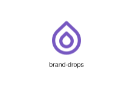
</div>
</div>

{{#endtab}}
{{#tab name="Code"}}

```xml
{{#include ../samples/icons/Tabler-Icons/brand-drops-c20f5386.xal}}
```

{{#endtab}}
{{#endtabs}}

<div class="xal-ref-tag"><code>&lt;item id=&#34;100720&#34; /&gt;</code></div>

</div>
<div class="xal-ref-card">
<div class="xal-ref-title">brand-drupal</div>

{{#tabs name="svg-ref-0721"}}
{{#tab name="Preview"}}
<div class="xal-ref-preview">
<div>

</div>
</div>

{{#endtab}}
{{#tab name="Code"}}

```xml
{{#include ../samples/icons/Tabler-Icons/brand-drupal-e8ee81ee.xal}}
```

{{#endtab}}
{{#endtabs}}

<div class="xal-ref-tag"><code>&lt;item id=&#34;100721&#34; /&gt;</code></div>

</div>
<div class="xal-ref-card">
<div class="xal-ref-title">brand-edge</div>

{{#tabs name="svg-ref-0722"}}
{{#tab name="Preview"}}
<div class="xal-ref-preview">
<div>

</div>
</div>

{{#endtab}}
{{#tab name="Code"}}

```xml
{{#include ../samples/icons/Tabler-Icons/brand-edge-11f5dc23.xal}}
```

{{#endtab}}
{{#endtabs}}

<div class="xal-ref-tag"><code>&lt;item id=&#34;100722&#34; /&gt;</code></div>

</div>
<div class="xal-ref-card">
<div class="xal-ref-title">brand-elastic</div>

{{#tabs name="svg-ref-0723"}}
{{#tab name="Preview"}}
<div class="xal-ref-preview">
<div>
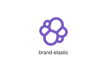
</div>
</div>

{{#endtab}}
{{#tab name="Code"}}

```xml
{{#include ../samples/icons/Tabler-Icons/brand-elastic-68f9c82b.xal}}
```

{{#endtab}}
{{#endtabs}}

<div class="xal-ref-tag"><code>&lt;item id=&#34;100723&#34; /&gt;</code></div>

</div>
<div class="xal-ref-card">
<div class="xal-ref-title">brand-electronic-arts</div>

{{#tabs name="svg-ref-0724"}}
{{#tab name="Preview"}}
<div class="xal-ref-preview">
<div>

</div>
</div>

{{#endtab}}
{{#tab name="Code"}}

```xml
{{#include ../samples/icons/Tabler-Icons/brand-electronic-arts-8093db19.xal}}
```

{{#endtab}}
{{#endtabs}}

<div class="xal-ref-tag"><code>&lt;item id=&#34;100724&#34; /&gt;</code></div>

</div>
<div class="xal-ref-card">
<div class="xal-ref-title">brand-ember</div>

{{#tabs name="svg-ref-0725"}}
{{#tab name="Preview"}}
<div class="xal-ref-preview">
<div>
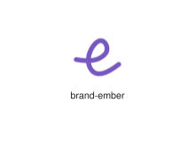
</div>
</div>

{{#endtab}}
{{#tab name="Code"}}

```xml
{{#include ../samples/icons/Tabler-Icons/brand-ember-7f43bf1a.xal}}
```

{{#endtab}}
{{#endtabs}}

<div class="xal-ref-tag"><code>&lt;item id=&#34;100725&#34; /&gt;</code></div>

</div>
<div class="xal-ref-card">
<div class="xal-ref-title">brand-envato</div>

{{#tabs name="svg-ref-0726"}}
{{#tab name="Preview"}}
<div class="xal-ref-preview">
<div>

</div>
</div>

{{#endtab}}
{{#tab name="Code"}}

```xml
{{#include ../samples/icons/Tabler-Icons/brand-envato-164522d4.xal}}
```

{{#endtab}}
{{#endtabs}}

<div class="xal-ref-tag"><code>&lt;item id=&#34;100726&#34; /&gt;</code></div>

</div>
<div class="xal-ref-card">
<div class="xal-ref-title">brand-etsy</div>

{{#tabs name="svg-ref-0727"}}
{{#tab name="Preview"}}
<div class="xal-ref-preview">
<div>

</div>
</div>

{{#endtab}}
{{#tab name="Code"}}

```xml
{{#include ../samples/icons/Tabler-Icons/brand-etsy-4b7c7ae3.xal}}
```

{{#endtab}}
{{#endtabs}}

<div class="xal-ref-tag"><code>&lt;item id=&#34;100727&#34; /&gt;</code></div>

</div>
<div class="xal-ref-card">
<div class="xal-ref-title">brand-evernote</div>

{{#tabs name="svg-ref-0728"}}
{{#tab name="Preview"}}
<div class="xal-ref-preview">
<div>

</div>
</div>

{{#endtab}}
{{#tab name="Code"}}

```xml
{{#include ../samples/icons/Tabler-Icons/brand-evernote-2ce746ae.xal}}
```

{{#endtab}}
{{#endtabs}}

<div class="xal-ref-tag"><code>&lt;item id=&#34;100728&#34; /&gt;</code></div>

</div>
<div class="xal-ref-card">
<div class="xal-ref-title">brand-facebook</div>

{{#tabs name="svg-ref-0729"}}
{{#tab name="Preview"}}
<div class="xal-ref-preview">
<div>

</div>
</div>

{{#endtab}}
{{#tab name="Code"}}

```xml
{{#include ../samples/icons/Tabler-Icons/brand-facebook-9885439f.xal}}
```

{{#endtab}}
{{#endtabs}}

<div class="xal-ref-tag"><code>&lt;item id=&#34;100729&#34; /&gt;</code></div>

</div>
<div class="xal-ref-card">
<div class="xal-ref-title">brand-feedly</div>

{{#tabs name="svg-ref-0730"}}
{{#tab name="Preview"}}
<div class="xal-ref-preview">
<div>

</div>
</div>

{{#endtab}}
{{#tab name="Code"}}

```xml
{{#include ../samples/icons/Tabler-Icons/brand-feedly-df0efcb1.xal}}
```

{{#endtab}}
{{#endtabs}}

<div class="xal-ref-tag"><code>&lt;item id=&#34;100730&#34; /&gt;</code></div>

</div>
<div class="xal-ref-card">
<div class="xal-ref-title">brand-figma</div>

{{#tabs name="svg-ref-0731"}}
{{#tab name="Preview"}}
<div class="xal-ref-preview">
<div>

</div>
</div>

{{#endtab}}
{{#tab name="Code"}}

```xml
{{#include ../samples/icons/Tabler-Icons/brand-figma-5bafcdbd.xal}}
```

{{#endtab}}
{{#endtabs}}

<div class="xal-ref-tag"><code>&lt;item id=&#34;100731&#34; /&gt;</code></div>

</div>
<div class="xal-ref-card">
<div class="xal-ref-title">brand-filezilla</div>

{{#tabs name="svg-ref-0732"}}
{{#tab name="Preview"}}
<div class="xal-ref-preview">
<div>
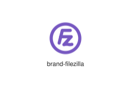
</div>
</div>

{{#endtab}}
{{#tab name="Code"}}

```xml
{{#include ../samples/icons/Tabler-Icons/brand-filezilla-bf44a80f.xal}}
```

{{#endtab}}
{{#endtabs}}

<div class="xal-ref-tag"><code>&lt;item id=&#34;100732&#34; /&gt;</code></div>

</div>
<div class="xal-ref-card">
<div class="xal-ref-title">brand-finder</div>

{{#tabs name="svg-ref-0733"}}
{{#tab name="Preview"}}
<div class="xal-ref-preview">
<div>

</div>
</div>

{{#endtab}}
{{#tab name="Code"}}

```xml
{{#include ../samples/icons/Tabler-Icons/brand-finder-348f732a.xal}}
```

{{#endtab}}
{{#endtabs}}

<div class="xal-ref-tag"><code>&lt;item id=&#34;100733&#34; /&gt;</code></div>

</div>
<div class="xal-ref-card">
<div class="xal-ref-title">brand-firebase</div>

{{#tabs name="svg-ref-0734"}}
{{#tab name="Preview"}}
<div class="xal-ref-preview">
<div>

</div>
</div>

{{#endtab}}
{{#tab name="Code"}}

```xml
{{#include ../samples/icons/Tabler-Icons/brand-firebase-71314fd0.xal}}
```

{{#endtab}}
{{#endtabs}}

<div class="xal-ref-tag"><code>&lt;item id=&#34;100734&#34; /&gt;</code></div>

</div>
<div class="xal-ref-card">
<div class="xal-ref-title">brand-firefox</div>

{{#tabs name="svg-ref-0735"}}
{{#tab name="Preview"}}
<div class="xal-ref-preview">
<div>

</div>
</div>

{{#endtab}}
{{#tab name="Code"}}

```xml
{{#include ../samples/icons/Tabler-Icons/brand-firefox-0983eb1f.xal}}
```

{{#endtab}}
{{#endtabs}}

<div class="xal-ref-tag"><code>&lt;item id=&#34;100735&#34; /&gt;</code></div>

</div>
<div class="xal-ref-card">
<div class="xal-ref-title">brand-fiverr</div>

{{#tabs name="svg-ref-0736"}}
{{#tab name="Preview"}}
<div class="xal-ref-preview">
<div>

</div>
</div>

{{#endtab}}
{{#tab name="Code"}}

```xml
{{#include ../samples/icons/Tabler-Icons/brand-fiverr-23756023.xal}}
```

{{#endtab}}
{{#endtabs}}

<div class="xal-ref-tag"><code>&lt;item id=&#34;100736&#34; /&gt;</code></div>

</div>
<div class="xal-ref-card">
<div class="xal-ref-title">brand-flickr</div>

{{#tabs name="svg-ref-0737"}}
{{#tab name="Preview"}}
<div class="xal-ref-preview">
<div>
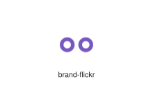
</div>
</div>

{{#endtab}}
{{#tab name="Code"}}

```xml
{{#include ../samples/icons/Tabler-Icons/brand-flickr-8b706082.xal}}
```

{{#endtab}}
{{#endtabs}}

<div class="xal-ref-tag"><code>&lt;item id=&#34;100737&#34; /&gt;</code></div>

</div>
<div class="xal-ref-card">
<div class="xal-ref-title">brand-flightradar24</div>

{{#tabs name="svg-ref-0738"}}
{{#tab name="Preview"}}
<div class="xal-ref-preview">
<div>

</div>
</div>

{{#endtab}}
{{#tab name="Code"}}

```xml
{{#include ../samples/icons/Tabler-Icons/brand-flightradar24-cd6b9c14.xal}}
```

{{#endtab}}
{{#endtabs}}

<div class="xal-ref-tag"><code>&lt;item id=&#34;100738&#34; /&gt;</code></div>

</div>
<div class="xal-ref-card">
<div class="xal-ref-title">brand-flipboard</div>

{{#tabs name="svg-ref-0739"}}
{{#tab name="Preview"}}
<div class="xal-ref-preview">
<div>

</div>
</div>

{{#endtab}}
{{#tab name="Code"}}

```xml
{{#include ../samples/icons/Tabler-Icons/brand-flipboard-d6ab5d44.xal}}
```

{{#endtab}}
{{#endtabs}}

<div class="xal-ref-tag"><code>&lt;item id=&#34;100739&#34; /&gt;</code></div>

</div>
<div class="xal-ref-card">
<div class="xal-ref-title">brand-flutter</div>

{{#tabs name="svg-ref-0740"}}
{{#tab name="Preview"}}
<div class="xal-ref-preview">
<div>

</div>
</div>

{{#endtab}}
{{#tab name="Code"}}

```xml
{{#include ../samples/icons/Tabler-Icons/brand-flutter-20b0ca07.xal}}
```

{{#endtab}}
{{#endtabs}}

<div class="xal-ref-tag"><code>&lt;item id=&#34;100740&#34; /&gt;</code></div>

</div>
<div class="xal-ref-card">
<div class="xal-ref-title">brand-fortnite</div>

{{#tabs name="svg-ref-0741"}}
{{#tab name="Preview"}}
<div class="xal-ref-preview">
<div>

</div>
</div>

{{#endtab}}
{{#tab name="Code"}}

```xml
{{#include ../samples/icons/Tabler-Icons/brand-fortnite-5b7ab831.xal}}
```

{{#endtab}}
{{#endtabs}}

<div class="xal-ref-tag"><code>&lt;item id=&#34;100741&#34; /&gt;</code></div>

</div>
<div class="xal-ref-card">
<div class="xal-ref-title">brand-foursquare</div>

{{#tabs name="svg-ref-0742"}}
{{#tab name="Preview"}}
<div class="xal-ref-preview">
<div>

</div>
</div>

{{#endtab}}
{{#tab name="Code"}}

```xml
{{#include ../samples/icons/Tabler-Icons/brand-foursquare-0877343d.xal}}
```

{{#endtab}}
{{#endtabs}}

<div class="xal-ref-tag"><code>&lt;item id=&#34;100742&#34; /&gt;</code></div>

</div>
<div class="xal-ref-card">
<div class="xal-ref-title">brand-framer-motion</div>

{{#tabs name="svg-ref-0743"}}
{{#tab name="Preview"}}
<div class="xal-ref-preview">
<div>

</div>
</div>

{{#endtab}}
{{#tab name="Code"}}

```xml
{{#include ../samples/icons/Tabler-Icons/brand-framer-motion-5e7feb2a.xal}}
```

{{#endtab}}
{{#endtabs}}

<div class="xal-ref-tag"><code>&lt;item id=&#34;100744&#34; /&gt;</code></div>

</div>
<div class="xal-ref-card">
<div class="xal-ref-title">brand-framer</div>

{{#tabs name="svg-ref-0744"}}
{{#tab name="Preview"}}
<div class="xal-ref-preview">
<div>
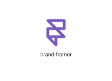
</div>
</div>

{{#endtab}}
{{#tab name="Code"}}

```xml
{{#include ../samples/icons/Tabler-Icons/brand-framer-56a2f8f9.xal}}
```

{{#endtab}}
{{#endtabs}}

<div class="xal-ref-tag"><code>&lt;item id=&#34;100743&#34; /&gt;</code></div>

</div>
<div class="xal-ref-card">
<div class="xal-ref-title">brand-funimation</div>

{{#tabs name="svg-ref-0745"}}
{{#tab name="Preview"}}
<div class="xal-ref-preview">
<div>

</div>
</div>

{{#endtab}}
{{#tab name="Code"}}

```xml
{{#include ../samples/icons/Tabler-Icons/brand-funimation-d408633b.xal}}
```

{{#endtab}}
{{#endtabs}}

<div class="xal-ref-tag"><code>&lt;item id=&#34;100745&#34; /&gt;</code></div>

</div>
<div class="xal-ref-card">
<div class="xal-ref-title">brand-gatsby</div>

{{#tabs name="svg-ref-0746"}}
{{#tab name="Preview"}}
<div class="xal-ref-preview">
<div>

</div>
</div>

{{#endtab}}
{{#tab name="Code"}}

```xml
{{#include ../samples/icons/Tabler-Icons/brand-gatsby-45423406.xal}}
```

{{#endtab}}
{{#endtabs}}

<div class="xal-ref-tag"><code>&lt;item id=&#34;100746&#34; /&gt;</code></div>

</div>
<div class="xal-ref-card">
<div class="xal-ref-title">brand-git</div>

{{#tabs name="svg-ref-0747"}}
{{#tab name="Preview"}}
<div class="xal-ref-preview">
<div>

</div>
</div>

{{#endtab}}
{{#tab name="Code"}}

```xml
{{#include ../samples/icons/Tabler-Icons/brand-git-c84a5657.xal}}
```

{{#endtab}}
{{#endtabs}}

<div class="xal-ref-tag"><code>&lt;item id=&#34;100747&#34; /&gt;</code></div>

</div>
<div class="xal-ref-card">
<div class="xal-ref-title">brand-github-copilot</div>

{{#tabs name="svg-ref-0748"}}
{{#tab name="Preview"}}
<div class="xal-ref-preview">
<div>

</div>
</div>

{{#endtab}}
{{#tab name="Code"}}

```xml
{{#include ../samples/icons/Tabler-Icons/brand-github-copilot-010c03a4.xal}}
```

{{#endtab}}
{{#endtabs}}

<div class="xal-ref-tag"><code>&lt;item id=&#34;100749&#34; /&gt;</code></div>

</div>
<div class="xal-ref-card">
<div class="xal-ref-title">brand-github</div>

{{#tabs name="svg-ref-0749"}}
{{#tab name="Preview"}}
<div class="xal-ref-preview">
<div>

</div>
</div>

{{#endtab}}
{{#tab name="Code"}}

```xml
{{#include ../samples/icons/Tabler-Icons/brand-github-92a0ca9a.xal}}
```

{{#endtab}}
{{#endtabs}}

<div class="xal-ref-tag"><code>&lt;item id=&#34;100748&#34; /&gt;</code></div>

</div>
<div class="xal-ref-card">
<div class="xal-ref-title">brand-gitlab</div>

{{#tabs name="svg-ref-0750"}}
{{#tab name="Preview"}}
<div class="xal-ref-preview">
<div>
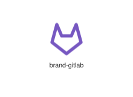
</div>
</div>

{{#endtab}}
{{#tab name="Code"}}

```xml
{{#include ../samples/icons/Tabler-Icons/brand-gitlab-fea8ae04.xal}}
```

{{#endtab}}
{{#endtabs}}

<div class="xal-ref-tag"><code>&lt;item id=&#34;100750&#34; /&gt;</code></div>

</div>
<div class="xal-ref-card">
<div class="xal-ref-title">brand-gmail</div>

{{#tabs name="svg-ref-0751"}}
{{#tab name="Preview"}}
<div class="xal-ref-preview">
<div>

</div>
</div>

{{#endtab}}
{{#tab name="Code"}}

```xml
{{#include ../samples/icons/Tabler-Icons/brand-gmail-c84f6499.xal}}
```

{{#endtab}}
{{#endtabs}}

<div class="xal-ref-tag"><code>&lt;item id=&#34;100751&#34; /&gt;</code></div>

</div>
<div class="xal-ref-card">
<div class="xal-ref-title">brand-golang</div>

{{#tabs name="svg-ref-0752"}}
{{#tab name="Preview"}}
<div class="xal-ref-preview">
<div>

</div>
</div>

{{#endtab}}
{{#tab name="Code"}}

```xml
{{#include ../samples/icons/Tabler-Icons/brand-golang-7a8da175.xal}}
```

{{#endtab}}
{{#endtabs}}

<div class="xal-ref-tag"><code>&lt;item id=&#34;100752&#34; /&gt;</code></div>

</div>
<div class="xal-ref-card">
<div class="xal-ref-title">brand-google-analytics</div>

{{#tabs name="svg-ref-0753"}}
{{#tab name="Preview"}}
<div class="xal-ref-preview">
<div>

</div>
</div>

{{#endtab}}
{{#tab name="Code"}}

```xml
{{#include ../samples/icons/Tabler-Icons/brand-google-analytics-8508f2b0.xal}}
```

{{#endtab}}
{{#endtabs}}

<div class="xal-ref-tag"><code>&lt;item id=&#34;100754&#34; /&gt;</code></div>

</div>
<div class="xal-ref-card">
<div class="xal-ref-title">brand-google-big-query</div>

{{#tabs name="svg-ref-0754"}}
{{#tab name="Preview"}}
<div class="xal-ref-preview">
<div>

</div>
</div>

{{#endtab}}
{{#tab name="Code"}}

```xml
{{#include ../samples/icons/Tabler-Icons/brand-google-big-query-e77fd041.xal}}
```

{{#endtab}}
{{#endtabs}}

<div class="xal-ref-tag"><code>&lt;item id=&#34;100755&#34; /&gt;</code></div>

</div>
<div class="xal-ref-card">
<div class="xal-ref-title">brand-google-drive</div>

{{#tabs name="svg-ref-0755"}}
{{#tab name="Preview"}}
<div class="xal-ref-preview">
<div>

</div>
</div>

{{#endtab}}
{{#tab name="Code"}}

```xml
{{#include ../samples/icons/Tabler-Icons/brand-google-drive-4e4f06bd.xal}}
```

{{#endtab}}
{{#endtabs}}

<div class="xal-ref-tag"><code>&lt;item id=&#34;100756&#34; /&gt;</code></div>

</div>
<div class="xal-ref-card">
<div class="xal-ref-title">brand-google-fit</div>

{{#tabs name="svg-ref-0756"}}
{{#tab name="Preview"}}
<div class="xal-ref-preview">
<div>

</div>
</div>

{{#endtab}}
{{#tab name="Code"}}

```xml
{{#include ../samples/icons/Tabler-Icons/brand-google-fit-fc8aebd0.xal}}
```

{{#endtab}}
{{#endtabs}}

<div class="xal-ref-tag"><code>&lt;item id=&#34;100757&#34; /&gt;</code></div>

</div>
<div class="xal-ref-card">
<div class="xal-ref-title">brand-google-home</div>

{{#tabs name="svg-ref-0757"}}
{{#tab name="Preview"}}
<div class="xal-ref-preview">
<div>

</div>
</div>

{{#endtab}}
{{#tab name="Code"}}

```xml
{{#include ../samples/icons/Tabler-Icons/brand-google-home-962e68ce.xal}}
```

{{#endtab}}
{{#endtabs}}

<div class="xal-ref-tag"><code>&lt;item id=&#34;100758&#34; /&gt;</code></div>

</div>
<div class="xal-ref-card">
<div class="xal-ref-title">brand-google-maps</div>

{{#tabs name="svg-ref-0758"}}
{{#tab name="Preview"}}
<div class="xal-ref-preview">
<div>

</div>
</div>

{{#endtab}}
{{#tab name="Code"}}

```xml
{{#include ../samples/icons/Tabler-Icons/brand-google-maps-de196e90.xal}}
```

{{#endtab}}
{{#endtabs}}

<div class="xal-ref-tag"><code>&lt;item id=&#34;100759&#34; /&gt;</code></div>

</div>
<div class="xal-ref-card">
<div class="xal-ref-title">brand-google-one</div>

{{#tabs name="svg-ref-0759"}}
{{#tab name="Preview"}}
<div class="xal-ref-preview">
<div>

</div>
</div>

{{#endtab}}
{{#tab name="Code"}}

```xml
{{#include ../samples/icons/Tabler-Icons/brand-google-one-29972089.xal}}
```

{{#endtab}}
{{#endtabs}}

<div class="xal-ref-tag"><code>&lt;item id=&#34;100760&#34; /&gt;</code></div>

</div>
<div class="xal-ref-card">
<div class="xal-ref-title">brand-google-photos</div>

{{#tabs name="svg-ref-0760"}}
{{#tab name="Preview"}}
<div class="xal-ref-preview">
<div>

</div>
</div>

{{#endtab}}
{{#tab name="Code"}}

```xml
{{#include ../samples/icons/Tabler-Icons/brand-google-photos-ff7c740a.xal}}
```

{{#endtab}}
{{#endtabs}}

<div class="xal-ref-tag"><code>&lt;item id=&#34;100761&#34; /&gt;</code></div>

</div>
<div class="xal-ref-card">
<div class="xal-ref-title">brand-google-play</div>

{{#tabs name="svg-ref-0761"}}
{{#tab name="Preview"}}
<div class="xal-ref-preview">
<div>

</div>
</div>

{{#endtab}}
{{#tab name="Code"}}

```xml
{{#include ../samples/icons/Tabler-Icons/brand-google-play-da4ae235.xal}}
```

{{#endtab}}
{{#endtabs}}

<div class="xal-ref-tag"><code>&lt;item id=&#34;100762&#34; /&gt;</code></div>

</div>
<div class="xal-ref-card">
<div class="xal-ref-title">brand-google-podcasts</div>

{{#tabs name="svg-ref-0762"}}
{{#tab name="Preview"}}
<div class="xal-ref-preview">
<div>

</div>
</div>

{{#endtab}}
{{#tab name="Code"}}

```xml
{{#include ../samples/icons/Tabler-Icons/brand-google-podcasts-f29e4e29.xal}}
```

{{#endtab}}
{{#endtabs}}

<div class="xal-ref-tag"><code>&lt;item id=&#34;100763&#34; /&gt;</code></div>

</div>
<div class="xal-ref-card">
<div class="xal-ref-title">brand-google</div>

{{#tabs name="svg-ref-0763"}}
{{#tab name="Preview"}}
<div class="xal-ref-preview">
<div>

</div>
</div>

{{#endtab}}
{{#tab name="Code"}}

```xml
{{#include ../samples/icons/Tabler-Icons/brand-google-a0da61c7.xal}}
```

{{#endtab}}
{{#endtabs}}

<div class="xal-ref-tag"><code>&lt;item id=&#34;100753&#34; /&gt;</code></div>

</div>
<div class="xal-ref-card">
<div class="xal-ref-title">brand-grammarly</div>

{{#tabs name="svg-ref-0764"}}
{{#tab name="Preview"}}
<div class="xal-ref-preview">
<div>

</div>
</div>

{{#endtab}}
{{#tab name="Code"}}

```xml
{{#include ../samples/icons/Tabler-Icons/brand-grammarly-bb2e3a56.xal}}
```

{{#endtab}}
{{#endtabs}}

<div class="xal-ref-tag"><code>&lt;item id=&#34;100764&#34; /&gt;</code></div>

</div>
<div class="xal-ref-card">
<div class="xal-ref-title">brand-graphql</div>

{{#tabs name="svg-ref-0765"}}
{{#tab name="Preview"}}
<div class="xal-ref-preview">
<div>
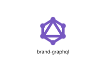
</div>
</div>

{{#endtab}}
{{#tab name="Code"}}

```xml
{{#include ../samples/icons/Tabler-Icons/brand-graphql-4ad626cf.xal}}
```

{{#endtab}}
{{#endtabs}}

<div class="xal-ref-tag"><code>&lt;item id=&#34;100765&#34; /&gt;</code></div>

</div>
<div class="xal-ref-card">
<div class="xal-ref-title">brand-gravatar</div>

{{#tabs name="svg-ref-0766"}}
{{#tab name="Preview"}}
<div class="xal-ref-preview">
<div>
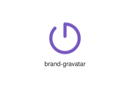
</div>
</div>

{{#endtab}}
{{#tab name="Code"}}

```xml
{{#include ../samples/icons/Tabler-Icons/brand-gravatar-192058e7.xal}}
```

{{#endtab}}
{{#endtabs}}

<div class="xal-ref-tag"><code>&lt;item id=&#34;100766&#34; /&gt;</code></div>

</div>
<div class="xal-ref-card">
<div class="xal-ref-title">brand-grindr</div>

{{#tabs name="svg-ref-0767"}}
{{#tab name="Preview"}}
<div class="xal-ref-preview">
<div>

</div>
</div>

{{#endtab}}
{{#tab name="Code"}}

```xml
{{#include ../samples/icons/Tabler-Icons/brand-grindr-9031414a.xal}}
```

{{#endtab}}
{{#endtabs}}

<div class="xal-ref-tag"><code>&lt;item id=&#34;100767&#34; /&gt;</code></div>

</div>
<div class="xal-ref-card">
<div class="xal-ref-title">brand-guardian</div>

{{#tabs name="svg-ref-0768"}}
{{#tab name="Preview"}}
<div class="xal-ref-preview">
<div>

</div>
</div>

{{#endtab}}
{{#tab name="Code"}}

```xml
{{#include ../samples/icons/Tabler-Icons/brand-guardian-860e9581.xal}}
```

{{#endtab}}
{{#endtabs}}

<div class="xal-ref-tag"><code>&lt;item id=&#34;100768&#34; /&gt;</code></div>

</div>
<div class="xal-ref-card">
<div class="xal-ref-title">brand-gumroad</div>

{{#tabs name="svg-ref-0769"}}
{{#tab name="Preview"}}
<div class="xal-ref-preview">
<div>

</div>
</div>

{{#endtab}}
{{#tab name="Code"}}

```xml
{{#include ../samples/icons/Tabler-Icons/brand-gumroad-fa1abe0b.xal}}
```

{{#endtab}}
{{#endtabs}}

<div class="xal-ref-tag"><code>&lt;item id=&#34;100769&#34; /&gt;</code></div>

</div>
<div class="xal-ref-card">
<div class="xal-ref-title">brand-hackerrank</div>

{{#tabs name="svg-ref-0770"}}
{{#tab name="Preview"}}
<div class="xal-ref-preview">
<div>

</div>
</div>

{{#endtab}}
{{#tab name="Code"}}

```xml
{{#include ../samples/icons/Tabler-Icons/brand-hackerrank-dd4867ad.xal}}
```

{{#endtab}}
{{#endtabs}}

<div class="xal-ref-tag"><code>&lt;item id=&#34;100770&#34; /&gt;</code></div>

</div>
<div class="xal-ref-card">
<div class="xal-ref-title">brand-hbo</div>

{{#tabs name="svg-ref-0771"}}
{{#tab name="Preview"}}
<div class="xal-ref-preview">
<div>

</div>
</div>

{{#endtab}}
{{#tab name="Code"}}

```xml
{{#include ../samples/icons/Tabler-Icons/brand-hbo-43f570ee.xal}}
```

{{#endtab}}
{{#endtabs}}

<div class="xal-ref-tag"><code>&lt;item id=&#34;100771&#34; /&gt;</code></div>

</div>
<div class="xal-ref-card">
<div class="xal-ref-title">brand-headlessui</div>

{{#tabs name="svg-ref-0772"}}
{{#tab name="Preview"}}
<div class="xal-ref-preview">
<div>

</div>
</div>

{{#endtab}}
{{#tab name="Code"}}

```xml
{{#include ../samples/icons/Tabler-Icons/brand-headlessui-79bc4f51.xal}}
```

{{#endtab}}
{{#endtabs}}

<div class="xal-ref-tag"><code>&lt;item id=&#34;100772&#34; /&gt;</code></div>

</div>
<div class="xal-ref-card">
<div class="xal-ref-title">brand-hexo</div>

{{#tabs name="svg-ref-0773"}}
{{#tab name="Preview"}}
<div class="xal-ref-preview">
<div>

</div>
</div>

{{#endtab}}
{{#tab name="Code"}}

```xml
{{#include ../samples/icons/Tabler-Icons/brand-hexo-94b76aa9.xal}}
```

{{#endtab}}
{{#endtabs}}

<div class="xal-ref-tag"><code>&lt;item id=&#34;100773&#34; /&gt;</code></div>

</div>
<div class="xal-ref-card">
<div class="xal-ref-title">brand-hipchat</div>

{{#tabs name="svg-ref-0774"}}
{{#tab name="Preview"}}
<div class="xal-ref-preview">
<div>

</div>
</div>

{{#endtab}}
{{#tab name="Code"}}

```xml
{{#include ../samples/icons/Tabler-Icons/brand-hipchat-1ca91634.xal}}
```

{{#endtab}}
{{#endtabs}}

<div class="xal-ref-tag"><code>&lt;item id=&#34;100774&#34; /&gt;</code></div>

</div>
<div class="xal-ref-card">
<div class="xal-ref-title">brand-html5</div>

{{#tabs name="svg-ref-0775"}}
{{#tab name="Preview"}}
<div class="xal-ref-preview">
<div>

</div>
</div>

{{#endtab}}
{{#tab name="Code"}}

```xml
{{#include ../samples/icons/Tabler-Icons/brand-html5-d66cd735.xal}}
```

{{#endtab}}
{{#endtabs}}

<div class="xal-ref-tag"><code>&lt;item id=&#34;100775&#34; /&gt;</code></div>

</div>
<div class="xal-ref-card">
<div class="xal-ref-title">brand-inertia</div>

{{#tabs name="svg-ref-0776"}}
{{#tab name="Preview"}}
<div class="xal-ref-preview">
<div>
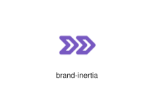
</div>
</div>

{{#endtab}}
{{#tab name="Code"}}

```xml
{{#include ../samples/icons/Tabler-Icons/brand-inertia-8d908823.xal}}
```

{{#endtab}}
{{#endtabs}}

<div class="xal-ref-tag"><code>&lt;item id=&#34;100776&#34; /&gt;</code></div>

</div>
<div class="xal-ref-card">
<div class="xal-ref-title">brand-instagram</div>

{{#tabs name="svg-ref-0777"}}
{{#tab name="Preview"}}
<div class="xal-ref-preview">
<div>

</div>
</div>

{{#endtab}}
{{#tab name="Code"}}

```xml
{{#include ../samples/icons/Tabler-Icons/brand-instagram-6c5e99bc.xal}}
```

{{#endtab}}
{{#endtabs}}

<div class="xal-ref-tag"><code>&lt;item id=&#34;100777&#34; /&gt;</code></div>

</div>
<div class="xal-ref-card">
<div class="xal-ref-title">brand-intercom</div>

{{#tabs name="svg-ref-0778"}}
{{#tab name="Preview"}}
<div class="xal-ref-preview">
<div>

</div>
</div>

{{#endtab}}
{{#tab name="Code"}}

```xml
{{#include ../samples/icons/Tabler-Icons/brand-intercom-88c01c46.xal}}
```

{{#endtab}}
{{#endtabs}}

<div class="xal-ref-tag"><code>&lt;item id=&#34;100778&#34; /&gt;</code></div>

</div>
<div class="xal-ref-card">
<div class="xal-ref-title">brand-itch</div>

{{#tabs name="svg-ref-0779"}}
{{#tab name="Preview"}}
<div class="xal-ref-preview">
<div>
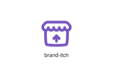
</div>
</div>

{{#endtab}}
{{#tab name="Code"}}

```xml
{{#include ../samples/icons/Tabler-Icons/brand-itch-4285d305.xal}}
```

{{#endtab}}
{{#endtabs}}

<div class="xal-ref-tag"><code>&lt;item id=&#34;100779&#34; /&gt;</code></div>

</div>
<div class="xal-ref-card">
<div class="xal-ref-title">brand-javascript</div>

{{#tabs name="svg-ref-0780"}}
{{#tab name="Preview"}}
<div class="xal-ref-preview">
<div>

</div>
</div>

{{#endtab}}
{{#tab name="Code"}}

```xml
{{#include ../samples/icons/Tabler-Icons/brand-javascript-33baeb2a.xal}}
```

{{#endtab}}
{{#endtabs}}

<div class="xal-ref-tag"><code>&lt;item id=&#34;100780&#34; /&gt;</code></div>

</div>
<div class="xal-ref-card">
<div class="xal-ref-title">brand-juejin</div>

{{#tabs name="svg-ref-0781"}}
{{#tab name="Preview"}}
<div class="xal-ref-preview">
<div>

</div>
</div>

{{#endtab}}
{{#tab name="Code"}}

```xml
{{#include ../samples/icons/Tabler-Icons/brand-juejin-bbc0ff32.xal}}
```

{{#endtab}}
{{#endtabs}}

<div class="xal-ref-tag"><code>&lt;item id=&#34;100781&#34; /&gt;</code></div>

</div>
<div class="xal-ref-card">
<div class="xal-ref-title">brand-kako-talk</div>

{{#tabs name="svg-ref-0782"}}
{{#tab name="Preview"}}
<div class="xal-ref-preview">
<div>

</div>
</div>

{{#endtab}}
{{#tab name="Code"}}

```xml
{{#include ../samples/icons/Tabler-Icons/brand-kako-talk-1a974ae1.xal}}
```

{{#endtab}}
{{#endtabs}}

<div class="xal-ref-tag"><code>&lt;item id=&#34;100782&#34; /&gt;</code></div>

</div>
<div class="xal-ref-card">
<div class="xal-ref-title">brand-kbin</div>

{{#tabs name="svg-ref-0783"}}
{{#tab name="Preview"}}
<div class="xal-ref-preview">
<div>
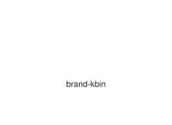
</div>
</div>

{{#endtab}}
{{#tab name="Code"}}

```xml
{{#include ../samples/icons/Tabler-Icons/brand-kbin-2a75ab4a.xal}}
```

{{#endtab}}
{{#endtabs}}

<div class="xal-ref-tag"><code>&lt;item id=&#34;100783&#34; /&gt;</code></div>

</div>
<div class="xal-ref-card">
<div class="xal-ref-title">brand-kick</div>

{{#tabs name="svg-ref-0784"}}
{{#tab name="Preview"}}
<div class="xal-ref-preview">
<div>

</div>
</div>

{{#endtab}}
{{#tab name="Code"}}

```xml
{{#include ../samples/icons/Tabler-Icons/brand-kick-410953a6.xal}}
```

{{#endtab}}
{{#endtabs}}

<div class="xal-ref-tag"><code>&lt;item id=&#34;100784&#34; /&gt;</code></div>

</div>
<div class="xal-ref-card">
<div class="xal-ref-title">brand-kickstarter</div>

{{#tabs name="svg-ref-0785"}}
{{#tab name="Preview"}}
<div class="xal-ref-preview">
<div>

</div>
</div>

{{#endtab}}
{{#tab name="Code"}}

```xml
{{#include ../samples/icons/Tabler-Icons/brand-kickstarter-cf5c7806.xal}}
```

{{#endtab}}
{{#endtabs}}

<div class="xal-ref-tag"><code>&lt;item id=&#34;100785&#34; /&gt;</code></div>

</div>
<div class="xal-ref-card">
<div class="xal-ref-title">brand-kotlin</div>

{{#tabs name="svg-ref-0786"}}
{{#tab name="Preview"}}
<div class="xal-ref-preview">
<div>
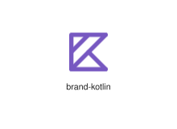
</div>
</div>

{{#endtab}}
{{#tab name="Code"}}

```xml
{{#include ../samples/icons/Tabler-Icons/brand-kotlin-be2d586c.xal}}
```

{{#endtab}}
{{#endtabs}}

<div class="xal-ref-tag"><code>&lt;item id=&#34;100786&#34; /&gt;</code></div>

</div>
<div class="xal-ref-card">
<div class="xal-ref-title">brand-laravel</div>

{{#tabs name="svg-ref-0787"}}
{{#tab name="Preview"}}
<div class="xal-ref-preview">
<div>
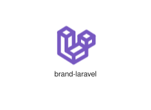
</div>
</div>

{{#endtab}}
{{#tab name="Code"}}

```xml
{{#include ../samples/icons/Tabler-Icons/brand-laravel-2f94737f.xal}}
```

{{#endtab}}
{{#endtabs}}

<div class="xal-ref-tag"><code>&lt;item id=&#34;100787&#34; /&gt;</code></div>

</div>
<div class="xal-ref-card">
<div class="xal-ref-title">brand-lastfm</div>

{{#tabs name="svg-ref-0788"}}
{{#tab name="Preview"}}
<div class="xal-ref-preview">
<div>

</div>
</div>

{{#endtab}}
{{#tab name="Code"}}

```xml
{{#include ../samples/icons/Tabler-Icons/brand-lastfm-7c318b32.xal}}
```

{{#endtab}}
{{#endtabs}}

<div class="xal-ref-tag"><code>&lt;item id=&#34;100788&#34; /&gt;</code></div>

</div>
<div class="xal-ref-card">
<div class="xal-ref-title">brand-leetcode</div>

{{#tabs name="svg-ref-0789"}}
{{#tab name="Preview"}}
<div class="xal-ref-preview">
<div>
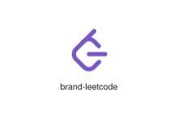
</div>
</div>

{{#endtab}}
{{#tab name="Code"}}

```xml
{{#include ../samples/icons/Tabler-Icons/brand-leetcode-6d93b035.xal}}
```

{{#endtab}}
{{#endtabs}}

<div class="xal-ref-tag"><code>&lt;item id=&#34;100789&#34; /&gt;</code></div>

</div>
<div class="xal-ref-card">
<div class="xal-ref-title">brand-letterboxd</div>

{{#tabs name="svg-ref-0790"}}
{{#tab name="Preview"}}
<div class="xal-ref-preview">
<div>
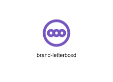
</div>
</div>

{{#endtab}}
{{#tab name="Code"}}

```xml
{{#include ../samples/icons/Tabler-Icons/brand-letterboxd-3a888a7f.xal}}
```

{{#endtab}}
{{#endtabs}}

<div class="xal-ref-tag"><code>&lt;item id=&#34;100790&#34; /&gt;</code></div>

</div>
<div class="xal-ref-card">
<div class="xal-ref-title">brand-line</div>

{{#tabs name="svg-ref-0791"}}
{{#tab name="Preview"}}
<div class="xal-ref-preview">
<div>

</div>
</div>

{{#endtab}}
{{#tab name="Code"}}

```xml
{{#include ../samples/icons/Tabler-Icons/brand-line-4862f700.xal}}
```

{{#endtab}}
{{#endtabs}}

<div class="xal-ref-tag"><code>&lt;item id=&#34;100791&#34; /&gt;</code></div>

</div>
<div class="xal-ref-card">
<div class="xal-ref-title">brand-linkedin</div>

{{#tabs name="svg-ref-0792"}}
{{#tab name="Preview"}}
<div class="xal-ref-preview">
<div>

</div>
</div>

{{#endtab}}
{{#tab name="Code"}}

```xml
{{#include ../samples/icons/Tabler-Icons/brand-linkedin-e3362b17.xal}}
```

{{#endtab}}
{{#endtabs}}

<div class="xal-ref-tag"><code>&lt;item id=&#34;100792&#34; /&gt;</code></div>

</div>
<div class="xal-ref-card">
<div class="xal-ref-title">brand-linktree</div>

{{#tabs name="svg-ref-0793"}}
{{#tab name="Preview"}}
<div class="xal-ref-preview">
<div>
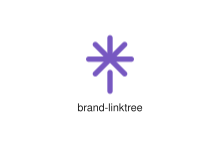
</div>
</div>

{{#endtab}}
{{#tab name="Code"}}

```xml
{{#include ../samples/icons/Tabler-Icons/brand-linktree-573b423c.xal}}
```

{{#endtab}}
{{#endtabs}}

<div class="xal-ref-tag"><code>&lt;item id=&#34;100793&#34; /&gt;</code></div>

</div>
<div class="xal-ref-card">
<div class="xal-ref-title">brand-linqpad</div>

{{#tabs name="svg-ref-0794"}}
{{#tab name="Preview"}}
<div class="xal-ref-preview">
<div>

</div>
</div>

{{#endtab}}
{{#tab name="Code"}}

```xml
{{#include ../samples/icons/Tabler-Icons/brand-linqpad-c23d8f28.xal}}
```

{{#endtab}}
{{#endtabs}}

<div class="xal-ref-tag"><code>&lt;item id=&#34;100794&#34; /&gt;</code></div>

</div>
<div class="xal-ref-card">
<div class="xal-ref-title">brand-livewire</div>

{{#tabs name="svg-ref-0795"}}
{{#tab name="Preview"}}
<div class="xal-ref-preview">
<div>

</div>
</div>

{{#endtab}}
{{#tab name="Code"}}

```xml
{{#include ../samples/icons/Tabler-Icons/brand-livewire-5e05a546.xal}}
```

{{#endtab}}
{{#endtabs}}

<div class="xal-ref-tag"><code>&lt;item id=&#34;100795&#34; /&gt;</code></div>

</div>
<div class="xal-ref-card">
<div class="xal-ref-title">brand-loom</div>

{{#tabs name="svg-ref-0796"}}
{{#tab name="Preview"}}
<div class="xal-ref-preview">
<div>

</div>
</div>

{{#endtab}}
{{#tab name="Code"}}

```xml
{{#include ../samples/icons/Tabler-Icons/brand-loom-d09e5a5e.xal}}
```

{{#endtab}}
{{#endtabs}}

<div class="xal-ref-tag"><code>&lt;item id=&#34;100796&#34; /&gt;</code></div>

</div>
<div class="xal-ref-card">
<div class="xal-ref-title">brand-mailgun</div>

{{#tabs name="svg-ref-0797"}}
{{#tab name="Preview"}}
<div class="xal-ref-preview">
<div>

</div>
</div>

{{#endtab}}
{{#tab name="Code"}}

```xml
{{#include ../samples/icons/Tabler-Icons/brand-mailgun-e335a343.xal}}
```

{{#endtab}}
{{#endtabs}}

<div class="xal-ref-tag"><code>&lt;item id=&#34;100797&#34; /&gt;</code></div>

</div>
<div class="xal-ref-card">
<div class="xal-ref-title">brand-mantine</div>

{{#tabs name="svg-ref-0798"}}
{{#tab name="Preview"}}
<div class="xal-ref-preview">
<div>
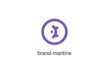
</div>
</div>

{{#endtab}}
{{#tab name="Code"}}

```xml
{{#include ../samples/icons/Tabler-Icons/brand-mantine-66f45c00.xal}}
```

{{#endtab}}
{{#endtabs}}

<div class="xal-ref-tag"><code>&lt;item id=&#34;100798&#34; /&gt;</code></div>

</div>
<div class="xal-ref-card">
<div class="xal-ref-title">brand-mastercard</div>

{{#tabs name="svg-ref-0799"}}
{{#tab name="Preview"}}
<div class="xal-ref-preview">
<div>

</div>
</div>

{{#endtab}}
{{#tab name="Code"}}

```xml
{{#include ../samples/icons/Tabler-Icons/brand-mastercard-2ea8b0b5.xal}}
```

{{#endtab}}
{{#endtabs}}

<div class="xal-ref-tag"><code>&lt;item id=&#34;100799&#34; /&gt;</code></div>

</div>
<div class="xal-ref-card">
<div class="xal-ref-title">brand-mastodon</div>

{{#tabs name="svg-ref-0800"}}
{{#tab name="Preview"}}
<div class="xal-ref-preview">
<div>

</div>
</div>

{{#endtab}}
{{#tab name="Code"}}

```xml
{{#include ../samples/icons/Tabler-Icons/brand-mastodon-24e0fe10.xal}}
```

{{#endtab}}
{{#endtabs}}

<div class="xal-ref-tag"><code>&lt;item id=&#34;100800&#34; /&gt;</code></div>

</div>
<div class="xal-ref-card">
<div class="xal-ref-title">brand-matrix</div>

{{#tabs name="svg-ref-0801"}}
{{#tab name="Preview"}}
<div class="xal-ref-preview">
<div>

</div>
</div>

{{#endtab}}
{{#tab name="Code"}}

```xml
{{#include ../samples/icons/Tabler-Icons/brand-matrix-a3b07608.xal}}
```

{{#endtab}}
{{#endtabs}}

<div class="xal-ref-tag"><code>&lt;item id=&#34;100801&#34; /&gt;</code></div>

</div>
<div class="xal-ref-card">
<div class="xal-ref-title">brand-mcdonalds</div>

{{#tabs name="svg-ref-0802"}}
{{#tab name="Preview"}}
<div class="xal-ref-preview">
<div>

</div>
</div>

{{#endtab}}
{{#tab name="Code"}}

```xml
{{#include ../samples/icons/Tabler-Icons/brand-mcdonalds-cbe1c006.xal}}
```

{{#endtab}}
{{#endtabs}}

<div class="xal-ref-tag"><code>&lt;item id=&#34;100802&#34; /&gt;</code></div>

</div>
<div class="xal-ref-card">
<div class="xal-ref-title">brand-medium</div>

{{#tabs name="svg-ref-0803"}}
{{#tab name="Preview"}}
<div class="xal-ref-preview">
<div>

</div>
</div>

{{#endtab}}
{{#tab name="Code"}}

```xml
{{#include ../samples/icons/Tabler-Icons/brand-medium-3b2a0409.xal}}
```

{{#endtab}}
{{#endtabs}}

<div class="xal-ref-tag"><code>&lt;item id=&#34;100803&#34; /&gt;</code></div>

</div>
<div class="xal-ref-card">
<div class="xal-ref-title">brand-meetup</div>

{{#tabs name="svg-ref-0804"}}
{{#tab name="Preview"}}
<div class="xal-ref-preview">
<div>

</div>
</div>

{{#endtab}}
{{#tab name="Code"}}

```xml
{{#include ../samples/icons/Tabler-Icons/brand-meetup-69f9aaaa.xal}}
```

{{#endtab}}
{{#endtabs}}

<div class="xal-ref-tag"><code>&lt;item id=&#34;100804&#34; /&gt;</code></div>

</div>
<div class="xal-ref-card">
<div class="xal-ref-title">brand-mercedes</div>

{{#tabs name="svg-ref-0805"}}
{{#tab name="Preview"}}
<div class="xal-ref-preview">
<div>

</div>
</div>

{{#endtab}}
{{#tab name="Code"}}

```xml
{{#include ../samples/icons/Tabler-Icons/brand-mercedes-1b71a589.xal}}
```

{{#endtab}}
{{#endtabs}}

<div class="xal-ref-tag"><code>&lt;item id=&#34;100805&#34; /&gt;</code></div>

</div>
<div class="xal-ref-card">
<div class="xal-ref-title">brand-messenger</div>

{{#tabs name="svg-ref-0806"}}
{{#tab name="Preview"}}
<div class="xal-ref-preview">
<div>

</div>
</div>

{{#endtab}}
{{#tab name="Code"}}

```xml
{{#include ../samples/icons/Tabler-Icons/brand-messenger-31cdf756.xal}}
```

{{#endtab}}
{{#endtabs}}

<div class="xal-ref-tag"><code>&lt;item id=&#34;100806&#34; /&gt;</code></div>

</div>
<div class="xal-ref-card">
<div class="xal-ref-title">brand-meta</div>

{{#tabs name="svg-ref-0807"}}
{{#tab name="Preview"}}
<div class="xal-ref-preview">
<div>
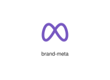
</div>
</div>

{{#endtab}}
{{#tab name="Code"}}

```xml
{{#include ../samples/icons/Tabler-Icons/brand-meta-14a51ad7.xal}}
```

{{#endtab}}
{{#endtabs}}

<div class="xal-ref-tag"><code>&lt;item id=&#34;100807&#34; /&gt;</code></div>

</div>
<div class="xal-ref-card">
<div class="xal-ref-title">brand-metabrainz</div>

{{#tabs name="svg-ref-0808"}}
{{#tab name="Preview"}}
<div class="xal-ref-preview">
<div>

</div>
</div>

{{#endtab}}
{{#tab name="Code"}}

```xml
{{#include ../samples/icons/Tabler-Icons/brand-metabrainz-7dfae245.xal}}
```

{{#endtab}}
{{#endtabs}}

<div class="xal-ref-tag"><code>&lt;item id=&#34;100808&#34; /&gt;</code></div>

</div>
<div class="xal-ref-card">
<div class="xal-ref-title">brand-minecraft</div>

{{#tabs name="svg-ref-0809"}}
{{#tab name="Preview"}}
<div class="xal-ref-preview">
<div>

</div>
</div>

{{#endtab}}
{{#tab name="Code"}}

```xml
{{#include ../samples/icons/Tabler-Icons/brand-minecraft-491f2d6e.xal}}
```

{{#endtab}}
{{#endtabs}}

<div class="xal-ref-tag"><code>&lt;item id=&#34;100809&#34; /&gt;</code></div>

</div>
</div>
