# Tabler-Icons - Page 10

This page references SVG files under `etc/resources/aws/svg/Tabler-Icons`.
Each card shows the SVG preview first and the XAL tag syntax in the Code tab.
Showing 811-900 of 4964 SVG files.

<style>
.xal-ref-grid{display:grid;grid-template-columns:repeat(3,minmax(0,1fr));gap:1rem;margin:1rem 0 1.5rem}.xal-ref-card{border:1px solid var(--table-border-color);border-radius:8px;overflow:hidden;background:var(--bg);padding:.75rem}.xal-ref-title{font-size:.9rem;font-weight:600;line-height:1.25;margin:0 0 .5rem;overflow-wrap:anywhere}.xal-ref-preview{display:flex;align-items:center;justify-content:center}.xal-ref-preview img{display:block;width:100%;height:auto}.xal-ref-card pre{margin:0;max-height:18rem;overflow:auto;white-space:pre}.xal-ref-card code{font-size:.78em}.xal-ref-tag{margin:.5rem 0 0;color:var(--fg);opacity:.72;overflow:auto;white-space:pre}.xal-ref-tag code{font-size:.72em}@media(max-width:900px){.xal-ref-grid{grid-template-columns:repeat(2,minmax(0,1fr))}}@media(max-width:560px){.xal-ref-grid{grid-template-columns:1fr}}
</style>

[Back to section index](tabler-icons.md)

<div class="xal-ref-grid">
<div class="xal-ref-card">
<div class="xal-ref-title">brand-miniprogram</div>

{{#tabs name="svg-ref-0810"}}
{{#tab name="Preview"}}
<div class="xal-ref-preview">
<div>

</div>
</div>

{{#endtab}}
{{#tab name="Code"}}

```xml
{{#include ../samples/icons/Tabler-Icons/brand-miniprogram-3425d7f1.xal}}
```

{{#endtab}}
{{#endtabs}}

<div class="xal-ref-tag"><code>&lt;item id=&#34;100810&#34; /&gt;</code></div>

</div>
<div class="xal-ref-card">
<div class="xal-ref-title">brand-mixpanel</div>

{{#tabs name="svg-ref-0811"}}
{{#tab name="Preview"}}
<div class="xal-ref-preview">
<div>
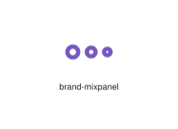
</div>
</div>

{{#endtab}}
{{#tab name="Code"}}

```xml
{{#include ../samples/icons/Tabler-Icons/brand-mixpanel-518e88d4.xal}}
```

{{#endtab}}
{{#endtabs}}

<div class="xal-ref-tag"><code>&lt;item id=&#34;100811&#34; /&gt;</code></div>

</div>
<div class="xal-ref-card">
<div class="xal-ref-title">brand-monday</div>

{{#tabs name="svg-ref-0812"}}
{{#tab name="Preview"}}
<div class="xal-ref-preview">
<div>

</div>
</div>

{{#endtab}}
{{#tab name="Code"}}

```xml
{{#include ../samples/icons/Tabler-Icons/brand-monday-53348250.xal}}
```

{{#endtab}}
{{#endtabs}}

<div class="xal-ref-tag"><code>&lt;item id=&#34;100812&#34; /&gt;</code></div>

</div>
<div class="xal-ref-card">
<div class="xal-ref-title">brand-mongodb</div>

{{#tabs name="svg-ref-0813"}}
{{#tab name="Preview"}}
<div class="xal-ref-preview">
<div>

</div>
</div>

{{#endtab}}
{{#tab name="Code"}}

```xml
{{#include ../samples/icons/Tabler-Icons/brand-mongodb-fa629037.xal}}
```

{{#endtab}}
{{#endtabs}}

<div class="xal-ref-tag"><code>&lt;item id=&#34;100813&#34; /&gt;</code></div>

</div>
<div class="xal-ref-card">
<div class="xal-ref-title">brand-my-oppo</div>

{{#tabs name="svg-ref-0814"}}
{{#tab name="Preview"}}
<div class="xal-ref-preview">
<div>

</div>
</div>

{{#endtab}}
{{#tab name="Code"}}

```xml
{{#include ../samples/icons/Tabler-Icons/brand-my-oppo-15692df4.xal}}
```

{{#endtab}}
{{#endtabs}}

<div class="xal-ref-tag"><code>&lt;item id=&#34;100814&#34; /&gt;</code></div>

</div>
<div class="xal-ref-card">
<div class="xal-ref-title">brand-mysql</div>

{{#tabs name="svg-ref-0815"}}
{{#tab name="Preview"}}
<div class="xal-ref-preview">
<div>
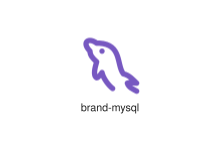
</div>
</div>

{{#endtab}}
{{#tab name="Code"}}

```xml
{{#include ../samples/icons/Tabler-Icons/brand-mysql-ba54dcc7.xal}}
```

{{#endtab}}
{{#endtabs}}

<div class="xal-ref-tag"><code>&lt;item id=&#34;100815&#34; /&gt;</code></div>

</div>
<div class="xal-ref-card">
<div class="xal-ref-title">brand-national-geographic</div>

{{#tabs name="svg-ref-0816"}}
{{#tab name="Preview"}}
<div class="xal-ref-preview">
<div>
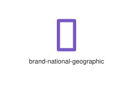
</div>
</div>

{{#endtab}}
{{#tab name="Code"}}

```xml
{{#include ../samples/icons/Tabler-Icons/brand-national-geographic-e90aec52.xal}}
```

{{#endtab}}
{{#endtabs}}

<div class="xal-ref-tag"><code>&lt;item id=&#34;100816&#34; /&gt;</code></div>

</div>
<div class="xal-ref-card">
<div class="xal-ref-title">brand-nem</div>

{{#tabs name="svg-ref-0817"}}
{{#tab name="Preview"}}
<div class="xal-ref-preview">
<div>

</div>
</div>

{{#endtab}}
{{#tab name="Code"}}

```xml
{{#include ../samples/icons/Tabler-Icons/brand-nem-47e0260c.xal}}
```

{{#endtab}}
{{#endtabs}}

<div class="xal-ref-tag"><code>&lt;item id=&#34;100817&#34; /&gt;</code></div>

</div>
<div class="xal-ref-card">
<div class="xal-ref-title">brand-netbeans</div>

{{#tabs name="svg-ref-0818"}}
{{#tab name="Preview"}}
<div class="xal-ref-preview">
<div>
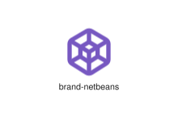
</div>
</div>

{{#endtab}}
{{#tab name="Code"}}

```xml
{{#include ../samples/icons/Tabler-Icons/brand-netbeans-4e75cc19.xal}}
```

{{#endtab}}
{{#endtabs}}

<div class="xal-ref-tag"><code>&lt;item id=&#34;100818&#34; /&gt;</code></div>

</div>
<div class="xal-ref-card">
<div class="xal-ref-title">brand-netease-music</div>

{{#tabs name="svg-ref-0819"}}
{{#tab name="Preview"}}
<div class="xal-ref-preview">
<div>

</div>
</div>

{{#endtab}}
{{#tab name="Code"}}

```xml
{{#include ../samples/icons/Tabler-Icons/brand-netease-music-411b486a.xal}}
```

{{#endtab}}
{{#endtabs}}

<div class="xal-ref-tag"><code>&lt;item id=&#34;100819&#34; /&gt;</code></div>

</div>
<div class="xal-ref-card">
<div class="xal-ref-title">brand-netflix</div>

{{#tabs name="svg-ref-0820"}}
{{#tab name="Preview"}}
<div class="xal-ref-preview">
<div>

</div>
</div>

{{#endtab}}
{{#tab name="Code"}}

```xml
{{#include ../samples/icons/Tabler-Icons/brand-netflix-26c028ee.xal}}
```

{{#endtab}}
{{#endtabs}}

<div class="xal-ref-tag"><code>&lt;item id=&#34;100820&#34; /&gt;</code></div>

</div>
<div class="xal-ref-card">
<div class="xal-ref-title">brand-nexo</div>

{{#tabs name="svg-ref-0821"}}
{{#tab name="Preview"}}
<div class="xal-ref-preview">
<div>

</div>
</div>

{{#endtab}}
{{#tab name="Code"}}

```xml
{{#include ../samples/icons/Tabler-Icons/brand-nexo-52d8632e.xal}}
```

{{#endtab}}
{{#endtabs}}

<div class="xal-ref-tag"><code>&lt;item id=&#34;100821&#34; /&gt;</code></div>

</div>
<div class="xal-ref-card">
<div class="xal-ref-title">brand-nextcloud</div>

{{#tabs name="svg-ref-0822"}}
{{#tab name="Preview"}}
<div class="xal-ref-preview">
<div>

</div>
</div>

{{#endtab}}
{{#tab name="Code"}}

```xml
{{#include ../samples/icons/Tabler-Icons/brand-nextcloud-a35c578c.xal}}
```

{{#endtab}}
{{#endtabs}}

<div class="xal-ref-tag"><code>&lt;item id=&#34;100822&#34; /&gt;</code></div>

</div>
<div class="xal-ref-card">
<div class="xal-ref-title">brand-nextjs</div>

{{#tabs name="svg-ref-0823"}}
{{#tab name="Preview"}}
<div class="xal-ref-preview">
<div>

</div>
</div>

{{#endtab}}
{{#tab name="Code"}}

```xml
{{#include ../samples/icons/Tabler-Icons/brand-nextjs-d050ffcd.xal}}
```

{{#endtab}}
{{#endtabs}}

<div class="xal-ref-tag"><code>&lt;item id=&#34;100823&#34; /&gt;</code></div>

</div>
<div class="xal-ref-card">
<div class="xal-ref-title">brand-nodejs</div>

{{#tabs name="svg-ref-0824"}}
{{#tab name="Preview"}}
<div class="xal-ref-preview">
<div>

</div>
</div>

{{#endtab}}
{{#tab name="Code"}}

```xml
{{#include ../samples/icons/Tabler-Icons/brand-nodejs-afc3c64d.xal}}
```

{{#endtab}}
{{#endtabs}}

<div class="xal-ref-tag"><code>&lt;item id=&#34;100824&#34; /&gt;</code></div>

</div>
<div class="xal-ref-card">
<div class="xal-ref-title">brand-nord-vpn</div>

{{#tabs name="svg-ref-0825"}}
{{#tab name="Preview"}}
<div class="xal-ref-preview">
<div>

</div>
</div>

{{#endtab}}
{{#tab name="Code"}}

```xml
{{#include ../samples/icons/Tabler-Icons/brand-nord-vpn-2b73d690.xal}}
```

{{#endtab}}
{{#endtabs}}

<div class="xal-ref-tag"><code>&lt;item id=&#34;100825&#34; /&gt;</code></div>

</div>
<div class="xal-ref-card">
<div class="xal-ref-title">brand-notion</div>

{{#tabs name="svg-ref-0826"}}
{{#tab name="Preview"}}
<div class="xal-ref-preview">
<div>
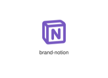
</div>
</div>

{{#endtab}}
{{#tab name="Code"}}

```xml
{{#include ../samples/icons/Tabler-Icons/brand-notion-dc655f92.xal}}
```

{{#endtab}}
{{#endtabs}}

<div class="xal-ref-tag"><code>&lt;item id=&#34;100826&#34; /&gt;</code></div>

</div>
<div class="xal-ref-card">
<div class="xal-ref-title">brand-npm</div>

{{#tabs name="svg-ref-0827"}}
{{#tab name="Preview"}}
<div class="xal-ref-preview">
<div>

</div>
</div>

{{#endtab}}
{{#tab name="Code"}}

```xml
{{#include ../samples/icons/Tabler-Icons/brand-npm-14fbb524.xal}}
```

{{#endtab}}
{{#endtabs}}

<div class="xal-ref-tag"><code>&lt;item id=&#34;100827&#34; /&gt;</code></div>

</div>
<div class="xal-ref-card">
<div class="xal-ref-title">brand-nuxt</div>

{{#tabs name="svg-ref-0828"}}
{{#tab name="Preview"}}
<div class="xal-ref-preview">
<div>
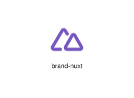
</div>
</div>

{{#endtab}}
{{#tab name="Code"}}

```xml
{{#include ../samples/icons/Tabler-Icons/brand-nuxt-22365973.xal}}
```

{{#endtab}}
{{#endtabs}}

<div class="xal-ref-tag"><code>&lt;item id=&#34;100828&#34; /&gt;</code></div>

</div>
<div class="xal-ref-card">
<div class="xal-ref-title">brand-nytimes</div>

{{#tabs name="svg-ref-0829"}}
{{#tab name="Preview"}}
<div class="xal-ref-preview">
<div>

</div>
</div>

{{#endtab}}
{{#tab name="Code"}}

```xml
{{#include ../samples/icons/Tabler-Icons/brand-nytimes-6417a1fa.xal}}
```

{{#endtab}}
{{#endtabs}}

<div class="xal-ref-tag"><code>&lt;item id=&#34;100829&#34; /&gt;</code></div>

</div>
<div class="xal-ref-card">
<div class="xal-ref-title">brand-oauth</div>

{{#tabs name="svg-ref-0830"}}
{{#tab name="Preview"}}
<div class="xal-ref-preview">
<div>

</div>
</div>

{{#endtab}}
{{#tab name="Code"}}

```xml
{{#include ../samples/icons/Tabler-Icons/brand-oauth-fd61dc96.xal}}
```

{{#endtab}}
{{#endtabs}}

<div class="xal-ref-tag"><code>&lt;item id=&#34;100830&#34; /&gt;</code></div>

</div>
<div class="xal-ref-card">
<div class="xal-ref-title">brand-office</div>

{{#tabs name="svg-ref-0831"}}
{{#tab name="Preview"}}
<div class="xal-ref-preview">
<div>

</div>
</div>

{{#endtab}}
{{#tab name="Code"}}

```xml
{{#include ../samples/icons/Tabler-Icons/brand-office-a18845cb.xal}}
```

{{#endtab}}
{{#endtabs}}

<div class="xal-ref-tag"><code>&lt;item id=&#34;100831&#34; /&gt;</code></div>

</div>
<div class="xal-ref-card">
<div class="xal-ref-title">brand-ok-ru</div>

{{#tabs name="svg-ref-0832"}}
{{#tab name="Preview"}}
<div class="xal-ref-preview">
<div>

</div>
</div>

{{#endtab}}
{{#tab name="Code"}}

```xml
{{#include ../samples/icons/Tabler-Icons/brand-ok-ru-32b2d7a0.xal}}
```

{{#endtab}}
{{#endtabs}}

<div class="xal-ref-tag"><code>&lt;item id=&#34;100832&#34; /&gt;</code></div>

</div>
<div class="xal-ref-card">
<div class="xal-ref-title">brand-onedrive</div>

{{#tabs name="svg-ref-0833"}}
{{#tab name="Preview"}}
<div class="xal-ref-preview">
<div>

</div>
</div>

{{#endtab}}
{{#tab name="Code"}}

```xml
{{#include ../samples/icons/Tabler-Icons/brand-onedrive-083300ef.xal}}
```

{{#endtab}}
{{#endtabs}}

<div class="xal-ref-tag"><code>&lt;item id=&#34;100833&#34; /&gt;</code></div>

</div>
<div class="xal-ref-card">
<div class="xal-ref-title">brand-onlyfans</div>

{{#tabs name="svg-ref-0834"}}
{{#tab name="Preview"}}
<div class="xal-ref-preview">
<div>

</div>
</div>

{{#endtab}}
{{#tab name="Code"}}

```xml
{{#include ../samples/icons/Tabler-Icons/brand-onlyfans-62921d61.xal}}
```

{{#endtab}}
{{#endtabs}}

<div class="xal-ref-tag"><code>&lt;item id=&#34;100834&#34; /&gt;</code></div>

</div>
<div class="xal-ref-card">
<div class="xal-ref-title">brand-open-source</div>

{{#tabs name="svg-ref-0835"}}
{{#tab name="Preview"}}
<div class="xal-ref-preview">
<div>
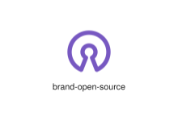
</div>
</div>

{{#endtab}}
{{#tab name="Code"}}

```xml
{{#include ../samples/icons/Tabler-Icons/brand-open-source-d8d8d4e1.xal}}
```

{{#endtab}}
{{#endtabs}}

<div class="xal-ref-tag"><code>&lt;item id=&#34;100835&#34; /&gt;</code></div>

</div>
<div class="xal-ref-card">
<div class="xal-ref-title">brand-openai</div>

{{#tabs name="svg-ref-0836"}}
{{#tab name="Preview"}}
<div class="xal-ref-preview">
<div>
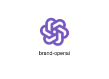
</div>
</div>

{{#endtab}}
{{#tab name="Code"}}

```xml
{{#include ../samples/icons/Tabler-Icons/brand-openai-bd420b57.xal}}
```

{{#endtab}}
{{#endtabs}}

<div class="xal-ref-tag"><code>&lt;item id=&#34;100836&#34; /&gt;</code></div>

</div>
<div class="xal-ref-card">
<div class="xal-ref-title">brand-openvpn</div>

{{#tabs name="svg-ref-0837"}}
{{#tab name="Preview"}}
<div class="xal-ref-preview">
<div>

</div>
</div>

{{#endtab}}
{{#tab name="Code"}}

```xml
{{#include ../samples/icons/Tabler-Icons/brand-openvpn-464002f4.xal}}
```

{{#endtab}}
{{#endtabs}}

<div class="xal-ref-tag"><code>&lt;item id=&#34;100837&#34; /&gt;</code></div>

</div>
<div class="xal-ref-card">
<div class="xal-ref-title">brand-opera</div>

{{#tabs name="svg-ref-0838"}}
{{#tab name="Preview"}}
<div class="xal-ref-preview">
<div>
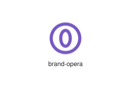
</div>
</div>

{{#endtab}}
{{#tab name="Code"}}

```xml
{{#include ../samples/icons/Tabler-Icons/brand-opera-f1e7f081.xal}}
```

{{#endtab}}
{{#endtabs}}

<div class="xal-ref-tag"><code>&lt;item id=&#34;100838&#34; /&gt;</code></div>

</div>
<div class="xal-ref-card">
<div class="xal-ref-title">brand-pagekit</div>

{{#tabs name="svg-ref-0839"}}
{{#tab name="Preview"}}
<div class="xal-ref-preview">
<div>

</div>
</div>

{{#endtab}}
{{#tab name="Code"}}

```xml
{{#include ../samples/icons/Tabler-Icons/brand-pagekit-c83ecd81.xal}}
```

{{#endtab}}
{{#endtabs}}

<div class="xal-ref-tag"><code>&lt;item id=&#34;100839&#34; /&gt;</code></div>

</div>
<div class="xal-ref-card">
<div class="xal-ref-title">brand-parsinta</div>

{{#tabs name="svg-ref-0840"}}
{{#tab name="Preview"}}
<div class="xal-ref-preview">
<div>

</div>
</div>

{{#endtab}}
{{#tab name="Code"}}

```xml
{{#include ../samples/icons/Tabler-Icons/brand-parsinta-b4aa27b5.xal}}
```

{{#endtab}}
{{#endtabs}}

<div class="xal-ref-tag"><code>&lt;item id=&#34;100840&#34; /&gt;</code></div>

</div>
<div class="xal-ref-card">
<div class="xal-ref-title">brand-patreon</div>

{{#tabs name="svg-ref-0841"}}
{{#tab name="Preview"}}
<div class="xal-ref-preview">
<div>

</div>
</div>

{{#endtab}}
{{#tab name="Code"}}

```xml
{{#include ../samples/icons/Tabler-Icons/brand-patreon-873b9c64.xal}}
```

{{#endtab}}
{{#endtabs}}

<div class="xal-ref-tag"><code>&lt;item id=&#34;100841&#34; /&gt;</code></div>

</div>
<div class="xal-ref-card">
<div class="xal-ref-title">brand-paypal</div>

{{#tabs name="svg-ref-0842"}}
{{#tab name="Preview"}}
<div class="xal-ref-preview">
<div>

</div>
</div>

{{#endtab}}
{{#tab name="Code"}}

```xml
{{#include ../samples/icons/Tabler-Icons/brand-paypal-0449cb87.xal}}
```

{{#endtab}}
{{#endtabs}}

<div class="xal-ref-tag"><code>&lt;item id=&#34;100842&#34; /&gt;</code></div>

</div>
<div class="xal-ref-card">
<div class="xal-ref-title">brand-paypay</div>

{{#tabs name="svg-ref-0843"}}
{{#tab name="Preview"}}
<div class="xal-ref-preview">
<div>

</div>
</div>

{{#endtab}}
{{#tab name="Code"}}

```xml
{{#include ../samples/icons/Tabler-Icons/brand-paypay-ac49d375.xal}}
```

{{#endtab}}
{{#endtabs}}

<div class="xal-ref-tag"><code>&lt;item id=&#34;100843&#34; /&gt;</code></div>

</div>
<div class="xal-ref-card">
<div class="xal-ref-title">brand-peanut</div>

{{#tabs name="svg-ref-0844"}}
{{#tab name="Preview"}}
<div class="xal-ref-preview">
<div>
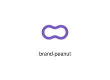
</div>
</div>

{{#endtab}}
{{#tab name="Code"}}

```xml
{{#include ../samples/icons/Tabler-Icons/brand-peanut-09cdcb48.xal}}
```

{{#endtab}}
{{#endtabs}}

<div class="xal-ref-tag"><code>&lt;item id=&#34;100844&#34; /&gt;</code></div>

</div>
<div class="xal-ref-card">
<div class="xal-ref-title">brand-pepsi</div>

{{#tabs name="svg-ref-0845"}}
{{#tab name="Preview"}}
<div class="xal-ref-preview">
<div>
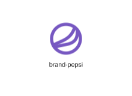
</div>
</div>

{{#endtab}}
{{#tab name="Code"}}

```xml
{{#include ../samples/icons/Tabler-Icons/brand-pepsi-780f6963.xal}}
```

{{#endtab}}
{{#endtabs}}

<div class="xal-ref-tag"><code>&lt;item id=&#34;100845&#34; /&gt;</code></div>

</div>
<div class="xal-ref-card">
<div class="xal-ref-title">brand-php</div>

{{#tabs name="svg-ref-0846"}}
{{#tab name="Preview"}}
<div class="xal-ref-preview">
<div>

</div>
</div>

{{#endtab}}
{{#tab name="Code"}}

```xml
{{#include ../samples/icons/Tabler-Icons/brand-php-54ef8172.xal}}
```

{{#endtab}}
{{#endtabs}}

<div class="xal-ref-tag"><code>&lt;item id=&#34;100846&#34; /&gt;</code></div>

</div>
<div class="xal-ref-card">
<div class="xal-ref-title">brand-picsart</div>

{{#tabs name="svg-ref-0847"}}
{{#tab name="Preview"}}
<div class="xal-ref-preview">
<div>

</div>
</div>

{{#endtab}}
{{#tab name="Code"}}

```xml
{{#include ../samples/icons/Tabler-Icons/brand-picsart-f1b049c3.xal}}
```

{{#endtab}}
{{#endtabs}}

<div class="xal-ref-tag"><code>&lt;item id=&#34;100847&#34; /&gt;</code></div>

</div>
<div class="xal-ref-card">
<div class="xal-ref-title">brand-pinterest</div>

{{#tabs name="svg-ref-0848"}}
{{#tab name="Preview"}}
<div class="xal-ref-preview">
<div>

</div>
</div>

{{#endtab}}
{{#tab name="Code"}}

```xml
{{#include ../samples/icons/Tabler-Icons/brand-pinterest-a616cfad.xal}}
```

{{#endtab}}
{{#endtabs}}

<div class="xal-ref-tag"><code>&lt;item id=&#34;100848&#34; /&gt;</code></div>

</div>
<div class="xal-ref-card">
<div class="xal-ref-title">brand-planetscale</div>

{{#tabs name="svg-ref-0849"}}
{{#tab name="Preview"}}
<div class="xal-ref-preview">
<div>

</div>
</div>

{{#endtab}}
{{#tab name="Code"}}

```xml
{{#include ../samples/icons/Tabler-Icons/brand-planetscale-9ddb1178.xal}}
```

{{#endtab}}
{{#endtabs}}

<div class="xal-ref-tag"><code>&lt;item id=&#34;100849&#34; /&gt;</code></div>

</div>
<div class="xal-ref-card">
<div class="xal-ref-title">brand-pnpm</div>

{{#tabs name="svg-ref-0850"}}
{{#tab name="Preview"}}
<div class="xal-ref-preview">
<div>
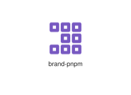
</div>
</div>

{{#endtab}}
{{#tab name="Code"}}

```xml
{{#include ../samples/icons/Tabler-Icons/brand-pnpm-af7dc5c0.xal}}
```

{{#endtab}}
{{#endtabs}}

<div class="xal-ref-tag"><code>&lt;item id=&#34;100850&#34; /&gt;</code></div>

</div>
<div class="xal-ref-card">
<div class="xal-ref-title">brand-pocket</div>

{{#tabs name="svg-ref-0851"}}
{{#tab name="Preview"}}
<div class="xal-ref-preview">
<div>

</div>
</div>

{{#endtab}}
{{#tab name="Code"}}

```xml
{{#include ../samples/icons/Tabler-Icons/brand-pocket-8f286b97.xal}}
```

{{#endtab}}
{{#endtabs}}

<div class="xal-ref-tag"><code>&lt;item id=&#34;100851&#34; /&gt;</code></div>

</div>
<div class="xal-ref-card">
<div class="xal-ref-title">brand-polymer</div>

{{#tabs name="svg-ref-0852"}}
{{#tab name="Preview"}}
<div class="xal-ref-preview">
<div>

</div>
</div>

{{#endtab}}
{{#tab name="Code"}}

```xml
{{#include ../samples/icons/Tabler-Icons/brand-polymer-e4e4476a.xal}}
```

{{#endtab}}
{{#endtabs}}

<div class="xal-ref-tag"><code>&lt;item id=&#34;100852&#34; /&gt;</code></div>

</div>
<div class="xal-ref-card">
<div class="xal-ref-title">brand-powershell</div>

{{#tabs name="svg-ref-0853"}}
{{#tab name="Preview"}}
<div class="xal-ref-preview">
<div>

</div>
</div>

{{#endtab}}
{{#tab name="Code"}}

```xml
{{#include ../samples/icons/Tabler-Icons/brand-powershell-1bf84efb.xal}}
```

{{#endtab}}
{{#endtabs}}

<div class="xal-ref-tag"><code>&lt;item id=&#34;100853&#34; /&gt;</code></div>

</div>
<div class="xal-ref-card">
<div class="xal-ref-title">brand-printables</div>

{{#tabs name="svg-ref-0854"}}
{{#tab name="Preview"}}
<div class="xal-ref-preview">
<div>

</div>
</div>

{{#endtab}}
{{#tab name="Code"}}

```xml
{{#include ../samples/icons/Tabler-Icons/brand-printables-601423c9.xal}}
```

{{#endtab}}
{{#endtabs}}

<div class="xal-ref-tag"><code>&lt;item id=&#34;100854&#34; /&gt;</code></div>

</div>
<div class="xal-ref-card">
<div class="xal-ref-title">brand-prisma</div>

{{#tabs name="svg-ref-0855"}}
{{#tab name="Preview"}}
<div class="xal-ref-preview">
<div>
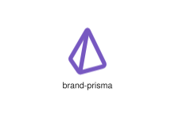
</div>
</div>

{{#endtab}}
{{#tab name="Code"}}

```xml
{{#include ../samples/icons/Tabler-Icons/brand-prisma-53059a4f.xal}}
```

{{#endtab}}
{{#endtabs}}

<div class="xal-ref-tag"><code>&lt;item id=&#34;100855&#34; /&gt;</code></div>

</div>
<div class="xal-ref-card">
<div class="xal-ref-title">brand-producthunt</div>

{{#tabs name="svg-ref-0856"}}
{{#tab name="Preview"}}
<div class="xal-ref-preview">
<div>

</div>
</div>

{{#endtab}}
{{#tab name="Code"}}

```xml
{{#include ../samples/icons/Tabler-Icons/brand-producthunt-f1751464.xal}}
```

{{#endtab}}
{{#endtabs}}

<div class="xal-ref-tag"><code>&lt;item id=&#34;100856&#34; /&gt;</code></div>

</div>
<div class="xal-ref-card">
<div class="xal-ref-title">brand-pushbullet</div>

{{#tabs name="svg-ref-0857"}}
{{#tab name="Preview"}}
<div class="xal-ref-preview">
<div>

</div>
</div>

{{#endtab}}
{{#tab name="Code"}}

```xml
{{#include ../samples/icons/Tabler-Icons/brand-pushbullet-6fcbc6bf.xal}}
```

{{#endtab}}
{{#endtabs}}

<div class="xal-ref-tag"><code>&lt;item id=&#34;100857&#34; /&gt;</code></div>

</div>
<div class="xal-ref-card">
<div class="xal-ref-title">brand-pushover</div>

{{#tabs name="svg-ref-0858"}}
{{#tab name="Preview"}}
<div class="xal-ref-preview">
<div>

</div>
</div>

{{#endtab}}
{{#tab name="Code"}}

```xml
{{#include ../samples/icons/Tabler-Icons/brand-pushover-1646c02c.xal}}
```

{{#endtab}}
{{#endtabs}}

<div class="xal-ref-tag"><code>&lt;item id=&#34;100858&#34; /&gt;</code></div>

</div>
<div class="xal-ref-card">
<div class="xal-ref-title">brand-python</div>

{{#tabs name="svg-ref-0859"}}
{{#tab name="Preview"}}
<div class="xal-ref-preview">
<div>

</div>
</div>

{{#endtab}}
{{#tab name="Code"}}

```xml
{{#include ../samples/icons/Tabler-Icons/brand-python-9cafde86.xal}}
```

{{#endtab}}
{{#endtabs}}

<div class="xal-ref-tag"><code>&lt;item id=&#34;100859&#34; /&gt;</code></div>

</div>
<div class="xal-ref-card">
<div class="xal-ref-title">brand-qq</div>

{{#tabs name="svg-ref-0860"}}
{{#tab name="Preview"}}
<div class="xal-ref-preview">
<div>
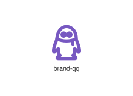
</div>
</div>

{{#endtab}}
{{#tab name="Code"}}

```xml
{{#include ../samples/icons/Tabler-Icons/brand-qq-c0611c24.xal}}
```

{{#endtab}}
{{#endtabs}}

<div class="xal-ref-tag"><code>&lt;item id=&#34;100860&#34; /&gt;</code></div>

</div>
<div class="xal-ref-card">
<div class="xal-ref-title">brand-radix-ui</div>

{{#tabs name="svg-ref-0861"}}
{{#tab name="Preview"}}
<div class="xal-ref-preview">
<div>

</div>
</div>

{{#endtab}}
{{#tab name="Code"}}

```xml
{{#include ../samples/icons/Tabler-Icons/brand-radix-ui-7511465f.xal}}
```

{{#endtab}}
{{#endtabs}}

<div class="xal-ref-tag"><code>&lt;item id=&#34;100861&#34; /&gt;</code></div>

</div>
<div class="xal-ref-card">
<div class="xal-ref-title">brand-react-native</div>

{{#tabs name="svg-ref-0862"}}
{{#tab name="Preview"}}
<div class="xal-ref-preview">
<div>
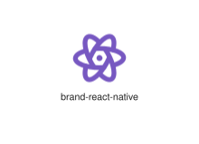
</div>
</div>

{{#endtab}}
{{#tab name="Code"}}

```xml
{{#include ../samples/icons/Tabler-Icons/brand-react-native-21f634f6.xal}}
```

{{#endtab}}
{{#endtabs}}

<div class="xal-ref-tag"><code>&lt;item id=&#34;100863&#34; /&gt;</code></div>

</div>
<div class="xal-ref-card">
<div class="xal-ref-title">brand-react</div>

{{#tabs name="svg-ref-0863"}}
{{#tab name="Preview"}}
<div class="xal-ref-preview">
<div>
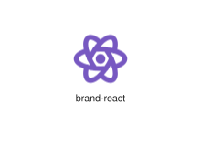
</div>
</div>

{{#endtab}}
{{#tab name="Code"}}

```xml
{{#include ../samples/icons/Tabler-Icons/brand-react-0cf68737.xal}}
```

{{#endtab}}
{{#endtabs}}

<div class="xal-ref-tag"><code>&lt;item id=&#34;100862&#34; /&gt;</code></div>

</div>
<div class="xal-ref-card">
<div class="xal-ref-title">brand-reason</div>

{{#tabs name="svg-ref-0864"}}
{{#tab name="Preview"}}
<div class="xal-ref-preview">
<div>
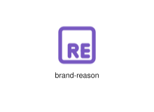
</div>
</div>

{{#endtab}}
{{#tab name="Code"}}

```xml
{{#include ../samples/icons/Tabler-Icons/brand-reason-832c48a5.xal}}
```

{{#endtab}}
{{#endtabs}}

<div class="xal-ref-tag"><code>&lt;item id=&#34;100864&#34; /&gt;</code></div>

</div>
<div class="xal-ref-card">
<div class="xal-ref-title">brand-reddit</div>

{{#tabs name="svg-ref-0865"}}
{{#tab name="Preview"}}
<div class="xal-ref-preview">
<div>

</div>
</div>

{{#endtab}}
{{#tab name="Code"}}

```xml
{{#include ../samples/icons/Tabler-Icons/brand-reddit-95bc88bf.xal}}
```

{{#endtab}}
{{#endtabs}}

<div class="xal-ref-tag"><code>&lt;item id=&#34;100865&#34; /&gt;</code></div>

</div>
<div class="xal-ref-card">
<div class="xal-ref-title">brand-redhat</div>

{{#tabs name="svg-ref-0866"}}
{{#tab name="Preview"}}
<div class="xal-ref-preview">
<div>

</div>
</div>

{{#endtab}}
{{#tab name="Code"}}

```xml
{{#include ../samples/icons/Tabler-Icons/brand-redhat-be4f60a6.xal}}
```

{{#endtab}}
{{#endtabs}}

<div class="xal-ref-tag"><code>&lt;item id=&#34;100866&#34; /&gt;</code></div>

</div>
<div class="xal-ref-card">
<div class="xal-ref-title">brand-redux</div>

{{#tabs name="svg-ref-0867"}}
{{#tab name="Preview"}}
<div class="xal-ref-preview">
<div>

</div>
</div>

{{#endtab}}
{{#tab name="Code"}}

```xml
{{#include ../samples/icons/Tabler-Icons/brand-redux-4eb1a417.xal}}
```

{{#endtab}}
{{#endtabs}}

<div class="xal-ref-tag"><code>&lt;item id=&#34;100867&#34; /&gt;</code></div>

</div>
<div class="xal-ref-card">
<div class="xal-ref-title">brand-revolut</div>

{{#tabs name="svg-ref-0868"}}
{{#tab name="Preview"}}
<div class="xal-ref-preview">
<div>

</div>
</div>

{{#endtab}}
{{#tab name="Code"}}

```xml
{{#include ../samples/icons/Tabler-Icons/brand-revolut-027162ae.xal}}
```

{{#endtab}}
{{#endtabs}}

<div class="xal-ref-tag"><code>&lt;item id=&#34;100868&#34; /&gt;</code></div>

</div>
<div class="xal-ref-card">
<div class="xal-ref-title">brand-rumble</div>

{{#tabs name="svg-ref-0869"}}
{{#tab name="Preview"}}
<div class="xal-ref-preview">
<div>

</div>
</div>

{{#endtab}}
{{#tab name="Code"}}

```xml
{{#include ../samples/icons/Tabler-Icons/brand-rumble-48aecb5e.xal}}
```

{{#endtab}}
{{#endtabs}}

<div class="xal-ref-tag"><code>&lt;item id=&#34;100869&#34; /&gt;</code></div>

</div>
<div class="xal-ref-card">
<div class="xal-ref-title">brand-rust</div>

{{#tabs name="svg-ref-0870"}}
{{#tab name="Preview"}}
<div class="xal-ref-preview">
<div>

</div>
</div>

{{#endtab}}
{{#tab name="Code"}}

```xml
{{#include ../samples/icons/Tabler-Icons/brand-rust-63e58dd4.xal}}
```

{{#endtab}}
{{#endtabs}}

<div class="xal-ref-tag"><code>&lt;item id=&#34;100870&#34; /&gt;</code></div>

</div>
<div class="xal-ref-card">
<div class="xal-ref-title">brand-safari</div>

{{#tabs name="svg-ref-0871"}}
{{#tab name="Preview"}}
<div class="xal-ref-preview">
<div>

</div>
</div>

{{#endtab}}
{{#tab name="Code"}}

```xml
{{#include ../samples/icons/Tabler-Icons/brand-safari-c6ee3b3c.xal}}
```

{{#endtab}}
{{#endtabs}}

<div class="xal-ref-tag"><code>&lt;item id=&#34;100871&#34; /&gt;</code></div>

</div>
<div class="xal-ref-card">
<div class="xal-ref-title">brand-samsungpass</div>

{{#tabs name="svg-ref-0872"}}
{{#tab name="Preview"}}
<div class="xal-ref-preview">
<div>

</div>
</div>

{{#endtab}}
{{#tab name="Code"}}

```xml
{{#include ../samples/icons/Tabler-Icons/brand-samsungpass-b3137c80.xal}}
```

{{#endtab}}
{{#endtabs}}

<div class="xal-ref-tag"><code>&lt;item id=&#34;100872&#34; /&gt;</code></div>

</div>
<div class="xal-ref-card">
<div class="xal-ref-title">brand-sass</div>

{{#tabs name="svg-ref-0873"}}
{{#tab name="Preview"}}
<div class="xal-ref-preview">
<div>
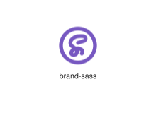
</div>
</div>

{{#endtab}}
{{#tab name="Code"}}

```xml
{{#include ../samples/icons/Tabler-Icons/brand-sass-8efee987.xal}}
```

{{#endtab}}
{{#endtabs}}

<div class="xal-ref-tag"><code>&lt;item id=&#34;100873&#34; /&gt;</code></div>

</div>
<div class="xal-ref-card">
<div class="xal-ref-title">brand-sentry</div>

{{#tabs name="svg-ref-0874"}}
{{#tab name="Preview"}}
<div class="xal-ref-preview">
<div>

</div>
</div>

{{#endtab}}
{{#tab name="Code"}}

```xml
{{#include ../samples/icons/Tabler-Icons/brand-sentry-1de1556e.xal}}
```

{{#endtab}}
{{#endtabs}}

<div class="xal-ref-tag"><code>&lt;item id=&#34;100874&#34; /&gt;</code></div>

</div>
<div class="xal-ref-card">
<div class="xal-ref-title">brand-sharik</div>

{{#tabs name="svg-ref-0875"}}
{{#tab name="Preview"}}
<div class="xal-ref-preview">
<div>

</div>
</div>

{{#endtab}}
{{#tab name="Code"}}

```xml
{{#include ../samples/icons/Tabler-Icons/brand-sharik-256fa315.xal}}
```

{{#endtab}}
{{#endtabs}}

<div class="xal-ref-tag"><code>&lt;item id=&#34;100875&#34; /&gt;</code></div>

</div>
<div class="xal-ref-card">
<div class="xal-ref-title">brand-shazam</div>

{{#tabs name="svg-ref-0876"}}
{{#tab name="Preview"}}
<div class="xal-ref-preview">
<div>

</div>
</div>

{{#endtab}}
{{#tab name="Code"}}

```xml
{{#include ../samples/icons/Tabler-Icons/brand-shazam-75939abf.xal}}
```

{{#endtab}}
{{#endtabs}}

<div class="xal-ref-tag"><code>&lt;item id=&#34;100876&#34; /&gt;</code></div>

</div>
<div class="xal-ref-card">
<div class="xal-ref-title">brand-shopee</div>

{{#tabs name="svg-ref-0877"}}
{{#tab name="Preview"}}
<div class="xal-ref-preview">
<div>

</div>
</div>

{{#endtab}}
{{#tab name="Code"}}

```xml
{{#include ../samples/icons/Tabler-Icons/brand-shopee-6f88de14.xal}}
```

{{#endtab}}
{{#endtabs}}

<div class="xal-ref-tag"><code>&lt;item id=&#34;100877&#34; /&gt;</code></div>

</div>
<div class="xal-ref-card">
<div class="xal-ref-title">brand-sketch</div>

{{#tabs name="svg-ref-0878"}}
{{#tab name="Preview"}}
<div class="xal-ref-preview">
<div>
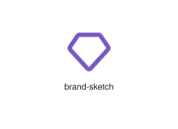
</div>
</div>

{{#endtab}}
{{#tab name="Code"}}

```xml
{{#include ../samples/icons/Tabler-Icons/brand-sketch-1d43fda6.xal}}
```

{{#endtab}}
{{#endtabs}}

<div class="xal-ref-tag"><code>&lt;item id=&#34;100878&#34; /&gt;</code></div>

</div>
<div class="xal-ref-card">
<div class="xal-ref-title">brand-skype</div>

{{#tabs name="svg-ref-0879"}}
{{#tab name="Preview"}}
<div class="xal-ref-preview">
<div>

</div>
</div>

{{#endtab}}
{{#tab name="Code"}}

```xml
{{#include ../samples/icons/Tabler-Icons/brand-skype-82f49de8.xal}}
```

{{#endtab}}
{{#endtabs}}

<div class="xal-ref-tag"><code>&lt;item id=&#34;100879&#34; /&gt;</code></div>

</div>
<div class="xal-ref-card">
<div class="xal-ref-title">brand-slack</div>

{{#tabs name="svg-ref-0880"}}
{{#tab name="Preview"}}
<div class="xal-ref-preview">
<div>
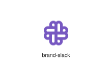
</div>
</div>

{{#endtab}}
{{#tab name="Code"}}

```xml
{{#include ../samples/icons/Tabler-Icons/brand-slack-e672880c.xal}}
```

{{#endtab}}
{{#endtabs}}

<div class="xal-ref-tag"><code>&lt;item id=&#34;100880&#34; /&gt;</code></div>

</div>
<div class="xal-ref-card">
<div class="xal-ref-title">brand-snapchat</div>

{{#tabs name="svg-ref-0881"}}
{{#tab name="Preview"}}
<div class="xal-ref-preview">
<div>

</div>
</div>

{{#endtab}}
{{#tab name="Code"}}

```xml
{{#include ../samples/icons/Tabler-Icons/brand-snapchat-acd3a585.xal}}
```

{{#endtab}}
{{#endtabs}}

<div class="xal-ref-tag"><code>&lt;item id=&#34;100881&#34; /&gt;</code></div>

</div>
<div class="xal-ref-card">
<div class="xal-ref-title">brand-snapseed</div>

{{#tabs name="svg-ref-0882"}}
{{#tab name="Preview"}}
<div class="xal-ref-preview">
<div>
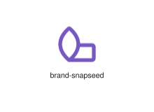
</div>
</div>

{{#endtab}}
{{#tab name="Code"}}

```xml
{{#include ../samples/icons/Tabler-Icons/brand-snapseed-4ace20fa.xal}}
```

{{#endtab}}
{{#endtabs}}

<div class="xal-ref-tag"><code>&lt;item id=&#34;100882&#34; /&gt;</code></div>

</div>
<div class="xal-ref-card">
<div class="xal-ref-title">brand-snowflake</div>

{{#tabs name="svg-ref-0883"}}
{{#tab name="Preview"}}
<div class="xal-ref-preview">
<div>

</div>
</div>

{{#endtab}}
{{#tab name="Code"}}

```xml
{{#include ../samples/icons/Tabler-Icons/brand-snowflake-530b2b24.xal}}
```

{{#endtab}}
{{#endtabs}}

<div class="xal-ref-tag"><code>&lt;item id=&#34;100883&#34; /&gt;</code></div>

</div>
<div class="xal-ref-card">
<div class="xal-ref-title">brand-socket-io</div>

{{#tabs name="svg-ref-0884"}}
{{#tab name="Preview"}}
<div class="xal-ref-preview">
<div>

</div>
</div>

{{#endtab}}
{{#tab name="Code"}}

```xml
{{#include ../samples/icons/Tabler-Icons/brand-socket-io-ed262416.xal}}
```

{{#endtab}}
{{#endtabs}}

<div class="xal-ref-tag"><code>&lt;item id=&#34;100884&#34; /&gt;</code></div>

</div>
<div class="xal-ref-card">
<div class="xal-ref-title">brand-solidjs</div>

{{#tabs name="svg-ref-0885"}}
{{#tab name="Preview"}}
<div class="xal-ref-preview">
<div>

</div>
</div>

{{#endtab}}
{{#tab name="Code"}}

```xml
{{#include ../samples/icons/Tabler-Icons/brand-solidjs-5813cef6.xal}}
```

{{#endtab}}
{{#endtabs}}

<div class="xal-ref-tag"><code>&lt;item id=&#34;100885&#34; /&gt;</code></div>

</div>
<div class="xal-ref-card">
<div class="xal-ref-title">brand-soundcloud</div>

{{#tabs name="svg-ref-0886"}}
{{#tab name="Preview"}}
<div class="xal-ref-preview">
<div>

</div>
</div>

{{#endtab}}
{{#tab name="Code"}}

```xml
{{#include ../samples/icons/Tabler-Icons/brand-soundcloud-1a608803.xal}}
```

{{#endtab}}
{{#endtabs}}

<div class="xal-ref-tag"><code>&lt;item id=&#34;100886&#34; /&gt;</code></div>

</div>
<div class="xal-ref-card">
<div class="xal-ref-title">brand-spacehey</div>

{{#tabs name="svg-ref-0887"}}
{{#tab name="Preview"}}
<div class="xal-ref-preview">
<div>

</div>
</div>

{{#endtab}}
{{#tab name="Code"}}

```xml
{{#include ../samples/icons/Tabler-Icons/brand-spacehey-6070bbdc.xal}}
```

{{#endtab}}
{{#endtabs}}

<div class="xal-ref-tag"><code>&lt;item id=&#34;100887&#34; /&gt;</code></div>

</div>
<div class="xal-ref-card">
<div class="xal-ref-title">brand-speedtest</div>

{{#tabs name="svg-ref-0888"}}
{{#tab name="Preview"}}
<div class="xal-ref-preview">
<div>

</div>
</div>

{{#endtab}}
{{#tab name="Code"}}

```xml
{{#include ../samples/icons/Tabler-Icons/brand-speedtest-b0340458.xal}}
```

{{#endtab}}
{{#endtabs}}

<div class="xal-ref-tag"><code>&lt;item id=&#34;100888&#34; /&gt;</code></div>

</div>
<div class="xal-ref-card">
<div class="xal-ref-title">brand-spotify</div>

{{#tabs name="svg-ref-0889"}}
{{#tab name="Preview"}}
<div class="xal-ref-preview">
<div>

</div>
</div>

{{#endtab}}
{{#tab name="Code"}}

```xml
{{#include ../samples/icons/Tabler-Icons/brand-spotify-0c20b5b6.xal}}
```

{{#endtab}}
{{#endtabs}}

<div class="xal-ref-tag"><code>&lt;item id=&#34;100889&#34; /&gt;</code></div>

</div>
<div class="xal-ref-card">
<div class="xal-ref-title">brand-stackoverflow</div>

{{#tabs name="svg-ref-0890"}}
{{#tab name="Preview"}}
<div class="xal-ref-preview">
<div>

</div>
</div>

{{#endtab}}
{{#tab name="Code"}}

```xml
{{#include ../samples/icons/Tabler-Icons/brand-stackoverflow-594a11ad.xal}}
```

{{#endtab}}
{{#endtabs}}

<div class="xal-ref-tag"><code>&lt;item id=&#34;100890&#34; /&gt;</code></div>

</div>
<div class="xal-ref-card">
<div class="xal-ref-title">brand-stackshare</div>

{{#tabs name="svg-ref-0891"}}
{{#tab name="Preview"}}
<div class="xal-ref-preview">
<div>

</div>
</div>

{{#endtab}}
{{#tab name="Code"}}

```xml
{{#include ../samples/icons/Tabler-Icons/brand-stackshare-24ff7fad.xal}}
```

{{#endtab}}
{{#endtabs}}

<div class="xal-ref-tag"><code>&lt;item id=&#34;100891&#34; /&gt;</code></div>

</div>
<div class="xal-ref-card">
<div class="xal-ref-title">brand-steam</div>

{{#tabs name="svg-ref-0892"}}
{{#tab name="Preview"}}
<div class="xal-ref-preview">
<div>

</div>
</div>

{{#endtab}}
{{#tab name="Code"}}

```xml
{{#include ../samples/icons/Tabler-Icons/brand-steam-7febd22a.xal}}
```

{{#endtab}}
{{#endtabs}}

<div class="xal-ref-tag"><code>&lt;item id=&#34;100892&#34; /&gt;</code></div>

</div>
<div class="xal-ref-card">
<div class="xal-ref-title">brand-stocktwits</div>

{{#tabs name="svg-ref-0893"}}
{{#tab name="Preview"}}
<div class="xal-ref-preview">
<div>

</div>
</div>

{{#endtab}}
{{#tab name="Code"}}

```xml
{{#include ../samples/icons/Tabler-Icons/brand-stocktwits-06222da5.xal}}
```

{{#endtab}}
{{#endtabs}}

<div class="xal-ref-tag"><code>&lt;item id=&#34;100893&#34; /&gt;</code></div>

</div>
<div class="xal-ref-card">
<div class="xal-ref-title">brand-storj</div>

{{#tabs name="svg-ref-0894"}}
{{#tab name="Preview"}}
<div class="xal-ref-preview">
<div>
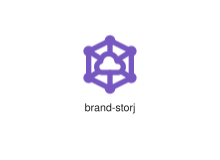
</div>
</div>

{{#endtab}}
{{#tab name="Code"}}

```xml
{{#include ../samples/icons/Tabler-Icons/brand-storj-ecf92141.xal}}
```

{{#endtab}}
{{#endtabs}}

<div class="xal-ref-tag"><code>&lt;item id=&#34;100894&#34; /&gt;</code></div>

</div>
<div class="xal-ref-card">
<div class="xal-ref-title">brand-storybook</div>

{{#tabs name="svg-ref-0895"}}
{{#tab name="Preview"}}
<div class="xal-ref-preview">
<div>

</div>
</div>

{{#endtab}}
{{#tab name="Code"}}

```xml
{{#include ../samples/icons/Tabler-Icons/brand-storybook-4160fd45.xal}}
```

{{#endtab}}
{{#endtabs}}

<div class="xal-ref-tag"><code>&lt;item id=&#34;100895&#34; /&gt;</code></div>

</div>
<div class="xal-ref-card">
<div class="xal-ref-title">brand-storytel</div>

{{#tabs name="svg-ref-0896"}}
{{#tab name="Preview"}}
<div class="xal-ref-preview">
<div>

</div>
</div>

{{#endtab}}
{{#tab name="Code"}}

```xml
{{#include ../samples/icons/Tabler-Icons/brand-storytel-56b164f3.xal}}
```

{{#endtab}}
{{#endtabs}}

<div class="xal-ref-tag"><code>&lt;item id=&#34;100896&#34; /&gt;</code></div>

</div>
<div class="xal-ref-card">
<div class="xal-ref-title">brand-strava</div>

{{#tabs name="svg-ref-0897"}}
{{#tab name="Preview"}}
<div class="xal-ref-preview">
<div>
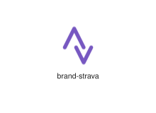
</div>
</div>

{{#endtab}}
{{#tab name="Code"}}

```xml
{{#include ../samples/icons/Tabler-Icons/brand-strava-73a90a04.xal}}
```

{{#endtab}}
{{#endtabs}}

<div class="xal-ref-tag"><code>&lt;item id=&#34;100897&#34; /&gt;</code></div>

</div>
<div class="xal-ref-card">
<div class="xal-ref-title">brand-stripe</div>

{{#tabs name="svg-ref-0898"}}
{{#tab name="Preview"}}
<div class="xal-ref-preview">
<div>

</div>
</div>

{{#endtab}}
{{#tab name="Code"}}

```xml
{{#include ../samples/icons/Tabler-Icons/brand-stripe-639f01be.xal}}
```

{{#endtab}}
{{#endtabs}}

<div class="xal-ref-tag"><code>&lt;item id=&#34;100898&#34; /&gt;</code></div>

</div>
<div class="xal-ref-card">
<div class="xal-ref-title">brand-sublime-text</div>

{{#tabs name="svg-ref-0899"}}
{{#tab name="Preview"}}
<div class="xal-ref-preview">
<div>
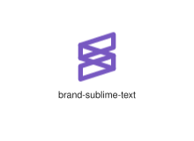
</div>
</div>

{{#endtab}}
{{#tab name="Code"}}

```xml
{{#include ../samples/icons/Tabler-Icons/brand-sublime-text-b47e81e9.xal}}
```

{{#endtab}}
{{#endtabs}}

<div class="xal-ref-tag"><code>&lt;item id=&#34;100899&#34; /&gt;</code></div>

</div>
</div>
