# Tabler-Icons - Page 12

This page references SVG files under `etc/resources/aws/svg/Tabler-Icons`.
Each card shows the SVG preview first and the XAL tag syntax in the Code tab.
Showing 991-1080 of 4964 SVG files.

<style>
.xal-ref-grid{display:grid;grid-template-columns:repeat(3,minmax(0,1fr));gap:1rem;margin:1rem 0 1.5rem}.xal-ref-card{border:1px solid var(--table-border-color);border-radius:8px;overflow:hidden;background:var(--bg);padding:.75rem}.xal-ref-title{font-size:.9rem;font-weight:600;line-height:1.25;margin:0 0 .5rem;overflow-wrap:anywhere}.xal-ref-preview{display:flex;align-items:center;justify-content:center}.xal-ref-preview img{display:block;width:100%;height:auto}.xal-ref-card pre{margin:0;max-height:18rem;overflow:auto;white-space:pre}.xal-ref-card code{font-size:.78em}.xal-ref-tag{margin:.5rem 0 0;color:var(--fg);opacity:.72;overflow:auto;white-space:pre}.xal-ref-tag code{font-size:.72em}@media(max-width:900px){.xal-ref-grid{grid-template-columns:repeat(2,minmax(0,1fr))}}@media(max-width:560px){.xal-ref-grid{grid-template-columns:1fr}}
</style>

[Back to section index](tabler-icons.md)

<div class="xal-ref-grid">
<div class="xal-ref-card">
<div class="xal-ref-title">brightness-down</div>

{{#tabs name="svg-ref-0990"}}
{{#tab name="Preview"}}
<div class="xal-ref-preview">
<div>
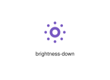
</div>
</div>

{{#endtab}}
{{#tab name="Code"}}

```xml
{{#include ../samples/icons/Tabler-Icons/brightness-down-57af6d42.xal}}
```

{{#endtab}}
{{#endtabs}}

<div class="xal-ref-tag"><code>&lt;item id=&#34;100991&#34; /&gt;</code></div>

</div>
<div class="xal-ref-card">
<div class="xal-ref-title">brightness-half</div>

{{#tabs name="svg-ref-0991"}}
{{#tab name="Preview"}}
<div class="xal-ref-preview">
<div>
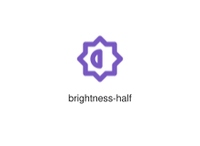
</div>
</div>

{{#endtab}}
{{#tab name="Code"}}

```xml
{{#include ../samples/icons/Tabler-Icons/brightness-half-095ebac9.xal}}
```

{{#endtab}}
{{#endtabs}}

<div class="xal-ref-tag"><code>&lt;item id=&#34;100992&#34; /&gt;</code></div>

</div>
<div class="xal-ref-card">
<div class="xal-ref-title">brightness-off</div>

{{#tabs name="svg-ref-0992"}}
{{#tab name="Preview"}}
<div class="xal-ref-preview">
<div>
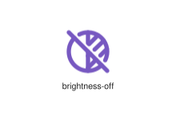
</div>
</div>

{{#endtab}}
{{#tab name="Code"}}

```xml
{{#include ../samples/icons/Tabler-Icons/brightness-off-588d9d5c.xal}}
```

{{#endtab}}
{{#endtabs}}

<div class="xal-ref-tag"><code>&lt;item id=&#34;100993&#34; /&gt;</code></div>

</div>
<div class="xal-ref-card">
<div class="xal-ref-title">brightness-up</div>

{{#tabs name="svg-ref-0993"}}
{{#tab name="Preview"}}
<div class="xal-ref-preview">
<div>
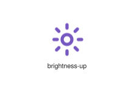
</div>
</div>

{{#endtab}}
{{#tab name="Code"}}

```xml
{{#include ../samples/icons/Tabler-Icons/brightness-up-8a556725.xal}}
```

{{#endtab}}
{{#endtabs}}

<div class="xal-ref-tag"><code>&lt;item id=&#34;100994&#34; /&gt;</code></div>

</div>
<div class="xal-ref-card">
<div class="xal-ref-title">brightness</div>

{{#tabs name="svg-ref-0994"}}
{{#tab name="Preview"}}
<div class="xal-ref-preview">
<div>
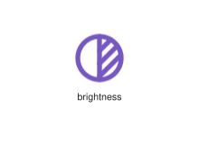
</div>
</div>

{{#endtab}}
{{#tab name="Code"}}

```xml
{{#include ../samples/icons/Tabler-Icons/brightness-2483b6b6.xal}}
```

{{#endtab}}
{{#endtabs}}

<div class="xal-ref-tag"><code>&lt;item id=&#34;100988&#34; /&gt;</code></div>

</div>
<div class="xal-ref-card">
<div class="xal-ref-title">broadcast-off</div>

{{#tabs name="svg-ref-0995"}}
{{#tab name="Preview"}}
<div class="xal-ref-preview">
<div>

</div>
</div>

{{#endtab}}
{{#tab name="Code"}}

```xml
{{#include ../samples/icons/Tabler-Icons/broadcast-off-96a4bafa.xal}}
```

{{#endtab}}
{{#endtabs}}

<div class="xal-ref-tag"><code>&lt;item id=&#34;100996&#34; /&gt;</code></div>

</div>
<div class="xal-ref-card">
<div class="xal-ref-title">broadcast</div>

{{#tabs name="svg-ref-0996"}}
{{#tab name="Preview"}}
<div class="xal-ref-preview">
<div>

</div>
</div>

{{#endtab}}
{{#tab name="Code"}}

```xml
{{#include ../samples/icons/Tabler-Icons/broadcast-96bde2c4.xal}}
```

{{#endtab}}
{{#endtabs}}

<div class="xal-ref-tag"><code>&lt;item id=&#34;100995&#34; /&gt;</code></div>

</div>
<div class="xal-ref-card">
<div class="xal-ref-title">browser-check</div>

{{#tabs name="svg-ref-0997"}}
{{#tab name="Preview"}}
<div class="xal-ref-preview">
<div>

</div>
</div>

{{#endtab}}
{{#tab name="Code"}}

```xml
{{#include ../samples/icons/Tabler-Icons/browser-check-1ba5350e.xal}}
```

{{#endtab}}
{{#endtabs}}

<div class="xal-ref-tag"><code>&lt;item id=&#34;100998&#34; /&gt;</code></div>

</div>
<div class="xal-ref-card">
<div class="xal-ref-title">browser-maximize</div>

{{#tabs name="svg-ref-0998"}}
{{#tab name="Preview"}}
<div class="xal-ref-preview">
<div>

</div>
</div>

{{#endtab}}
{{#tab name="Code"}}

```xml
{{#include ../samples/icons/Tabler-Icons/browser-maximize-79c41950.xal}}
```

{{#endtab}}
{{#endtabs}}

<div class="xal-ref-tag"><code>&lt;item id=&#34;100999&#34; /&gt;</code></div>

</div>
<div class="xal-ref-card">
<div class="xal-ref-title">browser-minus</div>

{{#tabs name="svg-ref-0999"}}
{{#tab name="Preview"}}
<div class="xal-ref-preview">
<div>

</div>
</div>

{{#endtab}}
{{#tab name="Code"}}

```xml
{{#include ../samples/icons/Tabler-Icons/browser-minus-98d5873d.xal}}
```

{{#endtab}}
{{#endtabs}}

<div class="xal-ref-tag"><code>&lt;item id=&#34;101000&#34; /&gt;</code></div>

</div>
<div class="xal-ref-card">
<div class="xal-ref-title">browser-off</div>

{{#tabs name="svg-ref-1000"}}
{{#tab name="Preview"}}
<div class="xal-ref-preview">
<div>

</div>
</div>

{{#endtab}}
{{#tab name="Code"}}

```xml
{{#include ../samples/icons/Tabler-Icons/browser-off-8dab3da2.xal}}
```

{{#endtab}}
{{#endtabs}}

<div class="xal-ref-tag"><code>&lt;item id=&#34;101001&#34; /&gt;</code></div>

</div>
<div class="xal-ref-card">
<div class="xal-ref-title">browser-plus</div>

{{#tabs name="svg-ref-1001"}}
{{#tab name="Preview"}}
<div class="xal-ref-preview">
<div>

</div>
</div>

{{#endtab}}
{{#tab name="Code"}}

```xml
{{#include ../samples/icons/Tabler-Icons/browser-plus-11de438d.xal}}
```

{{#endtab}}
{{#endtabs}}

<div class="xal-ref-tag"><code>&lt;item id=&#34;101002&#34; /&gt;</code></div>

</div>
<div class="xal-ref-card">
<div class="xal-ref-title">browser-share</div>

{{#tabs name="svg-ref-1002"}}
{{#tab name="Preview"}}
<div class="xal-ref-preview">
<div>

</div>
</div>

{{#endtab}}
{{#tab name="Code"}}

```xml
{{#include ../samples/icons/Tabler-Icons/browser-share-34903c33.xal}}
```

{{#endtab}}
{{#endtabs}}

<div class="xal-ref-tag"><code>&lt;item id=&#34;101003&#34; /&gt;</code></div>

</div>
<div class="xal-ref-card">
<div class="xal-ref-title">browser-x</div>

{{#tabs name="svg-ref-1003"}}
{{#tab name="Preview"}}
<div class="xal-ref-preview">
<div>
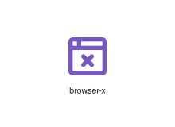
</div>
</div>

{{#endtab}}
{{#tab name="Code"}}

```xml
{{#include ../samples/icons/Tabler-Icons/browser-x-17813781.xal}}
```

{{#endtab}}
{{#endtabs}}

<div class="xal-ref-tag"><code>&lt;item id=&#34;101004&#34; /&gt;</code></div>

</div>
<div class="xal-ref-card">
<div class="xal-ref-title">browser</div>

{{#tabs name="svg-ref-1004"}}
{{#tab name="Preview"}}
<div class="xal-ref-preview">
<div>
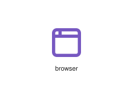
</div>
</div>

{{#endtab}}
{{#tab name="Code"}}

```xml
{{#include ../samples/icons/Tabler-Icons/browser-99332e9d.xal}}
```

{{#endtab}}
{{#endtabs}}

<div class="xal-ref-tag"><code>&lt;item id=&#34;100997&#34; /&gt;</code></div>

</div>
<div class="xal-ref-card">
<div class="xal-ref-title">brush-off</div>

{{#tabs name="svg-ref-1005"}}
{{#tab name="Preview"}}
<div class="xal-ref-preview">
<div>
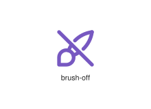
</div>
</div>

{{#endtab}}
{{#tab name="Code"}}

```xml
{{#include ../samples/icons/Tabler-Icons/brush-off-3a982002.xal}}
```

{{#endtab}}
{{#endtabs}}

<div class="xal-ref-tag"><code>&lt;item id=&#34;101006&#34; /&gt;</code></div>

</div>
<div class="xal-ref-card">
<div class="xal-ref-title">brush</div>

{{#tabs name="svg-ref-1006"}}
{{#tab name="Preview"}}
<div class="xal-ref-preview">
<div>
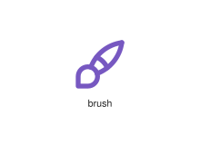
</div>
</div>

{{#endtab}}
{{#tab name="Code"}}

```xml
{{#include ../samples/icons/Tabler-Icons/brush-c5f55957.xal}}
```

{{#endtab}}
{{#endtabs}}

<div class="xal-ref-tag"><code>&lt;item id=&#34;101005&#34; /&gt;</code></div>

</div>
<div class="xal-ref-card">
<div class="xal-ref-title">bubble-minus</div>

{{#tabs name="svg-ref-1007"}}
{{#tab name="Preview"}}
<div class="xal-ref-preview">
<div>

</div>
</div>

{{#endtab}}
{{#tab name="Code"}}

```xml
{{#include ../samples/icons/Tabler-Icons/bubble-minus-8867be63.xal}}
```

{{#endtab}}
{{#endtabs}}

<div class="xal-ref-tag"><code>&lt;item id=&#34;101008&#34; /&gt;</code></div>

</div>
<div class="xal-ref-card">
<div class="xal-ref-title">bubble-plus</div>

{{#tabs name="svg-ref-1008"}}
{{#tab name="Preview"}}
<div class="xal-ref-preview">
<div>

</div>
</div>

{{#endtab}}
{{#tab name="Code"}}

```xml
{{#include ../samples/icons/Tabler-Icons/bubble-plus-799d4717.xal}}
```

{{#endtab}}
{{#endtabs}}

<div class="xal-ref-tag"><code>&lt;item id=&#34;101009&#34; /&gt;</code></div>

</div>
<div class="xal-ref-card">
<div class="xal-ref-title">bubble-tea-2</div>

{{#tabs name="svg-ref-1009"}}
{{#tab name="Preview"}}
<div class="xal-ref-preview">
<div>
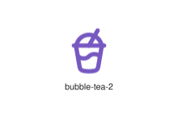
</div>
</div>

{{#endtab}}
{{#tab name="Code"}}

```xml
{{#include ../samples/icons/Tabler-Icons/bubble-tea-2-acadd48c.xal}}
```

{{#endtab}}
{{#endtabs}}

<div class="xal-ref-tag"><code>&lt;item id=&#34;101011&#34; /&gt;</code></div>

</div>
<div class="xal-ref-card">
<div class="xal-ref-title">bubble-tea</div>

{{#tabs name="svg-ref-1010"}}
{{#tab name="Preview"}}
<div class="xal-ref-preview">
<div>
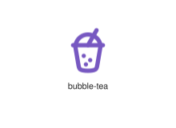
</div>
</div>

{{#endtab}}
{{#tab name="Code"}}

```xml
{{#include ../samples/icons/Tabler-Icons/bubble-tea-427139fa.xal}}
```

{{#endtab}}
{{#endtabs}}

<div class="xal-ref-tag"><code>&lt;item id=&#34;101010&#34; /&gt;</code></div>

</div>
<div class="xal-ref-card">
<div class="xal-ref-title">bubble-text</div>

{{#tabs name="svg-ref-1011"}}
{{#tab name="Preview"}}
<div class="xal-ref-preview">
<div>

</div>
</div>

{{#endtab}}
{{#tab name="Code"}}

```xml
{{#include ../samples/icons/Tabler-Icons/bubble-text-66f1c3f0.xal}}
```

{{#endtab}}
{{#endtabs}}

<div class="xal-ref-tag"><code>&lt;item id=&#34;101012&#34; /&gt;</code></div>

</div>
<div class="xal-ref-card">
<div class="xal-ref-title">bubble-x</div>

{{#tabs name="svg-ref-1012"}}
{{#tab name="Preview"}}
<div class="xal-ref-preview">
<div>

</div>
</div>

{{#endtab}}
{{#tab name="Code"}}

```xml
{{#include ../samples/icons/Tabler-Icons/bubble-x-3604cbe6.xal}}
```

{{#endtab}}
{{#endtabs}}

<div class="xal-ref-tag"><code>&lt;item id=&#34;101013&#34; /&gt;</code></div>

</div>
<div class="xal-ref-card">
<div class="xal-ref-title">bubble</div>

{{#tabs name="svg-ref-1013"}}
{{#tab name="Preview"}}
<div class="xal-ref-preview">
<div>

</div>
</div>

{{#endtab}}
{{#tab name="Code"}}

```xml
{{#include ../samples/icons/Tabler-Icons/bubble-ff6ff533.xal}}
```

{{#endtab}}
{{#endtabs}}

<div class="xal-ref-tag"><code>&lt;item id=&#34;101007&#34; /&gt;</code></div>

</div>
<div class="xal-ref-card">
<div class="xal-ref-title">bucket-droplet</div>

{{#tabs name="svg-ref-1014"}}
{{#tab name="Preview"}}
<div class="xal-ref-preview">
<div>

</div>
</div>

{{#endtab}}
{{#tab name="Code"}}

```xml
{{#include ../samples/icons/Tabler-Icons/bucket-droplet-3e99a8d9.xal}}
```

{{#endtab}}
{{#endtabs}}

<div class="xal-ref-tag"><code>&lt;item id=&#34;101015&#34; /&gt;</code></div>

</div>
<div class="xal-ref-card">
<div class="xal-ref-title">bucket-off</div>

{{#tabs name="svg-ref-1015"}}
{{#tab name="Preview"}}
<div class="xal-ref-preview">
<div>

</div>
</div>

{{#endtab}}
{{#tab name="Code"}}

```xml
{{#include ../samples/icons/Tabler-Icons/bucket-off-b45a5062.xal}}
```

{{#endtab}}
{{#endtabs}}

<div class="xal-ref-tag"><code>&lt;item id=&#34;101016&#34; /&gt;</code></div>

</div>
<div class="xal-ref-card">
<div class="xal-ref-title">bucket</div>

{{#tabs name="svg-ref-1016"}}
{{#tab name="Preview"}}
<div class="xal-ref-preview">
<div>
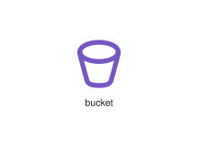
</div>
</div>

{{#endtab}}
{{#tab name="Code"}}

```xml
{{#include ../samples/icons/Tabler-Icons/bucket-dcd25f84.xal}}
```

{{#endtab}}
{{#endtabs}}

<div class="xal-ref-tag"><code>&lt;item id=&#34;101014&#34; /&gt;</code></div>

</div>
<div class="xal-ref-card">
<div class="xal-ref-title">bug-off</div>

{{#tabs name="svg-ref-1017"}}
{{#tab name="Preview"}}
<div class="xal-ref-preview">
<div>
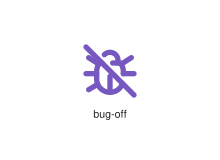
</div>
</div>

{{#endtab}}
{{#tab name="Code"}}

```xml
{{#include ../samples/icons/Tabler-Icons/bug-off-b75bcda4.xal}}
```

{{#endtab}}
{{#endtabs}}

<div class="xal-ref-tag"><code>&lt;item id=&#34;101018&#34; /&gt;</code></div>

</div>
<div class="xal-ref-card">
<div class="xal-ref-title">bug</div>

{{#tabs name="svg-ref-1018"}}
{{#tab name="Preview"}}
<div class="xal-ref-preview">
<div>
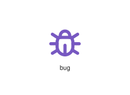
</div>
</div>

{{#endtab}}
{{#tab name="Code"}}

```xml
{{#include ../samples/icons/Tabler-Icons/bug-9e71832f.xal}}
```

{{#endtab}}
{{#endtabs}}

<div class="xal-ref-tag"><code>&lt;item id=&#34;101017&#34; /&gt;</code></div>

</div>
<div class="xal-ref-card">
<div class="xal-ref-title">building-airport</div>

{{#tabs name="svg-ref-1019"}}
{{#tab name="Preview"}}
<div class="xal-ref-preview">
<div>

</div>
</div>

{{#endtab}}
{{#tab name="Code"}}

```xml
{{#include ../samples/icons/Tabler-Icons/building-airport-e9c43a2f.xal}}
```

{{#endtab}}
{{#endtabs}}

<div class="xal-ref-tag"><code>&lt;item id=&#34;101020&#34; /&gt;</code></div>

</div>
<div class="xal-ref-card">
<div class="xal-ref-title">building-arch</div>

{{#tabs name="svg-ref-1020"}}
{{#tab name="Preview"}}
<div class="xal-ref-preview">
<div>
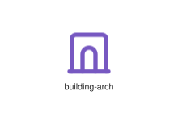
</div>
</div>

{{#endtab}}
{{#tab name="Code"}}

```xml
{{#include ../samples/icons/Tabler-Icons/building-arch-e0e02940.xal}}
```

{{#endtab}}
{{#endtabs}}

<div class="xal-ref-tag"><code>&lt;item id=&#34;101021&#34; /&gt;</code></div>

</div>
<div class="xal-ref-card">
<div class="xal-ref-title">building-bank</div>

{{#tabs name="svg-ref-1021"}}
{{#tab name="Preview"}}
<div class="xal-ref-preview">
<div>

</div>
</div>

{{#endtab}}
{{#tab name="Code"}}

```xml
{{#include ../samples/icons/Tabler-Icons/building-bank-c367c1fe.xal}}
```

{{#endtab}}
{{#endtabs}}

<div class="xal-ref-tag"><code>&lt;item id=&#34;101022&#34; /&gt;</code></div>

</div>
<div class="xal-ref-card">
<div class="xal-ref-title">building-bridge-2</div>

{{#tabs name="svg-ref-1022"}}
{{#tab name="Preview"}}
<div class="xal-ref-preview">
<div>
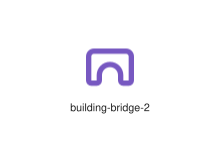
</div>
</div>

{{#endtab}}
{{#tab name="Code"}}

```xml
{{#include ../samples/icons/Tabler-Icons/building-bridge-2-edbfb6c5.xal}}
```

{{#endtab}}
{{#endtabs}}

<div class="xal-ref-tag"><code>&lt;item id=&#34;101024&#34; /&gt;</code></div>

</div>
<div class="xal-ref-card">
<div class="xal-ref-title">building-bridge</div>

{{#tabs name="svg-ref-1023"}}
{{#tab name="Preview"}}
<div class="xal-ref-preview">
<div>
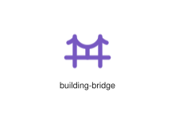
</div>
</div>

{{#endtab}}
{{#tab name="Code"}}

```xml
{{#include ../samples/icons/Tabler-Icons/building-bridge-3697d725.xal}}
```

{{#endtab}}
{{#endtabs}}

<div class="xal-ref-tag"><code>&lt;item id=&#34;101023&#34; /&gt;</code></div>

</div>
<div class="xal-ref-card">
<div class="xal-ref-title">building-broadcast-tower</div>

{{#tabs name="svg-ref-1024"}}
{{#tab name="Preview"}}
<div class="xal-ref-preview">
<div>
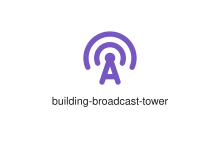
</div>
</div>

{{#endtab}}
{{#tab name="Code"}}

```xml
{{#include ../samples/icons/Tabler-Icons/building-broadcast-tower-4fa9e600.xal}}
```

{{#endtab}}
{{#endtabs}}

<div class="xal-ref-tag"><code>&lt;item id=&#34;101025&#34; /&gt;</code></div>

</div>
<div class="xal-ref-card">
<div class="xal-ref-title">building-burj-al-arab</div>

{{#tabs name="svg-ref-1025"}}
{{#tab name="Preview"}}
<div class="xal-ref-preview">
<div>
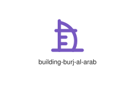
</div>
</div>

{{#endtab}}
{{#tab name="Code"}}

```xml
{{#include ../samples/icons/Tabler-Icons/building-burj-al-arab-0013e417.xal}}
```

{{#endtab}}
{{#endtabs}}

<div class="xal-ref-tag"><code>&lt;item id=&#34;101026&#34; /&gt;</code></div>

</div>
<div class="xal-ref-card">
<div class="xal-ref-title">building-carousel</div>

{{#tabs name="svg-ref-1026"}}
{{#tab name="Preview"}}
<div class="xal-ref-preview">
<div>
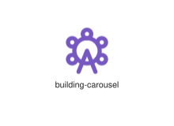
</div>
</div>

{{#endtab}}
{{#tab name="Code"}}

```xml
{{#include ../samples/icons/Tabler-Icons/building-carousel-42addaab.xal}}
```

{{#endtab}}
{{#endtabs}}

<div class="xal-ref-tag"><code>&lt;item id=&#34;101027&#34; /&gt;</code></div>

</div>
<div class="xal-ref-card">
<div class="xal-ref-title">building-castle</div>

{{#tabs name="svg-ref-1027"}}
{{#tab name="Preview"}}
<div class="xal-ref-preview">
<div>
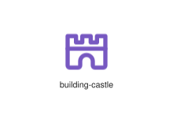
</div>
</div>

{{#endtab}}
{{#tab name="Code"}}

```xml
{{#include ../samples/icons/Tabler-Icons/building-castle-ac7a8341.xal}}
```

{{#endtab}}
{{#endtabs}}

<div class="xal-ref-tag"><code>&lt;item id=&#34;101028&#34; /&gt;</code></div>

</div>
<div class="xal-ref-card">
<div class="xal-ref-title">building-church</div>

{{#tabs name="svg-ref-1028"}}
{{#tab name="Preview"}}
<div class="xal-ref-preview">
<div>

</div>
</div>

{{#endtab}}
{{#tab name="Code"}}

```xml
{{#include ../samples/icons/Tabler-Icons/building-church-aca07fc3.xal}}
```

{{#endtab}}
{{#endtabs}}

<div class="xal-ref-tag"><code>&lt;item id=&#34;101029&#34; /&gt;</code></div>

</div>
<div class="xal-ref-card">
<div class="xal-ref-title">building-circus</div>

{{#tabs name="svg-ref-1029"}}
{{#tab name="Preview"}}
<div class="xal-ref-preview">
<div>
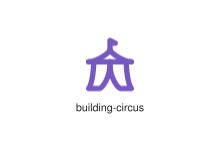
</div>
</div>

{{#endtab}}
{{#tab name="Code"}}

```xml
{{#include ../samples/icons/Tabler-Icons/building-circus-b208b2f6.xal}}
```

{{#endtab}}
{{#endtabs}}

<div class="xal-ref-tag"><code>&lt;item id=&#34;101030&#34; /&gt;</code></div>

</div>
<div class="xal-ref-card">
<div class="xal-ref-title">building-cog</div>

{{#tabs name="svg-ref-1030"}}
{{#tab name="Preview"}}
<div class="xal-ref-preview">
<div>
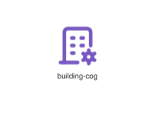
</div>
</div>

{{#endtab}}
{{#tab name="Code"}}

```xml
{{#include ../samples/icons/Tabler-Icons/building-cog-2a21e652.xal}}
```

{{#endtab}}
{{#endtabs}}

<div class="xal-ref-tag"><code>&lt;item id=&#34;101031&#34; /&gt;</code></div>

</div>
<div class="xal-ref-card">
<div class="xal-ref-title">building-community</div>

{{#tabs name="svg-ref-1031"}}
{{#tab name="Preview"}}
<div class="xal-ref-preview">
<div>
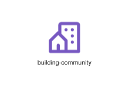
</div>
</div>

{{#endtab}}
{{#tab name="Code"}}

```xml
{{#include ../samples/icons/Tabler-Icons/building-community-b98514c5.xal}}
```

{{#endtab}}
{{#endtabs}}

<div class="xal-ref-tag"><code>&lt;item id=&#34;101032&#34; /&gt;</code></div>

</div>
<div class="xal-ref-card">
<div class="xal-ref-title">building-cottage</div>

{{#tabs name="svg-ref-1032"}}
{{#tab name="Preview"}}
<div class="xal-ref-preview">
<div>

</div>
</div>

{{#endtab}}
{{#tab name="Code"}}

```xml
{{#include ../samples/icons/Tabler-Icons/building-cottage-1542d29e.xal}}
```

{{#endtab}}
{{#endtabs}}

<div class="xal-ref-tag"><code>&lt;item id=&#34;101033&#34; /&gt;</code></div>

</div>
<div class="xal-ref-card">
<div class="xal-ref-title">building-estate</div>

{{#tabs name="svg-ref-1033"}}
{{#tab name="Preview"}}
<div class="xal-ref-preview">
<div>
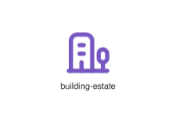
</div>
</div>

{{#endtab}}
{{#tab name="Code"}}

```xml
{{#include ../samples/icons/Tabler-Icons/building-estate-f3f4a377.xal}}
```

{{#endtab}}
{{#endtabs}}

<div class="xal-ref-tag"><code>&lt;item id=&#34;101034&#34; /&gt;</code></div>

</div>
<div class="xal-ref-card">
<div class="xal-ref-title">building-factory-2</div>

{{#tabs name="svg-ref-1034"}}
{{#tab name="Preview"}}
<div class="xal-ref-preview">
<div>
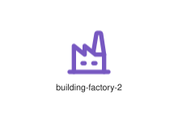
</div>
</div>

{{#endtab}}
{{#tab name="Code"}}

```xml
{{#include ../samples/icons/Tabler-Icons/building-factory-2-b5d0b5ce.xal}}
```

{{#endtab}}
{{#endtabs}}

<div class="xal-ref-tag"><code>&lt;item id=&#34;101036&#34; /&gt;</code></div>

</div>
<div class="xal-ref-card">
<div class="xal-ref-title">building-factory</div>

{{#tabs name="svg-ref-1035"}}
{{#tab name="Preview"}}
<div class="xal-ref-preview">
<div>
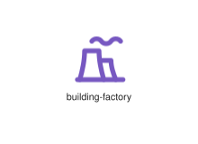
</div>
</div>

{{#endtab}}
{{#tab name="Code"}}

```xml
{{#include ../samples/icons/Tabler-Icons/building-factory-1449f321.xal}}
```

{{#endtab}}
{{#endtabs}}

<div class="xal-ref-tag"><code>&lt;item id=&#34;101035&#34; /&gt;</code></div>

</div>
<div class="xal-ref-card">
<div class="xal-ref-title">building-fortress</div>

{{#tabs name="svg-ref-1036"}}
{{#tab name="Preview"}}
<div class="xal-ref-preview">
<div>
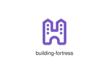
</div>
</div>

{{#endtab}}
{{#tab name="Code"}}

```xml
{{#include ../samples/icons/Tabler-Icons/building-fortress-9f191b29.xal}}
```

{{#endtab}}
{{#endtabs}}

<div class="xal-ref-tag"><code>&lt;item id=&#34;101037&#34; /&gt;</code></div>

</div>
<div class="xal-ref-card">
<div class="xal-ref-title">building-hospital</div>

{{#tabs name="svg-ref-1037"}}
{{#tab name="Preview"}}
<div class="xal-ref-preview">
<div>

</div>
</div>

{{#endtab}}
{{#tab name="Code"}}

```xml
{{#include ../samples/icons/Tabler-Icons/building-hospital-88d0ebc1.xal}}
```

{{#endtab}}
{{#endtabs}}

<div class="xal-ref-tag"><code>&lt;item id=&#34;101038&#34; /&gt;</code></div>

</div>
<div class="xal-ref-card">
<div class="xal-ref-title">building-lighthouse</div>

{{#tabs name="svg-ref-1038"}}
{{#tab name="Preview"}}
<div class="xal-ref-preview">
<div>
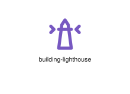
</div>
</div>

{{#endtab}}
{{#tab name="Code"}}

```xml
{{#include ../samples/icons/Tabler-Icons/building-lighthouse-997feb68.xal}}
```

{{#endtab}}
{{#endtabs}}

<div class="xal-ref-tag"><code>&lt;item id=&#34;101039&#34; /&gt;</code></div>

</div>
<div class="xal-ref-card">
<div class="xal-ref-title">building-minus</div>

{{#tabs name="svg-ref-1039"}}
{{#tab name="Preview"}}
<div class="xal-ref-preview">
<div>
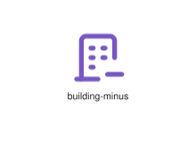
</div>
</div>

{{#endtab}}
{{#tab name="Code"}}

```xml
{{#include ../samples/icons/Tabler-Icons/building-minus-c26429dd.xal}}
```

{{#endtab}}
{{#endtabs}}

<div class="xal-ref-tag"><code>&lt;item id=&#34;101040&#34; /&gt;</code></div>

</div>
<div class="xal-ref-card">
<div class="xal-ref-title">building-monument</div>

{{#tabs name="svg-ref-1040"}}
{{#tab name="Preview"}}
<div class="xal-ref-preview">
<div>
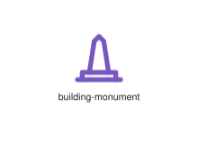
</div>
</div>

{{#endtab}}
{{#tab name="Code"}}

```xml
{{#include ../samples/icons/Tabler-Icons/building-monument-6c9124d0.xal}}
```

{{#endtab}}
{{#endtabs}}

<div class="xal-ref-tag"><code>&lt;item id=&#34;101041&#34; /&gt;</code></div>

</div>
<div class="xal-ref-card">
<div class="xal-ref-title">building-mosque</div>

{{#tabs name="svg-ref-1041"}}
{{#tab name="Preview"}}
<div class="xal-ref-preview">
<div>

</div>
</div>

{{#endtab}}
{{#tab name="Code"}}

```xml
{{#include ../samples/icons/Tabler-Icons/building-mosque-0c901494.xal}}
```

{{#endtab}}
{{#endtabs}}

<div class="xal-ref-tag"><code>&lt;item id=&#34;101042&#34; /&gt;</code></div>

</div>
<div class="xal-ref-card">
<div class="xal-ref-title">building-off</div>

{{#tabs name="svg-ref-1042"}}
{{#tab name="Preview"}}
<div class="xal-ref-preview">
<div>
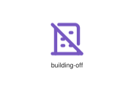
</div>
</div>

{{#endtab}}
{{#tab name="Code"}}

```xml
{{#include ../samples/icons/Tabler-Icons/building-off-f7eef45e.xal}}
```

{{#endtab}}
{{#endtabs}}

<div class="xal-ref-tag"><code>&lt;item id=&#34;101043&#34; /&gt;</code></div>

</div>
<div class="xal-ref-card">
<div class="xal-ref-title">building-pavilion</div>

{{#tabs name="svg-ref-1043"}}
{{#tab name="Preview"}}
<div class="xal-ref-preview">
<div>

</div>
</div>

{{#endtab}}
{{#tab name="Code"}}

```xml
{{#include ../samples/icons/Tabler-Icons/building-pavilion-38dba5d1.xal}}
```

{{#endtab}}
{{#endtabs}}

<div class="xal-ref-tag"><code>&lt;item id=&#34;101044&#34; /&gt;</code></div>

</div>
<div class="xal-ref-card">
<div class="xal-ref-title">building-plus</div>

{{#tabs name="svg-ref-1044"}}
{{#tab name="Preview"}}
<div class="xal-ref-preview">
<div>
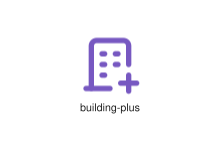
</div>
</div>

{{#endtab}}
{{#tab name="Code"}}

```xml
{{#include ../samples/icons/Tabler-Icons/building-plus-a5afb873.xal}}
```

{{#endtab}}
{{#endtabs}}

<div class="xal-ref-tag"><code>&lt;item id=&#34;101045&#34; /&gt;</code></div>

</div>
<div class="xal-ref-card">
<div class="xal-ref-title">building-skyscraper</div>

{{#tabs name="svg-ref-1045"}}
{{#tab name="Preview"}}
<div class="xal-ref-preview">
<div>
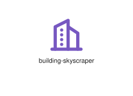
</div>
</div>

{{#endtab}}
{{#tab name="Code"}}

```xml
{{#include ../samples/icons/Tabler-Icons/building-skyscraper-1d9a6e2b.xal}}
```

{{#endtab}}
{{#endtabs}}

<div class="xal-ref-tag"><code>&lt;item id=&#34;101046&#34; /&gt;</code></div>

</div>
<div class="xal-ref-card">
<div class="xal-ref-title">building-stadium</div>

{{#tabs name="svg-ref-1046"}}
{{#tab name="Preview"}}
<div class="xal-ref-preview">
<div>
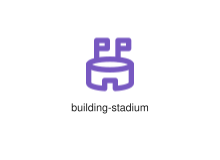
</div>
</div>

{{#endtab}}
{{#tab name="Code"}}

```xml
{{#include ../samples/icons/Tabler-Icons/building-stadium-b397fc69.xal}}
```

{{#endtab}}
{{#endtabs}}

<div class="xal-ref-tag"><code>&lt;item id=&#34;101047&#34; /&gt;</code></div>

</div>
<div class="xal-ref-card">
<div class="xal-ref-title">building-store</div>

{{#tabs name="svg-ref-1047"}}
{{#tab name="Preview"}}
<div class="xal-ref-preview">
<div>
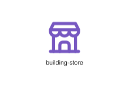
</div>
</div>

{{#endtab}}
{{#tab name="Code"}}

```xml
{{#include ../samples/icons/Tabler-Icons/building-store-150acdea.xal}}
```

{{#endtab}}
{{#endtabs}}

<div class="xal-ref-tag"><code>&lt;item id=&#34;101048&#34; /&gt;</code></div>

</div>
<div class="xal-ref-card">
<div class="xal-ref-title">building-tunnel</div>

{{#tabs name="svg-ref-1048"}}
{{#tab name="Preview"}}
<div class="xal-ref-preview">
<div>
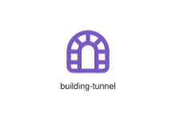
</div>
</div>

{{#endtab}}
{{#tab name="Code"}}

```xml
{{#include ../samples/icons/Tabler-Icons/building-tunnel-962bde6e.xal}}
```

{{#endtab}}
{{#endtabs}}

<div class="xal-ref-tag"><code>&lt;item id=&#34;101049&#34; /&gt;</code></div>

</div>
<div class="xal-ref-card">
<div class="xal-ref-title">building-warehouse</div>

{{#tabs name="svg-ref-1049"}}
{{#tab name="Preview"}}
<div class="xal-ref-preview">
<div>
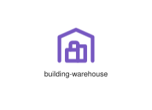
</div>
</div>

{{#endtab}}
{{#tab name="Code"}}

```xml
{{#include ../samples/icons/Tabler-Icons/building-warehouse-839d6257.xal}}
```

{{#endtab}}
{{#endtabs}}

<div class="xal-ref-tag"><code>&lt;item id=&#34;101050&#34; /&gt;</code></div>

</div>
<div class="xal-ref-card">
<div class="xal-ref-title">building-wind-turbine</div>

{{#tabs name="svg-ref-1050"}}
{{#tab name="Preview"}}
<div class="xal-ref-preview">
<div>
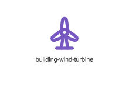
</div>
</div>

{{#endtab}}
{{#tab name="Code"}}

```xml
{{#include ../samples/icons/Tabler-Icons/building-wind-turbine-2a8a7ddb.xal}}
```

{{#endtab}}
{{#endtabs}}

<div class="xal-ref-tag"><code>&lt;item id=&#34;101051&#34; /&gt;</code></div>

</div>
<div class="xal-ref-card">
<div class="xal-ref-title">building</div>

{{#tabs name="svg-ref-1051"}}
{{#tab name="Preview"}}
<div class="xal-ref-preview">
<div>
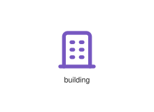
</div>
</div>

{{#endtab}}
{{#tab name="Code"}}

```xml
{{#include ../samples/icons/Tabler-Icons/building-791fe2d3.xal}}
```

{{#endtab}}
{{#endtabs}}

<div class="xal-ref-tag"><code>&lt;item id=&#34;101019&#34; /&gt;</code></div>

</div>
<div class="xal-ref-card">
<div class="xal-ref-title">buildings</div>

{{#tabs name="svg-ref-1052"}}
{{#tab name="Preview"}}
<div class="xal-ref-preview">
<div>
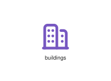
</div>
</div>

{{#endtab}}
{{#tab name="Code"}}

```xml
{{#include ../samples/icons/Tabler-Icons/buildings-b281ba04.xal}}
```

{{#endtab}}
{{#endtabs}}

<div class="xal-ref-tag"><code>&lt;item id=&#34;101052&#34; /&gt;</code></div>

</div>
<div class="xal-ref-card">
<div class="xal-ref-title">bulb-off</div>

{{#tabs name="svg-ref-1053"}}
{{#tab name="Preview"}}
<div class="xal-ref-preview">
<div>
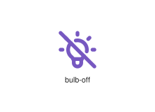
</div>
</div>

{{#endtab}}
{{#tab name="Code"}}

```xml
{{#include ../samples/icons/Tabler-Icons/bulb-off-d3c5b524.xal}}
```

{{#endtab}}
{{#endtabs}}

<div class="xal-ref-tag"><code>&lt;item id=&#34;101054&#34; /&gt;</code></div>

</div>
<div class="xal-ref-card">
<div class="xal-ref-title">bulb</div>

{{#tabs name="svg-ref-1054"}}
{{#tab name="Preview"}}
<div class="xal-ref-preview">
<div>
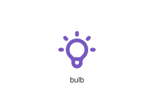
</div>
</div>

{{#endtab}}
{{#tab name="Code"}}

```xml
{{#include ../samples/icons/Tabler-Icons/bulb-312a24a3.xal}}
```

{{#endtab}}
{{#endtabs}}

<div class="xal-ref-tag"><code>&lt;item id=&#34;101053&#34; /&gt;</code></div>

</div>
<div class="xal-ref-card">
<div class="xal-ref-title">bulldozer</div>

{{#tabs name="svg-ref-1055"}}
{{#tab name="Preview"}}
<div class="xal-ref-preview">
<div>
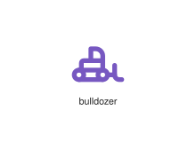
</div>
</div>

{{#endtab}}
{{#tab name="Code"}}

```xml
{{#include ../samples/icons/Tabler-Icons/bulldozer-e6802fa7.xal}}
```

{{#endtab}}
{{#endtabs}}

<div class="xal-ref-tag"><code>&lt;item id=&#34;101055&#34; /&gt;</code></div>

</div>
<div class="xal-ref-card">
<div class="xal-ref-title">burger</div>

{{#tabs name="svg-ref-1056"}}
{{#tab name="Preview"}}
<div class="xal-ref-preview">
<div>
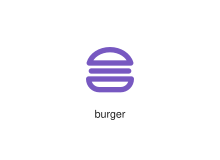
</div>
</div>

{{#endtab}}
{{#tab name="Code"}}

```xml
{{#include ../samples/icons/Tabler-Icons/burger-2423f1e5.xal}}
```

{{#endtab}}
{{#endtabs}}

<div class="xal-ref-tag"><code>&lt;item id=&#34;101056&#34; /&gt;</code></div>

</div>
<div class="xal-ref-card">
<div class="xal-ref-title">bus-off</div>

{{#tabs name="svg-ref-1057"}}
{{#tab name="Preview"}}
<div class="xal-ref-preview">
<div>
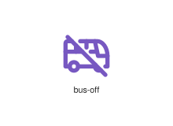
</div>
</div>

{{#endtab}}
{{#tab name="Code"}}

```xml
{{#include ../samples/icons/Tabler-Icons/bus-off-4677ded9.xal}}
```

{{#endtab}}
{{#endtabs}}

<div class="xal-ref-tag"><code>&lt;item id=&#34;101058&#34; /&gt;</code></div>

</div>
<div class="xal-ref-card">
<div class="xal-ref-title">bus-stop</div>

{{#tabs name="svg-ref-1058"}}
{{#tab name="Preview"}}
<div class="xal-ref-preview">
<div>

</div>
</div>

{{#endtab}}
{{#tab name="Code"}}

```xml
{{#include ../samples/icons/Tabler-Icons/bus-stop-e991b9bd.xal}}
```

{{#endtab}}
{{#endtabs}}

<div class="xal-ref-tag"><code>&lt;item id=&#34;101059&#34; /&gt;</code></div>

</div>
<div class="xal-ref-card">
<div class="xal-ref-title">bus</div>

{{#tabs name="svg-ref-1059"}}
{{#tab name="Preview"}}
<div class="xal-ref-preview">
<div>
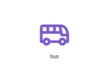
</div>
</div>

{{#endtab}}
{{#tab name="Code"}}

```xml
{{#include ../samples/icons/Tabler-Icons/bus-0b11b26d.xal}}
```

{{#endtab}}
{{#endtabs}}

<div class="xal-ref-tag"><code>&lt;item id=&#34;101057&#34; /&gt;</code></div>

</div>
<div class="xal-ref-card">
<div class="xal-ref-title">businessplan</div>

{{#tabs name="svg-ref-1060"}}
{{#tab name="Preview"}}
<div class="xal-ref-preview">
<div>

</div>
</div>

{{#endtab}}
{{#tab name="Code"}}

```xml
{{#include ../samples/icons/Tabler-Icons/businessplan-4fab45ca.xal}}
```

{{#endtab}}
{{#endtabs}}

<div class="xal-ref-tag"><code>&lt;item id=&#34;101060&#34; /&gt;</code></div>

</div>
<div class="xal-ref-card">
<div class="xal-ref-title">butterfly</div>

{{#tabs name="svg-ref-1061"}}
{{#tab name="Preview"}}
<div class="xal-ref-preview">
<div>

</div>
</div>

{{#endtab}}
{{#tab name="Code"}}

```xml
{{#include ../samples/icons/Tabler-Icons/butterfly-c6a86def.xal}}
```

{{#endtab}}
{{#endtabs}}

<div class="xal-ref-tag"><code>&lt;item id=&#34;101061&#34; /&gt;</code></div>

</div>
<div class="xal-ref-card">
<div class="xal-ref-title">cactus-off</div>

{{#tabs name="svg-ref-1062"}}
{{#tab name="Preview"}}
<div class="xal-ref-preview">
<div>
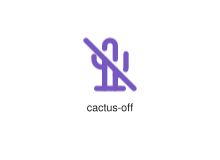
</div>
</div>

{{#endtab}}
{{#tab name="Code"}}

```xml
{{#include ../samples/icons/Tabler-Icons/cactus-off-232aa174.xal}}
```

{{#endtab}}
{{#endtabs}}

<div class="xal-ref-tag"><code>&lt;item id=&#34;101063&#34; /&gt;</code></div>

</div>
<div class="xal-ref-card">
<div class="xal-ref-title">cactus</div>

{{#tabs name="svg-ref-1063"}}
{{#tab name="Preview"}}
<div class="xal-ref-preview">
<div>
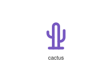
</div>
</div>

{{#endtab}}
{{#tab name="Code"}}

```xml
{{#include ../samples/icons/Tabler-Icons/cactus-e25c156b.xal}}
```

{{#endtab}}
{{#endtabs}}

<div class="xal-ref-tag"><code>&lt;item id=&#34;101062&#34; /&gt;</code></div>

</div>
<div class="xal-ref-card">
<div class="xal-ref-title">cake-off</div>

{{#tabs name="svg-ref-1064"}}
{{#tab name="Preview"}}
<div class="xal-ref-preview">
<div>
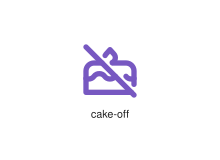
</div>
</div>

{{#endtab}}
{{#tab name="Code"}}

```xml
{{#include ../samples/icons/Tabler-Icons/cake-off-d0f238b2.xal}}
```

{{#endtab}}
{{#endtabs}}

<div class="xal-ref-tag"><code>&lt;item id=&#34;101065&#34; /&gt;</code></div>

</div>
<div class="xal-ref-card">
<div class="xal-ref-title">cake-roll</div>

{{#tabs name="svg-ref-1065"}}
{{#tab name="Preview"}}
<div class="xal-ref-preview">
<div>

</div>
</div>

{{#endtab}}
{{#tab name="Code"}}

```xml
{{#include ../samples/icons/Tabler-Icons/cake-roll-b990440c.xal}}
```

{{#endtab}}
{{#endtabs}}

<div class="xal-ref-tag"><code>&lt;item id=&#34;101066&#34; /&gt;</code></div>

</div>
<div class="xal-ref-card">
<div class="xal-ref-title">cake</div>

{{#tabs name="svg-ref-1066"}}
{{#tab name="Preview"}}
<div class="xal-ref-preview">
<div>

</div>
</div>

{{#endtab}}
{{#tab name="Code"}}

```xml
{{#include ../samples/icons/Tabler-Icons/cake-c1347048.xal}}
```

{{#endtab}}
{{#endtabs}}

<div class="xal-ref-tag"><code>&lt;item id=&#34;101064&#34; /&gt;</code></div>

</div>
<div class="xal-ref-card">
<div class="xal-ref-title">calculator-off</div>

{{#tabs name="svg-ref-1067"}}
{{#tab name="Preview"}}
<div class="xal-ref-preview">
<div>

</div>
</div>

{{#endtab}}
{{#tab name="Code"}}

```xml
{{#include ../samples/icons/Tabler-Icons/calculator-off-0b7899ee.xal}}
```

{{#endtab}}
{{#endtabs}}

<div class="xal-ref-tag"><code>&lt;item id=&#34;101068&#34; /&gt;</code></div>

</div>
<div class="xal-ref-card">
<div class="xal-ref-title">calculator</div>

{{#tabs name="svg-ref-1068"}}
{{#tab name="Preview"}}
<div class="xal-ref-preview">
<div>

</div>
</div>

{{#endtab}}
{{#tab name="Code"}}

```xml
{{#include ../samples/icons/Tabler-Icons/calculator-0c8e1df1.xal}}
```

{{#endtab}}
{{#endtabs}}

<div class="xal-ref-tag"><code>&lt;item id=&#34;101067&#34; /&gt;</code></div>

</div>
<div class="xal-ref-card">
<div class="xal-ref-title">calendar-bolt</div>

{{#tabs name="svg-ref-1069"}}
{{#tab name="Preview"}}
<div class="xal-ref-preview">
<div>

</div>
</div>

{{#endtab}}
{{#tab name="Code"}}

```xml
{{#include ../samples/icons/Tabler-Icons/calendar-bolt-e2ce3ac8.xal}}
```

{{#endtab}}
{{#endtabs}}

<div class="xal-ref-tag"><code>&lt;item id=&#34;101070&#34; /&gt;</code></div>

</div>
<div class="xal-ref-card">
<div class="xal-ref-title">calendar-cancel</div>

{{#tabs name="svg-ref-1070"}}
{{#tab name="Preview"}}
<div class="xal-ref-preview">
<div>

</div>
</div>

{{#endtab}}
{{#tab name="Code"}}

```xml
{{#include ../samples/icons/Tabler-Icons/calendar-cancel-7ba09dc2.xal}}
```

{{#endtab}}
{{#endtabs}}

<div class="xal-ref-tag"><code>&lt;item id=&#34;101071&#34; /&gt;</code></div>

</div>
<div class="xal-ref-card">
<div class="xal-ref-title">calendar-check</div>

{{#tabs name="svg-ref-1071"}}
{{#tab name="Preview"}}
<div class="xal-ref-preview">
<div>

</div>
</div>

{{#endtab}}
{{#tab name="Code"}}

```xml
{{#include ../samples/icons/Tabler-Icons/calendar-check-fe1a14d9.xal}}
```

{{#endtab}}
{{#endtabs}}

<div class="xal-ref-tag"><code>&lt;item id=&#34;101072&#34; /&gt;</code></div>

</div>
<div class="xal-ref-card">
<div class="xal-ref-title">calendar-clock</div>

{{#tabs name="svg-ref-1072"}}
{{#tab name="Preview"}}
<div class="xal-ref-preview">
<div>

</div>
</div>

{{#endtab}}
{{#tab name="Code"}}

```xml
{{#include ../samples/icons/Tabler-Icons/calendar-clock-de20456d.xal}}
```

{{#endtab}}
{{#endtabs}}

<div class="xal-ref-tag"><code>&lt;item id=&#34;101073&#34; /&gt;</code></div>

</div>
<div class="xal-ref-card">
<div class="xal-ref-title">calendar-code</div>

{{#tabs name="svg-ref-1073"}}
{{#tab name="Preview"}}
<div class="xal-ref-preview">
<div>

</div>
</div>

{{#endtab}}
{{#tab name="Code"}}

```xml
{{#include ../samples/icons/Tabler-Icons/calendar-code-9fb70609.xal}}
```

{{#endtab}}
{{#endtabs}}

<div class="xal-ref-tag"><code>&lt;item id=&#34;101074&#34; /&gt;</code></div>

</div>
<div class="xal-ref-card">
<div class="xal-ref-title">calendar-cog</div>

{{#tabs name="svg-ref-1074"}}
{{#tab name="Preview"}}
<div class="xal-ref-preview">
<div>

</div>
</div>

{{#endtab}}
{{#tab name="Code"}}

```xml
{{#include ../samples/icons/Tabler-Icons/calendar-cog-7f9e10bf.xal}}
```

{{#endtab}}
{{#endtabs}}

<div class="xal-ref-tag"><code>&lt;item id=&#34;101075&#34; /&gt;</code></div>

</div>
<div class="xal-ref-card">
<div class="xal-ref-title">calendar-dollar</div>

{{#tabs name="svg-ref-1075"}}
{{#tab name="Preview"}}
<div class="xal-ref-preview">
<div>

</div>
</div>

{{#endtab}}
{{#tab name="Code"}}

```xml
{{#include ../samples/icons/Tabler-Icons/calendar-dollar-a1924148.xal}}
```

{{#endtab}}
{{#endtabs}}

<div class="xal-ref-tag"><code>&lt;item id=&#34;101076&#34; /&gt;</code></div>

</div>
<div class="xal-ref-card">
<div class="xal-ref-title">calendar-dot</div>

{{#tabs name="svg-ref-1076"}}
{{#tab name="Preview"}}
<div class="xal-ref-preview">
<div>

</div>
</div>

{{#endtab}}
{{#tab name="Code"}}

```xml
{{#include ../samples/icons/Tabler-Icons/calendar-dot-9d79c363.xal}}
```

{{#endtab}}
{{#endtabs}}

<div class="xal-ref-tag"><code>&lt;item id=&#34;101077&#34; /&gt;</code></div>

</div>
<div class="xal-ref-card">
<div class="xal-ref-title">calendar-down</div>

{{#tabs name="svg-ref-1077"}}
{{#tab name="Preview"}}
<div class="xal-ref-preview">
<div>

</div>
</div>

{{#endtab}}
{{#tab name="Code"}}

```xml
{{#include ../samples/icons/Tabler-Icons/calendar-down-67e04e34.xal}}
```

{{#endtab}}
{{#endtabs}}

<div class="xal-ref-tag"><code>&lt;item id=&#34;101078&#34; /&gt;</code></div>

</div>
<div class="xal-ref-card">
<div class="xal-ref-title">calendar-due</div>

{{#tabs name="svg-ref-1078"}}
{{#tab name="Preview"}}
<div class="xal-ref-preview">
<div>

</div>
</div>

{{#endtab}}
{{#tab name="Code"}}

```xml
{{#include ../samples/icons/Tabler-Icons/calendar-due-62b45cac.xal}}
```

{{#endtab}}
{{#endtabs}}

<div class="xal-ref-tag"><code>&lt;item id=&#34;101079&#34; /&gt;</code></div>

</div>
<div class="xal-ref-card">
<div class="xal-ref-title">calendar-event</div>

{{#tabs name="svg-ref-1079"}}
{{#tab name="Preview"}}
<div class="xal-ref-preview">
<div>

</div>
</div>

{{#endtab}}
{{#tab name="Code"}}

```xml
{{#include ../samples/icons/Tabler-Icons/calendar-event-ba1f5dc7.xal}}
```

{{#endtab}}
{{#endtabs}}

<div class="xal-ref-tag"><code>&lt;item id=&#34;101080&#34; /&gt;</code></div>

</div>
</div>
