# Tabler-Icons - Page 13

This page references SVG files under `etc/resources/aws/svg/Tabler-Icons`.
Each card shows the SVG preview first and the XAL tag syntax in the Code tab.
Showing 1081-1170 of 4964 SVG files.

<style>
.xal-ref-grid{display:grid;grid-template-columns:repeat(3,minmax(0,1fr));gap:1rem;margin:1rem 0 1.5rem}.xal-ref-card{border:1px solid var(--table-border-color);border-radius:8px;overflow:hidden;background:var(--bg);padding:.75rem}.xal-ref-title{font-size:.9rem;font-weight:600;line-height:1.25;margin:0 0 .5rem;overflow-wrap:anywhere}.xal-ref-preview{display:flex;align-items:center;justify-content:center}.xal-ref-preview img{display:block;width:100%;height:auto}.xal-ref-card pre{margin:0;max-height:18rem;overflow:auto;white-space:pre}.xal-ref-card code{font-size:.78em}.xal-ref-tag{margin:.5rem 0 0;color:var(--fg);opacity:.72;overflow:auto;white-space:pre}.xal-ref-tag code{font-size:.72em}@media(max-width:900px){.xal-ref-grid{grid-template-columns:repeat(2,minmax(0,1fr))}}@media(max-width:560px){.xal-ref-grid{grid-template-columns:1fr}}
</style>

[Back to section index](tabler-icons.md)

<div class="xal-ref-grid">
<div class="xal-ref-card">
<div class="xal-ref-title">calendar-exclamation</div>

{{#tabs name="svg-ref-1080"}}
{{#tab name="Preview"}}
<div class="xal-ref-preview">
<div>
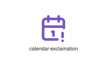
</div>
</div>

{{#endtab}}
{{#tab name="Code"}}

```xml
{{#include ../samples/icons/Tabler-Icons/calendar-exclamation-63133ec9.xal}}
```

{{#endtab}}
{{#endtabs}}

<div class="xal-ref-tag"><code>&lt;item id=&#34;101081&#34; /&gt;</code></div>

</div>
<div class="xal-ref-card">
<div class="xal-ref-title">calendar-heart</div>

{{#tabs name="svg-ref-1081"}}
{{#tab name="Preview"}}
<div class="xal-ref-preview">
<div>
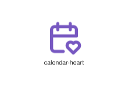
</div>
</div>

{{#endtab}}
{{#tab name="Code"}}

```xml
{{#include ../samples/icons/Tabler-Icons/calendar-heart-393f6aab.xal}}
```

{{#endtab}}
{{#endtabs}}

<div class="xal-ref-tag"><code>&lt;item id=&#34;101082&#34; /&gt;</code></div>

</div>
<div class="xal-ref-card">
<div class="xal-ref-title">calendar-minus</div>

{{#tabs name="svg-ref-1082"}}
{{#tab name="Preview"}}
<div class="xal-ref-preview">
<div>
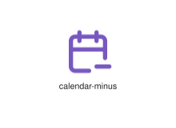
</div>
</div>

{{#endtab}}
{{#tab name="Code"}}

```xml
{{#include ../samples/icons/Tabler-Icons/calendar-minus-7d6aa6ea.xal}}
```

{{#endtab}}
{{#endtabs}}

<div class="xal-ref-tag"><code>&lt;item id=&#34;101083&#34; /&gt;</code></div>

</div>
<div class="xal-ref-card">
<div class="xal-ref-title">calendar-month</div>

{{#tabs name="svg-ref-1083"}}
{{#tab name="Preview"}}
<div class="xal-ref-preview">
<div>

</div>
</div>

{{#endtab}}
{{#tab name="Code"}}

```xml
{{#include ../samples/icons/Tabler-Icons/calendar-month-6769da5b.xal}}
```

{{#endtab}}
{{#endtabs}}

<div class="xal-ref-tag"><code>&lt;item id=&#34;101084&#34; /&gt;</code></div>

</div>
<div class="xal-ref-card">
<div class="xal-ref-title">calendar-off</div>

{{#tabs name="svg-ref-1084"}}
{{#tab name="Preview"}}
<div class="xal-ref-preview">
<div>

</div>
</div>

{{#endtab}}
{{#tab name="Code"}}

```xml
{{#include ../samples/icons/Tabler-Icons/calendar-off-a25102b3.xal}}
```

{{#endtab}}
{{#endtabs}}

<div class="xal-ref-tag"><code>&lt;item id=&#34;101085&#34; /&gt;</code></div>

</div>
<div class="xal-ref-card">
<div class="xal-ref-title">calendar-pause</div>

{{#tabs name="svg-ref-1085"}}
{{#tab name="Preview"}}
<div class="xal-ref-preview">
<div>
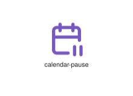
</div>
</div>

{{#endtab}}
{{#tab name="Code"}}

```xml
{{#include ../samples/icons/Tabler-Icons/calendar-pause-af205172.xal}}
```

{{#endtab}}
{{#endtabs}}

<div class="xal-ref-tag"><code>&lt;item id=&#34;101086&#34; /&gt;</code></div>

</div>
<div class="xal-ref-card">
<div class="xal-ref-title">calendar-pin</div>

{{#tabs name="svg-ref-1086"}}
{{#tab name="Preview"}}
<div class="xal-ref-preview">
<div>

</div>
</div>

{{#endtab}}
{{#tab name="Code"}}

```xml
{{#include ../samples/icons/Tabler-Icons/calendar-pin-f2e11780.xal}}
```

{{#endtab}}
{{#endtabs}}

<div class="xal-ref-tag"><code>&lt;item id=&#34;101087&#34; /&gt;</code></div>

</div>
<div class="xal-ref-card">
<div class="xal-ref-title">calendar-plus</div>

{{#tabs name="svg-ref-1087"}}
{{#tab name="Preview"}}
<div class="xal-ref-preview">
<div>

</div>
</div>

{{#endtab}}
{{#tab name="Code"}}

```xml
{{#include ../samples/icons/Tabler-Icons/calendar-plus-7b419940.xal}}
```

{{#endtab}}
{{#endtabs}}

<div class="xal-ref-tag"><code>&lt;item id=&#34;101088&#34; /&gt;</code></div>

</div>
<div class="xal-ref-card">
<div class="xal-ref-title">calendar-question</div>

{{#tabs name="svg-ref-1088"}}
{{#tab name="Preview"}}
<div class="xal-ref-preview">
<div>

</div>
</div>

{{#endtab}}
{{#tab name="Code"}}

```xml
{{#include ../samples/icons/Tabler-Icons/calendar-question-9dffdc44.xal}}
```

{{#endtab}}
{{#endtabs}}

<div class="xal-ref-tag"><code>&lt;item id=&#34;101089&#34; /&gt;</code></div>

</div>
<div class="xal-ref-card">
<div class="xal-ref-title">calendar-repeat</div>

{{#tabs name="svg-ref-1089"}}
{{#tab name="Preview"}}
<div class="xal-ref-preview">
<div>

</div>
</div>

{{#endtab}}
{{#tab name="Code"}}

```xml
{{#include ../samples/icons/Tabler-Icons/calendar-repeat-2fc0ae6e.xal}}
```

{{#endtab}}
{{#endtabs}}

<div class="xal-ref-tag"><code>&lt;item id=&#34;101090&#34; /&gt;</code></div>

</div>
<div class="xal-ref-card">
<div class="xal-ref-title">calendar-sad</div>

{{#tabs name="svg-ref-1090"}}
{{#tab name="Preview"}}
<div class="xal-ref-preview">
<div>
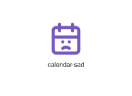
</div>
</div>

{{#endtab}}
{{#tab name="Code"}}

```xml
{{#include ../samples/icons/Tabler-Icons/calendar-sad-65ea97d1.xal}}
```

{{#endtab}}
{{#endtabs}}

<div class="xal-ref-tag"><code>&lt;item id=&#34;101091&#34; /&gt;</code></div>

</div>
<div class="xal-ref-card">
<div class="xal-ref-title">calendar-search</div>

{{#tabs name="svg-ref-1091"}}
{{#tab name="Preview"}}
<div class="xal-ref-preview">
<div>

</div>
</div>

{{#endtab}}
{{#tab name="Code"}}

```xml
{{#include ../samples/icons/Tabler-Icons/calendar-search-3ab28d2d.xal}}
```

{{#endtab}}
{{#endtabs}}

<div class="xal-ref-tag"><code>&lt;item id=&#34;101092&#34; /&gt;</code></div>

</div>
<div class="xal-ref-card">
<div class="xal-ref-title">calendar-share</div>

{{#tabs name="svg-ref-1092"}}
{{#tab name="Preview"}}
<div class="xal-ref-preview">
<div>

</div>
</div>

{{#endtab}}
{{#tab name="Code"}}

```xml
{{#include ../samples/icons/Tabler-Icons/calendar-share-d12f1de4.xal}}
```

{{#endtab}}
{{#endtabs}}

<div class="xal-ref-tag"><code>&lt;item id=&#34;101093&#34; /&gt;</code></div>

</div>
<div class="xal-ref-card">
<div class="xal-ref-title">calendar-smile</div>

{{#tabs name="svg-ref-1093"}}
{{#tab name="Preview"}}
<div class="xal-ref-preview">
<div>

</div>
</div>

{{#endtab}}
{{#tab name="Code"}}

```xml
{{#include ../samples/icons/Tabler-Icons/calendar-smile-93fc3e0c.xal}}
```

{{#endtab}}
{{#endtabs}}

<div class="xal-ref-tag"><code>&lt;item id=&#34;101094&#34; /&gt;</code></div>

</div>
<div class="xal-ref-card">
<div class="xal-ref-title">calendar-star</div>

{{#tabs name="svg-ref-1094"}}
{{#tab name="Preview"}}
<div class="xal-ref-preview">
<div>

</div>
</div>

{{#endtab}}
{{#tab name="Code"}}

```xml
{{#include ../samples/icons/Tabler-Icons/calendar-star-04d82537.xal}}
```

{{#endtab}}
{{#endtabs}}

<div class="xal-ref-tag"><code>&lt;item id=&#34;101095&#34; /&gt;</code></div>

</div>
<div class="xal-ref-card">
<div class="xal-ref-title">calendar-stats</div>

{{#tabs name="svg-ref-1095"}}
{{#tab name="Preview"}}
<div class="xal-ref-preview">
<div>
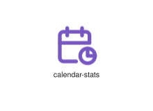
</div>
</div>

{{#endtab}}
{{#tab name="Code"}}

```xml
{{#include ../samples/icons/Tabler-Icons/calendar-stats-c3c2b8bf.xal}}
```

{{#endtab}}
{{#endtabs}}

<div class="xal-ref-tag"><code>&lt;item id=&#34;101096&#34; /&gt;</code></div>

</div>
<div class="xal-ref-card">
<div class="xal-ref-title">calendar-time</div>

{{#tabs name="svg-ref-1096"}}
{{#tab name="Preview"}}
<div class="xal-ref-preview">
<div>

</div>
</div>

{{#endtab}}
{{#tab name="Code"}}

```xml
{{#include ../samples/icons/Tabler-Icons/calendar-time-ad165ac9.xal}}
```

{{#endtab}}
{{#endtabs}}

<div class="xal-ref-tag"><code>&lt;item id=&#34;101097&#34; /&gt;</code></div>

</div>
<div class="xal-ref-card">
<div class="xal-ref-title">calendar-up</div>

{{#tabs name="svg-ref-1097"}}
{{#tab name="Preview"}}
<div class="xal-ref-preview">
<div>

</div>
</div>

{{#endtab}}
{{#tab name="Code"}}

```xml
{{#include ../samples/icons/Tabler-Icons/calendar-up-59f7eb3b.xal}}
```

{{#endtab}}
{{#endtabs}}

<div class="xal-ref-tag"><code>&lt;item id=&#34;101098&#34; /&gt;</code></div>

</div>
<div class="xal-ref-card">
<div class="xal-ref-title">calendar-user</div>

{{#tabs name="svg-ref-1098"}}
{{#tab name="Preview"}}
<div class="xal-ref-preview">
<div>

</div>
</div>

{{#endtab}}
{{#tab name="Code"}}

```xml
{{#include ../samples/icons/Tabler-Icons/calendar-user-9c815028.xal}}
```

{{#endtab}}
{{#endtabs}}

<div class="xal-ref-tag"><code>&lt;item id=&#34;101099&#34; /&gt;</code></div>

</div>
<div class="xal-ref-card">
<div class="xal-ref-title">calendar-week</div>

{{#tabs name="svg-ref-1099"}}
{{#tab name="Preview"}}
<div class="xal-ref-preview">
<div>

</div>
</div>

{{#endtab}}
{{#tab name="Code"}}

```xml
{{#include ../samples/icons/Tabler-Icons/calendar-week-b75a0b52.xal}}
```

{{#endtab}}
{{#endtabs}}

<div class="xal-ref-tag"><code>&lt;item id=&#34;101100&#34; /&gt;</code></div>

</div>
<div class="xal-ref-card">
<div class="xal-ref-title">calendar-x</div>

{{#tabs name="svg-ref-1100"}}
{{#tab name="Preview"}}
<div class="xal-ref-preview">
<div>
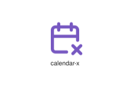
</div>
</div>

{{#endtab}}
{{#tab name="Code"}}

```xml
{{#include ../samples/icons/Tabler-Icons/calendar-x-eb5d8949.xal}}
```

{{#endtab}}
{{#endtabs}}

<div class="xal-ref-tag"><code>&lt;item id=&#34;101101&#34; /&gt;</code></div>

</div>
<div class="xal-ref-card">
<div class="xal-ref-title">calendar</div>

{{#tabs name="svg-ref-1101"}}
{{#tab name="Preview"}}
<div class="xal-ref-preview">
<div>

</div>
</div>

{{#endtab}}
{{#tab name="Code"}}

```xml
{{#include ../samples/icons/Tabler-Icons/calendar-1f5eb3c5.xal}}
```

{{#endtab}}
{{#endtabs}}

<div class="xal-ref-tag"><code>&lt;item id=&#34;101069&#34; /&gt;</code></div>

</div>
<div class="xal-ref-card">
<div class="xal-ref-title">camera-ai</div>

{{#tabs name="svg-ref-1102"}}
{{#tab name="Preview"}}
<div class="xal-ref-preview">
<div>

</div>
</div>

{{#endtab}}
{{#tab name="Code"}}

```xml
{{#include ../samples/icons/Tabler-Icons/camera-ai-a910cede.xal}}
```

{{#endtab}}
{{#endtabs}}

<div class="xal-ref-tag"><code>&lt;item id=&#34;101103&#34; /&gt;</code></div>

</div>
<div class="xal-ref-card">
<div class="xal-ref-title">camera-bitcoin</div>

{{#tabs name="svg-ref-1103"}}
{{#tab name="Preview"}}
<div class="xal-ref-preview">
<div>

</div>
</div>

{{#endtab}}
{{#tab name="Code"}}

```xml
{{#include ../samples/icons/Tabler-Icons/camera-bitcoin-5514c2cc.xal}}
```

{{#endtab}}
{{#endtabs}}

<div class="xal-ref-tag"><code>&lt;item id=&#34;101104&#34; /&gt;</code></div>

</div>
<div class="xal-ref-card">
<div class="xal-ref-title">camera-bolt</div>

{{#tabs name="svg-ref-1104"}}
{{#tab name="Preview"}}
<div class="xal-ref-preview">
<div>

</div>
</div>

{{#endtab}}
{{#tab name="Code"}}

```xml
{{#include ../samples/icons/Tabler-Icons/camera-bolt-8074ff0d.xal}}
```

{{#endtab}}
{{#endtabs}}

<div class="xal-ref-tag"><code>&lt;item id=&#34;101105&#34; /&gt;</code></div>

</div>
<div class="xal-ref-card">
<div class="xal-ref-title">camera-cancel</div>

{{#tabs name="svg-ref-1105"}}
{{#tab name="Preview"}}
<div class="xal-ref-preview">
<div>

</div>
</div>

{{#endtab}}
{{#tab name="Code"}}

```xml
{{#include ../samples/icons/Tabler-Icons/camera-cancel-2623ea4c.xal}}
```

{{#endtab}}
{{#endtabs}}

<div class="xal-ref-tag"><code>&lt;item id=&#34;101106&#34; /&gt;</code></div>

</div>
<div class="xal-ref-card">
<div class="xal-ref-title">camera-check</div>

{{#tabs name="svg-ref-1106"}}
{{#tab name="Preview"}}
<div class="xal-ref-preview">
<div>

</div>
</div>

{{#endtab}}
{{#tab name="Code"}}

```xml
{{#include ../samples/icons/Tabler-Icons/camera-check-15769823.xal}}
```

{{#endtab}}
{{#endtabs}}

<div class="xal-ref-tag"><code>&lt;item id=&#34;101107&#34; /&gt;</code></div>

</div>
<div class="xal-ref-card">
<div class="xal-ref-title">camera-code</div>

{{#tabs name="svg-ref-1107"}}
{{#tab name="Preview"}}
<div class="xal-ref-preview">
<div>

</div>
</div>

{{#endtab}}
{{#tab name="Code"}}

```xml
{{#include ../samples/icons/Tabler-Icons/camera-code-fd0dc3cc.xal}}
```

{{#endtab}}
{{#endtabs}}

<div class="xal-ref-tag"><code>&lt;item id=&#34;101108&#34; /&gt;</code></div>

</div>
<div class="xal-ref-card">
<div class="xal-ref-title">camera-cog</div>

{{#tabs name="svg-ref-1108"}}
{{#tab name="Preview"}}
<div class="xal-ref-preview">
<div>

</div>
</div>

{{#endtab}}
{{#tab name="Code"}}

```xml
{{#include ../samples/icons/Tabler-Icons/camera-cog-18460ae3.xal}}
```

{{#endtab}}
{{#endtabs}}

<div class="xal-ref-tag"><code>&lt;item id=&#34;101109&#34; /&gt;</code></div>

</div>
<div class="xal-ref-card">
<div class="xal-ref-title">camera-dollar</div>

{{#tabs name="svg-ref-1109"}}
{{#tab name="Preview"}}
<div class="xal-ref-preview">
<div>

</div>
</div>

{{#endtab}}
{{#tab name="Code"}}

```xml
{{#include ../samples/icons/Tabler-Icons/camera-dollar-fc1136c6.xal}}
```

{{#endtab}}
{{#endtabs}}

<div class="xal-ref-tag"><code>&lt;item id=&#34;101110&#34; /&gt;</code></div>

</div>
<div class="xal-ref-card">
<div class="xal-ref-title">camera-down</div>

{{#tabs name="svg-ref-1110"}}
{{#tab name="Preview"}}
<div class="xal-ref-preview">
<div>

</div>
</div>

{{#endtab}}
{{#tab name="Code"}}

```xml
{{#include ../samples/icons/Tabler-Icons/camera-down-055a8bf1.xal}}
```

{{#endtab}}
{{#endtabs}}

<div class="xal-ref-tag"><code>&lt;item id=&#34;101111&#34; /&gt;</code></div>

</div>
<div class="xal-ref-card">
<div class="xal-ref-title">camera-exclamation</div>

{{#tabs name="svg-ref-1111"}}
{{#tab name="Preview"}}
<div class="xal-ref-preview">
<div>

</div>
</div>

{{#endtab}}
{{#tab name="Code"}}

```xml
{{#include ../samples/icons/Tabler-Icons/camera-exclamation-774b2edf.xal}}
```

{{#endtab}}
{{#endtabs}}

<div class="xal-ref-tag"><code>&lt;item id=&#34;101112&#34; /&gt;</code></div>

</div>
<div class="xal-ref-card">
<div class="xal-ref-title">camera-heart</div>

{{#tabs name="svg-ref-1112"}}
{{#tab name="Preview"}}
<div class="xal-ref-preview">
<div>

</div>
</div>

{{#endtab}}
{{#tab name="Code"}}

```xml
{{#include ../samples/icons/Tabler-Icons/camera-heart-d253e651.xal}}
```

{{#endtab}}
{{#endtabs}}

<div class="xal-ref-tag"><code>&lt;item id=&#34;101113&#34; /&gt;</code></div>

</div>
<div class="xal-ref-card">
<div class="xal-ref-title">camera-minus</div>

{{#tabs name="svg-ref-1113"}}
{{#tab name="Preview"}}
<div class="xal-ref-preview">
<div>

</div>
</div>

{{#endtab}}
{{#tab name="Code"}}

```xml
{{#include ../samples/icons/Tabler-Icons/camera-minus-96062a10.xal}}
```

{{#endtab}}
{{#endtabs}}

<div class="xal-ref-tag"><code>&lt;item id=&#34;101114&#34; /&gt;</code></div>

</div>
<div class="xal-ref-card">
<div class="xal-ref-title">camera-moon</div>

{{#tabs name="svg-ref-1114"}}
{{#tab name="Preview"}}
<div class="xal-ref-preview">
<div>

</div>
</div>

{{#endtab}}
{{#tab name="Code"}}

```xml
{{#include ../samples/icons/Tabler-Icons/camera-moon-f590102c.xal}}
```

{{#endtab}}
{{#endtabs}}

<div class="xal-ref-tag"><code>&lt;item id=&#34;101115&#34; /&gt;</code></div>

</div>
<div class="xal-ref-card">
<div class="xal-ref-title">camera-off</div>

{{#tabs name="svg-ref-1115"}}
{{#tab name="Preview"}}
<div class="xal-ref-preview">
<div>

</div>
</div>

{{#endtab}}
{{#tab name="Code"}}

```xml
{{#include ../samples/icons/Tabler-Icons/camera-off-c58918ef.xal}}
```

{{#endtab}}
{{#endtabs}}

<div class="xal-ref-tag"><code>&lt;item id=&#34;101116&#34; /&gt;</code></div>

</div>
<div class="xal-ref-card">
<div class="xal-ref-title">camera-pause</div>

{{#tabs name="svg-ref-1116"}}
{{#tab name="Preview"}}
<div class="xal-ref-preview">
<div>

</div>
</div>

{{#endtab}}
{{#tab name="Code"}}

```xml
{{#include ../samples/icons/Tabler-Icons/camera-pause-444cdd88.xal}}
```

{{#endtab}}
{{#endtabs}}

<div class="xal-ref-tag"><code>&lt;item id=&#34;101117&#34; /&gt;</code></div>

</div>
<div class="xal-ref-card">
<div class="xal-ref-title">camera-pin</div>

{{#tabs name="svg-ref-1117"}}
{{#tab name="Preview"}}
<div class="xal-ref-preview">
<div>

</div>
</div>

{{#endtab}}
{{#tab name="Code"}}

```xml
{{#include ../samples/icons/Tabler-Icons/camera-pin-95390ddc.xal}}
```

{{#endtab}}
{{#endtabs}}

<div class="xal-ref-tag"><code>&lt;item id=&#34;101118&#34; /&gt;</code></div>

</div>
<div class="xal-ref-card">
<div class="xal-ref-title">camera-plus</div>

{{#tabs name="svg-ref-1118"}}
{{#tab name="Preview"}}
<div class="xal-ref-preview">
<div>

</div>
</div>

{{#endtab}}
{{#tab name="Code"}}

```xml
{{#include ../samples/icons/Tabler-Icons/camera-plus-19fb5c85.xal}}
```

{{#endtab}}
{{#endtabs}}

<div class="xal-ref-tag"><code>&lt;item id=&#34;101119&#34; /&gt;</code></div>

</div>
<div class="xal-ref-card">
<div class="xal-ref-title">camera-question</div>

{{#tabs name="svg-ref-1119"}}
{{#tab name="Preview"}}
<div class="xal-ref-preview">
<div>

</div>
</div>

{{#endtab}}
{{#tab name="Code"}}

```xml
{{#include ../samples/icons/Tabler-Icons/camera-question-f69ed09d.xal}}
```

{{#endtab}}
{{#endtabs}}

<div class="xal-ref-tag"><code>&lt;item id=&#34;101120&#34; /&gt;</code></div>

</div>
<div class="xal-ref-card">
<div class="xal-ref-title">camera-rotate</div>

{{#tabs name="svg-ref-1120"}}
{{#tab name="Preview"}}
<div class="xal-ref-preview">
<div>
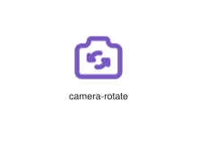
</div>
</div>

{{#endtab}}
{{#tab name="Code"}}

```xml
{{#include ../samples/icons/Tabler-Icons/camera-rotate-99f3548d.xal}}
```

{{#endtab}}
{{#endtabs}}

<div class="xal-ref-tag"><code>&lt;item id=&#34;101121&#34; /&gt;</code></div>

</div>
<div class="xal-ref-card">
<div class="xal-ref-title">camera-search</div>

{{#tabs name="svg-ref-1121"}}
{{#tab name="Preview"}}
<div class="xal-ref-preview">
<div>

</div>
</div>

{{#endtab}}
{{#tab name="Code"}}

```xml
{{#include ../samples/icons/Tabler-Icons/camera-search-6731faa3.xal}}
```

{{#endtab}}
{{#endtabs}}

<div class="xal-ref-tag"><code>&lt;item id=&#34;101122&#34; /&gt;</code></div>

</div>
<div class="xal-ref-card">
<div class="xal-ref-title">camera-selfie</div>

{{#tabs name="svg-ref-1122"}}
{{#tab name="Preview"}}
<div class="xal-ref-preview">
<div>

</div>
</div>

{{#endtab}}
{{#tab name="Code"}}

```xml
{{#include ../samples/icons/Tabler-Icons/camera-selfie-36aeb078.xal}}
```

{{#endtab}}
{{#endtabs}}

<div class="xal-ref-tag"><code>&lt;item id=&#34;101123&#34; /&gt;</code></div>

</div>
<div class="xal-ref-card">
<div class="xal-ref-title">camera-share</div>

{{#tabs name="svg-ref-1123"}}
{{#tab name="Preview"}}
<div class="xal-ref-preview">
<div>

</div>
</div>

{{#endtab}}
{{#tab name="Code"}}

```xml
{{#include ../samples/icons/Tabler-Icons/camera-share-3a43911e.xal}}
```

{{#endtab}}
{{#endtabs}}

<div class="xal-ref-tag"><code>&lt;item id=&#34;101124&#34; /&gt;</code></div>

</div>
<div class="xal-ref-card">
<div class="xal-ref-title">camera-spark</div>

{{#tabs name="svg-ref-1124"}}
{{#tab name="Preview"}}
<div class="xal-ref-preview">
<div>

</div>
</div>

{{#endtab}}
{{#tab name="Code"}}

```xml
{{#include ../samples/icons/Tabler-Icons/camera-spark-2a2d05e1.xal}}
```

{{#endtab}}
{{#endtabs}}

<div class="xal-ref-tag"><code>&lt;item id=&#34;101125&#34; /&gt;</code></div>

</div>
<div class="xal-ref-card">
<div class="xal-ref-title">camera-star</div>

{{#tabs name="svg-ref-1125"}}
{{#tab name="Preview"}}
<div class="xal-ref-preview">
<div>

</div>
</div>

{{#endtab}}
{{#tab name="Code"}}

```xml
{{#include ../samples/icons/Tabler-Icons/camera-star-6662e0f2.xal}}
```

{{#endtab}}
{{#endtabs}}

<div class="xal-ref-tag"><code>&lt;item id=&#34;101126&#34; /&gt;</code></div>

</div>
<div class="xal-ref-card">
<div class="xal-ref-title">camera-up</div>

{{#tabs name="svg-ref-1126"}}
{{#tab name="Preview"}}
<div class="xal-ref-preview">
<div>

</div>
</div>

{{#endtab}}
{{#tab name="Code"}}

```xml
{{#include ../samples/icons/Tabler-Icons/camera-up-5ca77ba0.xal}}
```

{{#endtab}}
{{#endtabs}}

<div class="xal-ref-tag"><code>&lt;item id=&#34;101127&#34; /&gt;</code></div>

</div>
<div class="xal-ref-card">
<div class="xal-ref-title">camera-x</div>

{{#tabs name="svg-ref-1127"}}
{{#tab name="Preview"}}
<div class="xal-ref-preview">
<div>

</div>
</div>

{{#endtab}}
{{#tab name="Code"}}

```xml
{{#include ../samples/icons/Tabler-Icons/camera-x-bb9a018e.xal}}
```

{{#endtab}}
{{#endtabs}}

<div class="xal-ref-tag"><code>&lt;item id=&#34;101128&#34; /&gt;</code></div>

</div>
<div class="xal-ref-card">
<div class="xal-ref-title">camera</div>

{{#tabs name="svg-ref-1128"}}
{{#tab name="Preview"}}
<div class="xal-ref-preview">
<div>

</div>
</div>

{{#endtab}}
{{#tab name="Code"}}

```xml
{{#include ../samples/icons/Tabler-Icons/camera-315a6479.xal}}
```

{{#endtab}}
{{#endtabs}}

<div class="xal-ref-tag"><code>&lt;item id=&#34;101102&#34; /&gt;</code></div>

</div>
<div class="xal-ref-card">
<div class="xal-ref-title">camper</div>

{{#tabs name="svg-ref-1129"}}
{{#tab name="Preview"}}
<div class="xal-ref-preview">
<div>
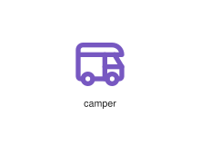
</div>
</div>

{{#endtab}}
{{#tab name="Code"}}

```xml
{{#include ../samples/icons/Tabler-Icons/camper-3d2f0861.xal}}
```

{{#endtab}}
{{#endtabs}}

<div class="xal-ref-tag"><code>&lt;item id=&#34;101129&#34; /&gt;</code></div>

</div>
<div class="xal-ref-card">
<div class="xal-ref-title">campfire</div>

{{#tabs name="svg-ref-1130"}}
{{#tab name="Preview"}}
<div class="xal-ref-preview">
<div>

</div>
</div>

{{#endtab}}
{{#tab name="Code"}}

```xml
{{#include ../samples/icons/Tabler-Icons/campfire-f37b9e17.xal}}
```

{{#endtab}}
{{#endtabs}}

<div class="xal-ref-tag"><code>&lt;item id=&#34;101130&#34; /&gt;</code></div>

</div>
<div class="xal-ref-card">
<div class="xal-ref-title">cancel</div>

{{#tabs name="svg-ref-1131"}}
{{#tab name="Preview"}}
<div class="xal-ref-preview">
<div>
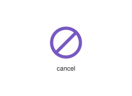
</div>
</div>

{{#endtab}}
{{#tab name="Code"}}

```xml
{{#include ../samples/icons/Tabler-Icons/cancel-3a46a032.xal}}
```

{{#endtab}}
{{#endtabs}}

<div class="xal-ref-tag"><code>&lt;item id=&#34;101131&#34; /&gt;</code></div>

</div>
<div class="xal-ref-card">
<div class="xal-ref-title">candle</div>

{{#tabs name="svg-ref-1132"}}
{{#tab name="Preview"}}
<div class="xal-ref-preview">
<div>

</div>
</div>

{{#endtab}}
{{#tab name="Code"}}

```xml
{{#include ../samples/icons/Tabler-Icons/candle-d5fead05.xal}}
```

{{#endtab}}
{{#endtabs}}

<div class="xal-ref-tag"><code>&lt;item id=&#34;101132&#34; /&gt;</code></div>

</div>
<div class="xal-ref-card">
<div class="xal-ref-title">candy-off</div>

{{#tabs name="svg-ref-1133"}}
{{#tab name="Preview"}}
<div class="xal-ref-preview">
<div>
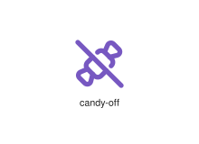
</div>
</div>

{{#endtab}}
{{#tab name="Code"}}

```xml
{{#include ../samples/icons/Tabler-Icons/candy-off-6f9649a7.xal}}
```

{{#endtab}}
{{#endtabs}}

<div class="xal-ref-tag"><code>&lt;item id=&#34;101134&#34; /&gt;</code></div>

</div>
<div class="xal-ref-card">
<div class="xal-ref-title">candy</div>

{{#tabs name="svg-ref-1134"}}
{{#tab name="Preview"}}
<div class="xal-ref-preview">
<div>
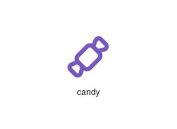
</div>
</div>

{{#endtab}}
{{#tab name="Code"}}

```xml
{{#include ../samples/icons/Tabler-Icons/candy-06303ff9.xal}}
```

{{#endtab}}
{{#endtabs}}

<div class="xal-ref-tag"><code>&lt;item id=&#34;101133&#34; /&gt;</code></div>

</div>
<div class="xal-ref-card">
<div class="xal-ref-title">cane</div>

{{#tabs name="svg-ref-1135"}}
{{#tab name="Preview"}}
<div class="xal-ref-preview">
<div>
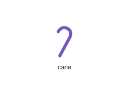
</div>
</div>

{{#endtab}}
{{#tab name="Code"}}

```xml
{{#include ../samples/icons/Tabler-Icons/cane-91f9e1fb.xal}}
```

{{#endtab}}
{{#endtabs}}

<div class="xal-ref-tag"><code>&lt;item id=&#34;101135&#34; /&gt;</code></div>

</div>
<div class="xal-ref-card">
<div class="xal-ref-title">cannabis</div>

{{#tabs name="svg-ref-1136"}}
{{#tab name="Preview"}}
<div class="xal-ref-preview">
<div>

</div>
</div>

{{#endtab}}
{{#tab name="Code"}}

```xml
{{#include ../samples/icons/Tabler-Icons/cannabis-f23d716e.xal}}
```

{{#endtab}}
{{#endtabs}}

<div class="xal-ref-tag"><code>&lt;item id=&#34;101136&#34; /&gt;</code></div>

</div>
<div class="xal-ref-card">
<div class="xal-ref-title">cap-projecting</div>

{{#tabs name="svg-ref-1137"}}
{{#tab name="Preview"}}
<div class="xal-ref-preview">
<div>
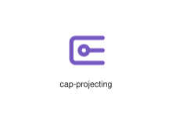
</div>
</div>

{{#endtab}}
{{#tab name="Code"}}

```xml
{{#include ../samples/icons/Tabler-Icons/cap-projecting-e6155f95.xal}}
```

{{#endtab}}
{{#endtabs}}

<div class="xal-ref-tag"><code>&lt;item id=&#34;101137&#34; /&gt;</code></div>

</div>
<div class="xal-ref-card">
<div class="xal-ref-title">cap-rounded</div>

{{#tabs name="svg-ref-1138"}}
{{#tab name="Preview"}}
<div class="xal-ref-preview">
<div>

</div>
</div>

{{#endtab}}
{{#tab name="Code"}}

```xml
{{#include ../samples/icons/Tabler-Icons/cap-rounded-8034ac85.xal}}
```

{{#endtab}}
{{#endtabs}}

<div class="xal-ref-tag"><code>&lt;item id=&#34;101138&#34; /&gt;</code></div>

</div>
<div class="xal-ref-card">
<div class="xal-ref-title">cap-straight</div>

{{#tabs name="svg-ref-1139"}}
{{#tab name="Preview"}}
<div class="xal-ref-preview">
<div>

</div>
</div>

{{#endtab}}
{{#tab name="Code"}}

```xml
{{#include ../samples/icons/Tabler-Icons/cap-straight-d21fa650.xal}}
```

{{#endtab}}
{{#endtabs}}

<div class="xal-ref-tag"><code>&lt;item id=&#34;101139&#34; /&gt;</code></div>

</div>
<div class="xal-ref-card">
<div class="xal-ref-title">capsule-horizontal</div>

{{#tabs name="svg-ref-1140"}}
{{#tab name="Preview"}}
<div class="xal-ref-preview">
<div>
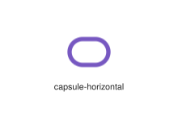
</div>
</div>

{{#endtab}}
{{#tab name="Code"}}

```xml
{{#include ../samples/icons/Tabler-Icons/capsule-horizontal-01273db9.xal}}
```

{{#endtab}}
{{#endtabs}}

<div class="xal-ref-tag"><code>&lt;item id=&#34;101141&#34; /&gt;</code></div>

</div>
<div class="xal-ref-card">
<div class="xal-ref-title">capsule</div>

{{#tabs name="svg-ref-1141"}}
{{#tab name="Preview"}}
<div class="xal-ref-preview">
<div>
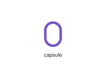
</div>
</div>

{{#endtab}}
{{#tab name="Code"}}

```xml
{{#include ../samples/icons/Tabler-Icons/capsule-f508678c.xal}}
```

{{#endtab}}
{{#endtabs}}

<div class="xal-ref-tag"><code>&lt;item id=&#34;101140&#34; /&gt;</code></div>

</div>
<div class="xal-ref-card">
<div class="xal-ref-title">capture-off</div>

{{#tabs name="svg-ref-1142"}}
{{#tab name="Preview"}}
<div class="xal-ref-preview">
<div>
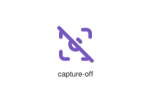
</div>
</div>

{{#endtab}}
{{#tab name="Code"}}

```xml
{{#include ../samples/icons/Tabler-Icons/capture-off-2f0c2188.xal}}
```

{{#endtab}}
{{#endtabs}}

<div class="xal-ref-tag"><code>&lt;item id=&#34;101143&#34; /&gt;</code></div>

</div>
<div class="xal-ref-card">
<div class="xal-ref-title">capture</div>

{{#tabs name="svg-ref-1143"}}
{{#tab name="Preview"}}
<div class="xal-ref-preview">
<div>
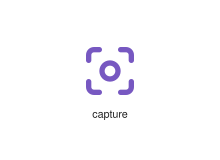
</div>
</div>

{{#endtab}}
{{#tab name="Code"}}

```xml
{{#include ../samples/icons/Tabler-Icons/capture-c6110d7e.xal}}
```

{{#endtab}}
{{#endtabs}}

<div class="xal-ref-tag"><code>&lt;item id=&#34;101142&#34; /&gt;</code></div>

</div>
<div class="xal-ref-card">
<div class="xal-ref-title">car-4wd</div>

{{#tabs name="svg-ref-1144"}}
{{#tab name="Preview"}}
<div class="xal-ref-preview">
<div>
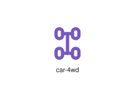
</div>
</div>

{{#endtab}}
{{#tab name="Code"}}

```xml
{{#include ../samples/icons/Tabler-Icons/car-4wd-2d5f0bdb.xal}}
```

{{#endtab}}
{{#endtabs}}

<div class="xal-ref-tag"><code>&lt;item id=&#34;101145&#34; /&gt;</code></div>

</div>
<div class="xal-ref-card">
<div class="xal-ref-title">car-crane</div>

{{#tabs name="svg-ref-1145"}}
{{#tab name="Preview"}}
<div class="xal-ref-preview">
<div>
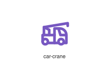
</div>
</div>

{{#endtab}}
{{#tab name="Code"}}

```xml
{{#include ../samples/icons/Tabler-Icons/car-crane-e7f199a4.xal}}
```

{{#endtab}}
{{#endtabs}}

<div class="xal-ref-tag"><code>&lt;item id=&#34;101146&#34; /&gt;</code></div>

</div>
<div class="xal-ref-card">
<div class="xal-ref-title">car-crash</div>

{{#tabs name="svg-ref-1146"}}
{{#tab name="Preview"}}
<div class="xal-ref-preview">
<div>
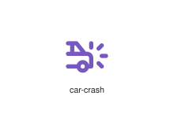
</div>
</div>

{{#endtab}}
{{#tab name="Code"}}

```xml
{{#include ../samples/icons/Tabler-Icons/car-crash-a0294c50.xal}}
```

{{#endtab}}
{{#endtabs}}

<div class="xal-ref-tag"><code>&lt;item id=&#34;101147&#34; /&gt;</code></div>

</div>
<div class="xal-ref-card">
<div class="xal-ref-title">car-fan-1</div>

{{#tabs name="svg-ref-1147"}}
{{#tab name="Preview"}}
<div class="xal-ref-preview">
<div>
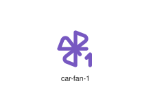
</div>
</div>

{{#endtab}}
{{#tab name="Code"}}

```xml
{{#include ../samples/icons/Tabler-Icons/car-fan-1-ed458b03.xal}}
```

{{#endtab}}
{{#endtabs}}

<div class="xal-ref-tag"><code>&lt;item id=&#34;101149&#34; /&gt;</code></div>

</div>
<div class="xal-ref-card">
<div class="xal-ref-title">car-fan-2</div>

{{#tabs name="svg-ref-1148"}}
{{#tab name="Preview"}}
<div class="xal-ref-preview">
<div>
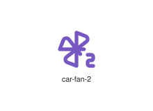
</div>
</div>

{{#endtab}}
{{#tab name="Code"}}

```xml
{{#include ../samples/icons/Tabler-Icons/car-fan-2-aae5f1d3.xal}}
```

{{#endtab}}
{{#endtabs}}

<div class="xal-ref-tag"><code>&lt;item id=&#34;101150&#34; /&gt;</code></div>

</div>
<div class="xal-ref-card">
<div class="xal-ref-title">car-fan-3</div>

{{#tabs name="svg-ref-1149"}}
{{#tab name="Preview"}}
<div class="xal-ref-preview">
<div>
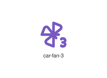
</div>
</div>

{{#endtab}}
{{#tab name="Code"}}

```xml
{{#include ../samples/icons/Tabler-Icons/car-fan-3-9785d863.xal}}
```

{{#endtab}}
{{#endtabs}}

<div class="xal-ref-tag"><code>&lt;item id=&#34;101151&#34; /&gt;</code></div>

</div>
<div class="xal-ref-card">
<div class="xal-ref-title">car-fan-auto</div>

{{#tabs name="svg-ref-1150"}}
{{#tab name="Preview"}}
<div class="xal-ref-preview">
<div>

</div>
</div>

{{#endtab}}
{{#tab name="Code"}}

```xml
{{#include ../samples/icons/Tabler-Icons/car-fan-auto-3ddff3cc.xal}}
```

{{#endtab}}
{{#endtabs}}

<div class="xal-ref-tag"><code>&lt;item id=&#34;101152&#34; /&gt;</code></div>

</div>
<div class="xal-ref-card">
<div class="xal-ref-title">car-fan</div>

{{#tabs name="svg-ref-1151"}}
{{#tab name="Preview"}}
<div class="xal-ref-preview">
<div>
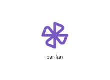
</div>
</div>

{{#endtab}}
{{#tab name="Code"}}

```xml
{{#include ../samples/icons/Tabler-Icons/car-fan-062a0a62.xal}}
```

{{#endtab}}
{{#endtabs}}

<div class="xal-ref-tag"><code>&lt;item id=&#34;101148&#34; /&gt;</code></div>

</div>
<div class="xal-ref-card">
<div class="xal-ref-title">car-garage</div>

{{#tabs name="svg-ref-1152"}}
{{#tab name="Preview"}}
<div class="xal-ref-preview">
<div>
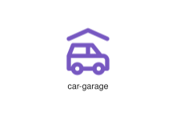
</div>
</div>

{{#endtab}}
{{#tab name="Code"}}

```xml
{{#include ../samples/icons/Tabler-Icons/car-garage-46cceb26.xal}}
```

{{#endtab}}
{{#endtabs}}

<div class="xal-ref-tag"><code>&lt;item id=&#34;101153&#34; /&gt;</code></div>

</div>
<div class="xal-ref-card">
<div class="xal-ref-title">car-off</div>

{{#tabs name="svg-ref-1153"}}
{{#tab name="Preview"}}
<div class="xal-ref-preview">
<div>
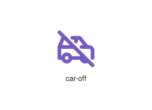
</div>
</div>

{{#endtab}}
{{#tab name="Code"}}

```xml
{{#include ../samples/icons/Tabler-Icons/car-off-bec734c8.xal}}
```

{{#endtab}}
{{#endtabs}}

<div class="xal-ref-tag"><code>&lt;item id=&#34;101154&#34; /&gt;</code></div>

</div>
<div class="xal-ref-card">
<div class="xal-ref-title">car-suv</div>

{{#tabs name="svg-ref-1154"}}
{{#tab name="Preview"}}
<div class="xal-ref-preview">
<div>
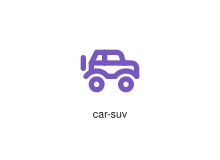
</div>
</div>

{{#endtab}}
{{#tab name="Code"}}

```xml
{{#include ../samples/icons/Tabler-Icons/car-suv-fb1b25c5.xal}}
```

{{#endtab}}
{{#endtabs}}

<div class="xal-ref-tag"><code>&lt;item id=&#34;101155&#34; /&gt;</code></div>

</div>
<div class="xal-ref-card">
<div class="xal-ref-title">car-turbine</div>

{{#tabs name="svg-ref-1155"}}
{{#tab name="Preview"}}
<div class="xal-ref-preview">
<div>
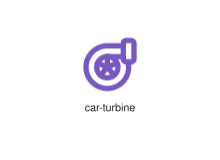
</div>
</div>

{{#endtab}}
{{#tab name="Code"}}

```xml
{{#include ../samples/icons/Tabler-Icons/car-turbine-3def0299.xal}}
```

{{#endtab}}
{{#endtabs}}

<div class="xal-ref-tag"><code>&lt;item id=&#34;101156&#34; /&gt;</code></div>

</div>
<div class="xal-ref-card">
<div class="xal-ref-title">car</div>

{{#tabs name="svg-ref-1156"}}
{{#tab name="Preview"}}
<div class="xal-ref-preview">
<div>
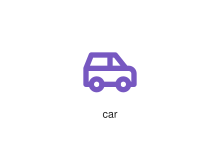
</div>
</div>

{{#endtab}}
{{#tab name="Code"}}

```xml
{{#include ../samples/icons/Tabler-Icons/car-0841d0e4.xal}}
```

{{#endtab}}
{{#endtabs}}

<div class="xal-ref-tag"><code>&lt;item id=&#34;101144&#34; /&gt;</code></div>

</div>
<div class="xal-ref-card">
<div class="xal-ref-title">carambola</div>

{{#tabs name="svg-ref-1157"}}
{{#tab name="Preview"}}
<div class="xal-ref-preview">
<div>
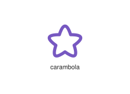
</div>
</div>

{{#endtab}}
{{#tab name="Code"}}

```xml
{{#include ../samples/icons/Tabler-Icons/carambola-3f79e8a5.xal}}
```

{{#endtab}}
{{#endtabs}}

<div class="xal-ref-tag"><code>&lt;item id=&#34;101157&#34; /&gt;</code></div>

</div>
<div class="xal-ref-card">
<div class="xal-ref-title">caravan</div>

{{#tabs name="svg-ref-1158"}}
{{#tab name="Preview"}}
<div class="xal-ref-preview">
<div>
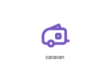
</div>
</div>

{{#endtab}}
{{#tab name="Code"}}

```xml
{{#include ../samples/icons/Tabler-Icons/caravan-1fc6410e.xal}}
```

{{#endtab}}
{{#endtabs}}

<div class="xal-ref-tag"><code>&lt;item id=&#34;101158&#34; /&gt;</code></div>

</div>
<div class="xal-ref-card">
<div class="xal-ref-title">cardboards-off</div>

{{#tabs name="svg-ref-1159"}}
{{#tab name="Preview"}}
<div class="xal-ref-preview">
<div>

</div>
</div>

{{#endtab}}
{{#tab name="Code"}}

```xml
{{#include ../samples/icons/Tabler-Icons/cardboards-off-ef478154.xal}}
```

{{#endtab}}
{{#endtabs}}

<div class="xal-ref-tag"><code>&lt;item id=&#34;101160&#34; /&gt;</code></div>

</div>
<div class="xal-ref-card">
<div class="xal-ref-title">cardboards</div>

{{#tabs name="svg-ref-1160"}}
{{#tab name="Preview"}}
<div class="xal-ref-preview">
<div>

</div>
</div>

{{#endtab}}
{{#tab name="Code"}}

```xml
{{#include ../samples/icons/Tabler-Icons/cardboards-08147c8d.xal}}
```

{{#endtab}}
{{#endtabs}}

<div class="xal-ref-tag"><code>&lt;item id=&#34;101159&#34; /&gt;</code></div>

</div>
<div class="xal-ref-card">
<div class="xal-ref-title">cards</div>

{{#tabs name="svg-ref-1161"}}
{{#tab name="Preview"}}
<div class="xal-ref-preview">
<div>
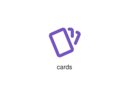
</div>
</div>

{{#endtab}}
{{#tab name="Code"}}

```xml
{{#include ../samples/icons/Tabler-Icons/cards-ecfed1e2.xal}}
```

{{#endtab}}
{{#endtabs}}

<div class="xal-ref-tag"><code>&lt;item id=&#34;101161&#34; /&gt;</code></div>

</div>
<div class="xal-ref-card">
<div class="xal-ref-title">caret-down</div>

{{#tabs name="svg-ref-1162"}}
{{#tab name="Preview"}}
<div class="xal-ref-preview">
<div>
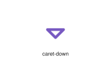
</div>
</div>

{{#endtab}}
{{#tab name="Code"}}

```xml
{{#include ../samples/icons/Tabler-Icons/caret-down-4095a90f.xal}}
```

{{#endtab}}
{{#endtabs}}

<div class="xal-ref-tag"><code>&lt;item id=&#34;101162&#34; /&gt;</code></div>

</div>
<div class="xal-ref-card">
<div class="xal-ref-title">caret-left-right</div>

{{#tabs name="svg-ref-1163"}}
{{#tab name="Preview"}}
<div class="xal-ref-preview">
<div>
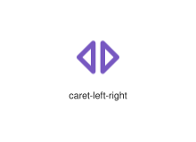
</div>
</div>

{{#endtab}}
{{#tab name="Code"}}

```xml
{{#include ../samples/icons/Tabler-Icons/caret-left-right-188e547b.xal}}
```

{{#endtab}}
{{#endtabs}}

<div class="xal-ref-tag"><code>&lt;item id=&#34;101164&#34; /&gt;</code></div>

</div>
<div class="xal-ref-card">
<div class="xal-ref-title">caret-left</div>

{{#tabs name="svg-ref-1164"}}
{{#tab name="Preview"}}
<div class="xal-ref-preview">
<div>
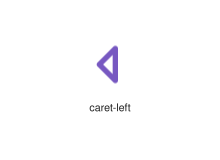
</div>
</div>

{{#endtab}}
{{#tab name="Code"}}

```xml
{{#include ../samples/icons/Tabler-Icons/caret-left-d5dab3e9.xal}}
```

{{#endtab}}
{{#endtabs}}

<div class="xal-ref-tag"><code>&lt;item id=&#34;101163&#34; /&gt;</code></div>

</div>
<div class="xal-ref-card">
<div class="xal-ref-title">caret-right</div>

{{#tabs name="svg-ref-1165"}}
{{#tab name="Preview"}}
<div class="xal-ref-preview">
<div>

</div>
</div>

{{#endtab}}
{{#tab name="Code"}}

```xml
{{#include ../samples/icons/Tabler-Icons/caret-right-27cf3f0f.xal}}
```

{{#endtab}}
{{#endtabs}}

<div class="xal-ref-tag"><code>&lt;item id=&#34;101165&#34; /&gt;</code></div>

</div>
<div class="xal-ref-card">
<div class="xal-ref-title">caret-up-down</div>

{{#tabs name="svg-ref-1166"}}
{{#tab name="Preview"}}
<div class="xal-ref-preview">
<div>
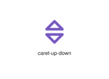
</div>
</div>

{{#endtab}}
{{#tab name="Code"}}

```xml
{{#include ../samples/icons/Tabler-Icons/caret-up-down-f7b9e3e7.xal}}
```

{{#endtab}}
{{#endtabs}}

<div class="xal-ref-tag"><code>&lt;item id=&#34;101167&#34; /&gt;</code></div>

</div>
<div class="xal-ref-card">
<div class="xal-ref-title">caret-up</div>

{{#tabs name="svg-ref-1167"}}
{{#tab name="Preview"}}
<div class="xal-ref-preview">
<div>
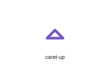
</div>
</div>

{{#endtab}}
{{#tab name="Code"}}

```xml
{{#include ../samples/icons/Tabler-Icons/caret-up-f8560c3a.xal}}
```

{{#endtab}}
{{#endtabs}}

<div class="xal-ref-tag"><code>&lt;item id=&#34;101166&#34; /&gt;</code></div>

</div>
<div class="xal-ref-card">
<div class="xal-ref-title">carousel-horizontal</div>

{{#tabs name="svg-ref-1168"}}
{{#tab name="Preview"}}
<div class="xal-ref-preview">
<div>
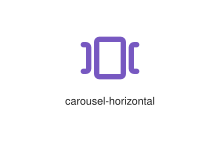
</div>
</div>

{{#endtab}}
{{#tab name="Code"}}

```xml
{{#include ../samples/icons/Tabler-Icons/carousel-horizontal-e52b9377.xal}}
```

{{#endtab}}
{{#endtabs}}

<div class="xal-ref-tag"><code>&lt;item id=&#34;101168&#34; /&gt;</code></div>

</div>
<div class="xal-ref-card">
<div class="xal-ref-title">carousel-vertical</div>

{{#tabs name="svg-ref-1169"}}
{{#tab name="Preview"}}
<div class="xal-ref-preview">
<div>
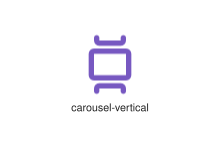
</div>
</div>

{{#endtab}}
{{#tab name="Code"}}

```xml
{{#include ../samples/icons/Tabler-Icons/carousel-vertical-ee6ce0ec.xal}}
```

{{#endtab}}
{{#endtabs}}

<div class="xal-ref-tag"><code>&lt;item id=&#34;101169&#34; /&gt;</code></div>

</div>
</div>
