# Tabler-Icons - Page 14

This page references SVG files under `etc/resources/aws/svg/Tabler-Icons`.
Each card shows the SVG preview first and the XAL tag syntax in the Code tab.
Showing 1171-1260 of 4964 SVG files.

<style>
.xal-ref-grid{display:grid;grid-template-columns:repeat(3,minmax(0,1fr));gap:1rem;margin:1rem 0 1.5rem}.xal-ref-card{border:1px solid var(--table-border-color);border-radius:8px;overflow:hidden;background:var(--bg);padding:.75rem}.xal-ref-title{font-size:.9rem;font-weight:600;line-height:1.25;margin:0 0 .5rem;overflow-wrap:anywhere}.xal-ref-preview{display:flex;align-items:center;justify-content:center}.xal-ref-preview img{display:block;width:100%;height:auto}.xal-ref-card pre{margin:0;max-height:18rem;overflow:auto;white-space:pre}.xal-ref-card code{font-size:.78em}.xal-ref-tag{margin:.5rem 0 0;color:var(--fg);opacity:.72;overflow:auto;white-space:pre}.xal-ref-tag code{font-size:.72em}@media(max-width:900px){.xal-ref-grid{grid-template-columns:repeat(2,minmax(0,1fr))}}@media(max-width:560px){.xal-ref-grid{grid-template-columns:1fr}}
</style>

[Back to section index](tabler-icons.md)

<div class="xal-ref-grid">
<div class="xal-ref-card">
<div class="xal-ref-title">carrot-off</div>

{{#tabs name="svg-ref-1170"}}
{{#tab name="Preview"}}
<div class="xal-ref-preview">
<div>
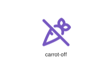
</div>
</div>

{{#endtab}}
{{#tab name="Code"}}

```xml
{{#include ../samples/icons/Tabler-Icons/carrot-off-08cfb64c.xal}}
```

{{#endtab}}
{{#endtabs}}

<div class="xal-ref-tag"><code>&lt;item id=&#34;101171&#34; /&gt;</code></div>

</div>
<div class="xal-ref-card">
<div class="xal-ref-title">carrot</div>

{{#tabs name="svg-ref-1171"}}
{{#tab name="Preview"}}
<div class="xal-ref-preview">
<div>
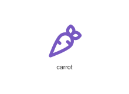
</div>
</div>

{{#endtab}}
{{#tab name="Code"}}

```xml
{{#include ../samples/icons/Tabler-Icons/carrot-21f0ec09.xal}}
```

{{#endtab}}
{{#endtabs}}

<div class="xal-ref-tag"><code>&lt;item id=&#34;101170&#34; /&gt;</code></div>

</div>
<div class="xal-ref-card">
<div class="xal-ref-title">cash-banknote-edit</div>

{{#tabs name="svg-ref-1172"}}
{{#tab name="Preview"}}
<div class="xal-ref-preview">
<div>

</div>
</div>

{{#endtab}}
{{#tab name="Code"}}

```xml
{{#include ../samples/icons/Tabler-Icons/cash-banknote-edit-2c4341e6.xal}}
```

{{#endtab}}
{{#endtabs}}

<div class="xal-ref-tag"><code>&lt;item id=&#34;101174&#34; /&gt;</code></div>

</div>
<div class="xal-ref-card">
<div class="xal-ref-title">cash-banknote-heart</div>

{{#tabs name="svg-ref-1173"}}
{{#tab name="Preview"}}
<div class="xal-ref-preview">
<div>

</div>
</div>

{{#endtab}}
{{#tab name="Code"}}

```xml
{{#include ../samples/icons/Tabler-Icons/cash-banknote-heart-8e14b427.xal}}
```

{{#endtab}}
{{#endtabs}}

<div class="xal-ref-tag"><code>&lt;item id=&#34;101175&#34; /&gt;</code></div>

</div>
<div class="xal-ref-card">
<div class="xal-ref-title">cash-banknote-minus</div>

{{#tabs name="svg-ref-1174"}}
{{#tab name="Preview"}}
<div class="xal-ref-preview">
<div>

</div>
</div>

{{#endtab}}
{{#tab name="Code"}}

```xml
{{#include ../samples/icons/Tabler-Icons/cash-banknote-minus-ca417866.xal}}
```

{{#endtab}}
{{#endtabs}}

<div class="xal-ref-tag"><code>&lt;item id=&#34;101176&#34; /&gt;</code></div>

</div>
<div class="xal-ref-card">
<div class="xal-ref-title">cash-banknote-move-back</div>

{{#tabs name="svg-ref-1175"}}
{{#tab name="Preview"}}
<div class="xal-ref-preview">
<div>

</div>
</div>

{{#endtab}}
{{#tab name="Code"}}

```xml
{{#include ../samples/icons/Tabler-Icons/cash-banknote-move-back-357f8040.xal}}
```

{{#endtab}}
{{#endtabs}}

<div class="xal-ref-tag"><code>&lt;item id=&#34;101178&#34; /&gt;</code></div>

</div>
<div class="xal-ref-card">
<div class="xal-ref-title">cash-banknote-move</div>

{{#tabs name="svg-ref-1176"}}
{{#tab name="Preview"}}
<div class="xal-ref-preview">
<div>

</div>
</div>

{{#endtab}}
{{#tab name="Code"}}

```xml
{{#include ../samples/icons/Tabler-Icons/cash-banknote-move-52a100d5.xal}}
```

{{#endtab}}
{{#endtabs}}

<div class="xal-ref-tag"><code>&lt;item id=&#34;101177&#34; /&gt;</code></div>

</div>
<div class="xal-ref-card">
<div class="xal-ref-title">cash-banknote-off</div>

{{#tabs name="svg-ref-1177"}}
{{#tab name="Preview"}}
<div class="xal-ref-preview">
<div>

</div>
</div>

{{#endtab}}
{{#tab name="Code"}}

```xml
{{#include ../samples/icons/Tabler-Icons/cash-banknote-off-294ef2f9.xal}}
```

{{#endtab}}
{{#endtabs}}

<div class="xal-ref-tag"><code>&lt;item id=&#34;101179&#34; /&gt;</code></div>

</div>
<div class="xal-ref-card">
<div class="xal-ref-title">cash-banknote-plus</div>

{{#tabs name="svg-ref-1178"}}
{{#tab name="Preview"}}
<div class="xal-ref-preview">
<div>

</div>
</div>

{{#endtab}}
{{#tab name="Code"}}

```xml
{{#include ../samples/icons/Tabler-Icons/cash-banknote-plus-edc32e3e.xal}}
```

{{#endtab}}
{{#endtabs}}

<div class="xal-ref-tag"><code>&lt;item id=&#34;101180&#34; /&gt;</code></div>

</div>
<div class="xal-ref-card">
<div class="xal-ref-title">cash-banknote</div>

{{#tabs name="svg-ref-1179"}}
{{#tab name="Preview"}}
<div class="xal-ref-preview">
<div>

</div>
</div>

{{#endtab}}
{{#tab name="Code"}}

```xml
{{#include ../samples/icons/Tabler-Icons/cash-banknote-df147ea4.xal}}
```

{{#endtab}}
{{#endtabs}}

<div class="xal-ref-tag"><code>&lt;item id=&#34;101173&#34; /&gt;</code></div>

</div>
<div class="xal-ref-card">
<div class="xal-ref-title">cash-edit</div>

{{#tabs name="svg-ref-1180"}}
{{#tab name="Preview"}}
<div class="xal-ref-preview">
<div>

</div>
</div>

{{#endtab}}
{{#tab name="Code"}}

```xml
{{#include ../samples/icons/Tabler-Icons/cash-edit-2c7fcb0a.xal}}
```

{{#endtab}}
{{#endtabs}}

<div class="xal-ref-tag"><code>&lt;item id=&#34;101181&#34; /&gt;</code></div>

</div>
<div class="xal-ref-card">
<div class="xal-ref-title">cash-heart</div>

{{#tabs name="svg-ref-1181"}}
{{#tab name="Preview"}}
<div class="xal-ref-preview">
<div>

</div>
</div>

{{#endtab}}
{{#tab name="Code"}}

```xml
{{#include ../samples/icons/Tabler-Icons/cash-heart-27a826fe.xal}}
```

{{#endtab}}
{{#endtabs}}

<div class="xal-ref-tag"><code>&lt;item id=&#34;101182&#34; /&gt;</code></div>

</div>
<div class="xal-ref-card">
<div class="xal-ref-title">cash-minus</div>

{{#tabs name="svg-ref-1182"}}
{{#tab name="Preview"}}
<div class="xal-ref-preview">
<div>

</div>
</div>

{{#endtab}}
{{#tab name="Code"}}

```xml
{{#include ../samples/icons/Tabler-Icons/cash-minus-63fdeabf.xal}}
```

{{#endtab}}
{{#endtabs}}

<div class="xal-ref-tag"><code>&lt;item id=&#34;101183&#34; /&gt;</code></div>

</div>
<div class="xal-ref-card">
<div class="xal-ref-title">cash-move-back</div>

{{#tabs name="svg-ref-1183"}}
{{#tab name="Preview"}}
<div class="xal-ref-preview">
<div>

</div>
</div>

{{#endtab}}
{{#tab name="Code"}}

```xml
{{#include ../samples/icons/Tabler-Icons/cash-move-back-77cee035.xal}}
```

{{#endtab}}
{{#endtabs}}

<div class="xal-ref-tag"><code>&lt;item id=&#34;101185&#34; /&gt;</code></div>

</div>
<div class="xal-ref-card">
<div class="xal-ref-title">cash-move</div>

{{#tabs name="svg-ref-1184"}}
{{#tab name="Preview"}}
<div class="xal-ref-preview">
<div>

</div>
</div>

{{#endtab}}
{{#tab name="Code"}}

```xml
{{#include ../samples/icons/Tabler-Icons/cash-move-529d8a39.xal}}
```

{{#endtab}}
{{#endtabs}}

<div class="xal-ref-tag"><code>&lt;item id=&#34;101184&#34; /&gt;</code></div>

</div>
<div class="xal-ref-card">
<div class="xal-ref-title">cash-off</div>

{{#tabs name="svg-ref-1185"}}
{{#tab name="Preview"}}
<div class="xal-ref-preview">
<div>

</div>
</div>

{{#endtab}}
{{#tab name="Code"}}

```xml
{{#include ../samples/icons/Tabler-Icons/cash-off-15c41ef9.xal}}
```

{{#endtab}}
{{#endtabs}}

<div class="xal-ref-tag"><code>&lt;item id=&#34;101186&#34; /&gt;</code></div>

</div>
<div class="xal-ref-card">
<div class="xal-ref-title">cash-plus</div>

{{#tabs name="svg-ref-1186"}}
{{#tab name="Preview"}}
<div class="xal-ref-preview">
<div>

</div>
</div>

{{#endtab}}
{{#tab name="Code"}}

```xml
{{#include ../samples/icons/Tabler-Icons/cash-plus-edffa4d2.xal}}
```

{{#endtab}}
{{#endtabs}}

<div class="xal-ref-tag"><code>&lt;item id=&#34;101187&#34; /&gt;</code></div>

</div>
<div class="xal-ref-card">
<div class="xal-ref-title">cash-register</div>

{{#tabs name="svg-ref-1187"}}
{{#tab name="Preview"}}
<div class="xal-ref-preview">
<div>

</div>
</div>

{{#endtab}}
{{#tab name="Code"}}

```xml
{{#include ../samples/icons/Tabler-Icons/cash-register-291b95f4.xal}}
```

{{#endtab}}
{{#endtabs}}

<div class="xal-ref-tag"><code>&lt;item id=&#34;101188&#34; /&gt;</code></div>

</div>
<div class="xal-ref-card">
<div class="xal-ref-title">cash</div>

{{#tabs name="svg-ref-1188"}}
{{#tab name="Preview"}}
<div class="xal-ref-preview">
<div>

</div>
</div>

{{#endtab}}
{{#tab name="Code"}}

```xml
{{#include ../samples/icons/Tabler-Icons/cash-d621340f.xal}}
```

{{#endtab}}
{{#endtabs}}

<div class="xal-ref-tag"><code>&lt;item id=&#34;101172&#34; /&gt;</code></div>

</div>
<div class="xal-ref-card">
<div class="xal-ref-title">cast-off</div>

{{#tabs name="svg-ref-1189"}}
{{#tab name="Preview"}}
<div class="xal-ref-preview">
<div>

</div>
</div>

{{#endtab}}
{{#tab name="Code"}}

```xml
{{#include ../samples/icons/Tabler-Icons/cast-off-5f30af9c.xal}}
```

{{#endtab}}
{{#endtabs}}

<div class="xal-ref-tag"><code>&lt;item id=&#34;101190&#34; /&gt;</code></div>

</div>
<div class="xal-ref-card">
<div class="xal-ref-title">cast</div>

{{#tabs name="svg-ref-1190"}}
{{#tab name="Preview"}}
<div class="xal-ref-preview">
<div>

</div>
</div>

{{#endtab}}
{{#tab name="Code"}}

```xml
{{#include ../samples/icons/Tabler-Icons/cast-73314e8c.xal}}
```

{{#endtab}}
{{#endtabs}}

<div class="xal-ref-tag"><code>&lt;item id=&#34;101189&#34; /&gt;</code></div>

</div>
<div class="xal-ref-card">
<div class="xal-ref-title">cat</div>

{{#tabs name="svg-ref-1191"}}
{{#tab name="Preview"}}
<div class="xal-ref-preview">
<div>
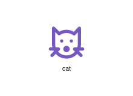
</div>
</div>

{{#endtab}}
{{#tab name="Code"}}

```xml
{{#include ../samples/icons/Tabler-Icons/cat-87012544.xal}}
```

{{#endtab}}
{{#endtabs}}

<div class="xal-ref-tag"><code>&lt;item id=&#34;101191&#34; /&gt;</code></div>

</div>
<div class="xal-ref-card">
<div class="xal-ref-title">category-2</div>

{{#tabs name="svg-ref-1192"}}
{{#tab name="Preview"}}
<div class="xal-ref-preview">
<div>
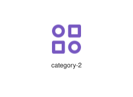
</div>
</div>

{{#endtab}}
{{#tab name="Code"}}

```xml
{{#include ../samples/icons/Tabler-Icons/category-2-7d798586.xal}}
```

{{#endtab}}
{{#endtabs}}

<div class="xal-ref-tag"><code>&lt;item id=&#34;101193&#34; /&gt;</code></div>

</div>
<div class="xal-ref-card">
<div class="xal-ref-title">category-minus</div>

{{#tabs name="svg-ref-1193"}}
{{#tab name="Preview"}}
<div class="xal-ref-preview">
<div>

</div>
</div>

{{#endtab}}
{{#tab name="Code"}}

```xml
{{#include ../samples/icons/Tabler-Icons/category-minus-f966ff90.xal}}
```

{{#endtab}}
{{#endtabs}}

<div class="xal-ref-tag"><code>&lt;item id=&#34;101194&#34; /&gt;</code></div>

</div>
<div class="xal-ref-card">
<div class="xal-ref-title">category-plus</div>

{{#tabs name="svg-ref-1194"}}
{{#tab name="Preview"}}
<div class="xal-ref-preview">
<div>

</div>
</div>

{{#endtab}}
{{#tab name="Code"}}

```xml
{{#include ../samples/icons/Tabler-Icons/category-plus-c9593d53.xal}}
```

{{#endtab}}
{{#endtabs}}

<div class="xal-ref-tag"><code>&lt;item id=&#34;101195&#34; /&gt;</code></div>

</div>
<div class="xal-ref-card">
<div class="xal-ref-title">category</div>

{{#tabs name="svg-ref-1195"}}
{{#tab name="Preview"}}
<div class="xal-ref-preview">
<div>

</div>
</div>

{{#endtab}}
{{#tab name="Code"}}

```xml
{{#include ../samples/icons/Tabler-Icons/category-c4fd7c2c.xal}}
```

{{#endtab}}
{{#endtabs}}

<div class="xal-ref-tag"><code>&lt;item id=&#34;101192&#34; /&gt;</code></div>

</div>
<div class="xal-ref-card">
<div class="xal-ref-title">ce-off</div>

{{#tabs name="svg-ref-1196"}}
{{#tab name="Preview"}}
<div class="xal-ref-preview">
<div>
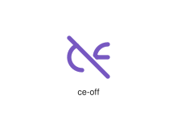
</div>
</div>

{{#endtab}}
{{#tab name="Code"}}

```xml
{{#include ../samples/icons/Tabler-Icons/ce-off-cb3c344b.xal}}
```

{{#endtab}}
{{#endtabs}}

<div class="xal-ref-tag"><code>&lt;item id=&#34;101197&#34; /&gt;</code></div>

</div>
<div class="xal-ref-card">
<div class="xal-ref-title">ce</div>

{{#tabs name="svg-ref-1197"}}
{{#tab name="Preview"}}
<div class="xal-ref-preview">
<div>
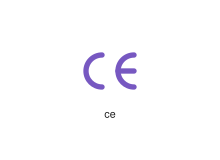
</div>
</div>

{{#endtab}}
{{#tab name="Code"}}

```xml
{{#include ../samples/icons/Tabler-Icons/ce-247fc682.xal}}
```

{{#endtab}}
{{#endtabs}}

<div class="xal-ref-tag"><code>&lt;item id=&#34;101196&#34; /&gt;</code></div>

</div>
<div class="xal-ref-card">
<div class="xal-ref-title">cell-signal-1</div>

{{#tabs name="svg-ref-1198"}}
{{#tab name="Preview"}}
<div class="xal-ref-preview">
<div>

</div>
</div>

{{#endtab}}
{{#tab name="Code"}}

```xml
{{#include ../samples/icons/Tabler-Icons/cell-signal-1-9745f7bc.xal}}
```

{{#endtab}}
{{#endtabs}}

<div class="xal-ref-tag"><code>&lt;item id=&#34;101199&#34; /&gt;</code></div>

</div>
<div class="xal-ref-card">
<div class="xal-ref-title">cell-signal-2</div>

{{#tabs name="svg-ref-1199"}}
{{#tab name="Preview"}}
<div class="xal-ref-preview">
<div>
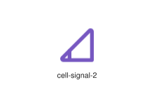
</div>
</div>

{{#endtab}}
{{#tab name="Code"}}

```xml
{{#include ../samples/icons/Tabler-Icons/cell-signal-2-d0e58d6c.xal}}
```

{{#endtab}}
{{#endtabs}}

<div class="xal-ref-tag"><code>&lt;item id=&#34;101200&#34; /&gt;</code></div>

</div>
<div class="xal-ref-card">
<div class="xal-ref-title">cell-signal-3</div>

{{#tabs name="svg-ref-1200"}}
{{#tab name="Preview"}}
<div class="xal-ref-preview">
<div>
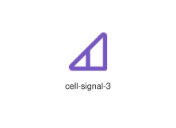
</div>
</div>

{{#endtab}}
{{#tab name="Code"}}

```xml
{{#include ../samples/icons/Tabler-Icons/cell-signal-3-ed85a4dc.xal}}
```

{{#endtab}}
{{#endtabs}}

<div class="xal-ref-tag"><code>&lt;item id=&#34;101201&#34; /&gt;</code></div>

</div>
<div class="xal-ref-card">
<div class="xal-ref-title">cell-signal-4</div>

{{#tabs name="svg-ref-1201"}}
{{#tab name="Preview"}}
<div class="xal-ref-preview">
<div>
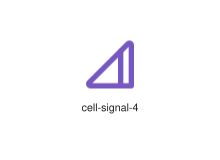
</div>
</div>

{{#endtab}}
{{#tab name="Code"}}

```xml
{{#include ../samples/icons/Tabler-Icons/cell-signal-4-5fa578cc.xal}}
```

{{#endtab}}
{{#endtabs}}

<div class="xal-ref-tag"><code>&lt;item id=&#34;101202&#34; /&gt;</code></div>

</div>
<div class="xal-ref-card">
<div class="xal-ref-title">cell-signal-5</div>

{{#tabs name="svg-ref-1202"}}
{{#tab name="Preview"}}
<div class="xal-ref-preview">
<div>
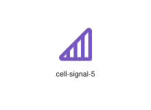
</div>
</div>

{{#endtab}}
{{#tab name="Code"}}

```xml
{{#include ../samples/icons/Tabler-Icons/cell-signal-5-62c5517c.xal}}
```

{{#endtab}}
{{#endtabs}}

<div class="xal-ref-tag"><code>&lt;item id=&#34;101203&#34; /&gt;</code></div>

</div>
<div class="xal-ref-card">
<div class="xal-ref-title">cell-signal-off</div>

{{#tabs name="svg-ref-1203"}}
{{#tab name="Preview"}}
<div class="xal-ref-preview">
<div>
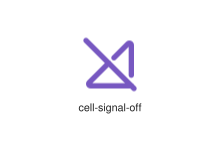
</div>
</div>

{{#endtab}}
{{#tab name="Code"}}

```xml
{{#include ../samples/icons/Tabler-Icons/cell-signal-off-adb407c2.xal}}
```

{{#endtab}}
{{#endtabs}}

<div class="xal-ref-tag"><code>&lt;item id=&#34;101204&#34; /&gt;</code></div>

</div>
<div class="xal-ref-card">
<div class="xal-ref-title">cell</div>

{{#tabs name="svg-ref-1204"}}
{{#tab name="Preview"}}
<div class="xal-ref-preview">
<div>
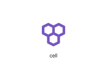
</div>
</div>

{{#endtab}}
{{#tab name="Code"}}

```xml
{{#include ../samples/icons/Tabler-Icons/cell-256e0692.xal}}
```

{{#endtab}}
{{#endtabs}}

<div class="xal-ref-tag"><code>&lt;item id=&#34;101198&#34; /&gt;</code></div>

</div>
<div class="xal-ref-card">
<div class="xal-ref-title">certificate-2-off</div>

{{#tabs name="svg-ref-1205"}}
{{#tab name="Preview"}}
<div class="xal-ref-preview">
<div>

</div>
</div>

{{#endtab}}
{{#tab name="Code"}}

```xml
{{#include ../samples/icons/Tabler-Icons/certificate-2-off-6dfab488.xal}}
```

{{#endtab}}
{{#endtabs}}

<div class="xal-ref-tag"><code>&lt;item id=&#34;101207&#34; /&gt;</code></div>

</div>
<div class="xal-ref-card">
<div class="xal-ref-title">certificate-2</div>

{{#tabs name="svg-ref-1206"}}
{{#tab name="Preview"}}
<div class="xal-ref-preview">
<div>

</div>
</div>

{{#endtab}}
{{#tab name="Code"}}

```xml
{{#include ../samples/icons/Tabler-Icons/certificate-2-b2015cea.xal}}
```

{{#endtab}}
{{#endtabs}}

<div class="xal-ref-tag"><code>&lt;item id=&#34;101206&#34; /&gt;</code></div>

</div>
<div class="xal-ref-card">
<div class="xal-ref-title">certificate-off</div>

{{#tabs name="svg-ref-1207"}}
{{#tab name="Preview"}}
<div class="xal-ref-preview">
<div>

</div>
</div>

{{#endtab}}
{{#tab name="Code"}}

```xml
{{#include ../samples/icons/Tabler-Icons/certificate-off-31b9b8a9.xal}}
```

{{#endtab}}
{{#endtabs}}

<div class="xal-ref-tag"><code>&lt;item id=&#34;101208&#34; /&gt;</code></div>

</div>
<div class="xal-ref-card">
<div class="xal-ref-title">certificate</div>

{{#tabs name="svg-ref-1208"}}
{{#tab name="Preview"}}
<div class="xal-ref-preview">
<div>

</div>
</div>

{{#endtab}}
{{#tab name="Code"}}

```xml
{{#include ../samples/icons/Tabler-Icons/certificate-5ff7ed90.xal}}
```

{{#endtab}}
{{#endtabs}}

<div class="xal-ref-tag"><code>&lt;item id=&#34;101205&#34; /&gt;</code></div>

</div>
<div class="xal-ref-card">
<div class="xal-ref-title">chair-director</div>

{{#tabs name="svg-ref-1209"}}
{{#tab name="Preview"}}
<div class="xal-ref-preview">
<div>

</div>
</div>

{{#endtab}}
{{#tab name="Code"}}

```xml
{{#include ../samples/icons/Tabler-Icons/chair-director-0dcc63cf.xal}}
```

{{#endtab}}
{{#endtabs}}

<div class="xal-ref-tag"><code>&lt;item id=&#34;101209&#34; /&gt;</code></div>

</div>
<div class="xal-ref-card">
<div class="xal-ref-title">chalkboard-off</div>

{{#tabs name="svg-ref-1210"}}
{{#tab name="Preview"}}
<div class="xal-ref-preview">
<div>

</div>
</div>

{{#endtab}}
{{#tab name="Code"}}

```xml
{{#include ../samples/icons/Tabler-Icons/chalkboard-off-5bd9739f.xal}}
```

{{#endtab}}
{{#endtabs}}

<div class="xal-ref-tag"><code>&lt;item id=&#34;101211&#34; /&gt;</code></div>

</div>
<div class="xal-ref-card">
<div class="xal-ref-title">chalkboard-teacher</div>

{{#tabs name="svg-ref-1211"}}
{{#tab name="Preview"}}
<div class="xal-ref-preview">
<div>

</div>
</div>

{{#endtab}}
{{#tab name="Code"}}

```xml
{{#include ../samples/icons/Tabler-Icons/chalkboard-teacher-7af8c8c8.xal}}
```

{{#endtab}}
{{#endtabs}}

<div class="xal-ref-tag"><code>&lt;item id=&#34;101212&#34; /&gt;</code></div>

</div>
<div class="xal-ref-card">
<div class="xal-ref-title">chalkboard</div>

{{#tabs name="svg-ref-1212"}}
{{#tab name="Preview"}}
<div class="xal-ref-preview">
<div>

</div>
</div>

{{#endtab}}
{{#tab name="Code"}}

```xml
{{#include ../samples/icons/Tabler-Icons/chalkboard-076d5ac4.xal}}
```

{{#endtab}}
{{#endtabs}}

<div class="xal-ref-tag"><code>&lt;item id=&#34;101210&#34; /&gt;</code></div>

</div>
<div class="xal-ref-card">
<div class="xal-ref-title">charging-pile</div>

{{#tabs name="svg-ref-1213"}}
{{#tab name="Preview"}}
<div class="xal-ref-preview">
<div>

</div>
</div>

{{#endtab}}
{{#tab name="Code"}}

```xml
{{#include ../samples/icons/Tabler-Icons/charging-pile-8b4fd884.xal}}
```

{{#endtab}}
{{#endtabs}}

<div class="xal-ref-tag"><code>&lt;item id=&#34;101213&#34; /&gt;</code></div>

</div>
<div class="xal-ref-card">
<div class="xal-ref-title">chart-arcs-3</div>

{{#tabs name="svg-ref-1214"}}
{{#tab name="Preview"}}
<div class="xal-ref-preview">
<div>
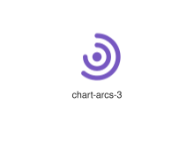
</div>
</div>

{{#endtab}}
{{#tab name="Code"}}

```xml
{{#include ../samples/icons/Tabler-Icons/chart-arcs-3-e8827b83.xal}}
```

{{#endtab}}
{{#endtabs}}

<div class="xal-ref-tag"><code>&lt;item id=&#34;101215&#34; /&gt;</code></div>

</div>
<div class="xal-ref-card">
<div class="xal-ref-title">chart-arcs</div>

{{#tabs name="svg-ref-1215"}}
{{#tab name="Preview"}}
<div class="xal-ref-preview">
<div>
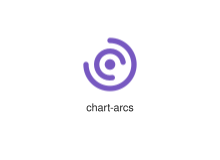
</div>
</div>

{{#endtab}}
{{#tab name="Code"}}

```xml
{{#include ../samples/icons/Tabler-Icons/chart-arcs-7595ad77.xal}}
```

{{#endtab}}
{{#endtabs}}

<div class="xal-ref-tag"><code>&lt;item id=&#34;101214&#34; /&gt;</code></div>

</div>
<div class="xal-ref-card">
<div class="xal-ref-title">chart-area-line</div>

{{#tabs name="svg-ref-1216"}}
{{#tab name="Preview"}}
<div class="xal-ref-preview">
<div>
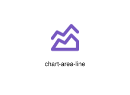
</div>
</div>

{{#endtab}}
{{#tab name="Code"}}

```xml
{{#include ../samples/icons/Tabler-Icons/chart-area-line-971b183b.xal}}
```

{{#endtab}}
{{#endtabs}}

<div class="xal-ref-tag"><code>&lt;item id=&#34;101217&#34; /&gt;</code></div>

</div>
<div class="xal-ref-card">
<div class="xal-ref-title">chart-area</div>

{{#tabs name="svg-ref-1217"}}
{{#tab name="Preview"}}
<div class="xal-ref-preview">
<div>
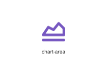
</div>
</div>

{{#endtab}}
{{#tab name="Code"}}

```xml
{{#include ../samples/icons/Tabler-Icons/chart-area-b9ec8a88.xal}}
```

{{#endtab}}
{{#endtabs}}

<div class="xal-ref-tag"><code>&lt;item id=&#34;101216&#34; /&gt;</code></div>

</div>
<div class="xal-ref-card">
<div class="xal-ref-title">chart-arrows-vertical</div>

{{#tabs name="svg-ref-1218"}}
{{#tab name="Preview"}}
<div class="xal-ref-preview">
<div>
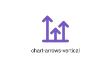
</div>
</div>

{{#endtab}}
{{#tab name="Code"}}

```xml
{{#include ../samples/icons/Tabler-Icons/chart-arrows-vertical-fc64f8de.xal}}
```

{{#endtab}}
{{#endtabs}}

<div class="xal-ref-tag"><code>&lt;item id=&#34;101219&#34; /&gt;</code></div>

</div>
<div class="xal-ref-card">
<div class="xal-ref-title">chart-arrows</div>

{{#tabs name="svg-ref-1219"}}
{{#tab name="Preview"}}
<div class="xal-ref-preview">
<div>
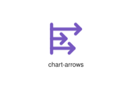
</div>
</div>

{{#endtab}}
{{#tab name="Code"}}

```xml
{{#include ../samples/icons/Tabler-Icons/chart-arrows-0d0bcf54.xal}}
```

{{#endtab}}
{{#endtabs}}

<div class="xal-ref-tag"><code>&lt;item id=&#34;101218&#34; /&gt;</code></div>

</div>
<div class="xal-ref-card">
<div class="xal-ref-title">chart-bar-off</div>

{{#tabs name="svg-ref-1220"}}
{{#tab name="Preview"}}
<div class="xal-ref-preview">
<div>
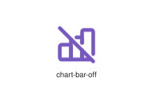
</div>
</div>

{{#endtab}}
{{#tab name="Code"}}

```xml
{{#include ../samples/icons/Tabler-Icons/chart-bar-off-50c078a3.xal}}
```

{{#endtab}}
{{#endtabs}}

<div class="xal-ref-tag"><code>&lt;item id=&#34;101221&#34; /&gt;</code></div>

</div>
<div class="xal-ref-card">
<div class="xal-ref-title">chart-bar-popular</div>

{{#tabs name="svg-ref-1221"}}
{{#tab name="Preview"}}
<div class="xal-ref-preview">
<div>
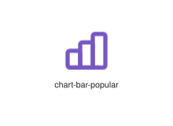
</div>
</div>

{{#endtab}}
{{#tab name="Code"}}

```xml
{{#include ../samples/icons/Tabler-Icons/chart-bar-popular-09c8fb70.xal}}
```

{{#endtab}}
{{#endtabs}}

<div class="xal-ref-tag"><code>&lt;item id=&#34;101222&#34; /&gt;</code></div>

</div>
<div class="xal-ref-card">
<div class="xal-ref-title">chart-bar</div>

{{#tabs name="svg-ref-1222"}}
{{#tab name="Preview"}}
<div class="xal-ref-preview">
<div>
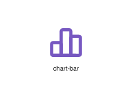
</div>
</div>

{{#endtab}}
{{#tab name="Code"}}

```xml
{{#include ../samples/icons/Tabler-Icons/chart-bar-538af132.xal}}
```

{{#endtab}}
{{#endtabs}}

<div class="xal-ref-tag"><code>&lt;item id=&#34;101220&#34; /&gt;</code></div>

</div>
<div class="xal-ref-card">
<div class="xal-ref-title">chart-bubble</div>

{{#tabs name="svg-ref-1223"}}
{{#tab name="Preview"}}
<div class="xal-ref-preview">
<div>
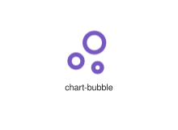
</div>
</div>

{{#endtab}}
{{#tab name="Code"}}

```xml
{{#include ../samples/icons/Tabler-Icons/chart-bubble-1980d90f.xal}}
```

{{#endtab}}
{{#endtabs}}

<div class="xal-ref-tag"><code>&lt;item id=&#34;101223&#34; /&gt;</code></div>

</div>
<div class="xal-ref-card">
<div class="xal-ref-title">chart-candle</div>

{{#tabs name="svg-ref-1224"}}
{{#tab name="Preview"}}
<div class="xal-ref-preview">
<div>
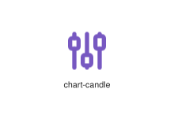
</div>
</div>

{{#endtab}}
{{#tab name="Code"}}

```xml
{{#include ../samples/icons/Tabler-Icons/chart-candle-33118139.xal}}
```

{{#endtab}}
{{#endtabs}}

<div class="xal-ref-tag"><code>&lt;item id=&#34;101224&#34; /&gt;</code></div>

</div>
<div class="xal-ref-card">
<div class="xal-ref-title">chart-circles</div>

{{#tabs name="svg-ref-1225"}}
{{#tab name="Preview"}}
<div class="xal-ref-preview">
<div>
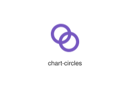
</div>
</div>

{{#endtab}}
{{#tab name="Code"}}

```xml
{{#include ../samples/icons/Tabler-Icons/chart-circles-a1f24789.xal}}
```

{{#endtab}}
{{#endtabs}}

<div class="xal-ref-tag"><code>&lt;item id=&#34;101225&#34; /&gt;</code></div>

</div>
<div class="xal-ref-card">
<div class="xal-ref-title">chart-cohort</div>

{{#tabs name="svg-ref-1226"}}
{{#tab name="Preview"}}
<div class="xal-ref-preview">
<div>
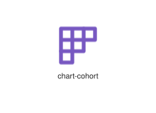
</div>
</div>

{{#endtab}}
{{#tab name="Code"}}

```xml
{{#include ../samples/icons/Tabler-Icons/chart-cohort-5be7da0f.xal}}
```

{{#endtab}}
{{#endtabs}}

<div class="xal-ref-tag"><code>&lt;item id=&#34;101226&#34; /&gt;</code></div>

</div>
<div class="xal-ref-card">
<div class="xal-ref-title">chart-column</div>

{{#tabs name="svg-ref-1227"}}
{{#tab name="Preview"}}
<div class="xal-ref-preview">
<div>
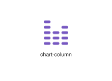
</div>
</div>

{{#endtab}}
{{#tab name="Code"}}

```xml
{{#include ../samples/icons/Tabler-Icons/chart-column-c4d32818.xal}}
```

{{#endtab}}
{{#endtabs}}

<div class="xal-ref-tag"><code>&lt;item id=&#34;101227&#34; /&gt;</code></div>

</div>
<div class="xal-ref-card">
<div class="xal-ref-title">chart-covariate</div>

{{#tabs name="svg-ref-1228"}}
{{#tab name="Preview"}}
<div class="xal-ref-preview">
<div>
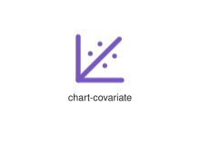
</div>
</div>

{{#endtab}}
{{#tab name="Code"}}

```xml
{{#include ../samples/icons/Tabler-Icons/chart-covariate-264d0cf1.xal}}
```

{{#endtab}}
{{#endtabs}}

<div class="xal-ref-tag"><code>&lt;item id=&#34;101228&#34; /&gt;</code></div>

</div>
<div class="xal-ref-card">
<div class="xal-ref-title">chart-donut-2</div>

{{#tabs name="svg-ref-1229"}}
{{#tab name="Preview"}}
<div class="xal-ref-preview">
<div>
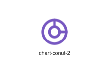
</div>
</div>

{{#endtab}}
{{#tab name="Code"}}

```xml
{{#include ../samples/icons/Tabler-Icons/chart-donut-2-a75e80d5.xal}}
```

{{#endtab}}
{{#endtabs}}

<div class="xal-ref-tag"><code>&lt;item id=&#34;101230&#34; /&gt;</code></div>

</div>
<div class="xal-ref-card">
<div class="xal-ref-title">chart-donut-3</div>

{{#tabs name="svg-ref-1230"}}
{{#tab name="Preview"}}
<div class="xal-ref-preview">
<div>
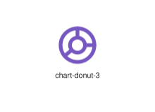
</div>
</div>

{{#endtab}}
{{#tab name="Code"}}

```xml
{{#include ../samples/icons/Tabler-Icons/chart-donut-3-9a3ea965.xal}}
```

{{#endtab}}
{{#endtabs}}

<div class="xal-ref-tag"><code>&lt;item id=&#34;101231&#34; /&gt;</code></div>

</div>
<div class="xal-ref-card">
<div class="xal-ref-title">chart-donut-4</div>

{{#tabs name="svg-ref-1231"}}
{{#tab name="Preview"}}
<div class="xal-ref-preview">
<div>
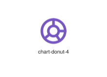
</div>
</div>

{{#endtab}}
{{#tab name="Code"}}

```xml
{{#include ../samples/icons/Tabler-Icons/chart-donut-4-281e7575.xal}}
```

{{#endtab}}
{{#endtabs}}

<div class="xal-ref-tag"><code>&lt;item id=&#34;101232&#34; /&gt;</code></div>

</div>
<div class="xal-ref-card">
<div class="xal-ref-title">chart-donut</div>

{{#tabs name="svg-ref-1232"}}
{{#tab name="Preview"}}
<div class="xal-ref-preview">
<div>
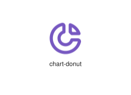
</div>
</div>

{{#endtab}}
{{#tab name="Code"}}

```xml
{{#include ../samples/icons/Tabler-Icons/chart-donut-cbb168c2.xal}}
```

{{#endtab}}
{{#endtabs}}

<div class="xal-ref-tag"><code>&lt;item id=&#34;101229&#34; /&gt;</code></div>

</div>
<div class="xal-ref-card">
<div class="xal-ref-title">chart-dots-2</div>

{{#tabs name="svg-ref-1233"}}
{{#tab name="Preview"}}
<div class="xal-ref-preview">
<div>
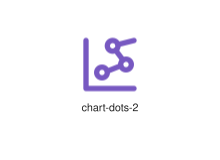
</div>
</div>

{{#endtab}}
{{#tab name="Code"}}

```xml
{{#include ../samples/icons/Tabler-Icons/chart-dots-2-183a0463.xal}}
```

{{#endtab}}
{{#endtabs}}

<div class="xal-ref-tag"><code>&lt;item id=&#34;101234&#34; /&gt;</code></div>

</div>
<div class="xal-ref-card">
<div class="xal-ref-title">chart-dots-3</div>

{{#tabs name="svg-ref-1234"}}
{{#tab name="Preview"}}
<div class="xal-ref-preview">
<div>
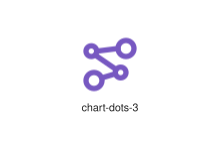
</div>
</div>

{{#endtab}}
{{#tab name="Code"}}

```xml
{{#include ../samples/icons/Tabler-Icons/chart-dots-3-255a2dd3.xal}}
```

{{#endtab}}
{{#endtabs}}

<div class="xal-ref-tag"><code>&lt;item id=&#34;101235&#34; /&gt;</code></div>

</div>
<div class="xal-ref-card">
<div class="xal-ref-title">chart-dots</div>

{{#tabs name="svg-ref-1235"}}
{{#tab name="Preview"}}
<div class="xal-ref-preview">
<div>
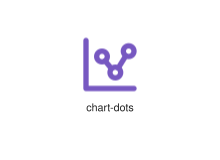
</div>
</div>

{{#endtab}}
{{#tab name="Code"}}

```xml
{{#include ../samples/icons/Tabler-Icons/chart-dots-25af6c3e.xal}}
```

{{#endtab}}
{{#endtabs}}

<div class="xal-ref-tag"><code>&lt;item id=&#34;101233&#34; /&gt;</code></div>

</div>
<div class="xal-ref-card">
<div class="xal-ref-title">chart-funnel</div>

{{#tabs name="svg-ref-1236"}}
{{#tab name="Preview"}}
<div class="xal-ref-preview">
<div>
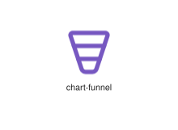
</div>
</div>

{{#endtab}}
{{#tab name="Code"}}

```xml
{{#include ../samples/icons/Tabler-Icons/chart-funnel-aa7b35f7.xal}}
```

{{#endtab}}
{{#endtabs}}

<div class="xal-ref-tag"><code>&lt;item id=&#34;101236&#34; /&gt;</code></div>

</div>
<div class="xal-ref-card">
<div class="xal-ref-title">chart-grid-dots</div>

{{#tabs name="svg-ref-1237"}}
{{#tab name="Preview"}}
<div class="xal-ref-preview">
<div>
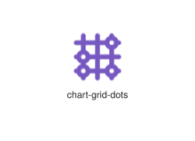
</div>
</div>

{{#endtab}}
{{#tab name="Code"}}

```xml
{{#include ../samples/icons/Tabler-Icons/chart-grid-dots-2615f335.xal}}
```

{{#endtab}}
{{#endtabs}}

<div class="xal-ref-tag"><code>&lt;item id=&#34;101237&#34; /&gt;</code></div>

</div>
<div class="xal-ref-card">
<div class="xal-ref-title">chart-histogram</div>

{{#tabs name="svg-ref-1238"}}
{{#tab name="Preview"}}
<div class="xal-ref-preview">
<div>
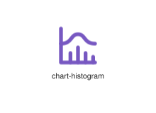
</div>
</div>

{{#endtab}}
{{#tab name="Code"}}

```xml
{{#include ../samples/icons/Tabler-Icons/chart-histogram-e33119f2.xal}}
```

{{#endtab}}
{{#endtabs}}

<div class="xal-ref-tag"><code>&lt;item id=&#34;101238&#34; /&gt;</code></div>

</div>
<div class="xal-ref-card">
<div class="xal-ref-title">chart-infographic</div>

{{#tabs name="svg-ref-1239"}}
{{#tab name="Preview"}}
<div class="xal-ref-preview">
<div>
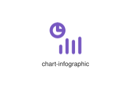
</div>
</div>

{{#endtab}}
{{#tab name="Code"}}

```xml
{{#include ../samples/icons/Tabler-Icons/chart-infographic-ca149751.xal}}
```

{{#endtab}}
{{#endtabs}}

<div class="xal-ref-tag"><code>&lt;item id=&#34;101239&#34; /&gt;</code></div>

</div>
<div class="xal-ref-card">
<div class="xal-ref-title">chart-line</div>

{{#tabs name="svg-ref-1240"}}
{{#tab name="Preview"}}
<div class="xal-ref-preview">
<div>
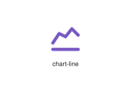
</div>
</div>

{{#endtab}}
{{#tab name="Code"}}

```xml
{{#include ../samples/icons/Tabler-Icons/chart-line-d877016e.xal}}
```

{{#endtab}}
{{#endtabs}}

<div class="xal-ref-tag"><code>&lt;item id=&#34;101240&#34; /&gt;</code></div>

</div>
<div class="xal-ref-card">
<div class="xal-ref-title">chart-pie-2</div>

{{#tabs name="svg-ref-1241"}}
{{#tab name="Preview"}}
<div class="xal-ref-preview">
<div>
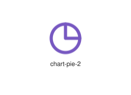
</div>
</div>

{{#endtab}}
{{#tab name="Code"}}

```xml
{{#include ../samples/icons/Tabler-Icons/chart-pie-2-c99b01b1.xal}}
```

{{#endtab}}
{{#endtabs}}

<div class="xal-ref-tag"><code>&lt;item id=&#34;101242&#34; /&gt;</code></div>

</div>
<div class="xal-ref-card">
<div class="xal-ref-title">chart-pie-3</div>

{{#tabs name="svg-ref-1242"}}
{{#tab name="Preview"}}
<div class="xal-ref-preview">
<div>
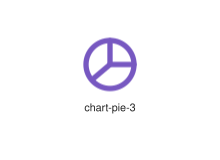
</div>
</div>

{{#endtab}}
{{#tab name="Code"}}

```xml
{{#include ../samples/icons/Tabler-Icons/chart-pie-3-f4fb2801.xal}}
```

{{#endtab}}
{{#endtabs}}

<div class="xal-ref-tag"><code>&lt;item id=&#34;101243&#34; /&gt;</code></div>

</div>
<div class="xal-ref-card">
<div class="xal-ref-title">chart-pie-4</div>

{{#tabs name="svg-ref-1243"}}
{{#tab name="Preview"}}
<div class="xal-ref-preview">
<div>
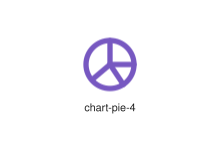
</div>
</div>

{{#endtab}}
{{#tab name="Code"}}

```xml
{{#include ../samples/icons/Tabler-Icons/chart-pie-4-46dbf411.xal}}
```

{{#endtab}}
{{#endtabs}}

<div class="xal-ref-tag"><code>&lt;item id=&#34;101244&#34; /&gt;</code></div>

</div>
<div class="xal-ref-card">
<div class="xal-ref-title">chart-pie-off</div>

{{#tabs name="svg-ref-1244"}}
{{#tab name="Preview"}}
<div class="xal-ref-preview">
<div>
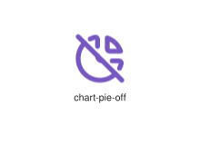
</div>
</div>

{{#endtab}}
{{#tab name="Code"}}

```xml
{{#include ../samples/icons/Tabler-Icons/chart-pie-off-7d2c6ae5.xal}}
```

{{#endtab}}
{{#endtabs}}

<div class="xal-ref-tag"><code>&lt;item id=&#34;101245&#34; /&gt;</code></div>

</div>
<div class="xal-ref-card">
<div class="xal-ref-title">chart-pie</div>

{{#tabs name="svg-ref-1245"}}
{{#tab name="Preview"}}
<div class="xal-ref-preview">
<div>
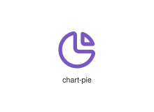
</div>
</div>

{{#endtab}}
{{#tab name="Code"}}

```xml
{{#include ../samples/icons/Tabler-Icons/chart-pie-9d58b52a.xal}}
```

{{#endtab}}
{{#endtabs}}

<div class="xal-ref-tag"><code>&lt;item id=&#34;101241&#34; /&gt;</code></div>

</div>
<div class="xal-ref-card">
<div class="xal-ref-title">chart-ppf</div>

{{#tabs name="svg-ref-1246"}}
{{#tab name="Preview"}}
<div class="xal-ref-preview">
<div>
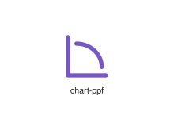
</div>
</div>

{{#endtab}}
{{#tab name="Code"}}

```xml
{{#include ../samples/icons/Tabler-Icons/chart-ppf-fe219ca9.xal}}
```

{{#endtab}}
{{#endtabs}}

<div class="xal-ref-tag"><code>&lt;item id=&#34;101246&#34; /&gt;</code></div>

</div>
<div class="xal-ref-card">
<div class="xal-ref-title">chart-radar</div>

{{#tabs name="svg-ref-1247"}}
{{#tab name="Preview"}}
<div class="xal-ref-preview">
<div>
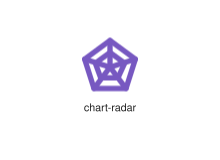
</div>
</div>

{{#endtab}}
{{#tab name="Code"}}

```xml
{{#include ../samples/icons/Tabler-Icons/chart-radar-b296ab68.xal}}
```

{{#endtab}}
{{#endtabs}}

<div class="xal-ref-tag"><code>&lt;item id=&#34;101247&#34; /&gt;</code></div>

</div>
<div class="xal-ref-card">
<div class="xal-ref-title">chart-sankey</div>

{{#tabs name="svg-ref-1248"}}
{{#tab name="Preview"}}
<div class="xal-ref-preview">
<div>
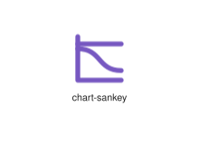
</div>
</div>

{{#endtab}}
{{#tab name="Code"}}

```xml
{{#include ../samples/icons/Tabler-Icons/chart-sankey-60e85b73.xal}}
```

{{#endtab}}
{{#endtabs}}

<div class="xal-ref-tag"><code>&lt;item id=&#34;101248&#34; /&gt;</code></div>

</div>
<div class="xal-ref-card">
<div class="xal-ref-title">chart-scatter-3d</div>

{{#tabs name="svg-ref-1249"}}
{{#tab name="Preview"}}
<div class="xal-ref-preview">
<div>
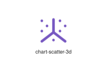
</div>
</div>

{{#endtab}}
{{#tab name="Code"}}

```xml
{{#include ../samples/icons/Tabler-Icons/chart-scatter-3d-9bd3f9e4.xal}}
```

{{#endtab}}
{{#endtabs}}

<div class="xal-ref-tag"><code>&lt;item id=&#34;101250&#34; /&gt;</code></div>

</div>
<div class="xal-ref-card">
<div class="xal-ref-title">chart-scatter</div>

{{#tabs name="svg-ref-1250"}}
{{#tab name="Preview"}}
<div class="xal-ref-preview">
<div>
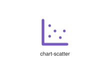
</div>
</div>

{{#endtab}}
{{#tab name="Code"}}

```xml
{{#include ../samples/icons/Tabler-Icons/chart-scatter-9244ae14.xal}}
```

{{#endtab}}
{{#endtabs}}

<div class="xal-ref-tag"><code>&lt;item id=&#34;101249&#34; /&gt;</code></div>

</div>
<div class="xal-ref-card">
<div class="xal-ref-title">chart-treemap</div>

{{#tabs name="svg-ref-1251"}}
{{#tab name="Preview"}}
<div class="xal-ref-preview">
<div>
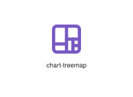
</div>
</div>

{{#endtab}}
{{#tab name="Code"}}

```xml
{{#include ../samples/icons/Tabler-Icons/chart-treemap-8df9f993.xal}}
```

{{#endtab}}
{{#endtabs}}

<div class="xal-ref-tag"><code>&lt;item id=&#34;101251&#34; /&gt;</code></div>

</div>
<div class="xal-ref-card">
<div class="xal-ref-title">check</div>

{{#tabs name="svg-ref-1252"}}
{{#tab name="Preview"}}
<div class="xal-ref-preview">
<div>

</div>
</div>

{{#endtab}}
{{#tab name="Code"}}

```xml
{{#include ../samples/icons/Tabler-Icons/check-1c5d8472.xal}}
```

{{#endtab}}
{{#endtabs}}

<div class="xal-ref-tag"><code>&lt;item id=&#34;101252&#34; /&gt;</code></div>

</div>
<div class="xal-ref-card">
<div class="xal-ref-title">checkbox</div>

{{#tabs name="svg-ref-1253"}}
{{#tab name="Preview"}}
<div class="xal-ref-preview">
<div>

</div>
</div>

{{#endtab}}
{{#tab name="Code"}}

```xml
{{#include ../samples/icons/Tabler-Icons/checkbox-b0969d8f.xal}}
```

{{#endtab}}
{{#endtabs}}

<div class="xal-ref-tag"><code>&lt;item id=&#34;101253&#34; /&gt;</code></div>

</div>
<div class="xal-ref-card">
<div class="xal-ref-title">checklist</div>

{{#tabs name="svg-ref-1254"}}
{{#tab name="Preview"}}
<div class="xal-ref-preview">
<div>

</div>
</div>

{{#endtab}}
{{#tab name="Code"}}

```xml
{{#include ../samples/icons/Tabler-Icons/checklist-7e28257f.xal}}
```

{{#endtab}}
{{#endtabs}}

<div class="xal-ref-tag"><code>&lt;item id=&#34;101254&#34; /&gt;</code></div>

</div>
<div class="xal-ref-card">
<div class="xal-ref-title">checks</div>

{{#tabs name="svg-ref-1255"}}
{{#tab name="Preview"}}
<div class="xal-ref-preview">
<div>

</div>
</div>

{{#endtab}}
{{#tab name="Code"}}

```xml
{{#include ../samples/icons/Tabler-Icons/checks-13356b1c.xal}}
```

{{#endtab}}
{{#endtabs}}

<div class="xal-ref-tag"><code>&lt;item id=&#34;101255&#34; /&gt;</code></div>

</div>
<div class="xal-ref-card">
<div class="xal-ref-title">checkup-list</div>

{{#tabs name="svg-ref-1256"}}
{{#tab name="Preview"}}
<div class="xal-ref-preview">
<div>

</div>
</div>

{{#endtab}}
{{#tab name="Code"}}

```xml
{{#include ../samples/icons/Tabler-Icons/checkup-list-87109da8.xal}}
```

{{#endtab}}
{{#endtabs}}

<div class="xal-ref-tag"><code>&lt;item id=&#34;101256&#34; /&gt;</code></div>

</div>
<div class="xal-ref-card">
<div class="xal-ref-title">cheese</div>

{{#tabs name="svg-ref-1257"}}
{{#tab name="Preview"}}
<div class="xal-ref-preview">
<div>

</div>
</div>

{{#endtab}}
{{#tab name="Code"}}

```xml
{{#include ../samples/icons/Tabler-Icons/cheese-70c0bcf2.xal}}
```

{{#endtab}}
{{#endtabs}}

<div class="xal-ref-tag"><code>&lt;item id=&#34;101257&#34; /&gt;</code></div>

</div>
<div class="xal-ref-card">
<div class="xal-ref-title">chef-hat-off</div>

{{#tabs name="svg-ref-1258"}}
{{#tab name="Preview"}}
<div class="xal-ref-preview">
<div>

</div>
</div>

{{#endtab}}
{{#tab name="Code"}}

```xml
{{#include ../samples/icons/Tabler-Icons/chef-hat-off-f942081f.xal}}
```

{{#endtab}}
{{#endtabs}}

<div class="xal-ref-tag"><code>&lt;item id=&#34;101259&#34; /&gt;</code></div>

</div>
<div class="xal-ref-card">
<div class="xal-ref-title">chef-hat</div>

{{#tabs name="svg-ref-1259"}}
{{#tab name="Preview"}}
<div class="xal-ref-preview">
<div>

</div>
</div>

{{#endtab}}
{{#tab name="Code"}}

```xml
{{#include ../samples/icons/Tabler-Icons/chef-hat-4e79c095.xal}}
```

{{#endtab}}
{{#endtabs}}

<div class="xal-ref-tag"><code>&lt;item id=&#34;101258&#34; /&gt;</code></div>

</div>
</div>
