# Tabler-Icons - Page 15

This page references SVG files under `etc/resources/aws/svg/Tabler-Icons`.
Each card shows the SVG preview first and the XAL tag syntax in the Code tab.
Showing 1261-1350 of 4964 SVG files.

<style>
.xal-ref-grid{display:grid;grid-template-columns:repeat(3,minmax(0,1fr));gap:1rem;margin:1rem 0 1.5rem}.xal-ref-card{border:1px solid var(--table-border-color);border-radius:8px;overflow:hidden;background:var(--bg);padding:.75rem}.xal-ref-title{font-size:.9rem;font-weight:600;line-height:1.25;margin:0 0 .5rem;overflow-wrap:anywhere}.xal-ref-preview{display:flex;align-items:center;justify-content:center}.xal-ref-preview img{display:block;width:100%;height:auto}.xal-ref-card pre{margin:0;max-height:18rem;overflow:auto;white-space:pre}.xal-ref-card code{font-size:.78em}.xal-ref-tag{margin:.5rem 0 0;color:var(--fg);opacity:.72;overflow:auto;white-space:pre}.xal-ref-tag code{font-size:.72em}@media(max-width:900px){.xal-ref-grid{grid-template-columns:repeat(2,minmax(0,1fr))}}@media(max-width:560px){.xal-ref-grid{grid-template-columns:1fr}}
</style>

[Back to section index](tabler-icons.md)

<div class="xal-ref-grid">
<div class="xal-ref-card">
<div class="xal-ref-title">cherry</div>

{{#tabs name="svg-ref-1260"}}
{{#tab name="Preview"}}
<div class="xal-ref-preview">
<div>
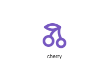
</div>
</div>

{{#endtab}}
{{#tab name="Code"}}

```xml
{{#include ../samples/icons/Tabler-Icons/cherry-bcf5b794.xal}}
```

{{#endtab}}
{{#endtabs}}

<div class="xal-ref-tag"><code>&lt;item id=&#34;101260&#34; /&gt;</code></div>

</div>
<div class="xal-ref-card">
<div class="xal-ref-title">chess-bishop</div>

{{#tabs name="svg-ref-1261"}}
{{#tab name="Preview"}}
<div class="xal-ref-preview">
<div>
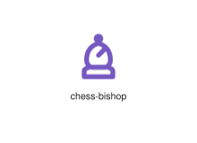
</div>
</div>

{{#endtab}}
{{#tab name="Code"}}

```xml
{{#include ../samples/icons/Tabler-Icons/chess-bishop-d923d3dc.xal}}
```

{{#endtab}}
{{#endtabs}}

<div class="xal-ref-tag"><code>&lt;item id=&#34;101262&#34; /&gt;</code></div>

</div>
<div class="xal-ref-card">
<div class="xal-ref-title">chess-king</div>

{{#tabs name="svg-ref-1262"}}
{{#tab name="Preview"}}
<div class="xal-ref-preview">
<div>
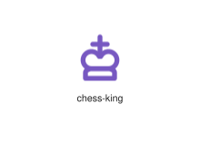
</div>
</div>

{{#endtab}}
{{#tab name="Code"}}

```xml
{{#include ../samples/icons/Tabler-Icons/chess-king-8826a4d1.xal}}
```

{{#endtab}}
{{#endtabs}}

<div class="xal-ref-tag"><code>&lt;item id=&#34;101263&#34; /&gt;</code></div>

</div>
<div class="xal-ref-card">
<div class="xal-ref-title">chess-knight</div>

{{#tabs name="svg-ref-1263"}}
{{#tab name="Preview"}}
<div class="xal-ref-preview">
<div>

</div>
</div>

{{#endtab}}
{{#tab name="Code"}}

```xml
{{#include ../samples/icons/Tabler-Icons/chess-knight-b2e15ead.xal}}
```

{{#endtab}}
{{#endtabs}}

<div class="xal-ref-tag"><code>&lt;item id=&#34;101264&#34; /&gt;</code></div>

</div>
<div class="xal-ref-card">
<div class="xal-ref-title">chess-queen</div>

{{#tabs name="svg-ref-1264"}}
{{#tab name="Preview"}}
<div class="xal-ref-preview">
<div>
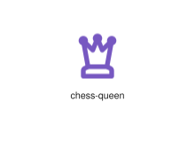
</div>
</div>

{{#endtab}}
{{#tab name="Code"}}

```xml
{{#include ../samples/icons/Tabler-Icons/chess-queen-993ba827.xal}}
```

{{#endtab}}
{{#endtabs}}

<div class="xal-ref-tag"><code>&lt;item id=&#34;101265&#34; /&gt;</code></div>

</div>
<div class="xal-ref-card">
<div class="xal-ref-title">chess-rook</div>

{{#tabs name="svg-ref-1265"}}
{{#tab name="Preview"}}
<div class="xal-ref-preview">
<div>
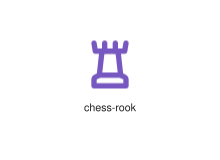
</div>
</div>

{{#endtab}}
{{#tab name="Code"}}

```xml
{{#include ../samples/icons/Tabler-Icons/chess-rook-86ae854f.xal}}
```

{{#endtab}}
{{#endtabs}}

<div class="xal-ref-tag"><code>&lt;item id=&#34;101266&#34; /&gt;</code></div>

</div>
<div class="xal-ref-card">
<div class="xal-ref-title">chess</div>

{{#tabs name="svg-ref-1266"}}
{{#tab name="Preview"}}
<div class="xal-ref-preview">
<div>
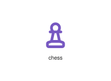
</div>
</div>

{{#endtab}}
{{#tab name="Code"}}

```xml
{{#include ../samples/icons/Tabler-Icons/chess-4f1b5aaa.xal}}
```

{{#endtab}}
{{#endtabs}}

<div class="xal-ref-tag"><code>&lt;item id=&#34;101261&#34; /&gt;</code></div>

</div>
<div class="xal-ref-card">
<div class="xal-ref-title">chevron-compact-down</div>

{{#tabs name="svg-ref-1267"}}
{{#tab name="Preview"}}
<div class="xal-ref-preview">
<div>
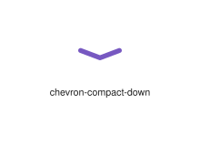
</div>
</div>

{{#endtab}}
{{#tab name="Code"}}

```xml
{{#include ../samples/icons/Tabler-Icons/chevron-compact-down-d2baa089.xal}}
```

{{#endtab}}
{{#endtabs}}

<div class="xal-ref-tag"><code>&lt;item id=&#34;101267&#34; /&gt;</code></div>

</div>
<div class="xal-ref-card">
<div class="xal-ref-title">chevron-compact-left</div>

{{#tabs name="svg-ref-1268"}}
{{#tab name="Preview"}}
<div class="xal-ref-preview">
<div>
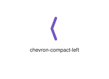
</div>
</div>

{{#endtab}}
{{#tab name="Code"}}

```xml
{{#include ../samples/icons/Tabler-Icons/chevron-compact-left-47f5ba6f.xal}}
```

{{#endtab}}
{{#endtabs}}

<div class="xal-ref-tag"><code>&lt;item id=&#34;101268&#34; /&gt;</code></div>

</div>
<div class="xal-ref-card">
<div class="xal-ref-title">chevron-compact-right</div>

{{#tabs name="svg-ref-1269"}}
{{#tab name="Preview"}}
<div class="xal-ref-preview">
<div>
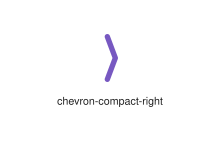
</div>
</div>

{{#endtab}}
{{#tab name="Code"}}

```xml
{{#include ../samples/icons/Tabler-Icons/chevron-compact-right-23863613.xal}}
```

{{#endtab}}
{{#endtabs}}

<div class="xal-ref-tag"><code>&lt;item id=&#34;101269&#34; /&gt;</code></div>

</div>
<div class="xal-ref-card">
<div class="xal-ref-title">chevron-compact-up</div>

{{#tabs name="svg-ref-1270"}}
{{#tab name="Preview"}}
<div class="xal-ref-preview">
<div>
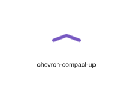
</div>
</div>

{{#endtab}}
{{#tab name="Code"}}

```xml
{{#include ../samples/icons/Tabler-Icons/chevron-compact-up-1db2ba20.xal}}
```

{{#endtab}}
{{#endtabs}}

<div class="xal-ref-tag"><code>&lt;item id=&#34;101270&#34; /&gt;</code></div>

</div>
<div class="xal-ref-card">
<div class="xal-ref-title">chevron-down-left</div>

{{#tabs name="svg-ref-1271"}}
{{#tab name="Preview"}}
<div class="xal-ref-preview">
<div>
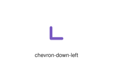
</div>
</div>

{{#endtab}}
{{#tab name="Code"}}

```xml
{{#include ../samples/icons/Tabler-Icons/chevron-down-left-222ca802.xal}}
```

{{#endtab}}
{{#endtabs}}

<div class="xal-ref-tag"><code>&lt;item id=&#34;101272&#34; /&gt;</code></div>

</div>
<div class="xal-ref-card">
<div class="xal-ref-title">chevron-down-right</div>

{{#tabs name="svg-ref-1272"}}
{{#tab name="Preview"}}
<div class="xal-ref-preview">
<div>
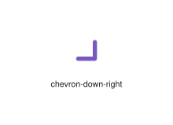
</div>
</div>

{{#endtab}}
{{#tab name="Code"}}

```xml
{{#include ../samples/icons/Tabler-Icons/chevron-down-right-10e0f2e4.xal}}
```

{{#endtab}}
{{#endtabs}}

<div class="xal-ref-tag"><code>&lt;item id=&#34;101273&#34; /&gt;</code></div>

</div>
<div class="xal-ref-card">
<div class="xal-ref-title">chevron-down</div>

{{#tabs name="svg-ref-1273"}}
{{#tab name="Preview"}}
<div class="xal-ref-preview">
<div>
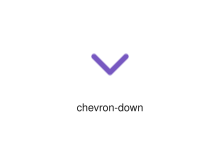
</div>
</div>

{{#endtab}}
{{#tab name="Code"}}

```xml
{{#include ../samples/icons/Tabler-Icons/chevron-down-cb4391a2.xal}}
```

{{#endtab}}
{{#endtabs}}

<div class="xal-ref-tag"><code>&lt;item id=&#34;101271&#34; /&gt;</code></div>

</div>
<div class="xal-ref-card">
<div class="xal-ref-title">chevron-left-pipe</div>

{{#tabs name="svg-ref-1274"}}
{{#tab name="Preview"}}
<div class="xal-ref-preview">
<div>
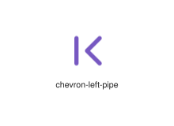
</div>
</div>

{{#endtab}}
{{#tab name="Code"}}

```xml
{{#include ../samples/icons/Tabler-Icons/chevron-left-pipe-a9578880.xal}}
```

{{#endtab}}
{{#endtabs}}

<div class="xal-ref-tag"><code>&lt;item id=&#34;101275&#34; /&gt;</code></div>

</div>
<div class="xal-ref-card">
<div class="xal-ref-title">chevron-left</div>

{{#tabs name="svg-ref-1275"}}
{{#tab name="Preview"}}
<div class="xal-ref-preview">
<div>
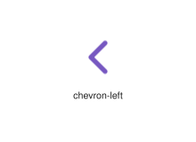
</div>
</div>

{{#endtab}}
{{#tab name="Code"}}

```xml
{{#include ../samples/icons/Tabler-Icons/chevron-left-5e0c8b44.xal}}
```

{{#endtab}}
{{#endtabs}}

<div class="xal-ref-tag"><code>&lt;item id=&#34;101274&#34; /&gt;</code></div>

</div>
<div class="xal-ref-card">
<div class="xal-ref-title">chevron-right-pipe</div>

{{#tabs name="svg-ref-1276"}}
{{#tab name="Preview"}}
<div class="xal-ref-preview">
<div>
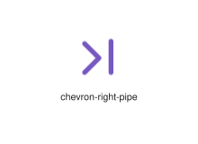
</div>
</div>

{{#endtab}}
{{#tab name="Code"}}

```xml
{{#include ../samples/icons/Tabler-Icons/chevron-right-pipe-a3fc31e0.xal}}
```

{{#endtab}}
{{#endtabs}}

<div class="xal-ref-tag"><code>&lt;item id=&#34;101277&#34; /&gt;</code></div>

</div>
<div class="xal-ref-card">
<div class="xal-ref-title">chevron-right</div>

{{#tabs name="svg-ref-1277"}}
{{#tab name="Preview"}}
<div class="xal-ref-preview">
<div>
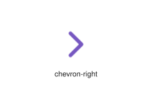
</div>
</div>

{{#endtab}}
{{#tab name="Code"}}

```xml
{{#include ../samples/icons/Tabler-Icons/chevron-right-8f233662.xal}}
```

{{#endtab}}
{{#endtabs}}

<div class="xal-ref-tag"><code>&lt;item id=&#34;101276&#34; /&gt;</code></div>

</div>
<div class="xal-ref-card">
<div class="xal-ref-title">chevron-up-left</div>

{{#tabs name="svg-ref-1278"}}
{{#tab name="Preview"}}
<div class="xal-ref-preview">
<div>
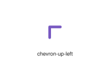
</div>
</div>

{{#endtab}}
{{#tab name="Code"}}

```xml
{{#include ../samples/icons/Tabler-Icons/chevron-up-left-cb79fca3.xal}}
```

{{#endtab}}
{{#endtabs}}

<div class="xal-ref-tag"><code>&lt;item id=&#34;101279&#34; /&gt;</code></div>

</div>
<div class="xal-ref-card">
<div class="xal-ref-title">chevron-up-right</div>

{{#tabs name="svg-ref-1279"}}
{{#tab name="Preview"}}
<div class="xal-ref-preview">
<div>
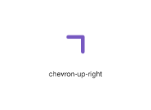
</div>
</div>

{{#endtab}}
{{#tab name="Code"}}

```xml
{{#include ../samples/icons/Tabler-Icons/chevron-up-right-b1d834ce.xal}}
```

{{#endtab}}
{{#endtabs}}

<div class="xal-ref-tag"><code>&lt;item id=&#34;101280&#34; /&gt;</code></div>

</div>
<div class="xal-ref-card">
<div class="xal-ref-title">chevron-up</div>

{{#tabs name="svg-ref-1280"}}
{{#tab name="Preview"}}
<div class="xal-ref-preview">
<div>
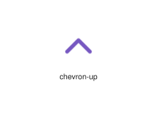
</div>
</div>

{{#endtab}}
{{#tab name="Code"}}

```xml
{{#include ../samples/icons/Tabler-Icons/chevron-up-a5a2aee8.xal}}
```

{{#endtab}}
{{#endtabs}}

<div class="xal-ref-tag"><code>&lt;item id=&#34;101278&#34; /&gt;</code></div>

</div>
<div class="xal-ref-card">
<div class="xal-ref-title">chevrons-down-left</div>

{{#tabs name="svg-ref-1281"}}
{{#tab name="Preview"}}
<div class="xal-ref-preview">
<div>
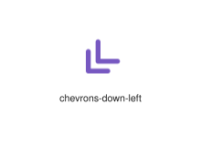
</div>
</div>

{{#endtab}}
{{#tab name="Code"}}

```xml
{{#include ../samples/icons/Tabler-Icons/chevrons-down-left-999094c4.xal}}
```

{{#endtab}}
{{#endtabs}}

<div class="xal-ref-tag"><code>&lt;item id=&#34;101282&#34; /&gt;</code></div>

</div>
<div class="xal-ref-card">
<div class="xal-ref-title">chevrons-down-right</div>

{{#tabs name="svg-ref-1282"}}
{{#tab name="Preview"}}
<div class="xal-ref-preview">
<div>
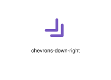
</div>
</div>

{{#endtab}}
{{#tab name="Code"}}

```xml
{{#include ../samples/icons/Tabler-Icons/chevrons-down-right-625c295d.xal}}
```

{{#endtab}}
{{#endtabs}}

<div class="xal-ref-tag"><code>&lt;item id=&#34;101283&#34; /&gt;</code></div>

</div>
<div class="xal-ref-card">
<div class="xal-ref-title">chevrons-down</div>

{{#tabs name="svg-ref-1283"}}
{{#tab name="Preview"}}
<div class="xal-ref-preview">
<div>
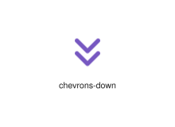
</div>
</div>

{{#endtab}}
{{#tab name="Code"}}

```xml
{{#include ../samples/icons/Tabler-Icons/chevrons-down-f52f6ae5.xal}}
```

{{#endtab}}
{{#endtabs}}

<div class="xal-ref-tag"><code>&lt;item id=&#34;101281&#34; /&gt;</code></div>

</div>
<div class="xal-ref-card">
<div class="xal-ref-title">chevrons-left</div>

{{#tabs name="svg-ref-1284"}}
{{#tab name="Preview"}}
<div class="xal-ref-preview">
<div>
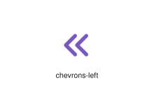
</div>
</div>

{{#endtab}}
{{#tab name="Code"}}

```xml
{{#include ../samples/icons/Tabler-Icons/chevrons-left-60607003.xal}}
```

{{#endtab}}
{{#endtabs}}

<div class="xal-ref-tag"><code>&lt;item id=&#34;101284&#34; /&gt;</code></div>

</div>
<div class="xal-ref-card">
<div class="xal-ref-title">chevrons-right</div>

{{#tabs name="svg-ref-1285"}}
{{#tab name="Preview"}}
<div class="xal-ref-preview">
<div>
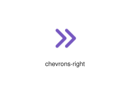
</div>
</div>

{{#endtab}}
{{#tab name="Code"}}

```xml
{{#include ../samples/icons/Tabler-Icons/chevrons-right-67a58eaa.xal}}
```

{{#endtab}}
{{#endtabs}}

<div class="xal-ref-tag"><code>&lt;item id=&#34;101285&#34; /&gt;</code></div>

</div>
<div class="xal-ref-card">
<div class="xal-ref-title">chevrons-up-left</div>

{{#tabs name="svg-ref-1286"}}
{{#tab name="Preview"}}
<div class="xal-ref-preview">
<div>
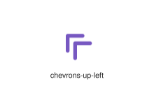
</div>
</div>

{{#endtab}}
{{#tab name="Code"}}

```xml
{{#include ../samples/icons/Tabler-Icons/chevrons-up-left-0de072dd.xal}}
```

{{#endtab}}
{{#endtabs}}

<div class="xal-ref-tag"><code>&lt;item id=&#34;101287&#34; /&gt;</code></div>

</div>
<div class="xal-ref-card">
<div class="xal-ref-title">chevrons-up-right</div>

{{#tabs name="svg-ref-1287"}}
{{#tab name="Preview"}}
<div class="xal-ref-preview">
<div>
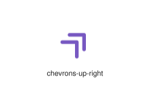
</div>
</div>

{{#endtab}}
{{#tab name="Code"}}

```xml
{{#include ../samples/icons/Tabler-Icons/chevrons-up-right-06a3f17b.xal}}
```

{{#endtab}}
{{#endtabs}}

<div class="xal-ref-tag"><code>&lt;item id=&#34;101288&#34; /&gt;</code></div>

</div>
<div class="xal-ref-card">
<div class="xal-ref-title">chevrons-up</div>

{{#tabs name="svg-ref-1288"}}
{{#tab name="Preview"}}
<div class="xal-ref-preview">
<div>
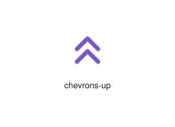
</div>
</div>

{{#endtab}}
{{#tab name="Code"}}

```xml
{{#include ../samples/icons/Tabler-Icons/chevrons-up-44ad432b.xal}}
```

{{#endtab}}
{{#endtabs}}

<div class="xal-ref-tag"><code>&lt;item id=&#34;101286&#34; /&gt;</code></div>

</div>
<div class="xal-ref-card">
<div class="xal-ref-title">chisel</div>

{{#tabs name="svg-ref-1289"}}
{{#tab name="Preview"}}
<div class="xal-ref-preview">
<div>
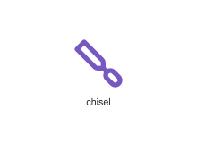
</div>
</div>

{{#endtab}}
{{#tab name="Code"}}

```xml
{{#include ../samples/icons/Tabler-Icons/chisel-fbfe83be.xal}}
```

{{#endtab}}
{{#endtabs}}

<div class="xal-ref-tag"><code>&lt;item id=&#34;101289&#34; /&gt;</code></div>

</div>
<div class="xal-ref-card">
<div class="xal-ref-title">christmas-ball</div>

{{#tabs name="svg-ref-1290"}}
{{#tab name="Preview"}}
<div class="xal-ref-preview">
<div>

</div>
</div>

{{#endtab}}
{{#tab name="Code"}}

```xml
{{#include ../samples/icons/Tabler-Icons/christmas-ball-dcd9cc03.xal}}
```

{{#endtab}}
{{#endtabs}}

<div class="xal-ref-tag"><code>&lt;item id=&#34;101290&#34; /&gt;</code></div>

</div>
<div class="xal-ref-card">
<div class="xal-ref-title">christmas-tree-off</div>

{{#tabs name="svg-ref-1291"}}
{{#tab name="Preview"}}
<div class="xal-ref-preview">
<div>

</div>
</div>

{{#endtab}}
{{#tab name="Code"}}

```xml
{{#include ../samples/icons/Tabler-Icons/christmas-tree-off-5cf276c5.xal}}
```

{{#endtab}}
{{#endtabs}}

<div class="xal-ref-tag"><code>&lt;item id=&#34;101292&#34; /&gt;</code></div>

</div>
<div class="xal-ref-card">
<div class="xal-ref-title">christmas-tree</div>

{{#tabs name="svg-ref-1292"}}
{{#tab name="Preview"}}
<div class="xal-ref-preview">
<div>
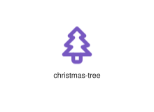
</div>
</div>

{{#endtab}}
{{#tab name="Code"}}

```xml
{{#include ../samples/icons/Tabler-Icons/christmas-tree-1a244145.xal}}
```

{{#endtab}}
{{#endtabs}}

<div class="xal-ref-tag"><code>&lt;item id=&#34;101291&#34; /&gt;</code></div>

</div>
<div class="xal-ref-card">
<div class="xal-ref-title">circle-arrow-down-left</div>

{{#tabs name="svg-ref-1293"}}
{{#tab name="Preview"}}
<div class="xal-ref-preview">
<div>
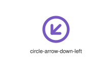
</div>
</div>

{{#endtab}}
{{#tab name="Code"}}

```xml
{{#include ../samples/icons/Tabler-Icons/circle-arrow-down-left-9b8dbc34.xal}}
```

{{#endtab}}
{{#endtabs}}

<div class="xal-ref-tag"><code>&lt;item id=&#34;101295&#34; /&gt;</code></div>

</div>
<div class="xal-ref-card">
<div class="xal-ref-title">circle-arrow-down-right</div>

{{#tabs name="svg-ref-1294"}}
{{#tab name="Preview"}}
<div class="xal-ref-preview">
<div>
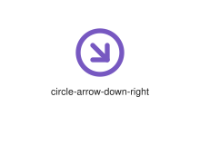
</div>
</div>

{{#endtab}}
{{#tab name="Code"}}

```xml
{{#include ../samples/icons/Tabler-Icons/circle-arrow-down-right-dfe3c669.xal}}
```

{{#endtab}}
{{#endtabs}}

<div class="xal-ref-tag"><code>&lt;item id=&#34;101296&#34; /&gt;</code></div>

</div>
<div class="xal-ref-card">
<div class="xal-ref-title">circle-arrow-down</div>

{{#tabs name="svg-ref-1295"}}
{{#tab name="Preview"}}
<div class="xal-ref-preview">
<div>
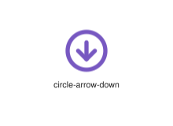
</div>
</div>

{{#endtab}}
{{#tab name="Code"}}

```xml
{{#include ../samples/icons/Tabler-Icons/circle-arrow-down-1af6b2ba.xal}}
```

{{#endtab}}
{{#endtabs}}

<div class="xal-ref-tag"><code>&lt;item id=&#34;101294&#34; /&gt;</code></div>

</div>
<div class="xal-ref-card">
<div class="xal-ref-title">circle-arrow-left</div>

{{#tabs name="svg-ref-1296"}}
{{#tab name="Preview"}}
<div class="xal-ref-preview">
<div>
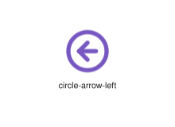
</div>
</div>

{{#endtab}}
{{#tab name="Code"}}

```xml
{{#include ../samples/icons/Tabler-Icons/circle-arrow-left-8fb9a85c.xal}}
```

{{#endtab}}
{{#endtabs}}

<div class="xal-ref-tag"><code>&lt;item id=&#34;101297&#34; /&gt;</code></div>

</div>
<div class="xal-ref-card">
<div class="xal-ref-title">circle-arrow-right</div>

{{#tabs name="svg-ref-1297"}}
{{#tab name="Preview"}}
<div class="xal-ref-preview">
<div>
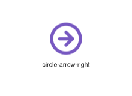
</div>
</div>

{{#endtab}}
{{#tab name="Code"}}

```xml
{{#include ../samples/icons/Tabler-Icons/circle-arrow-right-9c9e1b17.xal}}
```

{{#endtab}}
{{#endtabs}}

<div class="xal-ref-tag"><code>&lt;item id=&#34;101298&#34; /&gt;</code></div>

</div>
<div class="xal-ref-card">
<div class="xal-ref-title">circle-arrow-up-left</div>

{{#tabs name="svg-ref-1298"}}
{{#tab name="Preview"}}
<div class="xal-ref-preview">
<div>
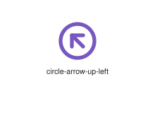
</div>
</div>

{{#endtab}}
{{#tab name="Code"}}

```xml
{{#include ../samples/icons/Tabler-Icons/circle-arrow-up-left-dcee3ed8.xal}}
```

{{#endtab}}
{{#endtabs}}

<div class="xal-ref-tag"><code>&lt;item id=&#34;101300&#34; /&gt;</code></div>

</div>
<div class="xal-ref-card">
<div class="xal-ref-title">circle-arrow-up-right</div>

{{#tabs name="svg-ref-1299"}}
{{#tab name="Preview"}}
<div class="xal-ref-preview">
<div>
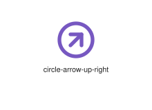
</div>
</div>

{{#endtab}}
{{#tab name="Code"}}

```xml
{{#include ../samples/icons/Tabler-Icons/circle-arrow-up-right-76180bb8.xal}}
```

{{#endtab}}
{{#endtabs}}

<div class="xal-ref-tag"><code>&lt;item id=&#34;101301&#34; /&gt;</code></div>

</div>
<div class="xal-ref-card">
<div class="xal-ref-title">circle-arrow-up</div>

{{#tabs name="svg-ref-1300"}}
{{#tab name="Preview"}}
<div class="xal-ref-preview">
<div>
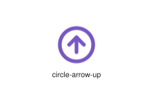
</div>
</div>

{{#endtab}}
{{#tab name="Code"}}

```xml
{{#include ../samples/icons/Tabler-Icons/circle-arrow-up-3ac338e0.xal}}
```

{{#endtab}}
{{#endtabs}}

<div class="xal-ref-tag"><code>&lt;item id=&#34;101299&#34; /&gt;</code></div>

</div>
<div class="xal-ref-card">
<div class="xal-ref-title">circle-caret-down</div>

{{#tabs name="svg-ref-1301"}}
{{#tab name="Preview"}}
<div class="xal-ref-preview">
<div>

</div>
</div>

{{#endtab}}
{{#tab name="Code"}}

```xml
{{#include ../samples/icons/Tabler-Icons/circle-caret-down-fbcd5f84.xal}}
```

{{#endtab}}
{{#endtabs}}

<div class="xal-ref-tag"><code>&lt;item id=&#34;101302&#34; /&gt;</code></div>

</div>
<div class="xal-ref-card">
<div class="xal-ref-title">circle-caret-left</div>

{{#tabs name="svg-ref-1302"}}
{{#tab name="Preview"}}
<div class="xal-ref-preview">
<div>
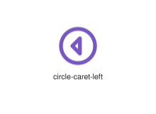
</div>
</div>

{{#endtab}}
{{#tab name="Code"}}

```xml
{{#include ../samples/icons/Tabler-Icons/circle-caret-left-6e824562.xal}}
```

{{#endtab}}
{{#endtabs}}

<div class="xal-ref-tag"><code>&lt;item id=&#34;101303&#34; /&gt;</code></div>

</div>
<div class="xal-ref-card">
<div class="xal-ref-title">circle-caret-right</div>

{{#tabs name="svg-ref-1303"}}
{{#tab name="Preview"}}
<div class="xal-ref-preview">
<div>

</div>
</div>

{{#endtab}}
{{#tab name="Code"}}

```xml
{{#include ../samples/icons/Tabler-Icons/circle-caret-right-5d1e3d51.xal}}
```

{{#endtab}}
{{#endtabs}}

<div class="xal-ref-tag"><code>&lt;item id=&#34;101304&#34; /&gt;</code></div>

</div>
<div class="xal-ref-card">
<div class="xal-ref-title">circle-caret-up</div>

{{#tabs name="svg-ref-1304"}}
{{#tab name="Preview"}}
<div class="xal-ref-preview">
<div>
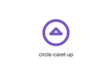
</div>
</div>

{{#endtab}}
{{#tab name="Code"}}

```xml
{{#include ../samples/icons/Tabler-Icons/circle-caret-up-fa4d89c8.xal}}
```

{{#endtab}}
{{#endtabs}}

<div class="xal-ref-tag"><code>&lt;item id=&#34;101305&#34; /&gt;</code></div>

</div>
<div class="xal-ref-card">
<div class="xal-ref-title">circle-check</div>

{{#tabs name="svg-ref-1305"}}
{{#tab name="Preview"}}
<div class="xal-ref-preview">
<div>
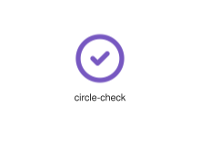
</div>
</div>

{{#endtab}}
{{#tab name="Code"}}

```xml
{{#include ../samples/icons/Tabler-Icons/circle-check-1fcc4e83.xal}}
```

{{#endtab}}
{{#endtabs}}

<div class="xal-ref-tag"><code>&lt;item id=&#34;101306&#34; /&gt;</code></div>

</div>
<div class="xal-ref-card">
<div class="xal-ref-title">circle-chevron-down</div>

{{#tabs name="svg-ref-1306"}}
{{#tab name="Preview"}}
<div class="xal-ref-preview">
<div>
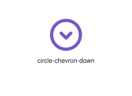
</div>
</div>

{{#endtab}}
{{#tab name="Code"}}

```xml
{{#include ../samples/icons/Tabler-Icons/circle-chevron-down-47ea3c53.xal}}
```

{{#endtab}}
{{#endtabs}}

<div class="xal-ref-tag"><code>&lt;item id=&#34;101307&#34; /&gt;</code></div>

</div>
<div class="xal-ref-card">
<div class="xal-ref-title">circle-chevron-left</div>

{{#tabs name="svg-ref-1307"}}
{{#tab name="Preview"}}
<div class="xal-ref-preview">
<div>
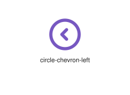
</div>
</div>

{{#endtab}}
{{#tab name="Code"}}

```xml
{{#include ../samples/icons/Tabler-Icons/circle-chevron-left-d2a526b5.xal}}
```

{{#endtab}}
{{#endtabs}}

<div class="xal-ref-tag"><code>&lt;item id=&#34;101308&#34; /&gt;</code></div>

</div>
<div class="xal-ref-card">
<div class="xal-ref-title">circle-chevron-right</div>

{{#tabs name="svg-ref-1308"}}
{{#tab name="Preview"}}
<div class="xal-ref-preview">
<div>
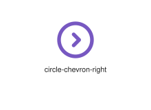
</div>
</div>

{{#endtab}}
{{#tab name="Code"}}

```xml
{{#include ../samples/icons/Tabler-Icons/circle-chevron-right-45155d45.xal}}
```

{{#endtab}}
{{#endtabs}}

<div class="xal-ref-tag"><code>&lt;item id=&#34;101309&#34; /&gt;</code></div>

</div>
<div class="xal-ref-card">
<div class="xal-ref-title">circle-chevron-up</div>

{{#tabs name="svg-ref-1309"}}
{{#tab name="Preview"}}
<div class="xal-ref-preview">
<div>
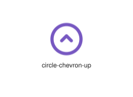
</div>
</div>

{{#endtab}}
{{#tab name="Code"}}

```xml
{{#include ../samples/icons/Tabler-Icons/circle-chevron-up-1efa5863.xal}}
```

{{#endtab}}
{{#endtabs}}

<div class="xal-ref-tag"><code>&lt;item id=&#34;101310&#34; /&gt;</code></div>

</div>
<div class="xal-ref-card">
<div class="xal-ref-title">circle-chevrons-down</div>

{{#tabs name="svg-ref-1310"}}
{{#tab name="Preview"}}
<div class="xal-ref-preview">
<div>
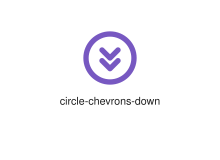
</div>
</div>

{{#endtab}}
{{#tab name="Code"}}

```xml
{{#include ../samples/icons/Tabler-Icons/circle-chevrons-down-3f1901c2.xal}}
```

{{#endtab}}
{{#endtabs}}

<div class="xal-ref-tag"><code>&lt;item id=&#34;101311&#34; /&gt;</code></div>

</div>
<div class="xal-ref-card">
<div class="xal-ref-title">circle-chevrons-left</div>

{{#tabs name="svg-ref-1311"}}
{{#tab name="Preview"}}
<div class="xal-ref-preview">
<div>
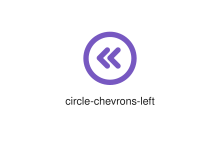
</div>
</div>

{{#endtab}}
{{#tab name="Code"}}

```xml
{{#include ../samples/icons/Tabler-Icons/circle-chevrons-left-aa561b24.xal}}
```

{{#endtab}}
{{#endtabs}}

<div class="xal-ref-tag"><code>&lt;item id=&#34;101312&#34; /&gt;</code></div>

</div>
<div class="xal-ref-card">
<div class="xal-ref-title">circle-chevrons-right</div>

{{#tabs name="svg-ref-1312"}}
{{#tab name="Preview"}}
<div class="xal-ref-preview">
<div>
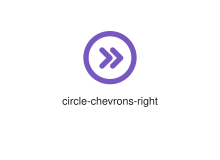
</div>
</div>

{{#endtab}}
{{#tab name="Code"}}

```xml
{{#include ../samples/icons/Tabler-Icons/circle-chevrons-right-c2650daa.xal}}
```

{{#endtab}}
{{#endtabs}}

<div class="xal-ref-tag"><code>&lt;item id=&#34;101313&#34; /&gt;</code></div>

</div>
<div class="xal-ref-card">
<div class="xal-ref-title">circle-chevrons-up</div>

{{#tabs name="svg-ref-1313"}}
{{#tab name="Preview"}}
<div class="xal-ref-preview">
<div>
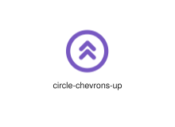
</div>
</div>

{{#endtab}}
{{#tab name="Code"}}

```xml
{{#include ../samples/icons/Tabler-Icons/circle-chevrons-up-3e7c4175.xal}}
```

{{#endtab}}
{{#endtabs}}

<div class="xal-ref-tag"><code>&lt;item id=&#34;101314&#34; /&gt;</code></div>

</div>
<div class="xal-ref-card">
<div class="xal-ref-title">circle-dashed-check</div>

{{#tabs name="svg-ref-1314"}}
{{#tab name="Preview"}}
<div class="xal-ref-preview">
<div>
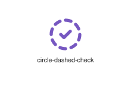
</div>
</div>

{{#endtab}}
{{#tab name="Code"}}

```xml
{{#include ../samples/icons/Tabler-Icons/circle-dashed-check-87f46c04.xal}}
```

{{#endtab}}
{{#endtabs}}

<div class="xal-ref-tag"><code>&lt;item id=&#34;101316&#34; /&gt;</code></div>

</div>
<div class="xal-ref-card">
<div class="xal-ref-title">circle-dashed-letter-a</div>

{{#tabs name="svg-ref-1315"}}
{{#tab name="Preview"}}
<div class="xal-ref-preview">
<div>

</div>
</div>

{{#endtab}}
{{#tab name="Code"}}

```xml
{{#include ../samples/icons/Tabler-Icons/circle-dashed-letter-a-3dbe2c2e.xal}}
```

{{#endtab}}
{{#endtabs}}

<div class="xal-ref-tag"><code>&lt;item id=&#34;101317&#34; /&gt;</code></div>

</div>
<div class="xal-ref-card">
<div class="xal-ref-title">circle-dashed-letter-b</div>

{{#tabs name="svg-ref-1316"}}
{{#tab name="Preview"}}
<div class="xal-ref-preview">
<div>

</div>
</div>

{{#endtab}}
{{#tab name="Code"}}

```xml
{{#include ../samples/icons/Tabler-Icons/circle-dashed-letter-b-7a1e56fe.xal}}
```

{{#endtab}}
{{#endtabs}}

<div class="xal-ref-tag"><code>&lt;item id=&#34;101318&#34; /&gt;</code></div>

</div>
<div class="xal-ref-card">
<div class="xal-ref-title">circle-dashed-letter-c</div>

{{#tabs name="svg-ref-1317"}}
{{#tab name="Preview"}}
<div class="xal-ref-preview">
<div>

</div>
</div>

{{#endtab}}
{{#tab name="Code"}}

```xml
{{#include ../samples/icons/Tabler-Icons/circle-dashed-letter-c-477e7f4e.xal}}
```

{{#endtab}}
{{#endtabs}}

<div class="xal-ref-tag"><code>&lt;item id=&#34;101319&#34; /&gt;</code></div>

</div>
<div class="xal-ref-card">
<div class="xal-ref-title">circle-dashed-letter-d</div>

{{#tabs name="svg-ref-1318"}}
{{#tab name="Preview"}}
<div class="xal-ref-preview">
<div>

</div>
</div>

{{#endtab}}
{{#tab name="Code"}}

```xml
{{#include ../samples/icons/Tabler-Icons/circle-dashed-letter-d-f55ea35e.xal}}
```

{{#endtab}}
{{#endtabs}}

<div class="xal-ref-tag"><code>&lt;item id=&#34;101320&#34; /&gt;</code></div>

</div>
<div class="xal-ref-card">
<div class="xal-ref-title">circle-dashed-letter-e</div>

{{#tabs name="svg-ref-1319"}}
{{#tab name="Preview"}}
<div class="xal-ref-preview">
<div>

</div>
</div>

{{#endtab}}
{{#tab name="Code"}}

```xml
{{#include ../samples/icons/Tabler-Icons/circle-dashed-letter-e-c83e8aee.xal}}
```

{{#endtab}}
{{#endtabs}}

<div class="xal-ref-tag"><code>&lt;item id=&#34;101321&#34; /&gt;</code></div>

</div>
<div class="xal-ref-card">
<div class="xal-ref-title">circle-dashed-letter-f</div>

{{#tabs name="svg-ref-1320"}}
{{#tab name="Preview"}}
<div class="xal-ref-preview">
<div>

</div>
</div>

{{#endtab}}
{{#tab name="Code"}}

```xml
{{#include ../samples/icons/Tabler-Icons/circle-dashed-letter-f-8f9ef03e.xal}}
```

{{#endtab}}
{{#endtabs}}

<div class="xal-ref-tag"><code>&lt;item id=&#34;101322&#34; /&gt;</code></div>

</div>
<div class="xal-ref-card">
<div class="xal-ref-title">circle-dashed-letter-g</div>

{{#tabs name="svg-ref-1321"}}
{{#tab name="Preview"}}
<div class="xal-ref-preview">
<div>

</div>
</div>

{{#endtab}}
{{#tab name="Code"}}

```xml
{{#include ../samples/icons/Tabler-Icons/circle-dashed-letter-g-b2fed98e.xal}}
```

{{#endtab}}
{{#endtabs}}

<div class="xal-ref-tag"><code>&lt;item id=&#34;101323&#34; /&gt;</code></div>

</div>
<div class="xal-ref-card">
<div class="xal-ref-title">circle-dashed-letter-h</div>

{{#tabs name="svg-ref-1322"}}
{{#tab name="Preview"}}
<div class="xal-ref-preview">
<div>

</div>
</div>

{{#endtab}}
{{#tab name="Code"}}

```xml
{{#include ../samples/icons/Tabler-Icons/circle-dashed-letter-h-30ae4e5f.xal}}
```

{{#endtab}}
{{#endtabs}}

<div class="xal-ref-tag"><code>&lt;item id=&#34;101324&#34; /&gt;</code></div>

</div>
<div class="xal-ref-card">
<div class="xal-ref-title">circle-dashed-letter-i</div>

{{#tabs name="svg-ref-1323"}}
{{#tab name="Preview"}}
<div class="xal-ref-preview">
<div>

</div>
</div>

{{#endtab}}
{{#tab name="Code"}}

```xml
{{#include ../samples/icons/Tabler-Icons/circle-dashed-letter-i-0dce67ef.xal}}
```

{{#endtab}}
{{#endtabs}}

<div class="xal-ref-tag"><code>&lt;item id=&#34;101325&#34; /&gt;</code></div>

</div>
<div class="xal-ref-card">
<div class="xal-ref-title">circle-dashed-letter-j</div>

{{#tabs name="svg-ref-1324"}}
{{#tab name="Preview"}}
<div class="xal-ref-preview">
<div>

</div>
</div>

{{#endtab}}
{{#tab name="Code"}}

```xml
{{#include ../samples/icons/Tabler-Icons/circle-dashed-letter-j-4a6e1d3f.xal}}
```

{{#endtab}}
{{#endtabs}}

<div class="xal-ref-tag"><code>&lt;item id=&#34;101326&#34; /&gt;</code></div>

</div>
<div class="xal-ref-card">
<div class="xal-ref-title">circle-dashed-letter-k</div>

{{#tabs name="svg-ref-1325"}}
{{#tab name="Preview"}}
<div class="xal-ref-preview">
<div>

</div>
</div>

{{#endtab}}
{{#tab name="Code"}}

```xml
{{#include ../samples/icons/Tabler-Icons/circle-dashed-letter-k-770e348f.xal}}
```

{{#endtab}}
{{#endtabs}}

<div class="xal-ref-tag"><code>&lt;item id=&#34;101327&#34; /&gt;</code></div>

</div>
<div class="xal-ref-card">
<div class="xal-ref-title">circle-dashed-letter-l</div>

{{#tabs name="svg-ref-1326"}}
{{#tab name="Preview"}}
<div class="xal-ref-preview">
<div>

</div>
</div>

{{#endtab}}
{{#tab name="Code"}}

```xml
{{#include ../samples/icons/Tabler-Icons/circle-dashed-letter-l-c52ee89f.xal}}
```

{{#endtab}}
{{#endtabs}}

<div class="xal-ref-tag"><code>&lt;item id=&#34;101328&#34; /&gt;</code></div>

</div>
<div class="xal-ref-card">
<div class="xal-ref-title">circle-dashed-letter-m</div>

{{#tabs name="svg-ref-1327"}}
{{#tab name="Preview"}}
<div class="xal-ref-preview">
<div>

</div>
</div>

{{#endtab}}
{{#tab name="Code"}}

```xml
{{#include ../samples/icons/Tabler-Icons/circle-dashed-letter-m-f84ec12f.xal}}
```

{{#endtab}}
{{#endtabs}}

<div class="xal-ref-tag"><code>&lt;item id=&#34;101329&#34; /&gt;</code></div>

</div>
<div class="xal-ref-card">
<div class="xal-ref-title">circle-dashed-letter-n</div>

{{#tabs name="svg-ref-1328"}}
{{#tab name="Preview"}}
<div class="xal-ref-preview">
<div>

</div>
</div>

{{#endtab}}
{{#tab name="Code"}}

```xml
{{#include ../samples/icons/Tabler-Icons/circle-dashed-letter-n-bfeebbff.xal}}
```

{{#endtab}}
{{#endtabs}}

<div class="xal-ref-tag"><code>&lt;item id=&#34;101330&#34; /&gt;</code></div>

</div>
<div class="xal-ref-card">
<div class="xal-ref-title">circle-dashed-letter-o</div>

{{#tabs name="svg-ref-1329"}}
{{#tab name="Preview"}}
<div class="xal-ref-preview">
<div>

</div>
</div>

{{#endtab}}
{{#tab name="Code"}}

```xml
{{#include ../samples/icons/Tabler-Icons/circle-dashed-letter-o-828e924f.xal}}
```

{{#endtab}}
{{#endtabs}}

<div class="xal-ref-tag"><code>&lt;item id=&#34;101331&#34; /&gt;</code></div>

</div>
<div class="xal-ref-card">
<div class="xal-ref-title">circle-dashed-letter-p</div>

{{#tabs name="svg-ref-1330"}}
{{#tab name="Preview"}}
<div class="xal-ref-preview">
<div>

</div>
</div>

{{#endtab}}
{{#tab name="Code"}}

```xml
{{#include ../samples/icons/Tabler-Icons/circle-dashed-letter-p-603e921c.xal}}
```

{{#endtab}}
{{#endtabs}}

<div class="xal-ref-tag"><code>&lt;item id=&#34;101332&#34; /&gt;</code></div>

</div>
<div class="xal-ref-card">
<div class="xal-ref-title">circle-dashed-letter-q</div>

{{#tabs name="svg-ref-1331"}}
{{#tab name="Preview"}}
<div class="xal-ref-preview">
<div>

</div>
</div>

{{#endtab}}
{{#tab name="Code"}}

```xml
{{#include ../samples/icons/Tabler-Icons/circle-dashed-letter-q-5d5ebbac.xal}}
```

{{#endtab}}
{{#endtabs}}

<div class="xal-ref-tag"><code>&lt;item id=&#34;101333&#34; /&gt;</code></div>

</div>
<div class="xal-ref-card">
<div class="xal-ref-title">circle-dashed-letter-r</div>

{{#tabs name="svg-ref-1332"}}
{{#tab name="Preview"}}
<div class="xal-ref-preview">
<div>

</div>
</div>

{{#endtab}}
{{#tab name="Code"}}

```xml
{{#include ../samples/icons/Tabler-Icons/circle-dashed-letter-r-1afec17c.xal}}
```

{{#endtab}}
{{#endtabs}}

<div class="xal-ref-tag"><code>&lt;item id=&#34;101334&#34; /&gt;</code></div>

</div>
<div class="xal-ref-card">
<div class="xal-ref-title">circle-dashed-letter-s</div>

{{#tabs name="svg-ref-1333"}}
{{#tab name="Preview"}}
<div class="xal-ref-preview">
<div>

</div>
</div>

{{#endtab}}
{{#tab name="Code"}}

```xml
{{#include ../samples/icons/Tabler-Icons/circle-dashed-letter-s-279ee8cc.xal}}
```

{{#endtab}}
{{#endtabs}}

<div class="xal-ref-tag"><code>&lt;item id=&#34;101335&#34; /&gt;</code></div>

</div>
<div class="xal-ref-card">
<div class="xal-ref-title">circle-dashed-letter-t</div>

{{#tabs name="svg-ref-1334"}}
{{#tab name="Preview"}}
<div class="xal-ref-preview">
<div>

</div>
</div>

{{#endtab}}
{{#tab name="Code"}}

```xml
{{#include ../samples/icons/Tabler-Icons/circle-dashed-letter-t-95be34dc.xal}}
```

{{#endtab}}
{{#endtabs}}

<div class="xal-ref-tag"><code>&lt;item id=&#34;101336&#34; /&gt;</code></div>

</div>
<div class="xal-ref-card">
<div class="xal-ref-title">circle-dashed-letter-u</div>

{{#tabs name="svg-ref-1335"}}
{{#tab name="Preview"}}
<div class="xal-ref-preview">
<div>

</div>
</div>

{{#endtab}}
{{#tab name="Code"}}

```xml
{{#include ../samples/icons/Tabler-Icons/circle-dashed-letter-u-a8de1d6c.xal}}
```

{{#endtab}}
{{#endtabs}}

<div class="xal-ref-tag"><code>&lt;item id=&#34;101337&#34; /&gt;</code></div>

</div>
<div class="xal-ref-card">
<div class="xal-ref-title">circle-dashed-letter-v</div>

{{#tabs name="svg-ref-1336"}}
{{#tab name="Preview"}}
<div class="xal-ref-preview">
<div>

</div>
</div>

{{#endtab}}
{{#tab name="Code"}}

```xml
{{#include ../samples/icons/Tabler-Icons/circle-dashed-letter-v-ef7e67bc.xal}}
```

{{#endtab}}
{{#endtabs}}

<div class="xal-ref-tag"><code>&lt;item id=&#34;101338&#34; /&gt;</code></div>

</div>
<div class="xal-ref-card">
<div class="xal-ref-title">circle-dashed-letter-w</div>

{{#tabs name="svg-ref-1337"}}
{{#tab name="Preview"}}
<div class="xal-ref-preview">
<div>

</div>
</div>

{{#endtab}}
{{#tab name="Code"}}

```xml
{{#include ../samples/icons/Tabler-Icons/circle-dashed-letter-w-d21e4e0c.xal}}
```

{{#endtab}}
{{#endtabs}}

<div class="xal-ref-tag"><code>&lt;item id=&#34;101339&#34; /&gt;</code></div>

</div>
<div class="xal-ref-card">
<div class="xal-ref-title">circle-dashed-letter-x</div>

{{#tabs name="svg-ref-1338"}}
{{#tab name="Preview"}}
<div class="xal-ref-preview">
<div>

</div>
</div>

{{#endtab}}
{{#tab name="Code"}}

```xml
{{#include ../samples/icons/Tabler-Icons/circle-dashed-letter-x-504ed9dd.xal}}
```

{{#endtab}}
{{#endtabs}}

<div class="xal-ref-tag"><code>&lt;item id=&#34;101340&#34; /&gt;</code></div>

</div>
<div class="xal-ref-card">
<div class="xal-ref-title">circle-dashed-letter-y</div>

{{#tabs name="svg-ref-1339"}}
{{#tab name="Preview"}}
<div class="xal-ref-preview">
<div>

</div>
</div>

{{#endtab}}
{{#tab name="Code"}}

```xml
{{#include ../samples/icons/Tabler-Icons/circle-dashed-letter-y-6d2ef06d.xal}}
```

{{#endtab}}
{{#endtabs}}

<div class="xal-ref-tag"><code>&lt;item id=&#34;101341&#34; /&gt;</code></div>

</div>
<div class="xal-ref-card">
<div class="xal-ref-title">circle-dashed-letter-z</div>

{{#tabs name="svg-ref-1340"}}
{{#tab name="Preview"}}
<div class="xal-ref-preview">
<div>

</div>
</div>

{{#endtab}}
{{#tab name="Code"}}

```xml
{{#include ../samples/icons/Tabler-Icons/circle-dashed-letter-z-2a8e8abd.xal}}
```

{{#endtab}}
{{#endtabs}}

<div class="xal-ref-tag"><code>&lt;item id=&#34;101342&#34; /&gt;</code></div>

</div>
<div class="xal-ref-card">
<div class="xal-ref-title">circle-dashed-minus</div>

{{#tabs name="svg-ref-1341"}}
{{#tab name="Preview"}}
<div class="xal-ref-preview">
<div>

</div>
</div>

{{#endtab}}
{{#tab name="Code"}}

```xml
{{#include ../samples/icons/Tabler-Icons/circle-dashed-minus-0484de37.xal}}
```

{{#endtab}}
{{#endtabs}}

<div class="xal-ref-tag"><code>&lt;item id=&#34;101343&#34; /&gt;</code></div>

</div>
<div class="xal-ref-card">
<div class="xal-ref-title">circle-dashed-number-0</div>

{{#tabs name="svg-ref-1342"}}
{{#tab name="Preview"}}
<div class="xal-ref-preview">
<div>

</div>
</div>

{{#endtab}}
{{#tab name="Code"}}

```xml
{{#include ../samples/icons/Tabler-Icons/circle-dashed-number-0-7e6101d8.xal}}
```

{{#endtab}}
{{#endtabs}}

<div class="xal-ref-tag"><code>&lt;item id=&#34;101344&#34; /&gt;</code></div>

</div>
<div class="xal-ref-card">
<div class="xal-ref-title">circle-dashed-number-1</div>

{{#tabs name="svg-ref-1343"}}
{{#tab name="Preview"}}
<div class="xal-ref-preview">
<div>

</div>
</div>

{{#endtab}}
{{#tab name="Code"}}

```xml
{{#include ../samples/icons/Tabler-Icons/circle-dashed-number-1-43012868.xal}}
```

{{#endtab}}
{{#endtabs}}

<div class="xal-ref-tag"><code>&lt;item id=&#34;101345&#34; /&gt;</code></div>

</div>
<div class="xal-ref-card">
<div class="xal-ref-title">circle-dashed-number-2</div>

{{#tabs name="svg-ref-1344"}}
{{#tab name="Preview"}}
<div class="xal-ref-preview">
<div>

</div>
</div>

{{#endtab}}
{{#tab name="Code"}}

```xml
{{#include ../samples/icons/Tabler-Icons/circle-dashed-number-2-04a152b8.xal}}
```

{{#endtab}}
{{#endtabs}}

<div class="xal-ref-tag"><code>&lt;item id=&#34;101346&#34; /&gt;</code></div>

</div>
<div class="xal-ref-card">
<div class="xal-ref-title">circle-dashed-number-3</div>

{{#tabs name="svg-ref-1345"}}
{{#tab name="Preview"}}
<div class="xal-ref-preview">
<div>

</div>
</div>

{{#endtab}}
{{#tab name="Code"}}

```xml
{{#include ../samples/icons/Tabler-Icons/circle-dashed-number-3-39c17b08.xal}}
```

{{#endtab}}
{{#endtabs}}

<div class="xal-ref-tag"><code>&lt;item id=&#34;101347&#34; /&gt;</code></div>

</div>
<div class="xal-ref-card">
<div class="xal-ref-title">circle-dashed-number-4</div>

{{#tabs name="svg-ref-1346"}}
{{#tab name="Preview"}}
<div class="xal-ref-preview">
<div>

</div>
</div>

{{#endtab}}
{{#tab name="Code"}}

```xml
{{#include ../samples/icons/Tabler-Icons/circle-dashed-number-4-8be1a718.xal}}
```

{{#endtab}}
{{#endtabs}}

<div class="xal-ref-tag"><code>&lt;item id=&#34;101348&#34; /&gt;</code></div>

</div>
<div class="xal-ref-card">
<div class="xal-ref-title">circle-dashed-number-5</div>

{{#tabs name="svg-ref-1347"}}
{{#tab name="Preview"}}
<div class="xal-ref-preview">
<div>

</div>
</div>

{{#endtab}}
{{#tab name="Code"}}

```xml
{{#include ../samples/icons/Tabler-Icons/circle-dashed-number-5-b6818ea8.xal}}
```

{{#endtab}}
{{#endtabs}}

<div class="xal-ref-tag"><code>&lt;item id=&#34;101349&#34; /&gt;</code></div>

</div>
<div class="xal-ref-card">
<div class="xal-ref-title">circle-dashed-number-6</div>

{{#tabs name="svg-ref-1348"}}
{{#tab name="Preview"}}
<div class="xal-ref-preview">
<div>

</div>
</div>

{{#endtab}}
{{#tab name="Code"}}

```xml
{{#include ../samples/icons/Tabler-Icons/circle-dashed-number-6-f121f478.xal}}
```

{{#endtab}}
{{#endtabs}}

<div class="xal-ref-tag"><code>&lt;item id=&#34;101350&#34; /&gt;</code></div>

</div>
<div class="xal-ref-card">
<div class="xal-ref-title">circle-dashed-number-7</div>

{{#tabs name="svg-ref-1349"}}
{{#tab name="Preview"}}
<div class="xal-ref-preview">
<div>

</div>
</div>

{{#endtab}}
{{#tab name="Code"}}

```xml
{{#include ../samples/icons/Tabler-Icons/circle-dashed-number-7-cc41ddc8.xal}}
```

{{#endtab}}
{{#endtabs}}

<div class="xal-ref-tag"><code>&lt;item id=&#34;101351&#34; /&gt;</code></div>

</div>
</div>
