# Tabler-Icons - Page 22

This page references SVG files under `etc/resources/aws/svg/Tabler-Icons`.
Each card shows the SVG preview first and the XAL tag syntax in the Code tab.
Showing 1891-1980 of 4964 SVG files.

<style>
.xal-ref-grid{display:grid;grid-template-columns:repeat(3,minmax(0,1fr));gap:1rem;margin:1rem 0 1.5rem}.xal-ref-card{border:1px solid var(--table-border-color);border-radius:8px;overflow:hidden;background:var(--bg);padding:.75rem}.xal-ref-title{font-size:.9rem;font-weight:600;line-height:1.25;margin:0 0 .5rem;overflow-wrap:anywhere}.xal-ref-preview{display:flex;align-items:center;justify-content:center}.xal-ref-preview img{display:block;width:100%;height:auto}.xal-ref-card pre{margin:0;max-height:18rem;overflow:auto;white-space:pre}.xal-ref-card code{font-size:.78em}.xal-ref-tag{margin:.5rem 0 0;color:var(--fg);opacity:.72;overflow:auto;white-space:pre}.xal-ref-tag code{font-size:.72em}@media(max-width:900px){.xal-ref-grid{grid-template-columns:repeat(2,minmax(0,1fr))}}@media(max-width:560px){.xal-ref-grid{grid-template-columns:1fr}}
</style>

[Back to section index](tabler-icons.md)

<div class="xal-ref-grid">
<div class="xal-ref-card">
<div class="xal-ref-title">device-ipad-star</div>

{{#tabs name="svg-ref-1890"}}
{{#tab name="Preview"}}
<div class="xal-ref-preview">
<div>

</div>
</div>

{{#endtab}}
{{#tab name="Code"}}

```xml
{{#include ../samples/icons/Tabler-Icons/device-ipad-star-367013b0.xal}}
```

{{#endtab}}
{{#endtabs}}

<div class="xal-ref-tag"><code>&lt;item id=&#34;101891&#34; /&gt;</code></div>

</div>
<div class="xal-ref-card">
<div class="xal-ref-title">device-ipad-up</div>

{{#tabs name="svg-ref-1891"}}
{{#tab name="Preview"}}
<div class="xal-ref-preview">
<div>
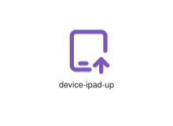
</div>
</div>

{{#endtab}}
{{#tab name="Code"}}

```xml
{{#include ../samples/icons/Tabler-Icons/device-ipad-up-6967483e.xal}}
```

{{#endtab}}
{{#endtabs}}

<div class="xal-ref-tag"><code>&lt;item id=&#34;101892&#34; /&gt;</code></div>

</div>
<div class="xal-ref-card">
<div class="xal-ref-title">device-ipad-x</div>

{{#tabs name="svg-ref-1892"}}
{{#tab name="Preview"}}
<div class="xal-ref-preview">
<div>
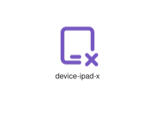
</div>
</div>

{{#endtab}}
{{#tab name="Code"}}

```xml
{{#include ../samples/icons/Tabler-Icons/device-ipad-x-ce0165a6.xal}}
```

{{#endtab}}
{{#endtabs}}

<div class="xal-ref-tag"><code>&lt;item id=&#34;101893&#34; /&gt;</code></div>

</div>
<div class="xal-ref-card">
<div class="xal-ref-title">device-ipad</div>

{{#tabs name="svg-ref-1893"}}
{{#tab name="Preview"}}
<div class="xal-ref-preview">
<div>
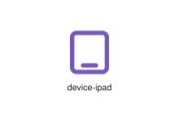
</div>
</div>

{{#endtab}}
{{#tab name="Code"}}

```xml
{{#include ../samples/icons/Tabler-Icons/device-ipad-220ce4a8.xal}}
```

{{#endtab}}
{{#endtabs}}

<div class="xal-ref-tag"><code>&lt;item id=&#34;101852&#34; /&gt;</code></div>

</div>
<div class="xal-ref-card">
<div class="xal-ref-title">device-landline-phone</div>

{{#tabs name="svg-ref-1894"}}
{{#tab name="Preview"}}
<div class="xal-ref-preview">
<div>
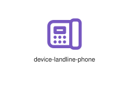
</div>
</div>

{{#endtab}}
{{#tab name="Code"}}

```xml
{{#include ../samples/icons/Tabler-Icons/device-landline-phone-5c7734e1.xal}}
```

{{#endtab}}
{{#endtabs}}

<div class="xal-ref-tag"><code>&lt;item id=&#34;101894&#34; /&gt;</code></div>

</div>
<div class="xal-ref-card">
<div class="xal-ref-title">device-laptop-off</div>

{{#tabs name="svg-ref-1895"}}
{{#tab name="Preview"}}
<div class="xal-ref-preview">
<div>

</div>
</div>

{{#endtab}}
{{#tab name="Code"}}

```xml
{{#include ../samples/icons/Tabler-Icons/device-laptop-off-3bdfb1ea.xal}}
```

{{#endtab}}
{{#endtabs}}

<div class="xal-ref-tag"><code>&lt;item id=&#34;101896&#34; /&gt;</code></div>

</div>
<div class="xal-ref-card">
<div class="xal-ref-title">device-laptop</div>

{{#tabs name="svg-ref-1896"}}
{{#tab name="Preview"}}
<div class="xal-ref-preview">
<div>

</div>
</div>

{{#endtab}}
{{#tab name="Code"}}

```xml
{{#include ../samples/icons/Tabler-Icons/device-laptop-36bcb50d.xal}}
```

{{#endtab}}
{{#endtabs}}

<div class="xal-ref-tag"><code>&lt;item id=&#34;101895&#34; /&gt;</code></div>

</div>
<div class="xal-ref-card">
<div class="xal-ref-title">device-mobile-bolt</div>

{{#tabs name="svg-ref-1897"}}
{{#tab name="Preview"}}
<div class="xal-ref-preview">
<div>

</div>
</div>

{{#endtab}}
{{#tab name="Code"}}

```xml
{{#include ../samples/icons/Tabler-Icons/device-mobile-bolt-9c09006d.xal}}
```

{{#endtab}}
{{#endtabs}}

<div class="xal-ref-tag"><code>&lt;item id=&#34;101898&#34; /&gt;</code></div>

</div>
<div class="xal-ref-card">
<div class="xal-ref-title">device-mobile-cancel</div>

{{#tabs name="svg-ref-1898"}}
{{#tab name="Preview"}}
<div class="xal-ref-preview">
<div>

</div>
</div>

{{#endtab}}
{{#tab name="Code"}}

```xml
{{#include ../samples/icons/Tabler-Icons/device-mobile-cancel-6edc721b.xal}}
```

{{#endtab}}
{{#endtabs}}

<div class="xal-ref-tag"><code>&lt;item id=&#34;101899&#34; /&gt;</code></div>

</div>
<div class="xal-ref-card">
<div class="xal-ref-title">device-mobile-charging</div>

{{#tabs name="svg-ref-1899"}}
{{#tab name="Preview"}}
<div class="xal-ref-preview">
<div>
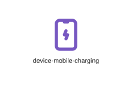
</div>
</div>

{{#endtab}}
{{#tab name="Code"}}

```xml
{{#include ../samples/icons/Tabler-Icons/device-mobile-charging-5219810d.xal}}
```

{{#endtab}}
{{#endtabs}}

<div class="xal-ref-tag"><code>&lt;item id=&#34;101900&#34; /&gt;</code></div>

</div>
<div class="xal-ref-card">
<div class="xal-ref-title">device-mobile-check</div>

{{#tabs name="svg-ref-1900"}}
{{#tab name="Preview"}}
<div class="xal-ref-preview">
<div>

</div>
</div>

{{#endtab}}
{{#tab name="Code"}}

```xml
{{#include ../samples/icons/Tabler-Icons/device-mobile-check-58d88484.xal}}
```

{{#endtab}}
{{#endtabs}}

<div class="xal-ref-tag"><code>&lt;item id=&#34;101901&#34; /&gt;</code></div>

</div>
<div class="xal-ref-card">
<div class="xal-ref-title">device-mobile-code</div>

{{#tabs name="svg-ref-1901"}}
{{#tab name="Preview"}}
<div class="xal-ref-preview">
<div>

</div>
</div>

{{#endtab}}
{{#tab name="Code"}}

```xml
{{#include ../samples/icons/Tabler-Icons/device-mobile-code-e1703cac.xal}}
```

{{#endtab}}
{{#endtabs}}

<div class="xal-ref-tag"><code>&lt;item id=&#34;101902&#34; /&gt;</code></div>

</div>
<div class="xal-ref-card">
<div class="xal-ref-title">device-mobile-cog</div>

{{#tabs name="svg-ref-1902"}}
{{#tab name="Preview"}}
<div class="xal-ref-preview">
<div>

</div>
</div>

{{#endtab}}
{{#tab name="Code"}}

```xml
{{#include ../samples/icons/Tabler-Icons/device-mobile-cog-09d808b2.xal}}
```

{{#endtab}}
{{#endtabs}}

<div class="xal-ref-tag"><code>&lt;item id=&#34;101903&#34; /&gt;</code></div>

</div>
<div class="xal-ref-card">
<div class="xal-ref-title">device-mobile-dollar</div>

{{#tabs name="svg-ref-1903"}}
{{#tab name="Preview"}}
<div class="xal-ref-preview">
<div>

</div>
</div>

{{#endtab}}
{{#tab name="Code"}}

```xml
{{#include ../samples/icons/Tabler-Icons/device-mobile-dollar-b4eeae91.xal}}
```

{{#endtab}}
{{#endtabs}}

<div class="xal-ref-tag"><code>&lt;item id=&#34;101904&#34; /&gt;</code></div>

</div>
<div class="xal-ref-card">
<div class="xal-ref-title">device-mobile-down</div>

{{#tabs name="svg-ref-1904"}}
{{#tab name="Preview"}}
<div class="xal-ref-preview">
<div>
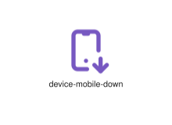
</div>
</div>

{{#endtab}}
{{#tab name="Code"}}

```xml
{{#include ../samples/icons/Tabler-Icons/device-mobile-down-19277491.xal}}
```

{{#endtab}}
{{#endtabs}}

<div class="xal-ref-tag"><code>&lt;item id=&#34;101905&#34; /&gt;</code></div>

</div>
<div class="xal-ref-card">
<div class="xal-ref-title">device-mobile-exclamation</div>

{{#tabs name="svg-ref-1905"}}
{{#tab name="Preview"}}
<div class="xal-ref-preview">
<div>

</div>
</div>

{{#endtab}}
{{#tab name="Code"}}

```xml
{{#include ../samples/icons/Tabler-Icons/device-mobile-exclamation-03b405af.xal}}
```

{{#endtab}}
{{#endtabs}}

<div class="xal-ref-tag"><code>&lt;item id=&#34;101906&#34; /&gt;</code></div>

</div>
<div class="xal-ref-card">
<div class="xal-ref-title">device-mobile-heart</div>

{{#tabs name="svg-ref-1906"}}
{{#tab name="Preview"}}
<div class="xal-ref-preview">
<div>
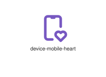
</div>
</div>

{{#endtab}}
{{#tab name="Code"}}

```xml
{{#include ../samples/icons/Tabler-Icons/device-mobile-heart-9ffdfaf6.xal}}
```

{{#endtab}}
{{#endtabs}}

<div class="xal-ref-tag"><code>&lt;item id=&#34;101907&#34; /&gt;</code></div>

</div>
<div class="xal-ref-card">
<div class="xal-ref-title">device-mobile-message</div>

{{#tabs name="svg-ref-1907"}}
{{#tab name="Preview"}}
<div class="xal-ref-preview">
<div>

</div>
</div>

{{#endtab}}
{{#tab name="Code"}}

```xml
{{#include ../samples/icons/Tabler-Icons/device-mobile-message-2ca89a95.xal}}
```

{{#endtab}}
{{#endtabs}}

<div class="xal-ref-tag"><code>&lt;item id=&#34;101908&#34; /&gt;</code></div>

</div>
<div class="xal-ref-card">
<div class="xal-ref-title">device-mobile-minus</div>

{{#tabs name="svg-ref-1908"}}
{{#tab name="Preview"}}
<div class="xal-ref-preview">
<div>
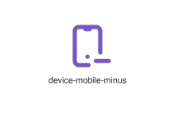
</div>
</div>

{{#endtab}}
{{#tab name="Code"}}

```xml
{{#include ../samples/icons/Tabler-Icons/device-mobile-minus-dba836b7.xal}}
```

{{#endtab}}
{{#endtabs}}

<div class="xal-ref-tag"><code>&lt;item id=&#34;101909&#34; /&gt;</code></div>

</div>
<div class="xal-ref-card">
<div class="xal-ref-title">device-mobile-off</div>

{{#tabs name="svg-ref-1909"}}
{{#tab name="Preview"}}
<div class="xal-ref-preview">
<div>

</div>
</div>

{{#endtab}}
{{#tab name="Code"}}

```xml
{{#include ../samples/icons/Tabler-Icons/device-mobile-off-d4171abe.xal}}
```

{{#endtab}}
{{#endtabs}}

<div class="xal-ref-tag"><code>&lt;item id=&#34;101910&#34; /&gt;</code></div>

</div>
<div class="xal-ref-card">
<div class="xal-ref-title">device-mobile-pause</div>

{{#tabs name="svg-ref-1910"}}
{{#tab name="Preview"}}
<div class="xal-ref-preview">
<div>

</div>
</div>

{{#endtab}}
{{#tab name="Code"}}

```xml
{{#include ../samples/icons/Tabler-Icons/device-mobile-pause-09e2c12f.xal}}
```

{{#endtab}}
{{#endtabs}}

<div class="xal-ref-tag"><code>&lt;item id=&#34;101911&#34; /&gt;</code></div>

</div>
<div class="xal-ref-card">
<div class="xal-ref-title">device-mobile-pin</div>

{{#tabs name="svg-ref-1911"}}
{{#tab name="Preview"}}
<div class="xal-ref-preview">
<div>

</div>
</div>

{{#endtab}}
{{#tab name="Code"}}

```xml
{{#include ../samples/icons/Tabler-Icons/device-mobile-pin-84a70f8d.xal}}
```

{{#endtab}}
{{#endtabs}}

<div class="xal-ref-tag"><code>&lt;item id=&#34;101912&#34; /&gt;</code></div>

</div>
<div class="xal-ref-card">
<div class="xal-ref-title">device-mobile-plus</div>

{{#tabs name="svg-ref-1912"}}
{{#tab name="Preview"}}
<div class="xal-ref-preview">
<div>

</div>
</div>

{{#endtab}}
{{#tab name="Code"}}

```xml
{{#include ../samples/icons/Tabler-Icons/device-mobile-plus-0586a3e5.xal}}
```

{{#endtab}}
{{#endtabs}}

<div class="xal-ref-tag"><code>&lt;item id=&#34;101913&#34; /&gt;</code></div>

</div>
<div class="xal-ref-card">
<div class="xal-ref-title">device-mobile-question</div>

{{#tabs name="svg-ref-1913"}}
{{#tab name="Preview"}}
<div class="xal-ref-preview">
<div>

</div>
</div>

{{#endtab}}
{{#tab name="Code"}}

```xml
{{#include ../samples/icons/Tabler-Icons/device-mobile-question-fdb04887.xal}}
```

{{#endtab}}
{{#endtabs}}

<div class="xal-ref-tag"><code>&lt;item id=&#34;101914&#34; /&gt;</code></div>

</div>
<div class="xal-ref-card">
<div class="xal-ref-title">device-mobile-rotated</div>

{{#tabs name="svg-ref-1914"}}
{{#tab name="Preview"}}
<div class="xal-ref-preview">
<div>
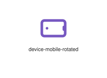
</div>
</div>

{{#endtab}}
{{#tab name="Code"}}

```xml
{{#include ../samples/icons/Tabler-Icons/device-mobile-rotated-19355a1c.xal}}
```

{{#endtab}}
{{#endtabs}}

<div class="xal-ref-tag"><code>&lt;item id=&#34;101915&#34; /&gt;</code></div>

</div>
<div class="xal-ref-card">
<div class="xal-ref-title">device-mobile-search</div>

{{#tabs name="svg-ref-1915"}}
{{#tab name="Preview"}}
<div class="xal-ref-preview">
<div>

</div>
</div>

{{#endtab}}
{{#tab name="Code"}}

```xml
{{#include ../samples/icons/Tabler-Icons/device-mobile-search-2fce62f4.xal}}
```

{{#endtab}}
{{#endtabs}}

<div class="xal-ref-tag"><code>&lt;item id=&#34;101916&#34; /&gt;</code></div>

</div>
<div class="xal-ref-card">
<div class="xal-ref-title">device-mobile-share</div>

{{#tabs name="svg-ref-1916"}}
{{#tab name="Preview"}}
<div class="xal-ref-preview">
<div>

</div>
</div>

{{#endtab}}
{{#tab name="Code"}}

```xml
{{#include ../samples/icons/Tabler-Icons/device-mobile-share-77ed8db9.xal}}
```

{{#endtab}}
{{#endtabs}}

<div class="xal-ref-tag"><code>&lt;item id=&#34;101917&#34; /&gt;</code></div>

</div>
<div class="xal-ref-card">
<div class="xal-ref-title">device-mobile-star</div>

{{#tabs name="svg-ref-1917"}}
{{#tab name="Preview"}}
<div class="xal-ref-preview">
<div>

</div>
</div>

{{#endtab}}
{{#tab name="Code"}}

```xml
{{#include ../samples/icons/Tabler-Icons/device-mobile-star-7a1f1f92.xal}}
```

{{#endtab}}
{{#endtabs}}

<div class="xal-ref-tag"><code>&lt;item id=&#34;101918&#34; /&gt;</code></div>

</div>
<div class="xal-ref-card">
<div class="xal-ref-title">device-mobile-up</div>

{{#tabs name="svg-ref-1918"}}
{{#tab name="Preview"}}
<div class="xal-ref-preview">
<div>

</div>
</div>

{{#endtab}}
{{#tab name="Code"}}

```xml
{{#include ../samples/icons/Tabler-Icons/device-mobile-up-c3ae767b.xal}}
```

{{#endtab}}
{{#endtabs}}

<div class="xal-ref-tag"><code>&lt;item id=&#34;101919&#34; /&gt;</code></div>

</div>
<div class="xal-ref-card">
<div class="xal-ref-title">device-mobile-vibration</div>

{{#tabs name="svg-ref-1919"}}
{{#tab name="Preview"}}
<div class="xal-ref-preview">
<div>
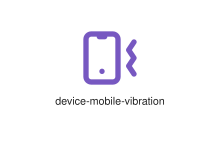
</div>
</div>

{{#endtab}}
{{#tab name="Code"}}

```xml
{{#include ../samples/icons/Tabler-Icons/device-mobile-vibration-5d8eceb3.xal}}
```

{{#endtab}}
{{#endtabs}}

<div class="xal-ref-tag"><code>&lt;item id=&#34;101920&#34; /&gt;</code></div>

</div>
<div class="xal-ref-card">
<div class="xal-ref-title">device-mobile-x</div>

{{#tabs name="svg-ref-1920"}}
{{#tab name="Preview"}}
<div class="xal-ref-preview">
<div>

</div>
</div>

{{#endtab}}
{{#tab name="Code"}}

```xml
{{#include ../samples/icons/Tabler-Icons/device-mobile-x-0d737fc8.xal}}
```

{{#endtab}}
{{#endtabs}}

<div class="xal-ref-tag"><code>&lt;item id=&#34;101921&#34; /&gt;</code></div>

</div>
<div class="xal-ref-card">
<div class="xal-ref-title">device-mobile</div>

{{#tabs name="svg-ref-1921"}}
{{#tab name="Preview"}}
<div class="xal-ref-preview">
<div>
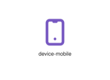
</div>
</div>

{{#endtab}}
{{#tab name="Code"}}

```xml
{{#include ../samples/icons/Tabler-Icons/device-mobile-07bfa4a5.xal}}
```

{{#endtab}}
{{#endtabs}}

<div class="xal-ref-tag"><code>&lt;item id=&#34;101897&#34; /&gt;</code></div>

</div>
<div class="xal-ref-card">
<div class="xal-ref-title">device-nintendo-off</div>

{{#tabs name="svg-ref-1922"}}
{{#tab name="Preview"}}
<div class="xal-ref-preview">
<div>

</div>
</div>

{{#endtab}}
{{#tab name="Code"}}

```xml
{{#include ../samples/icons/Tabler-Icons/device-nintendo-off-dd771763.xal}}
```

{{#endtab}}
{{#endtabs}}

<div class="xal-ref-tag"><code>&lt;item id=&#34;101923&#34; /&gt;</code></div>

</div>
<div class="xal-ref-card">
<div class="xal-ref-title">device-nintendo</div>

{{#tabs name="svg-ref-1923"}}
{{#tab name="Preview"}}
<div class="xal-ref-preview">
<div>

</div>
</div>

{{#endtab}}
{{#tab name="Code"}}

```xml
{{#include ../samples/icons/Tabler-Icons/device-nintendo-32347d34.xal}}
```

{{#endtab}}
{{#endtabs}}

<div class="xal-ref-tag"><code>&lt;item id=&#34;101922&#34; /&gt;</code></div>

</div>
<div class="xal-ref-card">
<div class="xal-ref-title">device-projector</div>

{{#tabs name="svg-ref-1924"}}
{{#tab name="Preview"}}
<div class="xal-ref-preview">
<div>

</div>
</div>

{{#endtab}}
{{#tab name="Code"}}

```xml
{{#include ../samples/icons/Tabler-Icons/device-projector-869dcbec.xal}}
```

{{#endtab}}
{{#endtabs}}

<div class="xal-ref-tag"><code>&lt;item id=&#34;101924&#34; /&gt;</code></div>

</div>
<div class="xal-ref-card">
<div class="xal-ref-title">device-remote</div>

{{#tabs name="svg-ref-1925"}}
{{#tab name="Preview"}}
<div class="xal-ref-preview">
<div>
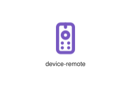
</div>
</div>

{{#endtab}}
{{#tab name="Code"}}

```xml
{{#include ../samples/icons/Tabler-Icons/device-remote-1141533e.xal}}
```

{{#endtab}}
{{#endtabs}}

<div class="xal-ref-tag"><code>&lt;item id=&#34;101925&#34; /&gt;</code></div>

</div>
<div class="xal-ref-card">
<div class="xal-ref-title">device-sd-card</div>

{{#tabs name="svg-ref-1926"}}
{{#tab name="Preview"}}
<div class="xal-ref-preview">
<div>
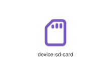
</div>
</div>

{{#endtab}}
{{#tab name="Code"}}

```xml
{{#include ../samples/icons/Tabler-Icons/device-sd-card-32d6121e.xal}}
```

{{#endtab}}
{{#endtabs}}

<div class="xal-ref-tag"><code>&lt;item id=&#34;101926&#34; /&gt;</code></div>

</div>
<div class="xal-ref-card">
<div class="xal-ref-title">device-sim-1</div>

{{#tabs name="svg-ref-1927"}}
{{#tab name="Preview"}}
<div class="xal-ref-preview">
<div>
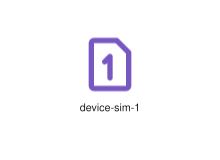
</div>
</div>

{{#endtab}}
{{#tab name="Code"}}

```xml
{{#include ../samples/icons/Tabler-Icons/device-sim-1-e2d3d9a0.xal}}
```

{{#endtab}}
{{#endtabs}}

<div class="xal-ref-tag"><code>&lt;item id=&#34;101928&#34; /&gt;</code></div>

</div>
<div class="xal-ref-card">
<div class="xal-ref-title">device-sim-2</div>

{{#tabs name="svg-ref-1928"}}
{{#tab name="Preview"}}
<div class="xal-ref-preview">
<div>
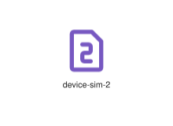
</div>
</div>

{{#endtab}}
{{#tab name="Code"}}

```xml
{{#include ../samples/icons/Tabler-Icons/device-sim-2-a573a370.xal}}
```

{{#endtab}}
{{#endtabs}}

<div class="xal-ref-tag"><code>&lt;item id=&#34;101929&#34; /&gt;</code></div>

</div>
<div class="xal-ref-card">
<div class="xal-ref-title">device-sim-3</div>

{{#tabs name="svg-ref-1929"}}
{{#tab name="Preview"}}
<div class="xal-ref-preview">
<div>
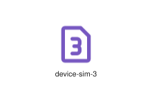
</div>
</div>

{{#endtab}}
{{#tab name="Code"}}

```xml
{{#include ../samples/icons/Tabler-Icons/device-sim-3-98138ac0.xal}}
```

{{#endtab}}
{{#endtabs}}

<div class="xal-ref-tag"><code>&lt;item id=&#34;101930&#34; /&gt;</code></div>

</div>
<div class="xal-ref-card">
<div class="xal-ref-title">device-sim</div>

{{#tabs name="svg-ref-1930"}}
{{#tab name="Preview"}}
<div class="xal-ref-preview">
<div>
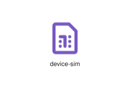
</div>
</div>

{{#endtab}}
{{#tab name="Code"}}

```xml
{{#include ../samples/icons/Tabler-Icons/device-sim-a415cd28.xal}}
```

{{#endtab}}
{{#endtabs}}

<div class="xal-ref-tag"><code>&lt;item id=&#34;101927&#34; /&gt;</code></div>

</div>
<div class="xal-ref-card">
<div class="xal-ref-title">device-speaker-off</div>

{{#tabs name="svg-ref-1931"}}
{{#tab name="Preview"}}
<div class="xal-ref-preview">
<div>

</div>
</div>

{{#endtab}}
{{#tab name="Code"}}

```xml
{{#include ../samples/icons/Tabler-Icons/device-speaker-off-b197d38a.xal}}
```

{{#endtab}}
{{#endtabs}}

<div class="xal-ref-tag"><code>&lt;item id=&#34;101932&#34; /&gt;</code></div>

</div>
<div class="xal-ref-card">
<div class="xal-ref-title">device-speaker</div>

{{#tabs name="svg-ref-1932"}}
{{#tab name="Preview"}}
<div class="xal-ref-preview">
<div>

</div>
</div>

{{#endtab}}
{{#tab name="Code"}}

```xml
{{#include ../samples/icons/Tabler-Icons/device-speaker-6eff9aa1.xal}}
```

{{#endtab}}
{{#endtabs}}

<div class="xal-ref-tag"><code>&lt;item id=&#34;101931&#34; /&gt;</code></div>

</div>
<div class="xal-ref-card">
<div class="xal-ref-title">device-tablet-bolt</div>

{{#tabs name="svg-ref-1933"}}
{{#tab name="Preview"}}
<div class="xal-ref-preview">
<div>
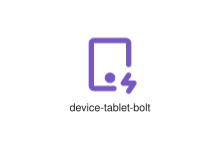
</div>
</div>

{{#endtab}}
{{#tab name="Code"}}

```xml
{{#include ../samples/icons/Tabler-Icons/device-tablet-bolt-4e007e8e.xal}}
```

{{#endtab}}
{{#endtabs}}

<div class="xal-ref-tag"><code>&lt;item id=&#34;101934&#34; /&gt;</code></div>

</div>
<div class="xal-ref-card">
<div class="xal-ref-title">device-tablet-cancel</div>

{{#tabs name="svg-ref-1934"}}
{{#tab name="Preview"}}
<div class="xal-ref-preview">
<div>
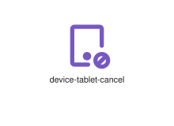
</div>
</div>

{{#endtab}}
{{#tab name="Code"}}

```xml
{{#include ../samples/icons/Tabler-Icons/device-tablet-cancel-ac325c06.xal}}
```

{{#endtab}}
{{#endtabs}}

<div class="xal-ref-tag"><code>&lt;item id=&#34;101935&#34; /&gt;</code></div>

</div>
<div class="xal-ref-card">
<div class="xal-ref-title">device-tablet-check</div>

{{#tabs name="svg-ref-1935"}}
{{#tab name="Preview"}}
<div class="xal-ref-preview">
<div>
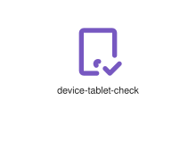
</div>
</div>

{{#endtab}}
{{#tab name="Code"}}

```xml
{{#include ../samples/icons/Tabler-Icons/device-tablet-check-61093e38.xal}}
```

{{#endtab}}
{{#endtabs}}

<div class="xal-ref-tag"><code>&lt;item id=&#34;101936&#34; /&gt;</code></div>

</div>
<div class="xal-ref-card">
<div class="xal-ref-title">device-tablet-code</div>

{{#tabs name="svg-ref-1936"}}
{{#tab name="Preview"}}
<div class="xal-ref-preview">
<div>

</div>
</div>

{{#endtab}}
{{#tab name="Code"}}

```xml
{{#include ../samples/icons/Tabler-Icons/device-tablet-code-3379424f.xal}}
```

{{#endtab}}
{{#endtabs}}

<div class="xal-ref-tag"><code>&lt;item id=&#34;101937&#34; /&gt;</code></div>

</div>
<div class="xal-ref-card">
<div class="xal-ref-title">device-tablet-cog</div>

{{#tabs name="svg-ref-1937"}}
{{#tab name="Preview"}}
<div class="xal-ref-preview">
<div>

</div>
</div>

{{#endtab}}
{{#tab name="Code"}}

```xml
{{#include ../samples/icons/Tabler-Icons/device-tablet-cog-0d231694.xal}}
```

{{#endtab}}
{{#endtabs}}

<div class="xal-ref-tag"><code>&lt;item id=&#34;101938&#34; /&gt;</code></div>

</div>
<div class="xal-ref-card">
<div class="xal-ref-title">device-tablet-dollar</div>

{{#tabs name="svg-ref-1938"}}
{{#tab name="Preview"}}
<div class="xal-ref-preview">
<div>
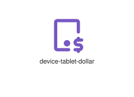
</div>
</div>

{{#endtab}}
{{#tab name="Code"}}

```xml
{{#include ../samples/icons/Tabler-Icons/device-tablet-dollar-7600808c.xal}}
```

{{#endtab}}
{{#endtabs}}

<div class="xal-ref-tag"><code>&lt;item id=&#34;101939&#34; /&gt;</code></div>

</div>
<div class="xal-ref-card">
<div class="xal-ref-title">device-tablet-down</div>

{{#tabs name="svg-ref-1939"}}
{{#tab name="Preview"}}
<div class="xal-ref-preview">
<div>
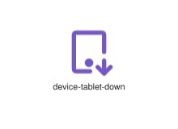
</div>
</div>

{{#endtab}}
{{#tab name="Code"}}

```xml
{{#include ../samples/icons/Tabler-Icons/device-tablet-down-cb2e0a72.xal}}
```

{{#endtab}}
{{#endtabs}}

<div class="xal-ref-tag"><code>&lt;item id=&#34;101940&#34; /&gt;</code></div>

</div>
<div class="xal-ref-card">
<div class="xal-ref-title">device-tablet-exclamation</div>

{{#tabs name="svg-ref-1940"}}
{{#tab name="Preview"}}
<div class="xal-ref-preview">
<div>
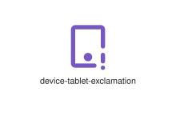
</div>
</div>

{{#endtab}}
{{#tab name="Code"}}

```xml
{{#include ../samples/icons/Tabler-Icons/device-tablet-exclamation-8199c6f7.xal}}
```

{{#endtab}}
{{#endtabs}}

<div class="xal-ref-tag"><code>&lt;item id=&#34;101941&#34; /&gt;</code></div>

</div>
<div class="xal-ref-card">
<div class="xal-ref-title">device-tablet-heart</div>

{{#tabs name="svg-ref-1941"}}
{{#tab name="Preview"}}
<div class="xal-ref-preview">
<div>
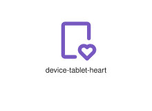
</div>
</div>

{{#endtab}}
{{#tab name="Code"}}

```xml
{{#include ../samples/icons/Tabler-Icons/device-tablet-heart-a62c404a.xal}}
```

{{#endtab}}
{{#endtabs}}

<div class="xal-ref-tag"><code>&lt;item id=&#34;101942&#34; /&gt;</code></div>

</div>
<div class="xal-ref-card">
<div class="xal-ref-title">device-tablet-minus</div>

{{#tabs name="svg-ref-1942"}}
{{#tab name="Preview"}}
<div class="xal-ref-preview">
<div>
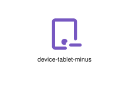
</div>
</div>

{{#endtab}}
{{#tab name="Code"}}

```xml
{{#include ../samples/icons/Tabler-Icons/device-tablet-minus-e2798c0b.xal}}
```

{{#endtab}}
{{#endtabs}}

<div class="xal-ref-tag"><code>&lt;item id=&#34;101943&#34; /&gt;</code></div>

</div>
<div class="xal-ref-card">
<div class="xal-ref-title">device-tablet-off</div>

{{#tabs name="svg-ref-1943"}}
{{#tab name="Preview"}}
<div class="xal-ref-preview">
<div>
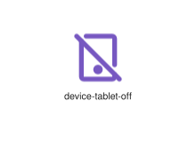
</div>
</div>

{{#endtab}}
{{#tab name="Code"}}

```xml
{{#include ../samples/icons/Tabler-Icons/device-tablet-off-d0ec0498.xal}}
```

{{#endtab}}
{{#endtabs}}

<div class="xal-ref-tag"><code>&lt;item id=&#34;101944&#34; /&gt;</code></div>

</div>
<div class="xal-ref-card">
<div class="xal-ref-title">device-tablet-pause</div>

{{#tabs name="svg-ref-1944"}}
{{#tab name="Preview"}}
<div class="xal-ref-preview">
<div>
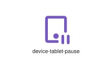
</div>
</div>

{{#endtab}}
{{#tab name="Code"}}

```xml
{{#include ../samples/icons/Tabler-Icons/device-tablet-pause-30337b93.xal}}
```

{{#endtab}}
{{#endtabs}}

<div class="xal-ref-tag"><code>&lt;item id=&#34;101945&#34; /&gt;</code></div>

</div>
<div class="xal-ref-card">
<div class="xal-ref-title">device-tablet-pin</div>

{{#tabs name="svg-ref-1945"}}
{{#tab name="Preview"}}
<div class="xal-ref-preview">
<div>

</div>
</div>

{{#endtab}}
{{#tab name="Code"}}

```xml
{{#include ../samples/icons/Tabler-Icons/device-tablet-pin-805c11ab.xal}}
```

{{#endtab}}
{{#endtabs}}

<div class="xal-ref-tag"><code>&lt;item id=&#34;101946&#34; /&gt;</code></div>

</div>
<div class="xal-ref-card">
<div class="xal-ref-title">device-tablet-plus</div>

{{#tabs name="svg-ref-1946"}}
{{#tab name="Preview"}}
<div class="xal-ref-preview">
<div>
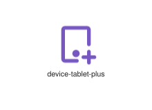
</div>
</div>

{{#endtab}}
{{#tab name="Code"}}

```xml
{{#include ../samples/icons/Tabler-Icons/device-tablet-plus-d78fdd06.xal}}
```

{{#endtab}}
{{#endtabs}}

<div class="xal-ref-tag"><code>&lt;item id=&#34;101947&#34; /&gt;</code></div>

</div>
<div class="xal-ref-card">
<div class="xal-ref-title">device-tablet-question</div>

{{#tabs name="svg-ref-1947"}}
{{#tab name="Preview"}}
<div class="xal-ref-preview">
<div>

</div>
</div>

{{#endtab}}
{{#tab name="Code"}}

```xml
{{#include ../samples/icons/Tabler-Icons/device-tablet-question-de0aebba.xal}}
```

{{#endtab}}
{{#endtabs}}

<div class="xal-ref-tag"><code>&lt;item id=&#34;101948&#34; /&gt;</code></div>

</div>
<div class="xal-ref-card">
<div class="xal-ref-title">device-tablet-search</div>

{{#tabs name="svg-ref-1948"}}
{{#tab name="Preview"}}
<div class="xal-ref-preview">
<div>
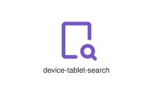
</div>
</div>

{{#endtab}}
{{#tab name="Code"}}

```xml
{{#include ../samples/icons/Tabler-Icons/device-tablet-search-ed204ce9.xal}}
```

{{#endtab}}
{{#endtabs}}

<div class="xal-ref-tag"><code>&lt;item id=&#34;101949&#34; /&gt;</code></div>

</div>
<div class="xal-ref-card">
<div class="xal-ref-title">device-tablet-share</div>

{{#tabs name="svg-ref-1949"}}
{{#tab name="Preview"}}
<div class="xal-ref-preview">
<div>
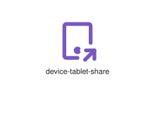
</div>
</div>

{{#endtab}}
{{#tab name="Code"}}

```xml
{{#include ../samples/icons/Tabler-Icons/device-tablet-share-4e3c3705.xal}}
```

{{#endtab}}
{{#endtabs}}

<div class="xal-ref-tag"><code>&lt;item id=&#34;101950&#34; /&gt;</code></div>

</div>
<div class="xal-ref-card">
<div class="xal-ref-title">device-tablet-star</div>

{{#tabs name="svg-ref-1950"}}
{{#tab name="Preview"}}
<div class="xal-ref-preview">
<div>

</div>
</div>

{{#endtab}}
{{#tab name="Code"}}

```xml
{{#include ../samples/icons/Tabler-Icons/device-tablet-star-a8166171.xal}}
```

{{#endtab}}
{{#endtabs}}

<div class="xal-ref-tag"><code>&lt;item id=&#34;101951&#34; /&gt;</code></div>

</div>
<div class="xal-ref-card">
<div class="xal-ref-title">device-tablet-up</div>

{{#tabs name="svg-ref-1951"}}
{{#tab name="Preview"}}
<div class="xal-ref-preview">
<div>
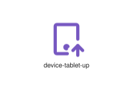
</div>
</div>

{{#endtab}}
{{#tab name="Code"}}

```xml
{{#include ../samples/icons/Tabler-Icons/device-tablet-up-e39645fd.xal}}
```

{{#endtab}}
{{#endtabs}}

<div class="xal-ref-tag"><code>&lt;item id=&#34;101952&#34; /&gt;</code></div>

</div>
<div class="xal-ref-card">
<div class="xal-ref-title">device-tablet-x</div>

{{#tabs name="svg-ref-1952"}}
{{#tab name="Preview"}}
<div class="xal-ref-preview">
<div>
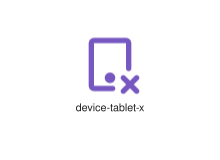
</div>
</div>

{{#endtab}}
{{#tab name="Code"}}

```xml
{{#include ../samples/icons/Tabler-Icons/device-tablet-x-5ac54abd.xal}}
```

{{#endtab}}
{{#endtabs}}

<div class="xal-ref-tag"><code>&lt;item id=&#34;101953&#34; /&gt;</code></div>

</div>
<div class="xal-ref-card">
<div class="xal-ref-title">device-tablet</div>

{{#tabs name="svg-ref-1953"}}
{{#tab name="Preview"}}
<div class="xal-ref-preview">
<div>
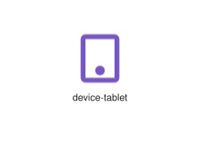
</div>
</div>

{{#endtab}}
{{#tab name="Code"}}

```xml
{{#include ../samples/icons/Tabler-Icons/device-tablet-3c711548.xal}}
```

{{#endtab}}
{{#endtabs}}

<div class="xal-ref-tag"><code>&lt;item id=&#34;101933&#34; /&gt;</code></div>

</div>
<div class="xal-ref-card">
<div class="xal-ref-title">device-tv-off</div>

{{#tabs name="svg-ref-1954"}}
{{#tab name="Preview"}}
<div class="xal-ref-preview">
<div>

</div>
</div>

{{#endtab}}
{{#tab name="Code"}}

```xml
{{#include ../samples/icons/Tabler-Icons/device-tv-off-a9314660.xal}}
```

{{#endtab}}
{{#endtabs}}

<div class="xal-ref-tag"><code>&lt;item id=&#34;101955&#34; /&gt;</code></div>

</div>
<div class="xal-ref-card">
<div class="xal-ref-title">device-tv-old</div>

{{#tabs name="svg-ref-1955"}}
{{#tab name="Preview"}}
<div class="xal-ref-preview">
<div>
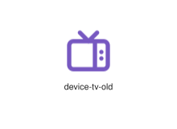
</div>
</div>

{{#endtab}}
{{#tab name="Code"}}

```xml
{{#include ../samples/icons/Tabler-Icons/device-tv-old-726a3666.xal}}
```

{{#endtab}}
{{#endtabs}}

<div class="xal-ref-tag"><code>&lt;item id=&#34;101956&#34; /&gt;</code></div>

</div>
<div class="xal-ref-card">
<div class="xal-ref-title">device-tv</div>

{{#tabs name="svg-ref-1956"}}
{{#tab name="Preview"}}
<div class="xal-ref-preview">
<div>
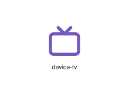
</div>
</div>

{{#endtab}}
{{#tab name="Code"}}

```xml
{{#include ../samples/icons/Tabler-Icons/device-tv-ced49b4b.xal}}
```

{{#endtab}}
{{#endtabs}}

<div class="xal-ref-tag"><code>&lt;item id=&#34;101954&#34; /&gt;</code></div>

</div>
<div class="xal-ref-card">
<div class="xal-ref-title">device-unknown</div>

{{#tabs name="svg-ref-1957"}}
{{#tab name="Preview"}}
<div class="xal-ref-preview">
<div>

</div>
</div>

{{#endtab}}
{{#tab name="Code"}}

```xml
{{#include ../samples/icons/Tabler-Icons/device-unknown-b18ed587.xal}}
```

{{#endtab}}
{{#endtabs}}

<div class="xal-ref-tag"><code>&lt;item id=&#34;101957&#34; /&gt;</code></div>

</div>
<div class="xal-ref-card">
<div class="xal-ref-title">device-usb</div>

{{#tabs name="svg-ref-1958"}}
{{#tab name="Preview"}}
<div class="xal-ref-preview">
<div>
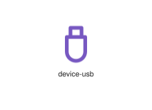
</div>
</div>

{{#endtab}}
{{#tab name="Code"}}

```xml
{{#include ../samples/icons/Tabler-Icons/device-usb-e7d84e3e.xal}}
```

{{#endtab}}
{{#endtabs}}

<div class="xal-ref-tag"><code>&lt;item id=&#34;101958&#34; /&gt;</code></div>

</div>
<div class="xal-ref-card">
<div class="xal-ref-title">device-vision-pro</div>

{{#tabs name="svg-ref-1959"}}
{{#tab name="Preview"}}
<div class="xal-ref-preview">
<div>

</div>
</div>

{{#endtab}}
{{#tab name="Code"}}

```xml
{{#include ../samples/icons/Tabler-Icons/device-vision-pro-a7668874.xal}}
```

{{#endtab}}
{{#endtabs}}

<div class="xal-ref-tag"><code>&lt;item id=&#34;101959&#34; /&gt;</code></div>

</div>
<div class="xal-ref-card">
<div class="xal-ref-title">device-watch-bolt</div>

{{#tabs name="svg-ref-1960"}}
{{#tab name="Preview"}}
<div class="xal-ref-preview">
<div>

</div>
</div>

{{#endtab}}
{{#tab name="Code"}}

```xml
{{#include ../samples/icons/Tabler-Icons/device-watch-bolt-bc59d6c1.xal}}
```

{{#endtab}}
{{#endtabs}}

<div class="xal-ref-tag"><code>&lt;item id=&#34;101961&#34; /&gt;</code></div>

</div>
<div class="xal-ref-card">
<div class="xal-ref-title">device-watch-cancel</div>

{{#tabs name="svg-ref-1961"}}
{{#tab name="Preview"}}
<div class="xal-ref-preview">
<div>
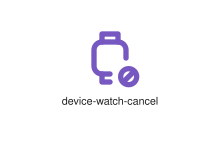
</div>
</div>

{{#endtab}}
{{#tab name="Code"}}

```xml
{{#include ../samples/icons/Tabler-Icons/device-watch-cancel-03ded64f.xal}}
```

{{#endtab}}
{{#endtabs}}

<div class="xal-ref-tag"><code>&lt;item id=&#34;101962&#34; /&gt;</code></div>

</div>
<div class="xal-ref-card">
<div class="xal-ref-title">device-watch-check</div>

{{#tabs name="svg-ref-1962"}}
{{#tab name="Preview"}}
<div class="xal-ref-preview">
<div>

</div>
</div>

{{#endtab}}
{{#tab name="Code"}}

```xml
{{#include ../samples/icons/Tabler-Icons/device-watch-check-87983b91.xal}}
```

{{#endtab}}
{{#endtabs}}

<div class="xal-ref-tag"><code>&lt;item id=&#34;101963&#34; /&gt;</code></div>

</div>
<div class="xal-ref-card">
<div class="xal-ref-title">device-watch-code</div>

{{#tabs name="svg-ref-1963"}}
{{#tab name="Preview"}}
<div class="xal-ref-preview">
<div>

</div>
</div>

{{#endtab}}
{{#tab name="Code"}}

```xml
{{#include ../samples/icons/Tabler-Icons/device-watch-code-c120ea00.xal}}
```

{{#endtab}}
{{#endtabs}}

<div class="xal-ref-tag"><code>&lt;item id=&#34;101964&#34; /&gt;</code></div>

</div>
<div class="xal-ref-card">
<div class="xal-ref-title">device-watch-cog</div>

{{#tabs name="svg-ref-1964"}}
{{#tab name="Preview"}}
<div class="xal-ref-preview">
<div>

</div>
</div>

{{#endtab}}
{{#tab name="Code"}}

```xml
{{#include ../samples/icons/Tabler-Icons/device-watch-cog-368b17c7.xal}}
```

{{#endtab}}
{{#endtabs}}

<div class="xal-ref-tag"><code>&lt;item id=&#34;101965&#34; /&gt;</code></div>

</div>
<div class="xal-ref-card">
<div class="xal-ref-title">device-watch-dollar</div>

{{#tabs name="svg-ref-1965"}}
{{#tab name="Preview"}}
<div class="xal-ref-preview">
<div>
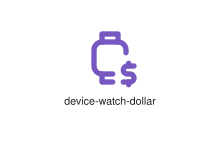
</div>
</div>

{{#endtab}}
{{#tab name="Code"}}

```xml
{{#include ../samples/icons/Tabler-Icons/device-watch-dollar-d9ec0ac5.xal}}
```

{{#endtab}}
{{#endtabs}}

<div class="xal-ref-tag"><code>&lt;item id=&#34;101966&#34; /&gt;</code></div>

</div>
<div class="xal-ref-card">
<div class="xal-ref-title">device-watch-down</div>

{{#tabs name="svg-ref-1966"}}
{{#tab name="Preview"}}
<div class="xal-ref-preview">
<div>

</div>
</div>

{{#endtab}}
{{#tab name="Code"}}

```xml
{{#include ../samples/icons/Tabler-Icons/device-watch-down-3977a23d.xal}}
```

{{#endtab}}
{{#endtabs}}

<div class="xal-ref-tag"><code>&lt;item id=&#34;101967&#34; /&gt;</code></div>

</div>
<div class="xal-ref-card">
<div class="xal-ref-title">device-watch-exclamation</div>

{{#tabs name="svg-ref-1967"}}
{{#tab name="Preview"}}
<div class="xal-ref-preview">
<div>
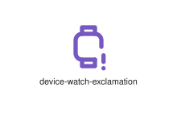
</div>
</div>

{{#endtab}}
{{#tab name="Code"}}

```xml
{{#include ../samples/icons/Tabler-Icons/device-watch-exclamation-dff92372.xal}}
```

{{#endtab}}
{{#endtabs}}

<div class="xal-ref-tag"><code>&lt;item id=&#34;101968&#34; /&gt;</code></div>

</div>
<div class="xal-ref-card">
<div class="xal-ref-title">device-watch-heart</div>

{{#tabs name="svg-ref-1968"}}
{{#tab name="Preview"}}
<div class="xal-ref-preview">
<div>
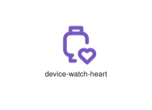
</div>
</div>

{{#endtab}}
{{#tab name="Code"}}

```xml
{{#include ../samples/icons/Tabler-Icons/device-watch-heart-40bd45e3.xal}}
```

{{#endtab}}
{{#endtabs}}

<div class="xal-ref-tag"><code>&lt;item id=&#34;101969&#34; /&gt;</code></div>

</div>
<div class="xal-ref-card">
<div class="xal-ref-title">device-watch-minus</div>

{{#tabs name="svg-ref-1969"}}
{{#tab name="Preview"}}
<div class="xal-ref-preview">
<div>
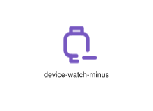
</div>
</div>

{{#endtab}}
{{#tab name="Code"}}

```xml
{{#include ../samples/icons/Tabler-Icons/device-watch-minus-04e889a2.xal}}
```

{{#endtab}}
{{#endtabs}}

<div class="xal-ref-tag"><code>&lt;item id=&#34;101970&#34; /&gt;</code></div>

</div>
<div class="xal-ref-card">
<div class="xal-ref-title">device-watch-off</div>

{{#tabs name="svg-ref-1970"}}
{{#tab name="Preview"}}
<div class="xal-ref-preview">
<div>
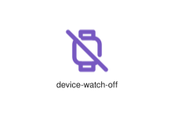
</div>
</div>

{{#endtab}}
{{#tab name="Code"}}

```xml
{{#include ../samples/icons/Tabler-Icons/device-watch-off-eb4405cb.xal}}
```

{{#endtab}}
{{#endtabs}}

<div class="xal-ref-tag"><code>&lt;item id=&#34;101971&#34; /&gt;</code></div>

</div>
<div class="xal-ref-card">
<div class="xal-ref-title">device-watch-pause</div>

{{#tabs name="svg-ref-1971"}}
{{#tab name="Preview"}}
<div class="xal-ref-preview">
<div>

</div>
</div>

{{#endtab}}
{{#tab name="Code"}}

```xml
{{#include ../samples/icons/Tabler-Icons/device-watch-pause-d6a27e3a.xal}}
```

{{#endtab}}
{{#endtabs}}

<div class="xal-ref-tag"><code>&lt;item id=&#34;101972&#34; /&gt;</code></div>

</div>
<div class="xal-ref-card">
<div class="xal-ref-title">device-watch-pin</div>

{{#tabs name="svg-ref-1972"}}
{{#tab name="Preview"}}
<div class="xal-ref-preview">
<div>

</div>
</div>

{{#endtab}}
{{#tab name="Code"}}

```xml
{{#include ../samples/icons/Tabler-Icons/device-watch-pin-bbf410f8.xal}}
```

{{#endtab}}
{{#endtabs}}

<div class="xal-ref-tag"><code>&lt;item id=&#34;101973&#34; /&gt;</code></div>

</div>
<div class="xal-ref-card">
<div class="xal-ref-title">device-watch-plus</div>

{{#tabs name="svg-ref-1973"}}
{{#tab name="Preview"}}
<div class="xal-ref-preview">
<div>
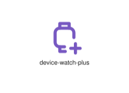
</div>
</div>

{{#endtab}}
{{#tab name="Code"}}

```xml
{{#include ../samples/icons/Tabler-Icons/device-watch-plus-25d67549.xal}}
```

{{#endtab}}
{{#endtabs}}

<div class="xal-ref-tag"><code>&lt;item id=&#34;101974&#34; /&gt;</code></div>

</div>
<div class="xal-ref-card">
<div class="xal-ref-title">device-watch-question</div>

{{#tabs name="svg-ref-1974"}}
{{#tab name="Preview"}}
<div class="xal-ref-preview">
<div>
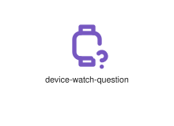
</div>
</div>

{{#endtab}}
{{#tab name="Code"}}

```xml
{{#include ../samples/icons/Tabler-Icons/device-watch-question-f2dcda24.xal}}
```

{{#endtab}}
{{#endtabs}}

<div class="xal-ref-tag"><code>&lt;item id=&#34;101975&#34; /&gt;</code></div>

</div>
<div class="xal-ref-card">
<div class="xal-ref-title">device-watch-search</div>

{{#tabs name="svg-ref-1975"}}
{{#tab name="Preview"}}
<div class="xal-ref-preview">
<div>
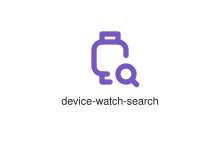
</div>
</div>

{{#endtab}}
{{#tab name="Code"}}

```xml
{{#include ../samples/icons/Tabler-Icons/device-watch-search-42ccc6a0.xal}}
```

{{#endtab}}
{{#endtabs}}

<div class="xal-ref-tag"><code>&lt;item id=&#34;101976&#34; /&gt;</code></div>

</div>
<div class="xal-ref-card">
<div class="xal-ref-title">device-watch-share</div>

{{#tabs name="svg-ref-1976"}}
{{#tab name="Preview"}}
<div class="xal-ref-preview">
<div>

</div>
</div>

{{#endtab}}
{{#tab name="Code"}}

```xml
{{#include ../samples/icons/Tabler-Icons/device-watch-share-a8ad32ac.xal}}
```

{{#endtab}}
{{#endtabs}}

<div class="xal-ref-tag"><code>&lt;item id=&#34;101977&#34; /&gt;</code></div>

</div>
<div class="xal-ref-card">
<div class="xal-ref-title">device-watch-star</div>

{{#tabs name="svg-ref-1977"}}
{{#tab name="Preview"}}
<div class="xal-ref-preview">
<div>

</div>
</div>

{{#endtab}}
{{#tab name="Code"}}

```xml
{{#include ../samples/icons/Tabler-Icons/device-watch-star-5a4fc93e.xal}}
```

{{#endtab}}
{{#endtabs}}

<div class="xal-ref-tag"><code>&lt;item id=&#34;101978&#34; /&gt;</code></div>

</div>
<div class="xal-ref-card">
<div class="xal-ref-title">device-watch-stats-2</div>

{{#tabs name="svg-ref-1978"}}
{{#tab name="Preview"}}
<div class="xal-ref-preview">
<div>
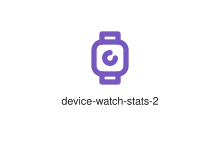
</div>
</div>

{{#endtab}}
{{#tab name="Code"}}

```xml
{{#include ../samples/icons/Tabler-Icons/device-watch-stats-2-286ddc1f.xal}}
```

{{#endtab}}
{{#endtabs}}

<div class="xal-ref-tag"><code>&lt;item id=&#34;101980&#34; /&gt;</code></div>

</div>
<div class="xal-ref-card">
<div class="xal-ref-title">device-watch-stats</div>

{{#tabs name="svg-ref-1979"}}
{{#tab name="Preview"}}
<div class="xal-ref-preview">
<div>
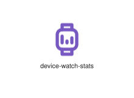
</div>
</div>

{{#endtab}}
{{#tab name="Code"}}

```xml
{{#include ../samples/icons/Tabler-Icons/device-watch-stats-ba4097f7.xal}}
```

{{#endtab}}
{{#endtabs}}

<div class="xal-ref-tag"><code>&lt;item id=&#34;101979&#34; /&gt;</code></div>

</div>
</div>
