# Tabler-Icons - Page 23

This page references SVG files under `etc/resources/aws/svg/Tabler-Icons`.
Each card shows the SVG preview first and the XAL tag syntax in the Code tab.
Showing 1981-2070 of 4964 SVG files.

<style>
.xal-ref-grid{display:grid;grid-template-columns:repeat(3,minmax(0,1fr));gap:1rem;margin:1rem 0 1.5rem}.xal-ref-card{border:1px solid var(--table-border-color);border-radius:8px;overflow:hidden;background:var(--bg);padding:.75rem}.xal-ref-title{font-size:.9rem;font-weight:600;line-height:1.25;margin:0 0 .5rem;overflow-wrap:anywhere}.xal-ref-preview{display:flex;align-items:center;justify-content:center}.xal-ref-preview img{display:block;width:100%;height:auto}.xal-ref-card pre{margin:0;max-height:18rem;overflow:auto;white-space:pre}.xal-ref-card code{font-size:.78em}.xal-ref-tag{margin:.5rem 0 0;color:var(--fg);opacity:.72;overflow:auto;white-space:pre}.xal-ref-tag code{font-size:.72em}@media(max-width:900px){.xal-ref-grid{grid-template-columns:repeat(2,minmax(0,1fr))}}@media(max-width:560px){.xal-ref-grid{grid-template-columns:1fr}}
</style>

[Back to section index](tabler-icons.md)

<div class="xal-ref-grid">
<div class="xal-ref-card">
<div class="xal-ref-title">device-watch-up</div>

{{#tabs name="svg-ref-1980"}}
{{#tab name="Preview"}}
<div class="xal-ref-preview">
<div>
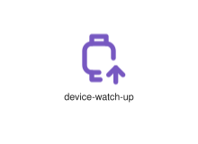
</div>
</div>

{{#endtab}}
{{#tab name="Code"}}

```xml
{{#include ../samples/icons/Tabler-Icons/device-watch-up-25b7dedd.xal}}
```

{{#endtab}}
{{#endtabs}}

<div class="xal-ref-tag"><code>&lt;item id=&#34;101981&#34; /&gt;</code></div>

</div>
<div class="xal-ref-card">
<div class="xal-ref-title">device-watch-x</div>

{{#tabs name="svg-ref-1981"}}
{{#tab name="Preview"}}
<div class="xal-ref-preview">
<div>
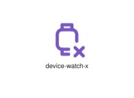
</div>
</div>

{{#endtab}}
{{#tab name="Code"}}

```xml
{{#include ../samples/icons/Tabler-Icons/device-watch-x-7787d887.xal}}
```

{{#endtab}}
{{#endtabs}}

<div class="xal-ref-tag"><code>&lt;item id=&#34;101982&#34; /&gt;</code></div>

</div>
<div class="xal-ref-card">
<div class="xal-ref-title">device-watch</div>

{{#tabs name="svg-ref-1982"}}
{{#tab name="Preview"}}
<div class="xal-ref-preview">
<div>
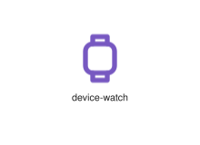
</div>
</div>

{{#endtab}}
{{#tab name="Code"}}

```xml
{{#include ../samples/icons/Tabler-Icons/device-watch-9ecd8ca2.xal}}
```

{{#endtab}}
{{#endtabs}}

<div class="xal-ref-tag"><code>&lt;item id=&#34;101960&#34; /&gt;</code></div>

</div>
<div class="xal-ref-card">
<div class="xal-ref-title">devices-2</div>

{{#tabs name="svg-ref-1983"}}
{{#tab name="Preview"}}
<div class="xal-ref-preview">
<div>
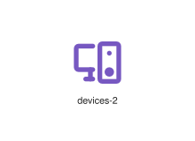
</div>
</div>

{{#endtab}}
{{#tab name="Code"}}

```xml
{{#include ../samples/icons/Tabler-Icons/devices-2-3bccae17.xal}}
```

{{#endtab}}
{{#endtabs}}

<div class="xal-ref-tag"><code>&lt;item id=&#34;101984&#34; /&gt;</code></div>

</div>
<div class="xal-ref-card">
<div class="xal-ref-title">devices-bolt</div>

{{#tabs name="svg-ref-1984"}}
{{#tab name="Preview"}}
<div class="xal-ref-preview">
<div>
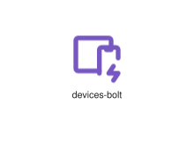
</div>
</div>

{{#endtab}}
{{#tab name="Code"}}

```xml
{{#include ../samples/icons/Tabler-Icons/devices-bolt-617cf630.xal}}
```

{{#endtab}}
{{#endtabs}}

<div class="xal-ref-tag"><code>&lt;item id=&#34;101985&#34; /&gt;</code></div>

</div>
<div class="xal-ref-card">
<div class="xal-ref-title">devices-cancel</div>

{{#tabs name="svg-ref-1985"}}
{{#tab name="Preview"}}
<div class="xal-ref-preview">
<div>

</div>
</div>

{{#endtab}}
{{#tab name="Code"}}

```xml
{{#include ../samples/icons/Tabler-Icons/devices-cancel-3517fb5e.xal}}
```

{{#endtab}}
{{#endtabs}}

<div class="xal-ref-tag"><code>&lt;item id=&#34;101986&#34; /&gt;</code></div>

</div>
<div class="xal-ref-card">
<div class="xal-ref-title">devices-check</div>

{{#tabs name="svg-ref-1986"}}
{{#tab name="Preview"}}
<div class="xal-ref-preview">
<div>
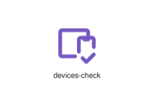
</div>
</div>

{{#endtab}}
{{#tab name="Code"}}

```xml
{{#include ../samples/icons/Tabler-Icons/devices-check-4dffdc3b.xal}}
```

{{#endtab}}
{{#endtabs}}

<div class="xal-ref-tag"><code>&lt;item id=&#34;101987&#34; /&gt;</code></div>

</div>
<div class="xal-ref-card">
<div class="xal-ref-title">devices-code</div>

{{#tabs name="svg-ref-1987"}}
{{#tab name="Preview"}}
<div class="xal-ref-preview">
<div>

</div>
</div>

{{#endtab}}
{{#tab name="Code"}}

```xml
{{#include ../samples/icons/Tabler-Icons/devices-code-1c05caf1.xal}}
```

{{#endtab}}
{{#endtabs}}

<div class="xal-ref-tag"><code>&lt;item id=&#34;101988&#34; /&gt;</code></div>

</div>
<div class="xal-ref-card">
<div class="xal-ref-title">devices-cog</div>

{{#tabs name="svg-ref-1988"}}
{{#tab name="Preview"}}
<div class="xal-ref-preview">
<div>

</div>
</div>

{{#endtab}}
{{#tab name="Code"}}

```xml
{{#include ../samples/icons/Tabler-Icons/devices-cog-1ed72fa8.xal}}
```

{{#endtab}}
{{#endtabs}}

<div class="xal-ref-tag"><code>&lt;item id=&#34;101989&#34; /&gt;</code></div>

</div>
<div class="xal-ref-card">
<div class="xal-ref-title">devices-dollar</div>

{{#tabs name="svg-ref-1989"}}
{{#tab name="Preview"}}
<div class="xal-ref-preview">
<div>

</div>
</div>

{{#endtab}}
{{#tab name="Code"}}

```xml
{{#include ../samples/icons/Tabler-Icons/devices-dollar-ef2527d4.xal}}
```

{{#endtab}}
{{#endtabs}}

<div class="xal-ref-tag"><code>&lt;item id=&#34;101990&#34; /&gt;</code></div>

</div>
<div class="xal-ref-card">
<div class="xal-ref-title">devices-down</div>

{{#tabs name="svg-ref-1990"}}
{{#tab name="Preview"}}
<div class="xal-ref-preview">
<div>
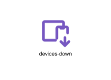
</div>
</div>

{{#endtab}}
{{#tab name="Code"}}

```xml
{{#include ../samples/icons/Tabler-Icons/devices-down-e45282cc.xal}}
```

{{#endtab}}
{{#endtabs}}

<div class="xal-ref-tag"><code>&lt;item id=&#34;101991&#34; /&gt;</code></div>

</div>
<div class="xal-ref-card">
<div class="xal-ref-title">devices-exclamation</div>

{{#tabs name="svg-ref-1991"}}
{{#tab name="Preview"}}
<div class="xal-ref-preview">
<div>
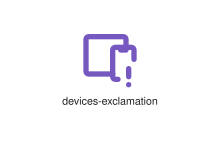
</div>
</div>

{{#endtab}}
{{#tab name="Code"}}

```xml
{{#include ../samples/icons/Tabler-Icons/devices-exclamation-c743d619.xal}}
```

{{#endtab}}
{{#endtabs}}

<div class="xal-ref-tag"><code>&lt;item id=&#34;101992&#34; /&gt;</code></div>

</div>
<div class="xal-ref-card">
<div class="xal-ref-title">devices-heart</div>

{{#tabs name="svg-ref-1992"}}
{{#tab name="Preview"}}
<div class="xal-ref-preview">
<div>

</div>
</div>

{{#endtab}}
{{#tab name="Code"}}

```xml
{{#include ../samples/icons/Tabler-Icons/devices-heart-8adaa249.xal}}
```

{{#endtab}}
{{#endtabs}}

<div class="xal-ref-tag"><code>&lt;item id=&#34;101993&#34; /&gt;</code></div>

</div>
<div class="xal-ref-card">
<div class="xal-ref-title">devices-minus</div>

{{#tabs name="svg-ref-1993"}}
{{#tab name="Preview"}}
<div class="xal-ref-preview">
<div>

</div>
</div>

{{#endtab}}
{{#tab name="Code"}}

```xml
{{#include ../samples/icons/Tabler-Icons/devices-minus-ce8f6e08.xal}}
```

{{#endtab}}
{{#endtabs}}

<div class="xal-ref-tag"><code>&lt;item id=&#34;101994&#34; /&gt;</code></div>

</div>
<div class="xal-ref-card">
<div class="xal-ref-title">devices-off</div>

{{#tabs name="svg-ref-1994"}}
{{#tab name="Preview"}}
<div class="xal-ref-preview">
<div>

</div>
</div>

{{#endtab}}
{{#tab name="Code"}}

```xml
{{#include ../samples/icons/Tabler-Icons/devices-off-c3183da4.xal}}
```

{{#endtab}}
{{#endtabs}}

<div class="xal-ref-tag"><code>&lt;item id=&#34;101995&#34; /&gt;</code></div>

</div>
<div class="xal-ref-card">
<div class="xal-ref-title">devices-pause</div>

{{#tabs name="svg-ref-1995"}}
{{#tab name="Preview"}}
<div class="xal-ref-preview">
<div>

</div>
</div>

{{#endtab}}
{{#tab name="Code"}}

```xml
{{#include ../samples/icons/Tabler-Icons/devices-pause-1cc59990.xal}}
```

{{#endtab}}
{{#endtabs}}

<div class="xal-ref-tag"><code>&lt;item id=&#34;101996&#34; /&gt;</code></div>

</div>
<div class="xal-ref-card">
<div class="xal-ref-title">devices-pc-off</div>

{{#tabs name="svg-ref-1996"}}
{{#tab name="Preview"}}
<div class="xal-ref-preview">
<div>

</div>
</div>

{{#endtab}}
{{#tab name="Code"}}

```xml
{{#include ../samples/icons/Tabler-Icons/devices-pc-off-7bee2c46.xal}}
```

{{#endtab}}
{{#endtabs}}

<div class="xal-ref-tag"><code>&lt;item id=&#34;101998&#34; /&gt;</code></div>

</div>
<div class="xal-ref-card">
<div class="xal-ref-title">devices-pc</div>

{{#tabs name="svg-ref-1997"}}
{{#tab name="Preview"}}
<div class="xal-ref-preview">
<div>

</div>
</div>

{{#endtab}}
{{#tab name="Code"}}

```xml
{{#include ../samples/icons/Tabler-Icons/devices-pc-0cba5304.xal}}
```

{{#endtab}}
{{#endtabs}}

<div class="xal-ref-tag"><code>&lt;item id=&#34;101997&#34; /&gt;</code></div>

</div>
<div class="xal-ref-card">
<div class="xal-ref-title">devices-pin</div>

{{#tabs name="svg-ref-1998"}}
{{#tab name="Preview"}}
<div class="xal-ref-preview">
<div>

</div>
</div>

{{#endtab}}
{{#tab name="Code"}}

```xml
{{#include ../samples/icons/Tabler-Icons/devices-pin-93a82897.xal}}
```

{{#endtab}}
{{#endtabs}}

<div class="xal-ref-tag"><code>&lt;item id=&#34;101999&#34; /&gt;</code></div>

</div>
<div class="xal-ref-card">
<div class="xal-ref-title">devices-plus</div>

{{#tabs name="svg-ref-1999"}}
{{#tab name="Preview"}}
<div class="xal-ref-preview">
<div>

</div>
</div>

{{#endtab}}
{{#tab name="Code"}}

```xml
{{#include ../samples/icons/Tabler-Icons/devices-plus-f8f355b8.xal}}
```

{{#endtab}}
{{#endtabs}}

<div class="xal-ref-tag"><code>&lt;item id=&#34;102000&#34; /&gt;</code></div>

</div>
<div class="xal-ref-card">
<div class="xal-ref-title">devices-question</div>

{{#tabs name="svg-ref-2000"}}
{{#tab name="Preview"}}
<div class="xal-ref-preview">
<div>

</div>
</div>

{{#endtab}}
{{#tab name="Code"}}

```xml
{{#include ../samples/icons/Tabler-Icons/devices-question-e4da9388.xal}}
```

{{#endtab}}
{{#endtabs}}

<div class="xal-ref-tag"><code>&lt;item id=&#34;102001&#34; /&gt;</code></div>

</div>
<div class="xal-ref-card">
<div class="xal-ref-title">devices-search</div>

{{#tabs name="svg-ref-2001"}}
{{#tab name="Preview"}}
<div class="xal-ref-preview">
<div>

</div>
</div>

{{#endtab}}
{{#tab name="Code"}}

```xml
{{#include ../samples/icons/Tabler-Icons/devices-search-7405ebb1.xal}}
```

{{#endtab}}
{{#endtabs}}

<div class="xal-ref-tag"><code>&lt;item id=&#34;102002&#34; /&gt;</code></div>

</div>
<div class="xal-ref-card">
<div class="xal-ref-title">devices-share</div>

{{#tabs name="svg-ref-2002"}}
{{#tab name="Preview"}}
<div class="xal-ref-preview">
<div>

</div>
</div>

{{#endtab}}
{{#tab name="Code"}}

```xml
{{#include ../samples/icons/Tabler-Icons/devices-share-62cad506.xal}}
```

{{#endtab}}
{{#endtabs}}

<div class="xal-ref-tag"><code>&lt;item id=&#34;102003&#34; /&gt;</code></div>

</div>
<div class="xal-ref-card">
<div class="xal-ref-title">devices-star</div>

{{#tabs name="svg-ref-2003"}}
{{#tab name="Preview"}}
<div class="xal-ref-preview">
<div>

</div>
</div>

{{#endtab}}
{{#tab name="Code"}}

```xml
{{#include ../samples/icons/Tabler-Icons/devices-star-876ae9cf.xal}}
```

{{#endtab}}
{{#endtabs}}

<div class="xal-ref-tag"><code>&lt;item id=&#34;102004&#34; /&gt;</code></div>

</div>
<div class="xal-ref-card">
<div class="xal-ref-title">devices-up</div>

{{#tabs name="svg-ref-2004"}}
{{#tab name="Preview"}}
<div class="xal-ref-preview">
<div>
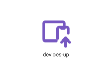
</div>
</div>

{{#endtab}}
{{#tab name="Code"}}

```xml
{{#include ../samples/icons/Tabler-Icons/devices-up-7b372fe5.xal}}
```

{{#endtab}}
{{#endtabs}}

<div class="xal-ref-tag"><code>&lt;item id=&#34;102005&#34; /&gt;</code></div>

</div>
<div class="xal-ref-card">
<div class="xal-ref-title">devices-x</div>

{{#tabs name="svg-ref-2005"}}
{{#tab name="Preview"}}
<div class="xal-ref-preview">
<div>
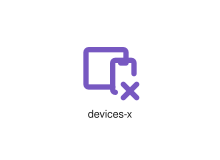
</div>
</div>

{{#endtab}}
{{#tab name="Code"}}

```xml
{{#include ../samples/icons/Tabler-Icons/devices-x-298feeff.xal}}
```

{{#endtab}}
{{#endtabs}}

<div class="xal-ref-tag"><code>&lt;item id=&#34;102006&#34; /&gt;</code></div>

</div>
<div class="xal-ref-card">
<div class="xal-ref-title">devices</div>

{{#tabs name="svg-ref-2006"}}
{{#tab name="Preview"}}
<div class="xal-ref-preview">
<div>
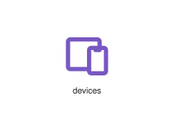
</div>
</div>

{{#endtab}}
{{#tab name="Code"}}

```xml
{{#include ../samples/icons/Tabler-Icons/devices-87181c02.xal}}
```

{{#endtab}}
{{#endtabs}}

<div class="xal-ref-tag"><code>&lt;item id=&#34;101983&#34; /&gt;</code></div>

</div>
<div class="xal-ref-card">
<div class="xal-ref-title">diabolo-off</div>

{{#tabs name="svg-ref-2007"}}
{{#tab name="Preview"}}
<div class="xal-ref-preview">
<div>

</div>
</div>

{{#endtab}}
{{#tab name="Code"}}

```xml
{{#include ../samples/icons/Tabler-Icons/diabolo-off-edf0a06d.xal}}
```

{{#endtab}}
{{#endtabs}}

<div class="xal-ref-tag"><code>&lt;item id=&#34;102008&#34; /&gt;</code></div>

</div>
<div class="xal-ref-card">
<div class="xal-ref-title">diabolo-plus</div>

{{#tabs name="svg-ref-2008"}}
{{#tab name="Preview"}}
<div class="xal-ref-preview">
<div>
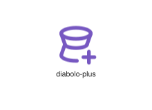
</div>
</div>

{{#endtab}}
{{#tab name="Code"}}

```xml
{{#include ../samples/icons/Tabler-Icons/diabolo-plus-1a65c731.xal}}
```

{{#endtab}}
{{#endtabs}}

<div class="xal-ref-tag"><code>&lt;item id=&#34;102009&#34; /&gt;</code></div>

</div>
<div class="xal-ref-card">
<div class="xal-ref-title">diabolo</div>

{{#tabs name="svg-ref-2009"}}
{{#tab name="Preview"}}
<div class="xal-ref-preview">
<div>
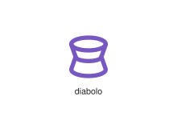
</div>
</div>

{{#endtab}}
{{#tab name="Code"}}

```xml
{{#include ../samples/icons/Tabler-Icons/diabolo-4d508e5d.xal}}
```

{{#endtab}}
{{#endtabs}}

<div class="xal-ref-tag"><code>&lt;item id=&#34;102007&#34; /&gt;</code></div>

</div>
<div class="xal-ref-card">
<div class="xal-ref-title">dialpad-off</div>

{{#tabs name="svg-ref-2010"}}
{{#tab name="Preview"}}
<div class="xal-ref-preview">
<div>

</div>
</div>

{{#endtab}}
{{#tab name="Code"}}

```xml
{{#include ../samples/icons/Tabler-Icons/dialpad-off-4e645613.xal}}
```

{{#endtab}}
{{#endtabs}}

<div class="xal-ref-tag"><code>&lt;item id=&#34;102011&#34; /&gt;</code></div>

</div>
<div class="xal-ref-card">
<div class="xal-ref-title">dialpad</div>

{{#tabs name="svg-ref-2011"}}
{{#tab name="Preview"}}
<div class="xal-ref-preview">
<div>
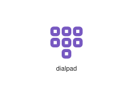
</div>
</div>

{{#endtab}}
{{#tab name="Code"}}

```xml
{{#include ../samples/icons/Tabler-Icons/dialpad-02025287.xal}}
```

{{#endtab}}
{{#endtabs}}

<div class="xal-ref-tag"><code>&lt;item id=&#34;102010&#34; /&gt;</code></div>

</div>
<div class="xal-ref-card">
<div class="xal-ref-title">diamond-off</div>

{{#tabs name="svg-ref-2012"}}
{{#tab name="Preview"}}
<div class="xal-ref-preview">
<div>
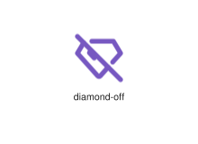
</div>
</div>

{{#endtab}}
{{#tab name="Code"}}

```xml
{{#include ../samples/icons/Tabler-Icons/diamond-off-19c471fc.xal}}
```

{{#endtab}}
{{#endtabs}}

<div class="xal-ref-tag"><code>&lt;item id=&#34;102013&#34; /&gt;</code></div>

</div>
<div class="xal-ref-card">
<div class="xal-ref-title">diamond</div>

{{#tabs name="svg-ref-2013"}}
{{#tab name="Preview"}}
<div class="xal-ref-preview">
<div>
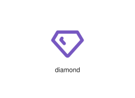
</div>
</div>

{{#endtab}}
{{#tab name="Code"}}

```xml
{{#include ../samples/icons/Tabler-Icons/diamond-ae680ceb.xal}}
```

{{#endtab}}
{{#endtabs}}

<div class="xal-ref-tag"><code>&lt;item id=&#34;102012&#34; /&gt;</code></div>

</div>
<div class="xal-ref-card">
<div class="xal-ref-title">diamonds</div>

{{#tabs name="svg-ref-2014"}}
{{#tab name="Preview"}}
<div class="xal-ref-preview">
<div>
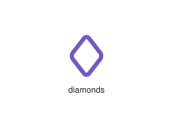
</div>
</div>

{{#endtab}}
{{#tab name="Code"}}

```xml
{{#include ../samples/icons/Tabler-Icons/diamonds-9a547574.xal}}
```

{{#endtab}}
{{#endtabs}}

<div class="xal-ref-tag"><code>&lt;item id=&#34;102014&#34; /&gt;</code></div>

</div>
<div class="xal-ref-card">
<div class="xal-ref-title">diaper</div>

{{#tabs name="svg-ref-2015"}}
{{#tab name="Preview"}}
<div class="xal-ref-preview">
<div>
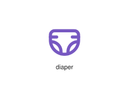
</div>
</div>

{{#endtab}}
{{#tab name="Code"}}

```xml
{{#include ../samples/icons/Tabler-Icons/diaper-3384a44f.xal}}
```

{{#endtab}}
{{#endtabs}}

<div class="xal-ref-tag"><code>&lt;item id=&#34;102015&#34; /&gt;</code></div>

</div>
<div class="xal-ref-card">
<div class="xal-ref-title">dice-1</div>

{{#tabs name="svg-ref-2016"}}
{{#tab name="Preview"}}
<div class="xal-ref-preview">
<div>

</div>
</div>

{{#endtab}}
{{#tab name="Code"}}

```xml
{{#include ../samples/icons/Tabler-Icons/dice-1-b81fbac3.xal}}
```

{{#endtab}}
{{#endtabs}}

<div class="xal-ref-tag"><code>&lt;item id=&#34;102017&#34; /&gt;</code></div>

</div>
<div class="xal-ref-card">
<div class="xal-ref-title">dice-2</div>

{{#tabs name="svg-ref-2017"}}
{{#tab name="Preview"}}
<div class="xal-ref-preview">
<div>
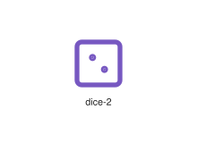
</div>
</div>

{{#endtab}}
{{#tab name="Code"}}

```xml
{{#include ../samples/icons/Tabler-Icons/dice-2-ffbfc013.xal}}
```

{{#endtab}}
{{#endtabs}}

<div class="xal-ref-tag"><code>&lt;item id=&#34;102018&#34; /&gt;</code></div>

</div>
<div class="xal-ref-card">
<div class="xal-ref-title">dice-3</div>

{{#tabs name="svg-ref-2018"}}
{{#tab name="Preview"}}
<div class="xal-ref-preview">
<div>
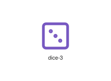
</div>
</div>

{{#endtab}}
{{#tab name="Code"}}

```xml
{{#include ../samples/icons/Tabler-Icons/dice-3-c2dfe9a3.xal}}
```

{{#endtab}}
{{#endtabs}}

<div class="xal-ref-tag"><code>&lt;item id=&#34;102019&#34; /&gt;</code></div>

</div>
<div class="xal-ref-card">
<div class="xal-ref-title">dice-4</div>

{{#tabs name="svg-ref-2019"}}
{{#tab name="Preview"}}
<div class="xal-ref-preview">
<div>
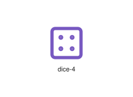
</div>
</div>

{{#endtab}}
{{#tab name="Code"}}

```xml
{{#include ../samples/icons/Tabler-Icons/dice-4-70ff35b3.xal}}
```

{{#endtab}}
{{#endtabs}}

<div class="xal-ref-tag"><code>&lt;item id=&#34;102020&#34; /&gt;</code></div>

</div>
<div class="xal-ref-card">
<div class="xal-ref-title">dice-5</div>

{{#tabs name="svg-ref-2020"}}
{{#tab name="Preview"}}
<div class="xal-ref-preview">
<div>
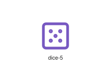
</div>
</div>

{{#endtab}}
{{#tab name="Code"}}

```xml
{{#include ../samples/icons/Tabler-Icons/dice-5-4d9f1c03.xal}}
```

{{#endtab}}
{{#endtabs}}

<div class="xal-ref-tag"><code>&lt;item id=&#34;102021&#34; /&gt;</code></div>

</div>
<div class="xal-ref-card">
<div class="xal-ref-title">dice-6</div>

{{#tabs name="svg-ref-2021"}}
{{#tab name="Preview"}}
<div class="xal-ref-preview">
<div>
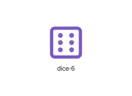
</div>
</div>

{{#endtab}}
{{#tab name="Code"}}

```xml
{{#include ../samples/icons/Tabler-Icons/dice-6-0a3f66d3.xal}}
```

{{#endtab}}
{{#endtabs}}

<div class="xal-ref-tag"><code>&lt;item id=&#34;102022&#34; /&gt;</code></div>

</div>
<div class="xal-ref-card">
<div class="xal-ref-title">dice</div>

{{#tabs name="svg-ref-2022"}}
{{#tab name="Preview"}}
<div class="xal-ref-preview">
<div>
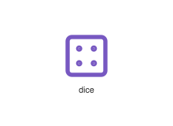
</div>
</div>

{{#endtab}}
{{#tab name="Code"}}

```xml
{{#include ../samples/icons/Tabler-Icons/dice-144db55b.xal}}
```

{{#endtab}}
{{#endtabs}}

<div class="xal-ref-tag"><code>&lt;item id=&#34;102016&#34; /&gt;</code></div>

</div>
<div class="xal-ref-card">
<div class="xal-ref-title">dimensions</div>

{{#tabs name="svg-ref-2023"}}
{{#tab name="Preview"}}
<div class="xal-ref-preview">
<div>
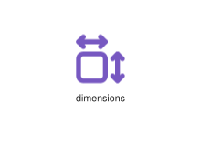
</div>
</div>

{{#endtab}}
{{#tab name="Code"}}

```xml
{{#include ../samples/icons/Tabler-Icons/dimensions-ac673c5b.xal}}
```

{{#endtab}}
{{#endtabs}}

<div class="xal-ref-tag"><code>&lt;item id=&#34;102023&#34; /&gt;</code></div>

</div>
<div class="xal-ref-card">
<div class="xal-ref-title">direction-arrows</div>

{{#tabs name="svg-ref-2024"}}
{{#tab name="Preview"}}
<div class="xal-ref-preview">
<div>
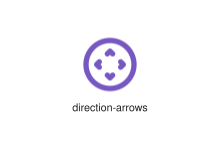
</div>
</div>

{{#endtab}}
{{#tab name="Code"}}

```xml
{{#include ../samples/icons/Tabler-Icons/direction-arrows-7e45afa5.xal}}
```

{{#endtab}}
{{#endtabs}}

<div class="xal-ref-tag"><code>&lt;item id=&#34;102025&#34; /&gt;</code></div>

</div>
<div class="xal-ref-card">
<div class="xal-ref-title">direction-horizontal</div>

{{#tabs name="svg-ref-2025"}}
{{#tab name="Preview"}}
<div class="xal-ref-preview">
<div>
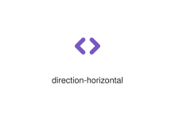
</div>
</div>

{{#endtab}}
{{#tab name="Code"}}

```xml
{{#include ../samples/icons/Tabler-Icons/direction-horizontal-8074d9a1.xal}}
```

{{#endtab}}
{{#endtabs}}

<div class="xal-ref-tag"><code>&lt;item id=&#34;102026&#34; /&gt;</code></div>

</div>
<div class="xal-ref-card">
<div class="xal-ref-title">direction-sign-off</div>

{{#tabs name="svg-ref-2026"}}
{{#tab name="Preview"}}
<div class="xal-ref-preview">
<div>

</div>
</div>

{{#endtab}}
{{#tab name="Code"}}

```xml
{{#include ../samples/icons/Tabler-Icons/direction-sign-off-ff7e7b41.xal}}
```

{{#endtab}}
{{#endtabs}}

<div class="xal-ref-tag"><code>&lt;item id=&#34;102028&#34; /&gt;</code></div>

</div>
<div class="xal-ref-card">
<div class="xal-ref-title">direction-sign</div>

{{#tabs name="svg-ref-2027"}}
{{#tab name="Preview"}}
<div class="xal-ref-preview">
<div>
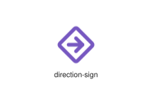
</div>
</div>

{{#endtab}}
{{#tab name="Code"}}

```xml
{{#include ../samples/icons/Tabler-Icons/direction-sign-89cf5efc.xal}}
```

{{#endtab}}
{{#endtabs}}

<div class="xal-ref-tag"><code>&lt;item id=&#34;102027&#34; /&gt;</code></div>

</div>
<div class="xal-ref-card">
<div class="xal-ref-title">direction</div>

{{#tabs name="svg-ref-2028"}}
{{#tab name="Preview"}}
<div class="xal-ref-preview">
<div>
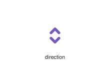
</div>
</div>

{{#endtab}}
{{#tab name="Code"}}

```xml
{{#include ../samples/icons/Tabler-Icons/direction-58ef0b02.xal}}
```

{{#endtab}}
{{#endtabs}}

<div class="xal-ref-tag"><code>&lt;item id=&#34;102024&#34; /&gt;</code></div>

</div>
<div class="xal-ref-card">
<div class="xal-ref-title">directions-off</div>

{{#tabs name="svg-ref-2029"}}
{{#tab name="Preview"}}
<div class="xal-ref-preview">
<div>
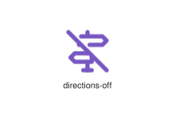
</div>
</div>

{{#endtab}}
{{#tab name="Code"}}

```xml
{{#include ../samples/icons/Tabler-Icons/directions-off-eb0f88b2.xal}}
```

{{#endtab}}
{{#endtabs}}

<div class="xal-ref-tag"><code>&lt;item id=&#34;102030&#34; /&gt;</code></div>

</div>
<div class="xal-ref-card">
<div class="xal-ref-title">directions</div>

{{#tabs name="svg-ref-2030"}}
{{#tab name="Preview"}}
<div class="xal-ref-preview">
<div>
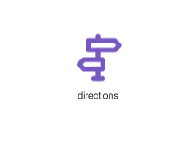
</div>
</div>

{{#endtab}}
{{#tab name="Code"}}

```xml
{{#include ../samples/icons/Tabler-Icons/directions-4374a8af.xal}}
```

{{#endtab}}
{{#endtabs}}

<div class="xal-ref-tag"><code>&lt;item id=&#34;102029&#34; /&gt;</code></div>

</div>
<div class="xal-ref-card">
<div class="xal-ref-title">disabled-2</div>

{{#tabs name="svg-ref-2031"}}
{{#tab name="Preview"}}
<div class="xal-ref-preview">
<div>
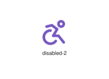
</div>
</div>

{{#endtab}}
{{#tab name="Code"}}

```xml
{{#include ../samples/icons/Tabler-Icons/disabled-2-2925549b.xal}}
```

{{#endtab}}
{{#endtabs}}

<div class="xal-ref-tag"><code>&lt;item id=&#34;102032&#34; /&gt;</code></div>

</div>
<div class="xal-ref-card">
<div class="xal-ref-title">disabled-off</div>

{{#tabs name="svg-ref-2032"}}
{{#tab name="Preview"}}
<div class="xal-ref-preview">
<div>

</div>
</div>

{{#endtab}}
{{#tab name="Code"}}

```xml
{{#include ../samples/icons/Tabler-Icons/disabled-off-0946e308.xal}}
```

{{#endtab}}
{{#endtabs}}

<div class="xal-ref-tag"><code>&lt;item id=&#34;102033&#34; /&gt;</code></div>

</div>
<div class="xal-ref-card">
<div class="xal-ref-title">disabled</div>

{{#tabs name="svg-ref-2033"}}
{{#tab name="Preview"}}
<div class="xal-ref-preview">
<div>

</div>
</div>

{{#endtab}}
{{#tab name="Code"}}

```xml
{{#include ../samples/icons/Tabler-Icons/disabled-4a3d4b7a.xal}}
```

{{#endtab}}
{{#endtabs}}

<div class="xal-ref-tag"><code>&lt;item id=&#34;102031&#34; /&gt;</code></div>

</div>
<div class="xal-ref-card">
<div class="xal-ref-title">disc-golf</div>

{{#tabs name="svg-ref-2034"}}
{{#tab name="Preview"}}
<div class="xal-ref-preview">
<div>

</div>
</div>

{{#endtab}}
{{#tab name="Code"}}

```xml
{{#include ../samples/icons/Tabler-Icons/disc-golf-a52f468d.xal}}
```

{{#endtab}}
{{#endtabs}}

<div class="xal-ref-tag"><code>&lt;item id=&#34;102035&#34; /&gt;</code></div>

</div>
<div class="xal-ref-card">
<div class="xal-ref-title">disc-off</div>

{{#tabs name="svg-ref-2035"}}
{{#tab name="Preview"}}
<div class="xal-ref-preview">
<div>

</div>
</div>

{{#endtab}}
{{#tab name="Code"}}

```xml
{{#include ../samples/icons/Tabler-Icons/disc-off-59ca88ee.xal}}
```

{{#endtab}}
{{#endtabs}}

<div class="xal-ref-tag"><code>&lt;item id=&#34;102036&#34; /&gt;</code></div>

</div>
<div class="xal-ref-card">
<div class="xal-ref-title">disc</div>

{{#tabs name="svg-ref-2036"}}
{{#tab name="Preview"}}
<div class="xal-ref-preview">
<div>
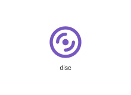
</div>
</div>

{{#endtab}}
{{#tab name="Code"}}

```xml
{{#include ../samples/icons/Tabler-Icons/disc-98db4260.xal}}
```

{{#endtab}}
{{#endtabs}}

<div class="xal-ref-tag"><code>&lt;item id=&#34;102034&#34; /&gt;</code></div>

</div>
<div class="xal-ref-card">
<div class="xal-ref-title">discount-off</div>

{{#tabs name="svg-ref-2037"}}
{{#tab name="Preview"}}
<div class="xal-ref-preview">
<div>

</div>
</div>

{{#endtab}}
{{#tab name="Code"}}

```xml
{{#include ../samples/icons/Tabler-Icons/discount-off-762e1465.xal}}
```

{{#endtab}}
{{#endtabs}}

<div class="xal-ref-tag"><code>&lt;item id=&#34;102038&#34; /&gt;</code></div>

</div>
<div class="xal-ref-card">
<div class="xal-ref-title">discount</div>

{{#tabs name="svg-ref-2038"}}
{{#tab name="Preview"}}
<div class="xal-ref-preview">
<div>

</div>
</div>

{{#endtab}}
{{#tab name="Code"}}

```xml
{{#include ../samples/icons/Tabler-Icons/discount-07afc871.xal}}
```

{{#endtab}}
{{#endtabs}}

<div class="xal-ref-tag"><code>&lt;item id=&#34;102037&#34; /&gt;</code></div>

</div>
<div class="xal-ref-card">
<div class="xal-ref-title">divide</div>

{{#tabs name="svg-ref-2039"}}
{{#tab name="Preview"}}
<div class="xal-ref-preview">
<div>
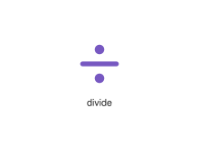
</div>
</div>

{{#endtab}}
{{#tab name="Code"}}

```xml
{{#include ../samples/icons/Tabler-Icons/divide-ae20dd57.xal}}
```

{{#endtab}}
{{#endtabs}}

<div class="xal-ref-tag"><code>&lt;item id=&#34;102039&#34; /&gt;</code></div>

</div>
<div class="xal-ref-card">
<div class="xal-ref-title">dna-2-off</div>

{{#tabs name="svg-ref-2040"}}
{{#tab name="Preview"}}
<div class="xal-ref-preview">
<div>
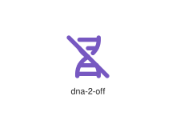
</div>
</div>

{{#endtab}}
{{#tab name="Code"}}

```xml
{{#include ../samples/icons/Tabler-Icons/dna-2-off-cde195f8.xal}}
```

{{#endtab}}
{{#endtabs}}

<div class="xal-ref-tag"><code>&lt;item id=&#34;102042&#34; /&gt;</code></div>

</div>
<div class="xal-ref-card">
<div class="xal-ref-title">dna-2</div>

{{#tabs name="svg-ref-2041"}}
{{#tab name="Preview"}}
<div class="xal-ref-preview">
<div>
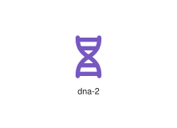
</div>
</div>

{{#endtab}}
{{#tab name="Code"}}

```xml
{{#include ../samples/icons/Tabler-Icons/dna-2-4a4d0289.xal}}
```

{{#endtab}}
{{#endtabs}}

<div class="xal-ref-tag"><code>&lt;item id=&#34;102041&#34; /&gt;</code></div>

</div>
<div class="xal-ref-card">
<div class="xal-ref-title">dna-off</div>

{{#tabs name="svg-ref-2042"}}
{{#tab name="Preview"}}
<div class="xal-ref-preview">
<div>
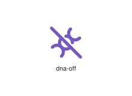
</div>
</div>

{{#endtab}}
{{#tab name="Code"}}

```xml
{{#include ../samples/icons/Tabler-Icons/dna-off-f3ba0472.xal}}
```

{{#endtab}}
{{#endtabs}}

<div class="xal-ref-tag"><code>&lt;item id=&#34;102043&#34; /&gt;</code></div>

</div>
<div class="xal-ref-card">
<div class="xal-ref-title">dna</div>

{{#tabs name="svg-ref-2043"}}
{{#tab name="Preview"}}
<div class="xal-ref-preview">
<div>
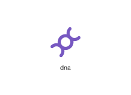
</div>
</div>

{{#endtab}}
{{#tab name="Code"}}

```xml
{{#include ../samples/icons/Tabler-Icons/dna-1bf0b1ed.xal}}
```

{{#endtab}}
{{#endtabs}}

<div class="xal-ref-tag"><code>&lt;item id=&#34;102040&#34; /&gt;</code></div>

</div>
<div class="xal-ref-card">
<div class="xal-ref-title">dog-bowl</div>

{{#tabs name="svg-ref-2044"}}
{{#tab name="Preview"}}
<div class="xal-ref-preview">
<div>
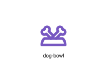
</div>
</div>

{{#endtab}}
{{#tab name="Code"}}

```xml
{{#include ../samples/icons/Tabler-Icons/dog-bowl-fbeda274.xal}}
```

{{#endtab}}
{{#endtabs}}

<div class="xal-ref-tag"><code>&lt;item id=&#34;102045&#34; /&gt;</code></div>

</div>
<div class="xal-ref-card">
<div class="xal-ref-title">dog</div>

{{#tabs name="svg-ref-2045"}}
{{#tab name="Preview"}}
<div class="xal-ref-preview">
<div>
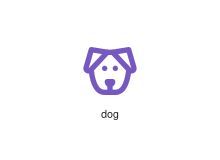
</div>
</div>

{{#endtab}}
{{#tab name="Code"}}

```xml
{{#include ../samples/icons/Tabler-Icons/dog-5fec97e8.xal}}
```

{{#endtab}}
{{#endtabs}}

<div class="xal-ref-tag"><code>&lt;item id=&#34;102044&#34; /&gt;</code></div>

</div>
<div class="xal-ref-card">
<div class="xal-ref-title">door-enter</div>

{{#tabs name="svg-ref-2046"}}
{{#tab name="Preview"}}
<div class="xal-ref-preview">
<div>

</div>
</div>

{{#endtab}}
{{#tab name="Code"}}

```xml
{{#include ../samples/icons/Tabler-Icons/door-enter-f5983357.xal}}
```

{{#endtab}}
{{#endtabs}}

<div class="xal-ref-tag"><code>&lt;item id=&#34;102047&#34; /&gt;</code></div>

</div>
<div class="xal-ref-card">
<div class="xal-ref-title">door-exit</div>

{{#tabs name="svg-ref-2047"}}
{{#tab name="Preview"}}
<div class="xal-ref-preview">
<div>
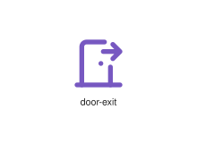
</div>
</div>

{{#endtab}}
{{#tab name="Code"}}

```xml
{{#include ../samples/icons/Tabler-Icons/door-exit-8c23afdb.xal}}
```

{{#endtab}}
{{#endtabs}}

<div class="xal-ref-tag"><code>&lt;item id=&#34;102048&#34; /&gt;</code></div>

</div>
<div class="xal-ref-card">
<div class="xal-ref-title">door-off</div>

{{#tabs name="svg-ref-2048"}}
{{#tab name="Preview"}}
<div class="xal-ref-preview">
<div>
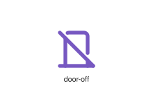
</div>
</div>

{{#endtab}}
{{#tab name="Code"}}

```xml
{{#include ../samples/icons/Tabler-Icons/door-off-375675f9.xal}}
```

{{#endtab}}
{{#endtabs}}

<div class="xal-ref-tag"><code>&lt;item id=&#34;102049&#34; /&gt;</code></div>

</div>
<div class="xal-ref-card">
<div class="xal-ref-title">door</div>

{{#tabs name="svg-ref-2049"}}
{{#tab name="Preview"}}
<div class="xal-ref-preview">
<div>
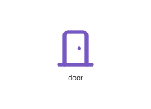
</div>
</div>

{{#endtab}}
{{#tab name="Code"}}

```xml
{{#include ../samples/icons/Tabler-Icons/door-d29f0b88.xal}}
```

{{#endtab}}
{{#endtabs}}

<div class="xal-ref-tag"><code>&lt;item id=&#34;102046&#34; /&gt;</code></div>

</div>
<div class="xal-ref-card">
<div class="xal-ref-title">dots-circle-horizontal</div>

{{#tabs name="svg-ref-2050"}}
{{#tab name="Preview"}}
<div class="xal-ref-preview">
<div>
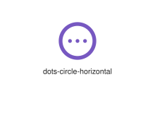
</div>
</div>

{{#endtab}}
{{#tab name="Code"}}

```xml
{{#include ../samples/icons/Tabler-Icons/dots-circle-horizontal-affd3090.xal}}
```

{{#endtab}}
{{#endtabs}}

<div class="xal-ref-tag"><code>&lt;item id=&#34;102051&#34; /&gt;</code></div>

</div>
<div class="xal-ref-card">
<div class="xal-ref-title">dots-diagonal-2</div>

{{#tabs name="svg-ref-2051"}}
{{#tab name="Preview"}}
<div class="xal-ref-preview">
<div>
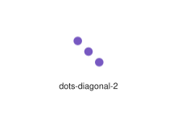
</div>
</div>

{{#endtab}}
{{#tab name="Code"}}

```xml
{{#include ../samples/icons/Tabler-Icons/dots-diagonal-2-2c658d26.xal}}
```

{{#endtab}}
{{#endtabs}}

<div class="xal-ref-tag"><code>&lt;item id=&#34;102053&#34; /&gt;</code></div>

</div>
<div class="xal-ref-card">
<div class="xal-ref-title">dots-diagonal</div>

{{#tabs name="svg-ref-2052"}}
{{#tab name="Preview"}}
<div class="xal-ref-preview">
<div>
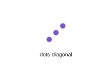
</div>
</div>

{{#endtab}}
{{#tab name="Code"}}

```xml
{{#include ../samples/icons/Tabler-Icons/dots-diagonal-1b98ea90.xal}}
```

{{#endtab}}
{{#endtabs}}

<div class="xal-ref-tag"><code>&lt;item id=&#34;102052&#34; /&gt;</code></div>

</div>
<div class="xal-ref-card">
<div class="xal-ref-title">dots-vertical</div>

{{#tabs name="svg-ref-2053"}}
{{#tab name="Preview"}}
<div class="xal-ref-preview">
<div>
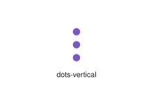
</div>
</div>

{{#endtab}}
{{#tab name="Code"}}

```xml
{{#include ../samples/icons/Tabler-Icons/dots-vertical-0fcd272c.xal}}
```

{{#endtab}}
{{#endtabs}}

<div class="xal-ref-tag"><code>&lt;item id=&#34;102054&#34; /&gt;</code></div>

</div>
<div class="xal-ref-card">
<div class="xal-ref-title">dots</div>

{{#tabs name="svg-ref-2054"}}
{{#tab name="Preview"}}
<div class="xal-ref-preview">
<div>
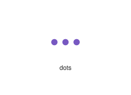
</div>
</div>

{{#endtab}}
{{#tab name="Code"}}

```xml
{{#include ../samples/icons/Tabler-Icons/dots-86eed060.xal}}
```

{{#endtab}}
{{#endtabs}}

<div class="xal-ref-tag"><code>&lt;item id=&#34;102050&#34; /&gt;</code></div>

</div>
<div class="xal-ref-card">
<div class="xal-ref-title">download-off</div>

{{#tabs name="svg-ref-2055"}}
{{#tab name="Preview"}}
<div class="xal-ref-preview">
<div>

</div>
</div>

{{#endtab}}
{{#tab name="Code"}}

```xml
{{#include ../samples/icons/Tabler-Icons/download-off-6c5878b1.xal}}
```

{{#endtab}}
{{#endtabs}}

<div class="xal-ref-tag"><code>&lt;item id=&#34;102056&#34; /&gt;</code></div>

</div>
<div class="xal-ref-card">
<div class="xal-ref-title">download</div>

{{#tabs name="svg-ref-2056"}}
{{#tab name="Preview"}}
<div class="xal-ref-preview">
<div>

</div>
</div>

{{#endtab}}
{{#tab name="Code"}}

```xml
{{#include ../samples/icons/Tabler-Icons/download-cb29a42b.xal}}
```

{{#endtab}}
{{#endtabs}}

<div class="xal-ref-tag"><code>&lt;item id=&#34;102055&#34; /&gt;</code></div>

</div>
<div class="xal-ref-card">
<div class="xal-ref-title">drag-drop-2</div>

{{#tabs name="svg-ref-2057"}}
{{#tab name="Preview"}}
<div class="xal-ref-preview">
<div>
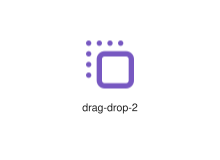
</div>
</div>

{{#endtab}}
{{#tab name="Code"}}

```xml
{{#include ../samples/icons/Tabler-Icons/drag-drop-2-ce872f13.xal}}
```

{{#endtab}}
{{#endtabs}}

<div class="xal-ref-tag"><code>&lt;item id=&#34;102058&#34; /&gt;</code></div>

</div>
<div class="xal-ref-card">
<div class="xal-ref-title">drag-drop</div>

{{#tabs name="svg-ref-2058"}}
{{#tab name="Preview"}}
<div class="xal-ref-preview">
<div>

</div>
</div>

{{#endtab}}
{{#tab name="Code"}}

```xml
{{#include ../samples/icons/Tabler-Icons/drag-drop-c666386e.xal}}
```

{{#endtab}}
{{#endtabs}}

<div class="xal-ref-tag"><code>&lt;item id=&#34;102057&#34; /&gt;</code></div>

</div>
<div class="xal-ref-card">
<div class="xal-ref-title">drone-off</div>

{{#tabs name="svg-ref-2059"}}
{{#tab name="Preview"}}
<div class="xal-ref-preview">
<div>

</div>
</div>

{{#endtab}}
{{#tab name="Code"}}

```xml
{{#include ../samples/icons/Tabler-Icons/drone-off-f53b8e9f.xal}}
```

{{#endtab}}
{{#endtabs}}

<div class="xal-ref-tag"><code>&lt;item id=&#34;102060&#34; /&gt;</code></div>

</div>
<div class="xal-ref-card">
<div class="xal-ref-title">drone</div>

{{#tabs name="svg-ref-2060"}}
{{#tab name="Preview"}}
<div class="xal-ref-preview">
<div>

</div>
</div>

{{#endtab}}
{{#tab name="Code"}}

```xml
{{#include ../samples/icons/Tabler-Icons/drone-329936a9.xal}}
```

{{#endtab}}
{{#endtabs}}

<div class="xal-ref-tag"><code>&lt;item id=&#34;102059&#34; /&gt;</code></div>

</div>
<div class="xal-ref-card">
<div class="xal-ref-title">drop-circle</div>

{{#tabs name="svg-ref-2061"}}
{{#tab name="Preview"}}
<div class="xal-ref-preview">
<div>
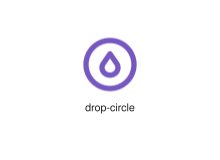
</div>
</div>

{{#endtab}}
{{#tab name="Code"}}

```xml
{{#include ../samples/icons/Tabler-Icons/drop-circle-7f1788be.xal}}
```

{{#endtab}}
{{#endtabs}}

<div class="xal-ref-tag"><code>&lt;item id=&#34;102061&#34; /&gt;</code></div>

</div>
<div class="xal-ref-card">
<div class="xal-ref-title">droplet-bolt</div>

{{#tabs name="svg-ref-2062"}}
{{#tab name="Preview"}}
<div class="xal-ref-preview">
<div>

</div>
</div>

{{#endtab}}
{{#tab name="Code"}}

```xml
{{#include ../samples/icons/Tabler-Icons/droplet-bolt-d5218d73.xal}}
```

{{#endtab}}
{{#endtabs}}

<div class="xal-ref-tag"><code>&lt;item id=&#34;102063&#34; /&gt;</code></div>

</div>
<div class="xal-ref-card">
<div class="xal-ref-title">droplet-cancel</div>

{{#tabs name="svg-ref-2063"}}
{{#tab name="Preview"}}
<div class="xal-ref-preview">
<div>

</div>
</div>

{{#endtab}}
{{#tab name="Code"}}

```xml
{{#include ../samples/icons/Tabler-Icons/droplet-cancel-2994fb71.xal}}
```

{{#endtab}}
{{#endtabs}}

<div class="xal-ref-tag"><code>&lt;item id=&#34;102064&#34; /&gt;</code></div>

</div>
<div class="xal-ref-card">
<div class="xal-ref-title">droplet-check</div>

{{#tabs name="svg-ref-2064"}}
{{#tab name="Preview"}}
<div class="xal-ref-preview">
<div>

</div>
</div>

{{#endtab}}
{{#tab name="Code"}}

```xml
{{#include ../samples/icons/Tabler-Icons/droplet-check-a29e916a.xal}}
```

{{#endtab}}
{{#endtabs}}

<div class="xal-ref-tag"><code>&lt;item id=&#34;102065&#34; /&gt;</code></div>

</div>
<div class="xal-ref-card">
<div class="xal-ref-title">droplet-code</div>

{{#tabs name="svg-ref-2065"}}
{{#tab name="Preview"}}
<div class="xal-ref-preview">
<div>

</div>
</div>

{{#endtab}}
{{#tab name="Code"}}

```xml
{{#include ../samples/icons/Tabler-Icons/droplet-code-a858b1b2.xal}}
```

{{#endtab}}
{{#endtabs}}

<div class="xal-ref-tag"><code>&lt;item id=&#34;102066&#34; /&gt;</code></div>

</div>
<div class="xal-ref-card">
<div class="xal-ref-title">droplet-cog</div>

{{#tabs name="svg-ref-2066"}}
{{#tab name="Preview"}}
<div class="xal-ref-preview">
<div>

</div>
</div>

{{#endtab}}
{{#tab name="Code"}}

```xml
{{#include ../samples/icons/Tabler-Icons/droplet-cog-48125b54.xal}}
```

{{#endtab}}
{{#endtabs}}

<div class="xal-ref-tag"><code>&lt;item id=&#34;102067&#34; /&gt;</code></div>

</div>
<div class="xal-ref-card">
<div class="xal-ref-title">droplet-dollar</div>

{{#tabs name="svg-ref-2067"}}
{{#tab name="Preview"}}
<div class="xal-ref-preview">
<div>

</div>
</div>

{{#endtab}}
{{#tab name="Code"}}

```xml
{{#include ../samples/icons/Tabler-Icons/droplet-dollar-f3a627fb.xal}}
```

{{#endtab}}
{{#endtabs}}

<div class="xal-ref-tag"><code>&lt;item id=&#34;102068&#34; /&gt;</code></div>

</div>
<div class="xal-ref-card">
<div class="xal-ref-title">droplet-down</div>

{{#tabs name="svg-ref-2068"}}
{{#tab name="Preview"}}
<div class="xal-ref-preview">
<div>

</div>
</div>

{{#endtab}}
{{#tab name="Code"}}

```xml
{{#include ../samples/icons/Tabler-Icons/droplet-down-500ff98f.xal}}
```

{{#endtab}}
{{#endtabs}}

<div class="xal-ref-tag"><code>&lt;item id=&#34;102069&#34; /&gt;</code></div>

</div>
<div class="xal-ref-card">
<div class="xal-ref-title">droplet-exclamation</div>

{{#tabs name="svg-ref-2069"}}
{{#tab name="Preview"}}
<div class="xal-ref-preview">
<div>

</div>
</div>

{{#endtab}}
{{#tab name="Code"}}

```xml
{{#include ../samples/icons/Tabler-Icons/droplet-exclamation-81d69648.xal}}
```

{{#endtab}}
{{#endtabs}}

<div class="xal-ref-tag"><code>&lt;item id=&#34;102070&#34; /&gt;</code></div>

</div>
</div>
