# Tabler-Icons - Page 24

This page references SVG files under `etc/resources/aws/svg/Tabler-Icons`.
Each card shows the SVG preview first and the XAL tag syntax in the Code tab.
Showing 2071-2160 of 4964 SVG files.

<style>
.xal-ref-grid{display:grid;grid-template-columns:repeat(3,minmax(0,1fr));gap:1rem;margin:1rem 0 1.5rem}.xal-ref-card{border:1px solid var(--table-border-color);border-radius:8px;overflow:hidden;background:var(--bg);padding:.75rem}.xal-ref-title{font-size:.9rem;font-weight:600;line-height:1.25;margin:0 0 .5rem;overflow-wrap:anywhere}.xal-ref-preview{display:flex;align-items:center;justify-content:center}.xal-ref-preview img{display:block;width:100%;height:auto}.xal-ref-card pre{margin:0;max-height:18rem;overflow:auto;white-space:pre}.xal-ref-card code{font-size:.78em}.xal-ref-tag{margin:.5rem 0 0;color:var(--fg);opacity:.72;overflow:auto;white-space:pre}.xal-ref-tag code{font-size:.72em}@media(max-width:900px){.xal-ref-grid{grid-template-columns:repeat(2,minmax(0,1fr))}}@media(max-width:560px){.xal-ref-grid{grid-template-columns:1fr}}
</style>

[Back to section index](tabler-icons.md)

<div class="xal-ref-grid">
<div class="xal-ref-card">
<div class="xal-ref-title">droplet-half-2</div>

{{#tabs name="svg-ref-2070"}}
{{#tab name="Preview"}}
<div class="xal-ref-preview">
<div>
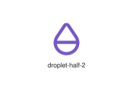
</div>
</div>

{{#endtab}}
{{#tab name="Code"}}

```xml
{{#include ../samples/icons/Tabler-Icons/droplet-half-2-a541d1f7.xal}}
```

{{#endtab}}
{{#endtabs}}

<div class="xal-ref-tag"><code>&lt;item id=&#34;102072&#34; /&gt;</code></div>

</div>
<div class="xal-ref-card">
<div class="xal-ref-title">droplet-half</div>

{{#tabs name="svg-ref-2071"}}
{{#tab name="Preview"}}
<div class="xal-ref-preview">
<div>
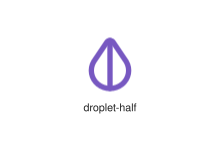
</div>
</div>

{{#endtab}}
{{#tab name="Code"}}

```xml
{{#include ../samples/icons/Tabler-Icons/droplet-half-0efe2e04.xal}}
```

{{#endtab}}
{{#endtabs}}

<div class="xal-ref-tag"><code>&lt;item id=&#34;102071&#34; /&gt;</code></div>

</div>
<div class="xal-ref-card">
<div class="xal-ref-title">droplet-heart</div>

{{#tabs name="svg-ref-2072"}}
{{#tab name="Preview"}}
<div class="xal-ref-preview">
<div>

</div>
</div>

{{#endtab}}
{{#tab name="Code"}}

```xml
{{#include ../samples/icons/Tabler-Icons/droplet-heart-65bbef18.xal}}
```

{{#endtab}}
{{#endtabs}}

<div class="xal-ref-tag"><code>&lt;item id=&#34;102073&#34; /&gt;</code></div>

</div>
<div class="xal-ref-card">
<div class="xal-ref-title">droplet-minus</div>

{{#tabs name="svg-ref-2073"}}
{{#tab name="Preview"}}
<div class="xal-ref-preview">
<div>

</div>
</div>

{{#endtab}}
{{#tab name="Code"}}

```xml
{{#include ../samples/icons/Tabler-Icons/droplet-minus-21ee2359.xal}}
```

{{#endtab}}
{{#endtabs}}

<div class="xal-ref-tag"><code>&lt;item id=&#34;102074&#34; /&gt;</code></div>

</div>
<div class="xal-ref-card">
<div class="xal-ref-title">droplet-off</div>

{{#tabs name="svg-ref-2074"}}
{{#tab name="Preview"}}
<div class="xal-ref-preview">
<div>

</div>
</div>

{{#endtab}}
{{#tab name="Code"}}

```xml
{{#include ../samples/icons/Tabler-Icons/droplet-off-95dd4958.xal}}
```

{{#endtab}}
{{#endtabs}}

<div class="xal-ref-tag"><code>&lt;item id=&#34;102075&#34; /&gt;</code></div>

</div>
<div class="xal-ref-card">
<div class="xal-ref-title">droplet-pause</div>

{{#tabs name="svg-ref-2075"}}
{{#tab name="Preview"}}
<div class="xal-ref-preview">
<div>

</div>
</div>

{{#endtab}}
{{#tab name="Code"}}

```xml
{{#include ../samples/icons/Tabler-Icons/droplet-pause-f3a4d4c1.xal}}
```

{{#endtab}}
{{#endtabs}}

<div class="xal-ref-tag"><code>&lt;item id=&#34;102076&#34; /&gt;</code></div>

</div>
<div class="xal-ref-card">
<div class="xal-ref-title">droplet-pin</div>

{{#tabs name="svg-ref-2076"}}
{{#tab name="Preview"}}
<div class="xal-ref-preview">
<div>

</div>
</div>

{{#endtab}}
{{#tab name="Code"}}

```xml
{{#include ../samples/icons/Tabler-Icons/droplet-pin-c56d5c6b.xal}}
```

{{#endtab}}
{{#endtabs}}

<div class="xal-ref-tag"><code>&lt;item id=&#34;102077&#34; /&gt;</code></div>

</div>
<div class="xal-ref-card">
<div class="xal-ref-title">droplet-plus</div>

{{#tabs name="svg-ref-2077"}}
{{#tab name="Preview"}}
<div class="xal-ref-preview">
<div>

</div>
</div>

{{#endtab}}
{{#tab name="Code"}}

```xml
{{#include ../samples/icons/Tabler-Icons/droplet-plus-4cae2efb.xal}}
```

{{#endtab}}
{{#endtabs}}

<div class="xal-ref-tag"><code>&lt;item id=&#34;102078&#34; /&gt;</code></div>

</div>
<div class="xal-ref-card">
<div class="xal-ref-title">droplet-question</div>

{{#tabs name="svg-ref-2078"}}
{{#tab name="Preview"}}
<div class="xal-ref-preview">
<div>

</div>
</div>

{{#endtab}}
{{#tab name="Code"}}

```xml
{{#include ../samples/icons/Tabler-Icons/droplet-question-f6c6b766.xal}}
```

{{#endtab}}
{{#endtabs}}

<div class="xal-ref-tag"><code>&lt;item id=&#34;102079&#34; /&gt;</code></div>

</div>
<div class="xal-ref-card">
<div class="xal-ref-title">droplet-search</div>

{{#tabs name="svg-ref-2079"}}
{{#tab name="Preview"}}
<div class="xal-ref-preview">
<div>

</div>
</div>

{{#endtab}}
{{#tab name="Code"}}

```xml
{{#include ../samples/icons/Tabler-Icons/droplet-search-6886eb9e.xal}}
```

{{#endtab}}
{{#endtabs}}

<div class="xal-ref-tag"><code>&lt;item id=&#34;102080&#34; /&gt;</code></div>

</div>
<div class="xal-ref-card">
<div class="xal-ref-title">droplet-share</div>

{{#tabs name="svg-ref-2080"}}
{{#tab name="Preview"}}
<div class="xal-ref-preview">
<div>

</div>
</div>

{{#endtab}}
{{#tab name="Code"}}

```xml
{{#include ../samples/icons/Tabler-Icons/droplet-share-8dab9857.xal}}
```

{{#endtab}}
{{#endtabs}}

<div class="xal-ref-tag"><code>&lt;item id=&#34;102081&#34; /&gt;</code></div>

</div>
<div class="xal-ref-card">
<div class="xal-ref-title">droplet-star</div>

{{#tabs name="svg-ref-2081"}}
{{#tab name="Preview"}}
<div class="xal-ref-preview">
<div>

</div>
</div>

{{#endtab}}
{{#tab name="Code"}}

```xml
{{#include ../samples/icons/Tabler-Icons/droplet-star-3337928c.xal}}
```

{{#endtab}}
{{#endtabs}}

<div class="xal-ref-tag"><code>&lt;item id=&#34;102082&#34; /&gt;</code></div>

</div>
<div class="xal-ref-card">
<div class="xal-ref-title">droplet-up</div>

{{#tabs name="svg-ref-2082"}}
{{#tab name="Preview"}}
<div class="xal-ref-preview">
<div>
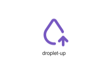
</div>
</div>

{{#endtab}}
{{#tab name="Code"}}

```xml
{{#include ../samples/icons/Tabler-Icons/droplet-up-0d87f0d0.xal}}
```

{{#endtab}}
{{#endtabs}}

<div class="xal-ref-tag"><code>&lt;item id=&#34;102083&#34; /&gt;</code></div>

</div>
<div class="xal-ref-card">
<div class="xal-ref-title">droplet-x</div>

{{#tabs name="svg-ref-2083"}}
{{#tab name="Preview"}}
<div class="xal-ref-preview">
<div>
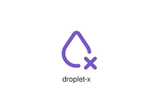
</div>
</div>

{{#endtab}}
{{#tab name="Code"}}

```xml
{{#include ../samples/icons/Tabler-Icons/droplet-x-45114bbf.xal}}
```

{{#endtab}}
{{#endtabs}}

<div class="xal-ref-tag"><code>&lt;item id=&#34;102084&#34; /&gt;</code></div>

</div>
<div class="xal-ref-card">
<div class="xal-ref-title">droplet</div>

{{#tabs name="svg-ref-2084"}}
{{#tab name="Preview"}}
<div class="xal-ref-preview">
<div>
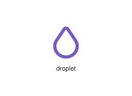
</div>
</div>

{{#endtab}}
{{#tab name="Code"}}

```xml
{{#include ../samples/icons/Tabler-Icons/droplet-6595f440.xal}}
```

{{#endtab}}
{{#endtabs}}

<div class="xal-ref-tag"><code>&lt;item id=&#34;102062&#34; /&gt;</code></div>

</div>
<div class="xal-ref-card">
<div class="xal-ref-title">droplets</div>

{{#tabs name="svg-ref-2085"}}
{{#tab name="Preview"}}
<div class="xal-ref-preview">
<div>
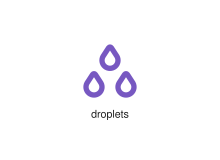
</div>
</div>

{{#endtab}}
{{#tab name="Code"}}

```xml
{{#include ../samples/icons/Tabler-Icons/droplets-db9bf2ec.xal}}
```

{{#endtab}}
{{#endtabs}}

<div class="xal-ref-tag"><code>&lt;item id=&#34;102085&#34; /&gt;</code></div>

</div>
<div class="xal-ref-card">
<div class="xal-ref-title">dual-screen</div>

{{#tabs name="svg-ref-2086"}}
{{#tab name="Preview"}}
<div class="xal-ref-preview">
<div>
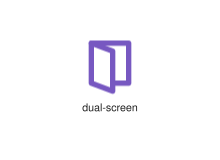
</div>
</div>

{{#endtab}}
{{#tab name="Code"}}

```xml
{{#include ../samples/icons/Tabler-Icons/dual-screen-68a1d026.xal}}
```

{{#endtab}}
{{#endtabs}}

<div class="xal-ref-tag"><code>&lt;item id=&#34;102086&#34; /&gt;</code></div>

</div>
<div class="xal-ref-card">
<div class="xal-ref-title">dumpling</div>

{{#tabs name="svg-ref-2087"}}
{{#tab name="Preview"}}
<div class="xal-ref-preview">
<div>
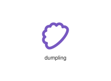
</div>
</div>

{{#endtab}}
{{#tab name="Code"}}

```xml
{{#include ../samples/icons/Tabler-Icons/dumpling-06d84d99.xal}}
```

{{#endtab}}
{{#endtabs}}

<div class="xal-ref-tag"><code>&lt;item id=&#34;102087&#34; /&gt;</code></div>

</div>
<div class="xal-ref-card">
<div class="xal-ref-title">e-passport</div>

{{#tabs name="svg-ref-2088"}}
{{#tab name="Preview"}}
<div class="xal-ref-preview">
<div>

</div>
</div>

{{#endtab}}
{{#tab name="Code"}}

```xml
{{#include ../samples/icons/Tabler-Icons/e-passport-19a28728.xal}}
```

{{#endtab}}
{{#endtabs}}

<div class="xal-ref-tag"><code>&lt;item id=&#34;102088&#34; /&gt;</code></div>

</div>
<div class="xal-ref-card">
<div class="xal-ref-title">ear-off</div>

{{#tabs name="svg-ref-2089"}}
{{#tab name="Preview"}}
<div class="xal-ref-preview">
<div>

</div>
</div>

{{#endtab}}
{{#tab name="Code"}}

```xml
{{#include ../samples/icons/Tabler-Icons/ear-off-5672fe8b.xal}}
```

{{#endtab}}
{{#endtabs}}

<div class="xal-ref-tag"><code>&lt;item id=&#34;102090&#34; /&gt;</code></div>

</div>
<div class="xal-ref-card">
<div class="xal-ref-title">ear-scan</div>

{{#tabs name="svg-ref-2090"}}
{{#tab name="Preview"}}
<div class="xal-ref-preview">
<div>

</div>
</div>

{{#endtab}}
{{#tab name="Code"}}

```xml
{{#include ../samples/icons/Tabler-Icons/ear-scan-2b476696.xal}}
```

{{#endtab}}
{{#endtabs}}

<div class="xal-ref-tag"><code>&lt;item id=&#34;102091&#34; /&gt;</code></div>

</div>
<div class="xal-ref-card">
<div class="xal-ref-title">ear</div>

{{#tabs name="svg-ref-2091"}}
{{#tab name="Preview"}}
<div class="xal-ref-preview">
<div>
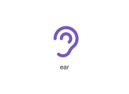
</div>
</div>

{{#endtab}}
{{#tab name="Code"}}

```xml
{{#include ../samples/icons/Tabler-Icons/ear-6b91e5de.xal}}
```

{{#endtab}}
{{#endtabs}}

<div class="xal-ref-tag"><code>&lt;item id=&#34;102089&#34; /&gt;</code></div>

</div>
<div class="xal-ref-card">
<div class="xal-ref-title">ease-in-control-point</div>

{{#tabs name="svg-ref-2092"}}
{{#tab name="Preview"}}
<div class="xal-ref-preview">
<div>
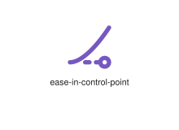
</div>
</div>

{{#endtab}}
{{#tab name="Code"}}

```xml
{{#include ../samples/icons/Tabler-Icons/ease-in-control-point-6eada3c5.xal}}
```

{{#endtab}}
{{#endtabs}}

<div class="xal-ref-tag"><code>&lt;item id=&#34;102093&#34; /&gt;</code></div>

</div>
<div class="xal-ref-card">
<div class="xal-ref-title">ease-in-out-control-points</div>

{{#tabs name="svg-ref-2093"}}
{{#tab name="Preview"}}
<div class="xal-ref-preview">
<div>
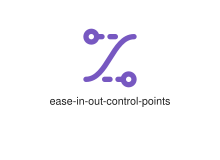
</div>
</div>

{{#endtab}}
{{#tab name="Code"}}

```xml
{{#include ../samples/icons/Tabler-Icons/ease-in-out-control-points-bc713601.xal}}
```

{{#endtab}}
{{#endtabs}}

<div class="xal-ref-tag"><code>&lt;item id=&#34;102095&#34; /&gt;</code></div>

</div>
<div class="xal-ref-card">
<div class="xal-ref-title">ease-in-out</div>

{{#tabs name="svg-ref-2094"}}
{{#tab name="Preview"}}
<div class="xal-ref-preview">
<div>
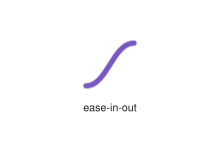
</div>
</div>

{{#endtab}}
{{#tab name="Code"}}

```xml
{{#include ../samples/icons/Tabler-Icons/ease-in-out-27855453.xal}}
```

{{#endtab}}
{{#endtabs}}

<div class="xal-ref-tag"><code>&lt;item id=&#34;102094&#34; /&gt;</code></div>

</div>
<div class="xal-ref-card">
<div class="xal-ref-title">ease-in</div>

{{#tabs name="svg-ref-2095"}}
{{#tab name="Preview"}}
<div class="xal-ref-preview">
<div>
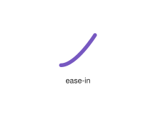
</div>
</div>

{{#endtab}}
{{#tab name="Code"}}

```xml
{{#include ../samples/icons/Tabler-Icons/ease-in-a9c3aed4.xal}}
```

{{#endtab}}
{{#endtabs}}

<div class="xal-ref-tag"><code>&lt;item id=&#34;102092&#34; /&gt;</code></div>

</div>
<div class="xal-ref-card">
<div class="xal-ref-title">ease-out-control-point</div>

{{#tabs name="svg-ref-2096"}}
{{#tab name="Preview"}}
<div class="xal-ref-preview">
<div>
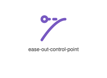
</div>
</div>

{{#endtab}}
{{#tab name="Code"}}

```xml
{{#include ../samples/icons/Tabler-Icons/ease-out-control-point-1ef86871.xal}}
```

{{#endtab}}
{{#endtabs}}

<div class="xal-ref-tag"><code>&lt;item id=&#34;102097&#34; /&gt;</code></div>

</div>
<div class="xal-ref-card">
<div class="xal-ref-title">ease-out</div>

{{#tabs name="svg-ref-2097"}}
{{#tab name="Preview"}}
<div class="xal-ref-preview">
<div>
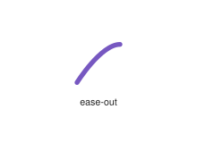
</div>
</div>

{{#endtab}}
{{#tab name="Code"}}

```xml
{{#include ../samples/icons/Tabler-Icons/ease-out-94d4e899.xal}}
```

{{#endtab}}
{{#endtabs}}

<div class="xal-ref-tag"><code>&lt;item id=&#34;102096&#34; /&gt;</code></div>

</div>
<div class="xal-ref-card">
<div class="xal-ref-title">edit-circle-off</div>

{{#tabs name="svg-ref-2098"}}
{{#tab name="Preview"}}
<div class="xal-ref-preview">
<div>
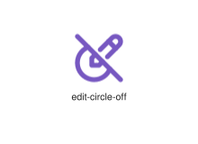
</div>
</div>

{{#endtab}}
{{#tab name="Code"}}

```xml
{{#include ../samples/icons/Tabler-Icons/edit-circle-off-de602101.xal}}
```

{{#endtab}}
{{#endtabs}}

<div class="xal-ref-tag"><code>&lt;item id=&#34;102100&#34; /&gt;</code></div>

</div>
<div class="xal-ref-card">
<div class="xal-ref-title">edit-circle</div>

{{#tabs name="svg-ref-2099"}}
{{#tab name="Preview"}}
<div class="xal-ref-preview">
<div>
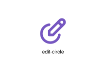
</div>
</div>

{{#endtab}}
{{#tab name="Code"}}

```xml
{{#include ../samples/icons/Tabler-Icons/edit-circle-fb7fc02e.xal}}
```

{{#endtab}}
{{#endtabs}}

<div class="xal-ref-tag"><code>&lt;item id=&#34;102099&#34; /&gt;</code></div>

</div>
<div class="xal-ref-card">
<div class="xal-ref-title">edit-off</div>

{{#tabs name="svg-ref-2100"}}
{{#tab name="Preview"}}
<div class="xal-ref-preview">
<div>
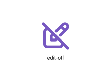
</div>
</div>

{{#endtab}}
{{#tab name="Code"}}

```xml
{{#include ../samples/icons/Tabler-Icons/edit-off-f1d6b71f.xal}}
```

{{#endtab}}
{{#endtabs}}

<div class="xal-ref-tag"><code>&lt;item id=&#34;102101&#34; /&gt;</code></div>

</div>
<div class="xal-ref-card">
<div class="xal-ref-title">edit</div>

{{#tabs name="svg-ref-2101"}}
{{#tab name="Preview"}}
<div class="xal-ref-preview">
<div>
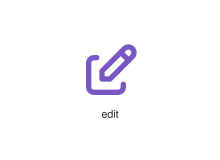
</div>
</div>

{{#endtab}}
{{#tab name="Code"}}

```xml
{{#include ../samples/icons/Tabler-Icons/edit-452b4951.xal}}
```

{{#endtab}}
{{#endtabs}}

<div class="xal-ref-tag"><code>&lt;item id=&#34;102098&#34; /&gt;</code></div>

</div>
<div class="xal-ref-card">
<div class="xal-ref-title">egg-cracked</div>

{{#tabs name="svg-ref-2102"}}
{{#tab name="Preview"}}
<div class="xal-ref-preview">
<div>
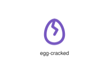
</div>
</div>

{{#endtab}}
{{#tab name="Code"}}

```xml
{{#include ../samples/icons/Tabler-Icons/egg-cracked-b231f455.xal}}
```

{{#endtab}}
{{#endtabs}}

<div class="xal-ref-tag"><code>&lt;item id=&#34;102103&#34; /&gt;</code></div>

</div>
<div class="xal-ref-card">
<div class="xal-ref-title">egg-fried</div>

{{#tabs name="svg-ref-2103"}}
{{#tab name="Preview"}}
<div class="xal-ref-preview">
<div>
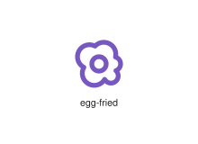
</div>
</div>

{{#endtab}}
{{#tab name="Code"}}

```xml
{{#include ../samples/icons/Tabler-Icons/egg-fried-5957594b.xal}}
```

{{#endtab}}
{{#endtabs}}

<div class="xal-ref-tag"><code>&lt;item id=&#34;102104&#34; /&gt;</code></div>

</div>
<div class="xal-ref-card">
<div class="xal-ref-title">egg-off</div>

{{#tabs name="svg-ref-2104"}}
{{#tab name="Preview"}}
<div class="xal-ref-preview">
<div>
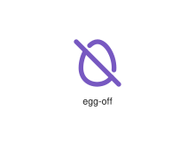
</div>
</div>

{{#endtab}}
{{#tab name="Code"}}

```xml
{{#include ../samples/icons/Tabler-Icons/egg-off-bd3b89f2.xal}}
```

{{#endtab}}
{{#endtabs}}

<div class="xal-ref-tag"><code>&lt;item id=&#34;102105&#34; /&gt;</code></div>

</div>
<div class="xal-ref-card">
<div class="xal-ref-title">egg</div>

{{#tabs name="svg-ref-2105"}}
{{#tab name="Preview"}}
<div class="xal-ref-preview">
<div>
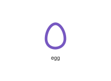
</div>
</div>

{{#endtab}}
{{#tab name="Code"}}

```xml
{{#include ../samples/icons/Tabler-Icons/egg-15c81e31.xal}}
```

{{#endtab}}
{{#endtabs}}

<div class="xal-ref-tag"><code>&lt;item id=&#34;102102&#34; /&gt;</code></div>

</div>
<div class="xal-ref-card">
<div class="xal-ref-title">eggs</div>

{{#tabs name="svg-ref-2106"}}
{{#tab name="Preview"}}
<div class="xal-ref-preview">
<div>
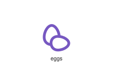
</div>
</div>

{{#endtab}}
{{#tab name="Code"}}

```xml
{{#include ../samples/icons/Tabler-Icons/eggs-fce9eeac.xal}}
```

{{#endtab}}
{{#endtabs}}

<div class="xal-ref-tag"><code>&lt;item id=&#34;102106&#34; /&gt;</code></div>

</div>
<div class="xal-ref-card">
<div class="xal-ref-title">elevator-off</div>

{{#tabs name="svg-ref-2107"}}
{{#tab name="Preview"}}
<div class="xal-ref-preview">
<div>
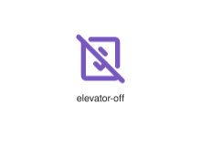
</div>
</div>

{{#endtab}}
{{#tab name="Code"}}

```xml
{{#include ../samples/icons/Tabler-Icons/elevator-off-68fe4706.xal}}
```

{{#endtab}}
{{#endtabs}}

<div class="xal-ref-tag"><code>&lt;item id=&#34;102108&#34; /&gt;</code></div>

</div>
<div class="xal-ref-card">
<div class="xal-ref-title">elevator</div>

{{#tabs name="svg-ref-2108"}}
{{#tab name="Preview"}}
<div class="xal-ref-preview">
<div>
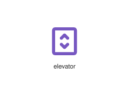
</div>
</div>

{{#endtab}}
{{#tab name="Code"}}

```xml
{{#include ../samples/icons/Tabler-Icons/elevator-d65be14e.xal}}
```

{{#endtab}}
{{#endtabs}}

<div class="xal-ref-tag"><code>&lt;item id=&#34;102107&#34; /&gt;</code></div>

</div>
<div class="xal-ref-card">
<div class="xal-ref-title">emergency-bed</div>

{{#tabs name="svg-ref-2109"}}
{{#tab name="Preview"}}
<div class="xal-ref-preview">
<div>
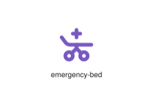
</div>
</div>

{{#endtab}}
{{#tab name="Code"}}

```xml
{{#include ../samples/icons/Tabler-Icons/emergency-bed-294ae0ed.xal}}
```

{{#endtab}}
{{#endtabs}}

<div class="xal-ref-tag"><code>&lt;item id=&#34;102109&#34; /&gt;</code></div>

</div>
<div class="xal-ref-card">
<div class="xal-ref-title">empathize-off</div>

{{#tabs name="svg-ref-2110"}}
{{#tab name="Preview"}}
<div class="xal-ref-preview">
<div>

</div>
</div>

{{#endtab}}
{{#tab name="Code"}}

```xml
{{#include ../samples/icons/Tabler-Icons/empathize-off-f6e95dae.xal}}
```

{{#endtab}}
{{#endtabs}}

<div class="xal-ref-tag"><code>&lt;item id=&#34;102111&#34; /&gt;</code></div>

</div>
<div class="xal-ref-card">
<div class="xal-ref-title">empathize</div>

{{#tabs name="svg-ref-2111"}}
{{#tab name="Preview"}}
<div class="xal-ref-preview">
<div>

</div>
</div>

{{#endtab}}
{{#tab name="Code"}}

```xml
{{#include ../samples/icons/Tabler-Icons/empathize-108659a6.xal}}
```

{{#endtab}}
{{#endtabs}}

<div class="xal-ref-tag"><code>&lt;item id=&#34;102110&#34; /&gt;</code></div>

</div>
<div class="xal-ref-card">
<div class="xal-ref-title">emphasis</div>

{{#tabs name="svg-ref-2112"}}
{{#tab name="Preview"}}
<div class="xal-ref-preview">
<div>
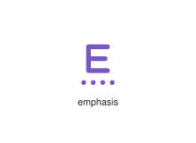
</div>
</div>

{{#endtab}}
{{#tab name="Code"}}

```xml
{{#include ../samples/icons/Tabler-Icons/emphasis-9cce19e2.xal}}
```

{{#endtab}}
{{#endtabs}}

<div class="xal-ref-tag"><code>&lt;item id=&#34;102112&#34; /&gt;</code></div>

</div>
<div class="xal-ref-card">
<div class="xal-ref-title">engine-off</div>

{{#tabs name="svg-ref-2113"}}
{{#tab name="Preview"}}
<div class="xal-ref-preview">
<div>
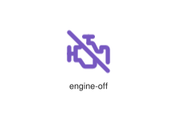
</div>
</div>

{{#endtab}}
{{#tab name="Code"}}

```xml
{{#include ../samples/icons/Tabler-Icons/engine-off-9a68cca0.xal}}
```

{{#endtab}}
{{#endtabs}}

<div class="xal-ref-tag"><code>&lt;item id=&#34;102114&#34; /&gt;</code></div>

</div>
<div class="xal-ref-card">
<div class="xal-ref-title">engine</div>

{{#tabs name="svg-ref-2114"}}
{{#tab name="Preview"}}
<div class="xal-ref-preview">
<div>
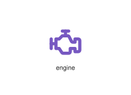
</div>
</div>

{{#endtab}}
{{#tab name="Code"}}

```xml
{{#include ../samples/icons/Tabler-Icons/engine-3409c973.xal}}
```

{{#endtab}}
{{#endtabs}}

<div class="xal-ref-tag"><code>&lt;item id=&#34;102113&#34; /&gt;</code></div>

</div>
<div class="xal-ref-card">
<div class="xal-ref-title">equal-double</div>

{{#tabs name="svg-ref-2115"}}
{{#tab name="Preview"}}
<div class="xal-ref-preview">
<div>
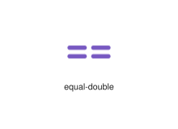
</div>
</div>

{{#endtab}}
{{#tab name="Code"}}

```xml
{{#include ../samples/icons/Tabler-Icons/equal-double-46485a30.xal}}
```

{{#endtab}}
{{#endtabs}}

<div class="xal-ref-tag"><code>&lt;item id=&#34;102116&#34; /&gt;</code></div>

</div>
<div class="xal-ref-card">
<div class="xal-ref-title">equal-not</div>

{{#tabs name="svg-ref-2116"}}
{{#tab name="Preview"}}
<div class="xal-ref-preview">
<div>
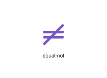
</div>
</div>

{{#endtab}}
{{#tab name="Code"}}

```xml
{{#include ../samples/icons/Tabler-Icons/equal-not-d59a6aed.xal}}
```

{{#endtab}}
{{#endtabs}}

<div class="xal-ref-tag"><code>&lt;item id=&#34;102117&#34; /&gt;</code></div>

</div>
<div class="xal-ref-card">
<div class="xal-ref-title">equal</div>

{{#tabs name="svg-ref-2117"}}
{{#tab name="Preview"}}
<div class="xal-ref-preview">
<div>
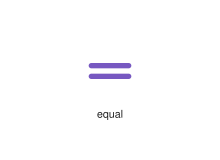
</div>
</div>

{{#endtab}}
{{#tab name="Code"}}

```xml
{{#include ../samples/icons/Tabler-Icons/equal-9485362d.xal}}
```

{{#endtab}}
{{#endtabs}}

<div class="xal-ref-tag"><code>&lt;item id=&#34;102115&#34; /&gt;</code></div>

</div>
<div class="xal-ref-card">
<div class="xal-ref-title">eraser-off</div>

{{#tabs name="svg-ref-2118"}}
{{#tab name="Preview"}}
<div class="xal-ref-preview">
<div>
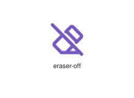
</div>
</div>

{{#endtab}}
{{#tab name="Code"}}

```xml
{{#include ../samples/icons/Tabler-Icons/eraser-off-27f03e61.xal}}
```

{{#endtab}}
{{#endtabs}}

<div class="xal-ref-tag"><code>&lt;item id=&#34;102119&#34; /&gt;</code></div>

</div>
<div class="xal-ref-card">
<div class="xal-ref-title">eraser</div>

{{#tabs name="svg-ref-2119"}}
{{#tab name="Preview"}}
<div class="xal-ref-preview">
<div>
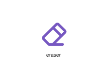
</div>
</div>

{{#endtab}}
{{#tab name="Code"}}

```xml
{{#include ../samples/icons/Tabler-Icons/eraser-c33b0940.xal}}
```

{{#endtab}}
{{#endtabs}}

<div class="xal-ref-tag"><code>&lt;item id=&#34;102118&#34; /&gt;</code></div>

</div>
<div class="xal-ref-card">
<div class="xal-ref-title">error-404-off</div>

{{#tabs name="svg-ref-2120"}}
{{#tab name="Preview"}}
<div class="xal-ref-preview">
<div>
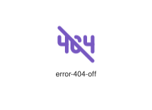
</div>
</div>

{{#endtab}}
{{#tab name="Code"}}

```xml
{{#include ../samples/icons/Tabler-Icons/error-404-off-aa87ad59.xal}}
```

{{#endtab}}
{{#endtabs}}

<div class="xal-ref-tag"><code>&lt;item id=&#34;102121&#34; /&gt;</code></div>

</div>
<div class="xal-ref-card">
<div class="xal-ref-title">error-404</div>

{{#tabs name="svg-ref-2121"}}
{{#tab name="Preview"}}
<div class="xal-ref-preview">
<div>
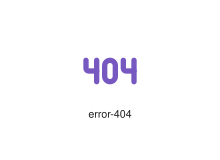
</div>
</div>

{{#endtab}}
{{#tab name="Code"}}

```xml
{{#include ../samples/icons/Tabler-Icons/error-404-d37a505c.xal}}
```

{{#endtab}}
{{#endtabs}}

<div class="xal-ref-tag"><code>&lt;item id=&#34;102120&#34; /&gt;</code></div>

</div>
<div class="xal-ref-card">
<div class="xal-ref-title">escalator-down</div>

{{#tabs name="svg-ref-2122"}}
{{#tab name="Preview"}}
<div class="xal-ref-preview">
<div>
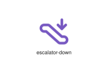
</div>
</div>

{{#endtab}}
{{#tab name="Code"}}

```xml
{{#include ../samples/icons/Tabler-Icons/escalator-down-c732478d.xal}}
```

{{#endtab}}
{{#endtabs}}

<div class="xal-ref-tag"><code>&lt;item id=&#34;102123&#34; /&gt;</code></div>

</div>
<div class="xal-ref-card">
<div class="xal-ref-title">escalator-up</div>

{{#tabs name="svg-ref-2123"}}
{{#tab name="Preview"}}
<div class="xal-ref-preview">
<div>
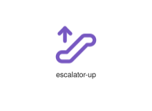
</div>
</div>

{{#endtab}}
{{#tab name="Code"}}

```xml
{{#include ../samples/icons/Tabler-Icons/escalator-up-bf1dd193.xal}}
```

{{#endtab}}
{{#endtabs}}

<div class="xal-ref-tag"><code>&lt;item id=&#34;102124&#34; /&gt;</code></div>

</div>
<div class="xal-ref-card">
<div class="xal-ref-title">escalator</div>

{{#tabs name="svg-ref-2124"}}
{{#tab name="Preview"}}
<div class="xal-ref-preview">
<div>
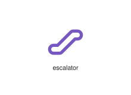
</div>
</div>

{{#endtab}}
{{#tab name="Code"}}

```xml
{{#include ../samples/icons/Tabler-Icons/escalator-4d3e1b78.xal}}
```

{{#endtab}}
{{#endtabs}}

<div class="xal-ref-tag"><code>&lt;item id=&#34;102122&#34; /&gt;</code></div>

</div>
<div class="xal-ref-card">
<div class="xal-ref-title">exchange-off</div>

{{#tabs name="svg-ref-2125"}}
{{#tab name="Preview"}}
<div class="xal-ref-preview">
<div>

</div>
</div>

{{#endtab}}
{{#tab name="Code"}}

```xml
{{#include ../samples/icons/Tabler-Icons/exchange-off-87ecaff5.xal}}
```

{{#endtab}}
{{#endtabs}}

<div class="xal-ref-tag"><code>&lt;item id=&#34;102126&#34; /&gt;</code></div>

</div>
<div class="xal-ref-card">
<div class="xal-ref-title">exchange</div>

{{#tabs name="svg-ref-2126"}}
{{#tab name="Preview"}}
<div class="xal-ref-preview">
<div>

</div>
</div>

{{#endtab}}
{{#tab name="Code"}}

```xml
{{#include ../samples/icons/Tabler-Icons/exchange-5c55b5dc.xal}}
```

{{#endtab}}
{{#endtabs}}

<div class="xal-ref-tag"><code>&lt;item id=&#34;102125&#34; /&gt;</code></div>

</div>
<div class="xal-ref-card">
<div class="xal-ref-title">exclamation-circle</div>

{{#tabs name="svg-ref-2127"}}
{{#tab name="Preview"}}
<div class="xal-ref-preview">
<div>
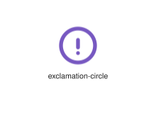
</div>
</div>

{{#endtab}}
{{#tab name="Code"}}

```xml
{{#include ../samples/icons/Tabler-Icons/exclamation-circle-711144d4.xal}}
```

{{#endtab}}
{{#endtabs}}

<div class="xal-ref-tag"><code>&lt;item id=&#34;102127&#34; /&gt;</code></div>

</div>
<div class="xal-ref-card">
<div class="xal-ref-title">exclamation-mark-off</div>

{{#tabs name="svg-ref-2128"}}
{{#tab name="Preview"}}
<div class="xal-ref-preview">
<div>
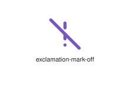
</div>
</div>

{{#endtab}}
{{#tab name="Code"}}

```xml
{{#include ../samples/icons/Tabler-Icons/exclamation-mark-off-887f7d9b.xal}}
```

{{#endtab}}
{{#endtabs}}

<div class="xal-ref-tag"><code>&lt;item id=&#34;102129&#34; /&gt;</code></div>

</div>
<div class="xal-ref-card">
<div class="xal-ref-title">exclamation-mark</div>

{{#tabs name="svg-ref-2129"}}
{{#tab name="Preview"}}
<div class="xal-ref-preview">
<div>
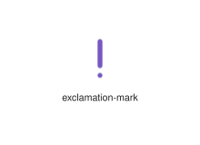
</div>
</div>

{{#endtab}}
{{#tab name="Code"}}

```xml
{{#include ../samples/icons/Tabler-Icons/exclamation-mark-f9476238.xal}}
```

{{#endtab}}
{{#endtabs}}

<div class="xal-ref-tag"><code>&lt;item id=&#34;102128&#34; /&gt;</code></div>

</div>
<div class="xal-ref-card">
<div class="xal-ref-title">explicit-off</div>

{{#tabs name="svg-ref-2130"}}
{{#tab name="Preview"}}
<div class="xal-ref-preview">
<div>

</div>
</div>

{{#endtab}}
{{#tab name="Code"}}

```xml
{{#include ../samples/icons/Tabler-Icons/explicit-off-356c81ac.xal}}
```

{{#endtab}}
{{#endtabs}}

<div class="xal-ref-tag"><code>&lt;item id=&#34;102131&#34; /&gt;</code></div>

</div>
<div class="xal-ref-card">
<div class="xal-ref-title">explicit</div>

{{#tabs name="svg-ref-2131"}}
{{#tab name="Preview"}}
<div class="xal-ref-preview">
<div>
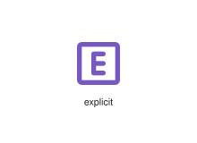
</div>
</div>

{{#endtab}}
{{#tab name="Code"}}

```xml
{{#include ../samples/icons/Tabler-Icons/explicit-18987b0c.xal}}
```

{{#endtab}}
{{#endtabs}}

<div class="xal-ref-tag"><code>&lt;item id=&#34;102130&#34; /&gt;</code></div>

</div>
<div class="xal-ref-card">
<div class="xal-ref-title">exposure-0</div>

{{#tabs name="svg-ref-2132"}}
{{#tab name="Preview"}}
<div class="xal-ref-preview">
<div>
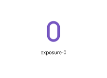
</div>
</div>

{{#endtab}}
{{#tab name="Code"}}

```xml
{{#include ../samples/icons/Tabler-Icons/exposure-0-9a954d5e.xal}}
```

{{#endtab}}
{{#endtabs}}

<div class="xal-ref-tag"><code>&lt;item id=&#34;102133&#34; /&gt;</code></div>

</div>
<div class="xal-ref-card">
<div class="xal-ref-title">exposure-minus-1</div>

{{#tabs name="svg-ref-2133"}}
{{#tab name="Preview"}}
<div class="xal-ref-preview">
<div>
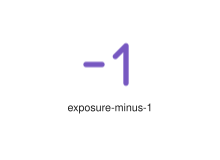
</div>
</div>

{{#endtab}}
{{#tab name="Code"}}

```xml
{{#include ../samples/icons/Tabler-Icons/exposure-minus-1-49784ddf.xal}}
```

{{#endtab}}
{{#endtabs}}

<div class="xal-ref-tag"><code>&lt;item id=&#34;102134&#34; /&gt;</code></div>

</div>
<div class="xal-ref-card">
<div class="xal-ref-title">exposure-minus-2</div>

{{#tabs name="svg-ref-2134"}}
{{#tab name="Preview"}}
<div class="xal-ref-preview">
<div>
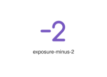
</div>
</div>

{{#endtab}}
{{#tab name="Code"}}

```xml
{{#include ../samples/icons/Tabler-Icons/exposure-minus-2-0ed8370f.xal}}
```

{{#endtab}}
{{#endtabs}}

<div class="xal-ref-tag"><code>&lt;item id=&#34;102135&#34; /&gt;</code></div>

</div>
<div class="xal-ref-card">
<div class="xal-ref-title">exposure-off</div>

{{#tabs name="svg-ref-2135"}}
{{#tab name="Preview"}}
<div class="xal-ref-preview">
<div>

</div>
</div>

{{#endtab}}
{{#tab name="Code"}}

```xml
{{#include ../samples/icons/Tabler-Icons/exposure-off-4c3fca5a.xal}}
```

{{#endtab}}
{{#endtabs}}

<div class="xal-ref-tag"><code>&lt;item id=&#34;102136&#34; /&gt;</code></div>

</div>
<div class="xal-ref-card">
<div class="xal-ref-title">exposure-plus-1</div>

{{#tabs name="svg-ref-2136"}}
{{#tab name="Preview"}}
<div class="xal-ref-preview">
<div>
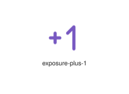
</div>
</div>

{{#endtab}}
{{#tab name="Code"}}

```xml
{{#include ../samples/icons/Tabler-Icons/exposure-plus-1-2ceb886e.xal}}
```

{{#endtab}}
{{#endtabs}}

<div class="xal-ref-tag"><code>&lt;item id=&#34;102137&#34; /&gt;</code></div>

</div>
<div class="xal-ref-card">
<div class="xal-ref-title">exposure-plus-2</div>

{{#tabs name="svg-ref-2137"}}
{{#tab name="Preview"}}
<div class="xal-ref-preview">
<div>
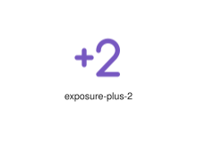
</div>
</div>

{{#endtab}}
{{#tab name="Code"}}

```xml
{{#include ../samples/icons/Tabler-Icons/exposure-plus-2-6b4bf2be.xal}}
```

{{#endtab}}
{{#endtabs}}

<div class="xal-ref-tag"><code>&lt;item id=&#34;102138&#34; /&gt;</code></div>

</div>
<div class="xal-ref-card">
<div class="xal-ref-title">exposure</div>

{{#tabs name="svg-ref-2138"}}
{{#tab name="Preview"}}
<div class="xal-ref-preview">
<div>
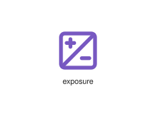
</div>
</div>

{{#endtab}}
{{#tab name="Code"}}

```xml
{{#include ../samples/icons/Tabler-Icons/exposure-fcf18fb4.xal}}
```

{{#endtab}}
{{#endtabs}}

<div class="xal-ref-tag"><code>&lt;item id=&#34;102132&#34; /&gt;</code></div>

</div>
<div class="xal-ref-card">
<div class="xal-ref-title">external-link-off</div>

{{#tabs name="svg-ref-2139"}}
{{#tab name="Preview"}}
<div class="xal-ref-preview">
<div>

</div>
</div>

{{#endtab}}
{{#tab name="Code"}}

```xml
{{#include ../samples/icons/Tabler-Icons/external-link-off-55edfd6e.xal}}
```

{{#endtab}}
{{#endtabs}}

<div class="xal-ref-tag"><code>&lt;item id=&#34;102140&#34; /&gt;</code></div>

</div>
<div class="xal-ref-card">
<div class="xal-ref-title">external-link</div>

{{#tabs name="svg-ref-2140"}}
{{#tab name="Preview"}}
<div class="xal-ref-preview">
<div>

</div>
</div>

{{#endtab}}
{{#tab name="Code"}}

```xml
{{#include ../samples/icons/Tabler-Icons/external-link-d1822e03.xal}}
```

{{#endtab}}
{{#endtabs}}

<div class="xal-ref-tag"><code>&lt;item id=&#34;102139&#34; /&gt;</code></div>

</div>
<div class="xal-ref-card">
<div class="xal-ref-title">eye-bitcoin</div>

{{#tabs name="svg-ref-2141"}}
{{#tab name="Preview"}}
<div class="xal-ref-preview">
<div>

</div>
</div>

{{#endtab}}
{{#tab name="Code"}}

```xml
{{#include ../samples/icons/Tabler-Icons/eye-bitcoin-4eee76da.xal}}
```

{{#endtab}}
{{#endtabs}}

<div class="xal-ref-tag"><code>&lt;item id=&#34;102142&#34; /&gt;</code></div>

</div>
<div class="xal-ref-card">
<div class="xal-ref-title">eye-bolt</div>

{{#tabs name="svg-ref-2142"}}
{{#tab name="Preview"}}
<div class="xal-ref-preview">
<div>

</div>
</div>

{{#endtab}}
{{#tab name="Code"}}

```xml
{{#include ../samples/icons/Tabler-Icons/eye-bolt-1b7f1eb5.xal}}
```

{{#endtab}}
{{#endtabs}}

<div class="xal-ref-tag"><code>&lt;item id=&#34;102143&#34; /&gt;</code></div>

</div>
<div class="xal-ref-card">
<div class="xal-ref-title">eye-cancel</div>

{{#tabs name="svg-ref-2143"}}
{{#tab name="Preview"}}
<div class="xal-ref-preview">
<div>

</div>
</div>

{{#endtab}}
{{#tab name="Code"}}

```xml
{{#include ../samples/icons/Tabler-Icons/eye-cancel-dd328719.xal}}
```

{{#endtab}}
{{#endtabs}}

<div class="xal-ref-tag"><code>&lt;item id=&#34;102144&#34; /&gt;</code></div>

</div>
<div class="xal-ref-card">
<div class="xal-ref-title">eye-check</div>

{{#tabs name="svg-ref-2144"}}
{{#tab name="Preview"}}
<div class="xal-ref-preview">
<div>

</div>
</div>

{{#endtab}}
{{#tab name="Code"}}

```xml
{{#include ../samples/icons/Tabler-Icons/eye-check-d057a87c.xal}}
```

{{#endtab}}
{{#endtabs}}

<div class="xal-ref-tag"><code>&lt;item id=&#34;102145&#34; /&gt;</code></div>

</div>
<div class="xal-ref-card">
<div class="xal-ref-title">eye-closed</div>

{{#tabs name="svg-ref-2145"}}
{{#tab name="Preview"}}
<div class="xal-ref-preview">
<div>

</div>
</div>

{{#endtab}}
{{#tab name="Code"}}

```xml
{{#include ../samples/icons/Tabler-Icons/eye-closed-b779b7df.xal}}
```

{{#endtab}}
{{#endtabs}}

<div class="xal-ref-tag"><code>&lt;item id=&#34;102146&#34; /&gt;</code></div>

</div>
<div class="xal-ref-card">
<div class="xal-ref-title">eye-code</div>

{{#tabs name="svg-ref-2146"}}
{{#tab name="Preview"}}
<div class="xal-ref-preview">
<div>

</div>
</div>

{{#endtab}}
{{#tab name="Code"}}

```xml
{{#include ../samples/icons/Tabler-Icons/eye-code-66062274.xal}}
```

{{#endtab}}
{{#endtabs}}

<div class="xal-ref-tag"><code>&lt;item id=&#34;102147&#34; /&gt;</code></div>

</div>
<div class="xal-ref-card">
<div class="xal-ref-title">eye-cog</div>

{{#tabs name="svg-ref-2147"}}
{{#tab name="Preview"}}
<div class="xal-ref-preview">
<div>

</div>
</div>

{{#endtab}}
{{#tab name="Code"}}

```xml
{{#include ../samples/icons/Tabler-Icons/eye-cog-77650223.xal}}
```

{{#endtab}}
{{#endtabs}}

<div class="xal-ref-tag"><code>&lt;item id=&#34;102148&#34; /&gt;</code></div>

</div>
<div class="xal-ref-card">
<div class="xal-ref-title">eye-discount</div>

{{#tabs name="svg-ref-2148"}}
{{#tab name="Preview"}}
<div class="xal-ref-preview">
<div>

</div>
</div>

{{#endtab}}
{{#tab name="Code"}}

```xml
{{#include ../samples/icons/Tabler-Icons/eye-discount-d4d56707.xal}}
```

{{#endtab}}
{{#endtabs}}

<div class="xal-ref-tag"><code>&lt;item id=&#34;102149&#34; /&gt;</code></div>

</div>
<div class="xal-ref-card">
<div class="xal-ref-title">eye-dollar</div>

{{#tabs name="svg-ref-2149"}}
{{#tab name="Preview"}}
<div class="xal-ref-preview">
<div>

</div>
</div>

{{#endtab}}
{{#tab name="Code"}}

```xml
{{#include ../samples/icons/Tabler-Icons/eye-dollar-07005b93.xal}}
```

{{#endtab}}
{{#endtabs}}

<div class="xal-ref-tag"><code>&lt;item id=&#34;102150&#34; /&gt;</code></div>

</div>
<div class="xal-ref-card">
<div class="xal-ref-title">eye-dotted</div>

{{#tabs name="svg-ref-2150"}}
{{#tab name="Preview"}}
<div class="xal-ref-preview">
<div>

</div>
</div>

{{#endtab}}
{{#tab name="Code"}}

```xml
{{#include ../samples/icons/Tabler-Icons/eye-dotted-885e8390.xal}}
```

{{#endtab}}
{{#endtabs}}

<div class="xal-ref-tag"><code>&lt;item id=&#34;102151&#34; /&gt;</code></div>

</div>
<div class="xal-ref-card">
<div class="xal-ref-title">eye-down</div>

{{#tabs name="svg-ref-2151"}}
{{#tab name="Preview"}}
<div class="xal-ref-preview">
<div>

</div>
</div>

{{#endtab}}
{{#tab name="Code"}}

```xml
{{#include ../samples/icons/Tabler-Icons/eye-down-9e516a49.xal}}
```

{{#endtab}}
{{#endtabs}}

<div class="xal-ref-tag"><code>&lt;item id=&#34;102152&#34; /&gt;</code></div>

</div>
<div class="xal-ref-card">
<div class="xal-ref-title">eye-edit</div>

{{#tabs name="svg-ref-2152"}}
{{#tab name="Preview"}}
<div class="xal-ref-preview">
<div>

</div>
</div>

{{#endtab}}
{{#tab name="Code"}}

```xml
{{#include ../samples/icons/Tabler-Icons/eye-edit-4370d2e5.xal}}
```

{{#endtab}}
{{#endtabs}}

<div class="xal-ref-tag"><code>&lt;item id=&#34;102153&#34; /&gt;</code></div>

</div>
<div class="xal-ref-card">
<div class="xal-ref-title">eye-exclamation</div>

{{#tabs name="svg-ref-2153"}}
{{#tab name="Preview"}}
<div class="xal-ref-preview">
<div>

</div>
</div>

{{#endtab}}
{{#tab name="Code"}}

```xml
{{#include ../samples/icons/Tabler-Icons/eye-exclamation-a458b08b.xal}}
```

{{#endtab}}
{{#endtabs}}

<div class="xal-ref-tag"><code>&lt;item id=&#34;102154&#34; /&gt;</code></div>

</div>
<div class="xal-ref-card">
<div class="xal-ref-title">eye-heart</div>

{{#tabs name="svg-ref-2154"}}
{{#tab name="Preview"}}
<div class="xal-ref-preview">
<div>

</div>
</div>

{{#endtab}}
{{#tab name="Code"}}

```xml
{{#include ../samples/icons/Tabler-Icons/eye-heart-1772d60e.xal}}
```

{{#endtab}}
{{#endtabs}}

<div class="xal-ref-tag"><code>&lt;item id=&#34;102155&#34; /&gt;</code></div>

</div>
<div class="xal-ref-card">
<div class="xal-ref-title">eye-minus</div>

{{#tabs name="svg-ref-2155"}}
{{#tab name="Preview"}}
<div class="xal-ref-preview">
<div>

</div>
</div>

{{#endtab}}
{{#tab name="Code"}}

```xml
{{#include ../samples/icons/Tabler-Icons/eye-minus-53271a4f.xal}}
```

{{#endtab}}
{{#endtabs}}

<div class="xal-ref-tag"><code>&lt;item id=&#34;102156&#34; /&gt;</code></div>

</div>
<div class="xal-ref-card">
<div class="xal-ref-title">eye-off</div>

{{#tabs name="svg-ref-2156"}}
{{#tab name="Preview"}}
<div class="xal-ref-preview">
<div>

</div>
</div>

{{#endtab}}
{{#tab name="Code"}}

```xml
{{#include ../samples/icons/Tabler-Icons/eye-off-aaaa102f.xal}}
```

{{#endtab}}
{{#endtabs}}

<div class="xal-ref-tag"><code>&lt;item id=&#34;102157&#34; /&gt;</code></div>

</div>
<div class="xal-ref-card">
<div class="xal-ref-title">eye-pause</div>

{{#tabs name="svg-ref-2157"}}
{{#tab name="Preview"}}
<div class="xal-ref-preview">
<div>

</div>
</div>

{{#endtab}}
{{#tab name="Code"}}

```xml
{{#include ../samples/icons/Tabler-Icons/eye-pause-816dedd7.xal}}
```

{{#endtab}}
{{#endtabs}}

<div class="xal-ref-tag"><code>&lt;item id=&#34;102158&#34; /&gt;</code></div>

</div>
<div class="xal-ref-card">
<div class="xal-ref-title">eye-pin</div>

{{#tabs name="svg-ref-2158"}}
{{#tab name="Preview"}}
<div class="xal-ref-preview">
<div>

</div>
</div>

{{#endtab}}
{{#tab name="Code"}}

```xml
{{#include ../samples/icons/Tabler-Icons/eye-pin-fa1a051c.xal}}
```

{{#endtab}}
{{#endtabs}}

<div class="xal-ref-tag"><code>&lt;item id=&#34;102159&#34; /&gt;</code></div>

</div>
<div class="xal-ref-card">
<div class="xal-ref-title">eye-plus</div>

{{#tabs name="svg-ref-2159"}}
{{#tab name="Preview"}}
<div class="xal-ref-preview">
<div>

</div>
</div>

{{#endtab}}
{{#tab name="Code"}}

```xml
{{#include ../samples/icons/Tabler-Icons/eye-plus-82f0bd3d.xal}}
```

{{#endtab}}
{{#endtabs}}

<div class="xal-ref-tag"><code>&lt;item id=&#34;102160&#34; /&gt;</code></div>

</div>
</div>
