# Tabler-Icons - Page 28

This page references SVG files under `etc/resources/aws/svg/Tabler-Icons`.
Each card shows the SVG preview first and the XAL tag syntax in the Code tab.
Showing 2431-2520 of 4964 SVG files.

<style>
.xal-ref-grid{display:grid;grid-template-columns:repeat(3,minmax(0,1fr));gap:1rem;margin:1rem 0 1.5rem}.xal-ref-card{border:1px solid var(--table-border-color);border-radius:8px;overflow:hidden;background:var(--bg);padding:.75rem}.xal-ref-title{font-size:.9rem;font-weight:600;line-height:1.25;margin:0 0 .5rem;overflow-wrap:anywhere}.xal-ref-preview{display:flex;align-items:center;justify-content:center}.xal-ref-preview img{display:block;width:100%;height:auto}.xal-ref-card pre{margin:0;max-height:18rem;overflow:auto;white-space:pre}.xal-ref-card code{font-size:.78em}.xal-ref-tag{margin:.5rem 0 0;color:var(--fg);opacity:.72;overflow:auto;white-space:pre}.xal-ref-tag code{font-size:.72em}@media(max-width:900px){.xal-ref-grid{grid-template-columns:repeat(2,minmax(0,1fr))}}@media(max-width:560px){.xal-ref-grid{grid-template-columns:1fr}}
</style>

[Back to section index](tabler-icons.md)

<div class="xal-ref-grid">
<div class="xal-ref-card">
<div class="xal-ref-title">freeze-row</div>

{{#tabs name="svg-ref-2430"}}
{{#tab name="Preview"}}
<div class="xal-ref-preview">
<div>
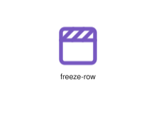
</div>
</div>

{{#endtab}}
{{#tab name="Code"}}

```xml
{{#include ../samples/icons/Tabler-Icons/freeze-row-7c56c964.xal}}
```

{{#endtab}}
{{#endtabs}}

<div class="xal-ref-tag"><code>&lt;item id=&#34;102429&#34; /&gt;</code></div>

</div>
<div class="xal-ref-card">
<div class="xal-ref-title">fridge-off</div>

{{#tabs name="svg-ref-2431"}}
{{#tab name="Preview"}}
<div class="xal-ref-preview">
<div>
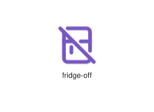
</div>
</div>

{{#endtab}}
{{#tab name="Code"}}

```xml
{{#include ../samples/icons/Tabler-Icons/fridge-off-16044389.xal}}
```

{{#endtab}}
{{#endtabs}}

<div class="xal-ref-tag"><code>&lt;item id=&#34;102432&#34; /&gt;</code></div>

</div>
<div class="xal-ref-card">
<div class="xal-ref-title">fridge</div>

{{#tabs name="svg-ref-2432"}}
{{#tab name="Preview"}}
<div class="xal-ref-preview">
<div>
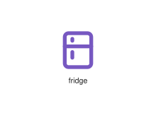
</div>
</div>

{{#endtab}}
{{#tab name="Code"}}

```xml
{{#include ../samples/icons/Tabler-Icons/fridge-c698e12f.xal}}
```

{{#endtab}}
{{#endtabs}}

<div class="xal-ref-tag"><code>&lt;item id=&#34;102431&#34; /&gt;</code></div>

</div>
<div class="xal-ref-card">
<div class="xal-ref-title">friends-off</div>

{{#tabs name="svg-ref-2433"}}
{{#tab name="Preview"}}
<div class="xal-ref-preview">
<div>

</div>
</div>

{{#endtab}}
{{#tab name="Code"}}

```xml
{{#include ../samples/icons/Tabler-Icons/friends-off-daca02ce.xal}}
```

{{#endtab}}
{{#endtabs}}

<div class="xal-ref-tag"><code>&lt;item id=&#34;102434&#34; /&gt;</code></div>

</div>
<div class="xal-ref-card">
<div class="xal-ref-title">friends</div>

{{#tabs name="svg-ref-2434"}}
{{#tab name="Preview"}}
<div class="xal-ref-preview">
<div>
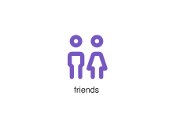
</div>
</div>

{{#endtab}}
{{#tab name="Code"}}

```xml
{{#include ../samples/icons/Tabler-Icons/friends-945b15d8.xal}}
```

{{#endtab}}
{{#endtabs}}

<div class="xal-ref-tag"><code>&lt;item id=&#34;102433&#34; /&gt;</code></div>

</div>
<div class="xal-ref-card">
<div class="xal-ref-title">frustum-off</div>

{{#tabs name="svg-ref-2435"}}
{{#tab name="Preview"}}
<div class="xal-ref-preview">
<div>
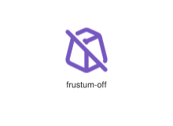
</div>
</div>

{{#endtab}}
{{#tab name="Code"}}

```xml
{{#include ../samples/icons/Tabler-Icons/frustum-off-f765ba89.xal}}
```

{{#endtab}}
{{#endtabs}}

<div class="xal-ref-tag"><code>&lt;item id=&#34;102436&#34; /&gt;</code></div>

</div>
<div class="xal-ref-card">
<div class="xal-ref-title">frustum-plus</div>

{{#tabs name="svg-ref-2436"}}
{{#tab name="Preview"}}
<div class="xal-ref-preview">
<div>
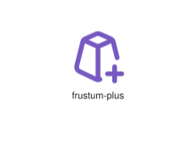
</div>
</div>

{{#endtab}}
{{#tab name="Code"}}

```xml
{{#include ../samples/icons/Tabler-Icons/frustum-plus-bd18744a.xal}}
```

{{#endtab}}
{{#endtabs}}

<div class="xal-ref-tag"><code>&lt;item id=&#34;102437&#34; /&gt;</code></div>

</div>
<div class="xal-ref-card">
<div class="xal-ref-title">frustum</div>

{{#tabs name="svg-ref-2437"}}
{{#tab name="Preview"}}
<div class="xal-ref-preview">
<div>
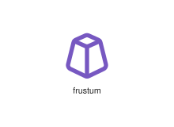
</div>
</div>

{{#endtab}}
{{#tab name="Code"}}

```xml
{{#include ../samples/icons/Tabler-Icons/frustum-b08fa74c.xal}}
```

{{#endtab}}
{{#endtabs}}

<div class="xal-ref-tag"><code>&lt;item id=&#34;102435&#34; /&gt;</code></div>

</div>
<div class="xal-ref-card">
<div class="xal-ref-title">function-off</div>

{{#tabs name="svg-ref-2438"}}
{{#tab name="Preview"}}
<div class="xal-ref-preview">
<div>
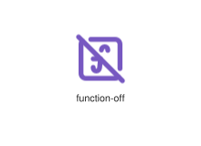
</div>
</div>

{{#endtab}}
{{#tab name="Code"}}

```xml
{{#include ../samples/icons/Tabler-Icons/function-off-2e1bf7b5.xal}}
```

{{#endtab}}
{{#endtabs}}

<div class="xal-ref-tag"><code>&lt;item id=&#34;102439&#34; /&gt;</code></div>

</div>
<div class="xal-ref-card">
<div class="xal-ref-title">function</div>

{{#tabs name="svg-ref-2439"}}
{{#tab name="Preview"}}
<div class="xal-ref-preview">
<div>
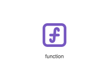
</div>
</div>

{{#endtab}}
{{#tab name="Code"}}

```xml
{{#include ../samples/icons/Tabler-Icons/function-fd8b8dfb.xal}}
```

{{#endtab}}
{{#endtabs}}

<div class="xal-ref-tag"><code>&lt;item id=&#34;102438&#34; /&gt;</code></div>

</div>
<div class="xal-ref-card">
<div class="xal-ref-title">galaxy</div>

{{#tabs name="svg-ref-2440"}}
{{#tab name="Preview"}}
<div class="xal-ref-preview">
<div>
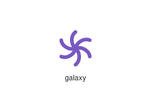
</div>
</div>

{{#endtab}}
{{#tab name="Code"}}

```xml
{{#include ../samples/icons/Tabler-Icons/galaxy-f15f1fab.xal}}
```

{{#endtab}}
{{#endtabs}}

<div class="xal-ref-tag"><code>&lt;item id=&#34;102440&#34; /&gt;</code></div>

</div>
<div class="xal-ref-card">
<div class="xal-ref-title">garden-cart-off</div>

{{#tabs name="svg-ref-2441"}}
{{#tab name="Preview"}}
<div class="xal-ref-preview">
<div>
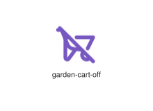
</div>
</div>

{{#endtab}}
{{#tab name="Code"}}

```xml
{{#include ../samples/icons/Tabler-Icons/garden-cart-off-88633649.xal}}
```

{{#endtab}}
{{#endtabs}}

<div class="xal-ref-tag"><code>&lt;item id=&#34;102442&#34; /&gt;</code></div>

</div>
<div class="xal-ref-card">
<div class="xal-ref-title">garden-cart</div>

{{#tabs name="svg-ref-2442"}}
{{#tab name="Preview"}}
<div class="xal-ref-preview">
<div>
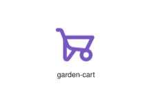
</div>
</div>

{{#endtab}}
{{#tab name="Code"}}

```xml
{{#include ../samples/icons/Tabler-Icons/garden-cart-d1553703.xal}}
```

{{#endtab}}
{{#endtabs}}

<div class="xal-ref-tag"><code>&lt;item id=&#34;102441&#34; /&gt;</code></div>

</div>
<div class="xal-ref-card">
<div class="xal-ref-title">gas-station-off</div>

{{#tabs name="svg-ref-2443"}}
{{#tab name="Preview"}}
<div class="xal-ref-preview">
<div>
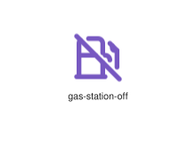
</div>
</div>

{{#endtab}}
{{#tab name="Code"}}

```xml
{{#include ../samples/icons/Tabler-Icons/gas-station-off-2017a7b5.xal}}
```

{{#endtab}}
{{#endtabs}}

<div class="xal-ref-tag"><code>&lt;item id=&#34;102444&#34; /&gt;</code></div>

</div>
<div class="xal-ref-card">
<div class="xal-ref-title">gas-station</div>

{{#tabs name="svg-ref-2444"}}
{{#tab name="Preview"}}
<div class="xal-ref-preview">
<div>
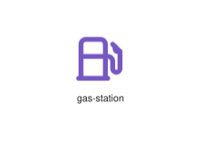
</div>
</div>

{{#endtab}}
{{#tab name="Code"}}

```xml
{{#include ../samples/icons/Tabler-Icons/gas-station-3fe9646e.xal}}
```

{{#endtab}}
{{#endtabs}}

<div class="xal-ref-tag"><code>&lt;item id=&#34;102443&#34; /&gt;</code></div>

</div>
<div class="xal-ref-card">
<div class="xal-ref-title">gauge-off</div>

{{#tabs name="svg-ref-2445"}}
{{#tab name="Preview"}}
<div class="xal-ref-preview">
<div>
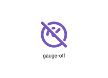
</div>
</div>

{{#endtab}}
{{#tab name="Code"}}

```xml
{{#include ../samples/icons/Tabler-Icons/gauge-off-833b6ad8.xal}}
```

{{#endtab}}
{{#endtabs}}

<div class="xal-ref-tag"><code>&lt;item id=&#34;102446&#34; /&gt;</code></div>

</div>
<div class="xal-ref-card">
<div class="xal-ref-title">gauge</div>

{{#tabs name="svg-ref-2446"}}
{{#tab name="Preview"}}
<div class="xal-ref-preview">
<div>
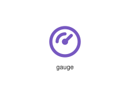
</div>
</div>

{{#endtab}}
{{#tab name="Code"}}

```xml
{{#include ../samples/icons/Tabler-Icons/gauge-1d81aeec.xal}}
```

{{#endtab}}
{{#endtabs}}

<div class="xal-ref-tag"><code>&lt;item id=&#34;102445&#34; /&gt;</code></div>

</div>
<div class="xal-ref-card">
<div class="xal-ref-title">gavel</div>

{{#tabs name="svg-ref-2447"}}
{{#tab name="Preview"}}
<div class="xal-ref-preview">
<div>
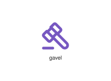
</div>
</div>

{{#endtab}}
{{#tab name="Code"}}

```xml
{{#include ../samples/icons/Tabler-Icons/gavel-6cb1770b.xal}}
```

{{#endtab}}
{{#endtabs}}

<div class="xal-ref-tag"><code>&lt;item id=&#34;102447&#34; /&gt;</code></div>

</div>
<div class="xal-ref-card">
<div class="xal-ref-title">gender-agender</div>

{{#tabs name="svg-ref-2448"}}
{{#tab name="Preview"}}
<div class="xal-ref-preview">
<div>
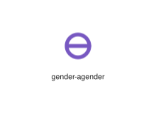
</div>
</div>

{{#endtab}}
{{#tab name="Code"}}

```xml
{{#include ../samples/icons/Tabler-Icons/gender-agender-c075faf4.xal}}
```

{{#endtab}}
{{#endtabs}}

<div class="xal-ref-tag"><code>&lt;item id=&#34;102448&#34; /&gt;</code></div>

</div>
<div class="xal-ref-card">
<div class="xal-ref-title">gender-androgyne</div>

{{#tabs name="svg-ref-2449"}}
{{#tab name="Preview"}}
<div class="xal-ref-preview">
<div>
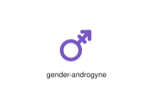
</div>
</div>

{{#endtab}}
{{#tab name="Code"}}

```xml
{{#include ../samples/icons/Tabler-Icons/gender-androgyne-907eca78.xal}}
```

{{#endtab}}
{{#endtabs}}

<div class="xal-ref-tag"><code>&lt;item id=&#34;102449&#34; /&gt;</code></div>

</div>
<div class="xal-ref-card">
<div class="xal-ref-title">gender-bigender</div>

{{#tabs name="svg-ref-2450"}}
{{#tab name="Preview"}}
<div class="xal-ref-preview">
<div>

</div>
</div>

{{#endtab}}
{{#tab name="Code"}}

```xml
{{#include ../samples/icons/Tabler-Icons/gender-bigender-a07ede8e.xal}}
```

{{#endtab}}
{{#endtabs}}

<div class="xal-ref-tag"><code>&lt;item id=&#34;102450&#34; /&gt;</code></div>

</div>
<div class="xal-ref-card">
<div class="xal-ref-title">gender-demiboy</div>

{{#tabs name="svg-ref-2451"}}
{{#tab name="Preview"}}
<div class="xal-ref-preview">
<div>

</div>
</div>

{{#endtab}}
{{#tab name="Code"}}

```xml
{{#include ../samples/icons/Tabler-Icons/gender-demiboy-b1510ac7.xal}}
```

{{#endtab}}
{{#endtabs}}

<div class="xal-ref-tag"><code>&lt;item id=&#34;102451&#34; /&gt;</code></div>

</div>
<div class="xal-ref-card">
<div class="xal-ref-title">gender-demigirl</div>

{{#tabs name="svg-ref-2452"}}
{{#tab name="Preview"}}
<div class="xal-ref-preview">
<div>
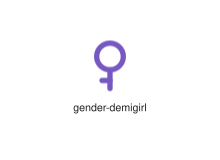
</div>
</div>

{{#endtab}}
{{#tab name="Code"}}

```xml
{{#include ../samples/icons/Tabler-Icons/gender-demigirl-0bd4eb5f.xal}}
```

{{#endtab}}
{{#endtabs}}

<div class="xal-ref-tag"><code>&lt;item id=&#34;102452&#34; /&gt;</code></div>

</div>
<div class="xal-ref-card">
<div class="xal-ref-title">gender-epicene</div>

{{#tabs name="svg-ref-2453"}}
{{#tab name="Preview"}}
<div class="xal-ref-preview">
<div>
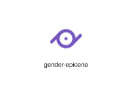
</div>
</div>

{{#endtab}}
{{#tab name="Code"}}

```xml
{{#include ../samples/icons/Tabler-Icons/gender-epicene-d69f45c7.xal}}
```

{{#endtab}}
{{#endtabs}}

<div class="xal-ref-tag"><code>&lt;item id=&#34;102453&#34; /&gt;</code></div>

</div>
<div class="xal-ref-card">
<div class="xal-ref-title">gender-female</div>

{{#tabs name="svg-ref-2454"}}
{{#tab name="Preview"}}
<div class="xal-ref-preview">
<div>
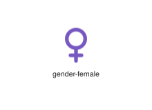
</div>
</div>

{{#endtab}}
{{#tab name="Code"}}

```xml
{{#include ../samples/icons/Tabler-Icons/gender-female-37502abe.xal}}
```

{{#endtab}}
{{#endtabs}}

<div class="xal-ref-tag"><code>&lt;item id=&#34;102454&#34; /&gt;</code></div>

</div>
<div class="xal-ref-card">
<div class="xal-ref-title">gender-femme</div>

{{#tabs name="svg-ref-2455"}}
{{#tab name="Preview"}}
<div class="xal-ref-preview">
<div>
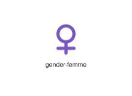
</div>
</div>

{{#endtab}}
{{#tab name="Code"}}

```xml
{{#include ../samples/icons/Tabler-Icons/gender-femme-c21f2ac8.xal}}
```

{{#endtab}}
{{#endtabs}}

<div class="xal-ref-tag"><code>&lt;item id=&#34;102455&#34; /&gt;</code></div>

</div>
<div class="xal-ref-card">
<div class="xal-ref-title">gender-genderfluid</div>

{{#tabs name="svg-ref-2456"}}
{{#tab name="Preview"}}
<div class="xal-ref-preview">
<div>

</div>
</div>

{{#endtab}}
{{#tab name="Code"}}

```xml
{{#include ../samples/icons/Tabler-Icons/gender-genderfluid-6324e8e3.xal}}
```

{{#endtab}}
{{#endtabs}}

<div class="xal-ref-tag"><code>&lt;item id=&#34;102456&#34; /&gt;</code></div>

</div>
<div class="xal-ref-card">
<div class="xal-ref-title">gender-genderless</div>

{{#tabs name="svg-ref-2457"}}
{{#tab name="Preview"}}
<div class="xal-ref-preview">
<div>

</div>
</div>

{{#endtab}}
{{#tab name="Code"}}

```xml
{{#include ../samples/icons/Tabler-Icons/gender-genderless-52b5ae74.xal}}
```

{{#endtab}}
{{#endtabs}}

<div class="xal-ref-tag"><code>&lt;item id=&#34;102457&#34; /&gt;</code></div>

</div>
<div class="xal-ref-card">
<div class="xal-ref-title">gender-genderqueer</div>

{{#tabs name="svg-ref-2458"}}
{{#tab name="Preview"}}
<div class="xal-ref-preview">
<div>

</div>
</div>

{{#endtab}}
{{#tab name="Code"}}

```xml
{{#include ../samples/icons/Tabler-Icons/gender-genderqueer-37cdd3cc.xal}}
```

{{#endtab}}
{{#endtabs}}

<div class="xal-ref-tag"><code>&lt;item id=&#34;102458&#34; /&gt;</code></div>

</div>
<div class="xal-ref-card">
<div class="xal-ref-title">gender-hermaphrodite</div>

{{#tabs name="svg-ref-2459"}}
{{#tab name="Preview"}}
<div class="xal-ref-preview">
<div>
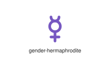
</div>
</div>

{{#endtab}}
{{#tab name="Code"}}

```xml
{{#include ../samples/icons/Tabler-Icons/gender-hermaphrodite-8a27dcf3.xal}}
```

{{#endtab}}
{{#endtabs}}

<div class="xal-ref-tag"><code>&lt;item id=&#34;102459&#34; /&gt;</code></div>

</div>
<div class="xal-ref-card">
<div class="xal-ref-title">gender-intergender</div>

{{#tabs name="svg-ref-2460"}}
{{#tab name="Preview"}}
<div class="xal-ref-preview">
<div>

</div>
</div>

{{#endtab}}
{{#tab name="Code"}}

```xml
{{#include ../samples/icons/Tabler-Icons/gender-intergender-b0bbd297.xal}}
```

{{#endtab}}
{{#endtabs}}

<div class="xal-ref-tag"><code>&lt;item id=&#34;102460&#34; /&gt;</code></div>

</div>
<div class="xal-ref-card">
<div class="xal-ref-title">gender-male</div>

{{#tabs name="svg-ref-2461"}}
{{#tab name="Preview"}}
<div class="xal-ref-preview">
<div>
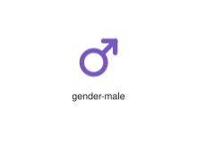
</div>
</div>

{{#endtab}}
{{#tab name="Code"}}

```xml
{{#include ../samples/icons/Tabler-Icons/gender-male-aa0009b4.xal}}
```

{{#endtab}}
{{#endtabs}}

<div class="xal-ref-tag"><code>&lt;item id=&#34;102461&#34; /&gt;</code></div>

</div>
<div class="xal-ref-card">
<div class="xal-ref-title">gender-neutrois</div>

{{#tabs name="svg-ref-2462"}}
{{#tab name="Preview"}}
<div class="xal-ref-preview">
<div>
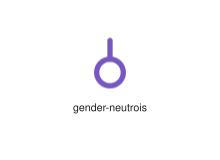
</div>
</div>

{{#endtab}}
{{#tab name="Code"}}

```xml
{{#include ../samples/icons/Tabler-Icons/gender-neutrois-543f9f7a.xal}}
```

{{#endtab}}
{{#endtabs}}

<div class="xal-ref-tag"><code>&lt;item id=&#34;102462&#34; /&gt;</code></div>

</div>
<div class="xal-ref-card">
<div class="xal-ref-title">gender-third</div>

{{#tabs name="svg-ref-2463"}}
{{#tab name="Preview"}}
<div class="xal-ref-preview">
<div>
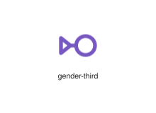
</div>
</div>

{{#endtab}}
{{#tab name="Code"}}

```xml
{{#include ../samples/icons/Tabler-Icons/gender-third-e083e803.xal}}
```

{{#endtab}}
{{#endtabs}}

<div class="xal-ref-tag"><code>&lt;item id=&#34;102463&#34; /&gt;</code></div>

</div>
<div class="xal-ref-card">
<div class="xal-ref-title">gender-transgender</div>

{{#tabs name="svg-ref-2464"}}
{{#tab name="Preview"}}
<div class="xal-ref-preview">
<div>

</div>
</div>

{{#endtab}}
{{#tab name="Code"}}

```xml
{{#include ../samples/icons/Tabler-Icons/gender-transgender-5da4fc92.xal}}
```

{{#endtab}}
{{#endtabs}}

<div class="xal-ref-tag"><code>&lt;item id=&#34;102464&#34; /&gt;</code></div>

</div>
<div class="xal-ref-card">
<div class="xal-ref-title">gender-trasvesti</div>

{{#tabs name="svg-ref-2465"}}
{{#tab name="Preview"}}
<div class="xal-ref-preview">
<div>
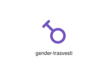
</div>
</div>

{{#endtab}}
{{#tab name="Code"}}

```xml
{{#include ../samples/icons/Tabler-Icons/gender-trasvesti-2f5ad855.xal}}
```

{{#endtab}}
{{#endtabs}}

<div class="xal-ref-tag"><code>&lt;item id=&#34;102465&#34; /&gt;</code></div>

</div>
<div class="xal-ref-card">
<div class="xal-ref-title">geometry</div>

{{#tabs name="svg-ref-2466"}}
{{#tab name="Preview"}}
<div class="xal-ref-preview">
<div>
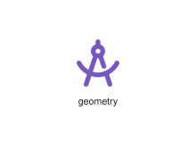
</div>
</div>

{{#endtab}}
{{#tab name="Code"}}

```xml
{{#include ../samples/icons/Tabler-Icons/geometry-3448239f.xal}}
```

{{#endtab}}
{{#endtabs}}

<div class="xal-ref-tag"><code>&lt;item id=&#34;102466&#34; /&gt;</code></div>

</div>
<div class="xal-ref-card">
<div class="xal-ref-title">ghost-2</div>

{{#tabs name="svg-ref-2467"}}
{{#tab name="Preview"}}
<div class="xal-ref-preview">
<div>

</div>
</div>

{{#endtab}}
{{#tab name="Code"}}

```xml
{{#include ../samples/icons/Tabler-Icons/ghost-2-22fd73c2.xal}}
```

{{#endtab}}
{{#endtabs}}

<div class="xal-ref-tag"><code>&lt;item id=&#34;102468&#34; /&gt;</code></div>

</div>
<div class="xal-ref-card">
<div class="xal-ref-title">ghost-3</div>

{{#tabs name="svg-ref-2468"}}
{{#tab name="Preview"}}
<div class="xal-ref-preview">
<div>

</div>
</div>

{{#endtab}}
{{#tab name="Code"}}

```xml
{{#include ../samples/icons/Tabler-Icons/ghost-3-1f9d5a72.xal}}
```

{{#endtab}}
{{#endtabs}}

<div class="xal-ref-tag"><code>&lt;item id=&#34;102469&#34; /&gt;</code></div>

</div>
<div class="xal-ref-card">
<div class="xal-ref-title">ghost-off</div>

{{#tabs name="svg-ref-2469"}}
{{#tab name="Preview"}}
<div class="xal-ref-preview">
<div>

</div>
</div>

{{#endtab}}
{{#tab name="Code"}}

```xml
{{#include ../samples/icons/Tabler-Icons/ghost-off-c735bba6.xal}}
```

{{#endtab}}
{{#endtabs}}

<div class="xal-ref-tag"><code>&lt;item id=&#34;102470&#34; /&gt;</code></div>

</div>
<div class="xal-ref-card">
<div class="xal-ref-title">ghost</div>

{{#tabs name="svg-ref-2470"}}
{{#tab name="Preview"}}
<div class="xal-ref-preview">
<div>

</div>
</div>

{{#endtab}}
{{#tab name="Code"}}

```xml
{{#include ../samples/icons/Tabler-Icons/ghost-04a788f8.xal}}
```

{{#endtab}}
{{#endtabs}}

<div class="xal-ref-tag"><code>&lt;item id=&#34;102467&#34; /&gt;</code></div>

</div>
<div class="xal-ref-card">
<div class="xal-ref-title">gif</div>

{{#tabs name="svg-ref-2471"}}
{{#tab name="Preview"}}
<div class="xal-ref-preview">
<div>
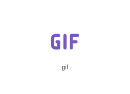
</div>
</div>

{{#endtab}}
{{#tab name="Code"}}

```xml
{{#include ../samples/icons/Tabler-Icons/gif-853d47d8.xal}}
```

{{#endtab}}
{{#endtabs}}

<div class="xal-ref-tag"><code>&lt;item id=&#34;102471&#34; /&gt;</code></div>

</div>
<div class="xal-ref-card">
<div class="xal-ref-title">gift-card</div>

{{#tabs name="svg-ref-2472"}}
{{#tab name="Preview"}}
<div class="xal-ref-preview">
<div>

</div>
</div>

{{#endtab}}
{{#tab name="Code"}}

```xml
{{#include ../samples/icons/Tabler-Icons/gift-card-955f9d77.xal}}
```

{{#endtab}}
{{#endtabs}}

<div class="xal-ref-tag"><code>&lt;item id=&#34;102473&#34; /&gt;</code></div>

</div>
<div class="xal-ref-card">
<div class="xal-ref-title">gift-off</div>

{{#tabs name="svg-ref-2473"}}
{{#tab name="Preview"}}
<div class="xal-ref-preview">
<div>

</div>
</div>

{{#endtab}}
{{#tab name="Code"}}

```xml
{{#include ../samples/icons/Tabler-Icons/gift-off-27723f0a.xal}}
```

{{#endtab}}
{{#endtabs}}

<div class="xal-ref-tag"><code>&lt;item id=&#34;102474&#34; /&gt;</code></div>

</div>
<div class="xal-ref-card">
<div class="xal-ref-title">gift</div>

{{#tabs name="svg-ref-2474"}}
{{#tab name="Preview"}}
<div class="xal-ref-preview">
<div>

</div>
</div>

{{#endtab}}
{{#tab name="Code"}}

```xml
{{#include ../samples/icons/Tabler-Icons/gift-978f9d39.xal}}
```

{{#endtab}}
{{#endtabs}}

<div class="xal-ref-tag"><code>&lt;item id=&#34;102472&#34; /&gt;</code></div>

</div>
<div class="xal-ref-card">
<div class="xal-ref-title">git-branch-deleted</div>

{{#tabs name="svg-ref-2475"}}
{{#tab name="Preview"}}
<div class="xal-ref-preview">
<div>

</div>
</div>

{{#endtab}}
{{#tab name="Code"}}

```xml
{{#include ../samples/icons/Tabler-Icons/git-branch-deleted-c472a1d8.xal}}
```

{{#endtab}}
{{#endtabs}}

<div class="xal-ref-tag"><code>&lt;item id=&#34;102476&#34; /&gt;</code></div>

</div>
<div class="xal-ref-card">
<div class="xal-ref-title">git-branch</div>

{{#tabs name="svg-ref-2476"}}
{{#tab name="Preview"}}
<div class="xal-ref-preview">
<div>
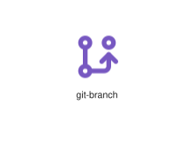
</div>
</div>

{{#endtab}}
{{#tab name="Code"}}

```xml
{{#include ../samples/icons/Tabler-Icons/git-branch-fe4767c6.xal}}
```

{{#endtab}}
{{#endtabs}}

<div class="xal-ref-tag"><code>&lt;item id=&#34;102475&#34; /&gt;</code></div>

</div>
<div class="xal-ref-card">
<div class="xal-ref-title">git-cherry-pick</div>

{{#tabs name="svg-ref-2477"}}
{{#tab name="Preview"}}
<div class="xal-ref-preview">
<div>
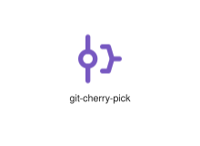
</div>
</div>

{{#endtab}}
{{#tab name="Code"}}

```xml
{{#include ../samples/icons/Tabler-Icons/git-cherry-pick-75a38347.xal}}
```

{{#endtab}}
{{#endtabs}}

<div class="xal-ref-tag"><code>&lt;item id=&#34;102477&#34; /&gt;</code></div>

</div>
<div class="xal-ref-card">
<div class="xal-ref-title">git-commit</div>

{{#tabs name="svg-ref-2478"}}
{{#tab name="Preview"}}
<div class="xal-ref-preview">
<div>
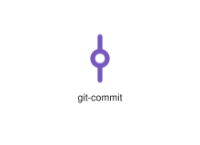
</div>
</div>

{{#endtab}}
{{#tab name="Code"}}

```xml
{{#include ../samples/icons/Tabler-Icons/git-commit-2ec6ffe9.xal}}
```

{{#endtab}}
{{#endtabs}}

<div class="xal-ref-tag"><code>&lt;item id=&#34;102478&#34; /&gt;</code></div>

</div>
<div class="xal-ref-card">
<div class="xal-ref-title">git-compare</div>

{{#tabs name="svg-ref-2479"}}
{{#tab name="Preview"}}
<div class="xal-ref-preview">
<div>
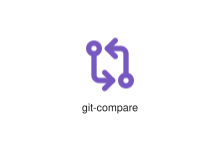
</div>
</div>

{{#endtab}}
{{#tab name="Code"}}

```xml
{{#include ../samples/icons/Tabler-Icons/git-compare-99725109.xal}}
```

{{#endtab}}
{{#endtabs}}

<div class="xal-ref-tag"><code>&lt;item id=&#34;102479&#34; /&gt;</code></div>

</div>
<div class="xal-ref-card">
<div class="xal-ref-title">git-fork</div>

{{#tabs name="svg-ref-2480"}}
{{#tab name="Preview"}}
<div class="xal-ref-preview">
<div>
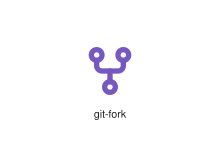
</div>
</div>

{{#endtab}}
{{#tab name="Code"}}

```xml
{{#include ../samples/icons/Tabler-Icons/git-fork-cef8c375.xal}}
```

{{#endtab}}
{{#endtabs}}

<div class="xal-ref-tag"><code>&lt;item id=&#34;102480&#34; /&gt;</code></div>

</div>
<div class="xal-ref-card">
<div class="xal-ref-title">git-merge</div>

{{#tabs name="svg-ref-2481"}}
{{#tab name="Preview"}}
<div class="xal-ref-preview">
<div>

</div>
</div>

{{#endtab}}
{{#tab name="Code"}}

```xml
{{#include ../samples/icons/Tabler-Icons/git-merge-06747bb4.xal}}
```

{{#endtab}}
{{#endtabs}}

<div class="xal-ref-tag"><code>&lt;item id=&#34;102481&#34; /&gt;</code></div>

</div>
<div class="xal-ref-card">
<div class="xal-ref-title">git-pull-request-closed</div>

{{#tabs name="svg-ref-2482"}}
{{#tab name="Preview"}}
<div class="xal-ref-preview">
<div>
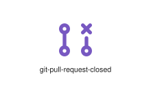
</div>
</div>

{{#endtab}}
{{#tab name="Code"}}

```xml
{{#include ../samples/icons/Tabler-Icons/git-pull-request-closed-3f90a4f0.xal}}
```

{{#endtab}}
{{#endtabs}}

<div class="xal-ref-tag"><code>&lt;item id=&#34;102483&#34; /&gt;</code></div>

</div>
<div class="xal-ref-card">
<div class="xal-ref-title">git-pull-request-draft</div>

{{#tabs name="svg-ref-2483"}}
{{#tab name="Preview"}}
<div class="xal-ref-preview">
<div>

</div>
</div>

{{#endtab}}
{{#tab name="Code"}}

```xml
{{#include ../samples/icons/Tabler-Icons/git-pull-request-draft-fe36947d.xal}}
```

{{#endtab}}
{{#endtabs}}

<div class="xal-ref-tag"><code>&lt;item id=&#34;102484&#34; /&gt;</code></div>

</div>
<div class="xal-ref-card">
<div class="xal-ref-title">git-pull-request</div>

{{#tabs name="svg-ref-2484"}}
{{#tab name="Preview"}}
<div class="xal-ref-preview">
<div>

</div>
</div>

{{#endtab}}
{{#tab name="Code"}}

```xml
{{#include ../samples/icons/Tabler-Icons/git-pull-request-30623fab.xal}}
```

{{#endtab}}
{{#endtabs}}

<div class="xal-ref-tag"><code>&lt;item id=&#34;102482&#34; /&gt;</code></div>

</div>
<div class="xal-ref-card">
<div class="xal-ref-title">gizmo</div>

{{#tabs name="svg-ref-2485"}}
{{#tab name="Preview"}}
<div class="xal-ref-preview">
<div>
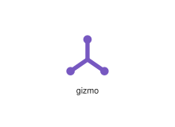
</div>
</div>

{{#endtab}}
{{#tab name="Code"}}

```xml
{{#include ../samples/icons/Tabler-Icons/gizmo-d307fe77.xal}}
```

{{#endtab}}
{{#endtabs}}

<div class="xal-ref-tag"><code>&lt;item id=&#34;102485&#34; /&gt;</code></div>

</div>
<div class="xal-ref-card">
<div class="xal-ref-title">glass-champagne</div>

{{#tabs name="svg-ref-2486"}}
{{#tab name="Preview"}}
<div class="xal-ref-preview">
<div>
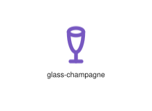
</div>
</div>

{{#endtab}}
{{#tab name="Code"}}

```xml
{{#include ../samples/icons/Tabler-Icons/glass-champagne-2403b723.xal}}
```

{{#endtab}}
{{#endtabs}}

<div class="xal-ref-tag"><code>&lt;item id=&#34;102487&#34; /&gt;</code></div>

</div>
<div class="xal-ref-card">
<div class="xal-ref-title">glass-cocktail</div>

{{#tabs name="svg-ref-2487"}}
{{#tab name="Preview"}}
<div class="xal-ref-preview">
<div>
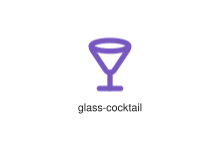
</div>
</div>

{{#endtab}}
{{#tab name="Code"}}

```xml
{{#include ../samples/icons/Tabler-Icons/glass-cocktail-1d9cc304.xal}}
```

{{#endtab}}
{{#endtabs}}

<div class="xal-ref-tag"><code>&lt;item id=&#34;102488&#34; /&gt;</code></div>

</div>
<div class="xal-ref-card">
<div class="xal-ref-title">glass-full</div>

{{#tabs name="svg-ref-2488"}}
{{#tab name="Preview"}}
<div class="xal-ref-preview">
<div>
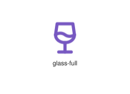
</div>
</div>

{{#endtab}}
{{#tab name="Code"}}

```xml
{{#include ../samples/icons/Tabler-Icons/glass-full-53560952.xal}}
```

{{#endtab}}
{{#endtabs}}

<div class="xal-ref-tag"><code>&lt;item id=&#34;102489&#34; /&gt;</code></div>

</div>
<div class="xal-ref-card">
<div class="xal-ref-title">glass-gin</div>

{{#tabs name="svg-ref-2489"}}
{{#tab name="Preview"}}
<div class="xal-ref-preview">
<div>
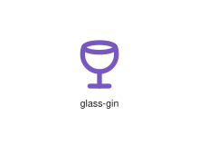
</div>
</div>

{{#endtab}}
{{#tab name="Code"}}

```xml
{{#include ../samples/icons/Tabler-Icons/glass-gin-00ed7165.xal}}
```

{{#endtab}}
{{#endtabs}}

<div class="xal-ref-tag"><code>&lt;item id=&#34;102490&#34; /&gt;</code></div>

</div>
<div class="xal-ref-card">
<div class="xal-ref-title">glass-off</div>

{{#tabs name="svg-ref-2490"}}
{{#tab name="Preview"}}
<div class="xal-ref-preview">
<div>
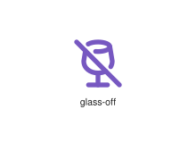
</div>
</div>

{{#endtab}}
{{#tab name="Code"}}

```xml
{{#include ../samples/icons/Tabler-Icons/glass-off-f224c616.xal}}
```

{{#endtab}}
{{#endtabs}}

<div class="xal-ref-tag"><code>&lt;item id=&#34;102491&#34; /&gt;</code></div>

</div>
<div class="xal-ref-card">
<div class="xal-ref-title">glass</div>

{{#tabs name="svg-ref-2491"}}
{{#tab name="Preview"}}
<div class="xal-ref-preview">
<div>
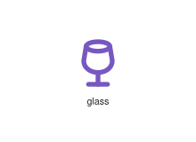
</div>
</div>

{{#endtab}}
{{#tab name="Code"}}

```xml
{{#include ../samples/icons/Tabler-Icons/glass-62f2214f.xal}}
```

{{#endtab}}
{{#endtabs}}

<div class="xal-ref-tag"><code>&lt;item id=&#34;102486&#34; /&gt;</code></div>

</div>
<div class="xal-ref-card">
<div class="xal-ref-title">globe-off</div>

{{#tabs name="svg-ref-2492"}}
{{#tab name="Preview"}}
<div class="xal-ref-preview">
<div>

</div>
</div>

{{#endtab}}
{{#tab name="Code"}}

```xml
{{#include ../samples/icons/Tabler-Icons/globe-off-b7e43c3d.xal}}
```

{{#endtab}}
{{#endtabs}}

<div class="xal-ref-tag"><code>&lt;item id=&#34;102493&#34; /&gt;</code></div>

</div>
<div class="xal-ref-card">
<div class="xal-ref-title">globe</div>

{{#tabs name="svg-ref-2493"}}
{{#tab name="Preview"}}
<div class="xal-ref-preview">
<div>
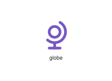
</div>
</div>

{{#endtab}}
{{#tab name="Code"}}

```xml
{{#include ../samples/icons/Tabler-Icons/globe-15e7e90e.xal}}
```

{{#endtab}}
{{#endtabs}}

<div class="xal-ref-tag"><code>&lt;item id=&#34;102492&#34; /&gt;</code></div>

</div>
<div class="xal-ref-card">
<div class="xal-ref-title">go-game</div>

{{#tabs name="svg-ref-2494"}}
{{#tab name="Preview"}}
<div class="xal-ref-preview">
<div>

</div>
</div>

{{#endtab}}
{{#tab name="Code"}}

```xml
{{#include ../samples/icons/Tabler-Icons/go-game-7839d635.xal}}
```

{{#endtab}}
{{#endtabs}}

<div class="xal-ref-tag"><code>&lt;item id=&#34;102494&#34; /&gt;</code></div>

</div>
<div class="xal-ref-card">
<div class="xal-ref-title">golf-off</div>

{{#tabs name="svg-ref-2495"}}
{{#tab name="Preview"}}
<div class="xal-ref-preview">
<div>
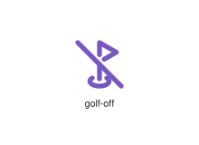
</div>
</div>

{{#endtab}}
{{#tab name="Code"}}

```xml
{{#include ../samples/icons/Tabler-Icons/golf-off-5ad30f77.xal}}
```

{{#endtab}}
{{#endtabs}}

<div class="xal-ref-tag"><code>&lt;item id=&#34;102496&#34; /&gt;</code></div>

</div>
<div class="xal-ref-card">
<div class="xal-ref-title">golf</div>

{{#tabs name="svg-ref-2496"}}
{{#tab name="Preview"}}
<div class="xal-ref-preview">
<div>
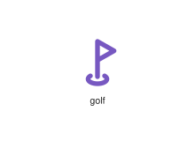
</div>
</div>

{{#endtab}}
{{#tab name="Code"}}

```xml
{{#include ../samples/icons/Tabler-Icons/golf-4fe44f87.xal}}
```

{{#endtab}}
{{#endtabs}}

<div class="xal-ref-tag"><code>&lt;item id=&#34;102495&#34; /&gt;</code></div>

</div>
<div class="xal-ref-card">
<div class="xal-ref-title">gps</div>

{{#tabs name="svg-ref-2497"}}
{{#tab name="Preview"}}
<div class="xal-ref-preview">
<div>

</div>
</div>

{{#endtab}}
{{#tab name="Code"}}

```xml
{{#include ../samples/icons/Tabler-Icons/gps-09e40c79.xal}}
```

{{#endtab}}
{{#endtabs}}

<div class="xal-ref-tag"><code>&lt;item id=&#34;102497&#34; /&gt;</code></div>

</div>
<div class="xal-ref-card">
<div class="xal-ref-title">gradienter</div>

{{#tabs name="svg-ref-2498"}}
{{#tab name="Preview"}}
<div class="xal-ref-preview">
<div>
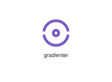
</div>
</div>

{{#endtab}}
{{#tab name="Code"}}

```xml
{{#include ../samples/icons/Tabler-Icons/gradienter-42f1aa64.xal}}
```

{{#endtab}}
{{#endtabs}}

<div class="xal-ref-tag"><code>&lt;item id=&#34;102498&#34; /&gt;</code></div>

</div>
<div class="xal-ref-card">
<div class="xal-ref-title">grain</div>

{{#tabs name="svg-ref-2499"}}
{{#tab name="Preview"}}
<div class="xal-ref-preview">
<div>
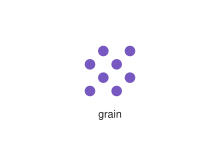
</div>
</div>

{{#endtab}}
{{#tab name="Code"}}

```xml
{{#include ../samples/icons/Tabler-Icons/grain-31fe7098.xal}}
```

{{#endtab}}
{{#endtabs}}

<div class="xal-ref-tag"><code>&lt;item id=&#34;102499&#34; /&gt;</code></div>

</div>
<div class="xal-ref-card">
<div class="xal-ref-title">graph-off</div>

{{#tabs name="svg-ref-2500"}}
{{#tab name="Preview"}}
<div class="xal-ref-preview">
<div>
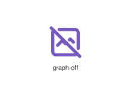
</div>
</div>

{{#endtab}}
{{#tab name="Code"}}

```xml
{{#include ../samples/icons/Tabler-Icons/graph-off-d2af9f5b.xal}}
```

{{#endtab}}
{{#endtabs}}

<div class="xal-ref-tag"><code>&lt;item id=&#34;102501&#34; /&gt;</code></div>

</div>
<div class="xal-ref-card">
<div class="xal-ref-title">graph</div>

{{#tabs name="svg-ref-2501"}}
{{#tab name="Preview"}}
<div class="xal-ref-preview">
<div>
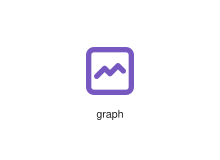
</div>
</div>

{{#endtab}}
{{#tab name="Code"}}

```xml
{{#include ../samples/icons/Tabler-Icons/graph-9a67d66b.xal}}
```

{{#endtab}}
{{#endtabs}}

<div class="xal-ref-tag"><code>&lt;item id=&#34;102500&#34; /&gt;</code></div>

</div>
<div class="xal-ref-card">
<div class="xal-ref-title">grave-2</div>

{{#tabs name="svg-ref-2502"}}
{{#tab name="Preview"}}
<div class="xal-ref-preview">
<div>

</div>
</div>

{{#endtab}}
{{#tab name="Code"}}

```xml
{{#include ../samples/icons/Tabler-Icons/grave-2-53fa206f.xal}}
```

{{#endtab}}
{{#endtabs}}

<div class="xal-ref-tag"><code>&lt;item id=&#34;102503&#34; /&gt;</code></div>

</div>
<div class="xal-ref-card">
<div class="xal-ref-title">grave</div>

{{#tabs name="svg-ref-2503"}}
{{#tab name="Preview"}}
<div class="xal-ref-preview">
<div>

</div>
</div>

{{#endtab}}
{{#tab name="Code"}}

```xml
{{#include ../samples/icons/Tabler-Icons/grave-b4aef1c7.xal}}
```

{{#endtab}}
{{#endtabs}}

<div class="xal-ref-tag"><code>&lt;item id=&#34;102502&#34; /&gt;</code></div>

</div>
<div class="xal-ref-card">
<div class="xal-ref-title">grid-3x3</div>

{{#tabs name="svg-ref-2504"}}
{{#tab name="Preview"}}
<div class="xal-ref-preview">
<div>

</div>
</div>

{{#endtab}}
{{#tab name="Code"}}

```xml
{{#include ../samples/icons/Tabler-Icons/grid-3x3-da34c5ea.xal}}
```

{{#endtab}}
{{#endtabs}}

<div class="xal-ref-tag"><code>&lt;item id=&#34;102504&#34; /&gt;</code></div>

</div>
<div class="xal-ref-card">
<div class="xal-ref-title">grid-4x4</div>

{{#tabs name="svg-ref-2505"}}
{{#tab name="Preview"}}
<div class="xal-ref-preview">
<div>

</div>
</div>

{{#endtab}}
{{#tab name="Code"}}

```xml
{{#include ../samples/icons/Tabler-Icons/grid-4x4-adb32774.xal}}
```

{{#endtab}}
{{#endtabs}}

<div class="xal-ref-tag"><code>&lt;item id=&#34;102505&#34; /&gt;</code></div>

</div>
<div class="xal-ref-card">
<div class="xal-ref-title">grid-dots</div>

{{#tabs name="svg-ref-2506"}}
{{#tab name="Preview"}}
<div class="xal-ref-preview">
<div>

</div>
</div>

{{#endtab}}
{{#tab name="Code"}}

```xml
{{#include ../samples/icons/Tabler-Icons/grid-dots-02e07b60.xal}}
```

{{#endtab}}
{{#endtabs}}

<div class="xal-ref-tag"><code>&lt;item id=&#34;102506&#34; /&gt;</code></div>

</div>
<div class="xal-ref-card">
<div class="xal-ref-title">grid-goldenratio</div>

{{#tabs name="svg-ref-2507"}}
{{#tab name="Preview"}}
<div class="xal-ref-preview">
<div>

</div>
</div>

{{#endtab}}
{{#tab name="Code"}}

```xml
{{#include ../samples/icons/Tabler-Icons/grid-goldenratio-5ef6d8b1.xal}}
```

{{#endtab}}
{{#endtabs}}

<div class="xal-ref-tag"><code>&lt;item id=&#34;102507&#34; /&gt;</code></div>

</div>
<div class="xal-ref-card">
<div class="xal-ref-title">grid-pattern</div>

{{#tabs name="svg-ref-2508"}}
{{#tab name="Preview"}}
<div class="xal-ref-preview">
<div>

</div>
</div>

{{#endtab}}
{{#tab name="Code"}}

```xml
{{#include ../samples/icons/Tabler-Icons/grid-pattern-16ac1bc6.xal}}
```

{{#endtab}}
{{#endtabs}}

<div class="xal-ref-tag"><code>&lt;item id=&#34;102508&#34; /&gt;</code></div>

</div>
<div class="xal-ref-card">
<div class="xal-ref-title">grid-scan</div>

{{#tabs name="svg-ref-2509"}}
{{#tab name="Preview"}}
<div class="xal-ref-preview">
<div>

</div>
</div>

{{#endtab}}
{{#tab name="Code"}}

```xml
{{#include ../samples/icons/Tabler-Icons/grid-scan-7855e93d.xal}}
```

{{#endtab}}
{{#endtabs}}

<div class="xal-ref-tag"><code>&lt;item id=&#34;102509&#34; /&gt;</code></div>

</div>
<div class="xal-ref-card">
<div class="xal-ref-title">grill-fork</div>

{{#tabs name="svg-ref-2510"}}
{{#tab name="Preview"}}
<div class="xal-ref-preview">
<div>

</div>
</div>

{{#endtab}}
{{#tab name="Code"}}

```xml
{{#include ../samples/icons/Tabler-Icons/grill-fork-b84243d5.xal}}
```

{{#endtab}}
{{#endtabs}}

<div class="xal-ref-tag"><code>&lt;item id=&#34;102511&#34; /&gt;</code></div>

</div>
<div class="xal-ref-card">
<div class="xal-ref-title">grill-off</div>

{{#tabs name="svg-ref-2511"}}
{{#tab name="Preview"}}
<div class="xal-ref-preview">
<div>

</div>
</div>

{{#endtab}}
{{#tab name="Code"}}

```xml
{{#include ../samples/icons/Tabler-Icons/grill-off-08124e74.xal}}
```

{{#endtab}}
{{#endtabs}}

<div class="xal-ref-tag"><code>&lt;item id=&#34;102512&#34; /&gt;</code></div>

</div>
<div class="xal-ref-card">
<div class="xal-ref-title">grill-spatula</div>

{{#tabs name="svg-ref-2512"}}
{{#tab name="Preview"}}
<div class="xal-ref-preview">
<div>

</div>
</div>

{{#endtab}}
{{#tab name="Code"}}

```xml
{{#include ../samples/icons/Tabler-Icons/grill-spatula-15dd5070.xal}}
```

{{#endtab}}
{{#endtabs}}

<div class="xal-ref-tag"><code>&lt;item id=&#34;102513&#34; /&gt;</code></div>

</div>
<div class="xal-ref-card">
<div class="xal-ref-title">grill</div>

{{#tabs name="svg-ref-2513"}}
{{#tab name="Preview"}}
<div class="xal-ref-preview">
<div>

</div>
</div>

{{#endtab}}
{{#tab name="Code"}}

```xml
{{#include ../samples/icons/Tabler-Icons/grill-281cfc2c.xal}}
```

{{#endtab}}
{{#endtabs}}

<div class="xal-ref-tag"><code>&lt;item id=&#34;102510&#34; /&gt;</code></div>

</div>
<div class="xal-ref-card">
<div class="xal-ref-title">grip-horizontal</div>

{{#tabs name="svg-ref-2514"}}
{{#tab name="Preview"}}
<div class="xal-ref-preview">
<div>

</div>
</div>

{{#endtab}}
{{#tab name="Code"}}

```xml
{{#include ../samples/icons/Tabler-Icons/grip-horizontal-79a8694c.xal}}
```

{{#endtab}}
{{#endtabs}}

<div class="xal-ref-tag"><code>&lt;item id=&#34;102514&#34; /&gt;</code></div>

</div>
<div class="xal-ref-card">
<div class="xal-ref-title">grip-vertical</div>

{{#tabs name="svg-ref-2515"}}
{{#tab name="Preview"}}
<div class="xal-ref-preview">
<div>

</div>
</div>

{{#endtab}}
{{#tab name="Code"}}

```xml
{{#include ../samples/icons/Tabler-Icons/grip-vertical-7737c8f7.xal}}
```

{{#endtab}}
{{#endtabs}}

<div class="xal-ref-tag"><code>&lt;item id=&#34;102515&#34; /&gt;</code></div>

</div>
<div class="xal-ref-card">
<div class="xal-ref-title">growth</div>

{{#tabs name="svg-ref-2516"}}
{{#tab name="Preview"}}
<div class="xal-ref-preview">
<div>

</div>
</div>

{{#endtab}}
{{#tab name="Code"}}

```xml
{{#include ../samples/icons/Tabler-Icons/growth-c4d1b141.xal}}
```

{{#endtab}}
{{#endtabs}}

<div class="xal-ref-tag"><code>&lt;item id=&#34;102516&#34; /&gt;</code></div>

</div>
<div class="xal-ref-card">
<div class="xal-ref-title">guitar-pick</div>

{{#tabs name="svg-ref-2517"}}
{{#tab name="Preview"}}
<div class="xal-ref-preview">
<div>

</div>
</div>

{{#endtab}}
{{#tab name="Code"}}

```xml
{{#include ../samples/icons/Tabler-Icons/guitar-pick-9737cbd7.xal}}
```

{{#endtab}}
{{#endtabs}}

<div class="xal-ref-tag"><code>&lt;item id=&#34;102517&#34; /&gt;</code></div>

</div>
<div class="xal-ref-card">
<div class="xal-ref-title">gymnastics</div>

{{#tabs name="svg-ref-2518"}}
{{#tab name="Preview"}}
<div class="xal-ref-preview">
<div>

</div>
</div>

{{#endtab}}
{{#tab name="Code"}}

```xml
{{#include ../samples/icons/Tabler-Icons/gymnastics-8edb618d.xal}}
```

{{#endtab}}
{{#endtabs}}

<div class="xal-ref-tag"><code>&lt;item id=&#34;102518&#34; /&gt;</code></div>

</div>
<div class="xal-ref-card">
<div class="xal-ref-title">h-1</div>

{{#tabs name="svg-ref-2519"}}
{{#tab name="Preview"}}
<div class="xal-ref-preview">
<div>

</div>
</div>

{{#endtab}}
{{#tab name="Code"}}

```xml
{{#include ../samples/icons/Tabler-Icons/h-1-6d8f6c90.xal}}
```

{{#endtab}}
{{#endtabs}}

<div class="xal-ref-tag"><code>&lt;item id=&#34;102519&#34; /&gt;</code></div>

</div>
</div>
