# Tabler-Icons - Page 29

This page references SVG files under `etc/resources/aws/svg/Tabler-Icons`.
Each card shows the SVG preview first and the XAL tag syntax in the Code tab.
Showing 2521-2610 of 4964 SVG files.

<style>
.xal-ref-grid{display:grid;grid-template-columns:repeat(3,minmax(0,1fr));gap:1rem;margin:1rem 0 1.5rem}.xal-ref-card{border:1px solid var(--table-border-color);border-radius:8px;overflow:hidden;background:var(--bg);padding:.75rem}.xal-ref-title{font-size:.9rem;font-weight:600;line-height:1.25;margin:0 0 .5rem;overflow-wrap:anywhere}.xal-ref-preview{display:flex;align-items:center;justify-content:center}.xal-ref-preview img{display:block;width:100%;height:auto}.xal-ref-card pre{margin:0;max-height:18rem;overflow:auto;white-space:pre}.xal-ref-card code{font-size:.78em}.xal-ref-tag{margin:.5rem 0 0;color:var(--fg);opacity:.72;overflow:auto;white-space:pre}.xal-ref-tag code{font-size:.72em}@media(max-width:900px){.xal-ref-grid{grid-template-columns:repeat(2,minmax(0,1fr))}}@media(max-width:560px){.xal-ref-grid{grid-template-columns:1fr}}
</style>

[Back to section index](tabler-icons.md)

<div class="xal-ref-grid">
<div class="xal-ref-card">
<div class="xal-ref-title">h-2</div>

{{#tabs name="svg-ref-2520"}}
{{#tab name="Preview"}}
<div class="xal-ref-preview">
<div>

</div>
</div>

{{#endtab}}
{{#tab name="Code"}}

```xml
{{#include ../samples/icons/Tabler-Icons/h-2-2a2f1640.xal}}
```

{{#endtab}}
{{#endtabs}}

<div class="xal-ref-tag"><code>&lt;item id=&#34;102520&#34; /&gt;</code></div>

</div>
<div class="xal-ref-card">
<div class="xal-ref-title">h-3</div>

{{#tabs name="svg-ref-2521"}}
{{#tab name="Preview"}}
<div class="xal-ref-preview">
<div>
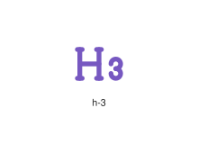
</div>
</div>

{{#endtab}}
{{#tab name="Code"}}

```xml
{{#include ../samples/icons/Tabler-Icons/h-3-174f3ff0.xal}}
```

{{#endtab}}
{{#endtabs}}

<div class="xal-ref-tag"><code>&lt;item id=&#34;102521&#34; /&gt;</code></div>

</div>
<div class="xal-ref-card">
<div class="xal-ref-title">h-4</div>

{{#tabs name="svg-ref-2522"}}
{{#tab name="Preview"}}
<div class="xal-ref-preview">
<div>

</div>
</div>

{{#endtab}}
{{#tab name="Code"}}

```xml
{{#include ../samples/icons/Tabler-Icons/h-4-a56fe3e0.xal}}
```

{{#endtab}}
{{#endtabs}}

<div class="xal-ref-tag"><code>&lt;item id=&#34;102522&#34; /&gt;</code></div>

</div>
<div class="xal-ref-card">
<div class="xal-ref-title">h-5</div>

{{#tabs name="svg-ref-2523"}}
{{#tab name="Preview"}}
<div class="xal-ref-preview">
<div>
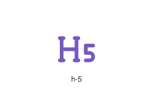
</div>
</div>

{{#endtab}}
{{#tab name="Code"}}

```xml
{{#include ../samples/icons/Tabler-Icons/h-5-980fca50.xal}}
```

{{#endtab}}
{{#endtabs}}

<div class="xal-ref-tag"><code>&lt;item id=&#34;102523&#34; /&gt;</code></div>

</div>
<div class="xal-ref-card">
<div class="xal-ref-title">h-6</div>

{{#tabs name="svg-ref-2524"}}
{{#tab name="Preview"}}
<div class="xal-ref-preview">
<div>
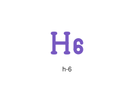
</div>
</div>

{{#endtab}}
{{#tab name="Code"}}

```xml
{{#include ../samples/icons/Tabler-Icons/h-6-dfafb080.xal}}
```

{{#endtab}}
{{#endtabs}}

<div class="xal-ref-tag"><code>&lt;item id=&#34;102524&#34; /&gt;</code></div>

</div>
<div class="xal-ref-card">
<div class="xal-ref-title">hammer-off</div>

{{#tabs name="svg-ref-2525"}}
{{#tab name="Preview"}}
<div class="xal-ref-preview">
<div>

</div>
</div>

{{#endtab}}
{{#tab name="Code"}}

```xml
{{#include ../samples/icons/Tabler-Icons/hammer-off-604d2662.xal}}
```

{{#endtab}}
{{#endtabs}}

<div class="xal-ref-tag"><code>&lt;item id=&#34;102526&#34; /&gt;</code></div>

</div>
<div class="xal-ref-card">
<div class="xal-ref-title">hammer</div>

{{#tabs name="svg-ref-2526"}}
{{#tab name="Preview"}}
<div class="xal-ref-preview">
<div>
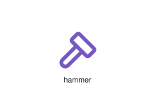
</div>
</div>

{{#endtab}}
{{#tab name="Code"}}

```xml
{{#include ../samples/icons/Tabler-Icons/hammer-c3c60e98.xal}}
```

{{#endtab}}
{{#endtabs}}

<div class="xal-ref-tag"><code>&lt;item id=&#34;102525&#34; /&gt;</code></div>

</div>
<div class="xal-ref-card">
<div class="xal-ref-title">hand-click-off</div>

{{#tabs name="svg-ref-2527"}}
{{#tab name="Preview"}}
<div class="xal-ref-preview">
<div>

</div>
</div>

{{#endtab}}
{{#tab name="Code"}}

```xml
{{#include ../samples/icons/Tabler-Icons/hand-click-off-38be5ce1.xal}}
```

{{#endtab}}
{{#endtabs}}

<div class="xal-ref-tag"><code>&lt;item id=&#34;102528&#34; /&gt;</code></div>

</div>
<div class="xal-ref-card">
<div class="xal-ref-title">hand-click</div>

{{#tabs name="svg-ref-2528"}}
{{#tab name="Preview"}}
<div class="xal-ref-preview">
<div>

</div>
</div>

{{#endtab}}
{{#tab name="Code"}}

```xml
{{#include ../samples/icons/Tabler-Icons/hand-click-74f2793a.xal}}
```

{{#endtab}}
{{#endtabs}}

<div class="xal-ref-tag"><code>&lt;item id=&#34;102527&#34; /&gt;</code></div>

</div>
<div class="xal-ref-card">
<div class="xal-ref-title">hand-finger-down</div>

{{#tabs name="svg-ref-2529"}}
{{#tab name="Preview"}}
<div class="xal-ref-preview">
<div>

</div>
</div>

{{#endtab}}
{{#tab name="Code"}}

```xml
{{#include ../samples/icons/Tabler-Icons/hand-finger-down-9c548b78.xal}}
```

{{#endtab}}
{{#endtabs}}

<div class="xal-ref-tag"><code>&lt;item id=&#34;102530&#34; /&gt;</code></div>

</div>
<div class="xal-ref-card">
<div class="xal-ref-title">hand-finger-left</div>

{{#tabs name="svg-ref-2530"}}
{{#tab name="Preview"}}
<div class="xal-ref-preview">
<div>
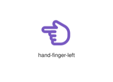
</div>
</div>

{{#endtab}}
{{#tab name="Code"}}

```xml
{{#include ../samples/icons/Tabler-Icons/hand-finger-left-091b919e.xal}}
```

{{#endtab}}
{{#endtabs}}

<div class="xal-ref-tag"><code>&lt;item id=&#34;102531&#34; /&gt;</code></div>

</div>
<div class="xal-ref-card">
<div class="xal-ref-title">hand-finger-off</div>

{{#tabs name="svg-ref-2531"}}
{{#tab name="Preview"}}
<div class="xal-ref-preview">
<div>
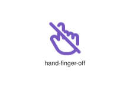
</div>
</div>

{{#endtab}}
{{#tab name="Code"}}

```xml
{{#include ../samples/icons/Tabler-Icons/hand-finger-off-c2d82bec.xal}}
```

{{#endtab}}
{{#endtabs}}

<div class="xal-ref-tag"><code>&lt;item id=&#34;102532&#34; /&gt;</code></div>

</div>
<div class="xal-ref-card">
<div class="xal-ref-title">hand-finger-right</div>

{{#tabs name="svg-ref-2532"}}
{{#tab name="Preview"}}
<div class="xal-ref-preview">
<div>

</div>
</div>

{{#endtab}}
{{#tab name="Code"}}

```xml
{{#include ../samples/icons/Tabler-Icons/hand-finger-right-e9721ab2.xal}}
```

{{#endtab}}
{{#endtabs}}

<div class="xal-ref-tag"><code>&lt;item id=&#34;102533&#34; /&gt;</code></div>

</div>
<div class="xal-ref-card">
<div class="xal-ref-title">hand-finger</div>

{{#tabs name="svg-ref-2533"}}
{{#tab name="Preview"}}
<div class="xal-ref-preview">
<div>

</div>
</div>

{{#endtab}}
{{#tab name="Code"}}

```xml
{{#include ../samples/icons/Tabler-Icons/hand-finger-3e04e682.xal}}
```

{{#endtab}}
{{#endtabs}}

<div class="xal-ref-tag"><code>&lt;item id=&#34;102529&#34; /&gt;</code></div>

</div>
<div class="xal-ref-card">
<div class="xal-ref-title">hand-grab</div>

{{#tabs name="svg-ref-2534"}}
{{#tab name="Preview"}}
<div class="xal-ref-preview">
<div>

</div>
</div>

{{#endtab}}
{{#tab name="Code"}}

```xml
{{#include ../samples/icons/Tabler-Icons/hand-grab-f130532d.xal}}
```

{{#endtab}}
{{#endtabs}}

<div class="xal-ref-tag"><code>&lt;item id=&#34;102534&#34; /&gt;</code></div>

</div>
<div class="xal-ref-card">
<div class="xal-ref-title">hand-little-finger</div>

{{#tabs name="svg-ref-2535"}}
{{#tab name="Preview"}}
<div class="xal-ref-preview">
<div>

</div>
</div>

{{#endtab}}
{{#tab name="Code"}}

```xml
{{#include ../samples/icons/Tabler-Icons/hand-little-finger-4e8b1ec0.xal}}
```

{{#endtab}}
{{#endtabs}}

<div class="xal-ref-tag"><code>&lt;item id=&#34;102535&#34; /&gt;</code></div>

</div>
<div class="xal-ref-card">
<div class="xal-ref-title">hand-love-you</div>

{{#tabs name="svg-ref-2536"}}
{{#tab name="Preview"}}
<div class="xal-ref-preview">
<div>
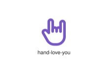
</div>
</div>

{{#endtab}}
{{#tab name="Code"}}

```xml
{{#include ../samples/icons/Tabler-Icons/hand-love-you-1516fd66.xal}}
```

{{#endtab}}
{{#endtabs}}

<div class="xal-ref-tag"><code>&lt;item id=&#34;102536&#34; /&gt;</code></div>

</div>
<div class="xal-ref-card">
<div class="xal-ref-title">hand-middle-finger</div>

{{#tabs name="svg-ref-2537"}}
{{#tab name="Preview"}}
<div class="xal-ref-preview">
<div>
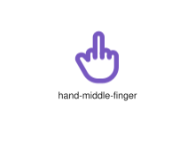
</div>
</div>

{{#endtab}}
{{#tab name="Code"}}

```xml
{{#include ../samples/icons/Tabler-Icons/hand-middle-finger-ebfd76a0.xal}}
```

{{#endtab}}
{{#endtabs}}

<div class="xal-ref-tag"><code>&lt;item id=&#34;102537&#34; /&gt;</code></div>

</div>
<div class="xal-ref-card">
<div class="xal-ref-title">hand-move</div>

{{#tabs name="svg-ref-2538"}}
{{#tab name="Preview"}}
<div class="xal-ref-preview">
<div>
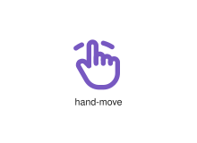
</div>
</div>

{{#endtab}}
{{#tab name="Code"}}

```xml
{{#include ../samples/icons/Tabler-Icons/hand-move-ca0a5cd8.xal}}
```

{{#endtab}}
{{#endtabs}}

<div class="xal-ref-tag"><code>&lt;item id=&#34;102538&#34; /&gt;</code></div>

</div>
<div class="xal-ref-card">
<div class="xal-ref-title">hand-off</div>

{{#tabs name="svg-ref-2539"}}
{{#tab name="Preview"}}
<div class="xal-ref-preview">
<div>
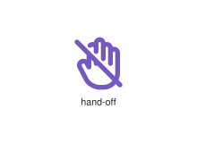
</div>
</div>

{{#endtab}}
{{#tab name="Code"}}

```xml
{{#include ../samples/icons/Tabler-Icons/hand-off-503243bb.xal}}
```

{{#endtab}}
{{#endtabs}}

<div class="xal-ref-tag"><code>&lt;item id=&#34;102539&#34; /&gt;</code></div>

</div>
<div class="xal-ref-card">
<div class="xal-ref-title">hand-ring-finger</div>

{{#tabs name="svg-ref-2540"}}
{{#tab name="Preview"}}
<div class="xal-ref-preview">
<div>
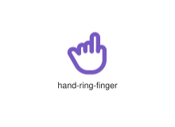
</div>
</div>

{{#endtab}}
{{#tab name="Code"}}

```xml
{{#include ../samples/icons/Tabler-Icons/hand-ring-finger-dadb71db.xal}}
```

{{#endtab}}
{{#endtabs}}

<div class="xal-ref-tag"><code>&lt;item id=&#34;102540&#34; /&gt;</code></div>

</div>
<div class="xal-ref-card">
<div class="xal-ref-title">hand-sanitizer</div>

{{#tabs name="svg-ref-2541"}}
{{#tab name="Preview"}}
<div class="xal-ref-preview">
<div>

</div>
</div>

{{#endtab}}
{{#tab name="Code"}}

```xml
{{#include ../samples/icons/Tabler-Icons/hand-sanitizer-d4b3cfad.xal}}
```

{{#endtab}}
{{#endtabs}}

<div class="xal-ref-tag"><code>&lt;item id=&#34;102541&#34; /&gt;</code></div>

</div>
<div class="xal-ref-card">
<div class="xal-ref-title">hand-stop</div>

{{#tabs name="svg-ref-2542"}}
{{#tab name="Preview"}}
<div class="xal-ref-preview">
<div>

</div>
</div>

{{#endtab}}
{{#tab name="Code"}}

```xml
{{#include ../samples/icons/Tabler-Icons/hand-stop-4a3bfc54.xal}}
```

{{#endtab}}
{{#endtabs}}

<div class="xal-ref-tag"><code>&lt;item id=&#34;102542&#34; /&gt;</code></div>

</div>
<div class="xal-ref-card">
<div class="xal-ref-title">hand-three-fingers</div>

{{#tabs name="svg-ref-2543"}}
{{#tab name="Preview"}}
<div class="xal-ref-preview">
<div>
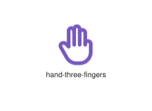
</div>
</div>

{{#endtab}}
{{#tab name="Code"}}

```xml
{{#include ../samples/icons/Tabler-Icons/hand-three-fingers-b27f22c2.xal}}
```

{{#endtab}}
{{#endtabs}}

<div class="xal-ref-tag"><code>&lt;item id=&#34;102543&#34; /&gt;</code></div>

</div>
<div class="xal-ref-card">
<div class="xal-ref-title">hand-two-fingers</div>

{{#tabs name="svg-ref-2544"}}
{{#tab name="Preview"}}
<div class="xal-ref-preview">
<div>
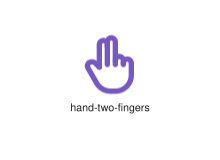
</div>
</div>

{{#endtab}}
{{#tab name="Code"}}

```xml
{{#include ../samples/icons/Tabler-Icons/hand-two-fingers-99aaf3af.xal}}
```

{{#endtab}}
{{#endtabs}}

<div class="xal-ref-tag"><code>&lt;item id=&#34;102544&#34; /&gt;</code></div>

</div>
<div class="xal-ref-card">
<div class="xal-ref-title">hanger-2</div>

{{#tabs name="svg-ref-2545"}}
{{#tab name="Preview"}}
<div class="xal-ref-preview">
<div>
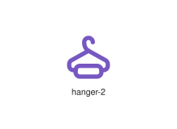
</div>
</div>

{{#endtab}}
{{#tab name="Code"}}

```xml
{{#include ../samples/icons/Tabler-Icons/hanger-2-3dc2c88c.xal}}
```

{{#endtab}}
{{#endtabs}}

<div class="xal-ref-tag"><code>&lt;item id=&#34;102546&#34; /&gt;</code></div>

</div>
<div class="xal-ref-card">
<div class="xal-ref-title">hanger-off</div>

{{#tabs name="svg-ref-2546"}}
{{#tab name="Preview"}}
<div class="xal-ref-preview">
<div>
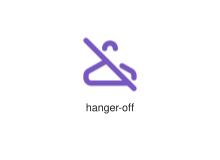
</div>
</div>

{{#endtab}}
{{#tab name="Code"}}

```xml
{{#include ../samples/icons/Tabler-Icons/hanger-off-f57cac16.xal}}
```

{{#endtab}}
{{#endtabs}}

<div class="xal-ref-tag"><code>&lt;item id=&#34;102547&#34; /&gt;</code></div>

</div>
<div class="xal-ref-card">
<div class="xal-ref-title">hanger</div>

{{#tabs name="svg-ref-2547"}}
{{#tab name="Preview"}}
<div class="xal-ref-preview">
<div>
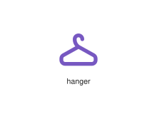
</div>
</div>

{{#endtab}}
{{#tab name="Code"}}

```xml
{{#include ../samples/icons/Tabler-Icons/hanger-e9395635.xal}}
```

{{#endtab}}
{{#endtabs}}

<div class="xal-ref-tag"><code>&lt;item id=&#34;102545&#34; /&gt;</code></div>

</div>
<div class="xal-ref-card">
<div class="xal-ref-title">hash</div>

{{#tabs name="svg-ref-2548"}}
{{#tab name="Preview"}}
<div class="xal-ref-preview">
<div>
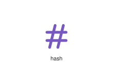
</div>
</div>

{{#endtab}}
{{#tab name="Code"}}

```xml
{{#include ../samples/icons/Tabler-Icons/hash-8b4b2859.xal}}
```

{{#endtab}}
{{#endtabs}}

<div class="xal-ref-tag"><code>&lt;item id=&#34;102548&#34; /&gt;</code></div>

</div>
<div class="xal-ref-card">
<div class="xal-ref-title">haze-moon</div>

{{#tabs name="svg-ref-2549"}}
{{#tab name="Preview"}}
<div class="xal-ref-preview">
<div>
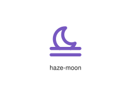
</div>
</div>

{{#endtab}}
{{#tab name="Code"}}

```xml
{{#include ../samples/icons/Tabler-Icons/haze-moon-68eee2ed.xal}}
```

{{#endtab}}
{{#endtabs}}

<div class="xal-ref-tag"><code>&lt;item id=&#34;102550&#34; /&gt;</code></div>

</div>
<div class="xal-ref-card">
<div class="xal-ref-title">haze</div>

{{#tabs name="svg-ref-2550"}}
{{#tab name="Preview"}}
<div class="xal-ref-preview">
<div>
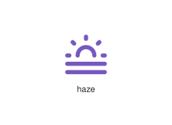
</div>
</div>

{{#endtab}}
{{#tab name="Code"}}

```xml
{{#include ../samples/icons/Tabler-Icons/haze-54d4bd20.xal}}
```

{{#endtab}}
{{#endtabs}}

<div class="xal-ref-tag"><code>&lt;item id=&#34;102549&#34; /&gt;</code></div>

</div>
<div class="xal-ref-card">
<div class="xal-ref-title">hdr</div>

{{#tabs name="svg-ref-2551"}}
{{#tab name="Preview"}}
<div class="xal-ref-preview">
<div>

</div>
</div>

{{#endtab}}
{{#tab name="Code"}}

```xml
{{#include ../samples/icons/Tabler-Icons/hdr-5a8b15ad.xal}}
```

{{#endtab}}
{{#endtabs}}

<div class="xal-ref-tag"><code>&lt;item id=&#34;102551&#34; /&gt;</code></div>

</div>
<div class="xal-ref-card">
<div class="xal-ref-title">heading-off</div>

{{#tabs name="svg-ref-2552"}}
{{#tab name="Preview"}}
<div class="xal-ref-preview">
<div>
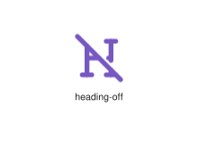
</div>
</div>

{{#endtab}}
{{#tab name="Code"}}

```xml
{{#include ../samples/icons/Tabler-Icons/heading-off-3a558522.xal}}
```

{{#endtab}}
{{#endtabs}}

<div class="xal-ref-tag"><code>&lt;item id=&#34;102553&#34; /&gt;</code></div>

</div>
<div class="xal-ref-card">
<div class="xal-ref-title">heading</div>

{{#tabs name="svg-ref-2553"}}
{{#tab name="Preview"}}
<div class="xal-ref-preview">
<div>
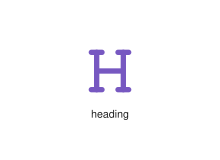
</div>
</div>

{{#endtab}}
{{#tab name="Code"}}

```xml
{{#include ../samples/icons/Tabler-Icons/heading-85712a63.xal}}
```

{{#endtab}}
{{#endtabs}}

<div class="xal-ref-tag"><code>&lt;item id=&#34;102552&#34; /&gt;</code></div>

</div>
<div class="xal-ref-card">
<div class="xal-ref-title">headphones-off</div>

{{#tabs name="svg-ref-2554"}}
{{#tab name="Preview"}}
<div class="xal-ref-preview">
<div>

</div>
</div>

{{#endtab}}
{{#tab name="Code"}}

```xml
{{#include ../samples/icons/Tabler-Icons/headphones-off-f6c74f2c.xal}}
```

{{#endtab}}
{{#endtabs}}

<div class="xal-ref-tag"><code>&lt;item id=&#34;102555&#34; /&gt;</code></div>

</div>
<div class="xal-ref-card">
<div class="xal-ref-title">headphones</div>

{{#tabs name="svg-ref-2555"}}
{{#tab name="Preview"}}
<div class="xal-ref-preview">
<div>

</div>
</div>

{{#endtab}}
{{#tab name="Code"}}

```xml
{{#include ../samples/icons/Tabler-Icons/headphones-c58119cb.xal}}
```

{{#endtab}}
{{#endtabs}}

<div class="xal-ref-tag"><code>&lt;item id=&#34;102554&#34; /&gt;</code></div>

</div>
<div class="xal-ref-card">
<div class="xal-ref-title">headset-off</div>

{{#tabs name="svg-ref-2556"}}
{{#tab name="Preview"}}
<div class="xal-ref-preview">
<div>

</div>
</div>

{{#endtab}}
{{#tab name="Code"}}

```xml
{{#include ../samples/icons/Tabler-Icons/headset-off-1ba19c2e.xal}}
```

{{#endtab}}
{{#endtabs}}

<div class="xal-ref-tag"><code>&lt;item id=&#34;102557&#34; /&gt;</code></div>

</div>
<div class="xal-ref-card">
<div class="xal-ref-title">headset</div>

{{#tabs name="svg-ref-2557"}}
{{#tab name="Preview"}}
<div class="xal-ref-preview">
<div>

</div>
</div>

{{#endtab}}
{{#tab name="Code"}}

```xml
{{#include ../samples/icons/Tabler-Icons/headset-0b58f472.xal}}
```

{{#endtab}}
{{#endtabs}}

<div class="xal-ref-tag"><code>&lt;item id=&#34;102556&#34; /&gt;</code></div>

</div>
<div class="xal-ref-card">
<div class="xal-ref-title">health-recognition</div>

{{#tabs name="svg-ref-2558"}}
{{#tab name="Preview"}}
<div class="xal-ref-preview">
<div>

</div>
</div>

{{#endtab}}
{{#tab name="Code"}}

```xml
{{#include ../samples/icons/Tabler-Icons/health-recognition-46d9e480.xal}}
```

{{#endtab}}
{{#endtabs}}

<div class="xal-ref-tag"><code>&lt;item id=&#34;102558&#34; /&gt;</code></div>

</div>
<div class="xal-ref-card">
<div class="xal-ref-title">heart-bitcoin</div>

{{#tabs name="svg-ref-2559"}}
{{#tab name="Preview"}}
<div class="xal-ref-preview">
<div>

</div>
</div>

{{#endtab}}
{{#tab name="Code"}}

```xml
{{#include ../samples/icons/Tabler-Icons/heart-bitcoin-71fc3e55.xal}}
```

{{#endtab}}
{{#endtabs}}

<div class="xal-ref-tag"><code>&lt;item id=&#34;102560&#34; /&gt;</code></div>

</div>
<div class="xal-ref-card">
<div class="xal-ref-title">heart-bolt</div>

{{#tabs name="svg-ref-2560"}}
{{#tab name="Preview"}}
<div class="xal-ref-preview">
<div>
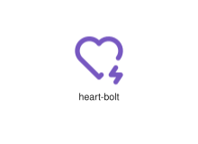
</div>
</div>

{{#endtab}}
{{#tab name="Code"}}

```xml
{{#include ../samples/icons/Tabler-Icons/heart-bolt-b67162cc.xal}}
```

{{#endtab}}
{{#endtabs}}

<div class="xal-ref-tag"><code>&lt;item id=&#34;102561&#34; /&gt;</code></div>

</div>
<div class="xal-ref-card">
<div class="xal-ref-title">heart-broken</div>

{{#tabs name="svg-ref-2561"}}
{{#tab name="Preview"}}
<div class="xal-ref-preview">
<div>
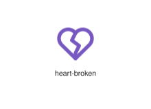
</div>
</div>

{{#endtab}}
{{#tab name="Code"}}

```xml
{{#include ../samples/icons/Tabler-Icons/heart-broken-8576ddac.xal}}
```

{{#endtab}}
{{#endtabs}}

<div class="xal-ref-tag"><code>&lt;item id=&#34;102562&#34; /&gt;</code></div>

</div>
<div class="xal-ref-card">
<div class="xal-ref-title">heart-cancel</div>

{{#tabs name="svg-ref-2562"}}
{{#tab name="Preview"}}
<div class="xal-ref-preview">
<div>

</div>
</div>

{{#endtab}}
{{#tab name="Code"}}

```xml
{{#include ../samples/icons/Tabler-Icons/heart-cancel-7a7cd5bf.xal}}
```

{{#endtab}}
{{#endtabs}}

<div class="xal-ref-tag"><code>&lt;item id=&#34;102563&#34; /&gt;</code></div>

</div>
<div class="xal-ref-card">
<div class="xal-ref-title">heart-check</div>

{{#tabs name="svg-ref-2563"}}
{{#tab name="Preview"}}
<div class="xal-ref-preview">
<div>

</div>
</div>

{{#endtab}}
{{#tab name="Code"}}

```xml
{{#include ../samples/icons/Tabler-Icons/heart-check-f9236f98.xal}}
```

{{#endtab}}
{{#endtabs}}

<div class="xal-ref-tag"><code>&lt;item id=&#34;102564&#34; /&gt;</code></div>

</div>
<div class="xal-ref-card">
<div class="xal-ref-title">heart-code</div>

{{#tabs name="svg-ref-2564"}}
{{#tab name="Preview"}}
<div class="xal-ref-preview">
<div>
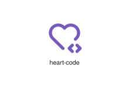
</div>
</div>

{{#endtab}}
{{#tab name="Code"}}

```xml
{{#include ../samples/icons/Tabler-Icons/heart-code-cb085e0d.xal}}
```

{{#endtab}}
{{#endtabs}}

<div class="xal-ref-tag"><code>&lt;item id=&#34;102565&#34; /&gt;</code></div>

</div>
<div class="xal-ref-card">
<div class="xal-ref-title">heart-cog</div>

{{#tabs name="svg-ref-2565"}}
{{#tab name="Preview"}}
<div class="xal-ref-preview">
<div>

</div>
</div>

{{#endtab}}
{{#tab name="Code"}}

```xml
{{#include ../samples/icons/Tabler-Icons/heart-cog-1e913d49.xal}}
```

{{#endtab}}
{{#endtabs}}

<div class="xal-ref-tag"><code>&lt;item id=&#34;102566&#34; /&gt;</code></div>

</div>
<div class="xal-ref-card">
<div class="xal-ref-title">heart-discount</div>

{{#tabs name="svg-ref-2566"}}
{{#tab name="Preview"}}
<div class="xal-ref-preview">
<div>

</div>
</div>

{{#endtab}}
{{#tab name="Code"}}

```xml
{{#include ../samples/icons/Tabler-Icons/heart-discount-a9edebfe.xal}}
```

{{#endtab}}
{{#endtabs}}

<div class="xal-ref-tag"><code>&lt;item id=&#34;102567&#34; /&gt;</code></div>

</div>
<div class="xal-ref-card">
<div class="xal-ref-title">heart-dollar</div>

{{#tabs name="svg-ref-2567"}}
{{#tab name="Preview"}}
<div class="xal-ref-preview">
<div>

</div>
</div>

{{#endtab}}
{{#tab name="Code"}}

```xml
{{#include ../samples/icons/Tabler-Icons/heart-dollar-a04e0935.xal}}
```

{{#endtab}}
{{#endtabs}}

<div class="xal-ref-tag"><code>&lt;item id=&#34;102568&#34; /&gt;</code></div>

</div>
<div class="xal-ref-card">
<div class="xal-ref-title">heart-down</div>

{{#tabs name="svg-ref-2568"}}
{{#tab name="Preview"}}
<div class="xal-ref-preview">
<div>
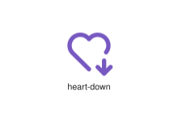
</div>
</div>

{{#endtab}}
{{#tab name="Code"}}

```xml
{{#include ../samples/icons/Tabler-Icons/heart-down-335f1630.xal}}
```

{{#endtab}}
{{#endtabs}}

<div class="xal-ref-tag"><code>&lt;item id=&#34;102569&#34; /&gt;</code></div>

</div>
<div class="xal-ref-card">
<div class="xal-ref-title">heart-exclamation</div>

{{#tabs name="svg-ref-2569"}}
{{#tab name="Preview"}}
<div class="xal-ref-preview">
<div>
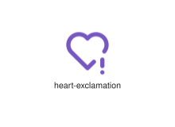
</div>
</div>

{{#endtab}}
{{#tab name="Code"}}

```xml
{{#include ../samples/icons/Tabler-Icons/heart-exclamation-a1799770.xal}}
```

{{#endtab}}
{{#endtabs}}

<div class="xal-ref-tag"><code>&lt;item id=&#34;102570&#34; /&gt;</code></div>

</div>
<div class="xal-ref-card">
<div class="xal-ref-title">heart-handshake</div>

{{#tabs name="svg-ref-2570"}}
{{#tab name="Preview"}}
<div class="xal-ref-preview">
<div>

</div>
</div>

{{#endtab}}
{{#tab name="Code"}}

```xml
{{#include ../samples/icons/Tabler-Icons/heart-handshake-aaa47ed2.xal}}
```

{{#endtab}}
{{#endtabs}}

<div class="xal-ref-tag"><code>&lt;item id=&#34;102571&#34; /&gt;</code></div>

</div>
<div class="xal-ref-card">
<div class="xal-ref-title">heart-minus</div>

{{#tabs name="svg-ref-2571"}}
{{#tab name="Preview"}}
<div class="xal-ref-preview">
<div>

</div>
</div>

{{#endtab}}
{{#tab name="Code"}}

```xml
{{#include ../samples/icons/Tabler-Icons/heart-minus-7a53ddab.xal}}
```

{{#endtab}}
{{#endtabs}}

<div class="xal-ref-tag"><code>&lt;item id=&#34;102572&#34; /&gt;</code></div>

</div>
<div class="xal-ref-card">
<div class="xal-ref-title">heart-off</div>

{{#tabs name="svg-ref-2572"}}
{{#tab name="Preview"}}
<div class="xal-ref-preview">
<div>
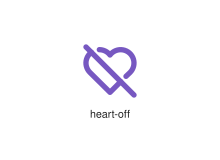
</div>
</div>

{{#endtab}}
{{#tab name="Code"}}

```xml
{{#include ../samples/icons/Tabler-Icons/heart-off-c35e2f45.xal}}
```

{{#endtab}}
{{#endtabs}}

<div class="xal-ref-tag"><code>&lt;item id=&#34;102573&#34; /&gt;</code></div>

</div>
<div class="xal-ref-card">
<div class="xal-ref-title">heart-pause</div>

{{#tabs name="svg-ref-2573"}}
{{#tab name="Preview"}}
<div class="xal-ref-preview">
<div>

</div>
</div>

{{#endtab}}
{{#tab name="Code"}}

```xml
{{#include ../samples/icons/Tabler-Icons/heart-pause-a8192a33.xal}}
```

{{#endtab}}
{{#endtabs}}

<div class="xal-ref-tag"><code>&lt;item id=&#34;102574&#34; /&gt;</code></div>

</div>
<div class="xal-ref-card">
<div class="xal-ref-title">heart-pin</div>

{{#tabs name="svg-ref-2574"}}
{{#tab name="Preview"}}
<div class="xal-ref-preview">
<div>
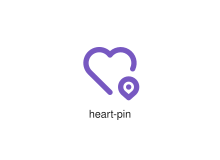
</div>
</div>

{{#endtab}}
{{#tab name="Code"}}

```xml
{{#include ../samples/icons/Tabler-Icons/heart-pin-93ee3a76.xal}}
```

{{#endtab}}
{{#endtabs}}

<div class="xal-ref-tag"><code>&lt;item id=&#34;102575&#34; /&gt;</code></div>

</div>
<div class="xal-ref-card">
<div class="xal-ref-title">heart-plus</div>

{{#tabs name="svg-ref-2575"}}
{{#tab name="Preview"}}
<div class="xal-ref-preview">
<div>

</div>
</div>

{{#endtab}}
{{#tab name="Code"}}

```xml
{{#include ../samples/icons/Tabler-Icons/heart-plus-2ffec144.xal}}
```

{{#endtab}}
{{#endtabs}}

<div class="xal-ref-tag"><code>&lt;item id=&#34;102576&#34; /&gt;</code></div>

</div>
<div class="xal-ref-card">
<div class="xal-ref-title">heart-question</div>

{{#tabs name="svg-ref-2576"}}
{{#tab name="Preview"}}
<div class="xal-ref-preview">
<div>

</div>
</div>

{{#endtab}}
{{#tab name="Code"}}

```xml
{{#include ../samples/icons/Tabler-Icons/heart-question-7f691381.xal}}
```

{{#endtab}}
{{#endtabs}}

<div class="xal-ref-tag"><code>&lt;item id=&#34;102577&#34; /&gt;</code></div>

</div>
<div class="xal-ref-card">
<div class="xal-ref-title">heart-rate-monitor</div>

{{#tabs name="svg-ref-2577"}}
{{#tab name="Preview"}}
<div class="xal-ref-preview">
<div>
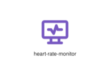
</div>
</div>

{{#endtab}}
{{#tab name="Code"}}

```xml
{{#include ../samples/icons/Tabler-Icons/heart-rate-monitor-d109cca0.xal}}
```

{{#endtab}}
{{#endtabs}}

<div class="xal-ref-tag"><code>&lt;item id=&#34;102578&#34; /&gt;</code></div>

</div>
<div class="xal-ref-card">
<div class="xal-ref-title">heart-search</div>

{{#tabs name="svg-ref-2578"}}
{{#tab name="Preview"}}
<div class="xal-ref-preview">
<div>

</div>
</div>

{{#endtab}}
{{#tab name="Code"}}

```xml
{{#include ../samples/icons/Tabler-Icons/heart-search-3b6ec550.xal}}
```

{{#endtab}}
{{#endtabs}}

<div class="xal-ref-tag"><code>&lt;item id=&#34;102579&#34; /&gt;</code></div>

</div>
<div class="xal-ref-card">
<div class="xal-ref-title">heart-share</div>

{{#tabs name="svg-ref-2579"}}
{{#tab name="Preview"}}
<div class="xal-ref-preview">
<div>

</div>
</div>

{{#endtab}}
{{#tab name="Code"}}

```xml
{{#include ../samples/icons/Tabler-Icons/heart-share-d61666a5.xal}}
```

{{#endtab}}
{{#endtabs}}

<div class="xal-ref-tag"><code>&lt;item id=&#34;102580&#34; /&gt;</code></div>

</div>
<div class="xal-ref-card">
<div class="xal-ref-title">heart-spark</div>

{{#tabs name="svg-ref-2580"}}
{{#tab name="Preview"}}
<div class="xal-ref-preview">
<div>

</div>
</div>

{{#endtab}}
{{#tab name="Code"}}

```xml
{{#include ../samples/icons/Tabler-Icons/heart-spark-c678f25a.xal}}
```

{{#endtab}}
{{#endtabs}}

<div class="xal-ref-tag"><code>&lt;item id=&#34;102581&#34; /&gt;</code></div>

</div>
<div class="xal-ref-card">
<div class="xal-ref-title">heart-star</div>

{{#tabs name="svg-ref-2581"}}
{{#tab name="Preview"}}
<div class="xal-ref-preview">
<div>

</div>
</div>

{{#endtab}}
{{#tab name="Code"}}

```xml
{{#include ../samples/icons/Tabler-Icons/heart-star-50677d33.xal}}
```

{{#endtab}}
{{#endtabs}}

<div class="xal-ref-tag"><code>&lt;item id=&#34;102582&#34; /&gt;</code></div>

</div>
<div class="xal-ref-card">
<div class="xal-ref-title">heart-up</div>

{{#tabs name="svg-ref-2582"}}
{{#tab name="Preview"}}
<div class="xal-ref-preview">
<div>

</div>
</div>

{{#endtab}}
{{#tab name="Code"}}

```xml
{{#include ../samples/icons/Tabler-Icons/heart-up-3d25cee5.xal}}
```

{{#endtab}}
{{#endtabs}}

<div class="xal-ref-tag"><code>&lt;item id=&#34;102583&#34; /&gt;</code></div>

</div>
<div class="xal-ref-card">
<div class="xal-ref-title">heart-x</div>

{{#tabs name="svg-ref-2583"}}
{{#tab name="Preview"}}
<div class="xal-ref-preview">
<div>

</div>
</div>

{{#endtab}}
{{#tab name="Code"}}

```xml
{{#include ../samples/icons/Tabler-Icons/heart-x-52d09750.xal}}
```

{{#endtab}}
{{#endtabs}}

<div class="xal-ref-tag"><code>&lt;item id=&#34;102584&#34; /&gt;</code></div>

</div>
<div class="xal-ref-card">
<div class="xal-ref-title">heart</div>

{{#tabs name="svg-ref-2584"}}
{{#tab name="Preview"}}
<div class="xal-ref-preview">
<div>
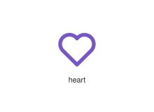
</div>
</div>

{{#endtab}}
{{#tab name="Code"}}

```xml
{{#include ../samples/icons/Tabler-Icons/heart-db78fa00.xal}}
```

{{#endtab}}
{{#endtabs}}

<div class="xal-ref-tag"><code>&lt;item id=&#34;102559&#34; /&gt;</code></div>

</div>
<div class="xal-ref-card">
<div class="xal-ref-title">heartbeat</div>

{{#tabs name="svg-ref-2585"}}
{{#tab name="Preview"}}
<div class="xal-ref-preview">
<div>

</div>
</div>

{{#endtab}}
{{#tab name="Code"}}

```xml
{{#include ../samples/icons/Tabler-Icons/heartbeat-90b65410.xal}}
```

{{#endtab}}
{{#endtabs}}

<div class="xal-ref-tag"><code>&lt;item id=&#34;102585&#34; /&gt;</code></div>

</div>
<div class="xal-ref-card">
<div class="xal-ref-title">hearts-off</div>

{{#tabs name="svg-ref-2586"}}
{{#tab name="Preview"}}
<div class="xal-ref-preview">
<div>
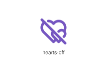
</div>
</div>

{{#endtab}}
{{#tab name="Code"}}

```xml
{{#include ../samples/icons/Tabler-Icons/hearts-off-47e7cfed.xal}}
```

{{#endtab}}
{{#endtabs}}

<div class="xal-ref-tag"><code>&lt;item id=&#34;102587&#34; /&gt;</code></div>

</div>
<div class="xal-ref-card">
<div class="xal-ref-title">hearts</div>

{{#tabs name="svg-ref-2587"}}
{{#tab name="Preview"}}
<div class="xal-ref-preview">
<div>
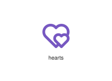
</div>
</div>

{{#endtab}}
{{#tab name="Code"}}

```xml
{{#include ../samples/icons/Tabler-Icons/hearts-adf95e72.xal}}
```

{{#endtab}}
{{#endtabs}}

<div class="xal-ref-tag"><code>&lt;item id=&#34;102586&#34; /&gt;</code></div>

</div>
<div class="xal-ref-card">
<div class="xal-ref-title">helicopter-landing</div>

{{#tabs name="svg-ref-2588"}}
{{#tab name="Preview"}}
<div class="xal-ref-preview">
<div>

</div>
</div>

{{#endtab}}
{{#tab name="Code"}}

```xml
{{#include ../samples/icons/Tabler-Icons/helicopter-landing-7b817ca0.xal}}
```

{{#endtab}}
{{#endtabs}}

<div class="xal-ref-tag"><code>&lt;item id=&#34;102589&#34; /&gt;</code></div>

</div>
<div class="xal-ref-card">
<div class="xal-ref-title">helicopter</div>

{{#tabs name="svg-ref-2589"}}
{{#tab name="Preview"}}
<div class="xal-ref-preview">
<div>
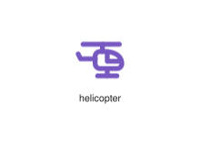
</div>
</div>

{{#endtab}}
{{#tab name="Code"}}

```xml
{{#include ../samples/icons/Tabler-Icons/helicopter-6317cbb7.xal}}
```

{{#endtab}}
{{#endtabs}}

<div class="xal-ref-tag"><code>&lt;item id=&#34;102588&#34; /&gt;</code></div>

</div>
<div class="xal-ref-card">
<div class="xal-ref-title">helmet-off</div>

{{#tabs name="svg-ref-2590"}}
{{#tab name="Preview"}}
<div class="xal-ref-preview">
<div>
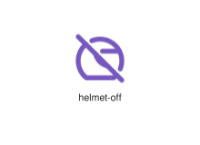
</div>
</div>

{{#endtab}}
{{#tab name="Code"}}

```xml
{{#include ../samples/icons/Tabler-Icons/helmet-off-484b7911.xal}}
```

{{#endtab}}
{{#endtabs}}

<div class="xal-ref-tag"><code>&lt;item id=&#34;102591&#34; /&gt;</code></div>

</div>
<div class="xal-ref-card">
<div class="xal-ref-title">helmet</div>

{{#tabs name="svg-ref-2591"}}
{{#tab name="Preview"}}
<div class="xal-ref-preview">
<div>
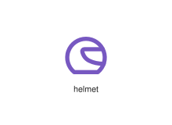
</div>
</div>

{{#endtab}}
{{#tab name="Code"}}

```xml
{{#include ../samples/icons/Tabler-Icons/helmet-ddc0aaaa.xal}}
```

{{#endtab}}
{{#endtabs}}

<div class="xal-ref-tag"><code>&lt;item id=&#34;102590&#34; /&gt;</code></div>

</div>
<div class="xal-ref-card">
<div class="xal-ref-title">help-circle</div>

{{#tabs name="svg-ref-2592"}}
{{#tab name="Preview"}}
<div class="xal-ref-preview">
<div>

</div>
</div>

{{#endtab}}
{{#tab name="Code"}}

```xml
{{#include ../samples/icons/Tabler-Icons/help-circle-8457db38.xal}}
```

{{#endtab}}
{{#endtabs}}

<div class="xal-ref-tag"><code>&lt;item id=&#34;102593&#34; /&gt;</code></div>

</div>
<div class="xal-ref-card">
<div class="xal-ref-title">help-hexagon</div>

{{#tabs name="svg-ref-2593"}}
{{#tab name="Preview"}}
<div class="xal-ref-preview">
<div>
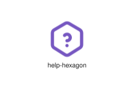
</div>
</div>

{{#endtab}}
{{#tab name="Code"}}

```xml
{{#include ../samples/icons/Tabler-Icons/help-hexagon-505e074b.xal}}
```

{{#endtab}}
{{#endtabs}}

<div class="xal-ref-tag"><code>&lt;item id=&#34;102594&#34; /&gt;</code></div>

</div>
<div class="xal-ref-card">
<div class="xal-ref-title">help-octagon</div>

{{#tabs name="svg-ref-2594"}}
{{#tab name="Preview"}}
<div class="xal-ref-preview">
<div>

</div>
</div>

{{#endtab}}
{{#tab name="Code"}}

```xml
{{#include ../samples/icons/Tabler-Icons/help-octagon-924f919b.xal}}
```

{{#endtab}}
{{#endtabs}}

<div class="xal-ref-tag"><code>&lt;item id=&#34;102595&#34; /&gt;</code></div>

</div>
<div class="xal-ref-card">
<div class="xal-ref-title">help-off</div>

{{#tabs name="svg-ref-2595"}}
{{#tab name="Preview"}}
<div class="xal-ref-preview">
<div>

</div>
</div>

{{#endtab}}
{{#tab name="Code"}}

```xml
{{#include ../samples/icons/Tabler-Icons/help-off-1532f379.xal}}
```

{{#endtab}}
{{#endtabs}}

<div class="xal-ref-tag"><code>&lt;item id=&#34;102596&#34; /&gt;</code></div>

</div>
<div class="xal-ref-card">
<div class="xal-ref-title">help-small</div>

{{#tabs name="svg-ref-2596"}}
{{#tab name="Preview"}}
<div class="xal-ref-preview">
<div>
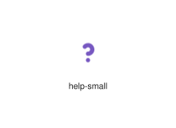
</div>
</div>

{{#endtab}}
{{#tab name="Code"}}

```xml
{{#include ../samples/icons/Tabler-Icons/help-small-56ac5837.xal}}
```

{{#endtab}}
{{#endtabs}}

<div class="xal-ref-tag"><code>&lt;item id=&#34;102597&#34; /&gt;</code></div>

</div>
<div class="xal-ref-card">
<div class="xal-ref-title">help-square-rounded</div>

{{#tabs name="svg-ref-2597"}}
{{#tab name="Preview"}}
<div class="xal-ref-preview">
<div>
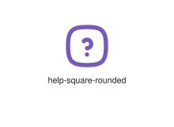
</div>
</div>

{{#endtab}}
{{#tab name="Code"}}

```xml
{{#include ../samples/icons/Tabler-Icons/help-square-rounded-35f03881.xal}}
```

{{#endtab}}
{{#endtabs}}

<div class="xal-ref-tag"><code>&lt;item id=&#34;102599&#34; /&gt;</code></div>

</div>
<div class="xal-ref-card">
<div class="xal-ref-title">help-square</div>

{{#tabs name="svg-ref-2598"}}
{{#tab name="Preview"}}
<div class="xal-ref-preview">
<div>
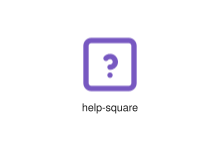
</div>
</div>

{{#endtab}}
{{#tab name="Code"}}

```xml
{{#include ../samples/icons/Tabler-Icons/help-square-1067c162.xal}}
```

{{#endtab}}
{{#endtabs}}

<div class="xal-ref-tag"><code>&lt;item id=&#34;102598&#34; /&gt;</code></div>

</div>
<div class="xal-ref-card">
<div class="xal-ref-title">help-triangle</div>

{{#tabs name="svg-ref-2599"}}
{{#tab name="Preview"}}
<div class="xal-ref-preview">
<div>
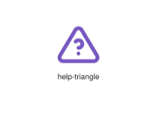
</div>
</div>

{{#endtab}}
{{#tab name="Code"}}

```xml
{{#include ../samples/icons/Tabler-Icons/help-triangle-8407ed11.xal}}
```

{{#endtab}}
{{#endtabs}}

<div class="xal-ref-tag"><code>&lt;item id=&#34;102600&#34; /&gt;</code></div>

</div>
<div class="xal-ref-card">
<div class="xal-ref-title">help</div>

{{#tabs name="svg-ref-2600"}}
{{#tab name="Preview"}}
<div class="xal-ref-preview">
<div>

</div>
</div>

{{#endtab}}
{{#tab name="Code"}}

```xml
{{#include ../samples/icons/Tabler-Icons/help-dd146047.xal}}
```

{{#endtab}}
{{#endtabs}}

<div class="xal-ref-tag"><code>&lt;item id=&#34;102592&#34; /&gt;</code></div>

</div>
<div class="xal-ref-card">
<div class="xal-ref-title">hemisphere-off</div>

{{#tabs name="svg-ref-2601"}}
{{#tab name="Preview"}}
<div class="xal-ref-preview">
<div>
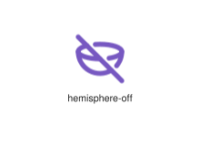
</div>
</div>

{{#endtab}}
{{#tab name="Code"}}

```xml
{{#include ../samples/icons/Tabler-Icons/hemisphere-off-729f7125.xal}}
```

{{#endtab}}
{{#endtabs}}

<div class="xal-ref-tag"><code>&lt;item id=&#34;102602&#34; /&gt;</code></div>

</div>
<div class="xal-ref-card">
<div class="xal-ref-title">hemisphere-plus</div>

{{#tabs name="svg-ref-2602"}}
{{#tab name="Preview"}}
<div class="xal-ref-preview">
<div>
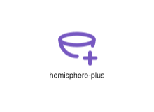
</div>
</div>

{{#endtab}}
{{#tab name="Code"}}

```xml
{{#include ../samples/icons/Tabler-Icons/hemisphere-plus-62fd6142.xal}}
```

{{#endtab}}
{{#endtabs}}

<div class="xal-ref-tag"><code>&lt;item id=&#34;102603&#34; /&gt;</code></div>

</div>
<div class="xal-ref-card">
<div class="xal-ref-title">hemisphere</div>

{{#tabs name="svg-ref-2603"}}
{{#tab name="Preview"}}
<div class="xal-ref-preview">
<div>
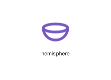
</div>
</div>

{{#endtab}}
{{#tab name="Code"}}

```xml
{{#include ../samples/icons/Tabler-Icons/hemisphere-0e814fc5.xal}}
```

{{#endtab}}
{{#endtabs}}

<div class="xal-ref-tag"><code>&lt;item id=&#34;102601&#34; /&gt;</code></div>

</div>
<div class="xal-ref-card">
<div class="xal-ref-title">hexagon-3d</div>

{{#tabs name="svg-ref-2604"}}
{{#tab name="Preview"}}
<div class="xal-ref-preview">
<div>
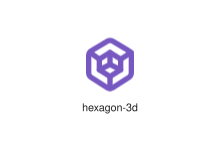
</div>
</div>

{{#endtab}}
{{#tab name="Code"}}

```xml
{{#include ../samples/icons/Tabler-Icons/hexagon-3d-352a5abe.xal}}
```

{{#endtab}}
{{#endtabs}}

<div class="xal-ref-tag"><code>&lt;item id=&#34;102605&#34; /&gt;</code></div>

</div>
<div class="xal-ref-card">
<div class="xal-ref-title">hexagon-letter-a</div>

{{#tabs name="svg-ref-2605"}}
{{#tab name="Preview"}}
<div class="xal-ref-preview">
<div>
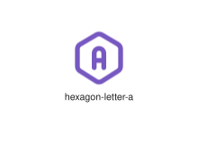
</div>
</div>

{{#endtab}}
{{#tab name="Code"}}

```xml
{{#include ../samples/icons/Tabler-Icons/hexagon-letter-a-2fe3e423.xal}}
```

{{#endtab}}
{{#endtabs}}

<div class="xal-ref-tag"><code>&lt;item id=&#34;102606&#34; /&gt;</code></div>

</div>
<div class="xal-ref-card">
<div class="xal-ref-title">hexagon-letter-b</div>

{{#tabs name="svg-ref-2606"}}
{{#tab name="Preview"}}
<div class="xal-ref-preview">
<div>
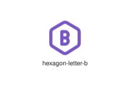
</div>
</div>

{{#endtab}}
{{#tab name="Code"}}

```xml
{{#include ../samples/icons/Tabler-Icons/hexagon-letter-b-68439ef3.xal}}
```

{{#endtab}}
{{#endtabs}}

<div class="xal-ref-tag"><code>&lt;item id=&#34;102607&#34; /&gt;</code></div>

</div>
<div class="xal-ref-card">
<div class="xal-ref-title">hexagon-letter-c</div>

{{#tabs name="svg-ref-2607"}}
{{#tab name="Preview"}}
<div class="xal-ref-preview">
<div>
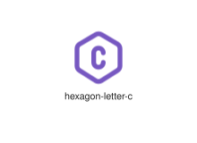
</div>
</div>

{{#endtab}}
{{#tab name="Code"}}

```xml
{{#include ../samples/icons/Tabler-Icons/hexagon-letter-c-5523b743.xal}}
```

{{#endtab}}
{{#endtabs}}

<div class="xal-ref-tag"><code>&lt;item id=&#34;102608&#34; /&gt;</code></div>

</div>
<div class="xal-ref-card">
<div class="xal-ref-title">hexagon-letter-d</div>

{{#tabs name="svg-ref-2608"}}
{{#tab name="Preview"}}
<div class="xal-ref-preview">
<div>

</div>
</div>

{{#endtab}}
{{#tab name="Code"}}

```xml
{{#include ../samples/icons/Tabler-Icons/hexagon-letter-d-e7036b53.xal}}
```

{{#endtab}}
{{#endtabs}}

<div class="xal-ref-tag"><code>&lt;item id=&#34;102609&#34; /&gt;</code></div>

</div>
<div class="xal-ref-card">
<div class="xal-ref-title">hexagon-letter-e</div>

{{#tabs name="svg-ref-2609"}}
{{#tab name="Preview"}}
<div class="xal-ref-preview">
<div>

</div>
</div>

{{#endtab}}
{{#tab name="Code"}}

```xml
{{#include ../samples/icons/Tabler-Icons/hexagon-letter-e-da6342e3.xal}}
```

{{#endtab}}
{{#endtabs}}

<div class="xal-ref-tag"><code>&lt;item id=&#34;102610&#34; /&gt;</code></div>

</div>
</div>
