# Tabler-Icons - Page 34

This page references SVG files under `etc/resources/aws/svg/Tabler-Icons`.
Each card shows the SVG preview first and the XAL tag syntax in the Code tab.
Showing 2971-3060 of 4964 SVG files.

<style>
.xal-ref-grid{display:grid;grid-template-columns:repeat(3,minmax(0,1fr));gap:1rem;margin:1rem 0 1.5rem}.xal-ref-card{border:1px solid var(--table-border-color);border-radius:8px;overflow:hidden;background:var(--bg);padding:.75rem}.xal-ref-title{font-size:.9rem;font-weight:600;line-height:1.25;margin:0 0 .5rem;overflow-wrap:anywhere}.xal-ref-preview{display:flex;align-items:center;justify-content:center}.xal-ref-preview img{display:block;width:100%;height:auto}.xal-ref-card pre{margin:0;max-height:18rem;overflow:auto;white-space:pre}.xal-ref-card code{font-size:.78em}.xal-ref-tag{margin:.5rem 0 0;color:var(--fg);opacity:.72;overflow:auto;white-space:pre}.xal-ref-tag code{font-size:.72em}@media(max-width:900px){.xal-ref-grid{grid-template-columns:repeat(2,minmax(0,1fr))}}@media(max-width:560px){.xal-ref-grid{grid-template-columns:1fr}}
</style>

[Back to section index](tabler-icons.md)

<div class="xal-ref-grid">
<div class="xal-ref-card">
<div class="xal-ref-title">loader-quarter</div>

{{#tabs name="svg-ref-2970"}}
{{#tab name="Preview"}}
<div class="xal-ref-preview">
<div>
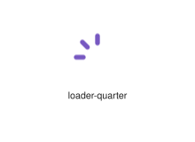
</div>
</div>

{{#endtab}}
{{#tab name="Code"}}

```xml
{{#include ../samples/icons/Tabler-Icons/loader-quarter-1def4d41.xal}}
```

{{#endtab}}
{{#endtabs}}

<div class="xal-ref-tag"><code>&lt;item id=&#34;102971&#34; /&gt;</code></div>

</div>
<div class="xal-ref-card">
<div class="xal-ref-title">loader</div>

{{#tabs name="svg-ref-2971"}}
{{#tab name="Preview"}}
<div class="xal-ref-preview">
<div>
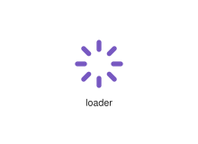
</div>
</div>

{{#endtab}}
{{#tab name="Code"}}

```xml
{{#include ../samples/icons/Tabler-Icons/loader-c0d825ec.xal}}
```

{{#endtab}}
{{#endtabs}}

<div class="xal-ref-tag"><code>&lt;item id=&#34;102968&#34; /&gt;</code></div>

</div>
<div class="xal-ref-card">
<div class="xal-ref-title">location-bolt</div>

{{#tabs name="svg-ref-2972"}}
{{#tab name="Preview"}}
<div class="xal-ref-preview">
<div>
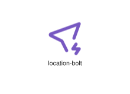
</div>
</div>

{{#endtab}}
{{#tab name="Code"}}

```xml
{{#include ../samples/icons/Tabler-Icons/location-bolt-36f93842.xal}}
```

{{#endtab}}
{{#endtabs}}

<div class="xal-ref-tag"><code>&lt;item id=&#34;102973&#34; /&gt;</code></div>

</div>
<div class="xal-ref-card">
<div class="xal-ref-title">location-broken</div>

{{#tabs name="svg-ref-2973"}}
{{#tab name="Preview"}}
<div class="xal-ref-preview">
<div>
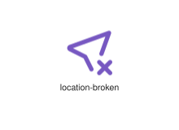
</div>
</div>

{{#endtab}}
{{#tab name="Code"}}

```xml
{{#include ../samples/icons/Tabler-Icons/location-broken-abc8500b.xal}}
```

{{#endtab}}
{{#endtabs}}

<div class="xal-ref-tag"><code>&lt;item id=&#34;102974&#34; /&gt;</code></div>

</div>
<div class="xal-ref-card">
<div class="xal-ref-title">location-cancel</div>

{{#tabs name="svg-ref-2974"}}
{{#tab name="Preview"}}
<div class="xal-ref-preview">
<div>

</div>
</div>

{{#endtab}}
{{#tab name="Code"}}

```xml
{{#include ../samples/icons/Tabler-Icons/location-cancel-54c25818.xal}}
```

{{#endtab}}
{{#endtabs}}

<div class="xal-ref-tag"><code>&lt;item id=&#34;102975&#34; /&gt;</code></div>

</div>
<div class="xal-ref-card">
<div class="xal-ref-title">location-check</div>

{{#tabs name="svg-ref-2975"}}
{{#tab name="Preview"}}
<div class="xal-ref-preview">
<div>
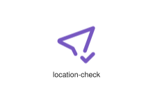
</div>
</div>

{{#endtab}}
{{#tab name="Code"}}

```xml
{{#include ../samples/icons/Tabler-Icons/location-check-f3a349e5.xal}}
```

{{#endtab}}
{{#endtabs}}

<div class="xal-ref-tag"><code>&lt;item id=&#34;102976&#34; /&gt;</code></div>

</div>
<div class="xal-ref-card">
<div class="xal-ref-title">location-code</div>

{{#tabs name="svg-ref-2976"}}
{{#tab name="Preview"}}
<div class="xal-ref-preview">
<div>
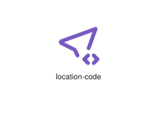
</div>
</div>

{{#endtab}}
{{#tab name="Code"}}

```xml
{{#include ../samples/icons/Tabler-Icons/location-code-4b800483.xal}}
```

{{#endtab}}
{{#endtabs}}

<div class="xal-ref-tag"><code>&lt;item id=&#34;102977&#34; /&gt;</code></div>

</div>
<div class="xal-ref-card">
<div class="xal-ref-title">location-cog</div>

{{#tabs name="svg-ref-2977"}}
{{#tab name="Preview"}}
<div class="xal-ref-preview">
<div>

</div>
</div>

{{#endtab}}
{{#tab name="Code"}}

```xml
{{#include ../samples/icons/Tabler-Icons/location-cog-f3ac78dc.xal}}
```

{{#endtab}}
{{#endtabs}}

<div class="xal-ref-tag"><code>&lt;item id=&#34;102978&#34; /&gt;</code></div>

</div>
<div class="xal-ref-card">
<div class="xal-ref-title">location-discount</div>

{{#tabs name="svg-ref-2978"}}
{{#tab name="Preview"}}
<div class="xal-ref-preview">
<div>

</div>
</div>

{{#endtab}}
{{#tab name="Code"}}

```xml
{{#include ../samples/icons/Tabler-Icons/location-discount-dba210f3.xal}}
```

{{#endtab}}
{{#endtabs}}

<div class="xal-ref-tag"><code>&lt;item id=&#34;102979&#34; /&gt;</code></div>

</div>
<div class="xal-ref-card">
<div class="xal-ref-title">location-dollar</div>

{{#tabs name="svg-ref-2979"}}
{{#tab name="Preview"}}
<div class="xal-ref-preview">
<div>

</div>
</div>

{{#endtab}}
{{#tab name="Code"}}

```xml
{{#include ../samples/icons/Tabler-Icons/location-dollar-8ef08492.xal}}
```

{{#endtab}}
{{#endtabs}}

<div class="xal-ref-tag"><code>&lt;item id=&#34;102980&#34; /&gt;</code></div>

</div>
<div class="xal-ref-card">
<div class="xal-ref-title">location-down</div>

{{#tabs name="svg-ref-2980"}}
{{#tab name="Preview"}}
<div class="xal-ref-preview">
<div>

</div>
</div>

{{#endtab}}
{{#tab name="Code"}}

```xml
{{#include ../samples/icons/Tabler-Icons/location-down-b3d74cbe.xal}}
```

{{#endtab}}
{{#endtabs}}

<div class="xal-ref-tag"><code>&lt;item id=&#34;102981&#34; /&gt;</code></div>

</div>
<div class="xal-ref-card">
<div class="xal-ref-title">location-exclamation</div>

{{#tabs name="svg-ref-2981"}}
{{#tab name="Preview"}}
<div class="xal-ref-preview">
<div>
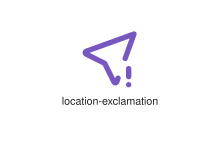
</div>
</div>

{{#endtab}}
{{#tab name="Code"}}

```xml
{{#include ../samples/icons/Tabler-Icons/location-exclamation-b88a6026.xal}}
```

{{#endtab}}
{{#endtabs}}

<div class="xal-ref-tag"><code>&lt;item id=&#34;102982&#34; /&gt;</code></div>

</div>
<div class="xal-ref-card">
<div class="xal-ref-title">location-heart</div>

{{#tabs name="svg-ref-2982"}}
{{#tab name="Preview"}}
<div class="xal-ref-preview">
<div>
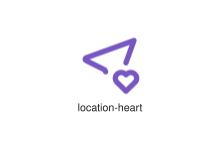
</div>
</div>

{{#endtab}}
{{#tab name="Code"}}

```xml
{{#include ../samples/icons/Tabler-Icons/location-heart-34863797.xal}}
```

{{#endtab}}
{{#endtabs}}

<div class="xal-ref-tag"><code>&lt;item id=&#34;102983&#34; /&gt;</code></div>

</div>
<div class="xal-ref-card">
<div class="xal-ref-title">location-minus</div>

{{#tabs name="svg-ref-2983"}}
{{#tab name="Preview"}}
<div class="xal-ref-preview">
<div>

</div>
</div>

{{#endtab}}
{{#tab name="Code"}}

```xml
{{#include ../samples/icons/Tabler-Icons/location-minus-70d3fbd6.xal}}
```

{{#endtab}}
{{#endtabs}}

<div class="xal-ref-tag"><code>&lt;item id=&#34;102984&#34; /&gt;</code></div>

</div>
<div class="xal-ref-card">
<div class="xal-ref-title">location-off</div>

{{#tabs name="svg-ref-2984"}}
{{#tab name="Preview"}}
<div class="xal-ref-preview">
<div>

</div>
</div>

{{#endtab}}
{{#tab name="Code"}}

```xml
{{#include ../samples/icons/Tabler-Icons/location-off-2e636ad0.xal}}
```

{{#endtab}}
{{#endtabs}}

<div class="xal-ref-tag"><code>&lt;item id=&#34;102985&#34; /&gt;</code></div>

</div>
<div class="xal-ref-card">
<div class="xal-ref-title">location-pause</div>

{{#tabs name="svg-ref-2985"}}
{{#tab name="Preview"}}
<div class="xal-ref-preview">
<div>
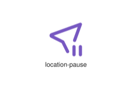
</div>
</div>

{{#endtab}}
{{#tab name="Code"}}

```xml
{{#include ../samples/icons/Tabler-Icons/location-pause-a2990c4e.xal}}
```

{{#endtab}}
{{#endtabs}}

<div class="xal-ref-tag"><code>&lt;item id=&#34;102986&#34; /&gt;</code></div>

</div>
<div class="xal-ref-card">
<div class="xal-ref-title">location-pin</div>

{{#tabs name="svg-ref-2986"}}
{{#tab name="Preview"}}
<div class="xal-ref-preview">
<div>

</div>
</div>

{{#endtab}}
{{#tab name="Code"}}

```xml
{{#include ../samples/icons/Tabler-Icons/location-pin-7ed37fe3.xal}}
```

{{#endtab}}
{{#endtabs}}

<div class="xal-ref-tag"><code>&lt;item id=&#34;102987&#34; /&gt;</code></div>

</div>
<div class="xal-ref-card">
<div class="xal-ref-title">location-plus</div>

{{#tabs name="svg-ref-2987"}}
{{#tab name="Preview"}}
<div class="xal-ref-preview">
<div>
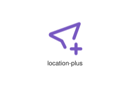
</div>
</div>

{{#endtab}}
{{#tab name="Code"}}

```xml
{{#include ../samples/icons/Tabler-Icons/location-plus-af769bca.xal}}
```

{{#endtab}}
{{#endtabs}}

<div class="xal-ref-tag"><code>&lt;item id=&#34;102988&#34; /&gt;</code></div>

</div>
<div class="xal-ref-card">
<div class="xal-ref-title">location-question</div>

{{#tabs name="svg-ref-2988"}}
{{#tab name="Preview"}}
<div class="xal-ref-preview">
<div>

</div>
</div>

{{#endtab}}
{{#tab name="Code"}}

```xml
{{#include ../samples/icons/Tabler-Icons/location-question-0d26e88c.xal}}
```

{{#endtab}}
{{#endtabs}}

<div class="xal-ref-tag"><code>&lt;item id=&#34;102989&#34; /&gt;</code></div>

</div>
<div class="xal-ref-card">
<div class="xal-ref-title">location-search</div>

{{#tabs name="svg-ref-2989"}}
{{#tab name="Preview"}}
<div class="xal-ref-preview">
<div>

</div>
</div>

{{#endtab}}
{{#tab name="Code"}}

```xml
{{#include ../samples/icons/Tabler-Icons/location-search-15d048f7.xal}}
```

{{#endtab}}
{{#endtabs}}

<div class="xal-ref-tag"><code>&lt;item id=&#34;102990&#34; /&gt;</code></div>

</div>
<div class="xal-ref-card">
<div class="xal-ref-title">location-share</div>

{{#tabs name="svg-ref-2990"}}
{{#tab name="Preview"}}
<div class="xal-ref-preview">
<div>
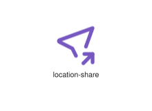
</div>
</div>

{{#endtab}}
{{#tab name="Code"}}

```xml
{{#include ../samples/icons/Tabler-Icons/location-share-dc9640d8.xal}}
```

{{#endtab}}
{{#endtabs}}

<div class="xal-ref-tag"><code>&lt;item id=&#34;102991&#34; /&gt;</code></div>

</div>
<div class="xal-ref-card">
<div class="xal-ref-title">location-star</div>

{{#tabs name="svg-ref-2991"}}
{{#tab name="Preview"}}
<div class="xal-ref-preview">
<div>

</div>
</div>

{{#endtab}}
{{#tab name="Code"}}

```xml
{{#include ../samples/icons/Tabler-Icons/location-star-d0ef27bd.xal}}
```

{{#endtab}}
{{#endtabs}}

<div class="xal-ref-tag"><code>&lt;item id=&#34;102992&#34; /&gt;</code></div>

</div>
<div class="xal-ref-card">
<div class="xal-ref-title">location-up</div>

{{#tabs name="svg-ref-2992"}}
{{#tab name="Preview"}}
<div class="xal-ref-preview">
<div>

</div>
</div>

{{#endtab}}
{{#tab name="Code"}}

```xml
{{#include ../samples/icons/Tabler-Icons/location-up-b8e37b65.xal}}
```

{{#endtab}}
{{#endtabs}}

<div class="xal-ref-tag"><code>&lt;item id=&#34;102993&#34; /&gt;</code></div>

</div>
<div class="xal-ref-card">
<div class="xal-ref-title">location-x</div>

{{#tabs name="svg-ref-2993"}}
{{#tab name="Preview"}}
<div class="xal-ref-preview">
<div>
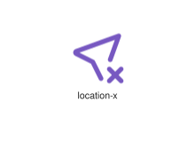
</div>
</div>

{{#endtab}}
{{#tab name="Code"}}

```xml
{{#include ../samples/icons/Tabler-Icons/location-x-f155cf02.xal}}
```

{{#endtab}}
{{#endtabs}}

<div class="xal-ref-tag"><code>&lt;item id=&#34;102994&#34; /&gt;</code></div>

</div>
<div class="xal-ref-card">
<div class="xal-ref-title">location</div>

{{#tabs name="svg-ref-2994"}}
{{#tab name="Preview"}}
<div class="xal-ref-preview">
<div>

</div>
</div>

{{#endtab}}
{{#tab name="Code"}}

```xml
{{#include ../samples/icons/Tabler-Icons/location-80ed5ae3.xal}}
```

{{#endtab}}
{{#endtabs}}

<div class="xal-ref-tag"><code>&lt;item id=&#34;102972&#34; /&gt;</code></div>

</div>
<div class="xal-ref-card">
<div class="xal-ref-title">lock-access-off</div>

{{#tabs name="svg-ref-2995"}}
{{#tab name="Preview"}}
<div class="xal-ref-preview">
<div>
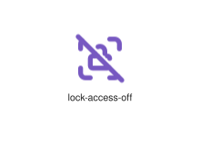
</div>
</div>

{{#endtab}}
{{#tab name="Code"}}

```xml
{{#include ../samples/icons/Tabler-Icons/lock-access-off-0a53618a.xal}}
```

{{#endtab}}
{{#endtabs}}

<div class="xal-ref-tag"><code>&lt;item id=&#34;102997&#34; /&gt;</code></div>

</div>
<div class="xal-ref-card">
<div class="xal-ref-title">lock-access</div>

{{#tabs name="svg-ref-2996"}}
{{#tab name="Preview"}}
<div class="xal-ref-preview">
<div>

</div>
</div>

{{#endtab}}
{{#tab name="Code"}}

```xml
{{#include ../samples/icons/Tabler-Icons/lock-access-d9dc7447.xal}}
```

{{#endtab}}
{{#endtabs}}

<div class="xal-ref-tag"><code>&lt;item id=&#34;102996&#34; /&gt;</code></div>

</div>
<div class="xal-ref-card">
<div class="xal-ref-title">lock-bitcoin</div>

{{#tabs name="svg-ref-2997"}}
{{#tab name="Preview"}}
<div class="xal-ref-preview">
<div>

</div>
</div>

{{#endtab}}
{{#tab name="Code"}}

```xml
{{#include ../samples/icons/Tabler-Icons/lock-bitcoin-5f0e7a4c.xal}}
```

{{#endtab}}
{{#endtabs}}

<div class="xal-ref-tag"><code>&lt;item id=&#34;102998&#34; /&gt;</code></div>

</div>
<div class="xal-ref-card">
<div class="xal-ref-title">lock-bolt</div>

{{#tabs name="svg-ref-2998"}}
{{#tab name="Preview"}}
<div class="xal-ref-preview">
<div>

</div>
</div>

{{#endtab}}
{{#tab name="Code"}}

```xml
{{#include ../samples/icons/Tabler-Icons/lock-bolt-fff07eb9.xal}}
```

{{#endtab}}
{{#endtabs}}

<div class="xal-ref-tag"><code>&lt;item id=&#34;102999&#34; /&gt;</code></div>

</div>
<div class="xal-ref-card">
<div class="xal-ref-title">lock-cancel</div>

{{#tabs name="svg-ref-2999"}}
{{#tab name="Preview"}}
<div class="xal-ref-preview">
<div>

</div>
</div>

{{#endtab}}
{{#tab name="Code"}}

```xml
{{#include ../samples/icons/Tabler-Icons/lock-cancel-3c354dc2.xal}}
```

{{#endtab}}
{{#endtabs}}

<div class="xal-ref-tag"><code>&lt;item id=&#34;103000&#34; /&gt;</code></div>

</div>
<div class="xal-ref-card">
<div class="xal-ref-title">lock-check</div>

{{#tabs name="svg-ref-3000"}}
{{#tab name="Preview"}}
<div class="xal-ref-preview">
<div>

</div>
</div>

{{#endtab}}
{{#tab name="Code"}}

```xml
{{#include ../samples/icons/Tabler-Icons/lock-check-d9056b37.xal}}
```

{{#endtab}}
{{#endtabs}}

<div class="xal-ref-tag"><code>&lt;item id=&#34;103001&#34; /&gt;</code></div>

</div>
<div class="xal-ref-card">
<div class="xal-ref-title">lock-code</div>

{{#tabs name="svg-ref-3001"}}
{{#tab name="Preview"}}
<div class="xal-ref-preview">
<div>

</div>
</div>

{{#endtab}}
{{#tab name="Code"}}

```xml
{{#include ../samples/icons/Tabler-Icons/lock-code-82894278.xal}}
```

{{#endtab}}
{{#endtabs}}

<div class="xal-ref-tag"><code>&lt;item id=&#34;103002&#34; /&gt;</code></div>

</div>
<div class="xal-ref-card">
<div class="xal-ref-title">lock-cog</div>

{{#tabs name="svg-ref-3002"}}
{{#tab name="Preview"}}
<div class="xal-ref-preview">
<div>

</div>
</div>

{{#endtab}}
{{#tab name="Code"}}

```xml
{{#include ../samples/icons/Tabler-Icons/lock-cog-f6ca05af.xal}}
```

{{#endtab}}
{{#endtabs}}

<div class="xal-ref-tag"><code>&lt;item id=&#34;103003&#34; /&gt;</code></div>

</div>
<div class="xal-ref-card">
<div class="xal-ref-title">lock-dollar</div>

{{#tabs name="svg-ref-3003"}}
{{#tab name="Preview"}}
<div class="xal-ref-preview">
<div>

</div>
</div>

{{#endtab}}
{{#tab name="Code"}}

```xml
{{#include ../samples/icons/Tabler-Icons/lock-dollar-e6079148.xal}}
```

{{#endtab}}
{{#endtabs}}

<div class="xal-ref-tag"><code>&lt;item id=&#34;103004&#34; /&gt;</code></div>

</div>
<div class="xal-ref-card">
<div class="xal-ref-title">lock-down</div>

{{#tabs name="svg-ref-3004"}}
{{#tab name="Preview"}}
<div class="xal-ref-preview">
<div>

</div>
</div>

{{#endtab}}
{{#tab name="Code"}}

```xml
{{#include ../samples/icons/Tabler-Icons/lock-down-7ade0a45.xal}}
```

{{#endtab}}
{{#endtabs}}

<div class="xal-ref-tag"><code>&lt;item id=&#34;103005&#34; /&gt;</code></div>

</div>
<div class="xal-ref-card">
<div class="xal-ref-title">lock-exclamation</div>

{{#tabs name="svg-ref-3005"}}
{{#tab name="Preview"}}
<div class="xal-ref-preview">
<div>

</div>
</div>

{{#endtab}}
{{#tab name="Code"}}

```xml
{{#include ../samples/icons/Tabler-Icons/lock-exclamation-01a72489.xal}}
```

{{#endtab}}
{{#endtabs}}

<div class="xal-ref-tag"><code>&lt;item id=&#34;103006&#34; /&gt;</code></div>

</div>
<div class="xal-ref-card">
<div class="xal-ref-title">lock-heart</div>

{{#tabs name="svg-ref-3006"}}
{{#tab name="Preview"}}
<div class="xal-ref-preview">
<div>

</div>
</div>

{{#endtab}}
{{#tab name="Code"}}

```xml
{{#include ../samples/icons/Tabler-Icons/lock-heart-1e201545.xal}}
```

{{#endtab}}
{{#endtabs}}

<div class="xal-ref-tag"><code>&lt;item id=&#34;103007&#34; /&gt;</code></div>

</div>
<div class="xal-ref-card">
<div class="xal-ref-title">lock-minus</div>

{{#tabs name="svg-ref-3007"}}
{{#tab name="Preview"}}
<div class="xal-ref-preview">
<div>

</div>
</div>

{{#endtab}}
{{#tab name="Code"}}

```xml
{{#include ../samples/icons/Tabler-Icons/lock-minus-5a75d904.xal}}
```

{{#endtab}}
{{#endtabs}}

<div class="xal-ref-tag"><code>&lt;item id=&#34;103008&#34; /&gt;</code></div>

</div>
<div class="xal-ref-card">
<div class="xal-ref-title">lock-off</div>

{{#tabs name="svg-ref-3008"}}
{{#tab name="Preview"}}
<div class="xal-ref-preview">
<div>

</div>
</div>

{{#endtab}}
{{#tab name="Code"}}

```xml
{{#include ../samples/icons/Tabler-Icons/lock-off-2b0517a3.xal}}
```

{{#endtab}}
{{#endtabs}}

<div class="xal-ref-tag"><code>&lt;item id=&#34;103009&#34; /&gt;</code></div>

</div>
<div class="xal-ref-card">
<div class="xal-ref-title">lock-open-2</div>

{{#tabs name="svg-ref-3009"}}
{{#tab name="Preview"}}
<div class="xal-ref-preview">
<div>

</div>
</div>

{{#endtab}}
{{#tab name="Code"}}

```xml
{{#include ../samples/icons/Tabler-Icons/lock-open-2-c5277f43.xal}}
```

{{#endtab}}
{{#endtabs}}

<div class="xal-ref-tag"><code>&lt;item id=&#34;103011&#34; /&gt;</code></div>

</div>
<div class="xal-ref-card">
<div class="xal-ref-title">lock-open-off</div>

{{#tabs name="svg-ref-3010"}}
{{#tab name="Preview"}}
<div class="xal-ref-preview">
<div>

</div>
</div>

{{#endtab}}
{{#tab name="Code"}}

```xml
{{#include ../samples/icons/Tabler-Icons/lock-open-off-ec1bb95d.xal}}
```

{{#endtab}}
{{#endtabs}}

<div class="xal-ref-tag"><code>&lt;item id=&#34;103012&#34; /&gt;</code></div>

</div>
<div class="xal-ref-card">
<div class="xal-ref-title">lock-open</div>

{{#tabs name="svg-ref-3011"}}
{{#tab name="Preview"}}
<div class="xal-ref-preview">
<div>

</div>
</div>

{{#endtab}}
{{#tab name="Code"}}

```xml
{{#include ../samples/icons/Tabler-Icons/lock-open-f83c59a4.xal}}
```

{{#endtab}}
{{#endtabs}}

<div class="xal-ref-tag"><code>&lt;item id=&#34;103010&#34; /&gt;</code></div>

</div>
<div class="xal-ref-card">
<div class="xal-ref-title">lock-password</div>

{{#tabs name="svg-ref-3012"}}
{{#tab name="Preview"}}
<div class="xal-ref-preview">
<div>

</div>
</div>

{{#endtab}}
{{#tab name="Code"}}

```xml
{{#include ../samples/icons/Tabler-Icons/lock-password-acb178b1.xal}}
```

{{#endtab}}
{{#endtabs}}

<div class="xal-ref-tag"><code>&lt;item id=&#34;103013&#34; /&gt;</code></div>

</div>
<div class="xal-ref-card">
<div class="xal-ref-title">lock-pause</div>

{{#tabs name="svg-ref-3013"}}
{{#tab name="Preview"}}
<div class="xal-ref-preview">
<div>

</div>
</div>

{{#endtab}}
{{#tab name="Code"}}

```xml
{{#include ../samples/icons/Tabler-Icons/lock-pause-883f2e9c.xal}}
```

{{#endtab}}
{{#endtabs}}

<div class="xal-ref-tag"><code>&lt;item id=&#34;103014&#34; /&gt;</code></div>

</div>
<div class="xal-ref-card">
<div class="xal-ref-title">lock-pin</div>

{{#tabs name="svg-ref-3014"}}
{{#tab name="Preview"}}
<div class="xal-ref-preview">
<div>

</div>
</div>

{{#endtab}}
{{#tab name="Code"}}

```xml
{{#include ../samples/icons/Tabler-Icons/lock-pin-7bb50290.xal}}
```

{{#endtab}}
{{#endtabs}}

<div class="xal-ref-tag"><code>&lt;item id=&#34;103015&#34; /&gt;</code></div>

</div>
<div class="xal-ref-card">
<div class="xal-ref-title">lock-plus</div>

{{#tabs name="svg-ref-3015"}}
{{#tab name="Preview"}}
<div class="xal-ref-preview">
<div>

</div>
</div>

{{#endtab}}
{{#tab name="Code"}}

```xml
{{#include ../samples/icons/Tabler-Icons/lock-plus-667fdd31.xal}}
```

{{#endtab}}
{{#endtabs}}

<div class="xal-ref-tag"><code>&lt;item id=&#34;103016&#34; /&gt;</code></div>

</div>
<div class="xal-ref-card">
<div class="xal-ref-title">lock-question</div>

{{#tabs name="svg-ref-3016"}}
{{#tab name="Preview"}}
<div class="xal-ref-preview">
<div>

</div>
</div>

{{#endtab}}
{{#tab name="Code"}}

```xml
{{#include ../samples/icons/Tabler-Icons/lock-question-1b2c4905.xal}}
```

{{#endtab}}
{{#endtabs}}

<div class="xal-ref-tag"><code>&lt;item id=&#34;103017&#34; /&gt;</code></div>

</div>
<div class="xal-ref-card">
<div class="xal-ref-title">lock-search</div>

{{#tabs name="svg-ref-3017"}}
{{#tab name="Preview"}}
<div class="xal-ref-preview">
<div>

</div>
</div>

{{#endtab}}
{{#tab name="Code"}}

```xml
{{#include ../samples/icons/Tabler-Icons/lock-search-7d275d2d.xal}}
```

{{#endtab}}
{{#endtabs}}

<div class="xal-ref-tag"><code>&lt;item id=&#34;103018&#34; /&gt;</code></div>

</div>
<div class="xal-ref-card">
<div class="xal-ref-title">lock-share</div>

{{#tabs name="svg-ref-3018"}}
{{#tab name="Preview"}}
<div class="xal-ref-preview">
<div>

</div>
</div>

{{#endtab}}
{{#tab name="Code"}}

```xml
{{#include ../samples/icons/Tabler-Icons/lock-share-f630620a.xal}}
```

{{#endtab}}
{{#endtabs}}

<div class="xal-ref-tag"><code>&lt;item id=&#34;103019&#34; /&gt;</code></div>

</div>
<div class="xal-ref-card">
<div class="xal-ref-title">lock-square-rounded</div>

{{#tabs name="svg-ref-3019"}}
{{#tab name="Preview"}}
<div class="xal-ref-preview">
<div>
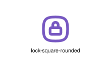
</div>
</div>

{{#endtab}}
{{#tab name="Code"}}

```xml
{{#include ../samples/icons/Tabler-Icons/lock-square-rounded-3c1ec9e1.xal}}
```

{{#endtab}}
{{#endtabs}}

<div class="xal-ref-tag"><code>&lt;item id=&#34;103021&#34; /&gt;</code></div>

</div>
<div class="xal-ref-card">
<div class="xal-ref-title">lock-square</div>

{{#tabs name="svg-ref-3020"}}
{{#tab name="Preview"}}
<div class="xal-ref-preview">
<div>
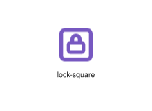
</div>
</div>

{{#endtab}}
{{#tab name="Code"}}

```xml
{{#include ../samples/icons/Tabler-Icons/lock-square-12d6e25d.xal}}
```

{{#endtab}}
{{#endtabs}}

<div class="xal-ref-tag"><code>&lt;item id=&#34;103020&#34; /&gt;</code></div>

</div>
<div class="xal-ref-card">
<div class="xal-ref-title">lock-star</div>

{{#tabs name="svg-ref-3021"}}
{{#tab name="Preview"}}
<div class="xal-ref-preview">
<div>

</div>
</div>

{{#endtab}}
{{#tab name="Code"}}

```xml
{{#include ../samples/icons/Tabler-Icons/lock-star-19e66146.xal}}
```

{{#endtab}}
{{#endtabs}}

<div class="xal-ref-tag"><code>&lt;item id=&#34;103022&#34; /&gt;</code></div>

</div>
<div class="xal-ref-card">
<div class="xal-ref-title">lock-up</div>

{{#tabs name="svg-ref-3022"}}
{{#tab name="Preview"}}
<div class="xal-ref-preview">
<div>

</div>
</div>

{{#endtab}}
{{#tab name="Code"}}

```xml
{{#include ../samples/icons/Tabler-Icons/lock-up-dec91ba2.xal}}
```

{{#endtab}}
{{#endtabs}}

<div class="xal-ref-tag"><code>&lt;item id=&#34;103023&#34; /&gt;</code></div>

</div>
<div class="xal-ref-card">
<div class="xal-ref-title">lock-x</div>

{{#tabs name="svg-ref-3023"}}
{{#tab name="Preview"}}
<div class="xal-ref-preview">
<div>

</div>
</div>

{{#endtab}}
{{#tab name="Code"}}

```xml
{{#include ../samples/icons/Tabler-Icons/lock-x-dd0ec2d8.xal}}
```

{{#endtab}}
{{#endtabs}}

<div class="xal-ref-tag"><code>&lt;item id=&#34;103024&#34; /&gt;</code></div>

</div>
<div class="xal-ref-card">
<div class="xal-ref-title">lock</div>

{{#tabs name="svg-ref-3024"}}
{{#tab name="Preview"}}
<div class="xal-ref-preview">
<div>

</div>
</div>

{{#endtab}}
{{#tab name="Code"}}

```xml
{{#include ../samples/icons/Tabler-Icons/lock-1b4825b5.xal}}
```

{{#endtab}}
{{#endtabs}}

<div class="xal-ref-tag"><code>&lt;item id=&#34;102995&#34; /&gt;</code></div>

</div>
<div class="xal-ref-card">
<div class="xal-ref-title">logic-and</div>

{{#tabs name="svg-ref-3025"}}
{{#tab name="Preview"}}
<div class="xal-ref-preview">
<div>
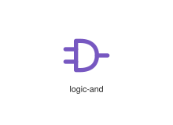
</div>
</div>

{{#endtab}}
{{#tab name="Code"}}

```xml
{{#include ../samples/icons/Tabler-Icons/logic-and-d0269806.xal}}
```

{{#endtab}}
{{#endtabs}}

<div class="xal-ref-tag"><code>&lt;item id=&#34;103025&#34; /&gt;</code></div>

</div>
<div class="xal-ref-card">
<div class="xal-ref-title">logic-buffer</div>

{{#tabs name="svg-ref-3026"}}
{{#tab name="Preview"}}
<div class="xal-ref-preview">
<div>
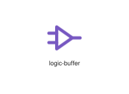
</div>
</div>

{{#endtab}}
{{#tab name="Code"}}

```xml
{{#include ../samples/icons/Tabler-Icons/logic-buffer-5a2dd720.xal}}
```

{{#endtab}}
{{#endtabs}}

<div class="xal-ref-tag"><code>&lt;item id=&#34;103026&#34; /&gt;</code></div>

</div>
<div class="xal-ref-card">
<div class="xal-ref-title">logic-nand</div>

{{#tabs name="svg-ref-3027"}}
{{#tab name="Preview"}}
<div class="xal-ref-preview">
<div>
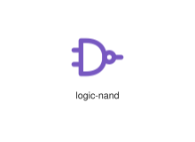
</div>
</div>

{{#endtab}}
{{#tab name="Code"}}

```xml
{{#include ../samples/icons/Tabler-Icons/logic-nand-18a2af94.xal}}
```

{{#endtab}}
{{#endtabs}}

<div class="xal-ref-tag"><code>&lt;item id=&#34;103027&#34; /&gt;</code></div>

</div>
<div class="xal-ref-card">
<div class="xal-ref-title">logic-nor</div>

{{#tabs name="svg-ref-3028"}}
{{#tab name="Preview"}}
<div class="xal-ref-preview">
<div>
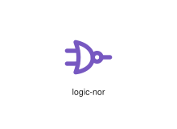
</div>
</div>

{{#endtab}}
{{#tab name="Code"}}

```xml
{{#include ../samples/icons/Tabler-Icons/logic-nor-02925968.xal}}
```

{{#endtab}}
{{#endtabs}}

<div class="xal-ref-tag"><code>&lt;item id=&#34;103028&#34; /&gt;</code></div>

</div>
<div class="xal-ref-card">
<div class="xal-ref-title">logic-not</div>

{{#tabs name="svg-ref-3029"}}
{{#tab name="Preview"}}
<div class="xal-ref-preview">
<div>
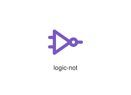
</div>
</div>

{{#endtab}}
{{#tab name="Code"}}

```xml
{{#include ../samples/icons/Tabler-Icons/logic-not-8dd2acc8.xal}}
```

{{#endtab}}
{{#endtabs}}

<div class="xal-ref-tag"><code>&lt;item id=&#34;103029&#34; /&gt;</code></div>

</div>
<div class="xal-ref-card">
<div class="xal-ref-title">logic-or</div>

{{#tabs name="svg-ref-3030"}}
{{#tab name="Preview"}}
<div class="xal-ref-preview">
<div>
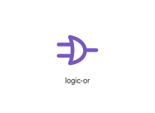
</div>
</div>

{{#endtab}}
{{#tab name="Code"}}

```xml
{{#include ../samples/icons/Tabler-Icons/logic-or-51f44b5a.xal}}
```

{{#endtab}}
{{#endtabs}}

<div class="xal-ref-tag"><code>&lt;item id=&#34;103030&#34; /&gt;</code></div>

</div>
<div class="xal-ref-card">
<div class="xal-ref-title">logic-xnor</div>

{{#tabs name="svg-ref-3031"}}
{{#tab name="Preview"}}
<div class="xal-ref-preview">
<div>
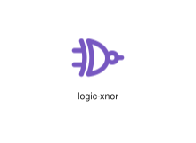
</div>
</div>

{{#endtab}}
{{#tab name="Code"}}

```xml
{{#include ../samples/icons/Tabler-Icons/logic-xnor-70c25656.xal}}
```

{{#endtab}}
{{#endtabs}}

<div class="xal-ref-tag"><code>&lt;item id=&#34;103031&#34; /&gt;</code></div>

</div>
<div class="xal-ref-card">
<div class="xal-ref-title">logic-xor</div>

{{#tabs name="svg-ref-3032"}}
{{#tab name="Preview"}}
<div class="xal-ref-preview">
<div>
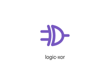
</div>
</div>

{{#endtab}}
{{#tab name="Code"}}

```xml
{{#include ../samples/icons/Tabler-Icons/logic-xor-069cf09c.xal}}
```

{{#endtab}}
{{#endtabs}}

<div class="xal-ref-tag"><code>&lt;item id=&#34;103032&#34; /&gt;</code></div>

</div>
<div class="xal-ref-card">
<div class="xal-ref-title">login-2</div>

{{#tabs name="svg-ref-3033"}}
{{#tab name="Preview"}}
<div class="xal-ref-preview">
<div>

</div>
</div>

{{#endtab}}
{{#tab name="Code"}}

```xml
{{#include ../samples/icons/Tabler-Icons/login-2-760da384.xal}}
```

{{#endtab}}
{{#endtabs}}

<div class="xal-ref-tag"><code>&lt;item id=&#34;103034&#34; /&gt;</code></div>

</div>
<div class="xal-ref-card">
<div class="xal-ref-title">login</div>

{{#tabs name="svg-ref-3034"}}
{{#tab name="Preview"}}
<div class="xal-ref-preview">
<div>

</div>
</div>

{{#endtab}}
{{#tab name="Code"}}

```xml
{{#include ../samples/icons/Tabler-Icons/login-37c5ff85.xal}}
```

{{#endtab}}
{{#endtabs}}

<div class="xal-ref-tag"><code>&lt;item id=&#34;103033&#34; /&gt;</code></div>

</div>
<div class="xal-ref-card">
<div class="xal-ref-title">logout-2</div>

{{#tabs name="svg-ref-3035"}}
{{#tab name="Preview"}}
<div class="xal-ref-preview">
<div>
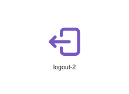
</div>
</div>

{{#endtab}}
{{#tab name="Code"}}

```xml
{{#include ../samples/icons/Tabler-Icons/logout-2-34145536.xal}}
```

{{#endtab}}
{{#endtabs}}

<div class="xal-ref-tag"><code>&lt;item id=&#34;103036&#34; /&gt;</code></div>

</div>
<div class="xal-ref-card">
<div class="xal-ref-title">logout</div>

{{#tabs name="svg-ref-3036"}}
{{#tab name="Preview"}}
<div class="xal-ref-preview">
<div>

</div>
</div>

{{#endtab}}
{{#tab name="Code"}}

```xml
{{#include ../samples/icons/Tabler-Icons/logout-88268faa.xal}}
```

{{#endtab}}
{{#endtabs}}

<div class="xal-ref-tag"><code>&lt;item id=&#34;103035&#34; /&gt;</code></div>

</div>
<div class="xal-ref-card">
<div class="xal-ref-title">logs</div>

{{#tabs name="svg-ref-3037"}}
{{#tab name="Preview"}}
<div class="xal-ref-preview">
<div>
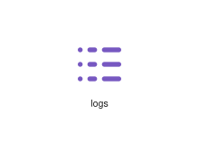
</div>
</div>

{{#endtab}}
{{#tab name="Code"}}

```xml
{{#include ../samples/icons/Tabler-Icons/logs-d049bbe0.xal}}
```

{{#endtab}}
{{#endtabs}}

<div class="xal-ref-tag"><code>&lt;item id=&#34;103037&#34; /&gt;</code></div>

</div>
<div class="xal-ref-card">
<div class="xal-ref-title">lollipop-off</div>

{{#tabs name="svg-ref-3038"}}
{{#tab name="Preview"}}
<div class="xal-ref-preview">
<div>

</div>
</div>

{{#endtab}}
{{#tab name="Code"}}

```xml
{{#include ../samples/icons/Tabler-Icons/lollipop-off-1cd531e7.xal}}
```

{{#endtab}}
{{#endtabs}}

<div class="xal-ref-tag"><code>&lt;item id=&#34;103039&#34; /&gt;</code></div>

</div>
<div class="xal-ref-card">
<div class="xal-ref-title">lollipop</div>

{{#tabs name="svg-ref-3039"}}
{{#tab name="Preview"}}
<div class="xal-ref-preview">
<div>
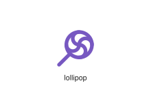
</div>
</div>

{{#endtab}}
{{#tab name="Code"}}

```xml
{{#include ../samples/icons/Tabler-Icons/lollipop-4a81323d.xal}}
```

{{#endtab}}
{{#endtabs}}

<div class="xal-ref-tag"><code>&lt;item id=&#34;103038&#34; /&gt;</code></div>

</div>
<div class="xal-ref-card">
<div class="xal-ref-title">luggage-off</div>

{{#tabs name="svg-ref-3040"}}
{{#tab name="Preview"}}
<div class="xal-ref-preview">
<div>

</div>
</div>

{{#endtab}}
{{#tab name="Code"}}

```xml
{{#include ../samples/icons/Tabler-Icons/luggage-off-69c03309.xal}}
```

{{#endtab}}
{{#endtabs}}

<div class="xal-ref-tag"><code>&lt;item id=&#34;103041&#34; /&gt;</code></div>

</div>
<div class="xal-ref-card">
<div class="xal-ref-title">luggage</div>

{{#tabs name="svg-ref-3041"}}
{{#tab name="Preview"}}
<div class="xal-ref-preview">
<div>

</div>
</div>

{{#endtab}}
{{#tab name="Code"}}

```xml
{{#include ../samples/icons/Tabler-Icons/luggage-81b3eaaf.xal}}
```

{{#endtab}}
{{#endtabs}}

<div class="xal-ref-tag"><code>&lt;item id=&#34;103040&#34; /&gt;</code></div>

</div>
<div class="xal-ref-card">
<div class="xal-ref-title">lungs-off</div>

{{#tabs name="svg-ref-3042"}}
{{#tab name="Preview"}}
<div class="xal-ref-preview">
<div>

</div>
</div>

{{#endtab}}
{{#tab name="Code"}}

```xml
{{#include ../samples/icons/Tabler-Icons/lungs-off-39e17b8c.xal}}
```

{{#endtab}}
{{#endtabs}}

<div class="xal-ref-tag"><code>&lt;item id=&#34;103043&#34; /&gt;</code></div>

</div>
<div class="xal-ref-card">
<div class="xal-ref-title">lungs</div>

{{#tabs name="svg-ref-3043"}}
{{#tab name="Preview"}}
<div class="xal-ref-preview">
<div>
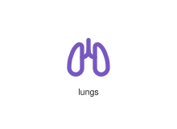
</div>
</div>

{{#endtab}}
{{#tab name="Code"}}

```xml
{{#include ../samples/icons/Tabler-Icons/lungs-ed5ca5f6.xal}}
```

{{#endtab}}
{{#endtabs}}

<div class="xal-ref-tag"><code>&lt;item id=&#34;103042&#34; /&gt;</code></div>

</div>
<div class="xal-ref-card">
<div class="xal-ref-title">macro-off</div>

{{#tabs name="svg-ref-3044"}}
{{#tab name="Preview"}}
<div class="xal-ref-preview">
<div>
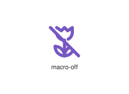
</div>
</div>

{{#endtab}}
{{#tab name="Code"}}

```xml
{{#include ../samples/icons/Tabler-Icons/macro-off-ab8ec244.xal}}
```

{{#endtab}}
{{#endtabs}}

<div class="xal-ref-tag"><code>&lt;item id=&#34;103045&#34; /&gt;</code></div>

</div>
<div class="xal-ref-card">
<div class="xal-ref-title">macro</div>

{{#tabs name="svg-ref-3045"}}
{{#tab name="Preview"}}
<div class="xal-ref-preview">
<div>
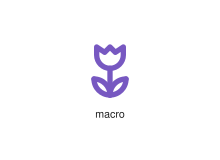
</div>
</div>

{{#endtab}}
{{#tab name="Code"}}

```xml
{{#include ../samples/icons/Tabler-Icons/macro-950a060f.xal}}
```

{{#endtab}}
{{#endtabs}}

<div class="xal-ref-tag"><code>&lt;item id=&#34;103044&#34; /&gt;</code></div>

</div>
<div class="xal-ref-card">
<div class="xal-ref-title">magnet-off</div>

{{#tabs name="svg-ref-3046"}}
{{#tab name="Preview"}}
<div class="xal-ref-preview">
<div>
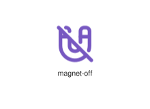
</div>
</div>

{{#endtab}}
{{#tab name="Code"}}

```xml
{{#include ../samples/icons/Tabler-Icons/magnet-off-e421bfe5.xal}}
```

{{#endtab}}
{{#endtabs}}

<div class="xal-ref-tag"><code>&lt;item id=&#34;103047&#34; /&gt;</code></div>

</div>
<div class="xal-ref-card">
<div class="xal-ref-title">magnet</div>

{{#tabs name="svg-ref-3047"}}
{{#tab name="Preview"}}
<div class="xal-ref-preview">
<div>
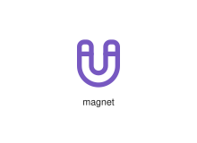
</div>
</div>

{{#endtab}}
{{#tab name="Code"}}

```xml
{{#include ../samples/icons/Tabler-Icons/magnet-0a873629.xal}}
```

{{#endtab}}
{{#endtabs}}

<div class="xal-ref-tag"><code>&lt;item id=&#34;103046&#34; /&gt;</code></div>

</div>
<div class="xal-ref-card">
<div class="xal-ref-title">magnetic</div>

{{#tabs name="svg-ref-3048"}}
{{#tab name="Preview"}}
<div class="xal-ref-preview">
<div>
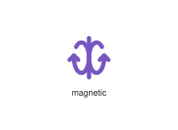
</div>
</div>

{{#endtab}}
{{#tab name="Code"}}

```xml
{{#include ../samples/icons/Tabler-Icons/magnetic-07bdb936.xal}}
```

{{#endtab}}
{{#endtabs}}

<div class="xal-ref-tag"><code>&lt;item id=&#34;103048&#34; /&gt;</code></div>

</div>
<div class="xal-ref-card">
<div class="xal-ref-title">mail-ai</div>

{{#tabs name="svg-ref-3049"}}
{{#tab name="Preview"}}
<div class="xal-ref-preview">
<div>

</div>
</div>

{{#endtab}}
{{#tab name="Code"}}

```xml
{{#include ../samples/icons/Tabler-Icons/mail-ai-6bd2c228.xal}}
```

{{#endtab}}
{{#endtabs}}

<div class="xal-ref-tag"><code>&lt;item id=&#34;103050&#34; /&gt;</code></div>

</div>
<div class="xal-ref-card">
<div class="xal-ref-title">mail-bitcoin</div>

{{#tabs name="svg-ref-3050"}}
{{#tab name="Preview"}}
<div class="xal-ref-preview">
<div>

</div>
</div>

{{#endtab}}
{{#tab name="Code"}}

```xml
{{#include ../samples/icons/Tabler-Icons/mail-bitcoin-b3512f6b.xal}}
```

{{#endtab}}
{{#endtabs}}

<div class="xal-ref-tag"><code>&lt;item id=&#34;103051&#34; /&gt;</code></div>

</div>
<div class="xal-ref-card">
<div class="xal-ref-title">mail-bolt</div>

{{#tabs name="svg-ref-3051"}}
{{#tab name="Preview"}}
<div class="xal-ref-preview">
<div>

</div>
</div>

{{#endtab}}
{{#tab name="Code"}}

```xml
{{#include ../samples/icons/Tabler-Icons/mail-bolt-cb2437df.xal}}
```

{{#endtab}}
{{#endtabs}}

<div class="xal-ref-tag"><code>&lt;item id=&#34;103052&#34; /&gt;</code></div>

</div>
<div class="xal-ref-card">
<div class="xal-ref-title">mail-cancel</div>

{{#tabs name="svg-ref-3052"}}
{{#tab name="Preview"}}
<div class="xal-ref-preview">
<div>

</div>
</div>

{{#endtab}}
{{#tab name="Code"}}

```xml
{{#include ../samples/icons/Tabler-Icons/mail-cancel-00924c03.xal}}
```

{{#endtab}}
{{#endtabs}}

<div class="xal-ref-tag"><code>&lt;item id=&#34;103053&#34; /&gt;</code></div>

</div>
<div class="xal-ref-card">
<div class="xal-ref-title">mail-check</div>

{{#tabs name="svg-ref-3053"}}
{{#tab name="Preview"}}
<div class="xal-ref-preview">
<div>

</div>
</div>

{{#endtab}}
{{#tab name="Code"}}

```xml
{{#include ../samples/icons/Tabler-Icons/mail-check-7de07b13.xal}}
```

{{#endtab}}
{{#endtabs}}

<div class="xal-ref-tag"><code>&lt;item id=&#34;103054&#34; /&gt;</code></div>

</div>
<div class="xal-ref-card">
<div class="xal-ref-title">mail-code</div>

{{#tabs name="svg-ref-3054"}}
{{#tab name="Preview"}}
<div class="xal-ref-preview">
<div>

</div>
</div>

{{#endtab}}
{{#tab name="Code"}}

```xml
{{#include ../samples/icons/Tabler-Icons/mail-code-b65d0b1e.xal}}
```

{{#endtab}}
{{#endtabs}}

<div class="xal-ref-tag"><code>&lt;item id=&#34;103055&#34; /&gt;</code></div>

</div>
<div class="xal-ref-card">
<div class="xal-ref-title">mail-cog</div>

{{#tabs name="svg-ref-3055"}}
{{#tab name="Preview"}}
<div class="xal-ref-preview">
<div>

</div>
</div>

{{#endtab}}
{{#tab name="Code"}}

```xml
{{#include ../samples/icons/Tabler-Icons/mail-cog-4c5a9fc6.xal}}
```

{{#endtab}}
{{#endtabs}}

<div class="xal-ref-tag"><code>&lt;item id=&#34;103056&#34; /&gt;</code></div>

</div>
<div class="xal-ref-card">
<div class="xal-ref-title">mail-dollar</div>

{{#tabs name="svg-ref-3056"}}
{{#tab name="Preview"}}
<div class="xal-ref-preview">
<div>

</div>
</div>

{{#endtab}}
{{#tab name="Code"}}

```xml
{{#include ../samples/icons/Tabler-Icons/mail-dollar-daa09089.xal}}
```

{{#endtab}}
{{#endtabs}}

<div class="xal-ref-tag"><code>&lt;item id=&#34;103057&#34; /&gt;</code></div>

</div>
<div class="xal-ref-card">
<div class="xal-ref-title">mail-down</div>

{{#tabs name="svg-ref-3057"}}
{{#tab name="Preview"}}
<div class="xal-ref-preview">
<div>

</div>
</div>

{{#endtab}}
{{#tab name="Code"}}

```xml
{{#include ../samples/icons/Tabler-Icons/mail-down-4e0a4323.xal}}
```

{{#endtab}}
{{#endtabs}}

<div class="xal-ref-tag"><code>&lt;item id=&#34;103058&#34; /&gt;</code></div>

</div>
<div class="xal-ref-card">
<div class="xal-ref-title">mail-exclamation</div>

{{#tabs name="svg-ref-3058"}}
{{#tab name="Preview"}}
<div class="xal-ref-preview">
<div>

</div>
</div>

{{#endtab}}
{{#tab name="Code"}}

```xml
{{#include ../samples/icons/Tabler-Icons/mail-exclamation-c2aab09d.xal}}
```

{{#endtab}}
{{#endtabs}}

<div class="xal-ref-tag"><code>&lt;item id=&#34;103059&#34; /&gt;</code></div>

</div>
<div class="xal-ref-card">
<div class="xal-ref-title">mail-fast</div>

{{#tabs name="svg-ref-3059"}}
{{#tab name="Preview"}}
<div class="xal-ref-preview">
<div>

</div>
</div>

{{#endtab}}
{{#tab name="Code"}}

```xml
{{#include ../samples/icons/Tabler-Icons/mail-fast-edd1f236.xal}}
```

{{#endtab}}
{{#endtabs}}

<div class="xal-ref-tag"><code>&lt;item id=&#34;103060&#34; /&gt;</code></div>

</div>
</div>
