# Tabler-Icons - Page 42

This page references SVG files under `etc/resources/aws/svg/Tabler-Icons`.
Each card shows the SVG preview first and the XAL tag syntax in the Code tab.
Showing 3691-3780 of 4964 SVG files.

<style>
.xal-ref-grid{display:grid;grid-template-columns:repeat(3,minmax(0,1fr));gap:1rem;margin:1rem 0 1.5rem}.xal-ref-card{border:1px solid var(--table-border-color);border-radius:8px;overflow:hidden;background:var(--bg);padding:.75rem}.xal-ref-title{font-size:.9rem;font-weight:600;line-height:1.25;margin:0 0 .5rem;overflow-wrap:anywhere}.xal-ref-preview{display:flex;align-items:center;justify-content:center}.xal-ref-preview img{display:block;width:100%;height:auto}.xal-ref-card pre{margin:0;max-height:18rem;overflow:auto;white-space:pre}.xal-ref-card code{font-size:.78em}.xal-ref-tag{margin:.5rem 0 0;color:var(--fg);opacity:.72;overflow:auto;white-space:pre}.xal-ref-tag code{font-size:.72em}@media(max-width:900px){.xal-ref-grid{grid-template-columns:repeat(2,minmax(0,1fr))}}@media(max-width:560px){.xal-ref-grid{grid-template-columns:1fr}}
</style>

[Back to section index](tabler-icons.md)

<div class="xal-ref-grid">
<div class="xal-ref-card">
<div class="xal-ref-title">phone-check</div>

{{#tabs name="svg-ref-3690"}}
{{#tab name="Preview"}}
<div class="xal-ref-preview">
<div>

</div>
</div>

{{#endtab}}
{{#tab name="Code"}}

```xml
{{#include ../samples/icons/Tabler-Icons/phone-check-59befbcd.xal}}
```

{{#endtab}}
{{#endtabs}}

<div class="xal-ref-tag"><code>&lt;item id=&#34;103691&#34; /&gt;</code></div>

</div>
<div class="xal-ref-card">
<div class="xal-ref-title">phone-done</div>

{{#tabs name="svg-ref-3691"}}
{{#tab name="Preview"}}
<div class="xal-ref-preview">
<div>

</div>
</div>

{{#endtab}}
{{#tab name="Code"}}

```xml
{{#include ../samples/icons/Tabler-Icons/phone-done-f7205992.xal}}
```

{{#endtab}}
{{#endtabs}}

<div class="xal-ref-tag"><code>&lt;item id=&#34;103692&#34; /&gt;</code></div>

</div>
<div class="xal-ref-card">
<div class="xal-ref-title">phone-end</div>

{{#tabs name="svg-ref-3692"}}
{{#tab name="Preview"}}
<div class="xal-ref-preview">
<div>

</div>
</div>

{{#endtab}}
{{#tab name="Code"}}

```xml
{{#include ../samples/icons/Tabler-Icons/phone-end-5549c90d.xal}}
```

{{#endtab}}
{{#endtabs}}

<div class="xal-ref-tag"><code>&lt;item id=&#34;103693&#34; /&gt;</code></div>

</div>
<div class="xal-ref-card">
<div class="xal-ref-title">phone-incoming</div>

{{#tabs name="svg-ref-3693"}}
{{#tab name="Preview"}}
<div class="xal-ref-preview">
<div>

</div>
</div>

{{#endtab}}
{{#tab name="Code"}}

```xml
{{#include ../samples/icons/Tabler-Icons/phone-incoming-eb1cdde6.xal}}
```

{{#endtab}}
{{#endtabs}}

<div class="xal-ref-tag"><code>&lt;item id=&#34;103694&#34; /&gt;</code></div>

</div>
<div class="xal-ref-card">
<div class="xal-ref-title">phone-off</div>

{{#tabs name="svg-ref-3694"}}
{{#tab name="Preview"}}
<div class="xal-ref-preview">
<div>

</div>
</div>

{{#endtab}}
{{#tab name="Code"}}

```xml
{{#include ../samples/icons/Tabler-Icons/phone-off-67aa474e.xal}}
```

{{#endtab}}
{{#endtabs}}

<div class="xal-ref-tag"><code>&lt;item id=&#34;103695&#34; /&gt;</code></div>

</div>
<div class="xal-ref-card">
<div class="xal-ref-title">phone-outgoing</div>

{{#tabs name="svg-ref-3695"}}
{{#tab name="Preview"}}
<div class="xal-ref-preview">
<div>

</div>
</div>

{{#endtab}}
{{#tab name="Code"}}

```xml
{{#include ../samples/icons/Tabler-Icons/phone-outgoing-b579047d.xal}}
```

{{#endtab}}
{{#endtabs}}

<div class="xal-ref-tag"><code>&lt;item id=&#34;103696&#34; /&gt;</code></div>

</div>
<div class="xal-ref-card">
<div class="xal-ref-title">phone-pause</div>

{{#tabs name="svg-ref-3696"}}
{{#tab name="Preview"}}
<div class="xal-ref-preview">
<div>

</div>
</div>

{{#endtab}}
{{#tab name="Code"}}

```xml
{{#include ../samples/icons/Tabler-Icons/phone-pause-0884be66.xal}}
```

{{#endtab}}
{{#endtabs}}

<div class="xal-ref-tag"><code>&lt;item id=&#34;103697&#34; /&gt;</code></div>

</div>
<div class="xal-ref-card">
<div class="xal-ref-title">phone-plus</div>

{{#tabs name="svg-ref-3697"}}
{{#tab name="Preview"}}
<div class="xal-ref-preview">
<div>

</div>
</div>

{{#endtab}}
{{#tab name="Code"}}

```xml
{{#include ../samples/icons/Tabler-Icons/phone-plus-b888eca4.xal}}
```

{{#endtab}}
{{#endtabs}}

<div class="xal-ref-tag"><code>&lt;item id=&#34;103698&#34; /&gt;</code></div>

</div>
<div class="xal-ref-card">
<div class="xal-ref-title">phone-ringing</div>

{{#tabs name="svg-ref-3698"}}
{{#tab name="Preview"}}
<div class="xal-ref-preview">
<div>

</div>
</div>

{{#endtab}}
{{#tab name="Code"}}

```xml
{{#include ../samples/icons/Tabler-Icons/phone-ringing-21c505a9.xal}}
```

{{#endtab}}
{{#endtabs}}

<div class="xal-ref-tag"><code>&lt;item id=&#34;103699&#34; /&gt;</code></div>

</div>
<div class="xal-ref-card">
<div class="xal-ref-title">phone-spark</div>

{{#tabs name="svg-ref-3699"}}
{{#tab name="Preview"}}
<div class="xal-ref-preview">
<div>

</div>
</div>

{{#endtab}}
{{#tab name="Code"}}

```xml
{{#include ../samples/icons/Tabler-Icons/phone-spark-66e5660f.xal}}
```

{{#endtab}}
{{#endtabs}}

<div class="xal-ref-tag"><code>&lt;item id=&#34;103700&#34; /&gt;</code></div>

</div>
<div class="xal-ref-card">
<div class="xal-ref-title">phone-x</div>

{{#tabs name="svg-ref-3700"}}
{{#tab name="Preview"}}
<div class="xal-ref-preview">
<div>

</div>
</div>

{{#endtab}}
{{#tab name="Code"}}

```xml
{{#include ../samples/icons/Tabler-Icons/phone-x-916451e2.xal}}
```

{{#endtab}}
{{#endtabs}}

<div class="xal-ref-tag"><code>&lt;item id=&#34;103701&#34; /&gt;</code></div>

</div>
<div class="xal-ref-card">
<div class="xal-ref-title">phone</div>

{{#tabs name="svg-ref-3701"}}
{{#tab name="Preview"}}
<div class="xal-ref-preview">
<div>

</div>
</div>

{{#endtab}}
{{#tab name="Code"}}

```xml
{{#include ../samples/icons/Tabler-Icons/phone-2ece0837.xal}}
```

{{#endtab}}
{{#endtabs}}

<div class="xal-ref-tag"><code>&lt;item id=&#34;103688&#34; /&gt;</code></div>

</div>
<div class="xal-ref-card">
<div class="xal-ref-title">photo-ai</div>

{{#tabs name="svg-ref-3702"}}
{{#tab name="Preview"}}
<div class="xal-ref-preview">
<div>

</div>
</div>

{{#endtab}}
{{#tab name="Code"}}

```xml
{{#include ../samples/icons/Tabler-Icons/photo-ai-4510c9da.xal}}
```

{{#endtab}}
{{#endtabs}}

<div class="xal-ref-tag"><code>&lt;item id=&#34;103703&#34; /&gt;</code></div>

</div>
<div class="xal-ref-card">
<div class="xal-ref-title">photo-bitcoin</div>

{{#tabs name="svg-ref-3703"}}
{{#tab name="Preview"}}
<div class="xal-ref-preview">
<div>

</div>
</div>

{{#endtab}}
{{#tab name="Code"}}

```xml
{{#include ../samples/icons/Tabler-Icons/photo-bitcoin-cf88e055.xal}}
```

{{#endtab}}
{{#endtabs}}

<div class="xal-ref-tag"><code>&lt;item id=&#34;103704&#34; /&gt;</code></div>

</div>
<div class="xal-ref-card">
<div class="xal-ref-title">photo-bolt</div>

{{#tabs name="svg-ref-3704"}}
{{#tab name="Preview"}}
<div class="xal-ref-preview">
<div>
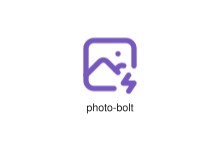
</div>
</div>

{{#endtab}}
{{#tab name="Code"}}

```xml
{{#include ../samples/icons/Tabler-Icons/photo-bolt-7a7c43aa.xal}}
```

{{#endtab}}
{{#endtabs}}

<div class="xal-ref-tag"><code>&lt;item id=&#34;103705&#34; /&gt;</code></div>

</div>
<div class="xal-ref-card">
<div class="xal-ref-title">photo-cancel</div>

{{#tabs name="svg-ref-3705"}}
{{#tab name="Preview"}}
<div class="xal-ref-preview">
<div>

</div>
</div>

{{#endtab}}
{{#tab name="Code"}}

```xml
{{#include ../samples/icons/Tabler-Icons/photo-cancel-05b2c5cd.xal}}
```

{{#endtab}}
{{#endtabs}}

<div class="xal-ref-tag"><code>&lt;item id=&#34;103706&#34; /&gt;</code></div>

</div>
<div class="xal-ref-card">
<div class="xal-ref-title">photo-check</div>

{{#tabs name="svg-ref-3706"}}
{{#tab name="Preview"}}
<div class="xal-ref-preview">
<div>

</div>
</div>

{{#endtab}}
{{#tab name="Code"}}

```xml
{{#include ../samples/icons/Tabler-Icons/photo-check-5d3ea6d4.xal}}
```

{{#endtab}}
{{#endtabs}}

<div class="xal-ref-tag"><code>&lt;item id=&#34;103707&#34; /&gt;</code></div>

</div>
<div class="xal-ref-card">
<div class="xal-ref-title">photo-circle-minus</div>

{{#tabs name="svg-ref-3707"}}
{{#tab name="Preview"}}
<div class="xal-ref-preview">
<div>

</div>
</div>

{{#endtab}}
{{#tab name="Code"}}

```xml
{{#include ../samples/icons/Tabler-Icons/photo-circle-minus-0f998c1c.xal}}
```

{{#endtab}}
{{#endtabs}}

<div class="xal-ref-tag"><code>&lt;item id=&#34;103709&#34; /&gt;</code></div>

</div>
<div class="xal-ref-card">
<div class="xal-ref-title">photo-circle-plus</div>

{{#tabs name="svg-ref-3708"}}
{{#tab name="Preview"}}
<div class="xal-ref-preview">
<div>

</div>
</div>

{{#endtab}}
{{#tab name="Code"}}

```xml
{{#include ../samples/icons/Tabler-Icons/photo-circle-plus-8f0cea86.xal}}
```

{{#endtab}}
{{#endtabs}}

<div class="xal-ref-tag"><code>&lt;item id=&#34;103710&#34; /&gt;</code></div>

</div>
<div class="xal-ref-card">
<div class="xal-ref-title">photo-circle</div>

{{#tabs name="svg-ref-3709"}}
{{#tab name="Preview"}}
<div class="xal-ref-preview">
<div>
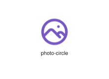
</div>
</div>

{{#endtab}}
{{#tab name="Code"}}

```xml
{{#include ../samples/icons/Tabler-Icons/photo-circle-bf617008.xal}}
```

{{#endtab}}
{{#endtabs}}

<div class="xal-ref-tag"><code>&lt;item id=&#34;103708&#34; /&gt;</code></div>

</div>
<div class="xal-ref-card">
<div class="xal-ref-title">photo-code</div>

{{#tabs name="svg-ref-3710"}}
{{#tab name="Preview"}}
<div class="xal-ref-preview">
<div>

</div>
</div>

{{#endtab}}
{{#tab name="Code"}}

```xml
{{#include ../samples/icons/Tabler-Icons/photo-code-07057f6b.xal}}
```

{{#endtab}}
{{#endtabs}}

<div class="xal-ref-tag"><code>&lt;item id=&#34;103711&#34; /&gt;</code></div>

</div>
<div class="xal-ref-card">
<div class="xal-ref-title">photo-cog</div>

{{#tabs name="svg-ref-3711"}}
{{#tab name="Preview"}}
<div class="xal-ref-preview">
<div>

</div>
</div>

{{#endtab}}
{{#tab name="Code"}}

```xml
{{#include ../samples/icons/Tabler-Icons/photo-cog-1fc7cefd.xal}}
```

{{#endtab}}
{{#endtabs}}

<div class="xal-ref-tag"><code>&lt;item id=&#34;103712&#34; /&gt;</code></div>

</div>
<div class="xal-ref-card">
<div class="xal-ref-title">photo-dollar</div>

{{#tabs name="svg-ref-3712"}}
{{#tab name="Preview"}}
<div class="xal-ref-preview">
<div>

</div>
</div>

{{#endtab}}
{{#tab name="Code"}}

```xml
{{#include ../samples/icons/Tabler-Icons/photo-dollar-df801947.xal}}
```

{{#endtab}}
{{#endtabs}}

<div class="xal-ref-tag"><code>&lt;item id=&#34;103713&#34; /&gt;</code></div>

</div>
<div class="xal-ref-card">
<div class="xal-ref-title">photo-down</div>

{{#tabs name="svg-ref-3713"}}
{{#tab name="Preview"}}
<div class="xal-ref-preview">
<div>

</div>
</div>

{{#endtab}}
{{#tab name="Code"}}

```xml
{{#include ../samples/icons/Tabler-Icons/photo-down-ff523756.xal}}
```

{{#endtab}}
{{#endtabs}}

<div class="xal-ref-tag"><code>&lt;item id=&#34;103714&#34; /&gt;</code></div>

</div>
<div class="xal-ref-card">
<div class="xal-ref-title">photo-edit</div>

{{#tabs name="svg-ref-3714"}}
{{#tab name="Preview"}}
<div class="xal-ref-preview">
<div>

</div>
</div>

{{#endtab}}
{{#tab name="Code"}}

```xml
{{#include ../samples/icons/Tabler-Icons/photo-edit-22738ffa.xal}}
```

{{#endtab}}
{{#endtabs}}

<div class="xal-ref-tag"><code>&lt;item id=&#34;103715&#34; /&gt;</code></div>

</div>
<div class="xal-ref-card">
<div class="xal-ref-title">photo-exclamation</div>

{{#tabs name="svg-ref-3715"}}
{{#tab name="Preview"}}
<div class="xal-ref-preview">
<div>

</div>
</div>

{{#endtab}}
{{#tab name="Code"}}

```xml
{{#include ../samples/icons/Tabler-Icons/photo-exclamation-41e4ad33.xal}}
```

{{#endtab}}
{{#endtabs}}

<div class="xal-ref-tag"><code>&lt;item id=&#34;103716&#34; /&gt;</code></div>

</div>
<div class="xal-ref-card">
<div class="xal-ref-title">photo-heart</div>

{{#tabs name="svg-ref-3716"}}
{{#tab name="Preview"}}
<div class="xal-ref-preview">
<div>

</div>
</div>

{{#endtab}}
{{#tab name="Code"}}

```xml
{{#include ../samples/icons/Tabler-Icons/photo-heart-9a1bd8a6.xal}}
```

{{#endtab}}
{{#endtabs}}

<div class="xal-ref-tag"><code>&lt;item id=&#34;103717&#34; /&gt;</code></div>

</div>
<div class="xal-ref-card">
<div class="xal-ref-title">photo-hexagon</div>

{{#tabs name="svg-ref-3717"}}
{{#tab name="Preview"}}
<div class="xal-ref-preview">
<div>

</div>
</div>

{{#endtab}}
{{#tab name="Code"}}

```xml
{{#include ../samples/icons/Tabler-Icons/photo-hexagon-76bc014c.xal}}
```

{{#endtab}}
{{#endtabs}}

<div class="xal-ref-tag"><code>&lt;item id=&#34;103718&#34; /&gt;</code></div>

</div>
<div class="xal-ref-card">
<div class="xal-ref-title">photo-minus</div>

{{#tabs name="svg-ref-3718"}}
{{#tab name="Preview"}}
<div class="xal-ref-preview">
<div>

</div>
</div>

{{#endtab}}
{{#tab name="Code"}}

```xml
{{#include ../samples/icons/Tabler-Icons/photo-minus-de4e14e7.xal}}
```

{{#endtab}}
{{#endtabs}}

<div class="xal-ref-tag"><code>&lt;item id=&#34;103719&#34; /&gt;</code></div>

</div>
<div class="xal-ref-card">
<div class="xal-ref-title">photo-off</div>

{{#tabs name="svg-ref-3719"}}
{{#tab name="Preview"}}
<div class="xal-ref-preview">
<div>

</div>
</div>

{{#endtab}}
{{#tab name="Code"}}

```xml
{{#include ../samples/icons/Tabler-Icons/photo-off-c208dcf1.xal}}
```

{{#endtab}}
{{#endtabs}}

<div class="xal-ref-tag"><code>&lt;item id=&#34;103720&#34; /&gt;</code></div>

</div>
<div class="xal-ref-card">
<div class="xal-ref-title">photo-pause</div>

{{#tabs name="svg-ref-3720"}}
{{#tab name="Preview"}}
<div class="xal-ref-preview">
<div>

</div>
</div>

{{#endtab}}
{{#tab name="Code"}}

```xml
{{#include ../samples/icons/Tabler-Icons/photo-pause-0c04e37f.xal}}
```

{{#endtab}}
{{#endtabs}}

<div class="xal-ref-tag"><code>&lt;item id=&#34;103721&#34; /&gt;</code></div>

</div>
<div class="xal-ref-card">
<div class="xal-ref-title">photo-pentagon</div>

{{#tabs name="svg-ref-3721"}}
{{#tab name="Preview"}}
<div class="xal-ref-preview">
<div>

</div>
</div>

{{#endtab}}
{{#tab name="Code"}}

```xml
{{#include ../samples/icons/Tabler-Icons/photo-pentagon-b2613dd7.xal}}
```

{{#endtab}}
{{#endtabs}}

<div class="xal-ref-tag"><code>&lt;item id=&#34;103722&#34; /&gt;</code></div>

</div>
<div class="xal-ref-card">
<div class="xal-ref-title">photo-pin</div>

{{#tabs name="svg-ref-3722"}}
{{#tab name="Preview"}}
<div class="xal-ref-preview">
<div>

</div>
</div>

{{#endtab}}
{{#tab name="Code"}}

```xml
{{#include ../samples/icons/Tabler-Icons/photo-pin-92b8c9c2.xal}}
```

{{#endtab}}
{{#endtabs}}

<div class="xal-ref-tag"><code>&lt;item id=&#34;103723&#34; /&gt;</code></div>

</div>
<div class="xal-ref-card">
<div class="xal-ref-title">photo-plus</div>

{{#tabs name="svg-ref-3723"}}
{{#tab name="Preview"}}
<div class="xal-ref-preview">
<div>

</div>
</div>

{{#endtab}}
{{#tab name="Code"}}

```xml
{{#include ../samples/icons/Tabler-Icons/photo-plus-e3f3e022.xal}}
```

{{#endtab}}
{{#endtabs}}

<div class="xal-ref-tag"><code>&lt;item id=&#34;103724&#34; /&gt;</code></div>

</div>
<div class="xal-ref-card">
<div class="xal-ref-title">photo-question</div>

{{#tabs name="svg-ref-3724"}}
{{#tab name="Preview"}}
<div class="xal-ref-preview">
<div>

</div>
</div>

{{#endtab}}
{{#tab name="Code"}}

```xml
{{#include ../samples/icons/Tabler-Icons/photo-question-7fd7675f.xal}}
```

{{#endtab}}
{{#endtabs}}

<div class="xal-ref-tag"><code>&lt;item id=&#34;103725&#34; /&gt;</code></div>

</div>
<div class="xal-ref-card">
<div class="xal-ref-title">photo-scan</div>

{{#tabs name="svg-ref-3725"}}
{{#tab name="Preview"}}
<div class="xal-ref-preview">
<div>

</div>
</div>

{{#endtab}}
{{#tab name="Code"}}

```xml
{{#include ../samples/icons/Tabler-Icons/photo-scan-9b038496.xal}}
```

{{#endtab}}
{{#endtabs}}

<div class="xal-ref-tag"><code>&lt;item id=&#34;103726&#34; /&gt;</code></div>

</div>
<div class="xal-ref-card">
<div class="xal-ref-title">photo-search</div>

{{#tabs name="svg-ref-3726"}}
{{#tab name="Preview"}}
<div class="xal-ref-preview">
<div>

</div>
</div>

{{#endtab}}
{{#tab name="Code"}}

```xml
{{#include ../samples/icons/Tabler-Icons/photo-search-44a0d522.xal}}
```

{{#endtab}}
{{#endtabs}}

<div class="xal-ref-tag"><code>&lt;item id=&#34;103727&#34; /&gt;</code></div>

</div>
<div class="xal-ref-card">
<div class="xal-ref-title">photo-sensor-2</div>

{{#tabs name="svg-ref-3727"}}
{{#tab name="Preview"}}
<div class="xal-ref-preview">
<div>

</div>
</div>

{{#endtab}}
{{#tab name="Code"}}

```xml
{{#include ../samples/icons/Tabler-Icons/photo-sensor-2-3e81aa18.xal}}
```

{{#endtab}}
{{#endtabs}}

<div class="xal-ref-tag"><code>&lt;item id=&#34;103729&#34; /&gt;</code></div>

</div>
<div class="xal-ref-card">
<div class="xal-ref-title">photo-sensor-3</div>

{{#tabs name="svg-ref-3728"}}
{{#tab name="Preview"}}
<div class="xal-ref-preview">
<div>
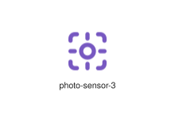
</div>
</div>

{{#endtab}}
{{#tab name="Code"}}

```xml
{{#include ../samples/icons/Tabler-Icons/photo-sensor-3-03e183a8.xal}}
```

{{#endtab}}
{{#endtabs}}

<div class="xal-ref-tag"><code>&lt;item id=&#34;103730&#34; /&gt;</code></div>

</div>
<div class="xal-ref-card">
<div class="xal-ref-title">photo-sensor</div>

{{#tabs name="svg-ref-3729"}}
{{#tab name="Preview"}}
<div class="xal-ref-preview">
<div>
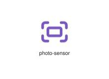
</div>
</div>

{{#endtab}}
{{#tab name="Code"}}

```xml
{{#include ../samples/icons/Tabler-Icons/photo-sensor-66658362.xal}}
```

{{#endtab}}
{{#endtabs}}

<div class="xal-ref-tag"><code>&lt;item id=&#34;103728&#34; /&gt;</code></div>

</div>
<div class="xal-ref-card">
<div class="xal-ref-title">photo-share</div>

{{#tabs name="svg-ref-3730"}}
{{#tab name="Preview"}}
<div class="xal-ref-preview">
<div>

</div>
</div>

{{#endtab}}
{{#tab name="Code"}}

```xml
{{#include ../samples/icons/Tabler-Icons/photo-share-720bafe9.xal}}
```

{{#endtab}}
{{#endtabs}}

<div class="xal-ref-tag"><code>&lt;item id=&#34;103731&#34; /&gt;</code></div>

</div>
<div class="xal-ref-card">
<div class="xal-ref-title">photo-shield</div>

{{#tabs name="svg-ref-3731"}}
{{#tab name="Preview"}}
<div class="xal-ref-preview">
<div>

</div>
</div>

{{#endtab}}
{{#tab name="Code"}}

```xml
{{#include ../samples/icons/Tabler-Icons/photo-shield-f0d5d454.xal}}
```

{{#endtab}}
{{#endtabs}}

<div class="xal-ref-tag"><code>&lt;item id=&#34;103732&#34; /&gt;</code></div>

</div>
<div class="xal-ref-card">
<div class="xal-ref-title">photo-spark</div>

{{#tabs name="svg-ref-3732"}}
{{#tab name="Preview"}}
<div class="xal-ref-preview">
<div>

</div>
</div>

{{#endtab}}
{{#tab name="Code"}}

```xml
{{#include ../samples/icons/Tabler-Icons/photo-spark-62653b16.xal}}
```

{{#endtab}}
{{#endtabs}}

<div class="xal-ref-tag"><code>&lt;item id=&#34;103733&#34; /&gt;</code></div>

</div>
<div class="xal-ref-card">
<div class="xal-ref-title">photo-square-rounded</div>

{{#tabs name="svg-ref-3733"}}
{{#tab name="Preview"}}
<div class="xal-ref-preview">
<div>
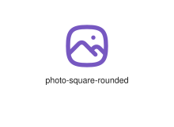
</div>
</div>

{{#endtab}}
{{#tab name="Code"}}

```xml
{{#include ../samples/icons/Tabler-Icons/photo-square-rounded-f143814f.xal}}
```

{{#endtab}}
{{#endtabs}}

<div class="xal-ref-tag"><code>&lt;item id=&#34;103734&#34; /&gt;</code></div>

</div>
<div class="xal-ref-card">
<div class="xal-ref-title">photo-star</div>

{{#tabs name="svg-ref-3734"}}
{{#tab name="Preview"}}
<div class="xal-ref-preview">
<div>

</div>
</div>

{{#endtab}}
{{#tab name="Code"}}

```xml
{{#include ../samples/icons/Tabler-Icons/photo-star-9c6a5c55.xal}}
```

{{#endtab}}
{{#endtabs}}

<div class="xal-ref-tag"><code>&lt;item id=&#34;103735&#34; /&gt;</code></div>

</div>
<div class="xal-ref-card">
<div class="xal-ref-title">photo-up</div>

{{#tabs name="svg-ref-3735"}}
{{#tab name="Preview"}}
<div class="xal-ref-preview">
<div>

</div>
</div>

{{#endtab}}
{{#tab name="Code"}}

```xml
{{#include ../samples/icons/Tabler-Icons/photo-up-b0a77ca4.xal}}
```

{{#endtab}}
{{#endtabs}}

<div class="xal-ref-tag"><code>&lt;item id=&#34;103736&#34; /&gt;</code></div>

</div>
<div class="xal-ref-card">
<div class="xal-ref-title">photo-video</div>

{{#tabs name="svg-ref-3736"}}
{{#tab name="Preview"}}
<div class="xal-ref-preview">
<div>

</div>
</div>

{{#endtab}}
{{#tab name="Code"}}

```xml
{{#include ../samples/icons/Tabler-Icons/photo-video-f26def1d.xal}}
```

{{#endtab}}
{{#endtabs}}

<div class="xal-ref-tag"><code>&lt;item id=&#34;103737&#34; /&gt;</code></div>

</div>
<div class="xal-ref-card">
<div class="xal-ref-title">photo-x</div>

{{#tabs name="svg-ref-3737"}}
{{#tab name="Preview"}}
<div class="xal-ref-preview">
<div>

</div>
</div>

{{#endtab}}
{{#tab name="Code"}}

```xml
{{#include ../samples/icons/Tabler-Icons/photo-x-d86f234f.xal}}
```

{{#endtab}}
{{#endtabs}}

<div class="xal-ref-tag"><code>&lt;item id=&#34;103738&#34; /&gt;</code></div>

</div>
<div class="xal-ref-card">
<div class="xal-ref-title">photo</div>

{{#tabs name="svg-ref-3738"}}
{{#tab name="Preview"}}
<div class="xal-ref-preview">
<div>
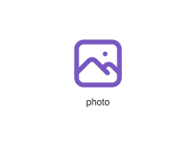
</div>
</div>

{{#endtab}}
{{#tab name="Code"}}

```xml
{{#include ../samples/icons/Tabler-Icons/photo-c633316b.xal}}
```

{{#endtab}}
{{#endtabs}}

<div class="xal-ref-tag"><code>&lt;item id=&#34;103702&#34; /&gt;</code></div>

</div>
<div class="xal-ref-card">
<div class="xal-ref-title">physotherapist</div>

{{#tabs name="svg-ref-3739"}}
{{#tab name="Preview"}}
<div class="xal-ref-preview">
<div>

</div>
</div>

{{#endtab}}
{{#tab name="Code"}}

```xml
{{#include ../samples/icons/Tabler-Icons/physotherapist-7d72a25f.xal}}
```

{{#endtab}}
{{#endtabs}}

<div class="xal-ref-tag"><code>&lt;item id=&#34;103739&#34; /&gt;</code></div>

</div>
<div class="xal-ref-card">
<div class="xal-ref-title">piano</div>

{{#tabs name="svg-ref-3740"}}
{{#tab name="Preview"}}
<div class="xal-ref-preview">
<div>
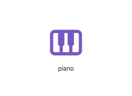
</div>
</div>

{{#endtab}}
{{#tab name="Code"}}

```xml
{{#include ../samples/icons/Tabler-Icons/piano-f8eb6b55.xal}}
```

{{#endtab}}
{{#endtabs}}

<div class="xal-ref-tag"><code>&lt;item id=&#34;103740&#34; /&gt;</code></div>

</div>
<div class="xal-ref-card">
<div class="xal-ref-title">pick</div>

{{#tabs name="svg-ref-3741"}}
{{#tab name="Preview"}}
<div class="xal-ref-preview">
<div>
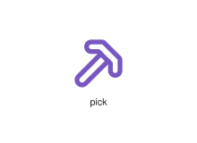
</div>
</div>

{{#endtab}}
{{#tab name="Code"}}

```xml
{{#include ../samples/icons/Tabler-Icons/pick-538c34eb.xal}}
```

{{#endtab}}
{{#endtabs}}

<div class="xal-ref-tag"><code>&lt;item id=&#34;103741&#34; /&gt;</code></div>

</div>
<div class="xal-ref-card">
<div class="xal-ref-title">picnic-table</div>

{{#tabs name="svg-ref-3742"}}
{{#tab name="Preview"}}
<div class="xal-ref-preview">
<div>
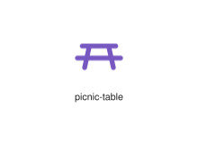
</div>
</div>

{{#endtab}}
{{#tab name="Code"}}

```xml
{{#include ../samples/icons/Tabler-Icons/picnic-table-408bc271.xal}}
```

{{#endtab}}
{{#endtabs}}

<div class="xal-ref-tag"><code>&lt;item id=&#34;103742&#34; /&gt;</code></div>

</div>
<div class="xal-ref-card">
<div class="xal-ref-title">picture-in-picture-off</div>

{{#tabs name="svg-ref-3743"}}
{{#tab name="Preview"}}
<div class="xal-ref-preview">
<div>

</div>
</div>

{{#endtab}}
{{#tab name="Code"}}

```xml
{{#include ../samples/icons/Tabler-Icons/picture-in-picture-off-0aad0d6c.xal}}
```

{{#endtab}}
{{#endtabs}}

<div class="xal-ref-tag"><code>&lt;item id=&#34;103744&#34; /&gt;</code></div>

</div>
<div class="xal-ref-card">
<div class="xal-ref-title">picture-in-picture-on</div>

{{#tabs name="svg-ref-3744"}}
{{#tab name="Preview"}}
<div class="xal-ref-preview">
<div>

</div>
</div>

{{#endtab}}
{{#tab name="Code"}}

```xml
{{#include ../samples/icons/Tabler-Icons/picture-in-picture-on-bfba6988.xal}}
```

{{#endtab}}
{{#endtabs}}

<div class="xal-ref-tag"><code>&lt;item id=&#34;103745&#34; /&gt;</code></div>

</div>
<div class="xal-ref-card">
<div class="xal-ref-title">picture-in-picture-top</div>

{{#tabs name="svg-ref-3745"}}
{{#tab name="Preview"}}
<div class="xal-ref-preview">
<div>

</div>
</div>

{{#endtab}}
{{#tab name="Code"}}

```xml
{{#include ../samples/icons/Tabler-Icons/picture-in-picture-top-a7dbf6b2.xal}}
```

{{#endtab}}
{{#endtabs}}

<div class="xal-ref-tag"><code>&lt;item id=&#34;103746&#34; /&gt;</code></div>

</div>
<div class="xal-ref-card">
<div class="xal-ref-title">picture-in-picture</div>

{{#tabs name="svg-ref-3746"}}
{{#tab name="Preview"}}
<div class="xal-ref-preview">
<div>

</div>
</div>

{{#endtab}}
{{#tab name="Code"}}

```xml
{{#include ../samples/icons/Tabler-Icons/picture-in-picture-d54025ad.xal}}
```

{{#endtab}}
{{#endtabs}}

<div class="xal-ref-tag"><code>&lt;item id=&#34;103743&#34; /&gt;</code></div>

</div>
<div class="xal-ref-card">
<div class="xal-ref-title">pig-money</div>

{{#tabs name="svg-ref-3747"}}
{{#tab name="Preview"}}
<div class="xal-ref-preview">
<div>

</div>
</div>

{{#endtab}}
{{#tab name="Code"}}

```xml
{{#include ../samples/icons/Tabler-Icons/pig-money-21724806.xal}}
```

{{#endtab}}
{{#endtabs}}

<div class="xal-ref-tag"><code>&lt;item id=&#34;103748&#34; /&gt;</code></div>

</div>
<div class="xal-ref-card">
<div class="xal-ref-title">pig-off</div>

{{#tabs name="svg-ref-3748"}}
{{#tab name="Preview"}}
<div class="xal-ref-preview">
<div>
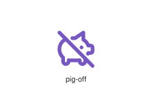
</div>
</div>

{{#endtab}}
{{#tab name="Code"}}

```xml
{{#include ../samples/icons/Tabler-Icons/pig-off-7c53d1c8.xal}}
```

{{#endtab}}
{{#endtabs}}

<div class="xal-ref-tag"><code>&lt;item id=&#34;103749&#34; /&gt;</code></div>

</div>
<div class="xal-ref-card">
<div class="xal-ref-title">pig</div>

{{#tabs name="svg-ref-3749"}}
{{#tab name="Preview"}}
<div class="xal-ref-preview">
<div>
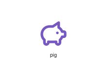
</div>
</div>

{{#endtab}}
{{#tab name="Code"}}

```xml
{{#include ../samples/icons/Tabler-Icons/pig-1a24cc28.xal}}
```

{{#endtab}}
{{#endtabs}}

<div class="xal-ref-tag"><code>&lt;item id=&#34;103747&#34; /&gt;</code></div>

</div>
<div class="xal-ref-card">
<div class="xal-ref-title">pilcrow-left</div>

{{#tabs name="svg-ref-3750"}}
{{#tab name="Preview"}}
<div class="xal-ref-preview">
<div>
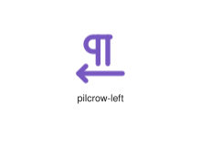
</div>
</div>

{{#endtab}}
{{#tab name="Code"}}

```xml
{{#include ../samples/icons/Tabler-Icons/pilcrow-left-f4dd9a6b.xal}}
```

{{#endtab}}
{{#endtabs}}

<div class="xal-ref-tag"><code>&lt;item id=&#34;103751&#34; /&gt;</code></div>

</div>
<div class="xal-ref-card">
<div class="xal-ref-title">pilcrow-right</div>

{{#tabs name="svg-ref-3751"}}
{{#tab name="Preview"}}
<div class="xal-ref-preview">
<div>
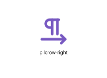
</div>
</div>

{{#endtab}}
{{#tab name="Code"}}

```xml
{{#include ../samples/icons/Tabler-Icons/pilcrow-right-2458da2a.xal}}
```

{{#endtab}}
{{#endtabs}}

<div class="xal-ref-tag"><code>&lt;item id=&#34;103752&#34; /&gt;</code></div>

</div>
<div class="xal-ref-card">
<div class="xal-ref-title">pilcrow</div>

{{#tabs name="svg-ref-3752"}}
{{#tab name="Preview"}}
<div class="xal-ref-preview">
<div>

</div>
</div>

{{#endtab}}
{{#tab name="Code"}}

```xml
{{#include ../samples/icons/Tabler-Icons/pilcrow-be978d3e.xal}}
```

{{#endtab}}
{{#endtabs}}

<div class="xal-ref-tag"><code>&lt;item id=&#34;103750&#34; /&gt;</code></div>

</div>
<div class="xal-ref-card">
<div class="xal-ref-title">pill-off</div>

{{#tabs name="svg-ref-3753"}}
{{#tab name="Preview"}}
<div class="xal-ref-preview">
<div>

</div>
</div>

{{#endtab}}
{{#tab name="Code"}}

```xml
{{#include ../samples/icons/Tabler-Icons/pill-off-5fc84bd9.xal}}
```

{{#endtab}}
{{#endtabs}}

<div class="xal-ref-tag"><code>&lt;item id=&#34;103754&#34; /&gt;</code></div>

</div>
<div class="xal-ref-card">
<div class="xal-ref-title">pill</div>

{{#tabs name="svg-ref-3754"}}
{{#tab name="Preview"}}
<div class="xal-ref-preview">
<div>

</div>
</div>

{{#endtab}}
{{#tab name="Code"}}

```xml
{{#include ../samples/icons/Tabler-Icons/pill-10fa5a2e.xal}}
```

{{#endtab}}
{{#endtabs}}

<div class="xal-ref-tag"><code>&lt;item id=&#34;103753&#34; /&gt;</code></div>

</div>
<div class="xal-ref-card">
<div class="xal-ref-title">pills</div>

{{#tabs name="svg-ref-3755"}}
{{#tab name="Preview"}}
<div class="xal-ref-preview">
<div>
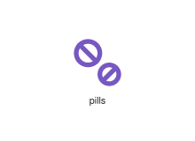
</div>
</div>

{{#endtab}}
{{#tab name="Code"}}

```xml
{{#include ../samples/icons/Tabler-Icons/pills-71e4d11d.xal}}
```

{{#endtab}}
{{#endtabs}}

<div class="xal-ref-tag"><code>&lt;item id=&#34;103755&#34; /&gt;</code></div>

</div>
<div class="xal-ref-card">
<div class="xal-ref-title">pin-end</div>

{{#tabs name="svg-ref-3756"}}
{{#tab name="Preview"}}
<div class="xal-ref-preview">
<div>

</div>
</div>

{{#endtab}}
{{#tab name="Code"}}

```xml
{{#include ../samples/icons/Tabler-Icons/pin-end-e213e9d0.xal}}
```

{{#endtab}}
{{#endtabs}}

<div class="xal-ref-tag"><code>&lt;item id=&#34;103757&#34; /&gt;</code></div>

</div>
<div class="xal-ref-card">
<div class="xal-ref-title">pin-invoke</div>

{{#tabs name="svg-ref-3757"}}
{{#tab name="Preview"}}
<div class="xal-ref-preview">
<div>

</div>
</div>

{{#endtab}}
{{#tab name="Code"}}

```xml
{{#include ../samples/icons/Tabler-Icons/pin-invoke-6dc9cb3f.xal}}
```

{{#endtab}}
{{#endtabs}}

<div class="xal-ref-tag"><code>&lt;item id=&#34;103758&#34; /&gt;</code></div>

</div>
<div class="xal-ref-card">
<div class="xal-ref-title">pin</div>

{{#tabs name="svg-ref-3758"}}
{{#tab name="Preview"}}
<div class="xal-ref-preview">
<div>
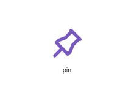
</div>
</div>

{{#endtab}}
{{#tab name="Code"}}

```xml
{{#include ../samples/icons/Tabler-Icons/pin-1734ae59.xal}}
```

{{#endtab}}
{{#endtabs}}

<div class="xal-ref-tag"><code>&lt;item id=&#34;103756&#34; /&gt;</code></div>

</div>
<div class="xal-ref-card">
<div class="xal-ref-title">ping-pong</div>

{{#tabs name="svg-ref-3759"}}
{{#tab name="Preview"}}
<div class="xal-ref-preview">
<div>

</div>
</div>

{{#endtab}}
{{#tab name="Code"}}

```xml
{{#include ../samples/icons/Tabler-Icons/ping-pong-bbce13fe.xal}}
```

{{#endtab}}
{{#endtabs}}

<div class="xal-ref-tag"><code>&lt;item id=&#34;103759&#34; /&gt;</code></div>

</div>
<div class="xal-ref-card">
<div class="xal-ref-title">pinned-off</div>

{{#tabs name="svg-ref-3760"}}
{{#tab name="Preview"}}
<div class="xal-ref-preview">
<div>

</div>
</div>

{{#endtab}}
{{#tab name="Code"}}

```xml
{{#include ../samples/icons/Tabler-Icons/pinned-off-5e03585f.xal}}
```

{{#endtab}}
{{#endtabs}}

<div class="xal-ref-tag"><code>&lt;item id=&#34;103761&#34; /&gt;</code></div>

</div>
<div class="xal-ref-card">
<div class="xal-ref-title">pinned</div>

{{#tabs name="svg-ref-3761"}}
{{#tab name="Preview"}}
<div class="xal-ref-preview">
<div>
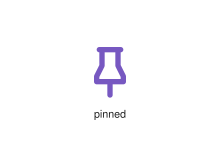
</div>
</div>

{{#endtab}}
{{#tab name="Code"}}

```xml
{{#include ../samples/icons/Tabler-Icons/pinned-1ca012c0.xal}}
```

{{#endtab}}
{{#endtabs}}

<div class="xal-ref-tag"><code>&lt;item id=&#34;103760&#34; /&gt;</code></div>

</div>
<div class="xal-ref-card">
<div class="xal-ref-title">pizza-off</div>

{{#tabs name="svg-ref-3762"}}
{{#tab name="Preview"}}
<div class="xal-ref-preview">
<div>
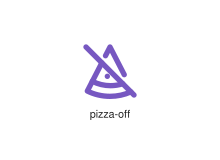
</div>
</div>

{{#endtab}}
{{#tab name="Code"}}

```xml
{{#include ../samples/icons/Tabler-Icons/pizza-off-50071336.xal}}
```

{{#endtab}}
{{#endtabs}}

<div class="xal-ref-tag"><code>&lt;item id=&#34;103763&#34; /&gt;</code></div>

</div>
<div class="xal-ref-card">
<div class="xal-ref-title">pizza</div>

{{#tabs name="svg-ref-3763"}}
{{#tab name="Preview"}}
<div class="xal-ref-preview">
<div>
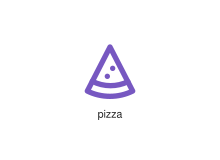
</div>
</div>

{{#endtab}}
{{#tab name="Code"}}

```xml
{{#include ../samples/icons/Tabler-Icons/pizza-ba455d8d.xal}}
```

{{#endtab}}
{{#endtabs}}

<div class="xal-ref-tag"><code>&lt;item id=&#34;103762&#34; /&gt;</code></div>

</div>
<div class="xal-ref-card">
<div class="xal-ref-title">placeholder</div>

{{#tabs name="svg-ref-3764"}}
{{#tab name="Preview"}}
<div class="xal-ref-preview">
<div>

</div>
</div>

{{#endtab}}
{{#tab name="Code"}}

```xml
{{#include ../samples/icons/Tabler-Icons/placeholder-236855d8.xal}}
```

{{#endtab}}
{{#endtabs}}

<div class="xal-ref-tag"><code>&lt;item id=&#34;103764&#34; /&gt;</code></div>

</div>
<div class="xal-ref-card">
<div class="xal-ref-title">plane-arrival</div>

{{#tabs name="svg-ref-3765"}}
{{#tab name="Preview"}}
<div class="xal-ref-preview">
<div>

</div>
</div>

{{#endtab}}
{{#tab name="Code"}}

```xml
{{#include ../samples/icons/Tabler-Icons/plane-arrival-b8b3453a.xal}}
```

{{#endtab}}
{{#endtabs}}

<div class="xal-ref-tag"><code>&lt;item id=&#34;103766&#34; /&gt;</code></div>

</div>
<div class="xal-ref-card">
<div class="xal-ref-title">plane-departure</div>

{{#tabs name="svg-ref-3766"}}
{{#tab name="Preview"}}
<div class="xal-ref-preview">
<div>

</div>
</div>

{{#endtab}}
{{#tab name="Code"}}

```xml
{{#include ../samples/icons/Tabler-Icons/plane-departure-fcea94e5.xal}}
```

{{#endtab}}
{{#endtabs}}

<div class="xal-ref-tag"><code>&lt;item id=&#34;103767&#34; /&gt;</code></div>

</div>
<div class="xal-ref-card">
<div class="xal-ref-title">plane-inflight</div>

{{#tabs name="svg-ref-3767"}}
{{#tab name="Preview"}}
<div class="xal-ref-preview">
<div>

</div>
</div>

{{#endtab}}
{{#tab name="Code"}}

```xml
{{#include ../samples/icons/Tabler-Icons/plane-inflight-425e80eb.xal}}
```

{{#endtab}}
{{#endtabs}}

<div class="xal-ref-tag"><code>&lt;item id=&#34;103768&#34; /&gt;</code></div>

</div>
<div class="xal-ref-card">
<div class="xal-ref-title">plane-off</div>

{{#tabs name="svg-ref-3768"}}
{{#tab name="Preview"}}
<div class="xal-ref-preview">
<div>

</div>
</div>

{{#endtab}}
{{#tab name="Code"}}

```xml
{{#include ../samples/icons/Tabler-Icons/plane-off-36da5737.xal}}
```

{{#endtab}}
{{#endtabs}}

<div class="xal-ref-tag"><code>&lt;item id=&#34;103769&#34; /&gt;</code></div>

</div>
<div class="xal-ref-card">
<div class="xal-ref-title">plane-tilt</div>

{{#tabs name="svg-ref-3769"}}
{{#tab name="Preview"}}
<div class="xal-ref-preview">
<div>

</div>
</div>

{{#endtab}}
{{#tab name="Code"}}

```xml
{{#include ../samples/icons/Tabler-Icons/plane-tilt-d18bfb32.xal}}
```

{{#endtab}}
{{#endtabs}}

<div class="xal-ref-tag"><code>&lt;item id=&#34;103770&#34; /&gt;</code></div>

</div>
<div class="xal-ref-card">
<div class="xal-ref-title">plane</div>

{{#tabs name="svg-ref-3770"}}
{{#tab name="Preview"}}
<div class="xal-ref-preview">
<div>

</div>
</div>

{{#endtab}}
{{#tab name="Code"}}

```xml
{{#include ../samples/icons/Tabler-Icons/plane-fabb7d90.xal}}
```

{{#endtab}}
{{#endtabs}}

<div class="xal-ref-tag"><code>&lt;item id=&#34;103765&#34; /&gt;</code></div>

</div>
<div class="xal-ref-card">
<div class="xal-ref-title">planet-off</div>

{{#tabs name="svg-ref-3771"}}
{{#tab name="Preview"}}
<div class="xal-ref-preview">
<div>

</div>
</div>

{{#endtab}}
{{#tab name="Code"}}

```xml
{{#include ../samples/icons/Tabler-Icons/planet-off-9d78364c.xal}}
```

{{#endtab}}
{{#endtabs}}

<div class="xal-ref-tag"><code>&lt;item id=&#34;103772&#34; /&gt;</code></div>

</div>
<div class="xal-ref-card">
<div class="xal-ref-title">planet</div>

{{#tabs name="svg-ref-3772"}}
{{#tab name="Preview"}}
<div class="xal-ref-preview">
<div>
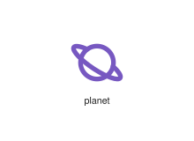
</div>
</div>

{{#endtab}}
{{#tab name="Code"}}

```xml
{{#include ../samples/icons/Tabler-Icons/planet-eff7d2a1.xal}}
```

{{#endtab}}
{{#endtabs}}

<div class="xal-ref-tag"><code>&lt;item id=&#34;103771&#34; /&gt;</code></div>

</div>
<div class="xal-ref-card">
<div class="xal-ref-title">plant-2-off</div>

{{#tabs name="svg-ref-3773"}}
{{#tab name="Preview"}}
<div class="xal-ref-preview">
<div>
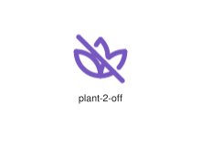
</div>
</div>

{{#endtab}}
{{#tab name="Code"}}

```xml
{{#include ../samples/icons/Tabler-Icons/plant-2-off-ddf5f09d.xal}}
```

{{#endtab}}
{{#endtabs}}

<div class="xal-ref-tag"><code>&lt;item id=&#34;103775&#34; /&gt;</code></div>

</div>
<div class="xal-ref-card">
<div class="xal-ref-title">plant-2</div>

{{#tabs name="svg-ref-3774"}}
{{#tab name="Preview"}}
<div class="xal-ref-preview">
<div>
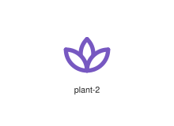
</div>
</div>

{{#endtab}}
{{#tab name="Code"}}

```xml
{{#include ../samples/icons/Tabler-Icons/plant-2-83a7fd98.xal}}
```

{{#endtab}}
{{#endtabs}}

<div class="xal-ref-tag"><code>&lt;item id=&#34;103774&#34; /&gt;</code></div>

</div>
<div class="xal-ref-card">
<div class="xal-ref-title">plant-off</div>

{{#tabs name="svg-ref-3775"}}
{{#tab name="Preview"}}
<div class="xal-ref-preview">
<div>
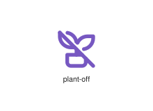
</div>
</div>

{{#endtab}}
{{#tab name="Code"}}

```xml
{{#include ../samples/icons/Tabler-Icons/plant-off-8d610105.xal}}
```

{{#endtab}}
{{#endtabs}}

<div class="xal-ref-tag"><code>&lt;item id=&#34;103776&#34; /&gt;</code></div>

</div>
<div class="xal-ref-card">
<div class="xal-ref-title">plant</div>

{{#tabs name="svg-ref-3776"}}
{{#tab name="Preview"}}
<div class="xal-ref-preview">
<div>
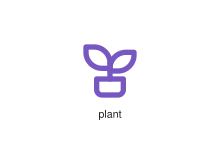
</div>
</div>

{{#endtab}}
{{#tab name="Code"}}

```xml
{{#include ../samples/icons/Tabler-Icons/plant-a73bc3a2.xal}}
```

{{#endtab}}
{{#endtabs}}

<div class="xal-ref-tag"><code>&lt;item id=&#34;103773&#34; /&gt;</code></div>

</div>
<div class="xal-ref-card">
<div class="xal-ref-title">play-basketball</div>

{{#tabs name="svg-ref-3777"}}
{{#tab name="Preview"}}
<div class="xal-ref-preview">
<div>

</div>
</div>

{{#endtab}}
{{#tab name="Code"}}

```xml
{{#include ../samples/icons/Tabler-Icons/play-basketball-e1ce4668.xal}}
```

{{#endtab}}
{{#endtabs}}

<div class="xal-ref-tag"><code>&lt;item id=&#34;103777&#34; /&gt;</code></div>

</div>
<div class="xal-ref-card">
<div class="xal-ref-title">play-card-1</div>

{{#tabs name="svg-ref-3778"}}
{{#tab name="Preview"}}
<div class="xal-ref-preview">
<div>
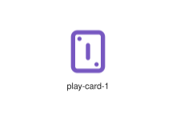
</div>
</div>

{{#endtab}}
{{#tab name="Code"}}

```xml
{{#include ../samples/icons/Tabler-Icons/play-card-1-0c87010b.xal}}
```

{{#endtab}}
{{#endtabs}}

<div class="xal-ref-tag"><code>&lt;item id=&#34;103779&#34; /&gt;</code></div>

</div>
<div class="xal-ref-card">
<div class="xal-ref-title">play-card-10</div>

{{#tabs name="svg-ref-3779"}}
{{#tab name="Preview"}}
<div class="xal-ref-preview">
<div>

</div>
</div>

{{#endtab}}
{{#tab name="Code"}}

```xml
{{#include ../samples/icons/Tabler-Icons/play-card-10-25af5a98.xal}}
```

{{#endtab}}
{{#endtabs}}

<div class="xal-ref-tag"><code>&lt;item id=&#34;103780&#34; /&gt;</code></div>

</div>
</div>
