# Tabler-Icons - Page 43

This page references SVG files under `etc/resources/aws/svg/Tabler-Icons`.
Each card shows the SVG preview first and the XAL tag syntax in the Code tab.
Showing 3781-3870 of 4964 SVG files.

<style>
.xal-ref-grid{display:grid;grid-template-columns:repeat(3,minmax(0,1fr));gap:1rem;margin:1rem 0 1.5rem}.xal-ref-card{border:1px solid var(--table-border-color);border-radius:8px;overflow:hidden;background:var(--bg);padding:.75rem}.xal-ref-title{font-size:.9rem;font-weight:600;line-height:1.25;margin:0 0 .5rem;overflow-wrap:anywhere}.xal-ref-preview{display:flex;align-items:center;justify-content:center}.xal-ref-preview img{display:block;width:100%;height:auto}.xal-ref-card pre{margin:0;max-height:18rem;overflow:auto;white-space:pre}.xal-ref-card code{font-size:.78em}.xal-ref-tag{margin:.5rem 0 0;color:var(--fg);opacity:.72;overflow:auto;white-space:pre}.xal-ref-tag code{font-size:.72em}@media(max-width:900px){.xal-ref-grid{grid-template-columns:repeat(2,minmax(0,1fr))}}@media(max-width:560px){.xal-ref-grid{grid-template-columns:1fr}}
</style>

[Back to section index](tabler-icons.md)

<div class="xal-ref-grid">
<div class="xal-ref-card">
<div class="xal-ref-title">play-card-2</div>

{{#tabs name="svg-ref-3780"}}
{{#tab name="Preview"}}
<div class="xal-ref-preview">
<div>
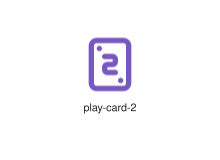
</div>
</div>

{{#endtab}}
{{#tab name="Code"}}

```xml
{{#include ../samples/icons/Tabler-Icons/play-card-2-4b277bdb.xal}}
```

{{#endtab}}
{{#endtabs}}

<div class="xal-ref-tag"><code>&lt;item id=&#34;103781&#34; /&gt;</code></div>

</div>
<div class="xal-ref-card">
<div class="xal-ref-title">play-card-3</div>

{{#tabs name="svg-ref-3781"}}
{{#tab name="Preview"}}
<div class="xal-ref-preview">
<div>
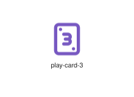
</div>
</div>

{{#endtab}}
{{#tab name="Code"}}

```xml
{{#include ../samples/icons/Tabler-Icons/play-card-3-7647526b.xal}}
```

{{#endtab}}
{{#endtabs}}

<div class="xal-ref-tag"><code>&lt;item id=&#34;103782&#34; /&gt;</code></div>

</div>
<div class="xal-ref-card">
<div class="xal-ref-title">play-card-4</div>

{{#tabs name="svg-ref-3782"}}
{{#tab name="Preview"}}
<div class="xal-ref-preview">
<div>
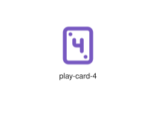
</div>
</div>

{{#endtab}}
{{#tab name="Code"}}

```xml
{{#include ../samples/icons/Tabler-Icons/play-card-4-c4678e7b.xal}}
```

{{#endtab}}
{{#endtabs}}

<div class="xal-ref-tag"><code>&lt;item id=&#34;103783&#34; /&gt;</code></div>

</div>
<div class="xal-ref-card">
<div class="xal-ref-title">play-card-5</div>

{{#tabs name="svg-ref-3783"}}
{{#tab name="Preview"}}
<div class="xal-ref-preview">
<div>

</div>
</div>

{{#endtab}}
{{#tab name="Code"}}

```xml
{{#include ../samples/icons/Tabler-Icons/play-card-5-f907a7cb.xal}}
```

{{#endtab}}
{{#endtabs}}

<div class="xal-ref-tag"><code>&lt;item id=&#34;103784&#34; /&gt;</code></div>

</div>
<div class="xal-ref-card">
<div class="xal-ref-title">play-card-6</div>

{{#tabs name="svg-ref-3784"}}
{{#tab name="Preview"}}
<div class="xal-ref-preview">
<div>
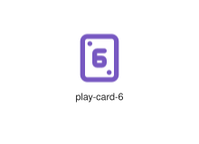
</div>
</div>

{{#endtab}}
{{#tab name="Code"}}

```xml
{{#include ../samples/icons/Tabler-Icons/play-card-6-bea7dd1b.xal}}
```

{{#endtab}}
{{#endtabs}}

<div class="xal-ref-tag"><code>&lt;item id=&#34;103785&#34; /&gt;</code></div>

</div>
<div class="xal-ref-card">
<div class="xal-ref-title">play-card-7</div>

{{#tabs name="svg-ref-3785"}}
{{#tab name="Preview"}}
<div class="xal-ref-preview">
<div>
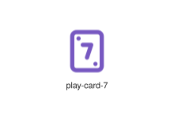
</div>
</div>

{{#endtab}}
{{#tab name="Code"}}

```xml
{{#include ../samples/icons/Tabler-Icons/play-card-7-83c7f4ab.xal}}
```

{{#endtab}}
{{#endtabs}}

<div class="xal-ref-tag"><code>&lt;item id=&#34;103786&#34; /&gt;</code></div>

</div>
<div class="xal-ref-card">
<div class="xal-ref-title">play-card-8</div>

{{#tabs name="svg-ref-3786"}}
{{#tab name="Preview"}}
<div class="xal-ref-preview">
<div>
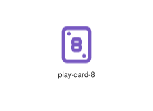
</div>
</div>

{{#endtab}}
{{#tab name="Code"}}

```xml
{{#include ../samples/icons/Tabler-Icons/play-card-8-0197637a.xal}}
```

{{#endtab}}
{{#endtabs}}

<div class="xal-ref-tag"><code>&lt;item id=&#34;103787&#34; /&gt;</code></div>

</div>
<div class="xal-ref-card">
<div class="xal-ref-title">play-card-9</div>

{{#tabs name="svg-ref-3787"}}
{{#tab name="Preview"}}
<div class="xal-ref-preview">
<div>

</div>
</div>

{{#endtab}}
{{#tab name="Code"}}

```xml
{{#include ../samples/icons/Tabler-Icons/play-card-9-3cf74aca.xal}}
```

{{#endtab}}
{{#endtabs}}

<div class="xal-ref-tag"><code>&lt;item id=&#34;103788&#34; /&gt;</code></div>

</div>
<div class="xal-ref-card">
<div class="xal-ref-title">play-card-a</div>

{{#tabs name="svg-ref-3788"}}
{{#tab name="Preview"}}
<div class="xal-ref-preview">
<div>
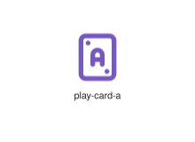
</div>
</div>

{{#endtab}}
{{#tab name="Code"}}

```xml
{{#include ../samples/icons/Tabler-Icons/play-card-a-3494cec0.xal}}
```

{{#endtab}}
{{#endtabs}}

<div class="xal-ref-tag"><code>&lt;item id=&#34;103789&#34; /&gt;</code></div>

</div>
<div class="xal-ref-card">
<div class="xal-ref-title">play-card-j</div>

{{#tabs name="svg-ref-3789"}}
{{#tab name="Preview"}}
<div class="xal-ref-preview">
<div>
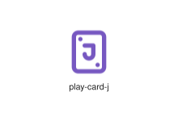
</div>
</div>

{{#endtab}}
{{#tab name="Code"}}

```xml
{{#include ../samples/icons/Tabler-Icons/play-card-j-4344ffd1.xal}}
```

{{#endtab}}
{{#endtabs}}

<div class="xal-ref-tag"><code>&lt;item id=&#34;103790&#34; /&gt;</code></div>

</div>
<div class="xal-ref-card">
<div class="xal-ref-title">play-card-k</div>

{{#tabs name="svg-ref-3790"}}
{{#tab name="Preview"}}
<div class="xal-ref-preview">
<div>

</div>
</div>

{{#endtab}}
{{#tab name="Code"}}

```xml
{{#include ../samples/icons/Tabler-Icons/play-card-k-7e24d661.xal}}
```

{{#endtab}}
{{#endtabs}}

<div class="xal-ref-tag"><code>&lt;item id=&#34;103791&#34; /&gt;</code></div>

</div>
<div class="xal-ref-card">
<div class="xal-ref-title">play-card-off</div>

{{#tabs name="svg-ref-3791"}}
{{#tab name="Preview"}}
<div class="xal-ref-preview">
<div>

</div>
</div>

{{#endtab}}
{{#tab name="Code"}}

```xml
{{#include ../samples/icons/Tabler-Icons/play-card-off-52eef356.xal}}
```

{{#endtab}}
{{#endtabs}}

<div class="xal-ref-tag"><code>&lt;item id=&#34;103792&#34; /&gt;</code></div>

</div>
<div class="xal-ref-card">
<div class="xal-ref-title">play-card-q</div>

{{#tabs name="svg-ref-3792"}}
{{#tab name="Preview"}}
<div class="xal-ref-preview">
<div>
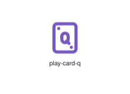
</div>
</div>

{{#endtab}}
{{#tab name="Code"}}

```xml
{{#include ../samples/icons/Tabler-Icons/play-card-q-54745942.xal}}
```

{{#endtab}}
{{#endtabs}}

<div class="xal-ref-tag"><code>&lt;item id=&#34;103793&#34; /&gt;</code></div>

</div>
<div class="xal-ref-card">
<div class="xal-ref-title">play-card-star</div>

{{#tabs name="svg-ref-3793"}}
{{#tab name="Preview"}}
<div class="xal-ref-preview">
<div>

</div>
</div>

{{#endtab}}
{{#tab name="Code"}}

```xml
{{#include ../samples/icons/Tabler-Icons/play-card-star-d4488c31.xal}}
```

{{#endtab}}
{{#endtabs}}

<div class="xal-ref-tag"><code>&lt;item id=&#34;103794&#34; /&gt;</code></div>

</div>
<div class="xal-ref-card">
<div class="xal-ref-title">play-card</div>

{{#tabs name="svg-ref-3794"}}
{{#tab name="Preview"}}
<div class="xal-ref-preview">
<div>
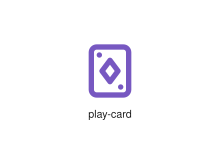
</div>
</div>

{{#endtab}}
{{#tab name="Code"}}

```xml
{{#include ../samples/icons/Tabler-Icons/play-card-184dd4d6.xal}}
```

{{#endtab}}
{{#endtabs}}

<div class="xal-ref-tag"><code>&lt;item id=&#34;103778&#34; /&gt;</code></div>

</div>
<div class="xal-ref-card">
<div class="xal-ref-title">play-football</div>

{{#tabs name="svg-ref-3795"}}
{{#tab name="Preview"}}
<div class="xal-ref-preview">
<div>

</div>
</div>

{{#endtab}}
{{#tab name="Code"}}

```xml
{{#include ../samples/icons/Tabler-Icons/play-football-ad0277b2.xal}}
```

{{#endtab}}
{{#endtabs}}

<div class="xal-ref-tag"><code>&lt;item id=&#34;103795&#34; /&gt;</code></div>

</div>
<div class="xal-ref-card">
<div class="xal-ref-title">play-handball</div>

{{#tabs name="svg-ref-3796"}}
{{#tab name="Preview"}}
<div class="xal-ref-preview">
<div>

</div>
</div>

{{#endtab}}
{{#tab name="Code"}}

```xml
{{#include ../samples/icons/Tabler-Icons/play-handball-5547a6e5.xal}}
```

{{#endtab}}
{{#endtabs}}

<div class="xal-ref-tag"><code>&lt;item id=&#34;103796&#34; /&gt;</code></div>

</div>
<div class="xal-ref-card">
<div class="xal-ref-title">play-volleyball</div>

{{#tabs name="svg-ref-3797"}}
{{#tab name="Preview"}}
<div class="xal-ref-preview">
<div>

</div>
</div>

{{#endtab}}
{{#tab name="Code"}}

```xml
{{#include ../samples/icons/Tabler-Icons/play-volleyball-c2ce79f6.xal}}
```

{{#endtab}}
{{#endtabs}}

<div class="xal-ref-tag"><code>&lt;item id=&#34;103797&#34; /&gt;</code></div>

</div>
<div class="xal-ref-card">
<div class="xal-ref-title">player-eject</div>

{{#tabs name="svg-ref-3798"}}
{{#tab name="Preview"}}
<div class="xal-ref-preview">
<div>

</div>
</div>

{{#endtab}}
{{#tab name="Code"}}

```xml
{{#include ../samples/icons/Tabler-Icons/player-eject-bec43652.xal}}
```

{{#endtab}}
{{#endtabs}}

<div class="xal-ref-tag"><code>&lt;item id=&#34;103798&#34; /&gt;</code></div>

</div>
<div class="xal-ref-card">
<div class="xal-ref-title">player-pause</div>

{{#tabs name="svg-ref-3799"}}
{{#tab name="Preview"}}
<div class="xal-ref-preview">
<div>
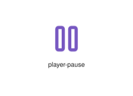
</div>
</div>

{{#endtab}}
{{#tab name="Code"}}

```xml
{{#include ../samples/icons/Tabler-Icons/player-pause-3c710d5d.xal}}
```

{{#endtab}}
{{#endtabs}}

<div class="xal-ref-tag"><code>&lt;item id=&#34;103799&#34; /&gt;</code></div>

</div>
<div class="xal-ref-card">
<div class="xal-ref-title">player-play</div>

{{#tabs name="svg-ref-3800"}}
{{#tab name="Preview"}}
<div class="xal-ref-preview">
<div>

</div>
</div>

{{#endtab}}
{{#tab name="Code"}}

```xml
{{#include ../samples/icons/Tabler-Icons/player-play-f11573e1.xal}}
```

{{#endtab}}
{{#endtabs}}

<div class="xal-ref-tag"><code>&lt;item id=&#34;103800&#34; /&gt;</code></div>

</div>
<div class="xal-ref-card">
<div class="xal-ref-title">player-record</div>

{{#tabs name="svg-ref-3801"}}
{{#tab name="Preview"}}
<div class="xal-ref-preview">
<div>

</div>
</div>

{{#endtab}}
{{#tab name="Code"}}

```xml
{{#include ../samples/icons/Tabler-Icons/player-record-37644c5a.xal}}
```

{{#endtab}}
{{#endtabs}}

<div class="xal-ref-tag"><code>&lt;item id=&#34;103801&#34; /&gt;</code></div>

</div>
<div class="xal-ref-card">
<div class="xal-ref-title">player-skip-back</div>

{{#tabs name="svg-ref-3802"}}
{{#tab name="Preview"}}
<div class="xal-ref-preview">
<div>

</div>
</div>

{{#endtab}}
{{#tab name="Code"}}

```xml
{{#include ../samples/icons/Tabler-Icons/player-skip-back-d0ad675c.xal}}
```

{{#endtab}}
{{#endtabs}}

<div class="xal-ref-tag"><code>&lt;item id=&#34;103802&#34; /&gt;</code></div>

</div>
<div class="xal-ref-card">
<div class="xal-ref-title">player-skip-forward</div>

{{#tabs name="svg-ref-3803"}}
{{#tab name="Preview"}}
<div class="xal-ref-preview">
<div>

</div>
</div>

{{#endtab}}
{{#tab name="Code"}}

```xml
{{#include ../samples/icons/Tabler-Icons/player-skip-forward-5fa4e4a6.xal}}
```

{{#endtab}}
{{#endtabs}}

<div class="xal-ref-tag"><code>&lt;item id=&#34;103803&#34; /&gt;</code></div>

</div>
<div class="xal-ref-card">
<div class="xal-ref-title">player-stop</div>

{{#tabs name="svg-ref-3804"}}
{{#tab name="Preview"}}
<div class="xal-ref-preview">
<div>
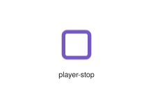
</div>
</div>

{{#endtab}}
{{#tab name="Code"}}

```xml
{{#include ../samples/icons/Tabler-Icons/player-stop-1cb1a5aa.xal}}
```

{{#endtab}}
{{#endtabs}}

<div class="xal-ref-tag"><code>&lt;item id=&#34;103804&#34; /&gt;</code></div>

</div>
<div class="xal-ref-card">
<div class="xal-ref-title">player-track-next</div>

{{#tabs name="svg-ref-3805"}}
{{#tab name="Preview"}}
<div class="xal-ref-preview">
<div>

</div>
</div>

{{#endtab}}
{{#tab name="Code"}}

```xml
{{#include ../samples/icons/Tabler-Icons/player-track-next-b7757474.xal}}
```

{{#endtab}}
{{#endtabs}}

<div class="xal-ref-tag"><code>&lt;item id=&#34;103805&#34; /&gt;</code></div>

</div>
<div class="xal-ref-card">
<div class="xal-ref-title">player-track-prev</div>

{{#tabs name="svg-ref-3806"}}
{{#tab name="Preview"}}
<div class="xal-ref-preview">
<div>

</div>
</div>

{{#endtab}}
{{#tab name="Code"}}

```xml
{{#include ../samples/icons/Tabler-Icons/player-track-prev-b9b5b708.xal}}
```

{{#endtab}}
{{#endtabs}}

<div class="xal-ref-tag"><code>&lt;item id=&#34;103806&#34; /&gt;</code></div>

</div>
<div class="xal-ref-card">
<div class="xal-ref-title">playlist-add</div>

{{#tabs name="svg-ref-3807"}}
{{#tab name="Preview"}}
<div class="xal-ref-preview">
<div>
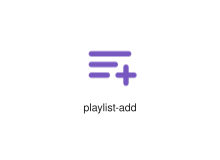
</div>
</div>

{{#endtab}}
{{#tab name="Code"}}

```xml
{{#include ../samples/icons/Tabler-Icons/playlist-add-182ee758.xal}}
```

{{#endtab}}
{{#endtabs}}

<div class="xal-ref-tag"><code>&lt;item id=&#34;103808&#34; /&gt;</code></div>

</div>
<div class="xal-ref-card">
<div class="xal-ref-title">playlist-off</div>

{{#tabs name="svg-ref-3808"}}
{{#tab name="Preview"}}
<div class="xal-ref-preview">
<div>

</div>
</div>

{{#endtab}}
{{#tab name="Code"}}

```xml
{{#include ../samples/icons/Tabler-Icons/playlist-off-7f196e6e.xal}}
```

{{#endtab}}
{{#endtabs}}

<div class="xal-ref-tag"><code>&lt;item id=&#34;103809&#34; /&gt;</code></div>

</div>
<div class="xal-ref-card">
<div class="xal-ref-title">playlist-x</div>

{{#tabs name="svg-ref-3809"}}
{{#tab name="Preview"}}
<div class="xal-ref-preview">
<div>
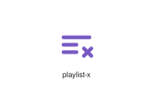
</div>
</div>

{{#endtab}}
{{#tab name="Code"}}

```xml
{{#include ../samples/icons/Tabler-Icons/playlist-x-24159364.xal}}
```

{{#endtab}}
{{#endtabs}}

<div class="xal-ref-tag"><code>&lt;item id=&#34;103810&#34; /&gt;</code></div>

</div>
<div class="xal-ref-card">
<div class="xal-ref-title">playlist</div>

{{#tabs name="svg-ref-3810"}}
{{#tab name="Preview"}}
<div class="xal-ref-preview">
<div>

</div>
</div>

{{#endtab}}
{{#tab name="Code"}}

```xml
{{#include ../samples/icons/Tabler-Icons/playlist-f2eacb96.xal}}
```

{{#endtab}}
{{#endtabs}}

<div class="xal-ref-tag"><code>&lt;item id=&#34;103807&#34; /&gt;</code></div>

</div>
<div class="xal-ref-card">
<div class="xal-ref-title">playstation-circle</div>

{{#tabs name="svg-ref-3811"}}
{{#tab name="Preview"}}
<div class="xal-ref-preview">
<div>

</div>
</div>

{{#endtab}}
{{#tab name="Code"}}

```xml
{{#include ../samples/icons/Tabler-Icons/playstation-circle-70e40505.xal}}
```

{{#endtab}}
{{#endtabs}}

<div class="xal-ref-tag"><code>&lt;item id=&#34;103811&#34; /&gt;</code></div>

</div>
<div class="xal-ref-card">
<div class="xal-ref-title">playstation-square</div>

{{#tabs name="svg-ref-3812"}}
{{#tab name="Preview"}}
<div class="xal-ref-preview">
<div>
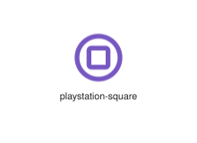
</div>
</div>

{{#endtab}}
{{#tab name="Code"}}

```xml
{{#include ../samples/icons/Tabler-Icons/playstation-square-e4d41f5f.xal}}
```

{{#endtab}}
{{#endtabs}}

<div class="xal-ref-tag"><code>&lt;item id=&#34;103812&#34; /&gt;</code></div>

</div>
<div class="xal-ref-card">
<div class="xal-ref-title">playstation-triangle</div>

{{#tabs name="svg-ref-3813"}}
{{#tab name="Preview"}}
<div class="xal-ref-preview">
<div>
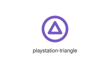
</div>
</div>

{{#endtab}}
{{#tab name="Code"}}

```xml
{{#include ../samples/icons/Tabler-Icons/playstation-triangle-8f84aecf.xal}}
```

{{#endtab}}
{{#endtabs}}

<div class="xal-ref-tag"><code>&lt;item id=&#34;103813&#34; /&gt;</code></div>

</div>
<div class="xal-ref-card">
<div class="xal-ref-title">playstation-x</div>

{{#tabs name="svg-ref-3814"}}
{{#tab name="Preview"}}
<div class="xal-ref-preview">
<div>

</div>
</div>

{{#endtab}}
{{#tab name="Code"}}

```xml
{{#include ../samples/icons/Tabler-Icons/playstation-x-52d3469c.xal}}
```

{{#endtab}}
{{#endtabs}}

<div class="xal-ref-tag"><code>&lt;item id=&#34;103814&#34; /&gt;</code></div>

</div>
<div class="xal-ref-card">
<div class="xal-ref-title">plug-connected-x</div>

{{#tabs name="svg-ref-3815"}}
{{#tab name="Preview"}}
<div class="xal-ref-preview">
<div>

</div>
</div>

{{#endtab}}
{{#tab name="Code"}}

```xml
{{#include ../samples/icons/Tabler-Icons/plug-connected-x-9ae5dda2.xal}}
```

{{#endtab}}
{{#endtabs}}

<div class="xal-ref-tag"><code>&lt;item id=&#34;103817&#34; /&gt;</code></div>

</div>
<div class="xal-ref-card">
<div class="xal-ref-title">plug-connected</div>

{{#tabs name="svg-ref-3816"}}
{{#tab name="Preview"}}
<div class="xal-ref-preview">
<div>
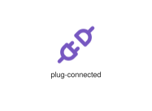
</div>
</div>

{{#endtab}}
{{#tab name="Code"}}

```xml
{{#include ../samples/icons/Tabler-Icons/plug-connected-7870dcc9.xal}}
```

{{#endtab}}
{{#endtabs}}

<div class="xal-ref-tag"><code>&lt;item id=&#34;103816&#34; /&gt;</code></div>

</div>
<div class="xal-ref-card">
<div class="xal-ref-title">plug-off</div>

{{#tabs name="svg-ref-3817"}}
{{#tab name="Preview"}}
<div class="xal-ref-preview">
<div>

</div>
</div>

{{#endtab}}
{{#tab name="Code"}}

```xml
{{#include ../samples/icons/Tabler-Icons/plug-off-7771d364.xal}}
```

{{#endtab}}
{{#endtabs}}

<div class="xal-ref-tag"><code>&lt;item id=&#34;103818&#34; /&gt;</code></div>

</div>
<div class="xal-ref-card">
<div class="xal-ref-title">plug-x</div>

{{#tabs name="svg-ref-3818"}}
{{#tab name="Preview"}}
<div class="xal-ref-preview">
<div>
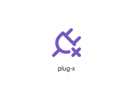
</div>
</div>

{{#endtab}}
{{#tab name="Code"}}

```xml
{{#include ../samples/icons/Tabler-Icons/plug-x-a465cda3.xal}}
```

{{#endtab}}
{{#endtabs}}

<div class="xal-ref-tag"><code>&lt;item id=&#34;103819&#34; /&gt;</code></div>

</div>
<div class="xal-ref-card">
<div class="xal-ref-title">plug</div>

{{#tabs name="svg-ref-3819"}}
{{#tab name="Preview"}}
<div class="xal-ref-preview">
<div>
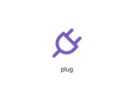
</div>
</div>

{{#endtab}}
{{#tab name="Code"}}

```xml
{{#include ../samples/icons/Tabler-Icons/plug-11cb17cb.xal}}
```

{{#endtab}}
{{#endtabs}}

<div class="xal-ref-tag"><code>&lt;item id=&#34;103815&#34; /&gt;</code></div>

</div>
<div class="xal-ref-card">
<div class="xal-ref-title">plus-equal</div>

{{#tabs name="svg-ref-3820"}}
{{#tab name="Preview"}}
<div class="xal-ref-preview">
<div>
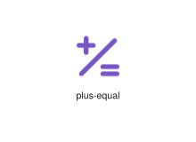
</div>
</div>

{{#endtab}}
{{#tab name="Code"}}

```xml
{{#include ../samples/icons/Tabler-Icons/plus-equal-57407575.xal}}
```

{{#endtab}}
{{#endtabs}}

<div class="xal-ref-tag"><code>&lt;item id=&#34;103821&#34; /&gt;</code></div>

</div>
<div class="xal-ref-card">
<div class="xal-ref-title">plus-minus</div>

{{#tabs name="svg-ref-3821"}}
{{#tab name="Preview"}}
<div class="xal-ref-preview">
<div>
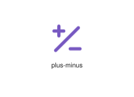
</div>
</div>

{{#endtab}}
{{#tab name="Code"}}

```xml
{{#include ../samples/icons/Tabler-Icons/plus-minus-5ce87519.xal}}
```

{{#endtab}}
{{#endtabs}}

<div class="xal-ref-tag"><code>&lt;item id=&#34;103822&#34; /&gt;</code></div>

</div>
<div class="xal-ref-card">
<div class="xal-ref-title">plus</div>

{{#tabs name="svg-ref-3822"}}
{{#tab name="Preview"}}
<div class="xal-ref-preview">
<div>
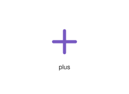
</div>
</div>

{{#endtab}}
{{#tab name="Code"}}

```xml
{{#include ../samples/icons/Tabler-Icons/plus-84ab2689.xal}}
```

{{#endtab}}
{{#endtabs}}

<div class="xal-ref-tag"><code>&lt;item id=&#34;103820&#34; /&gt;</code></div>

</div>
<div class="xal-ref-card">
<div class="xal-ref-title">png</div>

{{#tabs name="svg-ref-3823"}}
{{#tab name="Preview"}}
<div class="xal-ref-preview">
<div>
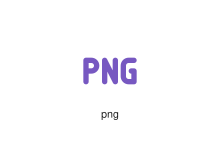
</div>
</div>

{{#endtab}}
{{#tab name="Code"}}

```xml
{{#include ../samples/icons/Tabler-Icons/png-0721fc90.xal}}
```

{{#endtab}}
{{#endtabs}}

<div class="xal-ref-tag"><code>&lt;item id=&#34;103823&#34; /&gt;</code></div>

</div>
<div class="xal-ref-card">
<div class="xal-ref-title">podium-off</div>

{{#tabs name="svg-ref-3824"}}
{{#tab name="Preview"}}
<div class="xal-ref-preview">
<div>
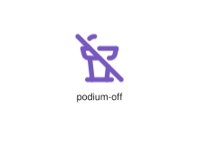
</div>
</div>

{{#endtab}}
{{#tab name="Code"}}

```xml
{{#include ../samples/icons/Tabler-Icons/podium-off-b6e74dd3.xal}}
```

{{#endtab}}
{{#endtabs}}

<div class="xal-ref-tag"><code>&lt;item id=&#34;103825&#34; /&gt;</code></div>

</div>
<div class="xal-ref-card">
<div class="xal-ref-title">podium</div>

{{#tabs name="svg-ref-3825"}}
{{#tab name="Preview"}}
<div class="xal-ref-preview">
<div>
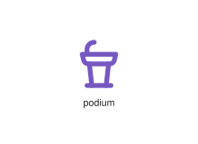
</div>
</div>

{{#endtab}}
{{#tab name="Code"}}

```xml
{{#include ../samples/icons/Tabler-Icons/podium-351b29e6.xal}}
```

{{#endtab}}
{{#endtabs}}

<div class="xal-ref-tag"><code>&lt;item id=&#34;103824&#34; /&gt;</code></div>

</div>
<div class="xal-ref-card">
<div class="xal-ref-title">point-off</div>

{{#tabs name="svg-ref-3826"}}
{{#tab name="Preview"}}
<div class="xal-ref-preview">
<div>
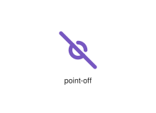
</div>
</div>

{{#endtab}}
{{#tab name="Code"}}

```xml
{{#include ../samples/icons/Tabler-Icons/point-off-403c32b0.xal}}
```

{{#endtab}}
{{#endtabs}}

<div class="xal-ref-tag"><code>&lt;item id=&#34;103827&#34; /&gt;</code></div>

</div>
<div class="xal-ref-card">
<div class="xal-ref-title">point</div>

{{#tabs name="svg-ref-3827"}}
{{#tab name="Preview"}}
<div class="xal-ref-preview">
<div>
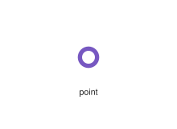
</div>
</div>

{{#endtab}}
{{#tab name="Code"}}

```xml
{{#include ../samples/icons/Tabler-Icons/point-1a5b8a26.xal}}
```

{{#endtab}}
{{#endtabs}}

<div class="xal-ref-tag"><code>&lt;item id=&#34;103826&#34; /&gt;</code></div>

</div>
<div class="xal-ref-card">
<div class="xal-ref-title">pointer-bolt</div>

{{#tabs name="svg-ref-3828"}}
{{#tab name="Preview"}}
<div class="xal-ref-preview">
<div>

</div>
</div>

{{#endtab}}
{{#tab name="Code"}}

```xml
{{#include ../samples/icons/Tabler-Icons/pointer-bolt-ee7218b0.xal}}
```

{{#endtab}}
{{#endtabs}}

<div class="xal-ref-tag"><code>&lt;item id=&#34;103829&#34; /&gt;</code></div>

</div>
<div class="xal-ref-card">
<div class="xal-ref-title">pointer-cancel</div>

{{#tabs name="svg-ref-3829"}}
{{#tab name="Preview"}}
<div class="xal-ref-preview">
<div>

</div>
</div>

{{#endtab}}
{{#tab name="Code"}}

```xml
{{#include ../samples/icons/Tabler-Icons/pointer-cancel-49262364.xal}}
```

{{#endtab}}
{{#endtabs}}

<div class="xal-ref-tag"><code>&lt;item id=&#34;103830&#34; /&gt;</code></div>

</div>
<div class="xal-ref-card">
<div class="xal-ref-title">pointer-check</div>

{{#tabs name="svg-ref-3830"}}
{{#tab name="Preview"}}
<div class="xal-ref-preview">
<div>

</div>
</div>

{{#endtab}}
{{#tab name="Code"}}

```xml
{{#include ../samples/icons/Tabler-Icons/pointer-check-a0c851f5.xal}}
```

{{#endtab}}
{{#endtabs}}

<div class="xal-ref-tag"><code>&lt;item id=&#34;103831&#34; /&gt;</code></div>

</div>
<div class="xal-ref-card">
<div class="xal-ref-title">pointer-code</div>

{{#tabs name="svg-ref-3831"}}
{{#tab name="Preview"}}
<div class="xal-ref-preview">
<div>
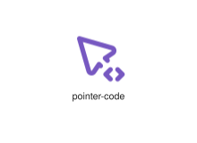
</div>
</div>

{{#endtab}}
{{#tab name="Code"}}

```xml
{{#include ../samples/icons/Tabler-Icons/pointer-code-930b2471.xal}}
```

{{#endtab}}
{{#endtabs}}

<div class="xal-ref-tag"><code>&lt;item id=&#34;103832&#34; /&gt;</code></div>

</div>
<div class="xal-ref-card">
<div class="xal-ref-title">pointer-cog</div>

{{#tabs name="svg-ref-3832"}}
{{#tab name="Preview"}}
<div class="xal-ref-preview">
<div>

</div>
</div>

{{#endtab}}
{{#tab name="Code"}}

```xml
{{#include ../samples/icons/Tabler-Icons/pointer-cog-75a75074.xal}}
```

{{#endtab}}
{{#endtabs}}

<div class="xal-ref-tag"><code>&lt;item id=&#34;103833&#34; /&gt;</code></div>

</div>
<div class="xal-ref-card">
<div class="xal-ref-title">pointer-dollar</div>

{{#tabs name="svg-ref-3833"}}
{{#tab name="Preview"}}
<div class="xal-ref-preview">
<div>

</div>
</div>

{{#endtab}}
{{#tab name="Code"}}

```xml
{{#include ../samples/icons/Tabler-Icons/pointer-dollar-9314ffee.xal}}
```

{{#endtab}}
{{#endtabs}}

<div class="xal-ref-tag"><code>&lt;item id=&#34;103834&#34; /&gt;</code></div>

</div>
<div class="xal-ref-card">
<div class="xal-ref-title">pointer-down</div>

{{#tabs name="svg-ref-3834"}}
{{#tab name="Preview"}}
<div class="xal-ref-preview">
<div>

</div>
</div>

{{#endtab}}
{{#tab name="Code"}}

```xml
{{#include ../samples/icons/Tabler-Icons/pointer-down-6b5c6c4c.xal}}
```

{{#endtab}}
{{#endtabs}}

<div class="xal-ref-tag"><code>&lt;item id=&#34;103835&#34; /&gt;</code></div>

</div>
<div class="xal-ref-card">
<div class="xal-ref-title">pointer-exclamation</div>

{{#tabs name="svg-ref-3835"}}
{{#tab name="Preview"}}
<div class="xal-ref-preview">
<div>

</div>
</div>

{{#endtab}}
{{#tab name="Code"}}

```xml
{{#include ../samples/icons/Tabler-Icons/pointer-exclamation-69115e15.xal}}
```

{{#endtab}}
{{#endtabs}}

<div class="xal-ref-tag"><code>&lt;item id=&#34;103836&#34; /&gt;</code></div>

</div>
<div class="xal-ref-card">
<div class="xal-ref-title">pointer-heart</div>

{{#tabs name="svg-ref-3836"}}
{{#tab name="Preview"}}
<div class="xal-ref-preview">
<div>

</div>
</div>

{{#endtab}}
{{#tab name="Code"}}

```xml
{{#include ../samples/icons/Tabler-Icons/pointer-heart-67ed2f87.xal}}
```

{{#endtab}}
{{#endtabs}}

<div class="xal-ref-tag"><code>&lt;item id=&#34;103837&#34; /&gt;</code></div>

</div>
<div class="xal-ref-card">
<div class="xal-ref-title">pointer-minus</div>

{{#tabs name="svg-ref-3837"}}
{{#tab name="Preview"}}
<div class="xal-ref-preview">
<div>

</div>
</div>

{{#endtab}}
{{#tab name="Code"}}

```xml
{{#include ../samples/icons/Tabler-Icons/pointer-minus-23b8e3c6.xal}}
```

{{#endtab}}
{{#endtabs}}

<div class="xal-ref-tag"><code>&lt;item id=&#34;103838&#34; /&gt;</code></div>

</div>
<div class="xal-ref-card">
<div class="xal-ref-title">pointer-off</div>

{{#tabs name="svg-ref-3838"}}
{{#tab name="Preview"}}
<div class="xal-ref-preview">
<div>

</div>
</div>

{{#endtab}}
{{#tab name="Code"}}

```xml
{{#include ../samples/icons/Tabler-Icons/pointer-off-a8684278.xal}}
```

{{#endtab}}
{{#endtabs}}

<div class="xal-ref-tag"><code>&lt;item id=&#34;103839&#34; /&gt;</code></div>

</div>
<div class="xal-ref-card">
<div class="xal-ref-title">pointer-pause</div>

{{#tabs name="svg-ref-3839"}}
{{#tab name="Preview"}}
<div class="xal-ref-preview">
<div>

</div>
</div>

{{#endtab}}
{{#tab name="Code"}}

```xml
{{#include ../samples/icons/Tabler-Icons/pointer-pause-f1f2145e.xal}}
```

{{#endtab}}
{{#endtabs}}

<div class="xal-ref-tag"><code>&lt;item id=&#34;103840&#34; /&gt;</code></div>

</div>
<div class="xal-ref-card">
<div class="xal-ref-title">pointer-pin</div>

{{#tabs name="svg-ref-3840"}}
{{#tab name="Preview"}}
<div class="xal-ref-preview">
<div>

</div>
</div>

{{#endtab}}
{{#tab name="Code"}}

```xml
{{#include ../samples/icons/Tabler-Icons/pointer-pin-f8d8574b.xal}}
```

{{#endtab}}
{{#endtabs}}

<div class="xal-ref-tag"><code>&lt;item id=&#34;103841&#34; /&gt;</code></div>

</div>
<div class="xal-ref-card">
<div class="xal-ref-title">pointer-plus</div>

{{#tabs name="svg-ref-3841"}}
{{#tab name="Preview"}}
<div class="xal-ref-preview">
<div>

</div>
</div>

{{#endtab}}
{{#tab name="Code"}}

```xml
{{#include ../samples/icons/Tabler-Icons/pointer-plus-77fdbb38.xal}}
```

{{#endtab}}
{{#endtabs}}

<div class="xal-ref-tag"><code>&lt;item id=&#34;103842&#34; /&gt;</code></div>

</div>
<div class="xal-ref-card">
<div class="xal-ref-title">pointer-question</div>

{{#tabs name="svg-ref-3842"}}
{{#tab name="Preview"}}
<div class="xal-ref-preview">
<div>

</div>
</div>

{{#endtab}}
{{#tab name="Code"}}

```xml
{{#include ../samples/icons/Tabler-Icons/pointer-question-497b6b26.xal}}
```

{{#endtab}}
{{#endtabs}}

<div class="xal-ref-tag"><code>&lt;item id=&#34;103843&#34; /&gt;</code></div>

</div>
<div class="xal-ref-card">
<div class="xal-ref-title">pointer-search</div>

{{#tabs name="svg-ref-3843"}}
{{#tab name="Preview"}}
<div class="xal-ref-preview">
<div>

</div>
</div>

{{#endtab}}
{{#tab name="Code"}}

```xml
{{#include ../samples/icons/Tabler-Icons/pointer-search-0834338b.xal}}
```

{{#endtab}}
{{#endtabs}}

<div class="xal-ref-tag"><code>&lt;item id=&#34;103844&#34; /&gt;</code></div>

</div>
<div class="xal-ref-card">
<div class="xal-ref-title">pointer-share</div>

{{#tabs name="svg-ref-3844"}}
{{#tab name="Preview"}}
<div class="xal-ref-preview">
<div>

</div>
</div>

{{#endtab}}
{{#tab name="Code"}}

```xml
{{#include ../samples/icons/Tabler-Icons/pointer-share-8ffd58c8.xal}}
```

{{#endtab}}
{{#endtabs}}

<div class="xal-ref-tag"><code>&lt;item id=&#34;103845&#34; /&gt;</code></div>

</div>
<div class="xal-ref-card">
<div class="xal-ref-title">pointer-star</div>

{{#tabs name="svg-ref-3845"}}
{{#tab name="Preview"}}
<div class="xal-ref-preview">
<div>

</div>
</div>

{{#endtab}}
{{#tab name="Code"}}

```xml
{{#include ../samples/icons/Tabler-Icons/pointer-star-0864074f.xal}}
```

{{#endtab}}
{{#endtabs}}

<div class="xal-ref-tag"><code>&lt;item id=&#34;103846&#34; /&gt;</code></div>

</div>
<div class="xal-ref-card">
<div class="xal-ref-title">pointer-up</div>

{{#tabs name="svg-ref-3846"}}
{{#tab name="Preview"}}
<div class="xal-ref-preview">
<div>

</div>
</div>

{{#endtab}}
{{#tab name="Code"}}

```xml
{{#include ../samples/icons/Tabler-Icons/pointer-up-601907b5.xal}}
```

{{#endtab}}
{{#endtabs}}

<div class="xal-ref-tag"><code>&lt;item id=&#34;103847&#34; /&gt;</code></div>

</div>
<div class="xal-ref-card">
<div class="xal-ref-title">pointer-x</div>

{{#tabs name="svg-ref-3847"}}
{{#tab name="Preview"}}
<div class="xal-ref-preview">
<div>
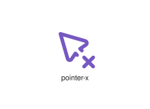
</div>
</div>

{{#endtab}}
{{#tab name="Code"}}

```xml
{{#include ../samples/icons/Tabler-Icons/pointer-x-0602c5aa.xal}}
```

{{#endtab}}
{{#endtabs}}

<div class="xal-ref-tag"><code>&lt;item id=&#34;103848&#34; /&gt;</code></div>

</div>
<div class="xal-ref-card">
<div class="xal-ref-title">pointer</div>

{{#tabs name="svg-ref-3848"}}
{{#tab name="Preview"}}
<div class="xal-ref-preview">
<div>

</div>
</div>

{{#endtab}}
{{#tab name="Code"}}

```xml
{{#include ../samples/icons/Tabler-Icons/pointer-68b034cb.xal}}
```

{{#endtab}}
{{#endtabs}}

<div class="xal-ref-tag"><code>&lt;item id=&#34;103828&#34; /&gt;</code></div>

</div>
<div class="xal-ref-card">
<div class="xal-ref-title">pokeball-off</div>

{{#tabs name="svg-ref-3849"}}
{{#tab name="Preview"}}
<div class="xal-ref-preview">
<div>
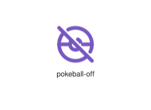
</div>
</div>

{{#endtab}}
{{#tab name="Code"}}

```xml
{{#include ../samples/icons/Tabler-Icons/pokeball-off-00a1c9fa.xal}}
```

{{#endtab}}
{{#endtabs}}

<div class="xal-ref-tag"><code>&lt;item id=&#34;103850&#34; /&gt;</code></div>

</div>
<div class="xal-ref-card">
<div class="xal-ref-title">pokeball</div>

{{#tabs name="svg-ref-3850"}}
{{#tab name="Preview"}}
<div class="xal-ref-preview">
<div>
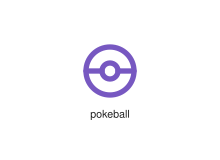
</div>
</div>

{{#endtab}}
{{#tab name="Code"}}

```xml
{{#include ../samples/icons/Tabler-Icons/pokeball-b2abbc63.xal}}
```

{{#endtab}}
{{#endtabs}}

<div class="xal-ref-tag"><code>&lt;item id=&#34;103849&#34; /&gt;</code></div>

</div>
<div class="xal-ref-card">
<div class="xal-ref-title">poker-chip</div>

{{#tabs name="svg-ref-3851"}}
{{#tab name="Preview"}}
<div class="xal-ref-preview">
<div>
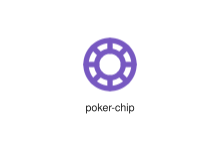
</div>
</div>

{{#endtab}}
{{#tab name="Code"}}

```xml
{{#include ../samples/icons/Tabler-Icons/poker-chip-156166bd.xal}}
```

{{#endtab}}
{{#endtabs}}

<div class="xal-ref-tag"><code>&lt;item id=&#34;103851&#34; /&gt;</code></div>

</div>
<div class="xal-ref-card">
<div class="xal-ref-title">polaroid</div>

{{#tabs name="svg-ref-3852"}}
{{#tab name="Preview"}}
<div class="xal-ref-preview">
<div>
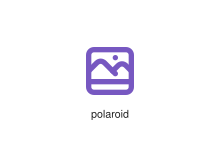
</div>
</div>

{{#endtab}}
{{#tab name="Code"}}

```xml
{{#include ../samples/icons/Tabler-Icons/polaroid-41a26612.xal}}
```

{{#endtab}}
{{#endtabs}}

<div class="xal-ref-tag"><code>&lt;item id=&#34;103852&#34; /&gt;</code></div>

</div>
<div class="xal-ref-card">
<div class="xal-ref-title">polygon-off</div>

{{#tabs name="svg-ref-3853"}}
{{#tab name="Preview"}}
<div class="xal-ref-preview">
<div>

</div>
</div>

{{#endtab}}
{{#tab name="Code"}}

```xml
{{#include ../samples/icons/Tabler-Icons/polygon-off-a705767e.xal}}
```

{{#endtab}}
{{#endtabs}}

<div class="xal-ref-tag"><code>&lt;item id=&#34;103854&#34; /&gt;</code></div>

</div>
<div class="xal-ref-card">
<div class="xal-ref-title">polygon</div>

{{#tabs name="svg-ref-3854"}}
{{#tab name="Preview"}}
<div class="xal-ref-preview">
<div>
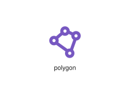
</div>
</div>

{{#endtab}}
{{#tab name="Code"}}

```xml
{{#include ../samples/icons/Tabler-Icons/polygon-06e49600.xal}}
```

{{#endtab}}
{{#endtabs}}

<div class="xal-ref-tag"><code>&lt;item id=&#34;103853&#34; /&gt;</code></div>

</div>
<div class="xal-ref-card">
<div class="xal-ref-title">poo</div>

{{#tabs name="svg-ref-3855"}}
{{#tab name="Preview"}}
<div class="xal-ref-preview">
<div>

</div>
</div>

{{#endtab}}
{{#tab name="Code"}}

```xml
{{#include ../samples/icons/Tabler-Icons/poo-fc0d64f4.xal}}
```

{{#endtab}}
{{#endtabs}}

<div class="xal-ref-tag"><code>&lt;item id=&#34;103855&#34; /&gt;</code></div>

</div>
<div class="xal-ref-card">
<div class="xal-ref-title">pool-off</div>

{{#tabs name="svg-ref-3856"}}
{{#tab name="Preview"}}
<div class="xal-ref-preview">
<div>
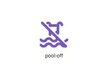
</div>
</div>

{{#endtab}}
{{#tab name="Code"}}

```xml
{{#include ../samples/icons/Tabler-Icons/pool-off-5c4a3a99.xal}}
```

{{#endtab}}
{{#endtabs}}

<div class="xal-ref-tag"><code>&lt;item id=&#34;103857&#34; /&gt;</code></div>

</div>
<div class="xal-ref-card">
<div class="xal-ref-title">pool</div>

{{#tabs name="svg-ref-3857"}}
{{#tab name="Preview"}}
<div class="xal-ref-preview">
<div>
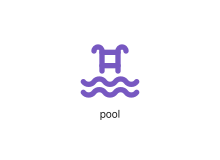
</div>
</div>

{{#endtab}}
{{#tab name="Code"}}

```xml
{{#include ../samples/icons/Tabler-Icons/pool-f5be1dba.xal}}
```

{{#endtab}}
{{#endtabs}}

<div class="xal-ref-tag"><code>&lt;item id=&#34;103856&#34; /&gt;</code></div>

</div>
<div class="xal-ref-card">
<div class="xal-ref-title">power</div>

{{#tabs name="svg-ref-3858"}}
{{#tab name="Preview"}}
<div class="xal-ref-preview">
<div>
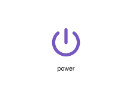
</div>
</div>

{{#endtab}}
{{#tab name="Code"}}

```xml
{{#include ../samples/icons/Tabler-Icons/power-c83d68d6.xal}}
```

{{#endtab}}
{{#endtabs}}

<div class="xal-ref-tag"><code>&lt;item id=&#34;103858&#34; /&gt;</code></div>

</div>
<div class="xal-ref-card">
<div class="xal-ref-title">pray</div>

{{#tabs name="svg-ref-3859"}}
{{#tab name="Preview"}}
<div class="xal-ref-preview">
<div>
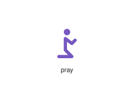
</div>
</div>

{{#endtab}}
{{#tab name="Code"}}

```xml
{{#include ../samples/icons/Tabler-Icons/pray-61bd9936.xal}}
```

{{#endtab}}
{{#endtabs}}

<div class="xal-ref-tag"><code>&lt;item id=&#34;103859&#34; /&gt;</code></div>

</div>
<div class="xal-ref-card">
<div class="xal-ref-title">premium-rights</div>

{{#tabs name="svg-ref-3860"}}
{{#tab name="Preview"}}
<div class="xal-ref-preview">
<div>

</div>
</div>

{{#endtab}}
{{#tab name="Code"}}

```xml
{{#include ../samples/icons/Tabler-Icons/premium-rights-a593eea8.xal}}
```

{{#endtab}}
{{#endtabs}}

<div class="xal-ref-tag"><code>&lt;item id=&#34;103860&#34; /&gt;</code></div>

</div>
<div class="xal-ref-card">
<div class="xal-ref-title">prescription</div>

{{#tabs name="svg-ref-3861"}}
{{#tab name="Preview"}}
<div class="xal-ref-preview">
<div>

</div>
</div>

{{#endtab}}
{{#tab name="Code"}}

```xml
{{#include ../samples/icons/Tabler-Icons/prescription-591e5b64.xal}}
```

{{#endtab}}
{{#endtabs}}

<div class="xal-ref-tag"><code>&lt;item id=&#34;103861&#34; /&gt;</code></div>

</div>
<div class="xal-ref-card">
<div class="xal-ref-title">presentation-analytics</div>

{{#tabs name="svg-ref-3862"}}
{{#tab name="Preview"}}
<div class="xal-ref-preview">
<div>
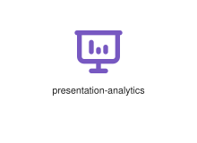
</div>
</div>

{{#endtab}}
{{#tab name="Code"}}

```xml
{{#include ../samples/icons/Tabler-Icons/presentation-analytics-ef5b6c92.xal}}
```

{{#endtab}}
{{#endtabs}}

<div class="xal-ref-tag"><code>&lt;item id=&#34;103863&#34; /&gt;</code></div>

</div>
<div class="xal-ref-card">
<div class="xal-ref-title">presentation-off</div>

{{#tabs name="svg-ref-3863"}}
{{#tab name="Preview"}}
<div class="xal-ref-preview">
<div>

</div>
</div>

{{#endtab}}
{{#tab name="Code"}}

```xml
{{#include ../samples/icons/Tabler-Icons/presentation-off-756e3a4c.xal}}
```

{{#endtab}}
{{#endtabs}}

<div class="xal-ref-tag"><code>&lt;item id=&#34;103864&#34; /&gt;</code></div>

</div>
<div class="xal-ref-card">
<div class="xal-ref-title">presentation</div>

{{#tabs name="svg-ref-3864"}}
{{#tab name="Preview"}}
<div class="xal-ref-preview">
<div>
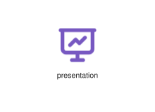
</div>
</div>

{{#endtab}}
{{#tab name="Code"}}

```xml
{{#include ../samples/icons/Tabler-Icons/presentation-7b24f4e2.xal}}
```

{{#endtab}}
{{#endtabs}}

<div class="xal-ref-tag"><code>&lt;item id=&#34;103862&#34; /&gt;</code></div>

</div>
<div class="xal-ref-card">
<div class="xal-ref-title">printer-off</div>

{{#tabs name="svg-ref-3865"}}
{{#tab name="Preview"}}
<div class="xal-ref-preview">
<div>
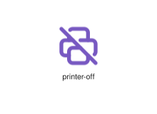
</div>
</div>

{{#endtab}}
{{#tab name="Code"}}

```xml
{{#include ../samples/icons/Tabler-Icons/printer-off-79200e4f.xal}}
```

{{#endtab}}
{{#endtabs}}

<div class="xal-ref-tag"><code>&lt;item id=&#34;103866&#34; /&gt;</code></div>

</div>
<div class="xal-ref-card">
<div class="xal-ref-title">printer</div>

{{#tabs name="svg-ref-3866"}}
{{#tab name="Preview"}}
<div class="xal-ref-preview">
<div>
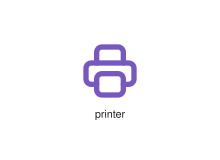
</div>
</div>

{{#endtab}}
{{#tab name="Code"}}

```xml
{{#include ../samples/icons/Tabler-Icons/printer-bae03e93.xal}}
```

{{#endtab}}
{{#endtabs}}

<div class="xal-ref-tag"><code>&lt;item id=&#34;103865&#34; /&gt;</code></div>

</div>
<div class="xal-ref-card">
<div class="xal-ref-title">prism-light</div>

{{#tabs name="svg-ref-3867"}}
{{#tab name="Preview"}}
<div class="xal-ref-preview">
<div>
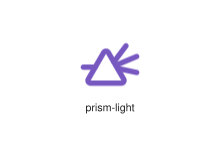
</div>
</div>

{{#endtab}}
{{#tab name="Code"}}

```xml
{{#include ../samples/icons/Tabler-Icons/prism-light-6951e146.xal}}
```

{{#endtab}}
{{#endtabs}}

<div class="xal-ref-tag"><code>&lt;item id=&#34;103868&#34; /&gt;</code></div>

</div>
<div class="xal-ref-card">
<div class="xal-ref-title">prism-off</div>

{{#tabs name="svg-ref-3868"}}
{{#tab name="Preview"}}
<div class="xal-ref-preview">
<div>

</div>
</div>

{{#endtab}}
{{#tab name="Code"}}

```xml
{{#include ../samples/icons/Tabler-Icons/prism-off-00b820d0.xal}}
```

{{#endtab}}
{{#endtabs}}

<div class="xal-ref-tag"><code>&lt;item id=&#34;103869&#34; /&gt;</code></div>

</div>
<div class="xal-ref-card">
<div class="xal-ref-title">prism-plus</div>

{{#tabs name="svg-ref-3869"}}
{{#tab name="Preview"}}
<div class="xal-ref-preview">
<div>
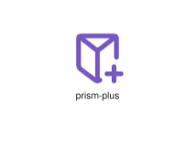
</div>
</div>

{{#endtab}}
{{#tab name="Code"}}

```xml
{{#include ../samples/icons/Tabler-Icons/prism-plus-af584080.xal}}
```

{{#endtab}}
{{#endtabs}}

<div class="xal-ref-tag"><code>&lt;item id=&#34;103870&#34; /&gt;</code></div>

</div>
</div>
