# Tabler-Icons - Page 50

This page references SVG files under `etc/resources/aws/svg/Tabler-Icons`.
Each card shows the SVG preview first and the XAL tag syntax in the Code tab.
Showing 4411-4500 of 4964 SVG files.

<style>
.xal-ref-grid{display:grid;grid-template-columns:repeat(3,minmax(0,1fr));gap:1rem;margin:1rem 0 1.5rem}.xal-ref-card{border:1px solid var(--table-border-color);border-radius:8px;overflow:hidden;background:var(--bg);padding:.75rem}.xal-ref-title{font-size:.9rem;font-weight:600;line-height:1.25;margin:0 0 .5rem;overflow-wrap:anywhere}.xal-ref-preview{display:flex;align-items:center;justify-content:center}.xal-ref-preview img{display:block;width:100%;height:auto}.xal-ref-card pre{margin:0;max-height:18rem;overflow:auto;white-space:pre}.xal-ref-card code{font-size:.78em}.xal-ref-tag{margin:.5rem 0 0;color:var(--fg);opacity:.72;overflow:auto;white-space:pre}.xal-ref-tag code{font-size:.72em}@media(max-width:900px){.xal-ref-grid{grid-template-columns:repeat(2,minmax(0,1fr))}}@media(max-width:560px){.xal-ref-grid{grid-template-columns:1fr}}
</style>

[Back to section index](tabler-icons.md)

<div class="xal-ref-grid">
<div class="xal-ref-card">
<div class="xal-ref-title">square-rounded-letter-p</div>

{{#tabs name="svg-ref-4410"}}
{{#tab name="Preview"}}
<div class="xal-ref-preview">
<div>
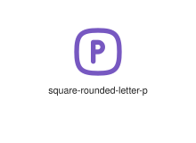
</div>
</div>

{{#endtab}}
{{#tab name="Code"}}

```xml
{{#include ../samples/icons/Tabler-Icons/square-rounded-letter-p-3fa88843.xal}}
```

{{#endtab}}
{{#endtabs}}

<div class="xal-ref-tag"><code>&lt;item id=&#34;104412&#34; /&gt;</code></div>

</div>
<div class="xal-ref-card">
<div class="xal-ref-title">square-rounded-letter-q</div>

{{#tabs name="svg-ref-4411"}}
{{#tab name="Preview"}}
<div class="xal-ref-preview">
<div>
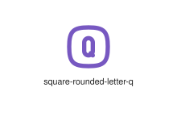
</div>
</div>

{{#endtab}}
{{#tab name="Code"}}

```xml
{{#include ../samples/icons/Tabler-Icons/square-rounded-letter-q-02c8a1f3.xal}}
```

{{#endtab}}
{{#endtabs}}

<div class="xal-ref-tag"><code>&lt;item id=&#34;104413&#34; /&gt;</code></div>

</div>
<div class="xal-ref-card">
<div class="xal-ref-title">square-rounded-letter-r</div>

{{#tabs name="svg-ref-4412"}}
{{#tab name="Preview"}}
<div class="xal-ref-preview">
<div>
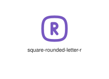
</div>
</div>

{{#endtab}}
{{#tab name="Code"}}

```xml
{{#include ../samples/icons/Tabler-Icons/square-rounded-letter-r-4568db23.xal}}
```

{{#endtab}}
{{#endtabs}}

<div class="xal-ref-tag"><code>&lt;item id=&#34;104414&#34; /&gt;</code></div>

</div>
<div class="xal-ref-card">
<div class="xal-ref-title">square-rounded-letter-s</div>

{{#tabs name="svg-ref-4413"}}
{{#tab name="Preview"}}
<div class="xal-ref-preview">
<div>
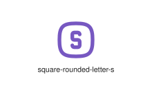
</div>
</div>

{{#endtab}}
{{#tab name="Code"}}

```xml
{{#include ../samples/icons/Tabler-Icons/square-rounded-letter-s-7808f293.xal}}
```

{{#endtab}}
{{#endtabs}}

<div class="xal-ref-tag"><code>&lt;item id=&#34;104415&#34; /&gt;</code></div>

</div>
<div class="xal-ref-card">
<div class="xal-ref-title">square-rounded-letter-t</div>

{{#tabs name="svg-ref-4414"}}
{{#tab name="Preview"}}
<div class="xal-ref-preview">
<div>
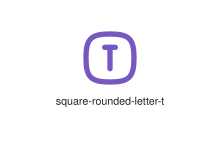
</div>
</div>

{{#endtab}}
{{#tab name="Code"}}

```xml
{{#include ../samples/icons/Tabler-Icons/square-rounded-letter-t-ca282e83.xal}}
```

{{#endtab}}
{{#endtabs}}

<div class="xal-ref-tag"><code>&lt;item id=&#34;104416&#34; /&gt;</code></div>

</div>
<div class="xal-ref-card">
<div class="xal-ref-title">square-rounded-letter-u</div>

{{#tabs name="svg-ref-4415"}}
{{#tab name="Preview"}}
<div class="xal-ref-preview">
<div>
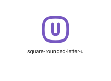
</div>
</div>

{{#endtab}}
{{#tab name="Code"}}

```xml
{{#include ../samples/icons/Tabler-Icons/square-rounded-letter-u-f7480733.xal}}
```

{{#endtab}}
{{#endtabs}}

<div class="xal-ref-tag"><code>&lt;item id=&#34;104417&#34; /&gt;</code></div>

</div>
<div class="xal-ref-card">
<div class="xal-ref-title">square-rounded-letter-v</div>

{{#tabs name="svg-ref-4416"}}
{{#tab name="Preview"}}
<div class="xal-ref-preview">
<div>
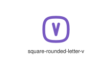
</div>
</div>

{{#endtab}}
{{#tab name="Code"}}

```xml
{{#include ../samples/icons/Tabler-Icons/square-rounded-letter-v-b0e87de3.xal}}
```

{{#endtab}}
{{#endtabs}}

<div class="xal-ref-tag"><code>&lt;item id=&#34;104418&#34; /&gt;</code></div>

</div>
<div class="xal-ref-card">
<div class="xal-ref-title">square-rounded-letter-w</div>

{{#tabs name="svg-ref-4417"}}
{{#tab name="Preview"}}
<div class="xal-ref-preview">
<div>
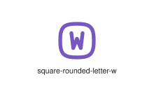
</div>
</div>

{{#endtab}}
{{#tab name="Code"}}

```xml
{{#include ../samples/icons/Tabler-Icons/square-rounded-letter-w-8d885453.xal}}
```

{{#endtab}}
{{#endtabs}}

<div class="xal-ref-tag"><code>&lt;item id=&#34;104419&#34; /&gt;</code></div>

</div>
<div class="xal-ref-card">
<div class="xal-ref-title">square-rounded-letter-x</div>

{{#tabs name="svg-ref-4418"}}
{{#tab name="Preview"}}
<div class="xal-ref-preview">
<div>
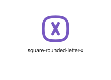
</div>
</div>

{{#endtab}}
{{#tab name="Code"}}

```xml
{{#include ../samples/icons/Tabler-Icons/square-rounded-letter-x-0fd8c382.xal}}
```

{{#endtab}}
{{#endtabs}}

<div class="xal-ref-tag"><code>&lt;item id=&#34;104420&#34; /&gt;</code></div>

</div>
<div class="xal-ref-card">
<div class="xal-ref-title">square-rounded-letter-y</div>

{{#tabs name="svg-ref-4419"}}
{{#tab name="Preview"}}
<div class="xal-ref-preview">
<div>
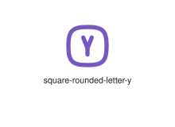
</div>
</div>

{{#endtab}}
{{#tab name="Code"}}

```xml
{{#include ../samples/icons/Tabler-Icons/square-rounded-letter-y-32b8ea32.xal}}
```

{{#endtab}}
{{#endtabs}}

<div class="xal-ref-tag"><code>&lt;item id=&#34;104421&#34; /&gt;</code></div>

</div>
<div class="xal-ref-card">
<div class="xal-ref-title">square-rounded-letter-z</div>

{{#tabs name="svg-ref-4420"}}
{{#tab name="Preview"}}
<div class="xal-ref-preview">
<div>
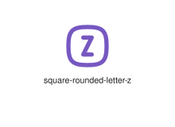
</div>
</div>

{{#endtab}}
{{#tab name="Code"}}

```xml
{{#include ../samples/icons/Tabler-Icons/square-rounded-letter-z-751890e2.xal}}
```

{{#endtab}}
{{#endtabs}}

<div class="xal-ref-tag"><code>&lt;item id=&#34;104422&#34; /&gt;</code></div>

</div>
<div class="xal-ref-card">
<div class="xal-ref-title">square-rounded-minus-2</div>

{{#tabs name="svg-ref-4421"}}
{{#tab name="Preview"}}
<div class="xal-ref-preview">
<div>
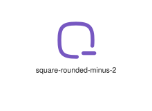
</div>
</div>

{{#endtab}}
{{#tab name="Code"}}

```xml
{{#include ../samples/icons/Tabler-Icons/square-rounded-minus-2-7f051b98.xal}}
```

{{#endtab}}
{{#endtabs}}

<div class="xal-ref-tag"><code>&lt;item id=&#34;104424&#34; /&gt;</code></div>

</div>
<div class="xal-ref-card">
<div class="xal-ref-title">square-rounded-minus</div>

{{#tabs name="svg-ref-4422"}}
{{#tab name="Preview"}}
<div class="xal-ref-preview">
<div>
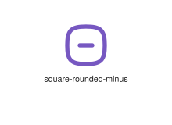
</div>
</div>

{{#endtab}}
{{#tab name="Code"}}

```xml
{{#include ../samples/icons/Tabler-Icons/square-rounded-minus-c8e2e3f7.xal}}
```

{{#endtab}}
{{#endtabs}}

<div class="xal-ref-tag"><code>&lt;item id=&#34;104423&#34; /&gt;</code></div>

</div>
<div class="xal-ref-card">
<div class="xal-ref-title">square-rounded-number-0</div>

{{#tabs name="svg-ref-4423"}}
{{#tab name="Preview"}}
<div class="xal-ref-preview">
<div>
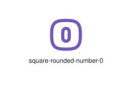
</div>
</div>

{{#endtab}}
{{#tab name="Code"}}

```xml
{{#include ../samples/icons/Tabler-Icons/square-rounded-number-0-21f71b87.xal}}
```

{{#endtab}}
{{#endtabs}}

<div class="xal-ref-tag"><code>&lt;item id=&#34;104425&#34; /&gt;</code></div>

</div>
<div class="xal-ref-card">
<div class="xal-ref-title">square-rounded-number-1</div>

{{#tabs name="svg-ref-4424"}}
{{#tab name="Preview"}}
<div class="xal-ref-preview">
<div>
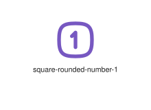
</div>
</div>

{{#endtab}}
{{#tab name="Code"}}

```xml
{{#include ../samples/icons/Tabler-Icons/square-rounded-number-1-1c973237.xal}}
```

{{#endtab}}
{{#endtabs}}

<div class="xal-ref-tag"><code>&lt;item id=&#34;104426&#34; /&gt;</code></div>

</div>
<div class="xal-ref-card">
<div class="xal-ref-title">square-rounded-number-2</div>

{{#tabs name="svg-ref-4425"}}
{{#tab name="Preview"}}
<div class="xal-ref-preview">
<div>
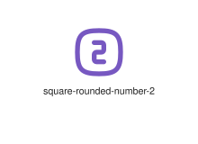
</div>
</div>

{{#endtab}}
{{#tab name="Code"}}

```xml
{{#include ../samples/icons/Tabler-Icons/square-rounded-number-2-5b3748e7.xal}}
```

{{#endtab}}
{{#endtabs}}

<div class="xal-ref-tag"><code>&lt;item id=&#34;104427&#34; /&gt;</code></div>

</div>
<div class="xal-ref-card">
<div class="xal-ref-title">square-rounded-number-3</div>

{{#tabs name="svg-ref-4426"}}
{{#tab name="Preview"}}
<div class="xal-ref-preview">
<div>
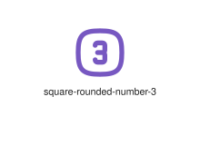
</div>
</div>

{{#endtab}}
{{#tab name="Code"}}

```xml
{{#include ../samples/icons/Tabler-Icons/square-rounded-number-3-66576157.xal}}
```

{{#endtab}}
{{#endtabs}}

<div class="xal-ref-tag"><code>&lt;item id=&#34;104428&#34; /&gt;</code></div>

</div>
<div class="xal-ref-card">
<div class="xal-ref-title">square-rounded-number-4</div>

{{#tabs name="svg-ref-4427"}}
{{#tab name="Preview"}}
<div class="xal-ref-preview">
<div>
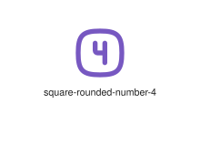
</div>
</div>

{{#endtab}}
{{#tab name="Code"}}

```xml
{{#include ../samples/icons/Tabler-Icons/square-rounded-number-4-d477bd47.xal}}
```

{{#endtab}}
{{#endtabs}}

<div class="xal-ref-tag"><code>&lt;item id=&#34;104429&#34; /&gt;</code></div>

</div>
<div class="xal-ref-card">
<div class="xal-ref-title">square-rounded-number-5</div>

{{#tabs name="svg-ref-4428"}}
{{#tab name="Preview"}}
<div class="xal-ref-preview">
<div>
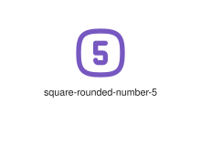
</div>
</div>

{{#endtab}}
{{#tab name="Code"}}

```xml
{{#include ../samples/icons/Tabler-Icons/square-rounded-number-5-e91794f7.xal}}
```

{{#endtab}}
{{#endtabs}}

<div class="xal-ref-tag"><code>&lt;item id=&#34;104430&#34; /&gt;</code></div>

</div>
<div class="xal-ref-card">
<div class="xal-ref-title">square-rounded-number-6</div>

{{#tabs name="svg-ref-4429"}}
{{#tab name="Preview"}}
<div class="xal-ref-preview">
<div>
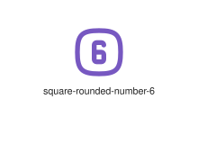
</div>
</div>

{{#endtab}}
{{#tab name="Code"}}

```xml
{{#include ../samples/icons/Tabler-Icons/square-rounded-number-6-aeb7ee27.xal}}
```

{{#endtab}}
{{#endtabs}}

<div class="xal-ref-tag"><code>&lt;item id=&#34;104431&#34; /&gt;</code></div>

</div>
<div class="xal-ref-card">
<div class="xal-ref-title">square-rounded-number-7</div>

{{#tabs name="svg-ref-4430"}}
{{#tab name="Preview"}}
<div class="xal-ref-preview">
<div>
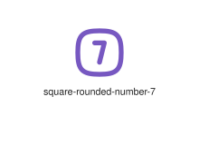
</div>
</div>

{{#endtab}}
{{#tab name="Code"}}

```xml
{{#include ../samples/icons/Tabler-Icons/square-rounded-number-7-93d7c797.xal}}
```

{{#endtab}}
{{#endtabs}}

<div class="xal-ref-tag"><code>&lt;item id=&#34;104432&#34; /&gt;</code></div>

</div>
<div class="xal-ref-card">
<div class="xal-ref-title">square-rounded-number-8</div>

{{#tabs name="svg-ref-4431"}}
{{#tab name="Preview"}}
<div class="xal-ref-preview">
<div>
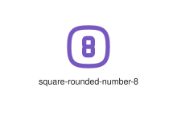
</div>
</div>

{{#endtab}}
{{#tab name="Code"}}

```xml
{{#include ../samples/icons/Tabler-Icons/square-rounded-number-8-11875046.xal}}
```

{{#endtab}}
{{#endtabs}}

<div class="xal-ref-tag"><code>&lt;item id=&#34;104433&#34; /&gt;</code></div>

</div>
<div class="xal-ref-card">
<div class="xal-ref-title">square-rounded-number-9</div>

{{#tabs name="svg-ref-4432"}}
{{#tab name="Preview"}}
<div class="xal-ref-preview">
<div>
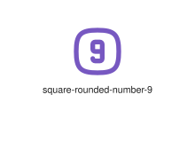
</div>
</div>

{{#endtab}}
{{#tab name="Code"}}

```xml
{{#include ../samples/icons/Tabler-Icons/square-rounded-number-9-2ce779f6.xal}}
```

{{#endtab}}
{{#endtabs}}

<div class="xal-ref-tag"><code>&lt;item id=&#34;104434&#34; /&gt;</code></div>

</div>
<div class="xal-ref-card">
<div class="xal-ref-title">square-rounded-percentage</div>

{{#tabs name="svg-ref-4433"}}
{{#tab name="Preview"}}
<div class="xal-ref-preview">
<div>
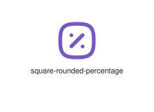
</div>
</div>

{{#endtab}}
{{#tab name="Code"}}

```xml
{{#include ../samples/icons/Tabler-Icons/square-rounded-percentage-e4bf1274.xal}}
```

{{#endtab}}
{{#endtabs}}

<div class="xal-ref-tag"><code>&lt;item id=&#34;104435&#34; /&gt;</code></div>

</div>
<div class="xal-ref-card">
<div class="xal-ref-title">square-rounded-plus-2</div>

{{#tabs name="svg-ref-4434"}}
{{#tab name="Preview"}}
<div class="xal-ref-preview">
<div>
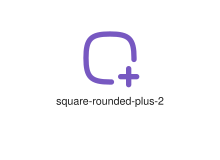
</div>
</div>

{{#endtab}}
{{#tab name="Code"}}

```xml
{{#include ../samples/icons/Tabler-Icons/square-rounded-plus-2-07e2ecfa.xal}}
```

{{#endtab}}
{{#endtabs}}

<div class="xal-ref-tag"><code>&lt;item id=&#34;104437&#34; /&gt;</code></div>

</div>
<div class="xal-ref-card">
<div class="xal-ref-title">square-rounded-plus</div>

{{#tabs name="svg-ref-4435"}}
{{#tab name="Preview"}}
<div class="xal-ref-preview">
<div>
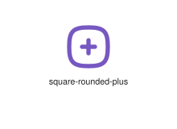
</div>
</div>

{{#endtab}}
{{#tab name="Code"}}

```xml
{{#include ../samples/icons/Tabler-Icons/square-rounded-plus-23cbb5fd.xal}}
```

{{#endtab}}
{{#endtabs}}

<div class="xal-ref-tag"><code>&lt;item id=&#34;104436&#34; /&gt;</code></div>

</div>
<div class="xal-ref-card">
<div class="xal-ref-title">square-rounded-x</div>

{{#tabs name="svg-ref-4436"}}
{{#tab name="Preview"}}
<div class="xal-ref-preview">
<div>
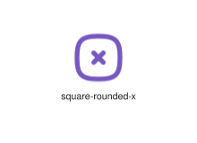
</div>
</div>

{{#endtab}}
{{#tab name="Code"}}

```xml
{{#include ../samples/icons/Tabler-Icons/square-rounded-x-305f9ae1.xal}}
```

{{#endtab}}
{{#endtabs}}

<div class="xal-ref-tag"><code>&lt;item id=&#34;104438&#34; /&gt;</code></div>

</div>
<div class="xal-ref-card">
<div class="xal-ref-title">square-rounded</div>

{{#tabs name="svg-ref-4437"}}
{{#tab name="Preview"}}
<div class="xal-ref-preview">
<div>
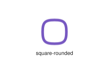
</div>
</div>

{{#endtab}}
{{#tab name="Code"}}

```xml
{{#include ../samples/icons/Tabler-Icons/square-rounded-a3f490b3.xal}}
```

{{#endtab}}
{{#endtabs}}

<div class="xal-ref-tag"><code>&lt;item id=&#34;104383&#34; /&gt;</code></div>

</div>
<div class="xal-ref-card">
<div class="xal-ref-title">square-toggle-horizontal</div>

{{#tabs name="svg-ref-4438"}}
{{#tab name="Preview"}}
<div class="xal-ref-preview">
<div>
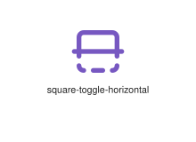
</div>
</div>

{{#endtab}}
{{#tab name="Code"}}

```xml
{{#include ../samples/icons/Tabler-Icons/square-toggle-horizontal-282f06db.xal}}
```

{{#endtab}}
{{#endtabs}}

<div class="xal-ref-tag"><code>&lt;item id=&#34;104440&#34; /&gt;</code></div>

</div>
<div class="xal-ref-card">
<div class="xal-ref-title">square-toggle</div>

{{#tabs name="svg-ref-4439"}}
{{#tab name="Preview"}}
<div class="xal-ref-preview">
<div>
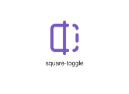
</div>
</div>

{{#endtab}}
{{#tab name="Code"}}

```xml
{{#include ../samples/icons/Tabler-Icons/square-toggle-8abbe781.xal}}
```

{{#endtab}}
{{#endtabs}}

<div class="xal-ref-tag"><code>&lt;item id=&#34;104439&#34; /&gt;</code></div>

</div>
<div class="xal-ref-card">
<div class="xal-ref-title">square-x</div>

{{#tabs name="svg-ref-4440"}}
{{#tab name="Preview"}}
<div class="xal-ref-preview">
<div>
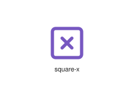
</div>
</div>

{{#endtab}}
{{#tab name="Code"}}

```xml
{{#include ../samples/icons/Tabler-Icons/square-x-84ae9cba.xal}}
```

{{#endtab}}
{{#endtabs}}

<div class="xal-ref-tag"><code>&lt;item id=&#34;104441&#34; /&gt;</code></div>

</div>
<div class="xal-ref-card">
<div class="xal-ref-title">square</div>

{{#tabs name="svg-ref-4441"}}
{{#tab name="Preview"}}
<div class="xal-ref-preview">
<div>
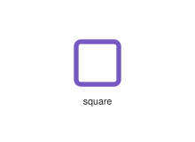
</div>
</div>

{{#endtab}}
{{#tab name="Code"}}

```xml
{{#include ../samples/icons/Tabler-Icons/square-14a50fad.xal}}
```

{{#endtab}}
{{#endtabs}}

<div class="xal-ref-tag"><code>&lt;item id=&#34;104305&#34; /&gt;</code></div>

</div>
<div class="xal-ref-card">
<div class="xal-ref-title">squares-diagonal</div>

{{#tabs name="svg-ref-4442"}}
{{#tab name="Preview"}}
<div class="xal-ref-preview">
<div>
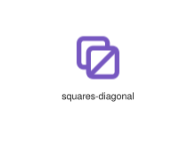
</div>
</div>

{{#endtab}}
{{#tab name="Code"}}

```xml
{{#include ../samples/icons/Tabler-Icons/squares-diagonal-3787cb21.xal}}
```

{{#endtab}}
{{#endtabs}}

<div class="xal-ref-tag"><code>&lt;item id=&#34;104443&#34; /&gt;</code></div>

</div>
<div class="xal-ref-card">
<div class="xal-ref-title">squares-selected</div>

{{#tabs name="svg-ref-4443"}}
{{#tab name="Preview"}}
<div class="xal-ref-preview">
<div>
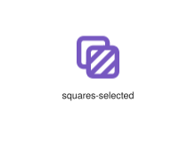
</div>
</div>

{{#endtab}}
{{#tab name="Code"}}

```xml
{{#include ../samples/icons/Tabler-Icons/squares-selected-a1f521bb.xal}}
```

{{#endtab}}
{{#endtabs}}

<div class="xal-ref-tag"><code>&lt;item id=&#34;104444&#34; /&gt;</code></div>

</div>
<div class="xal-ref-card">
<div class="xal-ref-title">squares</div>

{{#tabs name="svg-ref-4444"}}
{{#tab name="Preview"}}
<div class="xal-ref-preview">
<div>
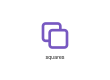
</div>
</div>

{{#endtab}}
{{#tab name="Code"}}

```xml
{{#include ../samples/icons/Tabler-Icons/squares-05515cd2.xal}}
```

{{#endtab}}
{{#endtabs}}

<div class="xal-ref-tag"><code>&lt;item id=&#34;104442&#34; /&gt;</code></div>

</div>
<div class="xal-ref-card">
<div class="xal-ref-title">stack-2</div>

{{#tabs name="svg-ref-4445"}}
{{#tab name="Preview"}}
<div class="xal-ref-preview">
<div>
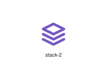
</div>
</div>

{{#endtab}}
{{#tab name="Code"}}

```xml
{{#include ../samples/icons/Tabler-Icons/stack-2-24afa373.xal}}
```

{{#endtab}}
{{#endtabs}}

<div class="xal-ref-tag"><code>&lt;item id=&#34;104446&#34; /&gt;</code></div>

</div>
<div class="xal-ref-card">
<div class="xal-ref-title">stack-3</div>

{{#tabs name="svg-ref-4446"}}
{{#tab name="Preview"}}
<div class="xal-ref-preview">
<div>
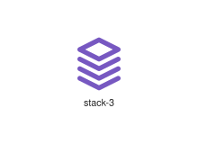
</div>
</div>

{{#endtab}}
{{#tab name="Code"}}

```xml
{{#include ../samples/icons/Tabler-Icons/stack-3-19cf8ac3.xal}}
```

{{#endtab}}
{{#endtabs}}

<div class="xal-ref-tag"><code>&lt;item id=&#34;104447&#34; /&gt;</code></div>

</div>
<div class="xal-ref-card">
<div class="xal-ref-title">stack-back</div>

{{#tabs name="svg-ref-4447"}}
{{#tab name="Preview"}}
<div class="xal-ref-preview">
<div>

</div>
</div>

{{#endtab}}
{{#tab name="Code"}}

```xml
{{#include ../samples/icons/Tabler-Icons/stack-back-0c6e12a7.xal}}
```

{{#endtab}}
{{#endtabs}}

<div class="xal-ref-tag"><code>&lt;item id=&#34;104448&#34; /&gt;</code></div>

</div>
<div class="xal-ref-card">
<div class="xal-ref-title">stack-backward</div>

{{#tabs name="svg-ref-4448"}}
{{#tab name="Preview"}}
<div class="xal-ref-preview">
<div>
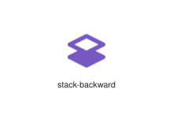
</div>
</div>

{{#endtab}}
{{#tab name="Code"}}

```xml
{{#include ../samples/icons/Tabler-Icons/stack-backward-c662faff.xal}}
```

{{#endtab}}
{{#endtabs}}

<div class="xal-ref-tag"><code>&lt;item id=&#34;104449&#34; /&gt;</code></div>

</div>
<div class="xal-ref-card">
<div class="xal-ref-title">stack-forward</div>

{{#tabs name="svg-ref-4449"}}
{{#tab name="Preview"}}
<div class="xal-ref-preview">
<div>

</div>
</div>

{{#endtab}}
{{#tab name="Code"}}

```xml
{{#include ../samples/icons/Tabler-Icons/stack-forward-b61066f2.xal}}
```

{{#endtab}}
{{#endtabs}}

<div class="xal-ref-tag"><code>&lt;item id=&#34;104450&#34; /&gt;</code></div>

</div>
<div class="xal-ref-card">
<div class="xal-ref-title">stack-front</div>

{{#tabs name="svg-ref-4450"}}
{{#tab name="Preview"}}
<div class="xal-ref-preview">
<div>
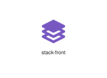
</div>
</div>

{{#endtab}}
{{#tab name="Code"}}

```xml
{{#include ../samples/icons/Tabler-Icons/stack-front-6f093ec2.xal}}
```

{{#endtab}}
{{#endtabs}}

<div class="xal-ref-tag"><code>&lt;item id=&#34;104451&#34; /&gt;</code></div>

</div>
<div class="xal-ref-card">
<div class="xal-ref-title">stack-middle</div>

{{#tabs name="svg-ref-4451"}}
{{#tab name="Preview"}}
<div class="xal-ref-preview">
<div>

</div>
</div>

{{#endtab}}
{{#tab name="Code"}}

```xml
{{#include ../samples/icons/Tabler-Icons/stack-middle-f76d0abd.xal}}
```

{{#endtab}}
{{#endtabs}}

<div class="xal-ref-tag"><code>&lt;item id=&#34;104452&#34; /&gt;</code></div>

</div>
<div class="xal-ref-card">
<div class="xal-ref-title">stack-pop</div>

{{#tabs name="svg-ref-4452"}}
{{#tab name="Preview"}}
<div class="xal-ref-preview">
<div>

</div>
</div>

{{#endtab}}
{{#tab name="Code"}}

```xml
{{#include ../samples/icons/Tabler-Icons/stack-pop-e5012f14.xal}}
```

{{#endtab}}
{{#endtabs}}

<div class="xal-ref-tag"><code>&lt;item id=&#34;104453&#34; /&gt;</code></div>

</div>
<div class="xal-ref-card">
<div class="xal-ref-title">stack-push</div>

{{#tabs name="svg-ref-4453"}}
{{#tab name="Preview"}}
<div class="xal-ref-preview">
<div>

</div>
</div>

{{#endtab}}
{{#tab name="Code"}}

```xml
{{#include ../samples/icons/Tabler-Icons/stack-push-e517e467.xal}}
```

{{#endtab}}
{{#endtabs}}

<div class="xal-ref-tag"><code>&lt;item id=&#34;104454&#34; /&gt;</code></div>

</div>
<div class="xal-ref-card">
<div class="xal-ref-title">stack</div>

{{#tabs name="svg-ref-4454"}}
{{#tab name="Preview"}}
<div class="xal-ref-preview">
<div>
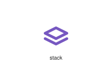
</div>
</div>

{{#endtab}}
{{#tab name="Code"}}

```xml
{{#include ../samples/icons/Tabler-Icons/stack-6fc6c674.xal}}
```

{{#endtab}}
{{#endtabs}}

<div class="xal-ref-tag"><code>&lt;item id=&#34;104445&#34; /&gt;</code></div>

</div>
<div class="xal-ref-card">
<div class="xal-ref-title">stairs-down</div>

{{#tabs name="svg-ref-4455"}}
{{#tab name="Preview"}}
<div class="xal-ref-preview">
<div>
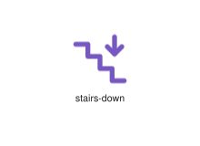
</div>
</div>

{{#endtab}}
{{#tab name="Code"}}

```xml
{{#include ../samples/icons/Tabler-Icons/stairs-down-1fc2e310.xal}}
```

{{#endtab}}
{{#endtabs}}

<div class="xal-ref-tag"><code>&lt;item id=&#34;104456&#34; /&gt;</code></div>

</div>
<div class="xal-ref-card">
<div class="xal-ref-title">stairs-up</div>

{{#tabs name="svg-ref-4456"}}
{{#tab name="Preview"}}
<div class="xal-ref-preview">
<div>
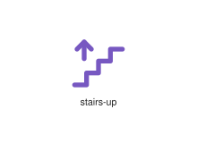
</div>
</div>

{{#endtab}}
{{#tab name="Code"}}

```xml
{{#include ../samples/icons/Tabler-Icons/stairs-up-52a30389.xal}}
```

{{#endtab}}
{{#endtabs}}

<div class="xal-ref-tag"><code>&lt;item id=&#34;104457&#34; /&gt;</code></div>

</div>
<div class="xal-ref-card">
<div class="xal-ref-title">stairs</div>

{{#tabs name="svg-ref-4457"}}
{{#tab name="Preview"}}
<div class="xal-ref-preview">
<div>
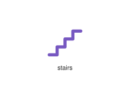
</div>
</div>

{{#endtab}}
{{#tab name="Code"}}

```xml
{{#include ../samples/icons/Tabler-Icons/stairs-7a8c5976.xal}}
```

{{#endtab}}
{{#endtabs}}

<div class="xal-ref-tag"><code>&lt;item id=&#34;104455&#34; /&gt;</code></div>

</div>
<div class="xal-ref-card">
<div class="xal-ref-title">star-half</div>

{{#tabs name="svg-ref-4458"}}
{{#tab name="Preview"}}
<div class="xal-ref-preview">
<div>

</div>
</div>

{{#endtab}}
{{#tab name="Code"}}

```xml
{{#include ../samples/icons/Tabler-Icons/star-half-4905f430.xal}}
```

{{#endtab}}
{{#endtabs}}

<div class="xal-ref-tag"><code>&lt;item id=&#34;104459&#34; /&gt;</code></div>

</div>
<div class="xal-ref-card">
<div class="xal-ref-title">star-off</div>

{{#tabs name="svg-ref-4459"}}
{{#tab name="Preview"}}
<div class="xal-ref-preview">
<div>

</div>
</div>

{{#endtab}}
{{#tab name="Code"}}

```xml
{{#include ../samples/icons/Tabler-Icons/star-off-dcc802b6.xal}}
```

{{#endtab}}
{{#endtabs}}

<div class="xal-ref-tag"><code>&lt;item id=&#34;104460&#34; /&gt;</code></div>

</div>
<div class="xal-ref-card">
<div class="xal-ref-title">star</div>

{{#tabs name="svg-ref-4460"}}
{{#tab name="Preview"}}
<div class="xal-ref-preview">
<div>
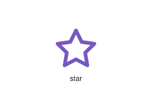
</div>
</div>

{{#endtab}}
{{#tab name="Code"}}

```xml
{{#include ../samples/icons/Tabler-Icons/star-fb329afe.xal}}
```

{{#endtab}}
{{#endtabs}}

<div class="xal-ref-tag"><code>&lt;item id=&#34;104458&#34; /&gt;</code></div>

</div>
<div class="xal-ref-card">
<div class="xal-ref-title">stars-off</div>

{{#tabs name="svg-ref-4461"}}
{{#tab name="Preview"}}
<div class="xal-ref-preview">
<div>
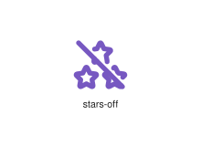
</div>
</div>

{{#endtab}}
{{#tab name="Code"}}

```xml
{{#include ../samples/icons/Tabler-Icons/stars-off-634cfa66.xal}}
```

{{#endtab}}
{{#endtabs}}

<div class="xal-ref-tag"><code>&lt;item id=&#34;104462&#34; /&gt;</code></div>

</div>
<div class="xal-ref-card">
<div class="xal-ref-title">stars</div>

{{#tabs name="svg-ref-4462"}}
{{#tab name="Preview"}}
<div class="xal-ref-preview">
<div>
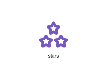
</div>
</div>

{{#endtab}}
{{#tab name="Code"}}

```xml
{{#include ../samples/icons/Tabler-Icons/stars-f7dccb09.xal}}
```

{{#endtab}}
{{#endtabs}}

<div class="xal-ref-tag"><code>&lt;item id=&#34;104461&#34; /&gt;</code></div>

</div>
<div class="xal-ref-card">
<div class="xal-ref-title">status-change</div>

{{#tabs name="svg-ref-4463"}}
{{#tab name="Preview"}}
<div class="xal-ref-preview">
<div>
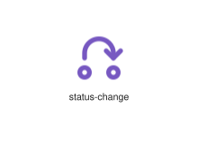
</div>
</div>

{{#endtab}}
{{#tab name="Code"}}

```xml
{{#include ../samples/icons/Tabler-Icons/status-change-da989731.xal}}
```

{{#endtab}}
{{#endtabs}}

<div class="xal-ref-tag"><code>&lt;item id=&#34;104463&#34; /&gt;</code></div>

</div>
<div class="xal-ref-card">
<div class="xal-ref-title">steam</div>

{{#tabs name="svg-ref-4464"}}
{{#tab name="Preview"}}
<div class="xal-ref-preview">
<div>

</div>
</div>

{{#endtab}}
{{#tab name="Code"}}

```xml
{{#include ../samples/icons/Tabler-Icons/steam-5901b6cc.xal}}
```

{{#endtab}}
{{#endtabs}}

<div class="xal-ref-tag"><code>&lt;item id=&#34;104464&#34; /&gt;</code></div>

</div>
<div class="xal-ref-card">
<div class="xal-ref-title">steering-wheel-off</div>

{{#tabs name="svg-ref-4465"}}
{{#tab name="Preview"}}
<div class="xal-ref-preview">
<div>

</div>
</div>

{{#endtab}}
{{#tab name="Code"}}

```xml
{{#include ../samples/icons/Tabler-Icons/steering-wheel-off-7417dade.xal}}
```

{{#endtab}}
{{#endtabs}}

<div class="xal-ref-tag"><code>&lt;item id=&#34;104466&#34; /&gt;</code></div>

</div>
<div class="xal-ref-card">
<div class="xal-ref-title">steering-wheel</div>

{{#tabs name="svg-ref-4466"}}
{{#tab name="Preview"}}
<div class="xal-ref-preview">
<div>

</div>
</div>

{{#endtab}}
{{#tab name="Code"}}

```xml
{{#include ../samples/icons/Tabler-Icons/steering-wheel-dd362559.xal}}
```

{{#endtab}}
{{#endtabs}}

<div class="xal-ref-tag"><code>&lt;item id=&#34;104465&#34; /&gt;</code></div>

</div>
<div class="xal-ref-card">
<div class="xal-ref-title">step-into</div>

{{#tabs name="svg-ref-4467"}}
{{#tab name="Preview"}}
<div class="xal-ref-preview">
<div>
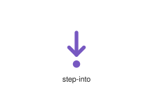
</div>
</div>

{{#endtab}}
{{#tab name="Code"}}

```xml
{{#include ../samples/icons/Tabler-Icons/step-into-255ec57f.xal}}
```

{{#endtab}}
{{#endtabs}}

<div class="xal-ref-tag"><code>&lt;item id=&#34;104467&#34; /&gt;</code></div>

</div>
<div class="xal-ref-card">
<div class="xal-ref-title">step-out</div>

{{#tabs name="svg-ref-4468"}}
{{#tab name="Preview"}}
<div class="xal-ref-preview">
<div>
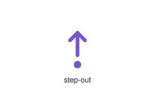
</div>
</div>

{{#endtab}}
{{#tab name="Code"}}

```xml
{{#include ../samples/icons/Tabler-Icons/step-out-64b73e9d.xal}}
```

{{#endtab}}
{{#endtabs}}

<div class="xal-ref-tag"><code>&lt;item id=&#34;104468&#34; /&gt;</code></div>

</div>
<div class="xal-ref-card">
<div class="xal-ref-title">stereo-glasses</div>

{{#tabs name="svg-ref-4469"}}
{{#tab name="Preview"}}
<div class="xal-ref-preview">
<div>
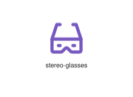
</div>
</div>

{{#endtab}}
{{#tab name="Code"}}

```xml
{{#include ../samples/icons/Tabler-Icons/stereo-glasses-8fff4ac2.xal}}
```

{{#endtab}}
{{#endtabs}}

<div class="xal-ref-tag"><code>&lt;item id=&#34;104469&#34; /&gt;</code></div>

</div>
<div class="xal-ref-card">
<div class="xal-ref-title">stethoscope-off</div>

{{#tabs name="svg-ref-4470"}}
{{#tab name="Preview"}}
<div class="xal-ref-preview">
<div>

</div>
</div>

{{#endtab}}
{{#tab name="Code"}}

```xml
{{#include ../samples/icons/Tabler-Icons/stethoscope-off-16a1e344.xal}}
```

{{#endtab}}
{{#endtabs}}

<div class="xal-ref-tag"><code>&lt;item id=&#34;104471&#34; /&gt;</code></div>

</div>
<div class="xal-ref-card">
<div class="xal-ref-title">stethoscope</div>

{{#tabs name="svg-ref-4471"}}
{{#tab name="Preview"}}
<div class="xal-ref-preview">
<div>

</div>
</div>

{{#endtab}}
{{#tab name="Code"}}

```xml
{{#include ../samples/icons/Tabler-Icons/stethoscope-e6870ae9.xal}}
```

{{#endtab}}
{{#endtabs}}

<div class="xal-ref-tag"><code>&lt;item id=&#34;104470&#34; /&gt;</code></div>

</div>
<div class="xal-ref-card">
<div class="xal-ref-title">sticker-2</div>

{{#tabs name="svg-ref-4472"}}
{{#tab name="Preview"}}
<div class="xal-ref-preview">
<div>

</div>
</div>

{{#endtab}}
{{#tab name="Code"}}

```xml
{{#include ../samples/icons/Tabler-Icons/sticker-2-5286a66e.xal}}
```

{{#endtab}}
{{#endtabs}}

<div class="xal-ref-tag"><code>&lt;item id=&#34;104473&#34; /&gt;</code></div>

</div>
<div class="xal-ref-card">
<div class="xal-ref-title">sticker</div>

{{#tabs name="svg-ref-4473"}}
{{#tab name="Preview"}}
<div class="xal-ref-preview">
<div>

</div>
</div>

{{#endtab}}
{{#tab name="Code"}}

```xml
{{#include ../samples/icons/Tabler-Icons/sticker-248fd123.xal}}
```

{{#endtab}}
{{#endtabs}}

<div class="xal-ref-tag"><code>&lt;item id=&#34;104472&#34; /&gt;</code></div>

</div>
<div class="xal-ref-card">
<div class="xal-ref-title">stopwatch</div>

{{#tabs name="svg-ref-4474"}}
{{#tab name="Preview"}}
<div class="xal-ref-preview">
<div>

</div>
</div>

{{#endtab}}
{{#tab name="Code"}}

```xml
{{#include ../samples/icons/Tabler-Icons/stopwatch-9c356015.xal}}
```

{{#endtab}}
{{#endtabs}}

<div class="xal-ref-tag"><code>&lt;item id=&#34;104474&#34; /&gt;</code></div>

</div>
<div class="xal-ref-card">
<div class="xal-ref-title">storm-off</div>

{{#tabs name="svg-ref-4475"}}
{{#tab name="Preview"}}
<div class="xal-ref-preview">
<div>

</div>
</div>

{{#endtab}}
{{#tab name="Code"}}

```xml
{{#include ../samples/icons/Tabler-Icons/storm-off-55384883.xal}}
```

{{#endtab}}
{{#endtabs}}

<div class="xal-ref-tag"><code>&lt;item id=&#34;104476&#34; /&gt;</code></div>

</div>
<div class="xal-ref-card">
<div class="xal-ref-title">storm</div>

{{#tabs name="svg-ref-4476"}}
{{#tab name="Preview"}}
<div class="xal-ref-preview">
<div>

</div>
</div>

{{#endtab}}
{{#tab name="Code"}}

```xml
{{#include ../samples/icons/Tabler-Icons/storm-783399b7.xal}}
```

{{#endtab}}
{{#endtabs}}

<div class="xal-ref-tag"><code>&lt;item id=&#34;104475&#34; /&gt;</code></div>

</div>
<div class="xal-ref-card">
<div class="xal-ref-title">stretching-2</div>

{{#tabs name="svg-ref-4477"}}
{{#tab name="Preview"}}
<div class="xal-ref-preview">
<div>

</div>
</div>

{{#endtab}}
{{#tab name="Code"}}

```xml
{{#include ../samples/icons/Tabler-Icons/stretching-2-bfdf8bb0.xal}}
```

{{#endtab}}
{{#endtabs}}

<div class="xal-ref-tag"><code>&lt;item id=&#34;104478&#34; /&gt;</code></div>

</div>
<div class="xal-ref-card">
<div class="xal-ref-title">stretching</div>

{{#tabs name="svg-ref-4478"}}
{{#tab name="Preview"}}
<div class="xal-ref-preview">
<div>

</div>
</div>

{{#endtab}}
{{#tab name="Code"}}

```xml
{{#include ../samples/icons/Tabler-Icons/stretching-84e94968.xal}}
```

{{#endtab}}
{{#endtabs}}

<div class="xal-ref-tag"><code>&lt;item id=&#34;104477&#34; /&gt;</code></div>

</div>
<div class="xal-ref-card">
<div class="xal-ref-title">strikethrough</div>

{{#tabs name="svg-ref-4479"}}
{{#tab name="Preview"}}
<div class="xal-ref-preview">
<div>

</div>
</div>

{{#endtab}}
{{#tab name="Code"}}

```xml
{{#include ../samples/icons/Tabler-Icons/strikethrough-b9350248.xal}}
```

{{#endtab}}
{{#endtabs}}

<div class="xal-ref-tag"><code>&lt;item id=&#34;104479&#34; /&gt;</code></div>

</div>
<div class="xal-ref-card">
<div class="xal-ref-title">submarine</div>

{{#tabs name="svg-ref-4480"}}
{{#tab name="Preview"}}
<div class="xal-ref-preview">
<div>

</div>
</div>

{{#endtab}}
{{#tab name="Code"}}

```xml
{{#include ../samples/icons/Tabler-Icons/submarine-71bd4c77.xal}}
```

{{#endtab}}
{{#endtabs}}

<div class="xal-ref-tag"><code>&lt;item id=&#34;104480&#34; /&gt;</code></div>

</div>
<div class="xal-ref-card">
<div class="xal-ref-title">subscript</div>

{{#tabs name="svg-ref-4481"}}
{{#tab name="Preview"}}
<div class="xal-ref-preview">
<div>

</div>
</div>

{{#endtab}}
{{#tab name="Code"}}

```xml
{{#include ../samples/icons/Tabler-Icons/subscript-02700873.xal}}
```

{{#endtab}}
{{#endtabs}}

<div class="xal-ref-tag"><code>&lt;item id=&#34;104481&#34; /&gt;</code></div>

</div>
<div class="xal-ref-card">
<div class="xal-ref-title">subtask</div>

{{#tabs name="svg-ref-4482"}}
{{#tab name="Preview"}}
<div class="xal-ref-preview">
<div>

</div>
</div>

{{#endtab}}
{{#tab name="Code"}}

```xml
{{#include ../samples/icons/Tabler-Icons/subtask-236957c9.xal}}
```

{{#endtab}}
{{#endtabs}}

<div class="xal-ref-tag"><code>&lt;item id=&#34;104482&#34; /&gt;</code></div>

</div>
<div class="xal-ref-card">
<div class="xal-ref-title">sum-off</div>

{{#tabs name="svg-ref-4483"}}
{{#tab name="Preview"}}
<div class="xal-ref-preview">
<div>

</div>
</div>

{{#endtab}}
{{#tab name="Code"}}

```xml
{{#include ../samples/icons/Tabler-Icons/sum-off-4d0d5c31.xal}}
```

{{#endtab}}
{{#endtabs}}

<div class="xal-ref-tag"><code>&lt;item id=&#34;104484&#34; /&gt;</code></div>

</div>
<div class="xal-ref-card">
<div class="xal-ref-title">sum</div>

{{#tabs name="svg-ref-4484"}}
{{#tab name="Preview"}}
<div class="xal-ref-preview">
<div>

</div>
</div>

{{#endtab}}
{{#tab name="Code"}}

```xml
{{#include ../samples/icons/Tabler-Icons/sum-15680cf4.xal}}
```

{{#endtab}}
{{#endtabs}}

<div class="xal-ref-tag"><code>&lt;item id=&#34;104483&#34; /&gt;</code></div>

</div>
<div class="xal-ref-card">
<div class="xal-ref-title">sun-electricity</div>

{{#tabs name="svg-ref-4485"}}
{{#tab name="Preview"}}
<div class="xal-ref-preview">
<div>

</div>
</div>

{{#endtab}}
{{#tab name="Code"}}

```xml
{{#include ../samples/icons/Tabler-Icons/sun-electricity-51a98f55.xal}}
```

{{#endtab}}
{{#endtabs}}

<div class="xal-ref-tag"><code>&lt;item id=&#34;104486&#34; /&gt;</code></div>

</div>
<div class="xal-ref-card">
<div class="xal-ref-title">sun-high</div>

{{#tabs name="svg-ref-4486"}}
{{#tab name="Preview"}}
<div class="xal-ref-preview">
<div>

</div>
</div>

{{#endtab}}
{{#tab name="Code"}}

```xml
{{#include ../samples/icons/Tabler-Icons/sun-high-37679c2b.xal}}
```

{{#endtab}}
{{#endtabs}}

<div class="xal-ref-tag"><code>&lt;item id=&#34;104487&#34; /&gt;</code></div>

</div>
<div class="xal-ref-card">
<div class="xal-ref-title">sun-low</div>

{{#tabs name="svg-ref-4487"}}
{{#tab name="Preview"}}
<div class="xal-ref-preview">
<div>

</div>
</div>

{{#endtab}}
{{#tab name="Code"}}

```xml
{{#include ../samples/icons/Tabler-Icons/sun-low-3fe79593.xal}}
```

{{#endtab}}
{{#endtabs}}

<div class="xal-ref-tag"><code>&lt;item id=&#34;104488&#34; /&gt;</code></div>

</div>
<div class="xal-ref-card">
<div class="xal-ref-title">sun-moon</div>

{{#tabs name="svg-ref-4488"}}
{{#tab name="Preview"}}
<div class="xal-ref-preview">
<div>

</div>
</div>

{{#endtab}}
{{#tab name="Code"}}

```xml
{{#include ../samples/icons/Tabler-Icons/sun-moon-7f44d0b8.xal}}
```

{{#endtab}}
{{#endtabs}}

<div class="xal-ref-tag"><code>&lt;item id=&#34;104489&#34; /&gt;</code></div>

</div>
<div class="xal-ref-card">
<div class="xal-ref-title">sun-off</div>

{{#tabs name="svg-ref-4489"}}
{{#tab name="Preview"}}
<div class="xal-ref-preview">
<div>

</div>
</div>

{{#endtab}}
{{#tab name="Code"}}

```xml
{{#include ../samples/icons/Tabler-Icons/sun-off-748060f4.xal}}
```

{{#endtab}}
{{#endtabs}}

<div class="xal-ref-tag"><code>&lt;item id=&#34;104490&#34; /&gt;</code></div>

</div>
<div class="xal-ref-card">
<div class="xal-ref-title">sun-wind</div>

{{#tabs name="svg-ref-4490"}}
{{#tab name="Preview"}}
<div class="xal-ref-preview">
<div>

</div>
</div>

{{#endtab}}
{{#tab name="Code"}}

```xml
{{#include ../samples/icons/Tabler-Icons/sun-wind-70030365.xal}}
```

{{#endtab}}
{{#endtabs}}

<div class="xal-ref-tag"><code>&lt;item id=&#34;104491&#34; /&gt;</code></div>

</div>
<div class="xal-ref-card">
<div class="xal-ref-title">sun</div>

{{#tabs name="svg-ref-4491"}}
{{#tab name="Preview"}}
<div class="xal-ref-preview">
<div>

</div>
</div>

{{#endtab}}
{{#tab name="Code"}}

```xml
{{#include ../samples/icons/Tabler-Icons/sun-52c87624.xal}}
```

{{#endtab}}
{{#endtabs}}

<div class="xal-ref-tag"><code>&lt;item id=&#34;104485&#34; /&gt;</code></div>

</div>
<div class="xal-ref-card">
<div class="xal-ref-title">sunglasses</div>

{{#tabs name="svg-ref-4492"}}
{{#tab name="Preview"}}
<div class="xal-ref-preview">
<div>

</div>
</div>

{{#endtab}}
{{#tab name="Code"}}

```xml
{{#include ../samples/icons/Tabler-Icons/sunglasses-0f564fb7.xal}}
```

{{#endtab}}
{{#endtabs}}

<div class="xal-ref-tag"><code>&lt;item id=&#34;104492&#34; /&gt;</code></div>

</div>
<div class="xal-ref-card">
<div class="xal-ref-title">sunrise</div>

{{#tabs name="svg-ref-4493"}}
{{#tab name="Preview"}}
<div class="xal-ref-preview">
<div>

</div>
</div>

{{#endtab}}
{{#tab name="Code"}}

```xml
{{#include ../samples/icons/Tabler-Icons/sunrise-8fed5d5c.xal}}
```

{{#endtab}}
{{#endtabs}}

<div class="xal-ref-tag"><code>&lt;item id=&#34;104493&#34; /&gt;</code></div>

</div>
<div class="xal-ref-card">
<div class="xal-ref-title">sunset-2</div>

{{#tabs name="svg-ref-4494"}}
{{#tab name="Preview"}}
<div class="xal-ref-preview">
<div>

</div>
</div>

{{#endtab}}
{{#tab name="Code"}}

```xml
{{#include ../samples/icons/Tabler-Icons/sunset-2-cc9b1070.xal}}
```

{{#endtab}}
{{#endtabs}}

<div class="xal-ref-tag"><code>&lt;item id=&#34;104495&#34; /&gt;</code></div>

</div>
<div class="xal-ref-card">
<div class="xal-ref-title">sunset</div>

{{#tabs name="svg-ref-4495"}}
{{#tab name="Preview"}}
<div class="xal-ref-preview">
<div>

</div>
</div>

{{#endtab}}
{{#tab name="Code"}}

```xml
{{#include ../samples/icons/Tabler-Icons/sunset-db8a722a.xal}}
```

{{#endtab}}
{{#endtabs}}

<div class="xal-ref-tag"><code>&lt;item id=&#34;104494&#34; /&gt;</code></div>

</div>
<div class="xal-ref-card">
<div class="xal-ref-title">superscript</div>

{{#tabs name="svg-ref-4496"}}
{{#tab name="Preview"}}
<div class="xal-ref-preview">
<div>

</div>
</div>

{{#endtab}}
{{#tab name="Code"}}

```xml
{{#include ../samples/icons/Tabler-Icons/superscript-16575a20.xal}}
```

{{#endtab}}
{{#endtabs}}

<div class="xal-ref-tag"><code>&lt;item id=&#34;104496&#34; /&gt;</code></div>

</div>
<div class="xal-ref-card">
<div class="xal-ref-title">svg</div>

{{#tabs name="svg-ref-4497"}}
{{#tab name="Preview"}}
<div class="xal-ref-preview">
<div>

</div>
</div>

{{#endtab}}
{{#tab name="Code"}}

```xml
{{#include ../samples/icons/Tabler-Icons/svg-d94c66fb.xal}}
```

{{#endtab}}
{{#endtabs}}

<div class="xal-ref-tag"><code>&lt;item id=&#34;104497&#34; /&gt;</code></div>

</div>
<div class="xal-ref-card">
<div class="xal-ref-title">swimming</div>

{{#tabs name="svg-ref-4498"}}
{{#tab name="Preview"}}
<div class="xal-ref-preview">
<div>

</div>
</div>

{{#endtab}}
{{#tab name="Code"}}

```xml
{{#include ../samples/icons/Tabler-Icons/swimming-befaf5e9.xal}}
```

{{#endtab}}
{{#endtabs}}

<div class="xal-ref-tag"><code>&lt;item id=&#34;104498&#34; /&gt;</code></div>

</div>
<div class="xal-ref-card">
<div class="xal-ref-title">swipe-down</div>

{{#tabs name="svg-ref-4499"}}
{{#tab name="Preview"}}
<div class="xal-ref-preview">
<div>

</div>
</div>

{{#endtab}}
{{#tab name="Code"}}

```xml
{{#include ../samples/icons/Tabler-Icons/swipe-down-588227c9.xal}}
```

{{#endtab}}
{{#endtabs}}

<div class="xal-ref-tag"><code>&lt;item id=&#34;104500&#34; /&gt;</code></div>

</div>
</div>
