# Tabler-Icons - Page 52

This page references SVG files under `etc/resources/aws/svg/Tabler-Icons`.
Each card shows the SVG preview first and the XAL tag syntax in the Code tab.
Showing 4591-4680 of 4964 SVG files.

<style>
.xal-ref-grid{display:grid;grid-template-columns:repeat(3,minmax(0,1fr));gap:1rem;margin:1rem 0 1.5rem}.xal-ref-card{border:1px solid var(--table-border-color);border-radius:8px;overflow:hidden;background:var(--bg);padding:.75rem}.xal-ref-title{font-size:.9rem;font-weight:600;line-height:1.25;margin:0 0 .5rem;overflow-wrap:anywhere}.xal-ref-preview{display:flex;align-items:center;justify-content:center}.xal-ref-preview img{display:block;width:100%;height:auto}.xal-ref-card pre{margin:0;max-height:18rem;overflow:auto;white-space:pre}.xal-ref-card code{font-size:.78em}.xal-ref-tag{margin:.5rem 0 0;color:var(--fg);opacity:.72;overflow:auto;white-space:pre}.xal-ref-tag code{font-size:.72em}@media(max-width:900px){.xal-ref-grid{grid-template-columns:repeat(2,minmax(0,1fr))}}@media(max-width:560px){.xal-ref-grid{grid-template-columns:1fr}}
</style>

[Back to section index](tabler-icons.md)

<div class="xal-ref-grid">
<div class="xal-ref-card">
<div class="xal-ref-title">thumb-up-off</div>

{{#tabs name="svg-ref-4590"}}
{{#tab name="Preview"}}
<div class="xal-ref-preview">
<div>

</div>
</div>

{{#endtab}}
{{#tab name="Code"}}

```xml
{{#include ../samples/icons/Tabler-Icons/thumb-up-off-f5a6a089.xal}}
```

{{#endtab}}
{{#endtabs}}

<div class="xal-ref-tag"><code>&lt;item id=&#34;104591&#34; /&gt;</code></div>

</div>
<div class="xal-ref-card">
<div class="xal-ref-title">thumb-up</div>

{{#tabs name="svg-ref-4591"}}
{{#tab name="Preview"}}
<div class="xal-ref-preview">
<div>

</div>
</div>

{{#endtab}}
{{#tab name="Code"}}

```xml
{{#include ../samples/icons/Tabler-Icons/thumb-up-184bb701.xal}}
```

{{#endtab}}
{{#endtabs}}

<div class="xal-ref-tag"><code>&lt;item id=&#34;104590&#34; /&gt;</code></div>

</div>
<div class="xal-ref-card">
<div class="xal-ref-title">tic-tac</div>

{{#tabs name="svg-ref-4592"}}
{{#tab name="Preview"}}
<div class="xal-ref-preview">
<div>
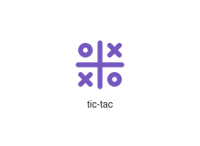
</div>
</div>

{{#endtab}}
{{#tab name="Code"}}

```xml
{{#include ../samples/icons/Tabler-Icons/tic-tac-215a84ba.xal}}
```

{{#endtab}}
{{#endtabs}}

<div class="xal-ref-tag"><code>&lt;item id=&#34;104592&#34; /&gt;</code></div>

</div>
<div class="xal-ref-card">
<div class="xal-ref-title">ticket-off</div>

{{#tabs name="svg-ref-4593"}}
{{#tab name="Preview"}}
<div class="xal-ref-preview">
<div>

</div>
</div>

{{#endtab}}
{{#tab name="Code"}}

```xml
{{#include ../samples/icons/Tabler-Icons/ticket-off-04973899.xal}}
```

{{#endtab}}
{{#endtabs}}

<div class="xal-ref-tag"><code>&lt;item id=&#34;104594&#34; /&gt;</code></div>

</div>
<div class="xal-ref-card">
<div class="xal-ref-title">ticket</div>

{{#tabs name="svg-ref-4594"}}
{{#tab name="Preview"}}
<div class="xal-ref-preview">
<div>
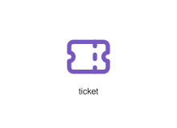
</div>
</div>

{{#endtab}}
{{#tab name="Code"}}

```xml
{{#include ../samples/icons/Tabler-Icons/ticket-bc961f4e.xal}}
```

{{#endtab}}
{{#endtabs}}

<div class="xal-ref-tag"><code>&lt;item id=&#34;104593&#34; /&gt;</code></div>

</div>
<div class="xal-ref-card">
<div class="xal-ref-title">tie</div>

{{#tabs name="svg-ref-4595"}}
{{#tab name="Preview"}}
<div class="xal-ref-preview">
<div>

</div>
</div>

{{#endtab}}
{{#tab name="Code"}}

```xml
{{#include ../samples/icons/Tabler-Icons/tie-94abbb5b.xal}}
```

{{#endtab}}
{{#endtabs}}

<div class="xal-ref-tag"><code>&lt;item id=&#34;104595&#34; /&gt;</code></div>

</div>
<div class="xal-ref-card">
<div class="xal-ref-title">tilde</div>

{{#tabs name="svg-ref-4596"}}
{{#tab name="Preview"}}
<div class="xal-ref-preview">
<div>
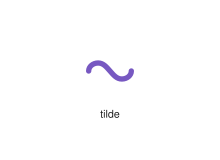
</div>
</div>

{{#endtab}}
{{#tab name="Code"}}

```xml
{{#include ../samples/icons/Tabler-Icons/tilde-2ffb605e.xal}}
```

{{#endtab}}
{{#endtabs}}

<div class="xal-ref-tag"><code>&lt;item id=&#34;104596&#34; /&gt;</code></div>

</div>
<div class="xal-ref-card">
<div class="xal-ref-title">tilt-shift-off</div>

{{#tabs name="svg-ref-4597"}}
{{#tab name="Preview"}}
<div class="xal-ref-preview">
<div>
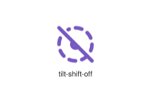
</div>
</div>

{{#endtab}}
{{#tab name="Code"}}

```xml
{{#include ../samples/icons/Tabler-Icons/tilt-shift-off-0d675700.xal}}
```

{{#endtab}}
{{#endtabs}}

<div class="xal-ref-tag"><code>&lt;item id=&#34;104598&#34; /&gt;</code></div>

</div>
<div class="xal-ref-card">
<div class="xal-ref-title">tilt-shift</div>

{{#tabs name="svg-ref-4598"}}
{{#tab name="Preview"}}
<div class="xal-ref-preview">
<div>
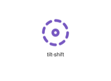
</div>
</div>

{{#endtab}}
{{#tab name="Code"}}

```xml
{{#include ../samples/icons/Tabler-Icons/tilt-shift-ba8c8029.xal}}
```

{{#endtab}}
{{#endtabs}}

<div class="xal-ref-tag"><code>&lt;item id=&#34;104597&#34; /&gt;</code></div>

</div>
<div class="xal-ref-card">
<div class="xal-ref-title">time-duration-0</div>

{{#tabs name="svg-ref-4599"}}
{{#tab name="Preview"}}
<div class="xal-ref-preview">
<div>
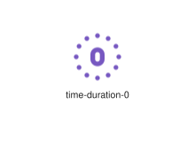
</div>
</div>

{{#endtab}}
{{#tab name="Code"}}

```xml
{{#include ../samples/icons/Tabler-Icons/time-duration-0-0c7eedb0.xal}}
```

{{#endtab}}
{{#endtabs}}

<div class="xal-ref-tag"><code>&lt;item id=&#34;104599&#34; /&gt;</code></div>

</div>
<div class="xal-ref-card">
<div class="xal-ref-title">time-duration-10</div>

{{#tabs name="svg-ref-4600"}}
{{#tab name="Preview"}}
<div class="xal-ref-preview">
<div>
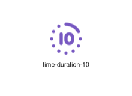
</div>
</div>

{{#endtab}}
{{#tab name="Code"}}

```xml
{{#include ../samples/icons/Tabler-Icons/time-duration-10-b2401ad5.xal}}
```

{{#endtab}}
{{#endtabs}}

<div class="xal-ref-tag"><code>&lt;item id=&#34;104600&#34; /&gt;</code></div>

</div>
<div class="xal-ref-card">
<div class="xal-ref-title">time-duration-15</div>

{{#tabs name="svg-ref-4601"}}
{{#tab name="Preview"}}
<div class="xal-ref-preview">
<div>

</div>
</div>

{{#endtab}}
{{#tab name="Code"}}

```xml
{{#include ../samples/icons/Tabler-Icons/time-duration-15-7aa095a5.xal}}
```

{{#endtab}}
{{#endtabs}}

<div class="xal-ref-tag"><code>&lt;item id=&#34;104601&#34; /&gt;</code></div>

</div>
<div class="xal-ref-card">
<div class="xal-ref-title">time-duration-30</div>

{{#tabs name="svg-ref-4602"}}
{{#tab name="Preview"}}
<div class="xal-ref-preview">
<div>
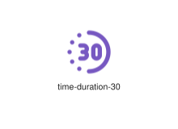
</div>
</div>

{{#endtab}}
{{#tab name="Code"}}

```xml
{{#include ../samples/icons/Tabler-Icons/time-duration-30-ff88bbde.xal}}
```

{{#endtab}}
{{#endtabs}}

<div class="xal-ref-tag"><code>&lt;item id=&#34;104602&#34; /&gt;</code></div>

</div>
<div class="xal-ref-card">
<div class="xal-ref-title">time-duration-45</div>

{{#tabs name="svg-ref-4603"}}
{{#tab name="Preview"}}
<div class="xal-ref-preview">
<div>
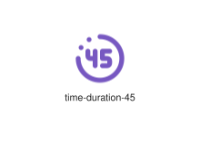
</div>
</div>

{{#endtab}}
{{#tab name="Code"}}

```xml
{{#include ../samples/icons/Tabler-Icons/time-duration-45-2a6d0416.xal}}
```

{{#endtab}}
{{#endtabs}}

<div class="xal-ref-tag"><code>&lt;item id=&#34;104603&#34; /&gt;</code></div>

</div>
<div class="xal-ref-card">
<div class="xal-ref-title">time-duration-5</div>

{{#tabs name="svg-ref-4604"}}
{{#tab name="Preview"}}
<div class="xal-ref-preview">
<div>
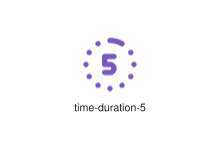
</div>
</div>

{{#endtab}}
{{#tab name="Code"}}

```xml
{{#include ../samples/icons/Tabler-Icons/time-duration-5-c49e62c0.xal}}
```

{{#endtab}}
{{#endtabs}}

<div class="xal-ref-tag"><code>&lt;item id=&#34;104604&#34; /&gt;</code></div>

</div>
<div class="xal-ref-card">
<div class="xal-ref-title">time-duration-60</div>

{{#tabs name="svg-ref-4605"}}
{{#tab name="Preview"}}
<div class="xal-ref-preview">
<div>
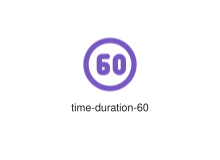
</div>
</div>

{{#endtab}}
{{#tab name="Code"}}

```xml
{{#include ../samples/icons/Tabler-Icons/time-duration-60-af452a6d.xal}}
```

{{#endtab}}
{{#endtabs}}

<div class="xal-ref-tag"><code>&lt;item id=&#34;104605&#34; /&gt;</code></div>

</div>
<div class="xal-ref-card">
<div class="xal-ref-title">time-duration-90</div>

{{#tabs name="svg-ref-4606"}}
{{#tab name="Preview"}}
<div class="xal-ref-preview">
<div>

</div>
</div>

{{#endtab}}
{{#tab name="Code"}}

```xml
{{#include ../samples/icons/Tabler-Icons/time-duration-90-5e1398b8.xal}}
```

{{#endtab}}
{{#endtabs}}

<div class="xal-ref-tag"><code>&lt;item id=&#34;104606&#34; /&gt;</code></div>

</div>
<div class="xal-ref-card">
<div class="xal-ref-title">time-duration-off</div>

{{#tabs name="svg-ref-4607"}}
{{#tab name="Preview"}}
<div class="xal-ref-preview">
<div>
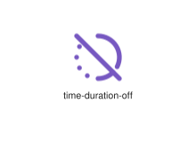
</div>
</div>

{{#endtab}}
{{#tab name="Code"}}

```xml
{{#include ../samples/icons/Tabler-Icons/time-duration-off-5a14213b.xal}}
```

{{#endtab}}
{{#endtabs}}

<div class="xal-ref-tag"><code>&lt;item id=&#34;104607&#34; /&gt;</code></div>

</div>
<div class="xal-ref-card">
<div class="xal-ref-title">timeline-event-exclamation</div>

{{#tabs name="svg-ref-4608"}}
{{#tab name="Preview"}}
<div class="xal-ref-preview">
<div>
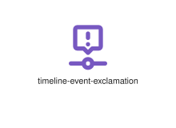
</div>
</div>

{{#endtab}}
{{#tab name="Code"}}

```xml
{{#include ../samples/icons/Tabler-Icons/timeline-event-exclamation-bc2e3949.xal}}
```

{{#endtab}}
{{#endtabs}}

<div class="xal-ref-tag"><code>&lt;item id=&#34;104610&#34; /&gt;</code></div>

</div>
<div class="xal-ref-card">
<div class="xal-ref-title">timeline-event-minus</div>

{{#tabs name="svg-ref-4609"}}
{{#tab name="Preview"}}
<div class="xal-ref-preview">
<div>
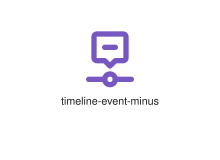
</div>
</div>

{{#endtab}}
{{#tab name="Code"}}

```xml
{{#include ../samples/icons/Tabler-Icons/timeline-event-minus-3ee616cd.xal}}
```

{{#endtab}}
{{#endtabs}}

<div class="xal-ref-tag"><code>&lt;item id=&#34;104611&#34; /&gt;</code></div>

</div>
<div class="xal-ref-card">
<div class="xal-ref-title">timeline-event-plus</div>

{{#tabs name="svg-ref-4610"}}
{{#tab name="Preview"}}
<div class="xal-ref-preview">
<div>
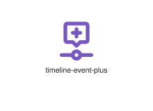
</div>
</div>

{{#endtab}}
{{#tab name="Code"}}

```xml
{{#include ../samples/icons/Tabler-Icons/timeline-event-plus-9e18d428.xal}}
```

{{#endtab}}
{{#endtabs}}

<div class="xal-ref-tag"><code>&lt;item id=&#34;104612&#34; /&gt;</code></div>

</div>
<div class="xal-ref-card">
<div class="xal-ref-title">timeline-event-text</div>

{{#tabs name="svg-ref-4611"}}
{{#tab name="Preview"}}
<div class="xal-ref-preview">
<div>
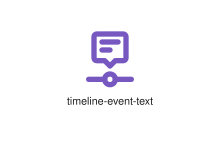
</div>
</div>

{{#endtab}}
{{#tab name="Code"}}

```xml
{{#include ../samples/icons/Tabler-Icons/timeline-event-text-817450cf.xal}}
```

{{#endtab}}
{{#endtabs}}

<div class="xal-ref-tag"><code>&lt;item id=&#34;104613&#34; /&gt;</code></div>

</div>
<div class="xal-ref-card">
<div class="xal-ref-title">timeline-event-x</div>

{{#tabs name="svg-ref-4612"}}
{{#tab name="Preview"}}
<div class="xal-ref-preview">
<div>
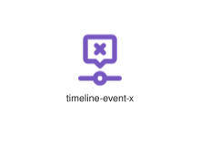
</div>
</div>

{{#endtab}}
{{#tab name="Code"}}

```xml
{{#include ../samples/icons/Tabler-Icons/timeline-event-x-9de6643c.xal}}
```

{{#endtab}}
{{#endtabs}}

<div class="xal-ref-tag"><code>&lt;item id=&#34;104614&#34; /&gt;</code></div>

</div>
<div class="xal-ref-card">
<div class="xal-ref-title">timeline-event</div>

{{#tabs name="svg-ref-4613"}}
{{#tab name="Preview"}}
<div class="xal-ref-preview">
<div>
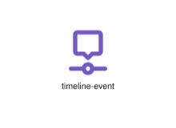
</div>
</div>

{{#endtab}}
{{#tab name="Code"}}

```xml
{{#include ../samples/icons/Tabler-Icons/timeline-event-6ef13f5e.xal}}
```

{{#endtab}}
{{#endtabs}}

<div class="xal-ref-tag"><code>&lt;item id=&#34;104609&#34; /&gt;</code></div>

</div>
<div class="xal-ref-card">
<div class="xal-ref-title">timeline</div>

{{#tabs name="svg-ref-4614"}}
{{#tab name="Preview"}}
<div class="xal-ref-preview">
<div>
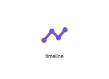
</div>
</div>

{{#endtab}}
{{#tab name="Code"}}

```xml
{{#include ../samples/icons/Tabler-Icons/timeline-32bba237.xal}}
```

{{#endtab}}
{{#endtabs}}

<div class="xal-ref-tag"><code>&lt;item id=&#34;104608&#34; /&gt;</code></div>

</div>
<div class="xal-ref-card">
<div class="xal-ref-title">timezone</div>

{{#tabs name="svg-ref-4615"}}
{{#tab name="Preview"}}
<div class="xal-ref-preview">
<div>
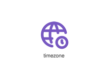
</div>
</div>

{{#endtab}}
{{#tab name="Code"}}

```xml
{{#include ../samples/icons/Tabler-Icons/timezone-ebbfafa1.xal}}
```

{{#endtab}}
{{#endtabs}}

<div class="xal-ref-tag"><code>&lt;item id=&#34;104615&#34; /&gt;</code></div>

</div>
<div class="xal-ref-card">
<div class="xal-ref-title">tip-jar-euro</div>

{{#tabs name="svg-ref-4616"}}
{{#tab name="Preview"}}
<div class="xal-ref-preview">
<div>

</div>
</div>

{{#endtab}}
{{#tab name="Code"}}

```xml
{{#include ../samples/icons/Tabler-Icons/tip-jar-euro-626dfc0d.xal}}
```

{{#endtab}}
{{#endtabs}}

<div class="xal-ref-tag"><code>&lt;item id=&#34;104617&#34; /&gt;</code></div>

</div>
<div class="xal-ref-card">
<div class="xal-ref-title">tip-jar-pound</div>

{{#tabs name="svg-ref-4617"}}
{{#tab name="Preview"}}
<div class="xal-ref-preview">
<div>

</div>
</div>

{{#endtab}}
{{#tab name="Code"}}

```xml
{{#include ../samples/icons/Tabler-Icons/tip-jar-pound-04e6bbad.xal}}
```

{{#endtab}}
{{#endtabs}}

<div class="xal-ref-tag"><code>&lt;item id=&#34;104618&#34; /&gt;</code></div>

</div>
<div class="xal-ref-card">
<div class="xal-ref-title">tip-jar</div>

{{#tabs name="svg-ref-4618"}}
{{#tab name="Preview"}}
<div class="xal-ref-preview">
<div>

</div>
</div>

{{#endtab}}
{{#tab name="Code"}}

```xml
{{#include ../samples/icons/Tabler-Icons/tip-jar-de76a3af.xal}}
```

{{#endtab}}
{{#endtabs}}

<div class="xal-ref-tag"><code>&lt;item id=&#34;104616&#34; /&gt;</code></div>

</div>
<div class="xal-ref-card">
<div class="xal-ref-title">tir</div>

{{#tabs name="svg-ref-4619"}}
{{#tab name="Preview"}}
<div class="xal-ref-preview">
<div>
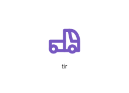
</div>
</div>

{{#endtab}}
{{#tab name="Code"}}

```xml
{{#include ../samples/icons/Tabler-Icons/tir-466bf0c9.xal}}
```

{{#endtab}}
{{#endtabs}}

<div class="xal-ref-tag"><code>&lt;item id=&#34;104619&#34; /&gt;</code></div>

</div>
<div class="xal-ref-card">
<div class="xal-ref-title">toggle-left</div>

{{#tabs name="svg-ref-4620"}}
{{#tab name="Preview"}}
<div class="xal-ref-preview">
<div>
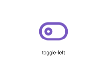
</div>
</div>

{{#endtab}}
{{#tab name="Code"}}

```xml
{{#include ../samples/icons/Tabler-Icons/toggle-left-a7e2e3cc.xal}}
```

{{#endtab}}
{{#endtabs}}

<div class="xal-ref-tag"><code>&lt;item id=&#34;104620&#34; /&gt;</code></div>

</div>
<div class="xal-ref-card">
<div class="xal-ref-title">toggle-right</div>

{{#tabs name="svg-ref-4621"}}
{{#tab name="Preview"}}
<div class="xal-ref-preview">
<div>
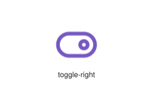
</div>
</div>

{{#endtab}}
{{#tab name="Code"}}

```xml
{{#include ../samples/icons/Tabler-Icons/toggle-right-6cb9d318.xal}}
```

{{#endtab}}
{{#endtabs}}

<div class="xal-ref-tag"><code>&lt;item id=&#34;104621&#34; /&gt;</code></div>

</div>
<div class="xal-ref-card">
<div class="xal-ref-title">toilet-paper-off</div>

{{#tabs name="svg-ref-4622"}}
{{#tab name="Preview"}}
<div class="xal-ref-preview">
<div>

</div>
</div>

{{#endtab}}
{{#tab name="Code"}}

```xml
{{#include ../samples/icons/Tabler-Icons/toilet-paper-off-0db74157.xal}}
```

{{#endtab}}
{{#endtabs}}

<div class="xal-ref-tag"><code>&lt;item id=&#34;104623&#34; /&gt;</code></div>

</div>
<div class="xal-ref-card">
<div class="xal-ref-title">toilet-paper</div>

{{#tabs name="svg-ref-4623"}}
{{#tab name="Preview"}}
<div class="xal-ref-preview">
<div>

</div>
</div>

{{#endtab}}
{{#tab name="Code"}}

```xml
{{#include ../samples/icons/Tabler-Icons/toilet-paper-de8e6fac.xal}}
```

{{#endtab}}
{{#endtabs}}

<div class="xal-ref-tag"><code>&lt;item id=&#34;104622&#34; /&gt;</code></div>

</div>
<div class="xal-ref-card">
<div class="xal-ref-title">toml</div>

{{#tabs name="svg-ref-4624"}}
{{#tab name="Preview"}}
<div class="xal-ref-preview">
<div>
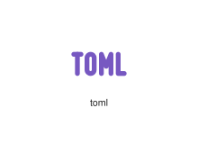
</div>
</div>

{{#endtab}}
{{#tab name="Code"}}

```xml
{{#include ../samples/icons/Tabler-Icons/toml-3c3cb24b.xal}}
```

{{#endtab}}
{{#endtabs}}

<div class="xal-ref-tag"><code>&lt;item id=&#34;104624&#34; /&gt;</code></div>

</div>
<div class="xal-ref-card">
<div class="xal-ref-title">tool</div>

{{#tabs name="svg-ref-4625"}}
{{#tab name="Preview"}}
<div class="xal-ref-preview">
<div>
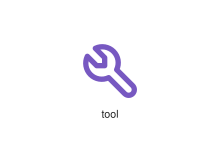
</div>
</div>

{{#endtab}}
{{#tab name="Code"}}

```xml
{{#include ../samples/icons/Tabler-Icons/tool-71f41340.xal}}
```

{{#endtab}}
{{#endtabs}}

<div class="xal-ref-tag"><code>&lt;item id=&#34;104625&#34; /&gt;</code></div>

</div>
<div class="xal-ref-card">
<div class="xal-ref-title">tools-kitchen-2-off</div>

{{#tabs name="svg-ref-4626"}}
{{#tab name="Preview"}}
<div class="xal-ref-preview">
<div>
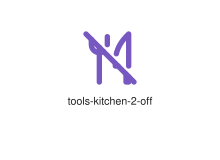
</div>
</div>

{{#endtab}}
{{#tab name="Code"}}

```xml
{{#include ../samples/icons/Tabler-Icons/tools-kitchen-2-off-e8dcf129.xal}}
```

{{#endtab}}
{{#endtabs}}

<div class="xal-ref-tag"><code>&lt;item id=&#34;104629&#34; /&gt;</code></div>

</div>
<div class="xal-ref-card">
<div class="xal-ref-title">tools-kitchen-2</div>

{{#tabs name="svg-ref-4627"}}
{{#tab name="Preview"}}
<div class="xal-ref-preview">
<div>
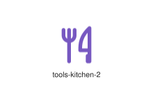
</div>
</div>

{{#endtab}}
{{#tab name="Code"}}

```xml
{{#include ../samples/icons/Tabler-Icons/tools-kitchen-2-528371b1.xal}}
```

{{#endtab}}
{{#endtabs}}

<div class="xal-ref-tag"><code>&lt;item id=&#34;104628&#34; /&gt;</code></div>

</div>
<div class="xal-ref-card">
<div class="xal-ref-title">tools-kitchen-3</div>

{{#tabs name="svg-ref-4628"}}
{{#tab name="Preview"}}
<div class="xal-ref-preview">
<div>
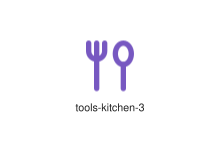
</div>
</div>

{{#endtab}}
{{#tab name="Code"}}

```xml
{{#include ../samples/icons/Tabler-Icons/tools-kitchen-3-6fe35801.xal}}
```

{{#endtab}}
{{#endtabs}}

<div class="xal-ref-tag"><code>&lt;item id=&#34;104630&#34; /&gt;</code></div>

</div>
<div class="xal-ref-card">
<div class="xal-ref-title">tools-kitchen-off</div>

{{#tabs name="svg-ref-4629"}}
{{#tab name="Preview"}}
<div class="xal-ref-preview">
<div>
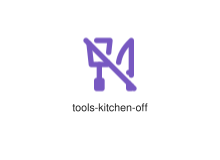
</div>
</div>

{{#endtab}}
{{#tab name="Code"}}

```xml
{{#include ../samples/icons/Tabler-Icons/tools-kitchen-off-2d2980c1.xal}}
```

{{#endtab}}
{{#endtabs}}

<div class="xal-ref-tag"><code>&lt;item id=&#34;104631&#34; /&gt;</code></div>

</div>
<div class="xal-ref-card">
<div class="xal-ref-title">tools-kitchen</div>

{{#tabs name="svg-ref-4630"}}
{{#tab name="Preview"}}
<div class="xal-ref-preview">
<div>
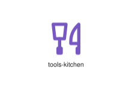
</div>
</div>

{{#endtab}}
{{#tab name="Code"}}

```xml
{{#include ../samples/icons/Tabler-Icons/tools-kitchen-f307c2e4.xal}}
```

{{#endtab}}
{{#endtabs}}

<div class="xal-ref-tag"><code>&lt;item id=&#34;104627&#34; /&gt;</code></div>

</div>
<div class="xal-ref-card">
<div class="xal-ref-title">tools-off</div>

{{#tabs name="svg-ref-4631"}}
{{#tab name="Preview"}}
<div class="xal-ref-preview">
<div>
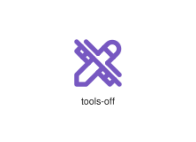
</div>
</div>

{{#endtab}}
{{#tab name="Code"}}

```xml
{{#include ../samples/icons/Tabler-Icons/tools-off-08a42f91.xal}}
```

{{#endtab}}
{{#endtabs}}

<div class="xal-ref-tag"><code>&lt;item id=&#34;104632&#34; /&gt;</code></div>

</div>
<div class="xal-ref-card">
<div class="xal-ref-title">tools</div>

{{#tabs name="svg-ref-4632"}}
{{#tab name="Preview"}}
<div class="xal-ref-preview">
<div>
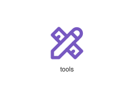
</div>
</div>

{{#endtab}}
{{#tab name="Code"}}

```xml
{{#include ../samples/icons/Tabler-Icons/tools-db8f930b.xal}}
```

{{#endtab}}
{{#endtabs}}

<div class="xal-ref-tag"><code>&lt;item id=&#34;104626&#34; /&gt;</code></div>

</div>
<div class="xal-ref-card">
<div class="xal-ref-title">tooltip</div>

{{#tabs name="svg-ref-4633"}}
{{#tab name="Preview"}}
<div class="xal-ref-preview">
<div>
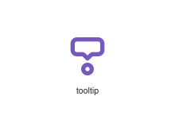
</div>
</div>

{{#endtab}}
{{#tab name="Code"}}

```xml
{{#include ../samples/icons/Tabler-Icons/tooltip-e454aaa5.xal}}
```

{{#endtab}}
{{#endtabs}}

<div class="xal-ref-tag"><code>&lt;item id=&#34;104633&#34; /&gt;</code></div>

</div>
<div class="xal-ref-card">
<div class="xal-ref-title">topology-bus</div>

{{#tabs name="svg-ref-4634"}}
{{#tab name="Preview"}}
<div class="xal-ref-preview">
<div>

</div>
</div>

{{#endtab}}
{{#tab name="Code"}}

```xml
{{#include ../samples/icons/Tabler-Icons/topology-bus-2e20e90c.xal}}
```

{{#endtab}}
{{#endtabs}}

<div class="xal-ref-tag"><code>&lt;item id=&#34;104634&#34; /&gt;</code></div>

</div>
<div class="xal-ref-card">
<div class="xal-ref-title">topology-complex</div>

{{#tabs name="svg-ref-4635"}}
{{#tab name="Preview"}}
<div class="xal-ref-preview">
<div>
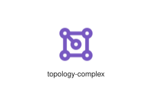
</div>
</div>

{{#endtab}}
{{#tab name="Code"}}

```xml
{{#include ../samples/icons/Tabler-Icons/topology-complex-1bd2acde.xal}}
```

{{#endtab}}
{{#endtabs}}

<div class="xal-ref-tag"><code>&lt;item id=&#34;104635&#34; /&gt;</code></div>

</div>
<div class="xal-ref-card">
<div class="xal-ref-title">topology-full-hierarchy</div>

{{#tabs name="svg-ref-4636"}}
{{#tab name="Preview"}}
<div class="xal-ref-preview">
<div>
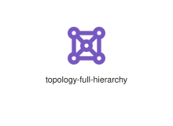
</div>
</div>

{{#endtab}}
{{#tab name="Code"}}

```xml
{{#include ../samples/icons/Tabler-Icons/topology-full-hierarchy-eebf45db.xal}}
```

{{#endtab}}
{{#endtabs}}

<div class="xal-ref-tag"><code>&lt;item id=&#34;104637&#34; /&gt;</code></div>

</div>
<div class="xal-ref-card">
<div class="xal-ref-title">topology-full</div>

{{#tabs name="svg-ref-4637"}}
{{#tab name="Preview"}}
<div class="xal-ref-preview">
<div>
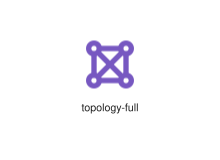
</div>
</div>

{{#endtab}}
{{#tab name="Code"}}

```xml
{{#include ../samples/icons/Tabler-Icons/topology-full-30c0f4ad.xal}}
```

{{#endtab}}
{{#endtabs}}

<div class="xal-ref-tag"><code>&lt;item id=&#34;104636&#34; /&gt;</code></div>

</div>
<div class="xal-ref-card">
<div class="xal-ref-title">topology-ring-2</div>

{{#tabs name="svg-ref-4638"}}
{{#tab name="Preview"}}
<div class="xal-ref-preview">
<div>
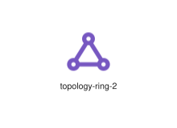
</div>
</div>

{{#endtab}}
{{#tab name="Code"}}

```xml
{{#include ../samples/icons/Tabler-Icons/topology-ring-2-981110d3.xal}}
```

{{#endtab}}
{{#endtabs}}

<div class="xal-ref-tag"><code>&lt;item id=&#34;104639&#34; /&gt;</code></div>

</div>
<div class="xal-ref-card">
<div class="xal-ref-title">topology-ring-3</div>

{{#tabs name="svg-ref-4639"}}
{{#tab name="Preview"}}
<div class="xal-ref-preview">
<div>
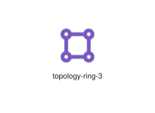
</div>
</div>

{{#endtab}}
{{#tab name="Code"}}

```xml
{{#include ../samples/icons/Tabler-Icons/topology-ring-3-a5713963.xal}}
```

{{#endtab}}
{{#endtabs}}

<div class="xal-ref-tag"><code>&lt;item id=&#34;104640&#34; /&gt;</code></div>

</div>
<div class="xal-ref-card">
<div class="xal-ref-title">topology-ring</div>

{{#tabs name="svg-ref-4640"}}
{{#tab name="Preview"}}
<div class="xal-ref-preview">
<div>
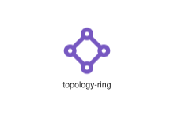
</div>
</div>

{{#endtab}}
{{#tab name="Code"}}

```xml
{{#include ../samples/icons/Tabler-Icons/topology-ring-5257addc.xal}}
```

{{#endtab}}
{{#endtabs}}

<div class="xal-ref-tag"><code>&lt;item id=&#34;104638&#34; /&gt;</code></div>

</div>
<div class="xal-ref-card">
<div class="xal-ref-title">topology-star-2</div>

{{#tabs name="svg-ref-4641"}}
{{#tab name="Preview"}}
<div class="xal-ref-preview">
<div>
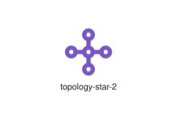
</div>
</div>

{{#endtab}}
{{#tab name="Code"}}

```xml
{{#include ../samples/icons/Tabler-Icons/topology-star-2-c69a7f0e.xal}}
```

{{#endtab}}
{{#endtabs}}

<div class="xal-ref-tag"><code>&lt;item id=&#34;104642&#34; /&gt;</code></div>

</div>
<div class="xal-ref-card">
<div class="xal-ref-title">topology-star-3</div>

{{#tabs name="svg-ref-4642"}}
{{#tab name="Preview"}}
<div class="xal-ref-preview">
<div>

</div>
</div>

{{#endtab}}
{{#tab name="Code"}}

```xml
{{#include ../samples/icons/Tabler-Icons/topology-star-3-fbfa56be.xal}}
```

{{#endtab}}
{{#endtabs}}

<div class="xal-ref-tag"><code>&lt;item id=&#34;104643&#34; /&gt;</code></div>

</div>
<div class="xal-ref-card">
<div class="xal-ref-title">topology-star-ring-2</div>

{{#tabs name="svg-ref-4643"}}
{{#tab name="Preview"}}
<div class="xal-ref-preview">
<div>

</div>
</div>

{{#endtab}}
{{#tab name="Code"}}

```xml
{{#include ../samples/icons/Tabler-Icons/topology-star-ring-2-ecff88d5.xal}}
```

{{#endtab}}
{{#endtabs}}

<div class="xal-ref-tag"><code>&lt;item id=&#34;104645&#34; /&gt;</code></div>

</div>
<div class="xal-ref-card">
<div class="xal-ref-title">topology-star-ring-3</div>

{{#tabs name="svg-ref-4644"}}
{{#tab name="Preview"}}
<div class="xal-ref-preview">
<div>
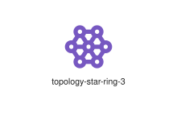
</div>
</div>

{{#endtab}}
{{#tab name="Code"}}

```xml
{{#include ../samples/icons/Tabler-Icons/topology-star-ring-3-d19fa165.xal}}
```

{{#endtab}}
{{#endtabs}}

<div class="xal-ref-tag"><code>&lt;item id=&#34;104646&#34; /&gt;</code></div>

</div>
<div class="xal-ref-card">
<div class="xal-ref-title">topology-star-ring</div>

{{#tabs name="svg-ref-4645"}}
{{#tab name="Preview"}}
<div class="xal-ref-preview">
<div>

</div>
</div>

{{#endtab}}
{{#tab name="Code"}}

```xml
{{#include ../samples/icons/Tabler-Icons/topology-star-ring-1d4326e5.xal}}
```

{{#endtab}}
{{#endtabs}}

<div class="xal-ref-tag"><code>&lt;item id=&#34;104644&#34; /&gt;</code></div>

</div>
<div class="xal-ref-card">
<div class="xal-ref-title">topology-star</div>

{{#tabs name="svg-ref-4646"}}
{{#tab name="Preview"}}
<div class="xal-ref-preview">
<div>

</div>
</div>

{{#endtab}}
{{#tab name="Code"}}

```xml
{{#include ../samples/icons/Tabler-Icons/topology-star-c1a2fa6b.xal}}
```

{{#endtab}}
{{#endtabs}}

<div class="xal-ref-tag"><code>&lt;item id=&#34;104641&#34; /&gt;</code></div>

</div>
<div class="xal-ref-card">
<div class="xal-ref-title">torii</div>

{{#tabs name="svg-ref-4647"}}
{{#tab name="Preview"}}
<div class="xal-ref-preview">
<div>
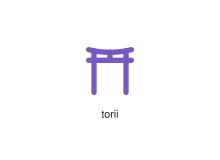
</div>
</div>

{{#endtab}}
{{#tab name="Code"}}

```xml
{{#include ../samples/icons/Tabler-Icons/torii-a71b7095.xal}}
```

{{#endtab}}
{{#endtabs}}

<div class="xal-ref-tag"><code>&lt;item id=&#34;104647&#34; /&gt;</code></div>

</div>
<div class="xal-ref-card">
<div class="xal-ref-title">tornado</div>

{{#tabs name="svg-ref-4648"}}
{{#tab name="Preview"}}
<div class="xal-ref-preview">
<div>
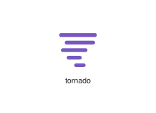
</div>
</div>

{{#endtab}}
{{#tab name="Code"}}

```xml
{{#include ../samples/icons/Tabler-Icons/tornado-9036a81a.xal}}
```

{{#endtab}}
{{#endtabs}}

<div class="xal-ref-tag"><code>&lt;item id=&#34;104648&#34; /&gt;</code></div>

</div>
<div class="xal-ref-card">
<div class="xal-ref-title">tournament</div>

{{#tabs name="svg-ref-4649"}}
{{#tab name="Preview"}}
<div class="xal-ref-preview">
<div>

</div>
</div>

{{#endtab}}
{{#tab name="Code"}}

```xml
{{#include ../samples/icons/Tabler-Icons/tournament-f7c572f3.xal}}
```

{{#endtab}}
{{#endtabs}}

<div class="xal-ref-tag"><code>&lt;item id=&#34;104649&#34; /&gt;</code></div>

</div>
<div class="xal-ref-card">
<div class="xal-ref-title">tower-off</div>

{{#tabs name="svg-ref-4650"}}
{{#tab name="Preview"}}
<div class="xal-ref-preview">
<div>
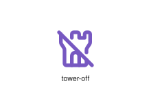
</div>
</div>

{{#endtab}}
{{#tab name="Code"}}

```xml
{{#include ../samples/icons/Tabler-Icons/tower-off-f7ff3596.xal}}
```

{{#endtab}}
{{#endtabs}}

<div class="xal-ref-tag"><code>&lt;item id=&#34;104651&#34; /&gt;</code></div>

</div>
<div class="xal-ref-card">
<div class="xal-ref-title">tower</div>

{{#tabs name="svg-ref-4651"}}
{{#tab name="Preview"}}
<div class="xal-ref-preview">
<div>
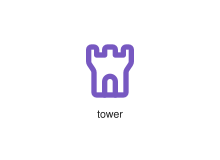
</div>
</div>

{{#endtab}}
{{#tab name="Code"}}

```xml
{{#include ../samples/icons/Tabler-Icons/tower-95d139da.xal}}
```

{{#endtab}}
{{#endtabs}}

<div class="xal-ref-tag"><code>&lt;item id=&#34;104650&#34; /&gt;</code></div>

</div>
<div class="xal-ref-card">
<div class="xal-ref-title">track</div>

{{#tabs name="svg-ref-4652"}}
{{#tab name="Preview"}}
<div class="xal-ref-preview">
<div>
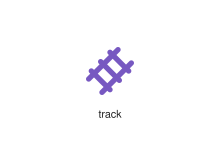
</div>
</div>

{{#endtab}}
{{#tab name="Code"}}

```xml
{{#include ../samples/icons/Tabler-Icons/track-cdc8a23a.xal}}
```

{{#endtab}}
{{#endtabs}}

<div class="xal-ref-tag"><code>&lt;item id=&#34;104652&#34; /&gt;</code></div>

</div>
<div class="xal-ref-card">
<div class="xal-ref-title">tractor</div>

{{#tabs name="svg-ref-4653"}}
{{#tab name="Preview"}}
<div class="xal-ref-preview">
<div>
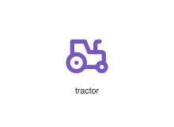
</div>
</div>

{{#endtab}}
{{#tab name="Code"}}

```xml
{{#include ../samples/icons/Tabler-Icons/tractor-8b7fd9be.xal}}
```

{{#endtab}}
{{#endtabs}}

<div class="xal-ref-tag"><code>&lt;item id=&#34;104653&#34; /&gt;</code></div>

</div>
<div class="xal-ref-card">
<div class="xal-ref-title">trademark</div>

{{#tabs name="svg-ref-4654"}}
{{#tab name="Preview"}}
<div class="xal-ref-preview">
<div>

</div>
</div>

{{#endtab}}
{{#tab name="Code"}}

```xml
{{#include ../samples/icons/Tabler-Icons/trademark-1d1dae06.xal}}
```

{{#endtab}}
{{#endtabs}}

<div class="xal-ref-tag"><code>&lt;item id=&#34;104654&#34; /&gt;</code></div>

</div>
<div class="xal-ref-card">
<div class="xal-ref-title">traffic-cone-off</div>

{{#tabs name="svg-ref-4655"}}
{{#tab name="Preview"}}
<div class="xal-ref-preview">
<div>
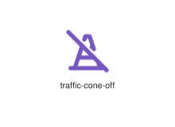
</div>
</div>

{{#endtab}}
{{#tab name="Code"}}

```xml
{{#include ../samples/icons/Tabler-Icons/traffic-cone-off-b8f74d25.xal}}
```

{{#endtab}}
{{#endtabs}}

<div class="xal-ref-tag"><code>&lt;item id=&#34;104656&#34; /&gt;</code></div>

</div>
<div class="xal-ref-card">
<div class="xal-ref-title">traffic-cone</div>

{{#tabs name="svg-ref-4656"}}
{{#tab name="Preview"}}
<div class="xal-ref-preview">
<div>
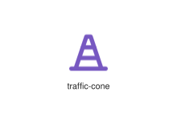
</div>
</div>

{{#endtab}}
{{#tab name="Code"}}

```xml
{{#include ../samples/icons/Tabler-Icons/traffic-cone-15c260fa.xal}}
```

{{#endtab}}
{{#endtabs}}

<div class="xal-ref-tag"><code>&lt;item id=&#34;104655&#34; /&gt;</code></div>

</div>
<div class="xal-ref-card">
<div class="xal-ref-title">traffic-lights-off</div>

{{#tabs name="svg-ref-4657"}}
{{#tab name="Preview"}}
<div class="xal-ref-preview">
<div>

</div>
</div>

{{#endtab}}
{{#tab name="Code"}}

```xml
{{#include ../samples/icons/Tabler-Icons/traffic-lights-off-1bbf4a69.xal}}
```

{{#endtab}}
{{#endtabs}}

<div class="xal-ref-tag"><code>&lt;item id=&#34;104658&#34; /&gt;</code></div>

</div>
<div class="xal-ref-card">
<div class="xal-ref-title">traffic-lights</div>

{{#tabs name="svg-ref-4658"}}
{{#tab name="Preview"}}
<div class="xal-ref-preview">
<div>
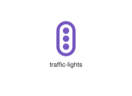
</div>
</div>

{{#endtab}}
{{#tab name="Code"}}

```xml
{{#include ../samples/icons/Tabler-Icons/traffic-lights-0c811a45.xal}}
```

{{#endtab}}
{{#endtabs}}

<div class="xal-ref-tag"><code>&lt;item id=&#34;104657&#34; /&gt;</code></div>

</div>
<div class="xal-ref-card">
<div class="xal-ref-title">train</div>

{{#tabs name="svg-ref-4659"}}
{{#tab name="Preview"}}
<div class="xal-ref-preview">
<div>

</div>
</div>

{{#endtab}}
{{#tab name="Code"}}

```xml
{{#include ../samples/icons/Tabler-Icons/train-a4b30e2c.xal}}
```

{{#endtab}}
{{#endtabs}}

<div class="xal-ref-tag"><code>&lt;item id=&#34;104659&#34; /&gt;</code></div>

</div>
<div class="xal-ref-card">
<div class="xal-ref-title">transaction-bitcoin</div>

{{#tabs name="svg-ref-4660"}}
{{#tab name="Preview"}}
<div class="xal-ref-preview">
<div>

</div>
</div>

{{#endtab}}
{{#tab name="Code"}}

```xml
{{#include ../samples/icons/Tabler-Icons/transaction-bitcoin-cc082e41.xal}}
```

{{#endtab}}
{{#endtabs}}

<div class="xal-ref-tag"><code>&lt;item id=&#34;104660&#34; /&gt;</code></div>

</div>
<div class="xal-ref-card">
<div class="xal-ref-title">transaction-dollar</div>

{{#tabs name="svg-ref-4661"}}
{{#tab name="Preview"}}
<div class="xal-ref-preview">
<div>

</div>
</div>

{{#endtab}}
{{#tab name="Code"}}

```xml
{{#include ../samples/icons/Tabler-Icons/transaction-dollar-e9ac01c5.xal}}
```

{{#endtab}}
{{#endtabs}}

<div class="xal-ref-tag"><code>&lt;item id=&#34;104661&#34; /&gt;</code></div>

</div>
<div class="xal-ref-card">
<div class="xal-ref-title">transaction-euro</div>

{{#tabs name="svg-ref-4662"}}
{{#tab name="Preview"}}
<div class="xal-ref-preview">
<div>

</div>
</div>

{{#endtab}}
{{#tab name="Code"}}

```xml
{{#include ../samples/icons/Tabler-Icons/transaction-euro-a0f36177.xal}}
```

{{#endtab}}
{{#endtabs}}

<div class="xal-ref-tag"><code>&lt;item id=&#34;104662&#34; /&gt;</code></div>

</div>
<div class="xal-ref-card">
<div class="xal-ref-title">transaction-pound</div>

{{#tabs name="svg-ref-4663"}}
{{#tab name="Preview"}}
<div class="xal-ref-preview">
<div>

</div>
</div>

{{#endtab}}
{{#tab name="Code"}}

```xml
{{#include ../samples/icons/Tabler-Icons/transaction-pound-b4f4bd12.xal}}
```

{{#endtab}}
{{#endtabs}}

<div class="xal-ref-tag"><code>&lt;item id=&#34;104663&#34; /&gt;</code></div>

</div>
<div class="xal-ref-card">
<div class="xal-ref-title">transaction-rupee</div>

{{#tabs name="svg-ref-4664"}}
{{#tab name="Preview"}}
<div class="xal-ref-preview">
<div>

</div>
</div>

{{#endtab}}
{{#tab name="Code"}}

```xml
{{#include ../samples/icons/Tabler-Icons/transaction-rupee-72e64ea3.xal}}
```

{{#endtab}}
{{#endtabs}}

<div class="xal-ref-tag"><code>&lt;item id=&#34;104664&#34; /&gt;</code></div>

</div>
<div class="xal-ref-card">
<div class="xal-ref-title">transaction-yen</div>

{{#tabs name="svg-ref-4665"}}
{{#tab name="Preview"}}
<div class="xal-ref-preview">
<div>

</div>
</div>

{{#endtab}}
{{#tab name="Code"}}

```xml
{{#include ../samples/icons/Tabler-Icons/transaction-yen-a05aa70f.xal}}
```

{{#endtab}}
{{#endtabs}}

<div class="xal-ref-tag"><code>&lt;item id=&#34;104665&#34; /&gt;</code></div>

</div>
<div class="xal-ref-card">
<div class="xal-ref-title">transaction-yuan</div>

{{#tabs name="svg-ref-4666"}}
{{#tab name="Preview"}}
<div class="xal-ref-preview">
<div>

</div>
</div>

{{#endtab}}
{{#tab name="Code"}}

```xml
{{#include ../samples/icons/Tabler-Icons/transaction-yuan-33c51c96.xal}}
```

{{#endtab}}
{{#endtabs}}

<div class="xal-ref-tag"><code>&lt;item id=&#34;104666&#34; /&gt;</code></div>

</div>
<div class="xal-ref-card">
<div class="xal-ref-title">transfer-in</div>

{{#tabs name="svg-ref-4667"}}
{{#tab name="Preview"}}
<div class="xal-ref-preview">
<div>

</div>
</div>

{{#endtab}}
{{#tab name="Code"}}

```xml
{{#include ../samples/icons/Tabler-Icons/transfer-in-3d464557.xal}}
```

{{#endtab}}
{{#endtabs}}

<div class="xal-ref-tag"><code>&lt;item id=&#34;104668&#34; /&gt;</code></div>

</div>
<div class="xal-ref-card">
<div class="xal-ref-title">transfer-out</div>

{{#tabs name="svg-ref-4668"}}
{{#tab name="Preview"}}
<div class="xal-ref-preview">
<div>

</div>
</div>

{{#endtab}}
{{#tab name="Code"}}

```xml
{{#include ../samples/icons/Tabler-Icons/transfer-out-e0f1bfe8.xal}}
```

{{#endtab}}
{{#endtabs}}

<div class="xal-ref-tag"><code>&lt;item id=&#34;104669&#34; /&gt;</code></div>

</div>
<div class="xal-ref-card">
<div class="xal-ref-title">transfer-vertical</div>

{{#tabs name="svg-ref-4669"}}
{{#tab name="Preview"}}
<div class="xal-ref-preview">
<div>

</div>
</div>

{{#endtab}}
{{#tab name="Code"}}

```xml
{{#include ../samples/icons/Tabler-Icons/transfer-vertical-4a25a499.xal}}
```

{{#endtab}}
{{#endtabs}}

<div class="xal-ref-tag"><code>&lt;item id=&#34;104670&#34; /&gt;</code></div>

</div>
<div class="xal-ref-card">
<div class="xal-ref-title">transfer</div>

{{#tabs name="svg-ref-4670"}}
{{#tab name="Preview"}}
<div class="xal-ref-preview">
<div>

</div>
</div>

{{#endtab}}
{{#tab name="Code"}}

```xml
{{#include ../samples/icons/Tabler-Icons/transfer-ccd177d4.xal}}
```

{{#endtab}}
{{#endtabs}}

<div class="xal-ref-tag"><code>&lt;item id=&#34;104667&#34; /&gt;</code></div>

</div>
<div class="xal-ref-card">
<div class="xal-ref-title">transform-point-bottom-left</div>

{{#tabs name="svg-ref-4671"}}
{{#tab name="Preview"}}
<div class="xal-ref-preview">
<div>

</div>
</div>

{{#endtab}}
{{#tab name="Code"}}

```xml
{{#include ../samples/icons/Tabler-Icons/transform-point-bottom-left-fa098c8d.xal}}
```

{{#endtab}}
{{#endtabs}}

<div class="xal-ref-tag"><code>&lt;item id=&#34;104673&#34; /&gt;</code></div>

</div>
<div class="xal-ref-card">
<div class="xal-ref-title">transform-point-bottom-right</div>

{{#tabs name="svg-ref-4672"}}
{{#tab name="Preview"}}
<div class="xal-ref-preview">
<div>

</div>
</div>

{{#endtab}}
{{#tab name="Code"}}

```xml
{{#include ../samples/icons/Tabler-Icons/transform-point-bottom-right-6d3f4971.xal}}
```

{{#endtab}}
{{#endtabs}}

<div class="xal-ref-tag"><code>&lt;item id=&#34;104674&#34; /&gt;</code></div>

</div>
<div class="xal-ref-card">
<div class="xal-ref-title">transform-point-top-left</div>

{{#tabs name="svg-ref-4673"}}
{{#tab name="Preview"}}
<div class="xal-ref-preview">
<div>

</div>
</div>

{{#endtab}}
{{#tab name="Code"}}

```xml
{{#include ../samples/icons/Tabler-Icons/transform-point-top-left-bdeda63b.xal}}
```

{{#endtab}}
{{#endtabs}}

<div class="xal-ref-tag"><code>&lt;item id=&#34;104675&#34; /&gt;</code></div>

</div>
<div class="xal-ref-card">
<div class="xal-ref-title">transform-point-top-right</div>

{{#tabs name="svg-ref-4674"}}
{{#tab name="Preview"}}
<div class="xal-ref-preview">
<div>

</div>
</div>

{{#endtab}}
{{#tab name="Code"}}

```xml
{{#include ../samples/icons/Tabler-Icons/transform-point-top-right-4f7abbe2.xal}}
```

{{#endtab}}
{{#endtabs}}

<div class="xal-ref-tag"><code>&lt;item id=&#34;104676&#34; /&gt;</code></div>

</div>
<div class="xal-ref-card">
<div class="xal-ref-title">transform-point</div>

{{#tabs name="svg-ref-4675"}}
{{#tab name="Preview"}}
<div class="xal-ref-preview">
<div>

</div>
</div>

{{#endtab}}
{{#tab name="Code"}}

```xml
{{#include ../samples/icons/Tabler-Icons/transform-point-b2750a96.xal}}
```

{{#endtab}}
{{#endtabs}}

<div class="xal-ref-tag"><code>&lt;item id=&#34;104672&#34; /&gt;</code></div>

</div>
<div class="xal-ref-card">
<div class="xal-ref-title">transform</div>

{{#tabs name="svg-ref-4676"}}
{{#tab name="Preview"}}
<div class="xal-ref-preview">
<div>

</div>
</div>

{{#endtab}}
{{#tab name="Code"}}

```xml
{{#include ../samples/icons/Tabler-Icons/transform-57f0979f.xal}}
```

{{#endtab}}
{{#endtabs}}

<div class="xal-ref-tag"><code>&lt;item id=&#34;104671&#34; /&gt;</code></div>

</div>
<div class="xal-ref-card">
<div class="xal-ref-title">transition-bottom</div>

{{#tabs name="svg-ref-4677"}}
{{#tab name="Preview"}}
<div class="xal-ref-preview">
<div>

</div>
</div>

{{#endtab}}
{{#tab name="Code"}}

```xml
{{#include ../samples/icons/Tabler-Icons/transition-bottom-e00454f3.xal}}
```

{{#endtab}}
{{#endtabs}}

<div class="xal-ref-tag"><code>&lt;item id=&#34;104677&#34; /&gt;</code></div>

</div>
<div class="xal-ref-card">
<div class="xal-ref-title">transition-left</div>

{{#tabs name="svg-ref-4678"}}
{{#tab name="Preview"}}
<div class="xal-ref-preview">
<div>

</div>
</div>

{{#endtab}}
{{#tab name="Code"}}

```xml
{{#include ../samples/icons/Tabler-Icons/transition-left-c125a252.xal}}
```

{{#endtab}}
{{#endtabs}}

<div class="xal-ref-tag"><code>&lt;item id=&#34;104678&#34; /&gt;</code></div>

</div>
<div class="xal-ref-card">
<div class="xal-ref-title">transition-right</div>

{{#tabs name="svg-ref-4679"}}
{{#tab name="Preview"}}
<div class="xal-ref-preview">
<div>

</div>
</div>

{{#endtab}}
{{#tab name="Code"}}

```xml
{{#include ../samples/icons/Tabler-Icons/transition-right-7b68aa1a.xal}}
```

{{#endtab}}
{{#endtabs}}

<div class="xal-ref-tag"><code>&lt;item id=&#34;104679&#34; /&gt;</code></div>

</div>
</div>
