# Tabler-Icons - Page 53

This page references SVG files under `etc/resources/aws/svg/Tabler-Icons`.
Each card shows the SVG preview first and the XAL tag syntax in the Code tab.
Showing 4681-4770 of 4964 SVG files.

<style>
.xal-ref-grid{display:grid;grid-template-columns:repeat(3,minmax(0,1fr));gap:1rem;margin:1rem 0 1.5rem}.xal-ref-card{border:1px solid var(--table-border-color);border-radius:8px;overflow:hidden;background:var(--bg);padding:.75rem}.xal-ref-title{font-size:.9rem;font-weight:600;line-height:1.25;margin:0 0 .5rem;overflow-wrap:anywhere}.xal-ref-preview{display:flex;align-items:center;justify-content:center}.xal-ref-preview img{display:block;width:100%;height:auto}.xal-ref-card pre{margin:0;max-height:18rem;overflow:auto;white-space:pre}.xal-ref-card code{font-size:.78em}.xal-ref-tag{margin:.5rem 0 0;color:var(--fg);opacity:.72;overflow:auto;white-space:pre}.xal-ref-tag code{font-size:.72em}@media(max-width:900px){.xal-ref-grid{grid-template-columns:repeat(2,minmax(0,1fr))}}@media(max-width:560px){.xal-ref-grid{grid-template-columns:1fr}}
</style>

[Back to section index](tabler-icons.md)

<div class="xal-ref-grid">
<div class="xal-ref-card">
<div class="xal-ref-title">transition-top</div>

{{#tabs name="svg-ref-4680"}}
{{#tab name="Preview"}}
<div class="xal-ref-preview">
<div>
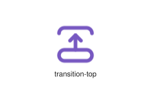
</div>
</div>

{{#endtab}}
{{#tab name="Code"}}

```xml
{{#include ../samples/icons/Tabler-Icons/transition-top-86cc9c00.xal}}
```

{{#endtab}}
{{#endtabs}}

<div class="xal-ref-tag"><code>&lt;item id=&#34;104680&#34; /&gt;</code></div>

</div>
<div class="xal-ref-card">
<div class="xal-ref-title">trash-off</div>

{{#tabs name="svg-ref-4681"}}
{{#tab name="Preview"}}
<div class="xal-ref-preview">
<div>
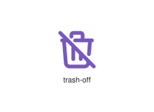
</div>
</div>

{{#endtab}}
{{#tab name="Code"}}

```xml
{{#include ../samples/icons/Tabler-Icons/trash-off-3055ee4c.xal}}
```

{{#endtab}}
{{#endtabs}}

<div class="xal-ref-tag"><code>&lt;item id=&#34;104682&#34; /&gt;</code></div>

</div>
<div class="xal-ref-card">
<div class="xal-ref-title">trash-x</div>

{{#tabs name="svg-ref-4682"}}
{{#tab name="Preview"}}
<div class="xal-ref-preview">
<div>

</div>
</div>

{{#endtab}}
{{#tab name="Code"}}

```xml
{{#include ../samples/icons/Tabler-Icons/trash-x-5f9aade9.xal}}
```

{{#endtab}}
{{#endtabs}}

<div class="xal-ref-tag"><code>&lt;item id=&#34;104683&#34; /&gt;</code></div>

</div>
<div class="xal-ref-card">
<div class="xal-ref-title">trash</div>

{{#tabs name="svg-ref-4683"}}
{{#tab name="Preview"}}
<div class="xal-ref-preview">
<div>
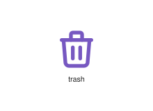
</div>
</div>

{{#endtab}}
{{#tab name="Code"}}

```xml
{{#include ../samples/icons/Tabler-Icons/trash-89beda71.xal}}
```

{{#endtab}}
{{#endtabs}}

<div class="xal-ref-tag"><code>&lt;item id=&#34;104681&#34; /&gt;</code></div>

</div>
<div class="xal-ref-card">
<div class="xal-ref-title">treadmill</div>

{{#tabs name="svg-ref-4684"}}
{{#tab name="Preview"}}
<div class="xal-ref-preview">
<div>

</div>
</div>

{{#endtab}}
{{#tab name="Code"}}

```xml
{{#include ../samples/icons/Tabler-Icons/treadmill-e485f31f.xal}}
```

{{#endtab}}
{{#endtabs}}

<div class="xal-ref-tag"><code>&lt;item id=&#34;104684&#34; /&gt;</code></div>

</div>
<div class="xal-ref-card">
<div class="xal-ref-title">tree</div>

{{#tabs name="svg-ref-4685"}}
{{#tab name="Preview"}}
<div class="xal-ref-preview">
<div>
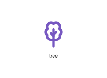
</div>
</div>

{{#endtab}}
{{#tab name="Code"}}

```xml
{{#include ../samples/icons/Tabler-Icons/tree-db76af59.xal}}
```

{{#endtab}}
{{#endtabs}}

<div class="xal-ref-tag"><code>&lt;item id=&#34;104685&#34; /&gt;</code></div>

</div>
<div class="xal-ref-card">
<div class="xal-ref-title">trees</div>

{{#tabs name="svg-ref-4686"}}
{{#tab name="Preview"}}
<div class="xal-ref-preview">
<div>
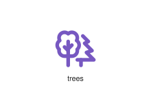
</div>
</div>

{{#endtab}}
{{#tab name="Code"}}

```xml
{{#include ../samples/icons/Tabler-Icons/trees-bf4eb977.xal}}
```

{{#endtab}}
{{#endtabs}}

<div class="xal-ref-tag"><code>&lt;item id=&#34;104686&#34; /&gt;</code></div>

</div>
<div class="xal-ref-card">
<div class="xal-ref-title">trekking</div>

{{#tabs name="svg-ref-4687"}}
{{#tab name="Preview"}}
<div class="xal-ref-preview">
<div>

</div>
</div>

{{#endtab}}
{{#tab name="Code"}}

```xml
{{#include ../samples/icons/Tabler-Icons/trekking-147c20a7.xal}}
```

{{#endtab}}
{{#endtabs}}

<div class="xal-ref-tag"><code>&lt;item id=&#34;104687&#34; /&gt;</code></div>

</div>
<div class="xal-ref-card">
<div class="xal-ref-title">trending-down-2</div>

{{#tabs name="svg-ref-4688"}}
{{#tab name="Preview"}}
<div class="xal-ref-preview">
<div>
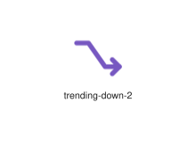
</div>
</div>

{{#endtab}}
{{#tab name="Code"}}

```xml
{{#include ../samples/icons/Tabler-Icons/trending-down-2-f2bf338d.xal}}
```

{{#endtab}}
{{#endtabs}}

<div class="xal-ref-tag"><code>&lt;item id=&#34;104689&#34; /&gt;</code></div>

</div>
<div class="xal-ref-card">
<div class="xal-ref-title">trending-down-3</div>

{{#tabs name="svg-ref-4689"}}
{{#tab name="Preview"}}
<div class="xal-ref-preview">
<div>

</div>
</div>

{{#endtab}}
{{#tab name="Code"}}

```xml
{{#include ../samples/icons/Tabler-Icons/trending-down-3-cfdf1a3d.xal}}
```

{{#endtab}}
{{#endtabs}}

<div class="xal-ref-tag"><code>&lt;item id=&#34;104690&#34; /&gt;</code></div>

</div>
<div class="xal-ref-card">
<div class="xal-ref-title">trending-down</div>

{{#tabs name="svg-ref-4690"}}
{{#tab name="Preview"}}
<div class="xal-ref-preview">
<div>

</div>
</div>

{{#endtab}}
{{#tab name="Code"}}

```xml
{{#include ../samples/icons/Tabler-Icons/trending-down-5009d44e.xal}}
```

{{#endtab}}
{{#endtabs}}

<div class="xal-ref-tag"><code>&lt;item id=&#34;104688&#34; /&gt;</code></div>

</div>
<div class="xal-ref-card">
<div class="xal-ref-title">trending-up-2</div>

{{#tabs name="svg-ref-4691"}}
{{#tab name="Preview"}}
<div class="xal-ref-preview">
<div>
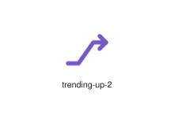
</div>
</div>

{{#endtab}}
{{#tab name="Code"}}

```xml
{{#include ../samples/icons/Tabler-Icons/trending-up-2-21780087.xal}}
```

{{#endtab}}
{{#endtabs}}

<div class="xal-ref-tag"><code>&lt;item id=&#34;104692&#34; /&gt;</code></div>

</div>
<div class="xal-ref-card">
<div class="xal-ref-title">trending-up-3</div>

{{#tabs name="svg-ref-4692"}}
{{#tab name="Preview"}}
<div class="xal-ref-preview">
<div>

</div>
</div>

{{#endtab}}
{{#tab name="Code"}}

```xml
{{#include ../samples/icons/Tabler-Icons/trending-up-3-1c182937.xal}}
```

{{#endtab}}
{{#endtabs}}

<div class="xal-ref-tag"><code>&lt;item id=&#34;104693&#34; /&gt;</code></div>

</div>
<div class="xal-ref-card">
<div class="xal-ref-title">trending-up</div>

{{#tabs name="svg-ref-4693"}}
{{#tab name="Preview"}}
<div class="xal-ref-preview">
<div>

</div>
</div>

{{#endtab}}
{{#tab name="Code"}}

```xml
{{#include ../samples/icons/Tabler-Icons/trending-up-96f3ef95.xal}}
```

{{#endtab}}
{{#endtabs}}

<div class="xal-ref-tag"><code>&lt;item id=&#34;104691&#34; /&gt;</code></div>

</div>
<div class="xal-ref-card">
<div class="xal-ref-title">triangle-inverted</div>

{{#tabs name="svg-ref-4694"}}
{{#tab name="Preview"}}
<div class="xal-ref-preview">
<div>
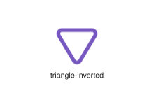
</div>
</div>

{{#endtab}}
{{#tab name="Code"}}

```xml
{{#include ../samples/icons/Tabler-Icons/triangle-inverted-acc5b222.xal}}
```

{{#endtab}}
{{#endtabs}}

<div class="xal-ref-tag"><code>&lt;item id=&#34;104695&#34; /&gt;</code></div>

</div>
<div class="xal-ref-card">
<div class="xal-ref-title">triangle-minus-2</div>

{{#tabs name="svg-ref-4695"}}
{{#tab name="Preview"}}
<div class="xal-ref-preview">
<div>
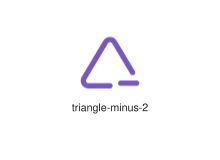
</div>
</div>

{{#endtab}}
{{#tab name="Code"}}

```xml
{{#include ../samples/icons/Tabler-Icons/triangle-minus-2-cf483b8e.xal}}
```

{{#endtab}}
{{#endtabs}}

<div class="xal-ref-tag"><code>&lt;item id=&#34;104697&#34; /&gt;</code></div>

</div>
<div class="xal-ref-card">
<div class="xal-ref-title">triangle-minus</div>

{{#tabs name="svg-ref-4696"}}
{{#tab name="Preview"}}
<div class="xal-ref-preview">
<div>
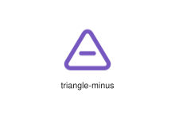
</div>
</div>

{{#endtab}}
{{#tab name="Code"}}

```xml
{{#include ../samples/icons/Tabler-Icons/triangle-minus-a2a13672.xal}}
```

{{#endtab}}
{{#endtabs}}

<div class="xal-ref-tag"><code>&lt;item id=&#34;104696&#34; /&gt;</code></div>

</div>
<div class="xal-ref-card">
<div class="xal-ref-title">triangle-off</div>

{{#tabs name="svg-ref-4697"}}
{{#tab name="Preview"}}
<div class="xal-ref-preview">
<div>
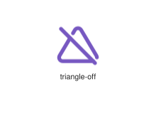
</div>
</div>

{{#endtab}}
{{#tab name="Code"}}

```xml
{{#include ../samples/icons/Tabler-Icons/triangle-off-0c37f79c.xal}}
```

{{#endtab}}
{{#endtabs}}

<div class="xal-ref-tag"><code>&lt;item id=&#34;104698&#34; /&gt;</code></div>

</div>
<div class="xal-ref-card">
<div class="xal-ref-title">triangle-plus-2</div>

{{#tabs name="svg-ref-4698"}}
{{#tab name="Preview"}}
<div class="xal-ref-preview">
<div>
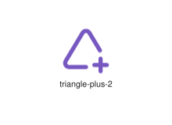
</div>
</div>

{{#endtab}}
{{#tab name="Code"}}

```xml
{{#include ../samples/icons/Tabler-Icons/triangle-plus-2-9a5ad880.xal}}
```

{{#endtab}}
{{#endtabs}}

<div class="xal-ref-tag"><code>&lt;item id=&#34;104700&#34; /&gt;</code></div>

</div>
<div class="xal-ref-card">
<div class="xal-ref-title">triangle-plus</div>

{{#tabs name="svg-ref-4699"}}
{{#tab name="Preview"}}
<div class="xal-ref-preview">
<div>
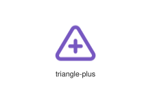
</div>
</div>

{{#endtab}}
{{#tab name="Code"}}

```xml
{{#include ../samples/icons/Tabler-Icons/triangle-plus-d03ec2ec.xal}}
```

{{#endtab}}
{{#endtabs}}

<div class="xal-ref-tag"><code>&lt;item id=&#34;104699&#34; /&gt;</code></div>

</div>
<div class="xal-ref-card">
<div class="xal-ref-title">triangle-square-circle</div>

{{#tabs name="svg-ref-4700"}}
{{#tab name="Preview"}}
<div class="xal-ref-preview">
<div>
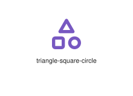
</div>
</div>

{{#endtab}}
{{#tab name="Code"}}

```xml
{{#include ../samples/icons/Tabler-Icons/triangle-square-circle-c746e3cc.xal}}
```

{{#endtab}}
{{#endtabs}}

<div class="xal-ref-tag"><code>&lt;item id=&#34;104701&#34; /&gt;</code></div>

</div>
<div class="xal-ref-card">
<div class="xal-ref-title">triangle</div>

{{#tabs name="svg-ref-4701"}}
{{#tab name="Preview"}}
<div class="xal-ref-preview">
<div>
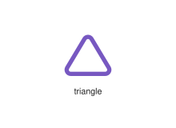
</div>
</div>

{{#endtab}}
{{#tab name="Code"}}

```xml
{{#include ../samples/icons/Tabler-Icons/triangle-b4b9cde5.xal}}
```

{{#endtab}}
{{#endtabs}}

<div class="xal-ref-tag"><code>&lt;item id=&#34;104694&#34; /&gt;</code></div>

</div>
<div class="xal-ref-card">
<div class="xal-ref-title">triangles</div>

{{#tabs name="svg-ref-4702"}}
{{#tab name="Preview"}}
<div class="xal-ref-preview">
<div>
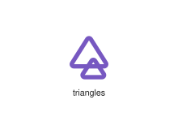
</div>
</div>

{{#endtab}}
{{#tab name="Code"}}

```xml
{{#include ../samples/icons/Tabler-Icons/triangles-7df689b2.xal}}
```

{{#endtab}}
{{#endtabs}}

<div class="xal-ref-tag"><code>&lt;item id=&#34;104702&#34; /&gt;</code></div>

</div>
<div class="xal-ref-card">
<div class="xal-ref-title">trident</div>

{{#tabs name="svg-ref-4703"}}
{{#tab name="Preview"}}
<div class="xal-ref-preview">
<div>
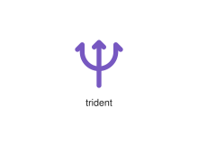
</div>
</div>

{{#endtab}}
{{#tab name="Code"}}

```xml
{{#include ../samples/icons/Tabler-Icons/trident-bfd7c3c0.xal}}
```

{{#endtab}}
{{#endtabs}}

<div class="xal-ref-tag"><code>&lt;item id=&#34;104703&#34; /&gt;</code></div>

</div>
<div class="xal-ref-card">
<div class="xal-ref-title">trolley</div>

{{#tabs name="svg-ref-4704"}}
{{#tab name="Preview"}}
<div class="xal-ref-preview">
<div>
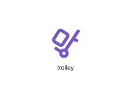
</div>
</div>

{{#endtab}}
{{#tab name="Code"}}

```xml
{{#include ../samples/icons/Tabler-Icons/trolley-18e7d05e.xal}}
```

{{#endtab}}
{{#endtabs}}

<div class="xal-ref-tag"><code>&lt;item id=&#34;104704&#34; /&gt;</code></div>

</div>
<div class="xal-ref-card">
<div class="xal-ref-title">trophy-off</div>

{{#tabs name="svg-ref-4705"}}
{{#tab name="Preview"}}
<div class="xal-ref-preview">
<div>

</div>
</div>

{{#endtab}}
{{#tab name="Code"}}

```xml
{{#include ../samples/icons/Tabler-Icons/trophy-off-db354309.xal}}
```

{{#endtab}}
{{#endtabs}}

<div class="xal-ref-tag"><code>&lt;item id=&#34;104706&#34; /&gt;</code></div>

</div>
<div class="xal-ref-card">
<div class="xal-ref-title">trophy</div>

{{#tabs name="svg-ref-4706"}}
{{#tab name="Preview"}}
<div class="xal-ref-preview">
<div>

</div>
</div>

{{#endtab}}
{{#tab name="Code"}}

```xml
{{#include ../samples/icons/Tabler-Icons/trophy-e47bc9f6.xal}}
```

{{#endtab}}
{{#endtabs}}

<div class="xal-ref-tag"><code>&lt;item id=&#34;104705&#34; /&gt;</code></div>

</div>
<div class="xal-ref-card">
<div class="xal-ref-title">trowel</div>

{{#tabs name="svg-ref-4707"}}
{{#tab name="Preview"}}
<div class="xal-ref-preview">
<div>

</div>
</div>

{{#endtab}}
{{#tab name="Code"}}

```xml
{{#include ../samples/icons/Tabler-Icons/trowel-3542fc54.xal}}
```

{{#endtab}}
{{#endtabs}}

<div class="xal-ref-tag"><code>&lt;item id=&#34;104707&#34; /&gt;</code></div>

</div>
<div class="xal-ref-card">
<div class="xal-ref-title">truck-delivery</div>

{{#tabs name="svg-ref-4708"}}
{{#tab name="Preview"}}
<div class="xal-ref-preview">
<div>

</div>
</div>

{{#endtab}}
{{#tab name="Code"}}

```xml
{{#include ../samples/icons/Tabler-Icons/truck-delivery-92e2e75d.xal}}
```

{{#endtab}}
{{#endtabs}}

<div class="xal-ref-tag"><code>&lt;item id=&#34;104709&#34; /&gt;</code></div>

</div>
<div class="xal-ref-card">
<div class="xal-ref-title">truck-loading</div>

{{#tabs name="svg-ref-4709"}}
{{#tab name="Preview"}}
<div class="xal-ref-preview">
<div>

</div>
</div>

{{#endtab}}
{{#tab name="Code"}}

```xml
{{#include ../samples/icons/Tabler-Icons/truck-loading-8e806fde.xal}}
```

{{#endtab}}
{{#endtabs}}

<div class="xal-ref-tag"><code>&lt;item id=&#34;104710&#34; /&gt;</code></div>

</div>
<div class="xal-ref-card">
<div class="xal-ref-title">truck-off</div>

{{#tabs name="svg-ref-4710"}}
{{#tab name="Preview"}}
<div class="xal-ref-preview">
<div>
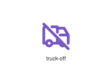
</div>
</div>

{{#endtab}}
{{#tab name="Code"}}

```xml
{{#include ../samples/icons/Tabler-Icons/truck-off-3059e428.xal}}
```

{{#endtab}}
{{#endtabs}}

<div class="xal-ref-tag"><code>&lt;item id=&#34;104711&#34; /&gt;</code></div>

</div>
<div class="xal-ref-card">
<div class="xal-ref-title">truck-return</div>

{{#tabs name="svg-ref-4711"}}
{{#tab name="Preview"}}
<div class="xal-ref-preview">
<div>

</div>
</div>

{{#endtab}}
{{#tab name="Code"}}

```xml
{{#include ../samples/icons/Tabler-Icons/truck-return-94ff4897.xal}}
```

{{#endtab}}
{{#endtabs}}

<div class="xal-ref-tag"><code>&lt;item id=&#34;104712&#34; /&gt;</code></div>

</div>
<div class="xal-ref-card">
<div class="xal-ref-title">truck</div>

{{#tabs name="svg-ref-4712"}}
{{#tab name="Preview"}}
<div class="xal-ref-preview">
<div>
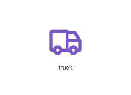
</div>
</div>

{{#endtab}}
{{#tab name="Code"}}

```xml
{{#include ../samples/icons/Tabler-Icons/truck-5e591ae7.xal}}
```

{{#endtab}}
{{#endtabs}}

<div class="xal-ref-tag"><code>&lt;item id=&#34;104708&#34; /&gt;</code></div>

</div>
<div class="xal-ref-card">
<div class="xal-ref-title">txt</div>

{{#tabs name="svg-ref-4713"}}
{{#tab name="Preview"}}
<div class="xal-ref-preview">
<div>

</div>
</div>

{{#endtab}}
{{#tab name="Code"}}

```xml
{{#include ../samples/icons/Tabler-Icons/txt-01a1d457.xal}}
```

{{#endtab}}
{{#endtabs}}

<div class="xal-ref-tag"><code>&lt;item id=&#34;104713&#34; /&gt;</code></div>

</div>
<div class="xal-ref-card">
<div class="xal-ref-title">typeface</div>

{{#tabs name="svg-ref-4714"}}
{{#tab name="Preview"}}
<div class="xal-ref-preview">
<div>
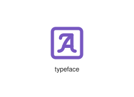
</div>
</div>

{{#endtab}}
{{#tab name="Code"}}

```xml
{{#include ../samples/icons/Tabler-Icons/typeface-50ac2dd5.xal}}
```

{{#endtab}}
{{#endtabs}}

<div class="xal-ref-tag"><code>&lt;item id=&#34;104714&#34; /&gt;</code></div>

</div>
<div class="xal-ref-card">
<div class="xal-ref-title">typography-off</div>

{{#tabs name="svg-ref-4715"}}
{{#tab name="Preview"}}
<div class="xal-ref-preview">
<div>
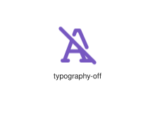
</div>
</div>

{{#endtab}}
{{#tab name="Code"}}

```xml
{{#include ../samples/icons/Tabler-Icons/typography-off-2829f94e.xal}}
```

{{#endtab}}
{{#endtabs}}

<div class="xal-ref-tag"><code>&lt;item id=&#34;104716&#34; /&gt;</code></div>

</div>
<div class="xal-ref-card">
<div class="xal-ref-title">typography</div>

{{#tabs name="svg-ref-4716"}}
{{#tab name="Preview"}}
<div class="xal-ref-preview">
<div>
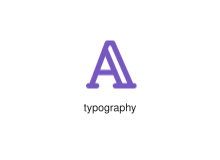
</div>
</div>

{{#endtab}}
{{#tab name="Code"}}

```xml
{{#include ../samples/icons/Tabler-Icons/typography-3b3e21dc.xal}}
```

{{#endtab}}
{{#endtabs}}

<div class="xal-ref-tag"><code>&lt;item id=&#34;104715&#34; /&gt;</code></div>

</div>
<div class="xal-ref-card">
<div class="xal-ref-title">u-turn-left</div>

{{#tabs name="svg-ref-4717"}}
{{#tab name="Preview"}}
<div class="xal-ref-preview">
<div>
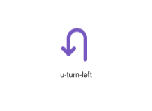
</div>
</div>

{{#endtab}}
{{#tab name="Code"}}

```xml
{{#include ../samples/icons/Tabler-Icons/u-turn-left-5340a635.xal}}
```

{{#endtab}}
{{#endtabs}}

<div class="xal-ref-tag"><code>&lt;item id=&#34;104717&#34; /&gt;</code></div>

</div>
<div class="xal-ref-card">
<div class="xal-ref-title">u-turn-right</div>

{{#tabs name="svg-ref-4718"}}
{{#tab name="Preview"}}
<div class="xal-ref-preview">
<div>

</div>
</div>

{{#endtab}}
{{#tab name="Code"}}

```xml
{{#include ../samples/icons/Tabler-Icons/u-turn-right-a82c3be5.xal}}
```

{{#endtab}}
{{#endtabs}}

<div class="xal-ref-tag"><code>&lt;item id=&#34;104718&#34; /&gt;</code></div>

</div>
<div class="xal-ref-card">
<div class="xal-ref-title">ufo-off</div>

{{#tabs name="svg-ref-4719"}}
{{#tab name="Preview"}}
<div class="xal-ref-preview">
<div>

</div>
</div>

{{#endtab}}
{{#tab name="Code"}}

```xml
{{#include ../samples/icons/Tabler-Icons/ufo-off-47d7841f.xal}}
```

{{#endtab}}
{{#endtabs}}

<div class="xal-ref-tag"><code>&lt;item id=&#34;104720&#34; /&gt;</code></div>

</div>
<div class="xal-ref-card">
<div class="xal-ref-title">ufo</div>

{{#tabs name="svg-ref-4720"}}
{{#tab name="Preview"}}
<div class="xal-ref-preview">
<div>

</div>
</div>

{{#endtab}}
{{#tab name="Code"}}

```xml
{{#include ../samples/icons/Tabler-Icons/ufo-893a1a9b.xal}}
```

{{#endtab}}
{{#endtabs}}

<div class="xal-ref-tag"><code>&lt;item id=&#34;104719&#34; /&gt;</code></div>

</div>
<div class="xal-ref-card">
<div class="xal-ref-title">uhd</div>

{{#tabs name="svg-ref-4721"}}
{{#tab name="Preview"}}
<div class="xal-ref-preview">
<div>

</div>
</div>

{{#endtab}}
{{#tab name="Code"}}

```xml
{{#include ../samples/icons/Tabler-Icons/uhd-c4e04afa.xal}}
```

{{#endtab}}
{{#endtabs}}

<div class="xal-ref-tag"><code>&lt;item id=&#34;104721&#34; /&gt;</code></div>

</div>
<div class="xal-ref-card">
<div class="xal-ref-title">umbrella-2</div>

{{#tabs name="svg-ref-4722"}}
{{#tab name="Preview"}}
<div class="xal-ref-preview">
<div>
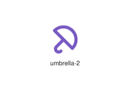
</div>
</div>

{{#endtab}}
{{#tab name="Code"}}

```xml
{{#include ../samples/icons/Tabler-Icons/umbrella-2-1d23cfbb.xal}}
```

{{#endtab}}
{{#endtabs}}

<div class="xal-ref-tag"><code>&lt;item id=&#34;104723&#34; /&gt;</code></div>

</div>
<div class="xal-ref-card">
<div class="xal-ref-title">umbrella-closed-2</div>

{{#tabs name="svg-ref-4723"}}
{{#tab name="Preview"}}
<div class="xal-ref-preview">
<div>
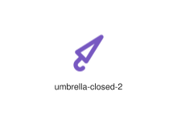
</div>
</div>

{{#endtab}}
{{#tab name="Code"}}

```xml
{{#include ../samples/icons/Tabler-Icons/umbrella-closed-2-c4ab96bd.xal}}
```

{{#endtab}}
{{#endtabs}}

<div class="xal-ref-tag"><code>&lt;item id=&#34;104725&#34; /&gt;</code></div>

</div>
<div class="xal-ref-card">
<div class="xal-ref-title">umbrella-closed</div>

{{#tabs name="svg-ref-4724"}}
{{#tab name="Preview"}}
<div class="xal-ref-preview">
<div>
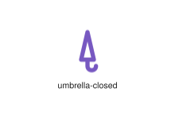
</div>
</div>

{{#endtab}}
{{#tab name="Code"}}

```xml
{{#include ../samples/icons/Tabler-Icons/umbrella-closed-08713dd0.xal}}
```

{{#endtab}}
{{#endtabs}}

<div class="xal-ref-tag"><code>&lt;item id=&#34;104724&#34; /&gt;</code></div>

</div>
<div class="xal-ref-card">
<div class="xal-ref-title">umbrella-off</div>

{{#tabs name="svg-ref-4725"}}
{{#tab name="Preview"}}
<div class="xal-ref-preview">
<div>

</div>
</div>

{{#endtab}}
{{#tab name="Code"}}

```xml
{{#include ../samples/icons/Tabler-Icons/umbrella-off-fb1fb960.xal}}
```

{{#endtab}}
{{#endtabs}}

<div class="xal-ref-tag"><code>&lt;item id=&#34;104726&#34; /&gt;</code></div>

</div>
<div class="xal-ref-card">
<div class="xal-ref-title">umbrella</div>

{{#tabs name="svg-ref-4726"}}
{{#tab name="Preview"}}
<div class="xal-ref-preview">
<div>
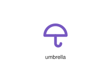
</div>
</div>

{{#endtab}}
{{#tab name="Code"}}

```xml
{{#include ../samples/icons/Tabler-Icons/umbrella-d552daa8.xal}}
```

{{#endtab}}
{{#endtabs}}

<div class="xal-ref-tag"><code>&lt;item id=&#34;104722&#34; /&gt;</code></div>

</div>
<div class="xal-ref-card">
<div class="xal-ref-title">underline</div>

{{#tabs name="svg-ref-4727"}}
{{#tab name="Preview"}}
<div class="xal-ref-preview">
<div>
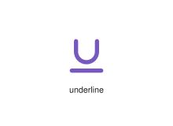
</div>
</div>

{{#endtab}}
{{#tab name="Code"}}

```xml
{{#include ../samples/icons/Tabler-Icons/underline-abcc0d42.xal}}
```

{{#endtab}}
{{#endtabs}}

<div class="xal-ref-tag"><code>&lt;item id=&#34;104727&#34; /&gt;</code></div>

</div>
<div class="xal-ref-card">
<div class="xal-ref-title">universe</div>

{{#tabs name="svg-ref-4728"}}
{{#tab name="Preview"}}
<div class="xal-ref-preview">
<div>
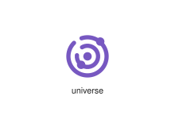
</div>
</div>

{{#endtab}}
{{#tab name="Code"}}

```xml
{{#include ../samples/icons/Tabler-Icons/universe-d95de74f.xal}}
```

{{#endtab}}
{{#endtabs}}

<div class="xal-ref-tag"><code>&lt;item id=&#34;104728&#34; /&gt;</code></div>

</div>
<div class="xal-ref-card">
<div class="xal-ref-title">unlink</div>

{{#tabs name="svg-ref-4729"}}
{{#tab name="Preview"}}
<div class="xal-ref-preview">
<div>

</div>
</div>

{{#endtab}}
{{#tab name="Code"}}

```xml
{{#include ../samples/icons/Tabler-Icons/unlink-f1fdeaac.xal}}
```

{{#endtab}}
{{#endtabs}}

<div class="xal-ref-tag"><code>&lt;item id=&#34;104729&#34; /&gt;</code></div>

</div>
<div class="xal-ref-card">
<div class="xal-ref-title">upload</div>

{{#tabs name="svg-ref-4730"}}
{{#tab name="Preview"}}
<div class="xal-ref-preview">
<div>

</div>
</div>

{{#endtab}}
{{#tab name="Code"}}

```xml
{{#include ../samples/icons/Tabler-Icons/upload-85296371.xal}}
```

{{#endtab}}
{{#endtabs}}

<div class="xal-ref-tag"><code>&lt;item id=&#34;104730&#34; /&gt;</code></div>

</div>
<div class="xal-ref-card">
<div class="xal-ref-title">urgent</div>

{{#tabs name="svg-ref-4731"}}
{{#tab name="Preview"}}
<div class="xal-ref-preview">
<div>

</div>
</div>

{{#endtab}}
{{#tab name="Code"}}

```xml
{{#include ../samples/icons/Tabler-Icons/urgent-c3732db8.xal}}
```

{{#endtab}}
{{#endtabs}}

<div class="xal-ref-tag"><code>&lt;item id=&#34;104731&#34; /&gt;</code></div>

</div>
<div class="xal-ref-card">
<div class="xal-ref-title">usb</div>

{{#tabs name="svg-ref-4732"}}
{{#tab name="Preview"}}
<div class="xal-ref-preview">
<div>
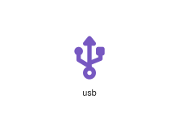
</div>
</div>

{{#endtab}}
{{#tab name="Code"}}

```xml
{{#include ../samples/icons/Tabler-Icons/usb-22b14d02.xal}}
```

{{#endtab}}
{{#endtabs}}

<div class="xal-ref-tag"><code>&lt;item id=&#34;104732&#34; /&gt;</code></div>

</div>
<div class="xal-ref-card">
<div class="xal-ref-title">user-bitcoin</div>

{{#tabs name="svg-ref-4733"}}
{{#tab name="Preview"}}
<div class="xal-ref-preview">
<div>

</div>
</div>

{{#endtab}}
{{#tab name="Code"}}

```xml
{{#include ../samples/icons/Tabler-Icons/user-bitcoin-ae959b23.xal}}
```

{{#endtab}}
{{#endtabs}}

<div class="xal-ref-tag"><code>&lt;item id=&#34;104734&#34; /&gt;</code></div>

</div>
<div class="xal-ref-card">
<div class="xal-ref-title">user-bolt</div>

{{#tabs name="svg-ref-4734"}}
{{#tab name="Preview"}}
<div class="xal-ref-preview">
<div>
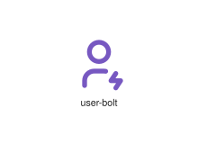
</div>
</div>

{{#endtab}}
{{#tab name="Code"}}

```xml
{{#include ../samples/icons/Tabler-Icons/user-bolt-f67e1297.xal}}
```

{{#endtab}}
{{#endtabs}}

<div class="xal-ref-tag"><code>&lt;item id=&#34;104735&#34; /&gt;</code></div>

</div>
<div class="xal-ref-card">
<div class="xal-ref-title">user-cancel</div>

{{#tabs name="svg-ref-4735"}}
{{#tab name="Preview"}}
<div class="xal-ref-preview">
<div>

</div>
</div>

{{#endtab}}
{{#tab name="Code"}}

```xml
{{#include ../samples/icons/Tabler-Icons/user-cancel-73366013.xal}}
```

{{#endtab}}
{{#endtabs}}

<div class="xal-ref-tag"><code>&lt;item id=&#34;104736&#34; /&gt;</code></div>

</div>
<div class="xal-ref-card">
<div class="xal-ref-title">user-check</div>

{{#tabs name="svg-ref-4736"}}
{{#tab name="Preview"}}
<div class="xal-ref-preview">
<div>

</div>
</div>

{{#endtab}}
{{#tab name="Code"}}

```xml
{{#include ../samples/icons/Tabler-Icons/user-check-05dae894.xal}}
```

{{#endtab}}
{{#endtabs}}

<div class="xal-ref-tag"><code>&lt;item id=&#34;104737&#34; /&gt;</code></div>

</div>
<div class="xal-ref-card">
<div class="xal-ref-title">user-circle</div>

{{#tabs name="svg-ref-4737"}}
{{#tab name="Preview"}}
<div class="xal-ref-preview">
<div>

</div>
</div>

{{#endtab}}
{{#tab name="Code"}}

```xml
{{#include ../samples/icons/Tabler-Icons/user-circle-c9e5d5d6.xal}}
```

{{#endtab}}
{{#endtabs}}

<div class="xal-ref-tag"><code>&lt;item id=&#34;104738&#34; /&gt;</code></div>

</div>
<div class="xal-ref-card">
<div class="xal-ref-title">user-code</div>

{{#tabs name="svg-ref-4738"}}
{{#tab name="Preview"}}
<div class="xal-ref-preview">
<div>

</div>
</div>

{{#endtab}}
{{#tab name="Code"}}

```xml
{{#include ../samples/icons/Tabler-Icons/user-code-8b072e56.xal}}
```

{{#endtab}}
{{#endtabs}}

<div class="xal-ref-tag"><code>&lt;item id=&#34;104739&#34; /&gt;</code></div>

</div>
<div class="xal-ref-card">
<div class="xal-ref-title">user-cog</div>

{{#tabs name="svg-ref-4739"}}
{{#tab name="Preview"}}
<div class="xal-ref-preview">
<div>

</div>
</div>

{{#endtab}}
{{#tab name="Code"}}

```xml
{{#include ../samples/icons/Tabler-Icons/user-cog-ceea00a3.xal}}
```

{{#endtab}}
{{#endtabs}}

<div class="xal-ref-tag"><code>&lt;item id=&#34;104740&#34; /&gt;</code></div>

</div>
<div class="xal-ref-card">
<div class="xal-ref-title">user-dollar</div>

{{#tabs name="svg-ref-4740"}}
{{#tab name="Preview"}}
<div class="xal-ref-preview">
<div>

</div>
</div>

{{#endtab}}
{{#tab name="Code"}}

```xml
{{#include ../samples/icons/Tabler-Icons/user-dollar-a904bc99.xal}}
```

{{#endtab}}
{{#endtabs}}

<div class="xal-ref-tag"><code>&lt;item id=&#34;104741&#34; /&gt;</code></div>

</div>
<div class="xal-ref-card">
<div class="xal-ref-title">user-down</div>

{{#tabs name="svg-ref-4741"}}
{{#tab name="Preview"}}
<div class="xal-ref-preview">
<div>

</div>
</div>

{{#endtab}}
{{#tab name="Code"}}

```xml
{{#include ../samples/icons/Tabler-Icons/user-down-7350666b.xal}}
```

{{#endtab}}
{{#endtabs}}

<div class="xal-ref-tag"><code>&lt;item id=&#34;104742&#34; /&gt;</code></div>

</div>
<div class="xal-ref-card">
<div class="xal-ref-title">user-edit</div>

{{#tabs name="svg-ref-4742"}}
{{#tab name="Preview"}}
<div class="xal-ref-preview">
<div>

</div>
</div>

{{#endtab}}
{{#tab name="Code"}}

```xml
{{#include ../samples/icons/Tabler-Icons/user-edit-ae71dec7.xal}}
```

{{#endtab}}
{{#endtabs}}

<div class="xal-ref-tag"><code>&lt;item id=&#34;104743&#34; /&gt;</code></div>

</div>
<div class="xal-ref-card">
<div class="xal-ref-title">user-exclamation</div>

{{#tabs name="svg-ref-4743"}}
{{#tab name="Preview"}}
<div class="xal-ref-preview">
<div>

</div>
</div>

{{#endtab}}
{{#tab name="Code"}}

```xml
{{#include ../samples/icons/Tabler-Icons/user-exclamation-92cde810.xal}}
```

{{#endtab}}
{{#endtabs}}

<div class="xal-ref-tag"><code>&lt;item id=&#34;104744&#34; /&gt;</code></div>

</div>
<div class="xal-ref-card">
<div class="xal-ref-title">user-heart</div>

{{#tabs name="svg-ref-4744"}}
{{#tab name="Preview"}}
<div class="xal-ref-preview">
<div>

</div>
</div>

{{#endtab}}
{{#tab name="Code"}}

```xml
{{#include ../samples/icons/Tabler-Icons/user-heart-c2ff96e6.xal}}
```

{{#endtab}}
{{#endtabs}}

<div class="xal-ref-tag"><code>&lt;item id=&#34;104745&#34; /&gt;</code></div>

</div>
<div class="xal-ref-card">
<div class="xal-ref-title">user-hexagon</div>

{{#tabs name="svg-ref-4745"}}
{{#tab name="Preview"}}
<div class="xal-ref-preview">
<div>

</div>
</div>

{{#endtab}}
{{#tab name="Code"}}

```xml
{{#include ../samples/icons/Tabler-Icons/user-hexagon-17a17a3a.xal}}
```

{{#endtab}}
{{#endtabs}}

<div class="xal-ref-tag"><code>&lt;item id=&#34;104746&#34; /&gt;</code></div>

</div>
<div class="xal-ref-card">
<div class="xal-ref-title">user-minus</div>

{{#tabs name="svg-ref-4746"}}
{{#tab name="Preview"}}
<div class="xal-ref-preview">
<div>

</div>
</div>

{{#endtab}}
{{#tab name="Code"}}

```xml
{{#include ../samples/icons/Tabler-Icons/user-minus-86aa5aa7.xal}}
```

{{#endtab}}
{{#endtabs}}

<div class="xal-ref-tag"><code>&lt;item id=&#34;104747&#34; /&gt;</code></div>

</div>
<div class="xal-ref-card">
<div class="xal-ref-title">user-off</div>

{{#tabs name="svg-ref-4747"}}
{{#tab name="Preview"}}
<div class="xal-ref-preview">
<div>
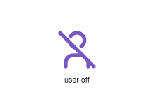
</div>
</div>

{{#endtab}}
{{#tab name="Code"}}

```xml
{{#include ../samples/icons/Tabler-Icons/user-off-132512af.xal}}
```

{{#endtab}}
{{#endtabs}}

<div class="xal-ref-tag"><code>&lt;item id=&#34;104748&#34; /&gt;</code></div>

</div>
<div class="xal-ref-card">
<div class="xal-ref-title">user-pause</div>

{{#tabs name="svg-ref-4748"}}
{{#tab name="Preview"}}
<div class="xal-ref-preview">
<div>

</div>
</div>

{{#endtab}}
{{#tab name="Code"}}

```xml
{{#include ../samples/icons/Tabler-Icons/user-pause-54e0ad3f.xal}}
```

{{#endtab}}
{{#endtabs}}

<div class="xal-ref-tag"><code>&lt;item id=&#34;104749&#34; /&gt;</code></div>

</div>
<div class="xal-ref-card">
<div class="xal-ref-title">user-pentagon</div>

{{#tabs name="svg-ref-4749"}}
{{#tab name="Preview"}}
<div class="xal-ref-preview">
<div>

</div>
</div>

{{#endtab}}
{{#tab name="Code"}}

```xml
{{#include ../samples/icons/Tabler-Icons/user-pentagon-0b66f4a5.xal}}
```

{{#endtab}}
{{#endtabs}}

<div class="xal-ref-tag"><code>&lt;item id=&#34;104750&#34; /&gt;</code></div>

</div>
<div class="xal-ref-card">
<div class="xal-ref-title">user-pin</div>

{{#tabs name="svg-ref-4750"}}
{{#tab name="Preview"}}
<div class="xal-ref-preview">
<div>

</div>
</div>

{{#endtab}}
{{#tab name="Code"}}

```xml
{{#include ../samples/icons/Tabler-Icons/user-pin-4395079c.xal}}
```

{{#endtab}}
{{#endtabs}}

<div class="xal-ref-tag"><code>&lt;item id=&#34;104751&#34; /&gt;</code></div>

</div>
<div class="xal-ref-card">
<div class="xal-ref-title">user-plus</div>

{{#tabs name="svg-ref-4751"}}
{{#tab name="Preview"}}
<div class="xal-ref-preview">
<div>

</div>
</div>

{{#endtab}}
{{#tab name="Code"}}

```xml
{{#include ../samples/icons/Tabler-Icons/user-plus-6ff1b11f.xal}}
```

{{#endtab}}
{{#endtabs}}

<div class="xal-ref-tag"><code>&lt;item id=&#34;104752&#34; /&gt;</code></div>

</div>
<div class="xal-ref-card">
<div class="xal-ref-title">user-question</div>

{{#tabs name="svg-ref-4752"}}
{{#tab name="Preview"}}
<div class="xal-ref-preview">
<div>

</div>
</div>

{{#endtab}}
{{#tab name="Code"}}

```xml
{{#include ../samples/icons/Tabler-Icons/user-question-c6d0ae2d.xal}}
```

{{#endtab}}
{{#endtabs}}

<div class="xal-ref-tag"><code>&lt;item id=&#34;104753&#34; /&gt;</code></div>

</div>
<div class="xal-ref-card">
<div class="xal-ref-title">user-scan</div>

{{#tabs name="svg-ref-4753"}}
{{#tab name="Preview"}}
<div class="xal-ref-preview">
<div>

</div>
</div>

{{#endtab}}
{{#tab name="Code"}}

```xml
{{#include ../samples/icons/Tabler-Icons/user-scan-1701d5ab.xal}}
```

{{#endtab}}
{{#endtabs}}

<div class="xal-ref-tag"><code>&lt;item id=&#34;104754&#34; /&gt;</code></div>

</div>
<div class="xal-ref-card">
<div class="xal-ref-title">user-screen</div>

{{#tabs name="svg-ref-4754"}}
{{#tab name="Preview"}}
<div class="xal-ref-preview">
<div>

</div>
</div>

{{#endtab}}
{{#tab name="Code"}}

```xml
{{#include ../samples/icons/Tabler-Icons/user-screen-486a8b43.xal}}
```

{{#endtab}}
{{#endtabs}}

<div class="xal-ref-tag"><code>&lt;item id=&#34;104755&#34; /&gt;</code></div>

</div>
<div class="xal-ref-card">
<div class="xal-ref-title">user-search</div>

{{#tabs name="svg-ref-4755"}}
{{#tab name="Preview"}}
<div class="xal-ref-preview">
<div>

</div>
</div>

{{#endtab}}
{{#tab name="Code"}}

```xml
{{#include ../samples/icons/Tabler-Icons/user-search-322470fc.xal}}
```

{{#endtab}}
{{#endtabs}}

<div class="xal-ref-tag"><code>&lt;item id=&#34;104756&#34; /&gt;</code></div>

</div>
<div class="xal-ref-card">
<div class="xal-ref-title">user-share</div>

{{#tabs name="svg-ref-4756"}}
{{#tab name="Preview"}}
<div class="xal-ref-preview">
<div>

</div>
</div>

{{#endtab}}
{{#tab name="Code"}}

```xml
{{#include ../samples/icons/Tabler-Icons/user-share-2aefe1a9.xal}}
```

{{#endtab}}
{{#endtabs}}

<div class="xal-ref-tag"><code>&lt;item id=&#34;104757&#34; /&gt;</code></div>

</div>
<div class="xal-ref-card">
<div class="xal-ref-title">user-shield</div>

{{#tabs name="svg-ref-4757"}}
{{#tab name="Preview"}}
<div class="xal-ref-preview">
<div>

</div>
</div>

{{#endtab}}
{{#tab name="Code"}}

```xml
{{#include ../samples/icons/Tabler-Icons/user-shield-8651718a.xal}}
```

{{#endtab}}
{{#endtabs}}

<div class="xal-ref-tag"><code>&lt;item id=&#34;104758&#34; /&gt;</code></div>

</div>
<div class="xal-ref-card">
<div class="xal-ref-title">user-square-rounded</div>

{{#tabs name="svg-ref-4758"}}
{{#tab name="Preview"}}
<div class="xal-ref-preview">
<div>
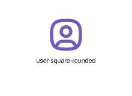
</div>
</div>

{{#endtab}}
{{#tab name="Code"}}

```xml
{{#include ../samples/icons/Tabler-Icons/user-square-rounded-04f45a09.xal}}
```

{{#endtab}}
{{#endtabs}}

<div class="xal-ref-tag"><code>&lt;item id=&#34;104760&#34; /&gt;</code></div>

</div>
<div class="xal-ref-card">
<div class="xal-ref-title">user-square</div>

{{#tabs name="svg-ref-4759"}}
{{#tab name="Preview"}}
<div class="xal-ref-preview">
<div>
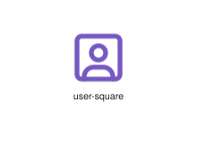
</div>
</div>

{{#endtab}}
{{#tab name="Code"}}

```xml
{{#include ../samples/icons/Tabler-Icons/user-square-5dd5cf8c.xal}}
```

{{#endtab}}
{{#endtabs}}

<div class="xal-ref-tag"><code>&lt;item id=&#34;104759&#34; /&gt;</code></div>

</div>
<div class="xal-ref-card">
<div class="xal-ref-title">user-star</div>

{{#tabs name="svg-ref-4760"}}
{{#tab name="Preview"}}
<div class="xal-ref-preview">
<div>

</div>
</div>

{{#endtab}}
{{#tab name="Code"}}

```xml
{{#include ../samples/icons/Tabler-Icons/user-star-10680d68.xal}}
```

{{#endtab}}
{{#endtabs}}

<div class="xal-ref-tag"><code>&lt;item id=&#34;104761&#34; /&gt;</code></div>

</div>
<div class="xal-ref-card">
<div class="xal-ref-title">user-up</div>

{{#tabs name="svg-ref-4761"}}
{{#tab name="Preview"}}
<div class="xal-ref-preview">
<div>

</div>
</div>

{{#endtab}}
{{#tab name="Code"}}

```xml
{{#include ../samples/icons/Tabler-Icons/user-up-260ed300.xal}}
```

{{#endtab}}
{{#endtabs}}

<div class="xal-ref-tag"><code>&lt;item id=&#34;104762&#34; /&gt;</code></div>

</div>
<div class="xal-ref-card">
<div class="xal-ref-title">user-x</div>

{{#tabs name="svg-ref-4762"}}
{{#tab name="Preview"}}
<div class="xal-ref-preview">
<div>

</div>
</div>

{{#endtab}}
{{#tab name="Code"}}

```xml
{{#include ../samples/icons/Tabler-Icons/user-x-78680905.xal}}
```

{{#endtab}}
{{#endtabs}}

<div class="xal-ref-tag"><code>&lt;item id=&#34;104763&#34; /&gt;</code></div>

</div>
<div class="xal-ref-card">
<div class="xal-ref-title">user</div>

{{#tabs name="svg-ref-4763"}}
{{#tab name="Preview"}}
<div class="xal-ref-preview">
<div>
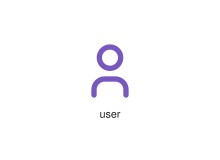
</div>
</div>

{{#endtab}}
{{#tab name="Code"}}

```xml
{{#include ../samples/icons/Tabler-Icons/user-636befe1.xal}}
```

{{#endtab}}
{{#endtabs}}

<div class="xal-ref-tag"><code>&lt;item id=&#34;104733&#34; /&gt;</code></div>

</div>
<div class="xal-ref-card">
<div class="xal-ref-title">users-group</div>

{{#tabs name="svg-ref-4764"}}
{{#tab name="Preview"}}
<div class="xal-ref-preview">
<div>

</div>
</div>

{{#endtab}}
{{#tab name="Code"}}

```xml
{{#include ../samples/icons/Tabler-Icons/users-group-e0e5eea0.xal}}
```

{{#endtab}}
{{#endtabs}}

<div class="xal-ref-tag"><code>&lt;item id=&#34;104765&#34; /&gt;</code></div>

</div>
<div class="xal-ref-card">
<div class="xal-ref-title">users-minus</div>

{{#tabs name="svg-ref-4765"}}
{{#tab name="Preview"}}
<div class="xal-ref-preview">
<div>

</div>
</div>

{{#endtab}}
{{#tab name="Code"}}

```xml
{{#include ../samples/icons/Tabler-Icons/users-minus-b5cd3827.xal}}
```

{{#endtab}}
{{#endtabs}}

<div class="xal-ref-tag"><code>&lt;item id=&#34;104766&#34; /&gt;</code></div>

</div>
<div class="xal-ref-card">
<div class="xal-ref-title">users-plus</div>

{{#tabs name="svg-ref-4766"}}
{{#tab name="Preview"}}
<div class="xal-ref-preview">
<div>

</div>
</div>

{{#endtab}}
{{#tab name="Code"}}

```xml
{{#include ../samples/icons/Tabler-Icons/users-plus-0b8ed472.xal}}
```

{{#endtab}}
{{#endtabs}}

<div class="xal-ref-tag"><code>&lt;item id=&#34;104767&#34; /&gt;</code></div>

</div>
<div class="xal-ref-card">
<div class="xal-ref-title">users</div>

{{#tabs name="svg-ref-4767"}}
{{#tab name="Preview"}}
<div class="xal-ref-preview">
<div>
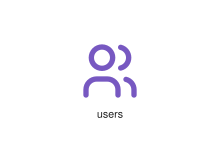
</div>
</div>

{{#endtab}}
{{#tab name="Code"}}

```xml
{{#include ../samples/icons/Tabler-Icons/users-7a4c9f89.xal}}
```

{{#endtab}}
{{#endtabs}}

<div class="xal-ref-tag"><code>&lt;item id=&#34;104764&#34; /&gt;</code></div>

</div>
<div class="xal-ref-card">
<div class="xal-ref-title">uv-index</div>

{{#tabs name="svg-ref-4768"}}
{{#tab name="Preview"}}
<div class="xal-ref-preview">
<div>

</div>
</div>

{{#endtab}}
{{#tab name="Code"}}

```xml
{{#include ../samples/icons/Tabler-Icons/uv-index-3ddbefac.xal}}
```

{{#endtab}}
{{#endtabs}}

<div class="xal-ref-tag"><code>&lt;item id=&#34;104768&#34; /&gt;</code></div>

</div>
<div class="xal-ref-card">
<div class="xal-ref-title">ux-circle</div>

{{#tabs name="svg-ref-4769"}}
{{#tab name="Preview"}}
<div class="xal-ref-preview">
<div>

</div>
</div>

{{#endtab}}
{{#tab name="Code"}}

```xml
{{#include ../samples/icons/Tabler-Icons/ux-circle-46ee1383.xal}}
```

{{#endtab}}
{{#endtabs}}

<div class="xal-ref-tag"><code>&lt;item id=&#34;104769&#34; /&gt;</code></div>

</div>
</div>
